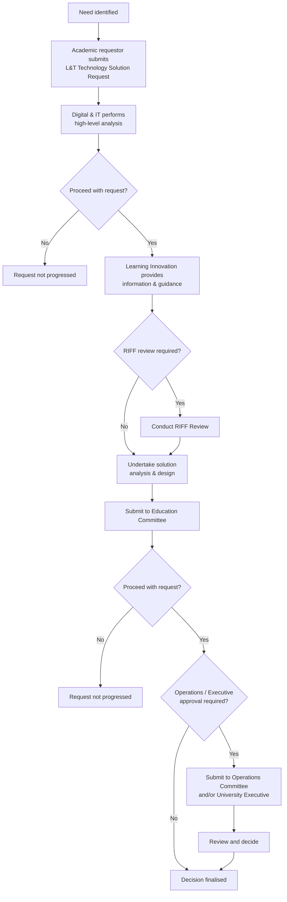

# L&T Technology Solution Governance Process — the RIFF Review

**The University of Funk** | Foundation artifact | *fictional demonstration document*

All requests for new or changed learning & teaching technology follow this process.
The central gate is the **RIFF Review** — *Review of Innovation, Fit & Function* —
which assesses solution requests for architectural fit, capability duplication,
integration impact and total cost before any procurement or build proceeds.

## Process flow

## Roles

| Role | Responsibility |
|------|----------------|
| **Academic requestor** | Identifies the need; submits the solution request |
| **Digital & IT** | High-level analysis; technical feasibility; integration impact |
| **Learning Innovation** | Guidance to requestors; pedagogical fit; RIFF review facilitation |
| **Education Committee** | Academic approval of solution requests |
| **Operations Committee / University Executive** | Financial and strategic approval where thresholds are exceeded |

## Rules

- Business case submissions include the RIFF review as supporting documentation.
- A request may be paused or closed without progressing further, with the agreement of
  key consulting stakeholders, if it is deemed not to be required.
- Solutions duplicating capability already licensed (per the system landscape map) must
  justify why the incumbent tool is unsuitable.
