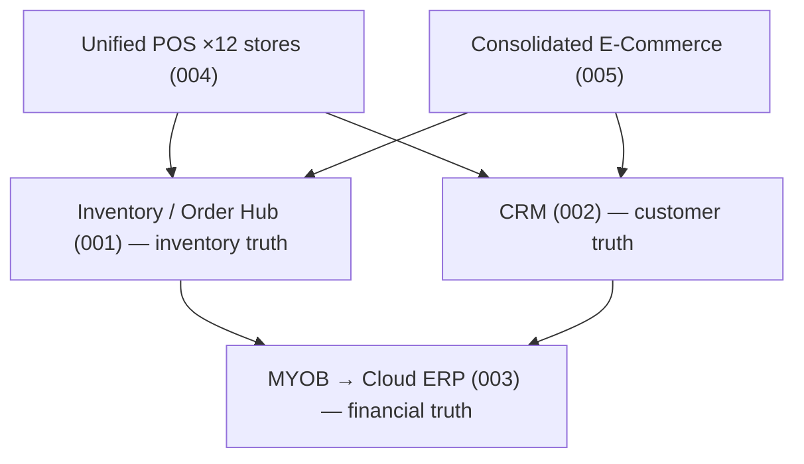

# Portfolio Roadmap & Sequencing: Spoke & Rim Digital Transformation

> **Template Origin**: Custom (portfolio synthesis) | **ArcKit Version**: 5.15.1 | **Command**: `/arckit:roadmap`

## Document Control

| Field | Value |
|-------|-------|
| **Document ID** | ARC-000-PORT-v1.0 |
| **Document Type** | Portfolio Roadmap & Sequencing |
| **Project** | Cross-project (000-global) |
| **Classification** | OFFICIAL |
| **Status** | DRAFT — FICTIONAL DEMONSTRATION |
| **Version** | 1.0 |
| **Created Date** | 2026-07-06 |
| **Last Modified** | 2026-07-06 |
| **Review Cycle** | Quarterly |
| **Next Review Date** | 2026-10-06 |
| **Owner** | Fred Flintstone, CEO — Executive Sponsor |
| **Reviewed By** | [PENDING] |
| **Approved By** | [PENDING] |
| **Distribution** | Executive team, project sponsors, solution architecture advisor |

## Revision History

| Version | Date | Author | Changes | Approved By | Approval Date |
|---------|------|--------|---------|-------------|---------------|
| 1.0 | 2026-07-06 | ArcKit AI | Initial portfolio roadmap across projects 001–005 | [PENDING] | [PENDING] |

---

## 1. Portfolio Overview

Five governed projects deliver the Spoke & Rim digital transformation. Each is
an ArcKit project with its own artefact chain; this document governs the
**dependencies, sequencing, and shared architectural decisions** between them.

| # | Project | Sponsor | GDS Phase (current) | Key artefacts |
|---|---------|---------|---------------------|---------------|
| 001 | Inventory & Warehouse Uplift | Wilma Flintstone (COO) | Beta (vendor selection) | STKE, REQ, RSCH, EVAL, ADR-001 |
| 002 | CRM & Customer 360 | Wilma Flintstone (COO) | Alpha | STKE, REQ, RSCH, ADR-001 |
| 003 | ERP Modernisation | Jane Jetson (Finance) | Discovery → Alpha | STKE, REQ, RSCH, ADR-001 |
| 004 | Retail POS Consolidation | Betty Rubble (GM Retail) | Alpha | STKE, REQ, RSCH, ADR-001 |
| 005 | E-Commerce Consolidation | George Jetson (Digital) | Alpha | STKE, REQ, RSCH, ADR-001 |

## 2. The portfolio's shared architectural spine

Three cross-project decisions shape everything:

1. **Inventory truth lives in the inventory/order hub** (Project 001). Every
   channel — POS, e-commerce, B2B portal — is a *spoke* of that hub. No project
   may introduce a second inventory master. (Constrains 004, 005.)
2. **MYOB AccountRight remains the accounting system of record for now**
   (ARC-001-ADR-001), but Project 003 defines the supersession path to a cloud
   ERP. Until cutover, all projects integrate to MYOB *via the hub*, never
   directly. (Constrains 002, 004, 005; superseded in a controlled way by 003.)
3. **Customer identity lives in the CRM** (Project 002, ADR pending approval).
   POS loyalty (004) and e-commerce accounts (005) consume the CRM's customer
   master; they do not create parallel customer databases.

## 3. Sequencing & dependencies

| Dependency | Direction | Rationale |
|---|---|---|
| 001 → 004 | Hard | POS cannot go live chain-wide until the hub is the inventory master; interim stores integrate read-only |
| 001 → 005 | Hard | Consolidated e-commerce must take availability from the hub, not per-store stock |
| 002 → 004 | Soft | POS loyalty launches against the CRM customer master; a phased loyalty migration is acceptable |
| 002 → 005 | Soft | Unified customer accounts across storefronts require the CRM identity model |
| 003 ↔ all | Governed | ERP cutover is sequenced *last*; all integrations built hub-first so re-pointing MYOB → ERP is a contained change |

**Indicative phasing (FY27):**

- **Q1** — 001 pilot completes; 002 CRM vendor selected; 004 POS evaluation.
- **Q2** — 002 CRM live for wholesale accounts; 004 POS pilot (2 stores).
- **Q3** — 004 POS rollout (12 stores); 005 e-commerce re-platform begins.
- **Q4** — 005 consolidated storefronts live; 003 ERP implementation starts.
- **FY28 Q1–Q2** — 003 ERP cutover; ARC-001-ADR-001 formally superseded.

## 4. Portfolio risks (top 5)

| ID | Risk | Projects | Mitigation |
|---|---|---|---|
| PR-1 | Change saturation — 160 staff, 5 concurrent projects | All | Sequenced go-lives; one operational change per quarter per team |
| PR-2 | Integration sprawl — point-to-point connections bypassing the hub | 004, 005 | Gate in design reviews: hub-first integration principle (ARC-000-PRIN) |
| PR-3 | Customer data consolidation breaches Privacy Act obligations | 002 | PIA before any data migration (`/arckit-au:pia`); consent audit of Mailchimp list |
| PR-4 | POS contract renewal (Jun 2027) forces decision before evaluation completes | 004 | Evaluation locked to complete Q1 FY27; month-to-month bridge negotiated |
| PR-5 | ERP started too early, destabilising 001–005 integrations | 003 | Hard gate: ERP implementation cannot start before 004/005 go-live |

## 5. Traceability

Each project's artefacts trace to this roadmap and to the enterprise
architecture principles (`ARC-000-PRIN-v1.0`). Cross-project references use the
standard ArcKit ID scheme (`ARC-{project}-{TYPE}[-{seq}]-v{version}`).
