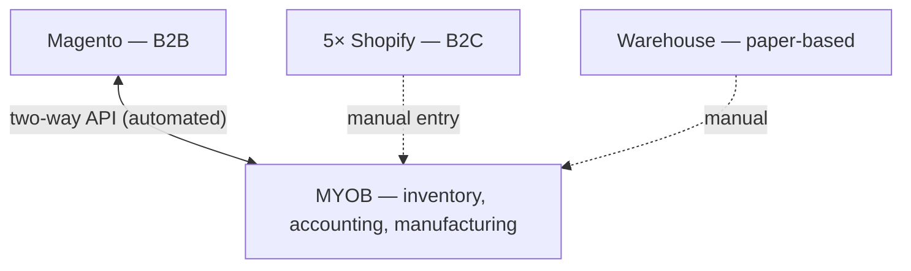
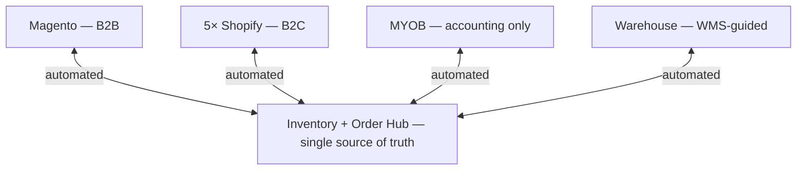

# Cycle Motion — Company Brief & Project Overview

## Date Created: 30/06/2026

### Inventory Rationalisation & Warehouse Management Systems Uplift

| | | | |
|---|---|---|---|
| **Prepared for** | Nathan, CEO — Cycle Motion | **Date** | 30 June 2026 |
| **Prepared by** | Enterprise Solution Architecture advisory | **Status** | Draft for discussion |
| **Subject** | Strategic IT uplift: inventory & warehouse management | **Version** | 0.2 (merged) |

> This document consolidates a verified company profile with the inventory and warehouse management project brief. **Part A** establishes who Cycle Motion is from public-record and digital-footprint research; **Part B** frames the systems problem, the core architectural decision, and a de-risked path forward.

---

# Part A — Company Brief

## A1. Entity snapshot (verified — ABR / ABN Lookup)

| | | | |
|---|---|---|---|
| **Entity** | Cycle Motion Pty Ltd | **ABN** | 80 162 266 604 |
| **ACN** | 162 266 604 | **Entity type** | Australian Private Company |
| **Status** | Active from 15 Feb 2013 | **GST** | Registered from 15 Feb 2013 |
| **Location** | WA 6090 (northern Perth) | **Business name** | Spoke and Rim (from Apr 2020) |

**Leadership:** Nathan (CEO).

*Directors, shareholding and financials are not on the public register — a paid ASIC company extract is required to verify ownership and solvency. The ABR record was last updated April 2020.*

## A2. Business overview

Cycle Motion is an Australian **manufacturer and distributor** trading across both **wholesale (B2B)** and **direct-to-consumer (B2C)** channels. Founded in 2013, it grew from a garage operation to a warehouse-and-office footprint in Perth. The business runs in-house manufacturing with bill-of-materials (BOM) requirements — consistent with its custom wheel-build line — and fulfils orders from a central warehouse.

Its public site (cyclemotion.com.au) presents as a **trade-only B2B portal** — login-gated, with the sole call-to-action aimed at Australian bike shops. The B2C presence is run separately through a set of brand storefronts (see A3). The registered business name *"Spoke and Rim"* (2020) is most likely a consumer/retail arm.

## A3. Brand portfolio & digital footprint

Cycle Motion operates as the **Australian distributor** for a cluster of performance cycling-tech and component brands — a coherent enthusiast / aftermarket niche rather than complete-bike volume. Several run on dedicated `.com.au` domains it appears to operate:

- **iGPSport** (cycling computers) · **CYCPLUS** (pumps/electronics) · **Farsports** (carbon wheels) · **Lewis** (hydraulic brakes)
- **Wheeltop** (electronic groupsets) · **XCADEY** (power meters) · **ezMTB**

**Platform footprint:** the B2B store runs on **Magento / Adobe Commerce** (a self-managed, mid-to-heavyweight commerce stack), the B2C stores on **Shopify**, and **MYOB** sits behind everything as the accounting, inventory and manufacturing system of record. These three platforms — and how they do (or don't) talk to each other — are the subject of Part B.

---

# Part B — Project Overview

## B1. Current systems landscape

| System | Role | Integration | Status |
|---|---|---|---|
| **MYOB** | Accounting, inventory, manufacturing | Central system of record | Doing everything; not built as a multichannel inventory engine |
| **Magento** | B2B store | Two-way API with MYOB (pricing/inventory out, orders in, product creation either way) | Automated and working |
| **Shopify ×5** | B2C stores | None — orders and inventory keyed into MYOB by hand | Manual, high-risk |
| **Warehouse** | Fulfilment | Paper-based; stock updated manually in MYOB | Manual, no system discipline |

**Read of the current state:** one channel is properly wired in, five are run by hand off paper, and the entire operation depends on MYOB being the inventory brain — a role it was not designed for.

## B2. Problem statement

The project has been framed internally as *"we need a warehouse management system (WMS)."* That is part of the picture, but not the whole of it. The deeper issue is a **fragmented systems architecture with no automated single source of inventory truth.**

Two pain points sit above the missing WMS in urgency and risk:

1. **Five manual Shopify stores.** Every B2C order is re-keyed into MYOB by hand — ongoing labour cost, data-entry errors, and critically, **oversell exposure** because stock is never synced in real time across channels.
2. **Inventory truth lives in MYOB.** A capable accounting platform, but not a multichannel inventory engine — it becomes the ceiling on scaling channels and order volume.

The paper-based warehouse is a real and legitimate problem — but solving it in isolation resolves neither issue above.

### Key operational risks

- **Oversell / stockout exposure** across the five unsynced B2C stores.
- **Manual re-keying** — labour cost and error rate that compound as volume grows.
- **No single source of truth** — channels can disagree on availability.
- **Key-person and scaling risk** in a manual, undocumented warehouse process.

## B3. Objectives & success criteria

**Objective:** establish a reliable, automated single source of inventory truth across all sales channels, with disciplined warehouse operations and minimal manual overhead.

**Success looks like:**

- A defined, agreed system of record for inventory.
- Real-time (or near-real-time) inventory sync across all storefronts, eliminating oversell.
- Automated order flow from every channel into accounting — no manual re-keying.
- Warehouse operations guided by a system (bins, directed picking, barcode scanning, stock counts).
- Manufacturing / BOM requirements preserved and supported.
- An architecture that scales with channel and volume growth.

## B4. The core architectural decision

Every downstream choice — including which products qualify and whether a new Magento connection is needed — hangs off one question:

> **Where should the single source of inventory truth live going forward?**

### Path 1 — Keep MYOB as the inventory master; add a WMS layer (lowest disruption)

A purpose-built, MYOB-native WMS (Datapel-style) handles bins, picking, put-away and warehouse discipline, writing stock movements and invoices back to MYOB. Magento continues to integrate with MYOB largely as today; a direct Magento-to-WMS connection may not be required.

- **Pros:** least disruptive, fastest to value, preserves the existing Magento integration, keeps the trusted system of record.
- **Cons:** does not by itself resolve the five manual Shopify stores (separate workstream needed); MYOB remains the scaling ceiling.

### Path 2 — Introduce an inventory / order hub as the master; demote MYOB to accounting (more strategic)

A dedicated inventory/order management platform becomes the system of record. All channels — Magento and all five Shopify stores — connect to the hub as spokes, and the hub feeds MYOB for accounting only.

- **Pros:** solves the warehouse gap, the manual Shopify entry, and the multichannel-truth problem in one architecture; genuine single source of truth; built to scale.
- **Cons:** larger change with real migration risk; the existing MYOB–Magento integration is reworked; implementation quality and vendor support become the principal risk.

## B5. Build vs buy position

**Recommendation: buy, do not build.**

A custom WMS build has been considered and is assessed as **high-risk, not low-risk** — the opposite of the "minimal risk" goal:

- WMS is a mature, commoditised category with proven products built specifically for this stack (MYOB-native and multichannel).
- A real WMS is deceptively deep: bins/locations, directed put-away, pick paths, wave/batch picking, barcode scanning, cycle counts, lot/serial/batch tracking, returns, multi-warehouse, carrier integration, and manufacturing BOMs — each its own project.
- A custom build means owning all maintenance, bugs and support indefinitely, plus a permanent treadmill of keeping pace with MYOB, Shopify, Magento and carrier API changes — and significant key-person risk.

**Principle:** build where you differentiate, buy where you don't. Warehouse picking is table stakes, not a competitive differentiator. Engineering effort should go to configuration and integration, where the real value and risk sit.

## B6. Vendor shortlist

| Vendor | Role | Strengths | Watch-outs |
|---|---|---|---|
| **Datapel** | MYOB-native WMS (Path 1) | Purpose-built MYOB add-on; two-way sync; bins/picking; BOM in Enterprise edition; fast implementation | Does not auto-solve Shopify; MYOB remains the inventory ceiling |
| **Unleashed** | Inventory/order hub (Path 2) | Strong BOM / manufacturing fit; multichannel connectors | Validate warehouse depth and Magento integration fit |
| **Cin7** | Inventory/order hub (Path 2) | Broad multichannel reach; large connector library; B2B + B2C | Reviews flag sync drops and support quality — reference-check thoroughly before committing |

## B7. Recommended approach & de-risking

A staged, evidence-led sequence:

1. **Confirm build vs buy** — buy (settled above).
2. **Decide the inventory source of truth** (Path 1 or Path 2) *before* evaluating any product. This is the gating decision.
3. **Quantify the operation** — SKU count, monthly order volume per channel, MYOB edition, must-have workflows (BOM, multi-location) — so vendors quote against reality.
4. **Pilot on one channel with real data** before any full cutover. Explicitly test the failure modes that break these integrations: **duplicate orders** and **oversell on simultaneous sales**.
5. **Reference-check vendor support specifically** — support quality is where these platforms live or die.
6. **Phase the rollout** — start with the pain bleeding most (likely the five manual Shopify stores) rather than a big-bang cutover.

**Plain recommendation:** Path 1 (Datapel-style) is the right low-risk move if the priority is warehouse discipline while keeping MYOB as the brain. Path 2 (a hub) is the stronger long-term answer if the goal is to fix the warehouse, the five manual stores, and multichannel truth in one architecture — at the cost of a larger, more carefully managed implementation.

## B8. Open questions / information required

> ⚠️ **Reconciliation flag:** the brief states **seven storefronts total** but enumerates one B2B + five B2C (six). Public research also found **seven distributed-brand domains** (iGPSport, CYCPLUS, Farsports, Lewis, Wheeltop, XCADEY, ezMTB) — so the live B2C store count may differ from five. Confirm the exact number and which brands have dedicated storefronts before scoping connectors, as this directly drives integration count and licensing.

To sharpen vendor analysis and finalise direction:

- [ ] Total **SKU count** and rough split across channels
- [ ] **Monthly order volume** per channel (B2B vs each B2C store)
- [ ] Current **MYOB edition** (e.g. AccountRight) and version
- [ ] Magento and Shopify versions / hosting
- [ ] Complexity of **manufacturing / BOM** (single vs multi-level assemblies)
- [ ] Number of warehouse locations / bins
- [ ] Budget envelope and target timeline
- [ ] Appetite for change: incremental (Path 1) vs transformational (Path 2)
- [ ] **Directors / ownership** (paid ASIC extract) and status of the "Spoke and Rim" entity — for completeness of the company record

## B9. Proposed next deliverables

- **Scored options comparison** — Datapel vs Unleashed vs Cin7, weighted against Cycle Motion's confirmed requirements.
- **Vendor discovery checklist** — a common question set so each vendor is assessed on equal terms.

---

*This brief is a working draft intended to frame the decision and align stakeholders. Figures and vendor positioning should be validated through the discovery and pilot steps above before any procurement commitment. Company-record facts are sourced from ABR/ABN Lookup and public web research.*
