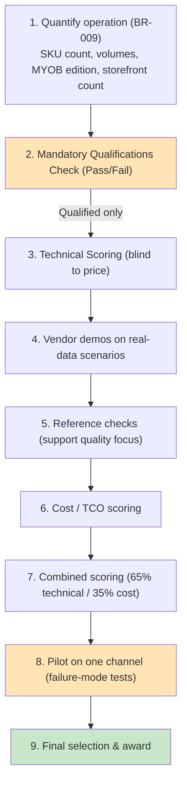

# Vendor Evaluation Criteria: Inventory & Warehouse Management Uplift

> **Template Origin**: Official | **ArcKit Version**: 5.15.1 | **Command**: `/arckit:evaluate`

## Document Control

| Field | Value |
|-------|-------|
| **Document ID** | ARC-001-EVAL-v1.0 |
| **Document Type** | Vendor Evaluation Framework |
| **Project** | Inventory & Warehouse Management Uplift (Project 001) |
| **Classification** | OFFICIAL |
| **Status** | DRAFT |
| **Version** | 1.0 |
| **Created Date** | 2026-06-30 |
| **Last Modified** | 2026-06-30 |
| **Review Date** | 2026-07-30 |
| **Owner** | Kirralee Dyke (COO, Cycle Motion) — Evaluation Lead |
| **Reviewed By** | [PENDING] |
| **Approved By** | [PENDING] |
| **Distribution** | Cycle Motion leadership (Nathan & Kirralee Dyke), solution architecture advisor |

## Revision History

| Version | Date | Author | Changes | Approved By | Approval Date |
|---------|------|--------|---------|-------------|---------------|
| 1.0 | 2026-06-30 | ArcKit AI | Initial creation from `/arckit:evaluate` command | [PENDING] | [PENDING] |

## Document Purpose

This document defines the criteria, scoring methodology, and process for evaluating **commercial inventory / warehouse management products** (and their implementation partners) for Cycle Motion's uplift. It is tailored for a **product selection** (buy, not build — BR-006) by a small business, not a custom-development services RFP. It operationalises the requirements (`ARC-001-REQ-v1.0`), the architecture principles (`ARC-000-PRIN-v1.0`), and ADR-001 (MYOB AccountRight retained), and draws candidate evidence from the research (`ARC-001-RSCH-v1.0`).

---

## 1. Evaluation Overview

### 1.1 Purpose

Select the inventory/WMS product that best delivers a single source of inventory truth, eliminates manual re-keying and oversell, supports manufacturing/BOM, and integrates cleanly with MYOB AccountRight — at a total cost of ownership appropriate to a small business, with dependable support.

### 1.2 Scope of Candidates

Per **ADR-001**, the accounting system is fixed (MYOB AccountRight). Candidates must be **MYOB-compatible inventory/WMS products**:

- **Path 1 (MYOB-native — preferred on integration risk)**: Datapel, Ostendo
- **Path 2 (inventory hub + MYOB as accounting via middleware)**: Unleashed, Cin7

**Excluded by ADR-001** (change the accounting platform): MYOB Acumatica (Path 4), Odoo and ERPNext as accounting replacements (Path 3). **Complementary, not competing** (not scored here): Starshipit (carrier/shipping) — a constant across all options.

### 1.3 Evaluation Principles

- **Objective**: criteria measurable and consistently applied.
- **Evidence-based**: every score justified, referencing requirement IDs and vendor evidence (pilot, references, demos).
- **Risk-weighted**: integration risk and support reliability weighted heavily, reflecting the brief's warning that these platforms "live or die" on support.
- **Value-based**: best value for a small business, not merely lowest price.

### 1.4 Evaluation Team

| Name | Role | Evaluation Focus |
|------|------|------------------|
| Kirralee Dyke (COO) | Evaluation Lead | Operational/functional fit, process, final scoring |
| Chris McKelt (Advisor) | Technical Evaluator | Integration architecture, idempotent sync, security |
| Nathan Dyke (CEO) | Decision Authority | Cost, value, strategic fit, final selection |
| Order & Supply Chain rep | Business Evaluator | Usability, day-to-day fit, exceptions handling |

### 1.5 Conflict of Interest

Each evaluator must disclose any personal/financial relationship with a candidate vendor or implementation partner and recuse from that vendor's scoring if a conflict exists.

---

## 2. Evaluation Process

### 2.1 Process Flow

> **Note**: Unusually for procurement, a **pilot precedes final award** (BR-007) — the failure-mode test (duplicate orders, oversell on simultaneous sale) is a go/no-go gate, not a post-award nicety.

### 2.2 Timeline (indicative)

| Phase | Duration | Responsible |
|-------|----------|-------------|
| Quantify operation (BR-009) | 1–2 weeks | COO |
| Mandatory qualifications check | 2 days | Advisor |
| Technical scoring + demos | 1–2 weeks | Eval team |
| Reference checks | 1 week | Advisor |
| Cost/TCO scoring | 2 days | CEO |
| Pilot (one channel) | 2–4 weeks | Vendor + COO |
| Final selection | 2 days | CEO |

---

## 3. Mandatory Qualifications (Pass/Fail)

Failure on any item disqualifies the product.

| ID | Qualification | Pass/Fail | Notes |
|----|---------------|-----------|-------|
| **MQ-1** | Integrates with **MYOB AccountRight** (native connector or proven, maintained middleware) — per ADR-001 / INT-001 | [ ] | Native strongly preferred |
| **MQ-2** | Compatible with Cycle Motion's in-use MYOB AccountRight edition/version | [ ] | Confirm in BR-009 |
| **MQ-3** | Connects to **Shopify (multiple stores)** and **Magento/Adobe Commerce** | [ ] | INT-002, INT-003 |
| **MQ-4** | Supports **bill-of-materials / manufacturing** work orders | [ ] | BR-005, FR-008 |
| **MQ-5** | Provides **WMS capability** — bins, barcode-directed picking, cycle counts | [ ] | BR-004, FR-005/006/007 |
| **MQ-6** | **Idempotent / oversell-safe** synchronisation demonstrable | [ ] | BR-003, FR-004; gating per pilot |
| **MQ-7** | **Australian** support presence / AU business-hours support | [ ] | NFR-M-003 |
| **MQ-8** | At least **2 reference customers** on a comparable AU multichannel + MYOB stack | [ ] | Reference-checkable |
| **MQ-9** | **Pilot / proof-of-concept** possible before full commitment | [ ] | BR-007 |
| **MQ-10** | No raw cardholder data stored in the product (PCI scope acceptable) | [ ] | NFR-SEC-005 |

---

## 4. Technical Evaluation Criteria (100 Points)

Scored **blind to price**. Weighting is tailored to Cycle Motion's decision — integration and reliability dominate.

### 4.1 Criteria Summary

| Category | Weight | Max Points |
|----------|--------|------------|
| **1. Integration & Data Architecture** | 30% | 30 |
| **2. Functional Fit (inventory, WMS, BOM)** | 25% | 25 |
| **3. Reliability, Support & Vendor Viability** | 20% | 20 |
| **4. Implementation & Change** | 10% | 10 |
| **5. Security & Compliance** | 10% | 10 |
| **6. Usability & Operability (small team)** | 5% | 5 |
| **TOTAL** | **100%** | **100** |

### 4.2 Category 1: Integration & Data Architecture (30 points)

| Subcriterion | Points | Evaluation Questions | Requirement |
|--------------|--------|----------------------|-------------|
| **1.1 MYOB integration depth** | 10 | Native AccountRight integration vs third-party middleware? Two-way? Sync cadence? Failure handling? | INT-001, P9 |
| **1.2 Multichannel sync — Shopify (multi-store) + Magento** | 8 | Native multi-store Shopify? Magento/Adobe Commerce? Per-channel availability + pricing? | INT-002/003, P3 |
| **1.3 Idempotency & oversell prevention** | 7 | Idempotent order/stock processing? Last-unit/simultaneous-sale handling? Sync latency? | FR-003/004, NFR-P-001, P10 |
| **1.4 Loose coupling & exception handling** | 5 | Supported APIs (no DB back-door)? Replaceable? Failed-sync queue, retry, alerting? | NFR-I-001/002, FR-015, P5/P9 |

### 4.3 Category 2: Functional Fit — Inventory, WMS, BOM (25 points)

| Subcriterion | Points | Evaluation Questions | Requirement |
|--------------|--------|----------------------|-------------|
| **2.1 Single source of truth & product/SKU master** | 7 | One authoritative stock-on-hand by location? Consistent SKU/pricing master to channels? | BR-001, FR-001/012, P6 |
| **2.2 WMS depth** | 7 | Bins/locations, directed/barcode picking, cycle counts, lot/serial? | BR-004, FR-005/006/007 |
| **2.3 Manufacturing / BOM** | 7 | Single + multi-level assemblies (e.g. wheel builds)? Work orders, component consumption? | BR-005, FR-008 |
| **2.4 Orders, returns, backorders, shipping** | 4 | Returns/backorders/exceptions; carrier/shipping dispatch (e.g. via Starshipit)? | FR-010/011 |

### 4.4 Category 3: Reliability, Support & Vendor Viability (20 points)

| Subcriterion | Points | Evaluation Questions | Requirement |
|--------------|--------|----------------------|-------------|
| **3.1 Sync reliability reputation** | 8 | Current (2025–26) reviews on sync drops/stability? Evidence of dependable operation? | NFR-A-003; research VR-1/VR-2 |
| **3.2 Support quality & SLA** | 7 | AU-hours support, channels, responsiveness, defined SLA? Reference-checked? | NFR-M-003 |
| **3.3 Vendor viability & roadmap** | 5 | Vendor stability, customer base, product roadmap, MYOB/Shopify API currency? | — |

### 4.5 Category 4: Implementation & Change (10 points)

| Subcriterion | Points | Evaluation Questions | Requirement |
|--------------|--------|----------------------|-------------|
| **4.1 Implementation approach & partner** | 4 | Credible AU implementation partner? Configuration-led (not custom)? | BR-006, NFR-M-001 |
| **4.2 Pilot & phased rollout support** | 3 | Supports a one-channel real-data pilot and phased cutover? | BR-007 |
| **4.3 Data migration & training** | 3 | Migration of products/stock/orders/BOM; backup/rollback; training for ~7 staff | NFR-A-002, P18 |

### 4.6 Category 5: Security & Compliance (10 points)

| Subcriterion | Points | Evaluation Questions | Requirement |
|--------------|--------|----------------------|-------------|
| **5.1 Access control & secrets** | 4 | MFA, least-privilege RBAC, secure credential storage? | NFR-SEC-001/002/004, P4 |
| **5.2 Encryption & PCI posture** | 3 | Encryption in transit/at rest; no raw card data in product? | NFR-SEC-003/005, P14 |
| **5.3 Australian privacy & data residency** | 3 | APP-aligned PII handling; hosting/residency known? | NFR-C-001/002, P7 |

### 4.7 Category 6: Usability & Operability for a Small Team (5 points)

| Subcriterion | Points | Evaluation Questions | Requirement |
|--------------|--------|----------------------|-------------|
| **6.1 Ease of use & day-to-day fit** | 3 | Usable by low–medium-proficiency staff? Clear exception handling? | Persona 2/3 |
| **6.2 Low admin overhead** | 2 | Operable without a dedicated IT function? | BC-2 |

### 4.8 Scoring Rubric (per subcriterion)

| Band | % of max | Description |
|------|----------|-------------|
| **Excellent** | 90–100% | Exceeds need; native/proven; minimal risk; demonstrated on real data |
| **Good** | 75–89% | Meets need; minor clarifications |
| **Adequate** | 60–74% | Meets most; some gaps to resolve |
| **Weak** | 40–59% | Significant gaps/risks |
| **Unacceptable** | 0–39% | Does not meet; major flaw |

### 4.9 Technical Scoring Template (per vendor)

**Vendor**: _______________

| Category | Max | Score | Justification (cite requirement IDs + evidence) |
|----------|-----|-------|--------------------------------------------------|
| 1. Integration & Data Architecture | 30 | ___ | |
| 2. Functional Fit | 25 | ___ | |
| 3. Reliability, Support & Viability | 20 | ___ | |
| 4. Implementation & Change | 10 | ___ | |
| 5. Security & Compliance | 10 | ___ | |
| 6. Usability & Operability | 5 | ___ | |
| **TOTAL TECHNICAL** | **100** | **___** | |

**Minimum technical threshold to remain in contention: 65/100.**

---

## 5. Cost Evaluation

Cost/TCO is assessed after technical scoring. Given the SME context, cost carries meaningful weight.

### 5.1 Methodology — Value for Money (3-year TCO)

Score each vendor's **3-year TCO** (licence/subscription + implementation + support + any middleware), normalised: `Cost Score = (Lowest 3-yr TCO / Vendor 3-yr TCO) × 100`. TCO must be re-quoted against the BR-009 operational profile before final scoring.

### 5.2 Cost Analysis Template

| Vendor | 3-yr TCO (AUD) | Path | Includes middleware? | Cost Score | Notes |
|--------|----------------|------|----------------------|------------|-------|
| Datapel | [confirm] (~$55–70k indic.) | 1 (native) | No | ___ | Lowest indicative TCO |
| Ostendo | [confirm] | 1 (native) | No | ___ | Confirm Shopify multi-store depth |
| Unleashed | [confirm] (~$112k indic.) | 2 | Yes (MYOB) | ___ | Middleware to MYOB |
| Cin7 Core | [confirm] (~$95k indic.) | 2 | Yes (MYOB) | ___ | Support concern — reference-check |

---

## 6. Combined Scoring

### 6.1 Final Formula

**Final Score = (Technical × 0.65) + (Cost × 0.35)**

Rationale for 65/35: integration risk and reliability dominate (technical-led), but cost matters materially for an owner-led SME. Adjust if leadership prefers 70/30 (more technical) or 60/40 (more cost-sensitive).

### 6.2 Combined Scoring Summary

| Vendor | Technical (100) | Technical ×0.65 | Cost (100) | Cost ×0.35 | **Final** | Rank |
|--------|-----------------|-----------------|------------|------------|-----------|------|
| Datapel | ___ | ___ | ___ | ___ | **___** | |
| Ostendo | ___ | ___ | ___ | ___ | **___** | |
| Unleashed | ___ | ___ | ___ | ___ | **___** | |
| Cin7 Core | ___ | ___ | ___ | ___ | **___** | |

---

## 7. Vendor Demos & Pilot

### 7.1 Demos

Each shortlisted vendor demonstrates, on **Cycle Motion-like real data**: multichannel stock sync, a simultaneous last-unit sale across two channels, a BOM build, and a barcode-directed pick. Demos may adjust scores (clarifications up; red flags down) with documented rationale.

### 7.2 Pilot (gating — BR-007)

Before final award, the leading candidate runs a **pilot on one channel** (likely a Shopify store — the highest-pain channel) with real data, explicitly provoking and proving handling of: **duplicate orders** and **oversell on simultaneous sales**. A failed pilot is a go/no-go stop.

---

## 8. Reference Checks (Support-Quality Focus)

Contact at least 2 references per vendor on a comparable AU multichannel + MYOB stack. Weight the questions toward **sync reliability** and **support responsiveness** (the brief's stated make-or-break factors). Multiple negative references → disqualification; concerning patterns → lower Category 3 scores by 10–20%.

Key questions: Does multichannel stock stay accurate (no oversell)? How fast and effective is support when sync breaks? Would you choose them again?

---

## 9. Final Selection Decision

### 9.1 Decision Factors

- **Quantitative**: final combined score; 3-yr TCO vs budget; technical ≥ 65/100; pilot passed.
- **Qualitative**: support confidence from references; fit for a small team; integration risk (MYOB-native vs middleware).

### 9.2 Decision Matrix (to complete)

| Vendor | Final Score | Technical | 3-yr TCO | References | Integration Risk | Pilot | Recommendation |
|--------|-------------|-----------|----------|------------|------------------|-------|----------------|
| Datapel | ___ | ___ | ~$55–70k | [ ] | LOW (native) | [ ] | [ ] Select |
| Ostendo | ___ | ___ | [confirm] | [ ] | LOW (native) | [ ] | [ ] Select |
| Unleashed | ___ | ___ | ~$112k | [ ] | MED (middleware) | [ ] | [ ] Select |
| Cin7 Core | ___ | ___ | ~$95k | [ ] | MED (middleware) | [ ] | [ ] Select |

### 9.3 Selection Approval

**Decision Authority**: Nathan Dyke (CEO), on the recommendation of the COO and advisor.

| Role | Name | Signature | Date |
|------|------|-----------|------|
| Evaluation Lead (COO) | Kirralee Dyke | | [PENDING] |
| Solution Architecture Advisor | Chris McKelt | | [PENDING] |
| Decision Authority (CEO) | Nathan Dyke | | [PENDING] |

---

## 10. Indicative Pre-Assessment (from research — NOT final scores)

> This positioning is drawn from `ARC-001-RSCH-v1.0` to orient the evaluation. It is **indicative only** and does not substitute for scoring against confirmed BR-009 data, demos, references, and the pilot. Scores below are deliberately omitted — only directional strengths/risks are noted.

| Vendor | Integration (Cat 1) | Functional Fit (Cat 2) | Reliability/Support (Cat 3) | Cost | Headline |
|--------|---------------------|------------------------|-----------------------------|------|----------|
| **Datapel** | Strong — **MYOB-native** | Strong WMS; BOM in Enterprise edn | Positive (smaller sample) | Lowest | Path 1 front-runner; confirm Shopify multi-store depth |
| **Ostendo** | Strong — **MYOB-native** | **Deepest manufacturing/BOM**; barcode WMS | Positive (AU/NZ) | Confirm | Path 1 contender; **gate: Shopify multi-store/Magento depth** |
| **Unleashed** | Medium — **middleware to MYOB** | Strong BOM; multichannel | Best reliability reputation | ~$112k | Path 2 lead; integration risk via middleware |
| **Cin7 Core** | Medium — **middleware to MYOB**; broad connectors (native Magento) | Broad multichannel | **Support/sync concern confirmed** | ~$95k | Reference-check + pilot mandatory |

**Indicative direction**: a **Datapel vs Ostendo** head-to-head (both MYOB-native, lowest integration risk), with **Shopify multi-store connector depth as the gating tie-breaker** (Requirement Conflict C-5). Unleashed/Cin7 remain comparators if leadership weighs broader multichannel capability over integration simplicity.

---

## 11. Documentation and Records

All evaluation materials (scoring sheets, demo notes, reference-check notes, pilot results, selection memo) retained for the project record. Vendor pricing kept confidential and not committed to git.

---

## External References

> Traceability from generated content back to source documents.

### Document Register

| Doc ID | Filename | Type | Source Location | Description |
|--------|----------|------|-----------------|-------------|
| CB | company-brief.md | Company Brief & Project Overview | 000-global/external/ | Company profile and project brief (vendor shortlist, de-risking) |

### Citations

| Citation ID | Doc ID | Page/Section | Category | Quoted Passage |
|-------------|--------|--------------|----------|----------------|
| CB-C1 | CB | B6 | Market Evidence | "Datapel ... Purpose-built MYOB add-on; two-way sync ... Unleashed ... Strong BOM / manufacturing fit ... Cin7 ... Reviews flag sync drops and support quality — reference-check thoroughly before committing." |
| CB-C2 | CB | B7 | Procurement Constraint | "Reference-check vendor support specifically — support quality is where these platforms live or die." / "Pilot on one channel with real data before any full cutover." |

### Unreferenced Documents

| Filename | Source Location | Reason |
|----------|-----------------|--------|
| .gitkeep | 000-global/external/ | Placeholder file, no content |

> Note: candidate evidence also draws on internal artifacts `ARC-001-RSCH-v1.0` and the `vendors/*-profile.md` research profiles (internal ArcKit artifacts, not external citations).

---

**Generated by**: ArcKit `/arckit:evaluate` command
**Generated on**: 2026-06-30
**ArcKit Version**: 5.15.1
**Project**: Inventory & Warehouse Management Uplift (Project 001)
**Model**: Claude Opus 4.8 (1M context)
**Generation Context**: Tailored product-selection framework derived from ARC-001-REQ, ARC-000-PRIN, ARC-001-ADR-001, ARC-001-RSCH, and the company brief.
</content>

<!-- arckit-provenance:start -->

## Build Provenance

_Stamped automatically by the ArcKit plugin's `provenance-stamp.mjs` PostToolUse hook. Complements (does not replace) the human-authored footer above. Carries only fields the model can't authoritatively self-report: build context from `.arckit/state.json` and effort levels derived from command frontmatter + the silent-downgrade matrix._

| Field | Value |
|-------|-------|
| Requested Effort | `high` |
| Effective Effort | _unknown — model not parsed from existing footer_ |
| Stamped at | 2026-06-30T02:34:56.273Z |

<!-- arckit-provenance:end -->
