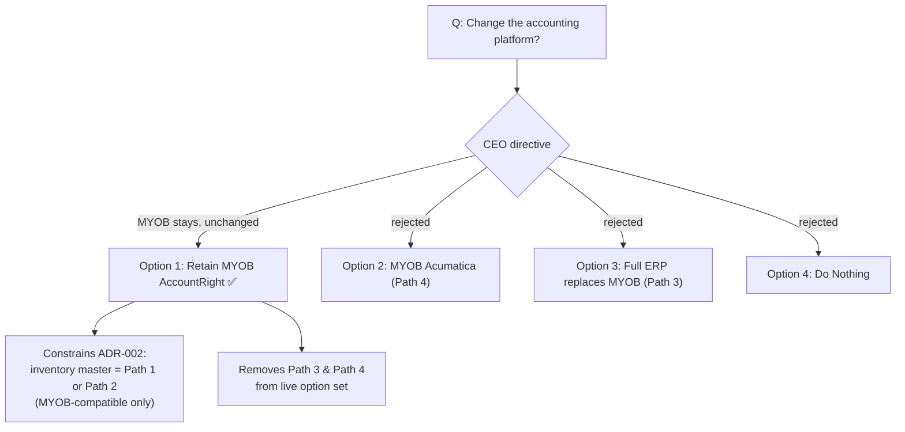

# Architecture Decision Record: Retain MYOB AccountRight as the Accounting System of Record

> **Template Origin**: Official | **ArcKit Version**: 5.15.1 | **Command**: `/arckit:adr`

## Document Control

| Field | Value |
|-------|-------|
| **Document ID** | ARC-001-ADR-001-v1.0 |
| **Document Type** | Architecture Decision Record |
| **Project** | Inventory & Warehouse Management Uplift (Project 001) |
| **Classification** | OFFICIAL |
| **Status** | DRAFT |
| **Version** | 1.0 |
| **Created Date** | 2026-06-30 |
| **Last Modified** | 2026-06-30 |
| **Review Date** | 2026-12-30 |
| **Owner** | Fred Flintstone (CEO, Cycle Motion) — Decision Authority |
| **Reviewed By** | [PENDING] |
| **Approved By** | [PENDING] |
| **Distribution** | Cycle Motion leadership (Fred & Wilma Flintstone), Order & Supply Chain team, solution architecture advisor, shortlisted vendors |

## Revision History

| Version | Date | Author | Changes | Approved By | Approval Date |
|---------|------|--------|---------|-------------|---------------|
| 1.0 | 2026-06-30 | ArcKit AI | Initial creation from `/arckit:adr` command | [PENDING] | [PENDING] |

## 1. Decision Title

**Retain MYOB AccountRight as the Accounting System of Record**

**ADR Status**: Accepted (business decision taken by the CEO; document pending formal sign-off)

---

## 2. Stakeholders

### 2.1 Deciders (RACI: Accountable)

- **Fred Flintstone, CEO** — Decision authority for investment and strategic systems direction [STK-C1]. Has directed that MYOB remains the accounting system and will not be changed.

### 2.2 Consulted (RACI: Consulted)

- **Wilma Flintstone, COO** — Operational sponsor; owns the workflows and the MYOB-dependent processes [STK-C2].
- **Velma Dinkley, Solution Architecture Advisor** — Architecture and de-risking input [STK-C4].
- **Order & Supply Chain Team (5 staff)** — Day-to-day users of MYOB-driven processes [STK-C3].

### 2.3 Informed (RACI: Informed)

- Shortlisted implementation vendors (Datapel, Ostendo, Unleashed, Cin7) — this decision is a fixed constraint for their solution design.

### 2.4 Escalation Context

**Decision Level**: Organisation-wide / Executive (the UK-Government Team/Cross-team/Department/Cross-government scale does not map to a private Australian SME).

**Escalation Rationale**: This is an organisation-wide technology-standard decision affecting the system of record for the whole business; in a flat, owner-led SME the CEO is the accountable decision-maker.

**Governance Forum**: Cycle Motion Leadership (CEO decision, COO and advisor consulted).

**Approval Date**: [PENDING — document sign-off]

---

## 3. Context and Problem Statement

### 3.1 Problem Description

Cycle Motion runs MYOB AccountRight as its accounting, inventory, and manufacturing system of record, behind one B2B (Magento) and several B2C (Shopify) storefronts [CB-C1]. The inventory and warehouse uplift requires a system of record for inventory, and the research surfaced options that would change the accounting platform itself — either migrating to MYOB's enterprise ERP (MYOB Acumatica) or replacing MYOB's accounting with a full open-source ERP (Odoo / ERPNext). Before the inventory-master architecture can be settled, the business must fix whether the **accounting** platform stays.

**Problem statement as a question**: Should Cycle Motion retain MYOB AccountRight as its accounting system of record, or change the accounting platform as part of the uplift?

### 3.2 Why This Decision Is Needed

This decision is a prerequisite constraint for the inventory source-of-truth decision (future ADR-002). It determines whether candidate solutions must integrate with MYOB AccountRight (favouring MYOB-native products) or whether a platform/ERP change is on the table.

- **Business context**: BR-006 (buy, not build), BR-005 (preserve BOM), BR-010 (control TCO).
- **Technical context**: TC-1 (must integrate with MYOB AccountRight), INT-001 (MYOB integration), NFR-I-001/NFR-I-002 (supported interfaces, loose coupling), NFR-P-001 (idempotent sync — minimised by MYOB-native integration).
- **Regulatory context**: The accounting system holds financial records and customer PII — Australian Privacy Principles (NFR-C-001) and PCI-DSS scope minimisation (NFR-SEC-005) apply regardless of platform.

### 3.3 Supporting Links

- **Requirements**: BR-005, BR-006, BR-010, TC-1, INT-001, NFR-I-001, NFR-I-002 (`ARC-001-REQ-v1.0`)
- **Research findings**: `ARC-001-RSCH-v1.0` — MYOB-native-vs-middleware analysis; Path 1/2/4 framing; vendor profiles
- **Stakeholder analysis**: `ARC-001-STKE-v1.0` — Conflict C-1 (source-of-truth), decision authority
- **Related ADRs**: ADR-002 (pending) — Inventory source-of-truth (Path 1 vs Path 2)

---

## 4. Decision Drivers (Forces)

### 4.1 Technical Drivers

- **MYOB-native integration availability**: MYOB AccountRight integration is rare across the market; Datapel and Ostendo are MYOB-AccountRight-native, while hubs/ERPs require middleware in the sync path. Retaining MYOB makes the low-risk native route available.
  - Requirements: INT-001, NFR-P-001, NFR-I-001
  - Principles: P9 (loose coupling), P10 (idempotent sync)
- **Preserve manufacturing/BOM in a known platform**: BOM currently lives in MYOB; retaining it avoids re-platforming a core capability.
  - Requirements: BR-005
- **Avoid accounting-data migration risk**: Changing the accounting platform would mean migrating the financial system of record — the highest-stakes data in the business.

### 4.2 Business Drivers

- **Minimal disruption / trading continuity**: Keeping the trusted accounting record avoids a large, risky change to the books (BC-3).
  - Requirements: BR-007; Stakeholder goal G-5 (de-risked delivery); driver SD-1 (de-risked growth)
- **Cost control (SME)**: Avoids the highest-cost option (MYOB Acumatica, ~A$140k–280k 3-yr) and ERP re-platforming cost.
  - Requirements: BR-010; driver SD-1
- **Familiarity / low retraining**: Staff and accountant already operate MYOB; preserves operational knowledge (reduces key-person and change risk).
  - Stakeholder drivers SD-2, SD-3

### 4.3 Regulatory & Compliance Drivers

- **UK Government frameworks (GDS Service Standard, Technology Code of Practice, NCSC CAF, UK GDPR)**: **Not applicable** — Cycle Motion is a private Australian company.
- **Applicable**: Australian Privacy Principles (Privacy Act 1988) for customer data in the accounting/order systems; PCI-DSS scope minimisation for payment data. These apply to whichever platform is used and are not changed by this decision.

### 4.4 Alignment to Architecture Principles

| Principle | Alignment | Impact |
|-----------|-----------|--------|
| P1 — Buy Over Build for Commodity Capability | ✅ Supports | Retains a proven, supported accounting product rather than re-platforming |
| P6 — Single Source of Inventory Truth | ✅ Supports | Fixes the accounting system of record; clears the way to settle the inventory master (ADR-002) |
| P9 — Loose Coupling | ✅ Supports | Keeps a stable, supported accounting interface; other components remain replaceable around it |
| P10 — Reliable, Idempotent Synchronisation | ✅ Supports | Enables the MYOB-native integration route (Datapel/Ostendo), reducing middleware-in-sync-path risk |
| P13 — Maintainability and Evolvability | ✅ Supports | Familiar platform; low retraining; less key-person disruption |
| P2 — Scalability and Elasticity | ⚠️ Partial | MYOB AccountRight is not a multichannel inventory engine; if inventory truth is left in MYOB (Path 1) it remains a scaling ceiling — addressed by the inventory layer and revisited in ADR-002/future review |

---

## 5. Considered Options

### Option 1: Retain MYOB AccountRight as accounting system of record (and integrate a separate inventory/WMS solution to it)

**Description**: MYOB AccountRight continues as the accounting system of record. The inventory/warehouse uplift proceeds by integrating a dedicated inventory/WMS product to MYOB (the inventory-master question — Path 1 vs Path 2 — is decided separately in ADR-002).

**Implementation approach**: Select an inventory/WMS solution that integrates with MYOB AccountRight (MYOB-native preferred); keep accounting in MYOB.

**Wardley Evolution Stage**: Product (off-the-shelf accounting) — stable, well understood.

#### Good (Pros)

- ✅ **Lowest disruption**: No migration of the financial system of record.
- ✅ **Enables MYOB-native, low-risk integration**: Datapel/Ostendo native route avoids middleware in the sync path (P10).
- ✅ **Preserves BOM and operational familiarity**: BR-005; minimal retraining.
- ✅ **Lowest cost path available**: Avoids the highest-cost options; supports BR-010.

#### Bad (Cons)

- ❌ **MYOB AccountRight is not a multichannel inventory engine**: If inventory truth is left in MYOB (Path 1), it remains a scaling ceiling (addressed in ADR-002).
- ❌ **Forecloses a single unified ERP**: Rules out the "one platform for everything" simplicity of Path 3.

#### Cost Analysis

- **CAPEX**: Inventory/WMS implementation only (path-dependent); no accounting migration cost.
- **OPEX**: Existing MYOB subscription + inventory/WMS subscription/support.
- **TCO (3-year)**: Lowest of the options — accounting platform cost unchanged; uplift cost per the inventory-master decision (indicatively ~A$55k–112k depending on Path 1/2).

#### Compliance Impact

- GDS Service Standard / TCoP: **N/A** (private AU SME). APP and PCI-DSS obligations unchanged.

---

### Option 2: Migrate accounting to MYOB Acumatica (Path 4)

**Description**: Replace MYOB AccountRight with MYOB's enterprise cloud ERP (MYOB Acumatica), which has inventory, WMS, and manufacturing built in.

**Wardley Evolution Stage**: Product (enterprise ERP).

#### Good (Pros)

- ✅ **Single MYOB-family platform** for accounting, inventory, WMS, and manufacturing.
- ✅ **Removes the AccountRight inventory ceiling** — built for scale.

#### Bad (Cons)

- ❌ **Changes the accounting system** — directly contrary to the CEO's directive.
- ❌ **Highest cost and largest change**: ~A$140k–280k 3-yr; migrates the financial system of record.
- ❌ **Migration risk** to the books and all integrations at once.

#### Cost Analysis

- **TCO (3-year)**: ~A$140k–280k (highest).

---

### Option 3: Replace MYOB accounting with a full ERP (Odoo Path 3 / ERPNext)

**Description**: Adopt a full ERP (open-source Odoo or ERPNext) whose own accounting module replaces MYOB.

**Wardley Evolution Stage**: Product/Custom (ERP + implementation/self-hosting).

#### Good (Pros)

- ✅ **One unified platform**; strong BOM/MRP; no lock-in (open-source).

#### Bad (Cons)

- ❌ **Changes the accounting system** — contrary to the CEO's directive.
- ❌ **Replaces the financial system of record** — highest-stakes migration.
- ❌ **Self-maintenance burden** (open-source) — tensions P1 (buy over build).

#### Cost Analysis

- **TCO (3-year)**: Wide, implementation-partner-dependent (~A$60k–135k risk-adjusted) plus the cost and risk of moving the books.

---

### Option 4: Do Nothing (Baseline)

**Description**: Continue with the status quo — MYOB AccountRight does accounting, inventory, and manufacturing, with manual re-keying and a paper warehouse.

#### Good

- ✅ **No immediate cost**; **no implementation risk**.

#### Bad

- ❌ **Manual re-keying and oversell persist** [CB-C2] — the core problems are unaddressed.
- ❌ **Opportunity cost**: growth remains capped; key-person risk continues.
- ❌ **Does not satisfy** BR-001/002/003/004.

---

## 6. Decision Outcome

### 6.1 Chosen Option

**"Option 1: Retain MYOB AccountRight as the accounting system of record."**

The accounting platform will not be changed. The inventory and warehouse uplift proceeds by integrating a dedicated inventory/WMS solution to MYOB; the choice of inventory master (Path 1 vs Path 2) is settled separately in ADR-002.

### 6.2 Y-Statement (Structured Justification)

> **In the context of** Cycle Motion's multichannel inventory and warehouse uplift, where MYOB AccountRight is the established accounting, inventory, and manufacturing system of record,
> **facing** options that would migrate or replace the accounting platform (MYOB Acumatica, or a full ERP) versus retaining it,
> **we decided for** retaining MYOB AccountRight as the accounting system of record and integrating a dedicated inventory/WMS solution to it,
> **to achieve** minimal disruption, the lowest-risk MYOB-native integration route, preserved BOM and operational familiarity, and controlled cost,
> **accepting** that MYOB AccountRight is not a multichannel inventory engine (so the inventory-master question must still be resolved in ADR-002, and a future platform upgrade may be revisited if the business outgrows it).

### 6.3 Justification (Why This Option?)

**Key reasons**:

1. **CEO directive**: The accounting system of choice is MYOB and will not be changed — a firm business decision by the accountable decision-maker [STK-C1].
2. **Lowest risk**: Avoids migrating the financial system of record (the highest-stakes data) and keeps the books stable through the uplift.
3. **Unlocks the MYOB-native route**: Retaining MYOB makes the low-risk native integration (Datapel/Ostendo) available, minimising middleware-in-sync-path risk (P9, P10) — the very risk that troubles the hub/ERP paths.
4. **Cost and familiarity**: Avoids the highest-cost options and preserves staff/accountant familiarity, reducing change and key-person risk.

**Stakeholder consensus**: CEO-directed; consistent with the COO's de-risking interest and the advisor's evidence-led recommendation. No dissent recorded.

**Risk appetite**: Aligns with the SME's low appetite for disruption to trading and the books.

---

## 7. Consequences

### 7.1 Positive Consequences

- ✅ **Stable financial system of record** — no accounting migration risk.
- ✅ **MYOB-native integration route available** — lowest-risk path to idempotent sync (P10).
- ✅ **BOM preserved** in a known platform (BR-005).
- ✅ **Rules out the riskiest/most expensive paths** (Options 2 and 3), simplifying the inventory-master decision.
- ✅ **Lower change and retraining burden** for a small team.

**Measurable outcomes**:

- Accounting-platform migrations required: **0**.
- Inventory-master shortlist narrowed to MYOB-compatible options (MYOB-native preferred).

### 7.2 Negative Consequences (Accepted Trade-offs)

- ❌ **MYOB AccountRight inventory ceiling**: If the inventory master is left in MYOB (Path 1), MYOB remains a scaling constraint.
  - **Mitigation**: Decide the inventory master deliberately in ADR-002; keep MYOB Acumatica (Path 4) documented as a future scaling option with a review trigger.
- ❌ **Forecloses a single unified ERP** (Path 3 simplicity).
  - **Mitigation**: Accepted; the integration-risk and migration cost of replacing the books outweigh the simplicity benefit for now.
- ❌ **If a hub (Path 2) is later chosen, middleware to MYOB is still required** (no native connector for hubs).
  - **Mitigation**: Prefer MYOB-native inventory products (Datapel/Ostendo); if a hub is chosen, reference-check and pilot the middleware (per BR-007).

### 7.3 Neutral Consequences (Changes Needed)

- 🔄 **Inventory-master decision still required** — ADR-002 (Path 1 vs Path 2).
- 🔄 **Confirm MYOB edition/version** as part of discovery (BR-009) to validate connector compatibility.
- 🔄 **Vendor solution designs** must treat MYOB AccountRight as a fixed integration target.

### 7.4 Risks and Mitigations

| Risk | Likelihood | Impact | Mitigation | Owner |
|------|------------|--------|------------|-------|
| MYOB AccountRight remains the inventory scaling ceiling (if Path 1) | MEDIUM | MEDIUM | Decide inventory master in ADR-002; document MYOB Acumatica as future option with review trigger | CEO |
| Non-MYOB-native inventory master needs middleware in sync path | MEDIUM | HIGH | Prefer MYOB-native (Datapel/Ostendo); reference-check + pilot any middleware | Advisor |
| MYOB edition/version limits connector compatibility | LOW | MEDIUM | Confirm edition in discovery (BR-009) before selection | COO |
| Business outgrows MYOB AccountRight sooner than expected | LOW | MEDIUM | Annual review trigger; Path 4 (Acumatica) held as documented upgrade path | CEO |

**Link to risk register**: Risk register (`ARC-001-RISK`) not yet created; risks mirror REQ R-1, R-5 and research VR-1.

---

## 8. Validation & Compliance

### 8.1 How Will Implementation Be Verified?

**Design review**:

- [ ] HLD/solution design treats MYOB AccountRight as the fixed accounting system of record.
- [ ] Integration design uses supported MYOB interfaces (no DB back-door — NFR-I-001).

**Configuration/Integration review**:

- [ ] Inventory/WMS solution confirmed compatible with the in-use MYOB AccountRight edition.
- [ ] Idempotent, monitored integration to MYOB (FR-004, FR-015).

**Testing strategy**:

- [ ] Integration tests validate MYOB sync (invoices, stock movements) end to end.
- [ ] Pilot tests the duplicate-order and oversell failure modes (BR-007).

### 8.2 Monitoring & Observability

**Success metrics**:

- Accounting records remain consistent post-integration (reconciliation clean).
- MYOB integration sync failures surfaced and recoverable (FR-015, NFR-M-002).

### 8.3 Compliance Verification

- **GDS Service Assessment / Technology Code of Practice**: **Not applicable** (private Australian SME).
- **Australian Privacy Principles**: Customer PII in MYOB/order systems handled per NFR-C-001 (consider `/arckit:au-pia`).
- **PCI-DSS**: No raw card data in MYOB or internal systems (NFR-SEC-005).

---

## 9. Links to Supporting Documents

### 9.1 Requirements Traceability

**Business Requirements**:

- BR-005: Preserve manufacturing/BOM — retained in MYOB.
- BR-006: Buy, not build — retains a proven accounting product.
- BR-010: Control TCO — avoids highest-cost re-platforming.

**Functional / Integration Requirements**:

- INT-001: MYOB AccountRight integration — now a fixed constraint.
- FR-004, FR-015: Idempotent, recoverable sync to MYOB.

**Non-Functional Requirements**:

- NFR-I-001 (supported interfaces), NFR-I-002 (loose coupling), NFR-P-001 (idempotent sync), NFR-C-001 (APP), NFR-SEC-005 (PCI-DSS).

**Technical Constraint**: TC-1 — must integrate with MYOB AccountRight (this ADR confirms and fixes it).

### 9.2 Architecture Artifacts

- **Architecture principles** (`ARC-000-PRIN-v1.0`): P1, P6, P9, P10, P13 (supporting); P2 (partial).
- **Stakeholder drivers** (`ARC-001-STKE-v1.0`): supports G-5 (de-risked delivery), SD-1, SD-2; relates to Conflict C-1.
- **Research findings** (`ARC-001-RSCH-v1.0`): MYOB-native-vs-middleware fact table; Path 1/2/4 framing; vendor profiles (Datapel, Ostendo, Unleashed, Cin7, Odoo, ERPNext, MYOB Acumatica).

### 9.4 External References

- **Vendor profiles**: `vendors/datapel-profile.md`, `vendors/ostendo-profile.md`, `vendors/myob-acumatica-profile.md`, `vendors/odoo-profile.md`, `vendors/erpnext-profile.md`.
- **Tech notes**: `tech-notes/myob-accountright-integration.md`, `tech-notes/idempotent-multichannel-inventory-sync.md`.

---

## 10. Implementation Plan

### 10.1 Dependencies

- **Depended on by**: ADR-002 (inventory source-of-truth) — this decision constrains it to MYOB-compatible options.
- **Discovery**: Confirm MYOB AccountRight edition/version (BR-009).

### 10.2 Implementation Timeline

| Phase | Activities | Duration | Owner |
|-------|-----------|----------|-------|
| **Phase 1: Confirm** | Confirm MYOB edition; communicate constraint to vendors | Short | COO |
| **Phase 2: Decide inventory master** | ADR-002 (Path 1 vs Path 2) | Short | CEO + advisor |
| **Phase 3: Integrate** | Implement MYOB-compatible inventory/WMS; idempotent sync | Per uplift plan | Vendor + COO |
| **Phase 4: Validate** | Pilot, reconcile, cut over in phases | Per uplift plan | Advisor + COO |

### 10.3 Rollback Plan

**Rollback trigger**: This decision is a constraint (retain existing platform), so it carries no migration to roll back. If a future review concludes MYOB AccountRight can no longer meet needs, a new ADR would supersede this one (e.g. adopting Path 4).

**Rollback owner**: CEO.

---

## 11. Review and Updates

### 11.1 Review Schedule

**Initial review**: 2026-12-30 (6 months).

**Periodic review**: Annually, or on a trigger event.

**Review criteria**: Is MYOB AccountRight still meeting accounting and BOM needs? Has order/SKU volume outgrown it? Is the inventory ceiling causing pain?

### 11.2 Trigger Events for Review

- [ ] Order/SKU volume materially exceeds MYOB AccountRight's comfortable range.
- [ ] MYOB product changes (e.g. AccountRight roadmap, edition end-of-life).
- [ ] Inventory-master decision (ADR-002) reveals a blocking MYOB limitation.
- [ ] A future move to MYOB Acumatica (Path 4) is actively considered.

---

## 12. Related Decisions

### 12.1 Decisions This ADR Depends On

- None (foundational constraint).

### 12.2 Decisions That Depend On This ADR

- **ADR-002 (pending)**: Inventory source-of-truth (Path 1 — MYOB-native WMS, e.g. Datapel/Ostendo — vs Path 2 — inventory hub with MYOB as accounting only). This ADR constrains ADR-002 to MYOB-compatible options and removes Path 3 and Path 4 from the live set.

### 12.3 Conflicting Decisions

- None. This ADR resolves part of Conflict C-1 (from `ARC-001-STKE-v1.0`) by fixing the accounting platform; the remaining Path 1-vs-Path 2 element is deferred to ADR-002.

---

## 13. Appendices

### Appendix A: Options Analysis Details

Full options analysis, MYOB-native-vs-middleware evidence, and 3-year TCO ranges are in `ARC-001-RSCH-v1.0` (v1.2), including vendor profiles and the broadened MYOB-integrating landscape scan.

### Appendix C: Decision Flow Diagram

---

## Document Approval

| Role | Name | Signature | Date |
|------|------|-----------|------|
| **Decision Authority (CEO)** | Fred Flintstone | | [PENDING] |
| **Operational Sponsor (COO)** | Wilma Flintstone | | [PENDING] |
| **Solution Architecture Advisor** | Velma Dinkley | | [PENDING] |

---

*This ADR follows the MADR v4.0 format enhanced with ArcKit governance standards. UK-Government-specific compliance sections are marked Not Applicable as Cycle Motion is a private Australian company.*

## External References

> This section provides traceability from generated content back to source documents.
> Follow citation instructions in the project's citation reference guide.

### Document Register

| Doc ID | Filename | Type | Source Location | Description |
|--------|----------|------|-----------------|-------------|
| CB | company-brief.md | Company Brief & Project Overview | 000-global/external/ | Verified company profile and inventory/warehouse project brief |
| STK | stakeholders.md | Stakeholder Map | 000-global/external/ | Cyclemotion stakeholder list — leadership, operations team |

### Citations

| Citation ID | Doc ID | Page/Section | Category | Quoted Passage |
|-------------|--------|--------------|----------|----------------|
| CB-C1 | CB | A3 / B1 | Design Decision | "MYOB sits behind everything as the accounting, inventory and manufacturing system of record." |
| CB-C2 | CB | B2 | Risk Factor | "Every B2C order is re-keyed into MYOB by hand ... oversell exposure because stock is never synced in real time across channels." |
| STK-C1 | STK | Key Stakeholders / Executive Leadership | Stakeholder Need | "Fred Flintstone | CEO ... Primary executive stakeholder. Likely decision-maker for business priorities, investment, and strategic change." |
| STK-C2 | STK | Key Stakeholders / Executive Leadership | Stakeholder Need | "Wilma Flintstone | COO ... Primary operational stakeholder." |
| STK-C3 | STK | Operations Team | Stakeholder Need | "Order and Supply Chain Team | 5 staff ... Key user group." |
| STK-C4 | STK | Key Stakeholders | Stakeholder Need | "Fred Flintstone | CEO | Went to school with Velma Dinkley" |

### Unreferenced Documents

| Filename | Source Location | Reason |
|----------|-----------------|--------|
| .gitkeep | 000-global/external/ | Placeholder file, no content |

---

**Generated by**: ArcKit `/arckit:adr` command
**Generated on**: 2026-06-30
**ArcKit Version**: 5.15.1
**Project**: Inventory & Warehouse Management Uplift (Project 001)
**Model**: Claude Opus 4.8 (1M context)
**Generation Context**: Derived from ARC-001-REQ, ARC-001-STKE, ARC-000-PRIN, ARC-001-RSCH (v1.2), and external company-brief.md / stakeholders.md.
</content>

<!-- arckit-provenance:start -->

## Build Provenance

_Stamped automatically by the ArcKit plugin's `provenance-stamp.mjs` PostToolUse hook. Complements (does not replace) the human-authored footer above. Carries only fields the model can't authoritatively self-report: build context from `.arckit/state.json` and effort levels derived from command frontmatter + the silent-downgrade matrix._

| Field | Value |
|-------|-------|
| Requested Effort | `high` |
| Effective Effort | _unknown — model not parsed from existing footer_ |
| Stamped at | 2026-06-30T02:01:18.203Z |

<!-- arckit-provenance:end -->
