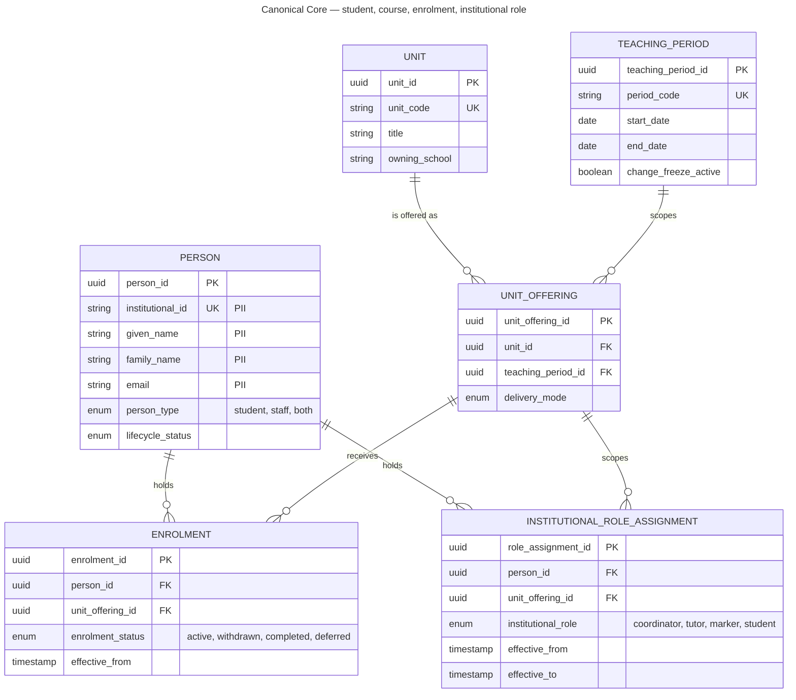
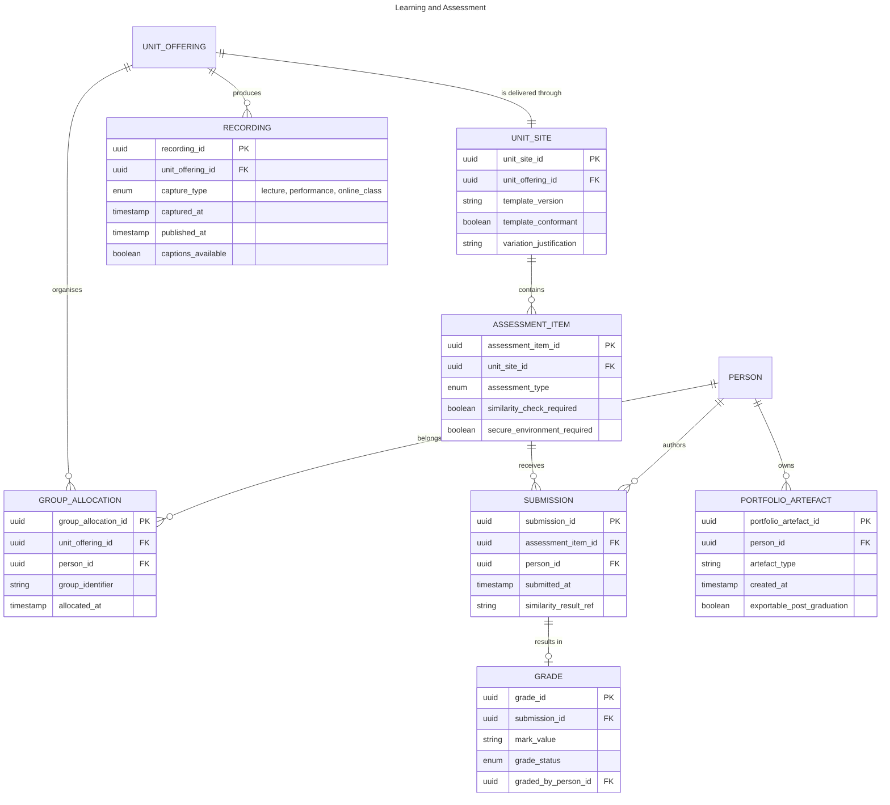
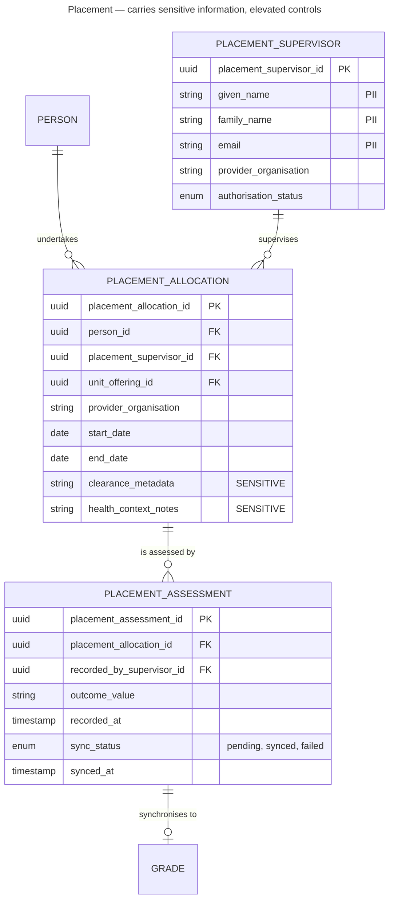
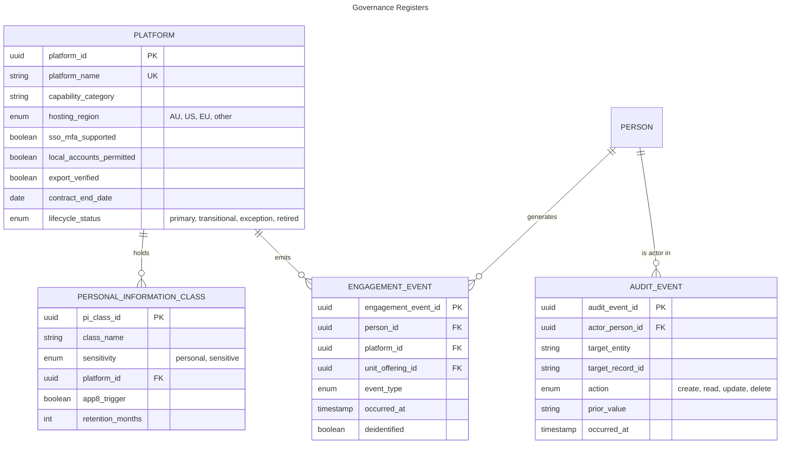

# Data Model: Learning & Teaching Baseline Strategy

> **Template Origin**: Official | **ArcKit Version**: 6.4.0 | **Command**: `/arckit:data-model`

## Document Control

| Field | Value |
|-------|-------|
| **Document ID** | ARC-001-DATA-v1.0 |
| **Document Type** | Data Model and Data Governance Specification |
| **Project** | Learning & Teaching Baseline Strategy (Project 001) |
| **Classification** | OFFICIAL-SENSITIVE |
| **Status** | DRAFT |
| **Version** | 1.0 |
| **Created Date** | 2026-07-26 |
| **Last Modified** | 2026-07-26 |
| **Review Date** | 2026-08-25 |
| **Owner** | Sam Okafor, Integration Architect (Digital & IT) |
| **Reviewed By** | [PENDING] — Eleanor Frame (Privacy & Records Officer) |
| **Approved By** | [PENDING] — Cassandra Rhodes, Chief Information Officer |
| **Distribution** | Project Team, Digital & IT, Privacy & Records, Steering Committee |

> **Classification rationale**: This document maps where sensitive information resides, which platforms hold personal information offshore, and where current controls are weakest. That combination is useful to an attacker. Classified OFFICIAL-SENSITIVE and restricted accordingly.

## Revision History

| Version | Date | Author | Changes | Approved By | Approval Date |
|---------|------|--------|---------|-------------|---------------|
| 1.0 | 2026-07-26 | ArcKit AI | Initial creation from `/arckit:data-model` command | [PENDING] | [PENDING] |

---

## Executive Summary

### Overview

This document defines the logical data model underpinning the Learning & Teaching technology ecosystem. Its primary purpose is to specify the **canonical data model for student, course and enrolment entities** required by DR-001, which governs all integrations and is a WP5 deliverable of the engagement [DM-C1].

The model is deliberately **logical, not physical**. The estate is predominantly vendor-hosted SaaS [DM-C2], so the university does not own most of the underlying schemas. What it can own — and what this document specifies — is the canonical representation that all integrations map to and from, the classification and residency of every data class, and the governance around both.

### Model Statistics

| Metric | Value |
|--------|-------|
| **Total entities** | 20 |
| **Bounded contexts** | 4 (Canonical Core, Learning & Assessment, Placement, Governance Registers) |
| **Total attributes** | 178 |
| **Attributes flagged as personal information** | 22 |
| **Attributes flagged as sensitive information** | 3 (E-014 clearance_metadata, health_context_notes; E-016 assessment_notes) |
| **Entities holding personal or sensitive information directly** | 12 of 20 |
| **Entities containing sensitive information** | 2 (E-014, E-016) |
| **Relationships defined (foreign keys)** | 34 |
| **One-to-many** | 31 |
| **One-to-zero-or-one** | 2 (E-012 Grade to its two possible origins) |
| **One-to-one** | 1 (E-004 UnitOffering to E-007 UnitSite) |
| **Many-to-many resolved via associative entity** | 4 (E-005, E-006, E-008, E-014) |
| **Relationships drawn in the domain ERDs** | 23 — platform and register links are omitted from the diagrams for readability and appear in the entity catalog |
| **Data requirements modelled** | 8 of 8 (100%) |

### Compliance Summary

> **Framework adaptation.** The ArcKit template is written for UK GDPR / DPA 2018 and the ICO. The University of Funk is an **Australian** institution, so this document applies the **Privacy Act 1988 (Cth)** and the **13 Australian Privacy Principles**, with the **OAIC** as regulator and the **Notifiable Data Breach scheme** in place of ICO breach notification. This is not a cosmetic substitution — the rights differ materially, and the Data Subject Rights section sets out where.

| Item | Status |
|------|--------|
| **Primary regime** | Privacy Act 1988 (Cth); Australian Privacy Principles 1–13 |
| **Regulator** | Office of the Australian Information Commissioner (OAIC) |
| **Breach regime** | Notifiable Data Breach scheme, Privacy Act Part IIIC |
| **Personal information present** | YES — 8 classes across 12 entities [DM-C3] |
| **Sensitive information present** | YES — placement records including clearance metadata and health-context notes [DM-C4] |
| **Cross-border disclosure (APP 8)** | YES — 4 data classes disclosed offshore under assessed hosting [DM-C5] |
| **Privacy Impact Assessment** | **REQUIRED** — sensitive information at scale, offshore disclosure, and derived analytics profiling all independently trigger assessment |
| **Security classification** | OFFICIAL-SENSITIVE for this document; per-entity classification in the catalog |
| **Sector frameworks** | ASD Essential Eight (target ML2 by end 2027) [DM-C6]; TEQSA assessment integrity expectations |
| **Not applicable** | PCI-DSS (no payment card data in L&T scope), HIPAA (US), FCA (UK) |

### Key Data Governance Stakeholders

| Role | Name | Responsibility |
|------|------|----------------|
| Accountable for privacy positions | Eleanor Frame, Privacy & Records Officer | APP compliance, PIA sign-off, NDB readiness |
| Accountable for security controls | Tobias Ohm, Cybersecurity Lead | Access control, Essential Eight posture |
| Accountable overall | Cassandra Rhodes, Chief Information Officer | Data platform accountability |
| Technical custodian | Sam Okafor, Integration Architect | Canonical model maintenance, integration data flows |
| Academic data owner | Dr. Benny Moog, Director Learning Technologies | Learning platform data |
| Student record authority | Student Administration | Authoritative source for Person, Enrolment |
| Placement data owner | Prof. Priya Anand, Dean Health Sciences | Placement and clinical assessment data |

---

## Visual Entity-Relationship Diagram (ERD)

The model is presented as four domain diagrams rather than one. A single 20-entity ERD is unreadable, and the domains have genuinely different governance characteristics — the Placement context in particular carries the estate's only sensitive information.

### Context 1 — Canonical Core

The entities required by DR-001 and DR-002. These are the entities the canonical model governs, and the ones every integration maps to.

### Context 2 — Learning and Assessment

Entities produced by teaching and assessment activity. These are largely held in vendor platforms; the university's interest is in their identity linkage and their export.

### Context 3 — Placement (sensitive information)

This context carries the estate's only sensitive information and its most defective current flow. It is drawn separately because its controls differ from every other context.

### Context 4 — Governance Registers

These entities do not describe teaching activity. They exist so that classification, residency and access are governed data rather than tribal knowledge — the precondition for DR-003, DR-005 and NFR-C-003.

---

## Entity Catalog

### Entity E-001: PERSON

**Description**: An individual known to the institution — student, staff member, or both. The identity root for the entire model.

**Source Requirements**:

- **DR-001**: Canonical data model for core academic entities
- **NFR-SEC-003**: Automated identity lifecycle driven from the authoritative source
- **NFR-SEC-001**: Institutional SSO with MFA; no local accounts

**Business Context**: Every access decision, enrolment, submission and grade resolves to a Person. The current estate's role assignment failures and stale deprovisioning both stem from Person and role state being maintained independently per platform rather than derived from one authority [DM-C7].

**Data Ownership**:

- **Business Owner**: Student Administration (students); Human Resources (staff)
- **Technical Owner**: Digital & IT — Integration team (Sam Okafor)
- **Data Steward**: Eleanor Frame, Privacy & Records Officer

**Data Classification**: CONFIDENTIAL

**Volume Estimates**:

- **Initial Volume**: ~31,000 records (28,000 students, 3,000 staff)
- **Growth Rate**: ~700 net new per month during admission cycles
- **Peak Volume**: ~40,000 active at Year 3, plus historical
- **Average Record Size**: 2 KB

**Data Retention**:

- **Active Period**: Duration of enrolment or employment plus 7 years
- **Archive Period**: Per institutional records authority
- **Total Retention**: Governed by state records legislation and academic transcript obligations
- **Deletion Policy**: Anonymisation after retention period; APP 11.2 requires destruction or de-identification once no longer needed for any permitted purpose

#### Attributes

| Attribute | Type | Required | PII | Description | Validation Rules | Default | Source Req |
|-----------|------|----------|-----|-------------|------------------|---------|------------|
| person_id | UUID | Yes | No | Canonical internal identifier | UUID v4 | Auto-generated | DR-001 |
| institutional_id | VARCHAR(20) | Yes | Yes | Student or staff number | Unique, institutional format | None | DR-001 |
| given_name | VARCHAR(100) | Yes | Yes | Given name | Non-empty | None | DR-001 |
| family_name | VARCHAR(100) | Yes | Yes | Family name | Non-empty | None | DR-001 |
| preferred_name | VARCHAR(100) | No | Yes | Name the person wishes to be used | Optional | NULL | DR-001 |
| email | VARCHAR(255) | Yes | Yes | Institutional email | RFC 5322, unique | None | DR-001 |
| person_type | ENUM | Yes | No | Relationship to institution | student, staff, both | None | DR-001 |
| employment_basis | ENUM | No | No | Staff tenure basis | continuing, fixed_term, casual, sessional | NULL | NFR-SEC-003 |
| lifecycle_status | ENUM | Yes | No | Current status | active, inactive, withdrawn, completed, terminated | active | NFR-SEC-003 |
| authoritative_source | VARCHAR(50) | Yes | No | System of record for this record | Enum of source systems | None | DR-001 |
| effective_from | TIMESTAMP | Yes | No | Record validity start | ISO 8601 | NOW() | DR-001 |
| effective_to | TIMESTAMP | No | No | Record validity end | ISO 8601, nullable | NULL | NFR-SEC-003 |
| created_at | TIMESTAMP | Yes | No | Creation time | ISO 8601 | NOW() | NFR-C-003 |
| updated_at | TIMESTAMP | Yes | No | Last update time | ISO 8601 | NOW() | NFR-C-003 |

**Attribute Notes**:

- **PII attributes**: institutional_id, given_name, family_name, preferred_name, email
- **Encrypted at rest**: all PII attributes
- **Derived attributes**: none — every attribute originates in the authoritative source
- **Audit attributes**: created_at, updated_at, plus full change history in E-020

> **Design note**: `employment_basis` exists specifically because casual and sessional staff provisioning is the documented origin of the manual CSV workaround [DM-C7]. Modelling tenure basis explicitly is what allows NFR-SEC-003 to route them through the same automated path as continuing staff.

#### Relationships

**Outgoing**: none — Person is the identity root.

**Incoming**:

- E-005 Enrolment → E-001 (many-to-one): a person holds many enrolments
- E-006 InstitutionalRoleAssignment → E-001 (many-to-one): a person holds many roles
- E-011 Submission, E-013 PortfolioArtefact, E-008 GroupAllocation, E-014 PlacementAllocation, E-017 EngagementEvent, E-020 AuditEvent all reference Person

#### Indexes

- **Primary key**: `pk_person` on `person_id`
- **Unique**: `uk_person_institutional_id` on `institutional_id`; `uk_person_email` on `email`
- **Performance**: `idx_person_lifecycle_status` (deprovisioning sweeps); `idx_person_type_employment_basis` (provisioning by cohort)

#### Privacy & Compliance

- **Contains personal information**: YES
- **Sensitive information**: NO
- **APP basis for collection**: APP 3 — necessary for the university's functions (delivery of education). Collection is a condition of enrolment or employment, not consent-based.
- **APP 5 notification**: collection notice provided at enrolment and onboarding
- **APP 12 access**: individuals may request access to their held personal information
- **APP 13 correction**: correction requests routed to the authoritative source, never to a derived copy
- **APP 11.2 destruction**: anonymisation once no longer needed for any permitted purpose
- **Cross-border disclosure**: derived copies exist in offshore platforms — see E-018 and the APP 8 assessment
- **Breach impact**: HIGH — identity data across the entire estate
- **Access logging**: required · **Change logging**: required, with prior value

---

### Entity E-002: UNIT

**Description**: A subject of study, independent of the teaching period in which it runs.

**Source Requirements**: DR-001 (canonical model — "course" entity)

**Business Context**: Distinguishing Unit from UnitOffering is what makes rollover (INT-004) modellable — content belongs to the Unit lineage while enrolment and student data belong to the Offering.

**Data Ownership**: Business Owner — Academic Governance; Technical Owner — Digital & IT; Data Steward — Dr. Benny Moog

**Data Classification**: INTERNAL

**Volume Estimates**: ~2,500 active units; +80 per year; average record size 1 KB

**Data Retention**: Indefinite — units form part of the academic record and transcript interpretation

#### Attributes

| Attribute | Type | Required | PII | Description | Validation Rules | Default | Source Req |
|-----------|------|----------|-----|-------------|------------------|---------|------------|
| unit_id | UUID | Yes | No | Canonical identifier | UUID v4 | Auto-generated | DR-001 |
| unit_code | VARCHAR(20) | Yes | No | Institutional unit code | Unique, institutional format | None | DR-001 |
| title | VARCHAR(255) | Yes | No | Unit title | Non-empty | None | DR-001 |
| owning_school | VARCHAR(100) | Yes | No | School accountable for the unit | Enum of schools | None | DR-001 |
| owning_faculty | VARCHAR(100) | Yes | No | Faculty accountable | Enum of faculties | None | DR-001 |
| credit_points | INTEGER | Yes | No | Credit value | Positive integer | None | DR-001 |
| lifecycle_status | ENUM | Yes | No | Unit status | active, suspended, discontinued | active | DR-001 |

**Attribute Notes**: no PII. Institutional hierarchy attributes (`owning_school`, `owning_faculty`) are the drift point addressed by INT-007.

#### Relationships

**Outgoing**: none

**Incoming**: E-004 UnitOffering → E-002 (many-to-one)

#### Indexes

- **Primary key**: `pk_unit` on `unit_id`
- **Unique**: `uk_unit_code` on `unit_code`
- **Performance**: `idx_unit_owning_school` (school-level reporting)

#### Privacy & Compliance

Contains no personal information. Classification INTERNAL. Access logging not required; change logging required for hierarchy attributes given the documented drift issue.

---

### Entity E-003: TEACHING_PERIOD

**Description**: A defined period in the academic calendar within which units are offered.

**Source Requirements**: DR-001; NFR-A-001 (availability differentiated by period); NFR-A-002 (change freeze windows)

**Business Context**: The academic calendar is not merely descriptive — NFR-A-001 makes availability targets period-dependent and NFR-A-002 makes change control period-dependent. The calendar must therefore be governed data, not a spreadsheet.

**Data Ownership**: Business Owner — Academic Governance; Technical Owner — Digital & IT; Data Steward — Rhonda Bell

**Data Classification**: INTERNAL

**Volume Estimates**: ~6 records per year; ~60 at Year 10; negligible size

**Data Retention**: Indefinite

#### Attributes

| Attribute | Type | Required | PII | Description | Validation Rules | Default | Source Req |
|-----------|------|----------|-----|-------------|------------------|---------|------------|
| teaching_period_id | UUID | Yes | No | Canonical identifier | UUID v4 | Auto-generated | DR-001 |
| period_code | VARCHAR(20) | Yes | No | Period code | Unique | None | DR-001 |
| start_date | DATE | Yes | No | Teaching start | ISO 8601 | None | NFR-A-001 |
| end_date | DATE | Yes | No | Teaching end | ISO 8601, after start_date | None | NFR-A-001 |
| assessment_start_date | DATE | Yes | No | Assessment period start | ISO 8601 | None | NFR-A-002 |
| assessment_end_date | DATE | Yes | No | Assessment period end | ISO 8601 | None | NFR-A-002 |
| change_freeze_active | BOOLEAN | Yes | No | Whether change freeze applies now | Derived from assessment dates | false | NFR-A-002 |

**Attribute Notes**: `change_freeze_active` is the only derived attribute in the model, computed from the assessment window.

#### Relationships

**Outgoing**: none

**Incoming**: E-004 UnitOffering → E-003 (many-to-one)

#### Indexes

- **Primary key**: `pk_teaching_period`
- **Unique**: `uk_teaching_period_code`
- **Performance**: `idx_teaching_period_dates` on `(start_date, end_date)`

#### Privacy & Compliance

No personal information. Classification INTERNAL.

---

### Entity E-004: UNIT_OFFERING

**Description**: A specific instance of a unit delivered in a specific teaching period. The join point between the academic catalogue and actual teaching activity.

**Source Requirements**: DR-001; INT-004 (rollover scope)

**Business Context**: Rollover copies from one UnitOffering to the next while explicitly excluding student data — a boundary that only exists if Offering is modelled separately from Unit.

**Data Ownership**: Business Owner — Academic Governance; Technical Owner — Digital & IT; Data Steward — Dr. Benny Moog

**Data Classification**: INTERNAL

**Volume Estimates**: ~5,000 offerings per year; ~15,000 retained at Year 3

**Data Retention**: 7 years minimum, aligned to academic record obligations

#### Attributes

| Attribute | Type | Required | PII | Description | Validation Rules | Default | Source Req |
|-----------|------|----------|-----|-------------|------------------|---------|------------|
| unit_offering_id | UUID | Yes | No | Canonical identifier | UUID v4 | Auto-generated | DR-001 |
| unit_id | UUID | Yes | No | Parent unit | FK to E-002 | None | DR-001 |
| teaching_period_id | UUID | Yes | No | Teaching period | FK to E-003 | None | DR-001 |
| delivery_mode | ENUM | Yes | No | Mode of delivery | on_campus, online, mixed | None | DR-001 |
| rolled_over_from_id | UUID | No | No | Prior offering this was cloned from | FK to E-004, nullable | NULL | INT-004 |
| lifecycle_status | ENUM | Yes | No | Offering status | planned, active, complete, cancelled | planned | DR-001 |

**Attribute Notes**: `rolled_over_from_id` provides the rollover lineage that makes INT-004 auditable — currently impossible with undocumented scripts.

#### Relationships

**Outgoing**: to E-002 Unit (many-to-one); to E-003 TeachingPeriod (many-to-one); self-referential to E-004 (rollover lineage)

**Incoming**: E-005 Enrolment, E-006 InstitutionalRoleAssignment, E-007 UnitSite (one-to-one), E-008 GroupAllocation, E-009 Recording

#### Indexes

- **Primary key**: `pk_unit_offering`
- **Foreign keys**: `fk_unit_offering_unit` (ON DELETE RESTRICT); `fk_unit_offering_teaching_period` (ON DELETE RESTRICT)
- **Unique**: `uk_unit_offering_unit_period` on `(unit_id, teaching_period_id)`

#### Privacy & Compliance

No personal information directly. Classification INTERNAL. Change logging required.

---

### Entity E-005: ENROLMENT

**Description**: A person's enrolment in a unit offering, with status and effective dating.

**Source Requirements**: DR-001; NFR-P-001 (propagation within 15 minutes); INT-001

**Business Context**: This is the entity whose propagation latency is the model's most consequential requirement. Under the current nightly batch, enrolment state is wrong for up to 24 hours — students cannot reach materials, and withdrawn students retain access [DM-C8].

**Data Ownership**: Business Owner — Student Administration; Technical Owner — Digital & IT Integration; Data Steward — Eleanor Frame

**Data Classification**: CONFIDENTIAL

**Volume Estimates**: ~180,000 enrolment records per year; ~550,000 retained at Year 3

**Data Retention**: 7 years minimum, then anonymisation; academic transcript data retained per records authority

#### Attributes

| Attribute | Type | Required | PII | Description | Validation Rules | Default | Source Req |
|-----------|------|----------|-----|-------------|------------------|---------|------------|
| enrolment_id | UUID | Yes | No | Canonical identifier | UUID v4 | Auto-generated | DR-001 |
| person_id | UUID | Yes | Yes | Enrolled person | FK to E-001 | None | DR-001 |
| unit_offering_id | UUID | Yes | No | Unit offering | FK to E-004 | None | DR-001 |
| enrolment_status | ENUM | Yes | No | Current status | active, withdrawn, completed, deferred | active | DR-001 |
| effective_from | TIMESTAMP | Yes | No | Status effective from | ISO 8601 | NOW() | NFR-P-001 |
| effective_to | TIMESTAMP | No | No | Status effective to | ISO 8601, nullable | NULL | NFR-P-001 |
| source_change_id | VARCHAR(100) | Yes | No | Correlation ID from authoritative source | Non-empty | None | NFR-M-001 |
| propagated_at | TIMESTAMP | No | No | When change reached this platform | ISO 8601 | NULL | NFR-P-001 |

**Attribute Notes**:

- `person_id` is a PII-linking attribute — enrolment is personal information by association
- `source_change_id` and `propagated_at` exist to make NFR-P-001 measurable and NFR-M-001 observable. Without them, propagation latency cannot be evidenced.

#### Relationships

**Outgoing**: to E-001 Person (many-to-one, ON DELETE RESTRICT); to E-004 UnitOffering (many-to-one, ON DELETE RESTRICT)

**Incoming**: none directly — assessment links through Person and AssessmentItem

#### Indexes

- **Primary key**: `pk_enrolment`
- **Foreign keys**: `fk_enrolment_person`; `fk_enrolment_unit_offering`
- **Unique**: `uk_enrolment_person_offering` on `(person_id, unit_offering_id)` where `effective_to IS NULL`
- **Performance**: `idx_enrolment_status_effective` (deprovisioning sweeps); `idx_enrolment_propagated_at` (latency reporting)

#### Privacy & Compliance

- **Contains personal information**: YES by association
- **APP basis**: APP 3 — necessary for the university's educational function
- **APP 11.1 security**: stale deprovisioning is a live APP 11 exposure — access persisting up to 24 hours after withdrawal [DM-C8]
- **Breach impact**: MEDIUM
- **Access logging**: required · **Change logging**: required with prior value

---

### Entity E-006: INSTITUTIONAL_ROLE_ASSIGNMENT

**Description**: The role a person holds within a unit offering — coordinator, tutor, marker or student. Derived from a single authoritative source and propagated.

**Source Requirements**: **DR-002** (role as a governed entity); INT-002; NFR-SEC-003

**Business Context**: DR-002 exists because role assignment failures are a documented current defect [DM-C7]. Modelling role as an entity in its own right — rather than an attribute of enrolment or a per-platform setting — is what makes a single authority possible.

**Data Ownership**: Business Owner — Student Administration and HR jointly; Technical Owner — Digital & IT Integration; Data Steward — Tobias Ohm (access implications)

**Data Classification**: CONFIDENTIAL

**Volume Estimates**: ~200,000 assignments per year including student roles

**Data Retention**: 7 years; change history retained per NFR-C-003

#### Attributes

| Attribute | Type | Required | PII | Description | Validation Rules | Default | Source Req |
|-----------|------|----------|-----|-------------|------------------|---------|------------|
| role_assignment_id | UUID | Yes | No | Canonical identifier | UUID v4 | Auto-generated | DR-002 |
| person_id | UUID | Yes | Yes | Person holding the role | FK to E-001 | None | DR-002 |
| unit_offering_id | UUID | Yes | No | Scope of the role | FK to E-004 | None | DR-002 |
| institutional_role | ENUM | Yes | No | Role held | coordinator, tutor, marker, student | None | DR-002 |
| authoritative_source | VARCHAR(50) | Yes | No | System that assigned the role | Enum | None | DR-002 |
| effective_from | TIMESTAMP | Yes | No | Assignment start | ISO 8601 | NOW() | NFR-SEC-003 |
| effective_to | TIMESTAMP | No | No | Assignment end | ISO 8601, nullable | NULL | NFR-SEC-003 |
| propagated_at | TIMESTAMP | No | No | When propagated to platforms | ISO 8601 | NULL | NFR-P-001 |

**Attribute Notes**: `effective_to` is what enables automated deprovisioning. No platform may hold a role assignment not derived from this entity — that prohibition is the substance of DR-002.

#### Relationships

**Outgoing**: to E-001 Person (many-to-one); to E-004 UnitOffering (many-to-one)

**Incoming**: E-020 AuditEvent references role changes

#### Indexes

- **Primary key**: `pk_role_assignment`
- **Foreign keys**: `fk_role_assignment_person`; `fk_role_assignment_unit_offering`
- **Performance**: `idx_role_assignment_person_effective`; `idx_role_assignment_effective_to` (expiry sweeps)

#### Privacy & Compliance

- **Contains personal information**: YES by association
- **Breach impact**: MEDIUM — role data reveals employment and study relationships
- **Access logging**: required · **Change logging**: **required with prior value** — this is the highest-value audit target in the model, since role change equals access change

---

### Entity E-007: UNIT_SITE

**Description**: The learning platform site through which a unit offering is delivered to students.

**Source Requirements**: DR-001 (by association); FR-001 (templates); NFR-U-001 (navigation consistency)

**Business Context**: Template conformance (NFR-U-001) is measurable only if conformance state is recorded. Modelling `template_conformant` and `variation_justification` is what turns a consistency aspiration into a reportable metric.

**Data Ownership**: Business Owner — Dr. Benny Moog; Technical Owner — Learning Technologies; Data Steward — Dr. Benny Moog

**Data Classification**: INTERNAL

**Volume Estimates**: ~5,000 per year, one per unit offering

**Data Retention**: 7 years, aligned to the unit offering

#### Attributes

| Attribute | Type | Required | PII | Description | Validation Rules | Default | Source Req |
|-----------|------|----------|-----|-------------|------------------|---------|------------|
| unit_site_id | UUID | Yes | No | Canonical identifier | UUID v4 | Auto-generated | DR-001 |
| unit_offering_id | UUID | Yes | No | Unit offering delivered | FK to E-004, unique | None | DR-001 |
| platform_id | UUID | Yes | No | Hosting platform | FK to E-018 | None | DR-005 |
| template_version | VARCHAR(20) | No | No | Baseline template version applied | Semantic version | NULL | FR-001 |
| template_conformant | BOOLEAN | Yes | No | Conforms to baseline structure | true/false | false | NFR-U-001 |
| variation_justification | TEXT | No | No | Recorded pedagogical justification | Required when not conformant | NULL | NFR-U-001 |
| accessibility_verified | BOOLEAN | Yes | No | Accessibility conformance verified | true/false | false | NFR-U-002 |
| published_at | TIMESTAMP | No | No | When made visible to students | ISO 8601 | NULL | FR-007 |

**Attribute Notes**: `variation_justification` is mandatory when `template_conformant` is false. This encodes the Conflict C-5 resolution directly — variation is permitted, but only when recorded.

#### Relationships

**Outgoing**: to E-004 UnitOffering (one-to-one); to E-018 Platform (many-to-one)

**Incoming**: E-010 AssessmentItem → E-007

#### Indexes

- **Primary key**: `pk_unit_site`
- **Unique**: `uk_unit_site_offering` on `unit_offering_id`
- **Performance**: `idx_unit_site_template_conformant` (conformance reporting)

#### Privacy & Compliance

No personal information directly. Classification INTERNAL.

---

### Entity E-008: GROUP_ALLOCATION

**Description**: A student's membership of a tutorial, lab or project group within a unit offering, derived from timetable allocation.

**Source Requirements**: FR-014; INT-006; DR-001 (by association)

**Business Context**: Group membership currently reaches collaboration platforms by batch export, so timetable changes are not reflected until the next run [DM-C7]. Modelling allocation as an effective-dated entity is what allows event-driven propagation.

**Data Ownership**: Business Owner — Timetabling; Technical Owner — Digital & IT Integration; Data Steward — Dr. Benny Moog

**Data Classification**: CONFIDENTIAL

**Volume Estimates**: ~250,000 allocations per year

**Data Retention**: Duration of teaching period plus 12 months

#### Attributes

| Attribute | Type | Required | PII | Description | Validation Rules | Default | Source Req |
|-----------|------|----------|-----|-------------|------------------|---------|------------|
| group_allocation_id | UUID | Yes | No | Canonical identifier | UUID v4 | Auto-generated | FR-014 |
| person_id | UUID | Yes | Yes | Allocated person | FK to E-001 | None | FR-014 |
| unit_offering_id | UUID | Yes | No | Unit offering | FK to E-004 | None | FR-014 |
| group_identifier | VARCHAR(50) | Yes | No | Group name or code | Non-empty | None | FR-014 |
| group_type | ENUM | Yes | No | Group purpose | tutorial, lab, project, other | None | FR-014 |
| allocated_at | TIMESTAMP | Yes | No | Allocation time | ISO 8601 | NOW() | INT-006 |
| propagated_at | TIMESTAMP | No | No | When propagated to collaboration platform | ISO 8601 | NULL | NFR-P-001 |

#### Relationships

**Outgoing**: to E-001 Person (many-to-one); to E-004 UnitOffering (many-to-one)

**Incoming**: none

#### Indexes

- **Primary key**: `pk_group_allocation`
- **Foreign keys**: `fk_group_allocation_person`; `fk_group_allocation_unit_offering`
- **Performance**: `idx_group_allocation_offering_group` on `(unit_offering_id, group_identifier)`

#### Privacy & Compliance

Personal information by association. Breach impact LOW. Access logging not required; change logging required.

---

### Entity E-009: RECORDING

**Description**: A captured lecture, performance or online class session.

**Source Requirements**: FR-009, FR-010; NFR-P-002 (publication within 4 hours); NFR-U-002 (captions)

**Business Context**: Recordings capture students as well as staff, making them personal information with a biometric-adjacent character [DM-C3]. Several are held offshore under assessed hosting.

**Data Ownership**: Business Owner — Dr. Benny Moog; Technical Owner — Learning Technologies; Data Steward — Eleanor Frame

**Data Classification**: CONFIDENTIAL

**Volume Estimates**: ~40,000 recordings per year; high storage volume (~1.5 GB average)

**Data Retention**: 2 years active, then review; performance recordings may carry longer retention by agreement with the school

#### Attributes

| Attribute | Type | Required | PII | Description | Validation Rules | Default | Source Req |
|-----------|------|----------|-----|-------------|------------------|---------|------------|
| recording_id | UUID | Yes | No | Canonical identifier | UUID v4 | Auto-generated | FR-009 |
| unit_offering_id | UUID | Yes | No | Unit offering | FK to E-004 | None | FR-009 |
| platform_id | UUID | Yes | No | Capture platform | FK to E-018 | None | DR-005 |
| capture_type | ENUM | Yes | No | Type of capture | lecture, performance, online_class | None | FR-009 |
| captured_at | TIMESTAMP | Yes | No | Session time | ISO 8601 | None | FR-009 |
| published_at | TIMESTAMP | No | No | Publication time | ISO 8601 | NULL | NFR-P-002 |
| captions_available | BOOLEAN | Yes | No | Captions present | true/false | false | NFR-U-002 |
| contains_student_participation | BOOLEAN | Yes | No | Whether students are captured | true/false | true | NFR-C-001 |
| multi_camera | BOOLEAN | No | No | Multi-camera capture used | true/false | false | FR-010 |

**Attribute Notes**: `contains_student_participation` drives the privacy handling path — recordings capturing students carry different notification and retention obligations from staff-only content.

#### Relationships

**Outgoing**: to E-004 UnitOffering (many-to-one); to E-018 Platform (many-to-one)

**Incoming**: none

#### Indexes

- **Primary key**: `pk_recording`
- **Performance**: `idx_recording_captured_published` on `(captured_at, published_at)` — supports the 4-hour publication SLA report

#### Privacy & Compliance

- **Contains personal information**: YES — students and staff visible and audible [DM-C3]
- **APP 5 notification**: students notified that timetabled sessions are captured
- **Cross-border disclosure**: YES for some platforms — APP 8 assessment required [DM-C5]
- **Breach impact**: MEDIUM to HIGH depending on session content
- **Access logging**: required

---

### Entity E-010: ASSESSMENT_ITEM

**Description**: A defined assessment task within a unit site.

**Source Requirements**: FR-016, FR-017; DR-001 (by association)

**Business Context**: Assessment configuration determines which integrity and security controls apply — similarity checking (FR-016) and secure environment (FR-017).

**Data Ownership**: Business Owner — Unit Coordinator; Technical Owner — Learning Technologies; Data Steward — A/Prof. Pearl Clavinet

**Data Classification**: INTERNAL

**Volume Estimates**: ~20,000 assessment items per year

**Data Retention**: 7 years, aligned to academic record obligations

#### Attributes

| Attribute | Type | Required | PII | Description | Validation Rules | Default | Source Req |
|-----------|------|----------|-----|-------------|------------------|---------|------------|
| assessment_item_id | UUID | Yes | No | Canonical identifier | UUID v4 | Auto-generated | DR-001 |
| unit_site_id | UUID | Yes | No | Parent unit site | FK to E-007 | None | DR-001 |
| assessment_type | ENUM | Yes | No | Type of assessment | written, exam, practical, placement, portfolio, peer_review | None | FR-016 |
| weighting_percent | DECIMAL(5,2) | Yes | No | Contribution to unit grade | 0 to 100 | None | DR-001 |
| due_at | TIMESTAMP | No | No | Submission deadline | ISO 8601 | NULL | NFR-S-001 |
| similarity_check_required | BOOLEAN | Yes | No | Requires similarity and AI-writing detection | true/false | true | FR-016 |
| secure_environment_required | BOOLEAN | Yes | No | Requires lockdown environment | true/false | false | FR-017 |

#### Relationships

**Outgoing**: to E-007 UnitSite (many-to-one, ON DELETE RESTRICT)

**Incoming**: E-011 Submission → E-010

#### Indexes

- **Primary key**: `pk_assessment_item`
- **Foreign key**: `fk_assessment_item_unit_site`
- **Performance**: `idx_assessment_item_due_at` — supports NFR-S-001 peak-load forecasting

#### Privacy & Compliance

No personal information directly. Classification INTERNAL.

---

### Entity E-011: SUBMISSION

**Description**: A student's submitted work against an assessment item.

**Source Requirements**: FR-016; DR-001 (by association); NFR-C-002 (offshore hosting)

**Business Context**: Submitted work is student intellectual property and is held offshore in the similarity-detection platform under assessed hosting — an APP 8 trigger [DM-C5].

**Data Ownership**: Business Owner — Unit Coordinator; Technical Owner — Learning Technologies; Data Steward — Eleanor Frame

**Data Classification**: CONFIDENTIAL

**Volume Estimates**: ~500,000 submissions per year; peak concentration at deadlines

**Data Retention**: 7 years minimum; similarity-detection repositories may retain longer under vendor terms — a contract review point

#### Attributes

| Attribute | Type | Required | PII | Description | Validation Rules | Default | Source Req |
|-----------|------|----------|-----|-------------|------------------|---------|------------|
| submission_id | UUID | Yes | No | Canonical identifier | UUID v4 | Auto-generated | DR-001 |
| assessment_item_id | UUID | Yes | No | Assessment item | FK to E-010 | None | DR-001 |
| person_id | UUID | Yes | Yes | Submitting student | FK to E-001 | None | DR-001 |
| submitted_at | TIMESTAMP | Yes | No | Submission time | ISO 8601 | NOW() | DR-001 |
| attempt_number | INTEGER | Yes | No | Attempt sequence | Positive integer | 1 | DR-001 |
| content_reference | VARCHAR(500) | Yes | Yes | Reference to submitted artefact | Non-empty | None | DR-001 |
| similarity_result_ref | VARCHAR(200) | No | No | Similarity check result reference | Nullable | NULL | FR-016 |
| platform_id | UUID | Yes | No | Platform holding the submission | FK to E-018 | None | DR-005 |

**Attribute Notes**: `content_reference` points to student-authored work — personal information and student IP. Encrypted at rest and access-logged.

#### Relationships

**Outgoing**: to E-010 AssessmentItem (many-to-one); to E-001 Person (many-to-one); to E-018 Platform (many-to-one)

**Incoming**: E-012 Grade → E-011 (one-to-zero-or-one)

#### Indexes

- **Primary key**: `pk_submission`
- **Foreign keys**: `fk_submission_assessment_item`; `fk_submission_person`
- **Unique**: `uk_submission_item_person_attempt` on `(assessment_item_id, person_id, attempt_number)`
- **Performance**: `idx_submission_submitted_at`

#### Privacy & Compliance

- **Contains personal information**: YES — including student intellectual property [DM-C3]
- **Cross-border disclosure**: YES — APP 8 assessment required [DM-C5]
- **Breach impact**: HIGH — unpublished student work with academic integrity implications
- **Access logging**: required · **Change logging**: required

---

### Entity E-012: GRADE

**Description**: The mark or outcome awarded for a submission or placement assessment.

**Source Requirements**: DR-001; INT-005; NFR-C-003 (audit logging)

**Business Context**: The grade is where the placement flow's defect surfaces — outcomes recorded in the placement platform currently reach the gradebook by manual re-keying [DM-C7]. Grade is also the highest-value audit target after role assignment.

**Data Ownership**: Business Owner — Unit Coordinator; Technical Owner — Learning Technologies; Data Steward — A/Prof. Pearl Clavinet

**Data Classification**: CONFIDENTIAL

**Volume Estimates**: ~500,000 grades per year

**Data Retention**: Permanent for final unit results (transcript); 7 years for component marks

#### Attributes

| Attribute | Type | Required | PII | Description | Validation Rules | Default | Source Req |
|-----------|------|----------|-----|-------------|------------------|---------|------------|
| grade_id | UUID | Yes | No | Canonical identifier | UUID v4 | Auto-generated | DR-001 |
| submission_id | UUID | No | No | Source submission | FK to E-011, nullable | NULL | DR-001 |
| placement_assessment_id | UUID | No | No | Source placement assessment | FK to E-016, nullable | NULL | INT-005 |
| person_id | UUID | Yes | Yes | Graded student | FK to E-001 | None | DR-001 |
| mark_value | VARCHAR(20) | Yes | No | Mark or grade awarded | Per assessment scheme | None | DR-001 |
| grade_status | ENUM | Yes | No | Grade lifecycle status | provisional, final, withheld, amended | provisional | DR-001 |
| graded_by_person_id | UUID | Yes | Yes | Marker | FK to E-001 | None | NFR-C-003 |
| graded_at | TIMESTAMP | Yes | No | When graded | ISO 8601 | NOW() | NFR-C-003 |
| origin_system | VARCHAR(50) | Yes | No | System where the grade originated | Enum | None | INT-005 |

**Attribute Notes**: exactly one of `submission_id` or `placement_assessment_id` must be populated — a check constraint, not a nullable convenience. This is what allows placement outcomes to reach the gradebook through the governed path (INT-005) rather than by re-keying.

#### Relationships

**Outgoing**: to E-011 Submission (zero-or-one); to E-016 PlacementAssessment (zero-or-one); to E-001 Person (many-to-one, twice — graded student and marker)

**Incoming**: E-020 AuditEvent

#### Indexes

- **Primary key**: `pk_grade`
- **Foreign keys**: `fk_grade_submission`; `fk_grade_placement_assessment`; `fk_grade_person`
- **Check constraint**: `ck_grade_single_origin` — exactly one origin FK populated
- **Performance**: `idx_grade_person_status`

#### Privacy & Compliance

- **Contains personal information**: YES
- **Breach impact**: HIGH — academic records with direct consequence for individuals
- **Access logging**: required · **Change logging**: **required with prior value** — mandated by NFR-C-003

---

### Entity E-013: PORTFOLIO_ARTEFACT

**Description**: An item of evidence a student maintains in their whole-of-program portfolio.

**Source Requirements**: **DR-008** (portfolio portability); FR-015; NFR-I-002

**Business Context**: DR-008 requires export to remain available after enrolment ends. That obligation shapes both retention and the contract terms for whichever platform holds it.

**Data Ownership**: Business Owner — student (the artefacts are student-owned); Technical Owner — Learning Technologies; Data Steward — Eleanor Frame

**Data Classification**: CONFIDENTIAL

**Volume Estimates**: ~150,000 artefacts per year

**Data Retention**: Duration of program plus a defined post-graduation export window; deletion only after the export window closes

#### Attributes

| Attribute | Type | Required | PII | Description | Validation Rules | Default | Source Req |
|-----------|------|----------|-----|-------------|------------------|---------|------------|
| portfolio_artefact_id | UUID | Yes | No | Canonical identifier | UUID v4 | Auto-generated | DR-008 |
| person_id | UUID | Yes | Yes | Owning student | FK to E-001 | None | DR-008 |
| artefact_type | VARCHAR(50) | Yes | No | Type of evidence | Enum | None | FR-015 |
| content_reference | VARCHAR(500) | Yes | Yes | Reference to the artefact | Non-empty | None | DR-008 |
| created_at | TIMESTAMP | Yes | No | Creation time | ISO 8601 | NOW() | DR-008 |
| unit_offering_id | UUID | No | No | Associated unit offering if any | FK to E-004, nullable | NULL | FR-015 |
| exportable_post_graduation | BOOLEAN | Yes | No | Available for export after graduation | true/false | true | DR-008 |
| export_format | VARCHAR(50) | Yes | No | Open format for export | Enum of open formats | None | NFR-I-002 |

#### Relationships

**Outgoing**: to E-001 Person (many-to-one); to E-004 UnitOffering (many-to-one, optional)

**Incoming**: none

#### Indexes

- **Primary key**: `pk_portfolio_artefact`
- **Foreign key**: `fk_portfolio_artefact_person`
- **Performance**: `idx_portfolio_artefact_person_created`

#### Privacy & Compliance

- **Contains personal information**: YES — student-authored, student-owned
- **APP 12 access**: direct — the student is both data subject and content author
- **Portability**: contractually required in open format (NFR-I-002), and the clearest case in the model where the individual's interest outweighs platform convenience
- **Breach impact**: MEDIUM

---

### Entity E-014: PLACEMENT_ALLOCATION

**Description**: A student's allocation to a clinical or community placement, including clearance and health-context metadata.

> **This entity holds sensitive information as defined by the Privacy Act 1988.** Elevated controls apply throughout.

**Source Requirements**: **DR-004** (sensitive information handling); FR-018; INT-005

**Business Context**: Placement records carry clearance metadata and health-context notes — the estate's only sensitive information [DM-C4]. The current handling, manual re-keying with exports circulating by email [DM-C9], is the single clearest defect in the estate: simultaneously an academic integrity, privacy and student-fairness problem.

**Data Ownership**: Business Owner — Prof. Priya Anand, Dean Health Sciences; Technical Owner — Learning Technologies; Data Steward — Eleanor Frame

**Data Classification**: RESTRICTED

**Volume Estimates**: ~4,000 placements per year

**Data Retention**: 7 years post-completion, per professional accreditation requirements; clearance metadata reviewed for earlier destruction under APP 11.2

#### Attributes

| Attribute | Type | Required | PII | Description | Validation Rules | Default | Source Req |
|-----------|------|----------|-----|-------------|------------------|---------|------------|
| placement_allocation_id | UUID | Yes | No | Canonical identifier | UUID v4 | Auto-generated | DR-004 |
| person_id | UUID | Yes | Yes | Placed student | FK to E-001 | None | DR-004 |
| placement_supervisor_id | UUID | Yes | Yes | Supervising individual | FK to E-015 | None | DR-004 |
| unit_offering_id | UUID | Yes | No | Associated unit offering | FK to E-004 | None | DR-004 |
| provider_organisation | VARCHAR(200) | Yes | No | Placement provider | Non-empty | None | DR-004 |
| start_date | DATE | Yes | No | Placement start | ISO 8601 | None | DR-004 |
| end_date | DATE | Yes | No | Placement end | ISO 8601, after start | None | DR-004 |
| clearance_metadata | TEXT | No | **SENSITIVE** | Clearance and check status | Encrypted; restricted access | NULL | DR-004 |
| health_context_notes | TEXT | No | **SENSITIVE** | Health-context information | Encrypted; restricted access | NULL | DR-004 |
| allocation_status | ENUM | Yes | No | Status | proposed, confirmed, active, complete, withdrawn | proposed | DR-004 |

**Attribute Notes**:

- **Sensitive information**: `clearance_metadata`, `health_context_notes` — these attract elevated protection under the Privacy Act, distinct from ordinary personal information
- **Encrypted at rest**: both sensitive attributes plus `person_id` linkage
- **Field-level access control**: sensitive attributes visible only to explicitly authorised placement administrators, never to unit coordinators by default

#### Relationships

**Outgoing**: to E-001 Person (many-to-one); to E-015 PlacementSupervisor (many-to-one); to E-004 UnitOffering (many-to-one)

**Incoming**: E-016 PlacementAssessment → E-014

#### Indexes

- **Primary key**: `pk_placement_allocation`
- **Foreign keys**: `fk_placement_allocation_person`; `fk_placement_allocation_supervisor`; `fk_placement_allocation_unit_offering`
- **Performance**: `idx_placement_allocation_dates`
- **Note**: sensitive attributes are deliberately **not indexed** — index structures leak content and widen the exposure surface

#### Privacy & Compliance

- **Contains sensitive information**: **YES**
- **APP 3.3 collection**: sensitive information may only be collected with consent and where reasonably necessary — collection notice and consent must be explicit and recorded
- **APP 6 use and disclosure**: strictly limited to the placement purpose
- **APP 11 security**: elevated controls — encryption, field-level access control, no export outside the governed integration
- **Prohibited handling**: manual re-keying, email transfer, screenshot, spreadsheet export. Current practice breaches this and requires remediation.
- **Breach impact**: **HIGH** — a breach involving sensitive information is more likely to meet the NDB scheme's serious-harm threshold
- **NDB relevance**: this entity is the most probable subject of an eligible data breach assessment
- **DPIA equivalent**: Privacy Impact Assessment **REQUIRED**
- **Access logging**: **required** · **Change logging**: **required with prior value**

---

### Entity E-015: PLACEMENT_SUPERVISOR

**Description**: An external individual supervising and assessing students on placement.

**Source Requirements**: DR-004; FR-018; UC-2

**Business Context**: Supervisors are external to the university and have low technical proficiency [DM-C10]. They must be able to record an outcome once without university system training — a usability constraint that shapes the integration design.

**Data Ownership**: Business Owner — Prof. Priya Anand; Technical Owner — Learning Technologies; Data Steward — Eleanor Frame

**Data Classification**: CONFIDENTIAL

**Volume Estimates**: ~1,200 active supervisors

**Data Retention**: Duration of the supervisory relationship plus 7 years

#### Attributes

| Attribute | Type | Required | PII | Description | Validation Rules | Default | Source Req |
|-----------|------|----------|-----|-------------|------------------|---------|------------|
| placement_supervisor_id | UUID | Yes | No | Canonical identifier | UUID v4 | Auto-generated | DR-004 |
| given_name | VARCHAR(100) | Yes | Yes | Given name | Non-empty | None | DR-004 |
| family_name | VARCHAR(100) | Yes | Yes | Family name | Non-empty | None | DR-004 |
| email | VARCHAR(255) | Yes | Yes | Contact email | RFC 5322 | None | DR-004 |
| provider_organisation | VARCHAR(200) | Yes | No | Employing organisation | Non-empty | None | DR-004 |
| authorisation_status | ENUM | Yes | No | Authorisation to assess | pending, active, suspended, expired | pending | NFR-SEC-001 |
| authorised_until | DATE | No | No | Authorisation expiry | ISO 8601 | NULL | NFR-SEC-003 |

**Attribute Notes**: external supervisors are outside the institutional identity provider. `authorisation_status` and `authorised_until` provide the compensating control — time-bounded, revocable authorisation. This is a recognised exception to NFR-SEC-001 requiring explicit approval and recorded justification.

#### Relationships

**Outgoing**: none

**Incoming**: E-014 PlacementAllocation → E-015; E-016 PlacementAssessment → E-015

#### Indexes

- **Primary key**: `pk_placement_supervisor`
- **Unique**: `uk_placement_supervisor_email`
- **Performance**: `idx_placement_supervisor_authorised_until` (expiry sweeps)

#### Privacy & Compliance

- **Contains personal information**: YES — of individuals who are not students or staff
- **APP 5 notification**: collection notice required for external parties
- **Breach impact**: MEDIUM
- **Access logging**: required

> **Open item**: external supervisor authentication is a genuine gap against NFR-SEC-001. Institutional SSO does not extend to placement providers. This requires either a federated arrangement or a formally approved, compensated exception — flagged for the WP6 decisions register.

---

### Entity E-016: PLACEMENT_ASSESSMENT

**Description**: An assessment outcome recorded by a placement supervisor, synchronising to the LMS gradebook.

**Source Requirements**: **DR-004**; FR-018; INT-005; NFR-C-003

**Business Context**: This is the entity that FR-018 and INT-005 exist to fix. Outcomes are currently re-keyed by hand between systems, producing error, delay and audit exposure [DM-C7].

**Data Ownership**: Business Owner — Prof. Priya Anand; Technical Owner — Digital & IT Integration; Data Steward — Eleanor Frame

**Data Classification**: RESTRICTED

**Volume Estimates**: ~12,000 assessments per year

**Data Retention**: 7 years, aligned to the academic record

#### Attributes

| Attribute | Type | Required | PII | Description | Validation Rules | Default | Source Req |
|-----------|------|----------|-----|-------------|------------------|---------|------------|
| placement_assessment_id | UUID | Yes | No | Canonical identifier | UUID v4 | Auto-generated | DR-004 |
| placement_allocation_id | UUID | Yes | No | Parent allocation | FK to E-014 | None | DR-004 |
| recorded_by_supervisor_id | UUID | Yes | Yes | Recording supervisor | FK to E-015 | None | NFR-C-003 |
| outcome_value | VARCHAR(50) | Yes | No | Assessment outcome | Per assessment scheme | None | FR-018 |
| assessment_notes | TEXT | No | **SENSITIVE** | Supervisor commentary, may contain health context | Encrypted; restricted access | NULL | DR-004 |
| recorded_at | TIMESTAMP | Yes | No | When recorded | ISO 8601 | NOW() | NFR-C-003 |
| sync_status | ENUM | Yes | No | Gradebook synchronisation state | pending, synced, failed | pending | INT-005 |
| synced_at | TIMESTAMP | No | No | When synchronised | ISO 8601 | NULL | NFR-P-001 |
| conflict_resolution_applied | BOOLEAN | No | No | Whether a sync conflict rule fired | true/false | false | INT-005 |

**Attribute Notes**:

- `sync_status` and `synced_at` make INT-005 observable — a failed synchronisation must be visible and recoverable, never silently discarded
- `conflict_resolution_applied` records where the bidirectional conflict rule fired. INT-005 is the model's only sanctioned bidirectional flow, so this is the audit point for it.
- `assessment_notes` may contain health-context commentary and is therefore treated as sensitive

#### Relationships

**Outgoing**: to E-014 PlacementAllocation (many-to-one); to E-015 PlacementSupervisor (many-to-one)

**Incoming**: E-012 Grade → E-016 (zero-or-one)

#### Indexes

- **Primary key**: `pk_placement_assessment`
- **Foreign keys**: `fk_placement_assessment_allocation`; `fk_placement_assessment_supervisor`
- **Performance**: `idx_placement_assessment_sync_status` — supports the failed-sync queue

#### Privacy & Compliance

- **Contains sensitive information**: YES (via `assessment_notes`)
- **Prohibited handling**: as E-014 — no manual transfer of any kind
- **Breach impact**: **HIGH**
- **NDB relevance**: the tabletop breach scenario for this estate involves precisely this data [DM-C11]
- **Access logging**: **required** · **Change logging**: **required with prior value**

---

### Entity E-017: ENGAGEMENT_EVENT

**Description**: A derived record of student interaction with learning platforms, used for analytics and at-risk indicators.

**Source Requirements**: **DR-006** (analytics minimisation and retention); FR-020, FR-022; INT-009

**Business Context**: Analytics extracts currently run ad hoc with no defined retention or minimisation rules [DM-C9]. Modelling engagement as a governed entity with explicit de-identification state is what makes DR-006 enforceable.

**Data Ownership**: Business Owner — Cassandra Rhodes; Technical Owner — Institutional data platform team; Data Steward — Eleanor Frame

**Data Classification**: CONFIDENTIAL

**Volume Estimates**: ~50 million events per year — by far the highest-volume entity

**Data Retention**: 13 months identifiable, then de-identification or aggregation; automatic deletion at expiry

#### Attributes

| Attribute | Type | Required | PII | Description | Validation Rules | Default | Source Req |
|-----------|------|----------|-----|-------------|------------------|---------|------------|
| engagement_event_id | UUID | Yes | No | Canonical identifier | UUID v4 | Auto-generated | DR-006 |
| person_id | UUID | No | Yes | Acting person — nulled on de-identification | FK to E-001, nullable | None | DR-006 |
| person_pseudonym | VARCHAR(64) | No | No | Stable pseudonym replacing person_id | Hash | NULL | DR-006 |
| unit_offering_id | UUID | Yes | No | Context | FK to E-004 | None | FR-020 |
| platform_id | UUID | Yes | No | Emitting platform | FK to E-018 | None | DR-005 |
| event_type | ENUM | Yes | No | Interaction type | access, submit, view, participate, download | None | FR-020 |
| occurred_at | TIMESTAMP | Yes | No | Event time | ISO 8601 | None | FR-020 |
| deidentified | BOOLEAN | Yes | No | Whether de-identification has been applied | true/false | false | DR-006 |
| retention_expires_at | TIMESTAMP | Yes | No | Automatic deletion date | ISO 8601 | Derived | DR-006 |

**Attribute Notes**:

- `person_id` and `person_pseudonym` are mutually exclusive — de-identification nulls the first and populates the second
- `retention_expires_at` is set at write time so deletion is enforceable without a separate policy engine. Retention that depends on someone remembering to run a job is retention that does not happen.
- **Derived personal information**: engagement data is personal information even though no individual supplied it directly [DM-C3]

#### Relationships

**Outgoing**: to E-001 Person (many-to-one, optional); to E-004 UnitOffering (many-to-one); to E-018 Platform (many-to-one)

**Incoming**: none

#### Indexes

- **Primary key**: `pk_engagement_event`
- **Performance**: `idx_engagement_event_offering_occurred` on `(unit_offering_id, occurred_at)`; `idx_engagement_event_retention_expires` (deletion sweeps)
- **Partitioning**: by `occurred_at` month — required at this volume

#### Privacy & Compliance

- **Contains personal information**: YES — derived
- **APP 3 collection**: derived from permitted use; minimisation applies at collection, not only at export
- **APP 11.2 destruction**: enforced automatically via `retention_expires_at`
- **Profiling consideration**: at-risk indicators constitute profiling of individuals and require transparency to students about what is inferred and how it is used
- **Breach impact**: MEDIUM
- **Access logging**: required for identifiable records

---

### Entity E-018: PLATFORM

**Description**: A register of every platform in the L&T estate, with its capability category, hosting region, security characteristics and contract position.

**Source Requirements**: **DR-005** (residency register); **DR-007** (export on termination); BR-001; NFR-C-002; NFR-SEC-001

**Business Context**: This entity does not describe teaching activity — it exists so that rationalisation, residency and security posture are governed data. BR-001 requires every capability category to have a designated primary platform; that designation has to live somewhere.

**Data Ownership**: Business Owner — Dr. Benny Moog; Technical Owner — Digital & IT; Data Steward — Grace Tanaka (contract attributes)

**Data Classification**: OFFICIAL-SENSITIVE

**Volume Estimates**: ~25 platforms; low growth

**Data Retention**: Indefinite — the register is the institutional memory that BR-007 depends on

#### Attributes

| Attribute | Type | Required | PII | Description | Validation Rules | Default | Source Req |
|-----------|------|----------|-----|-------------|------------------|---------|------------|
| platform_id | UUID | Yes | No | Canonical identifier | UUID v4 | Auto-generated | DR-005 |
| platform_name | VARCHAR(100) | Yes | No | Platform name | Unique | None | DR-005 |
| capability_category | ENUM | Yes | No | Primary capability category | One of the 8 taxonomy categories | None | BR-001 |
| lifecycle_status | ENUM | Yes | No | Position in the ecosystem | primary, transitional, exception, investigating, retired | investigating | BR-001 |
| boundary_statement | TEXT | No | No | Why this platform coexists with a primary | Required when status is transitional or exception | NULL | BR-001 |
| retirement_date | DATE | No | No | Planned retirement | Required when status is transitional | NULL | BR-001 |
| hosting_region | ENUM | Yes | No | Data hosting region | AU, US, EU, other, unknown | unknown | DR-005 |
| app8_assessment_complete | BOOLEAN | Yes | No | Cross-border assessment done | true/false | false | NFR-C-002 |
| sso_mfa_supported | BOOLEAN | Yes | No | Supports institutional SSO with MFA | true/false | false | NFR-SEC-001 |
| local_accounts_permitted | BOOLEAN | Yes | No | Permits local accounts | true/false | false | NFR-SEC-001 |
| remediation_due_date | DATE | No | No | Date by which an exception is remediated | Required when local_accounts_permitted | NULL | NFR-SEC-001 |
| export_verified | BOOLEAN | Yes | No | Export capability verified by test | true/false | false | DR-007 |
| export_format | VARCHAR(100) | No | No | Open formats available on export | Nullable | NULL | DR-007 |
| accessibility_verified | BOOLEAN | Yes | No | WCAG 2.2 AA conformance verified | true/false | false | NFR-U-002 |
| contract_end_date | DATE | No | No | Current contract expiry | ISO 8601 | NULL | BR-002 |
| annual_licence_cost | DECIMAL(12,2) | No | No | Annual licence cost | Positive | NULL | BR-002 |
| licensed_unconfigured_capability | TEXT | No | No | Capability paid for but not switched on | Nullable | NULL | BR-002 |

**Attribute Notes**:

- `boundary_statement` is mandatory when lifecycle status is transitional or exception — this is BR-001's "declared duplication" made structural
- `local_accounts_permitted` combined with `remediation_due_date` encodes the NFR-SEC-001 exception path from Conflict C-3
- `licensed_unconfigured_capability` is the attribute that makes BR-002 achievable — you cannot realise capability you have not recorded

#### Relationships

**Outgoing**: none

**Incoming**: E-007 UnitSite, E-009 Recording, E-011 Submission, E-017 EngagementEvent, E-019 PersonalInformationClass all reference Platform

#### Indexes

- **Primary key**: `pk_platform`
- **Unique**: `uk_platform_name`
- **Performance**: `idx_platform_capability_lifecycle` on `(capability_category, lifecycle_status)`; `idx_platform_contract_end_date` (renewal calendar)

#### Privacy & Compliance

Contains no personal information, but **reveals where personal information is held and where controls are weakest**. Classified OFFICIAL-SENSITIVE. Access restricted to Digital & IT, Privacy, Security and Procurement. Change logging required.

---

### Entity E-019: PERSONAL_INFORMATION_CLASS

**Description**: The inventory of personal information classes held across the estate, their sensitivity, holding platform and cross-border status.

**Source Requirements**: **DR-003** (personal information classification and inventory); NFR-C-001, NFR-C-002

**Business Context**: DR-003 requires classification to be the precondition for every other privacy control. This entity is the Privacy Impact Assessment's data structure — the inventory currently exists as a document, not as governed data.

**Data Ownership**: Business Owner — Eleanor Frame; Technical Owner — Digital & IT; Data Steward — Eleanor Frame

**Data Classification**: OFFICIAL-SENSITIVE

**Volume Estimates**: 8 classes at baseline [DM-C3]; grows with the estate

**Data Retention**: Indefinite

#### Attributes

| Attribute | Type | Required | PII | Description | Validation Rules | Default | Source Req |
|-----------|------|----------|-----|-------------|------------------|---------|------------|
| pi_class_id | UUID | Yes | No | Canonical identifier | UUID v4 | Auto-generated | DR-003 |
| class_name | VARCHAR(200) | Yes | No | Information class | Non-empty | None | DR-003 |
| sensitivity | ENUM | Yes | No | Privacy Act classification | personal, sensitive | personal | DR-003 |
| platform_id | UUID | Yes | No | Holding platform | FK to E-018 | None | DR-005 |
| entity_references | TEXT | Yes | No | Model entities holding this class | Non-empty | None | DR-003 |
| app8_trigger | BOOLEAN | Yes | No | Involves offshore disclosure | true/false | false | NFR-C-002 |
| collection_purpose | TEXT | Yes | No | Stated purpose of collection | Non-empty | None | NFR-C-001 |
| retention_months | INTEGER | Yes | No | Retention period in months | Positive integer | None | DR-003 |
| deletion_automated | BOOLEAN | Yes | No | Whether deletion is automatic | true/false | false | DR-003 |
| assessment_complete | BOOLEAN | Yes | No | Privacy position formally assessed | true/false | false | NFR-C-001 |

**Attribute Notes**: `deletion_automated` is deliberately a required field rather than an aspiration. DR-003 requires retention "enforced automatically rather than by convention", and recording where it is *not* automated is what makes the gap visible.

#### Relationships

**Outgoing**: to E-018 Platform (many-to-one)

**Incoming**: none

#### Indexes

- **Primary key**: `pk_pi_class`
- **Performance**: `idx_pi_class_sensitivity_app8` on `(sensitivity, app8_trigger)` — the two attributes that drive assessment priority

#### Privacy & Compliance

Metadata about personal information, not personal information itself. Classified OFFICIAL-SENSITIVE because it maps the estate's privacy exposure. Access restricted to Privacy, Security and Digital & IT leadership.

---

### Entity E-020: AUDIT_EVENT

**Description**: An immutable record of access to, or change of, academic and access-controlling records.

**Source Requirements**: **NFR-C-003** (audit logging); DR-004 (sensitive information access logging)

**Business Context**: NFR-C-003 exists because the placement grade flow is flagged for audit concerns and manual re-keying leaves no attributable trail [DM-C7]. Without this entity, "who changed this grade" is unanswerable.

**Data Ownership**: Business Owner — Cassandra Rhodes; Technical Owner — Digital & IT; Data Steward — Tobias Ohm

**Data Classification**: OFFICIAL-SENSITIVE

**Volume Estimates**: ~5 million events per year

**Data Retention**: 7 years minimum for compliance; immutable throughout

#### Attributes

| Attribute | Type | Required | PII | Description | Validation Rules | Default | Source Req |
|-----------|------|----------|-----|-------------|------------------|---------|------------|
| audit_event_id | UUID | Yes | No | Canonical identifier | UUID v4 | Auto-generated | NFR-C-003 |
| actor_person_id | UUID | Yes | Yes | Person performing the action | FK to E-001 | None | NFR-C-003 |
| actor_platform_id | UUID | No | No | Platform where the action occurred | FK to E-018 | NULL | NFR-C-003 |
| target_entity | VARCHAR(50) | Yes | No | Entity affected | Enum of entity names | None | NFR-C-003 |
| target_record_id | UUID | Yes | No | Record affected | UUID | None | NFR-C-003 |
| action | ENUM | Yes | No | Action performed | create, read, update, delete | None | NFR-C-003 |
| prior_value | TEXT | No | No | Value before change | Nullable; required for update and delete | NULL | NFR-C-003 |
| new_value | TEXT | No | No | Value after change | Nullable | NULL | NFR-C-003 |
| occurred_at | TIMESTAMP | Yes | No | Event time | ISO 8601 | NOW() | NFR-C-003 |
| correlation_id | VARCHAR(100) | No | No | Links related events across systems | Nullable | NULL | NFR-M-001 |

**Attribute Notes**:

- **Immutable**: no update or delete permitted on this entity by any role, including administrators. An audit log that can be edited is not an audit log.
- `prior_value` and `new_value` may themselves contain personal or sensitive information and inherit the classification of their target
- `correlation_id` links audit events to integration telemetry, supporting NFR-M-001 end-to-end diagnosis

#### Relationships

**Outgoing**: to E-001 Person (many-to-one); to E-018 Platform (many-to-one, optional)

**Incoming**: none

#### Indexes

- **Primary key**: `pk_audit_event`
- **Performance**: `idx_audit_event_target` on `(target_entity, target_record_id)`; `idx_audit_event_actor_occurred` on `(actor_person_id, occurred_at)`
- **Partitioning**: by `occurred_at` month

#### Privacy & Compliance

- **Contains personal information**: YES — actor identity, and potentially sensitive values in `prior_value` and `new_value`
- **APP 11 security**: elevated — audit content can be more sensitive than the records it describes
- **Immutability**: enforced at the database and application layer
- **Breach impact**: HIGH
- **Access**: restricted to Security, Privacy and named investigators; access to the audit log is itself audited

---

## Data Governance Matrix

| Entity | Business Owner | Data Steward | Technical Custodian | Sensitivity | Compliance | Quality SLA | Access Control |
|--------|----------------|--------------|---------------------|-------------|------------|-------------|----------------|
| E-001 Person | Student Admin / HR | Eleanor Frame | Digital & IT Integration | CONFIDENTIAL | Privacy Act, APP 1–13 | 99.9% accuracy | Role-based; SSO+MFA |
| E-002 Unit | Academic Governance | Dr. Benny Moog | Digital & IT | INTERNAL | — | 99% accuracy | Staff read; Academic Gov write |
| E-003 TeachingPeriod | Academic Governance | Rhonda Bell | Digital & IT | INTERNAL | — | 100% accuracy | Staff read; Academic Gov write |
| E-004 UnitOffering | Academic Governance | Dr. Benny Moog | Digital & IT | INTERNAL | — | 99.5% accuracy | Staff read; Academic Gov write |
| E-005 Enrolment | Student Administration | Eleanor Frame | Digital & IT Integration | CONFIDENTIAL | Privacy Act APP 3, 11 | 99.9% accuracy, 15 min freshness | Coordinator scoped to unit |
| E-006 RoleAssignment | Student Admin / HR | Tobias Ohm | Digital & IT Integration | CONFIDENTIAL | Privacy Act, Essential Eight | 100% accuracy, 15 min freshness | Security and Admin only |
| E-007 UnitSite | Dr. Benny Moog | Dr. Benny Moog | Learning Technologies | INTERNAL | WCAG 2.2 AA | 95% template conformance | Coordinator scoped to unit |
| E-008 GroupAllocation | Timetabling | Dr. Benny Moog | Digital & IT Integration | CONFIDENTIAL | Privacy Act APP 11 | 99% accuracy, 15 min freshness | Coordinator scoped to unit |
| E-009 Recording | Dr. Benny Moog | Eleanor Frame | Learning Technologies | CONFIDENTIAL | Privacy Act APP 5, 8 | 99% published within 4h | Enrolled students; staff scoped |
| E-010 AssessmentItem | Unit Coordinator | A/Prof. Pearl Clavinet | Learning Technologies | INTERNAL | TEQSA integrity | 99% accuracy | Coordinator scoped to unit |
| E-011 Submission | Unit Coordinator | Eleanor Frame | Learning Technologies | CONFIDENTIAL | Privacy Act APP 8, student IP | 100% completeness | Student own; marker scoped |
| E-012 Grade | Unit Coordinator | A/Prof. Pearl Clavinet | Learning Technologies | CONFIDENTIAL | Privacy Act, TEQSA | 100% accuracy | Student own; marker scoped |
| E-013 PortfolioArtefact | Student | Eleanor Frame | Learning Technologies | CONFIDENTIAL | Privacy Act APP 12 | 100% export success | Student own |
| E-014 PlacementAllocation | Prof. Priya Anand | Eleanor Frame | Learning Technologies | **RESTRICTED** | Privacy Act APP 3.3, 6, 11; NDB | 100% accuracy | Placement admin only; field-level |
| E-015 PlacementSupervisor | Prof. Priya Anand | Eleanor Frame | Learning Technologies | CONFIDENTIAL | Privacy Act APP 5 | 99% accuracy | Placement admin only |
| E-016 PlacementAssessment | Prof. Priya Anand | Eleanor Frame | Digital & IT Integration | **RESTRICTED** | Privacy Act; NDB; TEQSA | 100% accuracy, 15 min sync | Supervisor own; placement admin |
| E-017 EngagementEvent | Cassandra Rhodes | Eleanor Frame | Data platform team | CONFIDENTIAL | Privacy Act APP 3, 11.2 | 95% completeness | Coordinator aggregate; analyst pseudonymised |
| E-018 Platform | Dr. Benny Moog | Grace Tanaka | Digital & IT | OFFICIAL-SENSITIVE | — | 100% completeness | Digital & IT, Privacy, Security, Procurement |
| E-019 PIClass | Eleanor Frame | Eleanor Frame | Digital & IT | OFFICIAL-SENSITIVE | Privacy Act | 100% completeness | Privacy, Security, IT leadership |
| E-020 AuditEvent | Cassandra Rhodes | Tobias Ohm | Digital & IT | OFFICIAL-SENSITIVE | Privacy Act APP 11 | 100% completeness, immutable | Security, Privacy, named investigators |

---

## CRUD Matrix

Legend: **C** create · **R** read · **U** update · **D** delete · **-** no access

| Entity | Student Info System | Learning Platform | Placement Platform | Capture Platform | Analytics Platform | Integration Layer | Admin Portal |
|--------|---------------------|-------------------|--------------------|------------------|--------------------|-------------------|--------------|
| E-001 Person | CRUD | -R-- | -R-- | -R-- | -R-- | -R-- | -R-- |
| E-002 Unit | CRUD | -R-- | ---- | ---- | -R-- | -R-- | -R-- |
| E-003 TeachingPeriod | CRUD | -R-- | -R-- | -R-- | -R-- | -R-- | -R-- |
| E-004 UnitOffering | CRUD | -R-- | -R-- | -R-- | -R-- | -R-- | -R-- |
| E-005 Enrolment | CRUD | -R-- | -R-- | ---- | -R-- | -R-- | -R-- |
| E-006 RoleAssignment | CRUD | -R-- | -R-- | -R-- | ---- | -R-- | -R-- |
| E-007 UnitSite | ---- | CRUD | ---- | ---- | -R-- | -R-- | -R-- |
| E-008 GroupAllocation | ---- | -RU- | ---- | ---- | -R-- | CRU- | -R-- |
| E-009 Recording | ---- | -R-- | ---- | CRUD | -R-- | -R-- | -R-- |
| E-010 AssessmentItem | ---- | CRUD | ---- | ---- | -R-- | -R-- | -R-- |
| E-011 Submission | ---- | CRU- | ---- | ---- | -R-- | -R-- | -R-- |
| E-012 Grade | -R-- | CRU- | ---- | ---- | -R-- | CRU- | -R-- |
| E-013 PortfolioArtefact | ---- | CRUD | ---- | ---- | ---- | -R-- | -R-- |
| E-014 PlacementAllocation | ---- | ---- | CRUD | ---- | ---- | -R-- | ---- |
| E-015 PlacementSupervisor | ---- | ---- | CRUD | ---- | ---- | -R-- | ---- |
| E-016 PlacementAssessment | ---- | ---- | CRU- | ---- | ---- | -RU- | ---- |
| E-017 EngagementEvent | ---- | C--- | ---- | C--- | -R-- | CR-- | ---- |
| E-018 Platform | ---- | ---- | ---- | ---- | ---- | -R-- | CRUD |
| E-019 PIClass | ---- | ---- | ---- | ---- | ---- | -R-- | CRUD |
| E-020 AuditEvent | C--- | C--- | C--- | C--- | ---- | C--- | -R-- |

**Patterns this matrix enforces**:

- **No platform updates Person, Enrolment or RoleAssignment.** All are read-only derived copies outside the student information system — the structural expression of DR-001 and DR-002.
- **Nothing deletes E-020 AuditEvent.** Create and read only, from every actor including the admin portal.
- **The placement platform is isolated.** Only the integration layer reads it, and only for the governed gradebook sync. No analytics access to sensitive information.
- **The analytics platform has no write access anywhere** and reads pseudonymised engagement data only.
- **Grade has two writers** — the learning platform and the integration layer. That is deliberate (INT-005 bidirectional sync) and is why `origin_system` and the conflict-resolution rule exist.

---

## Data Integration Mapping

### Upstream Systems (Data Sources)

#### INT-001: Student Information System

- **Entities supplied**: E-001 Person, E-002 Unit, E-003 TeachingPeriod, E-004 UnitOffering, E-005 Enrolment
- **Update frequency**: event-driven, on change
- **Latency SLA**: within 15 minutes (NFR-P-001)
- **Data quality SLA**: 99.9% accuracy; zero unexplained discrepancies on reconciliation
- **Current state**: nightly batch flat-file — fragile, no intra-day sync [DM-C7]

#### INT-002: Institutional Role Authority

- **Entities supplied**: E-006 InstitutionalRoleAssignment
- **Update frequency**: event-driven, on change
- **Latency SLA**: within 15 minutes
- **Current state**: role assignment failures documented [DM-C7]

#### INT-006: Timetabling System

- **Entities supplied**: E-008 GroupAllocation
- **Update frequency**: event-driven, on allocation change
- **Latency SLA**: within 15 minutes
- **Current state**: batch export/import; changes not reflected until next run [DM-C7]

#### INT-007: Institutional Hierarchy Source

- **Entities supplied**: hierarchy attributes on E-002 Unit
- **Update frequency**: event-driven
- **Latency SLA**: within one business day
- **Current state**: manual, with documented drift [DM-C7]

### Downstream Systems (Data Consumers)

#### INT-003: Platform Provisioning (capture, portfolio, assessment)

- **Entities consumed**: E-001 Person, E-006 InstitutionalRoleAssignment
- **Sync method**: event-driven publish/subscribe
- **Latency SLA**: within 15 minutes; casual and sessional staff on the same path
- **Current state**: LTI plus manual CSV [DM-C7]

#### INT-005: Placement Assessment to Gradebook

- **Entities consumed**: E-016 PlacementAssessment → E-012 Grade
- **Sync method**: event-driven, **bidirectional** with documented conflict-resolution rule
- **Latency SLA**: within 15 minutes of submission
- **Current state**: manual re-keying [DM-C7] — the model's highest-priority remediation

#### INT-009: Institutional Data Platform

- **Entities consumed**: E-017 EngagementEvent (minimised, de-identified where purpose permits)
- **Sync method**: scheduled batch — an accepted exception to the event-driven default, since this is bulk analytical transfer rather than change propagation
- **Latency SLA**: per agreed reporting cycle
- **Current state**: ad-hoc extracts with no retention or minimisation rules [DM-C9]

### Master Data Management (MDM)

| Entity | System of Record | Derived Copies Held In | Write Direction |
|--------|------------------|------------------------|-----------------|
| E-001 Person | Student Information System / HR | All L&T platforms | One-way out |
| E-002 Unit | Student Information System | Learning platform | One-way out |
| E-003 TeachingPeriod | Student Information System | All L&T platforms | One-way out |
| E-004 UnitOffering | Student Information System | Learning platform, capture | One-way out |
| E-005 Enrolment | Student Information System | Learning platform, capture, placement | One-way out |
| E-006 RoleAssignment | Institutional Role Authority | All L&T platforms | One-way out |
| E-008 GroupAllocation | Timetabling System | Collaboration platform | One-way out |
| E-012 Grade | Learning platform (gradebook) | Student record | **Bidirectional with placement** |
| E-014, E-015, E-016 Placement | Placement platform | Gradebook (outcome only) | One-way out, plus context in |
| E-018, E-019 Registers | Institutional register (new) | None | Single copy |

> **The single bidirectional flow is E-012 Grade against E-016 PlacementAssessment**, mandated by REQ-028. Architecture principle 5 otherwise avoids bidirectional synchronisation because it creates split-brain risk. Because this one is required, it carries an obligation the others do not: a conflict-resolution rule defined **in advance**, and `conflict_resolution_applied` recorded whenever it fires.

---

## Privacy & Compliance

### Privacy Act 1988 Compliance

> The template's GDPR/DPA 2018 structure is replaced here with the Australian regime. The distinction is substantive, not terminological — see Data Subject Rights below.

#### Personal Information Inventory

| Class | Sensitivity | Model Entities | Hosting (assessed) | APP 8 Trigger |
|-------|-------------|----------------|--------------------|---------------|
| Student identity | Personal | E-001 | AU | No |
| Academic records and grades | Personal | E-005, E-012 | AU | No |
| Submitted written and creative work | Personal (student IP) | E-011, E-013 | US/EU | **Yes** |
| Video and audio capturing students | Personal (biometric-adjacent) | E-009 | AU / US | **Partial** |
| Placement records | **Sensitive** | E-014, E-016 | AU | No |
| Exam responses and proctoring artifacts | Personal | E-011 | US | **Yes** |
| Survey and evaluation responses | Personal | (external to model scope) | US / EU | **Yes** |
| Engagement and learning analytics | Personal (derived) | E-017 | AU | No |

Source: privacy context inventory [DM-C3], mapped to model entities.

#### Legal Basis for Collection and Use

Australian privacy law does not use GDPR's six lawful bases. Collection is governed by **APP 3**:

| Class | APP 3 basis | Notes |
|-------|-------------|-------|
| Identity, enrolment, academic records | Reasonably necessary for the university's functions | Condition of enrolment; not consent-based |
| Submitted work | Reasonably necessary for assessment | Student IP retained by the student |
| Recordings capturing students | Reasonably necessary for teaching delivery | APP 5 notification required at session start |
| **Placement records (sensitive)** | **APP 3.3 — consent required** | Sensitive information requires consent *and* reasonable necessity. Consent must be explicit and recorded. |
| Analytics and at-risk indicators | Reasonably necessary, subject to minimisation | Profiling — transparency to students required |

#### Data Subject Rights Implementation

> **This is where the Australian regime differs materially from GDPR, and the difference must not be papered over.**

| Right | GDPR position | Australian position | Implementation |
|-------|---------------|---------------------|----------------|
| Access | Article 15 | **APP 12** — comparable | Request process via Privacy & Records; covers all entities holding the individual's data |
| Correction | Article 16 | **APP 13** — comparable | Routed to the authoritative source (E-001), never to a derived copy |
| Erasure | Article 17 — a right | **No general equivalent.** APP 11.2 obliges the *organisation* to destroy or de-identify when no longer needed, but the individual holds no general erasure right | Enforced organisationally via `retention_expires_at` (E-017) and per-entity retention rules |
| Portability | Article 20 — a right | **No statutory equivalent** in the Privacy Act | Provided anyway by **contract and policy** — DR-007, DR-008, NFR-I-002. A deliberate institutional choice, not a legal obligation. |
| Object / restrict | Articles 18, 21 | No direct equivalent | Opt-out supported where collection is not a condition of enrolment |
| Anonymity | No equivalent | **APP 2** — individuals may deal anonymously where lawful and practicable | Rarely practicable in an enrolment context; documented where it is |

**Practical consequence**: student portfolio portability (DR-008) and platform export (DR-007) are **not** legally compelled in Australia the way they would be in the EU. They are institutional commitments. That makes them contractual requirements to be negotiated with vendors, not obligations vendors are already bound by — a materially different procurement posture, and one that should be stated plainly in the business case.

#### Data Retention Schedule

| Entity | Active | Total | Driver | Deletion Method |
|--------|--------|-------|--------|-----------------|
| E-001 Person | Relationship + 7 years | Per records authority | State records legislation | Anonymisation |
| E-005 Enrolment | 7 years | Per records authority | Academic transcript | Anonymisation |
| E-006 RoleAssignment | 7 years | 7 years | NFR-C-003 audit | Hard delete after audit period |
| E-009 Recording | 2 years | Review at 2 years | Teaching value vs privacy | Hard delete |
| E-011 Submission | 7 years | 7 years | Academic integrity | Hard delete; vendor repository terms need review |
| E-012 Grade | Permanent (final results) | Permanent | Transcript | None for final results |
| E-013 PortfolioArtefact | Program + export window | Export window close | DR-008 | Hard delete after window |
| E-014, E-016 Placement | 7 years post-completion | 7 years | Professional accreditation | Hard delete; clearance metadata reviewed earlier under APP 11.2 |
| E-017 EngagementEvent | 13 months identifiable | Aggregate indefinitely | DR-006 minimisation | Automated de-identification then deletion |
| E-020 AuditEvent | 7 years | 7 years | Compliance | Hard delete; immutable until then |

#### Cross-Border Disclosure (APP 8)

Four classes involve offshore disclosure under the assessed hosting [DM-C5]. **APP 8.1 makes the university accountable for the recipient's handling** — the obligation does not transfer with the data.

Required for each: a documented assessment before adoption or renewal; contractual accountability and breach notification obligations; a recorded evaluation of whether an Australian-region alternative is practicable, **including where the answer is that none exists**.

Modelled via `E-018.hosting_region`, `E-018.app8_assessment_complete`, and `E-019.app8_trigger`. Assessment status is currently `false` for all platforms — this is the largest open compliance gap in the model.

#### Privacy Impact Assessment

**Status: REQUIRED.** Three independent triggers:

1. **Sensitive information at scale** — placement records for ~4,000 students annually (E-014, E-016)
2. **Cross-border disclosure** — four classes, none yet assessed (APP 8)
3. **Profiling** — at-risk indicators derived from ~50 million engagement events annually (E-017)

Key risks: manual sensitive-information handling with email circulation [DM-C9]; stale deprovisioning leaving access active up to 24 hours post-withdrawal [DM-C8]; analytics without retention or minimisation rules; unassessed offshore disclosure.

Run `/arckit:au-pia` to produce the full assessment against all 13 APPs.

#### OAIC Notification and the NDB Scheme

The Notifiable Data Breach scheme applies. An eligible data breach requires notification to the OAIC and affected individuals where serious harm is likely.

**Highest-risk scenario**: unauthorised disclosure of E-014 or E-016 — placement records containing clearance metadata and health-context notes. This is precisely the tabletop scenario prepared for this estate [DM-C11]. Sensitive information substantially raises the likelihood of meeting the serious-harm threshold.

The 30-day assessment clock runs from suspicion, not confirmation. Run `/arckit:au-ndb-playbook` for the response pathway.

### Sector-Specific Compliance

| Framework | Applicable | Notes |
|-----------|------------|-------|
| **ASD Essential Eight** | **YES** | Target ML2 across the estate by end 2027; currently largely ML1 [DM-C6]. Modelled via E-018 security attributes. |
| **TEQSA** | **YES** | Assessment integrity (E-010, E-011, E-012) and student outcome data |
| **State records legislation** | **YES** | Retention periods for academic records |
| PCI-DSS | No | No payment card data in L&T scope |
| HIPAA | No | US regime; not applicable |
| FCA | No | UK regime; not applicable |
| UK Government Security Classifications | No | Australian institution; document classification follows institutional scheme |

---

## Data Quality Framework

### Quality Dimensions

**Accuracy** — Enrolment, role and grade data must reconcile against the authoritative source with zero unexplained discrepancies. Validation at source, not at destination; a derived copy cannot correct itself.

**Completeness** — Required attributes defined per entity. Records failing validation are surfaced and recoverable, never silently discarded — a direct requirement of NFR-M-001, and the current failure mode where records vanish without trace.

**Consistency** — Automated reconciliation between the authoritative source and every derived copy. Institutional hierarchy drift (INT-007) is a named current defect with a specific reconciliation target.

**Timeliness** — 15 minutes for identity, enrolment, role and grade (NFR-P-001). One business day for hierarchy. 4 hours for recording publication (NFR-P-002).

**Uniqueness** — Enforced by unique constraints on `institutional_id`, `email`, `(unit_id, teaching_period_id)`, and `(assessment_item_id, person_id, attempt_number)`.

**Validity** — Enum constraints on all status and type attributes; format validation on identifiers and email; check constraint on E-012 requiring exactly one origin.

### Data Quality Metrics

| Entity | Dimension | Target | Measurement | Owner |
|--------|-----------|--------|-------------|-------|
| E-001 Person | Accuracy | 99.9% | Reconciliation against source | Sam Okafor |
| E-005 Enrolment | Timeliness | 95th percentile within 15 min | `propagated_at` minus source change time | Sam Okafor |
| E-006 RoleAssignment | Accuracy | 100% | Zero unexplained role discrepancies | Tobias Ohm |
| E-002 Unit hierarchy | Consistency | Zero drift | Automated reconciliation | Sam Okafor |
| E-009 Recording | Timeliness | 99% within 4 hours | `published_at` minus `captured_at` | Dr. Benny Moog |
| E-012 Grade | Accuracy | 100% | Reconciliation with source system | A/Prof. Pearl Clavinet |
| E-016 PlacementAssessment | Timeliness | 100% within 15 min | `synced_at` minus `recorded_at` | Sam Okafor |
| E-016 PlacementAssessment | Completeness | 0 records in `failed` state beyond 24h | Failed-sync queue depth | Sam Okafor |
| E-017 EngagementEvent | Completeness | 95% | Event volume against expected | Data platform team |
| E-018 Platform | Completeness | 100% | Register completeness audit | Grace Tanaka |
| E-019 PIClass | Completeness | 100% | Every class assessed | Eleanor Frame |

### Data Quality Issue Resolution

1. **Detection** — automated monitoring (NFR-M-001), not user report. Detection by user report means academic consequence has already occurred.
2. **Alerting** — to the named entity owner with an actionable runbook.
3. **Triage** — records affecting access or grades are treated as priority; everything else follows standard cadence.
4. **Recovery** — failed records remain visible and replayable. No silent discard, under any circumstance.
5. **Root cause** — recurring failures escalate to the integration architecture review rather than being individually re-processed.

---

## Requirements Traceability

### Data Requirements Coverage

| Requirement | Entities | Key Attributes | Coverage |
|-------------|----------|----------------|----------|
| **DR-001** Canonical data model | E-001, E-002, E-003, E-004, E-005, E-006 | person_id, unit_code, period_code, enrolment_status, institutional_role | ✅ Complete |
| **DR-002** Institutional role governed | E-006 | authoritative_source, effective_from, effective_to | ✅ Complete |
| **DR-003** PI classification and inventory | E-019, plus PII flags on all entities | sensitivity, collection_purpose, retention_months, deletion_automated | ✅ Complete |
| **DR-004** Sensitive information handling | E-014, E-015, E-016 | clearance_metadata, health_context_notes, assessment_notes | ✅ Complete |
| **DR-005** Data residency register | E-018 | hosting_region, app8_assessment_complete | ✅ Complete |
| **DR-006** Analytics minimisation and retention | E-017 | deidentified, person_pseudonym, retention_expires_at | ✅ Complete |
| **DR-007** Export on termination | E-018 | export_verified, export_format | ✅ Complete |
| **DR-008** Student portfolio portability | E-013 | exportable_post_graduation, export_format | ✅ Complete |

**Coverage: 8 of 8 data requirements modelled (100%). No unmapped DR-xxx requirements.**

### Supporting Requirements Traceability

| Requirement | Entities | Rationale |
|-------------|----------|-----------|
| NFR-P-001 Propagation latency | E-005, E-006, E-008, E-016 | `propagated_at`, `synced_at` make latency measurable |
| NFR-SEC-001 SSO with MFA | E-018 | `sso_mfa_supported`, `local_accounts_permitted`, `remediation_due_date` |
| NFR-SEC-003 Identity lifecycle | E-001, E-006 | `employment_basis`, `effective_to` enable automated deprovisioning |
| NFR-C-001 Privacy Act compliance | E-019, all PII entities | Classification and collection purpose |
| NFR-C-002 APP 8 assessment | E-018, E-019 | `hosting_region`, `app8_trigger` |
| NFR-C-003 Audit logging | E-020 | Immutable log with prior value |
| NFR-U-001 Navigation consistency | E-007 | `template_conformant`, `variation_justification` |
| NFR-U-002 Accessibility | E-007, E-009, E-018 | `accessibility_verified`, `captions_available` |
| NFR-M-001 Observability | E-005, E-016, E-020 | `source_change_id`, `sync_status`, `correlation_id` |
| NFR-I-002 Data portability | E-013, E-018 | `export_format`, `export_verified` |
| BR-001 Bounded ecosystem | E-018 | `lifecycle_status`, `boundary_statement`, `retirement_date` |
| BR-002 Licence spend | E-018 | `annual_licence_cost`, `licensed_unconfigured_capability`, `contract_end_date` |
| INT-001 to INT-009 | Various | See Data Integration Mapping |

### Gaps and Open Items

| Item | Nature | Owner | Resolution |
|------|--------|-------|------------|
| External supervisor authentication | E-015 cannot meet NFR-SEC-001 — institutional SSO does not extend to placement providers | Tobias Ohm | Federated arrangement or formally approved compensating exception; route to WP6 |
| APP 8 assessments outstanding | `app8_assessment_complete` is false for all platforms | Eleanor Frame | Complete during WP3 capability mapping |
| Hosting regions unconfirmed | E-018 `hosting_region` values are working assumptions [DM-C12] | Grace Tanaka | Vendor confirmation before adoption decisions rely on them |
| Similarity-platform retention | Vendor repositories may retain submissions beyond institutional policy | Grace Tanaka | Contract review |
| Canonical attribute detail | E-001 to E-006 attributes are logical; physical schema is a WP5 deliverable | Sam Okafor | WP5 integration architecture |

---

## Implementation Guidance

### Database Technology Recommendation

> **Deliberately technology-agnostic.** Architecture principles require decision *criteria*, not decisions — technology selection happens during research and design, guided by these characteristics rather than named here.

| Data character | Required characteristics | Entities |
|----------------|--------------------------|----------|
| Canonical core | ACID transactions, strong referential integrity, effective-dated records | E-001 to E-006 |
| Governance registers | Low volume, high integrity, full change history | E-018, E-019 |
| Learning and assessment | Referential integrity, moderate volume, held largely in vendor platforms | E-007 to E-013 |
| Placement (sensitive) | Field-level encryption and access control, comprehensive audit | E-014 to E-016 |
| Engagement events | High write throughput, time-partitioned, automated expiry | E-017 |
| Audit log | Append-only, immutable, long retention, time-partitioned | E-020 |

**Note**: most of this data resides in vendor SaaS platforms the university does not control [DM-C2]. The canonical model and the governance registers are the parts the university genuinely owns and must implement — and they are also the parts that make platform substitution possible.

### Schema Migration Strategy

Version-controlled, forward-only migrations applied through the deployment pipeline. Schema changes to canonical entities follow the backward-compatible evolution path required by DR-001. Migration to canonical entities must not occur during teaching or assessment periods (NFR-A-002).

### Backup and Recovery

| Entity group | RPO | RTO | Notes |
|--------------|-----|-----|-------|
| Canonical core | 15 minutes | 4 hours | Reconstructable from the authoritative source |
| Placement (sensitive) | 15 minutes | 4 hours | Encrypted backups; restore requires dual authorisation |
| Assessment and grades | 15 minutes | 4 hours | Highest recovery priority during assessment periods |
| Engagement events | 24 hours | 24 hours | Analytical; loss tolerable |
| Audit log | 0 (synchronous) | 4 hours | No acceptable loss |

Backup coverage is currently **unverified for four platforms** [DM-C6] — an NFR-SEC-002 gap, not merely an operational one.

### Data Archival

Engagement events de-identify at 13 months and aggregate thereafter. Recordings move to cold storage at 12 months. Placement records archive at completion plus one year with sensitive attributes remaining encrypted. Audit events remain online for the full 7 years — an audit log in cold storage is not usable during an incident.

### Testing Data Strategy

**No production personal information in non-production environments.** This is not negotiable and applies with particular force to E-014 and E-016.

Synthetic data for canonical entities; irreversible pseudonymisation where realistic volumes are needed for performance testing; sensitive attributes (`clearance_metadata`, `health_context_notes`, `assessment_notes`) **never** replicated, in any form. INT-008 sandpit provisioning carries this constraint explicitly.

---

## Appendix

### Glossary

| Term | Definition |
|------|------------|
| APP | Australian Privacy Principle — the 13 principles under the Privacy Act 1988 |
| Canonical model | The single agreed representation of core entities that all integrations map to and from |
| Derived copy | A read-oriented replica of data whose authority lies in another system |
| Effective dating | Recording validity periods so historical state is reconstructable |
| NDB | Notifiable Data Breach scheme, Privacy Act Part IIIC |
| OAIC | Office of the Australian Information Commissioner |
| Personal information | Information about an identified or reasonably identifiable individual |
| Sensitive information | A defined subset of personal information attracting elevated protection |
| System of record | The authoritative source for a given entity |
| Unit / Unit offering | A subject of study / that subject delivered in a specific teaching period |

### References

- ARC-000-PRIN-v1.0 — Enterprise Architecture Principles, particularly principles 5, 6, 7, 8, 9
- ARC-001-REQ-v1.0 — Requirements, particularly DR-001 to DR-008
- ARC-001-STKE-v1.0 — Stakeholder Analysis, for the data ownership RACI
- Privacy Act 1988 (Cth) and the Australian Privacy Principles
- ASD Essential Eight Maturity Model

---

## External References

### Document Register

| Doc ID | Filename | Type | Source Location | Description |
|--------|----------|------|-----------------|-------------|
| DM-D1 | ARC-001-REQ-v1.0.md | ArcKit artifact | `projects/001-lt-ecosystem/` | Requirements including DR-001 to DR-008 |
| DM-D2 | privacy-context.md | Compliance input | `projects/001-lt-ecosystem/external/` | Personal information inventory, data flows, Essential Eight self-assessment |
| DM-D3 | system-landscape.md | Foundation artifact | `projects/001-lt-ecosystem/external/` | System categorisation and known integrations |
| DM-D4 | consultant-brief.md | Engagement brief | `projects/001-lt-ecosystem/external/` | Work packages, canonical model scope |
| DM-D5 | ARC-000-PRIN-v1.0.md | ArcKit artifact | `projects/000-global/` | Enterprise Architecture Principles |
| DM-D6 | ARC-001-STKE-v1.0.md | ArcKit artifact | `projects/001-lt-ecosystem/` | Stakeholder analysis and RACI |
| DM-D7 | capability-taxonomy.md | Enterprise standard | `projects/000-global/external/` | Eight-category capability taxonomy |

### Citations

| Citation ID | Doc ID | Page/Section | Category | Quoted Passage |
|-------------|--------|--------------|----------|----------------|
| DM-C1 | DM-D4 | §2, WP5 | Scope | "Define a canonical data model for key entities: student, course, enrolment" |
| DM-C2 | DM-D2 | §3 | Context | Essential Eight self-assessment describes the estate as "the SaaS-heavy L&T estate" |
| DM-C3 | DM-D2 | §1 | Privacy | Personal information inventory of eight classes with sensitivity, holding systems and assumed hosting region |
| DM-C4 | DM-D2 | §1 | Privacy | Row 5 of the inventory: "Placement records (incl. clearance metadata, health-context notes)" classified "Sensitive information", held in Sonia |
| DM-C5 | DM-D2 | §1 | Privacy | "APP 8 triggers: classes 3, 4 (partial), 6 and 7 involve offshore disclosure under the assumed hosting — the PIA must assess cross-border disclosure accountability, contract clauses and the practicability of AU-region alternatives." |
| DM-C6 | DM-D2 | §3 | Security | "Target set by Digital & IT: ML2 across the SaaS-heavy L&T estate by end 2027"; backups row notes "SaaS export coverage unverified for 4 tools" |
| DM-C7 | DM-D3 | Known integrations | Current state | "Fragile; role assignment failures; no intra-day sync"; "Manual workaround for casual academic staff"; "Undocumented; single-person dependency"; "Drift between PeopleSoft and Blackboard hierarchies"; "Timetable changes not reflected until next run"; "Error-prone; audit concerns" |
| DM-C8 | DM-D2 | §2 | Privacy | "Flat-files at rest on shared storage; stale de-provisioning (access persists up to 24h after withdrawal)" |
| DM-C9 | DM-D2 | §2 | Privacy | "Human error; screenshots/exports circulating via email"; "No defined retention or minimisation rules" |
| DM-C10 | DM-D1 | Persona 4 | Requirements | Placement Supervisor persona: external, low technical proficiency, needs to record outcomes once without university system training |
| DM-C11 | DM-D2 | §4 | Privacy | "a mis-keyed Sonia export emails a placement grade sheet — including sensitive clearance metadata — to an external supervisor distribution list" |
| DM-C12 | DM-D2 | Warning note | Assumption | "Hosting regions, contract terms and maturity levels below are invented scenario assumptions for demonstration purposes" |

### Unreferenced Documents

| Filename | Source Location | Reason |
|----------|-----------------|--------|
| ARC-000-PRIN-v1.0.md (DM-D5) | `projects/000-global/` | Principles referenced by number throughout; no verbatim passage quoted |
| ARC-001-STKE-v1.0.md (DM-D6) | `projects/001-lt-ecosystem/` | Stakeholder names and RACI used for data ownership; no verbatim passage quoted |
| capability-taxonomy.md (DM-D7) | `projects/000-global/external/` | Provides the enum values for `E-018.capability_category`; no verbatim passage quoted |

---

**Generated by**: ArcKit `/arckit:data-model` command
**Generated on**: 2026-07-26
**ArcKit Version**: 6.4.0
**Project**: Learning & Teaching Baseline Strategy (Project 001)
**AI Model**: Claude Opus 5 (1M context)

<!-- arckit-provenance:start -->

## Build Provenance

_Stamped automatically by the ArcKit plugin's `provenance-stamp.mjs` PostToolUse hook. Complements (does not replace) the human-authored footer above. Carries only fields the model can't authoritatively self-report: build context from `.arckit/state.json` and effort levels derived from command frontmatter + the silent-downgrade matrix._

| Field | Value |
|-------|-------|
| Requested Effort | `high` |
| Effective Effort | _unknown — model not parsed from existing footer_ |
| Stamped at | 2026-07-26T22:38:12.538Z |

<!-- arckit-provenance:end -->
