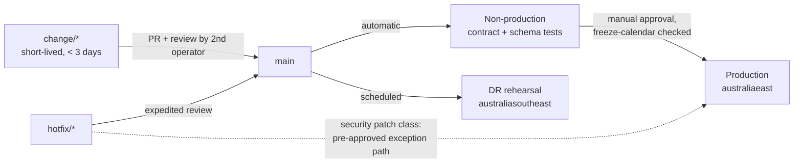
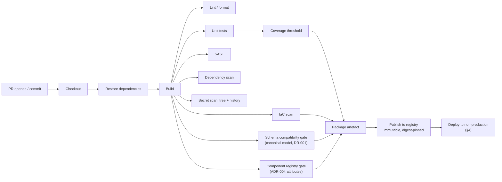
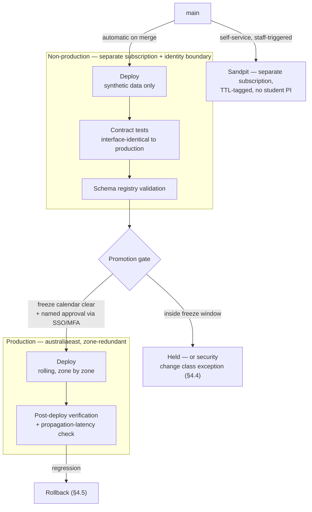
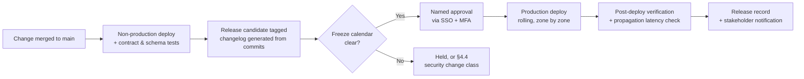

# DevOps Strategy — University-Controlled Integration Plane

> **Template Origin**: Official | **ArcKit Version**: 6.7.5 | **Command**: `/arckit:devops`

## Document Control

| Field | Value |
|-------|-------|
| **Document ID** | ARC-001-DEVOPS-v1.0 |
| **Document Type** | DevOps Strategy |
| **Project** | Learning & Teaching Baseline Strategy (Project 001) |
| **Classification** | OFFICIAL |
| **Status** | DRAFT |
| **Version** | 1.0 |
| **Created Date** | 2026-07-29 |
| **Last Modified** | 2026-07-29 |
| **Review Cycle** | Annual, plus event-triggered (§16.4) |
| **Review Date** | 2026-08-28 |
| **Next Review Date** | 2027-07-29 |
| **Owner** | Sam Okafor, Integration Architect |
| **Reviewed By** | PENDING |
| **Approved By** | PENDING |
| **Distribution** | Project Team; Digital & IT; Learning Technologies; Cybersecurity; Privacy & Records; Procurement; AV & Media Services; Steering Committee |

## Revision History

| Version | Date | Author | Changes | Approved By | Approval Date |
|---------|------|--------|---------|-------------|---------------|
| 1.0 | 2026-07-29 | ArcKit AI | Initial creation from `/arckit:devops` command — engineering practice for the six university-controlled components defined by ADR-001, ADR-003, ADR-005 and ADR-006, plus the course-cloning automation recorded as integration 3 | PENDING | PENDING |

---

## 0. Scope — What Actually Has a Pipeline

This section is placed first because it is the finding that shapes every other section, and because a conventional DevOps strategy applied to this estate would be largely fictional.

The University of Funk's Learning & Teaching estate is **overwhelmingly commercial SaaS**. Blackboard, Echo360, Turnitin, ExamSoft, PebblePad, Zoom, MS Teams, Qualtrics, Evasys, Leganto, Padlet, LinkedIn Learning, Remark, Kuracloud, iSimulate, Articulate 360, Camtasia, Adobe Creative Suite, MuseScore and Ableton Live are vendor products [SL-C1]. **The university does not build, test, package, deploy or release any of them.** Writing CI stages, container base images, Kubernetes namespaces or blue-green cutovers for that estate would describe work nobody will ever do.

### 0.1 The deployable surface

| # | Component | Origin | Has a pipeline? |
|---|-----------|--------|-----------------|
| 1 | Integration broker / event mediation | ADR-001 Option B | **Yes** — configuration and connector code, deployed as code |
| 2 | Canonical schema registry | ADR-001, DR-001 | **Yes** — the schema artefacts and the registry itself |
| 3 | State reconciliation service | ADR-003 Option B layer 3 | **Yes** — custom-built; the only genuinely bespoke application in scope |
| 4 | Telemetry, metrics and log store | ADR-003 Option B layers 1–2 | **Yes** — as infrastructure and alerting-as-code |
| 5 | Integration runtime / connector compute | ADR-001 phasing | **Yes** — event-triggered managed compute |
| 6 | Non-production and sandpit substrate | ADR-005 three-tier model, INT-008 | **Yes** — and the sandpit is undesigned today [SL-C2] |
| 7 | Course cloning automation | `system-landscape.md` integration 3 | **Not yet, and this is the urgent one** — semi-manual, undocumented, single-person dependency [SL-C3] |

Rows 1–6 are the ADR-006 in-scope workload set [A6-C1]. Row 7 is not in that set because it is not new — it is existing production automation that already runs, unversioned, on one person's knowledge. It is included here because it is the only item in this document that can be improved in week one at near-zero cost, and because it is the concrete instance of the failure mode every other section of this strategy exists to avoid recurring.

### 0.2 What has no deployment pipeline, and why that is correct

| Estate segment | Why there is no pipeline | What governs it instead |
|----------------|--------------------------|-------------------------|
| The ~20 vendor SaaS L&T platforms | Build, test, release and deployment are the vendor's. Tenancy and hosting region are product properties, not UoF decisions [A5-C1] | Procurement and contract (DR-005 residency register, NFR-C-002 APP 8 assessment, NFR-A-001 SLA verification, NFR-I-002 exit terms); RIFF review (BR-007) |
| Vendor-side configuration of those platforms (LTI registrations, SCIM connectors, MFA policy, gradebook settings) | Configured through vendor admin consoles; most expose no declarative API | **Change-controlled, not pipelined.** §8.5 defines a configuration-as-record discipline — the honest middle ground |
| Student information system (PeopleSoft), timetabling (Allocate+) | Pre-existing institutional systems outside Project 001 [A5-C1] | Their own change control; this strategy consumes their change events |
| Institutional data platform (INT-009 counterparty) | Owned outside L&T [A6-C2] | Its own release process; INT-009 is an interface obligation |
| Teaching-lab desktop fleet; lecture-theatre capture appliances | Constraint TC-4 — partly outside L&T project control while materially affecting security maturity [A8-C1] | Endpoint management and AV & Media Services. §12.4 states plainly why the Essential Eight gap here is **not** closed by this strategy |

**Stated plainly**: this strategy covers roughly six components plus one legacy script set. It does not cover, and cannot cover, the platforms that deliver almost all of the university's teaching. Anyone reading a DORA metric in §16 should read it as describing the integration plane, not the L&T estate.

### 0.3 Consequence for maturity targets

A six-component footprint operated by a team that currently holds a **single-person dependency on a cloning script** [SL-C3] should not be planning GitOps, service mesh or an internal developer platform. Sections 7 and 14 explicitly decline those, with reasons. The target is a **proportionate Level 3**, and the argument for stopping there is in §1.2.

---

## 1. DevOps Overview

### 1.1 Strategic Objectives

| Objective | Target | Rationale |
|-----------|--------|-----------|
| Environments reconstructible from code | 100% of the three ADR-005 tiers, verified by rehearsal | ADR-005 chose **recovery-from-code**; if the code cannot rebuild the plane, the disaster-recovery posture is broken [A5-C2]. Infrastructure as code is therefore not an engineering preference here — it is the DR control |
| Personal information outside production | Zero, enforced by technical control | ADR-005 prohibits personal information outside production and requires it be "implemented as a control, not a policy" [A5-C3]. DR-004 placement data must exist only in production |
| Recovery rehearsal | 2 per year (each semester), elapsed time recorded against the §5 RTO | ADR-005 Condition 2 — "a rebuild from code that has never been executed is not a recovery posture" [A5-C4] |
| Deployment frequency (non-production) | Weekly or on demand | Contract tests and schema validation must be cheap enough to run before every promotion, or they will be skipped |
| Deployment frequency (production) | Per release, outside change-freeze windows | NFR-A-002 requires change scheduled around the academic calendar, with freeze windows in assessment and examination periods |
| Lead time for changes | Under 5 working days from merge to production, outside freezes | Bounded by academic-calendar change control, not by pipeline speed. A faster pipeline does not shorten a freeze |
| Change failure rate | Under 15% of production deployments requiring rollback | Industry-standard threshold; measured from the first cutover, not asserted now |
| Mean time to restore (component failure) | Within the NFR-P-001 15-minute propagation SLA where the failure is a connector; within the §5 RTO where it is a region | Recovery objectives are inherited from ADR-005, not invented here |
| Production automation with no single-person dependency | 100% | NFR-M-002 — at least two people can execute and troubleshoot every production automation |
| Secrets held in source control | Zero, verified by scanning of both working tree and history | The moment undocumented scripts (§0.1 row 7) enter version control is the highest-risk moment in this plan for committing a credential |

### 1.2 DevOps Maturity — Current and Target

| Level | Current | Target | Timeline | Note |
|-------|---------|--------|----------|------|
| Level 1 (Manual builds, scripted deploys) | **Partly — and below it in places** | Superseded | — | Course cloning is semi-manual and undocumented [SL-C3]; institutional hierarchy updates are wholly manual; sandpit provisioning does not exist [SL-C2]. There is **no environment discipline at all** [A5-C5] |
| Level 2 (CI automation, manual deploys) | No | **Yes** | Q1 2027 | Achieved when the plane's IaC and the reconciliation service build and test on every commit |
| Level 3 (CI/CD automation, promotion gates) | No | **Yes — this is the target** | Q3 2027 | Automated promotion through non-production to production, gated by contract tests, schema compatibility and the academic-calendar freeze calendar |
| Level 4 (Continuous deployment, feature flags) | No | **No — deliberately declined** | — | Continuous deployment to a teaching-critical shared dependency during a teaching period is the opposite of NFR-A-002. Freeze windows are a requirement, not an impediment to be engineered away |
| Level 5 (GitOps platform, self-healing) | No | **No — deliberately declined** | — | Six components and two operators do not justify a platform layer. §7 and §14 state this in full |

**The honest current position is not "Level 1".** It is that some production automation sits below Level 1 — it is a person, not a script that anyone can run. That is what R-007 records, and it is the baseline this document measures from.

**Why Level 3 and not higher.** Levels 4 and 5 solve problems this estate does not have (high deployment volume, many teams, many services) and worsen problems it does have (a concentrated shared dependency, a period-differentiated availability obligation, and an operating team of two). ADR-006 §6.3 already established that operating surface is a first-order constraint at this footprint, not a footnote [A6-C3]. Declining Levels 4 and 5 is consistent with that finding rather than a lack of ambition.

### 1.3 Team Structure

| Team | Responsibility | Size | Note |
|------|----------------|------|------|
| Integration / platform (Digital & IT) | Landing zone, IaC, broker configuration, connectors, reconciliation service, pipelines | **2 named operators minimum** | NFR-M-002 two-person rule. ADR-006 §10.1 records this as a dependency, not an aspiration [A6-C4] |
| Learning Technologies | Course cloning and rollover operation; sandpit consumers; runbook execution | Existing team | Currently absorbs the manual account and cloning handling this strategy removes |
| Cybersecurity | Pipeline security gates, secret-scanning policy, Essential Eight evidence, break-glass review | Existing (Tobias Ohm) | Owns the ML2 pathway that pipeline controls contribute to |
| Privacy & Records | Non-production data control sign-off; telemetry minimisation | Existing (Eleanor Frame) | ADR-005 Condition 3 and ADR-006 Condition 4 both gate on this |
| AV & Media Services | Capture-appliance administrative accounts | Outside project control (TC-4) | **Not represented in the engagement stakeholder register** [A8-C1]. §12.4 |

**Gap stated openly.** There is no platform team, no dedicated release engineer and no on-call rotation covering the plane today. ADR-001 and ADR-003 both record an operational uplift commitment; ADR-003 Condition 4 requires on-call and runbook coverage to be agreed **before the first alert is enabled**, with business-hours-only scope stated openly if out-of-hours is not funded [A3-C1]. This strategy assumes nothing beyond that condition.

### 1.4 Technology Stack

| Layer | Position | Basis |
|-------|----------|-------|
| Cloud provider | **Microsoft Azure**, `australiaeast` primary, `australiasoutheast` recovery | ADR-006 Option A, conditional on the Principle 19 entitlement test [A6-C5] |
| Topology | Single Australian region, multi-availability-zone, cross-region recovery from code | ADR-005 Option A [A5-C2] |
| Environment tiers | Production / non-production / sandpit, separated by **subscription and identity boundary** | ADR-005 §5.4 [A5-C6] |
| Compute preference | **Managed platform services**; event-triggered managed compute for connectors and reconciliation | ADR-006 — every self-managed operating system is an Essential Eight patching obligation UoF must own [A6-C6] |
| Container orchestration | **No self-managed cluster.** Containers only as the packaging unit for a managed container runtime | §6 and §7 |
| Messaging | Managed messaging/event services exposing an open protocol (AMQP or equivalent) | ADR-006 Condition 3 [A6-C7] |
| Instrumentation | **OpenTelemetry**, adopted as a standard rather than a product | ADR-003 §5 Option B [A3-C2] |
| Languages | To be set at build; expected a single mainstream language for the reconciliation service and connectors | Deliberately unfixed — ADR-001 broker selection is open under its Condition 1 |
| Source control | Git, institutional hosting under institutional SSO | NFR-M-002, NFR-SEC-001 |
| CI/CD platform | **Open — decided by the joint Principle 19 entitlement test.** Selection criteria in §3.1 | ADR-001 C1 / ADR-003 C1 / ADR-006 C1 / ADR-008 C5, which §3.1 argues must be run **once** |
| Infrastructure as code | **Terraform (or OpenTofu)** recommended; see §5.1 for the Bicep counter-argument | ADR-006 Condition 3 makes portability binding [A6-C7] |
| Secret store | Azure Key Vault, referenced not copied | §9 |
| Pipeline identity | **Workload identity federation (OIDC)** — no long-lived pipeline secret | ADR-008; §9.2 |

---

## 2. Source Control Strategy

### 2.1 Repository Structure

**Selected: single repository for the integration plane** (a monorepo of six components), with the course-cloning automation admitted into it as its own directory during Phase 0.

| Pattern | Assessment |
|---------|-----------|
| **Single repository (selected)** | Six components sharing one canonical model, one landing zone, one release cadence and two operators. A shared change to the canonical schema and its consumers is one reviewable commit rather than six coordinated ones. Repository sprawl is a per-repository operating cost that two people cannot absorb |
| Multi-repository | Rejected at this footprint. It would be right if the components had independent teams and independent release cadences; they have neither |

### 2.2 Repository Layout

```text
lt-integration-plane/
├── .github/workflows/            # or azure-pipelines/ — see §3.1
│   ├── ci.yml                    # build, test, scan on every PR
│   ├── schema-compat.yml         # canonical-model backward-compatibility gate (§3.4)
│   ├── deploy-nonprod.yml
│   ├── deploy-prod.yml           # freeze-calendar gated (§4.3)
│   ├── dr-rehearsal.yml          # scheduled rebuild into australiasoutheast (§5.5)
│   └── sandpit-provision.yml     # self-service, TTL-tagged (§8.4)
├── infra/
│   ├── modules/                  # broker, schema-registry, reconciliation, telemetry, network, identity
│   ├── environments/
│   │   ├── production/           # australiaeast, zone-redundant
│   │   ├── nonproduction/        # separate subscription, single-zone
│   │   └── sandpit/              # separate subscription, ephemeral
│   └── recovery/
│       └── australiasoutheast/   # zone-aware overrides — see §5.4
├── schemas/                      # canonical model (DR-001), versioned; source of truth
│   └── v1/                       # student, course, enrolment, institutional_role
├── services/
│   └── reconciliation/           # ADR-003 layer 3 — the only bespoke application
├── connectors/                   # per-integration adapters, INT-001 … INT-009
├── observability/
│   ├── alerts/                   # alerting as code, named owner per alert (§11.4)
│   └── dashboards/
├── testdata/
│   └── synthetic/                # synthetic cohort generator (§8.3) — a first-class deliverable
├── legacy/
│   └── course-cloning/           # Phase 0 landing zone for integration 3 (§2.6)
├── component-registry.yaml       # ADR-004 attributes, CI-enforced (§12.2)
├── docs/
│   └── runbooks/                 # one per alert, one per recovery path
└── CODEOWNERS
```

### 2.3 Branching Strategy

**Selected: trunk-based development** — `main` plus short-lived branches, merged by pull request.

| Strategy | Assessment |
|----------|-----------|
| **Trunk-based (selected)** | `main` is always the deployable truth. With two operators, a release-branch ceremony costs more coordination than it removes. Change control against the academic calendar is enforced at the **deployment gate** (§4.3), not by holding code on a branch — which is the mistake GitFlow invites, because a long-lived release branch drifts and then merges badly at exactly the wrong point in the teaching period |
| GitFlow | Rejected. Five branch classes for six components and two people is ceremony. It also encourages holding change on `release/*` through a freeze window, producing a large, poorly tested merge immediately after the freeze lifts — the highest-risk shape a change can have |
| GitHub Flow | Effectively equivalent to the selection; the distinction is not material here |



### 2.4 Branch Protection

| Branch | Rules |
|--------|-------|
| `main` | Pull request required; **1 approving review from the second named operator**; all status checks required (build, test, lint, SAST, dependency scan, secret scan, IaC scan, schema-compatibility, component-registry); linear history; no direct push; no force push; signed commits |
| `change/*`, `hotfix/*` | No restrictions |

The required review is doing double duty: it is a code-quality control **and** the routine mechanism by which the NFR-M-002 two-person rule is exercised rather than merely asserted. If only one person can review a change, that fact becomes visible weekly instead of at the point of an outage.

`CODEOWNERS` assigns `schemas/` jointly to the integration owner and the canonical-model owner (DR-001 requires a named owner accountable for model maintenance), and `observability/alerts/` to the alert owner named in each alert definition.

### 2.5 Commit Conventions

Conventional Commits, so that release notes and the changelog are derivable rather than written.

| Type | Use | Example |
|------|-----|---------|
| `feat` | New capability | `feat(connector): add INT-005 placement outcome adapter` |
| `fix` | Defect correction | `fix(reconciliation): correct role comparison for sessional staff` |
| `schema` | Canonical model change — **triggers the §3.4 compatibility gate** | `schema(enrolment): add teaching_period to v1 minor` |
| `infra` | Infrastructure as code | `infra(nonprod): separate subscription boundary` |
| `sec` | Security remediation — **eligible for the §4.4 pre-approved change class** | `sec(deps): patch transitive dependency CVE` |
| `docs` | Documentation and runbooks | `docs(runbook): add region-loss rebuild procedure` |
| `chore` | Maintenance | `chore(iac): bump provider version` |

### 2.6 Bringing the Course-Cloning Automation Under Control (Phase 0)

`system-landscape.md` integration 3 records course-cloning automation as **semi-manual scripts, undocumented, with a single-person dependency** [SL-C3]. It is the cheapest and highest-value source-control action available, and it is sequenced first for that reason.

| Step | Action | Why in this order |
|------|--------|-------------------|
| 1 | Locate every script, scheduled task and manual step, with the current operator present | The inventory is the asset. It cannot be recreated if that person leaves first |
| 2 | Commit **verbatim, unimproved**, to `legacy/course-cloning/` | Resist the urge to fix while capturing. A refactor at this point risks losing behaviour nobody has documented yet |
| 3 | Run secret scanning over the working tree **and the full commit history** immediately | Scripts of this vintage commonly carry embedded service credentials. Committing them to a shared repository converts a local exposure into an institutional one. This step is the reason §9.4 requires history scanning and not only pre-commit hooks |
| 4 | Write a runbook, then have the **second operator execute it end to end** while the first observes and does not intervene | NFR-M-002's acceptance criterion is "a runbook exists and has been followed by a second person" — not that a runbook exists |
| 5 | Add execution logging with actor, timestamp and scope | Principle 13 and UC-3 step 4. Attribution is available before the rewrite, not after it |
| 6 | Only then rebuild as INT-004 self-service rollover | The target state is self-service (UC-3, INT-004), not better scripts |

**Explicit warning against the wrong success.** Steps 1–5 make the current arrangement safe; they do not make it correct. If Phase 0 concludes and INT-004 is never delivered, the estate has version-controlled a defect and may stop feeling the pressure to fix it. R-007's remedy is a self-service rollover process, and Phase 0 is scaffolding toward it, not a substitute.

---

## 3. CI Pipeline Design

### 3.1 CI/CD Platform Selection — Open, With Criteria

The platform is **not** pre-selected here, and that is deliberate. ADR-001 Condition 1, ADR-003 Condition 1, ADR-006 Condition 1 and ADR-008 Condition 5 are all the same Principle 19 entitlement question asked about different products. ADR-008 Condition 5 states the point directly: run it **as one assessment**, because "the same entitlement question asked three times produces three procurement conversations and one answer" [A8-C2]. CI/CD tooling belongs in that single assessment. Selecting a platform in this document, ahead of it, would invert the university's own governance process — the exact criticism ADR-006 §6.3 levels at choosing before testing [A6-C8].

**Mandatory selection criteria** (a candidate failing any one is not adoptable):

| # | Criterion | Basis |
|---|-----------|-------|
| 1 | **OIDC workload identity federation** to Azure, so no long-lived cloud credential is ever stored in the CI system | ADR-008 replaces shared credentials with named identity; a stored deployment secret is a shared credential with extra steps |
| 2 | Deployment approval gates bound to **institutional SSO with MFA**, individually attributable, no local platform accounts | NFR-SEC-001, ADR-008 Condition 5 — new infrastructure must not become the third platform with local accounts [A8-C3] |
| 3 | **No self-hosted runners required** for the standard path | A self-hosted runner is a university-patched operating system. It moves *patch operating systems* back onto UoF's ledger and directly contradicts ADR-006's managed-service argument for the ML2 pathway [A6-C6] |
| 4 | Immutable audit record of who deployed what, when, to which environment | NFR-C-003; RIFF evidence under BR-007 |
| 5 | Pipeline definitions stored as code **in the same repository** as what they deploy | Principle 13; a pipeline configured in a web console is not reproducible |
| 6 | Secrets referenced from Azure Key Vault at run time, never copied into pipeline variables | §9 |
| 7 | Australian-region execution, or no personal information present in pipeline execution at all | NFR-C-002 — a pipeline that processes real data offshore would add an APP 8 trigger the plane was designed to avoid |

**Working assumption for planning**: a Microsoft-ecosystem platform (Azure Pipelines or GitHub Actions) satisfies criteria 1–7 and consumes existing entitlement, which is the strongest Principle 19 position. Between them, GitHub Actions is the leaning on OIDC federation maturity and on the portability that ADR-006 Condition 3 makes binding. **This is a leaning, not a decision.** Recorded as Assumption A-2.

### 3.2 CI Pipeline Architecture



### 3.3 CI Stages and Gates

| Stage | Jobs | Duration target | Failure action |
|-------|------|-----------------|----------------|
| Build | Checkout, restore, compile | Under 3 min | Block |
| Lint and format | Language linter, IaC format check, schema lint | Under 1 min | Block |
| Unit tests | Reconciliation service, connector transforms, synthetic-data generator | Under 5 min | Block |
| Coverage | Line coverage threshold | Under 1 min | Block below threshold |
| SAST | Static analysis of the reconciliation service and connectors | Under 5 min | Block on High or Critical |
| Dependency scan | Direct and transitive dependencies | Under 3 min | Block on High or Critical |
| Secret scan | Working tree and full history | Under 2 min | **Block, and treat any finding as a live incident** |
| IaC scan | Policy-as-code over the Terraform plan | Under 3 min | Block on High or Critical |
| Schema compatibility | Canonical-model backward-compatibility (§3.4) | Under 2 min | **Block — no override without a recorded exception** |
| Component registry | ADR-004 attribute completeness (§12.2) | Under 1 min | Block |
| Contract tests | Against non-production, interface-identical to production | Under 10 min | Block promotion |
| **Total (pre-promotion)** | — | **Under 25 min** | — |

| Quality gate | Threshold | Enforcement |
|--------------|-----------|-------------|
| Line coverage, reconciliation service | 80% minimum, no regression against `main` | Required. The reconciliation service is the component whose *wrong answer* is silent, so its own correctness needs the strictest coverage in the repository |
| Line coverage, connectors and IaC | 60% minimum on transform logic; IaC validated rather than coverage-measured | Required |
| Lint errors | 0 | Required |
| Unit test pass rate | 100% | Required |
| SAST Critical / High | 0 | Required |
| Dependency vulnerabilities Critical / High | 0 unresolved, or a recorded time-boxed exception with an owner | Required |
| Secrets detected | 0 | Required — no override path |
| IaC policy violations Critical / High | 0 | Required |
| Canonical schema breaking change | 0 without an approved major-version path | Required |
| Component registry attributes missing | 0 for any component in ADR-004 deployment modes 3–5 | Required |

### 3.4 The Schema Compatibility Gate — The Highest-Value Control in This Pipeline

DR-001 requires that the canonical model be versioned with a backward-compatible evolution path, and Principle 6 prohibits point-to-point transformation for core entities. ADR-001 chose a broker over point-to-point **specifically** so that canonical conformance is enforced at runtime rather than by discipline — its justification is that "enforcement is the difference between a model that governs and a model that documents" [A1-C1].

A schema-compatibility gate in CI is where that enforcement actually lives at design time. Mechanism:

- `schemas/v1/` holds the canonical definitions for student, course, enrolment and institutional role (DR-001), each with an explicit version.
- On any change under `schemas/`, CI compares the proposed definition against the version currently registered in production and classifies the change:
  - **Compatible (additive optional field, new enum value in a tolerant position, documentation)** → minor version, passes.
  - **Breaking (field removal, type narrowing, required-field addition, enum value removal)** → **fails**. Passing requires an explicit new major version alongside the retained previous major, plus a recorded deprecation window per DR-001's backward-compatibility policy.
- The gate also asserts that every connector in `connectors/` declares which schema major version it consumes, so a breaking change cannot be merged while a consumer still depends on the retired version.

**Why this matters more here than in a typical estate**: ADR-003's whole rationale is that this estate's failures are *silent* — a role never assigned, a group that never appeared, a grade that diverges [A3-C3]. A quietly incompatible schema change produces exactly that class of failure: transport succeeds, the message is accepted, and the derived copy is subtly wrong. Catching it in CI is the only place it is cheap.

### 3.5 Artefact Management

| Artefact | Store | Retention | Notes |
|----------|-------|-----------|-------|
| Deployable packages / container images | Azure Container Registry, `australiaeast` | 90 days for pre-release; indefinite for anything deployed to production | Referenced by **immutable digest**, never by a mutable tag, in every environment |
| Canonical schema definitions | Schema registry, plus git as the source of truth | Indefinite — schemas are institutional assets (DR-001) | Registry export is part of the recovery-region content set [A5-C7] |
| Terraform plan output | CI run artefact, attached to the PR | 90 days | The reviewed plan is the evidence that the applied change was the approved change |
| Synthetic test datasets | Generated on demand from a version-controlled, seeded generator | Not retained as data | **Deliberate.** A retained "test dataset" drifts toward being a copy of something real. Regenerating from seed is cheaper and cannot silently acquire personal information |
| Build and deployment logs | CI platform | 12 months | Supports NFR-C-003 attribution and BR-007 RIFF evidence |
| DR rehearsal records | Repository, `docs/rehearsals/` | Indefinite | ADR-005 Condition 2 requires outcome and elapsed time recorded against the RTO [A5-C4] |

---

## 4. CD Pipeline Design

### 4.1 Promotion Path

The template's dev → staging → prod ladder does **not** apply. ADR-005 decided three tiers — production, non-production and sandpit — and the sandpit is a peer of the others rather than a lower rung: it is staff experimentation with automatic expiry, not a pre-production stage [A5-C6]. The promotion path is therefore two-stop, with the sandpit off to the side.



| Environment | Trigger | Approval | Data | Availability commitment |
|-------------|---------|----------|------|-------------------------|
| Non-production | Automatic on merge to `main` | None | **Synthetic or de-identified only** | Best effort, none stated [A5-C6] |
| Production | Manual promotion of a tested non-production build | Named approval through institutional SSO with MFA; freeze calendar checked automatically | Real personal information under APP 11 controls; placement data (DR-004) exists only here | 99.95% during teaching periods [A5-C8] |
| Sandpit (INT-008, 2027) | Self-service request by staff | Automatic, within quota | Staff identity and role only; synthetic cohorts | None — expiry is a feature [A5-C6] |

**Non-production must be interface-identical to production.** ADR-005 is explicit: "a test against a different contract proves nothing" [A5-C6]. It may be smaller (single zone, smaller SKUs) but it may not be *shaped* differently — same schema registry version, same connector contracts, same authentication mode. The IaC modules are shared; only the environment variable set differs.

### 4.2 Deployment Strategy Per Component

One strategy for all six components would be wrong. Each has a different failure shape.

| Component | Strategy | Rationale |
|-----------|----------|-----------|
| Integration connectors (stateless, event-triggered) | **Rolling, zone by zone**, with automatic halt on error-rate regression | Stateless and idempotent by design; a rolling replacement is the lowest-ceremony safe option. Zone-by-zone means a bad deployment is contained to a fraction of capacity |
| Integration broker configuration | **Additive-then-cutover.** New subscription or route created alongside the old, verified, then the old drained and removed | A broker is not a stateless app. Replacing a route in place risks in-flight events. Draining is what protects the "zero events lost" RPO [A5-C9] |
| Canonical schema registry | **Register new version alongside, never in place.** Retire only after every consumer has declared migration | Small, stateful, low volume, **high consequence** [A6-C9]. Also why §3.4's gate is non-overridable |
| Reconciliation service | **Rolling, with a dry-run first pass** in production before it is permitted to raise discrepancy records | A reconciliation service with a defect does not break quietly — it raises a flood of false discrepancies and destroys trust in the alerting. A dry-run pass costs one cycle and protects the alerting the whole ADR-003 plane depends on |
| Telemetry and log store | **Deployed by a separate pipeline and separate state.** See §11.2 | ADR-005 requires telemetry to sit outside the production blast radius [A5-C7] — a shared deployment pipeline reintroduces a shared failure mode |
| Non-production and sandpit substrate | Rebuild-from-scratch preferred over in-place update | Rebuilding these tiers regularly is the cheapest continuous proof that recovery-from-code works |

**Blue-green and canary are both declined.** Blue-green needs a duplicated running footprint, which is the cost objection ADR-005 used to reject active-active [A5-C10]; paying it for deployment convenience after rejecting it for availability would be inconsistent. Canary needs meaningful traffic segmentation, and the plane's traffic is enrolment and role change events, not user requests — a 5% canary on enrolment events means 5% of students get correct access, which is not a safe partial state.

### 4.3 The Academic-Calendar Freeze Gate

NFR-A-002 requires change and maintenance for teaching-critical platforms to be scheduled around the academic calendar, with defined freeze windows in assessment and examination periods. ADR-005 §6.3 extends that freeze calendar to cover the integration plane, not only the teaching platforms [A5-C11].

**Implemented as an automated gate, not a reminder:**

- The academic calendar — teaching-period boundaries, assessment windows, examination windows — is held as **version-controlled data** in the repository, confirmed with Learning Technologies (ADR-005 §9.1 dependency).
- The production deployment job evaluates the calendar at run time. Inside a freeze window it **fails closed** with a message naming the window and the exception path.
- The exception path requires a named approver recorded against the deployment, per NFR-A-002's second acceptance criterion. It is available, logged, and deliberately visible.
- Metric: **deployments executed inside a freeze window without a recorded exception approval — target zero** [A5-C12].

A freeze calendar that lives in a wiki is a freeze calendar that will be missed at the worst possible time. Holding it as code means the gate is exercised on every deployment.

### 4.4 The Security-Patch Change Class — A Real Conflict, Resolved

**The conflict is genuine and must be stated rather than smoothed over.** ASD Essential Eight ML2 requires patches for applications and operating systems to be applied within defined windows — and materially shorter windows where a vulnerability is being actively exploited in an internet-facing service. NFR-SEC-002 targets ML2 across the estate by end 2027. NFR-A-002 requires change freezes during assessment and examination periods. **These will collide**: a critical vulnerability disclosed during an examination window demands action inside a period when change is prohibited.

Resolution, using the mechanism NFR-A-002 already provides rather than inventing a new one:

| Change class | Freeze behaviour | Approval |
|--------------|------------------|----------|
| Feature and configuration change | Held until the freeze lifts | Standard promotion approval |
| Security patch, no active exploitation | Held if it can wait within the ML2 window; otherwise treated as below | Standard, with the ML2 deadline recorded |
| **Security patch where the ML2 window expires inside the freeze, or active exploitation is reported** | **Pre-approved change class.** Proceeds under the NFR-A-002 exception path with a named approver, deployed with a rehearsed rollback | Cybersecurity Lead plus the change approver named in the freeze policy, recorded before deployment |
| Incident remediation | Not a freeze matter — incident process applies | Incident commander |

Commits in the `sec` type (§2.5) are candidates for this class. Classification is a human decision recorded on the deployment, never an automatic inference from a commit prefix — otherwise the prefix becomes a freeze bypass.

**This resolution must be ratified by whoever owns the change-freeze policy.** This document proposes it; it does not have authority to grant it. Recorded as a condition in §17.

### 4.5 Rollback

| Failure | Response | Target |
|---------|----------|--------|
| Connector deployment regression | Redeploy the previous immutable digest; zone-by-zone halt should already have contained it | Within the NFR-P-001 15-minute propagation SLA |
| Broker configuration regression | Re-point to the retained previous route; the old route is drained but retained for one full teaching period, per ADR-001's rollback plan [A1-C2] | Minutes |
| Schema regression | Consumers continue on the previous major version, which was never retired | No action needed — this is the point of §3.4 |
| Reconciliation service producing false discrepancies | Return to dry-run mode, then redeploy the previous digest. Alerting suppressed for the affected reconciliation only, with the suppression itself alerted | Minutes |
| Zone loss | Automatic; no manual recovery [A5-C13] | Automatic |
| **Region loss** | Rebuild from code into `australiasoutheast` (§5.5) | 4 hours in teaching period, 8 hours outside [A5-C13] |
| Cutover-level failure of an integration | Halt further cutovers; delivered integrations continue with their prior mechanism retained in a disabled state until each has run one full teaching period [A1-C2] | Per ADR-001 and ADR-005 rollback plans |

The prior mechanism being **retained in a disabled state** is an ADR-001 and ADR-005 requirement, and it has a pipeline consequence: the deployment code for the legacy path is not deleted at cutover. It stays in the repository, marked disabled, with a documented re-enable path, until the retention period lapses.

### 4.6 Feature Flags

**Not adopted as a platform.** A feature-flag service is a licence line against BR-002, a new dependency, and a poor fit for the actual unit of change here, which is "is this integration cut over or not" — a question already answered by ADR-001's phased plan and by the disabled-state retention above.

What is used instead: **per-integration enablement configuration**, held in IaC and changed through the same reviewed, gated path as any other change. A connector can be disabled without a code change, which is the only flag behaviour this plane actually needs.

---

## 5. Infrastructure as Code

### 5.1 Tool Selection

**Recommended: Terraform (or OpenTofu), with the counter-argument stated.**

| Tool | Assessment |
|------|-----------|
| **Terraform / OpenTofu (recommended)** | ADR-006 Condition 3 makes the exit position **binding**: open protocols, portable schema definitions, and all infrastructure as version-controlled code, with Principle 9 applying "to this platform exactly as it applies to Blackboard" [A6-C7]. Recovery-from-code is also the DR posture — the IaC *is* the disaster-recovery plan [A5-C2]. Welding that plan to a single provider's proprietary definition language is exactly the concentration Condition 3 exists to bound |
| Bicep | The honest counter-argument: Azure-native, first-party, and a shorter skills path for a Microsoft-centric Digital & IT team. Against a two-operator constraint and SD-7 ("an architecture he can sustain"), that is a real advantage and should not be dismissed. It loses because ADR-006 §6.5 records the concentration objection as legitimate-but-accepted **on the condition** that lock-in is mitigated by design, and the IaC language is the cheapest place to mitigate it |
| ARM templates | Not considered — superseded by Bicep for the same use |
| Pulumi | Not considered — adds a general-purpose language runtime to a six-component footprint with no offsetting benefit |

**This recommendation is subject to the same Principle 19 entitlement test** as everything else in §3.1: if existing entitlement includes tooling that satisfies Condition 3, that is the answer. Recorded as Assumption A-3.

### 5.2 Module and Environment Structure

Modules are shared across all three tiers; only the environment variable set differs. This is what makes non-production interface-identical to production rather than merely similar.

| Module | Covers | Notes |
|--------|--------|-------|
| `identity` | Landing-zone identity federation, role assignments, workload identity credentials | No local administrative accounts, from the first resource (ADR-006 Condition 5) [A6-C10] |
| `network` | Private connectivity, egress controls | — |
| `broker` | Managed messaging and event services | Open protocol required (ADR-006 Condition 3) |
| `schema-registry` | Registry service and its backing store | Small, stateful, high consequence |
| `reconciliation` | Event-triggered managed compute, its data store | The only bespoke application |
| `telemetry` | Log, metric and trace store; retention rules | **Separate state file** — §11.2 |
| `sandpit` | Ephemeral environment template, TTL tagging, reclamation | §8.4 |

Per-environment variable sets differ on: subscription, region, zone configuration (§5.4), SKU sizing, retention, and — critically — the **data-control policy set**, which is present in non-production and sandpit and absent from production (§8.3).

### 5.3 State Management

| Attribute | Position |
|-----------|----------|
| Backend | Azure Storage in `australiaeast`, with versioning and soft delete |
| State locking | Enabled — mandatory with two operators |
| Encryption at rest and in transit | Enabled |
| State per environment | **Yes, and per blast-radius domain.** Production, non-production, sandpit, and telemetry each hold separate state |
| State access | Through pipeline workload identity only. **No human holds standing write access to production state**; human access is via the break-glass path (§9.3) and is alerted |
| State in the recovery region | The state backend is replicated to `australiasoutheast` as part of the recovery content set. State that exists only in the lost region makes rebuild-from-code impossible at the moment it is needed |

That last row is a specific failure mode worth naming: a recovery-from-code posture whose Terraform state lives only in the primary region is not a recovery posture. The rehearsal in §5.5 is what proves otherwise.

### 5.4 The Region Asymmetry — A Concrete IaC Requirement

ADR-006 discharged ADR-005's Assumption A-2 and found the answer **is not symmetric**: `australiaeast` supports availability zones; `australiasoutheast` does not [A6-C11].

This has a direct and easily missed consequence for the IaC:

- Production modules deploy **zone-redundant** SKUs and zone-spread configurations in `australiaeast`.
- The recovery-region overlay in `infra/recovery/australiasoutheast/` must deploy **zone-agnostic equivalents**. A rehearsal that attempts a zone-redundant SKU in a zoneless region fails at apply time — which is survivable during a rehearsal and catastrophic during a real region loss, when the failure surfaces four hours into a four-hour RTO.
- Zone configuration is therefore an explicit module input with no default, so a new module cannot silently inherit a zone assumption.
- The rehearsal (§5.5) is the only mechanism that continuously proves the recovery overlay still applies cleanly. This is the concrete reason rehearsal is a condition in ADR-005 rather than a recommendation.

### 5.5 The DR Rehearsal Pipeline — IaC as the Recovery Control

ADR-005 Condition 2: recovery rehearsed before first cutover and **each semester thereafter**, with outcome and elapsed time recorded against the RTO [A5-C4]. ADR-006 Condition 2 restates it with the specific regional constraint [A6-C12].

Implemented as a scheduled pipeline, `dr-rehearsal.yml`:

| Step | Action | Recorded |
|------|--------|----------|
| 1 | Start timer | Rehearsal start timestamp |
| 2 | Apply the recovery overlay into `australiasoutheast` from `main` | Apply duration; any zone-configuration failure (§5.4) |
| 3 | Restore the schema registry from its exported definitions | Restore duration; schema version parity against production |
| 4 | Restore configuration; **no personal information is restored** — the plane holds no state that is not reconstructible [A5-C9] | Confirmation that no personal-information restore step exists |
| 5 | Replay a synthetic event set end to end through the rebuilt plane | Functional pass or fail |
| 6 | Stop timer; compare against RTO (4h teaching period / 8h outside) | **Elapsed time against RTO** |
| 7 | Tear down; confirm no residual resource and no residual data | Teardown confirmation |
| 8 | Publish the record to `docs/rehearsals/` | Rehearsal record committed |

**Governance teeth**: ADR-005 records that a lapsed rehearsal is a reportable exception to RIFF, and that two consecutive rehearsals missing the RTO is a rollback trigger for the topology decision itself [A5-C14]. The pipeline therefore also fails the *schedule* — if a rehearsal has not run within its window, that is itself an alertable condition. A decayed recovery posture is otherwise silent, which is the exact failure class ADR-003 exists to eliminate.

### 5.6 Drift Detection

| Check | Frequency | Action |
|-------|-----------|--------|
| `terraform plan` against production, in read-only mode | Daily | Alert on any drift to the named platform owner with a runbook |
| `terraform plan` against non-production and sandpit | Daily | Alert; sandpit drift is expected within a lifetime and suppressed until expiry |
| Data-control policy assertion in non-production (§8.3) | Continuous | **Alert as a privacy incident**, not as drift |
| Local administrative account detection across the landing zone | Weekly | Alert to Cybersecurity — ADR-006 Condition 5 [A6-C10] |
| Self-managed operating system inventory | Monthly | Each instance must carry a recorded justification (ADR-006 monitoring) |
| Recovery overlay applies cleanly | Per semester via §5.5 | Rehearsal failure |

Any drift in production is a finding, because §5.3 gives no human standing write access. Drift means either the break-glass path was used or a provider-side change occurred — both of which need to be known.

---

## 6. Container Strategy

### 6.1 Position: Containers as Packaging, Not as a Platform

Containers are used **only** where they are the packaging unit a managed runtime consumes — the reconciliation service and any connector not expressible as a managed integration primitive. They are not used to build a compute platform.

The reason is an Essential Eight argument before it is an operational one. ADR-006 makes the managed-service preference explicit: "every self-managed VM is an Essential Eight patching obligation the university must own. Managed PaaS is the difference between ML1 and a credible ML2 pathway" [A6-C6]. The estate sits largely at ML1 against an end-2027 ML2 target. Every layer UoF chooses to operate is a layer it must patch, and this footprint is six components run by two people.

### 6.2 Base Images

| Application type | Base image position | Notes |
|------------------|--------------------|-------|
| Reconciliation service and connectors | A minimal, actively maintained distroless or slim base image from the language's official publisher | Chosen at build; deliberately unfixed here because ADR-001 broker selection is open and may determine the language |
| Anything else | Not expected | If a component needs a general-purpose OS image, that is a signal it should be a managed service instead |

Rules that do not depend on the language choice:

- Multi-stage builds; build dependencies never present in the runtime image.
- **Non-root user, always.** No exceptions, no override path.
- No package manager, shell or debugging tooling in the runtime image where the base image allows their omission.
- Base image references pinned **by digest**, not by tag. `latest` is prohibited everywhere, in every environment.
- Base images refreshed on a schedule (§12.3), not only when a component changes — this is the mechanism that makes "rebuild to patched state" routine, which ADR-005 identifies as how environments-as-code supports the *patch applications* and *patch operating systems* strategies [A5-C15].

### 6.3 Image Security and Registry

| Control | Position |
|---------|----------|
| Registry | Azure Container Registry in `australiaeast`. Images are build artefacts, not personal-information stores, but keeping them in-region keeps the residency register (DR-005) simple |
| Vulnerability scanning | In CI before publication, and continuously against published images. Block on High or Critical at publication; a new Critical against an already-published production image raises an alert and enters the §12.3 patch cycle |
| Image signing | Signed at build; deployment admits only signed images. This is what makes the digest-pinning above meaningful rather than decorative |
| Provenance | Build provenance attestation recorded, linking image digest to commit and pipeline run — the deployment half of the NFR-C-003 attribution chain |
| Tagging | Commit SHA for every build; semantic version for releases; **`latest` prohibited**; environment-named tags prohibited, because they are mutable and defeat digest pinning |

### 6.4 What Is Explicitly Not Used

- **No self-managed container hosts.** §6.1.
- **No self-hosted CI runners.** §3.1 criterion 3 — same argument.
- **No container image built from a base the university must patch itself** unless a recorded justification exists, per ADR-006's self-managed-OS monitoring metric.

---

## 7. Orchestration — Kubernetes Declined

**No Kubernetes cluster is adopted, and no Kubernetes-shaped platform is built.** This section exists to record the decision and its reasoning, so that a later reader does not read the absence as an oversight.

| Argument | Weight |
|----------|--------|
| **Essential Eight.** A managed Kubernetes cluster still leaves node images, cluster components and add-ons on UoF's patching ledger. ADR-006 chose managed services precisely to move that obligation to the provider [A6-C6] | Decisive |
| **Footprint.** Six components, most of which are managed messaging, a registry and event-triggered compute. There is no container-dense workload for a scheduler to schedule | Decisive |
| **Operating capability.** Two named operators, in a team whose current depth is evidenced by a single-person dependency on a script [A6-C3]. A cluster is a second full-time platform to operate, upgrade and secure | Decisive |
| **Cost.** BR-002 holds licence spend flat and ADR-006 records consumption forecastability as the CFO's live objection. A cluster is a standing baseline cost regardless of event volume, where event-triggered managed compute is not | Strong |
| **Availability.** NFR-A-001 is met by zone-redundant managed services in `australiaeast` [A6-C13]. A cluster does not improve on that; it adds a control plane to the dependency chain NFR-A-001 requires be accounted for in aggregate | Strong |
| Counter-argument: portability. Kubernetes would reduce the Principle 9 lock-in that ADR-006 §6.5 records as legitimate dissent | Acknowledged, insufficient. ADR-006 Condition 3 mitigates lock-in through **open protocols and portable schemas** — AMQP, OpenTelemetry, portable schema definitions, IaC. Buying portability by operating a cluster costs more than the lock-in it removes at this footprint |

**Re-open trigger**, stated so the decision is testable rather than permanent: revisit if the university-controlled component count materially exceeds ADR-006's Assumption A-4 set of six, **or** if a workload appears that requires long-running, container-dense compute that managed runtimes cannot host.

GitOps tooling (ArgoCD, Flux) is declined for the same reasons and does not need separate argument — it is a Kubernetes-shaped answer to a problem this footprint does not have.

---

## 8. Environment Management

### 8.1 The Three Tiers

ADR-005 §5.4 is binding here and is reproduced rather than reinterpreted [A5-C6].

| Tier | Purpose | Isolation | Data rule | Availability |
|------|---------|-----------|-----------|--------------|
| **Production** | Live integration for INT-001 to INT-009 | Dedicated. Multi-AZ, `australiaeast`. Administrative access individually attributable, no shared accounts | Real personal information under APP 11 controls. **Placement data (DR-004) exists only here** | 99.95% target during teaching periods; freeze windows apply |
| **Non-production** | Contract testing, schema-registry validation, release verification before promotion | **Separate subscription and separate identity boundary.** Single zone acceptable. Interface-identical to production | **Synthetic or de-identified only. No student personal information. No placement data under any circumstance. Enforced by control, not by policy statement** | Best effort; no commitment |
| **Sandpit** (INT-008, 2027) | Staff experimentation and development | Separate subscription. Ephemeral, per-request, time-limited with automatic expiry. Self-service, not by ticket | **No student personal information.** Staff identity and role only. Synthetic cohorts | None — expiry is a feature |

**Separation is by subscription *and* identity boundary, not by tag, namespace or naming convention.** ADR-005's phrasing is the operative standard: "separation that a misconfiguration can cross is not separation" [A5-C6]. This is also an Essential Eight *restrict administrative privileges* control, not only a hygiene measure.

### 8.2 Environment Parity

| Aspect | Parity | Notes |
|--------|--------|-------|
| Infrastructure definition | **High** — same modules | Only the variable set differs |
| Interface contracts | **Identical — mandatory** | Same schema registry version, same connector contracts, same authentication mode. A test against a different contract proves nothing [A5-C6] |
| Sizing and zone configuration | Low, deliberately | Non-production is single-zone and smaller. Cost discipline against BR-002 |
| Data | **Deliberately none** | The one dimension where parity is prohibited rather than merely imperfect |
| External integrations | Medium | Vendor SaaS test tenancies where they exist; contract stubs where they do not — which is common, and is a fidelity gap recorded honestly in §8.6 |
| Identity | Medium | Same protocols and enforcement model; separate identity boundary means separate principals, which is the point |

### 8.3 Test Data Strategy — The Hard Constraint

This is the section where ADR-005's environment decision bites hardest, and it deserves to be treated as a deliverable rather than an assumption.

**The constraint**: personal information is prohibited outside production, and ADR-005 Condition 3 requires the prohibition be "technically enforced and monitored" — "a rule that depends on everyone remembering it is the same class of control as the manual processes this project is replacing" [A5-C3].

**Order of preference:**

| Approach | Position |
|----------|----------|
| **1. Synthetic generation (primary)** | A version-controlled, deterministically seeded generator producing synthetic students, courses, enrolments and institutional roles conforming to the canonical model (DR-001: `student_id`, `course_code`, `enrolment_status`, `teaching_period`, `institutional_role`). Held in `testdata/synthetic/` as a **first-class deliverable with a named owner**, unit-tested like any other code, and versioned alongside the schema it instantiates |
| **2. De-identification (fallback, restricted)** | Available only where synthetic data provably cannot exercise a case, and only with Privacy & Records sign-off recording the re-identification risk assessment. **Never for placement records (DR-004)** — sensitive information under any transformation. De-identification is a weaker control than synthesis because its safety is a property of the transformation and the dataset together, and both drift |
| **3. Production data in non-production** | **Prohibited. No exception path in this document.** ADR-005 states the rule without qualification |

**Cases the generator must cover**, drawn from the requirements rather than invented:

- Enrolment change and withdrawal, so deprovisioning within the NFR-P-001 window is testable.
- Institutional role assignment across coordinator, tutor, marker and student (DR-002).
- Casual and sessional staff appointments starting and ending mid-teaching-period — the workflow that produced the manual CSV workaround [SL-C4], and therefore the one most needing test coverage.
- Institutional hierarchy change, for the INT-007 drift-detection path.
- Group allocation change from timetable data (INT-006, FR-014).
- Placement assessment outcome flow (INT-005) with **synthetic** placement records carrying structurally-representative but wholly fabricated clearance and health-context fields.
- Full-cohort enrolment change volume at teaching-period commencement, for NFR-S-001 peak testing.

**Enforcement controls, not policy statements:**

| Control | Mechanism |
|---------|-----------|
| Structural prevention | Non-production and sandpit subscriptions have **no network path and no identity grant** to production data stores or to PeopleSoft. The absence of a route is a stronger control than a rule about not using it |
| Detection | Continuous scanning of non-production and sandpit data stores for real-identifier patterns — institutional student identifier format, real name dictionaries, real email domains. Any hit alerts as a **privacy incident** to the Privacy & Records Officer, not as a drift finding |
| Generator provenance | The generator emits only values from a reserved synthetic identifier range, making a real identifier in non-production unambiguously an escape rather than a coincidence |
| Verification test | ADR-005 §7.1 requires that an attempted write of personal information into non-production is **blocked and alerted**. Run as a test in the pipeline, not asserted as a design property [A5-C16] |
| Pipeline hygiene | No pipeline job ever reads from a production data store. Production deployment jobs deploy; they do not extract |

**The cost is accepted, not avoided.** ADR-005 records this honestly: synthetic data generation is "genuine, recurring effort", accepted because it is "materially cheaper than the APP 11 exposure and the eventual cleanup of an uncontrolled non-production estate" [A5-C17]. This strategy adds one point: the recurring effort is *bounded by the canonical model*, which is small — five core entities. A synthetic generator for five governed entities is a tractable piece of software. It would not be tractable if the estate were generating test data for twenty platforms' internal schemas, which is another argument for the canonical model doing its job.

### 8.4 The Sandpit (INT-008) — Designing It Before It Is Built

INT-008 is recorded as **planned for 2027, not yet designed** [SL-C2]. ADR-005 makes the point that deciding its tenancy and data rules now costs nothing, and deciding them after it is built costs a remediation project [A5-C18]. The DevOps contribution is the provisioning mechanism.

| Aspect | Design |
|--------|--------|
| Provisioning | Self-service pipeline (`sandpit-provision.yml`), triggered by an authenticated staff request. **Not a ticket** — ADR-005 specifies self-service through the automated path [A5-C6] |
| Template | A golden-path environment module in `infra/modules/sandpit`, instantiating a scaled-down, interface-identical plane with synthetic data pre-seeded |
| Identity | Institutional SSO with MFA. Staff identity and role only, per INT-008. No student principals exist in this tier |
| Data | Synthetic cohorts from the §8.3 generator. No student personal information — structurally, because no route to real data exists |
| Lifetime | TTL applied as a resource tag at provision time. Default 14 days, extensible once by self-service, then requiring a named approval |
| Reclamation | Scheduled job destroys expired environments. Metric: **sandpit environments past expiry — target zero** [A5-C12] |
| Quota | Per-requester concurrent-environment and cost caps, so the tier cannot become an unbudgeted line against BR-002 |
| Anti-pattern guard | ADR-005 records the risk that the sandpit becomes a shadow production environment. Mitigations are structural: automatic expiry, staff identity only, and no real data — meaning it **cannot** serve a production purpose even if someone wished it to [A5-C19] |

Ephemeral per-pull-request environments in the conventional sense are **not** adopted. The sandpit is the ephemeral tier, and it serves staff experimentation rather than PR review. A PR is verified by the non-production contract tests, which are cheaper and interface-identical.

### 8.5 Vendor SaaS Configuration — Change-Controlled, Not Pipelined

Roughly twenty platforms have configuration that materially affects the university's posture — LTI 1.3 registrations, SCIM connector settings, MFA policy, session lifetimes, gradebook and retention settings. Almost none expose declarative configuration APIs suitable for IaC. Claiming a pipeline for them would be fiction.

The honest middle ground, and it is genuinely useful:

| Practice | Mechanism |
|----------|-----------|
| **Configuration as record** | The intended identity, integration and retention configuration for each platform is held as version-controlled data in the repository — the desired state, even where it cannot be applied automatically |
| Change control | A change to that record follows the same pull-request review path as code. The record changes *before* the console does, so the intended state is always reviewable |
| Drift detection where an API exists | Where a platform exposes a read API, a scheduled job compares actual against recorded and alerts on divergence. Where it does not, the gap is recorded as a named exception with a review date — the same discipline ADR-003 Condition 3 applies to reconciliation read access [A3-C4] |
| Attribute set | Extends the identity-posture attributes ADR-008 requires on the platform inventory: federation protocol, MFA enforcement point, SCIM support, session-revocation capability, maximum session lifetime, administrative-account model [A8-C4] |
| Freeze alignment | Vendor-initiated platform maintenance is recorded against the academic calendar, so provider change is visible against freeze windows — ADR-006 §7.3 requires exactly this extension [A6-C14] |

This is Level 1 practice for that segment of the estate, and saying so is more useful than claiming otherwise.

### 8.6 Non-Production Fidelity — Accepted Residual

Two fidelity gaps survive this design and are accepted rather than engineered away:

1. **Synthetic data cannot exercise every real-world case.** ADR-005 Assumption A-5 records the consequence: some defects will surface only in production, and the phased cutover carries more weight as a result [A5-C20].
2. **Vendor SaaS test tenancies do not exist for every platform.** Where absent, contract stubs stand in. A stub proves the contract, not the vendor's behaviour behind it — which is precisely why ADR-003's layer 3 reconciliation exists, and why it is deployed in production and not only tested in non-production.

Mitigation for both is the same: phased cutover starting with INT-001 and INT-005 per ADR-001 Condition 3, with each integration's prior mechanism retained in a disabled state for one full teaching period.

---

## 9. Secret Management

### 9.1 Store

| Attribute | Position |
|-----------|----------|
| Store | Azure Key Vault, `australiaeast`, one vault per environment tier with no cross-tier access |
| Access model | Workload identity only for services and pipelines. **No standing human read access to production secrets** |
| Encryption | Provider-managed at rest; TLS in transit |
| Audit | Every read logged and retained, supporting NFR-C-003 |
| Rotation | Automated where the platform supports it; where a vendor SaaS credential cannot be rotated automatically, the manual rotation interval is recorded on the platform record (§8.5) with an owner |

### 9.2 Pipeline Identity — No Stored Deployment Credential

This is the pipeline-layer expression of ADR-008, which replaces shared credentials with named accounts plus vaulted break-glass, and requires that new infrastructure not become a third platform with local accounts [A8-C3].

| Control | Position |
|---------|----------|
| Pipeline-to-cloud authentication | **Workload identity federation (OIDC).** The CI platform presents a short-lived, verifiable token; no client secret or certificate is stored in the CI system at all. §3.1 criterion 1 makes this a platform-selection requirement, not a configuration choice |
| Scope | One federated credential per environment, scoped to that environment's subscription. The non-production credential cannot reach production |
| Branch and environment binding | The production credential is issued only to the production deployment job running from `main`. A pull-request build cannot obtain it |
| Human deployment approval | Institutional SSO with MFA, individually attributable (NFR-SEC-001, ADR-008) |
| Secrets in the pipeline | Referenced from Key Vault at run time. **Never copied into a pipeline variable, environment file or log.** A secret in a pipeline variable is a stored credential wearing a different hat |
| Service-to-service authentication | Managed identity between plane components. No shared service account, no password, per Principle 12's prohibition on shared and generic accounts |

**Why this is stated so firmly**: a stored deployment credential is a shared credential — usable by anyone who can read the CI configuration or induce a job to echo it, and unattributable to an individual when used. ADR-008 identifies shared administrative credentials as the cause of *Restrict administrative privileges* sitting at ML1 against an ML2 target [A8-C5]. Building the new plane's deployment path on a stored secret would recreate that exact defect in new infrastructure, on day one.

### 9.3 Break-Glass

ADR-008 requires exactly one vaulted break-glass credential per platform, with logged and alerted check-out [A8-C6]. Applied to the plane:

| Aspect | Position |
|--------|----------|
| Scope | One break-glass administrative credential per environment tier, vaulted |
| Use | For loss of the identity path or the pipeline path — **never for routine deployment.** A break-glass deployment is an incident, not a shortcut |
| Controls | Check-out logged and alerted to Cybersecurity in real time; post-use review mandatory; credential rotated after every use |
| Testing | Exercised before first cutover, and thereafter alongside the §5.5 DR rehearsal. ADR-008 §7.2 is explicit that the break-glass path is "tested before first cutover, not documented after" [A8-C7] |
| Procedure | Version-controlled runbook, executable by at least two people (Principle 13) |

### 9.4 Secret Hygiene in Source Control

| Control | Position |
|---------|----------|
| Pre-commit secret scanning | Available and documented for local use |
| CI secret scanning | **Mandatory, blocking, no override path.** Scans the working tree **and the full commit history** |
| History scanning at repository creation | Run before the repository is shared, and specifically as step 3 of the §2.6 course-cloning capture |
| Response to a finding | Treated as a live incident: rotate the credential first, then remove it from history. Removal alone leaves a valid credential in every clone already taken |
| Prohibitions | No secret in source control, in logs, in a container image layer, in Terraform variables committed to the repository, or in a pipeline variable |

The emphasis on **history** scanning is not generic caution. §2.6 brings a decade of undocumented operational scripts into version control for the first time. That is the single most likely moment in this entire plan for a long-lived service credential to enter a shared repository, and a pre-commit hook installed afterwards will not find it.

---

## 10. Developer Experience

Kept deliberately small. Two operators do not need a platform; they need a repository that is quick to work in and hard to break.

| Capability | Position |
|------------|----------|
| Local setup | A single documented command brings up a local development loop; dependencies declared in-repository. Target: a new operator productive within one day |
| Development container | A `.devcontainer` definition pinning the language runtime, the IaC binary and the cloud CLI, so both operators and any future third work from an identical toolchain. Version-controlled with everything else (Principle 13) |
| Local data | The §8.3 synthetic generator runs locally. **Real data never reaches a workstation** — a laptop is a fourth environment, and an unmanaged one |
| Inner loop | Unit tests and schema-compatibility checks runnable locally in under a minute, so the blocking CI gates are rarely discovered at PR time |
| Runbooks | One per alert and one per recovery path, in `docs/runbooks/`, reviewed as code. ADR-003's position that "an alert with no runbook is deleted" makes the runbook part of the alert's definition of done [A3-C5] |
| Onboarding | The NFR-M-002 two-person rule is verified by having the second operator execute each production runbook, not by asserting they could |
| Self-service | Sandpit provisioning (§8.4) for staff. Non-production deployment for operators. **Production deployment is never self-service** |

**Not adopted**: internal developer portal, service catalogue, golden-path scaffolding templates for multiple stacks, ephemeral PR environments. §14 states why.

---

## 11. Observability Integration

ADR-003 decided the observability architecture. This section covers only how the pipeline delivers and enforces it; it does not re-decide anything.

### 11.1 The Three Layers as a Pipeline Obligation

ADR-003 adopted its three layers as a **standard, not a product**: any integration entering production must satisfy the layer definitions regardless of which backend is selected [A3-C6].

| Layer | What it answers | Pipeline obligation |
|-------|-----------------|---------------------|
| 1. Endpoint and component health | Is the broker up? Is the SaaS API responding? | Synthetic checks provisioned as code with each integration's deployment. A connector deployed without its health check is an incomplete deployment |
| 2. Flow telemetry | Did this event publish, deliver, retry, dead-letter? How long? | OpenTelemetry instrumentation, with a single trace identifier carried from source change to target write. **A CI check asserts that every connector emits the required span attributes** — instrumentation is not optional and its absence should fail the build, not be discovered during an incident |
| 3. Entity-state reconciliation | Does the derived copy actually match the authoritative source? | The reconciliation service is deployed as a first-class component with its own tests; its per-entity comparisons are configuration in version control, extended as each integration lands |

### 11.2 Telemetry Outside the Production Blast Radius — A Deployment Constraint

ADR-005 requires telemetry to ship to a store outside the production plane's blast radius, so NFR-M-001 holds during an outage: "telemetry must survive the failure it is observing — it cannot share the plane's fate" [A5-C7].

This is a **pipeline and state constraint**, easily lost in implementation:

- The telemetry store is deployed from a **separate Terraform state** and a **separate pipeline job** (§5.3, §4.2).
- It does not depend on the production plane's network path or identity boundary for ingestion or for read access.
- A deployment that breaks the production plane must not be capable of breaking the telemetry that would diagnose it. A single state file covering both would allow exactly that.
- Verification: during the §5.5 rehearsal and during failure-injection testing, telemetry read access is confirmed **while the plane is down**. Observability claimed but untested under failure is the same class of assertion as an unrehearsed recovery runbook.

### 11.3 Telemetry Content — Binding Minimisation

ADR-003 §6.4 is a binding design constraint requiring Privacy & Records sign-off before build [A3-C7]. The pipeline-relevant parts:

| Aspect | Position |
|--------|----------|
| Telemetry may carry | Entity identifiers, event type, timestamps, source and target system, outcome, error classification, trace identifier |
| Telemetry must **never** carry | Message payloads; grade values; free-text feedback; any content of placement records — specifically clearance metadata and health-context notes (DR-004, RESTRICTED) |
| Discrepancy records | Record *that* a divergence exists and on which identifier — never the divergent values |
| Retention | 13 months, enforced automatically, provisioned as code with the store |
| Residency | Australian region required |
| Enforcement in the pipeline | An allow-list of permitted span and log attributes, asserted by a CI check on instrumentation code; plus mandatory review of any change under `observability/`. **Stated honestly: an allow-list catches the common accident and not a determined one.** The residual is covered by code review and by the sign-off ADR-003 Condition 2 requires |

Also honest: this control cannot prevent a payload being placed into a *log message string* rather than a structured attribute. Detection scanning of the telemetry store for payload-shaped content is the compensating control, and it is detective rather than preventive.

### 11.4 Alerting as Code

ADR-003 §6.5 is binding [A3-C5]. Each alert definition in `observability/alerts/` must declare, and CI must enforce the presence of:

| Field | Requirement |
|-------|-------------|
| Condition | Including **absence** conditions. ADR-003's central point is that this estate's failures are silent — a batch that does not run produces no error, it produces nothing. Every scheduled and event-driven flow carries a heartbeat expectation, and absence within its window is itself alertable |
| Named owner | An individual or named team. "An alert with no named owner is everybody's and therefore nobody's" |
| Runbook link | Must resolve to a file in `docs/runbooks/`. CI fails on a broken link — an alert with no runbook is deleted |
| Period differentiation | Thresholds differentiated by academic period, per Principle 15 and NFR-A-002 |
| Severity and routing | Consistent with the on-call scope agreed under ADR-003 Condition 4, including explicit business-hours-only scoping where out-of-hours is unfunded |

Alert volume is itself a monitored metric, reviewed at the 3-month post-cutover review. If the team is ignoring alerts, the capability has failed regardless of its coverage.

---

## 12. DevSecOps

### 12.1 Shift-Left Controls

| Control | Tool class | Stage | Blocking |
|---------|-----------|-------|----------|
| Secret detection | Secret scanner | Pre-commit and CI (tree + history) | **Yes, no override** |
| SAST | Static analyser for the reconciliation service and connectors | CI | Yes, on High/Critical |
| Dependency scanning (SCA) | Dependency vulnerability scanner | CI and scheduled | Yes, on High/Critical |
| Container image scanning | Image vulnerability scanner | CI and continuously post-publication | Yes at publication |
| IaC policy scanning | Policy-as-code over the Terraform plan | CI | Yes, on High/Critical |
| Compliance-as-code assertions | Policy checks (§12.5) | CI and continuously | Yes |
| DAST | — | **Not applicable** | The plane has no public web surface. An operator dashboard, if built, is in scope for NFR-U-002 and assessed separately [A6-C15] |

### 12.2 The Pipeline as ADR-004's Enforcement Point

ADR-004 chose **Register-and-Assess**: three attributes on each component record in the capability map, with assessment depth set by deployment mode rather than licence type [A4-C1].

| Attribute | Definition | Pipeline enforcement |
|-----------|-----------|---------------------|
| `licence_identifier` | SPDX identifier, **read from the component's own licence file in its distribution** — not from a secondary source [A4-C2] | CI extracts the licence text from the resolved distribution and asserts a match against the declared SPDX identifier. Declaring from a package index is exactly the unverified secondary source ADR-004 Condition 3 prohibits |
| `patch_and_support_owner` | Named individual or team accountable for updates and support. **Absence makes the component non-adoptable** | CI fails the build if any component in deployment modes 3–5 lacks a named owner. This is a build failure rather than a report, because ADR-004 makes absence disqualifying rather than merely undesirable |
| `deployment_mode` | One of ADR-004's five modes; determines assessment depth | Declared per component; CI asserts presence and validity |

Mechanism: `component-registry.yaml` in the repository is the machine-readable projection of the capability map's third-party component attributes for anything the pipeline builds or deploys. A dependency appearing in a lock file but absent from the registry **fails the build**. ADR-004 §5.1's recorded weakness is that "adding attributes to the checklist does not, by itself, cause anyone to open the checklist" [A4-C3] — for pipeline-visible components, this closes that specific gap, because the build cannot proceed until the checklist is opened.

**Four limits, stated so this is not over-claimed:**

1. **The registry is a projection, not a second artefact.** ADR-004 Condition 6 is explicit: if implementation produces a separate open-source register document, the ADR is not being followed [A4-C4]. `component-registry.yaml` is the machine-checkable form of attributes that live authoritatively on the capability map, and must be kept reconciled with it. If it starts to diverge and acquire its own content, the condition has been breached.
2. **This is Option A enforcement, not Option B.** ADR-004 deliberately deferred SBOM generation and continuous component scanning, with a numeric re-open trigger: **more than ten components in deployment modes 3 or 4**, or the first proposal to modify a component (mode 5), or a vulnerability in a mode 3/4 component reaching production undetected [A4-C5]. The gate above must not be quietly grown into Option B; if the count crosses ten, the correct response is to **re-open ADR-004**, not to add scanning under this document's authority.
3. **Modes 1 and 2 are invisible to the pipeline, correctly.** Open source embedded inside vendor SaaS (mode 1) and open source consumed as a vendor-hosted service (mode 2) carry no university obligation and are explicitly out of ADR-004's scope [A4-C6]. The pipeline cannot see them and should not pretend to.
4. **The pipeline is not ADR-004's Condition 5.** Condition 5 requires a non-procurement RIFF trigger so that endpoint software deployment requests and LMS plugin enablement requests reach review [A4-C7]. **Those routes do not pass through this pipeline at all** — H5P as an LMS plugin and MuseScore on lab machines arrive by other paths entirely. ADR-004 states that Condition 5 is "the condition on which the decision's effectiveness actually rests". This strategy covers the pipeline-visible fraction and does not discharge it.

### 12.3 Essential Eight — What the Pipeline Contributes, and What It Cannot

NFR-SEC-002 targets ML2 across the estate by end 2027. ADR-005 notes that environments-as-code supports *patch applications* and *patch operating systems* "by making rebuild-to-patched-state routine" [A5-C15].

| Mitigation strategy | Pipeline contribution |
|--------------------|----------------------|
| **Patch applications** | Dependency scanning in CI and on a schedule; **scheduled rebuild-and-redeploy** so patched state is the deployment default rather than a project; vulnerability SLAs in §12.4; image rebuild on base-image refresh |
| **Patch operating systems** | Largely discharged by ADR-006's managed-service preference — there is little university-operated OS in this footprint by design. Any self-managed instance carries a recorded justification and is monitored [A6-C6] |
| **Restrict administrative privileges** | No standing human write access to production state (§5.3); federated pipeline identity with no stored credential (§9.2); named accounts plus vaulted break-glass (§9.3); separate identity boundary per environment tier (§8.1). This is the strategy where the pipeline design contributes most directly, and it is ADR-008's ML1 → ML2 movement |
| **Multi-factor authentication** | Deployment approval through institutional SSO with MFA; no local platform accounts (ADR-006 Condition 5) |
| **Regular backups** | Recovery-from-code rehearsed and measured (§5.5); schema registry export verified by restore rather than by description. NFR-SEC-002's acceptance criterion requires backup coverage confirmed **by test**, which §5.5 is |
| Application control; user application hardening; restrict Office macros | **Endpoint strategies. Not addressed by this pipeline.** They apply to the desktop and appliance estate |

### 12.4 What This Pipeline Does Not Fix — Stated Plainly

ADR-006 records the position without softening it: managed services improve the Essential Eight pathway for new infrastructure but "do nothing for lab fleets and capture appliances, which remain the dominant gap" [A6-C16].

| Gap | Why the pipeline cannot address it | Where it belongs |
|-----|-----------------------------------|------------------|
| Lecture-theatre capture appliance patching | Appliance firmware, vendor-controlled, partly outside L&T project control (TC-4) [A8-C1] | AV & Media Services, under a CIO mandate. ADR-008 Condition 6 requires named owners from AV & Media Services and Infrastructure/Identity **before implementation** |
| Teaching-lab software version lag | Endpoint fleet management, not a deployment pipeline | Endpoint management; ADR-004 mode 4 attributes |
| Shared administrative accounts on capture appliances | Not university-deployed infrastructure | ADR-008's named-account and break-glass remediation |
| Vendor SaaS patching posture | Vendor-operated by definition | Contract and assurance under NFR-SEC-002's verification-by-test criterion |
| *Application control*, *user application hardening*, *restrict Office macros* at ML2 | Endpoint mitigation strategies | Endpoint security programme |

**These are the larger share of the ML2 gap.** A DevOps strategy that presented Essential Eight as solved by good pipelines would be misleading, and would let the appliance estate remain invisible — which is precisely the condition ADR-008 raises as an engagement gap.

### 12.5 Compliance as Code

| Framework | Assertion in the pipeline | Basis |
|-----------|--------------------------|-------|
| **Privacy Act 1988, APP 8** | No university-controlled resource deployed outside an Australian region. Build fails on any non-Australian region in a plan | ADR-006 monitoring metric: workloads outside Australian jurisdiction — zero [A6-C17] |
| **Privacy Act 1988, APP 11** | Encryption at rest and in transit asserted on every data store; public network access denied by default; least-privilege role assignments | ADR-006 §8.3 |
| **APP 11 / DR-003 / DR-004** | No personal information outside production, verified by test (§8.3) | ADR-005 Condition 3 |
| **Telemetry minimisation (DR-006)** | Retention rules present on every telemetry store; span-attribute allow-list | ADR-003 §6.4 |
| **ASD Essential Eight** | Self-managed OS inventory; local administrative account detection; patch currency | §12.3 |
| **NFR-SEC-001** | No local administrative accounts on any deployed resource | ADR-006 Condition 5 |
| **ADR-004 attributes** | `licence_identifier`, `patch_and_support_owner`, `deployment_mode` present for modes 3–5 | §12.2 |
| **DR-001 / Principle 6** | Canonical schema backward compatibility | §3.4 |
| **NFR-A-002** | Production deployment blocked inside a freeze window without recorded exception | §4.3 |

> **Not applicable**: GDS Service Standard, Technology Code of Practice, NCSC Cyber Essentials and Cloud Security Principles, UK GDPR, G-Cloud. These are UK Government instruments with no standing for a private Australian university, and asserting compliance with them would be misleading rather than merely redundant. The applicable frameworks are the Privacy Act 1988 (Australian Privacy Principles), the ASD Essential Eight, WCAG 2.2 AA, and the university's own RIFF governance process. Currency throughout is AUD.

### 12.6 Vulnerability Management SLAs

| Severity | Remediation window | Freeze interaction |
|----------|-------------------|--------------------|
| Critical, actively exploited, reachable from an untrusted network | 48 hours | **Pre-approved change class** (§4.4) — proceeds under the NFR-A-002 exception path |
| Critical | 2 weeks | Uses the exception path only if the window expires inside a freeze |
| High | 4 weeks | Scheduled around freeze windows |
| Medium | 3 months | Routine |
| Low | Next scheduled dependency refresh | Routine |

Windows are indicative and must be reconciled against the Essential Eight ML2 patch timeframes that Cybersecurity assesses against. Recorded as a condition in §17.

---

## 13. Release Management

### 13.1 Versioning

| Artefact | Scheme | Note |
|----------|--------|------|
| Reconciliation service, connectors | Semantic versioning (MAJOR.MINOR.PATCH) | Standard |
| Canonical schemas | **Independent semantic versioning per entity**, with major versions coexisting | DR-001 requires a backward-compatible evolution path; coexistence is what makes consumer migration possible without a flag day |
| Infrastructure as code | Git commit SHA; releases tagged | Infrastructure releases are the repository state, not a package |
| Deployed images | Referenced by immutable digest in every environment | §6.3 |

### 13.2 Release Process



### 13.3 Changelog and Release Notes

Generated from Conventional Commits (§2.5), not hand-written. Release notes for the plane are read by Learning Technologies and Student Administration, not only by engineers, so each release record additionally states in plain terms which integrations are affected and whether any propagation behaviour changes.

### 13.4 Cutover Releases Are Different

Cutting an integration over from its legacy mechanism is not an ordinary release. ADR-001's phased plan starts with INT-001 (SIS lifecycle) and INT-005 (placement grades) — the two with the highest failure cost [A1-C3].

| Requirement | Basis |
|-------------|-------|
| Degraded-mode design and **failure-injection tested** before the first cutover | ADR-005 Condition 1 — the argument that a plane outage costs freshness rather than teaching availability is only true if events buffer at the edge and replay rather than drop [A5-C21] |
| Recovery rehearsed before the first cutover | ADR-005 Condition 2 — gates the INT-001 cutover [A5-C4] |
| Prior mechanism retained in a disabled state for one full teaching period | ADR-001 and ADR-005 rollback plans [A1-C2] |
| Cutover scheduled outside assessment and examination windows | NFR-A-002 |
| Reconciliation (ADR-003 layer 3) active **before** the cutover, not after | ADR-003 delivers value against the current estate, before the broker exists [A3-C8] — a cutover is exactly when a divergence detector earns its cost |

### 13.5 Hotfix

1. Branch from `main` as `hotfix/*`.
2. Fix, with a test that reproduces the defect.
3. Expedited review — still a review, still by the second operator.
4. Full CI gates run. **No gate is skipped for a hotfix**; the secret-scan and schema-compatibility gates least of all, because urgency is when those mistakes are made.
5. Deploy, using the §4.4 change class if inside a freeze window.
6. Post-incident review, with the runbook updated if the response revealed a gap.

---

## 14. Platform Engineering — Declined, With Reasoning

No internal developer platform, service catalogue, self-service portal or platform API layer is adopted.

| Consideration | Assessment |
|---------------|-----------|
| Population served | Two operators and a small Learning Technologies team. An IDP's value scales with the number of teams it saves from repeated work; here that number is one |
| Footprint | Six components. A service catalogue with six entries is a table in a document |
| Cost | A new tool line against BR-002, and a new thing to operate against the operating-surface constraint ADR-006 treats as first-order [A6-C3] |
| Genuine need it would meet | Two, and both are met more cheaply: **self-service sandpit provisioning** (§8.4, a pipeline) and **golden-path templates** (§8.4's sandpit module, plus the repository layout itself as the single golden path) |

**Re-open trigger**: revisit if the number of teams consuming self-service capability exceeds two, or if the university-controlled component count materially exceeds ADR-006's Assumption A-4 set of six.

---

## 15. Australian Regulatory and Framework Alignment

This section replaces the template's UK Government compliance section. UK Government frameworks are not assessed anywhere in this document; §12.5 records why.

### 15.1 Applicable Frameworks

| Framework | Applicability | How this strategy engages it |
|-----------|--------------|----------------------------|
| **Privacy Act 1988 (Australian Privacy Principles)** | **Applies** | APP 8 — no university-controlled resource outside an Australian region, asserted in the pipeline (§12.5). APP 11 — encryption, least privilege, and the no-personal-information-outside-production control (§8.3). Privacy & Records sign-off required before build (ADR-005 Condition 3, ADR-006 Condition 4) |
| **ASD Essential Eight** | **Applies** | §12.3 for what the pipeline contributes; §12.4 for what it plainly does not. ML2 target end-2027 (NFR-SEC-002) |
| **Notifiable Data Breach scheme (Privacy Act Part IIIC)** | **Applies** | Deployment and access audit trails (§3.5, §9.1) support assessing an eligible breach within the statutory window |
| **WCAG 2.2 AA** | **Marginal** | The plane has no student-facing surface [A6-C15]. Any staff-facing operator dashboard is in scope for NFR-U-002 and assessed separately |
| **RIFF governance (institutional)** | **Applies** | Every tooling selection in this document is subject to the Principle 19 duplication test, run once across ADR-001/003/006/008 (§3.1) |
| **TEQSA assessment integrity** | Indirect | Attribution of grade and role change (NFR-C-003) is supported by deployment and access audit records |

### 15.2 Open Standards Used

Principle 9 and ADR-006 Condition 3 make open standards a binding design constraint rather than a preference [A6-C7].

| Area | Standard |
|------|----------|
| Messaging | AMQP or equivalent open protocol |
| Instrumentation | OpenTelemetry (ADR-003, adopted as a standard not a product) |
| Interface description | OpenAPI for synchronous interfaces; versioned event schemas for asynchronous |
| Federation and lifecycle | SAML 2.0 / OpenID Connect, SCIM 2.0, 1EdTech LTI 1.3 (ADR-008) |
| Containers | OCI |
| Licence identification | SPDX (ADR-004) |
| Canonical model | Published, versioned definitions with a documented identifier strategy (DR-001) |

### 15.3 Cost Position

Indicative only. **No costing baseline exists for Project 001** (inherited assumption A-1 across ADR-001, ADR-003, ADR-005 and ADR-006), so no figure is quoted. Currency for all subsequent costing is **AUD**.

| Line | Character |
|------|-----------|
| CI/CD platform | Expected to consume existing entitlement, subject to the §3.1 Principle 19 test. If it does not, a new recurring line against BR-002 |
| Non-production and sandpit consumption | Small relative to production; sandpit is ephemeral and costs only while in use [A5-C22] |
| Synthetic data generation | Genuine, recurring engineering effort, accepted rather than avoided [A5-C17] |
| DR rehearsal | Two per year: transient consumption in `australiasoutheast` plus operator time |
| Cost allocation and showback | Required by ADR-006 §7.3 so the BR-002 line is measurable rather than assumed. Tagging is applied by the IaC modules, not by convention |

---

## 16. Metrics and Improvement

### 16.1 DORA Metrics — With an Honest Caveat

DORA metrics describe **the integration plane only**, not the L&T estate. Roughly twenty platforms in this estate have no deployment pipeline (§0.2), so an estate-level DORA figure would be meaningless. Elite-tier performance is also not the objective: NFR-A-002 requires change to be *held* during assessment periods, which caps deployment frequency by design.

| Metric | Current | Target | Note |
|--------|---------|--------|------|
| Deployment frequency (non-production) | Not measured — no pipeline exists | Weekly or on demand | Cheap non-production deployment is what keeps contract tests honest |
| Deployment frequency (production) | Not measured | Per release, outside freeze windows | Deliberately not "multiple per day" |
| Lead time for changes | Not measured | Under 5 working days from merge, outside freezes | Bounded by academic-calendar change control |
| Change failure rate | Not measured | Under 15% | Measured from the first cutover |
| MTTR (component failure) | Not measured | Within the NFR-P-001 15-minute propagation SLA | Inherited from the requirement, not chosen |
| MTTR (region loss) | No capability exists today | 4 hours teaching period / 8 hours outside | ADR-005 §5.6 RTO [A5-C13] |

### 16.2 Engineering and Control Metrics

These matter more than DORA at this footprint, because they measure whether the conditions attached to ADR-005, ADR-006 and ADR-008 are actually being met.

| Metric | Target | Source |
|--------|--------|--------|
| Personal information detected in non-production or sandpit | **Zero** | Data control monitoring (§8.3) |
| Recovery rehearsals completed per year | **2** | Rehearsal records (§5.5) |
| Rehearsal elapsed time against RTO | Within RTO | Rehearsal records |
| Rehearsals overdue against schedule | Zero | Pipeline schedule check (§5.5) |
| Production automation with a single-person dependency | **Zero** | Runbook second-person execution log (NFR-M-002) |
| Secrets detected in source control | Zero | CI secret scanning (§9.4) |
| Local administrative accounts on the platform | **Zero** | Weekly detection (§5.6), ADR-006 Condition 5 |
| Break-glass check-outs | Each one reviewed, none for routine deployment | Break-glass log (§9.3) |
| Deployments inside a freeze window without recorded exception | **Zero** | Deployment record (§4.3) |
| Components in modes 3–5 lacking `patch_and_support_owner` | Zero | CI registry gate (§12.2) |
| Components in ADR-004 modes 3 or 4 | **Reported — if over 10, re-open ADR-004** | Component registry [A4-C5] |
| Self-managed operating systems in the footprint | Minimised; each justified | Monthly inventory (§5.6) |
| Breaking schema changes reaching production | Zero | Schema gate (§3.4) |
| Connectors deployed without layer 1 and 2 instrumentation | Zero | CI instrumentation check (§11.1) |
| Alerts without a named owner or resolvable runbook | Zero | CI alert-definition check (§11.4) |
| Build duration, PR to gate completion | Under 25 minutes | CI telemetry |
| Test coverage, reconciliation service | 80% minimum, no regression | CI coverage report |
| Hosting and pipeline cost against modelled figure (AUD) | Within the BR-002 envelope | Cost allocation and showback |

### 16.3 Continuous Improvement

| Activity | Frequency | Owner |
|----------|-----------|-------|
| Pipeline and control metrics review | Monthly | Sam Okafor |
| Recovery rehearsal and record review | Per semester | Sam Okafor with Tobias Ohm |
| Alert volume and usefulness review | At the 3-month post-cutover review, then quarterly | Sam Okafor with Dr. Benny Moog |
| Component registry review against the capability map | Quarterly, and at each RIFF submission | Learning Technologist team |
| Post-incident review | After every incident and every break-glass use | Incident owner |
| Freeze-calendar accuracy review | Before each teaching period | Learning Technologies with Rhonda Bell |
| Essential Eight evidence refresh | Annually, and after implementation | Tobias Ohm |

### 16.4 Review Triggers for This Document

- ADR-001 Condition 1 / ADR-006 Condition 1 entitlement test outcome — may change the CI/CD platform and IaC tool positions (§3.1, §5.1).
- ADR-006 returning to RIFF, or a change of cloud provider — invalidates §1.4, §5, §6.
- `australiasoutheast` gaining availability zones — changes §5.4 and may reopen the recovery posture.
- Component registry recording more than ten components in ADR-004 modes 3 or 4 — re-open ADR-004, and revisit §12.2.
- ADR-005 topology or environment model materially revised — invalidates §4, §5, §8.
- Two consecutive rehearsals missing the RTO — ADR-005 rollback trigger; escalate rather than adjust the target.
- A decision to run student-facing workload on the plane — invalidates ADR-005's availability argument and this document's deployment strategy with it.
- Any personal information detected outside production — treat as a privacy incident and a control failure of §8.3.

---

## 17. Conditions and Open Items

This strategy carries conditions, in the same style as the ADRs it implements, because several of its positions depend on decisions not yet taken.

1. **CI/CD platform and IaC tool selection are deferred to the single joint Principle 19 entitlement test** (ADR-001 C1, ADR-003 C1, ADR-006 C1, ADR-008 C5). §3.1 and §5.1 state criteria and a leaning, not a decision. *Owner: Cassandra Rhodes with Grace Tanaka.*
2. **The security-patch change class in §4.4 must be ratified by the owner of the change-freeze policy.** This document proposes the mechanism; it has no authority to grant a freeze exception class. Without ratification, the Essential Eight ML2 patch window and NFR-A-002 remain in unresolved conflict. *Owner: Tobias Ohm with Dr. Benny Moog.*
3. **Vulnerability SLA windows (§12.6) must be reconciled against the Essential Eight ML2 patch timeframes** Cybersecurity assesses against. The windows here are indicative. *Owner: Tobias Ohm.*
4. **The synthetic data generator requires a named owner and an explicit allocation of effort.** It is treated here as a first-class deliverable; ADR-005 accepts its cost as recurring [A5-C17]. Unowned, §8.3 degrades to a policy statement — the exact outcome ADR-005 Condition 3 prohibits. *Owner: Sam Okafor, with Eleanor Frame for the control design.*
5. **On-call and runbook coverage must be agreed before the first alert is enabled**, with business-hours-only scope stated openly if out-of-hours is unfunded. ADR-003 Condition 4, restated because it gates §11.4. *Owner: Cassandra Rhodes.*
6. **The academic freeze calendar must be confirmed with Learning Technologies and committed as version-controlled data** before §4.3's gate can function. *Owner: Rhonda Bell with Learning Technologies.*
7. **Course-cloning capture (§2.6) should begin immediately and independently of every other condition.** It depends on no unaccepted decision, costs almost nothing, and reduces a live single-person availability risk at the busiest point in the academic calendar. *Owner: Dr. Benny Moog with the current script operator.*
8. **AV & Media Services and Infrastructure/Identity must be engaged with named owners** before the Essential Eight claims in §12.3 can be evidenced beyond the plane. ADR-008 Condition 6, restated because §12.4 depends on it. *Owner: Rhonda Bell (engagement), Cassandra Rhodes (mandate).*

---

## 18. Requirements Traceability

| Requirement | Statement (abbreviated) | DevOps element | Status |
|-------------|------------------------|----------------|--------|
| BR-004 | Integration fragility and manual handling eliminated | §2.6 course-cloning capture; §4 promotion path; §11 observability delivery | Addressed |
| BR-005 | Demonstrable privacy and security posture | §8.3 data control; §9 secrets; §12 DevSecOps | Addressed |
| BR-007 | Governance operating on architectural evidence | §12.2 component registry gate; §3.5 audit artefacts | Partially — §12.2 limit 4 |
| BR-002 | Licence spend flat or reduced | §7 orchestration declined; §14 platform declined; §15.3 cost position | Supported |
| NFR-P-001 | Change propagation within 15 minutes | §4.5 rollback targets; §16 propagation-latency verification | Supported |
| NFR-S-001 | Peak load without degradation | §8.3 full-cohort synthetic volume test case | Addressed |
| NFR-A-001 | 99.9% availability during teaching periods (plane targeted at 99.95%) | §4.2 per-component deployment strategy; §5 zone-redundant IaC | Supported |
| NFR-A-002 | Change control aligned to the academic calendar | §4.3 freeze gate; §4.4 security change class | Addressed |
| NFR-SEC-001 | Institutional SSO with MFA; no local accounts | §3.1 criterion 2; §9.2 pipeline identity; §5.6 local-account detection | Addressed |
| NFR-SEC-002 | Essential Eight ML2 by end 2027 | §12.3 contribution; §12.4 explicit gaps | Partially — §12.4 |
| NFR-SEC-003 | Automated identity lifecycle | §8.3 casual/sessional test cases; §9.2 no shared credentials | Supported |
| NFR-C-001 | Privacy Act 1988 compliance | §8.3; §12.5 compliance-as-code | Addressed |
| NFR-C-002 | APP 8 cross-border disclosure assessment | §12.5 Australian-region assertion; §3.1 criterion 7 | Addressed |
| NFR-C-003 | Audit logging for academic and access records | §3.5 deployment audit; §2.6 step 5 execution logging | Supported |
| NFR-M-001 | Integration observability | §11 in full; §11.2 blast-radius separation | Addressed |
| NFR-M-002 | Reproducible, documented automation, two people | §2.4 required review; §2.6 second-person execution; §5 IaC; §10 runbooks | Addressed |
| NFR-I-001 | Published, versioned interfaces | §3.4 schema gate; §8.2 interface-identical non-production | Addressed |
| NFR-I-002 | Data portability and exit | §5.1 portable IaC; §15.2 open standards | Supported |
| NFR-U-002 | WCAG 2.2 AA | Not engaged — no student-facing surface [A6-C15]; any operator dashboard assessed separately | Not applicable |
| INT-001 to INT-009 | Target-state integrations | §13.4 cutover releases; §11 per-integration observability | Supported |
| INT-004 | Course cloning and rollover, self-service and logged | §2.6 — Phase 0 scaffolding toward it, explicitly not a substitute | Partially |
| INT-008 | Sandpit provisioning (undesigned, 2027) | §8.4 — designed here ahead of build | Addressed |
| DR-001 | Canonical data model | §3.4 compatibility gate; §13.1 independent schema versioning | Addressed |
| DR-003 | Personal information classification and inventory | §8.3; §11.3 telemetry minimisation | Supported |
| DR-004 | Sensitive placement information | §8.3 — never outside production, never de-identified into non-production | Addressed |
| DR-005 | Data residency register | §12.5 region assertion; the plane's own entry | Supported |
| DR-006 | Analytics minimisation and retention | §11.3 13-month enforced retention as code | Supported |

---

## Approval

| Role | Name | Signature | Date |
|------|------|-----------|------|
| Integration Architect (author) | Sam Okafor | | |
| Chief Information Officer | Cassandra Rhodes | | |
| Cybersecurity Lead | Tobias Ohm | | |
| Privacy & Records Officer | Eleanor Frame | | |
| Director, Learning Technologies | Dr. Benny Moog | | |

---

## External References

> This section provides traceability from generated content back to source documents.

### Document Register

| Doc ID | Filename | Type | Source Location | Description |
|--------|----------|------|-----------------|-------------|
| PRIN | ARC-000-PRIN-v1.1.md | ArcKit artifact | `projects/000-global/` | Principles 5, 6, 7, 8, 9, 12, 13, 15, 16, 17, 18, 19 |
| REQ | ARC-001-REQ-v1.0.md | ArcKit artifact | `projects/001-lt-ecosystem/` | BR, FR, NFR, INT and DR requirement identifiers; constraints TC-2, TC-4; conflict C-3 |
| ADR1 | ARC-001-ADR-001-v1.0.md | ArcKit artifact | `projects/001-lt-ecosystem/decisions/` | Central integration broker; phased cutover; three conditions |
| ADR3 | ARC-001-ADR-003-v1.0.md | ArcKit artifact | `projects/001-lt-ecosystem/decisions/` | Three-layer observability plane; binding telemetry and alerting positions; four conditions |
| ADR4 | ARC-001-ADR-004-v1.0.md | ArcKit artifact | `projects/001-lt-ecosystem/decisions/` | Register-and-Assess third-party component attributes; five deployment modes; six conditions |
| ADR5 | ARC-001-ADR-005-v1.0.md | ArcKit artifact | `projects/001-lt-ecosystem/decisions/` | Single-region multi-AZ topology; recovery from code; three-tier environment model; four conditions |
| ADR6 | ARC-001-ADR-006-v1.0.md | ArcKit artifact | `projects/001-lt-ecosystem/decisions/` | Microsoft Azure `australiaeast` / `australiasoutheast`; six in-scope workloads; five conditions |
| ADR8 | ARC-001-ADR-008-v1.0.md | ArcKit artifact | `projects/001-lt-ecosystem/decisions/` | Identity and access enforcement; named accounts plus vaulted break-glass; six conditions |
| SL | system-landscape.md | Foundation artifact | `projects/001-lt-ecosystem/external/` | Tool estate and the seven known integrations |

### Citations

| Citation ID | Doc ID | Page/Section | Category | Quoted Passage |
|-------------|--------|--------------|----------|----------------|
| SL-C1 | SL | Categorisation map | Context | Estate composed of vendor products across all eight capability categories — "Blackboard ✅ · Echo360 ✅ · MS Teams ✅ · Zoom ✅ · Turnitin ✅ · ExamSoft ✅ · PebblePad ✅ · Qualtrics ✅ · Evasys ✅" |
| SL-C2 | SL | Known integrations, row 7 | Scope Gap | "Sandpit provisioning" — method "— (planned 2027)", known issues "Not yet designed" |
| SL-C3 | SL | Known integrations, row 3 | Context | "Course cloning automation / Semi-manual scripts / Undocumented; single-person dependency" |
| SL-C4 | SL | Known integrations, row 2 | Context | "Echo360 user provisioning / LTI + manual CSV / Manual workaround for casual academic staff" |
| A1-C1 | ADR1 | Justification | Design Rationale | "it is the only option that enforces the canonical model at runtime rather than by convention, and enforcement is the difference between a model that governs and a model that documents" |
| A1-C2 | ADR1 | Rollback plan | Constraint | "integrations delivered to date revert to their prior mechanism, which is retained in a disabled state until each integration has run one full teaching period" |
| A1-C3 | ADR1 | Conditions | Constraint | "Phasing must start with INT-001 and INT-005, the SIS lifecycle and the placement grade flow — the two with the highest failure cost" |
| A3-C1 | ADR3 | §6.6 Condition 4 | Constraint | "On-call and runbook coverage agreed before the first alert is enabled. Alerting without a rostered responder is theatre." |
| A3-C2 | ADR3 | §5 Option B | Design Decision | "Instrumentation is OpenTelemetry, chosen as an open standard rather than a product, so the collection backend (managed or self-hosted) is a substitutable component under Principle 9" |
| A3-C3 | ADR3 | §6.2 Y-Statement | Context | "an integration estate whose documented failures are silent — a role that was never assigned, a group that never appeared, a grade re-keyed with a typo" |
| A3-C4 | ADR3 | §6.6 Condition 3 | Constraint | "Reconciliation read access verified per platform before commitment ... Where it does not, the gap is recorded as a named exception with a review date" |
| A3-C5 | ADR3 | §6.5 Alerting position | Constraint | "Alert on absence, not only on error"; "An alert with no runbook is deleted; an alert with no named owner is everybody's and therefore nobody's" |
| A3-C6 | ADR3 | §6.1 Chosen Option | Constraint | "The three layers are adopted as a standard, not as a product: any integration entering production must satisfy the layer definitions in §5 Option B regardless of which backend is eventually selected" |
| A3-C7 | ADR3 | §6.4 Telemetry data position | Constraint | "What telemetry must never carry: Message payloads; grade values; free-text feedback; any content of placement records"; retention "13 months, enforced automatically" |
| A3-C8 | ADR3 | §6.7 Dissent | Design Rationale | "Layer 3 delivers value against the current estate, before the broker exists" |
| A4-C1 | ADR4 | §5.1 Option A | Design Decision | "Make the depth of assessment conditional on deployment mode rather than on licence type" |
| A4-C2 | ADR4 | §5.1 attribute table | Constraint | "`licence_identifier` — SPDX identifier, read from the component's own licence file ... The component's distribution, verified — not a secondary source" |
| A4-C3 | ADR4 | §5.1 Bad | Limitation | "Adding attributes to the checklist does not, by itself, cause anyone to open the checklist" |
| A4-C4 | ADR4 | §6.4 Condition 6 | Constraint | "The attributes are added to the existing capability map, not to a new artefact. If implementation produces a separate 'open-source register' document, this ADR is not being followed" |
| A4-C5 | ADR4 | §6.5 Dissent | Review Trigger | "this ADR is revisited if the register records more than ten components in deployment modes 3 or 4, or on the first proposal to modify a component (mode 5), or if a vulnerability in a mode 3/4 component reaches production undetected" |
| A4-C6 | ADR4 | §5.1 deployment mode table | Scope | Mode 1 "Open source embedded inside vendor SaaS" — "None on the university — the vendor is the distributor ... Explicitly out of scope" |
| A4-C7 | ADR4 | §6.4 Condition 5 | Constraint | "endpoint software deployment requests and LMS plugin enablement requests both route to RIFF, independent of cost ... This is the condition on which the decision's effectiveness actually rests" |
| A5-C1 | ADR5 | §1.1 control table | Scope | SaaS L&T platforms — "No. Tenancy model and hosting region are product properties. UoF's levers are selection, contract and the DR-005 register" |
| A5-C2 | ADR5 | §5 Decision Outcome | Design Decision | "Option A — single Australian region, multi-availability-zone, with cross-region recovery from code" |
| A5-C3 | ADR5 | §5.8 Condition 3 | Constraint | "Non-production data control implemented as a control, not a policy ... A rule that depends on everyone remembering it is the same class of control as the manual processes this project is replacing" |
| A5-C4 | ADR5 | §5.8 Condition 2 | Constraint | "Recovery rehearsed before first cutover and each semester thereafter. A rebuild from code that has never been executed is not a recovery posture" |
| A5-C5 | ADR5 | §2 Context | Context | "The current estate has no environment discipline at all" |
| A5-C6 | ADR5 | §5.4 Environment strategy | Design Decision | Three tiers "separated by cloud subscription/account and identity boundary — not by namespace, tag or naming convention ... Separation that a misconfiguration can cross is not separation"; non-production "Synthetic or de-identified data only ... Interface-identical to production (NFR-I-001) — a test against a different contract proves nothing"; sandpit "Provisioned by self-service through the automated path, not by ticket" |
| A5-C7 | ADR5 | §4.1, §5.5 | Constraint | "Telemetry ships to a store outside the production plane's blast radius so NFR-M-001 holds during an outage"; "Telemetry must survive the failure it is observing — it cannot share the plane's fate" |
| A5-C8 | ADR5 | §5.2 | Design Decision | "The plane is therefore targeted at 99.95% during teaching periods (approximately 22 minutes per month)" |
| A5-C9 | ADR5 | §5.6 Recovery objectives | Constraint | "RPO — Zero events lost. Events are replayable from the authoritative source and from edge buffers; the plane holds no state that is not reconstructible" |
| A5-C10 | ADR5 | §4.2 Option B Bad | Design Rationale | "Roughly doubles the running footprint against BR-002 ... This is the decisive argument" |
| A5-C11 | ADR5 | §6.3 | Constraint | "Change freeze calendar (NFR-A-002) extended to cover the integration plane, not only the teaching platforms" |
| A5-C12 | ADR5 | §7.2 Monitoring | Metric | "Personal information detected in non-production — Zero"; "Sandpit environments past expiry — Zero"; "Change executed inside a freeze window without exception approval — Zero" |
| A5-C13 | ADR5 | §5.6 Recovery objectives | Design Decision | "RTO (zone loss) — Automatic; no manual recovery"; "RTO (region loss) — 4 hours [teaching period] / 8 hours [outside]" |
| A5-C14 | ADR5 | §6.4, §9.3 | Governance | "Rehearsal scheduled per semester with recorded outcome; lapse is a reportable exception to RIFF"; rollback trigger "a recovery rehearsal failing to meet the §5.6 RTO twice consecutively" |
| A5-C15 | ADR5 | §7.3 Compliance verification | Compliance | "environments-as-code supports patch applications and patch operating systems by making rebuild-to-patched-state routine; recovery-from-code supports regular backups" |
| A5-C16 | ADR5 | §7.1 Validation | Verification | "Data control test: attempted write of personal information into non-production is blocked and alerted (Condition 3)" |
| A5-C17 | ADR5 | §6.2 Negative | Accepted Trade-off | "Synthetic data generation is genuine, recurring effort — Accepted. It is materially cheaper than the APP 11 exposure and the eventual cleanup of an uncontrolled non-production estate" |
| A5-C18 | ADR5 | §2.1 | Design Rationale | "Deciding its tenancy and data rules now costs nothing; deciding them after it is built costs a remediation project" |
| A5-C19 | ADR5 | §6.4 Risks | Mitigation | "Sandpit becomes a shadow production environment — Automatic expiry; staff identity and role only; no student data means it cannot serve a production purpose" |
| A5-C20 | ADR5 | §12 Assumption A-5 | Assumption | "Synthetic data can adequately exercise the canonical entities for contract testing ... If invalid: more defects surface in production and the phased cutover carries more weight" |
| A5-C21 | ADR5 | §5.8 Condition 1 | Constraint | "Degraded-mode design before first cutover ... only true if events buffer at the edge and replay rather than drop. This must be designed and failure-injection tested before INT-001 cuts over" |
| A5-C22 | ADR5 | §6.4 Risks | Cost | "Non-production and sandpit are small relative to production; sandpit is ephemeral by design and costs only while in use" |
| A6-C1 | ADR6 | §1.2 In-scope table | Scope | Six university-controlled workloads: integration broker, canonical schema registry, state reconciliation service, telemetry/metrics/log store, integration runtime/connector compute, non-production and sandpit substrate |
| A6-C2 | ADR6 | §1.2 Out of scope | Scope | "re-platforming any vendor SaaS; the institutional data platform (INT-009 counterparty, owned outside L&T); the student information system (PeopleSoft) and timetabling (Allocate+); teaching-lab desktop fleets and lecture-theatre capture appliances (TC-4)" |
| A6-C3 | ADR6 | §6.3 Justification | Design Rationale | "Operating surface is a first-order constraint at this footprint. Six components do not justify a second identity model, a second network path, a second cost model and a second on-call rotation" |
| A6-C4 | ADR6 | §10.1 Dependencies | Constraint | "Skills: two operators capable of running the landing zone (NFR-M-002 two-person rule)" |
| A6-C5 | ADR6 | §6.1 Chosen option | Design Decision | "Option A — Microsoft Azure, `australiaeast` primary with `australiasoutheast` as the ADR-005 recovery region ... conditional on the Principle 19 test already required by ADR-001 Condition 1" |
| A6-C6 | ADR6 | §4.1, §3.4 | Design Rationale | "Every self-managed VM is an Essential Eight patching obligation the university must own. Managed PaaS is the difference between ML1 and a credible ML2 pathway" |
| A6-C7 | ADR6 | §6.4 Condition 3 | Constraint | "Exit position designed in, not retrofitted. Open protocols (AMQP or equivalent for messaging, OpenTelemetry for instrumentation per ADR-003), portable schema definitions, and all infrastructure as version-controlled code" |
| A6-C8 | ADR6 | §6.3 Justification | Governance | "Choosing AWS before running that test would invert the university's own governance process, and this ADR is meant to be an instance of BR-007, not an exception to it" |
| A6-C9 | ADR6 | §1.2 In-scope table | Context | Canonical schema registry — "Small, stateful, low volume, high consequence" |
| A6-C10 | ADR6 | §6.4 Condition 5 | Constraint | "No local administrative accounts, from the first resource. Platform administration via institutional SSO with MFA" |
| A6-C11 | ADR6 | §6.1, citation AZ-C1 | Technical Capability | "Australia East supplies availability zones; Australia Southeast does not" |
| A6-C12 | ADR6 | §6.4 Condition 2 | Constraint | "the recovery region holds code, configuration and telemetry only — no running compute, no personal information at rest ... A recovery-time objective must be stated and formally accepted against NFR-A-001 before the first integration cuts over" |
| A6-C13 | ADR6 | §4.1 Technical drivers | Design Rationale | "The broker becomes a shared dependency (ADR-001 Condition 2). In-region zone redundancy is the mechanism that carries this" |
| A6-C14 | ADR6 | §7.3 | Change Required | "Change-freeze process (NFR-A-002) extended so provider-initiated change is visible against the academic calendar" |
| A6-C15 | ADR6 | §4.3, §8.3 | Compliance | WCAG 2.2 AA "Marginal — These workloads have no student-facing surface. Any staff-facing operator dashboard is in scope for NFR-U-002; the underlying platform is not" |
| A6-C16 | ADR6 | §7.4 Existing risks affected | Limitation | "R-020 (Essential Eight ML2) — managed services improve the pathway for new infrastructure but do nothing for lab fleets and capture appliances, which remain the dominant gap" |
| A6-C17 | ADR6 | §8.2 Monitoring | Metric | "University-controlled workloads outside Australian jurisdiction — Zero" |
| A8-C1 | ADR8 | §2.2 Engagement gap | Scope Gap | "AV & Media Services own the appliances holding the shared administrative accounts, and Infrastructure / Identity operations own the institutional identity provider itself ... constraint TC-4 — the lecture-theatre appliance estate sits partly outside L&T project control while materially affecting security maturity" |
| A8-C2 | ADR8 | §6.4 Condition 5 | Governance | "Run as one assessment across all three decisions, not three: the same entitlement question asked three times produces three procurement conversations and one answer" |
| A8-C3 | ADR8 | §6.4 Condition 5 (ADR6 C5 restated) | Constraint | "R-019 records two existing platforms breaching this; new infrastructure must not become a third" |
| A8-C4 | ADR8 | §7.3 | Change Required | "Platform inventory extended with identity-posture attributes: federation protocol, MFA enforcement point, SCIM support, session-revocation capability, maximum session lifetime, administrative-account model" |
| A8-C5 | ADR8 | §3.2 fact 3 | Context | "Legacy shared administrative accounts in the AV/capture estate hold Restrict administrative privileges at ML1 against an ML2 target" |
| A8-C6 | ADR8 | §5.1, §7.3 | Design Decision | "shared appliance administrative accounts replaced with individually attributable named accounts ... exactly one vaulted break-glass credential per platform, check-out logged and alerted" |
| A8-C7 | ADR8 | §7.2 | Constraint | "break-glass path tested before first cutover, not documented after. This is the load-bearing mitigation of the decision" |

### Unreferenced Documents

| Filename | Source Location | Reason |
|----------|-----------------|--------|
| ARC-001-DATA-v1.0.md | `projects/001-lt-ecosystem/` | Canonical entity definitions reached through DR-001 in ARC-001-REQ, which is the artifact cited. The synthetic generator (§8.3) will instantiate this model at build time |
| ARC-001-RISK-v1.0.md | `projects/001-lt-ecosystem/` | Risk identifiers (R-006, R-007, R-019, R-020, R-024) reached through the ADRs that cite them rather than read directly; not supplied as an input to this artefact |
| ARC-001-ADR-002-v1.0.md | `projects/001-lt-ecosystem/decisions/` | Role-authority origin; not supplied as an input. Its deprovisioning claim is enforced through ADR-008, which is cited |
| ARC-001-ADR-007-v1.0.md | `projects/001-lt-ecosystem/decisions/` | Sourcing hierarchy referenced indirectly via ADR-008 Condition 5; not supplied as an input |
| privacy-context.md | `projects/001-lt-ecosystem/external/` | Essential Eight self-assessment and personal-information inventory reached through ADR-008's citations and through NFR-SEC-002 / DR-003 |
| capability-taxonomy.md | `projects/000-global/external/` | Deployment tooling is not a capability category; no mapping applies |

---

## 19. Assumptions

| # | Assumption | If invalid |
|---|-----------|-----------|
| A-1 | No costing baseline exists for Project 001; cost discussion is comparative, not quantified (inherited from ADR-001 A-1 through ADR-003, ADR-005 and ADR-006) | Positions stand on architecture; figures would need revisiting with real AUD costs |
| A-2 | A Microsoft-ecosystem CI/CD platform satisfies the §3.1 criteria and consumes existing entitlement | §3.1's leaning falls away and the platform is chosen on the criteria alone; the criteria themselves are unaffected |
| A-3 | Terraform or OpenTofu is available and supportable within existing tooling arrangements | §5.1's recommendation is re-run against Bicep, and ADR-006 Condition 3's portability obligation must then be met by other means |
| A-4 | ADR-006's six in-scope workloads remain the complete set of university-controlled hosting for the roadmap horizon (ADR-006 A-4) | §7 and §14's declined-scope arguments weaken and should be re-run |
| A-5 | Synthetic data can adequately exercise the canonical entities for contract testing (ADR-005 A-5) | Non-production fidelity is lower than assumed; more defects surface in production and the phased cutover carries more weight (§8.6) |
| A-6 | The CI/CD platform can execute without personal information present in pipeline runs, so its execution region does not create an APP 8 question | §3.1 criterion 7 becomes a hard region constraint on platform selection |
| A-7 | The academic calendar is available in a form that can be held as version-controlled data with sufficient lead time | §4.3's gate degrades to a manual check, and the freeze-window metric becomes unmeasurable |
| A-8 | Two named operators are funded and available (ADR-006 §10.1) | NFR-M-002 cannot be met, the §2.4 required review becomes a bottleneck rather than a control, and this strategy's maturity target is not achievable |

---

**Generated by**: ArcKit `/arckit:devops` command
**Generated on**: 2026-07-29
**ArcKit Version**: 6.7.5
**Project**: Learning & Teaching Baseline Strategy (Project 001) — The University of Funk
**AI Model**: Claude Opus 5
**Generation Context**: DevOps strategy scoped honestly to the deployable surface. The L&T estate is overwhelmingly vendor SaaS that the university does not build, test or deploy; §0 states which components have a pipeline and which do not, and why. The strategy therefore covers the six university-controlled components from ADR-001, ADR-003, ADR-005 and ADR-006 — broker, canonical schema registry, reconciliation service, telemetry store, connector compute, non-production and sandpit substrate — on Microsoft Azure `australiaeast` with `australiasoutheast` recovery, plus the undocumented course-cloning automation recorded as integration 3. Three ADR-derived constraints shape it structurally: ADR-005's three-tier environment model with personal information prohibited outside production (making synthetic test data a first-class deliverable rather than an afterthought), ADR-005's recovery-from-code posture (making infrastructure as code the disaster-recovery control and rehearsal a condition), and ADR-004's Register-and-Assess attributes plus ADR-008's named-account and break-glass model (making the pipeline the enforcement point rather than a spreadsheet). Kubernetes, GitOps, continuous deployment, feature-flag platforms and an internal developer platform are all explicitly declined with stated re-open triggers, on Essential Eight, footprint and operating-capability grounds. UK Government frameworks (GDS Service Standard, TCoP, NCSC, UK GDPR, G-Cloud) are excluded as having no standing for a private Australian university; Privacy Act 1988 (APPs), ASD Essential Eight, WCAG 2.2 AA and the institutional RIFF process are applied instead. Currency AUD. CI/CD platform and IaC tool selection are deliberately deferred to the single joint Principle 19 entitlement test required by ADR-001 C1, ADR-003 C1, ADR-006 C1 and ADR-008 C5.

<!-- arckit-provenance:start -->

## Build Provenance

*Stamped automatically by the ArcKit plugin's `provenance-stamp.mjs` PostToolUse hook. Complements (does not replace) the human-authored footer above. Carries only fields the model can't authoritatively self-report: build context from `.arckit/state.json` and effort levels derived from command frontmatter + the silent-downgrade matrix.*

| Field | Value |
|-------|-------|
| Requested Effort | `high` |
| Effective Effort | _unknown — model not parsed from existing footer_ |
| Stamped at | 2026-07-29T23:39:38.810Z |

<!-- arckit-provenance:end -->
