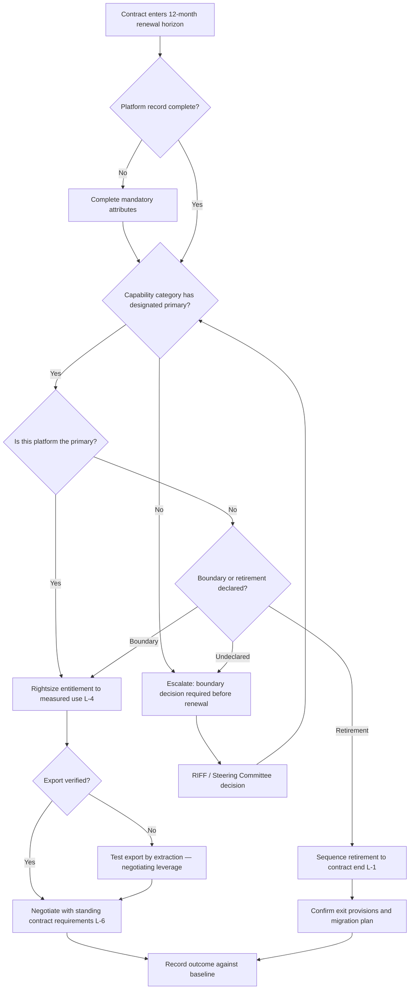
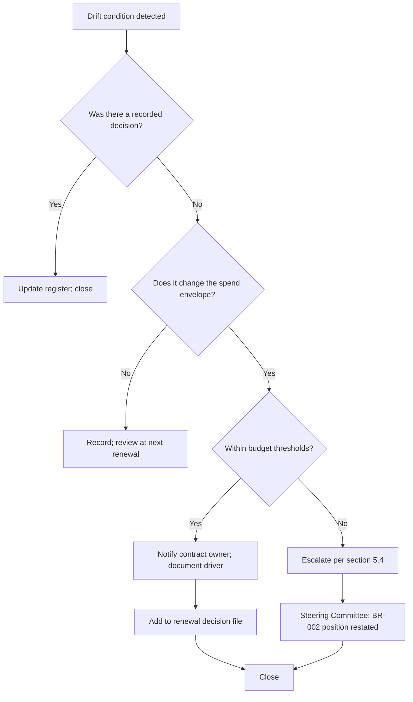

# FinOps Strategy — Learning & Teaching Ecosystem

> **Template Origin**: Official | **ArcKit Version**: 6.7.5 | **Command**: `/arckit:finops`

## Document Control

| Field | Value |
|-------|-------|
| **Document ID** | ARC-001-FINOPS-v1.0 |
| **Document Type** | FinOps Strategy (SaaS Licence Financial Management) |
| **Project** | Learning & Teaching Baseline Strategy (Project 001) |
| **Classification** | OFFICIAL |
| **Status** | DRAFT |
| **Version** | 1.0 |
| **Created Date** | 2026-07-29 |
| **Last Modified** | 2026-07-29 |
| **Review Cycle** | Quarterly |
| **Next Review Date** | 2026-10-29 |
| **Owner** | Grace Tanaka, Procurement & Vendor Manager — accountable to Vernon Ostinato, Chief Financial Officer |
| **Reviewed By** | PENDING |
| **Approved By** | PENDING |
| **Distribution** | Steering Committee, Finance, Procurement, Digital & IT, Learning Technologies, Education Committee |

## Revision History

| Version | Date | Author | Changes | Approved By | Approval Date |
|---------|------|--------|---------|-------------|---------------|
| 1.0 | 2026-07-29 | ArcKit AI | Initial creation from `/arckit:finops` command | PENDING | PENDING |

---

## Reading This Document

### Scope note — this is SaaS licence FinOps, not cloud infrastructure FinOps

The University of Funk's Learning & Teaching estate is **licensed software-as-a-service, not consumed cloud infrastructure**. Twenty-plus vendor platforms are procured under contract with per-seat, per-enrolment, site or tiered licence models [FO-C1]. There is no institutionally-owned compute fleet in this estate to rightsize, no reserved-instance market to arbitrage, and no egress bill to tier.

The consequence for this strategy is structural, not cosmetic. The dominant cost levers in a SaaS estate are:

| Cloud-infrastructure FinOps lever | SaaS-licence equivalent applied here |
|-----------------------------------|--------------------------------------|
| Rightsizing compute | Entitlement rightsizing — licensed seats versus active seats |
| Reserved instances / savings plans | Contract term, renewal calendar and negotiation leverage |
| Idle resource termination | Licensed-but-unconfigured capability, and retirement of declared duplication |
| Tagging for cost attribution | Contract and capability metadata on every platform record |
| Anomaly detection on daily spend | Licence drift, seat creep and shadow acquisition detection |
| Multi-cloud arbitrage | Capability-category consolidation to a designated primary |

Sections 3, 7, 8, 9 and 11 are the sections most heavily rewritten from the generic template as a result. Sections addressing rightsizing of virtual machines, spot instances, storage lifecycle tiering and per-API-call unit economics are **not applicable** and are marked as such rather than filled with invented content.

**One exception.** ADR-001 proposes an integration broker, which *may* be delivered as hosted infrastructure and would then carry genuine consumption-based cost. That component is treated separately in §2.4 and §7 lever L-7 and is the only part of this estate to which classical cloud FinOps applies.

### The `TBD-WP3` marker

This document contains **no invented dollar figures**. The inputs available to it contain none, and fabricating a baseline would corrupt the September business case that depends on this work.

Where a figure is required but cannot yet be stated, the cell reads **`TBD-WP3`**. This is a deliberate, tracked marker — not an unfilled placeholder. Every occurrence is registered in **§17 Baseline Data Requirements** with a named owner and a required-by date. `ARC-001-SOBC-v1.0` §B4 takes the identical position and lists the same missing inputs; this document does not resolve that gap, it operationalises the process for closing it.

> A reviewer should treat the disappearance of `TBD-WP3` markers in a later version as evidence that the WP3 baseline has landed. Their replacement by plausible-looking numbers without a WP3 reference should be treated as a defect.

**Currency**: All figures are Australian dollars (AUD) at 2026 prices, GST-exclusive unless stated.

---

## 1. FinOps Overview

### 1.1 Strategic Objectives

| # | Objective | Target | Rationale |
|---|-----------|--------|-----------|
| FO-1 | **Establish the licence spend baseline** | 100% of L&T platforms with recorded annual cost, renewal date and licence model | BR-002's central test — *"spend held flat or reduced"* — is unfalsifiable without it [FO-C2]. This is the precondition for every other objective. |
| FO-2 | **Total ecosystem licence spend flat or reduced** across the roadmap horizon | Modelled end-state spend ≤ baseline, while Must-priority gaps close | Direct restatement of REQ-035 / BR-002 [FO-C3] |
| FO-3 | **Eliminate undeclared duplication** | 8 of 8 capability categories with a designated primary and a boundary decision | Currently 0 of 8. Duplication is not inherently wrong; undeclared duplication is (BR-001) |
| FO-4 | **Quantify licensed-but-unconfigured capability** | Every platform assessed for entitlement-versus-configuration gap | The university pays for functionality never switched on [FO-C4]. Risk R-013 action 8. |
| FO-5 | **Make retirement executable** | Renewal calendar covering 100% of contracts, aligned to the roadmap | Savings that cannot be taken at a contract boundary are notional (R-005, R-015) |
| FO-6 | **Prevent recurrence** | 100% of new solution requests carry a whole-of-life cost position at RIFF | Without this the duplication pattern re-forms (BR-007) |
| FO-7 | **Separate recurring licence spend from one-off integration capital** | Two distinct reporting lines, never blended | Integration capital produces no licence saving in the same period; blending them conceals this (SOBC §B4, STKE Conflict 2) |

### 1.2 What "flat or reduced" actually means

REQ-035 is rated **Should**, not Must [FO-C3] — and the requirements author appears to have anticipated exactly why. Three qualifications must travel with the target or it will be misread:

1. **Flat spend will come from declared retirements, not from falling unit prices.** Commoditisation lowers per-seat prices and reliably raises total consumption. Expecting the envelope to hold *because* the market is commoditising is backwards.
2. **Retirement savings arrive later than costs.** They are constrained by the renewal calendar. A naive year-one test would reject a programme that is affordable across the horizon.
3. **Closing Must-priority gaps may require net-new acquisition.** Where it does, the flat-envelope test is met by offsetting retirement, or the gap is explicitly deferred with rationale — never by quietly dropping the requirement.

### 1.3 FinOps Maturity

Assessed against the FinOps Foundation Crawl / Walk / Run model, adapted for a SaaS licence estate.

| Level | Current | Target | Target date | Evidence |
|-------|---------|--------|-------------|----------|
| **Crawl** — inventory exists, costs visible somewhere, reporting manual and periodic | **Partially. Below Crawl on cost.** | Achieved | 2026-08-21 | A capability inventory exists [FO-C1]; a **consolidated cost baseline does not**. Contract data sits with Procurement but is not aggregated to an ecosystem view. |
| **Walk** — baseline established, attribution by capability and faculty, renewal calendar live, showback reporting, RIFF cost gate operating | No | **Yes** | 2027-06-30 | The realistic target for this roadmap horizon |
| **Run** — utilisation telemetry per platform, predictive renewal modelling, automated drift detection, chargeback | No | Not in this horizon | — | Requires utilisation instrumentation the estate does not have and cannot acquire uniformly across 20-plus vendors |

> **Honest maturity statement.** The estate is **below Crawl on the cost dimension** while being reasonably mature on the capability dimension. This asymmetry is the single most important finding in this strategy: the university knows what tools it has and largely what they do, but not what they cost in aggregate. Everything in §7 is blocked behind fixing that.

### 1.4 Team Structure

| Role | Responsibility | Named |
|------|----------------|-------|
| **FinOps Owner** (licence estate) | Contract register, renewal calendar, vendor negotiation, baseline maintenance | Grace Tanaka, Procurement & Vendor Manager |
| **Financial Accountability** | Budget envelope, business case scrutiny, approval thresholds, discount rate | Vernon Ostinato, Chief Financial Officer |
| **Capability Owner** | Capability map, duplication analysis, entitlement-versus-configuration assessment, support models | Dr. Benny Moog, Director Learning Technologies |
| **Technical Cost Owner** | Integration broker hosting cost, consumption-based components, effort baseline | Sam Okafor, Integration Architect |
| **Estate Accountable Officer** | Overall L&T technology spend position | Cassandra Rhodes, Chief Information Officer |
| **Academic Governance** | Endorses that rationalisation preserves pedagogical capability | A/Prof. Pearl Clavinet, Dean of L&T |
| **Faculty Cost Consumers** | Receive showback; own school-level discipline tooling decisions | Prof. Desmond Key, Prof. Priya Anand |

> **Deliberate omission.** No dedicated FinOps function or FTE is proposed. An estate of this size does not warrant one, and `ARC-001-SOBC-v1.0` §D1.2 assumes broker operation is absorbed within existing teams — an assumption that is itself flagged **to be validated**. This strategy adds process to existing roles; if it turns out to require new headcount, that is a finding to surface, not to absorb silently.

### 1.5 RACI Matrix

| Activity | Procurement (Tanaka) | Finance (Ostinato) | Learning Tech (Moog) | Digital & IT (Rhodes/Okafor) | Academic (Clavinet) |
|----------|---------------------|--------------------|--------------------|------------------------------|---------------------|
| Licence baseline establishment | **R** | **A** | C | C | I |
| Contract & renewal calendar | **R/A** | C | C | I | I |
| Entitlement vs configuration assessment | C | I | **R/A** | C | I |
| Duplication & boundary analysis | C | I | **R** | C | **A** |
| Capability retirement decision | C | C | R | C | **A** |
| Showback reporting to faculties | **R** | **A** | C | I | I |
| RIFF whole-of-life cost assessment | R | C | **A** | C | C |
| Vendor negotiation at renewal | **R/A** | C | C | C | I |
| Integration broker cost management | C | C | I | **R/A** | I |
| Export & exit verification | **R/A** | I | C | C | I |

*R = Responsible, A = Accountable, C = Consulted, I = Informed.*

---

## 2. Estate Overview

### 2.1 Platform Inventory

Derived from the WP2 system landscape [FO-C1]. Cost columns are `TBD-WP3` throughout — this table **is** the shape of the baseline that WP3 must fill.

**Status key**: ● In use · ◐ Licensed, further licensing required · ○ Not in use, under investigation

| # | Platform | Status | Capability categories | Categories | Annual cost | Licence model | Renewal date |
|---|----------|--------|----------------------|-----------|-------------|---------------|--------------|
| 1 | Blackboard | ● | Course Design, Learning Resources, Learning Delivery, Collaboration, Assessment, Evaluation & Analytics | 6 | `TBD-WP3` | `TBD-WP3` | `TBD-WP3` |
| 2 | Echo360 | ● | Learning Delivery, Learning Capture, Evaluation & Analytics | 3 | `TBD-WP3` | `TBD-WP3` | `TBD-WP3` |
| 3 | MS Teams | ● | Learning Delivery, Learning Capture, Collaboration | 3 | `TBD-WP3` | `TBD-WP3` — likely bundled in institutional agreement | `TBD-WP3` |
| 4 | Zoom | ● | Learning Delivery, Learning Capture, Active Learning (polling), Collaboration | 4 | `TBD-WP3` | `TBD-WP3` | `TBD-WP3` |
| 5 | Articulate 360 | ◐ | Course Design, Learning Resources, Active Learning | 3 | `TBD-WP3` | **Unclear — enterprise licensing model requires investigation** [FO-C5] | `TBD-WP3` |
| 6 | H5P | ● | Course Design, Active Learning, Assessment | 3 | `TBD-WP3` | `TBD-WP3` | `TBD-WP3` |
| 7 | Adobe Creative Suite | ◐ | Learning Resources | 1 | `TBD-WP3` | Requires further licensing | `TBD-WP3` |
| 8 | Camtasia | ● | Learning Resources | 1 | `TBD-WP3` | `TBD-WP3` | `TBD-WP3` |
| 9 | Leganto | ● | Learning Resources, Learning Delivery | 2 | `TBD-WP3` | `TBD-WP3` | `TBD-WP3` |
| 10 | LinkedIn Learning | ● | Learning Resources | 1 | `TBD-WP3` | `TBD-WP3` | `TBD-WP3` |
| 11 | PebblePad | ● | Active Learning, Assessment | 2 | `TBD-WP3` | `TBD-WP3` | `TBD-WP3` |
| 12 | Padlet | ● | Active Learning, Collaboration | 2 | `TBD-WP3` | `TBD-WP3` | `TBD-WP3` |
| 13 | Turnitin (incl. PeerMark) | ● | Collaboration, Assessment | 2 | `TBD-WP3` | `TBD-WP3` | `TBD-WP3` |
| 14 | ExamSoft | ● | Assessment | 1 | `TBD-WP3` | `TBD-WP3` | `TBD-WP3` |
| 15 | Remark | ● | Assessment | 1 | `TBD-WP3` | `TBD-WP3` | `TBD-WP3` |
| 16 | Qualtrics | ● | Evaluation & Analytics | 1 | `TBD-WP3` | `TBD-WP3` | `TBD-WP3` |
| 17 | Evasys | ● | Evaluation & Analytics | 1 | `TBD-WP3` | `TBD-WP3` | `TBD-WP3` |
| 18 | Kuracloud | ● | Course Design, Learning Resources, Learning Delivery, Active Learning, Assessment (discipline) | 5 | `TBD-WP3` | `TBD-WP3` — **internal support model unclear** [FO-C5] | `TBD-WP3` |
| 19 | iSimulate | ● | Learning Resources, Active Learning, Assessment (discipline) | 3 | `TBD-WP3` | `TBD-WP3` | `TBD-WP3` |
| 20 | MuseScore | ● | Learning Resources (discipline) | 1 | `TBD-WP3` | **Extent of use and licensing unknown** [FO-C5] | `TBD-WP3` |
| 21 | Ableton Live | ◐ | Learning Resources (discipline) | 1 | `TBD-WP3` | **Extent of use and licensing unknown** [FO-C5] | `TBD-WP3` |
| 22 | Miro | ○ | Active Learning, Collaboration | 2 | Nil today — **prospective new spend** | Not licensed | N/A |
| 23 | OnExam | ○ | Assessment | 1 | Nil today — **prospective new spend** | Not licensed [FO-C5] | N/A |
| 24 | Badging software (Badgr / Credly / Milestone) | ○ | Assessment | 1 | Nil today — **prospective new spend** | Not licensed [FO-C5] | N/A |

**Estate summary**

| Measure | Count |
|---------|-------|
| Platforms currently in the estate (● + ◐) | 21 |
| Platforms with an open licensing or support-model question (◐ or footnoted) | 6 |
| Prospective additions under investigation (○) | 3 |
| Capability categories with a designated primary platform | **0 of 8** |
| Total annual licence spend | **`TBD-WP3`** |

### 2.2 Capability Overlap Map — the duplication surface

This is the cost geography of the estate. Every row with more than one core platform is a candidate for a boundary decision under BR-001.

| Capability category | Core platforms | Count | Overlap intensity |
|---------------------|----------------|-------|-------------------|
| Course Design | Blackboard, Articulate 360, H5P | 3 | Medium |
| Learning Resources | Blackboard, Leganto, LinkedIn Learning, Camtasia, Adobe CS, Articulate 360 | 6 | **High** |
| Learning Delivery | Blackboard, Echo360, MS Teams, Zoom, Leganto | 5 | **High** |
| Learning Capture | Echo360, MS Teams, Zoom | 3 | **High — named rationalisation candidate** [FO-C6] |
| Active Learning | H5P, PebblePad, Padlet, Miro, Articulate 360, Zoom (polling) | 6 | **High** |
| Collaboration | Blackboard, MS Teams, Zoom, Padlet, Turnitin (PeerMark), Miro | 6 | **High** |
| Assessment & Progress Tracking | Blackboard, Turnitin, ExamSoft, PebblePad, H5P, Remark, OnExam, badging | 8 | **High** |
| Evaluation & Analytics | Blackboard, Qualtrics, Evasys, Echo360 | 4 | Medium — two survey platforms is a clear pair |

**Cross-category footprint.** Blackboard appears in 6 of 8 categories, Kuracloud in 5, Zoom in 4. A platform spanning many categories is not automatically wasteful — it may be the reason a primary designation is affordable. But it is also where a per-seat uplift has the widest blast radius, and where exit is hardest. Both facts belong in the renewal file.

### 2.3 Cost Driver Taxonomy (SaaS)

Replaces the compute/storage/network/database breakdown, which does not describe this estate.

| Cost driver | Description | Applies to | Baseline |
|-------------|-------------|-----------|----------|
| **Per-seat / per-FTE** | Priced on staff or student headcount | Likely Adobe CS, Articulate 360, Camtasia, LinkedIn Learning | `TBD-WP3` |
| **Per-enrolment / per-submission** | Priced on teaching volume | Likely Turnitin, ExamSoft, PebblePad | `TBD-WP3` |
| **Site / institutional** | Flat institutional fee | Likely Blackboard, Echo360, Qualtrics, Evasys | `TBD-WP3` |
| **Bundled** | Included in a wider institutional agreement | MS Teams (probable) | `TBD-WP3` |
| **Capture appliance / hardware refresh** | Lecture-theatre estate supporting Echo360 | Echo360 | Out of scope per REQ scope boundary; **cost dependency must still be declared** |
| **Discipline / school-funded** | Purchased at school level, may not appear in central spend | MuseScore, Ableton Live, iSimulate, Kuracloud | `TBD-WP3` — **highest risk of being missing from the baseline entirely** |
| **Support & professional services** | Vendor support tiers, configuration services | All | `TBD-WP3` |
| **Internal support effort** | Learning Technologist time absorbing manual workarounds | Estate-wide | `TBD-WP3` — no effort baseline exists (SOBC B-04) |

> **The school-funded row is the one most likely to break the baseline.** Discipline tooling procured at school level under delegated authority may never have entered the central contract register. A baseline that omits it will understate spend and overstate the achievability of a flat envelope. §3 makes school-level procurement a mandatory attribute for exactly this reason.

### 2.4 Consumption-Based Component (the only classical cloud cost)

| Component | Cost model | Estimated recurring | Source |
|-----------|-----------|--------------------|--------|
| Integration broker licence or hosting, AU region | Managed service or consumption | **$80k – $150k per year** — increase; possibly nil if the Principle 19 test succeeds | `ARC-001-SOBC-v1.0` §D1.2 |
| Broker and role-authority operation | Absorbed within existing team plus skills uplift | Assumes no new FTE — **to be validated** | `ARC-001-SOBC-v1.0` §D1.2 |

This is the **only** figure in this document not marked `TBD-WP3`, because it is estimable from scope rather than requiring a baseline. It is quoted from the SOBC, not independently derived.

> **Cost-avoidance test comes first.** ADR-001 Condition 1 requires the Principle 19 test on existing licensed capability *before* any broker purchase. The best possible outcome for this line is that it becomes nil because brokering capability is already licensed and unconfigured — which would make it simultaneously an FO-4 finding and an FO-2 contribution.

### 2.5 Spend Trend and Forecast

| Period | Total ecosystem licence spend | Growth |
|--------|-------------------------------|--------|
| FY2024 | `TBD-WP3` | — |
| FY2025 | `TBD-WP3` | `TBD-WP3` |
| FY2026 (current) | `TBD-WP3` | `TBD-WP3` |
| FY2027 forecast — do nothing | `TBD-WP3` | Expect **increase**: CPI-linked uplifts, seat growth, plus up to 3 prospective additions |
| FY2027 forecast — Option 2 | `TBD-WP3` | Target: **flat or lower**, per FO-2 |

> **A three-year historical series is worth more than a point-in-time snapshot** and costs little more to obtain, because it comes from the same contract records. It is the only way to separate genuine growth from a bad measurement year, and the only way to see whether vendor uplifts are tracking above CPI. Request it at the same time as the baseline.

---

## 3. Licence Attribution & Metadata Strategy

*Replaces the cloud resource tagging strategy. In a SaaS estate the equivalent of a tag is a mandatory attribute on the platform's record in the capability and contract register.*

### 3.1 Mandatory Attributes

Every platform record must carry all of the following. A record missing any mandatory attribute is **not baseline-complete** and its platform cannot be scored in a rationalisation decision.

| Attribute | Description | Values | Enforcement |
|-----------|-------------|--------|-------------|
| `platform-id` | Unique identifier | Register key | Blocks record creation |
| `capability-category` | One or more of the eight taxonomy categories | Course Design … Evaluation & Analytics | Blocks record creation |
| `boundary-status` | Designated position under BR-001 | `primary` / `primary-with-boundary` / `transitional-with-retirement-date` / `approved-exception` / **`undeclared`** | Blocks RIFF sign-off |
| `annual-cost` | Recurring licence cost, AUD, GST-exclusive | Currency | Blocks baseline completion |
| `licence-model` | Basis of charge | per-seat / per-enrolment / site / bundled / perpetual+maintenance | Blocks baseline completion |
| `entitlement-count` | Seats, enrolments or units purchased | Integer, or `site` | Blocks baseline completion |
| `active-usage` | Measured consumption against entitlement | Integer + measurement date + source | Warning — many vendors cannot supply this |
| `contract-end-date` | Next renewal or termination date | Date | Blocks baseline completion |
| `notice-period` | Days of notice required to exit | Integer days | Blocks baseline completion |
| `cost-centre` | Central L&T, school, or shared | Cost centre code | Blocks baseline completion |
| `funding-source` | Central budget or school-delegated | `central` / `school:<name>` / `bundled` | Blocks baseline completion |
| `contract-owner` | Named individual | Person | Blocks record creation |
| `hosting-region` | Where data is stored **and processed** | Country | Blocks record creation — required for APP 8 (NFR-C-002) |
| `export-verified` | Export tested by extraction, not asserted | `verified:<date>` / `asserted` / `unverified` | Warning — feeds R-028 |
| `sso-conformant` | Institutional SSO with MFA, no local accounts | Yes / No / Exception | Warning — feeds R-019 |

> **Three of these attributes are not financial and are here deliberately.** `hosting-region`, `export-verified` and `sso-conformant` are the attributes that determine whether a platform *can* be retained or retired at all. A renewal decision taken on price without them is a decision taken on one third of the evidence. Carrying them on the same record is what lets a single renewal review answer the cost question, the privacy question and the exit question at once.

### 3.2 Recommended Attributes

| Attribute | Description | Use |
|-----------|-------------|-----|
| `overlap-with` | Platforms sharing this capability category | Duplication analysis |
| `unconfigured-capability` | Licensed features not switched on | FO-4, lever L-2 |
| `support-model` | Internal support arrangement and owner | Discipline tools; R-010 |
| `accessibility-status` | WCAG 2.2 AA assessment position | NFR-U-001; R-021 |
| `price-escalation-clause` | Contractual uplift mechanism and cap | Forecasting |
| `student-facing` | Whether students interact with it directly | Prioritisation and blast-radius |
| `integration-dependency` | Which of INT-001 to INT-009 touch it | Retirement sequencing |

### 3.3 Attribution Enforcement

| Level | Action | Scope |
|-------|--------|-------|
| **Prevent** | RIFF will not sign off a request touching a platform whose record is incomplete | New and changed solutions |
| **Prevent** | No renewal executed without a complete record | All contracts at renewal |
| **Report** | Incomplete records listed by name in the monthly baseline-completeness report | Estate-wide |
| **Escalate** | Records incomplete 60 days after the WP3 due date escalate to the CIO | Estate-wide |

### 3.4 Undeclared and Orphaned Platform Policy

The SaaS equivalent of an untagged resource is a platform in use with no owner, no contract record, or no declared boundary.

| Condition | Action | Owner |
|-----------|--------|-------|
| Platform in use, no contract record | Locate the contract; if none exists, treat as shadow acquisition and escalate | Grace Tanaka |
| Platform with no named contract owner | Assign an owner within 14 days or schedule for review | Dr. Benny Moog |
| Platform with `boundary-status = undeclared` at roadmap submission | Recorded in the deliverable as an open decision — **never silently retained** | Dr. Benny Moog |
| Platform retained solely because no decision was taken | Explicitly prohibited by BR-001 success criteria | A/Prof. Pearl Clavinet |
| School-funded platform absent from the central register | Add to register; funding source recorded as `school:<name>` | Grace Tanaka |

> **"No platform retained solely because no decision was taken."** That is a BR-001 success criterion, and it is the single most financially consequential line in the requirements. Inertia is the default state of a licence estate, and inertia is expensive.

---

## 4. Cost Visibility & Reporting

### 4.1 Reporting Cadence

| Report | Frequency | Audience | Delivery | Starts |
|--------|-----------|----------|----------|--------|
| Baseline completeness tracker | Weekly until complete, then monthly | Steering Committee | Dashboard / register extract | Immediately |
| Renewal horizon report (next 12 months) | Monthly | Procurement, Learning Technologies, Finance | Register extract | On calendar completion |
| Ecosystem spend position | Quarterly | CFO, CIO, Steering Committee | Report | On baseline completion |
| Faculty showback | Semesterly (twice yearly, aligned to teaching periods) | Deans, school managers | Report | FY2027 |
| Duplication and boundary status | Quarterly | Education Committee, RIFF | Capability map extract | On capability map completion |
| Entitlement utilisation | At each renewal, minimum annually | Contract owner, Procurement | Register extract | Per renewal |
| Integration broker consumption | Monthly | Sam Okafor, Cassandra Rhodes | Cloud provider native tooling | On broker deployment |

> **Deliberately not daily or real-time.** Licence costs change at contract boundaries, not hourly. Daily cost reporting on a SaaS estate manufactures noise and trains recipients to ignore the report. The one exception is the integration broker, if it lands on consumption-based hosting.

### 4.2 Cost Allocation Model

| Method | Applied to | Basis |
|--------|-----------|-------|
| **Direct** | Platforms serving one school only | 100% to that school — MuseScore, Ableton Live, iSimulate, Kuracloud |
| **Proportional by enrolment** | Platforms priced per-enrolment or per-submission | Share of total enrolments — Turnitin, ExamSoft, PebblePad |
| **Proportional by active users** | Platforms priced per-seat where usage data exists | Share of active accounts |
| **Fixed institutional** | Site-licensed platforms serving the whole estate | Not allocated to schools; held centrally — Blackboard, SSO, integration broker |
| **Bundled — declared, not allocated** | Capability arriving inside a wider agreement | Recorded at zero marginal cost with the bundle named — MS Teams (probable) |

> **The bundled row deserves care.** Capability that arrives free inside an institutional agreement is genuinely low-cost, and that is a legitimate argument in a consolidation decision. But "free" is not the same as "no cost" — it carries configuration, support, integration and migration cost, and it makes the bundle harder to leave. Recording it at zero without naming the bundle is how a lock-in position gets built by accident.

### 4.3 Dashboard Requirements

| View | Purpose | Source |
|------|---------|--------|
| Baseline completeness | Which platform records are still incomplete, by attribute | Contract & capability register |
| Renewal timeline | Contracts by renewal date across a rolling 24 months | Renewal calendar |
| Capability overlap heat map | Platforms per category, with boundary status | Capability map |
| Spend by capability category | Where the money actually goes, in taxonomy terms | Register + baseline |
| Entitlement utilisation | Purchased versus active, per platform | Vendor reports + register |
| Prospective spend pipeline | Requests at RIFF carrying new recurring cost | RIFF register |

> **Tooling should be boring.** The register can start as a maintained spreadsheet with defined columns and an owner. A 21-platform estate does not need a SaaS management product to reach Walk maturity, and buying one to solve a licence-visibility problem would be a conspicuous irony. Revisit only if the register survives two review cycles and the constraint is genuinely tooling.

---

## 5. Budgeting & Forecasting

### 5.1 Budget Structure — the mandatory separation

Per `ARC-001-STKE-v1.0` Conflict 2 and `ARC-001-SOBC-v1.0` §D1, two categories are modelled and reported **separately and never blended**:

| Category | Nature | Owner | Horizon |
|----------|--------|-------|---------|
| **Recurring licence spend** | Operating — the BR-002 flat-or-reduced envelope | Grace Tanaka → Vernon Ostinato | Annual, rolling |
| **One-off integration investment** | Capital — broker, integrations, role authority, migration | Sam Okafor → Cassandra Rhodes | 3-year programme |

> Blending them produces a single number that answers neither question. It hides that integration capital generates no licence saving in the same period (R-013, R-014), and it invites the Executive to net a capital ask against a savings promise that the renewal calendar cannot deliver on that timescale.

### 5.2 Annual Licence Budget

| Financial year | Baseline | Budget | Forecast | Variance |
|----------------|----------|--------|----------|----------|
| FY2026 | `TBD-WP3` | `TBD-WP3` | `TBD-WP3` | — |
| FY2027 | Per FY2026 baseline | `TBD-WP3` | `TBD-WP3` | Target ≤ 0% |
| FY2028 | Per FY2026 baseline | `TBD-WP3` | `TBD-WP3` | Target ≤ 0% |
| FY2029 | Per FY2026 baseline | `TBD-WP3` | `TBD-WP3` | Target ≤ 0% |

**Measurement rule for FO-2**: the flat-or-reduced test is measured against the **FY2026 baseline held constant**, not against a rolling prior year. A rolling comparison would let three consecutive 4% increases each pass a "flat against last year" test while the envelope grows 12%.

### 5.3 One-Off Integration Investment

Quoted from `ARC-001-SOBC-v1.0` §D1.1 — ROM at ±50%, AUD 2026 prices, Option 2 recommended.

| Year | One-off investment band |
|------|------------------------|
| Year 1 | $1.24M – $2.25M |
| Year 2 | $850k – $1.59M |
| Year 3 | $130k – $240k |
| **Total** | **$2.22M – $4.08M** |

**Profile note**: 55–60% falls in Year 1 — the least convenient profile for a fixed capital allocation, and it should be modelled explicitly rather than discovered at submission.

**Optimism bias**: the SOBC records an adjusted band of **$3.4M – $5.9M** if a 40% uplift benchmark is applied, and flags that the benchmark is UK-derived and **not an institutional standard**. The Steering Committee must adopt a figure or substitute one. It should not be left implicit.

### 5.4 Budget Alert Thresholds

Applied to the recurring licence envelope against the FY2026 baseline.

| Threshold | Condition | Action | Notification |
|-----------|-----------|--------|--------------|
| Informational | Envelope within 100% of baseline | Note in quarterly position | Dashboard |
| **Watch** | Envelope 100–103% of baseline | Identify the driver; confirm an offsetting retirement is scheduled | Grace Tanaka → Vernon Ostinato |
| **Warning** | Envelope 103–107% of baseline | Formal variance explanation to Steering Committee; retirement schedule reviewed | CFO + CIO |
| **Breach** | Envelope > 107% of baseline | BR-002 declared at risk; Executive escalation | University Executive |
| **Any** | Any single new recurring commitment > `TBD-WP3` threshold | Pre-approval required — threshold undefined, see §10.2 | Per approval matrix |

> **Why 3% and 7% rather than the generic 50/75/90/100.** Those thresholds describe a consumption budget being drawn down through a period. A licence envelope is not drawn down — it is committed at renewal points and then largely fixed. The meaningful signal is *deviation from the committed envelope*, and the bands are correspondingly tight.

### 5.5 Forecasting Methodology

| Method | Applied to | Accuracy target | Notes |
|--------|-----------|-----------------|-------|
| **Contract-derived** | Renewing contracts with known terms | ±5% | The dominant method — most spend is contractually known once the register exists |
| **Escalation-clause modelling** | Contracts with CPI or fixed uplift clauses | ±5% | Requires `price-escalation-clause` attribute |
| **Driver-based** | Per-seat and per-enrolment contracts | ±10% | Driver = enrolment forecast from the SIS |
| **Scenario** | Retirement and acquisition decisions not yet taken | Band, not point | Model as ranges; never present a single figure for an undecided outcome |
| **ROM ±50%** | One-off integration investment | ±50% | Per SOBC §B2 basis of estimate |

> **SaaS licence forecasting should be considerably more accurate than cloud consumption forecasting**, because most of it is contractual rather than behavioural. If the forecast is not landing inside ±10% once the register exists, the problem is register quality, not forecasting method.

---

## 6. Showback / Chargeback Model

### 6.1 Model Selection

| Model | Assessment | Selected |
|-------|-----------|----------|
| **Showback** — faculties see attributed cost; no internal transfer | Creates visibility and informs discipline-tooling decisions without triggering defensive behaviour during a contested rationalisation | **✅ Selected** |
| Chargeback — faculties billed via internal transfer | Rejected for this horizon | ❌ |
| Hybrid | Not required at this estate size | ❌ |

**Rationale for showback over chargeback.** Chargeback during a rationalisation programme actively works against the outcome. It gives a school a direct financial incentive to defend its own tooling and to resist a designated primary that it did not choose, and it converts an architectural conversation into a budget dispute at exactly the moment the Education Committee's endorsement is needed. Risk R-002 — *"strategy perceived as cost-cutting"* — carries an inherent score of 16, and chargeback is the most reliable way to make that perception true.

Showback delivers most of the behavioural benefit. Deans who can see what their discipline tooling costs make better decisions about it, and Prof. Key and Prof. Anand both need that visibility to defend the tools that genuinely warrant defending.

**Revisit condition**: reconsider chargeback once the estate has stable primaries, a complete baseline and at least one full year of accurate showback — not before.

### 6.2 Allocation Methodology

| Cost type | Method | Basis |
|-----------|--------|-------|
| Discipline-specific platforms | Direct | 100% to the owning school |
| Per-enrolment platforms | Proportional | Share of enrolments in units using the platform |
| Per-seat platforms | Proportional | Share of active accounts, where measurable |
| Institutional site licences | Not allocated | Held centrally; shown as a named central cost |
| Bundled capability | Not allocated | Recorded at zero marginal cost, bundle named |
| Integration broker and role authority | Not allocated | Central platform cost |
| Internal support effort | Not allocated in v1.0 | No effort baseline exists (SOBC B-04) |

### 6.3 Unit Economics

Higher-education unit metrics, replacing per-transaction and per-API-call measures which do not describe this estate.

| Metric | Calculation | Current | Target |
|--------|-------------|---------|--------|
| L&T technology cost per enrolled student (EFTSL) | Total ecosystem licence spend / EFTSL | `TBD-WP3` | Flat or reducing |
| L&T technology cost per unit offering | Total spend / units delivered per year | `TBD-WP3` | Flat or reducing |
| Cost per capability category | Category spend / 8 categories | `TBD-WP3` | Concentrating toward primaries |
| Entitlement utilisation | Active seats / purchased seats | `TBD-WP3` | > 80% where measurable |
| Duplication ratio | Platforms per capability category | **Mean 4.6 core platforms per category** | Trending toward 1 primary + declared exceptions |

> **Duplication ratio is the one unit metric available today**, because it needs the capability map rather than the cost baseline. Mean 4.6 core platforms per category, and 0 of 8 categories with a designated primary, is a measurable starting position. It is also the metric most likely to move first.

> **Cost per EFTSL is the metric the CFO will actually recognise**, and it has a property worth naming: enrolment growth flatters it. If enrolments rise 5% and spend rises 4%, cost per EFTSL falls while the envelope grows — and BR-002 tests the envelope, not the ratio. Report both, and never let the ratio stand in for the absolute test.

---

## 7. Cost Optimisation Levers

The core of this strategy. Seven levers, ordered by expected contribution to FO-2, each with its blocking dependency named.

### 7.1 Lever Summary

| ID | Lever | Mechanism | Expected contribution | Blocked by | Owner |
|----|-------|-----------|----------------------|-----------|-------|
| **L-1** | **Retire declared duplication** | Designate a primary per capability category; retire overlaps at renewal | **Largest single lever** — magnitude `TBD-WP3` | R-001 decision; renewal calendar | Dr. Benny Moog |
| **L-2** | **Realise licensed-but-unconfigured capability** | Configure what is already paid for instead of buying again | **Cost avoidance, potentially large** — magnitude `TBD-WP3` | Entitlement-vs-configuration assessment | Dr. Benny Moog |
| **L-3** | **Prevent net-new acquisition** | Test incumbent capability before approving Miro, OnExam or badging | Avoids up to 3 new recurring commitments | RIFF operating on capability evidence | RIFF / Dr. Benny Moog |
| **L-4** | **Entitlement rightsizing** | Reduce purchased seats to measured active use at renewal | Moderate — magnitude `TBD-WP3` | Utilisation data availability | Grace Tanaka |
| **L-5** | **Resolve unclear licensing models** | Convert 6 open licensing questions into known positions | Unknown — could be saving **or** an unbudgeted liability | Vendor engagement | Grace Tanaka |
| **L-6** | **Renewal negotiation leverage** | Consolidate demand; negotiate at renewal with a credible alternative | Moderate | Renewal calendar; export verification | Grace Tanaka |
| **L-7** | **Avoid broker purchase via Principle 19** | Test existing licensed integration capability before buying | Up to $150k/year avoided | ADR-001 Condition 1 test | Sam Okafor |

### 7.2 L-1 — Retire Declared Duplication *(primary lever)*

**The named candidate.** The system landscape identifies MS Teams / Zoom / Echo360 overlap across Collaboration, Learning Delivery and Learning Capture explicitly as a *"key rationalisation candidate"*, with an investigation planned for 2027 [FO-C6]. Requirement REQ-008 independently asks for live online classes on **one primary platform** [FO-C7]. Three platforms currently provide overlapping capability where the requirement asks for one.

**Secondary candidates**, by overlap intensity:

| Category | Overlap | Note |
|----------|---------|------|
| Evaluation & Analytics | Qualtrics and Evasys | Two survey/evaluation platforms. FR-021 requires **one** platform for teaching evaluation. The cleanest pair in the estate. |
| Active Learning + Collaboration | Padlet, Miro, Teams, Zoom, PebblePad | Six platforms across two adjacent categories |
| Course Design authoring | Blackboard, Articulate 360, H5P | FR-002 rationale names this as a duplication candidate |
| Collaboration peer review | Turnitin PeerMark and PebblePad | FR-011 requires a designated primary |
| Learning Resources video | Camtasia, Adobe CS, Echo360, Articulate 360 | FR-004 requires a **single supported toolchain** |

**Constraints that must travel with this lever:**

1. **Retirement is only executable at a contract boundary.** Mid-term retirement without an exit provision produces cost, not saving (R-005, R-015). The renewal calendar is therefore a *precondition* for this lever, not a supporting artefact.
2. **Discipline capability is protected.** REQ-005, REQ-006 and REQ-010 describe capability that general-purpose platforms do not provide. `ARC-001-SOBC-v1.0` rejected full single-platform consolidation (Option 3) on capability loss, not on cost. **L-1 does not extend to MuseScore, Ableton Live, iSimulate or Kuracloud.**
3. **Performance capture is a live constraint on the capture decision.** REQ-010 (multi-camera, high-fidelity audio) is rated Could but materially affects which capture platform can be primary. Conflict C-1 flags it precisely so it is not silently dropped in pursuit of a saving.
4. **The decision must precede the business case.** R-001 — the unresolved consolidation decision — carries residual 16 and is the register's only strategic risk exceeding appetite. Presenting the Executive with an unresolved platform question invites it to be settled on cost alone, without pedagogical input.

### 7.3 L-2 — Realise Licensed-But-Unconfigured Capability *(largest cost-avoidance lever)*

The consultant brief states the university pays for *"functionality paid for but not configured or in use"* [FO-C4], and BR-002's rationale restates it: the university pays for functionality never configured or switched on, and for capability licensed more than once.

**This lever produces cost avoidance rather than cost reduction**, and the distinction matters at the Executive table. Configuring capability already paid for does not lower the envelope — it prevents the envelope rising to close a gap. Against a flat-envelope target, avoided increase and realised saving are worth the same. Against a savings-only narrative, one of them is invisible. Report them as separate lines.

**Assessment method** — the two-stage test, per R-016:

| Stage | Question | Failure mode if skipped |
|-------|----------|------------------------|
| 1. Entitlement | Is the capability included in what we already pay for? | Buying capability twice |
| 2. Configurability | Can it actually be configured within the contract, support model and integration constraints? | Assuming a licensed feature is a usable feature — R-016 exactly |

> Stage 2 is the one that gets skipped. R-016 exists because *"functionality paid for cannot be configured within the contract or support model"* is a real and separate failure. A capability map that records entitlement without verifying configurability will overstate this lever and the overstatement will surface late.

**Priority targets**: Blackboard (6 categories — most likely to hold unconfigured capability); Articulate 360 (3 categories, licensing model unclear); MS Teams (probable bundle, whiteboard and collaboration capability likely unconfigured); Turnitin (PeerMark peer review, possibly unused against FR-011).

**Explicit link to L-3.** Before Miro is approved, Stage 1 asks whether Teams whiteboard and Padlet already provide the capability. That is L-2 feeding L-3, and it is the mechanism the RIFF duplication rule already requires [FO-C8].

### 7.4 L-3 — Prevent Net-New Acquisition

Three platforms are under investigation, each carrying prospective new recurring spend against a flat-envelope target [FO-C5]:

| Platform | Category | Incumbent capability to test first | Requirement |
|----------|----------|-----------------------------------|-------------|
| **Miro** | Active Learning, Collaboration | Padlet, MS Teams whiteboard, Blackboard collaboration | FR-013 |
| **OnExam** | Assessment | ExamSoft, Blackboard assessment | FR-017 |
| **Badging software** (Badgr / Credly / Milestone) | Assessment | **No incumbent — genuine gap** | FR-019 (Could) |

**Governance rule.** The RIFF process already requires that *"solutions duplicating capability already licensed must justify why the incumbent tool is unsuitable"* [FO-C8]. This strategy adds only that the justification must be **evidenced against the capability map**, not asserted.

**On badging specifically.** No incumbent exists, so this is a genuine capability gap rather than a duplication candidate — but FR-019 is rated **Could**, not Must. Against a flat-envelope target with Must-priority gaps still open, a Could-priority acquisition carrying new recurring cost should be deferred unless it is offset by a retirement. That is a defensible recommendation to make explicitly rather than leaving the request to compete on enthusiasm.

### 7.5 L-4 — Entitlement Rightsizing

The nearest true equivalent to compute rightsizing: purchased seats versus measured active seats.

| Step | Action | Owner |
|------|--------|-------|
| 1 | Record `entitlement-count` per platform | Grace Tanaka |
| 2 | Obtain vendor utilisation reporting; record source and date | Grace Tanaka |
| 3 | Where the vendor cannot supply it, record `active-usage = unavailable` — do not estimate | Grace Tanaka |
| 4 | Compare at each renewal; adjust entitlement to measured use plus a stated growth allowance | Grace Tanaka |
| 5 | Where utilisation is below 60%, require a written retention justification | Dr. Benny Moog |

> **Vendor-supplied utilisation data is not neutral evidence.** The vendor supplying it has a direct interest in the seat count. Where a reduction is material, corroborate against institutional SSO authentication logs — which the university controls, and which NFR-SEC-001 is driving toward universal coverage of anyway. That is a genuine and unplanned dividend of the SSO programme: it produces independent utilisation telemetry across the whole estate.

**Growth allowance caution**: buying seats "for growth" is how entitlement inflates. Size to measured use plus a *stated, justified* allowance, and record the allowance so it can be tested at the next renewal.

### 7.6 L-5 — Resolve Unclear Licensing Models

Six open licensing or support questions sit in the estate today [FO-C5]:

| # | Open question | Financial exposure |
|---|---------------|--------------------|
| 1 | **Articulate 360** — enterprise licensing model not understood | Unknown. Spans 3 categories. Could be over-licensed **or** under-licensed. |
| 2 | **Kuracloud** — internal support model unclear | Unbudgeted internal support cost |
| 3 | **MuseScore** — extent of use and licensing across the school unknown | Possibly nil (open source), possibly unrecorded school spend |
| 4 | **Ableton Live** — extent and nature of use and licensing unknown | Unrecorded school-level spend |
| 5 | **OnExam** — extent of use at UoF unknown | May already be in use and unbudgeted |
| 6 | **Adobe Creative Suite** — status "requires further licensing" | Pending licensing decision with cost attached |

> **This lever may increase reported spend, and that is a success condition rather than a failure.** Item 5 in particular — OnExam is listed as *not currently in use* while simultaneously requiring investigation into its *extent of use*, which is the signature of a tool that is in use somewhere unrecorded. Discovering unbudgeted spend makes the baseline correct. A baseline that is comfortable because it is incomplete is worse than useless: it will fail its first audit and it will make every subsequent saving claim unbelievable.

**Set expectations before the number moves.** The Steering Committee should be told in advance that the first accurate baseline may be *higher* than the current assumed figure, and that this is the measurement working.

### 7.7 L-6 — Renewal Negotiation Leverage

| Play | Mechanism | Dependency |
|------|-----------|-----------|
| Consolidated demand | Where a primary is designated, negotiate volume against a larger committed base | L-1 decision taken |
| Credible alternative | Negotiating leverage requires a demonstrable ability to leave | **Verified export** (R-028) — currently unverified for four platforms |
| Timing | Engage 90+ days before renewal, not at notice deadline | Renewal calendar |
| Term trade | Longer term for better rate — only where the platform is a designated primary | Boundary decision taken |
| Sector aggregation | CAUDIT or equivalent sector purchasing arrangement | **Not investigated** — see below |

**Standing contract requirements at every renewal**, per `ARC-001-SOBC-v1.0` §C1.4 and REQ-034 — these are conditions of the FinOps position, not procurement boilerplate:

1. **Verified export** in open, documented formats — demonstrated by test, not asserted in contract language
2. **Termination assistance** obligations
3. **Australian data residency**, or a written statement of storage *and processing* locations sufficient for APP 8
4. **Institutional SSO with MFA** as a condition of adoption — no local accounts
5. **Published, versioned integration interfaces** conforming to the canonical model
6. **Price escalation cap** and a stated uplift mechanism *(added by this strategy — the others come from the SOBC; without a cap the flat-envelope target is hostage to vendor discretion)*

> **Export verification is a FinOps control, not only a technology one.** A platform whose export has never been tested cannot credibly be threatened with retirement, so its renewal is negotiated from a position of no alternative. R-028 records export as unverified for four platforms and R-029 records the related lock-in risk. **Testing export by extraction is the cheapest available purchase of negotiating leverage in this entire strategy** — Priority 3 action 17 in the risk register, due 2026-10-31.

**Unexplored, flagged honestly.** No Australian sector purchasing arrangement was investigated during this engagement. `ARC-001-SOBC-v1.0` §C1.3 identifies CAUDIT as an uninvestigated route and notes that every Australian university faces a near-identical L&T integration problem. This is not a reason to delay — it is a question worth asking before committing to a build or a major renewal.

### 7.8 L-7 — Avoid the Broker Purchase

ADR-001 Condition 1 requires the Principle 19 test on existing licensed capability before purchasing an integration broker. The SOBC values the broker line at **$80k–$150k per year, possibly nil if the test succeeds**.

The SOBC also records a timing argument: integration brokering sits at evolution ~0.64 and is moving toward ~0.76 within 24 months as hyperscalers bundle event brokering into platform agreements. Buying a differentiated broker product at that point on the curve is the worst available timing. The Principle 19 test is therefore a strategic action, not a procedural hurdle — and it is the one lever in this list that can be executed before the WP3 baseline lands.

### 7.9 Levers Explicitly Not Applicable

Recorded so their absence is not read as an omission.

| Standard cloud FinOps lever | Status | Reason |
|----------------------------|--------|--------|
| Compute rightsizing | **N/A** | No institutionally-owned compute in this estate |
| Reserved instances / savings plans | **N/A** | No consumption commitment market; the equivalent is contract term (L-6) |
| Spot / preemptible instances | **N/A** | No batch compute |
| Storage lifecycle tiering | **N/A** | Storage is inside vendor SaaS pricing, not separately purchased |
| Idle VM / load balancer termination | **N/A** | The equivalent is unconfigured capability (L-2) and unused entitlement (L-4) |
| Egress optimisation | **N/A** | No egress-priced data movement |
| Dev environment auto-shutdown | **Partial** | Sandpit provisioning (INT-007) is planned for 2027 — apply then if it carries consumption cost |

### 7.10 Optimisation Workflow

---

## 8. Contract & Renewal Management

*Replaces reserved-instance and savings-plan commitment management. In a SaaS estate the commitment is the contract, and the renewal date is the only moment the commitment can change.*

### 8.1 The Renewal Calendar

**Status: does not exist.** Building it is Priority 2 action 9 in `ARC-001-RISK-v1.0` §H, owned by Grace Tanaka, due **2026-08-21**.

| Field | Purpose |
|-------|---------|
| Platform | Register key |
| Contract end date | The only date on which retirement or renegotiation is executable |
| Notice period | Working backwards from contract end gives the true decision deadline |
| **Decision deadline** | Contract end minus notice period minus 90 days engagement |
| Auto-renewal clause | Whether inaction renews the contract — the most expensive clause in any licence estate |
| Exit provisions present | Yes / No / Unverified |
| Termination assistance | Yes / No |
| Annual value | `TBD-WP3` |
| Boundary status | Feeds the renewal decision directly |

> **Auto-renewal is where flat-envelope targets go to die.** A contract that renews by inaction converts a deliberate retention decision into an administrative default. Every auto-renewal clause in the estate should be identified, its decision deadline calendared, and an owner named — before anything else in this section is attempted.

### 8.2 Renewal Decision Gate

Every renewal passes this gate. No renewal is executed on price alone.

| # | Question | Evidence required | Blocks renewal if unanswered |
|---|----------|-------------------|------------------------------|
| 1 | Does this platform's capability category have a designated primary? | Capability map | **Yes** |
| 2 | Is this platform the primary, a declared boundary, or a declared retirement? | Boundary register | **Yes** |
| 3 | Is entitlement sized to measured use? | Utilisation data or a recorded `unavailable` | No — warning |
| 4 | Is the hosting region recorded, and is APP 8 assessed if offshore? | Privacy assessment | **Yes** — NFR-C-002 |
| 5 | Is export verified by extraction? | Export test result | No — warning, and it weakens the negotiation |
| 6 | Does the platform enforce institutional SSO with MFA? | Security assessment | **Yes** — NFR-SEC-001 permits no new adoption without it |
| 7 | Are the six standing contract requirements included? | Draft contract | **Yes** |
| 8 | Is licensed-but-unconfigured capability quantified? | Capability assessment | No — warning, feeds L-2 |

> **Gates 4 and 6 are not financial and are not negotiable.** A renewal is the only routine moment when a SaaS vendor relationship can be changed at all. Using it to settle price while leaving an APP 8 exposure or an SSO breach unaddressed wastes the leverage entirely — and both R-017 and R-019 record live exceptions today.

### 8.3 Review Cadence

| Activity | Frequency | Owner |
|----------|-----------|-------|
| Renewal horizon scan (rolling 12 months) | Monthly | Grace Tanaka |
| Decision-deadline alerting | 120 days before contract end | Grace Tanaka |
| Vendor engagement commences | 90 days before contract end | Grace Tanaka |
| Boundary-status confirmation for renewing platforms | 90 days before contract end | Dr. Benny Moog |
| Auto-renewal clause audit | Annual | Grace Tanaka |
| Estate-wide contract review | Annual, aligned to budget cycle | Grace Tanaka + Vernon Ostinato |

---

## 9. Spend Anomaly & Licence Drift Detection

*Cloud anomaly detection watches for daily cost spikes. A licence estate does not spike — it drifts, and it acquires.*

### 9.1 Drift Conditions

| # | Condition | Detection | Threshold | Response |
|---|-----------|-----------|-----------|----------|
| D-1 | **Shadow acquisition** — a platform in use with no contract record | Register reconciliation; SSO application inventory; expense review | Any occurrence | Escalate to RIFF; back-assess against capability map |
| D-2 | **Seat creep** — entitlement grows without a decision | Entitlement compared to prior year | > 10% year-on-year | Justification required at renewal |
| D-3 | **Above-CPI uplift** | Renewal price versus prior term | Uplift > CPI + 2pp | Negotiation trigger; escalate to CFO |
| D-4 | **Silent auto-renewal** | Contract renewed without passing the §8.2 gate | Any occurrence | Post-hoc review; calendar defect logged |
| D-5 | **Category re-duplication** | New platform enters a category that already has a primary | Any occurrence | RIFF duplication rule invoked [FO-C8] |
| D-6 | **Boundary decay** | `boundary-status` reverts to `undeclared` or a retirement date passes unactioned | Quarterly review | Steering Committee escalation |
| D-7 | **Envelope breach** | Total spend exceeds baseline thresholds | Per §5.4 | Per §5.4 |
| D-8 | **School-level acquisition outside the register** | School expense reconciliation | Any occurrence | Add to register; funding source recorded |
| D-9 | **Broker consumption anomaly** | Native cloud anomaly detection, if broker is consumption-hosted | +50% versus 7-day average | Standard cloud investigation |

> **D-1 and D-8 are the same failure seen from two directions**, and together they are the most likely source of an inaccurate baseline. Delegated school-level purchasing authority is legitimate and should not be removed; it simply needs to terminate in a register entry. The `funding-source` attribute exists for precisely this.

### 9.2 Investigation Workflow

### 9.3 Escalation Matrix

| Elapsed since detection | Action |
|------------------------|--------|
| 0–5 working days | Contract owner confirms whether a decision exists |
| 5–15 working days | Grace Tanaka investigates; register updated |
| 15–30 working days | CIO and CFO notified if the envelope is affected |
| 30+ working days | Steering Committee; recorded as a governance defect |

> **Deliberately measured in days, not hours.** Licence drift is not an outage. An escalation ladder calibrated to cloud anomaly response would generate urgency the estate cannot act on — nothing can be changed until the next contract boundary anyway.

---

## 10. Governance & Policies

### 10.1 The RIFF Cost Gate

RIFF is the university's existing solution governance process [FO-C8]. BR-007 requires it to operate on architectural evidence, and it is already required to record whole-of-life cost per request.

**What this strategy adds** — the cost evidence RIFF must have in front of it:

| # | Evidence | Source |
|---|----------|--------|
| 1 | Capability category, and whether that category already has a primary | Capability map |
| 2 | Duplication assessment against currently licensed capability | Capability map + register |
| 3 | **Whether the requested capability is already licensed but unconfigured** (L-2 Stage 1) | Entitlement assessment |
| 4 | If already licensed — whether it is configurable in practice (L-2 Stage 2) | Configurability test |
| 5 | Whole-of-life cost: licence, configuration, integration, support, migration and **exit** | Requestor + Procurement |
| 6 | Effect on the recurring envelope, and any offsetting retirement | Baseline |
| 7 | Renewal and exit terms proposed | Procurement |
| 8 | Hosting region and APP 8 position | Privacy |

> **Whole-of-life cost must include exit cost, and it routinely does not.** A platform adopted without verified export and termination assistance carries an unbudgeted exit liability that surfaces years later, at the least convenient moment — which is exactly the position R-015 and R-028 describe in the current estate. Pricing exit at adoption is the only point at which the university has leverage to reduce it.

### 10.2 Approval Thresholds

| Spend level | Approval required |
|-------------|-------------------|
| Any new recurring commitment | RIFF assessment before commitment [FO-C8] |
| Below Operations Committee threshold | Delegated per University procurement policy |
| Above Operations Committee threshold | Operations Committee |
| Above University Executive threshold | University Executive |

> **⚠️ Threshold gap — carried forward from `ARC-001-SOBC-v1.0` §D2 and unresolved.** The specific dollar values triggering Operations Committee versus University Executive approval are **not documented in any artifact available to this engagement**. The governance process names the escalation path but not the values. **The CFO should confirm the applicable thresholds before the September submission**, both so the business case is routed correctly first time and so this strategy's approval matrix can be completed. Values: `TBD-WP3`.

### 10.3 Policy Positions

| # | Policy | Enforcement |
|---|--------|-------------|
| P-1 | No platform is renewed without passing the §8.2 renewal gate | Preventive — Procurement |
| P-2 | No new platform is adopted into a category with a designated primary without a recorded exception | Preventive — RIFF |
| P-3 | No platform is retained solely because no decision was taken | Detective — quarterly boundary review (BR-001) |
| P-4 | No new capability is purchased before the incumbent-capability test is completed | Preventive — RIFF [FO-C8] |
| P-5 | Recurring licence spend and one-off integration capital are reported separately, always | Preventive — Finance |
| P-6 | Every contract carries the six standing requirements at renewal | Preventive — Procurement |
| P-7 | School-level acquisitions are permitted but must enter the central register | Detective — expense reconciliation |
| P-8 | No dollar figure enters a business case without a stated source and basis of estimate | Preventive — Finance |

### 10.4 Exception Process

| Step | Owner | SLA |
|------|-------|-----|
| Exception request with cost position | Requestor | — |
| Capability and duplication review | Dr. Benny Moog | 5 working days |
| Commercial review (whole-of-life, exit) | Grace Tanaka | 5 working days |
| RIFF decision | RIFF panel | Next scheduled review |
| Record in boundary register with review date | Dr. Benny Moog | 2 working days |

**Every exception carries an expiry.** An exception without a review date is a permanent decision taken without anyone deciding it was permanent — which is the mechanism that produced the current estate.

---

## 11. FinOps Tooling

### 11.1 Tooling Position

| Capability | Tool | Rationale |
|-----------|------|-----------|
| Contract & capability register | Existing institutional systems, or a maintained structured register with defined columns and a named owner | 21 platforms does not warrant a SaaS management product. Start with rigour, not software. |
| Renewal calendar | Same register, date-driven views and alerting | Single source; avoids divergence between two lists |
| Capability map | WP3 output, maintained as the RIFF evidence base | BR-007 requires it current as at the most recent contract review |
| Utilisation telemetry | Vendor reporting, corroborated by institutional SSO authentication logs | SSO logs are university-controlled and vendor-independent |
| Showback reporting | Finance reporting from the register | Semesterly cadence needs no specialist tooling |
| Integration broker cost | Native cloud provider cost management | Only if the broker lands on consumption-based hosting |
| Spend anomaly detection | Register reconciliation plus expense review | Licence drift is periodic, not continuous |

> **Buying a SaaS spend-management platform to solve a SaaS spend-visibility problem would be a conspicuous own-goal in a document whose central finding is undeclared duplication.** It would also fail: these tools discover spend through expense and SSO integration, which is exactly the reconciliation work that has to happen manually first regardless. Revisit only after the register has survived two review cycles and the binding constraint is demonstrably tooling rather than process.

### 11.2 Automation Opportunities

| Automation | Description | Priority |
|------------|-------------|----------|
| Renewal decision-deadline alerting | Alert at contract end minus notice minus 90 days | **High** — directly prevents silent auto-renewal (D-4) |
| Baseline completeness reporting | Automated list of incomplete platform records | High |
| SSO application inventory reconciliation | Compare authenticating applications to the register — detects shadow acquisition (D-1) | **High** — reuses SSO work already required by NFR-SEC-001 |
| Entitlement-versus-active comparison | Where vendor APIs allow | Medium |
| Boundary-status decay report | Flag `undeclared` records and passed retirement dates | Medium |

---

## 12. Sustainability & Carbon

### 12.1 Position

Carbon visibility in a SaaS estate is materially weaker than in an owned cloud estate. The university does not operate the infrastructure and cannot instrument it; it is dependent on vendor disclosure, which varies from detailed to absent across 21 vendors.

| Aspect | Position |
|--------|----------|
| Scope 1 / 2 emissions from this estate | Negligible — no owned infrastructure |
| Scope 3 (purchased SaaS services) | **Not currently measured.** Dependent on vendor disclosure. |
| Lecture-theatre capture appliance estate | Has a genuine energy and refresh footprint, but sits outside this project's scope boundary |
| Integration broker hosting | Measurable via cloud provider carbon tooling if consumption-hosted |

### 12.2 The One Real Lever

**Platform rationalisation is itself the sustainability lever.** Retiring duplicated capability removes the underlying compute, storage and data replication supporting it, whoever operates it. The carbon benefit is real but currently unmeasurable, and it should be claimed qualitatively rather than quantified without evidence.

### 12.3 Practical Actions

| Action | Status |
|--------|--------|
| Request vendor sustainability disclosure at renewal | **Proposed** — low-cost addition to the renewal information request |
| Prefer Australian-region hosting where available | **Already required** for privacy reasons (NFR-C-001) — carbon is a co-benefit, not the driver |
| Record data-retention and minimisation rules | **Already required** (R-022, FR-022) — reduces stored volume as a co-benefit |
| Quantify estate carbon footprint | **Not attempted.** Would require vendor data that does not uniformly exist. |

> Australian data residency is being pursued for APP 8 reasons and retention rules for APP 11 reasons. Both happen to reduce environmental footprint. Presenting either as a sustainability initiative would misrepresent why the university is doing it.

---

## 13. Regulatory & Institutional Context

### 13.1 UK Government frameworks do not apply

> **The University of Funk is an Australian higher-education institution, not a UK public body.** The Cabinet Office digital and technology spend controls, HM Treasury Green Book appraisal methodology, the G-Cloud framework and Digital Marketplace, Crown Commercial Service agreements, the mandatory social value weighting and annual Cabinet Office technology spend reporting are **UK public-sector mechanisms with no standing here**.
>
> This mirrors the position taken explicitly in `ARC-001-SOBC-v1.0` §C1.1. It is recorded so that a reviewer does not read the omission as a gap in this strategy.

**Two UK-derived figures appear in the wider artefact set and must not be adopted by default:**

| UK figure | Where it appears | Position |
|-----------|-----------------|----------|
| 40% optimism-bias uplift for IT programmes | SOBC §B3, as a benchmark | The underlying finding (technology programmes are systematically underestimated) is not jurisdiction-specific. The **figure** is. Steering Committee must adopt or substitute. |
| 3.5% Social Time Preference Rate | SOBC §B4, flagged as inapplicable | **Must not be used.** Australian public-sector practice commonly applies materially higher real discount rates with sensitivity testing. University Finance must set the rate before any NPV is calculated. |

### 13.2 What does apply

| Framework | Relevance to FinOps |
|-----------|--------------------|
| **University procurement policy and delegations** | Governs approval thresholds — values currently undocumented (§10.2) |
| **RIFF Review** [FO-C8] | The institutional cost and duplication gate |
| Operations Committee / University Executive | Approval escalation path |
| **Privacy Act 1988 (APPs), APP 8** | Constrains which platforms can be retained regardless of price (NFR-C-002) |
| **ASD Essential Eight, ML2 by end 2027** | Platforms that cannot meet it carry a remediation or retirement cost (NFR-SEC-002) |
| **WCAG 2.2 AA** | Non-conformant student-facing platforms carry remediation cost (NFR-U-001) |
| **Australian Accounting Standards** | SaaS arrangement treatment — operating expense versus capitalisation. **Confirm with Finance**; it affects how the one-off integration investment is presented. |
| **CAUDIT** (sector body) | Possible aggregated purchasing route — **not investigated** |

### 13.3 Compliance costs are FinOps costs

Three requirements impose cost on the estate that must appear in the whole-of-life position, not be treated as separate programmes:

| Requirement | Cost implication |
|-------------|------------------|
| NFR-SEC-001 — SSO with MFA, no local accounts | Two platforms currently breach this (R-019). Remediation, or non-renewal, both carry cost. |
| NFR-C-002 — APP 8 cross-border assessment | Four data classes involve offshore disclosure. Assessment cost is real; an adverse finding could force platform substitution. |
| NFR-U-001 — WCAG 2.2 AA | Accessibility conformance unverified across the estate (R-021). Remediation cost is currently unquantified. |

> Any of these could force a platform decision that overrides a cost-optimal answer. A rationalisation plan built purely on price will be reopened by the first adverse privacy or accessibility finding — which is why §8.2 gates 4 and 6 block a renewal rather than merely warning.

---

## 14. FinOps Operating Model

### 14.1 Cadence

| Forum | Frequency | Attendees | Purpose |
|-------|-----------|-----------|---------|
| Baseline completion stand-up | Weekly until 2026-08-21 | Tanaka, Moog, Okafor | Drive the baseline to completion against the WP3 deadline |
| Renewal horizon review | Monthly | Tanaka, Moog | Contracts entering the 12-month window; decision deadlines |
| Ecosystem cost position | Quarterly | Ostinato, Rhodes, Tanaka, Moog | Envelope versus baseline; lever progress |
| Boundary and duplication review | Quarterly | Moog, Clavinet, RIFF | Boundary status; decay detection |
| Faculty showback briefing | Semesterly | Deans, Tanaka | Attributed cost visibility |
| Annual estate review | Annual, budget cycle | Ostinato, Rhodes, Tanaka, Moog, Clavinet | Full register review; forward budget |

### 14.2 Interaction with the Engagement Timeline

| Date | Milestone | FinOps dependency |
|------|-----------|-------------------|
| 2026-08-07 | Platform decision criteria published (R-001) | Cost criteria must be among them, and weighted — not the only criterion |
| **2026-08-21** | **Licence spend baseline and renewal calendar due** | **The critical path for this entire strategy** |
| 2026-08-21 | Licensed-but-unconfigured capability quantified (action 8) | L-2 depends on it |
| 2026-08-31 | Roadmap delivered to the Executive Sponsor (BR-003) | Must carry the cost position |
| September 2026 | Business case submitted | Recurring and one-off presented separately |
| 2026-10-31 | Export testing complete on four platforms (action 17) | L-6 negotiating leverage depends on it |
| End 2027 | Essential Eight ML2 target | Remediation-or-retire cost decisions |

> **2026-08-21 is the hinge date.** Six of the seven optimisation levers are blocked behind the baseline and the renewal calendar, both due that day. Only L-7 (the Principle 19 broker test) can proceed independently. If 21 August slips, this strategy describes intentions rather than a plan, and the September business case inherits the same gap the SOBC already documents.

### 14.3 Escalation Paths

| Issue | First contact | Escalation |
|-------|--------------|------------|
| Baseline data not supplied by a vendor | Grace Tanaka | CIO; prioritise vendors with contracts inside the horizon (R-011) |
| Envelope breach | Grace Tanaka | CFO → Steering Committee |
| Boundary decision not taken before a renewal deadline | Dr. Benny Moog | Steering Committee — this is the R-001 failure mode recurring |
| New recurring commitment requested without offset | RIFF | Operations Committee / Executive per threshold |
| Approval threshold undefined | Vernon Ostinato | Blocks correct routing — resolve before September |

### 14.4 Continuous Improvement

| Activity | Frequency | Output |
|----------|-----------|--------|
| Forecast-accuracy review | Quarterly | Register-quality improvements where forecast misses exceed ±10% |
| Renewal outcome retrospective | Per renewal | What leverage existed, what was missing, what to fix before the next one |
| Lever effectiveness review | Semesterly | Actual versus expected contribution to FO-2 |
| Baseline re-verification | Annual | Detects drift and shadow acquisition |

---

## 15. Metrics & KPIs

### 15.1 Baseline Establishment *(measurable now — the leading indicators)*

| Metric | Current | Target | Date |
|--------|---------|--------|------|
| Platforms with complete mandatory attributes | **0 of 21** | 21 of 21 | 2026-08-21 |
| Platforms with recorded annual cost | `TBD-WP3` — assessed as 0 at ecosystem level | 21 of 21 | 2026-08-21 |
| Contracts on the renewal calendar | **0** | 100% | 2026-08-21 |
| Open licensing/support questions resolved | **0 of 6** | 6 of 6 | 2026-09-30 |
| Platforms with export verified by extraction | **0 of 4 unverified** | 4 of 4 | 2026-10-31 |

### 15.2 Rationalisation *(measurable now — capability-based, not cost-based)*

| Metric | Current | Target | Date |
|--------|---------|--------|------|
| Capability categories with a designated primary | **0 of 8** | 8 of 8 | Roadmap submission |
| Platforms with `boundary-status` declared | **0 of 21** | 21 of 21 | Roadmap submission |
| Mean core platforms per capability category | **4.6** | Trending down | FY2028 |
| Prospective acquisitions tested against incumbent capability | 0 of 3 | 3 of 3 | Before any approval |
| Source requirements mapped to a capability status | 0 of 35 | **35 of 35** | 2026-08-31 (CSF-4) |

### 15.3 Cost Efficiency *(blocked on the baseline)*

| Metric | Current | Target |
|--------|---------|--------|
| Total ecosystem licence spend versus FY2026 baseline | `TBD-WP3` | ≤ 100% |
| Recurring saving from declared retirements | `TBD-WP3` | Positive, sequenced to renewals |
| Cost avoided through realised licensed capability | `TBD-WP3` | Reported separately from saving |
| Entitlement utilisation, where measurable | `TBD-WP3` | > 80% |
| Licence cost per EFTSL | `TBD-WP3` | Flat or reducing |
| Forecast accuracy against actual | `TBD-WP3` | ±10% |

### 15.4 Governance Compliance

| Metric | Current | Target |
|--------|---------|--------|
| Renewals passing the §8.2 gate | 0% — gate does not yet exist | 100% |
| Solution requests carrying a whole-of-life cost position at RIFF | `TBD-WP3` | 100% (BR-007) |
| Contracts with the six standing requirements | `TBD-WP3` | 100% at renewal |
| Silent auto-renewals | `TBD-WP3` | **0** |
| Platforms in use with no register entry | `TBD-WP3` | 0 |
| Exceptions carrying a review date | `TBD-WP3` | 100% |

> **Sections 15.1 and 15.2 are deliberately placed first.** They are measurable today, they are entirely within the university's control, and they are the leading indicators for everything in 15.3. A programme that reports only §15.3 will have nothing to say for six months and will look stalled when it is in fact doing the necessary work.

---

## 16. Requirements Traceability

| Requirement | Statement | FinOps element | Status |
|-------------|-----------|----------------|--------|
| **BR-002** / REQ-035 | Licence spend held flat or reduced while Must-priority gaps close | FO-2; §5.2 measurement rule; §7 levers L-1 to L-7; §15.3 | ✅ Addressed — conditional on baseline |
| **BR-001** | Deliberately bounded capability ecosystem | §3.1 `boundary-status`; §7.2 L-1; §15.2 | ✅ Addressed |
| BR-003 | Roadmap delivered to business case timing | §14.2 timeline alignment | ✅ Addressed |
| **BR-007** | Governance operating on architectural evidence | §10.1 RIFF cost gate | ✅ Addressed |
| BR-008 | Survey requirements traceable to outcomes | §15.2 requirement-mapping metric | ✅ Addressed |
| FR-002 | Interactive content authoring | L-1 secondary candidate — authoring overlap | ✅ Addressed |
| FR-004 | Single supported video toolchain | L-1 secondary candidate — video overlap | ✅ Addressed |
| FR-008 | Live online classes on one primary platform | L-1 primary candidate — Teams/Zoom/Echo360 | ✅ Addressed |
| FR-011 | Peer review with anonymised marking | L-1 secondary candidate — PeerMark/PebblePad | ✅ Addressed |
| FR-013 | Group collaboration | L-1 secondary candidate; L-3 Miro test | ✅ Addressed |
| FR-019 | Micro-credentials and badging | L-3 — Could-priority acquisition, defer or offset | ✅ Addressed |
| FR-021 | Single platform for teaching evaluation | L-1 secondary candidate — Qualtrics/Evasys | ✅ Addressed |
| NFR-SEC-001 / REQ-031 | SSO with MFA, no local accounts | §8.2 gate 6; §13.3; also the L-4 utilisation data source | ✅ Addressed |
| NFR-SEC-002 / REQ-033 | Essential Eight ML2 | §13.3 remediate-or-retire cost | ✅ Addressed |
| NFR-C-002 / REQ-030 | APP 8 cross-border assessment | §3.1 `hosting-region`; §8.2 gate 4 | ✅ Addressed |
| NFR-U-001 / REQ-029 | WCAG 2.2 AA | §3.2 `accessibility-status`; §13.3 | ✅ Addressed |
| NFR-I-002 / REQ-034 | Data portability and exit | §3.1 `export-verified`; §7.7 L-6; §10.1 exit cost | ✅ Addressed |
| NFR-A-001 / REQ-032 | 99.9% availability | Not a FinOps element — but SLA verification is a renewal-gate candidate (R-024) | ⚠️ Partial |
| REQ-023 to REQ-028 | Integration requirements | §2.4 and §5.3 one-off capital, separated from licence spend | ✅ Addressed |

### Risk Traceability

| Risk | Title | FinOps treatment |
|------|-------|------------------|
| **R-013** (9) | Licence spend cannot be held flat | FO-4; L-2 entitlement assessment; §5.4 thresholds |
| R-014 (8) | Integration uplift unfunded | §5.1 mandatory separation of capital from recurring |
| R-005 (9) | Rationalisation not executable at contract timing | §8.1 renewal calendar; L-1 constraint 1 |
| R-015 (6) | Exit provisions prevent planned retirement | §7.7 standing requirements; §10.1 exit cost at adoption |
| R-016 (6) | Licensed capability not realisable in practice | §7.3 two-stage entitlement/configurability test |
| R-028 (9) | Export capability unverified | §8.2 gate 5; L-6 negotiating leverage |
| R-029 (6) | Vendor lock-in via proprietary formats | §7.7 standing requirement 1 |
| R-011 (6) | Vendor unresponsiveness blocks WP3 | §14.3 escalation — prioritise vendors inside the horizon |
| R-001 (16) | Consolidation decision unresolved | L-1 is entirely blocked behind it |
| R-002 (6) | Strategy perceived as cost-cutting | §6.1 showback over chargeback, explicitly for this reason |

---

## 17. Baseline Data Requirements

Every `TBD-WP3` in this document resolves to one of these inputs. This table is the closure list.

| # | Input | Owner | Required by | Blocks |
|---|-------|-------|-------------|--------|
| 1 | Total ecosystem licence spend by platform, with licence model | Grace Tanaka → Vernon Ostinato | **2026-08-21** | FO-1, FO-2, §2.1, §5.2, §15.3 |
| 2 | Contract end dates, notice periods and auto-renewal clauses | Grace Tanaka | **2026-08-21** | §8.1, L-1, L-6 |
| 3 | Licensed-but-unconfigured capability, quantified | Dr. Benny Moog | **2026-08-21** | FO-4, L-2, L-3 |
| 4 | Entitlement counts and utilisation data per platform | Grace Tanaka | 2026-09-30 | L-4, §6.3 |
| 5 | School-level and discipline tooling spend | Grace Tanaka + Deans | 2026-09-30 | §2.3, §6.2, D-8 |
| 6 | Resolution of the six open licensing/support questions | Grace Tanaka + Dr. Benny Moog | 2026-09-30 | L-5 |
| 7 | Three-year historical spend series | Vernon Ostinato | 2026-09-30 | §2.5 trend analysis |
| 8 | Support effort baseline for manual handling | Sam Okafor | September 2026 | SOBC B-04; §6.2 |
| 9 | Approval threshold values (Ops Committee / Executive) | Vernon Ostinato | Before September submission | §10.2 |
| 10 | University discount rate for internal appraisal | Vernon Ostinato | Before OBC | Financial appraisal |
| 11 | Institutional optimism-bias position | Steering Committee | Before OBC | §5.3 |
| 12 | SaaS accounting treatment position | Vernon Ostinato | Before September submission | §13.2 |

Items 1, 2, 3, 8, 10 and 11 are carried directly from `ARC-001-SOBC-v1.0` §B4. Items 4, 5, 6, 7, 9 and 12 are **added by this strategy** — §B4 lists what an NPV needs, while this list covers what ongoing licence financial management needs.

---

## 18. Assumptions and Open Questions

### 18.1 Assumptions

| # | Assumption | If false |
|---|------------|----------|
| A-1 | Procurement holds contract data sufficient to build the baseline by 2026-08-21 | The critical path slips and the September business case inherits the SOBC's gap unchanged |
| A-2 | MS Teams arrives bundled within a wider institutional agreement | Teams carries standalone cost, materially changing the Teams/Zoom/Echo360 comparison in L-1 |
| A-3 | School-level discipline tooling spend is discoverable through expense reconciliation | The baseline understates the envelope and every saving claim is unreliable |
| A-4 | Vendors will supply utilisation data on request | L-4 depends on SSO log corroboration alone |
| A-5 | Broker operation is absorbed within existing teams with no new FTE | Recurring cost rises by an unbudgeted salary — **already flagged "to be validated" in the SOBC** |
| A-6 | Retirement is executable at contract boundaries within the roadmap horizon | L-1 saving moves outside the horizon; BR-002 becomes unachievable in period |
| A-7 | The R-001 consolidation decision is taken before the roadmap is submitted | L-1, the largest lever, cannot start |

### 18.2 Open Questions

| # | Question | Owner | Needed by |
|---|----------|-------|-----------|
| Q-1 | What are the Operations Committee and Executive approval thresholds? | Vernon Ostinato | September 2026 |
| Q-2 | How are SaaS arrangements treated under the University's accounting policy? | Vernon Ostinato | September 2026 |
| Q-3 | Does a sector purchasing arrangement (CAUDIT or equivalent) offer aggregated leverage? | Grace Tanaka | Before major renewals |
| Q-4 | Is MS Teams genuinely bundled, and what is its marginal cost? | Grace Tanaka | 2026-08-21 |
| Q-5 | Which contracts contain auto-renewal clauses? | Grace Tanaka | 2026-08-21 |
| Q-6 | Is discipline tooling spend visible centrally, or delegated and unrecorded? | Grace Tanaka | 2026-09-30 |
| Q-7 | Do price-escalation caps exist in current contracts? | Grace Tanaka | 2026-09-30 |
| Q-8 | Does the lecture-theatre capture appliance refresh cycle carry a cost dependency on the Echo360 decision? | Cassandra Rhodes | Before the capture decision |

> **Q-8 is easy to miss and expensive to miss.** The capture appliance estate sits outside this project's scope, but a decision to retire or replace Echo360 has a hardware consequence that may dwarf the licence difference. Scope boundaries are drawn for good reasons; cost dependencies do not respect them.

---

## Approval

| Role | Name | Signature | Date |
|------|------|-----------|------|
| FinOps Owner (Procurement & Vendor Manager) | Grace Tanaka | | |
| Chief Financial Officer | Vernon Ostinato | | |
| Chief Information Officer | Cassandra Rhodes | | |
| Director, Learning Technologies | Dr. Benny Moog | | |

---

## External References

> This section provides traceability from generated content back to source documents.

### Document Register

| Doc ID | Filename | Type | Source Location | Description |
|--------|----------|------|-----------------|-------------|
| FO-D1 | system-landscape.md | Foundation artifact | `projects/001-lt-ecosystem/external/` | System categorisation map, usage status, known integrations |
| FO-D2 | requirements-register.md | Requirements input | `projects/001-lt-ecosystem/external/` | Consolidated academic survey requirements REQ-001 to REQ-035 |
| FO-D3 | ARC-001-REQ-v1.0.md | ArcKit artifact | `projects/001-lt-ecosystem/` | Business and technical requirements, budget position, conflicts |
| FO-D4 | ARC-001-RISK-v1.0.md | ArcKit artifact | `projects/001-lt-ecosystem/` | Risk register, financial risk category, prioritised action plan |
| FO-D5 | ARC-001-SOBC-v1.0.md | ArcKit artifact | `projects/001-lt-ecosystem/` | Business case, economic and financial cases, baseline gap analysis |

### Citations

| Citation ID | Doc ID | Page/Section | Category | Quoted Passage |
|-------------|--------|--------------|----------|----------------|
| FO-C1 | FO-D1 | Categorisation map | Estate | Eight-category map listing Blackboard, Articulate 360, H5P, Kuracloud, Leganto, LinkedIn Learning, Camtasia, Adobe Creative Suite, MuseScore, Ableton Live, iSimulate, Echo360, MS Teams, Zoom, PebblePad, Padlet, Miro, Turnitin, ExamSoft, Remark, OnExam, Qualtrics, Evasys with usage status |
| FO-C2 | FO-D3 | §Budget | Constraint | "Not established at this stage. The engagement's WP3 capability mapping establishes the licence spend baseline… Cost figures are therefore an output of this engagement rather than an input to these requirements." |
| FO-C3 | FO-D2 | REQ-035 | Requirement | "Total ecosystem licence spend shall reduce or hold flat while closing Must-priority capability gaps" — Priority: Should, Source: GOV |
| FO-C4 | FO-D3 | BR-002 rationale, RQ-C7 | Scope | "Functionality paid for but not configured or in use"; "The university currently pays for functionality never configured or switched on, and for capability licensed more than once" |
| FO-C5 | FO-D1 | Notes 2–6 | Context | Investigations outstanding for badging software options (Badgr, Credly, Milestone); Articulate 360 enterprise licensing model; Kuracloud internal support model; MuseScore and Ableton Live extent of use and licensing; OnExam extent and nature of use |
| FO-C6 | FO-D1 | Note 1 | Rationalisation | "MS Teams — investigation planned for 2027 to establish a seamless platform experience across collaboration, learning delivery and lecture capture (overlaps with Zoom and Echo360 — key rationalisation candidate)." |
| FO-C7 | FO-D2 | REQ-008 | Requirement | "Live online classes shall support breakout rooms, polling and recording, using one primary platform" |
| FO-C8 | FO-D3 | BR-007 rationale, RQ-C14 | Governance | "Business case submissions include the RIFF review as supporting documentation"; "Solutions duplicating capability already licensed (per the system landscape map) must justify why the incumbent tool is unsuitable." |

### Unreferenced Documents

| Filename | Source Location | Reason |
|----------|-----------------|--------|
| — | — | All documents in scope for this artefact were referenced |

---

**Generated by**: ArcKit `/arckit:finops` command
**Generated on**: 2026-07-29
**ArcKit Version**: 6.7.5
**Project**: Learning & Teaching Baseline Strategy (001-lt-ecosystem)
**Model**: Claude Opus 5 (1M context)

<!-- arckit-provenance:start -->

## Build Provenance

*Stamped automatically by the ArcKit plugin's `provenance-stamp.mjs` PostToolUse hook. Complements (does not replace) the human-authored footer above. Carries only fields the model can't authoritatively self-report: build context from `.arckit/state.json` and effort levels derived from command frontmatter + the silent-downgrade matrix.*

| Field | Value |
|-------|-------|
| Requested Effort | `high` |
| Effective Effort | _unknown — model not parsed from existing footer_ |
| Stamped at | 2026-07-29T13:45:36.804Z |

<!-- arckit-provenance:end -->
