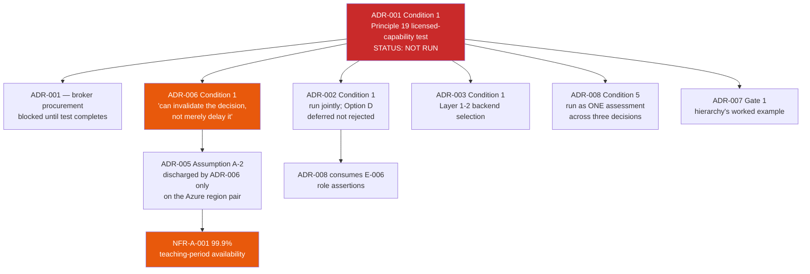

# High-Level Design (HLD) Review: Learning & Teaching Baseline Strategy

> **Template Origin**: Official | **ArcKit Version**: 6.7.5 | **Command**: `/arckit:hld-review`

## Document Control

| Field | Value |
|-------|-------|
| **Document ID** | ARC-001-HLDR-v1.0 |
| **Document Type** | High-Level Design Review |
| **Project** | Learning & Teaching Baseline Strategy (Project 001) |
| **Classification** | OFFICIAL-SENSITIVE |
| **Status** | DRAFT |
| **Version** | 1.0 |
| **Created Date** | 2026-07-29 |
| **Last Modified** | 2026-07-29 |
| **Review Cycle** | On-Demand |
| **Next Review Date** | 2026-08-28 |
| **Owner** | Sam Okafor, Integration Architect (design custodian); review commissioned by Cassandra Rhodes, Chief Information Officer |
| **Reviewed By** | [PENDING] |
| **Approved By** | [PENDING] |
| **Distribution** | Project Team, Architecture Review (RIFF), Digital & IT, Education Committee, Steering Committee |

> **Classification rationale**: This review names unremediated authentication, privacy and residency weaknesses, identifies which decisions are unaccepted, and states how long the exposures remain open. Classified OFFICIAL-SENSITIVE consistent with `ARC-001-RISK-v1.0`, and restricted to the steering and delivery group.

## Revision History

| Version | Date | Author | Changes | Approved By | Approval Date |
|---------|------|--------|---------|-------------|---------------|
| 1.0 | 2026-07-29 | ArcKit AI | Initial creation from `/arckit:hld-review` command — review of the distributed high-level design expressed across ADR-001 to ADR-010, ARC-001-DATA-v1.0 and ARC-001-STRAT-v1.0 | [PENDING] | [PENDING] |

## Document Purpose

This document is the architecture review gate for the high-level design of the University of Funk's Learning & Teaching technology ecosystem. It assesses whether the design as it currently stands is sound enough, complete enough and stable enough to be built against.

It is written for the RIFF Review panel and the Education Committee. Its output is a gate decision with named, owned, dated conditions — not a commentary.

---

## 1. Review Overview

### 1.1 Purpose

This review evaluates the high-level design against `ARC-000-PRIN-v1.1` (19 enterprise architecture principles), `ARC-001-REQ-v1.0` (64 typed requirements), `ARC-001-RISK-v1.0` (29 registered risks) and the strategic position in `ARC-001-STRAT-v1.0`.

### 1.2 What Is Actually Under Review

**There is no single HLD document in this project, and this review does not pretend otherwise.**

The high-level design is expressed **distributively**, across thirteen artifacts. This is an unusual but legitimate form: the university's own governance model (RIFF) produces decisions, not design documents, and Principle 18 requires review outcomes to be "recorded as decisions with rationale, forming an auditable decision register". The design is that register plus the data model plus the strategy that sequences them.

| Artifact | Design role | Lines |
|----------|-------------|-------|
| `decisions/ARC-001-ADR-001-v1.0.md` | Integration mediation — central broker holding the canonical schema | 479 |
| `decisions/ARC-001-ADR-002-v1.0.md` | Authoritative source for institutional role assignment | 755 |
| `decisions/ARC-001-ADR-003-v1.0.md` | Logging and observability — three-layer plane | 666 |
| `decisions/ARC-001-ADR-004-v1.0.md` | Open-source licence and third-party component policy | 669 |
| `decisions/ARC-001-ADR-005-v1.0.md` | Deployment topology and environment strategy | 561 |
| `decisions/ARC-001-ADR-006-v1.0.md` | Cloud platform — Microsoft Azure, `australiaeast` / `australiasoutheast` | 679 |
| `decisions/ARC-001-ADR-007-v1.0.md` | Build-versus-buy sourcing hierarchy (five gates) | 557 |
| `decisions/ARC-001-ADR-008-v1.0.md` | Identity and access enforcement | 840 |
| `decisions/ARC-001-ADR-009-v1.0.md` | Governed AI/ML inference about students | 845 |
| `decisions/ARC-001-ADR-010-v1.0.md` | Data residency and APP 8 cross-border disclosure | 798 |
| `ARC-001-DATA-v1.0.md` | Logical data architecture — 20 entities across 4 bounded contexts | 1,893 |
| `ARC-001-STRAT-v1.0.md` | Target-state architecture, five-layer model, sequencing | 1,010 |
| `wardley-maps/ARC-001-WARD-002-v1.0.md` | Integration value chain, dependency-risk analysis | 884 |

**Consequence for this review**: the review must assess not only each decision but the **coherence of the set** and the **safety of the dependency chain between them**. Sections 4 and 11 do exactly that, and it is where the most significant findings sit.

### 1.3 Jurisdiction and Framework Basis

The University of Funk is a **fictional Australian higher-education institution, private sector, not UK Government**. The applicable frameworks are:

- **Privacy Act 1988 (Cth)** and the Australian Privacy Principles — APP 1, 3.3, 5, 6, 8, 11, 12, 13 and s 16C
- **ASD Essential Eight** — Maturity Level 2 target across the estate by end 2027
- **WCAG 2.2 Level AA** — accessibility conformance for student-facing platforms

UK Government frameworks — GDS Service Standard, Technology Code of Practice, UK GDPR, NCSC CAF — are **not applicable** and have not been applied. Where the project has borrowed a UK methodology (`ARC-001-RISK-v1.0` uses the HM Treasury Orange Book), it states explicitly that it is doing so as a method rather than a compliance obligation. **That is the correct treatment and this review endorses it.**

### 1.4 Review Participants

| Name | Role | Organization | Review Focus |
|------|------|--------------|--------------|
| Sam Okafor | Integration Architect | Digital & IT | Integration mediation, topology, canonical model |
| Tobias Ohm | Cybersecurity Lead | Digital & IT | Identity enforcement, Essential Eight, audit |
| Eleanor Frame | Privacy & Records Officer | Governance | APP compliance, residency, AI/ML privacy position |
| Dr. Benny Moog | Director, Learning Technologies | Learning Technologies | Capability boundaries, product ownership |
| Grace Tanaka | Procurement & Vendor Manager | Procurement | Sourcing hierarchy, exit rights, contract levers |
| Cassandra Rhodes | Chief Information Officer | Digital & IT | Overall architecture, funding, cloud platform |
| A/Prof. Pearl Clavinet | Dean of L&T; Chair, Education Committee | Academic governance | Academic governance of AI rules and role semantics |

### 1.5 Review Criteria and Parameters

| Parameter | Value | Source |
|-----------|-------|--------|
| **Scope** | Full system — all thirteen design artifacts, all eight capability categories, all nine integrations | Default applied; no interactive selection was available |
| **Risk appetite** | Medium | Default applied. Consistent with `ARC-001-RISK-v1.0`, which records that **no approved organisational risk appetite statement exists** and that its thresholds are PROVISIONAL |
| **Phase** | Alpha — design established, build not commenced | Default applied. Corroborated by the design's own state: all ten ADRs are Proposed and delivery of the integrations is explicitly out of engagement scope (TC-5) |

> **Note on review parameters**: this review ran non-interactively. No `AskUserQuestion` prompt was raised by the skill. The three parameters above were set from the recorded defaults and are stated here so the panel can correct them and re-run if any is wrong. **The Medium risk appetite is the parameter most worth challenging**, because the design itself flags that appetite is unapproved.

---

## 2. Executive Summary

### 2.1 Overall Assessment

**Status: APPROVED WITH CONDITIONS** — 8 blocking conditions, 9 advisories.

This is a design of unusually high quality that **cannot yet be built against**.

The quality is real and should be said first. The ten decisions are genuinely decided rather than described: each carries a Y-statement, an options analysis with a Do-Nothing baseline, a costed comparison, recorded dissent, and a rollback plan. Several reach conclusions that are architecturally correct *and* uncomfortable — ADR-002 accepts a build obligation against the university's own documented failure to sustain builds (R-007); ADR-006 concedes that its chosen provider caps the achievable recovery posture and records the dissent rather than burying it; ADR-010 identifies a gap in the requirement set it is supposed to satisfy and feeds it back. `ARC-001-DATA-v1.0` is complete to entity, attribute, retention and CRUD level across 20 entities. The design's treatment of Australian privacy law is materially better than the norm: the disclosure-versus-use characterisation in ADR-010 §2.2, the absolute Tier 0 prohibition on offshore disclosure of sensitive information, and the recognition that Australia gives no statutory erasure right to fall back on, are all correct and consequential.

The problem is not the design's content. It is the design's **state** and its **dependency structure**. All ten ADRs are **Proposed**. Not one has been Accepted by RIFF or the Education Committee. Between them they carry **38 unresolved conditions and 6 open blocking actions — 44 gating items**, and the dependency chain concentrates through a single unresolved test: ADR-001 Condition 1, the Principle 19 licensed-capability test, on which ADR-005, ADR-006, ADR-007 and ADR-008 Condition 5 all directly depend. That test has not been run. Until it is, four downstream decisions rest on an assumption (ADR-006 A-2: "the university holds a Microsoft enterprise agreement capable of extension to the required services") that ADR-006 itself says "can invalidate the decision, not merely delay it".

Beyond the state problem, the review found three substantive defects and one material gap that the design does not know about. ADR-009 asserts twice that no risk register exists and holds twelve risks in-document as `RISK-A1`–`RISK-A12`; `ARC-001-RISK-v1.0` has existed since 2026-07-27 with 29 registered risks, and eight other ADRs cite it correctly. `ARC-001-DATA-v1.0` requires the audit-event store (E-020) to have zero data loss and seven years of immutable retention, but no ADR assigns it a home and ADR-006's in-scope workload list omits it. ADR-001 and ADR-002 cite the superseded `ARC-000-PRIN-v1.0`, and both reserve the ADR-003 number for course-cloning automation — a number that was subsequently issued to observability, leaving R-007 (residual 12, control effectiveness "None effective") with no decision and no reserved slot. And `ARC-001-WARD-002-v1.0` makes a prioritisation finding about INT-007 that no other artifact makes and no ADR has absorbed.

The recommendation is **conditional approval, not rejection**, because every finding is remediable inside the roadmap window and none requires the design to be re-conceived. But the conditions are not documentation tidy-ups. Six of the eight blocking items must be closed before any build commitment, and one of them — the audit-store hosting gap — is a genuine hole in the design rather than an unaccepted decision.

### 2.2 Key Strengths

- **Decisions that are actually decided, with honest dissent.** Every ADR records anticipated objections as legitimate rather than dismissing them. ADR-006 §6.5 states plainly that "a reasonable architect would choose Option B on Principle 9 grounds". ADR-008 §6.5 states that the availability objection "is correct as stated" and that if the mitigating work is not funded "the objection stands". This is the opposite of advocacy dressed as analysis, and it is what makes the set reviewable.
- **The Principle 19 discipline is applied to the project's own proposals.** ADR-001 conditions its own procurement on the duplication test that RIFF applies to everyone else. ADR-006, ADR-007 and ADR-008 all extend the same test rather than exempting themselves. ADR-007 §5 then generalises it into a five-gate hierarchy so the next gap is not argued from first principles. A project that subjects itself to its own governance is a project whose governance will survive it.
- **The data architecture is implementable and privacy-correct.** 20 entities across 4 bounded contexts, with retention enforced structurally (`retention_expires_at` set at write time, not by a policy engine someone must remember to run), sensitive placement attributes never replicated to non-production in any form, and an audit entity that is immutable to administrators. The GDPR-versus-APP comparison at §1609 correctly identifies that Australia has no general erasure right and that the obligation is organisational.
- **Australian privacy law is handled at the level of the actual statute.** The APP 8 disclosure-versus-use characterisation, s 16C accountability acknowledged rather than assumed away, APP 3.3 consent preserved for sensitive information, and the APP 1.4 / APP 5.2 transparency limbs identified as cheap current breaches with a 2026-09-30 date. ADR-010 also refuses to resolve the similarity-repository problem by recording it as accepted residual risk, escalating it to the Education Committee instead — that is the right instinct and it is rare.
- **Observability designed to detect wrong outcomes, not stopped components.** ADR-003's central argument — that transport-level monitoring would have reported "healthy" throughout the entire history of the estate's known defects — is correct and is the strongest single piece of reasoning in the set. Layer 3 reconciliation delivers value against the *current* estate, before the broker exists.
- **The Wardley analysis is used as a challenge function, not decoration.** `ARC-001-WARD-002-v1.0` tests ADR-001's phasing against dependency risk and produces a specific, cheap, additive revision. It also finds that the contested decision ranks eighteenth by fragility. A strategy artifact that argues with the decision register is doing its job.

### 2.3 Key Concerns

- **No design baseline exists.** All ten ADRs are Proposed. There is nothing to build against, nothing to hold a change against, and no basis on which a DLD could claim conformance.
- **A single unresolved test gates four decisions.** ADR-001 Condition 1 is undischarged, and ADR-005, ADR-006, ADR-007 and ADR-008 all hang off it.
- **The 99.9% availability argument is asserted rather than demonstrated.** ADR-005 §5.2 is a good argument that depends on its own Condition 1 (degraded-mode design) being true, and on vendor SLAs that R-024 records as unverified.
- **ADR-009 contains a false statement of fact about the project's own artifacts** and holds twelve risks outside the register.
- **The audit-event store has no home.** DATA requires RPO 0 and 7-year immutability; no ADR hosts it.
- **INT-007 is under-prioritised on the evidence**, and the evidence exists inside the project.
- **Version and numbering drift** in the two earliest ADRs, one of which has orphaned a live risk.

### 2.4 Conditions for Approval

**MUST Address Before Any Build Commitment (BLOCKING)**:

1. **[BLOCKING-01]** Establish a design baseline — take the ten ADRs to acceptance, or declare which are baselined and which remain provisional.
2. **[BLOCKING-02]** Correct ADR-009's false assertion that no risk register exists; migrate `RISK-A1`–`RISK-A12` into `ARC-001-RISK-v1.0`.
3. **[BLOCKING-03]** Run the Principle 19 licensed-capability test once, covering ADR-001, ADR-002, ADR-003, ADR-006 and ADR-008.
4. **[BLOCKING-04]** Demonstrate the NFR-A-001 dependency-chain arithmetic; discharge ADR-005 Conditions 1 and 2.
5. **[BLOCKING-05]** Name the two local-account platforms and disposition each (ADR-008 Condition 1).
6. **[BLOCKING-06]** Assign a hosting decision to the E-020 audit-event store against its stated RPO and retention.
7. **[BLOCKING-07]** Re-price INT-007 against its measured dependency risk, or record why MEDIUM stands.
8. **[BLOCKING-08]** Repair version and cross-reference drift in ADR-001 and ADR-002; raise a decision for course-cloning automation.

**SHOULD Address During Detailed Design (ADVISORY)**:

1. **[ADVISORY-01]** Land certified destruction in `ARC-001-REQ` v1.1 (ADR-010 Condition 4).
2. **[ADVISORY-02]** Adopt the WARD-002 Phase 0 sequencing revision (A-3 change-event spike + ADR-002 raised in parallel).
3. **[ADVISORY-03]** Record design coverage for FR-003, FR-006, FR-008 and FR-012.
4. **[ADVISORY-04]** Give ADR-007 an explicit conditions section.
5. **[ADVISORY-05]** Obtain an approved risk appetite statement, or state that decisions are taken without one.
6. **[ADVISORY-06]** Re-scope Project 002 risk R-010 per ADR-001's cross-project note.
7. **[ADVISORY-07]** Resolve external supervisor authentication (E-015 / R-027) before INT-005 design closes.
8. **[ADVISORY-08]** Reconcile the DATA and ADR-005 RPO expressions.
9. **[ADVISORY-09]** Close the cross-platform access review gap (NFR-SEC-003 fourth criterion).

### 2.5 Recommendation

- [ ] **APPROVED**: Proceed to detailed design with no conditions
- [x] **APPROVED WITH CONDITIONS**: Proceed after addressing blocking items listed above
- [ ] **APPROVED WITH ADVISORIES**: Proceed but address advisory items in DLD
- [ ] **REJECTED**: Significant rework required; resubmit revised HLD for review

**Target resubmission date for blocking items**: 2026-08-28, aligned to the R-001 boundary-decision milestone in `ARC-001-STRAT-v1.0` §Gate 2 so that acceptance and the capability baseline land together rather than sequentially.

---

## 3. Architecture Principles Compliance

Assessed against the nineteen principles of `ARC-000-PRIN-v1.1`. The template's generic principle set has been replaced with the university's actual principles — reviewing against principles the organisation does not hold would be theatre.

### 3.1 Principle Compliance Summary

| # | Principle | Criticality | Status | Primary design coverage |
|---|-----------|-------------|--------|-------------------------|
| 1 | Single Learning Entry Point | HIGH | ⚠️ Partial | ADR-008 (LTI 1.3 launch context); no ADR designates the entry-point platform |
| 2 | Deliberate Capability Boundaries | CRITICAL | ❌ Not addressed | **No ADR.** Deliberately deferred to the R-001 RIFF decision (STRAT §Gate 2) |
| 3 | Consistent Experience Across Schools | HIGH | ⚠️ Partial | STRAT Theme 1; no design decision on templating |
| 4 | Discipline Specialisation at the Edge | MEDIUM | ✅ Compliant | ADR-007 §7.4 explicit exclusion; ADR-004 deployment-mode model |
| 5 | Single Source of Truth for Core Entities | CRITICAL | ✅ Compliant | ADR-002 (E-006 single authority); DATA `authoritative_source` |
| 6 | Canonical Data Model | HIGH | ✅ Compliant | ADR-001 (runtime enforcement); DATA Context 1 |
| 7 | Privacy by Design and Data Minimisation | CRITICAL | ✅ Compliant | ADR-003 §6.4; ADR-005 §5.4; ADR-009 Rules 4/7; DATA retention |
| 8 | Data Residency and Cross-Border Accountability | CRITICAL | ✅ Compliant | ADR-010 (four-tier rule); ADR-006 (AU-only for owned workloads) |
| 9 | Data Portability and Exit | HIGH | ⚠️ Partial | ADR-006 Condition 3; ADR-007 Gate 4; **destruction limb missing from REQ** |
| 10 | Interface-Mediated Integration | CRITICAL | ✅ Compliant | ADR-001; ADR-003 layer definitions as a standard |
| 11 | Event-Driven and Near-Real-Time by Default | HIGH | ⚠️ Partial | ADR-001; **rests on untested assumption A-3 (SIS change events)** |
| 12 | Automated Identity Lifecycle | CRITICAL | ⚠️ Partial | ADR-008 (SCIM 2.0); cross-platform access review remains unmet |
| 13 | Reproducible, Documented Automation | HIGH | ⚠️ Partial | ADR-002 Condition 4; ADR-006 Condition 3 (IaC); **course cloning has no ADR** |
| 14 | Accessibility by Default | CRITICAL | ⚠️ Partial | ADR-007 Gate 4 condition; ADR-008 §6.5 method choice; no ADR owns WCAG verification |
| 15 | Availability Aligned to the Teaching Calendar | HIGH | ⚠️ Partial | ADR-005 §5.2/§5.6; ADR-003 §6.5 period-differentiated thresholds; **chain unproven** |
| 16 | Layered Security Posture | CRITICAL | ⚠️ Partial | ADR-008 (six conditions); **two local-account platforms unnamed** |
| 17 | Observable Integrations and Services | HIGH | ✅ Compliant | ADR-003 (three layers, alert-on-absence) |
| 18 | Evidence-Based Capability Investment | CRITICAL | ✅ Compliant | ADR-004 Condition 5; ADR-007 gates; ADR-009 Rule 8 |
| 19 | Realise Licensed Capability Before New Spend | HIGH | ⚠️ Partial | ADR-001/002/003/006/008 all condition on it; **test not run** |

**Tally**: 7 Compliant, 11 Partial, 1 Not addressed. **No outright violation.** Every Partial is partial because a condition is open, not because the design took a non-compliant position — which is the distinction that makes conditional approval appropriate rather than rejection.

### 3.2 Principle Compliance Detail — Where It Matters

#### Principle 2: Deliberate Capability Boundaries (CRITICAL) — Not addressed

**Assessment**: ❌ Not addressed by any ADR.

**Evidence**: The ten decisions cover the integration substrate (ADR-001, 003, 005, 006), governance rules (ADR-004, 007, 009), and the identity and privacy planes (ADR-008, 010). **Not one designates a primary platform for any of the eight capability categories.** ADR-007 §7.4 removes the question from its own scope explicitly: "The Teams / Zoom / Echo360 rationalisation is a retirement decision, not a sourcing decision. It belongs to BR-001 and lever L-1, and is not settled here."

**Assessment of the deferral**: this is **deliberate and defensible, not an oversight**. `ARC-001-STRAT-v1.0` §671 gives the reasoning: "R-001 is stuck because the evidence base for deciding is the least mature thing in the landscape. Deciding harder will not fix it; deciding later will not fix it either. Finishing the capability baseline fixes it." The decision is scheduled at a published milestone (late Aug 2026, immediately after the WP3 baseline) with criteria published before options are scored.

**But it has a design consequence the design does not state.** Principle 2 is CRITICAL, BR-001 is MUST_HAVE, R-001 scores 16 and is one of five risks exceeding provisional appetite. Every capability-category baseline is 0 of 8 today. Meanwhile ADR-005's environment tiers, ADR-006's six in-scope workloads and ADR-007's applied gates are all scoped *against an estate whose boundaries are undecided*. If the R-001 decision retires a platform that ADR-006's workload set assumed, the topology scope changes.

**Recommendation**: not a blocking condition on this design — the deferral is correctly governed. But the R-001 decision should be recorded as a **named upstream dependency inside ADR-005, ADR-006 and ADR-007**, which currently do not cite it. Tracked as ADVISORY-03.

#### Principle 15: Availability Aligned to the Teaching Calendar (HIGH) — Partial

**Assessment**: ⚠️ Partial. See §8.2 for the full availability analysis. The argument is good; the arithmetic is not shown; two conditions that the argument depends on are open.

#### Principle 16: Layered Security Posture (CRITICAL) — Partial

**Assessment**: ⚠️ Partial. ADR-008 is a strong decision that correctly refuses to measure a breach instead of closing it, and correctly declines to claim an MFA maturity uplift it does not deliver. It fails to be compliant on one fact: **Principle 16's second validation gate requires "no local accounts in production; existing exceptions carry dated remediation plans"**, and the two platforms concerned are unnamed in every available input — `privacy-context.md` §3 says only "two tools", the system landscape does not identify them, and R-019 repeats the count without the names. ADR-008 Condition 1 is correct to make naming a precondition of its own acceptance. Tracked as BLOCKING-05.

#### Principle 19: Realise Licensed Capability Before New Spend (HIGH) — Partial

**Assessment**: ⚠️ Partial, and this is the **structurally most important Partial in the table**. Five ADRs condition themselves on the Principle 19 test. ADR-008 Condition 5 correctly demands it be run **once** across all of them: "the same entitlement question asked three times produces three procurement conversations and one answer." That instruction is right and should be followed. Tracked as BLOCKING-03.

---

## 4. Design Readiness and Dependency-Chain Safety

This section has no counterpart in the standard template. It exists because the design's principal weakness is structural rather than technical, and a per-artifact review would not surface it.

### 4.1 Decision Status — All Ten Are Proposed

| ADR | Subject | Status | Conditions | Owner |
|-----|---------|--------|-----------|-------|
| ADR-001 | Integration mediation | **Proposed** | 3 | Sam Okafor |
| ADR-002 | Authoritative source for role assignment | **Proposed** | 4 | Sam Okafor |
| ADR-003 | Logging and observability | **Proposed** | 4 | Sam Okafor |
| ADR-004 | Open-source licence policy | **Proposed** | 6 | Dr. Benny Moog |
| ADR-005 | Deployment topology and environments | **Proposed** | 4 | Sam Okafor |
| ADR-006 | Cloud platform (Azure) | **Proposed** | 5 | Sam Okafor |
| ADR-007 | Build-versus-buy sourcing hierarchy | **Proposed** | 0 (see ADVISORY-04) | Grace Tanaka |
| ADR-008 | Identity and access enforcement | **Proposed** | 6 | Tobias Ohm |
| ADR-009 | Governed AI/ML inference | **Proposed** | 0 conditions, **6 open blocking actions** | Dr. Benny Moog |
| ADR-010 | Data residency and APP 8 | **Proposed** | 6 | Eleanor Frame |
| | **Total** | **0 Accepted** | **38 conditions + 6 actions = 44 gating items** | |

**What "all Proposed" means for design readiness — stated plainly:**

1. **There is no baseline.** A DLD cannot claim conformance to a design that has not been accepted, and a change cannot be assessed as drift from a baseline that does not exist. Any DLD produced now would be conforming to a proposal.
2. **Every ADR is individually honest about this, and that is to the design's credit.** Six of the ten state their Proposed status in the body of the decision, not merely in the header. ADR-006 §6.1 goes furthest: "The decision is **Proposed**, not Accepted. It carries five conditions." This is not a design pretending to be further along than it is.
3. **But the honesty is per-document, and the risk is per-set.** No artifact aggregates the 44 gating items or states the order in which they must close. This review is the first place that aggregation appears, and producing it should not have required a review.
4. **Acceptance is genuinely available.** These are not decisions blocked on external events. 21 of the 44 items are internal confirmations, sign-offs or naming exercises. The Principle 19 test — the item that gates the most — is a written confirmation from Digital & IT and Procurement.

**Verdict on readiness**: the design is **at the correct maturity for its phase** (alpha, integration delivery out of scope per TC-5) but is **not safe to build against** until the chain in §4.2 is resolved. The distinction matters: this is not a late design, it is an unaccepted one.

### 4.2 The Dependency Chain Through ADR-001 Condition 1

ADR-001 Condition 1 reads: *"Principle 19 test must be completed before procurement. Digital & IT to confirm in writing whether existing licensed platforms — including the Microsoft agreement — already provide adequate integration or event-brokering capability."*

**The exposure, precisely.** ADR-006 Assumption A-2 is *"the university holds a Microsoft enterprise agreement capable of extension to the required services"*, with the consequence *"Condition 1 exists to test exactly this. If invalid, Option A's principal advantage disappears and Option B should be re-considered on Principle 9 grounds."* ADR-006 Condition 1 then states: *"If it does not cover them, this decision returns to RIFF... This condition can invalidate the decision, not merely delay it."*

Chase that through. If the test fails:

- **ADR-006 returns to RIFF.** Provider may become AWS `ap-southeast-2` / `ap-southeast-4`.
- **ADR-005's Assumption A-2 becomes live again.** ADR-005 A-2 assumed three availability zones in the primary region. ADR-006 discharged it *specifically on the Azure pair* — Australia East has zones, Australia Southeast does not, and the topology holds only because the recovery region was designed to hold code, configuration and telemetry with no running compute. On AWS, ADR-006 §Option B verified the required managed services present in **both** Australian regions, which ADR-006 itself notes "leaves room for a warmer recovery posture later". **A provider change therefore changes the available recovery posture, which changes the NFR-A-001 argument.**
- **ADR-005 Assumption A-7** confirms the coupling from the other direction: *"If a warmer recovery posture becomes required, Azure's Australian region pair cannot supply it and Option B should be re-examined."*

**Is the chain safe to build against? No.** Four decisions and one MUST-priority availability requirement rest on an untested entitlement assumption. **But the chain is well-documented and cheap to resolve** — the test is a written confirmation, ADR-008 Condition 5 already specifies running it once, and `ARC-001-STRAT-v1.0` §874 already schedules it as the first recommended action. This is a sequencing failure, not an architectural one. Tracked as BLOCKING-03.

### 4.3 Cross-ADR Coherence

Assessed for contradiction, duplication and orphaned dependency across the ten decisions.

| Check | Result |
|-------|--------|
| Contradictory decisions | **None found.** ADR-008 §1.1 explicitly bounds itself against ADR-002 ("this ADR consumes E-006 and does not reinterpret it"). ADR-006 §1.1 requires itself to be read with ADR-005. ADR-007 §7.4 declares three explicit exclusions to prevent scope bleed. Boundary discipline across the set is notably good. |
| Duplicated decisions | **None found.** The nearest overlap — ADR-002 role authority versus ADR-008 access enforcement — is explicitly demarcated in ADR-008 §1.1. |
| Consistent Principle 19 treatment | ✅ Five ADRs condition on it; ADR-008 Condition 5 correctly collapses them into one assessment. |
| Consistent risk-appetite treatment | ⚠️ ADR-002 §6.6 and ADR-008 §6.6 both correctly state that no approved appetite exists and decline to claim alignment. ADR-006 §6.3 claims "risk appetite alignment" against "the project's posture" without the same caveat. Minor inconsistency; tracked as ADVISORY-05. |
| Consistent risk-register citation | ❌ **ADR-009 is the outlier.** Eight ADRs cite `ARC-001-RISK-v1.0` and its R-xxx IDs correctly. ADR-009 asserts the register does not exist. Tracked as BLOCKING-02. |
| Consistent principles-version citation | ❌ ADR-003 to ADR-010 cite `ARC-000-PRIN-v1.1`. ADR-001 and ADR-002 cite `ARC-000-PRIN-v1.0`. Tracked as BLOCKING-08. |
| Orphaned forward references | ❌ ADR-001 and ADR-002 both reserve "ADR-003" for course-cloning automation; ADR-003 was issued as observability. Tracked as BLOCKING-08. |

---

## 5. Requirements Coverage Analysis

### 5.1 Coverage Summary

64 typed requirements in `ARC-001-REQ-v1.0`. 60 are referenced across the ten ADRs and the data model — **93.8% coverage**.

| Type | Total | Covered | Gaps |
|------|-------|---------|------|
| Business (BR) | 8 | 8 | — |
| Functional (FR) | 22 | 18 | FR-003, FR-006, FR-008, FR-012 |
| Non-functional (NFR) | 16 | 16 | — |
| Integration (INT) | 9 | 9 | — |
| Data (DR) | 8 | 8 | — |
| **Total** | **64** | **60** | **4** |

### 5.2 The Four Uncovered Requirements

| ID | Requirement | Priority | Assessment |
|----|-------------|----------|------------|
| **FR-008** | Live online classes on one primary platform | MUST_HAVE | ⚠️ **Deliberately deferred, correctly.** This *is* Conflict C-1 / R-001 — the Teams/Zoom/Echo360 consolidation. ADR-007 §7.4 excludes it by name; STRAT schedules it at the late-Aug RIFF gate. The deferral is governed but should be visible as a named dependency in the topology ADRs. |
| **FR-003** | Centrally managed reading lists with copyright compliance | MUST_HAVE | ⚠️ **Uncovered without explanation.** Leganto is the incumbent. No ADR touches it, and no artifact states that it needs none. Most likely genuinely out of design scope (a configuration matter), but that should be recorded rather than inferred. |
| **FR-006** | Clinical simulation with device integration | MUST_HAVE | ⚠️ **Uncovered, and the riskiest of the four.** Device integration in simulation labs is the one requirement in the set that involves non-SaaS, non-browser integration. ADR-007 §7.4 excludes iSimulate and Kuracloud from consolidation pressure but explicitly holds them to Gate 4's conditions of adoption. R-010 (specialist tool support model undefined, residual 9) is live. No decision addresses how device data reaches the estate. |
| **FR-012** | In-class polling and formative checks | SHOULD_HAVE | ✅ Acceptable. Polling is a capability-boundary question subsumed by the R-001 decision. Lowest priority of the four. |

**Recommendation**: record a coverage position for each — either "addressed by decision X", "deferred to the R-001 decision", or "no architectural decision required, and here is why". A 93.8% coverage figure with four unexplained MUST gaps reads worse than it is. Tracked as ADVISORY-03.

### 5.3 Non-Functional Coverage — Detail

#### Performance

| NFR | Requirement | Target | Design approach | Assessment |
|-----|-------------|--------|-----------------|------------|
| NFR-P-001 | Change propagation latency | 15 min (p95) | ADR-001 broker + event-driven INT-001/002/003; ADR-003 makes it measurable | ⚠️ **Depends on untested assumption.** ADR-001 A-3 (SIS can emit change events) is load-bearing. WARD-002 §4 is blunt: "Every event-driven flow on this map terminates here... The broker can subscribe to nothing." Scheduled for discovery in ADR-001 Phase 3, six weeks of build after eight weeks of selection and schema work. |
| NFR-P-002 | Lecture capture publication | 4 hours | ADR-003 alert-on-absence covers detection | ✅ Adequate |

#### Availability and Resilience

| NFR | Requirement | Target | Design approach | Assessment |
|-----|-------------|--------|-----------------|------------|
| NFR-A-001 | Availability in teaching periods | 99.9% | ADR-005 single region multi-AZ, plane targeted at 99.95%; ADR-006 `australiaeast` zones | ⚠️ **See §8.2.** Argument sound, arithmetic not shown, two conditions open, vendor SLAs unverified (R-024). |
| NFR-A-002 | Change control on academic calendar | Freeze windows | ADR-005 §5.4; ADR-003 §6.5 period-differentiated thresholds; ADR-008 §6.3 | ✅ Adequate |

#### Scalability

| NFR | Requirement | Design approach | Assessment |
|-----|-------------|-----------------|------------|
| NFR-S-001 | Peak load capacity | ADR-006 event-triggered managed compute, "bursty around teaching-period boundaries" | ⚠️ Acknowledged, not quantified. Acceptable to defer to DLD — but ~200,000 role assignments a year on a teaching calendar (ADR-002 §6.3) is a real number that should size the design. |

#### Security

| NFR | Requirement | Design approach | Assessment |
|-----|-------------|-----------------|------------|
| NFR-SEC-001 | SSO with MFA, no local accounts | ADR-008 IdP as single enforcement plane; SAML/OIDC, LTI 1.3, SCIM 2.0; ADR-006 Condition 5 | ⚠️ Two platforms unnamed (BLOCKING-05) |
| NFR-SEC-002 | Essential Eight ML2 by end 2027 | ADR-006 managed services carry patching; ADR-008 named admin accounts + vaulted break-glass moves *Restrict administrative privileges* off ML1 | ⚠️ Partial. ADR-004 Condition 4 correctly notes the register holds **no risk for unpatched vendorless software** if H5P is confirmed self-hosted — a real ML2 gap. |
| NFR-SEC-003 | Automated identity lifecycle | ADR-002 role authority; ADR-008 SCIM push | ⚠️ **Fourth criterion (cross-platform access review from a single view) explicitly unmet.** ADR-008 §6.3 says so openly and assigns an owner. Honest, but still a MUST gap. |

#### Compliance

| NFR | Requirement | Design approach | Assessment |
|-----|-------------|-----------------|------------|
| NFR-C-001 | Privacy Act 1988 / APPs | ADR-010 four-tier rule; DATA §Privacy; ADR-009 Rules 4/6/7 | ✅ Strong |
| NFR-C-002 | APP 8 cross-border assessment | ADR-010 §6.3 five-question assessment; disclosure-vs-use characterisation; Tier 0 prohibition on sensitive information | ✅ **Best-executed requirement in the set** |
| NFR-C-003 | Audit logging (actor, timestamp, prior value) | DATA E-020 immutable, 7 years; ADR-003 §6.4 keeps it deliberately separate from telemetry; ADR-008 named admin accounts make privileged action attributable | ❌ **Logically complete, physically homeless.** See §6.3 / BLOCKING-06. |

#### Usability and Accessibility

| NFR | Requirement | Design approach | Assessment |
|-----|-------------|-----------------|------------|
| NFR-U-001 | Navigation consistency | STRAT Theme 1; no ADR | ⚠️ Depends on the R-001 entry-point designation |
| NFR-U-002 | WCAG 2.2 AA | ADR-007 Gate 4 adoption condition; ADR-008 §6.5 flags MFA method choice against accessibility; ADR-004 Condition 3 refuses to assert an unverified conformance claim | ⚠️ Partial. Conditions of *adoption* are in place; no decision owns **verification of the existing estate**. R-021 (accessibility conformance unverified, residual 12) has no design response. |

#### Maintainability and Interoperability

| NFR | Requirement | Design approach | Assessment |
|-----|-------------|-----------------|------------|
| NFR-M-001 | Integration observability | ADR-003 three layers, alert-on-absence, failed records visible | ✅ Strong |
| NFR-M-002 | Reproducible automation | ADR-002 Condition 4 (two operators); ADR-006 Condition 3 (IaC) | ⚠️ **Course cloning — the origin of R-007 — has no decision.** See BLOCKING-08. |
| NFR-I-001 | Published, versioned interfaces | ADR-001; ADR-003 layers as a standard; ADR-005 non-production interface-identical | ✅ Adequate |
| NFR-I-002 | Data portability and exit | ADR-006 Condition 3; ADR-007 Gate 4 verified export | ⚠️ **Destruction limb missing.** ADR-010 §2.3 identifies it; ADVISORY-01. |

---

## 6. Data Architecture Review

### 6.1 Assessment

`ARC-001-DATA-v1.0` is the most complete artifact in the set: 20 entities across 4 bounded contexts (Canonical Core, Learning and Assessment, Placement, Governance Registers), with attribute-level definition, validation rules, retention, CRUD matrix, indexes and per-entity privacy position.

**Assessment**: ✅ Adequate for high-level design, with one gap and one inconsistency.

| Aspect | Assessment | Comment |
|--------|------------|---------|
| Entity-relationship model | ✅ | Four ERDs by bounded context; 4 many-to-many resolved via associative entities |
| Data dictionary | ✅ | Types, nullability, PII flag, validation rules, defaults, source requirement per attribute |
| Classification | ✅ | Per-entity; placement context correctly RESTRICTED, audit OFFICIAL-SENSITIVE |
| Retention enforcement | ✅ **Exemplary** | `retention_expires_at` set at write time. DATA §1232: "Retention that depends on someone remembering to run a job is retention that does not happen." |
| Single source of truth | ✅ | `authoritative_source` on E-001 and E-006; ADR-002 fills the E-006 enum with exactly one value |
| Non-production data rule | ✅ **Exemplary** | Sensitive attributes "never replicated, in any form"; ADR-005 §5.4 makes it structural and Condition 3 requires it be a technical control, not a policy |
| Technology neutrality | ✅ | Characteristics per data character rather than named products — correct at this phase |
| Audit store hosting | ❌ | See §6.3 |
| RPO expression | ⚠️ | See §6.4 |

### 6.2 Canonical Model as a Runtime Contract

The design's central data claim is that the canonical model is enforced **at runtime** rather than by convention — ADR-001's stated reason for choosing a broker over point-to-point. This review accepts the claim and notes two things about it.

**It is correct in principle.** ADR-001's justification is the strongest argument in the document: "point-to-point makes canonical conformance a matter of discipline. The current estate is the evidence of where that leads." Runtime enforcement is qualitatively different from documentation.

**But WARD-002 correctly identifies what the broker does not supply.** §434: "The runtime enforcement point for DR-001. Comes with the broker; what does not come with the broker is the schema it enforces." And §7: "A schema registry enforces contracts. It does not author them, and it cannot decide whose role assertion is true." The canonical model at DATA §1750 records that "E-001 to E-006 attributes are logical; physical schema is a WP5 deliverable". The enforcement mechanism is decided; the thing enforced is not yet physical. That is acceptable at alpha but should not be mistaken for completeness.

### 6.3 Finding — The Audit-Event Store Has No Home (BLOCKING-06)

This is the one substantive design gap the project does not appear to know about.

**What DATA requires of E-020 AUDIT_EVENT:**

- Technical Owner: Digital & IT — i.e. **university-held, not vendor SaaS**
- Classification OFFICIAL-SENSITIVE; ~5 million events per year
- Retention: 7 years minimum, **immutable throughout**; "no update or delete permitted on this entity by any role, including administrators"
- **Backup and Recovery table: RPO `0 (synchronous)`, RTO 4 hours, "No acceptable loss"**
- Access to the audit log is itself audited

**What the topology and platform decisions provide:**

- **ADR-006 §1.2 lists the six in-scope university-controlled workloads.** They are: integration broker, canonical schema registry, state reconciliation service, telemetry/metrics/log store, integration runtime, and non-production/sandpit substrate. **There is no audit-event store in the list.** ADR-006 A-4 then assumes "the six in-scope workloads are the complete set of university-controlled hosting in the L&T estate for the roadmap horizon."
- **ADR-003 §6.4 explicitly excludes it from the telemetry store**: "Relationship to NFR-C-003 audit logging — **Deliberately separate.** Audit records... are evidentiary, and follow institutional records retention. Operational telemetry is diagnostic and expires at 13 months. Conflating them would either under-retain the audit record or over-retain the telemetry. Both are wrong." **That reasoning is correct** — which is precisely why the audit store needs its own home and does not have one.
- **ADR-005 §5.6 sets the plane's RPO in events, not minutes**, on the explicit basis that "the plane holds no durable state beyond its replay window — ADR-001 already requires this to prevent it becoming a second source of truth". A 7-year immutable evidentiary store is durable state by definition.

**The failure scenario.** A grade dispute or an integrity finding is contested 18 months after the event. The audit trail for E-012 GRADE and E-016 PLACEMENT_ASSESSMENT is the evidence. Either (a) the store was never built, because no decision commissioned it and ADR-006 A-4 declared the workload set complete; or (b) it was built inside the integration plane, in which case ADR-005's recovery-from-code posture with a 4-hour region-loss RTO and no durable state cannot deliver "RPO 0, no acceptable loss", and the plane has acquired durable state that ADR-001 prohibits it from holding.

**Impact**: NFR-C-003 is MUST_HAVE. It exists specifically because the placement grade flow is flagged for audit concerns and manual re-keying leaves no attributable trail. DR-004 requires sensitive-information access logging. Without a hosted, resilient, immutable audit store, "who changed this grade" remains unanswerable — the exact condition NFR-C-003 was written to end.

**Recommendation**: add the audit-event store to ADR-006's in-scope workload list as a seventh component with its own residency, resilience and immutability position, **or** raise a short successor ADR for evidentiary record hosting. Either way, reconcile its RPO with ADR-005 §5.6 and revise ADR-006 Assumption A-4, which currently asserts the six-workload set is complete. **Owner: Sam Okafor with Tobias Ohm (data steward for E-020) and Cassandra Rhodes (business owner).**

### 6.4 Finding — RPO Expressions Do Not Reconcile (ADVISORY-08)

DATA §Backup and Recovery sets RPO in **minutes** for every entity group: canonical core 15 minutes, placement 15 minutes, assessment and grades 15 minutes, engagement events 24 hours, audit log 0 synchronous.

ADR-005 §5.6 sets RPO in **events**: "Zero events lost... RPO is expressed in events, not minutes, deliberately."

For the canonical core these are reconcilable — "reconstructable from the authoritative source" (DATA) is the same claim as "the plane holds no state that is not reconstructible" (ADR-005). For the **audit log they are not**, because an audit event is not reconstructible from an authoritative source; it *is* the authoritative source. Two artifacts state incompatible recovery objectives for the same data. Resolve in favour of one expression, per entity group.

### 6.5 Data Governance

| Aspect | Addressed | Assessment | Comment |
|--------|-----------|------------|---------|
| Data classification | Yes | ✅ | 8 personal information classes; E-019 as a governed register entity |
| Data residency (APP 8) | Yes | ✅ | E-018 `hosting_region` + `app8_assessment_complete`; DR-005 register; ADR-010 tiering |
| Retention policies | Yes | ✅ | Per entity, automated via `retention_expires_at` |
| PII handling | Yes | ✅ | Per-attribute PII flag; sensitive attributes never replicated |
| Backup and recovery | Partial | ⚠️ | RPO/RTO stated per entity group, but **"unverified for four platforms"** (R-028) and the audit store has no host |
| Data lineage | Yes | ✅ | Upstream/downstream mapping; MDM section; `correlation_id` links audit to telemetry |

---

## 7. Integration and Security Architecture Review

### 7.1 Integration Architecture

Nine integrations, INT-001 to INT-009, all with a named owner (Sam Okafor, except INT-009 shared with Cassandra Rhodes), an integration pattern, an error-handling position and an SLA.

| Aspect | Assessment | Comment |
|--------|------------|---------|
| Pattern consistency | ✅ | Publish/subscribe for change propagation; INT-009 batch recorded as an **accepted, reasoned exception** rather than an omission — correct under Principle 11 |
| Bidirectional flow control | ✅ | INT-005 is the only bidirectional flow, permitted by explicit requirement, and requires a conflict-resolution rule defined in advance. Principle 5 compliance preserved by exception rather than by silence |
| Error handling | ✅ | Retry with backoff; failed records queued, visible and recoverable; INT-005 explicitly "no fallback to manual transfer" |
| Interface mediation | ✅ | ADR-001 broker; no shared-storage exchange in target state |
| Anti-patterns | ✅ None found | No cross-boundary database access; no distributed monolith; no chatty synchronous chains. ADR-001 §Risks explicitly guards against the broker "becoming a second source of truth" |
| Priority calibration | ❌ | See §7.2 |

### 7.2 Finding — INT-007 Is Mis-Prioritised on the Project's Own Evidence (BLOCKING-07)

`ARC-001-WARD-002-v1.0` §7 assessed 47 dependency edges using R(a,b) = visibility(a) × (1 − evolution(b)). 13 edges score above 0.5.

**INT-007 Hierarchy Synchronisation carries R = 0.722 — the second-highest dependency risk on the map** — and is rated **MEDIUM** priority with a one-business-day SLA in `ARC-001-REQ-v1.0`.

WARD-002 §4 states the case: "Drift in faculty, school and department structure is not a cosmetic problem. It corrupts the organisational dimension that every other flow's scoping, reporting and access decisions are made against — including the capability baseline the whole engagement rests on. **A MEDIUM-priority requirement carrying the map's second-highest dependency risk is a prioritisation error, and it is the one finding in this document that no other artifact in the project currently makes.**"

**This review confirms the finding and confirms it is unabsorbed.** INT-007's requirement entry still reads MEDIUM. No ADR revises it. `ARC-001-RISK-v1.0` has no risk naming hierarchy drift as a distinct exposure — R-006 covers integration fragility generally. The design has produced the evidence and not acted on it.

**Compounding factor.** ADR-002's role authority derives institutional role scoped to unit offerings, and unit offerings are scoped by the organisational hierarchy INT-007 synchronises. A drifted hierarchy therefore propagates into role assignment — the estate's most-failing integration — through the very authority designed to fix it.

**Recommendation**: either re-price INT-007 to HIGH with a propagation window consistent with its downstream consumers, or record explicitly why MEDIUM stands given R = 0.722. Add a register entry for hierarchy drift with an owner. **Owner: Sam Okafor with Dr. Felix Marimba (requirements custodian).**

### 7.3 The Broker Is Not Where the Risk Is (ADVISORY-02)

WARD-002 §7 makes a second finding that tensions with ADR-001's framing: **"Not one of the thirteen risks above 0.5 passes through the Integration Broker."** The broker's highest dependency risk on the map is 0.292, below the amber threshold. "Sort the map by fragility and the contested decision appears in eighteenth place."

**Does this invalidate ADR-001? No, and WARD-002 explicitly says so** (§412–414): "This does not make ADR-001 wrong. Option B remains the right selection, and for the reason ADR-001 gives — runtime enforcement of the canonical model is qualitatively different from enforcement by convention. What the map adds is that the broker is not where the risk is, and the project's sequencing currently treats it as though it were."

**This review agrees with both halves.** The decision is sound; the *sequencing* is mis-weighted. Two Genesis-stage artefacts sit inside ADR-001 Phase 2 that are decisions rather than configurations — Declared Role Authority (evolution 0.14, three flows depending on it at R ≥ 0.41) and the Conflict Resolution Rule (0.24, required by INT-005 which Phase 4 delivers). And ADR-001 Assumption A-3 — whether the SIS can emit change events at all — is scheduled for discovery in Phase 3, fourteen weeks in.

WARD-002's proposed revision is additive and costs nothing downstream: Phase 0 gains the A-3 change-event spike and ADR-002 raised in parallel; every later phase is unchanged. **Adopt it.** Testing A-3 early costs a fortnight; discovering it late invalidates fourteen weeks of sequencing and the entire NFR-P-001 latency commitment.

### 7.4 Security Architecture

| Control | Requirement | Design approach | Assessment |
|---------|-------------|-----------------|------------|
| User authentication | SSO + MFA, no local accounts | ADR-008: IdP as single enforcement plane, SAML/OIDC federation | ⚠️ Two platforms unnamed |
| Launch context | Identity/unit/role preserved across platforms | ADR-008: LTI 1.3 | ✅ |
| Lifecycle and revocation | Deprovision within 15 min | ADR-008: SCIM 2.0 push from ADR-002 role authority | ⚠️ **Residual session window survives the decision.** ADR-008 Condition 4 requires it be measured per platform and published, not assumed zero: "A platform with an eight-hour session does not deprovision in fifteen minutes however fast SCIM is, and a design that claims otherwise is wrong." Correct and unusually honest. |
| Privileged access | Individually attributable, no shared accounts | ADR-008: named accounts + vaulted break-glass; ADR-006 Condition 5 | ✅ Moves *Restrict administrative privileges* off ML1 |
| Service-to-service auth | Institutional standard | INT-001 to INT-009 all specify it | ⚠️ Named but unspecified — acceptable to defer to DLD |
| Encryption at rest / in transit | Not stated as a requirement | DATA specifies field-level encryption for the placement context | ⚠️ No ADR states an estate-wide encryption position. Largely a vendor-SaaS matter, but the six university-controlled workloads need one. Defer to DLD. |
| Secrets management | Not addressed | — | ⚠️ Absent from the design. Defer to DLD; note ADR-008's vaulted break-glass implies a vault exists. |
| Audit logging | NFR-C-003 | DATA E-020 | ❌ No host (BLOCKING-06) |
| Essential Eight ML2 | NFR-SEC-002 | ADR-006 managed-service patching; ADR-008 privileged access; ADR-004 Condition 4 | ⚠️ Vendorless-software patching gap identified by ADR-004 and unregistered |

**Threat model**: not provided as a discrete artifact. Acceptable at HLD for a SaaS-dominant estate where the threat surface is largely contractual, and partially compensated by ADR-008 §3.2's "three concrete facts this decision exists to resolve". **Recommend a threat model at DLD** for the six university-controlled components, particularly the IdP concentration that ADR-008 §6.5 concedes makes an identity outage a total teaching outage.

### 7.5 The Identity Single Point of Failure

ADR-008 accepts that the IdP becomes "a total-teaching single point of failure requiring availability design before first cutover", and §6.5 records the availability objection as **"correct as stated"**, answerable only by funded engineering: period-differentiated availability targets, assessment-window change freeze, per-platform degraded mode, tested break-glass.

**This review endorses the trade** — ADR-008 §6.3 is right that the availability objection is about design, which is solvable, while the alternative's objections are about requirement satisfaction, which is not. **But the endorsement is conditional on the mitigating work being funded**, which ADR-008 itself flags. That funding is not evidenced anywhere in the design. Fold it into BLOCKING-04.

---

## 8. Resilience and Availability Analysis

### 8.1 Resilience Patterns

| Pattern | Present | Assessment |
|---------|---------|------------|
| Retry with exponential backoff | ✅ | INT-001, INT-003, INT-005 |
| Queue and replay | ✅ | Failed records queued, visible, recoverable; RPO expressed in events |
| Edge buffering | ⚠️ | **Required by ADR-005 Condition 1 but not yet designed** — and the whole availability argument depends on it |
| Graceful degradation | ⚠️ | Required per platform by ADR-008 and NFR-A-002; not specified |
| Alert on absence | ✅ **Exemplary** | ADR-003 §6.5: "a batch that does not run produces no error, it produces nothing" |
| Health checks / heartbeats | ✅ | Heartbeat expectation per scheduled and event-driven flow |
| Circuit breaker | ❌ | Not addressed. Defer to DLD. |
| Multi-AZ | ✅ | ADR-005 three zones; ADR-006 confirms `australiaeast` supports them |
| Cross-region recovery | ⚠️ | Recovery-from-code only; rehearsal is ADR-005 Condition 2, unexercised |

**Single points of failure identified by the design itself** — creditably, all three are named rather than discovered by this review:

1. **The integration broker** — ADR-001 accepts "a new shared runtime dependency"; R-006 "reduced but partly displaced into the broker dependency".
2. **The identity provider** — ADR-008 §6.2 accepts it becomes "a total-teaching single point of failure".
3. **The SIS change-event capability** — WARD-002 §4: every event-driven flow terminates here.

### 8.2 The NFR-A-001 Availability Argument — Tested (BLOCKING-04)

NFR-A-001 requires **99.9% availability during teaching periods** for core teaching platforms, and its third acceptance criterion requires that "given a platform depends on another, when aggregate availability is calculated, then the dependency chain is accounted for".

**The design's argument** (ADR-005 §5.2, three limbs):

1. **The plane is not in the student request path.** An outage degrades *data freshness*, not *teaching availability* — provided events buffer at the edge and replay rather than drop.
2. **99.9% is 43 minutes per month and it is a chain target.** The chain is SIS → plane → destination SaaS. The plane is therefore targeted at **99.95%** (~22 min/month) so it is a minor rather than dominant contributor. Multi-AZ in one region is the standard means of reaching that; active-active is not required.
3. **Active-active would spend a constrained budget in the wrong place**, since the estate's real exposure is unverified vendor SLAs (R-024) that no UoF topology can influence.

**Assessment: the argument is sound in structure and unproven in substance.** Four problems.

**(a) Limb 1 is a design obligation, not a fact.** ADR-005 says so itself: "This is a design obligation, not an assumption, and it is Condition 1 below." Assumption A-3 confirms the consequence: "If invalid, the §5.2 availability argument fails and the plane inherits NFR-A-001 directly rather than contributing to it." Edge buffering is **not yet designed and not yet failure-injection tested**. Until Condition 1 is discharged, limb 1 is a plan.

**(b) The chain arithmetic is asserted, never shown.** NFR-A-001's third criterion asks for an aggregate calculation. The design never performs one. Serially, availability multiplies: a 99.95% plane in a chain with a 99.9% SIS and a 99.9% destination platform yields roughly **99.75%** end-to-end — *below* the 99.9% target — before any vendor SLA is verified. The design's answer is limb 1: the plane is off the student path, so the chain that matters for *teaching availability* is shorter than the chain that matters for *freshness*. **That answer is probably right, but it is the argument that must be written down and it has not been.** A one-page availability budget showing which chain each requirement attaches to would close this.

**(c) The recovery-region posture is thinner than the headline suggests, and ADR-006 says so.** ADR-006 discharges ADR-005 Assumption A-2, but on an asymmetry: `australiaeast` has availability zones, **`australiasoutheast` does not**. ADR-006 §Option B is explicit that this "is tolerable *only because* ADR-005 already designed the recovery region to hold code, configuration and telemetry with no running compute and no personal information at rest — under an active-active assumption it would be disqualifying." ADR-006 §6.3 adds: "It would be dishonest to present Australia Southeast's lack of zones as immaterial. It is material, and it constrains the university to exactly the recovery posture ADR-005 chose."

**This review accepts the discharge as valid and narrow.** A-2 is satisfied *for the primary region only*, on the specific Azure pair, contingent on a recovery posture with no warm capability. The 4-hour region-loss RTO is an accepted, stated NFR-P-001 breach for its duration. That is a legitimate proportionality judgement — **but it means the availability position is not portable.** If ADR-006 Condition 1 fails and the provider changes, the recovery posture changes with it (ADR-005 A-7, ADR-006 A-7). The availability argument is therefore downstream of the unresolved Principle 19 test.

**(d) The credibility of recovery-from-code rests entirely on rehearsal, which has not happened.** ADR-005 §5.7 makes the case honestly: recovery-from-code is "continuously testable in a way that a rarely-exercised failover path is not... That conversion depends entirely on rehearsal, which is why rehearsal is a condition rather than a recommendation." Condition 2 requires rehearsal before first cutover and each semester after. **Zero rehearsals have occurred.** Until one has, ADR-005 §5.7's own standard applies: "A rebuild from code that has never been executed is not a recovery posture."

**Does the design satisfy REQ-032 / NFR-A-001? Not yet demonstrably.** The plane's *component* target (99.95% via multi-AZ in `australiaeast`) is credible and the mechanism exists. What is missing is: the chain calculation NFR-A-001 explicitly asks for; the discharged degraded-mode design that limb 1 depends on; one executed recovery rehearsal; and verified vendor SLAs, without which R-024 (residual 8) remains the dominant term in an equation the design concedes it cannot influence.

**Recommendation**: produce a one-page availability budget showing the dependency chain per requirement with the aggregate calculation; discharge ADR-005 Conditions 1 and 2 and record the rehearsal elapsed time against the §5.6 RTO; obtain the R-024 SLA verification; and fund the ADR-008 IdP availability work. **Owner: Sam Okafor, with Cassandra Rhodes for the vendor SLA verification.**

---

## 9. Operational and Cost Architecture

### 9.1 Observability

| Aspect | Design approach | Assessment |
|--------|-----------------|------------|
| Logging | ADR-003 Layer 1 transport telemetry | ✅ |
| Metrics | ADR-003 Layer 2; ADR-006 managed metrics store | ✅ |
| Tracing | OpenTelemetry, vendor-neutral (ADR-006 Condition 3 makes it an exit control) | ✅ |
| Reconciliation | ADR-003 Layer 3 — derived state vs authoritative source | ✅ **The strongest design idea in the set.** Runs against the *current* estate before the broker exists. |
| Alerting | Named owner + runbook per alert; alert on absence; period-differentiated thresholds; alert volume itself monitored | ✅ Exemplary |
| SLI/SLO | Not formally defined | ⚠️ Implied by NFR-A-001 and the 99.95% plane target. Formalise at DLD. |
| On-call | ADR-003 Condition 4 | ⚠️ Open, and honestly framed: "Alerting without a rostered responder is theatre. If out-of-hours coverage is not funded, alerts are explicitly scoped to business hours and the residual exposure is stated openly rather than implied away." |

### 9.2 Deployment

| Aspect | Design approach | Assessment |
|--------|-----------------|------------|
| Infrastructure as code | ADR-006 Condition 3; ADR-005 recovery-from-code | ✅ Structural, not aspirational — recovery depends on it |
| Environment strategy | ADR-005 §5.4 three tiers, separated by **subscription and identity boundary** | ✅ **Exemplary.** "Separation that a misconfiguration can cross is not separation." |
| Non-production data control | ADR-005 Condition 3 — technical control, not policy | ✅ Correct framing, open condition |
| Change control | NFR-A-002 freeze windows; ADR-005 promotion path subject to freezes | ✅ |
| CI/CD pipeline | Not specified | ⚠️ Defer to DLD |
| Rollback | Per-ADR rollback plans present in all ten | ✅ |

### 9.3 Supportability

| Aspect | Assessment | Comment |
|--------|------------|---------|
| Runbooks | ⚠️ | Required by ADR-002 Condition 4 and ADR-003 Condition 4; none exist |
| Two-person operability | ⚠️ | ADR-002 Condition 4 makes it binding: "**Option C without Condition 4 is worse than Option A.**" Correct, and open. |
| Skills | ⚠️ | ADR-001 accepts "operational skills the team does not currently hold"; ADR-006 accepts an operating obligation "for a team whose current depth is evidenced by a single-person dependency on a course-cloning script". Honest, unresolved. |
| Capacity planning | ❌ | Not addressed. Defer to DLD. |

**Operational readiness is the design's weakest non-blocking dimension**, and the design knows it. R-007 (single-person dependency, control effectiveness "None effective", residual 12) is cited as evidence in three separate ADRs as a reason to impose conditions — and the automation that *is* R-007 still has no decision (BLOCKING-08).

### 9.4 Cost

**Assessment**: ⚠️ Comparative, not quantified — and consistently declared as such.

ADR-001 Assumption A-1 states that no costing baseline exists for project 001 and that cost analysis is comparative. ADR-005, ADR-006 and ADR-010 all inherit it explicitly. Every ADR cost table is marked indicative.

**This is the correct treatment for the phase, and the declaration discipline is good.** But three consequences should be visible to the panel:

1. **BR-002 (licence spend flat or reduced) cannot be tested against this design.** ADR-001 records the cost objection as "the primary anticipated challenge at RIFF" and ADR-003 adds a second cost line. Two new recurring lines against a flat envelope, with no baseline, is a business-case exposure (R-013, R-014).
2. **Consumption cost is the CFO's stated concern** (ADR-006 §6.5) and the mitigation offered — that log and telemetry retention is the dominant controllable variable, governed by DR-006 rules the university must set anyway — is sound but should be **modelled rather than asserted**, as ADR-006 itself says.
3. **ADR-007 provides the only mechanism by which the envelope can fall**, and it is the ADR with no conditions section (ADVISORY-04).

---

## 10. Technology Stack Review

| Layer | Proposed | Approved | Assessment | Comment |
|-------|----------|----------|------------|---------|
| Cloud platform | Microsoft Azure — `australiaeast` / `australiasoutheast` | ⚠️ Conditional | ⚠️ | ADR-006, conditional on Principle 19 test (Condition 1, invalidating) |
| Messaging / eventing | Managed messaging; AMQP or equivalent required | ⚠️ Conditional | ✅ | Open protocol mandated as an exit control (ADR-006 Condition 3) |
| Schema registry | Managed, small, stateful | ⚠️ Conditional | ✅ | Runtime enforcement point for DR-001 |
| Observability | Managed log/metrics store; **OpenTelemetry instrumentation** | ⚠️ Conditional | ✅ | Vendor-neutral instrumentation is the right lock-in hedge |
| Identity | Institutional IdP — SAML/OIDC, SCIM 2.0, LTI 1.3 | ✅ | ✅ **Strongest stack position** | Commodity multi-vendor standards; ADR-008 §6.3: "overwhelmingly configuration of capability the university already owns" |
| Reconciliation service | Custom-built | ✅ | ⚠️ | The only genuine build besides the role authority; couples to the canonical model |
| Role authority | Custom-built, thin | ✅ | ⚠️ | ADR-002 accepts a build against R-007's evidence; Condition 4 is the mitigation |
| Database | **Deliberately unnamed** | N/A | ✅ | DATA states characteristics per data character. Correct — Principle-consistent, since technology selection follows design |
| Open-source components | H5P, MuseScore | ⚠️ | ⚠️ | ADR-004: deployment mode unconfirmed for H5P (Condition 1), version/licence unconfirmed for MuseScore (Condition 2) |

**Deprecated technologies**: none proposed.

**Technology risks**:

- **Vendor concentration** — ADR-006 records this as unresolved dissent, not a solved problem. Principle 9 mitigation is by design (open protocols, portable schemas, IaC) rather than by diversification, and ADR-006 §6.3 argues correctly that splitting the smallest workload class is "the appearance of a hedge rather than a hedge".
- **Punctuated equilibrium in brokering** — WARD-002 §5 warns that brokering is a candidate for a rapid product-to-utility shift, and that "a procurement run on the current timetable will complete just in time to have bought the wrong thing." This strengthens rather than weakens ADR-001 Condition 1: the map makes the Principle 19 test "the strategically correct action rather than a procedural hurdle".
- **Skills adjacency vs skills depth** — Microsoft adjacency is a real advantage for *selection* and does not answer the *operating* obligation.
- **Refusal to assert unverified facts** — ADR-004 Condition 3 declines to state a licence identifier from memory, on the grounds that this would be "exactly the unverified claim NFR-U-002 and Principle 14 warn against for vendor conformance statements". **This is exemplary and should be adopted as a house standard.**

---

## 11. Issues and Recommendations

### 11.1 Critical Issues (BLOCKING)

| ID | Issue | Impact | Recommendation | Owner | Target |
|----|-------|--------|----------------|-------|--------|
| **BLOCKING-01** | **No design baseline.** All ten ADRs are Proposed; 38 conditions and 6 open actions outstanding. No artifact aggregates them or orders their closure. | HIGH — nothing to build against, no conformance basis for a DLD, no drift baseline | Take the ten decisions to RIFF and Education Committee for acceptance. Where acceptance must wait on a condition, **declare explicitly which decisions are baselined and which remain provisional**, and publish a single consolidated gating-item register with owners and dates. | Dr. Benny Moog (RIFF facilitation), A/Prof. Pearl Clavinet (Education Committee) | 2026-08-28 |
| **BLOCKING-02** | **ADR-009 asserts a false fact about the project's own artifacts.** §453: *"no `ARC-001-RISK-v*.md` exists at the time of writing"*; §572: *"Risk register: not yet created."* `ARC-001-RISK-v1.0` was created 2026-07-27 with 29 registered risks (R-001 to R-029), and eight other ADRs cite it correctly. Twelve AI risks are held in-document as `RISK-A1`–`RISK-A12`, four of them rated H. | HIGH — twelve risks, including RISK-A2 and RISK-A10 (both likelihood H), sit outside the governed register and therefore outside the monthly review cycle, the appetite thresholds and the Steering Committee's view. Also undermines confidence in ADR-009's other factual claims. | Correct both statements. Migrate `RISK-A1`–`RISK-A12` into `ARC-001-RISK-v1.0` as R-030 to R-041, preserving a cross-reference to the original identifiers. Re-issue ADR-009 as v1.1. Check ADR-009's remaining external claims while there. | Dr. Benny Moog (ADR owner), Rhonda Bell (register owner) | 2026-08-14 |
| **BLOCKING-03** | **ADR-001 Condition 1 unresolved and load-bearing for four decisions.** The Principle 19 licensed-capability test has not been run. ADR-005, ADR-006, ADR-007 and ADR-008 Condition 5 all depend on it. ADR-006 Condition 1: *"This condition can invalidate the decision, not merely delay it."* | HIGH — a failed test returns ADR-006 to RIFF, re-opens ADR-005 Assumption A-2, changes the available recovery posture, and therefore changes the NFR-A-001 argument | Run **one** assessment covering ADR-001, ADR-002, ADR-003, ADR-006 and ADR-008, exactly as ADR-008 Condition 5 instructs. Confirm in writing what the Microsoft agreement covers. Weight the answer by the broker's evolution movement (0.64 → 0.76) per WARD-002 §6. | Cassandra Rhodes with Grace Tanaka | 2026-08-21 |
| **BLOCKING-04** | **NFR-A-001 not demonstrably satisfied.** No aggregate dependency-chain calculation exists despite the requirement's third acceptance criterion asking for one. ADR-005 Condition 1 (degraded-mode / edge buffering) is undesigned, and the availability argument depends on it. Condition 2 (recovery rehearsal) has never been executed. Vendor SLAs unverified (R-024). ADR-008's IdP availability work is unfunded. | HIGH — MUST_HAVE requirement on the estate's most consequential quality attribute, during teaching and examination periods | Produce a one-page availability budget stating the dependency chain per requirement, with the aggregate calculation and which chain attaches to freshness versus teaching availability. Design and failure-injection test edge buffering. Execute one recovery rehearsal and record elapsed time against the §5.6 RTO. Obtain R-024 SLA verification. Fund the IdP availability, freeze and degraded-mode work or record the objection as standing. | Sam Okafor; Cassandra Rhodes (SLA verification and funding) | 2026-10-31 |
| **BLOCKING-05** | **The two local-account platforms are unnamed in every available input.** `privacy-context.md` §3 says "two tools"; the system landscape does not identify them; R-019 repeats the count. NFR-SEC-001's second acceptance criterion requires a **dated** remediation plan, which cannot exist for an unnamed platform. | HIGH — direct, live breach of a MUST_HAVE requirement and of Principle 16's second validation gate; blocks the estate-wide MFA/ML2 claim from being defensible | Execute ADR-008 Condition 1: name both platforms and classify each as (a) federate with existing capability, (b) time-bound exception under `ARC-000-PRIN-v1.1` Section VI with compensating controls and a renewal-anchored date, or (c) retire/replace. Grace Tanaka to supply renewal dates so remediation anchors to a real lever. Escalate any (c) that a Dean judges indispensable to University Executive. | Tobias Ohm with Dr. Benny Moog; Grace Tanaka (renewal dates) | 2026-09-30 |
| **BLOCKING-06** | **The E-020 audit-event store has no hosting decision.** DATA requires RPO 0 synchronous, "no acceptable loss", 7-year immutable retention, Digital & IT as technical owner. ADR-006 §1.2's six in-scope workloads omit it and A-4 declares the set complete. ADR-003 §6.4 correctly and deliberately excludes it from telemetry. ADR-005 §5.6 permits no durable state in the plane. **Full analysis at §6.3.** | HIGH — NFR-C-003 is MUST_HAVE and exists precisely because the placement grade flow is flagged for audit concerns. DR-004 requires sensitive-access logging. Without a resilient immutable store, "who changed this grade" stays unanswerable. | Add the evidentiary audit store to ADR-006's in-scope workloads as a seventh component with its own residency, resilience and immutability position, **or** raise a successor ADR for evidentiary record hosting. Reconcile its RPO with ADR-005 §5.6 and revise ADR-006 Assumption A-4. | Sam Okafor with Tobias Ohm (E-020 steward) and Cassandra Rhodes (business owner) | 2026-09-30 |
| **BLOCKING-07** | **INT-007 is mis-prioritised on the project's own evidence.** Rated MEDIUM with a one-business-day SLA while carrying R = 0.722, the second-highest dependency risk of 47 edges assessed. Entirely manual, second-least evolved flow on the map, documented failure mode is hierarchy drift. No ADR or REQ revision has absorbed the finding, and no register entry names hierarchy drift. **Full analysis at §7.2.** | MEDIUM-HIGH — hierarchy drift corrupts the organisational dimension every other flow's scoping, reporting and access decisions are made against, including the capability baseline the engagement rests on. Propagates into ADR-002's role authority via unit-offering scoping. | Re-price INT-007 to HIGH with a propagation window consistent with its downstream consumers, or record explicitly why MEDIUM stands given R = 0.722. Add a risk-register entry for hierarchy drift with a named owner. | Sam Okafor with Dr. Felix Marimba | 2026-08-21 |
| **BLOCKING-08** | **Version and cross-reference drift in the two earliest ADRs.** (i) ADR-001 and ADR-002 cite `ARC-000-PRIN-v1.0`; the governing version is v1.1, which added the Appendix VIII eight-category taxonomy that Principles 2 and 19 depend on for assessability. ADR-003 to ADR-010 cite v1.1 correctly. (ii) ADR-001 §410 and ADR-002 §627 both reserve **"ADR-003"** for *course cloning automation*; ADR-003 was issued as *logging and observability*. Course-cloning automation (INT-004, NFR-M-002, R-007) consequently has **no decision and no reserved number**. | MEDIUM — (i) two ADRs assess against a superseded principle set whose central validation gates were subsequently made assessable; (ii) R-007 has residual 12, control effectiveness "None effective", and is cited as justifying evidence in three other ADRs, yet the decision meant to resolve it was silently displaced | Re-point ADR-001 and ADR-002 to `ARC-000-PRIN-v1.1` and confirm no assessment changes under the enumerated taxonomy. Correct the stale "not yet raised" references in ADR-001 §410–411, ADR-002 §103/§627 and ADR-003 §542. **Raise a new ADR for course-cloning automation** (INT-004, NFR-M-002, R-007). | Sam Okafor (ADR-001/002); Dr. Benny Moog (new ADR sponsorship) | 2026-09-30 |

### 11.2 High Priority Issues (ADVISORY)

| ID | Issue | Impact | Recommendation | Owner | Target |
|----|-------|--------|----------------|-------|--------|
| **ADVISORY-01** | Certified destruction absent from the requirement set. ADR-010 §2.3 correctly identifies that NFR-I-002 and DR-007 cover **retrieval** on termination but not **destruction** by the offshore recipient — the limb that matters for APP 8, because s 16C accountability runs for as long as the recipient holds the data. Australia gives no statutory erasure right to fall back on. | MEDIUM — retrieval without destruction duplicates the exposure rather than ending it | Execute ADR-010 Condition 4: add certified destruction to NFR-I-002 and DR-007 in `ARC-001-REQ` v1.1. **This is the design correctly finding a gap in its own requirements and feeding it back — credit it and close it.** | Eleanor Frame with Dr. Felix Marimba | 2026-09-30 |
| **ADVISORY-02** | ADR-001 phasing schedules two Genesis-stage *decisions* inside Phase 2 as if they were configurations, and defers the load-bearing A-3 SIS change-event assumption to Phase 3. | MEDIUM — discovering A-3 late invalidates fourteen weeks of sequencing and the NFR-P-001 commitment | Adopt WARD-002 §7's revision: Phase 0 gains the A-3 two-week spike and ADR-002 raised in parallel; nothing downstream moves. Draft the INT-005 conflict-resolution rule in Phase 3 ahead of Phase 4. Cheapest de-risking available. | Sam Okafor | 2026-08-14 |
| **ADVISORY-03** | FR-003, FR-006, FR-008 (all MUST) and FR-012 (SHOULD) have no design coverage. FR-008 is the R-001 consolidation and correctly deferred; FR-006 (clinical simulation device integration) is the riskiest genuinely uncovered one. | MEDIUM | Record a coverage position per requirement: addressed by decision X / deferred to the R-001 decision / no architectural decision required and why. Add the R-001 decision as a named upstream dependency in ADR-005, ADR-006 and ADR-007. Address FR-006 device integration explicitly. | Dr. Felix Marimba with Dr. Benny Moog | 2026-08-31 |
| **ADVISORY-04** | ADR-007 carries no conditions section, unlike eight of its nine siblings, despite being the only mechanism by which BR-002's flat envelope can fall. | LOW-MEDIUM | Add explicit conditions: Gate 3 CAUDIT enquiry raised (recorded "no" satisfies it); Gate 1 stage-2 configurability testing resourced; export testing funded. | Grace Tanaka | 2026-08-31 |
| **ADVISORY-05** | No approved organisational risk appetite. ADR-002 §6.6 and ADR-008 §6.6 correctly decline to claim alignment; ADR-006 §6.3 claims it without the same caveat. | MEDIUM — the availability-for-compliance trade in ADR-008 and the concentration trade in ADR-006 are appetite judgements presented as architectural ones | Obtain an approved appetite statement from the Steering Committee, or state uniformly across all ten ADRs that decisions are taken without one and that the trades are Steering Committee judgements. Align ADR-006 §6.3 to the ADR-002/ADR-008 wording. | Rhonda Bell with Prof. Otis Hammond | 2026-09-30 |
| **ADVISORY-06** | ADR-001's cross-project note records that Project 002 risk R-010 and assumption A-11 are mis-scoped — the canonical model already exists in DATA; what 002 actually depends on is ADR-001 and its implementation. | LOW | Re-scope 002's R-010 at its next risk review, per ADR-001's own recommendation. | Rhonda Bell | 2026-09-30 |
| **ADVISORY-07** | External supervisor authentication unresolved. E-015 cannot meet NFR-SEC-001 because institutional SSO does not extend to placement providers (R-027, residual 9). WARD-002 notes R = 0.592 and warns that "remediating the flow without resolving external-supervisor identity relocates the manual step rather than removing it." | MEDIUM — INT-005 is the design's highest-value remediation and carries the estate's only sensitive information (DR-004, R-018 the register's highest risk) | Decide federation versus formally approved compensating exception at RIFF before INT-005 design closes, not during delivery. | Tobias Ohm | 2026-10-31 |
| **ADVISORY-08** | DATA and ADR-005 state incompatible RPO expressions — minutes per entity group versus zero events lost. Irreconcilable for the audit log, which is not reconstructible from an authoritative source. **See §6.4.** | LOW-MEDIUM | Adopt one expression per entity group and state it in both artifacts. | Sam Okafor | 2026-09-30 |
| **ADVISORY-09** | NFR-SEC-003's fourth acceptance criterion — cross-platform access review from a single view — is explicitly unmet. ADR-002 flagged it; ADR-008 §6.3 confirms it does not deliver it and assigns an owner with a 12-month trigger. | MEDIUM — a MUST criterion openly carried as an open gap | Acceptable to carry, given it is owned and dated. Confirm the 12-month trigger is recorded in the register rather than only in ADR-008, and revisit if the Principle 19 test finds licensed IGA capability. | Tobias Ohm | 2027-07-31 |

### 11.3 Low Priority Items (INFORMATIONAL)

| ID | Suggestion | Benefit | Owner |
|----|------------|---------|-------|
| INFO-01 | Adopt ADR-004 Condition 3's discipline — never assert a licence identifier, conformance claim or hosting region from memory — as a house standard across all artifacts. | Prevents the unverified-claim failure mode Principle 14 warns about | Dr. Benny Moog |
| INFO-02 | Add a threat model for the six (seven with BLOCKING-06) university-controlled components at DLD, focused on the IdP and broker concentration. | Closes the one standard HLD artifact genuinely absent | Tobias Ohm |
| INFO-03 | Specify secrets management and an estate-wide encryption position for university-controlled workloads at DLD. ADR-008's vaulted break-glass implies a vault already. | Removes two unstated assumptions | Sam Okafor |
| INFO-04 | Formalise SLI/SLO definitions against the 99.95% plane target and NFR-A-001. | Makes the availability budget in BLOCKING-04 measurable | Sam Okafor |
| INFO-05 | Publish a single consolidated view of the 44 gating items with owner, date and blocking relationship. | This review had to construct it; the project should own it | Rhonda Bell |
| INFO-06 | Record the ADR-009 Rule 4 equity-monitoring privacy tension as an explicit Education Committee decision. ADR-009 §418 states it "is not resolved, only managed" — that is the right framing and deserves a recorded decision. | Converts a managed tension into an owned decision | A/Prof. Pearl Clavinet |

---

## 12. Review Decision

### 12.1 Final Decision

**Status**: [ ] APPROVED | [x] **APPROVED WITH CONDITIONS** | [ ] REJECTED

**Effective Date**: 2026-07-29

**Conditions**: the eight BLOCKING items in §11.1 must be closed before any build commitment or procurement signature. The nine ADVISORY items in §11.2 must be closed before or during detailed design.

**Rationale for conditional approval rather than rejection.** Rejection would be wrong on the evidence. The design's reasoning is sound, its options analysis is genuine, its privacy and residency treatment is better than the norm for its sector, and its data architecture is implementable. Every blocking finding is either an unaccepted decision (BLOCKING-01, 03, 05), a correctable factual or reference defect (BLOCKING-02, 08), a demonstration the design has not yet performed (BLOCKING-04, 07), or one genuine gap (BLOCKING-06). None requires the architecture to be re-conceived. Rejection would also be counterproductive: five of the eight blocking items close through a written confirmation, a naming exercise, or a document correction.

**But approval without conditions would be indefensible.** There is no baseline, a single untested entitlement assumption gates four decisions and one MUST-priority availability requirement, twelve risks sit outside the governed register on the strength of a false statement, and the audit store that answers "who changed this grade" has nowhere to live.

**Note for the panel on this design's most unusual property.** Most of the blocking findings were *self-identified by the design*. ADR-001 wrote its own Condition 1. ADR-005 wrote the conditions that its own availability argument depends on. ADR-008 named the unnamed platforms as a precondition of its own acceptance. ADR-010 found a gap in the requirements it was written to satisfy. WARD-002 argued with ADR-001's phasing and found the INT-007 mis-prioritisation. This review's genuinely novel contributions are narrow: the audit-store hosting gap (BLOCKING-06), the ADR-003 number collision orphaning R-007 (BLOCKING-08), the principles-version drift, the RPO inconsistency, and the aggregation of 44 gating items into one chain. **A design that finds most of its own defects is a design worth conditioning rather than rejecting** — but the conditions it wrote for itself must now actually be closed, and the project has no consolidated mechanism for tracking whether they are. That mechanism (INFO-05) may be the single most valuable output of this review.

**Next Steps**:

- [ ] Blocking items assigned to named owners with the dates in §11.1
- [ ] Principle 19 test run **once** across ADR-001, 002, 003, 006, 008 (BLOCKING-03) — the highest-leverage single action
- [ ] ADR-009 re-issued as v1.1 with the register correction and RISK-A migration (BLOCKING-02)
- [ ] Consolidated gating-item register published (INFO-05)
- [ ] Ten ADRs taken to RIFF and Education Committee for acceptance (BLOCKING-01)
- [ ] Re-review of blocking items scheduled: 2026-08-28
- [ ] Proceed to detailed design only for components whose gating ADRs have been accepted

### 12.2 Reviewer Sign-Off

| Reviewer | Role | Decision | Signature | Date |
|----------|------|----------|-----------|------|
| [PENDING] | Lead Reviewer / Enterprise Architect | [ ] Approve [ ] Conditional [ ] Reject | _________ | [PENDING] |
| Tobias Ohm | Cybersecurity Lead | [ ] Approve [ ] Conditional [ ] Reject | _________ | [PENDING] |
| Sam Okafor | Integration Architect | [ ] Approve [ ] Conditional [ ] Reject | _________ | [PENDING] |
| Eleanor Frame | Privacy & Records Officer | [ ] Approve [ ] Conditional [ ] Reject | _________ | [PENDING] |
| Dr. Benny Moog | Director, Learning Technologies | [ ] Approve [ ] Conditional [ ] Reject | _________ | [PENDING] |
| Grace Tanaka | Procurement & Vendor Manager | [ ] Approve [ ] Conditional [ ] Reject | _________ | [PENDING] |
| Cassandra Rhodes | Chief Information Officer | [ ] Approve [ ] Conditional [ ] Reject | _________ | [PENDING] |

**Unanimous Approval Required**: [x] No — majority with CIO and Education Committee concurrence, per the RIFF approval path

**Escalation**: RIFF Review → Education Committee (A/Prof. Pearl Clavinet, Chair) → University Executive where financial or strategic thresholds are exceeded

---

## 13. Appendices

### Appendix A: Gating-Item Summary by ADR

| ADR | Conditions | Of which blocking this review | Blocking item |
|-----|-----------|-------------------------------|---------------|
| ADR-001 | 3 | 1 — Principle 19 test | BLOCKING-03 |
| ADR-002 | 4 | 1 — joint Principle 19 test | BLOCKING-03 |
| ADR-003 | 4 | 1 — joint Principle 19 test | BLOCKING-03 |
| ADR-004 | 6 | 0 | — |
| ADR-005 | 4 | 2 — degraded-mode design, recovery rehearsal | BLOCKING-04 |
| ADR-006 | 5 | 1 — Principle 19 test (invalidating) | BLOCKING-03 |
| ADR-007 | 0 | 0 | ADVISORY-04 |
| ADR-008 | 6 | 2 — name local-account platforms, joint Principle 19 test | BLOCKING-05, 03 |
| ADR-009 | 0 conditions / 6 actions | 0 (defect is factual, not conditional) | BLOCKING-02 |
| ADR-010 | 6 | 0 | ADVISORY-01 |
| **Total** | **38 + 6 actions** | **8 distinct** | |

### Appendix B: Requirements Traceability

Coverage matrix at §5.1. Full bidirectional REQ-xxx cross-reference is in `ARC-001-REQ-v1.0` Appendix E. Design-side traceability is in `ARC-001-TRAC-v1.0`, which should be updated to reference this review and the design coverage positions from ADVISORY-03.

### Appendix C: Architecture Principles

`projects/000-global/ARC-000-PRIN-v1.1.md` — 19 principles. Note BLOCKING-08: ADR-001 and ADR-002 cite the superseded v1.0.

### Appendix D: Review Method

Documentary review of all thirteen design artifacts plus `ARC-000-PRIN-v1.1`, `ARC-001-REQ-v1.0`, `ARC-001-RISK-v1.0` and `external/system-landscape.md`. Requirements coverage was computed by extracting all typed requirement identifiers from the requirements document and set-differencing against identifiers referenced across the ten ADRs and the data model. Risk-register existence and entry count were verified directly against `ARC-001-RISK-v1.0`. Principles-version citations were verified per ADR by literal string match. No stakeholder interviews were conducted; no interactive review parameters were supplied.

---

## External References

> This section provides traceability from generated content back to source documents.

### Document Register

| Doc ID | Filename | Type | Source Location | Description |
|--------|----------|------|-----------------|-------------|
| HR-D1 | ARC-000-PRIN-v1.1.md | Principles | `projects/000-global/` | 19 enterprise architecture principles |
| HR-D2 | ARC-001-REQ-v1.0.md | Requirements | `projects/001-lt-ecosystem/` | 64 typed requirements |
| HR-D3 | ARC-001-DATA-v1.0.md | Data model | `projects/001-lt-ecosystem/` | 20 entities, 4 bounded contexts |
| HR-D4 | ARC-001-RISK-v1.0.md | Risk register | `projects/001-lt-ecosystem/` | 29 registered risks, R-001 to R-029 |
| HR-D5 | ARC-001-STRAT-v1.0.md | Strategy | `projects/001-lt-ecosystem/` | Target-state architecture and sequencing |
| HR-D6 | ARC-001-ADR-001-v1.0.md | Decision | `projects/001-lt-ecosystem/decisions/` | Integration mediation |
| HR-D7 | ARC-001-ADR-002-v1.0.md | Decision | `projects/001-lt-ecosystem/decisions/` | Role assignment authority |
| HR-D8 | ARC-001-ADR-003-v1.0.md | Decision | `projects/001-lt-ecosystem/decisions/` | Logging and observability |
| HR-D9 | ARC-001-ADR-004-v1.0.md | Decision | `projects/001-lt-ecosystem/decisions/` | Open-source licence policy |
| HR-D10 | ARC-001-ADR-005-v1.0.md | Decision | `projects/001-lt-ecosystem/decisions/` | Deployment topology |
| HR-D11 | ARC-001-ADR-006-v1.0.md | Decision | `projects/001-lt-ecosystem/decisions/` | Cloud platform |
| HR-D12 | ARC-001-ADR-007-v1.0.md | Decision | `projects/001-lt-ecosystem/decisions/` | Sourcing hierarchy |
| HR-D13 | ARC-001-ADR-008-v1.0.md | Decision | `projects/001-lt-ecosystem/decisions/` | Identity and access enforcement |
| HR-D14 | ARC-001-ADR-009-v1.0.md | Decision | `projects/001-lt-ecosystem/decisions/` | Governed AI/ML inference |
| HR-D15 | ARC-001-ADR-010-v1.0.md | Decision | `projects/001-lt-ecosystem/decisions/` | Data residency and APP 8 |
| HR-D16 | ARC-001-WARD-002-v1.0.md | Wardley map | `projects/001-lt-ecosystem/wardley-maps/` | Integration value chain, dependency risk |
| HR-D17 | system-landscape.md | Foundation artifact | `projects/001-lt-ecosystem/external/` | System categorisation and 7 known integrations |

### Citations

| Citation ID | Doc ID | Page/Section | Category | Quoted Passage |
|-------------|--------|--------------|----------|----------------|
| HR-C1 | HR-D14 | §7.4 note | Defect | "no `ARC-001-RISK-v*.md` exists at the time of writing. Risks are recorded here with `RISK-A*` identifiers and should be migrated into the register when it is created, preserving IDs." |
| HR-C2 | HR-D4 | §C Consolidated Risk Profiles | Evidence | Register contains R-001 to R-029; created 2026-07-27; category counts 5 strategic, 7 operational, 4 financial, 6 compliance, 3 reputational, 4 technology |
| HR-C3 | HR-D6 | Conditions, item 1 | Dependency | "Principle 19 test must be completed before procurement. Digital & IT to confirm in writing whether existing licensed platforms — including the Microsoft agreement — already provide adequate integration or event-brokering capability." |
| HR-C4 | HR-D11 | §6.4 Condition 1 | Dependency | "If it does not cover them, this decision returns to RIFF... *This condition can invalidate the decision, not merely delay it.*" |
| HR-C5 | HR-D11 | §6.1 | Availability | "**ADR-005 Assumption A-2 is discharged**: Australia East supplies availability zones; Australia Southeast does not. ADR-005's topology therefore holds on this provider **because** its recovery region was designed to hold code, configuration and telemetry only — not because the pairing is symmetric." |
| HR-C6 | HR-D10 | §5.2 | Availability | "The plane is therefore targeted at **99.95% during teaching periods**... Multi-AZ within a single region is the standard means of reaching that figure; active-active is not required to." |
| HR-C7 | HR-D10 | §5.8 Condition 2 | Resilience | "Recovery rehearsed before first cutover and each semester thereafter. A rebuild from code that has never been executed is not a recovery posture." |
| HR-C8 | HR-D13 | §6.4 Condition 1 | Security | "Name the two local-account platforms and disposition each one, before this ADR is accepted. The self-assessment says *'two tools'* and identifies neither." |
| HR-C9 | HR-D15 | §2.3 | Requirements gap | "**Destruction** — can the university compel the offshore recipient to *destroy or de-identify* its copies, and evidence that it has? **Nothing in the current requirement set addresses this**" |
| HR-C10 | HR-D16 | §4 | Prioritisation | "**A MEDIUM-priority requirement carrying the map's second-highest dependency risk is a prioritisation error, and it is the one finding in this document that no other artifact in the project currently makes.**" |
| HR-C11 | HR-D16 | §7 | Sequencing | "**Not one of the thirteen risks above 0.5 passes through the Integration Broker.**" |
| HR-C12 | HR-D3 | §Backup and Recovery | Audit gap | Audit log: RPO "0 (synchronous)", RTO 4 hours, "No acceptable loss" |
| HR-C13 | HR-D11 | §1.2 | Audit gap | Six in-scope workloads enumerated; no audit-event store present. A-4: "The six in-scope workloads are the complete set of university-controlled hosting in the L&T estate for the roadmap horizon" |
| HR-C14 | HR-D8 | §6.4 | Audit gap | "Relationship to NFR-C-003 audit logging — **Deliberately separate.**... Conflating them would either under-retain the audit record or over-retain the telemetry. Both are wrong" |
| HR-C15 | HR-D6 | §Related Decisions | Traceability | "**Candidate successor** | ADR-003 (not yet raised) | Course cloning automation approach (INT-004, NFR-M-002)" |
| HR-C16 | HR-D12 | §7.4 | Scope | "The Teams / Zoom / Echo360 rationalisation is a retirement decision, not a sourcing decision. It belongs to BR-001 and lever L-1, and is not settled here." |
| HR-C17 | HR-D17 | Known integrations, row 4 | Current state | "Institutional hierarchy updates | Manual | Drift between PeopleSoft and Blackboard hierarchies" |
| HR-C18 | HR-D5 | §Risk analysis | Sequencing | "R-001 is stuck because the evidence base for deciding is the least mature thing in the landscape. Deciding harder will not fix it; deciding later will not fix it either. Finishing the capability baseline fixes it." |

### Unreferenced Documents

| Filename | Source Location | Reason |
|----------|-----------------|--------|
| ARC-001-WARD-001-v1.0.md | `projects/001-lt-ecosystem/wardley-maps/` | Estate-wide map; WARD-002 supersedes it for integration scope and is the artifact in this review's input set |
| ARC-001-FINOPS-v1.0.md | `projects/001-lt-ecosystem/` | Outside the supplied input set; cost positions taken from the ADRs' own declarations |
| ARC-001-SOBC-v1.0.md | `projects/001-lt-ecosystem/` | Outside the supplied input set; referenced only via ADR-007's citation of Gate 3 |
| ARC-001-STKE-v1.0.md | `projects/001-lt-ecosystem/` | Outside the supplied input set; stakeholder roles taken from REQ and the ADR RACI sections |
| ARC-001-PLAN-v1.0.md | `projects/001-lt-ecosystem/` | Outside the supplied input set |
| privacy-context.md | `projects/001-lt-ecosystem/external/` | Read indirectly through ADR citations [PC-C1] to [PC-C4] for the two-local-account finding |

---

**Generated by**: ArcKit `/arckit:hld-review` command
**Generated on**: 2026-07-29
**ArcKit Version**: 6.7.5
**Project**: Learning & Teaching Baseline Strategy (Project 001) — The University of Funk
**AI Model**: Claude Opus 5
**Generation Context**: Review of the distributed high-level design expressed across ADR-001 to ADR-010, `ARC-001-DATA-v1.0`, `ARC-001-STRAT-v1.0` and `ARC-001-WARD-002-v1.0`, assessed against `ARC-000-PRIN-v1.1` (19 principles), `ARC-001-REQ-v1.0` (64 requirements) and `ARC-001-RISK-v1.0` (29 risks). Australian frameworks only — Privacy Act 1988 (APPs), ASD Essential Eight, WCAG 2.2 AA. UK Government frameworks not applied. Review parameters set from defaults: Scope = Full system, Risk appetite = Medium, Phase = alpha.

<!-- arckit-provenance:start -->

## Build Provenance

*Stamped automatically by the ArcKit plugin's `provenance-stamp.mjs` PostToolUse hook. Complements (does not replace) the human-authored footer above. Carries only fields the model can't authoritatively self-report: build context from `.arckit/state.json` and effort levels derived from command frontmatter + the silent-downgrade matrix.*

| Field | Value |
|-------|-------|
| Requested Effort | `high` |
| Effective Effort | _unknown — model not parsed from existing footer_ |
| Stamped at | 2026-07-29T23:38:50.907Z |

<!-- arckit-provenance:end -->
