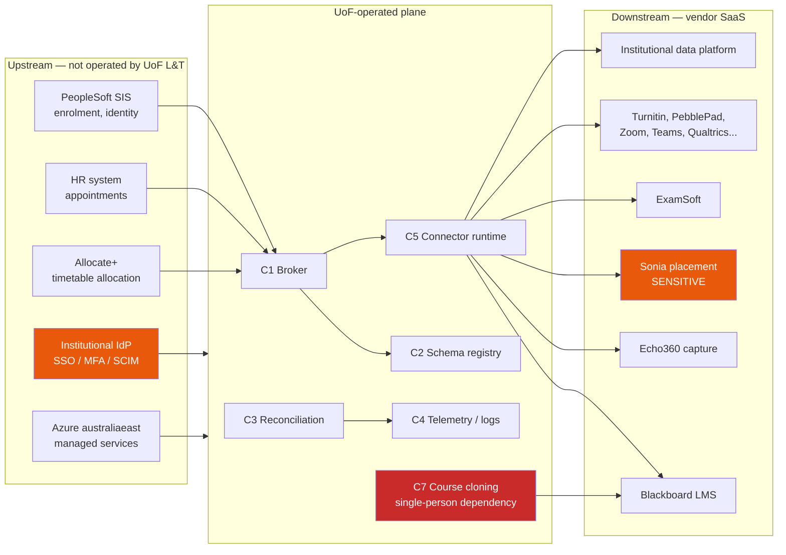
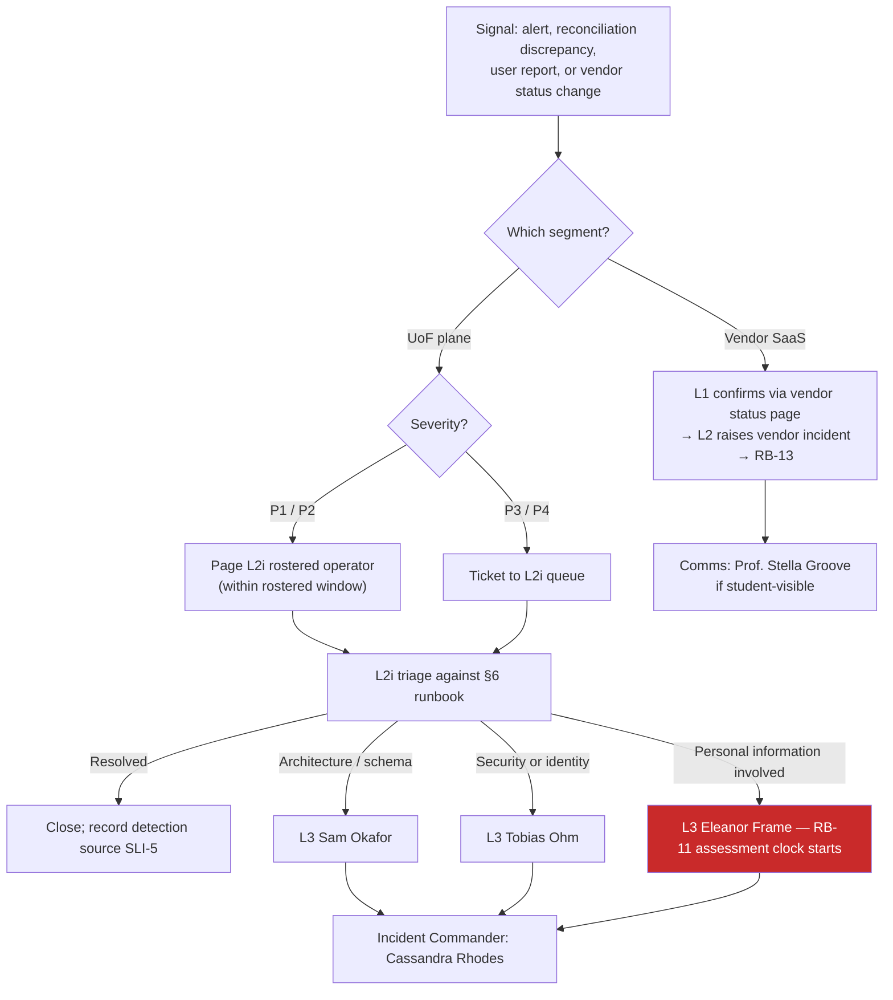

# Operational Readiness Pack: Learning & Teaching Ecosystem

> **Template Origin**: Official | **ArcKit Version**: 6.7.5 | **Command**: `/arckit:operationalize`

## Document Control

| Field | Value |
|-------|-------|
| **Document ID** | ARC-001-OPS-v1.0 |
| **Document Type** | Operational Readiness Pack |
| **Project** | Learning & Teaching Baseline Strategy (Project 001) |
| **Classification** | OFFICIAL-SENSITIVE |
| **Status** | DRAFT |
| **Version** | 1.0 |
| **Created Date** | 2026-07-30 |
| **Last Modified** | 2026-07-30 |
| **Review Cycle** | Quarterly, plus on any event in §18.3 |
| **Next Review Date** | 2026-10-30 |
| **Owner** | Cassandra Rhodes, Chief Information Officer (accountable); Sam Okafor, Integration Architect (technical custodian); Dr. Benny Moog, Director Learning Technologies (service operations) |
| **Reviewed By** | [PENDING] |
| **Approved By** | [PENDING] |
| **Distribution** | Digital & IT, Learning Technologies, Cybersecurity, Privacy & Records, AV & Media Services, Steering Committee, RIFF Review |

> **Classification rationale**: this pack names unremediated authentication exceptions, identifies the platforms holding sensitive information, states which recovery controls have never been exercised, and contains a live breach-response procedure. Classified OFFICIAL-SENSITIVE consistent with `ARC-001-RISK-v1.0` and `ARC-001-HLDR-v1.0`.

## Revision History

| Version | Date | Author | Changes | Approved By | Approval Date |
|---------|------|--------|---------|-------------|---------------|
| 1.0 | 2026-07-30 | ArcKit AI | Initial creation from `/arckit:operationalize`. Scope split between UoF-operated components and vendor-managed SaaS; support model, runbooks, DR/BCP, security operations and handover derived from ARC-001-HLDR-v1.0, ARC-001-DEVOPS-v1.0, ARC-001-PLAN-v1.0, ARC-001-REQ-v1.0, ADR-003/005/008, ARC-001-AZRS-v1.0 and `external/privacy-context.md` | [PENDING] | [PENDING] |

---

## 0. Scope — What the University Actually Operates

This section is first because every other section depends on it, and because an operational readiness pack that treated the whole Learning & Teaching estate as a service the university runs would be fiction.

### 0.1 The operated surface

The University of Funk operates **six components** in Azure `australiaeast`, per `ARC-001-ADR-006-v1.0` §1.2, plus one piece of pre-existing production automation and one component whose hosting is undecided.

| # | Component | Origin | Operated by | Runbooks |
|---|-----------|--------|-------------|----------|
| C1 | Integration broker / event mediation | ADR-001 Option B | Digital & IT — 2 named operators | RB-01, RB-02, RB-05 |
| C2 | Canonical schema registry | ADR-001, DR-001 | Digital & IT | RB-01, RB-05 |
| C3 | State reconciliation service | ADR-003 Layer 3 | Digital & IT | RB-03 |
| C4 | Telemetry, metrics and log store | ADR-003 Layers 1–2 | Digital & IT | RB-09 |
| C5 | Integration runtime / connector compute | ADR-001 phasing | Digital & IT | RB-01, RB-02 |
| C6 | Non-production and sandpit substrate | ADR-005 three tiers, INT-008 | Digital & IT | RB-10 (rehearsal target) |
| C7 | Course-cloning / rollover automation | `system-landscape.md` integration 3 | **One individual** — undocumented, unversioned | **RB-08 — the urgent one** |
| C8 | E-020 audit-event store | `ARC-001-DATA-v1.0` | **Nobody. Not yet commissioned** | None possible — see §18.2 |

C1–C6 are the ADR-006 in-scope workload set. C7 is not in that set because it is not new: it is existing production automation that already runs, on one person's knowledge, and it is the single item in this pack that can be improved in week one at near-zero cost. C8 is in this table because `ARC-001-DATA-v1.0` requires it (RPO 0, seven years immutable) and `ARC-001-HLDR-v1.0` BLOCKING-06 found that no decision hosts it. It cannot be operated because it does not exist.

### 0.2 The vendor-managed estate — where UoF's role is vendor management, not operations

Roughly twenty commercial SaaS platforms deliver almost all of the university's teaching: Blackboard, Echo360, Turnitin, ExamSoft, PebblePad, Sonia, Zoom, MS Teams, Qualtrics, Evasys, Leganto, Padlet, LinkedIn Learning, Remark, Kuracloud, iSimulate, Articulate 360, Camtasia, Adobe Creative Suite, MuseScore and Ableton Live. PeopleSoft (student information system) and Allocate+ (timetabling) are pre-existing institutional systems outside Project 001.

**The university does not start, stop, patch, scale, fail over or restore any of them.** For these platforms the operational discipline is:

| UoF obligation | Instrument | Owner |
|----------------|-----------|-------|
| Verify the contracted service level against NFR-A-001 | Contract review; R-024 remediation | Cassandra Rhodes |
| Assess and record hosting region and APP 8 position | DR-005 residency register; NFR-C-002 | Eleanor Frame with Grace Tanaka |
| Test export and exit by extraction, not by contract text | R-028; NFR-I-002; ADR-007 Gate 4 | Grace Tanaka |
| Record identity posture — federation, MFA, SCIM, session revocation | ADR-008 Conditions 1 and 4 | Tobias Ohm |
| Raise, escalate and track vendor incidents; hold vendors to their own status pages | RB-13 | Dr. Benny Moog |
| Assess new or changed platforms before commitment | RIFF, BR-007 | Dr. Benny Moog |

**Consequence, stated plainly**: this pack can make the integration plane operable. It cannot make Blackboard available. Where a runbook below concerns a vendor platform, its steps are triage, escalation, communication and workaround — not repair.

### 0.3 Estate segments this pack does not cover

| Segment | Why | Where it belongs |
|---------|-----|------------------|
| Vendor-side platform configuration (LTI registrations, SCIM connectors, gradebook settings) | Configured through vendor admin consoles; most expose no declarative API | Change-controlled as record, per `ARC-001-DEVOPS-v1.0` §8.5 |
| Teaching-lab desktop fleets | Constraint TC-4 — partly outside L&T project control | Endpoint management; see §11.6 |
| Lecture-theatre capture appliances | Appliance firmware, vendor-controlled | AV & Media Services under CIO mandate; ADR-008 Condition 6 |
| Institutional data platform (INT-009 counterparty) | Owned outside L&T | Its own release process |

---

## 1. Service Overview

### 1.1 Service description

| Attribute | Value |
|-----------|-------|
| **Service Name** | Learning & Teaching Integration and Observability Plane (plus vendor-management discipline over the L&T SaaS estate) |
| **Description** | Governed, near-real-time propagation of student, course, enrolment, institutional-role and placement-assessment data between the student information system, timetabling, and the L&T platform estate — with reconciliation against the authoritative source and alerting on silent failure |
| **Service Tier (by requirement)** | **Important** — NFR-A-001 requires 99.9% during teaching periods; region-loss RTO 4 hours; RPO zero events |
| **Service Tier (as currently staffed)** | **Standard** — business-hours support, no rostered out-of-hours responder, on-call unfunded (ADR-003 Condition 4 open) |
| **Business Criticality** | High during teaching, assessment and examination periods; Medium in inter-semester breaks |
| **Service Owner** | Cassandra Rhodes, Chief Information Officer |
| **Technical Lead** | Sam Okafor, Integration Architect |
| **Operations Lead** | Dr. Benny Moog, Director, Learning Technologies |
| **Security Lead** | Tobias Ohm, Cybersecurity Lead |
| **Privacy Lead** | Eleanor Frame, Privacy & Records Officer |
| **Currency** | AUD |

### 1.2 Service tier justification — and the gap inside it

NFR-A-001 (from REQ-032) sets 99.9% availability during teaching periods for core teaching platforms, with elevated protection in assessment and examination windows. On the standard mapping that is an **Important**-tier service requiring 24/7 support with a 15-minute on-call response.

**The service is not staffed to that tier and this pack does not pretend otherwise.** `ARC-001-ADR-003-v1.0` Condition 4 is explicit: *"Alerting without a rostered responder is theatre. If out-of-hours coverage is not funded, alerts are explicitly scoped to business hours and the residual exposure is stated openly rather than implied away."* `ARC-001-DEVOPS-v1.0` §1.3 records that there is no platform team, no release engineer and no on-call rotation covering the plane today.

The tier gap is therefore a **funding decision that has not been taken**, not an operational oversight. §3.5 states the two options and the residual attaching to each. It must be closed before the first alert is enabled.

### 1.3 On the 99.9% target — what can and cannot be claimed

`ARC-001-HLDR-v1.0` §8.2 tested the availability argument and found it **sound in structure and unproven in substance**. This pack adopts that finding rather than restating the target as met.

- NFR-A-001's third acceptance criterion requires an aggregate dependency-chain calculation. **No such calculation exists in any artefact.**
- Serially multiplied, a 99.95% plane in a chain with a 99.9% source system and a 99.9% destination platform yields approximately **99.75% end-to-end — roughly 108 minutes per month, against a 43-minute budget.**
- The design's answer is that the plane sits off the student request path, so the chain that governs *teaching availability* is shorter than the chain that governs *data freshness*. That answer is probably right. **It has not been written down, and until it is, the target is not demonstrated.**
- Vendor service levels are unverified (R-024, residual 8) and are the dominant term in an equation no UoF topology can influence.
- Zero recovery rehearsals have been executed (ADR-005 Condition 2).

**Operational position**: the plane's own component target of 99.95% during teaching periods is credible and is measured in §2. The end-to-end 99.9% figure is carried in this pack as a **requirement not yet demonstrated**, tracked as BLOCKING-04 in `ARC-001-HLDR-v1.0`. No SLO in §2 asserts it.

### 1.4 Dependencies

| Direction | Dependency | Impact if unavailable | Fallback |
|-----------|-----------|----------------------|----------|
| Upstream | Institutional IdP | **Total teaching outage.** ADR-008 §6.2 accepts the IdP becomes a total-teaching single point of failure | Tested break-glass path (ADR-008 §7.2); per-platform degraded mode — **neither designed nor tested** |
| Upstream | PeopleSoft SIS change events | Every event-driven flow terminates here (WARD-002 §4). Propagation stops; derived copies go stale | Batch fallback; assumption A-3 unverified — spike scheduled by ADVISORY-02 |
| Upstream | Allocate+ timetable allocation | Group provisioning stale (FR-014) | Existing batch behaviour |
| Upstream | Azure `australiaeast` zone | Broker survives (zone-redundant); **telemetry query and log alerting may not** — see §4.4 | Metric alerts and Service Health alerts on independent ingestion paths |
| Downstream | Blackboard | Students cannot reach materials. UoF cannot repair | Vendor escalation; RB-13; comms |
| Downstream | Sonia | Placement assessment stops. **Holds the estate's only sensitive information** | Current state is manual re-keying — the defect INT-005 exists to remove; no fallback to manual permitted in target state |
| Downstream | ExamSoft | Examination integrity event. Elevated protection required by NFR-A-001 | Vendor escalation; assessment-period freeze; RB-13 |
| Downstream | Institutional data platform | Analytics export (INT-009) delayed. Accepted batch exception | Next scheduled run |

---

## 2. Service Level Objectives

### 2.1 SLI definitions

`ARC-001-HLDR-v1.0` §9.1 records that SLI/SLO were not formally defined by the design (INFO-04). This section defines them. They are deliberately outcome-shaped rather than transport-shaped, because ADR-003's central argument is that transport-level monitoring would have reported "healthy" throughout the entire history of the estate's known defects.

| SLI | Definition | Measurement | Source | Requirement |
|-----|------------|-------------|--------|-------------|
| **SLI-1 Propagation freshness** | Elapsed time from a committed change in the authoritative source to the corresponding write in the derived copy | p95 over rolling 30 days, from the OpenTelemetry trace identifier carried source-to-target | C4 metrics (metric path, not log query) | NFR-P-001 |
| **SLI-2 Reconciliation correctness** | Share of per-entity comparisons in which the derived copy matches the authoritative source | Per reconciliation window, per entity type, per platform | C3 reconciliation service | DR-002, BR-004 |
| **SLI-3 Flow completion** | Share of published events delivered to all subscribed destinations without terminal dead-letter | Rolling 30 days | C1 broker metrics | NFR-M-001, INT-001–009 |
| **SLI-4 Plane component availability** | Share of minutes in which C1, C2 and C5 are serving | Rolling 30 days, teaching periods measured separately | Azure Resource Health + synthetic Layer 1 checks | NFR-A-001 (plane contribution only) |
| **SLI-5 Detection source** | Share of integration failures whose **first** detection was telemetry rather than a user report | Per incident, reviewed monthly | Incident records | BR-004 success criterion |
| **SLI-6 Capture publication latency** | Elapsed time from lecture end to publication on the unit site | p95 per teaching week | Echo360 vendor telemetry, ingested to C4 | NFR-P-002, FR-009 |
| **SLI-7 Revocation effectiveness** | Elapsed time from authoritative role-end to loss of access, **including residual session lifetime** | Per platform, measured not assumed | ADR-008 Condition 4 register | NFR-SEC-003 |

### 2.2 SLO targets and error budgets

| SLO | Target (teaching period) | Target (outside) | Error budget / 30 days | Notes |
|-----|--------------------------|------------------|------------------------|-------|
| SLI-1 Propagation freshness | p95 ≤ 15 minutes | p95 ≤ 60 minutes | 5% of changes may exceed | Breach alerts, per NFR-P-001 third criterion |
| SLI-2 Reconciliation correctness | ≥ 99.9% of comparisons match | ≥ 99.5% | 0.1% divergence | Any placement-context divergence is P1 regardless of rate |
| SLI-3 Flow completion | ≥ 99.95% | ≥ 99.9% | 0.05% | Dead-letter is recoverable, not lost — RPO is zero events |
| SLI-4 Plane component availability | **99.95%** | 99.9% | **21.9 minutes** | Component target only. See §1.3 |
| SLI-5 Detection source | 100% | 100% | Zero tolerance | Baseline believed near 0% today |
| SLI-6 Capture publication | p95 ≤ 4 hours | p95 ≤ 4 hours | 5% | Vendor-delivered; UoF measures and escalates |
| SLI-7 Revocation effectiveness | ≤ 15 min + published per-platform session residual | Same | Per-platform | Platforms holding sensitive information remediated first |

**On the end-to-end figure.** NFR-A-001's 99.9% is an estate-level chain target, not a component target. Its 30-day budget is 43.2 minutes. The chain as currently evidenced yields approximately 99.75% (≈108 minutes) if availabilities multiply serially. **This pack does not claim the target is met.** The availability budget required to resolve it is BLOCKING-04, owner Sam Okafor, target 2026-10-31.

### 2.3 Error budget policy

| Budget consumed | Action |
|-----------------|--------|
| Under 50% | Normal operations. Change proceeds under the academic-calendar freeze gate |
| 50–75% | Reliability items take precedence over new integration onboarding in the next fortnight |
| 75–100% | Non-essential change to the plane frozen. Security-patch change class (`ARC-001-DEVOPS-v1.0` §4.4) still proceeds |
| Over 100% | Reported to the Steering Committee as an appetite-relevant event. No new integration cutover until budget recovers |
| Over 100% twice consecutively in teaching periods | Reportable exception to RIFF. Two consecutive rehearsals missing RTO is already a rollback trigger for ADR-005 — this is its availability analogue |

> **Appetite caveat.** `ARC-001-RISK-v1.0` records that **no approved organisational risk appetite statement exists** and that its thresholds are PROVISIONAL. The escalation triggers above therefore have no formal organisational trigger until the Steering Committee endorses an appetite (ADVISORY-05). Stated here so the gap is visible rather than assumed away.

### 2.4 SLO breach response

1. **Detection** — metric alert fires on the SLI, not on a proxy. Absence of expected activity is itself a breach condition (ADR-003 §6.5, binding).
2. **Routing** — to the named owner recorded in the alert definition. An alert with no named owner is deleted, per ADR-003 §6.5.
3. **Response** — runbook from §6 executed. Every alert definition must resolve to a file in `docs/runbooks/`; CI fails on a broken link.
4. **Review** — weekly during teaching periods, fortnightly outside, at the Digital & IT platform review. Alert volume is itself reviewed; if the team is ignoring alerts the capability has failed regardless of coverage.

---

## 3. Support Model

### 3.1 The chosen model

**Teaching-calendar-differentiated support, with vendor management as a first-class tier.**

This is not 24/7, and it is not plain business hours. It is business-hours support with cover extended across the teaching day during teaching weeks, and rostered out-of-hours cover confined to the windows where an outage is materially different in kind — assessment periods, examination windows, and integration cutovers.

**Why this and not 24/7.** Three reasons, all evidenced:

1. Out-of-hours coverage is **not funded** (ADR-003 Condition 4; `ARC-001-DEVOPS-v1.0` §1.3, §17 item 5). A pack asserting 24/7 would be describing a roster nobody staffs.
2. The plane sits **off the student request path** (ADR-005 §5.2). A plane outage at 02:00 costs data freshness, not teaching availability — provided edge buffering works, which is ADR-005 Condition 1 and is undesigned.
3. The estate's real out-of-hours exposure is **vendor** availability, which no UoF roster can shorten. Rostering UoF engineers against a Blackboard outage buys communication, not recovery.

**Why not plain business hours.** NFR-A-001 carries elevated protection for assessment and examination periods, and R-024 (teaching platform outage during assessment, residual 8) is a registered reputational risk. An examination-window incident discovered at 09:00 the next morning is a different event from the same incident in the inter-semester break. Principle 15 requires availability aligned to the teaching calendar; the support model must be too.

### 3.2 Support tiers

| Tier | Team | Responsibilities | Hours |
|------|------|-----------------|-------|
| **L0 — Vendor** | Each SaaS vendor | Actual operation, patching, availability and restoration of ~20 platforms. **This is where most of the estate is genuinely supported** | Per contract — unverified against NFR-A-001 (R-024) |
| **L1 — IT Service Desk** | Digital & IT Service Desk | Triage, known-error lookup, user queries, vendor status-page checks, incident logging | Business hours; extended 07:30–19:00 AEST on teaching weekdays |
| **L2 — Learning Technologies** | Learning Technologies (Dr. Benny Moog) | Platform configuration, unit rollover, cloning execution, runbook execution, vendor incident raising and chase | Business hours; extended during teaching weeks |
| **L2i — Platform operators** | Digital & IT integration/platform — **2 named operators minimum** (NFR-M-002) | Plane triage, connector restart, dead-letter handling, reconciliation investigation, IaC apply | Business hours; rostered in assessment/examination and cutover windows |
| **L3 — Engineering & specialists** | Sam Okafor (integration), Tobias Ohm (security), Eleanor Frame (privacy) | Architecture faults, schema decisions, security incidents, breach assessment, DR execution | Escalation, not roster |
| **Vendor management** | Grace Tanaka (Procurement) | SLA verification, credit claims, export testing, exit provisions | Business hours |

**Named-operator rule.** NFR-M-002 requires at least two people able to execute and troubleshoot every production automation. `ARC-001-ADR-002-v1.0` Condition 4 makes it binding: *"Option C without Condition 4 is worse than Option A."* **The rule is currently breached by C7** (§0.1). RB-08 exists to close it.

### 3.3 Escalation matrix

| Severity | Definition (this service) | L1 | L2 / L2i | L3 | Management |
|----------|---------------------------|----|----------|----|------------|
| **P1** | Teaching or examination blocked; identity plane degraded; sensitive information exposed or mis-directed; reconciliation shows placement-context divergence | 5 min | 15 min in rostered window; next business start otherwise | 30 min | Cassandra Rhodes within 1 hour |
| **P2** | Propagation stalled estate-wide; a scheduled flow absent; dead-letter growing; capture publication breaching NFR-P-002 across a school | 15 min | 1 hour in rostered window | 2 hours | 4 hours |
| **P3** | Single-connector failure with a working retry path; single-unit rollover fault; non-placement reconciliation divergence within budget | 1 hour | 4 hours | 8 hours | Next day |
| **P4** | Cosmetic, informational, or drift with no service effect | 4 hours | 1 business day | 3 days | Weekly review |

**Severity is set by consequence, not component.** A single-record placement divergence is P1; a broker restart with no data effect is P3. This inversion is deliberate and is the operational expression of ADR-003's argument.

### 3.4 Rostered cover — proposed

| Window | Cover | Response | Basis |
|--------|-------|----------|-------|
| Teaching weekdays 07:30–19:00 AEST | L1 + L2 + one L2i operator reachable | P1 15 min, P2 1 hour | Teaching day; NFR-A-001 period differentiation |
| Non-teaching weekdays 09:00–17:00 | L1 + L2i business hours | P1 1 hour | Reduced consequence |
| **Assessment and examination windows** — including weekends | **Rostered L2i on-call, primary + secondary** | P1 15 min, P2 1 hour, 24/7 | R-024; NFR-A-001 elevated protection; FR-017 |
| Integration cutover windows | Rostered L2i + L3 Sam Okafor available | P1 immediate | Cutover releases are different (`ARC-001-DEVOPS-v1.0` §13.4) |
| Teaching-period commencement week | Rostered L2i on-call | P1 30 min | Peak enrolment-change volume; NFR-S-001 |
| All other out-of-hours | **No cover. Alerts queue to the next business start** | — | Unfunded. Residual stated in §3.5 |
| Escalation to management | Cassandra Rhodes, any hour, for P1 | — | Incident Commander |

Handoff: written handover at the end of each rostered window into the incident channel, naming any open alert, any suppressed alert and any dead-letter backlog. Rotation weekly, published one semester ahead against the academic calendar, which must itself be committed as version-controlled data (`ARC-001-DEVOPS-v1.0` §17 item 6).

### 3.5 The unfunded-cover decision — the two honest options

ADR-003 Condition 4 requires this to be settled **before the first alert is enabled**. There are two defensible answers and one indefensible one.

| Option | What it means | Residual |
|--------|---------------|----------|
| **A — Fund §3.4 as written** (recommended) | Rostered L2i on-call in assessment, examination, cutover and commencement windows only. Costed as a recurring allowance, not new FTE | Out-of-hours exposure outside those windows remains, and is accepted knowingly. Approximately the exposure the estate carries today, minus the assessment-window blind spot |
| **B — Business hours only, stated openly** | All alerts explicitly scoped to business hours. No roster. Alert definitions carry a business-hours severity band | An assessment-period incident may run unattended for up to 60 hours over a weekend. **This directly contradicts NFR-A-001's elevated-protection clause and R-024's mitigation.** If chosen, R-024 must be re-scored and the objection recorded as standing |
| **C — Assert 24/7 without funding** | — | **Not available.** ADR-003 Condition 4 forecloses it. Alerting without a rostered responder is theatre |

**Recommendation: Option A.** It is the narrowest roster consistent with a MUST-priority period-differentiated availability requirement. Owner: Cassandra Rhodes. Required before first alert enablement.

### 3.6 Vendor escalation register

Required before handover; **does not currently exist**. One row per platform: named vendor support contact, severity definitions as the *vendor* defines them, contracted response and restoration times, status page URL, credit-claim mechanism, and the UoF-side owner who chases. R-024's mitigation ("verify SLAs against NFR-A-001") is the input. Owner: Grace Tanaka with Dr. Benny Moog, target 2026-10-31.

---

## 4. Monitoring & Observability

ADR-003 decided the architecture — three layers, adopted as a standard rather than a product. This section covers operation only and does not re-decide it.

### 4.1 The three layers in operation

| Layer | Question it answers | Operational instrument |
|-------|--------------------|-----------------------|
| **1 — Endpoint and component health** | Is the broker up? Is the SaaS API responding? | Synthetic checks provisioned as code with each connector; Azure Resource Health and Service Health alerts. A connector deployed without its health check is an incomplete deployment |
| **2 — Flow telemetry** | Did this event publish, deliver, retry, dead-letter? How long? | OpenTelemetry spans with one trace identifier carried from source change to target write. CI asserts every connector emits the required span attributes |
| **3 — Entity-state reconciliation** | **Does the derived copy actually match the authoritative source?** | C3 reconciliation service, per-entity comparisons held as version-controlled configuration |

Layer 3 is the layer that earns its keep. It runs against the *current* estate before the broker exists, and it is the only layer that detects the estate's actual historical failure mode: a flow that reported success and produced the wrong outcome.

### 4.2 Health checks

| Component | Check | Expectation | Interval |
|-----------|-------|-------------|----------|
| C1 broker namespace | Azure Resource Health + queue/topic depth metric | Healthy; depth below alert threshold | 1 min |
| C2 schema registry | Schema fetch for each active entity version | Resolves; version parity with production manifest | 5 min |
| C3 reconciliation service | Liveness plus last-completed-window timestamp | A window completed inside its schedule | 5 min |
| C5 connectors | Per-connector synthetic transaction end-to-end | Round trip within the connector's declared window | Per connector schedule |
| Vendor platform APIs | Authenticated synthetic read against each integrated platform | HTTP success and expected payload shape | 5 min teaching hours, 15 min otherwise |
| IdP federation path | Synthetic SAML/OIDC assertion against a canary platform | Assertion issued and accepted | 1 min |
| **Heartbeat / absence** | Every scheduled and event-driven flow declares an expected-activity window | **Absence within the window is itself alertable** | Per flow |

The last row is binding, not optional. A batch that does not run produces no error; it produces nothing. Every historical defect in this estate is in that class.

### 4.3 Key metrics

| Metric | Warning | Critical | Period-differentiated |
|--------|---------|----------|-----------------------|
| Propagation latency p95 (SLI-1) | > 10 min | > 15 min | Yes — 60 min outside teaching |
| Flow absence against heartbeat | Window +25% | Window +50% | Yes |
| Dead-letter count per flow | > 0 sustained 15 min | > 50, or any placement-context record | No — placement is always critical |
| Reconciliation divergence rate | > 0.05% | > 0.1%, or any placement-context field | No |
| Broker queue depth / age of oldest message | Age > 5 min | Age > 15 min | Yes |
| Connector error rate | > 1% for 10 min | > 5% for 5 min | Yes |
| Revocation failures | Any | Any on a platform holding sensitive information | No |
| Capture publication backlog | > 2 h after session | > 4 h (NFR-P-002) | No |
| Enrolment-change queue at period commencement | Backlog > 15 min of work | Backlog > 60 min | Commencement week only |
| Telemetry ingestion volume | Above modelled envelope | 2× envelope | No — cost control, BR-002 |
| Alert volume per operator per week | > 20 | > 40 | No — alert fatigue is itself a failure |

### 4.4 The monitoring plane is weaker than the thing it monitors

This is the most consequential operational finding in this pack, and it comes from `ARC-001-AZRS-v1.0` finding F-1.

Azure Monitor Logs distinguishes two kinds of availability-zone support: **data resilience** (ingested data survives a zone loss) and **service resilience** (ingestion, queries and alerts keep working during a zone outage).

**No Australian region supports Azure Monitor Logs service resilience.** `australiaeast` provides data resilience only. Service Bus in `australiaeast` is zone-resilient with documented no data loss and automatic failover.

The consequence is exact: **during a single-zone event the broker keeps working while log ingestion, KQL queries and log-based alerts may not.** ADR-005 §7.2 set the monitoring target as *"observability plane availability: independent of, and not lower than, broker availability."* ADR-003 rejected its Option A partly because it *"shares a failure domain with the thing it observes."* On this platform, in this region, the observability plane is the *less* resilient of the two — the precise inversion both decisions set out to avoid.

**Operational consequences adopted by this pack:**

| Control | Position |
|---------|----------|
| Heartbeat and absence alerts | **Must be metric alerts, not log-query alerts.** Azure Monitor platform metrics use a separate ingestion path from Log Analytics. The estate's defining failure mode must stay detectable during a zone event |
| Layer 1 endpoint health | Carried by Azure Service Health and Resource Health alerts, which are independent of the workspace |
| Long-term record | Continuous data export of selected tables to a **GZRS storage account**, preserving the record independently of workspace query availability — and giving the recovery region a copy without a running resource there |
| Dedicated Log Analytics cluster | **Do not buy one expecting a fix.** Dedicated clusters upgrade *data* resilience, which `australiaeast` already has on the shared cluster. The commitment tier starts at 100 GB/day, almost certainly an order of magnitude above this estate's volume. It would be spend against BR-002 for no gain in the missing property |
| Workspace replication to `australiasoutheast` | **Rejected.** A running secondary workspace continuously ingesting derived personal information is both running infrastructure and personal information at rest in the recovery region — contradicting ADR-005's recovery-region rule |
| Residual | **Accepted and must be registered.** ADR-005's "not lower than broker availability" target cannot be met on this platform in this region. It should become a stated, accepted exception with an entry in `ARC-001-RISK-v1.0`, not a target left asserted and unmet |
| Runbook | RB-09 — operating blind, deliberately |

**Second correction, from AZRS F-2.** ADR-003 §6.4 classifies telemetry as derived personal information (CONFIDENTIAL). "Telemetry but no personal information at rest in `australiasoutheast`" is therefore internally contradictory. Restate the recovery-region rule as *"code, configuration, and an exported encrypted copy of telemetry in geo-redundant storage"*, and add the second Australian location to the DR-005 register as an APP 11 holding.

**Third caveat.** Azure Monitor enables trace-based log sampling by default. Sampling must be reviewed and pinned before it silently discards the very propagation traces SLI-1 is measured from.

### 4.5 Dashboards

| Dashboard | Purpose | Audience | Refresh |
|-----------|---------|----------|---------|
| Plane health | C1–C5 component state, queue depth, dead-letter, connector errors | L1, L2i | 1 min |
| Freshness and correctness | SLI-1 and SLI-2 by entity and platform | L2i, L3, Dr. Benny Moog | 5 min |
| Teaching-period board | Per-platform availability, capture backlog, examination-window state | Dr. Benny Moog, Deans, Steering Committee | 5 min |
| Identity posture | Revocation effectiveness, per-platform session residual, failed revocations, local-account detections | Tobias Ohm | 15 min |
| Vendor assurance | Vendor incident count, contracted-versus-observed availability, export-test status | Grace Tanaka, Cassandra Rhodes | Daily |
| Cost and telemetry volume | Ingestion volume against modelled envelope, egress, always-ready compute baseline | Cassandra Rhodes, Vernon Ostinato | Daily |

**Dashboard caveat**: every dashboard in this table is backed by Log Analytics queries and therefore shares the §4.4 weakness. Dashboards are for diagnosis; alerting correctness must not depend on them.

### 4.6 Logging and retention

| Stream | Store | Retention | Basis |
|--------|-------|-----------|-------|
| Operational telemetry, traces, flow logs | C4 Log Analytics workspace, `australiaeast` | **13 months**, enforced automatically, provisioned as code | ADR-003 §6.4; DR-006 |
| Exported telemetry copy | GZRS storage account, paired region | 13 months | §4.4 |
| Discrepancy records | C4 | 13 months. Record *that* a divergence exists and on which identifier — **never the divergent values** | ADR-003 §6.4 |
| Audit events (grades, role assignment, sensitive-information access) | **C8 — no store exists** | Required: 7 years, immutable to all roles including administrators, RPO 0 | NFR-C-003, DATA E-020. **BLOCKING-06** |

**Telemetry must never carry** message payloads, grade values, free-text feedback, or any content of placement records — specifically clearance metadata and health-context notes (DR-004, RESTRICTED). Enforcement is a CI-asserted span-attribute allow-list plus mandatory review of `observability/` changes. Stated honestly: an allow-list catches the common accident, not a determined one, and it cannot prevent a payload placed into a log *message string* rather than a structured attribute. The compensating control is detection scanning of the telemetry store for payload-shaped content, and it is detective rather than preventive.

---

## 5. Alerting Strategy

### 5.1 Binding rules (ADR-003 §6.5)

1. **Alert on absence, not only on error.**
2. **Every alert routes to a named owner and a runbook.** No owner, no alert. No runbook, alert deleted; CI fails on a broken runbook link.
3. **Thresholds differentiate by academic period.**
4. **Alert volume is itself a monitored metric.**

### 5.2 Routing

| Severity | Channel | Recipients | Hours |
|----------|---------|------------|-------|
| P1 | Paging + incident channel | Rostered L2i primary and secondary; Cassandra Rhodes at 1 hour | Rostered windows (§3.4); queued otherwise, **with the queue itself visible on the next business start** |
| P2 | Paging in rostered windows; channel otherwise | Rostered L2i primary | As above |
| P3 | Ticket + channel | L2i queue | Business hours |
| P4 | Ticket | L2i queue | Business hours |
| **Any alert involving personal information** | Paging + direct to Eleanor Frame | Privacy & Records, regardless of severity band | **All hours** — the Part IIIC assessment clock does not observe business hours |
| Any alert involving sensitive placement information | Paging + Eleanor Frame + Tobias Ohm | As above | All hours |

The last two rows are the one deliberate exception to the funding constraint in §3.5. A suspected eligible data breach starts a statutory clock; that cannot wait for Monday.

### 5.3 Alert definitions

| Alert | Condition | Severity | Ingestion path | Runbook |
|-------|-----------|----------|----------------|---------|
| Flow absent | No activity in declared window +50% | P2 (P1 in commencement or assessment week) | **Metric** | RB-04 |
| Propagation SLO breach | SLI-1 p95 > 15 min for 15 min | P2 | Metric | RB-02 |
| Reconciliation divergence | SLI-2 below target for a window | P3 | Log query | RB-03 |
| Placement-context divergence | Any divergence on an E-016 field | **P1** | Log query + metric mirror | RB-03 → RB-11 |
| Dead-letter growth | Count rising for 15 min | P2 | Metric | RB-05 |
| Broker unavailable | Resource Health degraded, or synthetic fails 3× | P1 | **Service/Resource Health** | RB-01 |
| Telemetry ingestion stopped | No ingestion for 10 min | **P1** | Metric + Service Health | **RB-09** |
| IdP federation failing | Canary assertion fails 2× | P1 | Metric | RB-06 |
| Revocation failure | Any SCIM deactivate not confirmed | P2 (P1 if sensitive-information platform) | Log query | RB-07 |
| Capture publication overdue | Session +4 h with no publication | P2 | Metric | RB-13 |
| Vendor platform unreachable | Synthetic read fails 3× | P1 in teaching hours | Service Health independent | RB-13 |
| Cloning execution unlogged | A rollover occurred with no logged actor/scope | P3 | Log query | RB-08 |
| Local administrative account detected | Weekly landing-zone scan finds one | P2 | Scheduled query | RB-12 (variant) |
| DR rehearsal overdue | No rehearsal record inside its window | P3 | Scheduled query | RB-10 |
| Non-production data-control assertion failed | Personal information detected outside production | **P1, raised as a privacy incident** | Continuous | RB-11 |
| Alert volume above threshold | > 40 per operator per week | P4, reviewed | Derived | Review, not runbook |

### 5.4 Fatigue prevention

Grouping by flow and by correlation identifier; deduplication window 15 minutes; suppression during declared maintenance and inside the academic freeze calendar's planned windows only; auto-resolve when the condition clears. **Absence alerts are never auto-suppressed by grouping** — that would recreate the silent-failure class the design exists to eliminate.

---

## 6. Runbooks

Fourteen runbooks. Each is written for the plane UoF actually operates, or for the vendor-management action UoF actually takes. Every alert in §5.3 resolves to one of them.

### RB-01 — Plane start, stop and controlled pause

**Purpose**: bring C1/C2/C5 into or out of service without losing events.
**Prerequisites**: Azure RBAC via just-in-time elevation (no standing write access); IaC repository access; break-glass not required.
**Detection**: planned change, or a P1 requiring the flow to be stopped.

**Steps**
1. Confirm upstream state: is the SIS emitting, and is the last successful window recent? Record the last processed event identifier per flow.
2. To pause, **disable the connector subscriptions, never the broker namespace**. Events must accumulate durably; a stopped broker is a dropped event.
3. Confirm queue depth is growing and message age is being tracked — this is the evidence that events are buffering, not vanishing.
4. Perform the change. All infrastructure change is by IaC apply through the pipeline; a console change is a drift finding (§4.3, `ARC-001-DEVOPS-v1.0` §5.6).
5. Re-enable subscriptions **one flow at a time**, oldest-first, watching propagation latency after each.
6. Confirm SLI-1 returns within target and dead-letter count is unchanged.

**Verification**: queue depth drains to steady state; SLI-1 p95 within target for 15 minutes; zero new dead-letters.
**Escalation**: L3 Sam Okafor if depth does not drain within 30 minutes.
**Rollback**: re-disable subscriptions; events continue to buffer; RPO remains zero events.

---

### RB-02 — Propagation latency breach (NFR-P-001)

**Purpose**: restore 15-minute p95 propagation.
**Detection**: alert "Propagation SLO breach".

**Steps**
1. Establish **where** in the chain: source emission, broker, connector, or destination platform API. The trace identifier carried source-to-target answers this directly; if it does not, the instrumentation gap is itself the finding.
2. If source emission has stopped, this is RB-04 (absence), not a latency problem.
3. If the broker shows growing message age, check connector concurrency and destination API throttling. Vendor rate limits are the most common cause at teaching-period commencement.
4. If a destination platform is throttling, back off rather than retry harder, and raise a vendor incident (RB-13). Retrying into a rate limit converts a delay into a dead-letter.
5. If volume is the cause and the window is commencement week, scale connector concurrency within the modelled envelope. Record the scaling event against NFR-S-001 — approximately 200,000 role assignments a year arrive on a teaching calendar, not uniformly.
6. If latency is caused by reconciliation load competing for the destination API, defer the reconciliation window; correctness checking must not cause the freshness breach it is meant to detect.

**Verification**: SLI-1 p95 within target for 30 minutes; no dead-letter growth.
**Escalation**: L3 at 1 hour, or immediately in commencement or assessment week.
**Rollback**: revert concurrency change; events buffer.

---

### RB-03 — Reconciliation divergence

**Purpose**: respond to the derived copy not matching the authoritative source — the estate's historical failure mode.
**Detection**: alert "Reconciliation divergence" or "Placement-context divergence".

**Steps**
1. **If any diverging field is in the placement context (E-016), treat as P1 and open RB-11 in parallel.** Do not wait for the correctness investigation to finish before starting the privacy assessment; the Part IIIC clock runs from suspicion, not from confirmation.
2. Read the discrepancy record. It names the entity identifier and the field. **It does not contain the values** — by design (§4.6). Retrieve values only from the authoritative source and the derived copy directly, under least privilege.
3. Classify: (a) propagation not yet complete — within the freshness window, no action; (b) event lost or dead-lettered — RB-05; (c) event applied and overwritten at the destination — a bidirectional-conflict problem, and for INT-005 the documented conflict rule applies; (d) event applied wrongly — a connector or schema defect.
4. For (d), do **not** hand-correct the destination first. Correct the defect, then replay from the authoritative source, so the correction is reproducible. A hand-corrected record is a record nobody can prove.
5. If the divergence is in institutional hierarchy (INT-007), record it explicitly. Hierarchy drift corrupts the organisational dimension every other flow's scoping and access decision is made against, and it is currently a MEDIUM-priority flow carrying the second-highest dependency risk on the project's own map (BLOCKING-07).
6. Log the divergence class in the monthly reconciliation review. The classes themselves are the evidence base for re-pricing integrations.

**Verification**: next reconciliation window shows match; SLI-2 back within budget.
**Escalation**: L3 Sam Okafor for (c) and (d); Eleanor Frame for any placement or sensitive field.
**Rollback**: none — replay from the authoritative source is the correction.

---

### RB-04 — A scheduled or event-driven flow did not run

**Purpose**: respond to **absence**. This is the runbook the current estate most needs and does not have.
**Detection**: alert "Flow absent". No error will have been raised, because nothing happened.

**Steps**
1. Confirm the flow's heartbeat expectation and the current window. Confirm the absence is real and not an alert-configuration artefact.
2. Check the source: is the SIS or HR feed emitting? Is a scheduled trigger disabled? Is a credential expired?
3. Check the connector runtime: has the compute failed to start, or scaled to zero and failed to wake?
4. **Estimate the exposure, not just the cause.** For each hour absent, how many enrolment, role or withdrawal changes have not propagated? A withdrawal that has not propagated is access persisting after entitlement ends — an APP 11 exposure, not merely a data-freshness issue.
5. Restore the flow. Replay from the last successfully processed event; do not skip forward.
6. Confirm reconciliation (RB-03) over the absent period, because the absence window is exactly where divergence accumulates.
7. If the absence exceeded 24 hours and involved deprovisioning, notify Tobias Ohm and Eleanor Frame — this is the same exposure class as the current nightly batch's stale de-provisioning.

**Verification**: heartbeat resumes; replay completes; reconciliation clean for the absent window.
**Escalation**: L3 at 2 hours; immediately if deprovisioning is affected.
**Rollback**: n/a.

---

### RB-05 — Dead-letter growth or poison message

**Purpose**: recover failed records rather than discard them. RPO is **zero events lost**.
**Detection**: alert "Dead-letter growth".

**Steps**
1. Inspect the dead-letter store. Records must be visible and inspectable; if they are not, that is a design defect to raise, not a data loss to accept.
2. Classify: schema non-conformance, destination rejection, transient failure exhausted, or genuine poison message.
3. For schema non-conformance, check the schema registry version against the publisher. Note that on the selected platform, schema validation is client-SDK-side rather than broker-side (AZRS F-6) — non-conformance surfaces as a deserialisation failure and dead-letter, which is why Avro rather than JSON Schema is recommended. A silently accepted non-conforming payload is worse than a dead-letter.
4. For destination rejection, capture the destination's error verbatim and raise a vendor incident if it is a platform defect (RB-13).
5. Replay corrected records from the dead-letter store in original order per entity. Out-of-order replay on the same entity produces a wrong final state.
6. **If any dead-lettered record is a placement assessment or carries sensitive information, escalate to Eleanor Frame before replay** and confirm no copy was written anywhere outside the governed path.
7. Confirm the dead-letter store is empty or reduced to knowingly-held records with an owner and a date.

**Verification**: dead-letter count returns to zero or to an owned residual; reconciliation clean.
**Escalation**: L3 Sam Okafor for schema or connector defects; Eleanor Frame for sensitive records.
**Rollback**: records remain in the dead-letter store; they are not lost by a failed replay.

---

### RB-06 — Identity provider degradation or outage

**Purpose**: respond to the failure that ADR-008 §6.2 accepts becomes a **total teaching outage**.
**Detection**: alert "IdP federation failing"; user reports of inability to sign in to any platform.

**Steps**
1. Confirm scope: single platform (a federation configuration problem) or all platforms (an IdP problem). The canary assertion distinguishes them.
2. If the IdP itself, this is P1 regardless of hour. Notify Cassandra Rhodes as Incident Commander and Prof. Stella Groove for student communication immediately — during teaching hours the student-visible impact is total.
3. **Execute the break-glass path.** ADR-008 §7.2 requires it be *tested before first cutover, not documented after*. Check the current test date before relying on it; if it has never been tested, say so in the incident record rather than discovering it live.
4. Apply per-platform degraded mode where defined. **Note honestly: degraded-mode behaviour per teaching-critical platform is required by ADR-008 and NFR-A-002 and is not yet specified** (`ARC-001-HLDR-v1.0` §8.1). In an incident today there is no defined degraded mode to apply. Record that as the incident's principal contributing factor.
5. Do **not** create local accounts as a workaround. Two platforms already permit local accounts in breach of NFR-SEC-001 (R-019), and unaddressed authentication friction is the most likely origin of those existing exceptions. Creating more converts an availability incident into a permanent compliance breach.
6. Coordinate with AV & Media Services for lecture-theatre podium and shared-machine access. **This group is not currently in the engagement stakeholder register** (ADR-008 Condition 6) — the escalation contact must be established before handover, not during an incident.
7. On restoration, verify that SCIM and revocation flows caught up, and run RB-07 for any role change that occurred during the outage.

**Verification**: canary assertions succeed; sign-in success rate normal across all federated platforms; revocation backlog cleared.
**Escalation**: Tobias Ohm and Cassandra Rhodes immediately. Vendor IdP escalation per contract.
**Rollback**: n/a — restoration only.

---

### RB-07 — Access revocation not effective within the window

**Purpose**: close the gap between a role ending and access actually stopping.
**Detection**: alert "Revocation failure"; or a periodic check finding access after role end.

**Steps**
1. Identify the platform and consult the **per-platform residual session window register** (ADR-008 Condition 4). A platform with an eight-hour session does not deprovision in fifteen minutes however fast SCIM is.
2. Confirm the authoritative change (withdrawal, contract end, role change) was published and consumed.
3. Confirm SCIM deactivate was accepted by the platform. A SCIM 200 is not evidence that sessions ended.
4. **Explicitly revoke sessions.** Continuous access evaluation does not reach vendor SaaS — it requires both client and resource API to be CAE-capable, which today means Microsoft services and Graph (AZRS F-4). Non-CAE policy and group changes can take up to 24 hours to propagate. Session revocation must be invoked explicitly as part of the deprovisioning flow; it is **not** implicit in a SCIM deactivate.
5. For platforms holding **sensitive information** — Sonia above all — revoke first and confirm by attempting access, not by reading a status field.
6. If the residual window cannot be closed for a platform, record it as a measured, published residual with an owner and a renewal-anchored remediation date. Do not record it as zero.
7. If access persisted on a platform holding personal information for longer than the published residual, treat as a potential APP 11 exposure and consult Eleanor Frame.

**Verification**: access attempt fails; SLI-7 within the platform's published window.
**Escalation**: Tobias Ohm. Eleanor Frame if personal information was accessible after entitlement ended.
**Rollback**: n/a.

---

### RB-08 — Course-cloning and rollover: execution and continuity

**Purpose**: execute unit rollover, and end the single-person dependency that R-007 records with control effectiveness **"None effective"** and residual 12.
**Why this runbook exists**: `system-landscape.md` integration 3 — the course-cloning automation — is **semi-manual, undocumented, and held by one individual**. It runs at the busiest point in the academic calendar. It has no ADR (BLOCKING-08 found the reserved decision number was silently reallocated to observability). It is cited as justifying evidence in three separate ADRs and has no decision of its own. This is the most immediately actionable operational risk in the estate.

**Prerequisites**: access to the source and target Blackboard instances; the script set; a second named operator.

**Part A — Capture, before anything else (start immediately)**

1. Sit with the current operator and **record the process as executed, not as imagined**. Screen capture plus written steps. Include the undocumented decisions: which units are excluded, what is done when a source site predates the template, what the operator checks afterwards and why.
2. Commit the scripts to version control **as they are**, before any tidying. A refactor before capture loses the only working version.
3. Scan the working tree **and history** for secrets before the first push. This is the highest-risk moment in the whole operational plan for committing a credential, because undocumented scripts commonly carry embedded ones.
4. Add execution logging: actor, timestamp, source unit, target unit, scope, outcome. Baseline is 0% attributable; target is 100% (NFR-M-002, NFR-C-003).
5. **Have the second operator execute a real rollover end-to-end with the first operator observing and not touching.** Documentation that has not been executed by the second person is not a transfer of capability. Record the date. This is the acceptance test for NFR-M-002 on C7.
6. Record the two named operators against C7 in the operations register.

**Part B — Routine execution**

1. Confirm the target unit shell exists, created from the SIS.
2. Execute the scripted clone. Verify structure, content and configuration copied.
3. **Verify no prior-period student personal information carried forward** — no submissions, grades or enrolments. This is a DR-003/APP 11 check, not a quality check, and it must be explicit.
4. Confirm reading list carried forward and flagged for review (FR-003).
5. Report elements diverging from the baseline template where the source predates it.
6. Confirm the execution log entry exists.

**Verification**: target site conforms to the baseline template; zero prior-period personal information present; execution logged; two operators recorded as competent.
**Escalation**: Dr. Benny Moog. Partial failure leaves the target in a defined state with a documented recovery path — record what that state is; it is currently undocumented.
**Rollback**: delete the target site and re-clone. Never leave a half-cloned site published to students.

> **Sequencing note.** Part A depends on **no unaccepted decision**, costs almost nothing, and reduces a live continuity risk. `ARC-001-DEVOPS-v1.0` §17 item 7 says it *"should begin immediately and independently of every other condition."* This pack agrees and goes further: **Part A should be complete before the Solution Architect's engagement ends on 31 August 2026** (§13.4), because after that date the pool of people who understand why the estate is shaped this way shrinks.

---

### RB-09 — Monitoring-plane failure: operating deliberately blind

**Purpose**: continue to operate when the observability plane is the thing that has failed. Required because, per §4.4, the monitoring plane is **less** zone-resilient than the broker it monitors.
**Detection**: alert "Telemetry ingestion stopped" (metric path, deliberately independent of Log Analytics); or Azure Service Health advisory for Azure Monitor in `australiaeast`; or dashboards blank while synthetic checks pass.

**Steps**
1. **Establish which plane is actually broken.** If Service Bus Resource Health is healthy and synthetic connector transactions succeed while queries return nothing, the plane is fine and the monitoring is broken. Do not restart the broker because the dashboard is empty. This is the specific mistake this runbook exists to prevent.
2. Switch to the independent signals: Azure Service Health, Resource Health, platform metric alerts, and direct queue-depth and message-age metrics. These do not depend on Log Analytics ingestion or query.
3. Confirm the GZRS continuous export is still writing. The record must survive even when the query surface does not.
4. **Declare a monitoring-degraded state in the incident channel, and record its start time.** Everything that happens while blind must be reconstructible afterwards, and the gap must be visible in any subsequent incident review.
5. Increase manual verification cadence for the flows whose absence would be most consequential — deprovisioning and placement grades first. Run reconciliation manually if C3 is unaffected; reconciliation is the one check that does not depend on flow telemetry.
6. **Freeze non-essential change to the plane while blind.** Deploying into an unobservable environment is how a small incident becomes an unattributable one.
7. On restoration, backfill: confirm the export covered the blind period, and reconcile every flow across it. Assume nothing about the window you could not see.
8. Record the blind duration against ADR-005 §7.2's monitoring target, which this event will breach by construction. That breach is the accepted residual described in §4.4 — record it, do not re-litigate it mid-incident.

**Verification**: ingestion resumed; queries return; blind-period reconciliation clean; blind duration recorded.
**Escalation**: L3 Sam Okafor; Cassandra Rhodes if the blind period exceeds 4 hours during a teaching period.
**Rollback**: n/a.

---

### RB-10 — Region loss: recovery from code

**Purpose**: recover the plane after loss of `australiaeast`.
**Posture**: **recovery-from-code**, per ADR-005 Option A. There is no warm standby. `australiasoutheast` holds code, configuration and an exported encrypted telemetry copy — and **has no availability zones**.
**Objectives**: region-loss RTO **4 hours in a teaching period, 8 hours outside**. RPO **zero events lost** — events are replayable from the authoritative source and from edge buffers.

**Steps**
1. Declare a DR event. Authority: Cassandra Rhodes as Incident Commander, on advice from Sam Okafor. Start the clock and record it.
2. Confirm the authoritative sources (SIS, HR, timetabling) are themselves available. If they are not, recovering the plane recovers nothing — the correct action is to buffer and wait.
3. **Execute the recovery overlay exactly as the rehearsal pipeline does it.** The procedure is the `dr-rehearsal.yml` pipeline defined in `ARC-001-DEVOPS-v1.0` §5.5 — apply the overlay from `main`, restore the schema registry from exported definitions, restore configuration with no personal-information restore step, replay a synthetic event set, record elapsed time against RTO. **This runbook does not restate those steps; it invokes them.** A recovery procedure that differs from the rehearsed procedure is an unrehearsed procedure.
4. Account for the region asymmetry: `australiasoutheast` has no availability zones. Zone-redundant configuration that applies cleanly in the primary region will not apply there, and the IaC must handle it. Container Apps zone redundancy in particular cannot be enabled after environment creation (AZRS F-7) — this is a creation-time gate, not later configuration.
5. Re-point connectors and replay from the last processed event per flow, oldest first.
6. Run full reconciliation across the outage window before declaring service restored. Restored infrastructure is not restored correctness.
7. Record elapsed time against the §5.6 RTO in the incident record and in `docs/rehearsals/`.

**Verification**: all flows heartbeat; reconciliation clean across the outage window; zero events lost; elapsed time recorded.
**Escalation**: Cassandra Rhodes. Two consecutive rehearsals missing RTO is a rollback trigger for the topology decision itself; a real event missing RTO is a reportable exception to RIFF.

> **The honest caveat.** ADR-005 §5.7 sets its own standard: *"A rebuild from code that has never been executed is not a recovery posture."* **Zero rehearsals have been executed.** Until one has, this runbook is a plan, and the 4-hour RTO is an aspiration. The first rehearsal is the single highest-value operational action available before handover, and it must occur before first cutover (ADR-005 Condition 2).

---

### RB-11 — Notifiable data breach: mis-directed placement information

**Purpose**: respond to a suspected eligible data breach under the **Privacy Act 1988 (Cth) Part IIIC**.
**Reference scenario** (from `external/privacy-context.md` §4, and it is the right scenario to plan against): *a mis-keyed Sonia export emails a placement grade sheet — including sensitive clearance metadata — to an external supervisor distribution list.*

Why this scenario and not a generic one: placement records are the estate's **only sensitive information** (class 5), they currently move by **manual re-keying with exports circulating by email**, and R-018 is the register's highest risk (residual 16). R-023 (notifiable breach becomes public, residual 10) is its reputational twin. This is not a hypothetical; it is the estate's most likely breach and its mechanism is already in use.

**Prerequisites**: Eleanor Frame reachable at any hour; Tobias Ohm; access to Sonia audit logs and institutional mail logs; the OAIC notification form.

**Step 0 — The clock**

The moment there are reasonable grounds to **suspect** an eligible data breach, the university must carry out a reasonable and expeditious assessment and, under s 26WH, complete it **within 30 days**. If the assessment concludes there are reasonable grounds to **believe** an eligible data breach has occurred, notification to the OAIC and to affected individuals must follow **as soon as practicable** — not at day 30. **Record the date and time of first suspicion in the incident record immediately.** Everything else in this runbook is downstream of that timestamp.

**Steps**

1. **Contain first, assess second.** Attempt recall of the message. Contact the distribution-list owner and each recipient domain. Instruct recipients in writing to delete and confirm deletion. Record every response. Recall is not containment on its own — an unrecalled copy in an external mailbox is a continuing disclosure.
2. **Preserve evidence.** Export mail logs, the Sonia export audit record, and the recipient list before anything is deleted. Do not modify. Note that the immutable audit store that would make this straightforward **does not exist** (C8, BLOCKING-06) — evidence must be assembled from platform logs, which is slower and less complete. Record that as a contributing factor.
3. **Scope the disclosure.** Which students; which fields; whether clearance metadata or health-context notes were included. Sensitive information changes the assessment materially — APP 3.3 consent applies and the harm threshold is lower.
4. **Assess against the eligible-data-breach test**: unauthorised access or disclosure (or loss), and **likely to result in serious harm** to any affected individual. For placement clearance and health-context data disclosed to a third-party supervisor distribution list, serious harm is a realistic finding, not a formality. Document the reasoning either way — a documented "not eligible" conclusion is a defensible outcome; an undocumented one is not.
5. **Assess remedial action.** If action taken before serious harm occurs means serious harm is no longer likely, the breach may not be eligible. Confirmed deletion by all recipients is the relevant evidence. Optimism is not.
6. **Notify.** If eligible: statement to the OAIC and notification to affected individuals as soon as practicable. Include the recommended steps individuals should take.
7. **Notify the placement providers.** They are joint stakeholders in the data and may hold obligations of their own. This is a contractual and relationship action as well as a legal one.
8. **Internal notification chain**: Eleanor Frame (leads), Tobias Ohm, Cassandra Rhodes, Prof. Priya Anand (Dean, Health Sciences — placement integrity), Prof. Otis Hammond (DVC Education), Prof. Stella Groove (external communications, R-023 owner), A/Prof. Pearl Clavinet.
9. **Student communication** through Prof. Stella Groove, coordinated with the Student Guild (Jazmin Field) where cohort-wide.
10. **Lessons learned within 20 working days.** For this scenario the finding is already known: the flow is manual because INT-005 has not been built. R-018's mitigation and FR-018's single-entry placement assessment are the fix. A breach review that recommends "more care with exports" has not understood the cause.

**Verification**: assessment complete and dated inside 30 days; notification decision recorded with reasoning; containment evidenced by recipient confirmations; lessons-learned actions raised with owners and dates.
**Escalation**: Eleanor Frame owns the assessment. Cassandra Rhodes owns institutional response. Any disagreement about eligibility escalates to the Vice-Chancellor's delegate, not resolved informally.

> **Readiness gap.** The NDB playbook has been scenario-defined but **not tabletopped**. R-023's mitigation requires it. A first tabletop of exactly this scenario, with the named participants above, must occur before handover. Target 2026-09-30, owner Eleanor Frame.

---

### RB-12 — Critical vulnerability and emergency patching, including inside a change freeze

**Purpose**: remediate a critical vulnerability without breaking the academic-calendar freeze regime — or with a properly authorised exception.
**Detection**: critical CVE affecting a component in `component-registry.yaml`; dependency or image scan finding; vendor advisory; weekly local-administrative-account detection.

**Steps**
1. Confirm applicability against the component registry and the resolved dependency set. A CVE in a component the estate does not run is noise.
2. Assess exposure: is the component reachable from an untrusted network, and is the vulnerability being actively exploited? The plane has no public web surface, which materially reduces reachability for most findings.
3. Apply the SLA from §11.5. **Critical, actively exploited and reachable from an untrusted network: 48 hours, under the pre-approved security-patch change class.**
4. **If the window expires inside a change freeze**: the security-patch change class exists precisely for this conflict. **Note that the class has not yet been ratified by the owner of the change-freeze policy** (`ARC-001-DEVOPS-v1.0` §17 item 2). Until it is, an Essential Eight ML2 patch window and NFR-A-002 are in unresolved conflict, and each instance requires a named exception approval — Tobias Ohm with Dr. Benny Moog. Record the exception; do not patch quietly inside a freeze.
5. Patch non-production first; run the test suite and the schema compatibility gate.
6. Deploy through the pipeline. No console patching — it produces drift with no record.
7. Re-scan and confirm.
8. **If the affected component is a lecture-theatre capture appliance or a teaching-lab machine, this runbook does not apply.** Route to AV & Media Services or Endpoint Management. See §11.6 — those estates are the dominant share of the ML2 gap and are not remediable by this pipeline.
9. For a vendor SaaS vulnerability, the action is vendor escalation and assurance evidence under NFR-SEC-002's verification-by-test criterion, not patching.

**Verification**: scan confirms remediation; SLA met or the miss recorded with a reason.
**Escalation**: Tobias Ohm. If no patch exists, escalate for compensating controls — network restriction, feature disablement, or accepted temporary degradation.
**Rollback**: revert the deployment and apply compensating controls instead. A patch that breaks a teaching-critical flow during a teaching period is a worse outcome than a short-lived documented exposure.

---

### RB-13 — Vendor platform outage or degradation

**Purpose**: manage an outage in a platform UoF does not operate. **UoF's role here is triage, escalation, communication and workaround — not repair.**
**Detection**: alert "Vendor platform unreachable"; capture publication overdue; user reports; vendor status page.

**Steps**
1. Confirm it is the vendor and not the connector. A failing synthetic read against the platform API with a healthy broker means the platform.
2. Check the vendor status page and open a vendor incident at the contracted severity. **Record the time raised** — this is the evidence for any later SLA or credit conversation, and R-024 exists because those service levels are unverified.
3. Assess academic consequence by period: an examination-window ExamSoft outage (FR-017) and the same outage in the mid-year break are different events. Escalate on consequence, not on component.
4. **Pause the affected connectors** rather than letting them retry into a failing platform. Events buffer durably; RPO stays zero events. Retrying into an outage produces dead-letters that then need RB-05.
5. Communicate: Dr. Benny Moog to affected schools; Prof. Stella Groove for student-visible outages; the Student Guild for anything affecting a submission deadline.
6. Apply the academic workaround from §8.2 — deadline extension, alternative submission channel, rescheduled examination. These are academic decisions, not technical ones, and they belong to A/Prof. Pearl Clavinet and the relevant Dean.
7. On restoration, re-enable connectors oldest-first, replay, and reconcile (RB-03) across the outage window.
8. Record the outage against the vendor's contracted availability. Repeated outages against an unverified SLA are procurement leverage at renewal, and only if they are recorded.

**Verification**: platform serving; replay complete; reconciliation clean; outage logged against the vendor.
**Escalation**: Cassandra Rhodes for outages exceeding 4 hours in a teaching period; Grace Tanaka for contractual follow-up.

---

### RB-14 — Capture appliance and teaching-lab fleet exception handling

**Purpose**: handle the security-maturity gap in the estate segment that neither the plane nor its pipeline can fix.
**Context**: the Essential Eight self-assessment records that **lecture-theatre capture appliances lag on operating-system patching**, **teaching-lab fleets lag on application control and application patching**, and **legacy shared administrative accounts exist in the AV/capture estate**. These are the dominant share of the ML2 gap (R-020, residual 9). TC-4 places them partly outside L&T project control.

**Steps**
1. Identify the affected appliance or fleet and its owner. **If no owner is recorded, that is the finding** — AV & Media Services does not appear in the engagement stakeholder register, and ADR-008 Condition 6 requires named owners from AV & Media Services and Infrastructure/Identity **before implementation**.
2. For a shared administrative account: replace with named accounts plus **one vaulted break-glass credential per platform with logged check-out**, per ADR-008. Named accounts are what move *Restrict administrative privileges* from ML1 to ML2 and what make administrative action attributable at all (NFR-C-003).
3. For appliance firmware or OS patch lag: record the current version, the available version, the vendor's support position, and the reason for the lag. A recorded, owned, dated lag is a managed exception; an unrecorded one is an unknown.
4. Where a patch cannot be applied — vendor lifecycle, teaching-period access constraint, hardware limitation — record compensating controls: network segmentation, restricted management-interface access, monitoring.
5. Feed every exception into the Essential Eight evidence pack with an owner and a date. R-020's mitigation is *"documented pathway per mitigation strategy with owners and dates"*, and it is currently open with a 2026-09-30 target.
6. **Do not report Essential Eight as improved because the plane improved.** Managed services and pipeline controls do nothing for lab fleets and capture appliances. Presenting the plane's posture as the estate's posture would be misleading.

**Verification**: shared accounts replaced and break-glass check-out logged; every patch lag recorded with owner, date and compensating control.
**Escalation**: Tobias Ohm; CIO mandate required where the owning group sits outside project control.

---

## 7. Disaster Recovery

### 7.1 Strategy

| Attribute | Value | Basis |
|-----------|-------|-------|
| **DR strategy** | **Recovery-from-code** (backup-restore of code and configuration; no warm standby) | ADR-005 Option A |
| **Primary site** | Azure `australiaeast` — availability zones present, **verified** | AZRS §1.1 |
| **Recovery site** | Azure `australiasoutheast` — **no availability zones** | AZRS §1.1 |
| **What lives in the recovery region** | Code, configuration, and an exported **encrypted** copy of telemetry in geo-redundant storage. No running compute | ADR-005 §5.3, corrected per AZRS F-2 |
| **RTO — zone loss** | Automatic; no manual recovery | ADR-005 §5.6 |
| **RTO — region loss** | **4 hours teaching period / 8 hours outside** | ADR-005 §5.6 |
| **RPO** | **Zero events lost** — expressed in events, not minutes, because the plane holds no state that is not reconstructible | ADR-005 §5.6 |
| **Failover procedure** | RB-10, which invokes the `dr-rehearsal.yml` pipeline steps | `ARC-001-DEVOPS-v1.0` §5.5 |
| **Rehearsals executed to date** | **Zero** | ADR-005 Condition 2, open |

### 7.2 What the posture is honest about, and what it is not

**Honest**: the four-hour region-loss RTO exceeds NFR-P-001's 15-minute propagation SLA, and ADR-005 states plainly that a whole-of-region loss is an accepted NFR-P-001 breach for its duration. That is a legitimate proportionality judgement, correctly recorded.

**Also honest**: `australiasoutheast` has no availability zones, and ADR-006 §6.3 refuses to soften it — *"It would be dishonest to present Australia Southeast's lack of zones as immaterial. It is material, and it constrains the university to exactly the recovery posture ADR-005 chose."* The posture is not portable: if the Principle 19 entitlement test invalidates the platform decision (BLOCKING-03), the available recovery posture changes with it.

**Not yet honest, and this is the operational gap**: the posture rests entirely on rehearsal, and no rehearsal has occurred. Recovery-from-code is genuinely superior to a rarely-exercised failover path **because it is continuously testable** — but only if it is continuously tested. Until the first rehearsal completes, this pack records the DR posture as **designed, scheduled, and unproven**.

### 7.3 Rehearsal schedule

| Activity | Frequency | Last executed | Next required | Owner |
|----------|-----------|---------------|---------------|-------|
| Full recovery rehearsal via `dr-rehearsal.yml` | **Before first cutover, then each semester** | **Never** | Before first cutover | Sam Okafor |
| Edge-buffering failure injection (ADR-005 Condition 1) | Before first cutover, then annually | **Never — undesigned** | Before first cutover | Sam Okafor |
| Break-glass identity path test (ADR-008 §7.2) | Before first cutover, then each semester | **Never** | Before first cutover | Tobias Ohm |
| Monitoring-blind exercise (RB-09) | Annually | Never | Before handover | Sam Okafor |
| NDB tabletop, RB-11 scenario | Annually | **Never** | 2026-09-30 | Eleanor Frame |
| Schema-registry restore verification | Each rehearsal | Never | With first rehearsal | Sam Okafor |

A lapsed rehearsal is a reportable exception to RIFF, and the schedule itself is alertable — a decayed recovery posture is otherwise silent, which is exactly the failure class ADR-003 exists to eliminate.

---

## 8. Business Continuity

### 8.1 Business impact analysis

| Business function | Impact of outage | Maximum tolerable downtime (teaching period) | Supporting components |
|-------------------|------------------|---------------------------------------------|----------------------|
| Student access to unit materials and grades | Teaching stops for affected cohorts | 1 hour | IdP, Blackboard (vendor) |
| Examination delivery | Immediate, severe academic consequence; potential re-sit at institutional cost | **Minutes** | ExamSoft (vendor), IdP |
| Assessment submission at a deadline | Students cannot submit; academic-integrity and equity consequences | 1 hour | Blackboard, Turnitin (vendor) |
| Placement assessment recording | Sensitive-information flow; audit and student-fairness consequence | 1 business day | Sonia (vendor), C1/C5, INT-005 |
| Enrolment and role propagation | Access wrong or absent; deprovisioning delayed — an APP 11 exposure | 4 hours (24 hours if deprovisioning is unaffected) | C1, C2, C5, SIS |
| Lecture capture and publication | Students unable to attend are disadvantaged | 4 hours (NFR-P-002) | Echo360 (vendor), C5 |
| Unit rollover at period boundary | Teaching preparation blocked at the busiest point in the calendar | 2 business days | **C7 — single-person dependency** |
| Analytics export | Reporting delayed; no teaching impact | 1 week | C5, INT-009 |

### 8.2 Manual workarounds — and the two that are prohibited

| Scenario | Workaround | Authority |
|----------|-----------|-----------|
| Vendor LMS outage at a submission deadline | Deadline extension; alternative submission channel with recorded receipt | A/Prof. Pearl Clavinet with the Dean |
| Examination platform outage | Reschedule under the examination contingency; do **not** substitute an unsecured environment for a high-stakes exam | Prof. Priya Anand with A/Prof. Pearl Clavinet |
| Propagation stalled at period commencement | Manual role grant for named individuals, **logged, time-bounded, and reconciled when the flow resumes** | Sam Okafor; every instance recorded as an exception |
| Capture publication delayed | Publish provisional audio; notify students of the delay | Dr. Benny Moog |
| IdP outage | Break-glass path (RB-06). **Creating local accounts is prohibited** — it converts an availability incident into a permanent NFR-SEC-001 breach | Tobias Ohm |
| Placement outcome transfer during a Sonia outage | **Manual re-keying, email and spreadsheet export are prohibited** in the target state (FR-018, DR-004). Outcomes are held at source and queued; there is no fallback to manual | Eleanor Frame; escalate rather than improvise |

The last two rows matter more than the rest. Both prohibited workarounds are the estate's **current** practice, and both are the specific defects this programme exists to remove. An operational pack that quietly listed them as continuity options would reinstate them.

### 8.3 BCP activation and communication

Activation: any P1 exceeding one hour in a teaching period; any examination-window incident; any suspected eligible data breach; any region loss.

| Audience | Channel | Trigger | Owner |
|----------|---------|---------|-------|
| Operations and delivery | Incident channel | Any P1/P2 | L2i |
| Learning Technologists and school contacts | Direct + channel | Any student-visible incident | Dr. Benny Moog |
| Students | Institutional notice; Student Guild | Any incident affecting access, submission or examination | Prof. Stella Groove with Jazmin Field |
| Deans and Education Committee | Email | Teaching or examination impact | A/Prof. Pearl Clavinet |
| Executive | Direct | Over 1 hour teaching impact; any suspected breach | Cassandra Rhodes |
| Affected individuals and OAIC | Per RB-11 | Eligible data breach | Eleanor Frame |
| Placement providers | Direct | Any placement-data incident | Prof. Priya Anand with Eleanor Frame |
| External media | Via institutional communications only | Major incident | Prof. Stella Groove |

Recovery priority order: identity plane → examination platforms in an examination window → assessment and grade flows → enrolment and role propagation → placement flows → capture → collaboration → analytics.

---

## 9. Backup & Restore

| Data | Mechanism | Frequency | Retention | Verification |
|------|-----------|-----------|-----------|--------------|
| Plane infrastructure and configuration | Git + IaC; recovery-from-code | Every commit | Repository history | **By rehearsal** (RB-10), not by description |
| Canonical schema definitions | Exported definitions in the repository | On change | Repository history | Restore-and-compare each rehearsal |
| Telemetry and logs | Continuous export to GZRS storage, paired region | Continuous | 13 months | Read-back test each rehearsal |
| Reconciliation configuration | Version control | On change | Repository history | Deployed and tested with C3 |
| In-flight events | **Not backed up — replayed** from the authoritative source and edge buffers. RPO is zero events | Continuous | Replay window | Failure-injection test (undesigned) |
| Course-cloning scripts | Version control | **Not yet in version control** | — | **RB-08 Part A** |
| Audit events (E-020) | **No store exists** | — | Required: 7 years immutable | **Cannot be verified. BLOCKING-06** |
| Vendor SaaS data | **Vendor's responsibility.** UoF obligation is to verify export by extraction | Per vendor | Per contract | **Unverified for four platforms (R-028, residual 9)** |

**Two positions stated plainly.** First, the plane has almost no conventional backup because it deliberately holds almost no durable state — that is a design property, not an omission, and it is what makes RPO expressible in events. Second, NFR-SEC-002's acceptance criterion requires backup and export coverage confirmed **by test rather than by vendor description**. Four platforms remain untested. Until R-028 closes, the estate's restore capability is a contractual claim.

---

## 10. Capacity Planning

`ARC-001-HLDR-v1.0` §9.3 records capacity planning as not addressed. This section establishes the baseline and the triggers; the numbers are the design's own where it states them and are marked as unmeasured where it does not.

| Dimension | Known figure | Source | Status |
|-----------|--------------|--------|--------|
| Institutional role assignments per year | **~200,000**, arriving on a teaching calendar rather than uniformly | ADR-002 §6.3 | Stated; must size the design |
| Audit events per year | ~5 million | DATA E-020 | Stated; **no store to hold them** |
| Enrolment change volume at period commencement | Not measured | — | **Gap — measure during WP3** |
| Peak concurrent examination load | Not measured | — | **Gap — vendor-side; obtain from vendor** |
| Telemetry ingestion volume | Not modelled | — | **Gap. Drives cost (BR-002) and the §4.4 dedicated-cluster decision** |
| Reconciliation comparison volume | Not modelled | — | Gap — derives from entity counts × window frequency |

### 10.1 Scaling triggers

| Signal | Scale action | Constraint |
|--------|--------------|------------|
| Connector backlog age > 5 min sustained | Increase connector concurrency within the modelled envelope | Destination vendor API rate limits bind before UoF compute does |
| Broker throughput approaching tier limit | Review tier | Premium tier is what supplies zone redundancy; a tier change is a resilience change |
| Reconciliation window overrunning | Shard by entity type; extend window outside teaching | Must not compete with propagation for the destination API (RB-02 step 6) |
| Telemetry volume above envelope | Review retention and sampling, **not** cluster tier | Sampling review must not discard SLI-1 traces (§4.4) |
| Idle compute billing above baseline | Prefer Container Apps Jobs for scheduled reconciliation | Zone-redundant Functions Flex Consumption **cannot scale to zero** — it forces at least two always-ready instances per scaling group, billed continuously (AZRS F-8). Model the always-ready baseline explicitly |

### 10.2 Capacity review

Monthly during teaching periods, quarterly otherwise. Owner: Sam Okafor with Cassandra Rhodes. First review must produce the four missing baselines above. Cost implications reported in AUD against the BR-002 envelope; consumption cost is the CFO's stated concern and log and telemetry retention is the dominant controllable variable.

---

## 11. Security Operations

### 11.1 Access management

| Access | Request | Approver | Duration |
|--------|---------|----------|----------|
| Plane read-only | Ticket | Sam Okafor | Duration of role |
| Plane write (production) | **Just-in-time elevation only. No standing write access** | Sam Okafor + Tobias Ohm | Time-boxed per change |
| Pipeline deployment | **Workload identity federation (OIDC). No long-lived pipeline secret** | — | Per run |
| Vendor platform administration | Ticket + named account | Dr. Benny Moog + Tobias Ohm | Duration of role; reviewed |
| Break-glass | **Vaulted, one credential per platform, check-out logged** | Tobias Ohm | Single use; rotated after use |
| Sensitive placement data (E-016) | Ticket + justification; field-level control | Eleanor Frame + Prof. Priya Anand | Time-limited; access itself audited |
| Audit log read | Ticket | Tobias Ohm | **Access to the audit log is itself audited** — when the store exists |

**Standing gaps**: cross-platform access review from a single view is **explicitly unmet** (NFR-SEC-003 fourth criterion, ADVISORY-09), owned by Tobias Ohm with a 12-month post-cutover trigger. Two platforms permit local accounts and **remain unnamed** in every available input (R-019, BLOCKING-05) — a dated remediation plan cannot exist for an unnamed platform.

### 11.2 Credential rotation

| Credential | Frequency | Mechanism |
|------------|-----------|-----------|
| Vendor platform service credentials | 90 days, or on operator change | Key Vault, referenced not copied |
| Broker and connector secrets | 90 days | Key Vault reference; rotation as code |
| Break-glass credentials | After every use, and 180 days regardless | Vault check-out log reviewed monthly |
| TLS certificates | Before expiry, alerted 30 days ahead | Managed where the platform supports it |
| Pipeline credentials | **None exist** — federated identity | n/a |

### 11.3 Vulnerability scanning

| Scope | Approach | Frequency | Owner |
|-------|----------|-----------|-------|
| Plane dependencies (SCA) | Pipeline dependency scanning; blocking on High/Critical | Every CI run + scheduled | Sam Okafor |
| Container images | Image scanning at publication and continuously post-publication | Continuous | Sam Okafor |
| Infrastructure as code | Policy-as-code over the Terraform plan; blocking on High/Critical | Every CI run | Sam Okafor |
| Static analysis | SAST on the reconciliation service and connectors | Every CI run | Sam Okafor |
| Secret detection | Working tree **and history**; **no override** | Pre-commit and CI | Tobias Ohm |
| Landing zone | Local administrative account detection; self-managed OS inventory | Weekly / monthly | Tobias Ohm |
| Dynamic application testing | **Not applicable** — the plane has no public web surface | — | — |
| Vendor SaaS | **Not scannable by UoF.** Assurance is contractual and by vendor attestation, tested where testable | Per renewal | Grace Tanaka |
| Capture appliances and lab fleets | **Outside this pack.** See §11.6 | — | AV & Media Services; Endpoint Management |

> **UK instruments do not apply.** The NCSC Vulnerability Monitoring Service, its 8-day and 32-day benchmarks, Cyber Essentials and the GDS Service Standard are UK Government instruments with no standing for a private Australian university. Asserting compliance with them would be misleading rather than merely redundant. The applicable frameworks are the **Privacy Act 1988 (Australian Privacy Principles)**, the **ASD Essential Eight**, **WCAG 2.2 AA**, and the university's own RIFF governance process.

### 11.4 Vulnerability remediation SLAs

| Severity | Window | Freeze interaction |
|----------|--------|--------------------|
| Critical, actively exploited, reachable from an untrusted network | **48 hours** | Pre-approved security-patch change class — **not yet ratified**, see RB-12 step 4 |
| Critical | 2 weeks | Exception path only if the window expires inside a freeze |
| High | 4 weeks | Scheduled around freeze windows |
| Medium | 3 months | Routine |
| Low | Next scheduled dependency refresh | Routine |

These windows are **indicative** and must be reconciled against the Essential Eight ML2 patch timeframes Cybersecurity assesses against. Owner: Tobias Ohm. Current open-vulnerability counts are not stated because the plane is not built; the first count is due at the first CI run against production code.

### 11.5 Patch management

| Class | Frequency | Approval |
|-------|-----------|----------|
| Managed platform services | **Vendor-managed by design.** ADR-006's managed-service preference exists so there is little university-operated OS in this footprint | n/a |
| Any self-managed OS instance | Monthly, and each instance carries a **recorded justification for existing at all** | Sam Okafor + Tobias Ohm |
| Plane dependencies | Weekly scheduled rebuild-and-redeploy so patched state is the deployment default rather than a project | Automated, gated by the freeze calendar |
| Container base images | On base-image refresh | Automated |
| Vendor SaaS | Vendor-operated | Contractual assurance |
| **Capture appliances, teaching-lab fleets** | **Lagging. Not remediable here** | §11.6, RB-14 |

### 11.6 The Essential Eight gaps that remain open

Target: **ML2 across the estate by end 2027**. Current self-assessment sits largely at ML1. R-020 residual 9, open, mitigation due 2026-09-30.

| Mitigation strategy | Current | Target | What is actually blocking it |
|--------------------|---------|--------|------------------------------|
| Application control | ML0 | ML1 | **Not enforced on shared teaching-lab fleets.** Endpoint programme, not this pack |
| Patch applications | ML1 | ML2 | SaaS-managed for most tools; **lab software lags** |
| Configure MS Office macro settings | ML2 | ML2 | Met, enforced via Intune |
| User application hardening | ML1 | ML2 | **Browser hardening partial** — and the federation path is browser-based, so this is a live dependency of ADR-008 rather than a separate workstream |
| Restrict administrative privileges | ML1 | ML2 | **Legacy shared admin accounts in the AV/capture estate.** ADR-008 replaces them with named accounts plus vaulted break-glass — this is the single clearest ML1→ML2 movement available |
| Patch operating systems | ML1 | ML2 | **Lecture-theatre capture appliances behind.** Appliance firmware, vendor-controlled, partly outside project control (TC-4) |
| Multi-factor authentication | ML2 | ML2 | Met **with an exception**: two tools still permit local accounts (R-019). The exception is what stops the claim being defensible without qualification |
| Regular backups | ML1 | ML2 | **SaaS export coverage unverified for four tools** (R-028). Criterion requires confirmation by test, not description |

**Two things follow operationally.** First, the plane and its pipeline contribute meaningfully to exactly three strategies — *patch applications*, *patch operating systems* and *restrict administrative privileges* — and nothing to the three endpoint strategies. Second, **the appliance and lab-fleet estate is the larger share of the ML2 gap and its owning group is not in the engagement stakeholder register.** ADR-008 Condition 6 makes engaging AV & Media Services and Infrastructure/Identity a precondition of implementation. Reporting Essential Eight progress from the plane's posture alone would let that estate remain invisible, which is the condition ADR-008 raises as a gap.

**One further identity finding to record.** Microsoft Entra multi-factor authentication and non-Directory-Management Entra services store identity customer data in global (US) datacentres (AZRS F-3). The claim that the identity plane avoids APP 8 therefore overstates the position for personal-information class 1. An APP 8 assessment of the Entra identity plane is required, with formal acceptance recorded against the Privacy & Records Officer.

### 11.7 Security contacts

| Role | Name |
|------|------|
| Cybersecurity Lead | Tobias Ohm |
| Privacy & Records Officer (breach assessment owner) | Eleanor Frame |
| Incident Commander | Cassandra Rhodes |
| Placement integrity | Prof. Priya Anand |
| External communications | Prof. Stella Groove |
| Appliance estate | **Unassigned — ADR-008 Condition 6** |

---

## 12. Deployment & Release

Decided in `ARC-001-DEVOPS-v1.0`. Operational summary only.

| Aspect | Position |
|--------|----------|
| Deployment surface | The six components in §0.1. **Nothing in the vendor SaaS estate is deployed by UoF** |
| Non-production frequency | Weekly or on demand |
| Production frequency | Per release, **outside change-freeze windows** (NFR-A-002) |
| Freeze windows | Assessment and examination periods. Gate enforced in the pipeline against a version-controlled academic calendar — **which must still be confirmed and committed** |
| Freeze exception | Named approval; the security-patch change class is the only pre-approved category, and it is **not yet ratified** |
| Standing production write access | **None.** Just-in-time elevation; any drift is a finding |
| Rollback | Per-component rollback plans exist in all ten ADRs; pipeline rollback by redeploying the previous immutable digest |
| Cutover releases | Treated differently — rostered L2i and L3 cover, reconciliation before declaring success |
| Lead time target | Under 5 working days merge to production outside freezes. Bounded by the calendar, not the pipeline |
| Change failure rate target | Under 15% of production deployments requiring rollback, measured from first cutover |

---

## 13. Knowledge Transfer & Handover

### 13.1 Training

| Audience | Content | Duration |
|----------|---------|----------|
| L1 Service Desk | Service overview; what UoF operates versus what vendors operate; triage decision tree; vendor status pages; when to page | 3 hours |
| L2 Learning Technologies | Rollover and cloning (RB-08); reconciliation interpretation; vendor incident raising; academic workarounds | 1 day |
| L2i platform operators (**both** named) | All fourteen runbooks; IaC apply; dead-letter handling; monitoring-blind operation (RB-09); recovery execution (RB-10) | 3 days |
| Rostered on-call | Severity model; paging; escalation; the two all-hours privacy exceptions | 4 hours |
| Privacy & Records | RB-11 walkthrough and tabletop | 1 day including tabletop |
| Cybersecurity | RB-12, RB-14; break-glass test; Essential Eight evidence | 1 day |

### 13.2 Knowledge base

| Article | Status |
|---------|--------|
| What UoF operates and what it does not (§0) | **Required — this is the article that prevents the most wasted incident time** |
| Fourteen runbooks in `docs/runbooks/` | Required; CI enforces that every alert links to one |
| Vendor escalation register (§3.6) | **Does not exist** |
| Per-platform residual session window register (ADR-008 Condition 4) | **Does not exist** |
| Academic freeze calendar as version-controlled data | **Does not exist** |
| Course-cloning process as executed (RB-08 Part A) | **Does not exist — highest priority** |
| Availability budget with the dependency-chain calculation (BLOCKING-04) | **Does not exist** |
| Consolidated gating-item register — 44 items across ten ADRs (INFO-05) | **Does not exist** |

### 13.3 Subject matter experts

| Area | SME | Backup |
|------|-----|--------|
| Integration and plane | Sam Okafor | **None — "the single most concentrated dependency in the programme"** |
| Learning platform operations | Dr. Benny Moog | Learning Technologists |
| Course cloning | **One unnamed individual** | **None — RB-08 Part A exists to fix this** |
| Security and identity | Tobias Ohm | None named |
| Privacy and breach response | Eleanor Frame | None named |
| Vendor and contract | Grace Tanaka | None named |
| Appliance estate | **Unassigned** | — |

### 13.4 The handover risk this pack will not soften

**The Solution Architect's engagement ends on 31 August 2026. No architectural knowledge-transfer activity is scheduled in any artefact.** The Stage B delivery programme starts in Q4 2026. `ARC-001-PLAN-v1.0` §11.1 raises this as a plan-specific risk **not in the register** and notes the precedent directly: the university has previously built teaching-critical automation and failed to sustain it — R-007, control effectiveness "None effective". That is the same pattern, and it is about to repeat at a larger scale.

Three compounding facts:

1. **All ten ADRs are Proposed.** None accepted. 38 conditions and 6 open actions — 44 gating items — and no artefact aggregates them. The person best placed to explain why each condition exists leaves in a month.
2. **The Programme Manager's availability beyond 31 August is not secured** (Assumption A-7). The gap between engagement end and programme start is precisely where continuity is lost.
3. **Sam Okafor has no backup** and is described in the plan as the programme's most concentrated dependency.

**Required before 31 August 2026, in priority order:**

| # | Action | Owner |
|---|--------|-------|
| 1 | RB-08 Part A complete: cloning process captured, scripts in version control, second operator has executed a real rollover unaided | Dr. Benny Moog with the current operator |
| 2 | Scheduled architectural handover sessions — the 44 gating items, why each condition exists, and what invalidates each decision. Recorded, not verbal | Rhonda Bell to schedule; Solution Architect to deliver |
| 3 | Consolidated gating-item register published with owner, date and blocking relationship (INFO-05) | Rhonda Bell |
| 4 | Second named operator confirmed for the plane (NFR-M-002) | Cassandra Rhodes |
| 5 | Programme Manager continuity beyond 31 August confirmed or explicitly accepted as a gap | Prof. Otis Hammond |

**Stated plainly: handover is genuinely at risk.** It is not at risk because the documentation is thin — the documentation is unusually good. It is at risk because the reasoning behind 44 open conditions lives with people who are leaving or unbacked, and because no handover activity has been scheduled with a date in any artefact reviewed for this pack.

---

## 14. Handover Checklist

Status as at 2026-07-30. This is a readiness assessment, not a formality.

### Scope and documentation

- [ ] §0 operated-versus-vendor split published to L1 and L2 — **not done**
- [ ] Fourteen runbooks published in `docs/runbooks/` — **drafted here; not published or tested**
- [ ] Vendor escalation register complete (§3.6) — **not done**
- [ ] Per-platform residual session window register — **not done (ADR-008 Condition 4)**
- [ ] Academic freeze calendar committed as version-controlled data — **not done**
- [ ] Course-cloning process captured and version-controlled — **not done (RB-08 Part A)**
- [ ] Consolidated 44-item gating register published — **not done (INFO-05)**

### SLOs and monitoring

- [ ] SLIs and SLOs agreed with the service owner — **defined here; not agreed**
- [ ] Availability budget with dependency-chain arithmetic — **not done (BLOCKING-04)**
- [ ] Heartbeat and absence alerts implemented as **metric** alerts, not log queries — **not done (§4.4)**
- [ ] Service Health and Resource Health alerts carrying Layer 1 — **not done**
- [ ] Continuous telemetry export to GZRS storage — **not done**
- [ ] Log sampling reviewed and pinned so SLI-1 traces are not discarded — **not done**
- [ ] Every alert has a named owner and a resolving runbook link — **CI gate defined; not live**
- [ ] Monitoring-plane residual recorded in `ARC-001-RISK-v1.0` — **not done (AZRS F-1)**

### Support

- [ ] Support model decision taken under ADR-003 Condition 4 (§3.5 Option A or B) — **not done. Blocks first alert enablement**
- [ ] Two named operators confirmed for every production automation — **breached by C7**
- [ ] Roster published against the academic calendar — **not done**
- [ ] L1/L2/L2i trained — **not done**
- [ ] AV & Media Services and Infrastructure/Identity engaged with named owners — **not done (ADR-008 Condition 6)**

### DR, BCP and backup

- [ ] One full recovery rehearsal executed with elapsed time recorded — **never executed (ADR-005 Condition 2)**
- [ ] Edge-buffering degraded mode designed and failure-injection tested — **never; undesigned (ADR-005 Condition 1)**
- [ ] Break-glass identity path tested — **never (ADR-008 §7.2)**
- [ ] Per-platform degraded mode defined for teaching-critical platforms — **not done**
- [ ] Vendor export tested by extraction on all four unverified platforms — **not done (R-028)**
- [ ] Vendor SLAs verified against NFR-A-001 — **not done (R-024)**

### Security and privacy

- [ ] Two local-account platforms named and dispositioned — **not done (BLOCKING-05, R-019)**
- [ ] Shared administrative accounts in the AV/capture estate replaced with named accounts plus vaulted break-glass — **not done**
- [ ] Essential Eight pathway documented per strategy with owners and dates — **not done (R-020, due 2026-09-30)**
- [ ] APP 8 assessment of the Entra identity plane — **not done (AZRS F-3)**
- [ ] NDB playbook tabletopped against the RB-11 scenario — **not done (R-023, due 2026-09-30)**
- [ ] Security-patch change class ratified by the freeze-policy owner — **not done**
- [ ] E-020 audit-event store commissioned with a hosting decision — **not done (BLOCKING-06)**
- [ ] Privacy sign-off on telemetry minimisation, residency and retention — **not done (ADR-003 Condition 2)**
- [ ] Non-production data control implemented as a technical control, not a policy — **not done (ADR-005 Condition 3)**

### Handover

- [ ] Architectural knowledge transfer scheduled before 31 August 2026 — **not scheduled anywhere (§13.4)**
- [ ] Programme Manager continuity beyond 31 August confirmed — **not secured**

### Sign-off

- [ ] Service Owner (Cassandra Rhodes)
- [ ] Technical Lead (Sam Okafor)
- [ ] Operations Lead (Dr. Benny Moog)
- [ ] Security Lead (Tobias Ohm)
- [ ] Privacy & Records (Eleanor Frame)

**Readiness verdict: 0 of 38 checklist items complete.** That is the correct count for a design in which no decision has been accepted and no component has been built. It is stated as a number rather than a narrative so that the trajectory is measurable at the next review.

---

## 15. Operational Metrics

| Metric | Target | Current | Basis |
|--------|--------|---------|-------|
| Plane component availability, teaching periods | 99.95% | Not built | ADR-005 §5.2 |
| End-to-end availability, teaching periods | 99.9% | **Not demonstrated** | NFR-A-001; see §1.3 |
| Propagation latency p95 | Under 15 min | Currently up to 24 hours (nightly batch) | NFR-P-001 |
| Failures first detected by telemetry | 100% | Believed near 0% | BR-004 |
| MTTR — connector failure | Within the 15-min propagation SLA | Not measured | Inherited from NFR-P-001 |
| MTTR — region loss | Within 4 h teaching / 8 h outside | **Never exercised** | ADR-005 §5.6 |
| Change failure rate | Under 15% | Not measured | From first cutover |
| Production automations with a single-person dependency | **0** | **1 (C7)** | NFR-M-002, R-007 |
| Recovery rehearsals per year | 2 | **0** | ADR-005 Condition 2 |
| Secrets in source control | 0, verified in tree and history | Unknown for C7 scripts | RB-08 Part A step 3 |
| Local accounts in production | 0, or dated exception | **2 platforms, unnamed** | NFR-SEC-001, R-019 |
| Platforms with verified export | All | **4 unverified** | R-028 |
| Manual steps in production flows carrying personal information | **0** | Present — placement re-keying, capture CSV | BR-004, R-018 |
| Alert volume per operator per week | Under 20 | Not applicable | ADR-003 §6.5 |
| Toil share of operator time | Under 50% | Not measured | SRE norm |

---

## 16. Australian Regulatory and Framework Alignment

| Framework | Applicability | Operational instrument |
|-----------|---------------|------------------------|
| **Privacy Act 1988 (Cth), Australian Privacy Principles** | Applies | APP 8 assessment per platform and for the Entra identity plane; APP 11 security including telemetry minimisation and non-production data control; DR-005 residency register |
| **Privacy Act 1988 Part IIIC — Notifiable Data Breach scheme** | Applies | **RB-11**, including the 30-day assessment window under s 26WH and notification to the OAIC and affected individuals as soon as practicable thereafter |
| **ASD Essential Eight** | Applies — ML2 target across the estate by end 2027 | §11.6 gap table; RB-12, RB-14; pipeline contributions bounded honestly |
| **WCAG 2.2 Level AA** | Applies to student-facing platforms | Not an operational control of the plane, which has no student-facing surface. R-021 (accessibility conformance unverified, residual 12) has **no design response** and needs a conformance register — owner Dr. Benny Moog, due 2026-09-30 |
| **RIFF governance (institutional)** | Applies | Reportable exceptions: lapsed DR rehearsal, freeze exception, error-budget breach in consecutive teaching periods |
| **HM Treasury Orange Book** | Used as **method only** in `ARC-001-RISK-v1.0`, not as a compliance obligation | Risk scoring convention |
| **UK Government instruments** — GDS Service Standard, Technology Code of Practice, NCSC CAF, NCSC VMS, Cyber Essentials, UK GDPR, G-Cloud | **Do not apply.** No standing for a private Australian university | Asserting compliance would be misleading, not merely redundant |

Currency throughout: **AUD**.

---

## 17. Requirements Traceability

| Requirement | Statement (abbreviated) | Operational element | Status |
|-------------|------------------------|---------------------|--------|
| BR-004 | Integration fragility and manual handling eliminated | RB-02, RB-03, RB-04, RB-05, RB-08; SLI-5 | Addressed operationally; delivery pending |
| BR-005 | Demonstrable privacy and security posture | §11 in full; RB-11, RB-12, RB-14 | Partial — §11.6 gaps open |
| BR-006 | Consistent and accessible student experience | RB-08 Part B template conformance | Partial — R-021 has no owner-dated register |
| BR-007 | Governance operating on architectural evidence | §3.6 vendor register; RIFF exception classes | Supported |
| NFR-P-001 | Propagation within 15 minutes | SLI-1; RB-02, RB-04 | Addressed |
| NFR-P-002 | Capture publication within 4 hours | SLI-6; RB-13 | Addressed (vendor-delivered) |
| **NFR-A-001** | **99.9% during teaching periods** | SLI-4 (component 99.95%); §1.3; §3.4 period-differentiated roster | **Not demonstrated — BLOCKING-04** |
| NFR-A-002 | Change control on the academic calendar | §12 freeze gate; §5 period-differentiated thresholds; RB-12 | Addressed; freeze calendar not yet committed |
| NFR-S-001 | Peak load without degradation | §10 scaling triggers; commencement-week roster | Partial — four baselines unmeasured |
| NFR-SEC-001 | SSO with MFA; no local accounts | §11.1; RB-06 step 5 prohibition | **Breached — 2 platforms unnamed (R-019)** |
| NFR-SEC-002 | Essential Eight ML2 by end 2027 | §11.4, §11.5, §11.6; RB-12, RB-14 | Partial — endpoint estate is the larger gap |
| NFR-SEC-003 | Automated identity lifecycle | SLI-7; RB-07 | Partial — cross-platform review unmet |
| NFR-C-001 | Privacy Act 1988 compliance | §11; §16; RB-11 | Addressed |
| NFR-C-002 | APP 8 cross-border assessment | §0.2 vendor obligations; §11.6 Entra finding | Partial |
| NFR-C-003 | Audit logging with actor, timestamp, prior value | §4.6; RB-08 step 4 execution logging | **Homeless — no store (BLOCKING-06)** |
| NFR-M-001 | Integration observability | §4 in full; RB-09 | Addressed, with the §4.4 residual accepted |
| NFR-M-002 | Reproducible automation, two operators | §3.2 named-operator rule; **RB-08** | **Breached by C7 — RB-08 Part A** |
| NFR-I-002 | Data portability and exit | §9 export verification | Partial — R-028 open |
| DR-002 | Derived-copy correctness | SLI-2; RB-03 | Addressed |
| DR-004 | Sensitive placement information | RB-03 step 1, RB-05 step 6, RB-11; §8.2 prohibitions | Addressed operationally |
| DR-006 | Analytics minimisation and retention | §4.6 13-month enforced retention | Addressed |
| INT-005 | Placement assessment bidirectional | RB-03, RB-05, RB-11; §8.2 prohibition on manual fallback | Supported; ADVISORY-07 open |
| INT-007 | Hierarchy synchronisation | RB-03 step 5 | **Mis-prioritised — BLOCKING-07** |
| INT-004 | Course cloning, self-service and logged | **RB-08** | Partial — Part A is scaffolding, not the requirement |

### 17.1 Registered risks addressed by operational controls

Operational controls in this pack attach to the following entries in `ARC-001-RISK-v1.0` (29 registered risks, R-001 to R-029). No parallel risk list is created here.

| Risk | Residual | Operational control |
|------|----------|--------------------|
| R-006 Integration estate fragility | 12 | §4 three layers; RB-02/03/04/05; SLI-5 |
| R-007 Single-person dependency on cloning automation | 12, **"None effective"** | **RB-08** — the pack's highest-priority item |
| R-008 Placement grades re-keyed by hand | 16 | RB-03, RB-11; §8.2 prohibition |
| R-009 Casual/sessional provisioning by manual CSV | 12 | RB-07; SLI-7 |
| R-010 Specialist tool support model undefined | 9 | §0.2 vendor-management obligations; §3.6 register |
| R-017 APP 8 disclosures unassessed | 16 | §0.2; §11.6 Entra finding |
| R-018 Sensitive placement data handled manually | **16 — register's highest** | RB-11; §8.2 prohibited workarounds; §11.1 field-level access |
| R-019 Local accounts breach SSO/MFA | 12 | §11.1; RB-06 step 5; BLOCKING-05 |
| R-020 Essential Eight ML2 missed | 9 | §11.6; RB-12, RB-14 |
| R-021 Accessibility conformance unverified | 12 | §16 — **no operational control available; needs a conformance register** |
| R-022 Analytics without retention or minimisation | 6 | §4.6 enforced retention |
| R-023 Notifiable data breach becomes public | 10 | **RB-11**; §8.3 communication plan; tabletop required |
| R-024 Teaching platform outage during assessment | 8 | §3.4 assessment-window roster; RB-13; §3.6 SLA verification |
| R-026 Vendor platforms cannot support event-driven integration | 12 | RB-04; §10 vendor API rate-limit constraints |
| R-027 External supervisor authentication gap | 9 | RB-07; ADVISORY-07 — decide federation versus exception before INT-005 design closes |
| R-028 Export capability unverified | 9 | §9 verification-by-test; §11.3 vendor row |
| R-029 Vendor lock-in via proprietary formats | 6 | §9; open-standards requirement at renewal |

---

## 18. Gaps, Warnings and Open Items

### 18.1 The three most consequential operational gaps

1. **No rostered responder, against a period-differentiated MUST-priority availability requirement whose arithmetic has never been shown.** ADR-003 Condition 4 forbids enabling alerts without deciding this. The requirement implies an Important-tier service; the funded capability is Standard-tier. The end-to-end 99.9% target is not demonstrated and serial multiplication of the evidenced chain gives roughly 99.75%. **Decision required before first alert enablement — §3.5.** Owner: Cassandra Rhodes.

2. **Continuity is concentrated in individuals who are leaving or unbacked.** C7 course cloning is undocumented with a single-person dependency and control effectiveness "None effective" (R-007). The Solution Architect departs **31 August 2026 with no scheduled knowledge transfer**, against 44 open gating items and ten Proposed ADRs. Sam Okafor has no backup and is the programme's most concentrated dependency. The Programme Manager's continuity beyond 31 August is unsecured. **RB-08 Part A and the §13.4 handover actions are the only mitigations available inside the remaining window.**

3. **The monitoring plane is less resilient than what it monitors, and the recovery posture has never been exercised.** Azure Monitor Logs has no service resilience in any Australian region, inverting ADR-005's stated monitoring target. Heartbeat and absence alerting must move to metric and Service Health paths, the residual must be registered, and RB-09 must be exercised. In parallel, **zero DR rehearsals** have occurred against ADR-005's own standard that an unexecuted rebuild is not a recovery posture.

### 18.2 Gaps this pack cannot close

| Gap | Why | Where it belongs |
|-----|-----|------------------|
| **E-020 audit-event store has no host** | No ADR commissions it; ADR-006's workload set omits it and declares itself complete. Operationally this means "who changed this grade" stays unanswerable, and RB-11 evidence gathering is slower and less complete | BLOCKING-06 — Sam Okafor with Tobias Ohm and Cassandra Rhodes, due 2026-09-30 |
| **Two local-account platforms unnamed** | A dated remediation plan cannot exist for an unnamed platform | BLOCKING-05 — Tobias Ohm, due 2026-09-30 |
| **Per-platform degraded mode undefined** | Required by ADR-008 and NFR-A-002; not specified anywhere. RB-06 has nothing to invoke | BLOCKING-04 scope — Sam Okafor |
| **Edge buffering undesigned** | The whole availability argument depends on it | ADR-005 Condition 1 — Sam Okafor |
| **Appliance estate has no owner in the register** | AV & Media Services not a project stakeholder | ADR-008 Condition 6 — Rhonda Bell (engagement), Cassandra Rhodes (mandate) |
| **Accessibility conformance unverified** | R-021 residual 12 with no design response; the plane has no student-facing surface, so no operational control here can address it | Dr. Benny Moog — conformance register due 2026-09-30 |
| **No approved risk appetite** | Every escalation threshold in §2.3 has no formal organisational trigger | ADVISORY-05 — Rhonda Bell with Prof. Otis Hammond |
| **Security-patch change class unratified** | ML2 patch windows and NFR-A-002 remain in unresolved conflict | Tobias Ohm with Dr. Benny Moog |

### 18.3 Review triggers

This pack is reissued at v1.1 or later on any of: the §3.5 support-model decision being taken; the first DR rehearsal completing; the Principle 19 entitlement test resolving (which may change platform and therefore recovery posture); acceptance of any of the ten ADRs; a hosting decision for E-020; the two local-account platforms being named; the first cutover; or any P1 incident whose review finds a runbook absent or wrong.

### 18.4 Q&A choices recorded

This command ran **non-interactively**; no `AskUserQuestion` prompt was available. Parameters were set from recorded defaults and are stated so the panel can correct them and re-run.

| Parameter | Value | Basis |
|-----------|-------|-------|
| Scope | **Full system** — the six operated components plus C7 and the vendor-management discipline over the SaaS estate | Default applied |
| Risk appetite | **Medium** | Default applied. Consistent with `ARC-001-RISK-v1.0`, which records that no approved appetite statement exists and that thresholds are PROVISIONAL |
| Service tier | **Important by requirement; Standard as currently staffed** | Derived from NFR-A-001 and from ADR-003 Condition 4 remaining open. The gap is §18.1 item 1, not a defaulted value |
| Support model | **Teaching-calendar-differentiated** (§3.1) | Derived, not defaulted. 24/7 is unavailable under ADR-003 Condition 4; plain business hours contradicts NFR-A-001's elevated-protection clause |
| Go-live date | Not set — no ADR accepted, no component built | Stage B indicative from Q4 2026 |

---

## Approval

| Role | Name | Signature | Date |
|------|------|-----------|------|
| Service Owner | Cassandra Rhodes | | [PENDING] |
| Technical Lead | Sam Okafor | | [PENDING] |
| Operations Lead | Dr. Benny Moog | | [PENDING] |
| Security Lead | Tobias Ohm | | [PENDING] |
| Privacy & Records | Eleanor Frame | | [PENDING] |

## External References

> This section provides traceability from generated content back to source documents.

### Document Register

| Doc ID | Filename | Type | Source Location | Description |
|--------|----------|------|-----------------|-------------|
| PC | privacy-context.md | Foundation artefact | `projects/001-lt-ecosystem/external/` | Personal information inventory, PIA data flows, Essential Eight self-assessment, NDB tabletop scenario |
| OP-D1 | ARC-001-HLDR-v1.0.md | HLD Review | `projects/001-lt-ecosystem/` | 8 blocking conditions, 9 advisories; availability analysis §8.2 |
| OP-D2 | ARC-001-DEVOPS-v1.0.md | DevOps Strategy | `projects/001-lt-ecosystem/` | Deployable surface, DR rehearsal pipeline, DevSecOps, conditions |
| OP-D3 | ARC-001-RISK-v1.0.md | Risk Register | `projects/001-lt-ecosystem/` | 29 registered risks, R-001 to R-029 |
| OP-D4 | ARC-001-PLAN-v1.0.md | Project Plan | `projects/001-lt-ecosystem/` | Resource plan, plan-specific risks, assumptions |
| OP-D5 | ARC-001-REQ-v1.0.md | Requirements | `projects/001-lt-ecosystem/` | 64 typed requirements |
| OP-D6 | ARC-001-ADR-003-v1.0.md | Decision | `projects/001-lt-ecosystem/decisions/` | Logging and observability; alerting position; four conditions |
| OP-D7 | ARC-001-ADR-005-v1.0.md | Decision | `projects/001-lt-ecosystem/decisions/` | Deployment topology; recovery objectives; four conditions |
| OP-D8 | ARC-001-ADR-008-v1.0.md | Decision | `projects/001-lt-ecosystem/decisions/` | Identity and access enforcement; six conditions |
| OP-D9 | ARC-001-AZRS-v1.0.md | Azure Research | `projects/001-lt-ecosystem/research/` | Region verification; 12 findings including F-1 to F-4 |

### Citations

| Citation ID | Doc ID | Page/Section | Category | Quoted Passage |
|-------------|--------|--------------|----------|----------------|
| PC-C1 | PC | §3 MFA row | Security exception | "SSO+MFA enforced; **exception:** two tools still allow local accounts (breaches REQ-031)" |
| PC-C2 | PC | §3 Restrict administrative privileges | Security gap | "Legacy shared admin accounts in AV/capture estate" |
| PC-C3 | PC | §3 Patch operating systems / Patch applications | Security gap | "Lecture-theatre capture appliances behind"; "SaaS-managed for most tools; lab software lags" |
| PC-C4 | PC | §3 Regular backups | Assurance gap | "SaaS export coverage unverified for 4 tools (links to REQ-034)" |
| PC-C5 | PC | §4 | NDB scenario | "a mis-keyed Sonia export emails a placement grade sheet — including sensitive clearance metadata — to an external supervisor distribution list. Assess eligible-data-breach criteria, the 30-day investigation clock, and the notification workflow" |
| PC-C6 | PC | §1 row 5 | Classification | "Placement records (incl. clearance metadata, health-context notes) — **Sensitive information** — Sonia — AU" |
| PC-C7 | PC | §2 rows 2 and 3 | Current mechanism | "Sonia ↔ Blackboard grades — Manual re-keying — Human error; screenshots/exports circulating via email"; "Echo360 provisioning — LTI + manual CSV" |
| OP-C1 | OP-D1 | §8.2(b) | Availability | "Serially, availability multiplies: a 99.95% plane in a chain with a 99.9% SIS and a 99.9% destination platform yields roughly **99.75%** end-to-end — *below* the 99.9% target" |
| OP-C2 | OP-D1 | §8.2(d) | Resilience | "**Zero rehearsals have occurred.** Until one has, ADR-005 §5.7's own standard applies: 'A rebuild from code that has never been executed is not a recovery posture.'" |
| OP-C3 | OP-D1 | §9.3 | Supportability | "Operational readiness is the design's weakest non-blocking dimension, and the design knows it" |
| OP-C4 | OP-D2 | §0.1 row 7 | Continuity | "Course cloning automation — **Not yet, and this is the urgent one** — semi-manual, undocumented, single-person dependency" |
| OP-C5 | OP-D2 | §5.5 | DR | Scheduled `dr-rehearsal.yml` pipeline, eight steps, elapsed time recorded against RTO; lapsed rehearsal is a reportable exception to RIFF |
| OP-C6 | OP-D2 | §17 item 7 | Sequencing | "Course-cloning capture (§2.6) should begin immediately and independently of every other condition" |
| OP-C7 | OP-D2 | §12.4 | Essential Eight | Managed services "do nothing for lab fleets and capture appliances, which remain the dominant gap" |
| OP-C8 | OP-D4 | §11.1 note | Handover | "the **Solution Architect leaves on 31 August** and the delivery programme starts in Q4. No architectural knowledge-transfer activity is scheduled in any artefact... **Recommendation: schedule a handover in W-0 or the first September week**" |
| OP-C9 | OP-D4 | §9.1 | Resourcing | Integration Architect is "**The single most concentrated dependency in the programme**"; Programme Manager extension beyond 31 Aug "not yet secured" |
| OP-C10 | OP-D6 | §6.6 Condition 4 | Support model | "Alerting without a rostered responder is theatre. If out-of-hours coverage is not funded, alerts are explicitly scoped to business hours and the residual exposure is stated openly rather than implied away" |
| OP-C11 | OP-D6 | §6.5 | Alerting | "a batch that does not run produces no error, it produces nothing... the absence of expected activity within its window is itself an alertable condition" |
| OP-C12 | OP-D7 | §5.6 | Recovery objectives | RTO region loss 4 hours teaching / 8 hours outside; RPO "**Zero events lost**... expressed in events, not minutes, deliberately" |
| OP-C13 | OP-D7 | §5.8 Conditions 1–2 | Resilience | Degraded-mode design and failure-injection test before first cutover; "Recovery rehearsed before first cutover and each semester thereafter" |
| OP-C14 | OP-D8 | §6.4 Condition 4 | Identity | "A platform with an eight-hour session does not deprovision in fifteen minutes however fast SCIM is, and a design that claims otherwise is wrong" |
| OP-C15 | OP-D8 | §6.4 Condition 6 | Stakeholder gap | "AV & Media Services and Infrastructure/Identity engaged, with named owners, before implementation" |
| OP-C16 | OP-D8 | §7.2 | Availability | "The identity provider becomes a total-teaching single point of failure"; break-glass "tested before first cutover, not documented after" |
| OP-C17 | OP-D9 | §5.2 / F-1 | Observability | "**No Australian region supports Azure Monitor Logs service resilience.** ... The observability plane's availability is therefore **lower** than the broker's — the precise inversion ADR-005 set as a target" |
| OP-C18 | OP-D9 | §5.3 / F-2 | Residency | "Recommendation: data export to a GZRS storage account, not workspace replication" |
| OP-C19 | OP-D9 | F-3 | Identity residency | "Entra MFA and all non-Directory-Management/non-Authentication Entra services store identity customer data in global (US) datacentres" |
| OP-C20 | OP-D9 | F-4 | Revocation | CAE "does not reach vendor SaaS, and non-CAE policy/group changes take up to 24 hours to propagate"; `Revoke-MgUserSignInSession` "is not implicit in a SCIM deactivate" |
| OP-C21 | OP-D9 | F-8 | Capacity | "Zone-redundant Functions Flex Consumption cannot scale to zero — it forces at least two always-ready instances per per-function scaling group" |
| OP-C22 | OP-D3 | §C risk table | Risk | R-018 residual 16 (highest); R-007 residual 12 with control effectiveness "None effective"; R-024 residual 8; R-028 residual 9 |

### Unreferenced Documents

| Filename | Source Location | Reason |
|----------|-----------------|--------|
| system-landscape.md | `projects/001-lt-ecosystem/external/` | Outside the supplied input set; integration 3 (course cloning) reached indirectly via OP-D2 §0.1 and OP-D4 §11.1 |
| ARC-001-DATA-v1.0.md | `projects/001-lt-ecosystem/` | Outside the supplied input set; E-020 requirements reached via OP-D1 §6.3 |
| ARC-001-STRAT-v1.0.md | `projects/001-lt-ecosystem/` | Outside the supplied input set |
| ARC-001-TRAC-v1.0.md | `projects/001-lt-ecosystem/` | Outside the supplied input set; §17 traceability derived from OP-D5 and OP-D2 §18 |
| decisions/ARC-001-ADR-001/002/004/006/007/009/010 | `projects/001-lt-ecosystem/decisions/` | Outside the supplied input set; positions taken via OP-D1's review of them |

---

**Generated by**: ArcKit `/arckit:operationalize` command
**Generated on**: 2026-07-30
**ArcKit Version**: 6.7.5
**Project**: Learning & Teaching Baseline Strategy (Project 001) — The University of Funk
**AI Model**: Claude Opus 5
**Generation Context**: Operational readiness pack for the six UoF-operated components of the L&T integration and observability plane, plus the vendor-management discipline covering approximately twenty commercial SaaS platforms. Australian frameworks only — Privacy Act 1988 (APPs and Part IIIC Notifiable Data Breach scheme), ASD Essential Eight, WCAG 2.2 AA. UK Government frameworks (GDS Service Standard, Technology Code of Practice, NCSC CAF, NCSC VMS, UK GDPR) explicitly not applied. Currency AUD. Ran non-interactively; parameters recorded at §18.4. The 99.9% teaching-period availability target is recorded as a requirement not yet demonstrated, per ARC-001-HLDR-v1.0 §8.2.

<!-- arckit-provenance:start -->

## Build Provenance

*Stamped automatically by the ArcKit plugin's `provenance-stamp.mjs` PostToolUse hook. Complements (does not replace) the human-authored footer above. Carries only fields the model can't authoritatively self-report: build context from `.arckit/state.json` and effort levels derived from command frontmatter + the silent-downgrade matrix.*

| Field | Value |
|-------|-------|
| Requested Effort | `high` |
| Effective Effort | _unknown — model not parsed from existing footer_ |
| Stamped at | 2026-07-30T00:17:42.414Z |

<!-- arckit-provenance:end -->
