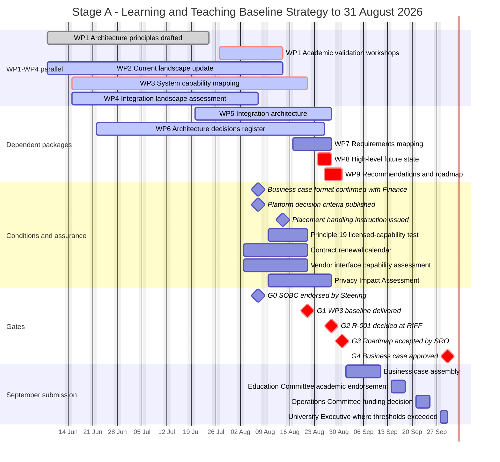
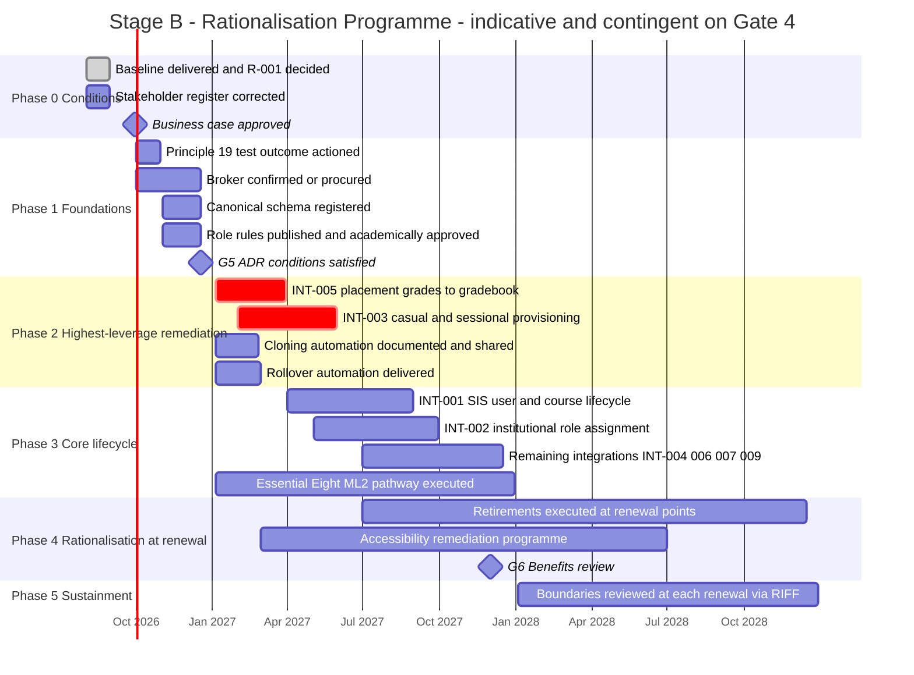

# Project Plan: Learning & Teaching Baseline Strategy

> **Template Origin**: Official | **ArcKit Version**: 6.7.5 | **Command**: `/arckit:plan`

## Document Control

| Field | Value |
|-------|-------|
| **Document ID** | ARC-001-PLAN-v1.0 |
| **Document Type** | Project Plan |
| **Project** | Learning & Teaching Baseline Strategy (Project 001) |
| **Classification** | OFFICIAL |
| **Status** | DRAFT |
| **Version** | 1.0 |
| **Created Date** | 2026-07-29 |
| **Last Modified** | 2026-07-29 |
| **Review Cycle** | Weekly to 31 August 2026, then at each governance gate |
| **Next Review Date** | 2026-08-07 |
| **Owner** | Rhonda Bell, Programme Manager (SRO: Prof. Otis Hammond, Deputy Vice-Chancellor (Education)) |
| **Reviewed By** | [PENDING] |
| **Approved By** | [PENDING] — Steering Committee |
| **Distribution** | Steering Committee; Education Committee; Operations Committee; University Executive; Digital & IT; Finance; Project Team |

## Revision History

| Version | Date | Author | Changes | Approved By | Approval Date |
|---------|------|--------|---------|-------------|---------------|
| 1.0 | 2026-07-29 | ArcKit AI | Initial creation from `/arckit:plan` command — two-stage plan covering the remaining engagement weeks and the post-approval delivery programme | [PENDING] | [PENDING] |

---

## How to Read This Plan

**This plan is written five weeks before the engagement ends.** That fact shapes everything below and should be understood before any section is read in isolation.

The consultant engagement runs from commencement to a fixed date of **31 August 2026** [CB-C1], feeding a **September 2026 business case** [CB-C2]. Today is **29 July 2026**. Approximately **4.5 working weeks remain.** WP1 to WP4 were scheduled to start immediately [CB-C3] and the evidence in the project's own artefacts confirms they are substantially progressed — principles are drafted and pending endorsement, the landscape map exists, two architecture decisions are proposed, and requirements, risk and data artefacts are complete.

**A plan that laid out a fresh multi-month schedule from today would therefore be fiction.** This one does not. It covers two horizons and keeps them separate:

| Stage | Period | What it is | Confidence |
|-------|--------|-----------|-----------|
| **Stage A** | Commencement → 31 Aug 2026 | The engagement itself — nine work packages, of which the final third remain | **High.** Dates are fixed and mostly already committed in `ARC-001-RISK` §H and `ARC-001-SOBC` §E3 |
| **Stage B** | Q4 2026 → 2028+ | The delivery programme the WP9 roadmap will recommend and the September business case will seek funding for | **Indicative.** Not yet funded; sequencing is firm, dates are planning-level |

**Stage B is not approved work.** It is included because a plan that stopped at 31 August would give the Executive no view of what it is being asked to fund. Every Stage B date is contingent on Gate 4 (§7.1).

---

## 1. Executive Summary

**Project**: Learning & Teaching Baseline Strategy — architecture engagement feeding a rationalisation programme
**Engagement duration**: Commencement (assumed w/c 8 June 2026 — see Assumption A-2) to **31 August 2026**. **4.5 weeks remain as at this plan's date.**
**Programme duration (indicative)**: Q4 2026 to end 2028, with a benefits review in late 2027
**Investment sought (ROM ±50%)**: **AUD $2.4M – $4.2M over three years** for the recommended option [SOBC-C1]
**Team**: 2.4 FTE core through the engagement; 5–7 FTE peak in Stage B Phase 2–3
**Delivery model**: **Hybrid** — work-package delivery inside the University's **RIFF** stage-gate governance (Education Committee → Operations Committee → University Executive). GDS Discovery/Alpha/Beta/Live phase naming is **not** used; see §2.1 for why.

**Objective**: Deliver a prioritised, sequenced rationalisation roadmap for the University's Learning & Teaching technology ecosystem by 31 August 2026, in a form the September business case can consume directly, and then execute the funded programme it describes.

**Success Criteria** (adopted verbatim from `ARC-001-SOBC` §B1 so the plan is measured against thresholds the stakeholders already own):

- **CSF-1** — Architecture principles endorsed by Education Committee by **mid-August 2026**. WP7 and WP8 are both gated on it.
- **CSF-2** — R-001 (the consolidation decision) resolved through RIFF with published criteria **before the roadmap is submitted**, not deferred into it as ambiguity.
- **CSF-3** — Privacy and security findings shape platform decisions rather than invalidating them late. No platform decision ratified ahead of its privacy assessment.
- **CSF-4** — 100% of the 35 source survey requirements mapped to a capability status.
- **CSF-5** — The 31 August deliverable is in the Executive's expected format, confirmed with Finance by **7 August 2026**.

**Key Milestones**:

| Milestone | Date | Stage | Status |
|-----------|------|-------|--------|
| Business case format confirmed with Finance | 7 Aug 2026 | A | Not started |
| Platform decision criteria published | 7 Aug 2026 | A | Not started |
| Architecture principles endorsed (Education Committee) | 14 Aug 2026 | A | In progress |
| **WP3 licence and capability baseline delivered** | **21 Aug 2026** | A | **In progress — critical path** |
| Integration architecture and canonical model defined | 28 Aug 2026 | A | In progress |
| Privacy Impact Assessment complete | 28 Aug 2026 | A | Not started |
| **R-001 decided at RIFF** | **Late Aug 2026** | A | Not started |
| **WP9 roadmap delivered** | **31 Aug 2026** | A | Not started |
| Business case submitted | September 2026 | A→B | Not started |
| ADR-001 / ADR-002 conditions satisfied | Q4 2026 | B | Not started |
| First integration cutover (INT-005 placement grades) | Q1 2027 | B | Not started |
| Essential Eight ML2 target | End 2027 | B | Not started |
| Benefits review (12 months after first cutover) | Late 2027 | B | Not started |

**The single most important fact in this plan**: the critical path runs **WP3 baseline (21 Aug) → R-001 decision (late Aug) → WP9 roadmap (31 Aug) → business case (Sept)**, and it carries **no float**. A slip at 21 August propagates directly to the September submission [SOBC-C2].

---

## 2. Delivery Approach

### 2.1 Why Not GDS Phases

The template's default phase model is GDS Discovery → Alpha → Beta → Live. **It is not used here, deliberately.**

The University of Funk is an Australian higher-education institution. GDS phase gates, service assessments and the UK Government Service Manual have **no standing** for it, and the engagement already has its own structure: nine work packages with stated dependencies [CB-C3], governed by the University's **RIFF Review** process with a defined escalation path of **Education Committee → Operations Committee → University Executive** [SOBC-C3]. Substituting GDS naming over the top of that would create two vocabularies for the same gates and make the plan harder, not easier, to govern.

The same reasoning is applied throughout: UK-specific instruments (Digital Marketplace, G-Cloud, DOS, HM Treasury spending controls, the 3.5% STPR discount rate) are **out of scope**, consistent with the position `ARC-001-SOBC` §C1.1 takes explicitly.

### 2.2 The Approach Actually Used

**Hybrid** — agile, evidence-led delivery within fixed stage gates:

- **Stage A** is work-package based. WP1–WP4 ran in parallel from commencement; WP5–WP9 are dependency-sequenced [CB-C3]. WP6 is a running document throughout rather than a discrete phase.
- **Stage B** is phased and **sequenced by risk rather than by convenience** — the sequencing `ARC-001-RISK` Finding 1 and ADR-001 Condition 3 both prescribe [SOBC-C4]. This is why placement-grade remediation comes first despite not being the largest integration.
- **Gates are RIFF-based.** Decisions are taken at RIFF with published criteria, escalating through Education Committee for academic endorsement, Operations Committee for funding, and University Executive where thresholds are exceeded.
- **The academic calendar is a hard constraint.** No cutover occurs in a teaching period; assessment periods carry change freezes (NFR-A-001) [SOBC-C5].

### 2.3 Complexity Classification

Classified **Large**, on the template's own criteria, for the delivery programme:

| Criterion | Value | Tier indicated |
|-----------|-------|----------------|
| Formal requirements | **64** (8 BR, 22 FR, 17 NFR, 9 INT, 8 DR) plus 35 source survey requirements | Medium–Large |
| External integrations | **9** (INT-001 to INT-009) | **Large** (5+ trigger) |
| Compliance regimes | Privacy Act 1988 / APPs, ASD Essential Eight (ML1 → ML2 by end 2027), WCAG 2.2 AA | **Large** (multiple regimes) |
| Data migration | Content and configuration migration at platform retirement | **Large** |
| Custom development | Role authority service, canonical model, capability register — no market supplies these | **Large** |

**The engagement (Stage A) is not itself a large project** — it is a fixed ~12-week architecture engagement producing paper. The programme it specifies is large. Conflating the two would produce either an over-planned engagement or an under-planned programme.

---

## 3. Timeline Overview — Stage A (Engagement)

> **Reading note.** Bars before 29 July are recorded status, not forecast. WP1–WP4 start dates derive from Assumption A-2 (commencement w/c 8 June 2026); the brief does not state a commencement date. The `crit` styling marks the critical path described in §6.

---

## 4. Timeline Overview — Stage B (Indicative Delivery Programme)

> **Every bar in this chart is contingent on Gate 4.** Nothing in Stage B is funded work today. Phase boundaries respect the academic calendar; no cutover is scheduled inside a teaching or assessment period [SOBC-C5].

---

## 5. Workflow & Gates Diagram

```mermaid
graph TB
    Start[Engagement commenced<br/>WP1-WP4 in parallel] --> WPmid

    WPmid[WP2 WP3 WP4 delivery<br/>• Landscape validated<br/>• Capability mapped<br/>• Integrations assessed] --> G1{Gate 1<br/>WP3 baseline<br/>21 Aug}

    G1 -->|OK Delivered| RIFF
    G1 -->|X Not delivered| Reduce[Submission reduces to<br/>compliance and integration<br/>case only - Option 1 scope]
    Reduce --> WP9

    EdC1[Education Committee<br/>principles endorsement<br/>14 Aug] --> WP78
    WPmid --> EdC1

    RIFF{Gate 2<br/>R-001 decided at RIFF<br/>published criteria<br/>late Aug} -->|OK Decided| WP78
    RIFF -->|X Deferred| Ambig[Ambiguity carried into<br/>the roadmap - CSF-2 failed]
    Ambig --> WP78

    WP78[WP5 WP7 WP8<br/>• Integration architecture<br/>• Requirements mapping<br/>• Future state] --> WP9

    WP9[WP9 Recommendations<br/>and roadmap] --> G3{Gate 3<br/>Roadmap accepted<br/>by SRO<br/>31 Aug}

    G3 -->|OK Accepted| BC[Business case assembled<br/>September]
    G3 -->|X Rejected| Rework[Rework against<br/>Finance format]
    Rework --> G3

    BC --> EdC2{Education Committee<br/>academic endorsement}
    EdC2 -->|OK Endorsed| OpsC{Operations Committee<br/>funding decision}
    EdC2 -->|X Not endorsed| RevisePlat[Revise platform positions<br/>with pedagogical input]
    RevisePlat --> EdC2

    OpsC -->|OK Approved| Exec{University Executive<br/>where thresholds exceeded}
    OpsC -->|X Rejected| Fallback[Fall back to Option 1<br/>minimum defensible response]
    Fallback --> Exec

    Exec -->|OK Gate 4 approved| Ph1[Phase 1 Foundations<br/>Q4 2026]
    Exec -->|X Not approved| Accept[Risk acceptances<br/>recorded and signed]

    Ph1 --> G5{Gate 5<br/>ADR-001 and ADR-002<br/>conditions satisfied}
    G5 -->|OK Satisfied| Ph2[Phase 2 INT-005 first<br/>closes three risks at once]
    G5 -->|X Not satisfied| Hold[Build held<br/>conditions re-tested]
    Hold --> G5

    Ph2 --> Ph3[Phase 3 Core lifecycle<br/>INT-001 INT-002]
    Ph3 --> Ph4[Phase 4 Retirement<br/>at renewal points]
    Ph4 --> G6{Gate 6<br/>Benefits review<br/>late 2027}
    G6 --> Ph5[Phase 5 Sustainment<br/>RIFF reviews boundaries<br/>at every renewal]

    style G1 fill:#FFE4B5
    style RIFF fill:#FFE4B5
    style G3 fill:#FFE4B5
    style EdC2 fill:#FFE4B5
    style OpsC fill:#FFE4B5
    style Exec fill:#FFE4B5
    style G5 fill:#FFE4B5
    style G6 fill:#FFE4B5
    style Reduce fill:#FFB6C1
    style Ambig fill:#FFB6C1
    style Accept fill:#FFB6C1
    style Fallback fill:#FFD9B5
```

---

## 6. Critical Path and Dependencies

### 6.1 The Critical Path

**WP3 baseline (21 Aug) → R-001 decision (late Aug) → WP8 future state (28 Aug) → WP9 roadmap (31 Aug) → business case (Sept).**

Every item on it runs through the 21 August baseline [SOBC-C2]. There is **no float** between 21 August and 31 August — seven working days to take a contested decision, map requirements, finalise the future state and write the roadmap.

**Why the sequence cannot be reordered.** R-001 is a decision risk, not an analysis gap: `ARC-001-WARD-001` §6 found the capability map is the least evolved component in the landscape and is what the decision depends on [SOBC-C6]. The fix is therefore not to decide earlier but to **set the decision deadline to land immediately after the baseline, and publish both dates together** — which is what this plan does.

### 6.2 Work Package Dependency Map

| WP | Work Package | Depends on | Scheduled completion | Status at 29 Jul |
|----|--------------|-----------|---------------------|------------------|
| WP1 | Architecture Principles | — | 14 Aug 2026 (endorsement) | Drafted; **awaiting Education Committee endorsement** |
| WP2 | Current Landscape Update | — | 14 Aug 2026 | In progress |
| WP3 | System Capability Mapping | Week-one prioritisation; vendor data | **21 Aug 2026** | In progress — **critical path** |
| WP4 | Integration Landscape Assessment | Integration team availability | 7 Aug 2026 | Substantially complete |
| WP5 | Integration Architecture | WP1, WP4 | 28 Aug 2026 | In progress — ADR-001 and ADR-002 proposed |
| WP6 | Architecture Decisions Register | WP2–WP5 (running) | 26 Aug 2026 | Running — two ADRs recorded |
| WP7 | Requirements Mapping | WP3, requirements register | 28 Aug 2026 | **Blocked on WP3** |
| WP8 | High-Level Future State | WP1, WP5, WP6, WP7 | 28 Aug 2026 | Not started |
| WP9 | Recommendations & Roadmap | WP8 | **31 Aug 2026** | Not started |

### 6.3 External Dependencies

| Dependency | Owner | Needed by | Risk if late |
|-----------|-------|-----------|--------------|
| Vendor capability, contract and roadmap data | Grace Tanaka | 21 Aug 2026 | WP3 slips; financial case incomplete (R-011, Assumption A-3) |
| Vendor hosting-region statements | Grace Tanaka | 21 Aug 2026 | PIA cannot complete; R-017 stays at residual 16 |
| Integration team availability for WP4/WP5 | Sam Okafor | Throughout | WP5 architecture unvalidated |
| Education Committee meeting slot | A/Prof. Pearl Clavinet | Mid-Aug 2026 | CSF-1 fails; WP7 and WP8 both gated |
| Finance confirmation of business case format | Rhonda Bell | 7 Aug 2026 | R-004 — deliverable in wrong format |
| HR capability to emit appointment events | To be identified — **see §9.1** | Phase 1 | ADR-002 fallback applies (Assumption A-6) |

---

## 7. Stage A — Remaining Engagement (29 July – 31 August 2026)

**Objective**: Complete WP5 to WP9 and deliver a roadmap the September business case can consume without rework.

### 7.1 Week-by-Week Activity Plan

| Week | Dates | Focus | Key deliverables | Owner |
|------|-------|-------|-----------------|-------|
| **W-5** | Wed 29 – Fri 31 Jul | Final-stage mobilisation | Stakeholder register corrected to add Student Administration and HR; WP8 outline agreed; vendor data chase escalated | Rhonda Bell |
| **W-4** | Mon 3 – Fri 7 Aug | Fix the conditions that gate everything else | **7 Aug**: business case format confirmed with Finance (CSF-5, R-004); platform decision criteria published (R-001); hard decision deadline set protecting WP8; WP4 integration landscape signed off | Rhonda Bell / Dr. Benny Moog / Prof. Otis Hammond |
| **W-3** | Mon 10 – Fri 14 Aug | Endorsement and exposure containment | **14 Aug**: architecture principles endorsed by Education Committee (CSF-1, G-1); handling instruction prohibiting email, screenshot and spreadsheet transfer of placement records issued (R-018, R-008, R-023); WP2 landscape update complete | A/Prof. Pearl Clavinet / Prof. Priya Anand / Eleanor Frame |
| **W-2** | Mon 17 – Fri 21 Aug | **The baseline week — the pivot of the whole engagement** | **21 Aug**: WP3 licence and capability baseline delivered (Condition 1, Gate 1); hosting region confirmed per platform from vendor not assumption; vendor interface capability assessed for event-driven integration (R-026); licensed-but-unconfigured capability quantified (R-013, R-016); contract renewal calendar built (R-005, R-015); Principle 19 test complete for ADR-001 and ADR-002 jointly | Dr. Benny Moog / Grace Tanaka / Sam Okafor |
| **W-1** | Mon 24 – Fri 28 Aug | Decide, map, and define the future state | WP7 requirements mapping — 35 of 35 to a capability status (CSF-4); **28 Aug**: WP5 target integration architecture and canonical model defined; PIA complete across all 13 APPs (CSF-3, R-017); **R-001 decided at RIFF with published criteria** (Gate 2, CSF-2); WP6 register finalised; WP8 future state drafted | Dr. Felix Marimba / Sam Okafor / Eleanor Frame / Dr. Benny Moog |
| **W-0** | Mon 31 Aug | Deliver | **31 Aug**: WP9 recommendations and sequenced roadmap delivered in business case format (Gate 3) | Rhonda Bell |
| **Sept** | Sept 2026 | Submission | Business case assembled with costed positions; Education Committee → Operations Committee → University Executive (Gate 4) | Prof. Otis Hammond |

> **Honest note on W-1.** Five working days to take a contested platform decision, complete a 13-APP privacy assessment, map 35 requirements and draft a future state is a compressed week by any reading. `ARC-001-RISK` R-012 names the consequence directly — WP7 reduces to desk analysis and coverage is overstated. The mitigation is **not** to promise more depth than is available but to **state depth-analysis versus desk-review coverage explicitly in the deliverable**. That commitment is carried into §7.3, Gate 3 criteria.

### 7.2 ArcKit Command Support

Stage A is largely complete in artefact terms. The commands still applicable in the remaining weeks:

| Timing | Activity | ArcKit Command | Deliverable |
|--------|----------|----------------|-------------|
| W-4 (3–7 Aug) | Refresh risk positions after WP4 sign-off | `/arckit:risk` | Updated `ARC-001-RISK` |
| W-2 (17–21 Aug) | Record WP3-driven decisions as they surface | `/arckit:adr` | ADR-003 onward (WP6) |
| W-1 (24–28 Aug) | Privacy assessment against the 13 APPs | `arckit-au:au-pia` | Privacy Impact Assessment |
| W-1 (24–28 Aug) | Essential Eight pathway documentation | `arckit-au:au-e8-posture` | ML1 → ML2 pathway with owners |
| W-1 (24–28 Aug) | Verify requirement-to-recommendation coverage | `/arckit:traceability` | Traceability matrix — evidences CSF-4 |
| W-1 (24–28 Aug) | Cross-artefact quality check before submission | `/arckit:analyze` | Governance quality report |
| W-0 (31 Aug) | Sequenced roadmap in business case format | `/arckit:roadmap` | WP9 deliverable |
| Sept | Update the case with costed positions | `/arckit:sobc` | OBC-grade business case |

> **`arckit-au:*` commands are used in preference to their UK equivalents** (`/arckit:dpia`, `/arckit:secure`). The applicable regimes are the Privacy Act 1988 and the ASD Essential Eight, not UK GDPR or NCSC guidance.

### 7.3 Stage A Gates

#### Gate 0 — SOBC endorsed (7 August 2026)

**Approval criteria**:

- [ ] Strategic case accepted by Steering Committee
- [ ] The four conditions in `ARC-001-SOBC` §F2 agreed as conditions, not aspirations
- [ ] Proposed risk appetite thresholds endorsed or institutional ones substituted — until this happens, every "exceeds appetite" judgement in the register is an architectural recommendation with **no formal escalation trigger**
- [ ] CFO confirms the Operations Committee versus University Executive approval threshold, so September routes correctly first time

**Approver**: Steering Committee (Hammond chair, Rhodes, Clavinet, Ostinato; Bell secretary)

**Outcomes**: Endorsed / Endorsed with amended conditions / Not endorsed — in which case the engagement completes to brief but the funding route is unclear.

#### Gate 1 — WP3 baseline delivered (21 August 2026)

**Approval criteria**:

- [ ] Total ecosystem licence spend by platform and renewal date, from the contract register
- [ ] Licensed-but-unconfigured capability quantified — configurability verified, not merely licensing
- [ ] Vendor interface capability assessed per platform, with batch exceptions recorded and given review dates
- [ ] Contract renewal calendar produced and the roadmap sequenced against it
- [ ] Hosting region per platform confirmed **from the vendor, not from assumption**

**Approver**: Steering Committee

**Outcomes**:

- **Delivered** — the financial case can be completed and the September submission carries costed positions
- **Partially delivered** — the roadmap states coverage explicitly and flags the gap to the Executive
- **Not delivered** — the September submission **reduces to a compliance-and-integration case only** (Option 1 scope, AUD $1.2M – $2.2M). This is a defined fallback, not a failure mode to be discovered in September.

#### Gate 2 — R-001 decided at RIFF (late August 2026, by 28 August)

**Approval criteria**:

- [ ] Decision criteria published **before** options were scored (due 7 Aug — this ordering is the point)
- [ ] Decision taken on the WP3 evidence base, not on advocacy
- [ ] Pedagogical input recorded — Deans of Music and Health consulted on discipline-capability impact
- [ ] Outcome and rationale published, with dissent recorded

**Approvers**: RIFF (Dr. Benny Moog) → Education Committee (A/Prof. Pearl Clavinet accountable)

**Outcomes**: Decided / Deferred — deferral means CSF-2 has failed and an unresolved platform question reaches the Executive, **inviting it to be settled on cost without pedagogical input**, the outcome `ARC-001-RISK` §I explicitly warns against.

#### Gate 3 — Roadmap accepted (31 August 2026)

**Approval criteria**:

- [ ] Recommendations cover tool rationalisation, cost optimisation, capability gaps, integration uplift priorities and risks [CB-C4]
- [ ] Roadmap sequences platform changes and integration uplifts with dependencies, phasing and approximate timing; quick wins distinguished from strategic investments [CB-C5]
- [ ] Sequenced against the contract renewal calendar, not against convenience
- [ ] INT-005 sequenced first — it closes an operational, a compliance and a reputational risk simultaneously
- [ ] 35 of 35 survey requirements traced to a recommendation or an explicit gap statement (CSF-4)
- [ ] **Depth of analysis stated explicitly per system** — which were mapped in depth and which by desk review (R-012)
- [ ] Delivered in the format confirmed with Finance on 7 August (CSF-5)
- [ ] Recurring licence spend and one-off integration investment presented as **separate** cost categories (R-014)

**Approver**: Prof. Otis Hammond (SRO)

#### Gate 4 — Business case approved (September 2026)

**Approval criteria**:

- [ ] Costed positions present, or the Gate 1 fallback explicitly declared
- [ ] Funding allocated against the one-off and recurring categories separately
- [ ] Optimism-bias position adopted — institutional figure, or the UK-derived 40% benchmark explicitly labelled as such
- [ ] University discount rate set by Finance before any NPV is calculated
- [ ] Stakeholder register corrected and Student Administration and HR represented in governance (Condition 4)

**Approvers**: **Education Committee** (academic endorsement) → **Operations Committee** (funding) → **University Executive** (where financial or strategic thresholds are exceeded)

**Outcomes**: Approved / Approved to Option 1 scope only / Deferred / Not approved. If not approved, **Option 0 must be chosen explicitly with risk acceptances recorded and signed** — it should not be arrived at by inaction.

---

## 8. Stage B — Delivery Programme (Indicative, Q4 2026 onward)

**Objective**: Execute the funded roadmap. **Not approved work — every date below is contingent on Gate 4.**

### 8.1 Phase Plan

| Phase | Period | Scope | Gate |
|-------|--------|-------|------|
| **Phase 0 — Conditions** | Aug–Sept 2026 | Baseline delivered; R-001 decided; stakeholder register corrected; Principle 19 test complete | Gate 4 |
| **Phase 1 — Foundations** | Q4 2026 | Broker confirmed or procured; canonical schema registered; role rules published and academically approved | Gate 5 |
| **Phase 2 — Highest-leverage remediation** | Q1–Q2 2027 | INT-005 placement grades; INT-003 casual provisioning; cloning automation documented and second operator trained; rollover automation delivered **before** template conformance is requested | — |
| **Phase 3 — Core lifecycle** | Q2–Q4 2027 | INT-001 SIS lifecycle; INT-002 role assignment; remaining integrations; Essential Eight ML2 pathway executed | Gate 6 |
| **Phase 4 — Rationalisation at renewal** | 2027–2028 | Retirements executed at contract renewal points; accessibility remediation across student-facing platforms | — |
| **Phase 5 — Sustainment** | 2028+ | Boundaries reviewed at every renewal via RIFF, operating on a maintained capability map | Ongoing |

### 8.2 Why INT-005 Goes First

This is the single most consequential sequencing decision in the plan and it is not cost-driven.

**Three of the top five risks in the register are the same defect.** R-008 (operational — placement grades re-keyed by hand), R-018 (compliance — sensitive placement data handled manually, residual 16 against an appetite of 9) and the breach exposure in R-023 (reputational) all trace to one flow: placement outcomes moving between systems by hand. **Remediating INT-005 closes three risks at once.** It is the highest-leverage action in the register and is sequenced first regardless of what else the roadmap contains.

### 8.3 Stage B Gates

#### Gate 5 — ADR conditions satisfied (Q4 2026)

**Approval criteria**:

- [ ] ADR-001 Condition 1 — Principle 19 test on existing licensed capability completed **before** any broker purchase
- [ ] ADR-002 conditions met, including the HR appointment-event assumption (A-6) validated or the fallback design adopted
- [ ] Broker operational capability addressed — the AV/integration team does not currently hold the skills or on-call capability this requires. **Skills uplift planned before first cutover, not after.**
- [ ] Canonical schema registered and versioned

**Approver**: Steering Committee

#### Gate 6 — Benefits review (late 2027, 12 months after first cutover)

**Approval criteria** — measured against the outcome KPIs stakeholders already own:

- [ ] O-1 — capability categories with a declared primary and boundary: target 8 of 8 (from 0)
- [ ] O-2 — production flows requiring a manual step: target 0 (from 4 of 7)
- [ ] O-3 — annual licence spend against the WP3 baseline: flat or reduced
- [ ] O-4 — data classes assessed 8 of 8; Essential Eight ML2 pathway on track for end 2027
- [ ] O-5 — template conformance and WCAG 2.2 AA verification coverage
- [ ] O-6 — RIFF requests assessed against the capability map: target 100% (from 0%)

**Approver**: Steering Committee. **Benefits RAG status is a standing Steering item throughout**, not a one-off review.

---

## 9. Resource Plan

### 9.1 Team by Stage

| Role | Source | Stage A | Stage B (Phase 1–3) | Note |
|------|--------|---------|---------------------|------|
| SRO | Internal — Prof. Otis Hammond | 0.1 FTE | 0.1 FTE | Existing |
| Programme Manager | Internal — Rhonda Bell | 1.0 FTE | 1.0 FTE | **Extension beyond 31 Aug not yet secured** (Assumption A-7) |
| Solution Architect | Consultant | 1.0 FTE | 0 | **Engagement ends 31 Aug** — architectural knowledge transfer is unplanned; see §11 |
| Integration Architect | Internal — Sam Okafor | 1.0 FTE | 1.0 FTE | **The single most concentrated dependency in the programme** |
| Integration engineers | To be sourced | 0 | 2–3 FTE | Skills gap — not currently held |
| Privacy and security specialists | Internal — Frame, Ohm | 0.3 FTE each | 0.3 FTE each | Existing |
| Change and academic engagement | To be sourced | 0 | 0.5–1.0 FTE | **Not currently resourced** |
| Learning Technologists | Internal | Absorbed | Absorbed | Currently absorbing the manual workarounds this programme removes |

> **Two resourcing gaps are load-bearing and neither is closed.** First, **Student Administration and Human Resources are joint business owners of institutional role data and neither appears in the sixteen-name stakeholder register.** Both are required for the integration workstream. Correcting this is Condition 4 and the first action in §7.1. Second, the **Programme Manager's availability beyond 31 August is not secured** — the gap between engagement end and programme start is precisely where continuity is lost.

### 9.2 Budget

Presented in the two categories `ARC-001-STKE` Conflict 2 requires be kept separate — because **integration capital produces no licence saving in the same period**, and a blended figure would hide that.

| Category | Year 1 (FY27) | Year 2 (FY28) | Year 3 (FY29) | Total band (ROM ±50%) |
|----------|--------------|--------------|--------------|----------------------|
| One-off — integration, governance, migration | AUD $1.24M – $2.25M | AUD $850k – $1.59M | AUD $130k – $240k | **AUD $2.22M – $4.08M** |
| Recurring increase — broker licence or hosting | AUD $80k – $150k/yr | AUD $80k – $150k/yr | AUD $80k – $150k/yr | Possibly **nil** if the Principle 19 test succeeds |
| Recurring decrease — retired platform licences | Not quantifiable | Not quantifiable | Not quantifiable | **Requires the WP3 baseline** |
| **Programme total (recommended option)** | | | | **AUD $2.4M – $4.2M** |
| With optimism-bias benchmark applied | | | | AUD $3.4M – $5.9M |

**Consultant engagement cost**: not stated in any artefact available to this plan and therefore **not estimated here**. It is sunk in any case — the engagement completes on 31 August regardless of the funding decision.

**Profile warning**: 55% to 60% of the one-off investment falls in **Year 1**, which is the least convenient profile for a fixed capital allocation and must be modelled explicitly in the September submission. **Retirement savings arrive later than costs**, constrained by the renewal calendar — a naive year-one affordability test would reject a programme that is affordable across the horizon.

---

## 10. Monitoring and Change Control

| Forum | Frequency | Standing agenda |
|-------|-----------|-----------------|
| Steering Committee | **Fortnightly** through the engagement, then monthly in Stage B | Critical-path status; Gate 1 conditions; benefits RAG; appetite-exceeding risks |
| RIFF Review | Per request | Decisions arising from WP6; boundary decisions; new tool requests assessed against the capability map |
| Education Committee | Per cycle | Principles endorsement (14 Aug); academic endorsement of the business case (Sept) |
| Operations Committee | Per cycle | Funding decision (Sept); threshold escalation to University Executive |
| Project team stand-up | Weekly to 31 Aug | Work package progress; vendor data chase; blockers |

**Re-planning triggers** — this plan is reissued at v1.1 or later if any of the following occur:

1. The WP3 baseline is not delivered on 21 August (Gate 1 fallback invoked)
2. R-001 is deferred past 28 August (CSF-2 failed)
3. Education Committee does not endorse the principles by mid-August (CSF-1 failed; WP7 and WP8 both gated)
4. Gate 4 approves a scope other than Option 2 — Stage B is then re-sequenced entirely
5. The Programme Manager or Integration Architect becomes unavailable

---

## 11. Risks and Assumptions

### 11.1 Plan-Specific Risks

Drawn from `ARC-001-RISK`, filtered to those that threaten **this plan's dates** rather than the programme's outcomes.

| ID | Risk | Residual | Impact on plan | Mitigation | Owner |
|----|------|----------|---------------|------------|-------|
| R-004 | Deliverable misses 31 August or is in the wrong format | 10 | Gate 3 fails; September submission has no input | Confirm format with Finance by 7 Aug; draft WP9 directly into it | Rhonda Bell |
| R-011 | Vendor unresponsiveness blocks WP3 | 6 | **Gate 1 fails; the whole critical path slips** | Prioritise vendors with contracts falling due inside the roadmap horizon | Grace Tanaka |
| R-012 | Timeline compression degrades mapping depth | 6 | WP7 reduces to desk analysis; CSF-4 met nominally but not substantively | State depth-analysis versus desk-review coverage explicitly in the deliverable | Rhonda Bell |
| R-001 | Consolidation decision unresolved | **16 — exceeds appetite** | Gate 2 fails; WP8 proceeds on ambiguity | Decision deadline set to land immediately after the baseline; criteria published first | Prof. Otis Hammond |
| R-002 | Strategy perceived as cost-cutting | 6 | Education Committee declines to endorse; CSF-1 fails | Validation with Castle, Field and discipline representatives **before** committee | A/Prof. Pearl Clavinet |
| R-026 | Vendor platforms cannot support event-driven integration | 12 | Stage B Phase 1–3 architecture undeliverable as designed | Assess interface capability per platform during WP3; record batch exceptions with review dates | Sam Okafor |
| R-007 | Single-person dependency on cloning automation | 12 — **control effectiveness "None effective"** | Stage B Phase 2 exposed at the busiest point in the academic calendar | Document and version-control the scripts; train a second operator | Sam Okafor |

**A plan-specific risk not in the register**: the **Solution Architect leaves on 31 August** and the delivery programme starts in Q4. No architectural knowledge-transfer activity is scheduled in any artefact. The University has previously built teaching-critical automation and failed to sustain it (R-007, control effectiveness "None effective") — the same pattern. **Recommendation: schedule a handover in W-0 or the first September week, before the engagement closes.**

### 11.2 Assumptions

| # | Assumption | Impact if invalid |
|---|-----------|-------------------|
| **A-1** | The WP3 baseline can be produced by 21 August 2026 | Financial case incomplete; September submission reduces to Option 1 scope. **The single most important assumption in this plan.** |
| **A-2** | Engagement commencement taken as w/c 8 June 2026 | Affects only the historical bars in the Stage A Gantt. The brief is dated June 2026 and does not state a commencement date; forward dates are unaffected |
| **A-3** | Vendors supply capability and contract data in time (R-011) | WP3 delayed; A-1 fails |
| **A-4** | Renewal dates permit retirement without break costs (R-005, R-015) | Savings deferred by up to a full contract term; Stage B Phase 4 re-sequenced |
| **A-5** | Broker operation absorbed within the existing team plus skills uplift | New FTE required; recurring cost rises above the $80k–$150k band |
| **A-6** | HR can associate appointments with unit offerings (ADR-002 A-3) | Role authority design changes; ADR-002 fallback applies. **The largest open technical unknown** |
| **A-7** | Programme Manager available beyond 31 August 2026 | Delivery continuity lost between engagement end and programme start |
| **A-8** | Education Committee has a meeting slot available in mid-August | CSF-1 fails; WP7 and WP8 proceed on unendorsed principles |
| **A-9** | Stage B dates assume Gate 4 approval by end September 2026 | Every Stage B date shifts by the delay, and Phase 2 cannot start mid-teaching-period — a one-month slip becomes a one-quarter slip |

### 11.3 Constraints

- **31 August 2026 is fixed.** It is a contractual deliverable date feeding a September business case [CB-C1]. It does not move.
- **The academic calendar governs Stage B.** No cutover in a teaching period; assessment periods carry change freezes (NFR-A-001).
- **Rationalisation is only executable at contract renewal points.** Retirement decisions landing mid-term produce cost rather than saving.
- **No approved risk appetite statement exists.** The register's thresholds are marked PROVISIONAL. Until Steering endorses them, every escalation in this plan has no formal trigger.

---

## Appendix A: Glossary

| Term | Definition |
|------|------------|
| APP | Australian Privacy Principles, Privacy Act 1988 (Cth) |
| ADR | Architecture Decision Record |
| CSF | Critical Success Factor |
| Essential Eight / ML1, ML2 | ASD mitigation strategies and maturity levels |
| FTE | Full-Time Equivalent |
| INT-00n | Integration requirement identifier from `ARC-001-REQ` |
| L&T | Learning & Teaching |
| LMS | Learning Management System |
| NDB | Notifiable Data Breach scheme, Privacy Act Part IIIC |
| OBC | Outline Business Case — the stage after SOBC, carrying NPV against a real baseline |
| PIA | Privacy Impact Assessment |
| RIFF | Review of Innovation, Fit & Function — the University's solution governance gate |
| ROM | Rough Order of Magnitude — a planning band at ±50%, not a quotation |
| SIS | Student Information System (PeopleSoft) |
| SOBC | Strategic Outline Business Case |
| SRO | Senior Responsible Owner |
| WCAG 2.2 AA | Web Content Accessibility Guidelines, conformance level AA |
| WP1–WP9 | Consultant engagement work packages [CB-C3] |

## External References

> This section provides traceability from generated content back to source documents.

### Document Register

| Doc ID | Filename | Type | Source Location | Description |
|--------|----------|------|-----------------|-------------|
| CB | consultant-brief.md | Engagement brief | `001-lt-ecosystem/external/` | WP1–WP9 scope and dependencies, 31 August 2026 deadline, September business case |
| SOBC | ARC-001-SOBC-v1.0.md | ArcKit artifact | `001-lt-ecosystem/` | Options appraisal, approval gates, delivery phases, resource plan, conditions for approval |
| RISK | ARC-001-RISK-v1.0.md | ArcKit artifact | `001-lt-ecosystem/` | 29 risks, top-10 ranking, prioritised action plan with owners and dates |
| REQ | ARC-001-REQ-v1.0.md | ArcKit artifact | `001-lt-ecosystem/` | 64 requirements across BR/FR/NFR/INT/DR; engagement timeline and milestones; budget position |

### Citations

| Citation ID | Doc ID | Page/Section | Category | Quoted Passage |
|-------------|--------|--------------|----------|----------------|
| CB-C1 | CB | Header and §2 | Business Requirement | "Due date \| 31 August 2026"; "The engagement runs from immediate commencement through to 31 August 2026." |
| CB-C2 | CB | §2, WP9 | Business Requirement | "The final deliverable. Synthesises all findings into prioritised recommendations and a sequenced delivery roadmap, structured to feed directly into the September business case." |
| CB-C3 | CB | §3 | Design Decision | Work package sequence table: WP1–WP4 "Start immediately"; WP5 depends on "WP1, WP4"; WP7 on "WP3, requirements register"; WP8 on "WP1, WP5, WP6, WP7"; WP9 on "WP8" |
| CB-C4 | CB | §2, WP9 | Business Requirement | "Recommendations: tool rationalisation and consolidation; cost optimisation from unused or duplicated capability; capability gaps requiring investment; integration uplift priorities (from WP4/WP5); risks — fragility, overlap, underutilisation." |
| CB-C5 | CB | §2, WP9 | Business Requirement | "Roadmap: sequence all recommended platform changes and integration uplifts across a delivery horizon; show dependencies, phasing and approximate timing; distinguish quick wins from strategic investments; align to the business case structure." |
| SOBC-C1 | SOBC | Executive Summary, §D1 | Business Requirement | "Investment Required (ROM, ±50%): AUD $2.4M – $4.2M over three years for the recommended option, of which roughly two thirds is one-off integration and governance investment and one third is recurring platform and support cost." |
| SOBC-C2 | SOBC | §E3 | Risk Factor | "Critical path: WP3 baseline → R-001 decision → roadmap → business case. Every item on it runs through the 21 August baseline. A slip there propagates directly to the September submission with no float." |
| SOBC-C3 | SOBC | §D2 | Procurement Constraint | "Approval path: Steering Committee → Education Committee (academic endorsement) → Operations Committee → University Executive where financial or strategic thresholds are exceeded" |
| SOBC-C4 | SOBC | §E2 | Design Decision | "Phased, sequenced by risk rather than by convenience — the sequencing ARC-001-RISK Finding 1 and ADR-001 Condition 3 both prescribe." |
| SOBC-C5 | SOBC | §E2, note | Non-Functional Requirement | "No cutover in a teaching period. Every phase boundary respects the academic calendar; assessment periods carry change freezes (NFR-A-001)." |
| SOBC-C6 | SOBC | §E7.2, observation 2 | Risk Factor | "The capability map is the least evolved component in the entire landscape, and it is what the decision depends on. The fix is therefore not 'decide harder' but set the decision deadline to land immediately after the WP3 baseline, and publish both dates together." |

### Unreferenced Documents

| Filename | Source Location | Reason |
|----------|-----------------|--------|
| privacy-context.md | `001-lt-ecosystem/external/` | Not read for this artifact. Its material findings reach this plan through `ARC-001-SOBC` and `ARC-001-RISK`, which are the artifacts of record for compliance positions |
| requirements-register.md | `001-lt-ecosystem/external/` | Not read for this artifact. Superseded for planning purposes by `ARC-001-REQ`, which types and prioritises the 35 source requirements |
| stakeholders.md | `001-lt-ecosystem/external/` | Not read for this artifact. Superseded by `ARC-001-STKE`; RACI positions in this plan are taken from `ARC-001-SOBC` §E1.1 |
| system-landscape.md | `001-lt-ecosystem/external/` | Not read for this artifact. Landscape content informs WP2 and WP4 scope, not the schedule |
| ARC-001-STKE-v1.0.md, ARC-001-DATA-v1.0.md, ARC-001-TRAC-v1.0.md, decisions/, wardley-maps/ | `001-lt-ecosystem/` | Outside the input set for this generation. Referenced indirectly where `ARC-001-SOBC` quotes them, and cited to SOBC rather than claimed as direct reads |

---

**Generated by**: ArcKit `/arckit:plan` command
**Generated on**: 2026-07-29
**ArcKit Version**: 6.7.5
**Project**: Learning & Teaching Baseline Strategy (Project 001)
**Model**: Claude Opus 5 (1M context)
**Generation Context**: Built from the consultant brief's WP1–WP9 structure and dependency table, plus the approval gates, delivery phases, resource plan and conditions in `ARC-001-SOBC` §E, and the prioritised action plan with owners and dates in `ARC-001-RISK` §H. GDS Discovery/Alpha/Beta/Live phase naming and UK Government procurement instruments were deliberately not applied — the University of Funk is an Australian higher-education institution governed by its own RIFF process, and §2.1 records that reasoning explicitly. The plan is written as at 29 July 2026 with 4.5 weeks of the engagement remaining, and separates the fixed near-term engagement schedule (Stage A) from the indicative, unfunded delivery programme (Stage B) rather than presenting a single continuous timeline that would imply more certainty than exists.

<!-- arckit-provenance:start -->

## Build Provenance

*Stamped automatically by the ArcKit plugin's `provenance-stamp.mjs` PostToolUse hook. Complements (does not replace) the human-authored footer above. Carries only fields the model can't authoritatively self-report: build context from `.arckit/state.json` and effort levels derived from command frontmatter + the silent-downgrade matrix.*

| Field | Value |
|-------|-------|
| Requested Effort | `high` |
| Effective Effort | _unknown — model not parsed from existing footer_ |
| Stamped at | 2026-07-29T13:42:27.973Z |

<!-- arckit-provenance:end -->
