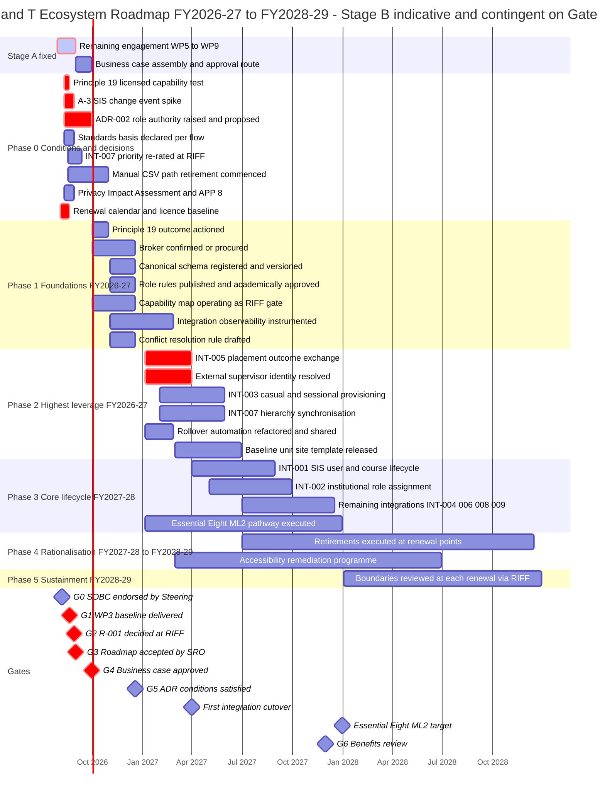
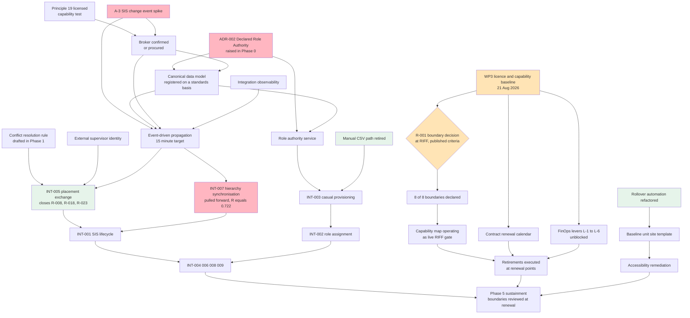
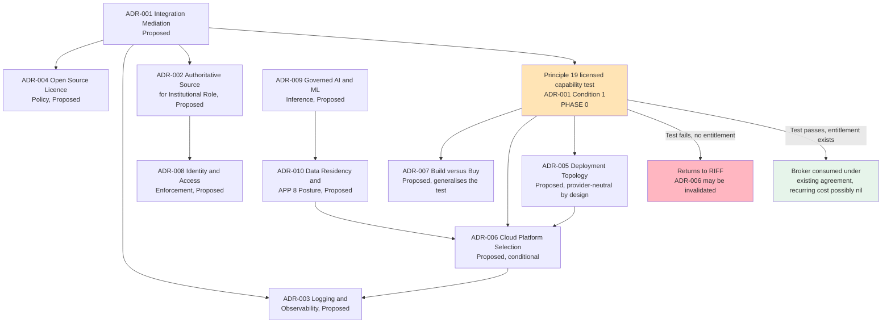

# Architecture Roadmap: Learning & Teaching Ecosystem — Capability Evolution FY2026/27 to FY2028/29

> **Template Origin**: Official | **ArcKit Version**: 6.7.5 | **Command**: `/arckit:roadmap`

## Document Control

| Field | Value |
|-------|-------|
| **Document ID** | ARC-001-ROAD-v1.0 |
| **Document Type** | Strategic Architecture Roadmap |
| **Project** | Learning & Teaching Baseline Strategy (Project 001) — The University of Funk |
| **Classification** | OFFICIAL |
| **Status** | DRAFT |
| **Version** | 1.0 |
| **Created Date** | 2026-07-29 |
| **Last Modified** | 2026-07-29 |
| **Review Cycle** | Quarterly, and at every governance gate |
| **Next Review Date** | 2026-08-28 |
| **Owner** | Prof. Otis Hammond, Deputy Vice-Chancellor (Education) — Senior Responsible Owner; produced by Rhonda Bell, Programme Manager |
| **Reviewed By** | [PENDING] — Cassandra "Cas" Rhodes, Chief Information Officer; Sam Okafor, Integration Architect |
| **Approved By** | [PENDING] — Prof. Otis Hammond (SRO) at Gate 3 |
| **Distribution** | Steering Committee; Education Committee; Operations Committee; University Executive; Digital & IT; Learning Innovation; Finance; Procurement; Project Team |

## Revision History

| Version | Date | Author | Changes | Approved By | Approval Date |
|---------|------|--------|---------|-------------|---------------|
| 1.0 | 2026-07-29 | ArcKit AI | Initial creation from `/arckit:roadmap` command — WP9 deliverable draft. Multi-year capability evolution for the Stage B delivery programme, aligned to `ARC-001-PLAN-v1.0`, with the `ARC-001-WARD-002` resequencing challenge applied to Phase 0 | [PENDING] | [PENDING] |

---

## How to Read This Roadmap

**This roadmap is the WP9 deliverable in draft, written on 29 July 2026 — five weeks before it is due.** Three things about its status must be understood before any date in it is quoted.

**First, it does not replace `ARC-001-PLAN-v1.0`; it extends one half of it.** The plan is two-stage. **Stage A** is the consultant engagement — nine work packages ending on a fixed date of **31 August 2026**, feeding a **September 2026 business case**, governed by gates G0 to G6 on the University's RIFF chain (Education Committee → Operations Committee → University Executive). Stage A's 21–31 August critical path carries **no float**. This roadmap does not re-plan Stage A, re-date it, or re-gate it. It reproduces the Stage A gates exactly as the plan sets them, because the roadmap is one of Stage A's outputs and cannot move its own deadline.

**Second, this roadmap is principally about Stage B** — the multi-year capability evolution from Q4 2026 to 2028 and beyond, Phases 0 to 5. **Stage B is not funded work.** Every Stage B date is contingent on **Gate 4**, the September 2026 business case decision. Nothing below should be read as a commitment, a schedule, or an approved allocation. Where this document says a phase "delivers", the complete sentence is "delivers, if Gate 4 approves the recommended option at the recommended scope".

**Third, this roadmap deliberately differs from the sequencing in ADR-001 in one specific way, and says so on the record.** `ARC-001-WARD-002` found that two Genesis-stage artefacts scheduled as configuration inside ADR-001's Phases 2 and 4 are not configurations but **decisions**, and that ADR-001's assumption A-3 — that PeopleSoft can emit change events — is untested while every event-driven flow on the map depends on it. §4 sets out how this roadmap responds. A roadmap that defers untested foundational assumptions into the delivery phase that consumes them is the specific failure mode this programme is exposed to, and the correction is the cheapest change recommended anywhere in the project's evidence base.

**Year notation.** Financial-year notation is used — **FY2026/27, FY2027/28, FY2028/29 — read as Australian financial years, July to June**, consistent with `ARC-001-STRAT-v1.0` and `ARC-001-SOBC-v1.0`. UK Government April–March financial years, GDS phase gates, Spending Review periods, the Technology Code of Practice, NCSC CAF, G-Cloud and Digital Marketplace instruments are **not used and not applicable** — The University of Funk is an Australian higher-education institution, not a UK public body. The applicable regulatory overlay is the **Privacy Act 1988** with the Australian Privacy Principles, the **ASD Essential Eight**, and **WCAG 2.2 Level AA**. All currency is **AUD** at 2026 prices.

**Configuration recorded for this generation**: Horizon = **3 years** (recommended default; matches the FY2026/27–FY2028/29 envelope already adopted in `ARC-001-STRAT-v1.0`). Year format = **financial year**, re-based to the Australian July–June year rather than the UK April–March year the template's recommended option assumes.

---

## 1. Executive Summary

### 1.1 Strategic Vision

The University of Funk will move from an **accumulated** Learning & Teaching estate to a **governed** one. Twenty-one platforms grew tool by tool over roughly a decade, each acquisition reasonable at the time and none assessed against the estate as a whole. Today **0 of 8** capability categories carry a designated primary platform, **4 of 7** production integrations move personal information by manual re-keying or flat-file transfer, and **0 of 8** personal-information classes carry an assessed privacy position. The target is not a smaller estate for its own sake. It is an estate in which every capability boundary is a recorded decision, every integration runs through a governed layer on a canonical model, and the RIFF review gate operates on maintained architectural evidence rather than on the merits of whatever request happens to arrive.

The roadmap's central sequencing conviction is that **the estate's fragility is not in what the University bought — it is in what the University never built to join it up**. Every one of the thirteen dependency risks above 0.5 on the integration value chain passes through either a flow or the contract layer beneath it; **not one passes through the integration broker**, which is the only component anybody is arguing about. The programme is therefore sequenced to build the contract layer first, remediate the highest-leverage flow first, and treat platform rationalisation as an activity that becomes executable at contract renewal points rather than one that leads.

### 1.2 Investment Summary

| Item | Position |
|------|----------|
| **Total investment envelope (recommended option)** | **AUD $2.4M – $4.2M** over three years, ROM ±50% — Option 2, Bounded Consolidation with Integration Uplift |
| **One-off (integration, governance, migration)** | AUD $2.22M – $4.08M across FY2026/27 to FY2028/29 |
| **Recurring change** | Integration broker licence or hosting **increase** of AUD $80k – $150k per year — **possibly nil** if the Principle 19 test succeeds. Retired platform licence **decrease** is not quantifiable until the WP3 baseline lands |
| **One-off / recurring split** | Approximately 90% / 10% on the `ARC-001-SOBC` §D1 tables |
| **With optimism-bias benchmark applied** | AUD $3.4M – $5.9M — the 40% benchmark is UK-derived, is offered for the Steering Committee to adopt or substitute, and is **not** an institutional standard |
| **ROI, NPV, BCR, payback** | **Deliberately not stated.** The licence-spend baseline they depend on is a WP3 output that does not exist on this document's date. A benefit-cost ratio computed now would have a real numerator and an invented denominator |
| **Funding status** | **Unfunded.** Contingent on Gate 4, September 2026 |

No dollar figure in this roadmap is originated here. Every band is quoted from `ARC-001-SOBC-v1.0` §D1 or `ARC-001-STRAT-v1.0` §Strategic Themes.

### 1.3 Expected Outcomes

Measured against the outcome definitions the stakeholders already own, so the roadmap is judged on thresholds it did not author.

| # | Outcome | Baseline (2026-07-29) | Target | By |
|---|---------|----------------------|--------|-----|
| O-1 | Capability categories with a designated primary and declared boundary | 0 of 8 | 8 of 8 declared, then maintained at each renewal | FY2026/27, sustained |
| O-2 | Production data flows requiring a manual step | 4 of 7 | 0 of 9 | FY2027/28 |
| O-3 | Annual ecosystem licence spend against the WP3 baseline | Baseline not established | Flat or reduced while Must-priority gaps close | FY2028/29 |
| O-4 | Personal-information classes with an accepted privacy position; Essential Eight mitigation strategies at ML2 | 0 of 8; 2 of 8 | 8 of 8; 8 of 8 at ML2 | Late 2026; end 2027 |
| O-5 | Student-facing platforms with verified WCAG 2.2 AA evidence, reachable from one entry point | Not systematically assessed | 100% assessed, gaps owned and dated, then remediated | FY2027/28 – FY2028/29 |
| O-6 | RIFF requests assessed against a maintained capability map before procurement | 0% | 100% | FY2026/27, sustained |

### 1.4 Timeline at a Glance

- **Stage A (fixed, in flight)**: to 31 August 2026 — four remaining weeks of the engagement, gates **G0 to G3**, business case submitted September 2026 at **G4**
- **Stage B (indicative, unfunded)**: Q4 2026 to 2028+, **six phases** (Phase 0 to Phase 5), gates **G5** and **G6**
- **Horizon covered**: 3 Australian financial years, FY2026/27 to FY2028/29, with sustainment continuing beyond
- **Governance gates**: **7** — G0 SOBC endorsed, G1 WP3 baseline, G2 R-001 decided, G3 roadmap accepted, G4 business case approved, G5 ADR conditions satisfied, G6 benefits review
- **Hard constraint throughout**: no cutover in a teaching period; assessment and examination periods carry change freezes (NFR-A-001)
- **First value**: three of the top five risks close together at the **first integration cutover, Q1 2027** (INT-005, placement outcome exchange)

---

## 2. Strategic Context

### 2.1 Strategic Drivers and Roadmap Alignment

| Driver | Stakeholder | Intensity | Roadmap response |
|--------|-------------|-----------|------------------|
| SD-1 A defensible L&T strategy that converts into a funded business case | Prof. Otis Hammond, DVC (Education) | CRITICAL | Stage A gates G1–G3; this document is the G3 artefact |
| SD-2 Integration estate rebuilt on sustainable foundations; L&T estate to Essential Eight ML2 | Cassandra Rhodes, CIO | CRITICAL | Theme 2 across Phases 1–3; Theme 3 ML2 pathway to end 2027 |
| SD-9 Nine work packages landed by 31 August 2026 | Rhonda Bell, Programme Manager | CRITICAL | Stage A reproduced unchanged from `ARC-001-PLAN` §7 |
| SD-3 Licence spend reduced or held flat while Must gaps close | Vernon Ostinato, CFO | HIGH | Theme 1, gated behind the 2026-08-21 baseline — see §2.4 |
| SD-11 Demonstrable Privacy Act compliance; APP 8 positions assessed | Eleanor Frame, Privacy & Records Officer | HIGH | Theme 3 in Phase 0, ahead of platform decisions hardening |
| SD-4 Academically defensible principles and future state | A/Prof. Pearl Clavinet, Dean L&T | HIGH | Theme 4 and Theme 5; role rules academically approved in Phase 1 |
| SD-6 / SD-13 Rationalisation decided on pedagogical fit | Dr. Benny Moog; Prof. Desmond Key | HIGH | Theme 1 boundary decisions at RIFF with published criteria; Principle 4 protects the edge |
| SD-12 Leverage at renewal | Grace Tanaka, Procurement | MEDIUM | Phase 4 retirements executed only at renewal points |

### 2.2 Architecture Principles — Compliance Timeline

Baseline compliance is **16% across 19 principles**, and no principle is currently assessed as fully met. That is the reason this is a programme rather than a set of adjustments.

| Principle group | Current | Full-compliance target | Phase that closes it |
|-----------------|---------|------------------------|----------------------|
| P-01 to P-04 Business — entry point, boundaries, consistency, edge specialisation | 25% | FY2028/29 | Phase 1 (boundaries declared), Phase 4 (retirements executed) |
| P-05 to P-09 Data — single source of truth, canonical model, residency, exit | 10% | FY2027/28 | Phase 0 (authority declared), Phase 1 (schema registered) |
| P-10 to P-13 Application and integration — interfaces, event-driven, identity lifecycle | 0% | FY2027/28 | Phases 2–3 (nine flows delivered in risk order) |
| P-14 to P-17 Quality — accessibility, security posture, observability | 25% | FY2028/29 | Phase 3 (ML2, observability), Phase 4 (accessibility remediation) |
| P-18 to P-19 Governance — evidence-based investment, realise licensed capability first | 25% | FY2026/27 | Phase 0 (Principle 19 test), Phase 1 (capability map in RIFF) |

**P-19 is the single principle that gates the most downstream work.** The Principle 19 licensed-capability test is ADR-001 Condition 1, and through it gates ADR-005, ADR-006 and ADR-007 — see §7.3.

### 2.3 Current State

Twenty-one platforms in the estate, three more under investigation, mean **4.6 core platforms per capability category**, and **0 of 8** categories with a designated primary. Nine target-state integrations (INT-001 to INT-009) against seven known current ones, of which four involve manual handling or flat-file transfer. Capability maturity sits at **Level 1 (Initial)** in six of eight domains and Level 2 in the remaining two.

**Technical debt is not quantified in monetary terms, deliberately.** No licence-spend baseline and no support-effort baseline exist; both are WP3 and September 2026 outputs. The countable form of the same condition: 4 of 7 flows manual; 0 of 8 boundaries declared; 0 of 8 privacy positions assessed with 4 offshore disclosures unassessed; 6 of 8 Essential Eight strategies below the ML2 target; **11 of 29 registered risks with no effective control today**; export capability unverified for 4 platforms; 1 production automation with a single-person dependency and control effectiveness recorded as "None effective".

### 2.4 The Baseline Constraint — Why Half the Roadmap Cannot Start Early

`ARC-001-FINOPS-v1.0` identifies seven cost-optimisation levers. **Six of the seven are blocked behind the 2026-08-21 licence and capability baseline.** Only **L-7** — avoiding the broker purchase through the Principle 19 test — is executable before it.

| Lever | Blocked by | Earliest start |
|-------|-----------|----------------|
| L-1 Retire declared duplication *(largest lever)* | R-001 decision **and** the renewal calendar | Phase 4, at renewal points |
| L-2 Realise licensed-but-unconfigured capability | Entitlement-versus-configuration assessment | After 2026-08-21 |
| L-3 Prevent net-new acquisition (Miro, OnExam, badging) | RIFF operating on capability evidence | Phase 1 |
| L-4 Entitlement rightsizing | Utilisation data availability | At each renewal |
| L-5 Resolve six unclear licensing models | Vendor engagement | After 2026-08-21 |
| L-6 Renewal negotiation leverage | Renewal calendar; **verified export** | Phase 1 onward |
| **L-7 Avoid broker purchase via Principle 19** | ADR-001 Condition 1 only | **Now — Phase 0** |

**The roadmap consequence is structural.** Anything whose business case depends on rationalisation savings cannot start before 21 August 2026, and cannot *realise* before the relevant contract boundary. That is why Theme 1's retirements sit in Phase 4 while Theme 2's integration work starts in Phase 1: **integration capital produces no licence saving in the same period**, and the two must be reported as separate lines rather than netted. It is also why the FinOps maturity target for this horizon is **Walk, not Run** — Run requires utilisation instrumentation the estate cannot acquire uniformly across twenty-one vendors.

### 2.5 Future State

A five-layer ecosystem with a governance spine: one consistent entry point; one designated primary platform per capability category with discipline specialists reachable through the same interfaces and identity model; beneath the platforms an integration layer that no platform owns — a broker enforcing a canonical model derived from 1EdTech OneRoster and LTI 1.3 NRPS, a role authority service composing institutional role from a **declared** source, and end-to-end observability; and running vertically alongside it the capability and boundary register feeding the RIFF gate.

**Technology evolution positions** carried from `ARC-001-WARD-001` and `ARC-001-WARD-002`, with the market movement the roadmap must anticipate:

| Component | Now | 24-month | Roadmap implication |
|-----------|-----|----------|---------------------|
| Integration Broker | 0.64 | **0.76** | Brokering is being absorbed into platform bundles. Buying a differentiated broker product now is buying at the worst point on the curve. Principle 19 test is a strategic action, not a procedural hurdle |
| Core Platform Endpoints | 0.66 | 0.74 | Vendor APIs converging on 1EdTech. Evaluation criteria written on functional integration capability will age faster than criteria written on standards conformance and exit |
| Meeting Platform Endpoints | 0.78 | 0.88 | Settling into pure utility. Makes timetable group provisioning the easiest of the nine flows to modernise |
| Capture Platform Provisioning | 0.38 | 0.58 | The **only** flow the market will move for the University, as SCIM and LTI NRPS provisioning become table stakes |
| Declared Role Authority (0.14), Conflict Resolution Rule (0.24), Hierarchy Synchronisation (0.18), SIS Change Event Capability (0.28), External Supervisor Identity (0.20), Course Rollover Automation (0.26), Sandpit Provisioning (0.10) | — | **No movement** | **No market is coming for any of these.** They sit where they are until the University moves them. This is the investment case |

---

## 3. Roadmap Timeline

### 3.1 Visual Timeline

> **Reading note.** Only the Stage A bars and the Phase 0 bars falling before 30 September 2026 are near-certain, and they are near-certain because they are platform-neutral and require no new funding. **Everything from Phase 1 onward is contingent on Gate 4.** Phase boundaries respect the academic calendar; no cutover is scheduled inside a teaching or assessment period.

### 3.2 Phases

| Phase | Period | Financial year | Objective | Gate |
|-------|--------|----------------|-----------|------|
| **Phase 0 — Conditions and Decisions** | Aug – Sep 2026 | FY2026/27 | Land the baseline, take the boundary decision, **and settle the three foundational unknowns while they are still cheap** | G1, G2, G3, G4 |
| **Phase 1 — Foundations** | Q4 2026 | FY2026/27 | Broker confirmed or procured; canonical schema registered; role rules published and academically approved; capability map operating as a live RIFF gate | G5 |
| **Phase 2 — Highest-Leverage Remediation** | Q1 – Q2 2027 | FY2026/27 | INT-005 placement exchange; INT-003 casual provisioning; **INT-007 hierarchy synchronisation pulled forward**; rollover automation refactored; template released | — |
| **Phase 3 — Core Lifecycle** | Q2 – Q4 2027 | FY2027/28 | INT-001 SIS lifecycle; INT-002 role assignment; remaining integrations; Essential Eight ML2 pathway executed | G6 |
| **Phase 4 — Rationalisation at Renewal** | FY2027/28 – FY2028/29 | FY2027/28 – FY2028/29 | Retirements executed at contract renewal points; accessibility remediation across student-facing platforms | — |
| **Phase 5 — Sustainment** | FY2028/29 onward | FY2028/29+ | Boundaries reviewed at every renewal via RIFF, operating on a maintained capability map | Ongoing |

**Phase objectives, deliverables and success criteria.**

**Phase 0 — Conditions and Decisions (Aug – Sep 2026).** Deliverables: WP3 licence and capability baseline; contract renewal calendar; hosting region confirmed per platform from the vendor rather than from assumption; R-001 boundary decision taken at RIFF with published criteria; Privacy Impact Assessment across all thirteen APPs; Principle 19 licensed-capability test; **A-3 change-event spike; ADR-002 raised; standards basis declared per flow; INT-007 re-rated; Manual CSV path retirement commenced**. Success criteria: G1 to G4 passed; A-3 recorded as verified or falsified with the change-data-capture alternative costed if falsified; ADR-002 at least Proposed. *Investment: engagement cost, already committed. The four added items require no new funding — this is why they belong here.*

**Phase 1 — Foundations (Q4 2026).** Deliverables: broker confirmed under existing entitlement or procured; schema registry stood up; canonical model published with every entity traced to a standard or recorded as a declared UoF extension; role authority service designed against a **declared** authority; capability and boundary register operating as a live RIFF procurement gate; end-to-end propagation latency instrumented; conflict resolution rule drafted. Success criteria: G5 satisfied; 8 of 8 categories carry a designated primary and published boundary; 100% of RIFF requests assessed against the capability map. *Investment: AUD $1.24M – $2.25M is the FY2026/27 one-off band, of which broker standing-up, schema registry and availability design is $250k – $400k and the role authority service is $200k – $400k.*

**Phase 2 — Highest-Leverage Remediation (Q1 – Q2 2027).** Deliverables: INT-005 bidirectional placement outcome exchange with external-supervisor identity resolved as part of it; INT-003 casual and sessional provisioning on the LTI Names and Roles path; INT-007 hierarchy synchronisation; rollover automation documented, version-controlled and operable by more than one person; baseline unit-site template released. Success criteria: manual steps in production flows carrying personal information fall from 4 to 2; zero CSV provisioning events in the following teaching period; no single-person dependency for any production process.

**Phase 3 — Core Lifecycle (Q2 – Q4 2027).** Deliverables: INT-001 SIS user and course lifecycle on change events; INT-002 institutional role assignment; INT-004, INT-006, INT-008 and INT-009 delivered, with INT-009 retaining scheduled batch as a **declared exception**; Essential Eight ML2 pathway executed across all eight mitigation strategies. Success criteria: 0 of 9 flows require a manual step; propagation latency within the defined near-real-time target; 8 of 8 mitigation strategies at ML2 by end 2027. *Investment: AUD $850k – $1.59M FY2027/28 one-off band.*

**Phase 4 — Rationalisation at Renewal (FY2027/28 – FY2028/29).** Deliverables: declared retirements executed at contract boundaries with content and configuration migration planned per platform; accessibility remediation with owners and dates. Success criteria: every overlap classified as primary-with-boundary, transitional-with-retirement-date, or approved exception — **no platform retained solely because no decision was taken**; licence envelope flat or reduced against the FY2026 baseline held constant. *Investment: AUD $130k – $240k FY2028/29 one-off band, plus the FY2027/28 migration and retirement line.*

**Phase 5 — Sustainment (FY2028/29 onward).** Deliverables: boundary, residency, security posture, export capability and unrealised licensed capability re-assessed at every contract renewal. Success criteria: capability map current as at the most recent contract review; zero new duplicate capability acquisitions without an approved, time-bound exception.

---

## 4. The Sequencing Challenge — and How This Roadmap Answers It

`ARC-001-WARD-002` makes three findings that a roadmap can either absorb or be embarrassed by. This section records the response on the face of the document rather than burying it in an appendix, because the whole point of the finding is that it is cheap **now** and expensive later.

### 4.1 Finding — Two Genesis-stage artefacts are scheduled as configuration, and they are decisions

ADR-001's internal phasing runs: Phase 0 Principle 19 test (2 weeks) → Phase 1 broker selection (4 weeks) → Phase 2 schema registered and availability design (4 weeks) → Phase 3 INT-001 (6 weeks) → Phase 4 INT-005 (4 weeks).

- **Declared Role Authority, evolution 0.14** — the least evolved component on the integration map. Three flows depend on it at R ≥ 0.41; the highest flow-to-contract dependency risk on the map is Institutional Role Propagation → Declared Role Authority at **R = 0.671**. It is scheduled inside Phase 2 as configuration. It is not configuration. **A schema registry enforces contracts; it does not author them, and it cannot decide whose role assertion is true.**
- **Conflict Resolution Rule, evolution 0.24** — required by INT-005's explicitly bidirectional flow, which ADR-001 delivers in Phase 4, and required by Principle 5, which otherwise avoids bidirectional synchronisation. Scheduling the rule alongside the flow that needs it means the flow gets built against an undecided rule.

**Roadmap response.** The authority decision moves into **programme Phase 0** as ADR-002 raised and at least Proposed; the conflict rule moves into **Phase 1** as a drafted artefact, ahead of the Phase 2 flow that consumes it. Broker selection itself stays where ADR-001 puts it, now informed by a declared authority. **Nothing downstream moves.** Phase 0 gains a decision and Phase 1 gains a draft; no delivery date is pushed. This is the additive revision `ARC-001-WARD-002` §7 recommends, and it de-risks the largest number of high-dependency-risk edges of any change available.

### 4.2 Finding — Assumption A-3 is untested and everything event-driven rests on it

ADR-001 records assumption **A-3**: *"The SIS can emit change events, or can be made to"*, with the consequence *"if not, a change-data-capture approach is required and Phase 3 extends"*. The map's assessment is that this understates it. **Every event-driven flow terminates at SIS Change Event Capability.** The 15-minute propagation target in NFR-P-001 is unreachable if PeopleSoft cannot emit change events — regardless of which broker is selected, regardless of the canonical model's quality, and regardless of Principle 11. The broker can subscribe to nothing. The dependency risk is **R = 0.583**, and the component carries capital, supplier and skills inertia simultaneously.

**Roadmap response.** A **two-week A-3 technical spike is placed in Phase 0**, in parallel with the Principle 19 test, owned by Sam Okafor, with the success criterion that A-3 is recorded as verified or falsified and the change-data-capture alternative is costed if falsified — **before broker selection begins**. Testing it early costs a fortnight. Discovering it in Phase 3 invalidates fourteen weeks of sequencing and the entire latency commitment. The integration doctrine assessment scores *Challenge assumptions* at **2** for exactly this reason: the assumption is recorded honestly and then built upon untested.

**This is the specific failure mode this roadmap exists to avoid.** A roadmap that defers untested foundational assumptions into the phase that consumes them is not a roadmap, it is a schedule with a hole in it.

### 4.3 Finding — INT-007 is rated MEDIUM and carries the map's second-highest dependency risk

Hierarchy Synchronisation sits at visibility 0.55, evolution 0.18, and **R(Unit Ready for New Teaching Period → Hierarchy Synchronisation) = 0.722 — the second-highest dependency risk on the map.** INT-007 is rated **MEDIUM** priority with an SLA of one business day. It is entirely manual and its documented failure mode is drift between the PeopleSoft and Blackboard hierarchies.

Drift in faculty, school and department structure is not cosmetic. It corrupts the organisational dimension against which every other flow's scoping, reporting and access decisions are made — **including the capability baseline the whole engagement rests on**. A MEDIUM-priority requirement carrying the second-highest dependency risk on the map is a prioritisation error.

**Roadmap response.** INT-007 is **pulled forward from "remaining integrations" in Phase 3 into Phase 2**, alongside INT-003, and the priority re-rating is placed in Phase 0 as a RIFF action owned by Sam Okafor with Dr. Felix Marimba as requirements custodian. The success criterion is that the priority is re-assessed **with the dependency risk on the record, whatever the outcome** — if RIFF confirms MEDIUM after seeing the number, that is a decision; leaving it at MEDIUM because nobody looked is not.

### 4.4 What this does to the broker

Nothing, and that is the point worth stating plainly. **Not one of the thirteen dependency risks above 0.5 passes through the Integration Broker.** Its highest dependency risk anywhere on the map is 0.292 — below the amber threshold — because it is a Product-stage component and the metric punishes immaturity rather than importance. Sort the map by fragility and the only contested decision in the project appears in **eighteenth place**. ADR-001's selection of a central broker remains correct for the reason ADR-001 gives: runtime enforcement of the canonical model is qualitatively different from enforcement by convention. What changes is the **sequencing weight** the roadmap gives it.

### 4.5 Two quick wins that need no decision from anybody

Distinguished from strategic investments per the WP9 brief, and both platform-neutral.

| Quick win | Why it is a quick win | Owner | Timing |
|-----------|----------------------|-------|--------|
| **Retire the Manual CSV Path** | One integration delivered by two mechanisms for two populations of the same user type — a Product-stage standard (LTI Names and Roles, 0.62) for continuing staff and a Genesis-stage manual process (0.14) for casual and sessional staff. Differentiation-pressure differential 0.327. Needs no broker, no ADR and no committee — only the standards path extended | Dr. Benny Moog with Sam Okafor | Phase 0 into Phase 1 |
| **Refactor course rollover automation** | The capability works; the packaging is the defect. Control effectiveness is recorded as "None effective" against a single-person dependency at the busiest point in the academic calendar. Document, version-control, train a second operator | Sam Okafor | Phase 0 – Phase 2 |

---

## 5. Roadmap Themes and Initiatives

Investment bands are quoted from `ARC-001-STRAT-v1.0` and `ARC-001-SOBC-v1.0` §D1.1, ROM ±50%, AUD at 2026 prices. Percentages are of the lower one-off band. The five themes partition the one-off total exactly.

### Theme 1 — Declared Capability Boundaries · AUD $400k – $730k (18%)

**Objective**: convert an accumulated estate into a governed one — a designated primary for every capability category, every overlap classified, retirements executed where they produce saving rather than break cost.

| Year | Initiatives | Milestone |
|------|-------------|-----------|
| FY2026/27 | Licence and capability baseline delivered; renewal calendar built; licensed-but-unconfigured capability inventoried per platform; R-001 boundary decision taken at RIFF with published criteria; collaboration boundary settled first as the least contestable case; capability and boundary register stood up and wired into RIFF | Baseline 2026-08-21; R-001 decided late Aug 2026; 8 of 8 boundaries declared by Dec 2026 |
| FY2027/28 | Retirement paths agreed and sequenced to the renewal calendar; migration planned per platform; first retirements executed at renewal | First retirement executed |
| FY2028/29 | Remaining retirements at renewal; boundaries reviewed at every renewal via RIFF | Envelope flat or reduced against the FY2026 baseline |

**Success criteria**: 8 of 8 categories with a designated primary and published boundary statement · every overlap classified as primary-with-boundary, transitional-with-retirement-date, or approved exception · renewal calendar published and the roadmap sequenced against it · licensed-but-unconfigured capability inventoried and mapped to a category.

**Principles**: P-02, P-04, P-09, P-18, P-19. **Constraint**: retirement is executable only at a contract boundary; mid-term retirement produces cost, not saving. **Explicitly out of scope**: MuseScore, Ableton Live, iSimulate and Kuracloud — discipline capability is protected by Principle 4, and Option 3 was rejected on capability loss rather than on cost.

### Theme 2 — Governed Integration on a Canonical Model · AUD $1.25M – $2.25M one-off (56%), plus $80k – $150k/yr recurring

**Objective**: replace a fragile, manual, batch integration estate with an event-driven layer on a canonical data model, so identity, enrolment, role and grade changes propagate promptly and platform substitution becomes tractable.

| Year | Initiatives | Milestone |
|------|-------------|-----------|
| FY2026/27 | **Principle 19 test; A-3 change-event spike; ADR-002 raised** (Phase 0) · broker confirmed or procured; schema registry stood up; canonical model published on a standards basis; role authority service delivered against a declared authority; conflict rule drafted; observability instrumented (Phase 1) · **INT-005 placement exchange with external-supervisor identity; INT-003 casual provisioning; INT-007 hierarchy synchronisation** (Phase 2) | G5 Dec 2026; **first cutover Q1 2027** |
| FY2027/28 | INT-001 SIS lifecycle; INT-002 role assignment; INT-004, INT-006, INT-008, INT-009 delivered | 0 of 9 flows manual |
| FY2028/29 | Marginal-cost-of-the-tenth-flow test applied; canonical model maintained and versioned | Substitution demonstrated at one renewal |

**Success criteria**: zero manual steps in any production flow carrying personal information · propagation within the near-real-time target · every canonical entity traced to a standard (OneRoster, LTI 1.3 NRPS, SCIM, LTI AGS, Caliper or xAPI) or recorded as a declared UoF extension with rationale · every integration with a named owner, published versioned interface and end-to-end monitoring · no single-person dependency for any production process.

**Principles**: P-05, P-06, P-10, P-11, P-12, P-17.

### Theme 3 — Demonstrable Privacy and Security Posture · AUD $120k – $250k (5%)

**Objective**: move from an estate whose compliance position is unassessed to one where every personal-information class carries an accepted position, every offshore disclosure is governed, and the Essential Eight target has an owned pathway. *The smallest theme by cost and the largest by risk closed.*

| Year | Initiatives | Milestone |
|------|-------------|-----------|
| FY2026/27 | PIA across all thirteen APPs, run **in parallel with capability mapping rather than after it**; four APP 8 offshore disclosures assessed; hosting region confirmed per platform from the vendor; NDB response pathway defined and walked through; export verified by extraction for the four unverified platforms; Essential Eight pathway documented per strategy with owners and dates; two local-account exceptions remediated | PIA complete late Aug 2026; 8 of 8 classes assessed |
| FY2027/28 | ML2 pathway executed across all eight mitigation strategies; teaching-lab and AV estate challenged as a position rather than costed as a constraint | **ML2 target end 2027** |
| FY2028/29 | Positions reassessed at renewal; residency posture re-tested | 8 of 8 sustained |

**Success criteria**: 8 of 8 personal-information classes with an assessed and accepted position · cross-border assessment complete per offshore disclosure with contractual accountability verified · documented ML2 pathway for all eight strategies with named owners and dates · zero local accounts in production, exceptions closed rather than renewed · NDB pathway defined and tested.

**Principles**: P-07, P-08, P-09, P-16.

### Theme 4 — Consistent, Accessible Student Experience · AUD $300k – $550k (14%)

**Objective**: make the student-facing surface a designed property rather than an emergent one — one entry point, consistent structure, verified accessibility — while **reducing** rather than increasing staff preparation effort.

| Year | Initiatives | Milestone |
|------|-------------|-----------|
| FY2026/27 | Rollover automation refactored, version-controlled, logged and operable by more than one person — **delivered before template conformance is requested of teaching staff, not after**; baseline unit-site template released as the default for new units; navigation model validated with Student Guild and frontline academic representation | Template released Q2 2027 |
| FY2027/28 | WCAG 2.2 AA conformance status established and verified for every student-facing platform, gaps owned and dated; accessibility remediation programme runs; grades originating in specialist platforms flow back to the entry point rather than remaining stranded | 100% assessed |
| FY2028/29 | Remediation completed or exceptions approved; conformance verified at renewal | Conformance sustained |

**Success criteria**: template is the default for new unit sites with measurable portfolio conformance · rollover automated, logged and multi-operator · every student-facing platform assessed for WCAG 2.2 AA with evidence independently verified rather than vendor-asserted · every student-facing capability reachable from the primary entry point with identity, unit and role context preserved · student representatives have validated the navigation model.

**Principles**: P-01, P-03, P-13, P-14, P-15.

### Theme 5 — Governance and Adoption That Persists · AUD $150k – $300k (7%)

**Objective**: ensure the strategy outlives the engagement — RIFF operating on maintained architectural evidence, and academic communities that experienced the change as improvement rather than imposition.

| Year | Initiatives | Milestone |
|------|-------------|-----------|
| FY2026/27 | Principles endorsed by Education Committee, validated first in workshop with frontline academic and student representation; capability map embedded in RIFF as a live procurement gate assessing duplication, integration, privacy, accessibility and whole-of-life cost; **stakeholder register corrected to include Student Administration and Human Resources before the integration workstream commits**; requirement-to-outcome traceability published back to the 412 survey respondents; architectural knowledge transfer from the departing Solution Architect | Principles endorsed 14 Aug 2026; 100% of RIFF requests assessed |
| FY2027/28 | Change management, training and academic engagement across the horizon, phasing tool changes across teaching periods and never changing multiple tools in one period; benefits RAG as a standing Steering item | G6 benefits review |
| FY2028/29 | Boundary review at every renewal; capability map maintained as a standing institutional asset | Zero undeclared acquisitions |

**Success criteria**: 100% of RIFF requests assessed against the maintained capability map before procurement or build commitment · principles endorsed by Education Committee · 35 of 35 survey requirements mapped to a capability status and traced into the recommendations · zero new duplicate capability acquisitions without an approved, time-bound exception · capability map current as at the most recent contract review.

**Principles**: P-03, P-18, P-19.

---

## 6. Capability Delivery Matrix

Maturity levels: L1 Initial · L2 Repeatable · L3 Defined · L4 Managed · L5 Optimised.

| Capability domain | Current | FY2026/27 | FY2027/28 | FY2028/29 | Target | Gap | Priority |
|-------------------|---------|-----------|-----------|-----------|--------|-----|----------|
| Integration and data exchange | L1 | L2 | L3 | L4 | **L4** | +3 | HIGH |
| Capability governance and boundary management | L1 | L3 | L3 | L4 | **L4** | +3 | HIGH |
| Privacy and regulatory compliance | L1 | L3 | L4 | L4 | **L4** | +3 | HIGH |
| Identity and access lifecycle | L2 | L2 | L3 | L4 | **L4** | +2 | HIGH |
| Data management — model, quality, retention | L1 | L2 | L3 | L3 | **L3** | +2 | HIGH |
| Security posture — Essential Eight | L2 | L2 | L3 | L3 | **L3** | +1 | HIGH |
| Operational observability and automation | L1 | L2 | L3 | L3 | **L3** | +2 | MEDIUM |
| Student experience consistency and accessibility | L1 | L2 | L2 | L3 | **L3** | +2 | MEDIUM |
| **FinOps maturity (licence estate)** | Below Crawl on cost | Crawl | **Walk** | Walk | **Walk** | — | HIGH |

Two entries deserve comment. **Capability governance jumps furthest earliest** — L1 to L3 inside FY2026/27 — because the capability map and boundary register are the cheapest artefacts in the programme and gate the most decisions. **Integration is the slowest climb** despite being the largest theme by cost, because nine flows spanning evolution 0.10 to 0.38 cannot be industrialised in one year, and planning them as one workstream on one cadence is already flagged as a method weakness (*Use appropriate methods*, doctrine score 2).

---

## 7. Dependencies and Sequencing

### 7.1 Initiative Dependency Flow

> Pink nodes are the three items this roadmap **moves earlier** than the source ADR sequencing. Green nodes are the quick wins that need no decision from anybody. Amber nodes are the two Stage A items with no float behind them.

### 7.2 Critical Path

**Stage A**: WP3 baseline (21 Aug) → R-001 decision (late Aug) → WP8 future state (28 Aug) → WP9 roadmap (31 Aug) → business case (Sept). **No float** between 21 and 31 August — seven working days to take a contested decision, map requirements, finalise the future state and write the roadmap.

**Stage B**: Gate 4 (Sept 2026) → declared role authority and A-3 answer → canonical schema registered → INT-005 first cutover (Q1 2027) → INT-001 and INT-002 (FY2027/28) → retirements at renewal (FY2027/28 – FY2028/29). The Stage B path runs through **decisions and the contract layer, not through the broker**.

### 7.3 The ADR Dependency Position — Stated Honestly

**All ten architecture decision records are status Proposed.** Not one is Accepted. This roadmap sequences work that depends on decisions the University has not yet taken, and pretending otherwise would be the single easiest way to mislead the Executive.

| Dependency | Nature | Consequence if unresolved |
|-----------|--------|---------------------------|
| **ADR-001 Condition 1 (Principle 19 test) → ADR-005, ADR-006, ADR-007** | **Blocking.** ADR-005 is deliberately provider-neutral so it survives either outcome. ADR-006 states the condition is *decision-invalidating, not merely delaying* — if the existing agreement does not cover the required services, the decision returns to RIFF with the alternative analysis intact. ADR-007 generalises the test as its Gate 1 | Provider, topology and sourcing posture all remain open. Phase 1 cannot commit procurement |
| **ADR-002 → ADR-008, and → the canonical schema** | **Blocking.** The schema cannot be authored without a declared authority, and identity enforcement composes institutional role from it | Phase 1 schema work proceeds on an undecided authority — the failure §4.1 describes |
| **ADR-001 A-3 → every event-driven flow** | **Assumption, untested** | The 15-minute propagation target is unreachable and Phases 2–3 re-plan |
| **ADR-010 → ADR-006** | Residency posture constrains provider region selection | APP 8 exposure carried into a hosting commitment |
| **ADR-009 → ADR-010** | AI and ML inference is a cross-border disclosure question before it is a capability question | Unassessed disclosure through an inference path |

**Roadmap position on this.** Gate 5 exists precisely to test that these conditions are satisfied before build commences, and the Gate 5 criteria in §10 name them individually. The roadmap does **not** assume any ADR will be accepted as drafted. Where a decision could change the shape of a phase, the phase is described in terms that survive either outcome — which is why Phase 1 says "broker **confirmed or** procured" rather than naming a product.

### 7.4 External Dependencies

| Dependency | Owner | Needed by | Risk if late |
|-----------|-------|-----------|--------------|
| Vendor capability, contract and roadmap data | Grace Tanaka | 2026-08-21 | WP3 slips; six of seven FinOps levers stay blocked; financial case incomplete |
| Vendor hosting-region statements | Grace Tanaka | 2026-08-21 | PIA cannot complete; R-017 stays at residual 16 |
| Education Committee meeting slot | A/Prof. Pearl Clavinet | Mid-Aug 2026 | Principles unendorsed; WP7 and WP8 both gated |
| Human Resources capability to associate appointments with unit offerings | To be identified — **HR is absent from the stakeholder register** | Phase 0 – Phase 1 | ADR-002 fallback design applies. **The largest open technical unknown in the programme** |
| Student Administration engagement for role-assignment events | To be identified — **also absent from the register** | Phase 1 | Role authority designed without a joint business owner |
| Integration engineers, 2–3 FTE | To be sourced | Phase 1 – Phase 3 | Skills gap; broker operation requires capability the team does not hold |
| Change and academic engagement, 0.5–1.0 FTE | To be sourced | Phase 2 onward | Adoption risk realises; template conformance read as mandated rework |

---

## 8. Investment and Resource Planning

### 8.1 Investment by Financial Year

Quoted from `ARC-001-SOBC-v1.0` §D1.1 and §D1.2. ROM ±50%, AUD 2026 prices, Option 2 recommended. **Reported in the two categories `ARC-001-STKE` Conflict 2 requires be kept separate and never blended.**

| Category | FY2026/27 | FY2027/28 | FY2028/29 | Total band |
|----------|-----------|-----------|-----------|-----------|
| One-off — integration, governance, migration | $1.24M – $2.25M | $850k – $1.59M | $130k – $240k | **$2.22M – $4.08M** |
| Recurring **increase** — broker licence or hosting | $80k – $150k/yr | $80k – $150k/yr | $80k – $150k/yr | Possibly **nil** if the Principle 19 test succeeds |
| Recurring **decrease** — retired platform licences | Not quantifiable | Not quantifiable | Not quantifiable | **Requires the WP3 baseline** |
| **Programme total (recommended option)** | | | | **$2.4M – $4.2M** |
| With optimism-bias benchmark applied | | | | $3.4M – $5.9M |

**Profile warning, restated because it decides the affordability test.** **55% to 60% of the one-off investment falls in Year 1** — the least convenient profile for a fixed capital allocation. **Retirement savings arrive later than costs**, constrained by the renewal calendar. A naive year-one affordability test would reject a programme that is affordable across the horizon. This must be modelled explicitly in the September submission rather than discovered at it.

**Measurement rule for the flat-envelope target**: measured against the **FY2026 baseline held constant**, not against a rolling prior year. A rolling comparison would let three consecutive 4% increases each pass a "flat against last year" test while the envelope grows 12%.

### 8.2 Investment by Theme

| Theme | Band | Share of one-off | Concentration |
|-------|------|------------------|---------------|
| Theme 2 — Governed Integration on a Canonical Model | $1.25M – $2.25M | **56%** | FY2026/27 – FY2027/28 |
| Theme 1 — Declared Capability Boundaries | $400k – $730k | 18% | FY2027/28 – FY2028/29 |
| Theme 4 — Consistent, Accessible Student Experience | $300k – $550k | 14% | FY2026/27 – FY2027/28 |
| Theme 5 — Governance and Adoption That Persists | $150k – $300k | 7% | Across the horizon |
| Theme 3 — Demonstrable Privacy and Security Posture | $120k – $250k | 5% | FY2026/27 |

**The allocation is the argument.** 56% goes to the layer with no differentiation contest and no market coming for it, and 5% goes to the theme that closes two of the five appetite-exceeding risks. Theme 3 is the smallest by cost and the largest by risk closed. Theme 1 — the theme the whole consolidation argument is about — is 18%.

### 8.3 Resources

| Role | Source | Stage A | Phases 1–3 | Note |
|------|--------|---------|------------|------|
| SRO | Internal — Prof. Otis Hammond | 0.1 FTE | 0.1 FTE | Existing |
| Programme Manager | Internal — Rhonda Bell | 1.0 FTE | 1.0 FTE | **Extension beyond 31 Aug not yet secured** |
| Solution Architect | Consultant | 1.0 FTE | 0 | **Engagement ends 31 Aug.** Knowledge transfer unplanned in any artefact — see §9.1 |
| Integration Architect | Internal — Sam Okafor | 1.0 FTE | 1.0 FTE | **The single most concentrated dependency in the programme** |
| Integration engineers | To be sourced | 0 | 2–3 FTE | Skills gap — not currently held |
| Privacy and security specialists | Internal — Frame, Ohm | 0.3 FTE each | 0.3 FTE each | Existing |
| Change and academic engagement | To be sourced | 0 | 0.5–1.0 FTE | **Not currently resourced** |
| Learning Technologists | Internal | Absorbed | Absorbed | Currently absorbing the manual workarounds this programme removes |

**Peak resourcing is 5–7 FTE in Phases 2–3.** Two gaps are load-bearing and neither is closed: **Student Administration and Human Resources are joint business owners of institutional role data and neither appears in the sixteen-name stakeholder register**, and the **Programme Manager's availability beyond 31 August is not secured** — precisely the seam where continuity is lost.

### 8.4 Benefits Realisation

| Benefit | Mechanism | First realisable | Quantified? |
|---------|-----------|------------------|-------------|
| Three top-five risks closed at once | INT-005 remediation — R-008 operational, R-018 compliance, R-023 reputational all trace to one manual flow | Q1 2027 | Risk-score reduction, not dollars |
| Manual handling effort released | Learning Technologist time currently absorbing workarounds | Q1 2027, growing to FY2027/28 | **No effort baseline exists** |
| Cost avoidance on the broker line | Principle 19 test succeeding | Phase 0 – Phase 1 | Up to $150k/yr avoided |
| Cost avoidance on net-new acquisition | RIFF operating on capability evidence — Miro, OnExam, badging tested against incumbents first | FY2026/27 | Up to 3 recurring commitments avoided |
| Licence spend flat or reduced | Retirements at renewal points | FY2027/28 onward | **Requires the WP3 baseline** |
| Platform substitution becomes tractable | Canonical model on a standards basis | FY2028/29 | Tested by the marginal cost of flow number ten |

> **Cost avoidance and cost reduction are worth the same against a flat-envelope target and are not the same story at the Executive table.** Configuring capability already paid for does not lower the envelope; it prevents the envelope rising to close a gap. Report them as separate lines.

---

## 9. Risks, Assumptions and Constraints

### 9.1 Risks to the Roadmap

| ID | Risk | Residual | Impact on this roadmap | Mitigation timing |
|----|------|----------|------------------------|-------------------|
| R-001 | Consolidation decision unresolved | **16 — exceeds appetite** | Theme 1 cannot sequence; ambiguity reaches the Executive and invites settlement on cost without pedagogical input | Phase 0 — criteria published 7 Aug, decision deadline set to land immediately after the baseline |
| R-018 | Sensitive placement information transferred by manual re-keying and email | **16 — exceeds appetite** | Live exposure throughout Phases 0–1 until INT-005 lands | Handling instruction 14 Aug 2026; INT-005 sequenced first |
| R-017 | Four personal-information classes disclosed offshore, APP 8 unassessed | **16 — exceeds appetite** | Renewals cannot pass the residency gate | PIA complete late Aug 2026 — the cheapest score reduction available |
| R-008 | Placement grades re-keyed by hand | **16 — exceeds appetite** | Audit and student-fairness exposure until Q1 2027 | INT-005 with external-supervisor identity resolved as part of it |
| R-006 | Integration estate fragility — batch, role-assignment failures, no intra-day sync | **15 — exceeds appetite** | The condition the whole of Theme 2 addresses | Phases 1–3 in risk order |
| R-026 | Vendor platforms cannot support event-driven integration | 12 | Phases 1–3 architecture undeliverable as designed | Interface capability assessed per platform by 2026-08-21; batch exceptions recorded with review dates |
| R-011 | Vendor unresponsiveness blocks WP3 | 6 | **Gate 1 fails; six FinOps levers stay blocked; the whole critical path slips** | Prioritise vendors with contracts falling due inside the horizon |
| R-007 | Single-person dependency on undocumented rollover automation | 12 — **control effectiveness "None effective"** | Phase 2 exposed at the busiest point in the academic calendar | Document and version-control; train a second operator — Phase 0 |
| R-005 / R-015 | Renewal dates do not permit retirement without break costs | — | Phase 4 re-sequences; savings deferred by up to a full contract term | Renewal calendar by 2026-08-21 |
| — | **A-3 falsified late** — PeopleSoft cannot emit change events | Not in the register as a risk | The 15-minute target is unreachable; Phases 2–3 re-plan around change-data-capture | **A-3 spike in Phase 0** — §4.2 |
| — | **Architectural knowledge lost at 31 August** | Not in the register | Solution Architect leaves; delivery starts Q4 2026; no handover scheduled in any artefact | Schedule handover in the final engagement week or the first September week |

### 9.2 Critical Assumptions

| # | Assumption | Impact if invalid |
|---|-----------|-------------------|
| A-1 | The WP3 licence and capability baseline can be produced by 2026-08-21 | Financial case incomplete; submission reduces to Option 1 scope ($1.2M – $2.2M); six FinOps levers stay blocked. **The single most important assumption** |
| A-2 | Gate 4 approves the recommended option at the recommended scope by end September 2026 | Every Stage B date shifts by the delay — and because Phase 2 cannot start mid-teaching-period, **a one-month slip becomes a one-quarter slip** |
| A-3 | PeopleSoft can emit change events, or can be made to | Change-data-capture required; propagation target unreachable as specified. **Being tested in Phase 0 rather than assumed** |
| A-4 | Human Resources can associate appointments with unit offerings | Role authority design changes; ADR-002 fallback applies. **The largest open technical unknown** |
| A-5 | Contract renewal dates permit retirement without break costs | Savings deferred by up to a full contract term; Phase 4 re-sequenced |
| A-6 | Broker and role-authority operation absorbed within the existing team plus skills uplift | New permanent FTE required; recurring cost rises above the $80k – $150k band |
| A-7 | Programme Manager available beyond 2026-08-31 | Delivery continuity lost between engagement end and programme start |

### 9.3 Constraints

1. **31 August 2026 is fixed.** It is a contractual deliverable date feeding a September business case. It does not move.
2. **The academic calendar governs Stage B.** No cutover in a teaching period; assessment and examination periods carry change freezes (NFR-A-001).
3. **Rationalisation is executable only at contract renewal points.** Retirement decisions landing mid-term produce cost rather than saving.
4. **The Essential Eight ML2 target for end 2027 cannot be met on the current trajectory unless the pathway starts in 2026.**
5. **No approved institutional risk appetite statement exists.** The register's thresholds are PROVISIONAL. Until Steering endorses them, every "exceeds appetite" judgement in this roadmap is an architectural recommendation with **no formal escalation trigger**.
6. **Approval thresholds are undocumented.** The financial values distinguishing Operations Committee from University Executive approval appear in no available artefact. The CFO must confirm them before September so the case routes correctly first time.
7. **Delivery of the integrations was out of scope for the engagement.** The architecture governing them is in scope; building them is the programme this roadmap describes.

---

## 10. Governance and Decision Gates

### 10.1 Governance Structure

**The University's institutional governance applies.** No GDS phase gate, service assessment, Technology Code of Practice review, Green Book appraisal or Digital Marketplace instrument is invoked. The escalation chain is **RIFF Review → Education Committee → Operations Committee → University Executive**.

| Forum | Frequency | Standing roadmap agenda |
|-------|-----------|-------------------------|
| **University Executive** | As required | Approval where strategic or financial thresholds are exceeded |
| **Operations Committee** | Per cycle | Funding decision; envelope variance; retirement business cases |
| **Education Committee** | Per cycle | Principles; academic endorsement of the future state; specialist endpoint policy under Principle 4; accessibility acceptance |
| **Steering Committee** | Fortnightly through the engagement, then monthly | Critical-path status; gate conditions; **benefits RAG as a standing item**; appetite-exceeding risks |
| **RIFF Review** | Per solution request | Architectural fit, duplication against the capability map, integration impact, privacy, accessibility and whole-of-life cost before any procurement or build |
| **Project working group** | Weekly to 31 Aug, then per phase | Sequencing, blockers, vendor data chase |

### 10.2 Decision Gates

| Gate | Date | Decision | Approver |
|------|------|----------|----------|
| **G0** | 2026-08-07 | SOBC endorsed; the four conditions agreed as conditions rather than aspirations; risk appetite thresholds endorsed or institutional ones substituted; CFO confirms the approval threshold | Steering Committee |
| **G1** | **2026-08-21** | **WP3 licence and capability baseline delivered** — total spend by platform and renewal date; licensed-but-unconfigured capability quantified with **configurability verified, not merely licensing**; vendor interface capability assessed per platform with batch exceptions dated; renewal calendar produced; hosting region confirmed **from the vendor, not from assumption** | Steering Committee |
| **G2** | 2026-08-28 | **R-001 decided at RIFF** — criteria published **before** options were scored; decided on the WP3 evidence base rather than on advocacy; pedagogical input recorded; outcome, rationale and dissent published | RIFF → Education Committee |
| **G3** | **2026-08-31** | **Roadmap accepted** — recommendations cover rationalisation, cost optimisation, capability gaps, integration uplift and risks; sequenced against the renewal calendar rather than against convenience; INT-005 sequenced first; 35 of 35 survey requirements traced; **depth of analysis stated explicitly per system**; recurring licence spend and one-off integration investment presented as separate categories; delivered in the format confirmed with Finance on 7 August | Prof. Otis Hammond (SRO) |
| **G4** | Sept 2026 | **Business case approved** — costed positions present or the G1 fallback explicitly declared; funding allocated against one-off and recurring separately; optimism-bias position adopted; discount rate set by Finance before any NPV; stakeholder register corrected | Education Committee → Operations Committee → University Executive |
| **G5** | Q4 2026 | **ADR conditions satisfied before build** — ADR-001 Condition 1 Principle 19 test complete before any broker purchase; **A-3 verified or falsified with the alternative costed**; **ADR-002 raised and at least Proposed**; ADR-005/006/007 confirmed or returned to RIFF on the Condition 1 outcome; availability design complete; canonical schema registered and versioned; **skills uplift planned before first cutover, not after** | Steering Committee |
| **G6** | Late 2027 | **Benefits review**, 12 months after first cutover — O-1 8 of 8 boundaries; O-2 zero manual steps; O-3 spend flat or reduced against the baseline; O-4 8 of 8 classes assessed and ML2 on track; O-5 template conformance and WCAG 2.2 AA coverage; O-6 100% of RIFF requests assessed | Steering Committee |

**Gate outcomes are defined in advance, not discovered.** G1 not delivered means the September submission **reduces to a compliance-and-integration case only** (Option 1 scope, $1.2M – $2.2M) — a defined fallback, not a failure mode to be found in September. G2 deferred means an unresolved platform question reaches the Executive and invites settlement on cost without pedagogical input. G4 not approved means **Option 0 must be chosen explicitly with risk acceptances recorded and signed** — it should not be arrived at by inaction.

### 10.3 Review Cycles

| Review | Frequency | Output |
|--------|-----------|--------|
| Roadmap review | **Quarterly**, and at every gate | Reissued roadmap version |
| Wardley re-map | After ADR-001 Condition 1 completes, and at the first renewal review | Tested predictions; §2.5 movement re-assessed |
| Risk review | Monthly | Whether "no effective control" items have moved |
| Benefits review | Quarterly, with a formal gate 12 months after first cutover | Benefits report to Steering and Executive |
| Contract and boundary review | At each contract renewal | Updated capability map and boundary register |
| Baseline completeness tracker | Weekly until 2026-08-21, then monthly | Named incomplete platform records |

**Re-planning triggers** — this roadmap is reissued at v1.1 or later if: the WP3 baseline is not delivered on 21 August; R-001 is deferred past 28 August; **A-3 is falsified**; Gate 4 approves a scope other than Option 2; the Principle 19 test fails and ADR-006 returns to RIFF; or the Programme Manager or Integration Architect becomes unavailable.

---

## 11. Success Metrics and KPIs

### 11.1 Strategic KPIs

Australian financial years. Baselines as at 2026-07-29.

| KPI | Baseline | FY2026/27 | FY2027/28 | FY2028/29 | Owner |
|-----|----------|-----------|-----------|-----------|-------|
| KPI-1 Categories with a designated primary and declared boundary | 0 of 8 | 8 of 8 declared | 8 of 8 maintained; transitional overlaps retired or dated | 8 of 8 reviewed at each renewal | Dr. Benny Moog |
| KPI-2 Production flows requiring a manual step | 4 of 7 | 2 of 7 | 0 of 9 | 0 sustained | Sam Okafor |
| KPI-3 Annual ecosystem licence spend versus the FY2026 baseline | **Not established — WP3 output** | Baseline established; spend flat | Flat or reduced through declared retirements | Reduced, with Must gaps addressed | Grace Tanaka to Vernon Ostinato |
| KPI-4 Personal-information classes with an accepted privacy position | 0 of 8 | 8 of 8 assessed | 8 of 8 with offshore disclosures contractually governed | 8 of 8 reassessed at renewal | Eleanor Frame |
| KPI-5 Essential Eight strategies at target maturity | 2 of 8 | 4 of 8, pathway documented for all 8 | **8 of 8 at ML2 by end 2027** | 8 of 8 sustained | Tobias Ohm |
| KPI-6 Student-facing platforms with verified WCAG 2.2 AA evidence | Not systematically assessed | 100% assessed, gaps owned and dated | Gaps remediated or carrying approved exceptions | Conformance sustained and verified at renewal | Dr. Benny Moog to A/Prof. Pearl Clavinet |
| KPI-7 RIFF requests assessed against the capability map before procurement | 0% | 100% | 100% | 100% | Dr. Benny Moog |
| KPI-8 Survey requirements mapped to a capability status | 0 of 35 | 35 of 35 by Aug 2026 | Sustained through traceability | Refreshed at the next survey cycle | Dr. Felix Marimba |

### 11.2 Roadmap-Specific Technical Metrics

Added by this roadmap because the source artefacts specify targets with **no baseline instrument** — *Optimise flow* scores **1** on the integration doctrine assessment precisely because nothing in the estate measures the chain from enrolment change to platform effect.

| Metric | Baseline | FY2026/27 | FY2027/28 | FY2028/29 |
|--------|----------|-----------|-----------|-----------|
| 95th-percentile propagation latency, INT-001 and INT-002 | **No instrument exists** | Instrument in place, baseline published | Within the near-real-time target | Sustained |
| Integration failures detected by monitoring rather than by user report | 0% | Instrumented for delivered flows | 100% | 100% |
| Flows with a declared standards basis (OneRoster, LTI NRPS, SCIM, AGS, Caliper) or a recorded UoF extension | 0 of 9 | **9 of 9 declared** | 9 of 9 conformant | Conformance a scored renewal criterion |
| Platforms with verified export tested by extraction | 4 unverified | All four tested | 100% at renewal | Sustained |
| Duplication ratio — core platforms per capability category | **Mean 4.6** | Trending down; primaries declared | Toward 1 primary plus declared exceptions | Sustained |
| Marginal cost of adding integration flow number ten | Not measured | Method defined | First measurement | The real test of the target architecture |

### 11.3 Leading Indicators and Escalation

| Indicator | Frequency | Target | Escalation threshold |
|-----------|-----------|--------|---------------------|
| Capability mapping completion against prioritised systems | Weekly through WP3 | 100% by 2026-08-21 | Below 80% at 14 August — **the critical path has no float** |
| Decisions register entries resolved rather than deferred | Per RIFF review | All WP8-blocking items resolved by late Aug 2026 | Any WP8-blocking decision deferred twice |
| ADRs moving from Proposed to Accepted | Per gate | ADR-001, ADR-002 accepted by G5 | Any ADR still Proposed at the gate that depends on it |
| Manual steps eliminated per quarter | Quarterly | 2 in FY2026/27, remainder by FY2027/28 | Zero eliminated in any two consecutive quarters |
| Licensed-but-unconfigured capability identified and scheduled | Quarterly | Inventory complete by Aug 2026 | New acquisition proposed before the inventory is complete |
| Licence envelope against the FY2026 baseline | Quarterly | Within 100% | Watch 100–103% · Warning 103–107% · **Breach above 107%, Executive escalation** |
| Template adoption for new unit sites | Per teaching period | Majority from Semester 1 2027 | Below 40% in any teaching period after release |

---

## 12. Traceability

### 12.1 Driver → Theme → Principle → KPI

| Strategic driver | Theme | Phase | Principle | KPI |
|------------------|-------|-------|-----------|-----|
| SD-1 Defensible strategy (Hammond) | Theme 5 | 0, 1 | P-18 | KPI-7 |
| SD-2 Eliminate fragility; reach ML2 (Rhodes) | Themes 2, 3 | 1, 2, 3 | P-10, P-11, P-16 | KPI-2, KPI-5 |
| SD-3 Contain licence spend (Ostinato) | Theme 1 | 0, 4 | P-19 | KPI-3 |
| SD-4 Academic credibility (Clavinet) | Themes 4, 5 | 2, 4 | P-03, P-14 | KPI-6, KPI-8 |
| SD-6 / SD-13 Protect pedagogical fit (Moog, Key) | Theme 1 | 0, 1 | P-02, P-04 | KPI-1 |
| SD-9 Nine work packages landed (Bell) | Stage A | 0 | — | KPI-8 |
| SD-11 APP compliance and breach readiness (Frame) | Theme 3 | 0 | P-07, P-08 | KPI-4 |
| SD-12 Leverage at renewal (Tanaka) | Theme 1 | 4, 5 | P-09, P-19 | KPI-3 |
| SD-14 Placement and assessment integrity (Anand) | Themes 2, 3 | 2 | P-10, P-12 | KPI-2, KPI-4 |

### 12.2 Source Artefacts

| Document | Contribution to this roadmap |
|----------|------------------------------|
| `ARC-001-PLAN-v1.0` | Stage A / Stage B structure, WP1–WP9, gates G0–G6, the 21–31 August no-float critical path, phase plan, resource plan, re-planning triggers |
| `ARC-001-STRAT-v1.0` | Five strategic themes with SOBC cost bands, capability maturity baseline and targets, KPI set, principles compliance position, technology evolution |
| `ARC-001-SOBC-v1.0` | Option 2 recommendation, §D1.1 one-off investment by year and line, §D1.2 recurring change, approval route, fallback scope |
| `ARC-001-RISK-v1.0` | Appetite-exceeding risks, prioritised action plan with owners and dates, control-effectiveness findings |
| `ARC-001-FINOPS-v1.0` | The baseline constraint — six of seven levers blocked behind 2026-08-21; renewal decision gate; flat-envelope measurement rule; alert thresholds |
| `ARC-001-WARD-002-v1.0` | The resequencing challenge in §4 — Genesis-stage decisions mis-scheduled as configuration, untested assumption A-3, INT-007 under-prioritised at R = 0.722, quick wins |
| `external/consultant-brief.md` | WP9 deliverable definition: dependencies, phasing, approximate timing, quick wins distinguished from strategic investments, aligned to the business case structure |
| `decisions/ARC-001-ADR-001` to `ADR-010` | Ten Proposed decisions and the Condition 1 dependency chain in §7.3 |

### 12.3 Gaps in the Evidence Base

| Gap | Consequence for this roadmap | Remedy |
|-----|------------------------------|--------|
| No licence-spend, support-effort or L&T budget baseline | KPI-3 has no denominator; retirement savings are not quantifiable; Theme 1's largest lever cannot be sized | WP3 baseline by 2026-08-21, then refresh the business case |
| Ten ADRs at Proposed, none Accepted | Phase 1 is described in outcome-neutral terms because the decisions that would fix it are open | RIFF and Steering acceptance ahead of G5 |
| A-3 untested | Phases 2–3 sequencing is conditional | A-3 spike in Phase 0 |
| No approved risk appetite statement | Every "exceeds appetite" judgement has no formal escalation trigger | Steering endorsement or substitution of institutional thresholds |
| Approval thresholds undocumented | The September case may route to the wrong forum first | CFO confirmation before submission |
| Student Administration and Human Resources absent from the stakeholder register | The role authority workstream has no joint business owner | Register correction — Phase 0, Condition 4 |
| No architectural knowledge-transfer activity scheduled | The Solution Architect leaves 31 August; delivery starts Q4 2026 | Schedule handover before the engagement closes |

---

## Appendix A: Capability Maturity Model

| Level | Name | Definition as applied in this roadmap |
|-------|------|--------------------------------------|
| **L1** | Initial | Ad hoc and undocumented. Outcomes depend on individuals. Failures are discovered by users |
| **L2** | Repeatable | The practice happens consistently but is not defined, measured or independent of its operator |
| **L3** | Defined | Documented, owned, and performed the same way by more than one person. Evidence exists on request |
| **L4** | Managed | Instrumented and measured against a target. Deviation is detected by monitoring rather than by report |
| **L5** | Optimised | Continuously improved against measured outcomes. **Not targeted in this horizon for any domain** |

## Appendix B: Technology Radar

| Ring | Technologies and practices |
|------|----------------------------|
| **Adopt** | Institutional SSO with MFA as a mandatory selection criterion; Australian-region SaaS hosting by preference; LTI 1.3 with Names and Role Provisioning Services; 1EdTech OneRoster as the canonical entity basis; SCIM for account lifecycle; event-driven change propagation for identity, enrolment, role and grade; verified data export in open formats as a standing contract term |
| **Trial** | Central integration broker with schema registry — **subject to the Principle 19 test**; role authority service composing institutional role from a declared authority; baseline unit-site template with automated, self-service, logged rollover; end-to-end integration observability; LTI Assignment and Grade Services for placement outcome transport |
| **Assess** | Meeting-platform-native lecture capture as capture commoditises; productised learning analytics and at-risk indicators shipped as platform features; micro-credential and badging platforms; Caliper Analytics or xAPI for the analytics extract vocabulary; CAUDIT sector agreements and shared integration effort; alternative sourcing shapes for the teaching-lab and AV estate |
| **Hold** | Nightly batch flat-file exchange for change propagation; manual CSV user loads in production; local accounts on any platform; shared or generic administrative accounts; undocumented scripts held by one person; direct point-to-point mapping between proprietary formats; **a canonical model authored from a blank page**; custom-built learning analytics |

## Appendix C: Vendor and Market Alignment

| Market movement | Roadmap alignment |
|-----------------|-------------------|
| Brokering absorbed into platform bundles (0.64 → 0.76) | Principle 19 test in Phase 0. A procurement run on the original timetable has no margin if the shift arrives early — a change in the Microsoft licensing position is already a recorded re-evaluation trigger |
| Core platform APIs converging on 1EdTech (0.66 → 0.74) | Standards conformance made a **scored** procurement criterion, including for specialist tools. Criteria written on functional integration capability will age faster |
| Meeting platforms settling into utility (0.78 → 0.88) | Collaboration boundary settled **first** as the least contestable duplication. Timetable group provisioning becomes the easiest flow to modernise |
| SCIM and LTI NRPS provisioning becoming table stakes (0.38 → 0.58) | The Manual CSV path retirement rides a movement the market is making anyway — the only flow the market will move for the University |
| Sector-shared identity, role and rollover capability | CAUDIT investigated **before** committing to build. Every Australian university faces the identical problem and it was not investigated during the engagement |

## Appendix D: Compliance and Standards Roadmap

| Obligation | Position 2026-07-29 | FY2026/27 | FY2027/28 | FY2028/29 |
|-----------|--------------------|-----------|-----------|-----------|
| **Privacy Act 1988 / 13 APPs** | No current PIA; 0 of 8 classes assessed | PIA complete; 8 of 8 assessed | Positions maintained; offshore disclosures contractually governed | Reassessed at renewal |
| **APP 8 cross-border disclosure** | 4 classes disclose offshore, unassessed | All four assessed; AU-region practicability recorded including where none exists | Residency a blocking renewal gate | Sustained |
| **Notifiable Data Breach scheme (Part IIIC)** | No tested response pathway | Pathway defined and walked through | Tested annually | Tested annually |
| **ASD Essential Eight** | 2 of 8 at ML2; application control at ML0 | 4 of 8; pathway documented for all 8 with owners and dates | **8 of 8 at ML2 by end 2027** | Sustained |
| **WCAG 2.2 Level AA** | Not systematically verified | 100% assessed, gaps owned and dated | Remediation executed | Verified at renewal |
| **TEQSA assessment integrity and student outcomes** | Placement outcomes re-keyed by hand | INT-005 remediation in flight | Manual handling eliminated | Sustained |
| **Not applicable** | GDS Service Standard and phase gates; Technology Code of Practice; NCSC CAF and Cyber Essentials; UK GDPR; HM Treasury Green Book and STPR discount rate; G-Cloud, DOS and Digital Marketplace | — | — | — |

---

## External References

> Traceability from generated content back to source documents.

### Document Register

| Doc ID | Filename | Type | Source Location | Description |
|--------|----------|------|-----------------|-------------|
| CB | consultant-brief.md | Engagement brief | `001-lt-ecosystem/external/` | WP1–WP9 scope and dependencies; 31 August 2026 due date; WP9 roadmap definition |
| PLAN | ARC-001-PLAN-v1.0.md | ArcKit artifact | `001-lt-ecosystem/` | Two-stage plan, gates G0–G6, critical path, phase plan, resource plan |
| STRAT | ARC-001-STRAT-v1.0.md | ArcKit artifact | `001-lt-ecosystem/` | Five themes with cost bands, maturity baseline and targets, KPI set |
| SOBC | ARC-001-SOBC-v1.0.md | ArcKit artifact | `001-lt-ecosystem/` | Option 2 recommendation; §D1.1 and §D1.2 investment tables; approval route |
| RISK | ARC-001-RISK-v1.0.md | ArcKit artifact | `001-lt-ecosystem/` | 29 risks; appetite-exceeding positions; prioritised action plan |
| FINOPS | ARC-001-FINOPS-v1.0.md | ArcKit artifact | `001-lt-ecosystem/` | Seven cost levers and their blocking dependencies; renewal gate; measurement rules |
| WARD2 | ARC-001-WARD-002-v1.0.md | ArcKit artifact | `001-lt-ecosystem/wardley-maps/` | Integration value chain; dependency risk; the resequencing challenge |

### Citations

| Citation ID | Doc ID | Section | Category | Quoted Passage |
|-------------|--------|---------|----------|----------------|
| CB-C1 | CB | Header, §2 | Business Requirement | "Due date \| 31 August 2026"; "The engagement runs from immediate commencement through to 31 August 2026." |
| CB-C2 | CB | §2, WP9 | Business Requirement | "Roadmap: sequence all recommended platform changes and integration uplifts across a delivery horizon; show dependencies, phasing and approximate timing; distinguish quick wins from strategic investments; align to the business case structure." |
| PLAN-C1 | PLAN | §How to Read, §8 | Design Decision | "Stage B is not approved work. It is included because a plan that stopped at 31 August would give the Executive no view of what it is being asked to fund. Every Stage B date is contingent on Gate 4." |
| PLAN-C2 | PLAN | §6.1 | Risk Factor | "There is no float between 21 August and 31 August — seven working days to take a contested decision, map requirements, finalise the future state and write the roadmap." |
| STRAT-C1 | STRAT | §Strategic Themes | Business Requirement | Theme investment bands: Governed Integration on a Canonical Model "AUD $1.25M – $2.25M one-off (56% of one-off investment)"; Declared Capability Boundaries "AUD $400k – $730k (18%)"; Consistent, Accessible Student Experience "AUD $300k – $550k (14%)" |
| SOBC-C1 | SOBC | §D1.1, §D1.2 | Business Requirement | One-off total "$1.24M – $2.25M / $850k – $1.59M / $130k – $240k / $2.22M – $4.08M"; recurring broker licence or hosting "$80k – $150k/year ... possibly nil if Principle 19 test succeeds" |
| FO-C1 | FINOPS | §7.1 | Financial Constraint | Lever table: L-1 blocked by "R-001 decision; renewal calendar"; L-2 by "Entitlement-vs-configuration assessment"; L-7 "the one lever in this list that can be executed before the WP3 baseline lands" |
| FO-C2 | FINOPS | §5.2 | Financial Constraint | "the flat-or-reduced test is measured against the FY2026 baseline held constant, not against a rolling prior year." |
| WARD2-C1 | WARD2 | §7 | Design Decision | "Two Genesis-stage artefacts are scheduled inside Phase 2, and they are not configurations — they are decisions ... A schema registry enforces contracts. It does not author them, and it cannot decide whose role assertion is true." |
| WARD2-C2 | WARD2 | §4 | Risk Factor | "Every event-driven flow on this map terminates here ... A-3 is a two-week technical spike that belongs in Phase 0 next to the Principle 19 test. Testing it early costs a fortnight; discovering it late invalidates fourteen weeks of sequencing and the whole latency commitment." |
| WARD2-C3 | WARD2 | §4 | Risk Factor | "R(Unit Ready for New Teaching Period → Hierarchy Synchronisation) = 0.722 — the second-highest dependency risk on the map ... A MEDIUM-priority requirement carrying the map's second-highest dependency risk is a prioritisation error." |
| WARD2-C4 | WARD2 | §7 | Design Decision | "Not one of the thirteen risks above 0.5 passes through the Integration Broker ... Sort the map by fragility and the contested decision appears in eighteenth place." |
| ADR6-C1 | ADR-006 | §Decision, Condition 1 | Constraint | "Principle 19 test completed before any procurement commitment ... If it does not cover them, this decision returns to RIFF ... This condition can invalidate the decision, not merely delay it." |

### Unreferenced Documents

| Filename | Source Location | Reason |
|----------|-----------------|--------|
| ARC-001-REQ, ARC-001-STKE, ARC-001-DATA, ARC-001-TRAC, ARC-001-WARD-001 | `001-lt-ecosystem/` | Outside the declared input set for this generation. Their content reaches this roadmap through `ARC-001-STRAT` and `ARC-001-PLAN`, and is cited to those artefacts rather than claimed as direct reads |
| privacy-context.md, requirements-register.md, stakeholders.md, system-landscape.md | `001-lt-ecosystem/external/` | Outside the declared input set. Material positions reach this roadmap through `ARC-001-STRAT` and `ARC-001-FINOPS`, which are the artefacts of record |

---

**Generated by**: ArcKit `/arckit:roadmap` command
**Generated on**: 2026-07-29 GMT
**ArcKit Version**: 6.7.5
**Project**: Learning & Teaching Baseline Strategy (Project 001) — The University of Funk
**AI Model**: Claude Opus 5 (1M context)
**Generation Context**: WP9 roadmap draft built from `ARC-001-PLAN-v1.0`'s two-stage structure (Stage A engagement to 31 August 2026, Stage B indicative delivery programme contingent on Gate 4), `ARC-001-STRAT-v1.0`'s five themes with their `ARC-001-SOBC-v1.0` §D1.1 cost bands, `ARC-001-FINOPS-v1.0`'s finding that six of seven cost levers are blocked behind the 2026-08-21 licence baseline, `ARC-001-RISK-v1.0`'s appetite-exceeding positions, and `ARC-001-WARD-002-v1.0`'s resequencing challenge. Section 4 applies that challenge on the face of the document: the Declared Role Authority decision (evolution 0.14) moves from ADR-001 Phase 2 into programme Phase 0 as ADR-002; the Conflict Resolution Rule (0.24) moves from Phase 4 into Phase 1 as a draft; assumption A-3 becomes a two-week Phase 0 spike; and INT-007 hierarchy synchronisation is pulled forward from Phase 3 into Phase 2 on its R = 0.722 dependency risk. No downstream delivery date moves as a result. All ten ADRs are recorded as status Proposed, and the ADR-001 Condition 1 gating of ADR-005, ADR-006 and ADR-007 is shown as a dependency graph rather than assumed resolved. No dollar figure is originated here; every band is quoted from the SOBC or STRAT. UK Government instruments — GDS phase gates and service assessments, the Technology Code of Practice, NCSC CAF, UK GDPR, the Green Book and the Digital Marketplace — are explicitly not applicable to an Australian university; the applicable overlay is the Privacy Act 1988, the ASD Essential Eight and WCAG 2.2 Level AA, with all currency in AUD and financial years read as Australian July–June years.

<!-- arckit-provenance:start -->

## Build Provenance

*Stamped automatically by the ArcKit plugin's `provenance-stamp.mjs` PostToolUse hook. Complements (does not replace) the human-authored footer above. Carries only fields the model can't authoritatively self-report: build context from `.arckit/state.json` and effort levels derived from command frontmatter + the silent-downgrade matrix.*

| Field | Value |
|-------|-------|
| Requested Effort | `high` |
| Effective Effort | _unknown — model not parsed from existing footer_ |
| Stamped at | 2026-07-29T23:36:19.732Z |

<!-- arckit-provenance:end -->
