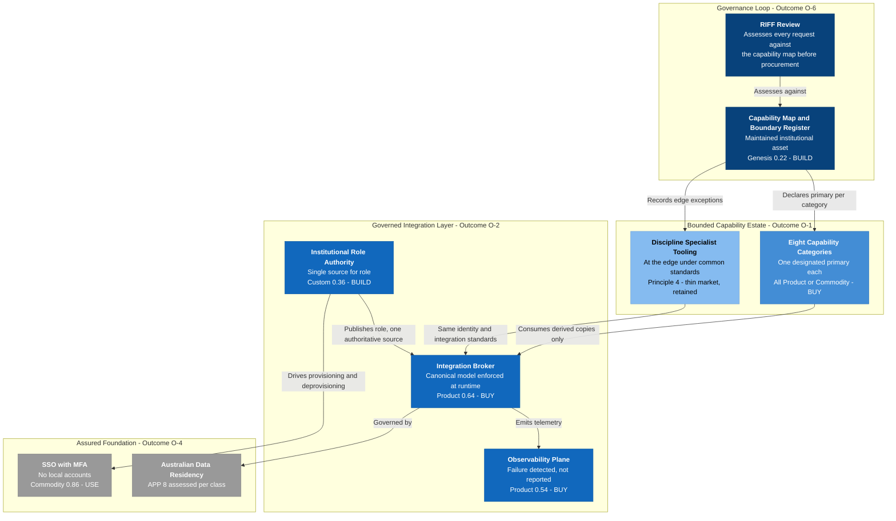
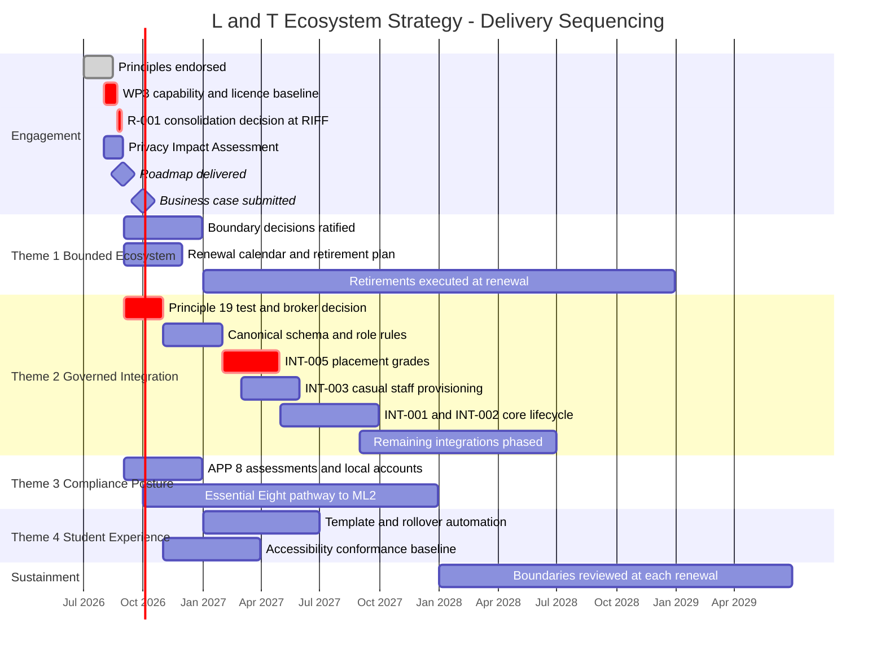

# Architecture Strategy: Learning & Teaching Ecosystem

> **Template Origin**: Official | **ArcKit Version**: 6.7.4 | **Command**: `/arckit:strategy`

## Document Control

| Field | Value |
|-------|-------|
| **Document ID** | ARC-001-STRAT-v1.0 |
| **Document Type** | Architecture Strategy |
| **Project** | Learning & Teaching Baseline Strategy (Project 001) |
| **Classification** | OFFICIAL |
| **Status** | DRAFT |
| **Version** | 1.0 |
| **Created Date** | 2026-07-28 |
| **Last Modified** | 2026-07-28 |
| **Strategic Horizon** | 2026 – 2029 (three years) |
| **Review Cycle** | Quarterly |
| **Next Review Date** | 2026-08-27 |
| **Owner** | Cassandra "Cas" Rhodes, Chief Information Officer |
| **Reviewed By** | [PENDING] |
| **Approved By** | [PENDING] — Steering Committee, endorsed by Education Committee |
| **Distribution** | University Executive; Steering Committee; Education Committee; Operations Committee; Digital & IT; Learning Innovation |

## Revision History

| Version | Date | Author | Changes | Approved By | Approval Date |
|---------|------|--------|---------|-------------|---------------|
| 1.0 | 2026-07-28 | ArcKit AI | Initial creation from `/arckit:strategy` command — synthesis of principles, stakeholders, Wardley map, decisions, business case and risk register | [PENDING] | [PENDING] |

> **On notation.** This document uses **calendar years and Australian dollars**, consistent with every other artifact in this project. The University of Funk is an Australian institution: UK financial-year notation, HM Treasury spending controls, GDS phases, the Technology Code of Practice and G-Cloud have no standing here and are not used. The applicable instruments are the **Privacy Act 1988**, the **ASD Essential Eight**, and the University's **RIFF Review** governance.

---

## Executive Summary

### Strategic Vision

The University's Learning & Teaching technology estate grew tool by tool over roughly a decade. Every acquisition was reasonable at the time; none was assessed against the estate as a whole. The result is more than twenty tools across eight capability categories [CT-C1], capability licensed more than once, integrations that fail silently, functionality paid for and never switched on, and a student experience that changes shape between schools.

**The strategy is to make the estate deliberate.** Not smaller for its own sake — *declared*. Every capability category gets a designated primary platform. Every remaining overlap becomes a recorded decision with either a defined boundary or a retirement date. Discipline-specific tooling is protected by architectural principle rather than by case-by-case advocacy, and is held to the same identity, integration, accessibility and privacy standards as everything else.

Beneath that, the manual and batch integration estate is replaced by a governed, event-driven layer built on a canonical data model — because the estate's fragility findings and its privacy findings are the same findings, and one remediation closes both. Around it, the RIFF review is given the architectural evidence base it currently lacks, so that the pattern which produced this estate does not simply produce it again.

### Strategic Context

| Dimension | Position |
|-----------|----------|
| **Business challenge** | Undeclared duplication, fragile integration, live compliance exposure — all long-standing, all now measured for the first time |
| **Opportunity** | The architectural work is complete and paid for. Acting on it now costs far less than reproducing it later, and the analysis has a shelf life |
| **Investment** | **AUD $2.4M – $4.2M** over three years (ROM ±50%). See `ARC-001-SOBC-v1.0` for the full economic case |
| **Risk appetite** | **Not formally established.** `ARC-001-RISK` §G proposes thresholds for Executive endorsement and marks them PROVISIONAL. Until endorsed, "exceeds appetite" carries no governance trigger — this is itself an action (§Governance) |
| **Stakeholder alignment** | **MEDIUM.** Strong agreement on the problem; documented disagreement on the solution, concentrated in one decision (R-001) |

### The Finding That Shapes This Strategy

`ARC-001-WARD-001` mapped all eight capability categories against evolution. Every one sits at Product or Commodity; mean differentiation pressure across the eight is **0.259**, and not one exceeds 0.35.

> **There is no differentiation anywhere in the University's platform estate.**

That single result reframes the engagement's most contested question. The consolidation-versus-best-of-breed argument — risk R-001, residual 16, the highest-scoring strategic risk in the register — is being conducted entirely over Product-stage components. Whichever side wins, no lasting advantage accrues, because the capability purchased is broadly the same capability whoever supplies it.

**This does not make the decision unimportant.** It makes it a **cost and operability decision rather than a strategic one** — which is a materially different thing to take to the Education Committee, and a considerably easier thing to decide. Arguments about pedagogy and vendor philosophy are hard to settle. Arguments about duplicate licence cost and support surface are settled with a capability baseline.

And it relocates the strategy's centre of gravity. If no platform carries differentiation, the components that do must be elsewhere. They are: **integration and governance** — six Custom and Genesis components that must be built, that no market will supply, and that **nobody is arguing about**.

### Key Strategic Decisions

All six are already recorded in project artifacts. This document consolidates rather than creates them.

| # | Decision | Position | Source |
|---|----------|----------|--------|
| SD-1 | **Consolidation model** | **Bounded, not total.** Consolidate the general case to a designated primary per category; permit discipline tooling at the edge under common standards | REQ Conflict C-1 Option 3; STKE Conflict 1; WARD §2 — three methods, one answer |
| SD-2 | **Integration mediation** | **Central broker** holding the canonical schema, enforced at runtime rather than by convention | ADR-001 Option B (Proposed, 3 conditions) |
| SD-3 | **Role authority** | **Dedicated composing service** deriving role from SIS enrolment and HR appointment | ADR-002 Option C (Proposed, 4 conditions) |
| SD-4 | **Build vs buy** | **Build only at Custom and Genesis; buy at Product; consume Commodity as utility.** One build, one buy, everything else exists | WARD §3, validated with no contradictions |
| SD-5 | **Canonical model basis** | **Derive from published standards** — 1EdTech OneRoster, LTI 1.3 NRPS — not from a blank page | WARD §3 |
| SD-6 | **Retirement timing** | **Sequenced to the contract renewal calendar**, never mid-term | SOBC §C1.4; risk R-005 |

### Strategic Outcomes

The six outcomes from `ARC-001-STKE`, with the measures their owners already accepted. **No new metrics are invented here.**

| # | Outcome | KPI | Baseline | Target |
|---|---------|-----|----------|--------|
| O-1 | Rationalised, deliberately bounded ecosystem | Capability categories with declared primary and boundary | **0 of 8** | 8 of 8 |
| O-2 | Reliable, governed integration | Production flows requiring a manual step | **4 of 7** | 0 |
| O-3 | Licence spend contained while gaps close | Annual licence spend vs baseline | ⚠️ **Baseline not established** | Flat or reduced |
| O-4 | Demonstrable privacy and security posture | Data classes assessed; strategies at ML2 | **0 of 8 assessed** | 8 of 8; ML2 pathway documented |
| O-5 | Consistent, accessible student experience | Template conformance; WCAG 2.2 AA verification | No template in force | Majority conformance; all platforms assessed |
| O-6 | Governance that prevents recurrence | Requests assessed against capability map before procurement | **0%** | 100% |

---

## Strategic Drivers

### Business Drivers

Drawn from `ARC-001-STKE` — sixteen named stakeholders, sixteen drivers.

| Driver | Stakeholder | Type | Strategic imperative | Intensity |
|--------|-------------|------|---------------------|-----------|
| SD-1 | Prof. Otis Hammond (DVC-E) | STRATEGIC | A defensible L&T strategy that survives scrutiny | HIGH |
| SD-2 | Cassandra Rhodes (CIO) | OPERATIONAL | Eliminate fragility; reach Essential Eight ML2 | **CRITICAL** |
| SD-3 | Vernon Ostinato (CFO) | FINANCIAL | Contain licence spend | HIGH |
| SD-4 | A/Prof. Pearl Clavinet (Dean L&T) | STRATEGIC | Academic credibility of the architecture | HIGH |
| SD-8 | Dr. Felix Marimba (Academic Lead) | STRATEGIC | The 412-response survey must visibly matter | HIGH |
| SD-11 | Eleanor Frame (Privacy) | COMPLIANCE | APP compliance and breach readiness | **CRITICAL** |
| SD-16 | Jazmin Field (Student Guild) | STRATEGIC | Consistency and accessibility | HIGH |

### External Drivers

| Driver | Source | Effect on strategy |
|--------|--------|-------------------|
| Privacy Act 1988 and the APPs | OAIC | Four data classes disclosed offshore with no APP 8 assessment. Non-discretionary |
| ASD Essential Eight, ML2 by end 2027 | Digital & IT target | Estate largely ML1. A pathway not started in 2026 will not complete |
| Contract renewal calendar | Vendors | Rationalisation is only executable at renewal points. Missed renewals wait a full term |
| Capture commoditising into collaboration platforms | Market | WARD §5 predicts Learning Capture 0.66 → 0.76 in 24 months. The market will answer the consolidation question if the University does not |
| TEQSA assessment integrity expectations | Regulator | Who holds a marker role is an assessment control, not only an IT control |

### Stakeholder Alignment

**Overall: MEDIUM.** Alignment on the problem is unusually strong — nobody disputes the estate is fragmented, the integrations fragile, or licensed capability unused. Alignment on the *solution* is materially weaker, and the fault line is singular and documented.

| Position | Held by | Resolution |
|----------|---------|-----------|
| Consolidate onto a single vendor platform | Rhodes (SD-2) | **Partly met** by SD-1: general case consolidates, support and security surface reduces materially |
| Retain best-of-breed pedagogical tooling | Moog (SD-6), Key (SD-13) | **Partly met** by SD-1: discipline capability protected by Principle 4 — a stronger position than case-by-case advocacy, with the obligation that specialist tools meet common standards |

> **A quieter risk worth Executive attention.** The compliance stakeholders — Frame (Privacy) and Ohm (Cybersecurity) — hold MEDIUM formal influence but **effective veto**. An unresolved APP 8 finding or an unremediated local-account exception can stop a platform decision late, after the business case is written. CSF-3 exists to prevent exactly that.

---

## Guiding Principles

Nineteen principles in `ARC-000-PRIN-v1.0`. The strategy is the executable form of all of them; nine bear directly.

### Foundational

| # | Principle | Criticality | Strategic implication |
|---|-----------|-------------|----------------------|
| 2 | Deliberate Capability Boundaries | **CRITICAL** | The mechanism of the whole strategy. Duplication is not wrong; *undeclared* duplication is |
| 4 | Discipline Specialisation at the Edge | MEDIUM | What makes bounded consolidation endorsable where total consolidation is not |
| 5 | Single Source of Truth for Core Entities | **CRITICAL** | Governs ADR-002; the reason LMS-as-hub was rejected in ADR-001 |

### Technology

| # | Principle | Criticality | Strategic implication |
|---|-----------|-------------|----------------------|
| 6 | Canonical Data Model | HIGH | Converts an N×N integration problem into N×1 and makes platform substitution tractable |
| 10 | Interface-Mediated Integration | **CRITICAL** | Prohibits the flat-file and manual mechanisms that produced the current estate |
| 11 | Event-Driven and Near-Real-Time by Default | HIGH | Ends the 24-hour access-state lag |
| 12 | Automated Identity Lifecycle | **CRITICAL** | Ends manual CSV provisioning for casual and sessional staff |

### Governance

| # | Principle | Criticality | Strategic implication |
|---|-----------|-------------|----------------------|
| 18 | Evidence-Based Capability Investment | **CRITICAL** | RIFF operating on a maintained capability map — Outcome O-6 |
| 19 | Realise Licensed Capability Before New Spend | HIGH | A condition on every acquisition. Constrains both ADR-001 and ADR-002 |

### Principles Compliance Summary

| Assessment | Result |
|-----------|--------|
| Principles the strategy advances | 19 of 19 |
| Principles with a CRITICAL rating directly delivered | 6 of 7 |
| Principles currently breached by the estate | **3** — Principle 10 (flat-file exchange), Principle 12 (manual provisioning), Principle 16 (two platforms permit local accounts) |
| Exceptions sought by this strategy | **None** |

---

## Current State Assessment

### Technology Landscape

| Dimension | Position |
|-----------|----------|
| Platforms | 20+ across 8 capability categories [CT-C1] |
| Declared capability boundaries | **0 of 8** |
| Known integrations | 7, of which **4 involve manual handling or flat-file transfer** [SL-C1] |
| Canonical data model | Defined (20 entities, 178 attributes) — **not yet implemented** |
| Personal information classes | 8, of which **4 disclosed offshore with no APP 8 assessment** |
| Essential Eight | Largely **ML1** against an **ML2** target for end 2027 [PC-C1] |
| Authentication | SSO with MFA enforced — **two platforms still permit local accounts** |

### Capability Maturity Baseline

> ⚠️ **No formal capability maturity model exists for the L&T estate.** Producing one is a WP3 deliverable. What follows is the maturity evidence that *does* exist, from two independent assessments — presented as such rather than as a substitute.

**Doctrine maturity** (`ARC-001-WARD-001` §7, scored 1–5 against Wardley's doctrine set):

| Area | Score | Assessment |
|------|-------|-----------|
| Challenge assumptions | **5** | Embedded — dissent recorded rather than suppressed; provisional judgements labelled |
| Bias towards open | **5** | Embedded — conflicts published with named holders |
| Common language, know your users, focus on user needs | 4 | Established |
| Know the details | 3 | Emerging — **licence spend and support effort are not baselined** |
| Use standards | 3 | Emerging — canonical model has no declared standards basis |
| **Manage inertia** | **2** | **Weakest** — three inertia points identified, none challenged |
| **Commit to direction** | **2** | Weak — everything is Proposed, provisional, or routed to a forum |

**Security maturity** (Essential Eight, from `privacy-context.md`): 2 of 8 strategies at the ML2 target; 5 at ML1; 1 at ML0.

**The two weak doctrine scores are the same weakness.** This is an organisation that has done excellent analysis and has not yet converted any of it into an irreversible decision. Defensible at this point in an engagement; it stops being defensible on 31 August.

### Technical Debt Summary

| Debt | Evidence | Risk |
|------|----------|------|
| Nightly batch as the change-propagation mechanism | Access state wrong for up to 24 hours [PC-C2] | R-006 (15) |
| Sensitive placement grades re-keyed by hand | *"Error-prone; audit concerns"* [SL-C2] | R-008 (16), R-018 (16) |
| Course cloning on undocumented single-person scripts | Control effectiveness recorded as **"None effective"** | R-007 (12) |
| Casual and sessional provisioning by manual CSV | Access late or persisting after engagement ends | R-009 (12) |
| Two platforms permitting local accounts | Breaches REQ-031 directly | R-019 (12) |
| Lab fleets and capture appliances outside patching regimes | Holds two Essential Eight strategies at ML1 | R-020 (9) |

### SWOT

| | Helpful | Harmful |
|---|---------|---------|
| **Internal** | **Strengths** — completed architectural baseline (requirements, data model, two decisions, strategic map); unusually strong transparency doctrine; 412-response survey mandate; RIFF process already designed | **Weaknesses** — no licence or effort baseline; delivery capacity unproven (R-007); Phase III inertia management weakest doctrine area; 11 of 29 risks have no effective control |
| **External** | **Opportunities** — renewal calendar creates natural retirement points; capture commoditising toward existing licensed platforms; sector co-creation on integration unexplored (CAUDIT) | **Threats** — live APP 8 exposure; Essential Eight deadline; market may answer the consolidation question first; vendor cooperation not guaranteed (R-011) |

---

## Target State Vision

### Future Architecture

An estate where **every capability category has a named primary**, overlaps are declared decisions rather than accidents, and discipline tooling sits at the edge under common standards. Beneath it, a single mediating layer carries every change event against a canonical model enforced at runtime. Around it, RIFF assesses each new request against a maintained capability map — so the pattern that produced the current estate cannot silently reproduce it.

### Architecture Vision Diagram

### Capability Maturity Targets

| Dimension | Baseline (2026) | Target (2029) | Measure |
|-----------|----------------|---------------|---------|
| Declared capability boundaries | 0 of 8 | **8 of 8** | Capability map and decisions register |
| Manual steps in production PI flows | 4 of 7 | **0** | Integration register |
| Personal information classes assessed | 0 of 8 | **8 of 8** | PIA |
| Essential Eight strategies at ML2 | 2 of 8 | **8 of 8** | E8 posture assessment |
| Doctrine — manage inertia | 2 | **4** | Re-assessed at re-map |
| Doctrine — commit to direction | 2 | **4** | Decisions Accepted, not Proposed |

---

## Technology Evolution Strategy

### Strategic Positioning

From `ARC-001-WARD-001`. **The estate contains no Genesis or Custom platform component** — the only components left of 0.50 are integration and governance.

| Evolution band | Components | Strategic action |
|---------------|-----------|------------------|
| **Genesis (< 0.25)** | Capability Map and Boundary Register (0.22) | **Build.** The least evolved component on the map — and the one gating the biggest decision |
| **Custom (0.25–0.50)** | Course Rollover Automation (0.26), Placement Outcome Exchange (0.28), Role Authority (0.36), Canonical Data Model (0.38), Architecture Review Gate (0.36) | **Build.** Where all the University's differentiation lives |
| **Product (0.50–0.75)** | All eight capability categories; Integration Broker (0.64); Observability (0.54); SIS, Timetabling, AV estate | **Buy.** No lasting advantage from choosing well among mature products |
| **Commodity (> 0.75)** | Collaboration (0.78), SSO with MFA (0.86), SaaS hosting (0.90) | **Consume as utility.** Duplicating a commodity is the least defensible duplication of all |

### Build vs Buy Decisions

| Decision | Components | Rationale |
|----------|-----------|-----------|
| **BUILD** (6) | Role Authority, Canonical Data Model, Course Rollover Automation, Placement Outcome Exchange, Capability Map, Architecture Review Gate | Custom/Genesis; no market supplies them; they carry the differentiation |
| **BUY** (13) | Eight capability platforms, Integration Broker, Observability, SIS, Timetabling, AV estate | Product stage with mature markets |
| **USE** (3) | Collaboration, SSO with MFA, SaaS hosting | Commodity — never build |

**Validation**: no commodity component is being built; no custom component is being bought. Metrics and sourcing decisions are consistent with zero contradictions across 26 components.

### Technology Radar

| Ring | Items |
|------|-------|
| **ADOPT** | Event-driven publish/subscribe for change propagation · Canonical data model governing all integrations · LTI 1.3 Advantage · Institutional SSO with MFA · Australian-region SaaS hosting |
| **TRIAL** | Central integration broker — **pending the Principle 19 test** (ADR-001 Condition 1) · Institutional Role Authority service (ADR-002) · Standards-derived canonical model (OneRoster, LTI NRPS) |
| **ASSESS** | Identity Governance product — deferred, not rejected (ADR-002 Condition 2) · Sector co-creation on the integration layer via CAUDIT · Opex room-capture licensing models |
| **HOLD** | Nightly batch for change propagation · Manual CSV provisioning · LTI 1.1 as a target-state path · Local accounts · Flat-file exchange over shared storage · Point-to-point integration |

---

## Strategic Themes

Four themes. Outcome O-3 (spend contained) is deliberately **not** a theme — it is a financial test applied across all four, and treating it as a workstream would imply someone can deliver savings independent of the boundaries that create them.

### Theme 1 — Bounded Ecosystem

| | |
|---|---|
| **Objective** | Every capability category has a declared primary and a recorded position on every overlap |
| **Outcomes** | O-1, O-6 |
| **Principles** | 2 (CRITICAL), 4, 18, 19 |
| **Key initiatives** | WP3 capability baseline · boundary decisions at RIFF with published criteria · renewal calendar · retirement sequencing · capability map as a maintained asset |
| **Success criteria** | 8 of 8 categories with declared primary and boundary; 100% of new requests assessed against the map |
| **Critical dependency** | **The WP3 baseline, due 21 August 2026** |

### Theme 2 — Governed Integration

| | |
|---|---|
| **Objective** | Identity, enrolment, role and grade changes propagate automatically, with no manual step in any production flow carrying personal information |
| **Outcomes** | O-2 |
| **Principles** | 5, 6, 10, 11, 12, 13, 17 |
| **Key initiatives** | Integration broker (ADR-001) · role authority (ADR-002) · canonical model from standards · nine integrations sequenced by failure cost · observability plane |
| **Success criteria** | 0 manual steps in production PI flows; propagation within 15 minutes; failures detected by monitoring rather than user report |
| **Sequencing** | **INT-005 placement grades first** — it closes an operational, a compliance and a reputational risk simultaneously |

### Theme 3 — Demonstrable Compliance Posture

| | |
|---|---|
| **Objective** | Every personal-information class carries an assessed position; a documented pathway to Essential Eight ML2; no unremediated authentication exception |
| **Outcomes** | O-4 |
| **Principles** | 7, 8, 12, 16 |
| **Key initiatives** | PIA across 8 data classes · APP 8 cross-border assessments · Essential Eight pathway per strategy · local-account remediation · NDB playbook tabletop |
| **Success criteria** | 8 of 8 classes assessed; ML2 pathway documented for all eight strategies; zero local accounts |
| **Note** | **R-017's score reflects uncertainty, not known harm.** Completing the PIA is the cheapest score reduction available in the register |

### Theme 4 — Consistent Accessible Experience

| | |
|---|---|
| **Objective** | Students reach all materials through a single entry point, with consistent structure and verified accessibility regardless of school |
| **Outcomes** | O-5 |
| **Principles** | 1, 3, 14 |
| **Key initiatives** | Baseline unit-site template · rollover automation · WCAG 2.2 AA conformance baseline · student representative validation |
| **Success criteria** | Majority template conformance with justified exceptions; all student-facing platforms assessed |
| **⚠️ Known weakness** | `ARC-001-TRAC` §4.3 found **NFR-U-002 (accessibility) governed by a single data-model reference** — thinner than a MUST requirement with legal weight warrants. Action T-2 |

---

## Delivery Sequencing

> ⚠️ **No consolidated roadmap artifact exists.** `/arckit:roadmap` has not been run for this project. What follows synthesises the phasing already recorded in `ARC-001-SOBC` §E2, the engagement milestones in `ARC-001-REQ`, and the implementation plans in ADR-001 and ADR-002. **It is a summary of existing commitments, not a new plan**, and it should be superseded by a proper ROAD artifact.

### Strategic Timeline

### Phase Summary

| Phase | Period | Focus | Gate |
|-------|--------|-------|------|
| 0 — Conditions | Aug–Sep 2026 | Baseline, R-001 decided, register corrected, Principle 19 test | Business case approved |
| 1 — Foundations | Q4 2026 | Broker confirmed; canonical schema; role rules published | ADR conditions satisfied |
| 2 — Highest leverage | Q1–Q2 2027 | INT-005 placement, INT-003 casual provisioning | First cutover survives a teaching period |
| 3 — Core lifecycle | Q2–Q3 2027 | INT-001 SIS lifecycle, INT-002 role assignment | Propagation within 15 minutes |
| 4 — Rationalisation | 2027–2028 | Retirements at renewal points | Spend position evidenced |
| 5 — Sustainment | 2028+ | Boundaries reviewed at each renewal via RIFF | O-6 sustained |

**Sequencing principle**: no cutover in a teaching period; assessment periods carry change freezes (NFR-A-002).

---

## Investment Summary

| | |
|---|---|
| **Total envelope** | **AUD $2.4M – $4.2M** over three years (ROM ±50%) |
| **With optimism-bias benchmark** | AUD $3.4M – $5.9M |
| **Horizon** | 2026 – 2029 |
| **Shape** | Roughly two thirds one-off integration and governance investment; one third recurring platform and support |
| **Front-loading** | 55–60% of one-off cost falls in Year 1 |

**See `ARC-001-SOBC-v1.0` for the full economic case.** That document deliberately contains **no NPV, BCR or payback figure**, and §B4 explains why: the licence-spend baseline those calculations depend on is a WP3 output that does not yet exist. Costs are estimable from scope; benefits are not, because the two financially material ones are differences against a baseline nobody has measured.

> **This is the strategy's central financial honesty.** Two cost lines increase and can be banded. Two benefit lines decrease and cannot. That asymmetry is not a drafting weakness — it is the actual state of the University's knowledge about its own estate, and correcting it is the first condition of approval.

---

## Strategic Risks

From `ARC-001-RISK` — 29 risks, 5 exceeding the proposed appetite, **11 with no effective control today**.

| ID | Risk | Residual | Appetite | Mitigation | Owner |
|----|------|----------|----------|-----------|-------|
| R-018 | Sensitive placement data handled manually | **16** | ❌ Exceeds | Sequence INT-005 first; escalate to Steering now | Eleanor Frame |
| R-017 | APP 8 offshore disclosures unassessed | **16** | ❌ Exceeds | Complete the PIA — cheapest score reduction available | Eleanor Frame |
| R-008 | Placement grades re-keyed by hand | **16** | ❌ Exceeds | INT-005 remediation | Prof. Priya Anand |
| R-001 | Consolidation decision unresolved | **16** | ❌ Exceeds | Decision deadline set to land **immediately after** the WP3 baseline | Prof. Otis Hammond |
| R-006 | Integration estate fragility | **15** | ❌ Exceeds | ADR-001 broker; phased by failure cost | Cassandra Rhodes |
| R-013/R-014 | Spend cannot hold flat / integration uplift unfunded | 9 / 8 | ✅ Within | Separate capital from recurring; quantify unconfigured capability first | Vernon Ostinato |
| R-007 | Single-person dependency on cloning automation | 12 | ✅ Within | **Control effectiveness "None effective"** — document, version-control, train a second operator | Sam Okafor |

### Three Observations for the Executive

**1. Three of the top five are one defect.** R-008 (operational), R-018 (compliance) and R-023 (reputational) all trace to placement outcomes moving by hand. **Remediating INT-005 closes three risks at once** — the highest-leverage single action available.

**2. R-001 is stuck for a diagnosable reason.** It cannot be mitigated by more analysis. `ARC-001-WARD-001` §6 found why: the capability map is the **least evolved component in the landscape** and it is what the decision depends on. The fix is sequencing — set the deadline to land immediately after the baseline, and publish both dates together.

**3. The appetite thresholds have no standing yet.** `ARC-001-RISK` §G proposes them and marks them PROVISIONAL. Until the Steering Committee endorses or substitutes them, every "exceeds appetite" judgement above is an architectural recommendation with no formal escalation trigger.

### Assumptions and Constraints

| # | Assumption | If invalid |
|---|-----------|-----------|
| A-1 | WP3 baseline deliverable by 21 August 2026 | Financial case incomplete; strategy reduces to Themes 2 and 3 only |
| A-2 | No costing baseline exists today; all figures are ROM bands | Option ranking is robust to this; absolute figures are not |
| A-3 | HR can associate appointments with unit offerings | ADR-002 fallback applies; Theme 2 design changes |
| A-4 | Renewal dates permit retirement without break costs | Theme 1 savings deferred by up to a full contract term |
| A-5 | Delivery capacity can be sustained post-engagement | **R-007 is the evidence against this.** ADR-002 Condition 4 is the control |

**Constraints**: 31 August 2026 roadmap deadline, fixed · September 2026 business case · end-2027 Essential Eight ML2 target · contract renewal calendar · no cutover during teaching periods.

---

## Success Metrics

### Strategic KPIs

Adopted verbatim from the outcome KPIs in `ARC-001-STKE`, so success is measured against definitions the stakeholders already own.

| KPI | Baseline 2026 | Target 2027 | Target 2029 | Owner |
|-----|--------------|-------------|-------------|-------|
| Capability categories with declared primary and boundary | 0 of 8 | 8 of 8 | 8 of 8 sustained | Dr. Benny Moog |
| Production flows requiring a manual step | 4 of 7 | 2 of 7 | **0** | Sam Okafor |
| Personal information classes assessed | 0 of 8 | **8 of 8** | 8 of 8 sustained | Eleanor Frame |
| Essential Eight strategies at ML2 | 2 of 8 | 5 of 8 | **8 of 8** | Tobias Ohm |
| Requests assessed against the capability map | 0% | 100% | 100% | Dr. Benny Moog |
| Annual licence spend vs baseline | ⚠️ **Not established** | Baseline + tracking | Flat or reduced | Grace Tanaka |
| Student-facing platforms with verified WCAG 2.2 AA | Not verified | All assessed | Conformant or dated plan | A/Prof. Pearl Clavinet |

### Leading Indicators

- WP3 baseline delivered on 21 August — **the single best predictor of everything downstream**
- Decisions moving from **Proposed to Accepted** (ADR-001, ADR-002) — the doctrine weakness made measurable
- Manual steps eliminated per quarter
- Integration failures detected by monitoring rather than by user report
- Boundary decisions **resolved** rather than deferred at RIFF

### Lagging Indicators

- Platform count reduction at 12 and 24 months
- Propagation latency for identity and enrolment changes
- New solution requests rejected at RIFF for duplicating licensed capability
- Grade administration error rate in placement units
- Survey requirements visibly traced into delivered outcomes (BR-008)

---

## Governance Model

| Forum | Frequency | Participants | Decision rights |
|-------|-----------|--------------|-----------------|
| **Steering Committee** | Fortnightly | Hammond (chair), Rhodes, Clavinet, Ostinato | Strategy direction; risk escalation; appetite endorsement |
| **RIFF Review** | Per request | Digital & IT, Learning Innovation, requestor | Capability duplication; architectural fit; boundary decisions |
| **Education Committee** | Per cycle | Clavinet (chair), academic representatives | Academic endorsement of principles and boundaries |
| **Operations Committee / University Executive** | Per threshold | Executive | Financial and strategic approval |

**Escalation path**: RIFF → Education Committee → Operations Committee → University Executive [SGP-C1].

> ⚠️ **Two governance gaps carried from other artifacts.**
>
> 1. **Student Administration and Human Resources are joint business owners of institutional role data and appear in no governance forum** — neither is in the sixteen-name stakeholder register. Theme 2 cannot proceed without them (ADR-002 §2.2).
> 2. **The financial thresholds triggering Operations Committee versus Executive approval are not documented anywhere** available to this engagement. The CFO should confirm them before the September submission (SOBC §D2).

---

## Traceability

### Driver → Goal → Outcome → Theme → Principle → KPI

| Driver | Goal | Outcome | Theme | Principle | KPI |
|--------|------|---------|-------|-----------|-----|
| SD-2 Rhodes — eliminate fragility | G-3 | O-2 | 2 Governed Integration | 10, 11 | Manual steps: 4 → 0 |
| SD-2 Rhodes — reach ML2 | G-8 | O-4 | 3 Compliance Posture | 16 | E8 at ML2: 2 → 8 |
| SD-3 Ostinato — contain spend | G-7 | O-3 | Cross-cutting | 19 | Spend vs baseline |
| SD-6 Moog / SD-13 Key — protect pedagogy | G-4 | O-1 | 1 Bounded Ecosystem | 2, 4 | Declared boundaries: 0 → 8 |
| SD-7 Okafor — sustainable architecture | G-3 | O-2 | 2 Governed Integration | 6, 13 | Failures detected by monitoring |
| SD-8 Marimba — survey must matter | G-5 | O-5 | 4 Student Experience | 18 | 35 of 35 requirements traced |
| SD-11 Frame — APP compliance | G-9 | O-4 | 3 Compliance Posture | 7, 8 | Data classes assessed: 0 → 8 |
| SD-16 Field — consistency, accessibility | G-10 | O-5 | 4 Student Experience | 1, 3, 14 | WCAG 2.2 AA verification |
| SD-1 Hammond — defensible strategy | G-6 | O-1 | All | 18 | Roadmap accepted 31 Aug |
| SD-4 Clavinet — academic credibility | G-1 | O-5 | 1, 4 | 2, 18 | Principles endorsed |

**Coverage**: 10 of 10 goals · 6 of 6 outcomes · 19 of 19 principles advanced · 16 of 16 stakeholder drivers represented.

### Source Documents

| Artifact | Contribution |
|----------|-------------|
| `ARC-000-PRIN-v1.0` | ✅ **MANDATORY** — 19 principles, decision framework |
| `ARC-001-STKE-v1.0` | ✅ **MANDATORY** — 16 drivers, 10 goals, 6 outcomes, 5 conflicts, CSFs |
| `ARC-001-WARD-001-v1.0` | ✅ Evolution positioning, sourcing validation, doctrine maturity, the §2 central finding |
| `ARC-001-SOBC-v1.0` | ✅ Investment envelope, options appraisal, delivery phasing |
| `ARC-001-RISK-v1.0` | ✅ 29 risks, appetite position, top-five analysis |
| `ARC-001-REQ-v1.0` | ✅ Conflicts C-1 and C-2, milestones, NFR targets |
| `ARC-001-ADR-001/002` | ✅ Integration mediation and role authority decisions |
| `ARC-001-DATA-v1.0` | ✅ Canonical model scope, joint data ownership |
| `ARC-001-TRAC-v1.0` | ✅ Coverage position, NFR-U-002 weakness |
| `ARC-001-DIAG-001-v1.0` | ✅ Integration target-state topology |
| **Architecture Roadmap** | ⚠️ **MISSING** — see Gaps |

### Gaps in the Evidence Base

| Gap | Effect | Remedy |
|-----|--------|--------|
| **No ROAD artifact** | Delivery sequencing is synthesised from three artifacts rather than consolidated in one. Dependencies between themes are not formally modelled | Run `/arckit:roadmap` |
| **No capability maturity model** | Current state assessed via doctrine and Essential Eight proxies only | WP3 deliverable |
| **No licence or effort baseline** | O-3 unfalsifiable; affordability unassessable | WP3, 21 August |
| **No approved risk appetite** | Appetite exceedances have no formal escalation trigger | Steering Committee endorsement |

---

## Next Steps

### Immediate — 30 days

1. **Deliver the WP3 capability and licence baseline (21 August).** The critical path for the business case, for R-001, and for closing the 11 requirement-coverage gaps in `ARC-001-TRAC` §4.1. **One deliverable, three consequences.** — Grace Tanaka, Dr. Benny Moog
2. **Set and publish the R-001 decision deadline to land immediately after the baseline.** — Prof. Otis Hammond
3. **Correct the stakeholder register; engage Student Administration and HR.** Blocks Theme 2. — Rhonda Bell
4. **Run the Principle 19 test jointly for ADR-001 and ADR-002.** One entitlement question, asked once. — Cassandra Rhodes
5. **Endorse or substitute the proposed risk appetite thresholds.** — Steering Committee

### Short-term — 90 days

6. Move ADR-001 and ADR-002 from **Proposed to Accepted**, or record why not — the *commit to direction* doctrine weakness made actionable
7. Give **NFR-U-002 accessibility** an architectural home (`ARC-001-TRAC` action T-2)
8. Build the **contract renewal calendar** and sequence Theme 1 against it
9. Confirm the **Operations Committee versus Executive financial threshold** with the CFO
10. Raise **ADR-003** for course cloning and rollover — R-007 has no effective control

### Recommended Follow-On Artifacts

| Command | Why |
|---------|-----|
| `/arckit:roadmap` | **The one genuine gap in this strategy's evidence base.** Would consolidate the sequencing synthesised in §Delivery |
| `/arckit:adr` | ADR-003 course cloning; ADR-004 accessibility conformance verification |
| `/arckit:dpia` | The PIA is a named deliverable for Theme 3 and gates several platform decisions |
| `/arckit:principles-compliance` | Would evidence the three current principle breaches and their remediation |

---

## External References

### Document Register

| Doc ID | Filename | Type | Source Location | Description |
|--------|----------|------|-----------------|-------------|
| CT | capability-taxonomy.md | Foundation artifact | `000-global/external/` | Eight capability categories |
| SL | system-landscape.md | Foundation artifact | `001-lt-ecosystem/external/` | Tool inventory and integration failure modes |
| PC | privacy-context.md | Compliance input | `001-lt-ecosystem/external/` | PI classes, APP 8 triggers, Essential Eight self-assessment |
| SGP | solution-governance-process.md | Foundation artifact | `000-global/policies/` | RIFF Review and escalation path |
| CB | consultant-brief.md | Engagement brief | `001-lt-ecosystem/external/` | Work packages, 31 August deadline |
| PRIN | ARC-000-PRIN-v1.0.md | ArcKit artifact | `000-global/` | 19 architecture principles |
| STKE | ARC-001-STKE-v1.0.md | ArcKit artifact | `001-lt-ecosystem/` | Drivers, goals, outcomes, conflicts |
| WARD | ARC-001-WARD-001-v1.0.md | ArcKit artifact | `001-lt-ecosystem/wardley-maps/` | Evolution, sourcing, doctrine |
| SOBC | ARC-001-SOBC-v1.0.md | ArcKit artifact | `001-lt-ecosystem/` | Investment case and phasing |
| RISK | ARC-001-RISK-v1.0.md | ArcKit artifact | `001-lt-ecosystem/` | 29 risks and appetite |
| TRAC | ARC-001-TRAC-v1.0.md | ArcKit artifact | `001-lt-ecosystem/` | Coverage and NFR-U-002 weakness |

### Citations

| Citation ID | Doc ID | Page/Section | Category | Quoted Passage |
|-------------|--------|--------------|----------|----------------|
| CT-C1 | CT | Header and table | Business Requirement | "Eight capability categories define the learning & teaching technology ecosystem. Every current and proposed tool is categorised against this taxonomy to enable cross-system comparison, duplication analysis and rationalisation decisions." |
| SL-C1 | SL | Known integrations | Risk Factor | "PeopleSoft → Blackboard ... Nightly batch flat-file / Fragile; role assignment failures; no intra-day sync"; "Echo360 user provisioning / LTI + manual CSV" |
| SL-C2 | SL | Known integrations | Risk Factor | "Sonia ↔ Blackboard grades (placements) / Manual re-keying / Error-prone; audit concerns" |
| PC-C1 | PC | §3 | Compliance Constraint | Essential Eight target "ML2 across the SaaS-heavy L&T estate by end 2027"; application control ML0; patch operating systems ML1 — "Lecture-theatre capture appliances behind" |
| PC-C2 | PC | §2 | Compliance Constraint | "Flat-files at rest on shared storage; stale de-provisioning (access persists up to 24h after withdrawal)" |
| SGP-C1 | SGP | Process flow and Rules | Procurement Constraint | Escalation path Education Committee → Operations Committee / University Executive; "Solutions duplicating capability already licensed ... must justify why the incumbent tool is unsuitable." |

### Unreferenced Documents

| Filename | Source Location | Reason |
|----------|-----------------|--------|
| requirements-register.md | `001-lt-ecosystem/external/` | Superseded by ARC-001-REQ; requirement-level traceability is carried in ARC-001-TRAC rather than restated here |
| stakeholders.md | `001-lt-ecosystem/external/` | Superseded by ARC-001-STKE, the mandatory prerequisite for this document |

---

**Generated by**: ArcKit `/arckit:strategy` command
**Generated on**: 2026-07-28
**ArcKit Version**: 6.7.4
**Project**: Learning & Teaching Baseline Strategy (Project 001)
**Model**: Claude Opus 5 (1M context)
**Generation Context**: Synthesis of both mandatory prerequisites (ARC-000-PRIN, ARC-001-STKE) plus ARC-001-WARD-001, ARC-001-SOBC, ARC-001-RISK, ARC-001-REQ, ARC-001-DATA, ARC-001-TRAC, ARC-001-DIAG-001 and both ADRs. No strategic decision in this document is new — all six key decisions and all six outcomes are consolidated from existing artifacts, per the command's synthesis-not-generation constraint. The recommended prerequisite **Architecture Roadmap is absent**; delivery sequencing is synthesised from SOBC §E2, REQ milestones and the two ADR implementation plans, and is flagged as requiring a proper ROAD artifact. Investment figures reference ARC-001-SOBC without duplicating its economic case; NPV and payback remain deliberately deferred there for stated reasons. Calendar-year and AUD notation used throughout; UK Government instruments replaced with Privacy Act 1988, ASD Essential Eight and RIFF governance.

<!-- arckit-provenance:start -->

## Build Provenance

*Stamped automatically by the ArcKit plugin's `provenance-stamp.mjs` PostToolUse hook. Complements (does not replace) the human-authored footer above. Carries only fields the model can't authoritatively self-report: build context from `.arckit/state.json` and effort levels derived from command frontmatter + the silent-downgrade matrix.*

| Field | Value |
|-------|-------|
| Requested Effort | `max` |
| Effective Effort | _unknown — model not parsed from existing footer_ |
| Stamped at | 2026-07-28T11:39:06.742Z |

<!-- arckit-provenance:end -->
