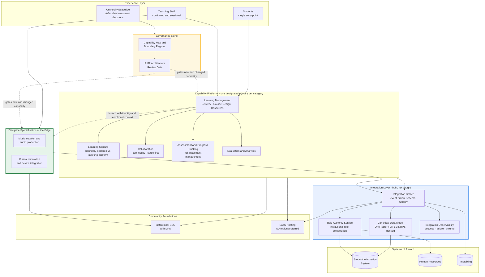
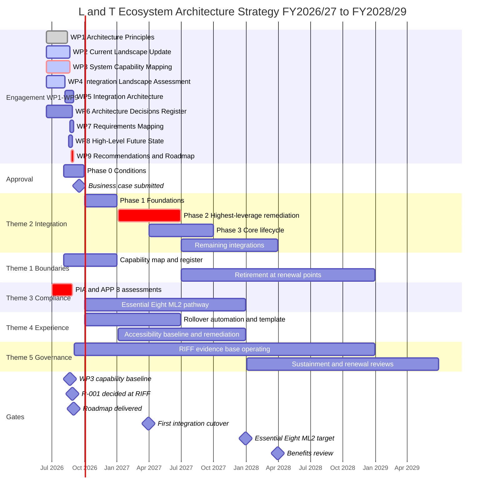

# Architecture Strategy: Learning & Teaching Ecosystem

> **Template Origin**: Official | **ArcKit Version**: 6.7.5 | **Command**: `/arckit:strategy`

## Document Control

| Field | Value |
|-------|-------|
| **Document ID** | ARC-001-STRAT-v1.0 |
| **Document Type** | Architecture Strategy |
| **Project** | 001-lt-ecosystem — Learning & Teaching Baseline Strategy (The University of Funk) |
| **Classification** | OFFICIAL |
| **Status** | DRAFT |
| **Version** | 1.0 |
| **Created Date** | 2026-07-29 |
| **Last Modified** | 2026-07-29 |
| **Review Cycle** | Quarterly |
| **Next Review Date** | 2026-08-28 |
| **Owner** | Prof. Otis Hammond, Deputy Vice-Chancellor (Education) — Executive Sponsor and Senior Responsible Owner |
| **Reviewed By** | [PENDING] — Cassandra "Cas" Rhodes, Chief Information Officer; A/Prof. Pearl Clavinet, Chair Education Committee |
| **Approved By** | [PENDING] — Steering Committee, on recommendation of RIFF Review |
| **Distribution** | University Executive; Steering Committee; Education Committee; Operations Committee; Digital & IT; Learning Innovation; School and Faculty leadership |

## Revision History

| Version | Date | Author | Changes | Approved By | Approval Date |
|---------|------|--------|---------|-------------|---------------|
| 1.0 | 2026-07-29 | ArcKit AI | Initial creation from `/arckit:strategy` command — executive synthesis of ARC-000-PRIN, ARC-001-STKE, ARC-001-WARD-001, ARC-001-SOBC, ARC-001-REQ and ARC-001-RISK, aligned to the WP1–WP9 engagement shape | [PENDING] | [PENDING] |

---

## Executive Summary

### Strategic Vision

The University of Funk will operate a **deliberately bounded** Learning & Teaching technology ecosystem: every capability category has a designated primary platform, every remaining overlap is a declared and justified decision, and discipline-specific tooling is permitted at the edge under common identity, integration, accessibility and privacy standards. The ecosystem's twenty-plus tools grew tool by tool over roughly a decade [CT-C1], each acquisition reasonable at the time and none assessed against the estate as a whole. This strategy does not propose to shrink the estate for its own sake. It proposes to make the estate a set of decisions rather than an accumulation of them.

The strategy's central finding is uncomfortable and useful in equal measure. All eight capability categories sit at Product or Commodity evolution, with mean differentiation pressure of 0.259 — **no platform choice available to the University buys a lasting advantage**. The consolidation-versus-best-of-breed argument that dominates the engagement is therefore a cost and operability decision, not a strategic one. Where advantage is genuinely available is in six components nobody is arguing about: the canonical data model, automated identity and role lifecycle, course rollover automation, the placement outcome exchange, the architecture review gate, and the capability and boundary register. Every one of them must be built, and none of them is being contested.

Success by the end of the horizon looks like this: a student reaches all unit materials, activities and grades through one consistent, accessible entry point regardless of school [RR-C1]; a change to enrolment or role propagates in near-real time rather than overnight; sensitive placement information moves through governed integration rather than by hand and email [SL-C1]; the RIFF Review assesses every new request against a maintained capability map rather than in isolation [SGP-C1]; and total licence spend holds flat or reduces while Must-priority capability gaps close [RR-C2]. The engagement's terminal deliverable — a prioritised roadmap due 31 August 2026, feeding the September business case [CB-C1] — is the mechanism by which this strategy becomes funded work.

### Strategic Context

| Aspect | Summary |
|--------|---------|
| **Business Challenge** | Twenty-plus tools across eight capability categories with undeclared overlap; four of seven known integrations move personal information by manual re-keying or flat-file transfer [SL-C2]; licensed functionality never configured; inconsistent student experience across schools |
| **Strategic Opportunity** | Convert an accumulated estate into a governed one: declared boundaries per capability category, a canonical integration layer that makes platform substitution tractable, and a RIFF gate that prevents the duplication pattern recurring |
| **Investment Horizon** | 3 years — FY2026/27 to FY2028/29; AUD $2.4M – $4.2M (ROM ±50%) for the recommended option |
| **Expected ROI** | **Not stated.** NPV, BCR and payback are deliberately deferred to the Outline Business Case. The licence-spend baseline they depend on is a WP3 output that does not yet exist — see `ARC-001-SOBC` §B4 |
| **Risk Appetite** | **MEDIUM (provisional).** No approved institutional risk appetite statement exists; the thresholds in `ARC-001-RISK` §G are proposed for Executive endorsement. Every "exceeds appetite" judgement in this strategy is an architectural recommendation, not a governance finding |

### Key Strategic Decisions

| Decision | Choice | Rationale |
|----------|--------|-----------|
| Build vs Buy | **Hybrid — buy the platforms, build the joins** | All eight capability categories are Product or Commodity; no platform choice differentiates. The six Custom/Genesis components carrying differentiation pressure — canonical model, role lifecycle, rollover automation, placement exchange, review gate, capability register — have no market supplier and must be built |
| Cloud Strategy | **SaaS-consumed, Australian region preferred** | The estate is already SaaS-heavy and that is correct at these evolution stages. Australian residency is preferred under Principle 8; four personal-information classes disclose offshore and require APP 8 assessment before renewal [PC-C1] |
| Vendor Strategy | **Bounded multi-vendor** — one designated primary per capability category, discipline specialists permitted at the edge under common standards | The architectural outcome reached independently by three methods: Conflict C-1 Option 3 in the requirements, Conflict 1 resolution in the stakeholder analysis, and the Wardley evolution analysis. Convergence from different methods is a finding, not a compromise |
| Integration Approach | **Event-driven by default via a central broker, on a standards-derived canonical model; batch by recorded exception** | Change propagation for identity, enrolment, role and grade must be near-real-time [RR-C3]. The canonical model should derive from 1EdTech OneRoster and LTI 1.3 NRPS rather than a blank page — building at 0.20 what the market supplies at 0.38 is the waste the analysis exists to catch |

### Strategic Outcomes

1. **Bounded ecosystem** — all 8 capability categories carry a designated primary platform with declared boundaries, up from 0 of 8 today, and every remaining overlap is classified as primary-with-boundary, transitional-with-retirement-date, or approved exception.
2. **Zero manual handling of personal information** — production data flows requiring a manual step fall from 4 of 7 to 0, with propagation failures detected by monitoring rather than by user report.
3. **Licence spend contained while gaps close** — total ecosystem licence spend holds flat or reduces against the WP3 baseline across the horizon, while every Must-priority capability gap is addressed or explicitly deferred with rationale.
4. **Demonstrable privacy and security posture** — 8 of 8 personal-information classes carry an accepted privacy position, all eight Essential Eight mitigation strategies have a documented pathway to the ML2 target for end 2027, and no platform retains local accounts.
5. **Consistent, accessible experience under governance that persists** — students reach all materials, activities and grades through a single entry point with verified WCAG 2.2 AA conformance across student-facing platforms, and 100% of RIFF requests are assessed against a maintained capability map before procurement.

---

## Strategic Drivers

> *Synthesised from: `ARC-001-STKE-v1.0.md` — 16 named internal stakeholders, 4 inferred external parties, 16 drivers, 10 goals, 6 outcomes, 5 conflicts.*

### Business Drivers

| Driver ID | Driver | Stakeholder | Intensity | Strategic Goal |
|-----------|--------|-------------|-----------|----------------|
| SD-1 | A coherent, evidence-based L&T strategy that survives Executive scrutiny and converts into a funded September business case | Prof. Otis Hammond, DVC (Education) | CRITICAL | G-1 Principles endorsed; G-6 Roadmap delivered |
| SD-2 | Integration estate rebuilt on sustainable foundations; L&T estate brought to Essential Eight ML2; fewer platforms to support | Cassandra Rhodes, CIO | CRITICAL | G-3 Integration architecture; G-8 Security pathway |
| SD-9 | All nine work packages landed by 31 August 2026 in a form that feeds the September business case | Rhonda Bell, Project Manager | CRITICAL | G-6 Roadmap delivered |
| SD-3 | Total ecosystem licence spend reduced or held flat while Must-priority capability gaps close | Vernon Ostinato, CFO | HIGH | G-7 Costed rationalisation position |
| SD-11 | Demonstrable Privacy Act 1988 compliance; cross-border positions formally assessed; breach readiness established | Eleanor Frame, Privacy & Records Officer | HIGH | G-9 Privacy positions assessed |
| SD-4 | Architecture principles and future state academically defensible, so Education Committee approves without surrendering pedagogical judgement | A/Prof. Pearl Clavinet, Dean L&T | HIGH | G-1 Principles endorsed; G-10 Accessibility baseline |
| SD-6 / SD-13 | Rationalisation decided on pedagogical fit; specialist notation, audio-production and performance-capture capability preserved | Dr. Benny Moog; Prof. Desmond Key | HIGH | G-4 Contested decisions resolved through governance |

### External Drivers

| Driver | Source | Impact | Strategic Response |
|--------|--------|--------|-------------------|
| Privacy Act 1988 and the Australian Privacy Principles, including APP 8 cross-border disclosure and the Part IIIC Notifiable Data Breach scheme | Office of the Australian Information Commissioner | Four personal-information classes disclose offshore with no assessment completed; sensitive placement information moves by manual re-keying with exports circulating by email [PC-C2] | Theme 3 — complete the PIA in parallel with capability mapping, not after it; capture hosting region as a standard platform attribute at procurement; sequence the placement flow first |
| ASD Essential Eight — Digital & IT target of ML2 across the SaaS-heavy L&T estate by end 2027 [PC-C3] | Australian Signals Directorate; institutional target | Six of eight mitigation strategies sit below target; two platforms still permit local accounts; lecture-theatre capture appliances and shared teaching-lab fleets sit outside standard patching | Theme 3 — documented pathway per strategy with owners and dates; SSO with MFA as a mandatory selection criterion; challenge the AV estate as a position rather than accepting it as a constraint |
| WCAG 2.2 Level AA conformance expectations for student-facing services | Accessibility obligation; Must-priority survey requirement [RR-C4] | Conformance not systematically verified across the estate; a platform selected without assessment commits the University for the contract term | Theme 4 — accessibility as a weighted evaluation criterion, verified by evidence rather than vendor claim, with gaps owned and dated |
| Assessment integrity and student outcomes oversight | Tertiary Education Quality and Standards Agency | Placement outcomes re-keyed by hand carry audit concerns and student-fairness impact; secure examination is a Must-priority requirement | Theme 2 — bidirectional placement-to-gradebook integration replacing manual entry; Theme 1 — assessment platform boundary declared |
| Market movement: meeting platforms absorbing lecture capture; brokering absorbed into cloud platform bundles; learning analytics productising | Wardley evolution analysis, 24-month horizon | Capture moves 0.66 → 0.76; collaboration 0.78 → 0.88; brokering 0.64 → 0.76; analytics 0.56 → 0.68 | Decide the boundary questions on the University's timing rather than the vendor's; apply the Principle 19 test before buying a broker at the worst point in its evolution curve |

### Stakeholder Alignment

**Overall alignment: MEDIUM.** Agreement on the problem is unusually strong — nobody disputes fragmentation, fragility, or unused licensed capability. Agreement on the solution is materially weaker, and the fault line is documented: the CIO favours consolidation onto a single vendor platform while the Director of Learning Technologies and the Dean of Music & Performing Arts defend best-of-breed pedagogical tooling.

```text
                          INTEREST
              Low                         High
        +-----------------------+-----------------------+
        |                       |                       |
        |   KEEP SATISFIED      |   MANAGE CLOSELY      |
   High |                       |                       |
        |   Groove (VC)         |   Hammond (DVC-E)     |
        |   Ostinato (CFO)      |   Rhodes (CIO)        |
        |   OAIC · TEQSA        |   Clavinet (Dean L&T) |
 P      +-----------------------+-----------------------+
 O      |                       |                       |
 W      |      MONITOR          |    KEEP INFORMED      |
 E      |                       |                       |
 R Low  |   Placement providers |   Bell · Okafor       |
        |                       |   Moog · Marimba      |
        |                       |   Key · Anand         |
        |                       |   Castle · Field      |
        |                       |   Tanaka · Vendors    |
        +-----------------------+-----------------------+

   MEDIUM-power compliance stakeholders (Ohm, Frame) sit on the
   Keep Satisfied boundary. Their formal influence is MEDIUM; their
   effective influence is a veto, because an unresolved APP 8 finding
   or an unremediated local-account exception can stop a platform
   decision after the business case is written.
```

**The strategic consequence of the alignment position**: the consolidation decision must be resolved through the RIFF Review with criteria published *before* options are scored, and the decision deadline must be set to land **immediately after** the WP3 capability baseline. The decision is stuck not because people are unwilling but because the evidence base for deciding — the capability and boundary register — is the least evolved component in the entire landscape.

---

## Guiding Principles

> *Synthesised from: `ARC-000-PRIN-v1.1.md` — 19 principles, organisation-wide, mandatory unless an exception is approved through the RIFF Review [SGP-C2].*

Principle IDs below map one-to-one onto the principle numbers in `ARC-000-PRIN` (P-02 is Principle 2, and so on).

### Foundational Principles

| ID | Principle | Statement | Strategic Implication |
|----|-----------|-----------|----------------------|
| P-01 | Single Learning Entry Point | Students MUST reach all unit materials, activities, submissions and grades through a single, consistent entry point | The learning management layer is the integration surface for the student journey, not the sole container of capability. Grades originating in specialist platforms must flow back rather than remaining stranded |
| P-02 | Deliberate Capability Boundaries | Each capability category MUST have a designated primary platform; every overlap MUST be declared with a boundary or a retirement path | The central mechanism of the whole strategy. Duplication is not wrong; *undeclared* duplication is. This principle converts the consolidation argument from advocacy into a governed decision per category |
| P-03 | Consistent Experience Across Schools | Unit sites MUST present consistent structure, navigation and terminology; variation MUST be justified by pedagogy | Consistency applies to the student-facing surface only. Templates must make the compliant path the easiest path, or academic adoption will not follow |
| P-04 | Discipline Specialisation at the Edge | Discipline-specific tooling MAY sit outside the core set but MUST integrate through the same interfaces, identity model and data contracts | The architectural guarantee that makes bounded consolidation endorsable by the Education Committee. Specialist need justifies a different tool, never a different architecture |

### Data and Technology Principles

| ID | Principle | Statement | Strategic Implication |
|----|-----------|-----------|----------------------|
| P-05 | Single Source of Truth for Core Entities | Student, course, enrolment and institutional role MUST each have exactly one authoritative source | ADR-002 resolves the outstanding case. Four dependents rest on the identity and role layer; the authoritative-source decision must be raised **before** broker selection, not after — a broker enforces a schema, it does not decide whose assertion is true |
| P-06 | Canonical Data Model | A canonical model MUST govern all integrations for core academic entities; point-to-point proprietary transformation is prohibited | Converts an N-times-N mapping problem into an N-times-one problem and makes platform substitution tractable. Derive from open sector standards and record institution-specific extensions as extensions |
| P-10 | Interface-Mediated Integration | Systems MUST integrate through published, versioned interfaces; direct database access, shared-file exchange and manual transfer are prohibited | Four of seven current integrations breach this. Each breach is simultaneously a fragility finding and a privacy finding — one remediation satisfies both, which is the strategy's strongest cross-cutting argument |
| P-11 | Event-Driven and Near-Real-Time by Default | Changes to identity, enrolment, role or grade MUST propagate in near-real-time; batch requires a recorded exception | Overnight batch means access state is wrong for up to 24 hours: students without materials, staff without marking access, withdrawn students retaining entitlement |
| P-12 | Automated Identity Lifecycle | Provisioning, role assignment and deprovisioning MUST be automated from the authoritative source; manual account creation and bulk user file loads are prohibited | Casual and sessional staff are the common source of manual workaround and must be covered by the same automated path as continuing staff |
| P-14 | Accessibility by Default | All student-facing platforms and materials MUST meet WCAG 2.2 Level AA, assessed during evaluation and before release | Vendor conformance claims are verified, not accepted. A platform selected without assessment commits the University to that cost for the contract term |
| P-16 | Layered Security Posture | Access MUST use institutional SSO with MFA; local accounts are prohibited; the estate MUST demonstrably progress toward stated maturity targets | In a SaaS-heavy estate, identity is the primary control surface and a local account is a hole in it. Two current exceptions require dated remediation, not indefinite renewal |

### Governance Principles

| ID | Principle | Statement | Strategic Implication |
|----|-----------|-----------|----------------------|
| P-18 | Evidence-Based Capability Investment | New or changed learning technology MUST pass architectural review before procurement or build commences | RIFF exists and is well designed [SGP-C1]. What does not exist is RIFF operating on maintained architectural evidence. The gate is the process; the register is the evidence |
| P-19 | Realise Licensed Capability Before New Spend | Where a required capability exists within a licensed platform, configuring it MUST be evaluated before acquiring a new platform | The condition on every acquisition in this programme, including the integration broker. At the broker's point in the evolution curve this is a strategically correct action, not a procedural hurdle |

> Principles 7, 8, 9, 13, 15 and 17 are equally mandatory and are carried in the theme definitions and KPI set below rather than repeated here. `ARC-000-PRIN-v1.1` remains the authoritative statement of all nineteen.

### Principles Compliance Summary

Assessed as at 2026-07-29 from current-state evidence in `ARC-001-REQ`, `ARC-001-RISK`, the system landscape [SL-C2] and the privacy and security context [PC-C3]. Scoring treats a substantially-met principle as 1.0 and a partially-met principle as 0.5. **This is an architectural assessment pending the WP3 capability baseline, not a completed conformance audit** — a formal scorecard should be produced with `/arckit:principles-compliance` once the baseline lands.

| Principle Category | Principles | Current Compliance | Target (FY2028/29) | Gap |
|-------------------|------------|--------------------|--------------------|-----|
| Business (P-01 to P-04) | 4 | 25% — P-01 and P-04 partial; P-02 and P-03 not met | 100% | 75% |
| Data (P-05 to P-09) | 5 | 10% — P-09 partial; P-05 to P-08 not met | 100% | 90% |
| Application and Integration (P-10 to P-13) | 4 | 0% — none met; four of seven flows manual or batch | 100% | 100% |
| Quality (P-14 to P-17) | 4 | 25% — P-15 and P-16 partial; P-14 and P-17 not met | 100% | 75% |
| Governance (P-18 to P-19) | 2 | 25% — P-18 partial (RIFF without evidence base); P-19 not met | 100% | 75% |
| **Overall** | **19** | **16%** | **100%** | **84%** |

No principle is currently assessed as fully met. That is the honest baseline, and it is the reason the strategy is a programme rather than a set of adjustments.

---

## Current State Assessment

### Technology Landscape

The ecosystem comprises more than twenty tools mapped across the eight-category capability taxonomy [CT-C1], serving roughly 412 surveyed academics' teaching practice and the whole student population. Three platforms deliver overlapping capture, delivery and collaboration capability with no declared boundary between them [SL-C3]. Seven integrations are known; four involve manual handling or flat-file transfer [SL-C2].

**Key systems** — strategic fit assessed against Principle 2 (declared boundaries) and Principle 4 (specialisation at the edge):

| System | Purpose | Position in taxonomy | Known condition | Technical Debt | Strategic Fit |
|--------|---------|----------------------|-----------------|----------------|---------------|
| Blackboard | Learning management; single entry point | Spans 7 of 8 categories | In use; template baseline absent | MEDIUM | RETAIN — designated primary candidate for the student entry point |
| PeopleSoft | Student information system | Integration counterparty | Nightly batch flat-file to Blackboard; role assignment failures; no intra-day sync | HIGH | RETAIN — re-integrate through the broker under the canonical model |
| Echo360 | Lecture capture; delivery; analytics | Learning Capture, Delivery, Evaluation | In use; LTI plus manual CSV provisioning for casual staff | HIGH | DECIDE — boundary against meeting-platform capture; Project 002 procurement running separately |
| MS Teams | Collaboration; delivery; capture | Learning Delivery, Capture, Collaboration | In use; 2027 investigation planned to establish a seamless platform experience [SL-C3] | MEDIUM | DECIDE — key rationalisation candidate; the market is moving toward it regardless |
| Zoom | Live delivery; collaboration; polling | Learning Delivery, Collaboration, Active Learning | In use; overlaps Teams and Echo360 | MEDIUM | DECIDE — collaboration is the clearest duplication case and should be settled first |
| Sonia | Placement management | Assessment & Progress Tracking | Grades re-keyed by hand to Blackboard; holds the estate's only sensitive information [PC-C2] | HIGH | RETAIN and INTEGRATE — highest-leverage remediation in the estate |
| Allocate+ | Timetabling | Integration counterparty | Batch export/import to Blackboard groups; timetable changes not reflected until next run | MEDIUM | RETAIN — event-driven group provisioning |
| Turnitin · ExamSoft · PebblePad · Remark · OnExam | Assessment, portfolio, examination | Assessment & Progress Tracking | Five platforms in one category; OnExam extent of use unknown | HIGH | DECLARE BOUNDARY — highest platform density of any category |
| Qualtrics · Evasys | Survey and teaching evaluation | Evaluation & Analytics | Both in use; offshore hosting for survey responses [PC-C1] | MEDIUM | DECLARE BOUNDARY — duplication plus an APP 8 trigger |
| Articulate 360 · Camtasia · Adobe Creative Suite · H5P · Padlet · LinkedIn Learning · Leganto · Miro | Authoring, resources, active learning | Course Design, Learning Resources, Active Learning | Articulate licensing model unclear; Miro under investigation | MEDIUM | ASSESS — capability mapping determines primary versus retire |
| MuseScore · Ableton Live · iSimulate · Kuracloud | Discipline tooling — music, health simulation | Multiple categories | Extent of use and licensing unclear; Kuracloud internal support model unknown | MEDIUM | RETAIN AT THE EDGE — protected by Principle 4, held to common identity and privacy standards |
| Teaching-lab and lecture-theatre AV estate | Physical capture and lab fleet | Underpins Learning Capture | Legacy shared admin accounts; capture appliances behind on OS patching [PC-C3] | HIGH | CHALLENGE — holds two Essential Eight strategies at ML1 and is examined least |

### Capability Maturity Baseline

| Capability Domain | Current Maturity | Assessment |
|-------------------|------------------|------------|
| Capability governance and boundary management | Level 1 (Initial) | RIFF process defined and well designed, but operates without a maintained capability map, so requests are assessed in isolation. Zero of eight categories carry a declared primary |
| Integration and data exchange | Level 1 (Initial) | Point-to-point, nightly batch, flat-file at rest on shared storage. Four of seven flows involve manual handling. No canonical model in force |
| Identity and access lifecycle | Level 2 (Repeatable) | SSO with MFA enforced across most of the estate, but casual and sessional staff provisioned by manual CSV, two platforms permit local accounts, and deprovisioning lags withdrawal by up to 24 hours |
| Data management — model, quality, retention | Level 1 (Initial) | Canonical entity definitions exist in `ARC-001-DATA` but are not in force; no declared authoritative source for institutional role; no defined retention or minimisation rules for analytics extracts |
| Privacy and regulatory compliance | Level 1 (Initial) | No current PIA; zero of eight personal-information classes formally assessed; four classes disclose offshore with APP 8 unassessed |
| Security posture — Essential Eight | Level 2 (Repeatable) | Two of eight mitigation strategies at the ML2 target; application control at ML0; patching gaps concentrated in the lab and AV estate |
| Student experience consistency and accessibility | Level 1 (Initial) | No baseline unit-site template in force; WCAG 2.2 AA conformance not systematically verified across student-facing platforms |
| Operational observability and automation | Level 1 (Initial) | Integration failures discovered by user report — a role not assigned, a group that did not appear, a grade that did not arrive. Course rollover runs on undocumented scripts with a single-person dependency |

**Maturity Levels**: L1 (Initial), L2 (Repeatable), L3 (Defined), L4 (Managed), L5 (Optimised)

### Technical Debt Summary

- **Total Technical Debt**: **not quantified in monetary terms, and deliberately so.** No licence-spend baseline and no support-effort baseline exist; both are WP3 and September 2026 outputs (`ARC-001-SOBC` §B4). Manufacturing a figure now would give the business case a real numerator and an invented denominator.
- **Debt inventory** — the countable form of the same condition:
  - 4 of 7 production integrations involve manual handling or flat-file transfer
  - 0 of 8 capability categories carry a declared primary platform and boundary
  - 0 of 8 personal-information classes carry an assessed privacy position; 4 disclose offshore
  - 6 of 8 Essential Eight mitigation strategies sit below the ML2 target for end 2027
  - 11 of 29 registered risks have **no effective control today**; "staff are careful" is the current control on the estate's most sensitive flow
  - Export capability unverified for 4 platforms — a platform that cannot be left cannot be rationalised
  - 1 production automation (course rollover) with a single-person dependency and control effectiveness recorded as "None effective"
- **High Priority Items**: 5 risks exceed the provisional appetite — R-018, R-017, R-008, R-001, R-006
- **Impact on Delivery**: the debt is *load-bearing*, not incidental. Seven dependency risks above 0.5 all pass through the integration layer or the governance layer; **not one passes through a platform**. The estate's fragility is not in what the University bought — it is in what the University never built to join it up.

### Strengths, Weaknesses, Opportunities, Threats

| Strengths | Weaknesses |
|-----------|------------|
| Strong evidence base already paid for — principles, requirements, risk register, data model, two ADRs, a strategic map and a business case all exist before delivery starts | No principle is currently fully met; 84% compliance gap against the endorsed principle set |
| RIFF governance process exists, is well designed, and names a clear escalation path through Education Committee to Operations Committee and Executive [SGP-C1] | RIFF operates without a maintained capability map, so the duplication rule cannot be applied in practice |
| Unusually strong transparency doctrine — dissent recorded rather than suppressed, provisional judgements labelled as provisional, control effectiveness honestly rated "None effective" where it is | Weakest doctrine areas are *manage inertia* and *commit to direction*: excellent analysis, no irreversible decision yet taken |
| 412-response academic survey provides a genuine, traceable requirements anchor across all schools [RR-C5] | No licence-spend, support-effort or budget baseline exists — affordability and value for money cannot yet be assessed |
| Compliance stakeholders identified early and engaged before platform decisions harden | Integration skills gap: broker operation requires operational capability the current team does not hold |

| Opportunities | Threats |
|---------------|---------|
| One remediation, three risks: the placement outcome flow closes an operational, a compliance and a reputational risk simultaneously — the single highest-leverage action available | Contract renewal calendar constrains execution; retirement decisions landing mid-term produce cost rather than saving |
| Standards-based canonical model (OneRoster, LTI 1.3 NRPS) makes the target state vendor-neutral by construction and strengthens every future substitution | Jevons paradox: commoditisation lowers unit price and raises total consumption. Flat spend will come from declared retirements, not from falling prices |
| Sector co-creation — every Australian university with a student information system, a timetabling system and an LMS faces the identical identity-and-rollover problem. CAUDIT is the obvious channel and was not investigated | The market will answer the consolidation question if the University does not: capture is moving into collaboration, brokering into cloud bundles, analytics into the platforms that already hold the data |
| Rationalisation savings can part-fund integration uplift, meeting the CFO's test and the CIO's without either being subordinated | Academic resistance: rationalisation read as cost-cutting; template conformance read as mandated rework. Both are adoption risks that no architecture decision can fix |

---

## Target State Vision

### Future Architecture

The target state is a **five-layer ecosystem with a governance spine**. Students and staff meet one consistent entry point. Behind it, each capability category has one designated primary platform, with discipline specialists reachable through the same interfaces and identity model. Beneath the platforms sits an integration layer that no platform owns: a broker enforcing a canonical model derived from open sector standards, a role authority service composing institutional role from a declared source, and end-to-end observability. Beneath that, systems of record and commodity foundations. Running vertically alongside all of it, the capability map and boundary register feeding the RIFF gate — the mechanism that stops the estate re-accumulating.

**Target State Characteristics**:

- One designated primary platform per capability category, with every remaining overlap classified and dated
- Discipline-specific tooling permitted at the edge, authenticating through institutional identity and integrating through published interfaces — a different tool, never a different architecture
- Event-driven propagation of identity, enrolment, role and grade changes in near-real time, with batch retained only for bulk reconciliation under a recorded exception
- A canonical data model for student, course, enrolment and institutional role, derived from 1EdTech OneRoster and LTI 1.3 NRPS with UoF-specific extensions declared as extensions
- Zero manual steps in any production flow carrying personal information; zero local accounts; zero shared or generic administrative accounts
- Every integration emitting success, failure and volume telemetry, alerting to a named owner with an actionable runbook
- Personal information held in Australian jurisdiction by preference, with every offshore disclosure formally assessed, contractually governed and accepted before adoption or renewal
- A maintained capability and boundary register used as a live procurement gate at every RIFF review and every contract renewal

### Capability Maturity Targets

| Capability Domain | Current | Target | Gap | Priority |
|-------------------|---------|--------|-----|----------|
| Integration and data exchange | L1 | L4 | +3 | HIGH |
| Capability governance and boundary management | L1 | L4 | +3 | HIGH |
| Privacy and regulatory compliance | L1 | L4 | +3 | HIGH |
| Identity and access lifecycle | L2 | L4 | +2 | HIGH |
| Data management — model, quality, retention | L1 | L3 | +2 | HIGH |
| Security posture — Essential Eight | L2 | L3 | +1 | HIGH |
| Operational observability and automation | L1 | L3 | +2 | MEDIUM |
| Student experience consistency and accessibility | L1 | L3 | +2 | MEDIUM |

### Architecture Vision Diagram



---

## Technology Evolution Strategy

> *Synthesised from: `ARC-001-WARD-001-v1.0.md` — ecosystem map with 24-month evolution, D/K/R metrics validated against sourcing decisions.*

### Strategic Positioning

Evolution positions use the Wardley scale from Genesis (0.0) through Custom Build, Product, to Commodity (1.0). **D** = differentiation pressure = visibility × (1 − evolution); **K** = commodity leverage = (1 − visibility) × evolution.

| Component | Current Position | Target Position | Evolution Strategy |
|-----------|------------------|-----------------|-------------------|
| Capability Map and Boundary Register (0.22, D 0.328) | Genesis | Custom Build | **Build and sustain.** The least evolved component on the map and the one the Executive's ability to make a defensible investment decision rests on (dependency risk 0.686 — the highest anywhere in the estate). Moving it from Genesis to Custom is the single most valuable evolution the University can drive itself |
| Course Rollover Automation (0.26, D 0.414) | Custom Build (undocumented) | Custom Build (version-controlled, self-service) | **Refactor, do not replace.** Highest actionable differentiation pressure on the map; carries two of the top three dependency risks; control effectiveness recorded as "None effective" |
| Placement Outcome Exchange (0.28) | Custom Build (manual) | Custom Build (governed integration) | **Build first.** Closes an operational, a compliance and a reputational risk together. Must resolve external-supervisor identity as part of it, or the manual step relocates rather than disappearing |
| Automated Identity and Role Lifecycle (0.36) | Custom Build | Custom Build (composed on the broker) | **Build.** Four dependents rest on it — the widest-depended-upon custom component in the estate. Raise the authoritative-source decision before broker selection |
| Canonical Data Model (0.38) | Custom Build | Custom Build on a standards basis | **Build from standards, not a blank page.** OneRoster, LTI 1.3 NRPS and Ed-Fi already define these entities. Vendors implement standards; they do not implement a private schema |
| Learning Capture (0.66) | Product | Product → Commodity (0.76) | **Declare the boundary before the market decides it.** Meeting platforms are absorbing capture; the planned 2027 investigation [SL-C3] is the University noticing a market movement, not originating one |
| Evaluation and Analytics (0.56) | Product | Product (0.68) | **Buy; do not build.** Cohort dashboards and at-risk indicators are moving from bespoke configuration to shipped features. A custom analytics build now would land just ahead of the market arriving |
| Integration Broker (0.64, K 0.486) | Product | Product → Commodity (0.76) | **Buy, but test Principle 19 first.** Event brokering is being absorbed into platform bundles. Buying a differentiated broker product now is buying at the worst point in the curve |
| Collaboration (0.78) | Commodity | Commodity (0.88) | **Outsource; settle the duplication first.** Duplicating a commodity is the least defensible duplication of all — commodities compete on price and reliability, so a second supplier adds cost and adds nothing |
| SSO with MFA (0.86, K 0.740) · SaaS Hosting AU Region (0.90, K 0.846) | Commodity | Commodity | **Consume as utility.** Residency is a contract term, not a sourcing decision |
| Teaching Lab and AV Estate (0.58, K 0.522) | Product (owned) | Position to be decided | **Challenge, do not inherit.** Commodity leverage above 0.5 on an owned physical estate is a strategic signal. This one component holds two Essential Eight strategies at ML1, and no stakeholder's driver points at it |

### Build vs Buy Decisions

| Capability | Decision | Rationale | Timeline |
|------------|----------|-----------|----------|
| Capability map and boundary register; architecture review gate | **BUILD** | No market supplies a per-category boundary register used as a live procurement gate. Genesis-stage and the gate on the biggest decision | FY2026/27 |
| Canonical data model; role authority service | **BUILD on standards** | Institution-specific composition rules over sector-standard entity definitions. Building the entity shapes from a blank page would rebuild at 0.20 what the market supplies at 0.38 | FY2026/27 |
| Course rollover automation; placement outcome exchange | **BUILD** | Institution-specific flows with the highest differentiation pressure on the map and no market equivalent | FY2026/27 – FY2027/28 |
| Integration broker; integration observability | **BUY** — subject to the Principle 19 test on existing licensed capability | Mature multi-vendor market at Product stage moving to Commodity. Test the existing platform agreement before purchasing | FY2026/27 |
| All eight capability-category platforms; student information system; timetabling | **BUY** | Every category is Product or Commodity with mean differentiation pressure 0.259. No platform choice buys lasting advantage; buy on terms, exit and integration rather than on features | Continuous, at renewal points |
| Discipline specialist tooling — notation, audio production, clinical simulation | **BUY at the edge** | Product stage in a thin market: low ubiquity, high domain certainty. These will not commoditise into a general suite because the demand base is too narrow. Consolidation pressure does not apply here | Continuous |
| Institutional SSO with MFA; SaaS hosting | **CONSUME as utility** | Commodity leverage 0.740 and 0.846 respectively | In place |
| Sector-shared identity, role and rollover capability | **PARTNER — investigate** | Every Australian university faces the identical problem. Not investigated during this engagement; ask CAUDIT before committing to build | FY2026/27 investigation |

### Technology Radar Summary

| Ring | Technologies and practices |
|------|----------------------------|
| **Adopt** (Use now) | Institutional SSO with MFA as a mandatory selection criterion; Australian-region SaaS hosting by preference; LTI 1.3 with Names and Role Provisioning Services; 1EdTech OneRoster as the canonical entity basis; event-driven change propagation for identity, enrolment, role and grade; verified data export in open formats as a standing contract term |
| **Trial** (Evaluate under controlled conditions) | Central integration broker with schema registry — subject to the Principle 19 test on existing licensed capability; role authority service composing institutional role; baseline unit-site template with automated, self-service, logged course rollover; end-to-end integration observability |
| **Assess** (Watch, decide within the horizon) | Meeting-platform-native lecture capture as capture commoditises; productised learning analytics and at-risk indicators shipped as platform features; micro-credential and badging platforms; CAUDIT sector agreements and shared integration effort; alternative sourcing shapes for the teaching-lab and AV estate |
| **Hold** (Do not adopt; retire where present) | Nightly batch flat-file exchange for change propagation; manual CSV user loads in production; local accounts on any platform; shared or generic administrative accounts; undocumented scripts held by one person; direct point-to-point mapping between proprietary system formats; a canonical model authored from a blank page; custom-built learning analytics |

---

## Strategic Themes & Investment Areas

Investment bands are Rough Order of Magnitude at ±50%, in Australian dollars at 2026 prices, drawn line-for-line from `ARC-001-SOBC` §D1.1. The five themes partition the one-off investment total exactly; percentages are of the lower band.

### Theme 1: Declared Capability Boundaries

**Strategic Objective**: Convert an accumulated estate into a governed one — a designated primary platform for every capability category, every overlap classified, and retirements executed at contract renewal points where they produce saving rather than break cost.

**Investment**: AUD $400k – $730k over 3 years (18% of one-off investment)

**Key Initiatives**:

1. Build and maintain the capability map and boundary register, indexed against the eight-category taxonomy, including licensed-but-unconfigured capability per platform
2. Resolve the contested boundary decisions at RIFF with criteria published before options are scored — collaboration first as the clearest and least contestable case, then capture and delivery
3. Produce a contract renewal calendar and sequence every retirement decision against it
4. Execute migration and retirement of declared duplication at renewal points, with content and configuration migration planned per platform

**Success Criteria**:

- [ ] 8 of 8 capability categories carry a designated primary platform and a published boundary statement
- [ ] Every overlap classified as primary-with-boundary, transitional-with-retirement-date, or approved exception — no platform retained solely because no decision was taken
- [ ] Renewal calendar published and the roadmap sequenced against it
- [ ] Licensed-but-unconfigured capability inventoried per platform and mapped to a capability category

**Principles Alignment**: P-02, P-04, P-09, P-18, P-19 · **Engagement work packages**: WP2, WP3, WP6, WP8, WP9

---

### Theme 2: Governed Integration on a Canonical Model

**Strategic Objective**: Replace a fragile, manual, batch integration estate with an event-driven layer built on a canonical data model, so that identity, enrolment, role and grade changes propagate promptly and platform substitution becomes tractable.

**Investment**: AUD $1.25M – $2.25M one-off (56% of one-off investment), plus AUD $80k – $150k per year recurring for broker licence or hosting — possibly nil if the Principle 19 test succeeds

**Key Initiatives**:

1. Confirm or procure the integration broker, stand up the schema registry, and design for teaching-calendar availability — with the Principle 19 test on existing licensed capability completed first
2. Publish the canonical data model for student, course, enrolment and institutional role, derived from OneRoster and LTI 1.3 NRPS with UoF extensions declared as extensions
3. Deliver the role authority service, resolving the authoritative source for institutional role before broker selection rather than after
4. Deliver the nine target-state integrations in risk order — placement outcome exchange and casual-staff provisioning first, then student information system lifecycle and role assignment, then the remainder
5. Instrument every flow with success, failure and volume telemetry alerting to a named owner with a runbook

**Success Criteria**:

- [ ] Zero manual steps in any production flow carrying personal information
- [ ] Change propagation for identity, enrolment, role and grade meets the defined near-real-time latency target
- [ ] Canonical definitions published and version-controlled, with every entity traced to a standard or explicitly marked as an extension with rationale
- [ ] Every integration carries a named owner, published versioned interface, and end-to-end monitoring
- [ ] No single-person dependency for any production process

**Principles Alignment**: P-05, P-06, P-10, P-11, P-12, P-17 · **Engagement work packages**: WP4, WP5, WP6

---

### Theme 3: Demonstrable Privacy and Security Posture

**Strategic Objective**: Move from an estate whose compliance position is unassessed to one where every personal-information class carries an accepted position, every offshore disclosure is governed, and the Essential Eight target has a funded, owned pathway.

**Investment**: AUD $120k – $250k over 3 years (5% of one-off investment) — the smallest theme by cost and the largest by risk closed

**Key Initiatives**:

1. Complete a Privacy Impact Assessment across all thirteen Australian Privacy Principles, running in parallel with capability mapping rather than after it
2. Assess each of the four offshore disclosures under APP 8, recording the practicability of an Australian-region alternative including where none exists, and verifying contractual accountability and breach-notification clauses
3. Document the pathway to ML2 for each of the eight Essential Eight mitigation strategies, with owners and dates, and remediate the two local-account exceptions
4. Establish and walk through a Notifiable Data Breach response pathway before it is needed
5. Verify backup and export coverage by test for the four platforms where it is currently unverified

**Success Criteria**:

- [ ] 8 of 8 personal-information classes carry an assessed and accepted privacy position
- [ ] Cross-border assessment complete for each offshore disclosure, with contractual accountability verified
- [ ] Documented ML2 pathway for all eight mitigation strategies, with named owners and dates
- [ ] Zero local accounts in production; existing exceptions closed rather than renewed
- [ ] NDB response pathway defined and tested

**Principles Alignment**: P-07, P-08, P-09, P-16 · **Engagement work packages**: WP3, WP4, WP8

---

### Theme 4: Consistent, Accessible Student Experience

**Strategic Objective**: Make the student-facing surface a designed property rather than an emergent one — one entry point, consistent structure, verified accessibility — while reducing rather than increasing staff preparation effort.

**Investment**: AUD $300k – $550k over 3 years (14% of one-off investment)

**Key Initiatives**:

1. Deliver a baseline unit-site template as the default for new units, with standardised terminology for assessment, submission, feedback and reading lists, and pedagogical variation permitted and recorded
2. Deliver automated, self-service, logged course rollover — **before** conformance is requested of teaching staff, not after
3. Establish verified WCAG 2.2 AA conformance status for every student-facing platform, with gaps carrying owners and remediation dates
4. Ensure grades and progress indicators originating in specialist platforms flow back to the single entry point rather than remaining stranded
5. Validate the navigation model and future state with Student Guild and frontline academic representation

**Success Criteria**:

- [ ] Baseline template exists and is the default for new unit sites, with measurable conformance across the portfolio
- [ ] Course rollover automated, version-controlled, logged, and executable by more than one person
- [ ] Every student-facing platform assessed for WCAG 2.2 AA with evidence independently verified
- [ ] Every student-facing capability reachable from the primary entry point with identity, unit and role context preserved
- [ ] Student representatives have validated the navigation model

**Principles Alignment**: P-01, P-03, P-13, P-14, P-15 · **Engagement work packages**: WP7, WP8, WP9

---

### Theme 5: Governance and Adoption That Persists

**Strategic Objective**: Ensure the strategy outlives the engagement — RIFF operating on maintained architectural evidence, and academic communities that experienced the change as improvement rather than imposition.

**Investment**: AUD $150k – $300k over 3 years (7% of one-off investment)

**Key Initiatives**:

1. Embed the capability map and boundary register into RIFF as a live procurement gate, with duplication, integration, privacy, accessibility and whole-of-life cost assessed on every request
2. Secure Education Committee endorsement of the principles, validated first in workshop with frontline academic and student representation
3. Deliver change management, training and academic engagement across the roadmap horizon, phasing tool changes across teaching periods and never changing multiple tools in one period
4. Publish requirement-to-outcome traceability back to the 412 survey respondents, so that consultation visibly changed something
5. Correct the stakeholder register to include Student Administration and Human Resources, and represent both in governance before the integration workstream commits

**Success Criteria**:

- [ ] 100% of RIFF requests assessed against the maintained capability map before procurement or build commitment
- [ ] Architecture principles endorsed by Education Committee
- [ ] 35 of 35 survey requirements mapped to a capability status and traced into the recommendations
- [ ] Zero new duplicate capability acquisitions without an approved, time-bound exception
- [ ] Capability map current as at the most recent contract review

**Principles Alignment**: P-03, P-18, P-19 · **Engagement work packages**: WP1, WP6, WP7, WP9

---

## Delivery Roadmap Summary

> No `ARC-001-ROAD` artifact exists yet. The timeline below is the strategic frame; the detailed roadmap is the WP9 deliverable due 31 August 2026 and should be produced with `/arckit:roadmap`.

### Strategic Timeline



### Phase Summary

| Phase | Timeline | Focus | Investment | Key Deliverables |
|-------|----------|-------|------------|------------------|
| Engagement and Conditions | Jun 2026 – Sep 2026 | Establish the evidence base, decide the contested boundary, deliver the roadmap and business case | Engagement cost, already committed | Principles endorsed; capability baseline; PIA; decisions register; future state; WP9 roadmap; September business case |
| Foundations | Oct 2026 – Dec 2026 | Broker confirmed or procured; canonical schema registered; role rules published and academically approved | AUD $1.24M – $2.25M (Year 1 one-off) | Broker and schema registry; role authority service; capability map and boundary register operating in RIFF |
| Remediation and Core Lifecycle | Jan 2027 – Sep 2027 | Highest-leverage flows first — placement outcomes and casual provisioning — then student information system lifecycle and role assignment | AUD $850k – $1.59M (Year 2 one-off) | Zero manual steps in sensitive flows; near-real-time propagation; rollover automation; template baseline; Essential Eight ML2 |
| Rationalisation and Sustainment | Oct 2027 – Jun 2029 | Retirements executed at contract renewal points; boundaries reviewed at each renewal via RIFF | AUD $130k – $240k (Year 3 one-off), plus recurring | Declared retirements executed; accessibility conformance sustained; capability map maintained as a standing institutional asset |

> **No cutover in a teaching period.** Every phase boundary respects the academic calendar, and assessment and examination periods carry change freezes.

### Key Milestones

| Milestone | Date | Theme | Gate |
|-----------|------|-------|------|
| Business case format confirmed with Finance | 2026-08-07 | Theme 5 | Engagement checkpoint |
| Architecture principles endorsed by Education Committee | Mid-Aug 2026 | Theme 5 | Gates WP7 and WP8 |
| **WP3 licence and capability baseline delivered** | **2026-08-21** | Theme 1 | **Critical path — everything runs through this** |
| Privacy Impact Assessment complete | Late Aug 2026 | Theme 3 | Precedes platform decisions hardening |
| **R-001 boundary decision taken at RIFF with published criteria** | **Late Aug 2026** | Theme 1 | Gate 2 — must land immediately after the baseline |
| WP9 roadmap delivered to the Executive Sponsor | 2026-08-31 | All | Gate 3 |
| Business case submitted with costed positions | Sep 2026 | All | Gate 4 — Operations Committee / Executive |
| ADR-001 and ADR-002 conditions satisfied before build | Q4 2026 | Theme 2 | Gate 5 |
| First integration cutover — placement outcome exchange | Q1 2027 | Theme 2 | Closes three risks simultaneously |
| Essential Eight ML2 target reached across the L&T estate | End 2027 | Theme 3 | Institutional target |
| Benefits review — 12 months after first cutover | Late 2027 / early 2028 | All | Gate 6 |

---

## Investment Summary

> *For detailed financial analysis, see: `ARC-001-SOBC-v1.0.md`.*

| Item | Value |
|------|-------|
| **Total Investment Envelope** | AUD $2.4M – $4.2M over 3 years (ROM ±50%), for the recommended Option 2 — Bounded Consolidation with Integration Uplift |
| **With optimism-bias benchmark applied** | AUD $3.4M – $5.9M — the benchmark is UK-derived and is offered for the Steering Committee to adopt or substitute, not applied as an institutional standard |
| **Investment Horizon** | FY2026/27 – FY2028/29 (Australian financial years, July–June) |
| **One-off / Recurring Split** | Approximately **90% / 10%** on the `ARC-001-SOBC` §D1 tables — one-off AUD $2.22M – $4.08M, recurring broker licence or hosting AUD $80k – $150k per year |

> **Inconsistency flagged for correction before September.** `ARC-001-SOBC` §Executive Summary describes the split as "roughly two thirds one-off and one third recurring", while its own §D1.1 and §D1.2 tables give approximately 90:10. The tables are the more detailed statement and are used here. The narrative line should be corrected rather than left to be discovered by a reviewer.

> Detailed NPV, BCR, payback, benefits realisation and year-by-year breakdowns are maintained in the SOBC. They are **deliberately absent** at this stage: the licence-spend and support-effort baselines they depend on are WP3 and September 2026 outputs, and a benefit-cost ratio computed now would have a real numerator and an invented denominator. Run `/arckit:sobc` to update the financial case once the baseline lands.

---

## Strategic Risks & Mitigations

> *Synthesised from: `ARC-001-RISK-v1.0.md` — 29 risks, 32% inherent-to-residual reduction, 5 exceeding the provisional appetite, 11 with no effective control today.*

### Top Strategic Risks

| Risk ID | Risk Description | Impact | Probability | Residual | Mitigation Strategy | Owner |
|---------|------------------|--------|-------------|----------|---------------------|-------|
| R-018 | Sensitive placement information transferred by manual re-keying and email, including clearance metadata and health-context notes | HIGH | HIGH | 16 — exceeds appetite (9) | Sequence the placement outcome exchange first; escalate to Steering Committee now; complete the PIA in parallel with capability mapping | Eleanor Frame |
| R-017 | Four personal-information classes disclosed offshore with no APP 8 assessment completed | HIGH | HIGH | 16 — exceeds appetite (9) | Complete the PIA — the cheapest score reduction available, because the score reflects uncertainty rather than known harm | Eleanor Frame |
| R-008 | Placement grades re-keyed by hand between systems; error-prone with audit concerns and student-fairness impact | HIGH | HIGH | 16 — exceeds appetite (12) | Bidirectional integration replacing manual entry; resolve external-supervisor identity as part of it, or the manual step relocates rather than disappearing | Prof. Priya Anand |
| R-001 | Consolidation-versus-best-of-breed decision unresolved, blocking the entire future state | HIGH | HIGH | 16 — exceeds appetite (12) | **A sequencing fix, not more analysis.** Set the hard decision deadline to land immediately after the WP3 baseline and publish both dates together; publish criteria before options are scored; involve both positions in setting criteria | Prof. Otis Hammond |
| R-006 | Integration estate fragility — nightly batch, role assignment failures, no intra-day synchronisation | HIGH | HIGH | 15 — exceeds appetite (12) | Broker and canonical model per ADR-001; phase remediation by failure cost rather than by convenience | Cassandra Rhodes |
| R-007 | Single-person dependency on undocumented course rollover automation, at the busiest point in the academic calendar | HIGH | MEDIUM | 12 — within appetite | **Control effectiveness recorded as "None effective".** Document and version-control the automation; train a second operator; define rollback. Platform-neutral — needs no decision from anyone to begin | Sam Okafor |
| R-021 | WCAG 2.2 AA conformance unverified across the student-facing estate | HIGH | MEDIUM | 12 — within appetite | Accessibility as a weighted evaluation criterion verified by evidence; conformance register with owners and remediation dates | A/Prof. Pearl Clavinet |

**Three observations the Executive should read.**

1. **Three of the top five are the same defect.** R-008 (operational), R-018 (compliance) and the breach exposure in R-023 (reputational) all trace to one flow: placement outcomes moving between systems by hand. Remediating it closes three risks at once. It is the single highest-leverage action available and should be sequenced first regardless of what else the roadmap contains.
2. **R-001 is stuck because the evidence base for deciding is the least mature thing in the landscape.** Deciding harder will not fix it; deciding later will not fix it either. Finishing the capability baseline fixes it.
3. **The register's own honesty is a governance asset, and it has a consequence.** No approved risk appetite statement exists, so every "exceeds appetite" judgement above is an architectural recommendation without a formal escalation trigger behind it. The Steering Committee should endorse the proposed thresholds or substitute institutional ones.

### Risk Heat Map

Residual position after existing controls. Bracketed risks exceed the provisional appetite thresholds.

```text
                                  PROBABILITY
                    Low            Medium           High
        +-----------------+-----------------+-----------------+
        |                 |                 |                 |
  High  |  R-014  R-023   |  R-007  R-021   | [R-001] [R-008] |
        |  R-024          |  R-026          | [R-017] [R-018] |
 I      |                 |                 |                 |
 M      +-----------------+-----------------+-----------------+
 P      |                 |                 |                 |
 A Med  |  R-002  R-015   |  R-005  R-010   | [R-006]  R-009  |
 C      |  R-016  R-022   |  R-013  R-020   |  R-019          |
 T      |  R-029          |  R-027  R-028   |                 |
        +-----------------+-----------------+-----------------+
        |                 |                 |                 |
  Low   |  R-003  R-011   |  R-012  R-025   |                 |
        |                 |                 |                 |
        +-----------------+-----------------+-----------------+
```

### Assumptions & Constraints

**Critical Assumptions**:

1. The WP3 licence and capability baseline can be produced by 21 August 2026. If not, the financial case cannot be completed for September and the submission reduces to a compliance-and-integration case only. **This is the single most important assumption in the strategy.**
2. Vendors supply capability, contract and roadmap data within the engagement timeline, facilitated by the project team.
3. Contract renewal dates permit retirement without break costs; retirement decisions landing mid-term produce cost rather than saving.
4. Broker and role authority operation can be absorbed within the existing team plus a skills uplift, with no new permanent headcount — **to be validated**, since ADR-001 records that broker operation requires operational capability the current team does not hold.
5. Human Resources can associate appointments with unit offerings, which the role authority design depends on. This is the largest open technical unknown.
6. The Programme Manager remains available beyond 31 August 2026, so that delivery continuity is preserved between engagement end and programme start.
7. The engagement commenced mid-June 2026; work-package start dates in the timeline above are derived from that assumption and should be confirmed with the Project Manager.

**Constraints**:

1. Investment is capped by the envelope the Operations Committee approves; the specific financial thresholds distinguishing Operations Committee from University Executive approval are not documented in any available artifact and must be confirmed by the CFO before the September submission.
2. The 31 August 2026 roadmap deadline is fixed, and the September business case depends on it.
3. The Essential Eight ML2 target for end 2027 cannot be met on the current trajectory unless the pathway starts in 2026.
4. Rationalisation is executable only at contract renewal points, so savings arrive later than costs.
5. No cutover may occur during a teaching period; assessment and examination periods carry change freezes.
6. Delivery of the integrations themselves was out of scope for the engagement — the architecture governing them is in scope, and building them is the programme this strategy funds.

---

## Success Metrics & KPIs

### Strategic KPIs

Years are Australian financial years. Baselines are as at 2026-07-29.

| KPI | Baseline | FY2026/27 Target | FY2027/28 Target | FY2028/29 Target | Measurement |
|-----|----------|------------------|------------------|------------------|-------------|
| KPI-1 Capability categories with a designated primary and declared boundary | 0 of 8 | 8 of 8 declared | 8 of 8 maintained; transitional overlaps retired or dated | 8 of 8 reviewed at each renewal | Capability map and decisions register — Dr. Benny Moog |
| KPI-2 Production data flows requiring a manual step | 4 of 7 | 2 of 7 — placement exchange and casual provisioning remediated | 0 of 9 | 0 sustained | Integration register and monitoring telemetry — Sam Okafor |
| KPI-3 Annual ecosystem licence spend versus baseline | **Baseline not established — WP3 output** | Baseline established; spend flat | Flat or reduced through declared retirements | Reduced, with Must-priority gaps addressed | Contract register and finance system — Grace Tanaka to Vernon Ostinato |
| KPI-4 Personal-information classes with an accepted privacy position | 0 of 8 | 8 of 8 assessed | 8 of 8 with offshore disclosures contractually governed | 8 of 8 reassessed at renewal | PIA and privacy sign-off record — Eleanor Frame |
| KPI-5 Essential Eight mitigation strategies at target maturity | 2 of 8 | 4 of 8, pathway documented for all 8 | 8 of 8 at ML2 by end 2027 | 8 of 8 sustained | Essential Eight posture assessment — Tobias Ohm |
| KPI-6 Student-facing platforms with verified WCAG 2.2 AA evidence | Not systematically assessed | 100% assessed, gaps owned and dated | Gaps remediated or carrying approved exceptions | Conformance sustained and verified at renewal | Accessibility conformance register — Dr. Benny Moog to A/Prof. Pearl Clavinet |
| KPI-7 RIFF requests assessed against the maintained capability map before procurement | 0% | 100% | 100% | 100% | RIFF review records — Dr. Benny Moog |
| KPI-8 Survey requirements mapped to a capability status | 0 of 35 | 35 of 35 by August 2026 | Sustained through requirement-to-outcome traceability | Refreshed at the next survey cycle | Requirements-to-capability matrix — Dr. Felix Marimba |

### Leading Indicators

| Indicator | Frequency | Target | Escalation Threshold |
|-----------|-----------|--------|---------------------|
| Capability mapping completion rate against prioritised systems | Weekly through WP3 | 100% by 21 August 2026 | Below 80% at 14 August — the critical path has no float |
| Decisions register entries resolved rather than deferred | Per RIFF review | All WP8-blocking items resolved by late August 2026 | Any WP8-blocking decision deferred twice |
| Manual steps eliminated per quarter | Quarterly | 2 in FY2026/27, remainder by FY2027/28 | Zero eliminated in any two consecutive quarters |
| Integration failures detected by monitoring rather than user report | Monthly | 100% detected by monitoring | Any user-reported failure after Phase 2 cutover |
| Licensed-but-unconfigured capability identified and scheduled for activation | Quarterly | Inventory complete by August 2026 | New acquisition proposed before the inventory is complete |
| Template adoption rate for new unit sites | Per teaching period | Majority of new unit sites from Semester 1 2027 | Below 40% in any teaching period after template release |

### Lagging Indicators

| Indicator | Frequency | Target | Review Forum |
|-----------|-----------|--------|--------------|
| Platform count and declared-boundary currency | Annual, at contract review | Reduction at 12 and 24 months; register current at every review | Steering Committee, then RIFF in sustainment |
| Propagation latency for identity, enrolment and role changes | Quarterly | Within the defined near-real-time target | Steering Committee |
| Year-on-year ecosystem licence spend | Annual, at budget | Flat or reduced against the WP3 baseline | Operations Committee |
| Notifiable data breaches | Annual | Zero | Steering Committee; Executive on occurrence |
| New duplicate capability acquisitions without an approved exception | Annual | Zero | Education Committee |
| Student satisfaction with navigation consistency; accessibility complaints relating to navigation | Per teaching period | Improving trend | Education Committee, with Student Guild representation |

---

## Governance Model

### Governance Structure

The University's institutional governance applies. **UK Government governance frameworks are not applicable** — The University of Funk is an Australian university, not a UK public body — and no GDS, Technology Code of Practice, UK GDPR, Green Book or G-Cloud instrument is invoked anywhere in this strategy. The regulatory overlay that does apply is the Privacy Act 1988 with the Australian Privacy Principles, the ASD Essential Eight, and WCAG 2.2 Level AA.

| Forum | Frequency | Purpose | Participants |
|-------|-----------|---------|--------------|
| **University Executive** | As required | Final approval where strategic thresholds are exceeded | Prof. Stella Groove (VC), chairing; Executive membership |
| **Operations Committee** | As required | Financial approval where thresholds are exceeded; funding allocation | Vernon Ostinato (CFO) and Operations Committee membership |
| **Education Committee** | Per committee cycle | Academic approval of principles, future state and solution requests | A/Prof. Pearl Clavinet (Chair); academic membership |
| **Steering Committee** | Fortnightly through the engagement, then per phase | Contested decisions, scope and timeline variance, benefits RAG, risk escalation | Prof. Otis Hammond (Chair, SRO); Cassandra Rhodes (CIO); A/Prof. Pearl Clavinet; Vernon Ostinato (CFO); Rhonda Bell (secretary) |
| **RIFF Review** | Per solution request | Architectural fit, capability duplication, integration impact, privacy, accessibility and total cost before any procurement or build [SGP-C1] | Facilitated by Learning Innovation with Digital & IT analysis; Dr. Benny Moog facilitating |
| **Project working group** | Weekly | Day-to-day scope, sequencing and analysis; integration working sessions | Rhonda Bell with Dr. Benny Moog, Sam Okafor, Dr. Felix Marimba |

### Decision Rights

| Decision Type | Authority | Escalation |
|---------------|-----------|------------|
| Architecture principles | Education Committee (A/Prof. Pearl Clavinet accountable) | University Executive |
| Platform boundary and consolidation decisions | RIFF Review, facilitated by Dr. Benny Moog; Education Committee accountable | Steering Committee, then Education Committee |
| Integration architecture and pattern standards | Sam Okafor responsible; Cassandra Rhodes accountable | Steering Committee |
| Canonical data model definition and evolution | Solution Architect responsible; Sam Okafor accountable | Cassandra Rhodes |
| Privacy positions and APP 8 acceptance | Eleanor Frame responsible; Cassandra Rhodes accountable | Steering Committee, then Executive |
| Security exception acceptance | Tobias Ohm responsible; Cassandra Rhodes accountable | Steering Committee |
| Accessibility conformance acceptance | Dr. Benny Moog responsible; A/Prof. Pearl Clavinet accountable | Education Committee |
| Contract renewal, retirement timing and exit terms | Grace Tanaka responsible; Vernon Ostinato accountable | Operations Committee |
| Roadmap sequencing and prioritisation | Solution Architect responsible; Prof. Otis Hammond accountable | Steering Committee |
| Principle exceptions | RIFF Review assessment, Education Committee approval | Operations Committee / University Executive where thresholds are exceeded [SGP-C2] |
| Funding approval and final strategy approval | Operations Committee; University Executive above threshold | University Executive |

> **Threshold gap, flagged.** The specific financial values distinguishing Operations Committee from University Executive approval are not documented in any artifact available to this engagement. The governance process names the escalation path but not the values [SGP-C3]. The CFO should confirm the applicable threshold before the September submission, so the case is routed correctly first time.

### Review Cadence

| Review Type | Frequency | Purpose | Output |
|-------------|-----------|---------|--------|
| Strategy Review | Quarterly | Validate strategic direction against delivery and market movement | Strategy refresh; Wardley re-map at WP8 and at first renewal review |
| Steering Review | Fortnightly through engagement, then monthly | Delivery progress, decisions, benefits RAG as a standing item | Status report and decision record |
| Risk Review | Monthly | Update the register; test whether "no effective control" items have moved | Risk report to Steering |
| Benefits Review | Quarterly, with a formal gate 12 months after first cutover | Track outcome KPIs against the definitions stakeholders already own | Benefits report to Steering and Executive |
| Contract and Boundary Review | At each contract renewal | Re-assess boundary, residency posture, security posture, export capability and unrealised licensed capability | Updated capability map and boundary register |
| Annual Review | Annually | Refresh the strategy for the next financial year | Updated Architecture Strategy |

---

## Traceability

### Source Documents

| Document | Document ID | Key Contributions |
|----------|-------------|-------------------|
| Enterprise Architecture Principles | `ARC-000-PRIN-v1.1.md` | 19 principles, decision framework, exception process, eight-category capability taxonomy |
| Stakeholder Drivers & Goals Analysis | `ARC-001-STKE-v1.0.md` | 16 drivers, 10 goals, 6 outcomes, 5 conflicts, 5 synergies, RACI and escalation path |
| Wardley Map — ecosystem current state | `ARC-001-WARD-001-v1.0.md` | Evolution positioning, D/K/R metrics, build-buy-outsource, inertia, 24-month movement, doctrine assessment |
| Strategic Outline Business Case | `ARC-001-SOBC-v1.0.md` | Four-option appraisal, investment envelope, conditions for approval, benefits framework |
| Project Requirements | `ARC-001-REQ-v1.0.md` | BR/FR/NFR/INT/DR requirements, five documented conflicts and their resolutions |
| Risk Register | `ARC-001-RISK-v1.0.md` | 29 risks, provisional appetite thresholds, control effectiveness, prioritised action plan |
| Data Model | `ARC-001-DATA-v1.0.md` | Canonical core entity definitions; joint ownership of institutional role data |
| ADR-001 Integration Mediation Approach | `ARC-001-ADR-001-v1.0.md` | Broker decision with the Principle 19 condition and phased sequencing |
| ADR-002 Authoritative Source for Institutional Role | `ARC-001-ADR-002-v1.0.md` | Role authority decision; HR engagement gap |
| Requirements Traceability Matrix | `ARC-001-TRAC-v1.0.md` | Forward and backward traceability coverage |
| Architecture Diagram — integration target state | `ARC-001-DIAG-001-v1.0.md` | Target-state integration view |

### Traceability Matrix

| Strategic Driver | Goal | Outcome | Theme | Principle | KPI |
|------------------|------|---------|-------|-----------|-----|
| SD-1 Defensible L&T strategy (Hammond) | G-1 Principles endorsed; G-6 Roadmap delivered | O-1 Bounded ecosystem | Theme 5 | P-18 | KPI-7 |
| SD-2 Eliminate fragility, reach ML2 (Rhodes) | G-3 Integration architecture; G-8 Security pathway | O-2 Reliable integration; O-4 Demonstrable posture | Theme 2, Theme 3 | P-10, P-11, P-16 | KPI-2, KPI-5 |
| SD-3 Contain licence spend (Ostinato) | G-7 Costed rationalisation position | O-3 Spend contained | Theme 1 | P-19 | KPI-3 |
| SD-4 Academic credibility (Clavinet) | G-1 Principles endorsed; G-10 Accessibility baseline | O-5 Consistent experience | Theme 4, Theme 5 | P-03, P-14 | KPI-6, KPI-8 |
| SD-6 / SD-13 Protect pedagogical fit (Moog, Key) | G-4 Contested decisions resolved | O-1 Bounded ecosystem | Theme 1 | P-02, P-04 | KPI-1 |
| SD-7 Sustainable architecture (Okafor) | G-3 Integration architecture | O-2 Reliable integration | Theme 2 | P-05, P-06 | KPI-2 |
| SD-8 The survey must matter (Marimba) | G-5 Requirements mapped | O-5 Consistent experience | Theme 5 | P-01 | KPI-8 |
| SD-11 APP compliance and breach readiness (Frame) | G-9 Privacy positions assessed | O-4 Demonstrable posture | Theme 3 | P-07, P-08 | KPI-4 |
| SD-14 Placement and assessment integrity (Anand) | G-3 Integration architecture; G-9 Privacy positions | O-2 Reliable integration | Theme 2, Theme 3 | P-10, P-12 | KPI-2, KPI-4 |
| SD-15 Do not add to my workload (Castle) | G-1 Principles endorsed | O-5 Consistent experience | Theme 4 | P-03, P-13 | KPI-6 |
| SD-16 Consistency and accessibility (Field) | G-1 Principles endorsed; G-10 Accessibility baseline | O-5 Consistent experience | Theme 4 | P-01, P-14 | KPI-6 |
| SD-12 Leverage at renewal (Tanaka) | G-7 Costed rationalisation position | O-3 Spend contained | Theme 1 | P-09, P-19 | KPI-3 |
| SD-5 Approve without surprises (Groove) | G-6 Roadmap delivered; G-9 Privacy positions | O-4 Demonstrable posture; O-6 Governance persists | Theme 3, Theme 5 | P-18 | KPI-4, KPI-7 |

### Gaps in the Evidence Base

Artifacts that would materially strengthen this strategy and do not yet exist:

| Gap | Consequence | Remedy |
|-----|-------------|--------|
| No architecture roadmap artifact (`ARC-001-ROAD`) | The timeline above is a strategic frame, not a sequenced delivery plan with dependencies and resource profile | `/arckit:roadmap` — this is the WP9 deliverable |
| No Privacy Impact Assessment | Four APP 8 triggers unassessed; two of the five appetite-exceeding risks remain at 16 largely because nobody has looked | `/arckit-au:au-pia` |
| No Essential Eight posture assessment | The ML2 pathway is asserted rather than documented per mitigation strategy with owners and dates | `/arckit-au:au-e8-posture` |
| No Notifiable Data Breach playbook | The estate's most sensitive flow has no tested response pathway | `/arckit-au:au-ndb-playbook` |
| No principles compliance scorecard | The 16% baseline above is an architectural assessment, not an evidenced audit | `/arckit:principles-compliance` once the WP3 baseline lands |
| No approved risk appetite statement | Every "exceeds appetite" judgement lacks a formal escalation trigger | Steering Committee endorsement of the provisional thresholds, or substitution of institutional ones |
| No licence-spend, support-effort or L&T budget baseline | NPV, BCR, payback and affordability cannot be assessed | WP3 capability baseline by 21 August 2026, then `/arckit:sobc` refresh |

---

## Next Steps & Recommendations

### Immediate Actions (Next 30 Days — to 2026-08-28)

1. **Deliver the WP3 licence and capability baseline** — the single most important action in this strategy; the critical path runs through it with no float. Owner: Grace Tanaka and Dr. Benny Moog. Due 21 August 2026.
2. **Publish the R-001 decision deadline together with the baseline date**, set to land immediately after it, with the decision criteria published before options are scored. Owner: Prof. Otis Hammond, with Rhonda Bell holding the sequencing.
3. **Settle the collaboration boundary first**, separately from capture and delivery — at evolution 0.78 moving to 0.88 it is the least contestable duplication in the estate and the easiest demonstration before the harder decisions. Owner: Cassandra Rhodes via RIFF.
4. **Start the integration and governance workstream now, in parallel with the platform argument** — it is platform-neutral, carries every dependency risk above 0.5, and needs no decision from anyone to begin. First action: document and version-control the course rollover automation and train a second operator, closing R-007's "None effective" control gap. Owner: Sam Okafor.
5. **Complete the Privacy Impact Assessment and the four APP 8 assessments**, running alongside capability mapping rather than after it. Owner: Eleanor Frame. Due late August 2026.
6. **Correct the stakeholder register to include Student Administration and Human Resources**, and represent both in governance before the integration workstream commits. Owner: Rhonda Bell.
7. **Confirm the business case format with Finance** and draft WP9 recommendations directly into that structure rather than translating at the end. Owner: Rhonda Bell. Due 7 August 2026.

### Short-Term Actions (Next 90 Days — to 2026-10-27)

1. **Run the Principle 19 test on existing licensed capability, jointly for ADR-001 and ADR-002**, weighted by the broker's evolution movement from 0.64 to 0.76. Owner: Cassandra Rhodes.
2. **Raise and accept ADR-002 (authoritative source for institutional role) before broker selection**, not after — four dependents rest on it and the broker enforces a schema without deciding whose assertion is authoritative. Owner: Sam Okafor.
3. **Give the canonical model a standards basis before WP5 drafting concludes** — derive from 1EdTech OneRoster and LTI 1.3 NRPS, recording UoF role taxonomy as declared extensions. Owner: Sam Okafor.
4. **Produce the contract renewal calendar and sequence the roadmap against it.** Retirement decisions landing mid-term produce cost rather than saving; the calendar is what makes the savings realisable. Owner: Grace Tanaka.
5. **Deliver the WP9 roadmap (31 August) and submit the business case (September)** with the four SOBC conditions attached. Owner: Prof. Otis Hammond, delivered by Rhonda Bell.
6. **Seek Steering Committee endorsement of the provisional risk appetite thresholds**, and CFO confirmation of the Operations Committee versus Executive approval threshold. Owner: Rhonda Bell to Steering.
7. **Ask CAUDIT whether a sector agreement or shared integration effort exists** before committing to build the identity, role and rollover capability. Owner: Grace Tanaka.
8. **Challenge the teaching-lab and AV estate as a position rather than costing it as a constraint** — commodity leverage 0.522, holding two Essential Eight strategies at ML1, and examined least. Model at least one alternative sourcing shape. Owner: Tobias Ohm with Digital & IT.

### Recommended Follow-On Artifacts

| Artifact | Command | Purpose | Priority |
|----------|---------|---------|----------|
| Architecture Roadmap | `/arckit:roadmap` | The WP9 deliverable — sequenced initiatives, dependencies, phasing and quick wins versus strategic investments | HIGH |
| Privacy Impact Assessment | `/arckit-au:au-pia` | 13 APPs, APP 8 cross-border positions — closes the cheapest available risk reduction | HIGH |
| Essential Eight Posture | `/arckit-au:au-e8-posture` | Documented ML2 pathway per mitigation strategy with owners and dates | HIGH |
| Principles Compliance Scorecard | `/arckit:principles-compliance` | Replace the architectural 16% baseline with an evidenced audit once WP3 lands | HIGH |
| Notifiable Data Breach Playbook | `/arckit-au:au-ndb-playbook` | Response pathway for the estate's most sensitive flow, before it is needed | MEDIUM |
| Project Plan | `/arckit:plan` | Delivery plan for Phase 1 foundations from Q4 2026 | MEDIUM |
| Product Backlog | `/arckit:backlog` | Convert integration and experience requirements into sequenced delivery work | MEDIUM |
| Updated Business Case | `/arckit:sobc` | Refresh with NPV, BCR and payback once the baseline exists | MEDIUM |

---

## Appendices

### Appendix A: Glossary

| Term | Definition |
|------|------------|
| Capability category | One of the eight categories in the L&T capability taxonomy against which every tool is mapped, and the unit of analysis for Principle 2 |
| Declared boundary | A recorded architectural statement of which platform is primary for a capability category and why any other platform persists, with a defined boundary or retirement path |
| Canonical data model | A single published definition of core academic entities that all integrations map to and from, replacing point-to-point proprietary transformation |
| Differentiation pressure (D) | Wardley metric = visibility × (1 − evolution). High D marks where investment buys advantage |
| Commodity leverage (K) | Wardley metric = (1 − visibility) × evolution. High K marks infrastructure to consume as utility |
| Dependency risk (R) | Wardley metric = visibility of dependent × (1 − evolution of dependency). Above 0.4 is a fragility signal |
| Jevons paradox | Efficiency gains lower unit cost and reliably raise total consumption — the reason flat licence spend must come from declared retirements, not from falling prices |
| RIFF Review | Review of Innovation, Fit & Function — the University's architectural gate assessing solution requests before procurement or build |
| ROM | Rough Order of Magnitude — a planning band, used here at ±50%, not a quotation |

### Appendix B: Acronyms

| Acronym | Expansion |
|---------|-----------|
| ADR | Architecture Decision Record |
| APP | Australian Privacy Principles, Privacy Act 1988 (Cth) |
| ASD | Australian Signals Directorate |
| CAUDIT | Council of Australasian University Directors of Information Technology |
| LTI / NRPS | Learning Tools Interoperability / Names and Role Provisioning Services (1EdTech) |
| ML0 – ML3 | Essential Eight Maturity Levels |
| NDB | Notifiable Data Breach scheme, Privacy Act Part IIIC |
| OAIC | Office of the Australian Information Commissioner |
| OBC / SOBC | Outline Business Case / Strategic Outline Business Case |
| SRO | Senior Responsible Owner |
| TEQSA | Tertiary Education Quality and Standards Agency |
| WCAG | Web Content Accessibility Guidelines |
| WP1 – WP9 | Consultant engagement work packages |

### Appendix C: Related Documents

| Document | Purpose | Location |
|----------|---------|----------|
| Enterprise Architecture Principles | The nineteen principles this strategy executes | `projects/000-global/ARC-000-PRIN-v1.1.md` |
| Consultant Engagement Brief | WP1–WP9 scope, dependencies and the 31 August deadline | `projects/001-lt-ecosystem/external/consultant-brief.md` |
| System Categorisation & Status | The WP2 baseline landscape and the seven known integrations | `projects/001-lt-ecosystem/external/system-landscape.md` |
| Privacy & Security Context | Personal-information inventory, APP 8 triggers, Essential Eight self-assessment | `projects/001-lt-ecosystem/external/privacy-context.md` |
| Requirements Register — Academic Survey | The 35 consolidated survey requirements, 412 respondents | `projects/001-lt-ecosystem/external/requirements-register.md` |
| L&T Capability Taxonomy | The eight capability categories | `projects/000-global/external/capability-taxonomy.md` |
| L&T Technology Solution Governance Process | The RIFF Review process, roles and escalation path | `projects/000-global/policies/solution-governance-process.md` |
| Lecture Capture procurement | Project 002 — consumes this strategy's integration decisions | `projects/002-lecture-capture/` |
| Integration platform evaluation | Project 004 — broker platform evaluation | `projects/004-integration-platform/` |

## External References

> This section provides traceability from generated content back to source documents.

### Document Register

| Doc ID | Filename | Type | Source Location | Description |
|--------|----------|------|-----------------|-------------|
| CB | consultant-brief.md | Engagement brief | `001-lt-ecosystem/external/` | WP1–WP9 scope, dependencies, 31 August 2026 due date, September business case |
| SL | system-landscape.md | Foundation artifact | `001-lt-ecosystem/external/` | System categorisation map with usage status and the seven known integrations |
| PC | privacy-context.md | Compliance input | `001-lt-ecosystem/external/` | Eight personal-information classes, APP 8 triggers, Essential Eight self-assessment |
| RR | requirements-register.md | Requirements input | `001-lt-ecosystem/external/` | 35 consolidated academic survey requirements, 412 respondents |
| CT | capability-taxonomy.md | Foundation artifact | `000-global/external/` | The eight L&T capability categories |
| SGP | solution-governance-process.md | Foundation artifact | `000-global/policies/` | RIFF Review process, roles, rules and escalation path |

### Citations

| Citation ID | Doc ID | Page/Section | Category | Quoted Passage |
|-------------|--------|--------------|----------|----------------|
| CB-C1 | CB | §2, WP9 | Business Requirement | "The final deliverable. Synthesises all findings into prioritised recommendations and a sequenced delivery roadmap, structured to feed directly into the September business case." |
| CT-C1 | CT | Header and category table | Design Decision | "Eight capability categories define the learning & teaching technology ecosystem. Every current and proposed tool is categorised against this taxonomy to enable cross-system comparison, duplication analysis and rationalisation decisions." |
| SL-C1 | SL | Known integrations, row 6 | Risk Factor | "Sonia ↔ Blackboard grades (placements) / Manual re-keying / Error-prone; audit concerns" |
| SL-C2 | SL | Known integrations | Risk Factor | "Nightly batch flat-file / Fragile; role assignment failures; no intra-day sync"; "Semi-manual scripts / Undocumented; single-person dependency"; "Manual / Drift between PeopleSoft and Blackboard hierarchies" |
| SL-C3 | SL | Notes, item 1 | Market Evidence | "MS Teams — investigation planned for 2027 to establish a seamless platform experience across collaboration, learning delivery and lecture capture (overlaps with Zoom and Echo360 — key rationalisation candidate)." |
| PC-C1 | PC | §1, APP 8 triggers | Compliance Constraint | "APP 8 triggers: classes 3, 4 (partial), 6 and 7 involve offshore disclosure under the assumed hosting — the PIA must assess cross-border disclosure accountability, contract clauses and the practicability of AU-region alternatives." |
| PC-C2 | PC | §1 row 5, §2 | Data Requirement | "Placement records (incl. clearance metadata, health-context notes)" classified "Sensitive information"; "Sonia ↔ Blackboard grades ... Manual re-keying ... Human error; screenshots/exports circulating via email" |
| PC-C3 | PC | §3 | Security Requirement | "Target set by Digital & IT: ML2 across the SaaS-heavy L&T estate by end 2027."; "Legacy shared admin accounts in AV/capture estate"; "Lecture-theatre capture appliances behind"; "SSO+MFA enforced; exception: two tools still allow local accounts (breaches REQ-031)" |
| RR-C1 | RR | REQ-007 | Stakeholder Need | "Students shall access all unit materials, activities and grades through a single entry point (the LMS)" |
| RR-C2 | RR | REQ-035 | Business Requirement | "Total ecosystem licence spend shall reduce or hold flat while closing Must-priority capability gaps" |
| RR-C3 | RR | REQ-023, REQ-024 | Integration Requirement | "Student, course and enrolment data shall flow from the student information system to the LMS within 15 minutes of change (near-real-time, replacing nightly batch)"; "Institutional role assignment ... shall be derived from a single authoritative source and synchronised to all L&T systems" |
| RR-C4 | RR | REQ-029 | Non-Functional Requirement | "All student-facing tools shall conform to WCAG 2.2 AA accessibility" |
| RR-C5 | RR | Header | Stakeholder Need | "Consolidated requirements from the 2026 academic survey (412 responses across all schools)." |
| SGP-C1 | SGP | Rules | Procurement Constraint | "Solutions duplicating capability already licensed (per the system landscape map) must justify why the incumbent tool is unsuitable." |
| SGP-C2 | SGP | Process flow, Roles | Design Decision | Approval path via RIFF Review to Education Committee, then Operations Committee and/or University Executive where required |
| SGP-C3 | SGP | Roles | Procurement Constraint | "Operations Committee / University Executive — Financial and strategic approval where thresholds are exceeded" — the thresholds themselves are not stated |

### Unreferenced Documents

| Filename | Source Location | Reason |
|----------|-----------------|--------|
| stakeholders.md | `001-lt-ecosystem/external/` | Superseded by `ARC-001-STKE-v1.0`, which is the artifact of record for stakeholder drivers, goals, outcomes and conflicts |
| ARC-002 and ARC-004 artifacts | `002-lecture-capture/`, `004-integration-platform/` | Separate projects consuming this strategy's boundary and integration decisions; referenced as dependencies rather than synthesised here |

---

**Generated by**: ArcKit `/arckit:strategy` command
**Generated on**: 2026-07-29 GMT
**ArcKit Version**: 6.7.5
**Project**: Learning & Teaching Baseline Strategy (Project 001) — The University of Funk
**Model**: Claude Opus 5 (1M context)
**Generation Context**: Executive synthesis of `ARC-000-PRIN-v1.1` (19 principles), `ARC-001-STKE-v1.0` (16 drivers, 10 goals, 6 outcomes, 5 conflicts), `ARC-001-WARD-001-v1.0` (evolution positioning, D/K/R metrics, 24-month movement, doctrine), `ARC-001-SOBC-v1.0` (four-option appraisal and investment envelope), `ARC-001-REQ-v1.0` (typed requirements and conflict resolutions) and `ARC-001-RISK-v1.0` (29 risks). Strategic themes partition the SOBC §D1.1 one-off investment lines exactly; no cost figure is invented. NPV, BCR and payback are deliberately absent, carrying forward the SOBC §B4 reasoning — the licence-spend baseline is a WP3 output that does not yet exist. Structure follows the WP1–WP9 engagement shape culminating in the 31 August 2026 roadmap and September 2026 business case. UK Government frameworks (GDS, TCoP, UK GDPR, Green Book, G-Cloud) are explicitly not applicable to an Australian university; the applicable overlay is the Privacy Act 1988 with the Australian Privacy Principles, the ASD Essential Eight, and WCAG 2.2 Level AA.

<!-- arckit-provenance:start -->

## Build Provenance

*Stamped automatically by the ArcKit plugin's `provenance-stamp.mjs` PostToolUse hook. Complements (does not replace) the human-authored footer above. Carries only fields the model can't authoritatively self-report: build context from `.arckit/state.json` and effort levels derived from command frontmatter + the silent-downgrade matrix.*

| Field | Value |
|-------|-------|
| Requested Effort | `max` |
| Effective Effort | _unknown — model not parsed from existing footer_ |
| Stamped at | 2026-07-29T13:45:52.303Z |

<!-- arckit-provenance:end -->
