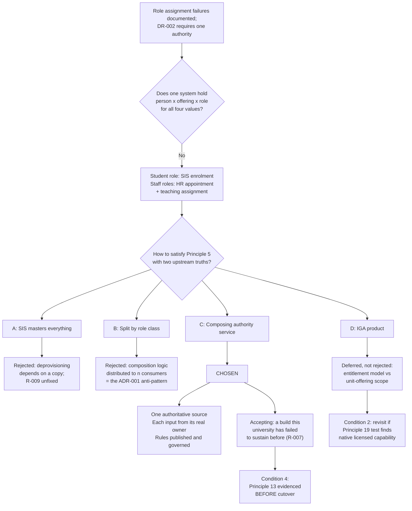

# ADR-002: Authoritative Source for Institutional Role Assignment

> **Template Origin**: Official | **ArcKit Version**: 6.7.4 | **Command**: `/arckit:adr`

## Document Control

| Field | Value |
|-------|-------|
| **Document ID** | ARC-001-ADR-002-v1.0 |
| **Document Type** | Architecture Decision Record |
| **ADR Number** | ADR-002 |
| **Project** | Learning & Teaching Baseline Strategy (Project 001) |
| **Classification** | OFFICIAL |
| **Status** | **Proposed** |
| **Version** | 1.0 |
| **Created Date** | 2026-07-28 |
| **Last Modified** | 2026-07-28 |
| **Review Date** | 2026-08-27 |
| **Escalation Level** | Department |
| **Governance Forum** | RIFF Review → Education Committee → Operations Committee |
| **Owner** | Sam Okafor, Integration Architect |
| **Reviewed By** | [PENDING] |
| **Approved By** | [PENDING] |
| **Distribution** | Project Team; Digital & IT; Student Administration; Human Resources; Learning Technologies; Steering Committee |

## Revision History

| Version | Date | Author | Changes | Approved By | Approval Date |
|---------|------|--------|---------|-------------|---------------|
| 1.0 | 2026-07-28 | ArcKit AI | Initial creation from `/arckit:adr` command — raised as the open successor decision recorded in ADR-001 | [PENDING] | [PENDING] |

---

## 1. Decision Title

**Authoritative Source for Institutional Role Assignment**

Which system is authoritative for the institutional role a person holds within a unit offering — coordinator, tutor, marker or student — and therefore publishes entity E-006 to the rest of the estate.

---

## 2. Stakeholders

### 2.1 Deciders (RACI: Accountable)

- **Cassandra "Cas" Rhodes, Chief Information Officer** — accountable for BR-004 (integration fragility eliminated) and BR-005 (security posture); funds the integration uplift; owns the Essential Eight target this decision affects
- **A/Prof. Pearl Clavinet, Dean of Learning & Teaching; Chair, Education Committee** — academic approval gate; institutional role definitions carry academic meaning, not just access meaning

### 2.2 Consulted (RACI: Consulted)

- **Sam Okafor, Integration Architect** — decision owner; will implement and operate the outcome; owns INT-002 and INT-003
- **Tobias Ohm, Cybersecurity Lead** — **Data Steward for E-006** per ARC-001-DATA; role change equals access change, making this the estate's highest-value audit target
- **Eleanor Frame, Privacy & Records Officer** — Data Steward for E-001 Person; APP compliance on the identity root this decision derives from
- **Student Administration** — joint business owner of E-006; authoritative for enrolment, unit offering and therefore student role
- **Human Resources** — joint business owner of E-006; authoritative for the employment relationship underlying coordinator, tutor and marker roles
- **Dr. Benny Moog, Director Learning Technologies** — runs RIFF; consumes role data across the platform estate

> ⚠️ **Engagement gap, stated openly.** Student Administration and Human Resources are recorded in ARC-001-DATA as **joint business owners of E-006**, but **neither appears in the engagement stakeholder register** (ARC-001-STKE §Internal Stakeholders lists sixteen named individuals; no HR or Student Administration representative is among them). This decision cannot be taken without them. Raising that gap is itself an output of this ADR.

### 2.3 Informed (RACI: Informed)

- Prof. Otis Hammond, DVC (Education) — Executive Sponsor
- Rhonda Bell, Project Manager — schedule impact on WP5 and WP8
- Dr. Wynton Castle, Senior Lecturer — frontline effect on who can mark
- Project 002 (Lecture Capture) team — INT-001 provisioning depends on this outcome
- Learning Technologist team — currently absorbs the manual workaround this decision removes

### 2.4 Escalation Context

**Decision Level**: **Department**

**Escalation rationale**:

- [ ] **Team** — not applicable; this is not a local implementation choice
- [ ] **Cross-team** — insufficient; DR-002 prohibits any platform holding independent role assignment, which requires a mandate over HR and Student Administration processes that an architecture forum does not carry
- [x] **Department** — technology standard affecting the whole L&T estate, with data-ownership consequences for two organisational units outside L&T
- [ ] **Institution-wide (Executive)** — held in reserve. **Escalate if Student Administration and HR cannot agree the composition rules in §6.4 Condition 3**, since that would be a data-ownership dispute rather than an architecture one

**Governance Forum**: RIFF Review → Education Committee → Operations Committee — the same chain as ADR-001, which this decision unblocks [SGP-C1].

**Approval Date**: [PENDING]

> **Note on framework applicability.** The ArcKit template's *Cross-government* escalation tier, GDS Service Standard, Technology Code of Practice and NCSC guidance are UK public-sector instruments with no standing for an Australian university. The equivalent institutional tier is **University Executive**, and the applicable regulatory overlay is the **Privacy Act 1988** and the **ASD Essential Eight**. §4.3 and §8.3 apply those instead rather than leaving UK sections nominally answered.

---

## 3. Context and Problem Statement

### 3.1 Problem Description

ARC-001-DATA models institutional role as a first-class entity, **E-006 INSTITUTIONAL_ROLE_ASSIGNMENT**, precisely so that a single authority becomes possible. The entity carries a required attribute, `authoritative_source VARCHAR(50)`, validated against an enum.

**The enum has no values.**

The same document's Master Data Management table names a real system of record for every other entity — Student Information System for Person, Unit, TeachingPeriod, UnitOffering and Enrolment; Timetabling System for GroupAllocation; the learning platform gradebook for Grade; the placement platform for placement entities. For E-006 alone, the system of record is listed as **"Institutional Role Authority"** — a name for the role a system must play, not a system that plays it.

That placeholder is this decision.

**Problem statement as a question**: *Which system is authoritative for institutional role assignment, such that every L&T platform holds only a derived, read-oriented copy?*

### 3.2 Why This Decision Is Needed Now

**It is a declared dependency of an approved-in-principle decision.** ADR-001 §Implementation Plan lists "Authoritative source for institutional role confirmed" as a prerequisite and records ADR-002 as a candidate successor, not yet raised. ADR-001 selected a central integration broker that enforces the canonical schema at runtime — but **a broker enforces the shape of a role assertion; it does not decide whose assertion is true.** Phase 3 of ADR-001's timeline (INT-001, the SIS lifecycle integration) cannot be designed without this.

**It is the estate's most-failing integration.** Role assignment failures are a documented current defect [SL-C1], and the requirement to fix them is rated Must [RR-C1].

**It carries the model's strictest data quality obligation.** ARC-001-DATA's governance matrix sets E-006 at **100% accuracy and 15-minute freshness** — the tightest SLA of any entity in the model — and restricts access to "Security and Admin only". An entity held to that standard cannot have an undefined owner.

**The Wardley analysis independently flagged it.** `ARC-001-WARD-001` §6 found Automated Identity and Role Lifecycle to be the most widely depended-upon custom component in the estate, with **four dependents at R ≥ 0.41** — the student's single entry point (0.602), teaching without administrative overhead (0.589), active learning tools (0.422) and discipline specialist tooling (0.410). Its recommendation was explicit: raise ADR-002 **before** broker selection, not after.

### 3.3 The Complication That Makes This Non-Trivial

Institutional role is not a single fact. It is a triple — **person × unit offering × role type** — across four values, and **no current system holds all three parts for all four values**:

| Role value | Person | Unit offering scope | Underlying entitlement | Held where today |
|-----------|--------|--------------------|-----------------------|------------------|
| **student** | SIS | SIS | Enrolment | Fully in SIS — role is a projection of E-005 Enrolment |
| **coordinator** | SIS / HR | SIS | Employment + teaching assignment | Split: appointment in HR, assignment in SIS or local process |
| **tutor** | HR | SIS | Employment + teaching assignment | Split, and often a **casual** appointment |
| **marker** | HR | SIS | Employment + teaching assignment | Split, and often casual or short-tenure |

ARC-001-DATA already records this split rather than hiding it. **E-006's business owner is "Student Administration and HR jointly"**, and E-001 Person's system of record is "**Student Information System / HR**". These are the only two entries in the entire model naming two owners.

**So Principle 5 (Single Source of Truth, CRITICAL) demands one authority, while the estate contains two upstream truths.** Resolving that tension — rather than choosing a side and hoping — is the substance of this decision.

The failure this produces is concrete and documented: casual and sessional academics are provisioned by manual CSV [RR-C2], receive access late in the teaching period, or retain it after their engagement ends [SL-C1]. Persona 3 in ARC-001-REQ names exactly this. It is **risk R-009**, residual 12, with the existing control rated *Weak*.

### 3.4 Regulatory and Policy Context

- **Privacy Act 1988 / APP 11** — stale deprovisioning means access persists up to 24 hours after withdrawal [PC-C1]. Role state is the control that ends access; an unowned role entity is a standing privacy exposure, not merely an integration defect
- **ASD Essential Eight** — *Restrict administrative privileges* sits at ML1 against an ML2 target [PC-C2]. Cross-platform access review from a single view is an acceptance criterion of NFR-SEC-003 and is unachievable without a role authority
- **RIFF governance** — any purchase considered under Option D must first justify why licensed capability is unsuitable [SGP-C1]

### 3.5 Supporting Links

- **Requirements**: BR-004, BR-005, BR-007 · INT-002, INT-003 · DR-001, DR-002 · NFR-SEC-001, NFR-SEC-003, NFR-P-001, NFR-M-001, NFR-C-003
- **Source register**: REQ-024, REQ-025, REQ-031 [RR-C1] [RR-C2]
- **Related ADRs**: **ADR-001** (integration mediation — this is its declared dependency)
- **Wardley**: `ARC-001-WARD-001` §3, §6 — positioning and dependency-risk evidence
- **Data model**: `ARC-001-DATA` §Context 1, Entity E-006, MDM table

---

## 4. Decision Drivers (Forces)

### 4.1 Technical Drivers

| Driver | Requirement | Note |
|--------|-------------|------|
| One authoritative source, derived copies elsewhere | DR-002 | The literal text: *"No platform shall independently maintain role assignment"* |
| Role change propagates within 15 minutes | NFR-P-001, INT-002 | INT-002 is rated CRITICAL |
| Automated provisioning **and deprovisioning**, casuals on the same path | NFR-SEC-003 | The acceptance criterion that current practice fails |
| Cross-platform access review from a single view | NFR-SEC-003 | No option except D delivers this natively — see §5.4 |
| Change logging with prior value | NFR-C-003, E-006 | ARC-001-DATA: *"the highest-value audit target in the model, since role change equals access change"* |
| 100% accuracy, 15-minute freshness | ARC-001-DATA governance matrix | The strictest quality SLA in the model |
| No new single point of failure | NFR-A-001 | Whatever publishes E-006 becomes a shared dependency of the whole estate |

### 4.2 Business Drivers

| Driver | Requirement | Note |
|--------|-------------|------|
| Integration fragility and manual handling eliminated | BR-004 | Role assignment is the most-failing integration in the estate |
| Licence spend flat or reduced | BR-002 | Constrains Option D; rated SHOULD, not MUST |
| Governance operating on architectural evidence | BR-007 | This ADR is an instance of the requirement |
| Roadmap delivered to business case timing | BR-003 | Must be recordable by the September business case |

### 4.3 Regulatory and Compliance Drivers

- **Privacy Act 1988, APP 11** — security of personal information; prompt revocation of access on role end
- **Notifiable Data Breach scheme** — an unrevoked marker role is an access-control failure with breach potential
- **ASD Essential Eight** — *Restrict administrative privileges*, ML1 → ML2 by end 2027 (NFR-SEC-002)
- **RIFF duplication rule** — applies to any acquisition under Option D [SGP-C1]
- **TEQSA assessment integrity** — who holds a marker role is an assessment-integrity control, not only an IT control

> **Not applicable**: GDS Service Standard, Technology Code of Practice, NCSC Cyber Essentials and UK GDPR. The University of Funk is an Australian institution. Recording this explicitly prevents a later reviewer reading their absence as an omission.

### 4.4 Alignment to Architecture Principles

| # | Principle | Criticality | Effect on this decision |
|---|-----------|-------------|------------------------|
| 5 | Single Source of Truth for Core Entities | CRITICAL | **The governing principle.** Requires exactly one authoritative source for role — and is the reason Option B is contentious |
| 6 | Canonical Data Model | HIGH | E-006 is already defined; this decision fills its `authoritative_source` enum |
| 10 | Interface-Mediated Integration | CRITICAL | Whatever is chosen publishes through a versioned interface, not a database view |
| 11 | Event-Driven and Near-Real-Time by Default | HIGH | Role change is explicitly named in the principle's scope |
| 12 | Automated Identity Lifecycle | CRITICAL | *"Manual role assignment ... prohibited in production"*; casual and sessional staff on the same automated path |
| 13 | Reproducible, Documented Automation | HIGH | **Constrains Option C** — see §6.4 Condition 4 |
| 17 | Observable Integrations and Services | HIGH | Failed role propagation must be visible, not discovered by user report |
| 18 | Evidence-Based Capability Investment | CRITICAL | This ADR is the evidence RIFF assesses |
| 19 | Realise Licensed Capability Before New Spend | HIGH | **Constrains Options C and D** — see §6.4 Condition 1 |

---

## 5. Considered Options

Four active options plus a Do Nothing baseline.

### 5.1 Option A: Student Information System as sole authority

**Description**: Extend the SIS to carry all four role values. Unit staffing already exists there for teaching assignment; HR feeds employment status into SIS; SIS publishes E-006 for the whole estate.

**Implementation approach**: Extend SIS unit-staffing configuration to cover coordinator, tutor and marker at unit-offering granularity. Establish an HR → SIS appointment feed so SIS knows whether an assignment is currently backed by a live employment relationship. SIS emits role change events to the broker.

**Wardley evolution stage**: **Product (0.56)** — using an existing licensed product's capability, consistent with the Student Information System's position in `ARC-001-WARD-001`.

#### Good

- ✅ **Strongest literal Principle 5 position** — one system, one `authoritative_source` value, no composition rule to define or dispute
- ✅ **No new licence cost** — satisfies BR-002 and Principle 19 without argument
- ✅ **Student role is free** — SIS already masters E-005 Enrolment, of which the student role is a direct projection. ~90% of the ~200,000 annual assignments need no new logic
- ✅ **One upstream system for INT-001 and INT-002** — the same event stream carries enrolment and role, simplifying the broker topology
- ✅ **Fewest new components to operate** — no new runtime dependency against NFR-A-001

#### Bad

- ❌ **It does not fix the documented failure.** The estate's role problem is concentrated in **casual and sessional staff** [SL-C1] [RR-C2], whose appointments are created in HR and frequently exist before, or without, a SIS unit-staffing record. Making SIS authoritative leaves the origin of the defect upstream and unaddressed
- ❌ **Deprovisioning would depend on a copy.** `effective_to` is what makes automated revocation work (ARC-001-DATA: *"`effective_to` is what enables automated deprovisioning"*). For staff, the true end date is a contract end held in HR. SIS would hold a replicated copy — **the exact "derived copy treated as authoritative" pattern Principle 5 exists to prevent**
- ❌ **It relocates the Principle 5 breach rather than removing it.** SIS becomes authoritative for a fact (employment) that HR owns. That is the same violation ADR-001 rejected Option C for, in a different place
- ❌ **Requires Student Administration to own staff appointment data**, which is neither their competence nor their mandate
- ❌ **Silent-failure mode is the worst of the four.** A casual with no SIS staffing record simply has no role — indistinguishable from a person legitimately without one

#### Cost analysis *(indicative — no costing baseline exists for 001; see §12 Assumptions)*

| | Estimate |
|---|---|
| CAPEX | SIS configuration; HR → SIS appointment feed build; event emission |
| OPEX | Nil incremental licence; ongoing SIS configuration maintenance |
| 3-year TCO | **Lowest cash cost.** Hidden cost sits in the unresolved casual-staff defect, which continues to consume Learning Technologist effort |

---

### 5.2 Option B: Split by role class — HR authoritative for staff roles, SIS for student role

**Description**: Two declared authorities, one per role class. HR is authoritative for coordinator, tutor and marker; SIS is authoritative for student. Consumers compose the two streams.

**Implementation approach**: Both systems publish role events to the broker against the canonical E-006 schema. `authoritative_source` takes one of two values. A documented composition rule governs precedence where both assert a role for the same person and offering.

**Wardley evolution stage**: **Custom (0.36)** — a bespoke arrangement of two existing product feeds.

#### Good

- ✅ **Every fact is sourced from the system that actually owns it.** No system is asked to master data it does not create
- ✅ **Directly addresses R-009.** Casual and sessional appointments enter from HR, where they are genuinely created — the documented failure point is fixed at source
- ✅ **Matches the ownership ARC-001-DATA already records** — *"Student Administration and HR jointly"* becomes an implemented fact rather than a documented ambiguity
- ✅ **Correct deprovisioning by construction.** Contract end lives in HR and flows directly, so `effective_to` is authoritative rather than replicated
- ✅ **No new runtime component** — no additional single point of failure

#### Bad

- ❌ **Prima facie breaches Principle 5 (CRITICAL).** Two authoritative sources for one entity is precisely what the principle prohibits, unless E-006 is formally split into two entities — a data model change requiring its own governance
- ❌ **Requires a conflict-resolution rule defined in advance** (Principle 5's own escape clause), and a *composition* rule on top: what happens when HR asserts a tutor appointment for an offering SIS has since cancelled?
- ❌ **Pushes composition into every consumer.** Nine integrations each implementing the same correlation logic is **architecturally the pattern ADR-001 rejected** when it chose a broker over point-to-point — conformance by convention rather than at runtime
- ❌ **Complicates the 15-minute SLA.** A single role change may require correlating two events from two systems with independent latencies; the SLA becomes a joint probability rather than a single measurement
- ❌ **Two-value enum weakens the audit position.** NFR-C-003 change logging must reconcile across sources rather than reading one authoritative history

#### Cost analysis *(indicative)*

| | Estimate |
|---|---|
| CAPEX | Two publisher builds; composition and conflict rules; consumer-side correlation logic ×n |
| OPEX | Nil incremental licence; distributed maintenance of the composition rule |
| 3-year TCO | Moderate cash cost, **highest marginal cost per new consumer** — the cost grows with the estate |

---

### 5.3 Option C: Dedicated Institutional Role Authority service

**Description**: A thin, governed service that subscribes to SIS and HR, applies published institutional role rules, and publishes E-006 as the single authoritative stream for the estate. This is literally the component ARC-001-DATA's MDM table already names.

**Implementation approach**: Deployed on the mediation layer chosen in ADR-001 rather than as a separate stack. Subscribes to enrolment events (SIS) and appointment events (HR). Applies rules determining which role each input combination confers. Publishes E-006 with a **single** `authoritative_source` value. Holds no durable state beyond its replay window — it derives; it does not master.

**Wardley evolution stage**: **Custom (0.34)** — consistent with Automated Identity and Role Lifecycle at 0.36 in `ARC-001-WARD-001`.

#### Good

- ✅ **Satisfies Principle 5 literally while sourcing each input from its real owner.** One authoritative source for E-006, one enum value, one audit history — and neither SIS nor HR is asked to master the other's data. **It resolves the §3.3 tension rather than choosing a side**
- ✅ **Composition happens once, not n times.** The correlation logic Option B distributes across consumers is implemented in one governed place — the same argument that justified ADR-001's broker
- ✅ **Institutional role rules become explicit and governed.** *Who counts as a marker* is currently implicit in per-platform configuration. This surfaces it as a published, versioned, academically-owned rule — which matters for TEQSA assessment integrity, not just for access
- ✅ **Makes the strictest SLA in the model measurable in one place** — 100% accuracy and 15-minute freshness against a single publisher
- ✅ **Casual and sessional staff are handled correctly by construction**, because HR appointment events are a first-class input (R-009)
- ✅ **Implements the data model as designed.** It fills the `authoritative_source` enum with exactly one value, which is what makes ARC-001-DATA implementable rather than aspirational

#### Bad

- ❌ **It is a build, and this university's build record on teaching-critical automation is poor.** R-007 — course rollover automation, *"undocumented; single-person dependency"*, control effectiveness recorded as **"None effective"** — is the empirical evidence. `ARC-001-WARD-001` §6 found two of its top three dependency risks pass through that component. **This is the strongest argument against Option C and it must not be waved away**
- ❌ **Adds a hop to the latency budget.** SIS/HR → authority → broker → platform must still complete inside 15 minutes
- ❌ **Risk of becoming a second source of truth** if it accumulates state beyond derivation — the same risk ADR-001 attached to the broker, requiring the same guard
- ❌ **New licence or hosting cost against BR-002** if it cannot be delivered on existing licensed capability
- ❌ **Requires HR engagement that has not yet begun** (§2.2). HR is not in the stakeholder register
- ❌ **Slowest start of the three active build options**

#### Cost analysis *(indicative)*

| | Estimate |
|---|---|
| CAPEX | Rule definition workshops; service build on the ADR-001 broker; two publisher integrations |
| OPEX | Operation and on-call; rule maintenance as academic role definitions change |
| 3-year TCO | **Highest visible cost, lowest marginal cost per additional consumer.** Cost is concentrated up front and in the operating model |

---

### 5.4 Option D: Identity Governance product as role authority

**Description**: Adopt an Identity Governance and Administration (IGA) product as the role authority, with SIS and HR as connected sources and L&T platforms as provisioning targets.

**Implementation approach**: Connect SIS and HR as authoritative sources; model institutional role as an entitlement type scoped to unit offering; provision outward via SCIM. Candidate capability may already exist within the university's Microsoft agreement — the same entitlement question ADR-001 Condition 1 raises.

**Wardley evolution stage**: **Product (0.62)** — a mature, multi-vendor market.

#### Good

- ✅ **Delivers cross-platform access review natively.** NFR-SEC-003's fourth acceptance criterion — *"access review is possible centrally, across platforms, without per-platform inspection"* — is satisfied out of the box. **No other option delivers this without additional build**
- ✅ **Strongest Essential Eight position.** Directly advances *Restrict administrative privileges* from ML1 toward the ML2 target (NFR-SEC-002, R-020)
- ✅ **Buying at the right evolution stage.** At 0.62 this is mid-Product with standardised connectors and SCIM — `ARC-001-WARD-001` §3's warning against building what the market supplies applies here
- ✅ **Recertification and segregation-of-duties capability** the university does not currently have anywhere
- ✅ **May require no new licence** if the capability sits inside the existing agreement — which would make it the strongest Principle 19 position of all four

#### Bad

- ❌ **IGA products model entitlements, not unit-scoped academic roles.** The E-006 shape — person × *unit offering* × role, at ~200,000 assignments per year, with roles created and expiring on the teaching calendar — is not the shape IGA is built for. IGA assumes relatively stable entitlements against applications, not high-churn assignments against academic objects
- ❌ **Risk of forcing the academic model into an entitlement model.** If the product cannot represent unit-offering scope natively, the university ends up with either a distorted model or a custom extension — **and a custom extension inside a licensed product is the worst of both options**
- ❌ **New licence cost against BR-002** unless already held; unresolved until the Principle 19 test completes
- ❌ **New vendor dependency at the identity layer**, where Principle 9 (portability) is hardest to enforce
- ❌ **Skills the team does not hold.** IGA operation is a specialism distinct from integration engineering
- ❌ **Slowest to value** — product selection, modelling and connector work before the first role propagates

#### Cost analysis *(indicative)*

| | Estimate |
|---|---|
| CAPEX | Product selection (or entitlement confirmation); role modelling; connector configuration |
| OPEX | Licence (unless already held); specialist operation; recertification campaign administration |
| 3-year TCO | **Highest cash cost if a new purchase; potentially lowest if already licensed.** The variance is entirely dependent on the Principle 19 test |

---

### 5.5 Option E: Do Nothing (Baseline)

**Description**: Retain the current arrangement — role assigned per platform, by hand or by CSV, with no declared authority.

#### Good

- ✅ No cost, no change, no new runtime dependency
- ✅ Staff know the current failure modes and have built workarounds around them

#### Bad

- ❌ **Fails DR-002 outright** — the requirement exists to end exactly this arrangement
- ❌ **Fails NFR-SEC-003 and Principle 12** — manual role assignment persists; casual and sessional staff remain off the automated path
- ❌ **`authoritative_source` stays undefined, so ARC-001-DATA cannot be implemented.** The canonical model becomes documentation rather than a runtime contract — which is the specific outcome ADR-001 chose Option B to prevent
- ❌ **Blocks ADR-001 Phase 3** (INT-001) and, downstream, project 002's INT-001 provisioning build
- ❌ **Leaves R-009 and R-006 unmitigated**, and leaves a standing APP 11 exposure through stale deprovisioning [PC-C1]
- ❌ **Leaves the estate's highest-value audit target without an owner** — role change equals access change, logged nowhere authoritatively

**Retained as a genuine baseline**, not a strawman: the RIFF pause provision permits closing a request [SGP-C1]. But the evidence against it is stronger than for any other decision in this project — two requirements, one data requirement, two risks and a downstream project all fail.

---

### 5.6 Options Comparison

| Criterion | A: SIS | B: Split | **C: Role Authority** | D: IGA product | E: Do Nothing |
|-----------|--------|----------|----------------------|----------------|---------------|
| Principle 5 — single source | ✅ Literal | ❌ Two sources | ✅ **Literal** | ✅ Literal | ❌ None |
| Each fact from its real owner | ❌ No | ✅ Yes | ✅ **Yes** | ✅ Yes | ❌ No |
| Fixes casual/sessional (R-009) | ❌ No | ✅ Yes | ✅ **Yes** | ✅ Yes | ❌ No |
| Correct deprovisioning source | ❌ Copy | ✅ Direct | ✅ **Direct** | ✅ Direct | ❌ Manual |
| Composition logic centralised | n/a | ❌ Distributed | ✅ **Once** | ✅ Once | n/a |
| Cross-platform access review | ❌ Build | ❌ Build | ⚠️ Build | ✅ **Native** | ❌ No |
| New licence cost (BR-002) | ✅ None | ✅ None | ⚠️ Possible | ❌ Likely | ✅ None |
| New runtime dependency | ✅ None | ✅ None | ❌ Yes | ❌ Yes | ✅ None |
| Build/operate burden | Low | Medium | **High** | Medium | None |
| Evolution stage | Product 0.56 | Custom 0.36 | **Custom 0.34** | Product 0.62 | — |

---

## 6. Decision Outcome

### 6.1 Chosen Option

**Option C — Dedicated Institutional Role Authority service**, delivered on the mediation layer chosen in ADR-001, and carrying four conditions.

### 6.2 Y-Statement

> In the context of **an estate where role assignment is the most-failing integration and no single system holds all four role values**,
> facing **a CRITICAL principle demanding one authoritative source while two organisational units genuinely own different halves of the fact**,
> we decided for **a thin Institutional Role Authority service that derives E-006 from SIS enrolment and HR appointment events and publishes it as the single authoritative stream**,
> and against **making the Student Information System master employment data, splitting the entity across two authorities, and adopting an Identity Governance product**,
> to achieve **one authoritative source with each input fact sourced from its real owner, correct deprovisioning for casual and sessional staff, and institutional role rules that are explicit and governed rather than implicit in platform configuration**,
> accepting **a new component to build and operate, an additional hop in the latency budget, a possible licence cost, and — most seriously — a build obligation this university has previously failed to sustain.**

### 6.3 Justification

**Why not Option A**, despite the lowest cash cost and the cleanest single-source story: it does not fix the documented defect. The estate's role failures concentrate in casual and sessional staff [SL-C1] [RR-C2], whose appointments originate in HR. Making SIS authoritative leaves that origin untouched while requiring SIS to hold a replicated contract end date — and `effective_to` is the attribute that makes automated deprovisioning work at all. A design whose revocation control depends on a copy is the Principle 5 failure it claims to solve, relocated.

**Why not Option B**, despite it being the most honest data-sourcing answer: it is right about *where facts live* and wrong about *where logic lives*. Distributing the composition rule across nine consumers is architecturally the same choice ADR-001 examined and rejected — conformance by convention rather than at runtime, with the current estate as the evidence of where that ends. Option C keeps Option B's sourcing correctness and moves its logic to one place.

**Why not Option D**, despite the genuinely attractive access-review capability and the right evolution stage: IGA products model entitlements against applications, not roles scoped to unit offerings at ~200,000 assignments a year on a teaching calendar. The mismatch is structural rather than a configuration gap, and the likely resolution — a custom extension inside a licensed product — is worse than either a clean build or a clean buy. **This reasoning is a judgement, not a tested finding**, which is why Condition 2 keeps the option alive rather than closing it.

**Why Option C despite being a build**: it is the only option that satisfies Principle 5 literally *and* sources every input from its real owner. It fills the `authoritative_source` enum with exactly one value, which is what converts ARC-001-DATA from a design into something implementable. And it makes the institutional role rules — currently implicit, undocumented, and effectively decided by whoever configures each platform — into a published artefact the Education Committee can own. That last benefit is not an IT benefit; it is an assessment-integrity benefit, and no other option produces it.

### 6.4 Conditions Attached to This Decision

This decision is **Proposed**, not Accepted, and carries four conditions.

1. **Principle 19 test, run jointly with ADR-001 Condition 1.** Digital & IT to confirm in writing whether existing licensed platforms — including the Microsoft agreement — already provide role-authority or identity-governance capability. **Run as one assessment covering both decisions**, not two: the same entitlement question, asked twice, produces two procurement conversations and one answer. If adequate capability exists, Option C is delivered using it, or Option D is reconsidered on evidence rather than on the §6.3 judgement.
2. **Option D is deferred, not rejected.** If the Principle 19 test finds licensed IGA capability that *can* represent unit-offering-scoped roles natively, this ADR must be revisited before build commences. The §6.3 reasoning against Option D is explicitly a judgement about product shape and has not been tested against a specific product.
3. **Institutional role rules published and academically approved before build.** Who counts as coordinator, tutor and marker; how a casual appointment maps to a teaching assignment; what happens when an appointment ends mid-teaching-period; what happens when HR and SIS disagree. **These are academic governance decisions, not integration decisions**, and Education Committee owns them. If Student Administration and HR cannot converge, escalate to University Executive (§2.4).
4. **Principle 13 evidenced before cutover, not promised after.** A named owner, a version-controlled runbook, and **at least two people able to operate and troubleshoot the service**. R-007 is the reason this is a condition rather than an implementation note: this university has already built teaching-critical automation and left it undocumented with a single-person dependency, and the control effectiveness for that is recorded as *"None effective"*. **Option C without Condition 4 is worse than Option A.**

### 6.5 Dissent Recorded

**No formal dissent at time of writing** — but two objections are anticipated and both are legitimate.

**The Option B objection** (likely from Integration): Option B is simpler, needs no new component, and sources every fact correctly. The counter is that it distributes composition logic across every consumer and makes the 15-minute SLA a joint probability across two publishers. **This should be tested at RIFF rather than assumed in either direction** — if the panel judges the composition rule to be genuinely simple and stable, Option B becomes materially more attractive.

**The build-capacity objection** (likely from the CIO or the Project Manager): the university has not demonstrated it can sustain what it builds. This objection is **correct on the evidence** and is not answered by argument — it is answered by Condition 4 or not at all.

### 6.6 Risk Appetite Alignment

ARC-001-RISK records that **no approved organisational risk appetite statement exists** and that its own thresholds are PROVISIONAL. This decision therefore cannot claim appetite alignment as a finding. What it can say: Option C raises a delivery risk (a new build) in order to lower a compliance risk (APP 11 stale access) and an operational risk (R-009). Whether that trade sits inside appetite is a judgement for the Steering Committee, and it should be taken explicitly rather than inherited from this document.

---

## 7. Consequences

### 7.1 Positive Consequences

| Consequence | Measure | Baseline → Target |
|-------------|---------|-------------------|
| Single declared authority for role | `authoritative_source` enum values | Undefined → exactly 1 |
| Role change propagation | Latency, source change to platform effect | Up to 24h / manual → within 15 min (NFR-P-001) |
| Casual and sessional provisioning | Manual CSV loads per teaching period | Recurring → zero (NFR-SEC-003, R-009) |
| Deprovisioning on appointment end | Time from contract end to access revocation | Undefined / indefinite → within the defined window |
| Platforms holding independent role state | Count | Unmeasured → zero (DR-002) |
| Role change audit with prior value | Coverage | Per-platform, incomplete → single authoritative history (NFR-C-003) |
| Institutional role rules | Status | Implicit in platform config → published, versioned, Education Committee owned |

**Unblocks**: ADR-001 Phase 3 (INT-001), INT-002, INT-003, and project 002's INT-001 provisioning build.

### 7.2 Negative Consequences (Accepted Trade-offs)

| Trade-off | Mitigation |
|-----------|-----------|
| **A new build this university has previously failed to sustain** | Condition 4 — Principle 13 evidenced before cutover, not promised after. This is the load-bearing mitigation |
| New shared runtime dependency (NFR-A-001) | Delivered on the ADR-001 broker rather than as a separate stack; availability design inherited from ADR-001 Condition 2; platforms retain last-known role state on authority unavailability rather than failing closed |
| Additional hop in the 15-minute budget | Per-hop latency budget defined at design; measured end-to-end, not per component |
| Possible new licence or hosting cost against BR-002 | Condition 1 — Principle 19 test first, run jointly with ADR-001 |
| Risk of becoming a second source of truth | No durable state beyond the replay window; the service derives and publishes, it does not master. Same guard ADR-001 placed on the broker |
| HR engagement not yet begun | Raised explicitly in §2.2; Condition 3 makes it a precondition rather than a discovery |

### 7.3 Neutral Consequences (Changes Required)

- 🔄 **Stakeholder register updated** to add Student Administration and Human Resources representatives — currently absent from ARC-001-STKE despite joint ownership of E-006
- 🔄 **ARC-001-DATA updated** to replace the "Institutional Role Authority" placeholder in the MDM table with the named service, and to populate the `authoritative_source` enum
- 🔄 **HR process change** — appointment events must carry unit-offering scope, which HR does not currently record for casual teaching engagements. **This is the largest non-technical change in the decision**
- 🔄 **Role rule governance** — a standing item for Education Committee, reviewed when academic role definitions change
- 🔄 **On-call and runbook coverage** extended to the role authority
- 🔄 **Schema change process** — E-006 becomes a runtime contract, so its evolution needs the same versioning discipline ADR-001 established for the canonical model

### 7.4 Risks and Mitigations

| Risk | Likelihood | Impact | Mitigation | Owner |
|------|-----------|--------|------------|-------|
| **Built, then not maintained — R-007 repeated** | MEDIUM | **HIGH** | Condition 4; product owner named at approval, not at go-live; second operator trained before cutover | Cassandra Rhodes |
| HR cannot supply unit-offering scope on casual appointments | MEDIUM | HIGH | Establish in Condition 3 discovery, before build. If genuinely unavailable, Option B becomes the fallback and this ADR is superseded | Sam Okafor with HR |
| Role rules cannot be agreed between Student Administration and HR | MEDIUM | HIGH | Condition 3; escalation path to University Executive declared in §2.4 | A/Prof. Pearl Clavinet |
| Authority outage blocks all role propagation | MEDIUM | HIGH | Platforms retain last-known role state; degradation is staleness, not loss of access; availability design before first cutover | Sam Okafor |
| Latency budget exceeded across the added hop | MEDIUM | MEDIUM | Per-hop budget at design; end-to-end measurement from day one (NFR-M-001) | Sam Okafor |
| Principle 19 test finds licensed IGA capability late | LOW | MEDIUM | Condition 1 sequences the test **before** build; Condition 2 keeps Option D open | Cassandra Rhodes |
| Cost objection blocks the decision at RIFF | MEDIUM | MEDIUM | Joint Principle 19 test with ADR-001; present role authority as part of the mediation investment, not as a separate ask | Cassandra Rhodes |

**Existing risks affected**: **R-009** (casual and sessional provisioning by manual CSV) materially reduced — this is the decision's primary risk benefit. **R-006** (integration estate fragility) reduced for the role component specifically. **R-020** (Essential Eight ML2) partially advanced through automated deprovisioning; note that Option D would have advanced it further. **R-007** is *not* mitigated by this decision and is the pattern this decision risks repeating.

---

## 8. Validation and Compliance

### 8.1 How Implementation Will Be Verified

**Design review**:

- [ ] WP5 integration architecture and WP8 target state both reflect a single named role authority
- [ ] A design showing any platform maintaining independent role assignment is non-conformant against DR-002
- [ ] ARC-001-DATA MDM table updated; `authoritative_source` enum populated with exactly one value

**Conformance check**:

- [ ] `/arckit:conformance` after implementation, verifying every platform holds a derived read-oriented copy
- [ ] Contract tests per consumer against the E-006 schema in the registry
- [ ] Failure-injection test of role authority unavailability before first cutover

**Testing strategy**:

- [ ] Casual appointment created in HR propagates to all consuming platforms within 15 minutes
- [ ] Appointment end revokes access within the defined window across every platform
- [ ] Mid-teaching-period role change (tutor added, marker removed) reflects correctly
- [ ] Conflicting SIS/HR assertion resolves per the published rule and is logged
- [ ] Role change audit records prior value (NFR-C-003)

### 8.2 Monitoring and Observability

| Metric | Target | Source |
|--------|--------|--------|
| Role change propagation latency | Within 15 minutes (NFR-P-001) | Broker telemetry |
| Role assignment accuracy | 100% against ARC-001-DATA governance SLA | Reconciliation against SIS and HR |
| Manual role assignment events | Zero | Platform audit logs |
| Manual CSV provisioning events | Zero | Provisioning audit log |
| Deprovisioning lag after appointment end | Within defined window | Role authority telemetry |
| Platforms holding non-derived role state | Zero | Periodic conformance scan |
| Rule conflicts fired | Reported, never silently resolved | Role authority telemetry |

### 8.3 Compliance Verification

- **Privacy Act 1988 / APP 11** — automated deprovisioning closes the stale-access exposure [PC-C1]; role change history supports subject access and breach investigation
- **Notifiable Data Breach scheme** — a single authoritative role history materially improves the ability to establish who had access to what and when during a breach assessment
- **ASD Essential Eight** — advances *Restrict administrative privileges* toward ML2 (NFR-SEC-002, R-020). Note that cross-platform access review, NFR-SEC-003's fourth acceptance criterion, requires additional build under Option C and would have been native under Option D — **this gap must be tracked, not forgotten**
- **RIFF governance** — Principle 19 duplication test is a precondition (Condition 1) [SGP-C1]
- **TEQSA assessment integrity** — published, academically-approved marker role rules strengthen the assessment control environment

> **Not applicable**: GDS Service Assessment, Technology Code of Practice, NCSC Cloud Security Principles, Cyber Essentials and UK GDPR DPIA. The Australian equivalents applied above are the Privacy Act 1988, the NDB scheme, the ASD Essential Eight and the university's RIFF process. A Privacy Impact Assessment under the Privacy Act is required and is tracked in the project's compliance thread, not here.

---

## 9. Links to Supporting Documents

### 9.1 Requirements Traceability

**Business**: BR-004 (integration fragility and manual handling eliminated — primary driver) · BR-005 (demonstrable privacy and security posture) · BR-007 (governance operating on architectural evidence) · BR-002 (licence spend constraint on Options C and D)

**Integration**: INT-002 (institutional role assignment — the requirement this decision makes deliverable) · INT-001 (SIS lifecycle) · INT-003 (automated platform provisioning)

**Data**: DR-001 (canonical model) · DR-002 (**role as a governed entity — the requirement this ADR resolves**)

**Non-functional**: NFR-SEC-001 (SSO with MFA) · NFR-SEC-003 (automated identity lifecycle) · NFR-P-001 (15-minute propagation) · NFR-A-001 (availability) · NFR-M-001 (observability) · NFR-C-003 (change logging with prior value)

**Source register**: REQ-024 [RR-C1] · REQ-025 [RR-C2] · REQ-031

### 9.2 Architecture Artifacts

| Artifact | Relationship |
|----------|-------------|
| `ARC-000-PRIN-v1.0` | Principles 5, 6, 10, 11, 12, 13, 17, 18, 19 — Principle 5 is the governing force |
| `ARC-001-REQ-v1.0` | Source of all requirement IDs above; Persona 3 (Sessional/Casual Academic) |
| `ARC-001-DATA-v1.0` | **Entity E-006 — the entity this decision gives an owner**; MDM table placeholder; governance matrix SLA |
| `ARC-001-RISK-v1.0` | R-006, R-007, R-009, R-020 |
| `ARC-001-STKE-v1.0` | Decision authority and RACI; **the register gap raised in §2.2** |
| `ARC-001-ADR-001-v1.0` | The decision this one was declared a dependency of |
| `ARC-001-WARD-001-v1.0` | §3 sourcing position; **§6 dependency-risk evidence — four dependents at R ≥ 0.41 and the explicit recommendation to raise ADR-002 before broker selection** |
| `projects/002-lecture-capture/ARC-002-REQ-v1.0` | 002's INT-001 provisioning consumes the authority chosen here |

### 9.3 Design Documents

- **Data model**: `ARC-001-DATA-v1.0` Entity E-006 and the MDM table both require update on approval (§7.3)
- **High-Level Design**: WP8 target state must show a single named role authority
- **Detailed Design**: role rule specification is a Condition 3 deliverable, not a build-time artefact

### 9.4 External References

- **Standards relevant to the interface**: SCIM 2.0 (RFC 7643 / 7644) for outbound provisioning; 1EdTech LTI 1.3 Names and Role Provisioning Services for LMS-side role assertion. `ARC-001-WARD-001` §3 recommends deriving the canonical model from published standards rather than a blank page — **the same recommendation applies to the E-006 publication interface**
- **Privacy Act 1988 (Cth)**, Australian Privacy Principles, particularly APP 11
- **ASD Essential Eight Maturity Model** — *Restrict administrative privileges*

---

## 10. Implementation Plan

### 10.1 Dependencies

- **ADR-001** decision accepted and mediation layer confirmed — this service is delivered on it
- **Condition 1** (Principle 19 test) complete before any build or procurement
- **Condition 3** (role rules published and academically approved) complete before build
- **Student Administration and HR engagement** established — currently absent (§2.2)
- **HR capability to emit appointment events carrying unit-offering scope** — to be established in discovery, and the largest open technical unknown

### 10.2 Implementation Timeline

| Phase | Activities | Duration | Owner |
|-------|-----------|----------|-------|
| 0 | Stakeholder register corrected; Student Administration and HR engaged | 1 week | Rhonda Bell |
| 1 | Principle 19 test — existing licensed capability assessed, **jointly with ADR-001 Condition 1** | 2 weeks | Cassandra Rhodes |
| 2 | Role rule definition workshops; rules published and approved (Condition 3) | 4 weeks | A/Prof. Pearl Clavinet with Sam Okafor |
| 3 | HR appointment event capability confirmed or gap costed | 2 weeks | Sam Okafor with HR |
| 4 | Role authority built on the ADR-001 broker; E-006 schema registered | 6 weeks | Sam Okafor |
| 5 | Principle 13 evidence complete — runbook, named owner, second operator trained (Condition 4) | Concurrent with 4 | Sam Okafor |
| 6 | First consumer cutover (INT-003 provisioning, casual staff path first — highest risk benefit) | 4 weeks | Sam Okafor |
| 7 | Remaining consumers phased | Ongoing | Sam Okafor |

> **Phase 6 sequencing is deliberate.** Casual and sessional provisioning is both the documented defect (R-009) and the narrowest blast radius. It demonstrates value before the student-role path — which is high-volume but currently working — is touched.

### 10.3 Rollback Plan

**Trigger**: role propagation failure materially affecting teaching access; Principle 19 test showing adequate licensed capability at materially lower cost; HR unable to supply unit-offering scope on appointments.

**Procedure**: consumers revert to their prior role source, which is retained in a disabled state until each has run one full teaching period under the new authority. No platform's local role configuration is removed before that point. If the trigger is the HR scope gap, **Option B is the declared fallback** and this ADR is superseded rather than abandoned.

**Owner**: Sam Okafor, escalating to Cassandra Rhodes.

---

## 11. Review and Updates

| Review | When | Criteria |
|--------|------|----------|
| Conditions gate | Before build commences | Are all four conditions in §6.4 satisfied? Build does not start otherwise |
| Initial | 3 months after first consumer cutover | Propagation latency and accuracy targets met? Casual provisioning genuinely automated? Deprovisioning window met? |
| Periodic | Annually | Still the right authority? Have role definitions changed? Has licensed capability changed? |

**Trigger events for re-evaluation**:

- [ ] Principle 19 test finds licensed IGA capability that represents unit-offering-scoped roles natively (Condition 2)
- [ ] HR confirms it cannot emit appointment events with unit-offering scope
- [ ] Student Administration and HR cannot agree role composition rules
- [ ] A student information system or HR system replacement decision
- [ ] Role propagation failure affecting a teaching period
- [ ] Cost exceeding the BR-002 envelope
- [ ] Cross-platform access review (NFR-SEC-003) remaining unmet 12 months after cutover

---

## 12. Related Decisions

### 12.1 Decisions This ADR Depends On

- **ADR-001: Integration Mediation Approach** — the role authority is delivered on the mediation layer chosen there. ADR-001 explicitly lists this decision as a prerequisite of its own Phase 3, making the relationship **mutually blocking**: ADR-001 cannot complete Phase 3 without ADR-002, and ADR-002 cannot be built without ADR-001's mediation layer. **They should be taken to RIFF together.**

### 12.2 Decisions That Depend On This ADR

- **ADR-003 (candidate, not yet raised)**: Course cloning automation approach (INT-004, NFR-M-002, R-007). Rollover creates unit offerings and therefore triggers role assignment; the two decisions share a dependency on E-006
- **Project 002 platform decision**: 002's INT-001 provisioning consumes whatever authority is chosen here. `ARC-002-WARD-002` §8 recommendation 9 — *"keep the integration layer platform-neutral ... build it against the canonical model rather than against the winner's API"* — depends on E-006 having a declared owner

### 12.3 Conflicting Decisions

None. **Note for the record**: ADR-001 rejected Option C (LMS as integration hub) partly because it would make the LMS a source of truth for enrolment and role. This ADR is consistent with that rejection — the LMS is not among the four options considered, and DR-002 prohibits it holding independent role assignment.

---

## 13. Appendices

### Appendix A: Decision Flow

### Appendix B: Stakeholder Consultation Log

| Date | Stakeholder | Feedback | Action Taken |
|------|-------------|----------|--------------|
| [PENDING] | Student Administration | Not yet engaged — absent from the stakeholder register | Phase 0 of §10.2 |
| [PENDING] | Human Resources | Not yet engaged — absent from the stakeholder register | Phase 0 of §10.2 |
| [PENDING] | Tobias Ohm (Data Steward, E-006) | — | Consultation scheduled before RIFF |

> This log is deliberately empty. **No consultation has occurred**, and presenting this ADR as consulted would misrepresent its status. It is an architectural proposal for RIFF, not a recorded agreement.

### Appendix C: Assumptions

| # | Assumption | If invalid |
|---|-----------|-----------|
| A-1 | No costing baseline exists for project 001; cost analysis in §5 is comparative, not quantified (inherited from ADR-001 A-1) | Option comparison stands on architecture; the cost ranking would need revisiting with real figures |
| A-2 | HR holds casual and sessional appointments in a system capable of emitting change events | Phase 3 extends materially; a change-data-capture approach or Option B fallback applies |
| A-3 | HR can associate an appointment with a unit offering, or that association can be established | **The largest open unknown.** If not, Option B becomes the fallback and this ADR is superseded |
| A-4 | Existing licensed platforms have not been assessed for role-authority or IGA capability | Condition 1 exists to test this. If capability exists, Options C or D are reconsidered on evidence |
| A-5 | The four role values in E-006 are complete — no additional institutional roles are required | Enum extension follows the schema change process; the decision itself is unaffected |
| A-6 | Student role can be derived from enrolment without additional rules | If exceptions exist (audit enrolment, cross-institutional study), they become Condition 3 rules |

---

## Document Approval

| Role | Name | Signature | Date |
|------|------|-----------|------|
| **Integration Architect** | Sam Okafor | | [PENDING] |
| **Chief Information Officer** | Cassandra Rhodes | | [PENDING] |
| **Cybersecurity Lead (Data Steward, E-006)** | Tobias Ohm | | [PENDING] |
| **Chair, Education Committee** | A/Prof. Pearl Clavinet | | [PENDING] |
| **Governance Forum** | RIFF Review | | [PENDING] |

---

*This ADR follows the MADR v4.0 format with ArcKit governance standards. UK Government sections in the source template have been replaced with the applicable Australian instruments — Privacy Act 1988, ASD Essential Eight, and the university's RIFF Review process — rather than left nominally answered.*

## External References

### Document Register

| Doc ID | Filename | Type | Source Location | Description |
|--------|----------|------|-----------------|-------------|
| REQ | ARC-001-REQ-v1.0.md | ArcKit artifact | `001-lt-ecosystem/` | BR, INT, DR and NFR requirements; Persona 3 |
| DATA | ARC-001-DATA-v1.0.md | ArcKit artifact | `001-lt-ecosystem/` | Entity E-006, MDM table, data governance matrix |
| RISK | ARC-001-RISK-v1.0.md | ArcKit artifact | `001-lt-ecosystem/` | R-006, R-007, R-009, R-020 |
| STKE | ARC-001-STKE-v1.0.md | ArcKit artifact | `001-lt-ecosystem/` | Stakeholder register and decision authority |
| ADR1 | ARC-001-ADR-001-v1.0.md | ArcKit artifact | `001-lt-ecosystem/decisions/` | Mediation decision declaring this ADR as a dependency |
| WARD | ARC-001-WARD-001-v1.0.md | ArcKit artifact | `001-lt-ecosystem/wardley-maps/` | Component positioning and dependency-risk evidence |
| PRIN | ARC-000-PRIN-v1.0.md | ArcKit artifact | `000-global/` | Principles 5, 6, 10, 11, 12, 13, 17, 18, 19 |
| SL | system-landscape.md | Foundation artifact | `001-lt-ecosystem/external/` | Current integration inventory and documented failure modes |
| SGP | solution-governance-process.md | Foundation artifact | `000-global/policies/` | RIFF Review, roles and duplication rule |
| RR | requirements-register.md | Requirements input | `001-lt-ecosystem/external/` | Source requirements REQ-024, REQ-025, REQ-031 |
| PC | privacy-context.md | Compliance input | `001-lt-ecosystem/external/` | Data flow privacy concerns and Essential Eight self-assessment |
| CB | consultant-brief.md | Engagement brief | `001-lt-ecosystem/external/` | WP5 and WP6 scope |

### Citations

| Citation ID | Doc ID | Page/Section | Category | Quoted Passage |
|-------------|--------|--------------|----------|----------------|
| SL-C1 | SL | Known integrations | Risk Factor | "PeopleSoft → Blackboard ... Fragile; role assignment failures; no intra-day sync"; "Echo360 user provisioning / LTI + manual CSV / Manual workaround for casual academic staff"; "Institutional hierarchy updates / Manual / Drift between PeopleSoft and Blackboard hierarchies" |
| SGP-C1 | SGP | Rules | Procurement Constraint | "Solutions duplicating capability already licensed (per the system landscape map) must justify why the incumbent tool is unsuitable." |
| RR-C1 | RR | REQ-024 | Integration Requirement | "Institutional role assignment (coordinator, tutor, marker) shall be derived from a single authoritative source and synchronised to all L&T systems" |
| RR-C2 | RR | REQ-025 | Integration Requirement | "User provisioning for lecture capture, portfolio and assessment platforms shall be automated — no manual CSV loads" |
| PC-C1 | PC | §2, PeopleSoft to Blackboard flow | Compliance Constraint | "Flat-files at rest on shared storage; stale de-provisioning (access persists up to 24h after withdrawal)" |
| PC-C2 | PC | §3 | Security Requirement | Restrict administrative privileges, current ML1 against target ML2: "Legacy shared admin accounts in AV/capture estate" |
| CB-C1 | CB | §2, WP6 | Design Decision | "Work across WP2–WP5 will surface decisions that must be made before the future state can be finalised ... Document decisions as they emerge, with options, implications and recommended approach" |

### Unreferenced Documents

| Filename | Source Location | Reason |
|----------|-----------------|--------|
| capability-taxonomy.md | `000-global/external/` | Capability categorisation does not bear on the authoritative-source question; role is a cross-cutting data entity rather than a capability category |
| stakeholders.md | `001-lt-ecosystem/external/` | Not read — stakeholder positions taken from ARC-001-STKE, which supersedes it. The absence of HR and Student Administration is noted from ARC-001-STKE in §2.2 |

---

**Generated by**: ArcKit `/arckit:adr` command
**Generated on**: 2026-07-28
**ArcKit Version**: 6.7.4
**Project**: Learning & Teaching Baseline Strategy (Project 001)
**Model**: Claude Opus 5 (1M context)
**Generation Context**: Raised as the open successor decision declared in ADR-001 §Related Decisions and recommended by ARC-001-WARD-001 §6 for resolution before broker selection. Four active options plus a Do Nothing baseline, at Department escalation per user direction. The decision's central complication — that no single current system holds person × unit offering × role for all four role values — was established from ARC-001-DATA's entity E-006 (whose `authoritative_source` enum is defined but unpopulated) and its MDM table (whose system of record for E-006 is a placeholder naming the role rather than a system). Cost analysis is comparative rather than quantified, inheriting assumption A-1 from ADR-001. UK Government framework sections replaced with the applicable Australian instruments rather than left nominally answered.

<!-- arckit-provenance:start -->

## Build Provenance

*Stamped automatically by the ArcKit plugin's `provenance-stamp.mjs` PostToolUse hook. Complements (does not replace) the human-authored footer above. Carries only fields the model can't authoritatively self-report: build context from `.arckit/state.json` and effort levels derived from command frontmatter + the silent-downgrade matrix.*

| Field | Value |
|-------|-------|
| Requested Effort | `high` |
| Effective Effort | _unknown — model not parsed from existing footer_ |
| Stamped at | 2026-07-28T10:37:51.005Z |

<!-- arckit-provenance:end -->
