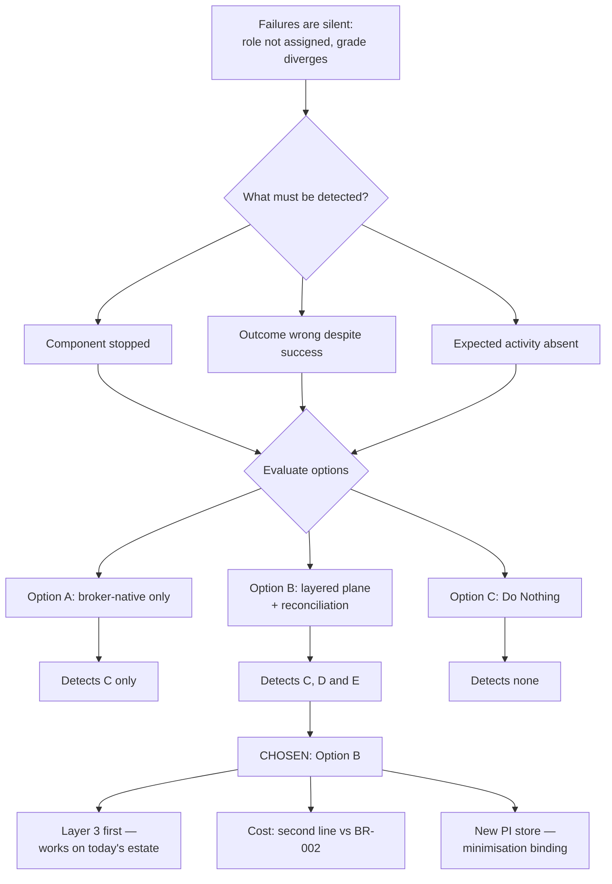

# ADR-003: Logging and Observability Stack for L&T Integrations

> **Template Origin**: Official | **ArcKit Version**: 6.7.5 | **Command**: `/arckit:adr`

## Document Control

| Field | Value |
|-------|-------|
| **Document ID** | ARC-001-ADR-003-v1.0 |
| **Document Type** | Architecture Decision Record |
| **ADR Number** | ADR-003 |
| **Project** | Learning & Teaching Baseline Strategy (Project 001) |
| **Classification** | OFFICIAL |
| **Status** | **Proposed** |
| **Version** | 1.0 |
| **Created Date** | 2026-07-29 |
| **Last Modified** | 2026-07-29 |
| **Review Cycle** | Initial review 3 months after first integration; annually thereafter |
| **Review Date** | 2026-08-28 |
| **Escalation Level** | Department |
| **Governance Forum** | RIFF Review → Education Committee → Operations Committee |
| **Owner** | Sam Okafor, Integration Architect |
| **Reviewed By** | [PENDING] |
| **Approved By** | [PENDING] |
| **Distribution** | Project Team; Digital & IT; Learning Technologies; Student Administration; Privacy & Records; Cybersecurity; Steering Committee |

## Revision History

| Version | Date | Author | Changes | Approved By | Approval Date |
|---------|------|--------|---------|-------------|---------------|
| 1.0 | 2026-07-29 | ArcKit AI | Initial creation from `/arckit:adr` command — observability decision supporting the mediation approach recorded in ADR-001 | [PENDING] | [PENDING] |

---

## 1. Decision Title

**Logging and Observability Stack for L&T Integrations**

What telemetry the integration estate emits, where it is collected, and — the question that actually matters here — how the university detects that an integration has *silently produced the wrong outcome*, as distinct from detecting that a component has stopped.

---

## 2. Stakeholders

### 2.1 Deciders (RACI: Accountable)

- **Cassandra "Cas" Rhodes, Chief Information Officer** — accountable for BR-004 (integration fragility and manual handling eliminated) and owner of risk R-006 (integration estate fragility); funds the operational tooling and the on-call capability this decision assumes
- **Dr. Benny Moog, Director, Learning Technologies** — accountable for the service the failures land on; his team currently absorbs the cost of discovering integration failures through user reports

### 2.2 Consulted (RACI: Consulted)

- **Sam Okafor, Integration Architect** — decision owner; operates the outcome; owns INT-001 to INT-008 and driver SD-7 (an architecture he can sustain)
- **Tobias Ohm, Cybersecurity Lead** — telemetry is simultaneously a security control (NFR-SEC-002, Essential Eight monitoring and logging posture) and, if designed carelessly, a new personal-information store
- **Eleanor Frame, Privacy & Records Officer** — logs of integration flows carrying personal information are themselves a privacy surface; the minimisation and retention position in §6.4 requires her sign-off before build
- **Prof. Priya Anand, Dean, Health Sciences** — owner of risk R-008 (placement grades re-keyed by hand); the reconciliation layer in this decision is the only control available for that flow until INT-005 is delivered
- **Rhonda Bell, Project Manager** — sequencing against the 31 August 2026 deliverable

### 2.3 Informed (RACI: Informed)

- **Prof. Otis Hammond, Deputy Vice-Chancellor (Education)** — the "failures found by monitoring, not by students" claim is a headline commitment of the WP9 roadmap
- **Dr. Felix Marimba, Academic Lead (Digital Learning)** — REQ-023, REQ-025, REQ-026 and REQ-028 all become measurable through this decision
- **A/Prof. Pearl Clavinet, Dean of L&T** — academic consequence of undetected role and grade failures
- **Student Administration** — consumers of the enrolment and role reconciliation reports
- **Learning Technologists (Persona 5)** — the primary day-to-day users of whatever is built

### 2.4 Escalation Context

**Decision Level**: Department

**Escalation Rationale**:

- [ ] **Team** — this is not a local implementation choice; the outcome binds every integration in the estate
- [ ] **Cross-team** — broader than an integration pattern; it sets a monitoring standard and an operating model
- [x] **Department** — establishes a technology standard for telemetry across the L&T estate, creates a new data store holding derived personal information, and commits Digital & IT to an alerting and on-call obligation it does not currently carry
- [ ] **Cross-government** — not applicable; The University of Funk is a private Australian higher-education institution

**Governance Forum**: RIFF Review → Education Committee → Operations Committee (consistent with ADR-001 and ADR-002)

**Approval Date**: [PENDING]

---

## 3. Context and Problem Statement

### 3.1 Problem Description

A student enrols on Monday. On Tuesday they cannot open their unit site. Nobody in Digital & IT knows, because nothing failed loudly: the nightly flat-file job ran, exited zero, and the role assignment inside Blackboard did not take [SL-C1]. The first signal the university receives is a help-desk ticket, and by then the student has lost a day of teaching.

That is the failure mode this decision addresses. It is not an availability problem — the systems were up. It is an **observability** problem: the estate emits no evidence about whether a flow achieved its intended effect.

**Problem statement as a question**: What logging and observability capability must the L&T integration estate have in order to detect failure, diagnose cause and confirm recovery *without a user reporting it first* (NFR-M-001) — and does that capability come free with the integration broker chosen in ADR-001, or does it need to be decided separately?

### 3.2 Why This Decision Is Needed Now

**It is a distinct decision from ADR-001, and treating it as a by-product of that one is the mistake this ADR exists to prevent.** ADR-001 selected a central integration broker and listed "single observability plane" among its benefits. A broker gives a single view of *broker* activity: messages published, consumed, retried, dead-lettered. That is necessary and it is not sufficient. Three of the estate's documented failures are invisible to it:

| Current failure [SL-C1] | Why broker telemetry alone would not detect it |
|---|---|
| PeopleSoft → Blackboard nightly flat-file: **role assignment failures** | The message is published and consumed successfully. The target platform accepts the call and does not apply the role. Delivery telemetry reports success; the outcome is wrong |
| Course cloning: **undocumented semi-manual scripts, single-person dependency** | The scripts do not run through the broker at all. They emit nothing, attributable to no one (R-007) |
| Sonia ↔ Blackboard placement grades: **manual re-keying** | A human is the transport. There is no message to observe. Divergence between the two systems is detectable only by comparing their state |

Two further estate conditions make the timing non-negotiable:

- **NFR-P-001 is unprovable without this.** The 15-minute propagation target is a Must requirement and the single most quotable commitment in the strategy. There is currently no instrument capable of measuring it. A target that cannot be measured cannot be reported to the Education Committee, and cannot be defended in the September business case (BR-003).
- **A broker concentrates risk.** ADR-001 accepts that the broker becomes a shared runtime dependency affecting every integration simultaneously. That trade-off is only tolerable if degradation is visible early. Observability is the compensating control for the risk ADR-001 knowingly took on.

### 3.3 Regulatory and Policy Context

- **Privacy Act 1988 (APPs)** — telemetry about flows carrying personal information is itself a collection of personal information. APP 3 (collection minimisation), APP 11 (security) and APP 11.2 (destruction when no longer needed) apply to the observability store exactly as they apply to the platforms it observes. Designing this carelessly would create a ninth personal-information class while remediating the other eight (DR-003, NFR-C-001)
- **ASD Essential Eight** — event logging and monitoring underpin the ML2 target (NFR-SEC-002, R-020). Centralised, tamper-evident logging of privileged and identity-affecting operations is a direct contributor
- **RIFF governance** — any new tooling purchase must first show that licensed capability cannot serve [SGP-C1]; Principle 19 applies to observability tooling as to anything else
- **Institutional records policy** — NFR-C-003 requires changes to grades, assessment outcomes and role assignment to be logged with actor, timestamp and prior value. That is an audit obligation, and it is deliberately kept distinct from operational telemetry in §6.4

> **Not applicable**: GDS Service Standard, Technology Code of Practice, NCSC Cyber Essentials and UK GDPR are UK Government frameworks with no standing for an Australian university. The equivalent obligations are the Privacy Act 1988, the ASD Essential Eight, and the university's own RIFF process. This ADR therefore omits the GDS/TCoP impact tables the base template offers, rather than completing them with fabricated ratings.

---

## 4. Decision Drivers (Forces)

### 4.1 Technical Drivers

| Driver | Requirement | Note |
|--------|-------------|------|
| Detect failure without a user report | NFR-M-001 | The defining requirement. Rated MUST_HAVE |
| Prove propagation latency against a stated target | NFR-P-001 | 15 minutes at the 95th percentile — currently unmeasured and therefore unprovable |
| Failed records visible and recoverable, never silently discarded | NFR-M-001, INT-001, INT-005 | Requires a durable, inspectable failure store, not just an alert |
| Attributable execution of operational automation | NFR-M-002 | Course cloning currently logs nothing (R-007) |
| Audit trail for grades, outcomes and role assignment | NFR-C-003 | Actor, timestamp, prior value — an evidentiary record, not a metric |
| Availability of a new shared dependency | NFR-A-001 | Observability must degrade independently of the broker it observes |
| Telemetry as an Essential Eight control | NFR-SEC-002 | Centralised logging contributes to the ML2 pathway (R-020) |
| End-to-end coverage, not endpoint availability | Principle 17 | Explicit in the principle's validation gates |

### 4.2 Business Drivers

| Driver | Requirement | Note |
|--------|-------------|------|
| Integration fragility and manual handling eliminated | BR-004 | Success criterion states failures are detected by monitoring rather than user report |
| Licence spend flat or reduced | BR-002 | Constrains tooling purchase; observability is a second cost line after the broker |
| Strategy delivered to business case timing | BR-003 | The measurement claims in the roadmap depend on an instrument existing |
| Governance operating on architectural evidence | BR-007 | Reconciliation output feeds the capability map with real failure data, not anecdote |
| Reduce the support burden carried by Learning Technologies | SD-6, Persona 5 | Discovering failures via user reports is the team's documented pain point |

### 4.3 Data Drivers

- **DR-003** personal information classification — telemetry must be classified before it is built, not after
- **DR-004** sensitive placement records — placement telemetry must not reproduce clearance metadata or health-context notes in logs
- **DR-005** data residency register — a hosted observability backend is a platform holding personal information and enters the register
- **DR-006** analytics minimisation and retention — the same minimisation logic applies to operational telemetry

### 4.4 Alignment to Architecture Principles

| # | Principle | Criticality | Alignment | Effect on this decision |
|---|-----------|-------------|-----------|------------------------|
| 5 | Single Source of Truth for Core Entities | CRITICAL | ✅ Supports | Reconciliation *tests* the principle: it continuously compares the authoritative source against every derived copy |
| 7 | Privacy by Design and Data Minimisation | CRITICAL | ⚠️ Partial — requires active design | Telemetry is a new collection. Identifiers only, never payloads (§6.4) |
| 8 | Data Residency and Cross-Border Accountability | CRITICAL | ⚠️ Partial — constrains options | Any hosted backend must be Australian-region or carry an APP 8 assessment |
| 9 | Data Portability and Exit | HIGH | ✅ Supports | Vendor-neutral instrumentation keeps the backend substitutable |
| 13 | Reproducible, Documented Automation | HIGH | ✅ Supports | Execution logging is how "attributable" becomes verifiable |
| 15 | Availability Aligned to the Teaching Calendar | HIGH | ✅ Supports | Alert thresholds differentiated by academic period |
| 16 | Layered Security Posture | CRITICAL | ✅ Supports | Centralised logging of identity-affecting operations serves the ML2 pathway |
| 17 | Observable Integrations and Services | HIGH | ✅ **Directly on point** | This ADR is the implementation of Principle 17. All five of its validation gates map to §8.1 |
| 19 | Realise Licensed Capability Before New Spend | HIGH | ⚠️ Constrains | Existing licensed monitoring capability must be tested before any purchase (Condition 1) |

**Principle 17 validation gates, mapped:**

| Gate | Where satisfied |
|------|-----------------|
| Success, failure and volume telemetry per integration | Layer 2 (§6.1) |
| Alerts routed to a named owner with a runbook | §6.5 alert routing |
| Failed records visible and recoverable | Layer 2 dead-letter inspection |
| End-to-end flow monitored, not only endpoint availability | Layer 3 reconciliation (§6.1) |
| Telemetry retention sufficient for pattern analysis | §6.4, 13-month retention |

---

## 5. Considered Options

Three options analysed: two active alternatives plus a Do Nothing baseline.

1. **Option A** — Broker-native observability only
2. **Option B** — Layered observability plane with vendor-neutral instrumentation and state reconciliation
3. **Option C** — Do Nothing (baseline)

### Option A: Broker-native observability only

**Description**: Use whatever monitoring, dashboards and alerting ship with the integration broker selected under ADR-001. No separate observability tooling, no separate instrumentation standard. Integration health is defined as broker health.

**Implementation approach**: Enable the broker's built-in metrics and dead-letter queue views. Configure its native alerting to email a Digital & IT distribution list. Endpoint availability checks handled by the existing infrastructure monitoring.

**Wardley evolution stage**: Product (0.70) — consuming a mature feature of a product already being acquired.

#### Good

- ✅ **Zero incremental licence cost** — the strongest BR-002 and Principle 19 position available. Nothing to justify at RIFF
- ✅ **Fastest to stand up** — available the day the broker is deployed, with no separate selection or procurement step
- ✅ **No new skills beyond those ADR-001 already commits the team to acquire**
- ✅ **No new personal-information store** — the privacy surface is the broker's, already being assessed
- ✅ Satisfies the *delivery* half of NFR-M-001 competently: published, consumed, retried and dead-lettered counts are exactly what brokers report well

#### Bad

- ❌ **Does not detect the estate's actual failure mode.** Role assignment failures are silent successes at the transport layer. This is not a gap at the margin — it is the single most-cited defect in the current landscape [SL-C1]
- ❌ **Blind to everything outside the broker.** Course cloning scripts (R-007) and manual placement re-keying (R-008, R-018) never touch it, and those are two of the top five residual risks in the register
- ❌ **Cannot measure NFR-P-001 end-to-end.** It measures broker transit time, not source-change-to-target-effect latency. The reported figure would be optimistic and, worse, defensible-sounding
- ❌ **Fails Principle 17's fourth validation gate explicitly** — "end-to-end flow monitored, not only endpoint availability"
- ❌ **Shares a failure domain with the thing it observes.** When the broker degrades, the tool reporting on the broker degrades with it, against NFR-A-001
- ❌ Vendor-specific telemetry formats increase the exit cost of the broker itself, weakening the Principle 9 position ADR-001 relies on as its lock-in mitigation

#### Cost analysis *(indicative — no costing baseline exists for project 001; see §14 A-1)*

| | Estimate |
|---|---|
| CAPEX | Configuration only. Effectively nil |
| OPEX | Nil incremental licence |
| 3-year TCO | Lowest cash cost. Hidden cost persists as help-desk load and as academic consequence that never appears on a technology budget line |

---

### Option B: Layered observability plane with vendor-neutral instrumentation and state reconciliation

**Description**: A three-layer observability capability, instrumented through an open standard so the backend remains substitutable, and — the distinguishing element — including a reconciliation layer that verifies the *effect* of a flow in the target system rather than the *delivery* of a message.

**Implementation approach**:

| Layer | What it answers | Mechanism |
|-------|-----------------|-----------|
| **1. Endpoint and component health** | Is the broker up? Is the SaaS API responding? | Synthetic checks and uptime monitoring per integration endpoint, including vendor status feeds |
| **2. Flow telemetry** | Did this event publish, deliver, retry, dead-letter? How long did it take? | OpenTelemetry traces, metrics and structured logs emitted by the broker and by each integration adapter, correlated by a single trace identifier carried from source change to target write |
| **3. Entity-state reconciliation** | **Does the derived copy actually match the authoritative source?** | Scheduled comparison of authoritative state against each derived copy, per canonical entity (DR-001). Divergence produces a discrepancy record, not a log line |

Layer 3 is what makes this option different from Option A, and it is the layer that addresses the university's real problem. It detects a role that was never applied, a group that never appeared, and a grade that diverges between Sonia and Blackboard — including while that grade is still being moved by hand.

Instrumentation is **OpenTelemetry**, chosen as an open standard rather than a product, so the collection backend (managed or self-hosted) is a substitutable component under Principle 9. Backend selection is deliberately deferred to Condition 1: this ADR decides the *architecture* of observability, not the vendor.

**Wardley evolution stage**: Layer 1 Commodity (0.85); Layer 2 Product (0.70) with a Commodity instrumentation standard; Layer 3 Custom-built (0.30) — reconciliation logic is specific to the canonical model and has no off-the-shelf equivalent.

#### Good

- ✅ **Detects silent semantic failure** — the documented, recurring, academically consequential failure that Option A cannot see. This is the whole justification
- ✅ **Covers flows that are not yet automated.** Reconciliation compares state, so it works whether the transport is a broker message, a legacy batch file, or a human with a spreadsheet. It therefore provides the *only* available detective control for R-008 and R-018 during the period before INT-005 is delivered — and that period is measured in quarters
- ✅ **Makes NFR-P-001 measurable end-to-end**, from source change to target effect, at the 95th percentile the requirement actually specifies
- ✅ **Closes the attribution gap in course cloning** (R-007, NFR-M-002) by requiring cloning automation to emit structured execution events before it may run in production
- ✅ **Independent failure domain** from the broker — degradation of the observed system does not blind the observer (NFR-A-001)
- ✅ **Vendor-neutral instrumentation** preserves substitutability of both the observability backend and the broker (Principle 9, NFR-I-002)
- ✅ **Contributes directly to the Essential Eight ML2 pathway** through centralised logging of identity-affecting operations (NFR-SEC-002, R-020)
- ✅ **Produces governance evidence.** Discrepancy rates per integration give RIFF and the capability map real failure data instead of anecdote (BR-007)
- ✅ Satisfies all five Principle 17 validation gates, not three of five

#### Bad

- ❌ **Second cost line after the broker, against BR-002.** Following an ADR-001 that already adds cost, this compounds the affordability objection. It is the most likely reason for this ADR to be rejected, and pretending otherwise would be dishonest
- ❌ **Layer 3 is custom-built and must be maintained.** Reconciliation logic is coupled to the canonical model; every schema change is a change here too. This is real, permanent, unglamorous maintenance
- ❌ **Creates a new store of derived personal information** — identifiers, timestamps and discrepancy records — requiring classification, residency treatment and automated retention before it holds a single record (DR-003, DR-005, NFR-C-002)
- ❌ **Alert fatigue is a live risk, not a theoretical one.** An estate with this many known-broken flows will generate a high initial alert volume; a team that learns to ignore alerts is worse off than one with no alerts, because it believes it is covered
- ❌ **Assumes an on-call capability Digital & IT does not currently operate** for L&T integrations. Alerting to a named owner is meaningless outside business hours if no one is rostered
- ❌ **Reconciliation depends on read access to every derived copy.** Several SaaS platforms may not expose sufficient read APIs, and TC-1 warns that interface capability is bounded by what vendors support (R-026)
- ❌ Slower to full coverage than Option A — Layer 1 lands in weeks, Layer 3 for all entities takes a year

#### Cost analysis *(indicative)*

| | Estimate |
|---|---|
| CAPEX | Instrumentation of adapters; reconciliation build per canonical entity; dashboard and runbook development |
| OPEX | Backend licence or hosting; ongoing reconciliation maintenance tracking schema change; on-call capability |
| 3-year TCO | Highest visible cost of the three. Offset — and the offset must be measured, not asserted — against help-desk load, the manual reconciliation Student Administration performs today, and the cost of failures currently absorbed by academics and students |

---

### Option C: Do Nothing (baseline)

**Description**: Retain the current position. Integrations report nothing systematically. Failures are discovered when a student, tutor or coordinator reports that something did not happen. If ADR-001 proceeds, take whatever the broker offers by default and make no deliberate decision about observability.

#### Good

- ✅ No cost, no new tooling, no new privacy surface, no on-call obligation
- ✅ Staff have adapted; informal detection routes exist and partially work
- ✅ No new component to operate during an already busy delivery period

#### Bad

- ❌ **Fails NFR-M-001 outright.** The requirement exists specifically to end detection-by-user-report, and it is rated MUST_HAVE
- ❌ **Fails BR-004's stated success criterion** — "integration failures detected by monitoring rather than user report"
- ❌ **Fails Principle 17 on all five validation gates**
- ❌ **Leaves NFR-P-001 unmeasurable**, so the strategy's most prominent commitment cannot be evidenced to the Education Committee or the business case
- ❌ Leaves R-006 and R-007 with no detective control, and leaves R-008/R-018 detectable only by the manual checking the register already rates as the weakest control in the estate
- ❌ **Actively increases risk if ADR-001 proceeds**, because a shared broker dependency without visibility is worse than distributed point-to-point failure: the blast radius grows while the detection capability does not
- ❌ Transfers the cost of detection to students and academics, which is precisely the transfer the survey objected to

**Retained as a genuine baseline, not a strawman.** The RIFF pause provision permits closing a request, and there is a legitimate sequencing argument that observability should follow the broker rather than accompany it. That argument is addressed and rejected in §6.3.

---

## 6. Decision Outcome

### 6.1 Chosen Option

**Option B — Layered observability plane with vendor-neutral instrumentation and state reconciliation**, delivered in layer order, with backend selection deferred to the Principle 19 test.

The three layers are adopted as a **standard**, not as a product: any integration entering production must satisfy the layer definitions in §5 Option B regardless of which backend is eventually selected.

### 6.2 Y-Statement

> In the context of **an integration estate whose documented failures are silent — a role that was never assigned, a group that never appeared, a grade re-keyed with a typo**,
> facing **the fact that transport-level telemetry reports success for every one of those failures, and that a central broker concentrates the consequences of not knowing**,
> we decided for **a three-layer observability plane with vendor-neutral instrumentation and continuous reconciliation of derived state against the authoritative source**,
> and against **relying on the integration broker's native monitoring alone**,
> to achieve **detection of wrong outcomes rather than merely stopped components, a measurable 15-minute propagation target, and a detective control over the manual placement-grade flow that works before that flow is automated**,
> accepting **a second cost line against a constrained licence envelope, a custom-built reconciliation layer coupled to the canonical model, a new store of derived personal information, and an on-call obligation Digital & IT does not currently carry**.

### 6.3 Justification

**Why not Option A, despite its unbeatable cost position.** Option A monitors the transport. The university's problem is not the transport. Every failure named in the system landscape — role assignment failures, hierarchy drift, timetable changes not reflected, grades re-keyed [SL-C1] — is a case where the components worked and the outcome was wrong. An observability capability that would have reported "healthy" throughout the entire history of the current estate's known defects is not a capability; it is a reassurance mechanism. Option A is retained as the *first layer* of Option B, which is the correct role for it.

**Why not Option C, and why "sequence it after the broker" fails as an argument.** The sequencing argument sounds prudent: build the broker, then instrument it. It fails on two grounds. First, retrofitting instrumentation costs more than building it in, and adapters written without trace propagation cannot be correlated end-to-end afterwards without rework. Second, and more importantly, **Layer 3 delivers value before the broker delivers anything at all.** Reconciliation between PeopleSoft and Blackboard, and between Sonia and Blackboard, can run against today's estate — against the nightly flat file and against the manual re-keying — and would surface divergence now, while INT-001 and INT-005 are still quarters away. Deferring observability defers the only control available in the interim.

**Why Option B despite the cost.** ADR-001 accepted a shared runtime dependency on the explicit basis that its failure modes would be visible. This ADR is where that assumption is either honoured or quietly abandoned. Approving the broker and declining its observability is not a saving; it is the purchase of a concentrated risk without the compensating control that made it acceptable.

**Risk appetite.** The register's stated posture is to treat, not tolerate, operational and compliance risks scoring 15 or above. R-006 (15), R-008 (16) and R-018 (16) all sit in that band, and all three are marked as having weak or no effective control today. A detective control is the cheapest available movement on all three.

### 6.4 Telemetry data position (binding)

This is a design constraint of the decision, not an implementation detail, and it requires Privacy & Records sign-off before build.

| Aspect | Position |
|--------|----------|
| **What telemetry carries** | Entity identifiers, event type, timestamps, source and target system, outcome, error classification, trace identifier |
| **What telemetry must never carry** | Message payloads; grade values; free-text feedback; any content of placement records — specifically clearance metadata and health-context notes (DR-004, RESTRICTED) |
| **Discrepancy records** | Record *that* a divergence exists and on which identifier, not the divergent values themselves. Resolution requires an authorised, logged lookup in the source systems |
| **Classification** | CONFIDENTIAL. Contains derived personal information (identifiers linked to enrolment and role state) |
| **Residency** | Australian region required for any hosted backend. Offshore hosting triggers an APP 8 assessment and formal acceptance before adoption (NFR-C-002, DR-005) |
| **Retention** | 13 months, enforced automatically. Chosen deliberately: 12 months permits year-on-year comparison of the same point in the teaching calendar, and the additional month covers the reporting lag on a full academic year. Principle 17 requires retention "sufficient for pattern analysis"; 30 days is not |
| **Access** | Least privilege. Read access to reconciliation output for Learning Technologies and Student Administration; full trace access restricted to the integration team and Cybersecurity |
| **Relationship to NFR-C-003 audit logging** | **Deliberately separate.** Audit records for grades, outcomes and role assignment carry actor, timestamp and prior value, are evidentiary, and follow institutional records retention. Operational telemetry is diagnostic and expires at 13 months. Conflating them would either under-retain the audit record or over-retain the telemetry. Both are wrong |

### 6.5 Alerting position (binding)

- **Alert on absence, not only on error.** The defining property of the current failures is that they are silent — a batch that does not run produces no error, it produces nothing. Every scheduled and event-driven flow carries a heartbeat expectation, and the absence of expected activity within its window is itself an alertable condition. Without this, the estate's actual failure mode remains undetected under Option B as surely as under Option A
- **Every alert routes to a named owner with a runbook.** An alert with no runbook is deleted; an alert with no named owner is everybody's and therefore nobody's (Principle 17 gate 2)
- **Thresholds differentiate by academic period.** A propagation delay in week one of a teaching period and the same delay in the inter-semester break are different events (Principle 15, NFR-A-002)
- **Alert volume is itself a monitored metric,** reviewed at the initial 3-month review. If the team is ignoring alerts, the capability has failed regardless of its coverage

### 6.6 Conditions attached to this decision

This decision is **Proposed**, not Accepted, and carries four conditions:

1. **Principle 19 test before any procurement.** Digital & IT to confirm in writing whether existing licensed capability — including the Microsoft agreement and the incumbent infrastructure monitoring platform — can serve as the Layer 1 and Layer 2 backend. This is the same duplication test RIFF applies to any request [SGP-C1], and it is the same condition ADR-001 carries. Where the tests overlap, run them once
2. **Privacy sign-off on §6.4 before build.** Eleanor Frame to confirm the minimisation, residency and retention position. Telemetry must not become the ninth personal-information class
3. **Reconciliation read access verified per platform before commitment.** For each derived copy, confirm the platform exposes sufficient read capability. Where it does not, the gap is recorded as a named exception with a review date rather than discovered mid-build (TC-1, R-026)
4. **On-call and runbook coverage agreed before the first alert is enabled.** Alerting without a rostered responder is theatre. If out-of-hours coverage is not funded, alerts are explicitly scoped to business hours and the residual exposure is stated openly rather than implied away

### 6.7 Dissent recorded

No formal dissent at time of writing. **Two objections are anticipated and both are legitimate:**

- **Cost, from Finance (SD-3).** This is the second cost line arising from the integration workstream. The counter-argument is that the current detection cost is not zero — it is paid by Learning Technologies in support load, by Student Administration in manual checking, and by students in lost teaching days. That cost is unmeasured, which is not the same as absent. It should be baselined during WP3 so the comparison is evidential rather than rhetorical
- **Sequencing, from delivery (SD-9).** That observability should follow the broker rather than accompany it. Addressed in §6.3: Layer 3 delivers value against the *current* estate, before the broker exists

---

## 7. Consequences

### 7.1 Positive

| Consequence | Measure | Baseline → Target |
|-------------|---------|-------------------|
| Failures detected by monitoring, not user report | Share of integration failures first detected by telemetry | Not measured (believed near 0%) → 100% (BR-004 success criterion) |
| Propagation latency becomes measurable | 95th-percentile source-change-to-target-effect latency | Unmeasurable → reported weekly against the 15-minute target (NFR-P-001) |
| Silent role-assignment failure becomes visible | Role discrepancies between PeopleSoft and Blackboard | Undetected until reported → detected within the reconciliation window (R-006, DR-002) |
| Placement grade divergence detected before the flow is automated | Sonia/Blackboard grade discrepancies | Detected by manual checking only → detected by reconciliation (R-008, R-018) |
| Course cloning becomes attributable | Cloning executions with actor, timestamp and scope logged | 0% → 100% (NFR-M-002, R-007) |
| Failed records recoverable rather than discarded | Failed records visible in an inspectable store | Unknown → 100% |
| Essential Eight logging posture improves | Centralised logging of identity-affecting operations | Not centralised → centralised (NFR-SEC-002, R-020) |
| Governance operates on failure data | Discrepancy rate per integration available to RIFF | Anecdote → measured (BR-007) |

### 7.2 Negative — accepted trade-offs

| Trade-off | Mitigation |
|-----------|-----------|
| Second cost line against BR-002 | Principle 19 test first (Condition 1); run jointly with ADR-001's test; baseline the current detection cost during WP3 so the comparison is evidential |
| Layer 3 is custom-built and permanently maintained | Scope reconciliation to the six canonical entities only; schema change process from ADR-001 explicitly includes reconciliation impact |
| New store of derived personal information | Binding minimisation position (§6.4); privacy sign-off before build (Condition 2); automated 13-month expiry |
| Alert fatigue in an estate with many broken flows | Phase alerting behind reconciliation reporting — measure discrepancy volume first, then set thresholds against observed reality rather than aspiration; alert volume itself reviewed at 3 months |
| On-call obligation not currently held | Condition 4 — coverage agreed before alerts are enabled, or business-hours scope stated openly |
| Reconciliation blocked where SaaS read APIs are insufficient | Condition 3 — verified per platform before commitment; gaps recorded as named exceptions with review dates |
| Slower to full coverage than Option A | Layer order delivers Layer 1 in weeks; Layer 3 prioritised on INT-001 and INT-005 first, matching ADR-001's phasing |

### 7.3 Neutral — changes required

- 🔄 Instrumentation standard published and versioned; conformance becomes a precondition for an integration entering production
- 🔄 Runbook per alert class, held with the integration documentation, executable by a second person (Principle 13)
- 🔄 Reconciliation output routed to Student Administration and Learning Technologies as a working report, not only to Digital & IT — the people who can *fix* a role discrepancy are not the people who operate the broker
- 🔄 Observability backend enters the data residency register (DR-005) and the platform inventory
- 🔄 Skills uplift in distributed tracing, alongside the broker skills ADR-001 already commits to
- 🔄 Cloning automation modified to emit execution events before it may run in production (R-007)

### 7.4 Risks and mitigations

| Risk | Likelihood | Impact | Mitigation | Owner |
|------|-----------|--------|------------|-------|
| Alert fatigue — the team stops responding and believes itself covered | HIGH | HIGH | Reconciliation reporting before alerting; thresholds set from observed volume; alert volume reviewed at 3 months | Sam Okafor |
| Cost objection blocks the decision at RIFF | MEDIUM | HIGH | Principle 19 test run jointly with ADR-001's; current detection cost baselined in WP3 | Cassandra Rhodes |
| Telemetry becomes a new privacy exposure | MEDIUM | HIGH | Binding §6.4 position; privacy sign-off before build; identifiers not payloads; automated expiry | Eleanor Frame |
| SaaS platforms cannot expose read APIs for reconciliation | MEDIUM | MEDIUM | Verified per platform before commitment (Condition 3); recorded exception where absent | Sam Okafor |
| Layer 3 maintenance decays as the canonical model evolves | MEDIUM | MEDIUM | Reconciliation impact added to the schema change process; named owner per canonical entity | Sam Okafor |
| Observability delivered but never operationalised — dashboards nobody opens | MEDIUM | MEDIUM | Reconciliation output routed to the teams who can act; adoption reviewed at 3 months | Dr. Benny Moog |
| Scope creep — the plane becomes institutional monitoring | LOW | MEDIUM | Boundary declared under Principle 2; additions via RIFF | Dr. Benny Moog |

**Existing risks affected**: R-006 (integration estate fragility) — detective control added; likelihood of *undetected* failure materially reduced, though the underlying fragility is addressed by ADR-001 rather than here. R-007 (cloning single-person dependency) — attribution gap closed; the knowledge dependency itself remains until the scripts are documented and version-controlled. R-008 and R-018 (placement grades) — first effective detective control, available before INT-005 lands. R-020 (Essential Eight ML2) — logging posture contribution. R-026 (vendor interface limits) — surfaced earlier through Condition 3.

---

## 8. Validation and Compliance

### 8.1 How implementation will be verified

**Design review**

- [ ] WP5 integration architecture and WP8 target state both reflect the three-layer standard; a design proposing an integration without Layer 2 instrumentation is non-conformant
- [ ] Each integration's design names its reconciliation entity, its heartbeat expectation, and its alert owner

**Conformance check**

- [ ] `/arckit:conformance` after implementation, verifying each integration emits against the instrumentation standard
- [ ] Principle 17's five validation gates assessed per integration, not per estate

**Testing strategy**

- [ ] Failure-injection testing: a deliberately dropped role assignment must be detected by reconciliation within its window. **This is the acceptance test for the whole decision** — if an injected silent failure is not caught, the capability has not been delivered regardless of what the dashboards show
- [ ] Heartbeat testing: a suppressed scheduled run must raise an absence alert
- [ ] Latency measurement validated against a known-timed source change
- [ ] Privacy verification: inspect telemetry stores for payload leakage, specifically placement record content (DR-004)

### 8.2 Monitoring the monitoring

| Metric | Target | Source |
|--------|--------|--------|
| Share of failures first detected by telemetry rather than user report | 100% | Incident records cross-referenced with alert history |
| Reconciliation discrepancy rate per integration | Trending down; no unexplained discrepancies (DR quality position) | Layer 3 output |
| 95th-percentile propagation latency | Within 15 minutes (NFR-P-001) | Layer 2 traces |
| Alerts raised vs alerts actioned | Gap trending to zero — a widening gap indicates fatigue | Alert history |
| Observability plane availability | Independent of, and not lower than, broker availability (NFR-A-001) | Layer 1 |
| Telemetry records past retention | Zero (APP 11.2) | Retention job |

### 8.3 Compliance verification

- **Privacy Act 1988** — §6.4 is the APP 3, APP 8 and APP 11.2 position for the observability store. Privacy sign-off is Condition 2. The store enters DR-003's inventory and DR-005's residency register
- **ASD Essential Eight** — centralised logging of identity-affecting operations contributes to the ML2 pathway (NFR-SEC-002, R-020). Tobias Ohm to confirm the contribution is recognised in the maturity assessment rather than assumed
- **NFR-C-003 audit logging** — satisfied by the separate evidentiary record described in §6.4, not by operational telemetry
- **RIFF governance** — Principle 19 duplication test is a precondition (Condition 1)

---

## 9. Traceability

### 9.1 Requirements addressed

| Type | IDs |
|------|-----|
| Business | BR-003, BR-004, BR-007 (BR-002 constrains rather than is addressed) |
| Integration | INT-001 to INT-009 — all nine, since the standard binds every integration |
| Non-functional | NFR-M-001 (primary), NFR-M-002, NFR-P-001, NFR-A-001, NFR-A-002, NFR-SEC-002, NFR-SEC-003, NFR-C-001, NFR-C-002, NFR-C-003, NFR-I-002 |
| Data | DR-001, DR-002, DR-003, DR-004, DR-005, DR-006 |
| Functional | FR-009 (capture publication failure alerting), FR-014, FR-018 |

### 9.2 Architecture artifacts

| Artifact | Relationship |
|----------|-------------|
| `projects/000-global/ARC-000-PRIN-v1.1.md` | Principle 17 implemented; Principles 5, 7, 8, 9, 13, 15, 16, 19 engaged |
| `projects/001-lt-ecosystem/ARC-001-REQ-v1.0.md` | Source of all requirement IDs above |
| `projects/001-lt-ecosystem/ARC-001-DATA-v1.0.md` | Canonical entities are the unit of reconciliation |
| `projects/001-lt-ecosystem/ARC-001-RISK-v1.0.md` | R-006, R-007, R-008, R-018, R-020, R-026 |
| `projects/001-lt-ecosystem/ARC-001-STKE-v1.0.md` | SD-2 (Rhodes), SD-6 (Moog), SD-7 (Okafor), SD-10 (Ohm), SD-11 (Frame), SD-14 (Anand) |
| `projects/001-lt-ecosystem/decisions/ARC-001-ADR-001-v1.0.md` | **Supports.** ADR-001 selects the broker; this ADR provides the visibility its shared-dependency trade-off assumes |
| `projects/001-lt-ecosystem/decisions/ARC-001-ADR-002-v1.0.md` | Role-assignment reconciliation is meaningful only once the authoritative source for role is settled |
| `projects/001-lt-ecosystem/external/system-landscape.md` | Source of the concrete failure modes this decision targets |

### 9.3 Stakeholder goals supported

- **SD-2 (Rhodes)** — eliminate fragility and reach the security target; detection is the precondition for both
- **SD-6 (Moog)** — protect pedagogical fit by removing the support burden that currently falls on Learning Technologies
- **SD-7 (Okafor)** — an architecture he can sustain; an unobservable estate is by definition unsustainable
- **SD-11 (Frame)** — APP compliance and breach readiness; reconciliation is also an early-warning signal for unauthorised divergence
- **SD-14 (Anand)** — placement and assessment integrity

---

## 10. Implementation Plan

### 10.1 Dependencies

- **ADR-001** — the broker decision. Layers 1 and 2 instrument it; Layer 3 does not depend on it and can begin against the current estate
- **ADR-002** — the authoritative source for institutional role. Role reconciliation cannot be authored until "authoritative" is defined
- Condition 1 (Principle 19 test) complete before any procurement
- Condition 2 (privacy sign-off) complete before build
- `ARC-001-DATA-v1.0` canonical entity definitions — already available

### 10.2 Timeline

| Phase | Activity | Duration | Owner |
|-------|----------|----------|-------|
| 0 | Principle 19 test — existing licensed monitoring capability assessed (run jointly with ADR-001 Phase 0) | 2 weeks | Cassandra Rhodes |
| 1 | Telemetry data position confirmed with Privacy & Records; reconciliation read access verified per platform | 3 weeks | Eleanor Frame / Sam Okafor |
| 2 | **Layer 3 first, against the current estate** — PeopleSoft↔Blackboard enrolment and role reconciliation, and Sonia↔Blackboard grade reconciliation. Reporting only, no alerting | 6 weeks | Sam Okafor |
| 3 | Layer 1 endpoint health across all integration endpoints | 3 weeks | Sam Okafor |
| 4 | Layer 2 instrumentation standard published; applied to INT-001 and INT-005 as they are built | Aligned to ADR-001 phases 3–4 | Sam Okafor |
| 5 | Alerting enabled with runbooks and named owners, thresholds set from Phase 2 observed volume | 4 weeks | Sam Okafor |
| 6 | Cloning automation execution logging (R-007) | 3 weeks | Sam Okafor |
| 7 | Remaining integrations instrumented as delivered | Ongoing | Sam Okafor |

**Note on ordering.** Layer 3 precedes Layers 1 and 2 deliberately. It is the layer that works against the estate as it exists today, it produces the discrepancy baseline that makes alert thresholds realistic in Phase 5, and it gives the September business case measured evidence of failure volume rather than assertion.

### 10.3 Rollback plan

**Trigger**: alert volume overwhelming the team without corresponding failure detection; the Principle 19 test showing adequate licensed capability at materially lower cost; privacy assessment finding the telemetry position unacceptable and unremediable.

**Procedure**: alerting is disabled first, leaving reconciliation reporting in place — reporting has no operational load and retains the detective value. Instrumentation remains, since it is standards-based and carries no licence cost. Only a backend change requires re-pointing collectors, which the vendor-neutral instrumentation makes a configuration change rather than a rebuild. That substitutability is the practical payoff of choosing an open standard.

**Owner**: Sam Okafor, escalating to Cassandra Rhodes.

---

## 11. Review and Updates

| Review | When | Criteria |
|--------|------|----------|
| Initial | 3 months after Phase 5 | Are failures being detected before user report? Is the alert-to-action gap closing? Is reconciliation output being used by the teams it is routed to? |
| Periodic | Annually | Still the right layering? Has licensed capability changed? Is the retention period still justified? |

**Trigger events for re-evaluation**: a Microsoft or infrastructure-monitoring licensing change satisfying Condition 1; an integration failure that reaches a student despite the capability being live (a direct falsification of the decision's premise); a privacy finding against the telemetry store; alert volume review showing systematic non-response; broker replacement.

---

## 12. Related Decisions

| Relationship | ADR | Note |
|-------------|-----|------|
| **Depends on** | ADR-001 — Integration Mediation Approach | Layers 1 and 2 instrument the broker. Layer 3 is independent of it and can proceed first |
| **Depends on** | ADR-002 — Authoritative Source for Institutional Role | Role reconciliation requires a settled authority to reconcile against |
| **Supports** | ADR-001 | Provides the visibility that made ADR-001's shared-dependency trade-off acceptable. If this ADR is declined, ADR-001's availability mitigation is weaker than recorded and should be revisited |
| **Candidate successor** | Course cloning automation approach (not yet raised) | ADR-001 flags this; execution logging here is a partial down-payment on it (R-007, NFR-M-002) |
| **Consumed by** | Project 002 lecture capture | 002's provisioning integration inherits the instrumentation standard |

---

## 13. Appendices

### Appendix A: Decision flow

### Appendix B: Coverage of the three named current failures

| Failure [SL-C1] | Option A | Option B |
|---|---|---|
| Nightly flat-file, silent role-assignment failure | ❌ reports healthy | ✅ Layer 3 discrepancy + Layer 2 absence alert |
| Undocumented cloning scripts, single-person dependency | ❌ invisible — does not use the broker | ✅ execution logging makes it attributable (partial: knowledge dependency remains) |
| Manual re-keying of placement grades | ❌ no message exists to observe | ✅ Layer 3 state comparison works regardless of transport |

### Appendix C: Stakeholder consultation log

| Date | Stakeholder | Feedback | Action taken |
|------|-------------|----------|--------------|
| 2026-07-29 | — | No consultation held at time of drafting. This ADR is raised for RIFF consideration and the log is opened, not completed | Conditions 2, 3 and 4 exist precisely because Frame, the platform owners and Digital & IT operations have not yet been consulted |

---

## 14. Assumptions

| # | Assumption | If invalid |
|---|-----------|-----------|
| A-1 | No costing baseline exists for project 001; cost analysis is comparative, not quantified (carried forward from ADR-001) | Option ranking stands on architecture; cost ordering would need revisiting with real figures |
| A-2 | Existing licensed platforms have not been assessed for observability capability | Condition 1 exists to test this. If capability exists, Option B is delivered using it |
| A-3 | Derived copies expose sufficient read APIs for reconciliation on the major platforms | Condition 3; reconciliation coverage reduces to the platforms that can support it, with named exceptions |
| A-4 | The current cost of detection-by-user-report is real but unmeasured | If WP3 baselining shows it is small, the cost argument in §6.7 weakens and the decision should be re-tested at RIFF |
| A-5 | Out-of-hours response is achievable, or business-hours scope is acceptable | Condition 4; if neither holds, alerting value is materially lower than assumed and the residual exposure must be stated in the risk register |

---

## External References

### Document Register

| Doc ID | Filename | Type | Source Location | Description |
|--------|----------|------|-----------------|-------------|
| PRIN | ARC-000-PRIN-v1.1.md | ArcKit artifact | `projects/000-global/` | Principle 17 and supporting principles |
| REQ | ARC-001-REQ-v1.0.md | ArcKit artifact | `projects/001-lt-ecosystem/` | NFR-M-001, NFR-P-001, BR-004 and related requirements |
| ADR1 | ARC-001-ADR-001-v1.0.md | ArcKit artifact | `projects/001-lt-ecosystem/decisions/` | Integration mediation approach this decision supports |
| SL | system-landscape.md | Foundation artifact | `projects/001-lt-ecosystem/external/` | Current integration inventory and known failure modes |
| SGP | solution-governance-process.md | Foundation artifact | `projects/000-global/policies/` | RIFF Review and the licensed-capability duplication rule |

### Citations

| Citation ID | Doc ID | Page/Section | Category | Quoted Passage |
|-------------|--------|--------------|----------|----------------|
| SL-C1 | SL | Known integrations (WP4/WP5 focus) | Risk Factor | "PeopleSoft → Blackboard ... Nightly batch flat-file / Fragile; role assignment failures; no intra-day sync"; "Course cloning automation / Semi-manual scripts / Undocumented; single-person dependency"; "Sonia ↔ Blackboard grades (placements) / Manual re-keying / Error-prone; audit concerns"; "Institutional hierarchy updates / Manual / Drift between PeopleSoft and Blackboard hierarchies" |
| SL-C2 | SL | Known integrations | Context | "Allocate+ → Blackboard group creation / Batch export/import / Timetable changes not reflected until next run" |
| PRIN-C1 | PRIN | Principle 17 | Principle | "Integrations and teaching-critical services MUST emit sufficient telemetry to detect failure, diagnose cause, and confirm recovery — without requiring a user to report the problem first." |
| PRIN-C2 | PRIN | Principle 17, Validation Gates | Governance | "End-to-end flow monitored, not only endpoint availability"; "Telemetry retention sufficient for pattern analysis" |
| SGP-C1 | SGP | Rules | Procurement Constraint | "Solutions duplicating capability already licensed (per the system landscape map) must justify why the incumbent tool is unsuitable." |

### Unreferenced Documents

| Filename | Source Location | Reason |
|----------|-----------------|--------|
| privacy-context.md | `projects/001-lt-ecosystem/external/` | Privacy consequences traced via DR-003, DR-004 and NFR-C-001 rather than cited directly |
| requirements-register.md | `projects/001-lt-ecosystem/external/` | Superseded by ARC-001-REQ, which is the artifact cited |
| stakeholders.md | `projects/001-lt-ecosystem/external/` | Decision authority taken from ARC-001-STKE |
| capability-taxonomy.md | `projects/000-global/external/` | Observability is infrastructure, not one of the eight L&T capability categories |

---

## Document Approval

| Role | Name | Signature | Date |
|------|------|-----------|------|
| **Integration Architect** | Sam Okafor | | [PENDING] |
| **Chief Information Officer** | Cassandra Rhodes | | [PENDING] |
| **Cybersecurity Lead** | Tobias Ohm | | [PENDING] |
| **Privacy & Records Officer** | Eleanor Frame | | [PENDING] |
| **Governance Forum** | RIFF Review | | [PENDING] |

---

*This ADR follows the MADR v4.0 format with ArcKit governance extensions, adapted to the Australian regulatory context (Privacy Act 1988, ASD Essential Eight) rather than the UK Government frameworks in the base template.*

**Generated by**: ArcKit `/arckit:adr` command
**Generated on**: 2026-07-29
**ArcKit Version**: 6.7.5
**Project**: Learning & Teaching Baseline Strategy (Project 001)
**Model**: Claude Opus 5 (1M context)
**Generation Context**: Observability decision supporting ADR-001's integration broker. Scope deliberately narrowed to the question ADR-001 left open — whether broker-native telemetry is sufficient — after establishing that all three of the estate's named failure modes (silent role assignment, undocumented cloning scripts, manual grade re-keying) are invisible to transport-level monitoring. Two active options plus Do Nothing baseline. UK Government frameworks excluded as inapplicable; Privacy Act 1988, ASD Essential Eight and RIFF governance applied instead.

<!-- arckit-provenance:start -->

## Build Provenance

*Stamped automatically by the ArcKit plugin's `provenance-stamp.mjs` PostToolUse hook. Complements (does not replace) the human-authored footer above. Carries only fields the model can't authoritatively self-report: build context from `.arckit/state.json` and effort levels derived from command frontmatter + the silent-downgrade matrix.*

| Field | Value |
|-------|-------|
| Requested Effort | `high` |
| Effective Effort | _unknown — model not parsed from existing footer_ |
| Stamped at | 2026-07-29T13:41:14.535Z |

<!-- arckit-provenance:end -->
