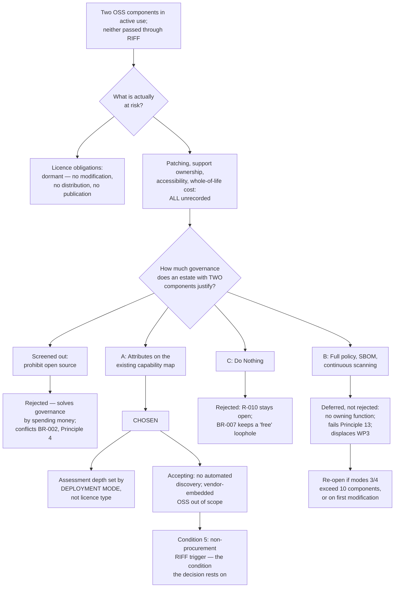

# ADR-004: Open-Source Licence and Third-Party Component Policy

> **Template Origin**: Official | **ArcKit Version**: 6.7.5 | **Command**: `/arckit:adr`

## Document Control

| Field | Value |
|-------|-------|
| **Document ID** | ARC-001-ADR-004-v1.0 |
| **Document Type** | Architecture Decision Record |
| **ADR Number** | ADR-004 |
| **Project** | Learning & Teaching Baseline Strategy (Project 001) |
| **Classification** | OFFICIAL |
| **Status** | **Proposed** |
| **Version** | 1.0 |
| **Created Date** | 2026-07-29 |
| **Last Modified** | 2026-07-29 |
| **Review Cycle** | Initial review 6 months after adoption; annually thereafter |
| **Review Date** | 2026-08-28 |
| **Escalation Level** | Department |
| **Governance Forum** | RIFF Review → Education Committee |
| **Owner** | Dr. Benny Moog, Director Learning Technologies |
| **Reviewed By** | [PENDING] |
| **Approved By** | [PENDING] |
| **Distribution** | Project Team; Digital & IT; Learning Technologies; Procurement; School of Music & Performing Arts; Steering Committee |

## Revision History

| Version | Date | Author | Changes | Approved By | Approval Date |
|---------|------|--------|---------|-------------|---------------|
| 1.0 | 2026-07-29 | ArcKit AI | Initial creation from `/arckit:adr` command — raised because two open-source components are in active use with no recorded licence, patch owner or accessibility position | [PENDING] | [PENDING] |

---

## 1. Decision Title

**Open-Source Licence and Third-Party Component Policy**

How the university governs open-source and other non-commercially-licensed components in the Learning & Teaching estate — what is recorded about them, who is accountable for them, and how deeply they are assessed before adoption.

> **Note on framework applicability.** The ArcKit template's *Cross-government* escalation tier, the GDS Service Standard, the Technology Code of Practice and the UK service-standard expectation to be "open source by default" are UK public-sector instruments with no standing for an Australian private university. In particular, **the university has no obligation, and no strategic reason, to prefer open source** — it is a consumer of commercial SaaS, not a software publisher. §4.3 and §8.3 apply the **Privacy Act 1988**, the **ASD Essential Eight** and the university's **RIFF Review** process instead, rather than leaving UK sections nominally answered.

---

## 2. Stakeholders

### 2.1 Deciders (RACI: Accountable)

- **Dr. Benny Moog, Director Learning Technologies** — decision owner; facilitates RIFF Review and owns the capability map this decision extends
- **Cassandra "Cas" Rhodes, Chief Information Officer** — accountable for BR-005 (security posture) and for the Essential Eight target that self-hosted and endpoint-installed software directly affects

### 2.2 Consulted (RACI: Consulted)

- **Tobias Ohm, Cybersecurity Lead** — owns R-020 (Essential Eight ML2). "Patch applications" and "application control" are assessed per application; components with no vendor and no named patch owner are precisely the class that escapes both
- **Grace Tanaka, Procurement & Vendor Manager** — a component with no contract has no contractual route for warranties, indemnities, exit terms or accessibility claims; the compensating controls sit outside procurement's normal instruments
- **Eleanor Frame, Privacy & Records Officer** — self-hosting changes who is the data holder and therefore who carries the APP obligations directly
- **Prof. Desmond Key, Dean, Music & Performing Arts** — MuseScore is a School of Music tool; the extent and nature of its use is an outstanding investigation [SL-C2], [RK-C1]
- **Sam Okafor, Integration Architect** — a self-hosted component that authenticates through LTI is an integration endpoint governed by ADR-001

### 2.3 Informed (RACI: Informed)

- A/Prof. Pearl Clavinet, Dean of L&T; Chair, Education Committee — approval gate for changes to the RIFF assessment scope
- Vernon Ostinato, Chief Financial Officer — this decision affects how "zero licence fee" is represented in the BR-002 spend arithmetic
- Dr. Wynton Castle, Senior Lecturer — H5P is a teaching tool in active use; any change to its support position affects unit delivery
- Learning Technologist team — will maintain the register entries
- Rhonda Bell, Project Manager — WP3 capability mapping absorbs the backfill described in §10.2

### 2.4 Escalation Context

**Decision Level**: **Department**

**Escalation rationale**:

- [ ] **Team** — insufficient. This changes what RIFF assesses, and RIFF's scope is not a team-level artefact
- [ ] **Cross-team** — insufficient. The decision binds the School of Music's own tooling choices (Principle 4), which an architecture forum alone cannot mandate
- [x] **Department** — a governance standard applying across the whole L&T estate, changing the mandatory attributes of the capability map and the RIFF checklist
- [ ] **Institution-wide (Executive)** — not required. **This decision commits no expenditure**, which is why the escalation chain stops at Education Committee rather than continuing to Operations Committee as ADR-001 and ADR-002 do

**Governance Forum**: RIFF Review → Education Committee [SGP-C1]

**Approval Date**: [PENDING]

---

## 3. Context and Problem Statement

### 3.1 Problem Description

The L&T estate is overwhelmingly commercial SaaS. Of the twenty-plus tools in the system landscape, **two are open source and in active use**: **H5P**, which appears in three capability categories (Course Design, Active Learning, Assessment & Progress Tracking), and **MuseScore**, a School of Music & Performing Arts discipline tool [SL-C1].

Neither arrived through RIFF. Neither has a recorded licence identifier, a named patch owner, an accessibility conformance position, or a support model. This is not because anyone decided they did not need one — it is because **no procurement event ever triggered the question**. RIFF is reached by things that cost money.

That is the defect. The university's entire governance apparatus for third-party software is attached to the act of paying for it.

**Problem statement as a question**: *What must be recorded about, and assessed for, a component the university does not pay for — and how much of that assessment is proportionate to an estate containing two of them?*

### 3.2 Why This Decision Is Needed Now

Three converging reasons, none of which is "we should have a policy".

1. **WP3 capability mapping is about to populate the capability map.** Whatever attributes the map carries are being decided now. Adding a licence and patch-owner attribute costs nothing at this point and is a retrofit exercise afterwards.
2. **The estate has an existing open finding that this decision closes.** R-010 records that *"specialist tool support model undefined — discipline tools have no named internal support arrangement"*, with residual risk 9 and a target of 2026-09-30 [RK-C2]. MuseScore is squarely in that population, and the landscape already flags its usage and licensing as an outstanding investigation [SL-C2].
3. **The next acquisition will test it.** The badging investigation (FR-019, COULD_HAVE) names Badgr, Credly and Milestone as candidates [SL-C3]. At least one of those descends from an open-source project with an optional self-hosted deployment. If this decision is not in place, that assessment will again be conducted as though "free tier" and "no obligations" were the same statement.

### 3.3 The Complication That Makes This Non-Trivial

The naive framing — *"write an open-source policy"* — produces the wrong artefact. A policy written for a software-development organisation governs dependency trees, transitive licences, SBOM generation, contribution agreements and outbound publication. **The University of Funk does none of those things.** It writes no software beyond operational automation scripts (NFR-M-002), publishes no code, and modifies no third-party source.

The genuine exposure is narrower and more specific, and it is *operational* rather than *legal*:

| Concern | Real for this estate? | Why |
|---------|----------------------|-----|
| Copyleft obligations triggered by distribution | **Largely dormant** | Internal use is not distribution. MuseScore is installed on university-managed machines; the obligation only becomes live if a **modified** build is handed to students or third parties |
| Licence incompatibility in a dependency tree | **No** | The university links nothing against anything |
| Outbound publication obligations | **No** | The university publishes no code (out of scope, §12.3) |
| **Unpatched software with no vendor** | **Yes — the primary exposure** | E8 "patch applications" is assessed per application. A component with no vendor sends no security bulletins and no end-of-life notice |
| **No named support owner** | **Yes** | Principle 4 requires a named support model per specialist tool; R-010 records this as an open finding |
| **No accessibility conformance claim** | **Yes** | NFR-U-002 requires WCAG 2.2 AA evidence. There is no vendor to produce a conformance statement, so the university must assess it itself or accept the gap explicitly |
| **Whole-of-life cost misrepresented as zero** | **Yes** | BR-002 measures licence spend. A component with no licence fee is not free — it carries patching, support and assessment effort that the BR-002 arithmetic does not see |

A policy that governs the first three and ignores the last four would be simultaneously burdensome and useless.

### 3.4 Regulatory and Policy Context

- **Privacy Act 1988 / APPs** — where a component is self-hosted, the university becomes the data holder rather than the vendor. This *improves* the residency position (DR-005, NFR-C-002) and *transfers* the security obligation
- **ASD Essential Eight** — "patch applications" and "application control" are the two mitigation strategies most directly affected; the estate sits largely at ML1 against an ML2 target [RK-C3]
- **RIFF Review** — solutions duplicating licensed capability must justify why the incumbent is unsuitable [SGP-C1]. H5P overlaps Articulate 360 and Blackboard in Course Design and Active Learning; a zero-cost component is *not* exempt from that test
- **Copyright** — attribution and notice-retention obligations under permissive licences are trivially satisfiable but not automatically satisfied

### 3.5 Supporting Links

- Requirements: BR-001, BR-002, BR-005, BR-007, FR-002, FR-005, FR-019, NFR-SEC-001, NFR-SEC-002, NFR-U-002, NFR-M-002, NFR-I-002, NFR-C-001, NFR-C-002, DR-005, DR-007
- Principles: `projects/000-global/ARC-000-PRIN-v1.1.md` — Principles 2, 4, 9, 13, 14, 16, 18, 19
- Risks: `ARC-001-RISK-v1.0.md` — R-010, R-013, R-016, R-020, R-028, R-029
- Related ADRs: ADR-001 (Integration Mediation Approach), ADR-002 (Authoritative Source for Institutional Role Assignment), ADR-003 (Logging and Observability Stack)
- Landscape: `001-lt-ecosystem/external/system-landscape.md`

---

## 4. Decision Drivers (Forces)

### 4.1 Technical Drivers

- **Patch accountability without a vendor** — a self-hosted or endpoint-installed component has no supplier to notify the university of a vulnerability or an end-of-life date. Requirements: NFR-SEC-002. Principle 16. Risk: R-020
- **Accessibility evidence without a vendor claim** — NFR-U-002 requires conformance evidence to be *verified rather than accepted at face value*. For open source there is nothing to verify against; the assessment must be performed. Principle 14
- **Identity model unchanged** — a component reached through the LMS by LTI inherits institutional SSO and creates no local account. A component installed on a managed endpoint has no authentication surface at all. **Neither open-source component is implicated in R-019** (the two local-account platforms are commercial). Requirements: NFR-SEC-001. Principle 16
- **Self-hosting as an integration endpoint** — if H5P runs as a university-hosted plugin, it becomes a system in the integration estate and falls under ADR-001's mediation decision and NFR-M-002's version-control requirement. Principle 13

### 4.2 Business Drivers

- **Equivalence of treatment** — the decision that matters is not "is open source allowed" but "is a free component assessed to the same standard as a paid one". Requirements: BR-007. Principle 18
- **Honest whole-of-life cost** — BR-002 must hold licence spend flat while closing gaps. If zero-licence components are recorded as zero-cost, the business case understates the true position and, worse, creates an incentive to close capability gaps with unsupported software. Requirements: BR-002. Risks: R-013, R-016. Principle 19
- **Exit position** — open source is a *positive* against R-029 (proprietary-format lock-in) and DR-007. Data held in an open-source component with open formats is the easiest class in the estate to exit. This is a benefit the policy should record, not merely a risk to control. Principle 9
- **Proportionality** — governance the university cannot sustain is governance that decays. Principle 13's requirement that no process depend on one person applies to the policy itself

### 4.3 Regulatory and Compliance Drivers

- **Privacy Act 1988 (APP 11)** — where self-hosted, security of personal information becomes a university obligation directly rather than contractually
- **APP 8 / cross-border (NFR-C-002)** — self-hosting removes the offshore disclosure question entirely for that component. The residency register (DR-005) must therefore record deployment mode, not merely hosting region
- **ASD Essential Eight (NFR-SEC-002)** — "patch applications" and "application control"; unmanaged endpoint installations in school-controlled labs sit inside the TC-4 constraint
- **WCAG 2.2 AA (NFR-U-002)** — no vendor conformance statement exists; the gap must be either closed by assessment or recorded with an owner and date

### 4.4 Alignment to Architecture Principles

| Principle | Alignment | Impact |
|-----------|-----------|--------|
| 2. Deliberate Capability Boundaries | ✅ Supports | H5P spans three capability categories and overlaps Articulate 360 and Blackboard. Registering it forces the overlap to be declared rather than tolerated because it costs nothing |
| 4. Discipline Specialisation at the Edge | ✅ Supports | *"Specialist need justifies a different tool — never a different architecture."* MuseScore is exactly the case this principle was written for, and its validation gate ("each specialist tool has a named support model and owner") is currently unmet |
| 9. Data Portability and Exit | ✅ Supports | Open-source components with open formats are the strongest exit position in the estate; the register makes that visible as an asset |
| 13. Reproducible, Documented Automation | ⚠️ Partial | If H5P is self-hosted, its deployment and update path must be version-controlled and executable by two people. This is a **new obligation** the decision creates, not one it satisfies |
| 14. Accessibility by Default | ⚠️ Partial | The decision requires the accessibility position to be *recorded*. It does not, by itself, make an unassessed component conformant — the gap becomes visible and owned rather than closed |
| 16. Layered Security Posture | ✅ Supports | Adds a named patch owner where none exists, addressing the E8 mitigation strategies most exposed by vendorless software |
| 18. Evidence-Based Capability Investment | ✅ Supports | Closes the loophole by which zero-cost capability entered the estate without architectural review |
| 19. Realise Licensed Capability Before New Spend | ✅ Supports | Symmetrically: a free component must justify itself against licensed capability that already exists, exactly as a paid one must |

---

## 5. Considered Options

**Screened out before shortlisting.** A fourth option — *prohibit open source in the L&T estate and require a commercially supported equivalent* — was considered and discarded without full analysis. It would require retiring H5P from three capability categories and MuseScore from the School of Music, replacing both with licensed products, in direct conflict with BR-002 (hold licence spend flat) and Principle 4. It solves a governance problem by spending money. Recording that it was rejected is more useful than analysing it.

### 5.1 Option A: Register-and-Assess — third-party component attributes on the existing capability map

**Description**: Do not create a new policy artefact. Extend two artefacts that already exist — the **capability map** and the **RIFF assessment checklist** — so that every component in the estate, regardless of commercial status, carries three additional attributes. Make the depth of assessment conditional on *deployment mode* rather than on *licence type*.

**Implementation approach**:

Three attributes are added to each platform record in the capability map:

| Attribute | Definition | Source of truth |
|-----------|-----------|-----------------|
| `licence_identifier` | SPDX identifier, read from the component's own licence file | The component's distribution, verified — **not** a secondary source |
| `patch_and_support_owner` | Named individual or team accountable for applying updates and answering support requests | Named at adoption; absence makes the component non-adoptable |
| `deployment_mode` | One of the five modes below; determines assessment depth | Digital & IT, confirmed at adoption and at review |

Assessment depth is then set by deployment mode:

| Deployment mode | Example in this estate | Licence obligations engaged | Institutional duties |
|-----------------|------------------------|-----------------------------|----------------------|
| **1. Open source embedded inside vendor SaaS** | Whatever Blackboard, Turnitin or Echo360 use internally | **None on the university** — the vendor is the distributor | No register entry. Handled contractually: third-party IP warranty at renewal. **Explicitly out of scope** |
| **2. Open source consumed as a vendor-hosted service** | H5P if delivered via H5P.com | None — commercially equivalent to any SaaS | Treated as an ordinary commercial platform record; no special handling |
| **3. Self-hosted / plugged into a university-run platform** | H5P if delivered as an LMS plugin | Attribution and notice retention (permissive licences) | **Full duty set**: patch owner, E8 patching, WCAG assessment, integration governance under ADR-001, version-controlled deployment (NFR-M-002) |
| **4. Installed on university-managed endpoints** | MuseScore on lab and staff machines | Copyleft obligations **dormant** — internal use is not distribution | Patch owner, E8 patch-applications and application-control coverage, support model per Principle 4 |
| **5. Modified by the university** | None today | Copyleft distribution obligations become **live** | **Requires an explicit RIFF decision before modification begins.** Not permitted by default |

**Wardley Evolution Stage**: Commodity — attributes on an existing governed artefact. Nothing novel is being built.

#### Good (Pros)

- ✅ **Closes the actual loophole**: a component reaches RIFF because it enters the estate, not because it generates an invoice. Directly satisfies BR-007 and Principle 18
- ✅ **Closes an existing open risk**: `patch_and_support_owner` is the missing evidence for R-010 (residual 9, target 2026-09-30) and for Principle 4's unmet validation gate
- ✅ **Proportionate to two components**: the register can be populated in a single WP3 session; there is no standing function to fund, staff or sustain
- ✅ **Correctly scopes obligations out**: mode 1 is the largest volume of open source in the estate by a wide margin and the policy deliberately does not touch it, because the university carries no obligation there. This is what keeps the policy honest about its own limits
- ✅ **Improves the BR-002 arithmetic**: whole-of-life cost becomes recordable for zero-licence components, removing the incentive to close capability gaps with unsupported software (R-013, R-016)
- ✅ **Records exit strength as an asset**: supports DR-007 and mitigates R-029, where the rest of the estate is weak
- ✅ **No new artefact to maintain**: the attributes live where the reviewer is already looking

#### Bad (Cons)

- ❌ **Depends on RIFF being reached** — the historical failure mode is precisely that a free component never triggered a review. Adding attributes to the checklist does not, by itself, cause anyone to open the checklist. Mitigation is procedural (§6.4 Condition 5) and imperfect
- ❌ **No automated detection** — nothing scans for an open-source component installed by a school without asking. Discovery remains dependent on endpoint management coverage, which TC-4 already identifies as incomplete for lab fleets
- ❌ **Mode 1 is a declared blind spot** — the university accepts a vendor's assurance about the open source inside its product. That is the correct allocation of responsibility, but it is an acceptance, not a control
- ❌ **Creates a new obligation it does not fund** — if H5P is confirmed as mode 3, NFR-M-002 and E8 patching duties become live with no named resource today

#### Cost Analysis

Consistent with ADR-001 and ADR-002, **project 001 has no costing baseline** (Assumption A-1); the analysis below is comparative effort, not quantified spend.

- **CAPEX**: None. No procurement, no tooling
- **OPEX**: Marginal. Three attributes populated for the existing estate during WP3; three questions added to an assessment already being performed. The material new cost is the **patching duty**, which is a cost the university already carries unacknowledged
- **TCO (3-year)**: Lowest of the three options. The only genuine ongoing cost is the patch-owner commitment, which is not optional under NFR-SEC-002 regardless of which option is chosen

---

### 5.2 Option B: Formal open-source policy with SBOM generation and continuous component scanning

**Description**: Adopt a full open-source software policy of the kind a software-producing organisation maintains: an approved-licence list, a review board for licence exceptions, software bill-of-materials generation across the estate, continuous vulnerability scanning of components, and a contribution/publication policy.

**Implementation approach**: A named governance function (an OSPO in all but title) within Digital & IT; SBOM ingestion for self-hosted components; a scanning tool procured or self-hosted; vendor SBOM clauses added to contracts at renewal to reach into deployment mode 1.

**Wardley Evolution Stage**: Custom-Built — an institutional capability that does not exist today and has no natural owner.

#### Good (Pros)

- ✅ **Reaches into vendor SaaS** — contract-mandated SBOMs would give visibility into mode 1, the estate's largest open-source surface, which Option A explicitly declines to address
- ✅ **Automated vulnerability detection** — directly and continuously evidences the E8 "patch applications" strategy rather than relying on a named human remembering
- ✅ **Scales without rework** — if the estate's open-source footprint grew substantially, this is the answer, and adopting it now avoids a second change later
- ✅ **Strongest audit position** — a documented licence inventory with automated evidence is what an external assurance review would prefer to see

#### Bad (Cons)

- ❌ **Disproportionate by roughly an order of magnitude** — this is governance machinery for a dependency tree. The estate has **two** open-source components in modes 3 and 4
- ❌ **No sustainable owner** — Digital & IT has no function to absorb it, and Principle 13 prohibits processes with a single-person dependency. A policy staffed by one enthusiast is R-007 repeating itself in a new domain
- ❌ **Consumes the WP3 window** — the capability mapping timeline is already compressed against a fixed 31 August date (R-012, BC-1). This work would displace capability mapping, which is the engagement's actual deliverable
- ❌ **The SBOM clause is not achievable in this window** — it depends on contract renewal cycles the university does not control (BC-3, R-005, R-011), so the mode 1 benefit is theoretical for years
- ❌ **Spends money against BR-002** — a scanning capability is procurement, requiring its own RIFF case, at a moment when the business case must show flat or reducing spend
- ❌ **Solves problems the university does not have** — approved-licence lists, exception boards and contribution policies govern activities (linking, modifying, publishing) that this estate does not perform

#### Cost Analysis

- **CAPEX**: Tooling procurement or self-hosted deployment; initial estate-wide SBOM baseline
- **OPEX**: A standing governance function; tool subscription; contract renegotiation effort across the vendor estate
- **TCO (3-year)**: Materially the highest of the three, and it is recurring rather than one-off

---

### 5.3 Option C: Do Nothing (Baseline)

**Description**: Continue as now. Open-source components enter the estate without review because they generate no procurement event. Licence, patch owner and accessibility position remain unrecorded.

#### Good

- ✅ **No immediate cost** and no demand on the compressed WP3 window
- ✅ **No new obligation created** — the H5P deployment-mode question and its consequent patching duty stay unasked
- ✅ **Genuinely low legal risk in the short term** — with no modification and no distribution, copyleft obligations remain dormant, and the naive fear ("we might be violating a copyleft licence") is largely unfounded

#### Bad

- ❌ **R-010 stays open past its 2026-09-30 target** — Principle 4's validation gate ("named support model and owner" per specialist tool) cannot be evidenced for MuseScore
- ❌ **Undermines BR-007 at the point it is being established** — a governance process with a standing "free" exemption is not operating on architectural evidence, it is operating on invoices
- ❌ **Contradicts BR-001 and Principle 2** — H5P sits in three capability categories overlapping two other platforms. Not registering it means the duplication analysis is knowingly incomplete
- ❌ **E8 exposure persists unmeasured** — vendorless software is the class most likely to go unpatched, against an ML2 target the estate is already behind on (R-020)
- ❌ **Accessibility gap is invisible rather than accepted** — NFR-U-002 requires gaps to carry an owner and a remediation date. An unrecorded gap carries neither
- ❌ **The next acquisition repeats the error** — the badging investigation (FR-019) is imminent and includes candidates with open-source lineage
- ❌ **Free is scored as zero** — the BR-002 arithmetic misrepresents whole-of-life cost, creating exactly the wrong incentive under a flat spend envelope

### 5.4 Options Comparison

| Criterion | A: Register-and-Assess | B: Full policy + SBOM | C: Do Nothing |
|-----------|------------------------|------------------------|---------------|
| Closes R-010 (support model) | ✅ Yes | ✅ Yes | ❌ No |
| Evidences E8 patch accountability | ✅ By named owner | ✅ By automation | ❌ No |
| Reaches open source inside vendor SaaS (mode 1) | ❌ Declared out of scope | ⚠️ Theoretically, at renewal | ❌ No |
| Automated discovery of unmanaged installs | ❌ No | ✅ Yes | ❌ No |
| Proportionate to two components | ✅ Yes | ❌ No | ⚠️ Cheap but non-compliant |
| Sustainable owner exists | ✅ RIFF, already staffed | ❌ No function | n/a |
| Fits the WP3 window (BC-1) | ✅ Yes | ❌ No | ✅ Yes |
| Compatible with BR-002 flat envelope | ✅ Zero spend | ❌ Requires procurement | ✅ Zero spend |
| Satisfies BR-007 / Principle 18 | ✅ Yes | ✅ Yes | ❌ No |
| 3-year TCO rank | 1 (lowest) | 3 (highest) | 2 |

---

## 6. Decision Outcome

### 6.1 Chosen Option

**"Option A: Register-and-Assess — third-party component attributes on the existing capability map"**

### 6.2 Y-Statement

> **In the context of** an L&T estate that is overwhelmingly commercial SaaS but contains two actively used open-source components — H5P across three capability categories and MuseScore in the School of Music — neither of which passed through architectural review,
> **facing** the fact that the university's entire third-party governance apparatus is triggered by payment, so that "no licence fee" has silently meant "no licence identifier, no patch owner, no accessibility position and no support model",
> **we decided for** extending the existing capability map and RIFF checklist with three component attributes and setting assessment depth by deployment mode rather than by licence type,
> **to achieve** equivalence of treatment between free and paid components, and closure of the R-010 support-model finding, without building governance machinery an estate of this shape cannot sustain,
> **accepting** that this provides no automated discovery of components installed outside endpoint management, no visibility into the open source inside vendor SaaS, and remains dependent on RIFF being reached — which is the very failure that produced the current position.

### 6.3 Justification

1. **The problem is operational, not legal.** The instinctive framing of open-source governance is licence compliance. For this estate that is close to a non-issue: nothing is modified, nothing is linked, nothing is published, so copyleft obligations stay dormant. What is genuinely broken is that two pieces of software are running with nobody accountable for patching them, supporting them, or stating whether they are accessible. Option A addresses what is broken; Option B addresses what is not.

2. **Deployment mode is the correct discriminator, not licence type.** H5P delivered as SaaS carries the same obligations as Turnitin. H5P delivered as a self-hosted plugin carries a materially different set. The licence identifier is barely relevant to that difference; who runs the software is decisive. Structuring the policy around deployment mode makes it correct in the cases that matter and silent in the cases that do not.

3. **Option B fails Principle 13 before it starts.** It requires a standing function that does not exist and has no candidate owner. R-007 in this project's own risk register is a live example of what happens when a process depends on one motivated individual. Adopting a governance model the institution cannot staff would be recreating that risk deliberately.

4. **The proportionality test is explicit institutional policy.** Principle 18 requires review scope to cover duplication, integration, privacy, accessibility and whole-of-life cost — which Option A delivers. It does not require an SBOM programme. Principle 19 requires realising existing capability before new spend; Option B is new spend to govern components that cost nothing.

5. **It closes a dated, owned risk.** R-010 has a target of 2026-09-30 and no effective control. `patch_and_support_owner` is the control. This is not a new governance idea; it is the missing evidence for a commitment already made.

### 6.4 Conditions Attached to This Decision

This decision is **conditional**. If these are not completed, it has not been implemented.

1. **Confirm H5P's deployment mode before the register is populated.** Whether H5P is an LMS plugin (mode 3) or H5P.com (mode 2) determines whether the university carries a patching and accessibility duty at all. This is the single highest-value unknown in the decision. *Owner: Dr. Benny Moog. Before WP3 capability mapping closes.*
2. **Confirm MuseScore version, licence and extent of use across the School of Music.** Already an outstanding investigation in the landscape [SL-C2] and in the risk register [RK-C1]. *Owner: Prof. Desmond Key with Digital & IT. By 2026-09-30, aligned to R-010's target.*
3. **Record licence identifiers from the component's own distribution, verified.** This ADR **deliberately asserts no licence identifier for either component.** Stating one from memory or from a secondary source would be exactly the unverified claim NFR-U-002 and Principle 14 warn against for vendor conformance statements, and the same discipline applies here. *Owner: Learning Technologist team.*
4. **Raise a risk for unpatched vendorless software if H5P is confirmed as mode 3.** The risk register today contains no risk covering open-source or vendorless component patching. R-020 covers E8 maturity generally but does not name this exposure. *Owner: Tobias Ohm.*
5. **Establish a non-procurement RIFF trigger.** The attributes are worthless if nothing causes the checklist to be opened for a component that costs nothing. The minimum viable trigger is that **endpoint software deployment requests and LMS plugin enablement requests both route to RIFF**, independent of cost. *Owner: Dr. Benny Moog. This is the condition on which the decision's effectiveness actually rests.*
6. **The attributes are added to the existing capability map, not to a new artefact.** If implementation produces a separate "open-source register" document, this ADR is not being followed — a parallel artefact is Option B arriving through the back door.

### 6.5 Dissent Recorded

**Tobias Ohm, Cybersecurity Lead**, may reasonably prefer Option B. The argument is sound: E8 "patch applications" is assessed per application and evidenced by automation, not by attestation, and a named human owner is a weaker control than a scanner. Recording this properly:

- Option B is **deferred, not rejected**. The judgement is about the current estate's scale, not about the merit of the control.
- **Re-open trigger, stated numerically so it is testable**: this ADR is revisited if the register records **more than ten** components in deployment modes 3 or 4, **or** on the first proposal to modify a component (mode 5), **or** if a vulnerability in a mode 3/4 component reaches production undetected.
- Until then, the compensating control is Condition 5 — the trigger that gets components into RIFF at all. If Condition 5 fails, Option A degrades to Option C, and the dissent is vindicated.

### 6.6 Risk Appetite Alignment

The residual exposure accepted here — no automated discovery, no visibility into vendor-embedded open source — is consistent with the treatment applied to comparable findings elsewhere in the register. R-015 and R-029 are both explicitly **Tolerated** on the basis that the remedy exceeds the exposure for existing arrangements while future arrangements are held to the higher standard. This decision applies the same logic: **existing components are registered and owned; future components are assessed before adoption.**

---

## 7. Consequences

### 7.1 Positive Consequences

- ✅ **R-010 becomes closable** — a named support and patch owner per specialist tool is the evidence its control column currently lacks
- ✅ **Principle 4's validation gates become assessable** — "each specialist tool has a named support model and owner" moves from aspiration to recorded attribute
- ✅ **BR-007 loses its largest loophole** — RIFF assesses components, not purchases
- ✅ **BR-001 duplication analysis becomes complete** — H5P's presence in three categories, overlapping Articulate 360 and Blackboard, enters the capability map as a declared overlap requiring a Principle 2 outcome
- ✅ **BR-002 arithmetic becomes honest** — whole-of-life cost is recordable for zero-licence components
- ✅ **A genuine strength gets recorded** — against R-029 (proprietary-format lock-in) and DR-007, open-source components with open formats are the estate's best exit position
- ✅ **Residency position improves where self-hosted** — a mode 3 component is an APP 8 question removed rather than assessed (NFR-C-002, DR-005)

**Measurable outcomes**:

| Metric | Baseline | Target |
|--------|----------|--------|
| Components with a recorded `licence_identifier` | 0 | 100% of modes 2–5 |
| Components with a named `patch_and_support_owner` | 0 | 100% of modes 3–4 |
| Specialist tools with a named support model (R-010, Principle 4) | 0 | All, by 2026-09-30 |
| Components with a recorded WCAG 2.2 AA position (assessed **or** gap owned and dated) | 0 | 100% of student-facing modes 2–4 |
| Non-procurement RIFF triggers in force | 0 | 2 (endpoint deployment; LMS plugin enablement) |

### 7.2 Negative Consequences (Accepted Trade-offs)

- ❌ **Open source inside vendor SaaS remains unexamined.** This is by far the largest open-source surface in the estate and the policy does not touch it. *Mitigation: third-party IP warranty and vulnerability-notification clauses at contract renewal, via Grace Tanaka — a procurement action, not an architecture one.*
- ❌ **No automated discovery.** A school installing software on a lab machine outside endpoint management remains invisible. TC-4 already records that lab fleets sit partly outside project control. *Mitigation: none available within scope. Recorded as accepted.*
- ❌ **New unfunded duty if H5P is mode 3.** Patching, version-controlled deployment (NFR-M-002) and WCAG assessment become live obligations with no named resource today. *Mitigation: Condition 1 establishes the fact before the obligation is assumed; if unfunded, the correct response is to move H5P to mode 2 or to record a time-bound exception under Principles Section VI.*
- ❌ **Attestation is a weaker control than automation.** Acknowledged in §6.5 with a numeric re-open trigger rather than left as a soft caveat.

### 7.3 Neutral Consequences (Changes Needed)

- 🔄 **Capability map schema** — three attributes added; WP3 populates them as part of work already scheduled
- 🔄 **RIFF checklist** — three questions added; a deployment-mode determination step precedes them
- 🔄 **Two new intake routes into RIFF** — endpoint software deployment and LMS plugin enablement (Condition 5)
- 🔄 **Procurement clause library** — third-party IP warranty and vulnerability-notification wording for renewals (mode 1 compensating control)
- 🔄 **No new tooling, no new contract, no new standing function**

### 7.4 Risks and Mitigations

| Risk | Likelihood | Impact | Mitigation | Owner |
|------|------------|--------|------------|-------|
| Condition 5 is not implemented; free components continue to bypass RIFF and the decision degrades to Option C | M | H | Make the two intake triggers an explicit acceptance criterion of this ADR, tested at the 2027-02-28 review | Dr. Benny Moog |
| H5P confirmed as mode 3; patching duty falls to no one and the E8 position worsens rather than improves | M | H | Condition 1 establishes deployment mode before the register is populated; Condition 4 raises the risk formally | Tobias Ohm |
| MuseScore usage proves broader than the School of Music, with unmanaged installs outside endpoint coverage | M | M | Condition 2 investigation is scoped to extent, not just licensing; feeds R-020's ML2 pathway | Prof. Desmond Key |
| Register is populated once during WP3 and never maintained | M | M | Attributes live on the capability map, which Principle 2 requires to be current as at the most recent contract review | Dr. Benny Moog |
| Badging acquisition (FR-019) proceeds before the policy is in force, repeating the pattern | M | M | Sequence: policy in force before the badging options investigation reaches RIFF | Dr. Benny Moog |
| "Free" is treated as a reason to close a capability gap with unsupported software under the BR-002 flat envelope | L | H | Whole-of-life cost attribute makes the true cost visible in the same table as licence spend (R-013, R-016) | Vernon Ostinato |

**Link to risk register**: `projects/001-lt-ecosystem/ARC-001-RISK-v1.0.md` — R-010 (closed by this decision), R-020, R-013, R-016, R-028, R-029

---

## 8. Validation and Compliance

### 8.1 How Implementation Will Be Verified

- [ ] Capability map contains `licence_identifier`, `patch_and_support_owner` and `deployment_mode` for every platform record
- [ ] H5P and MuseScore records populated and verified against the components' own distributions (Conditions 1–3)
- [ ] RIFF checklist shows the deployment-mode determination step ahead of the three attribute questions
- [ ] Both non-procurement intake triggers are demonstrably in force — verified by a **test case**: a request to enable an LMS plugin reaches RIFF without a purchase order
- [ ] No separate "open-source register" artefact has been created (Condition 6)
- [ ] Where a WCAG 2.2 AA position cannot be established, the gap carries an owner and a remediation date (NFR-U-002)

### 8.2 Monitoring

| Metric | Target | Measurement |
|--------|--------|-------------|
| Modes 3–4 components with a named patch owner | 100% | Capability map |
| Modes 3–4 components with current patch level | 100% | Endpoint management and platform reporting |
| Components entering the estate without a RIFF record | 0 | RIFF decision register versus capability map reconciliation |
| Components in modes 3 or 4 | Fewer than 11 | Capability map — **exceeding this re-opens the decision (§6.5)** |
| Mode 5 (university-modified) components | 0 without an explicit RIFF decision | RIFF decision register |

### 8.3 Compliance Verification

**Privacy Act 1988**:

- [ ] Deployment mode recorded against the residency register (DR-005), since self-hosting removes the APP 8 question rather than answering it
- [ ] APP 11 security obligation identified as institutional rather than contractual for modes 3–4

**ASD Essential Eight (NFR-SEC-002)**:

- [ ] "Patch applications" — every mode 3–4 component has a named owner and a patch cadence, feeding R-020's documented pathway
- [ ] "Application control" — mode 4 components are known to endpoint management, or the coverage gap is recorded against TC-4

**Accessibility (NFR-U-002)**:

- [ ] WCAG 2.2 AA position recorded for every student-facing component; absence of a vendor claim is not absence of an obligation

**RIFF governance (BR-007)**:

- [ ] Duplication assessed against the capability map for H5P's three-category footprint [SGP-C1]
- [ ] Whole-of-life cost recorded even where licence cost is zero

---

## 9. Traceability

### 9.1 Requirements Addressed

**Business**: BR-001 (H5P overlap becomes a declared boundary) · BR-002 (whole-of-life cost visible for zero-licence components) · BR-005 (patch accountability for vendorless software) · BR-007 (RIFF assesses components, not purchases)

**Functional**: FR-002 (interactive authoring — H5P's boundary against Articulate 360 and Blackboard) · FR-005 (music notation — MuseScore support model, Principle 4) · FR-019 (badging — the first acquisition this policy will govern)

**Non-functional**: NFR-SEC-001 (LTI-mediated and endpoint components create no local accounts; not implicated in R-019) · NFR-SEC-002 (E8 patch applications, application control) · NFR-U-002 (WCAG position without a vendor claim) · NFR-M-002 (version-controlled deployment for mode 3) · NFR-I-002 and DR-007 (exit strength) · NFR-C-001, NFR-C-002, DR-005 (residency and APP 8 by deployment mode)

**Constraints**: TC-1 (SaaS-dominant estate is why the policy is narrow) · TC-4 (lab fleet coverage limits discovery) · BC-1 (fixed date rules out Option B) · BC-3 (renewal timing makes the mode 1 SBOM route unachievable in window) · BC-4 (RIFF precedence)

### 9.2 Architecture Artifacts

- **Principles** — `projects/000-global/ARC-000-PRIN-v1.1.md`: Principles 2, 4, 9, 13, 14, 16, 18, 19; Appendix VIII capability categories (H5P maps to three)
- **Risk register** — `ARC-001-RISK-v1.0.md`: R-010 (closed), R-013, R-016, R-020, R-028, R-029
- **Requirements** — `ARC-001-REQ-v1.0.md`
- **Landscape** — `001-lt-ecosystem/external/system-landscape.md`: H5P, MuseScore, Ableton Live, badging investigation
- **Decisions** — `decisions/ARC-001-ADR-001-v1.0.md`, `decisions/ARC-001-ADR-002-v1.0.md`, `decisions/ARC-001-ADR-003-v1.0.md`

---

## 10. Implementation Plan

### 10.1 Dependencies

- **No prerequisite ADR.** This decision is independent of ADR-001, ADR-002 and ADR-003, and can proceed in parallel with all three
- **WP3 capability mapping** must still be open when the attributes are added, or the population becomes a retrofit
- **Endpoint management coverage** bounds what mode 4 discovery can achieve (TC-4)

### 10.2 Timeline

| Phase | Activities | Duration | Owner |
|-------|-----------|----------|-------|
| **Phase 0: Establish facts** | Confirm H5P deployment mode (Condition 1); scope MuseScore investigation (Condition 2) | 1 week, before WP3 close | Dr. Benny Moog; Prof. Desmond Key |
| **Phase 1: Extend the artefacts** | Add three attributes to the capability map schema; add the deployment-mode step and three questions to the RIFF checklist | 1 week | Dr. Benny Moog |
| **Phase 2: Populate and verify** | Populate all platform records; verify licence identifiers from source distributions (Condition 3); record WCAG positions or dated gaps | 2 weeks, within WP3 | Learning Technologist team |
| **Phase 3: Intake triggers** | Route endpoint deployment and LMS plugin enablement requests to RIFF; test with a live case (Condition 5) | 2 weeks | Dr. Benny Moog with Digital & IT |
| **Phase 4: Consequential actions** | Raise the vendorless-patching risk if H5P is mode 3 (Condition 4); draft third-party IP and vulnerability-notification clauses for renewals | By 2026-09-30, aligned to R-010 | Tobias Ohm; Grace Tanaka |

### 10.3 Rollback Plan

**Rollback trigger**: The attributes prove unmaintainable, or the intake triggers generate review volume that RIFF cannot absorb within its existing cadence.

**Rollback procedure**:

1. Retain the populated attributes — the register data is valuable independent of the process
2. Narrow the intake trigger from all components to student-facing components only
3. Record the narrowing as a time-bound exception under Principles Section VI, with an expiry date
4. If the volume problem is real, it is evidence that the estate's open-source footprint is larger than assumed — which is itself the §6.5 re-open trigger for Option B

**Rollback owner**: Dr. Benny Moog, Director Learning Technologies

---

## 11. Review and Updates

**Initial review**: 2027-02-28 — six months after adoption, and after one full teaching period during which the intake triggers will have been exercised.

**Periodic review**: Annually, aligned to the capability map's contract-review currency requirement (Principle 2).

**Review criteria**:

- Are all mode 3–4 components carrying a named patch owner and a current patch level?
- Did any component enter the estate without reaching RIFF? (The decisive test — Condition 5)
- Has the mode 3/4 component count exceeded ten?
- Is R-010 closable on the evidence recorded?

**Trigger events for review**:

- [ ] More than ten components recorded in deployment modes 3 or 4 (§6.5)
- [ ] First proposal to modify a component (mode 5)
- [ ] A vulnerability in a mode 3/4 component reaching production undetected
- [ ] A component's upstream project becoming unmaintained or changing licence
- [ ] The badging acquisition (FR-019) selecting a candidate with a self-hosted open-source deployment
- [ ] The university deciding to publish software — which is out of scope today and would require a new ADR

---

## 12. Related Decisions

### 12.1 Decisions This ADR Depends On

None. This decision is deliberately independent — it changes what is recorded and reviewed, not how systems integrate.

### 12.2 Decisions That Depend On This ADR

- **Badging platform selection (FR-019, not yet raised)** — the landscape names Badgr, Credly and Milestone as candidates [SL-C3]. At least one has an open-source lineage with a self-hosted option, making this the **first real test** of the deployment-mode model
- **ADR-001 (Integration Mediation Approach)** — if H5P is confirmed as mode 3, it becomes a self-hosted endpoint in the integration estate and inherits ADR-001's mediation decision and NFR-M-002's version-control requirement
- **ADR-003 (Logging and Observability Stack)** — a mode 3 component is a system the observability decision must cover; a mode 2 component is a vendor whose telemetry the university does not control

### 12.3 Conflicting Decisions

None.

**Recorded for the avoidance of doubt**: this decision expresses **no preference for or against open source**. It is not an adoption policy. A component's licence model is not a merit criterion in RIFF scoring — capability, integration, privacy, accessibility and whole-of-life cost are (Principle 18), and this decision simply ensures those five are assessable for components that generate no invoice.

**Explicitly out of scope**: outbound open-source publication by the university. Nothing in the L&T estate produces software for release, and a policy for that activity should be written when and if the activity exists — not before.

---

## 13. Appendices

### Appendix A: Decision Flow

### Appendix B: Stakeholder Consultation Log

| Date | Stakeholder | Feedback | Action Taken |
|------|-------------|----------|--------------|
| [PENDING] | Prof. Desmond Key | Not yet engaged — MuseScore extent and licensing outstanding | Condition 2, Phase 0 |
| [PENDING] | Tobias Ohm | Not yet engaged — dissent in §6.5 is anticipated, not recorded from consultation | Consultation before RIFF |
| [PENDING] | Grace Tanaka | Not yet engaged — mode 1 contractual control | Phase 4 |

> This log is deliberately empty. **No consultation has occurred.** The dissent recorded in §6.5 is an anticipated position stated so it cannot be quietly omitted later, not a position Tobias Ohm has expressed. This is an architectural proposal for RIFF, not a recorded agreement.

### Appendix C: Assumptions

| # | Assumption | If invalid |
|---|-----------|-----------|
| A-1 | No costing baseline exists for project 001; §5 cost analysis is comparative, not quantified (inherited from ADR-001 and ADR-002) | Option ranking stands on proportionality rather than figures; would need revisiting with real numbers |
| A-2 | H5P and MuseScore are the only open-source components in deployment modes 2–5 in the L&T estate | If more exist, Phase 2 lengthens; if materially more, the §6.5 re-open trigger may be met on day one |
| A-3 | The university modifies no third-party source and publishes no software | **The load-bearing assumption.** If false, mode 5 obligations become live and this ADR is insufficient |
| A-4 | MuseScore is installed on university-managed endpoints rather than distributed to students as an image or bundle | If distributed in modified form, copyleft source-offer obligations engage and Condition 2 must establish the fact |
| A-5 | RIFF has capacity to absorb the additional intake from two non-procurement triggers | If not, see §10.3 rollback — and treat the volume as evidence about estate size |
| A-6 | Open source embedded inside vendor SaaS is the vendor's responsibility under existing contracts | If contracts are silent, the Phase 4 clause work becomes more urgent than stated |

---

## Document Approval

| Role | Name | Signature | Date |
|------|------|-----------|------|
| **Director, Learning Technologies** | Dr. Benny Moog | | [PENDING] |
| **Chief Information Officer** | Cassandra Rhodes | | [PENDING] |
| **Cybersecurity Lead** | Tobias Ohm | | [PENDING] |
| **Chair, Education Committee** | A/Prof. Pearl Clavinet | | [PENDING] |
| **Governance Forum** | RIFF Review | | [PENDING] |

---

*This ADR follows the MADR v4.0 format with ArcKit governance standards. UK Government sections in the source template — GDS Service Standard, Technology Code of Practice, NCSC guidance and the "open source by default" service-standard expectation — have been replaced with the applicable Australian instruments (Privacy Act 1988, ASD Essential Eight) and the university's RIFF Review process, rather than left nominally answered.*

## External References

### Document Register

| Doc ID | Filename | Type | Source Location | Description |
|--------|----------|------|-----------------|-------------|
| REQ | ARC-001-REQ-v1.0.md | ArcKit artifact | `001-lt-ecosystem/` | BR, FR, NFR, DR requirements; technical and business constraints |
| PRIN | ARC-000-PRIN-v1.1.md | ArcKit artifact | `000-global/` | Principles 2, 4, 9, 13, 14, 16, 18, 19; Appendix VIII capability categories; Section VI exception process |
| RISK | ARC-001-RISK-v1.0.md | ArcKit artifact | `001-lt-ecosystem/` | R-005, R-007, R-010, R-011, R-012, R-013, R-015, R-016, R-019, R-020, R-028, R-029 |
| SL | system-landscape.md | Foundation artifact | `001-lt-ecosystem/external/` | Categorisation map, status key, outstanding investigations |
| SGP | solution-governance-process.md | Foundation artifact | `000-global/policies/` | RIFF Review and the duplication rule (cited via PRIN) |
| ADR1 | ARC-001-ADR-001-v1.0.md | ArcKit artifact | `001-lt-ecosystem/decisions/` | Integration mediation decision; costing-baseline assumption |
| ADR2 | ARC-001-ADR-002-v1.0.md | ArcKit artifact | `001-lt-ecosystem/decisions/` | Framework-applicability convention; escalation chain precedent |
| ADR3 | ARC-001-ADR-003-v1.0.md | ArcKit artifact | `001-lt-ecosystem/decisions/` | Observability decision; scope interaction noted in §12.2 |

### Citations

| Citation ID | Doc ID | Page/Section | Category | Quoted Passage |
|-------------|--------|--------------|----------|----------------|
| SL-C1 | SL | Categorisation map | Context | H5P listed ✅ In use under Course Design, Active Learning and Assessment & Progress Tracking; MuseScore listed "MuseScore ✅⁵" as a discipline-specific Learning Resources tool |
| SL-C2 | SL | Notes, item 5 | Open Investigation | "**MuseScore / Ableton Live** — School of Music & Performing Arts discipline tools; investigation required to determine the extent and nature of current use and licensing across the school." |
| SL-C3 | SL | Notes, item 2 | Procurement Constraint | "**Badging software** — options investigation required, including Badgr, Credly and Milestone." |
| SGP-C1 | PRIN | §Citations, PP-C2 | Governance | "Solutions duplicating capability already licensed (per the system landscape map) must justify why the incumbent tool is unsuitable." |
| RK-C1 | RISK | RK-C10 | Open Investigation | "Investigations outstanding for badging software, Articulate 360 licensing, Kuracloud support model, MuseScore and Ableton Live usage" |
| RK-C2 | RISK | R-010 | Risk Factor | "**Specialist tool support model undefined.** Discipline tools have no named internal support arrangement ... Informal school-level support (Weak) ... Define and record a support model and owner per specialist tool — 2026-09-30" |
| RK-C3 | RISK | R-020 | Security Requirement | "**Essential Eight ML2 target missed.** Estate remains largely ML1 against an end-2027 ML2 target ... Lab fleets and capture appliances outside standard patching regimes" |

### Unreferenced Documents

| Filename | Source Location | Reason |
|----------|-----------------|--------|
| ARC-001-DATA-v1.0.md | `001-lt-ecosystem/` | Not read — this decision concerns component governance attributes on the capability map, not entity modelling. Deployment mode's effect on the residency register (DR-005) is taken from ARC-001-REQ |
| ARC-001-STKE-v1.0.md | `001-lt-ecosystem/` | Not read — stakeholder roles taken from ARC-001-REQ §Stakeholders and from the ADR-002 precedent |
| capability-taxonomy.md | `000-global/external/` | Superseded for this purpose by PRIN Appendix VIII, which reproduces the eight categories |

---

**Generated by**: ArcKit `/arckit:adr` command
**Generated on**: 2026-07-29
**ArcKit Version**: 6.7.5
**Project**: Learning & Teaching Baseline Strategy (Project 001) — The University of Funk
**Model**: Claude Opus 5 (1M context)
**Generation Context**: Generated from ARC-000-PRIN-v1.1, ARC-001-REQ-v1.0 and `external/system-landscape.md`, with R-xxx identifiers verified against ARC-001-RISK-v1.0 and house conventions taken from ARC-001-ADR-001 and ARC-001-ADR-002. Licence identifiers for H5P and MuseScore are deliberately not asserted — see §6.4 Condition 3.

<!-- arckit-provenance:start -->

## Build Provenance

*Stamped automatically by the ArcKit plugin's `provenance-stamp.mjs` PostToolUse hook. Complements (does not replace) the human-authored footer above. Carries only fields the model can't authoritatively self-report: build context from `.arckit/state.json` and effort levels derived from command frontmatter + the silent-downgrade matrix.*

| Field | Value |
|-------|-------|
| Requested Effort | `high` |
| Effective Effort | _unknown — model not parsed from existing footer_ |
| Stamped at | 2026-07-29T13:46:00.755Z |

<!-- arckit-provenance:end -->
