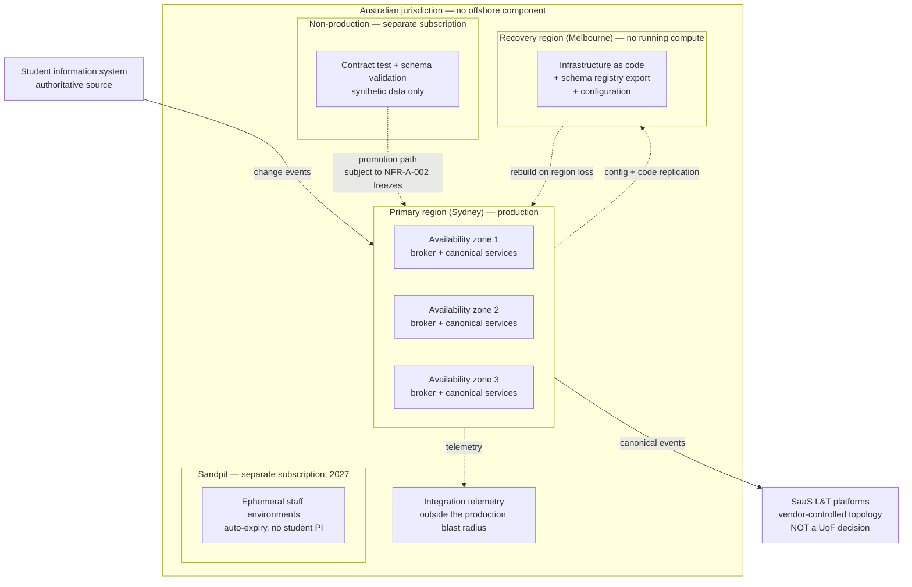

# ADR-005: Deployment Topology and Environment Strategy for the Integration Plane

> **Template Origin**: Official | **ArcKit Version**: 6.7.5 | **Command**: `/arckit:adr`

## Document Control

| Field | Value |
|-------|-------|
| **Document ID** | ARC-001-ADR-005-v1.0 |
| **Document Type** | Architecture Decision Record |
| **ADR Number** | ADR-005 |
| **Project** | Learning & Teaching Baseline Strategy (Project 001) |
| **Classification** | OFFICIAL |
| **Status** | **Proposed** |
| **Version** | 1.0 |
| **Created Date** | 2026-07-29 |
| **Last Modified** | 2026-07-29 |
| **Review Cycle** | Annual, plus event-triggered (see Review and Updates) |
| **Review Date** | 2026-08-28 |
| **Next Review Date** | 2027-07-29 |
| **Escalation Level** | Department |
| **Governance Forum** | RIFF Review → Education Committee → Operations Committee |
| **Owner** | Sam Okafor, Integration Architect |
| **Reviewed By** | [PENDING] |
| **Approved By** | [PENDING] |
| **Distribution** | Project Team; Digital & IT; Learning Technologies; Cybersecurity; Privacy & Records; Steering Committee |

## Revision History

| Version | Date | Author | Changes | Approved By | Approval Date |
|---------|------|--------|---------|-------------|---------------|
| 1.0 | 2026-07-29 | ArcKit AI | Initial creation from `/arckit:adr` command — deployment topology and environment strategy for the UoF-controlled integration plane; discharges ADR-001 Condition 2 | [PENDING] | [PENDING] |

---

## 1. Scope: What Is Actually Being Decided

This ADR is narrower than its title suggests, and the narrowing is the first substantive finding.

The University of Funk's learning and teaching estate is **almost entirely commercial SaaS**. Blackboard, Turnitin, Echo360, Zoom, MS Teams, PebblePad, ExamSoft, Qualtrics, Evasys, Leganto, Padlet, LinkedIn Learning, Kuracloud and iSimulate are all vendor-operated products [SL-C1]. For every one of them, **deployment topology and tenancy are properties of the vendor's product, not decisions available to UoF**. The university does not choose whether Turnitin runs multi-tenant, nor which region Zoom's media plane traverses, nor how Echo360 fails over.

Writing a topology decision that covers those platforms would be fiction. What UoF actually holds are *procurement and assessment* levers over them — the residency register (DR-005), the APP 8 cross-border assessment (NFR-C-002), the SLA verification obligation in NFR-A-001, and the exit terms in NFR-I-002. Those are governed elsewhere in this project and are **not** re-decided here.

### 1.1 What UoF does and does not control

| Layer | Controlled by | Topology decision available to UoF? |
|-------|---------------|-------------------------------------|
| SaaS L&T platforms (Blackboard, Turnitin, Echo360, Zoom, Teams, PebblePad, ExamSoft, Qualtrics, Evasys, Leganto, Padlet, and the discipline tools) | Vendor | **No.** Tenancy model and hosting region are product properties. UoF's levers are selection, contract and the DR-005 register |
| Student information system (PeopleSoft) and institutional identity | UoF / existing hosting arrangements | Out of scope — pre-existing, not a Project 001 decision |
| **Integration broker, canonical-model services, reconciliation services, integration telemetry** (the plane chosen in ADR-001) | **UoF** | **Yes — this is the decidable scope** |
| **Environment tiers for that plane: production, non-production, and the 2027 sandpit (INT-008)** | **UoF** | **Yes — this is the decidable scope** |

### 1.2 Scope statement

This ADR decides the deployment topology, region posture, failover posture and environment strategy for the **UoF-controlled integration plane** defined by ADR-001, and for the **environment tiers** that plane and its consumers require — including the sandpit provisioning that INT-008 records as *planned for 2027, not yet designed* [SL-C2].

It does not decide the broker product. That remains open under ADR-001 Condition 1 (the Principle 19 licensed-capability test). This ADR states the topology any candidate must satisfy, which is deliberately stated in platform-neutral terms so it survives that selection.

---

## 2. Context and Problem Statement

ADR-001 selected a central integration broker and attached three conditions. **Condition 2 states: "Availability treatment must be designed before the first integration cuts over. The broker becomes a shared dependency; NFR-A-001 requires it not to become the estate's weakest point."** This ADR exists to discharge that condition.

The problem is concrete. ADR-001 moved the estate from nine independent point integrations to one mediating layer. That is the right architecture for canonical conformance and observability, and it is a **deliberate concentration of failure**. Nine things that fail separately become one thing that fails together. NFR-A-001 requires 99.9% availability during teaching periods, and NFR-A-002 requires change to be scheduled around the academic calendar rather than the operational one. Neither is satisfiable by a plane with no stated topology.

There is a second, quieter problem. The current estate has **no environment discipline at all**. Course cloning runs on semi-manual scripts with a single-person dependency [SL-C1]. Sandpit provisioning is listed as an integration but has no design [SL-C2]. There is no stated rule about whether student personal information may be copied into a test environment — which means, in practice, that nothing prevents it. DR-004 identifies placement data as the estate's only sensitive information class, and NFR-C-001 requires minimisation by design. An undefined non-production tier is a standing privacy exposure, not merely an engineering inconvenience.

### 2.1 Why the decision is needed now

- ADR-001's Condition 2 blocks the first integration cutover until this is designed. INT-001 (SIS lifecycle) is Phase 3 of that plan.
- The sandpit (INT-008) is scheduled for 2027 and currently has no design. Deciding its tenancy and data rules now costs nothing; deciding them after it is built costs a remediation project.
- Region posture is an input to the DR-005 residency register and to the APP 8 assessment under NFR-C-002. It must be settled before any broker procurement, not after.

### 2.2 Regulatory and policy context

- **Privacy Act 1988 (Australian Privacy Principles)** — APP 11 (security of personal information) and APP 8 (cross-border disclosure) both bear directly on where the plane runs and what data may exist in non-production tiers (NFR-C-001, NFR-C-002, DR-003, DR-005).
- **ASD Essential Eight** — the estate targets Maturity Level 2 by end 2027 (NFR-SEC-002). A self-operated plane pulls *patch applications*, *patch operating systems*, *restrict administrative privileges* and *regular backups* onto UoF's ledger. Topology determines how large that obligation is.
- **RIFF governance** — any hosting spend is subject to the duplication test [SGP-C1], as ADR-001 Condition 1 already establishes.

> **Not applicable**: UK Government frameworks — GDS Service Standard, Technology Code of Practice, NCSC Cyber Essentials — have no standing for an Australian university and are not assessed here. Consistent with ADR-001, the applicable frameworks are the Privacy Act 1988, the ASD Essential Eight, and the university's own RIFF process. Region evaluation is confined to Australian regions for the same reason: DR-005 and NFR-C-002 make Australian residency the default position, and no European or UK region is a candidate.

---

## 3. Decision Drivers

### 3.1 Technical drivers

| Driver | Requirement | Note |
|--------|-------------|------|
| 99.9% availability during teaching periods | NFR-A-001 (REQ-032) | ~43 minutes of downtime per month. The dominant driver for this decision |
| Change control aligned to the academic calendar | NFR-A-002 | Freeze windows constrain the promotion path between environments |
| Change propagation within 15 minutes | NFR-P-001 | Bounds acceptable failover time — a failover longer than the propagation SLA is an SLA breach |
| Peak load without degradation | NFR-S-001 | Teaching-period commencement is the plane's worst case: full-cohort enrolment change |
| Integration observability | NFR-M-001 | Telemetry must survive the failure it is observing — it cannot share the plane's fate |
| Reproducible, documented automation | NFR-M-002 | The environment tiers must be reconstructible from version control, not hand-built |
| Published, versioned interfaces | NFR-I-001 | Environments must expose the same contracts, or non-production tests prove nothing |

### 3.2 Business drivers

| Driver | Requirement | Note |
|--------|-------------|------|
| Licence spend flat or reduced | BR-002 | Constrains the topology: an active-active estate roughly doubles the running footprint |
| Integration fragility and manual handling eliminated | BR-004 | A shared plane that falls over is fragility relocated, not removed |
| Demonstrable privacy and security posture | BR-005 | Non-production data rules are a visible, testable part of that posture |
| Governance operating on architectural evidence | BR-007 | Region and tenancy recorded as decisions, not inherited from whatever was convenient |

### 3.3 Data drivers

- **DR-003** privacy and minimisation — non-production tiers must not become uncontrolled copies of personal information
- **DR-004** sensitive placement information — the estate's only sensitive class; must never exist outside production
- **DR-005** residency register — the plane's own hosting region becomes an entry in this register

### 3.4 Alignment to architecture principles

| # | Principle | Criticality | Effect on this decision |
|---|-----------|-------------|------------------------|
| 5 | Single Source of Truth for Core Entities | CRITICAL | Non-production tiers hold synthetic data, never a second copy of the authoritative record |
| 7 | Privacy by Design and Data Minimisation | CRITICAL | **Directly on point** for the environment strategy — production data in test is a design defect, not an operational one |
| 8 | Data Residency and Cross-Border Accountability | CRITICAL | **Directly on point** for the region decision — Australian region is the default and departures require assessment |
| 13 | Reproducible, Documented Automation | HIGH | Environments defined as code; no hand-built tier |
| 15 | Availability Aligned to the Teaching Calendar | HIGH | **Directly on point** — the availability target is period-differentiated, so the topology is sized to teaching periods |
| 16 | Layered Security Posture | CRITICAL | Environment separation is an identity and administrative-privilege boundary, not just a naming convention |
| 17 | Observable Integrations and Services | HIGH | Telemetry must be independently available when the plane is not |
| 19 | Realise Licensed Capability Before New Spend | HIGH | Constrains the footprint; the topology must be deliverable within an existing cloud agreement if ADR-001 Condition 1 finds one |

---

## 4. Considered Options

1. **Option A** — Single Australian region, multi-availability-zone, with cross-region recovery from code
2. **Option B** — Active-active across two Australian regions
3. **Option C** — Do Nothing (baseline): no stated topology, no environment tiers

Australian regions only are evaluated, per DR-005 and NFR-C-002. The candidate set across the major providers is: Sydney (Azure Australia East, AWS ap-southeast-2, Google australia-southeast1), Melbourne (Azure Australia Southeast, AWS ap-southeast-4, Google australia-southeast2), and Canberra (Azure Australia Central 1 and 2). Provider selection follows ADR-001 Condition 1 and is not pre-empted here.

### 4.1 Option A: Single Australian region, multi-AZ, cross-region recovery from code

**Description**: The production integration plane runs in one Australian region, spread across the availability zones that region offers. A second Australian region holds no running compute — it holds the infrastructure-as-code definitions, the schema registry export, and replicated configuration and telemetry, from which the plane can be rebuilt. Recovery is an execution of automation, not a failover switch.

**Implementation approach**: Sydney as primary (highest availability-zone count and most complete service coverage across all three providers), Melbourne as the recovery region. All tiers defined as code (NFR-M-002). Environment isolation by separate cloud subscription/account and separate identity boundary, not by namespace within a shared subscription. Telemetry ships to a store outside the production plane's blast radius so NFR-M-001 holds during an outage.

**Wardley evolution stage**: Commodity (0.80) — multi-AZ deployment in a single region is the standard operating pattern for every major provider and carries no novelty.

**Good**:

- ✅ **Sized to the actual requirement.** Multi-AZ within one region is the industry-standard means of reaching 99.95%+ compute availability, comfortably inside the 99.9% teaching-period target (NFR-A-001) with error budget left for the rest of the chain
- ✅ Single-region operation keeps the footprint — and therefore the cost — within reach of BR-002 and of ADR-001's already-contested cost position
- ✅ One region means one residency entry in DR-005 and one APP 8 position, not a distributed one that is harder to assess and to explain
- ✅ Recovery-from-code enforces Principle 13 by construction: if the code cannot rebuild the plane, the DR posture is known to be broken, and it is known *continuously*, not at the moment it is needed
- ✅ No cross-region data replication of personal information, which removes an entire class of privacy and consistency question
- ✅ Operationally within reach of a team that ADR-001 already records as not currently holding broker skills

**Bad**:

- ❌ A whole-of-region failure means a rebuild, not a switch. Recovery is measured in tens of minutes to hours, not seconds
- ❌ Recovery-from-code is only as good as its last rehearsal; an unrehearsed runbook is a hope, not a control
- ❌ Requires an explicit degraded-mode design so that a plane outage delays propagation rather than losing events — this is design work, not a free property
- ❌ Concentrates the plane in one region's operational fate, including provider-side maintenance events

**Cost analysis** *(indicative — no costing baseline exists for 001; see Assumptions and ADR-001 A-1)*:

| | Estimate |
|---|---|
| CAPEX | Environment definitions as code, telemetry pipeline, DR runbook and first rehearsal |
| OPEX | One running production footprint plus non-production; storage-only cost in the recovery region |
| 3-year TCO | Lowest of the two active options. Cost scales with integration volume, not with region count |

### 4.2 Option B: Active-active across two Australian regions

**Description**: The plane runs concurrently in Sydney and Melbourne, with events processed in both and state replicated between them. A region loss is absorbed rather than recovered from.

**Implementation approach**: Dual-region deployment with cross-region replication of the event log and schema registry, global traffic distribution, and conflict handling for concurrent processing.

**Wardley evolution stage**: Product (0.60) — well-supported by major brokers but materially more bespoke to assemble and operate than Option A.

**Good**:

- ✅ Highest availability ceiling; survives a whole-of-region event with no rebuild
- ✅ Recovery time approaches zero, so a region loss during an assessment window is not an NFR-A-001 event
- ✅ Capacity headroom for NFR-S-001 peaks is inherent rather than provisioned

**Bad**:

- ❌ **Roughly doubles the running footprint against BR-002**, on top of a broker cost that ADR-001 already records as the primary anticipated objection at RIFF. This is the decisive argument
- ❌ **Solves a problem the requirement does not pose.** NFR-A-001 asks for 99.9% — multi-AZ already clears it. Active-active buys availability above the target while the actual risk sits elsewhere: in the SaaS platforms, whose SLAs NFR-A-001 requires UoF to *verify*, and which no UoF topology can improve
- ❌ Duplicate-processing and ordering semantics become a standing correctness concern — a live risk to Principle 5 (broker as second source of truth), which ADR-001 already flags
- ❌ Cross-region replication of enrolment and role data creates a second copy of personal information to justify under DR-003 and to record under DR-005
- ❌ Operationally the most demanding option, against a team ADR-001 states does not currently hold broker operations skills
- ❌ Twice the surface to patch and administer under NFR-SEC-002 (Essential Eight ML2)

**Cost analysis** *(indicative)*:

| | Estimate |
|---|---|
| CAPEX | Dual-region build, replication design, conflict semantics, cross-region test harness |
| OPEX | Two running production footprints; elevated operational and on-call load |
| 3-year TCO | Materially highest. The increment buys availability above the stated requirement |

### 4.3 Option C: Do Nothing (baseline)

**Description**: No stated topology. The broker is deployed wherever is convenient at build time. No formal environment tiers — testing happens against production or against whatever ad-hoc instance exists. Sandpit provisioning (INT-008) remains undesigned.

**Good**:

- ✅ No design effort, no additional footprint, nothing to fund
- ✅ Matches how the estate operates today, so no change management

**Bad**:

- ❌ **Leaves ADR-001 Condition 2 undischarged**, which blocks the first integration cutover by that ADR's own terms
- ❌ Fails NFR-A-001: an availability target that nothing is designed to meet is a target in name only, and R-024 (teaching platform outage during assessment) stays unmitigated
- ❌ Fails NFR-A-002: no environment tiers means no promotion path, so there is nothing for a change freeze to apply to
- ❌ Leaves DR-003 and DR-004 exposed — with no rule, student and placement data will reach non-production tiers, because that is the path of least resistance and nothing forbids it
- ❌ INT-008 remains undesigned into 2027, and the sandpit gets built by whoever needs it first, to no standard
- ❌ Fails NFR-M-002 and Principle 13: hand-built environments cannot be rebuilt, which is the same single-person-dependency failure as R-007's course-cloning scripts, reproduced in a new place

**Retained as a genuine baseline.** The RIFF process permits closing a request. But this baseline is not neutral: it is the position the estate is in, and R-006, R-007 and R-024 are the evidence of what it produces.

---

## 5. Decision Outcome

**Chosen option: Option A — single Australian region, multi-availability-zone, with cross-region recovery from code**, on a three-tier environment strategy (production / non-production / sandpit) with a hard prohibition on personal information outside production.

### 5.1 Y-Statement

> In the context of **deploying the shared integration plane selected in ADR-001 and the environment tiers it and its consumers require**,
> facing **a 99.9% teaching-period availability obligation against a plane that deliberately concentrates nine previously independent failure points, and a non-production estate with no data rules at all**,
> we decided for **a single Australian region deployed across availability zones, with a second Australian region held as code and configuration only, and three environment tiers separated by subscription and identity boundary**,
> and against **active-active across two Australian regions**,
> to achieve **an availability posture that meets NFR-A-001 with error budget to spare, a residency position that is single and assessable under APP 8, and a non-production estate that cannot hold student or placement data**,
> accepting **that a whole-of-region loss is recovered by rebuild rather than absorbed, and that this recovery posture is only as credible as its rehearsal schedule**.

### 5.2 The availability argument, stated plainly

This is the crux of the decision and it deserves to be explicit rather than buried in an options table.

**First: the integration plane is not in the student's request path.** Students reach materials through the LMS; the plane propagates change *behind* that. An outage of the plane therefore degrades **data freshness**, not **teaching availability** — provided the design ensures events are buffered at the edge and replayed rather than dropped. This is a design obligation, not an assumption, and it is Condition 1 below. Once it holds, a plane outage costs propagation latency against NFR-P-001, not availability against NFR-A-001.

**Second: 99.9% is 43 minutes per month, and it is a chain target.** NFR-A-001's third acceptance criterion requires the dependency chain to be accounted for in aggregate. The chain includes the SIS, the plane, and the destination SaaS platform. If the plane were to consume the whole budget, nothing would be left for the platforms — whose SLAs NFR-A-001 requires UoF to verify, and which R-024 identifies as currently unverified. The plane is therefore targeted at **99.95% during teaching periods** (approximately 22 minutes per month), so that it is a minor rather than dominant contributor to the chain. Multi-AZ within a single region is the standard means of reaching that figure; active-active is not required to.

**Third: active-active would spend the constrained budget in the wrong place.** BR-002 holds licence spend flat, and ADR-001 records the cost objection as the primary anticipated challenge at RIFF. Doubling the plane's footprint to exceed an availability target the plane can already meet — while the estate's actual availability exposure sits in unverified vendor SLAs (R-024) that no UoF topology can influence — would be an expensive answer to a question nobody asked.

### 5.3 Region posture

| Position | Decision |
|----------|----------|
| Primary region | An Australian region with three availability zones. **Sydney** is the default selection (Azure Australia East / AWS ap-southeast-2 / Google australia-southeast1), being the region with the most complete service coverage and zone count across all three candidate providers |
| Recovery region | A second Australian region, default **Melbourne** (Azure Australia Southeast / AWS ap-southeast-4 / Google australia-southeast2). Holds code, configuration and telemetry only — no running compute, no personal information at rest |
| Canberra regions | Available (Azure Australia Central 1 and 2) but not selected. They exist principally to serve government workloads under arrangements UoF does not need and would pay for |
| Offshore | **Excluded.** DR-005 and NFR-C-002 make Australian residency the default. No offshore region is a candidate for the plane, which means the plane itself adds no new APP 8 exposure — a deliberate contrast with the SaaS estate, where four data classes already sit offshore (R-017) |

**Zone availability caveat**: availability-zone support is not uniform across Australian regions — notably, Azure's Australia Southeast has historically not offered zones. Zone count in both the primary and recovery region must be **verified against the chosen provider at selection**, not assumed. If the primary region cannot offer three zones, the primary/recovery pairing is revisited before build. Recorded as Assumption A-2.

### 5.4 Environment strategy

Three tiers, separated by cloud subscription/account **and** identity boundary — not by namespace, tag or naming convention within a shared subscription. Separation that a misconfiguration can cross is not separation.

| Tier | Purpose | Tenancy and isolation | Data rule | Availability |
|------|---------|----------------------|-----------|--------------|
| **Production** | Live integration for INT-001 to INT-009 | Dedicated to UoF. Multi-AZ, single Australian region. Administrative access individually attributable, no shared accounts (NFR-SEC-001, Principle 16) | Real personal information under APP 11 controls. Placement data (DR-004) exists **only** here | 99.95% target during teaching periods; NFR-A-002 freeze windows apply |
| **Non-production** | Contract testing, schema-registry validation, release verification before promotion | Separate subscription and identity boundary. Single AZ acceptable. Interface-identical to production (NFR-I-001) — a test against a different contract proves nothing | **Synthetic or de-identified data only.** No student personal information. No placement data under any circumstance. Enforced by control, not by policy statement | Best effort; no availability commitment |
| **Sandpit** (INT-008, 2027) | Staff experimentation and development | Ephemeral, per-request, time-limited with automatic expiry. Provisioned by self-service through the automated path, not by ticket. Staff identity and role only, per INT-008 | **No student personal information — stated in INT-008 and made structural here.** Synthetic cohorts only | None. Expiry is a feature |

**The data rule is the load-bearing part of this section.** DR-003 requires minimisation and DR-004 identifies placement information as the estate's only sensitive class, currently re-keyed by hand (R-008, R-018). Every copy of that data outside production is an APP 11 exposure with no offsetting purpose. Stating the rule now, before the tiers exist, is the difference between a control and a cleanup.

### 5.5 Topology

### 5.6 Recovery objectives

| Objective | Teaching period | Outside teaching period |
|-----------|-----------------|-------------------------|
| **RTO** (zone loss) | Automatic; no manual recovery | Automatic |
| **RTO** (region loss) | 4 hours | 8 hours |
| **RPO** | **Zero events lost.** Events are replayable from the authoritative source and from edge buffers; the plane holds no state that is not reconstructible | Zero events lost |

RPO is expressed in events, not minutes, deliberately. The plane holds no durable state beyond its replay window — ADR-001 already requires this to prevent it becoming a second source of truth in breach of Principle 5. A plane that can lose data permanently has violated that constraint before availability is even considered.

The four-hour region-loss RTO exceeds NFR-P-001's 15-minute propagation SLA, and that is an accepted, stated trade-off: a whole-of-region loss is an NFR-P-001 breach for its duration. Buying it down to seconds is exactly what Option B costs, and §5.2 sets out why that is not the right use of the budget.

### 5.7 Justification

**Why not Option B**, despite its higher ceiling: it exceeds the stated requirement at roughly double the running cost, against a business driver (BR-002) that ADR-001 already identifies as the decision's most contested point. It also adds a second cross-region copy of personal information and a standing correctness concern around duplicate processing — both of which push against Principles 5 and 7. The availability it buys sits above NFR-A-001, while the estate's real availability exposure is in unverified vendor SLAs (R-024) that no UoF topology can address.

**Why not Option C**: it leaves ADR-001 Condition 2 undischarged, which by ADR-001's own terms blocks the INT-001 cutover. It also reproduces the R-007 failure mode — hand-built, unreconstructible, single-person-dependent — in a new location, which is precisely the pattern this engagement exists to break.

**Why Option A**: it meets NFR-A-001 with error budget remaining, keeps the residency position single and assessable, and costs a footprint the RIFF process can plausibly approve. Its principal weakness — that recovery is a rebuild — is convertible into a strength, because recovery-from-code is *continuously testable* in a way that a rarely-exercised failover path is not. That conversion depends entirely on rehearsal, which is why rehearsal is a condition rather than a recommendation.

### 5.8 Conditions attached to this decision

1. **Degraded-mode design before first cutover.** The §5.2 argument — that a plane outage costs freshness, not teaching availability — is only true if events buffer at the edge and replay rather than drop. This must be designed and failure-injection tested before INT-001 cuts over. If it cannot be achieved for a given integration, that integration's availability contribution is reassessed individually.
2. **Recovery rehearsed before first cutover and each semester thereafter.** A rebuild from code that has never been executed is not a recovery posture. Rehearsal outcome and elapsed time are recorded against the §5.6 RTO.
3. **Non-production data control implemented as a control, not a policy.** The prohibition on personal information outside production must be technically enforced and monitored. A rule that depends on everyone remembering it is the same class of control as the manual processes this project is replacing.
4. **Zone count verified at provider selection** (§5.3 caveat, Assumption A-2).

### 5.9 Dissent recorded

No formal dissent at time of writing. **Two objections are anticipated and legitimate**:

- *That single-region is insufficient for a Must-priority availability requirement.* The counter is §5.2: 99.9% is met by multi-AZ, the plane sits off the student request path, and the dependency-chain criterion in NFR-A-001 argues for leaving budget elsewhere rather than consuming it here. If Cybersecurity or the CIO judges whole-of-region loss to be a live risk on evidence, that is a legitimate basis to revisit — the argument here is proportionality, not that region loss is impossible.
- *That prohibiting real data in non-production will make testing harder.* It will. Synthetic data generation is real effort, and the honest position is that this cost is accepted rather than avoided (see Consequences).

---

## 6. Consequences

### 6.1 Positive

| Consequence | Measure | Baseline → Target |
|-------------|---------|-------------------|
| Availability posture exists and is designed, not asserted | Plane availability during teaching periods | Undefined → 99.95% (NFR-A-001 met with margin) |
| ADR-001 Condition 2 discharged | Cutover blocker | Open → closed, INT-001 unblocked |
| Personal information outside production | Copies in non-production tiers | Unbounded and unmeasured → zero (DR-003, DR-004) |
| Environments reconstructible from code | Hand-built tiers | All → none (NFR-M-002, Principle 13) |
| Residency position single and assessable | APP 8 assessments for the plane | Undefined → one, Australian, no offshore disclosure (NFR-C-002, DR-005) |
| Sandpit designed before it is built | INT-008 design status | Undesigned → tenancy, data rule and lifecycle defined |
| Recovery capability demonstrated | DR rehearsals per year | 0 → 2 (each semester) |

### 6.2 Negative — accepted trade-offs

| Trade-off | Mitigation |
|-----------|-----------|
| Whole-of-region loss is a 4-hour teaching-period outage of propagation | Edge buffering means delay, not loss (Condition 1); rehearsed rebuild (Condition 2); region loss is a low-likelihood event, and the response is proportionate to it |
| Recovery credibility depends entirely on rehearsal discipline | Rehearsal is a condition, scheduled per semester, with outcome recorded — not a best-effort intention |
| Synthetic data generation is genuine, recurring effort | Accepted. It is materially cheaper than the APP 11 exposure and the eventual cleanup of an uncontrolled non-production estate |
| Non-production fidelity is imperfect; some defects will only appear in production | Interface-identical contracts (NFR-I-001) close most of the gap; the residual is accepted and managed through phased cutover |
| A second subscription per tier adds administrative overhead | Offset against the security benefit — separation by identity boundary is a genuine Essential Eight control (NFR-SEC-002, Principle 16) |
| Provider choice is constrained by Australian zone availability | Verified at selection (Condition 4); constrains provider choice rather than blocking it |

### 6.3 Neutral — changes required

- Infrastructure-as-code repository and pipeline established for all three tiers, with the promotion path documented
- Change freeze calendar (NFR-A-002) extended to cover the integration plane, not only the teaching platforms
- Synthetic data generation capability built for the canonical entities defined in ARC-001-DATA
- Sandpit expiry and reclamation process defined as part of the INT-008 2027 design
- DR-005 residency register gains an entry for the plane itself — the first entry in that register for a UoF-controlled component rather than a vendor product
- On-call coverage extended to the plane, per ADR-001's existing operational-uplift commitment

### 6.4 Risks and mitigations

| Risk | Likelihood | Impact | Mitigation | Owner |
|------|-----------|--------|------------|-------|
| Region loss during an assessment window exceeds the 4-hour RTO | LOW | HIGH | Rehearsed rebuild; assessment-period freeze reduces change-induced failure; degraded mode means delay not loss | Sam Okafor |
| DR rehearsal lapses and the recovery posture silently decays | MEDIUM | HIGH | Rehearsal scheduled per semester with recorded outcome; lapse is a reportable exception to RIFF | Sam Okafor |
| Real data reaches non-production despite the rule | MEDIUM | HIGH | Technical enforcement and monitoring (Condition 3); this is the failure mode the rule exists to prevent, and policy alone will not prevent it | Eleanor Frame |
| Chosen provider's Australian regions lack required zone coverage | LOW | MEDIUM | Verified at selection (Condition 4); pairing revisited if not met | Sam Okafor |
| Cost of three tiers challenged at RIFF alongside the broker cost | MEDIUM | MEDIUM | Non-production and sandpit are small relative to production; sandpit is ephemeral by design and costs only while in use | Cassandra Rhodes |
| Sandpit becomes a shadow production environment | MEDIUM | MEDIUM | Automatic expiry; staff identity and role only; no student data means it cannot serve a production purpose | Dr. Benny Moog |
| Single-region posture is later judged insufficient | LOW | MEDIUM | Option B remains available; Option A is a subset of it, so the migration path is additive rather than a rebuild | Cassandra Rhodes |

**Existing risks affected**: R-024 (teaching platform outage during assessment) partially addressed — the plane's contribution is now designed, though the unverified vendor SLAs that dominate this risk remain outside UoF's control. R-007 (single-person dependency) prevented from recurring in the plane, through environments-as-code. R-018 and R-008 (placement data handled manually) supported by the prohibition on that data leaving production. R-006 (integration estate fragility) — the concentration ADR-001 introduced is now bounded by a stated availability design.

---

## 7. Validation and Compliance

### 7.1 How implementation will be verified

- **Design review**: the WP5 integration architecture and WP8 target state must reflect this topology. A design placing production and non-production in a shared subscription, or showing personal information in a non-production tier, is non-conformant
- **Failure-injection testing**: zone loss and plane loss tested before INT-001 cutover, verifying that events buffer and replay (Condition 1)
- **Recovery rehearsal**: full rebuild from code in the recovery region, elapsed time recorded against §5.6 (Condition 2)
- **Data control test**: attempted write of personal information into non-production is blocked and alerted (Condition 3)
- **Conformance check**: `/arckit:conformance` after implementation

### 7.2 Monitoring

| Metric | Target | Source |
|--------|--------|--------|
| Plane availability during teaching periods | ≥ 99.95% | Availability monitoring, period-differentiated |
| Propagation latency, source to platform | Within 15 minutes (NFR-P-001) | Plane telemetry |
| Events buffered and replayed during degradation | 100% replayed, zero dropped | Dead-letter and replay metrics |
| Personal information detected in non-production | Zero | Data control monitoring |
| Recovery rehearsal elapsed time | Within RTO (§5.6) | Rehearsal record |
| Sandpit environments past expiry | Zero | Sandpit lifecycle telemetry |
| Change executed inside a freeze window without exception approval | Zero | Change record (NFR-A-002) |

### 7.3 Compliance verification

- **Privacy Act 1988** — the plane holds no offshore component, so it adds no APP 8 exposure (NFR-C-002). The non-production prohibition is an APP 11 control and reduces the copy count relative to today's flat-file estate (DR-003, NFR-C-001). The plane's region is recorded in DR-005
- **ASD Essential Eight** — separate subscriptions and identity boundaries support *restrict administrative privileges*; environments-as-code supports *patch applications* and *patch operating systems* by making rebuild-to-patched-state routine; recovery-from-code supports *regular backups*. All contribute to the ML2 target in NFR-SEC-002
- **RIFF governance** — hosting footprint falls under the same Condition 1 duplication test as the broker itself [SGP-C1]

> **Not applicable**: GDS Service Standard, Technology Code of Practice and NCSC Cyber Essentials — UK Government frameworks without standing for an Australian university, consistent with ADR-001.

---

## 8. Traceability

### 8.1 Requirements addressed

| Type | IDs |
|------|-----|
| Business | BR-002, BR-004, BR-005, BR-007 |
| Integration | INT-001 to INT-009 (all, as consumers of the plane); **INT-008 directly** (sandpit provisioning) |
| Non-functional | NFR-A-001, NFR-A-002, NFR-P-001, NFR-S-001, NFR-SEC-001, NFR-SEC-002, NFR-M-001, NFR-M-002, NFR-I-001, NFR-C-001, NFR-C-002 |
| Data | DR-003, DR-004, DR-005 |
| Source requirement | REQ-032 (99.9% availability during teaching periods) is the originating driver |

### 8.2 Architecture artifacts

| Artifact | Relationship |
|----------|-------------|
| `ARC-000-PRIN-v1.1` | Principles 5, 7, 8, 13, 15, 16, 17, 19 |
| `ARC-001-REQ-v1.0` | Source of all requirement IDs above; INT-008 and NFR-A-001 in particular |
| `ARC-001-ADR-001-v1.0` | **Parent decision.** This ADR discharges its Condition 2 and inherits its Condition 1 |
| `ARC-001-DATA-v1.0` | Canonical entities that synthetic non-production data must instantiate |
| `ARC-001-RISK-v1.0` | R-006, R-007, R-008, R-018, R-024 |
| `ARC-001-STKE-v1.0` | Rhodes (funding, E8 ownership), Okafor (delivery), Ohm (security posture), Frame (privacy sign-off) |
| `system-landscape.md` | Integration 7 — sandpit provisioning, planned 2027, not yet designed |

---

## 9. Implementation Plan

### 9.1 Dependencies

- **ADR-001 Condition 1** (Principle 19 licensed-capability test) must complete before provider and broker selection. This ADR is deliberately provider-neutral so it survives either outcome
- Australian region and zone availability verified for the selected provider (Condition 4)
- Canonical model from `ARC-001-DATA-v1.0` available, as the basis for synthetic data generation
- Academic calendar freeze windows confirmed with Learning Technologies (NFR-A-002)

### 9.2 Timeline

| Phase | Activity | Duration | Owner |
|-------|----------|----------|-------|
| 0 | Provider and region confirmed; zone coverage verified | 2 weeks | Sam Okafor |
| 1 | Environments-as-code for production and non-production; subscription and identity separation | 4 weeks | Sam Okafor |
| 2 | Non-production data control implemented and tested (Condition 3) | 2 weeks | Sam Okafor / Eleanor Frame |
| 3 | Degraded-mode design and failure-injection test (Condition 1) | 3 weeks | Sam Okafor |
| 4 | First recovery rehearsal (Condition 2) — gates INT-001 cutover | 1 week | Sam Okafor |
| 5 | INT-001 cutover proceeds under ADR-001 Phase 3 | — | Sam Okafor |
| 6 | Sandpit tier designed and built (INT-008) | 2027 | Sam Okafor / Dr. Benny Moog |

### 9.3 Rollback plan

**Trigger**: the plane's availability materially below target during a teaching period, or a recovery rehearsal failing to meet the §5.6 RTO twice consecutively.

**Procedure**: cutover of further integrations halts. Integrations already delivered continue running, with their prior mechanism retained in a disabled state per ADR-001's rollback plan. Topology is re-evaluated — Option B is an additive change from Option A, not a rebuild, so escalation is available without discarding the work.

**Owner**: Sam Okafor, escalating to Cassandra Rhodes.

---

## 10. Review and Updates

| Review | When | Criteria |
|--------|------|----------|
| Initial | 3 months after INT-001 cutover | Availability target met? Rehearsal RTO met? Any personal information detected in non-production? |
| Periodic | Annually | Still proportionate? Has the estate's availability exposure moved? |
| Sandpit gate | Before INT-008 build commences (2027) | Tier design still consistent with this ADR? |

**Trigger events for re-evaluation**: a region-loss event affecting the plane; a change in Australian region or zone availability from the selected provider; NFR-A-001 being raised above 99.9%; a broker product change arising from ADR-001 Condition 1; a decision to run student-facing workload on the plane, which would move it into the request path and invalidate the §5.2 argument.

---

## 11. Related Decisions

| Relationship | ADR | Note |
|-------------|-----|------|
| **Depends on** | ADR-001 — Integration Mediation Approach | This ADR discharges ADR-001 Condition 2 and is bounded by its Condition 1 |
| **Relates to** | ADR-002 — Authoritative Source for Institutional Role Assignment | The authoritative source determines what the plane replays from after a recovery |
| **Relates to** | ADR-003 — Logging and Observability Stack for L&T Integrations | Telemetry placement outside the production blast radius (§5.5) is a constraint this ADR places on ADR-003's stack |
| **Relates to** | ADR-004 — Open-Source Licence and Third-Party Component Policy | Applies to infrastructure-as-code tooling and any self-hosted plane component |

---

## 12. Assumptions

| # | Assumption | If invalid |
|---|-----------|-----------|
| A-1 | No costing baseline exists for 001; cost analysis is comparative, not quantified (inherits ADR-001 A-1) | Option ranking stands on architecture; figures would need revisiting with real costs |
| A-2 | The selected provider offers three availability zones in the chosen Australian primary region. Zone coverage is not uniform across Australian regions | Primary/recovery pairing revisited before build (Condition 4). If no Australian region offers three zones on the chosen provider, the availability argument in §5.2 is re-derived |
| A-3 | The integration plane sits off the synchronous student request path | The §5.2 availability argument fails and the plane inherits NFR-A-001 directly rather than contributing to it. This is why Condition 1 exists |
| A-4 | Events can be buffered at the edge and replayed by the authoritative source | RPO cannot be expressed in events, and a stricter topology is required |
| A-5 | Synthetic data can adequately exercise the canonical entities for contract testing | Non-production fidelity is lower than assumed; more defects surface in production and the phased cutover carries more weight |
| A-6 | The sandpit (INT-008) requires staff identity and role only, per its requirement definition | If student data proves necessary, the sandpit becomes a production-equivalent tier and this ADR is revisited |

---

## 13. External References

### 13.1 Document Register

| Doc ID | Filename | Type | Source Location | Description |
|--------|----------|------|-----------------|-------------|
| PRIN | ARC-000-PRIN-v1.1.md | ArcKit artifact | `000-global/` | Principles 5, 7, 8, 13, 15, 16, 17, 19 |
| REQ | ARC-001-REQ-v1.0.md | ArcKit artifact | `001-lt-ecosystem/` | NFR-A-001, NFR-A-002, INT-008, DR-003 to DR-005 |
| ADR1 | ARC-001-ADR-001-v1.0.md | ArcKit artifact | `001-lt-ecosystem/decisions/` | Parent decision; Conditions 1 and 2 |
| SL | system-landscape.md | Foundation artifact | `001-lt-ecosystem/external/` | SaaS estate composition; integration 7 (sandpit, undesigned) |
| SGP | solution-governance-process.md | Foundation artifact | `000-global/policies/` | RIFF Review duplication rule (via ADR-001) |

### 13.2 Citations

| Citation ID | Doc ID | Page/Section | Category | Quoted Passage |
|-------------|--------|--------------|----------|----------------|
| SL-C1 | SL | Categorisation map; Known integrations | Context | Estate composed of vendor products across all eight capability categories; "Nightly batch flat-file / Fragile; role assignment failures; no intra-day sync"; "Course cloning automation / Semi-manual scripts / Undocumented; single-person dependency" |
| SL-C2 | SL | Known integrations, row 7 | Scope Gap | "Sandpit provisioning" — method "(planned 2027)", known issues "Not yet designed" |
| ADR1-C1 | ADR1 | Conditions attached to this decision | Constraint | "Availability treatment must be designed before the first integration cuts over. The broker becomes a shared dependency; NFR-A-001 requires it not to become the estate's weakest point." |
| ADR1-C2 | ADR1 | Conditions attached to this decision | Constraint | "Principle 19 test must be completed before procurement." |
| SGP-C1 | SGP | Rules | Procurement Constraint | "Solutions duplicating capability already licensed (per the system landscape map) must justify why the incumbent tool is unsuitable." |

### 13.3 Unreferenced Documents

| Filename | Source Location | Reason |
|----------|-----------------|--------|
| privacy-context.md | `001-lt-ecosystem/external/` | Privacy consequences traced through DR-003, DR-004 and NFR-C-001 in ARC-001-REQ rather than cited directly |
| requirements-register.md | `001-lt-ecosystem/external/` | Superseded by ARC-001-REQ, which is the artifact cited |
| capability-taxonomy.md | `000-global/external/` | Capability categorisation does not bear on deployment topology |

---

**Generated by**: ArcKit `/arckit:adr` command
**Generated on**: 2026-07-29
**ArcKit Version**: 6.7.5
**Project**: Learning & Teaching Baseline Strategy (Project 001)
**Model**: Claude Opus 5 (1M context)
**Generation Context**: Deployment topology and environment strategy. Scope deliberately narrowed after establishing that topology and tenancy for the SaaS estate are vendor properties UoF does not control — the decidable scope is the UoF-controlled integration plane from ADR-001 plus environment tiers including the undesigned 2027 sandpit (INT-008). Discharges ADR-001 Condition 2. Australian regions only, per DR-005 and NFR-C-002; UK Government frameworks excluded as inapplicable, with Privacy Act 1988, ASD Essential Eight and RIFF governance applied instead. Escalation level Department; three options analysed including a Do Nothing baseline.

<!-- arckit-provenance:start -->

## Build Provenance

*Stamped automatically by the ArcKit plugin's `provenance-stamp.mjs` PostToolUse hook. Complements (does not replace) the human-authored footer above. Carries only fields the model can't authoritatively self-report: build context from `.arckit/state.json` and effort levels derived from command frontmatter + the silent-downgrade matrix.*

| Field | Value |
|-------|-------|
| Requested Effort | `high` |
| Effective Effort | _unknown — model not parsed from existing footer_ |
| Stamped at | 2026-07-29T13:57:45.419Z |

<!-- arckit-provenance:end -->
