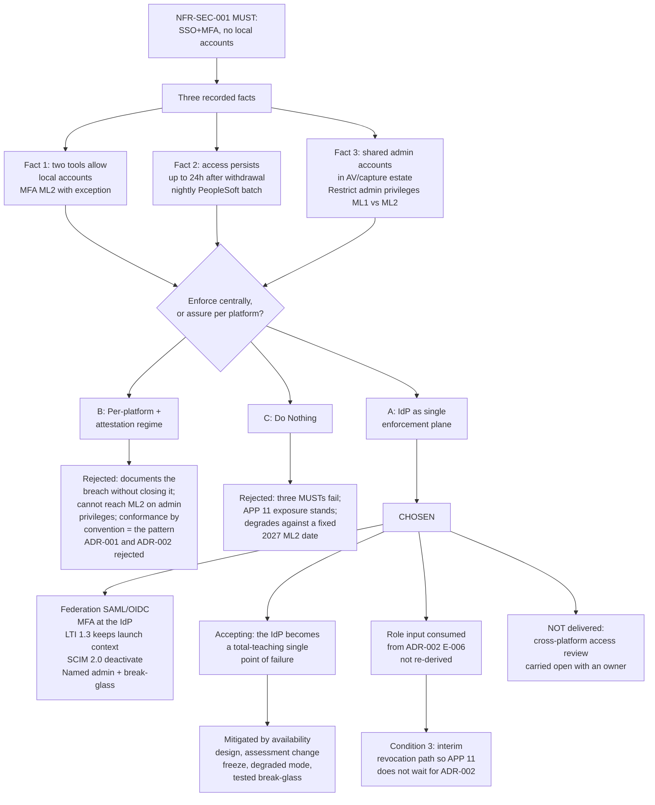

# ADR-008: Identity and Access Enforcement Across L&T Platforms

> **Template Origin**: Official | **ArcKit Version**: 6.7.5 | **Command**: `/arckit:adr`

## Document Control

| Field | Value |
|-------|-------|
| **Document ID** | ARC-001-ADR-008-v1.0 |
| **Document Type** | Architecture Decision Record |
| **ADR Number** | ADR-008 |
| **Project** | Learning & Teaching Baseline Strategy (Project 001) |
| **Classification** | OFFICIAL |
| **Status** | **Proposed** |
| **Version** | 1.0 |
| **Created Date** | 2026-07-29 |
| **Last Modified** | 2026-07-29 |
| **Review Cycle** | Annual, with a conditions gate before implementation |
| **Next Review Date** | 2027-07-29 |
| **Review Date** | 2026-08-28 |
| **Escalation Level** | Department |
| **Governance Forum** | RIFF Review → Education Committee → Operations Committee |
| **Owner** | Tobias Ohm, Cybersecurity Lead |
| **Reviewed By** | PENDING |
| **Approved By** | PENDING |
| **Distribution** | Project Team; Digital & IT; Cybersecurity; Governance (Privacy & Records); Procurement; Learning Technologies; AV & Media Services; School and Faculty leadership; Steering Committee |

## Revision History

| Version | Date | Author | Changes | Approved By | Approval Date |
|---------|------|--------|---------|-------------|---------------|
| 1.0 | 2026-07-29 | ArcKit AI | Initial creation from `/arckit:adr` command — raised to decide how authentication and access are *enforced* across the L&T estate, complementing ADR-002 which decides where role data *originates* | PENDING | PENDING |

---

## 1. Decision Title

**Identity and Access Enforcement Across L&T Platforms**

How authentication, authorisation and access revocation are *enforced* across the twenty-plus platforms of the Learning & Teaching estate — the control plane, the multi-factor posture, the mechanism by which access ends, the disposition of the platforms that still permit local accounts, and the treatment of shared administrative accounts.

### 1.1 Boundary Against ADR-002 — Read This First

This decision and **ADR-002: Authoritative Source for Institutional Role Assignment** are adjacent and must not be conflated.

| Question | Decided by |
|----------|-----------|
| *Which system is authoritative for the institutional role a person holds?* | **ADR-002** — a dedicated Institutional Role Authority deriving E-006 from SIS enrolment and HR appointment events |
| *How is that role turned into enforced access, and how is access ended?* | **This ADR (008)** |

ADR-002 produces an authoritative statement of *who holds which role*. It does not authenticate anybody, does not enforce multi-factor, does not revoke a live session, and does not decide what happens to a platform that keeps its own password database. Those are the subject of this decision.

The dependency runs one way for correctness and both ways for value: this ADR **consumes** ADR-002's role stream as its authorisation input, and ADR-002's promised deprovisioning benefit is only realised if something enforces revocation — which is decided here. Neither delivers the requirement alone.

---

## 2. Stakeholders

### 2.1 Deciders (RACI: Accountable)

- **Cassandra "Cas" Rhodes, Chief Information Officer** — accountable for BR-005 (demonstrable privacy and security posture) and for the Essential Eight maturity target this decision moves; funds the identity uplift; owns the relationship with the platforms that must be made to federate or be retired
- **Tobias Ohm, Cybersecurity Lead** — decision owner; accountable for the Essential Eight self-assessment in which the local-account exception and the ML1 administrative-privilege rating currently sit

### 2.2 Consulted (RACI: Consulted)

- **Sam Okafor, Integration Architect** — owns the mediation layer and the role authority on which the deprovisioning path depends (ADR-001, ADR-002); owns INT-003 automated provisioning
- **Eleanor Frame, Privacy & Records Officer** — APP 11 exposure from stale deprovisioning is hers to sign off; PIA owner
- **Grace Tanaka, Procurement & Vendor Manager** — the remediation lever for a platform that cannot federate is contractual, not technical; renewal dates determine what is negotiable and when. Also owner of ADR-007, whose sourcing hierarchy governs any acquisition arising here
- **Dr. Benny Moog, Director Learning Technologies** — runs RIFF; owns the platform relationships and the support consequence of retiring local accounts
- **AV & Media Services** — custodians of the lecture-theatre capture appliances carrying the legacy shared administrative accounts (**not represented in the engagement stakeholder register — see the gap note below**)
- **Prof. Desmond Key, Dean Music & Performing Arts** and **Prof. Priya Anand, Dean Health Sciences** — the specialist tooling adopted under Principle 4 is the most likely location of a local-account exception, and the academic cost of retiring one falls on their schools
- **Jazmin Field, President Student Guild** — a change to the authentication path is a change to the student's daily experience; Principle 1 requires launch context to survive it

> ⚠️ **Engagement gap, stated openly.** Two remediation surfaces in this decision sit with groups absent from the engagement stakeholder register. **AV & Media Services** own the appliances holding the shared administrative accounts, and **Infrastructure / Identity operations** own the institutional identity provider itself. `ARC-001-REQ-v1.0` records constraint **TC-4** — the lecture-theatre appliance estate sits *partly outside L&T project control* while materially affecting security maturity. This ADR cannot be implemented without both groups. Naming that is an output of this ADR, not an afterthought to it.

### 2.3 Informed (RACI: Informed)

- Prof. Otis Hammond, DVC (Education) — Executive Sponsor
- A/Prof. Pearl Clavinet, Chair Education Committee — academic consequence where a valued tool must be retired
- Rhonda Bell, Project Manager — schedule impact on WP8 and the September business case
- Dr. Wynton Castle, Senior Lecturer — frontline effect of MFA on teaching-room and lab workflows
- Learning Technologist team — currently absorbs the manual account handling this decision removes
- Project 002 (Lecture Capture) team — a platform selection there inherits the federation and SCIM criteria set here

### 2.4 Escalation Context

**Decision Level**: **Department**

**Escalation rationale**:

- [ ] **Team** — not applicable; this is not a local implementation choice
- [ ] **Cross-team** — insufficient. The decision requires authority to *retire or replace a platform that cannot federate*, and to change administrative practice on an appliance estate outside L&T control. No architecture forum carries that mandate
- [x] **Department** — a technology and security standard applying to the whole L&T estate, with procurement and operational consequences beyond it
- [ ] **Institution-wide (Executive)** — held in reserve. **Escalate if a platform that cannot support institutional SSO is judged pedagogically indispensable by a Dean**, since that is a decision to accept a standing security exception against a MUST requirement, not an architecture decision

**Governance Forum**: RIFF Review → Education Committee → Operations Committee — the same chain as ADR-001, ADR-002 and ADR-007.

**Approval Date**: PENDING

> **Note on framework applicability.** The ArcKit template's *Cross-government* escalation tier, the GDS Service Standard, the Technology Code of Practice, NCSC guidance, GOV.UK One Login and UK GDPR are UK public-sector instruments with no standing for an Australian university. The equivalent institutional tier is **University Executive**. The applicable overlay is the **Privacy Act 1988 (Cth) and the Australian Privacy Principles**, the **ASD Essential Eight**, and **WCAG 2.2 AA**. §4.3 and §8.3 apply those instead of leaving UK sections nominally answered.

---

## 3. Context and Problem Statement

### 3.1 Problem Description

`ARC-001-REQ-v1.0` states **NFR-SEC-001** without qualification: *"Authentication to all L&T platforms shall use university single sign-on with multi-factor authentication. Local accounts are prohibited."* It is rated **MUST_HAVE**, and it derives from **REQ-031** in the source register [RR-C1].

The estate does not meet it, and the shortfall is documented rather than suspected.

The Essential Eight self-assessment records **Multi-factor authentication at ML2 against an ML2 target** — with an explicit exception: *"SSO+MFA enforced; exception: two tools still allow local accounts (breaches REQ-031)"* [PC-C1]. The same table records **Restrict administrative privileges at ML1 against an ML2 target**, with the cause named: *"Legacy shared admin accounts in AV/capture estate"* [PC-C2].

And access does not end when entitlement ends. The PeopleSoft → Blackboard flow is a nightly batch flat-file, and the recorded consequence is *"stale de-provisioning (access persists up to 24h after withdrawal)"* [PC-C3].

**Problem statement as a question**: *By what mechanism is authentication, authorisation and revocation enforced across the L&T estate, such that no platform holds a local credential, no administrative action is unattributable, and access ends within minutes rather than a day of the entitlement ending?*

### 3.2 The Three Concrete Facts This Decision Exists To Resolve

This is not a greenfield identity design. It is a decision about three specific, recorded defects.

| # | Fact | Source | Requirement breached |
|---|------|--------|---------------------|
| 1 | **Two platforms still permit local accounts.** MFA sits at ML2, but with a stated exception that breaches REQ-031 | [PC-C1] | NFR-SEC-001 (MUST), Principle 16 |
| 2 | **Access persists up to 24 hours after withdrawal**, caused by the nightly PeopleSoft batch | [PC-C3] | NFR-SEC-003 (MUST), NFR-P-001, APP 11 |
| 3 | **Legacy shared administrative accounts in the AV/capture estate** hold *Restrict administrative privileges* at ML1 against an ML2 target | [PC-C2] | NFR-SEC-001 fourth criterion, NFR-SEC-002 (MUST), Principle 16 |

Each of the three has a different remedy, a different owner, and a different governance route. A decision that addresses only the first — the one usually described as "the SSO problem" — leaves the other two, and both are MUST-priority failures.

### 3.3 What Makes This Non-Trivial

**The MFA maturity claim is already ML2, so the honest description of fact 1 is not "raise maturity" but "make the existing claim defensible."** The self-assessment reports ML2 *with an exception* [PC-C1]. An exception on a control that applies estate-wide is not a rounding error; it is a hole in the primary control surface of a SaaS-heavy estate, and it means the ML2 rating cannot be evidenced for every platform. Presenting this decision as a maturity uplift for MFA would misdescribe it. The maturity uplift in this decision is on **Restrict administrative privileges**, ML1 → ML2 [PC-C2].

**The two local-account platforms are not named in any input available to this decision.** The self-assessment says *"two tools"* and stops there [PC-C1]. A remediation plan cannot be written against an unnamed platform, and NFR-SEC-001's second acceptance criterion — *"Given a platform currently permits local accounts, when assessed, then it carries a dated remediation plan"* — is unsatisfiable until they are identified. This is **Condition 1** in §6.4, and it is a genuine evidence gap rather than a formality.

**Revocation is not the same problem as provisioning, and the estate's fix for one does not fix the other.** Near-real-time propagation (REQ-023, NFR-P-001) will make *grants* of access fast. Revocation additionally requires that an already-issued session and an already-issued token stop working. A platform can be perfectly federated, receive a role removal within 15 minutes, and still honour a session issued an hour earlier. Any design that treats "the batch is gone" as equivalent to "access ends promptly" will not close the APP 11 exposure.

**Shared administrative accounts on appliances are only partly ours to fix.** TC-4 records that the lecture-theatre capture appliance estate sits partly outside L&T project control while materially affecting security maturity. The remedy is available — named accounts, vaulted break-glass — but the mandate is not wholly inside this project.

**A local-account exception may be attached to a tool a discipline genuinely needs.** Principle 4 permits discipline specialisation at the edge but is explicit that specialist need justifies a different tool, *never a different architecture*, and that specialist tools must authenticate through institutional identity. Conflict **C-3** in `ARC-001-REQ-v1.0` anticipated exactly this collision and recorded the resolution: acceptance criteria include **dated remediation plans for existing exceptions rather than immediate retirement**, and standing exemptions were rejected as leaving the posture indefensible. This ADR implements that resolution rather than reopening it.

### 3.4 Why This Decision Is Needed Now

- **It is the enforcement half of an already-taken decision.** ADR-002 chose a role authority and claims a deprovisioning benefit — *"Deprovisioning on appointment end: undefined / indefinite → within the defined window."* Nothing in ADR-002 defines that window or the mechanism that meets it. Without this ADR, that benefit is an aspiration attached to a data flow.
- **It is a business-case input.** BR-005 (demonstrable privacy and security posture) is an outcome the September business case must evidence. "Demonstrable" is the operative word: an ML2 MFA claim carrying an unnamed exception is not demonstrable.
- **NFR-SEC-003's fourth acceptance criterion is still unmet and was explicitly flagged.** ADR-002 §8.3 recorded that cross-platform access review *"requires additional build under Option C and would have been native under Option D — this gap must be tracked, not forgotten."* This is the ADR that must either close it or restate it as open. It restates it as open, with an owner (§7.2).
- **Procurement timing is a constraint, not a preference.** Where the remedy for a non-federating platform is contractual, the lever exists at renewal. Renewals not identified now are renewals missed.

### 3.5 Regulatory and Policy Context

- **Privacy Act 1988 / APP 11** — reasonable steps to protect personal information. Access persisting up to 24 hours after withdrawal [PC-C3] is a standing APP 11 exposure on an estate holding **sensitive information** (placement records with clearance and health-context notes) [PC-C4]
- **Notifiable Data Breach scheme (Privacy Act Part IIIC)** — an unrevoked account is an access-control failure with breach potential; the NDB tabletop scenario already turns on an over-broad disclosure of placement data [PC-C5]
- **ASD Essential Eight** — *Multi-factor authentication* ML2 with a stated exception [PC-C1]; *Restrict administrative privileges* ML1 against ML2 [PC-C2]; *User application hardening* ML1 against ML2, browser hardening partial, which bears on the browser-based federation path [PC-C6]
- **WCAG 2.2 AA (NFR-U-002)** — the authentication journey is part of the student-facing surface. An MFA method that is inaccessible fails a MUST requirement while satisfying a security one
- **RIFF governance** — any acquisition arising from this decision must first justify why licensed capability is unsuitable (Principle 19), and follows the sourcing hierarchy set in ADR-007

### 3.6 Supporting Links

- **Requirements**: NFR-SEC-001, NFR-SEC-002, NFR-SEC-003 · NFR-P-001 · NFR-C-001, NFR-C-003 · NFR-M-001 · NFR-U-002 · BR-005, BR-004, BR-002 · INT-001, INT-002, INT-003 · DR-002, DR-003, DR-004
- **Source register**: REQ-031 [RR-C1] · REQ-033 [RR-C2] · REQ-025 [RR-C3] · REQ-023 [RR-C4] · REQ-030 [RR-C5]
- **Constraints**: TC-2 (a platform that cannot support SSO with MFA is not adoptable) · TC-3 · TC-4
- **Conflicts**: C-3 in `ARC-001-REQ-v1.0` — security posture versus pedagogically valued tools; resolution adopted here
- **Related ADRs**: ADR-002 (role origin — the authorisation input), ADR-001 (mediation layer), ADR-003 (logging and observability), ADR-005 (deployment topology and environments), ADR-006 (cloud platform selection), ADR-007 (build versus buy and procurement approach)

---

## 4. Decision Drivers (Forces)

### 4.1 Technical Drivers

| Driver | Requirement | Note |
|--------|-------------|------|
| Institutional SSO with MFA on every platform; no local accounts | NFR-SEC-001, TC-2 | The literal MUST. Two platforms currently breach it [PC-C1] |
| Access ends promptly on withdrawal, completion or role change | NFR-SEC-003 | Current state: up to 24h [PC-C3]. This is the driver with the sharpest regulatory edge |
| Role change reflected in access within 15 minutes | NFR-P-001, INT-002 | Grant *and* revoke — see §3.3 on why these differ |
| Provisioning automated, no manual CSV, casuals on the same path | NFR-SEC-003, INT-003 | [RR-C3] |
| Every administrative action individually attributable | NFR-SEC-001 (4th criterion), NFR-C-003 | Shared accounts make attribution impossible by construction [PC-C2] |
| Cross-platform access review from a single view | NFR-SEC-003 (4th criterion) | **Not delivered by this decision.** Explicitly carried forward as open — §7.2 |
| Launch context preserved across platform transitions | Principle 1, FR-007 | Students must not re-authenticate when moving between platforms |
| Authentication journey accessible | NFR-U-002 | WCAG 2.2 AA applies to the login and MFA path, not only to content |
| Identity control plane must not become a single point of teaching failure | NFR-A-001 | 99.9% during teaching periods; an IdP outage is a total teaching outage |
| Failure of a revocation must be visible | NFR-M-001, Principle 17 | A silently failed deprovisioning is indistinguishable from a successful one |

### 4.2 Business Drivers

| Driver | Requirement | Note |
|--------|-------------|------|
| Demonstrable privacy and security posture | BR-005 | The primary driver. *Demonstrable* is the operative word |
| Integration fragility and manual handling eliminated | BR-004 | Manual account handling is the identity-layer instance of this |
| Licence spend flat or reduced | BR-002 | Constrains any new identity-governance purchase; rated SHOULD, not MUST |
| Roadmap and business case timing | BR-003 | Must be recordable by the September business case |
| Academic capability preserved where possible | BR-006, Principle 4 | The remediation path must not read as "retire the tools academics value" |

### 4.3 Regulatory and Compliance Drivers

- **Privacy Act 1988, APP 11** — security of personal information; prompt revocation on entitlement end
- **Privacy Act 1988, APP 1 and APP 6** — access control is how *use and disclosure* limits are actually enforced across a twenty-tool estate
- **NDB scheme** — a persistent account is a plausible breach vector against sensitive placement information [PC-C4] [PC-C5]
- **ASD Essential Eight** — *Restrict administrative privileges* ML1 → ML2 (NFR-SEC-002); *Multi-factor authentication* ML2 exception closure; *User application hardening* interaction with the browser-based federation path [PC-C6]
- **WCAG 2.2 AA** — the authentication journey is in scope of NFR-U-002
- **RIFF duplication rule** — Principle 19 test applies to any identity-governance acquisition
- **TEQSA assessment integrity** — who can enter or alter a grade is an access-control question as much as an academic one

> **Not applicable**: GDS Service Standard, Technology Code of Practice, NCSC Cyber Essentials and CAF, GOV.UK One Login, and UK GDPR. The University of Funk is an Australian institution and this project is private-sector higher education. Recording this explicitly prevents a later reviewer reading their absence as an omission.

### 4.4 Alignment to Architecture Principles

| # | Principle | Criticality | Effect on this decision |
|---|-----------|-------------|------------------------|
| 16 | Layered Security Posture | CRITICAL | **The governing principle.** Its statement is the requirement: SSO with MFA mandatory, local accounts prohibited, administrative privilege individually attributable, maturity demonstrably progressing |
| 12 | Automated Identity Lifecycle | CRITICAL | *"Deprovisioning is automatic and prompt"*; *"Shared and generic accounts are prohibited; every action is attributable to an individual"* — both are decided here |
| 1 | Single Learning Entry Point | HIGH | *"students are not asked to re-authenticate or re-identify themselves"* — constrains the federation design, not just the security posture |
| 4 | Discipline Specialisation at the Edge | MEDIUM | *"Specialist tools authenticate through institutional identity"* — closes the argument that a specialist tool may keep local accounts |
| 7 | Privacy by Design and Data Minimisation | CRITICAL | *"Access to personal information follows least privilege and is revoked promptly when a role ends"* |
| 11 | Event-Driven and Near-Real-Time by Default | HIGH | Batch is why access is stale. Revocation must be event-driven |
| 10 | Interface-Mediated Integration | CRITICAL | Federation and lifecycle use published standards, not bespoke connectors |
| 17 | Observable Integrations and Services | HIGH | A failed revocation must be alerted, not discovered at audit |
| 14 | Accessibility by Default | CRITICAL | Applies to the MFA method choice |
| 19 | Realise Licensed Capability Before New Spend | HIGH | **Constrains any identity-governance purchase** — Condition 5, applied through the ADR-007 sourcing hierarchy |
| 18 | Evidence-Based Capability Investment | CRITICAL | This ADR is the evidence RIFF assesses |

**No principle conflicts with this decision.** One tension is recorded rather than resolved by argument: Principle 16 (no local accounts) against Principle 4 read permissively (a discipline may need a tool that cannot federate). Section VI of `ARC-000-PRIN-v1.1` resolves it — *"the vendor does not support it"* is explicitly **not a valid exception reason** without evidence that no compliant alternative exists, and every exception is time-bound. §6.4 Condition 2 implements that.

---

## 5. Considered Options

Two active options plus a Do Nothing baseline.

> **On option count.** Three options were evaluated (two active plus baseline) as the standard analysis depth. A third active option — adopting an Identity Governance and Administration product as the enforcement plane — was **not re-analysed here** because ADR-002 §5.4 already analysed IGA in depth and deferred it under an explicit condition. Re-litigating it would duplicate that analysis and risk contradicting it. Its status is carried forward unchanged in §6.4 Condition 5 and §12.

### 5.1 Option A: Institutional identity provider as the single enforcement plane

**Description**: The institutional identity provider becomes the sole authentication and session authority for every L&T platform. Every platform federates to it. Multi-factor is enforced at the provider, once, rather than per platform. Lifecycle changes originating in the ADR-002 role authority are pushed outward as provisioning and *deprovisioning* events. Local accounts are eliminated under a dated, three-outcome disposition. Shared administrative accounts are replaced by named accounts with a vaulted break-glass exception.

**Implementation approach**:

- **Federation** — platforms integrate via SAML 2.0 or OpenID Connect to the institutional provider. Platforms launched from within the learning platform use **1EdTech LTI 1.3** so launch context (identity, unit, role) is carried rather than re-established, satisfying Principle 1
- **MFA** — enforced at the provider through conditional access, so the posture is set in one place and cannot be weakened by a platform's own configuration. Method choice assessed against NFR-U-002 accessibility as well as strength
- **Authorisation input** — role claims sourced from the ADR-002 role authority. This ADR does not re-derive role; it consumes E-006
- **Lifecycle** — **SCIM 2.0** (RFC 7643/7644) push for create, update and **deactivate**, driven from role authority events, targeting a revocation window aligned to NFR-P-001 rather than to the nightly batch
- **Session revocation** — short access-token lifetimes plus continuous access evaluation where the platform supports it, so an already-issued session does not outlive the entitlement (§3.3). Where a platform supports neither, its residual session window is *recorded as a known exposure with a number attached* rather than assumed to be zero
- **Local-account disposition** — each of the two platforms [PC-C1] classified into exactly one of three outcomes: **(a)** federation enabled where the capability exists but was never configured (a Principle 19 outcome); **(b)** a dated, time-bound exception under Section VI of `ARC-000-PRIN-v1.1` with compensating controls and a renewal-linked remediation date; **(c)** retirement or replacement
- **Privileged access** — shared appliance administrative accounts replaced with individually attributable named accounts; elevation time-boxed where the platform permits; exactly one vaulted break-glass credential per platform, check-out logged and alerted

**Wardley evolution stage**: **Commodity (0.78)** for the federation and MFA layer — SAML, OIDC, SCIM and LTI are mature, multi-vendor, standardised protocols. **Product (0.6)** for the conditional-access and privileged-access tooling. Nothing here is being invented; this is configuration and enforcement of commodity capability, which is precisely where `ARC-001-WARD-001` §3 warns against building.

#### Good

- ✅ **Satisfies NFR-SEC-001 literally**, which no other option does. One control plane, MFA enforced once, no platform holding a credential
- ✅ **Closes the APP 11 exposure at its mechanism, not its symptom.** Revocation becomes event-driven with an explicit window; the 24-hour figure [PC-C3] stops being a property of the architecture
- ✅ **Addresses all three recorded facts in §3.2**, with a distinct remedy and owner for each. Local accounts, stale revocation, shared admin accounts
- ✅ **Advances *Restrict administrative privileges* ML1 → ML2** [PC-C2] — the only Essential Eight movement available in this decision, and it is a MUST via NFR-SEC-002
- ✅ **Makes the ML2 MFA claim defensible estate-wide** by removing the exception rather than continuing to annotate it
- ✅ **Buying at the right evolution stage.** At commodity, federation is configuration. Building anything here would be indefensible against Principle 19, against the ADR-007 sourcing hierarchy, and against the Wardley position
- ✅ **Preserves launch context (Principle 1)** through LTI 1.3 rather than re-authenticating students at every hop
- ✅ **Realises ADR-002's promised deprovisioning benefit**, which is otherwise an unmechanised claim
- ✅ **Attribution becomes possible**, which NFR-C-003 requires and shared accounts make impossible
- ✅ **A clean vendor-selection criterion** for project 002 and every future RIFF submission: federation plus SCIM plus LTI, or not adopted (TC-2)

#### Bad

- ❌ **The identity provider becomes a total-teaching single point of failure.** Today, a platform with local accounts is — perversely — still reachable during an identity outage. After this decision, an IdP outage during an examination period is a complete access outage across the estate. This is the strongest argument against Option A and it is answered by design (§7.2), not by dismissal
- ❌ **It requires retiring or replacing a platform if disposition (c) is reached** — with an academic cost that falls on a school, and a governance escalation this project cannot pre-empt (§2.4)
- ❌ **Session revocation is only as good as the weakest platform.** Some SaaS platforms honour long-lived sessions and support no revocation signal. The residual window survives the decision and must be measured, not assumed away
- ❌ **MFA friction lands on real teaching workflows** — shared teaching-lab machines, lecture-theatre podiums, casual staff arriving mid-period. Ignoring this produces workarounds, and workarounds are how local accounts were created in the first place
- ❌ **Does not deliver cross-platform access review** (NFR-SEC-003's fourth criterion). That capability is native to an IGA product, which ADR-002 deferred. The gap persists and is carried in §7.2
- ❌ **Depends on ADR-002**, which is itself Proposed with four conditions. A dependency on an unaccepted decision
- ❌ **Depends on groups outside the project** — AV & Media Services and Infrastructure/Identity (§2.2, TC-4)
- ❌ **Possible licence cost** for conditional-access or privileged-access tiers against BR-002, unresolved until the Principle 19 test (Condition 5)

#### Cost analysis *(indicative — no costing baseline exists for project 001; see Appendix C, A-1)*

| | Estimate |
|---|---|
| CAPEX | Federation configuration per platform (≈20 platforms, mostly configuration not build); SCIM connector configuration for the platforms supporting it; role-claim mapping against E-006; named-account and break-glass rollout across the appliance estate; local-account disposition assessment |
| OPEX | Possible conditional-access / privileged-access licence tiers (subject to Condition 5); identity operations effort; break-glass check-out review; recertification of the remaining exceptions |
| 3-year TCO | **Moderate, front-loaded, and largely configuration rather than build.** Marginal cost per additional platform is low and falls as the pattern is repeated — the inverse of Option B |

---

### 5.2 Option B: Per-platform enforcement with a central attestation regime

**Description**: Retain per-platform identity configuration. Each platform is individually connected to the institutional provider where it can be, configures its own MFA where the platform supports it, and runs its own deprovisioning process. Central assurance is provided not by a control plane but by a **compliance regime**: a register of each platform's identity posture, periodic attestation by platform owners, and scheduled access reviews. Local accounts are permitted to continue under monitored exception. Shared administrative accounts are logged and reviewed rather than replaced.

**Implementation approach**: Establish an identity-posture register as an extension of the platform inventory. Require each platform owner to attest quarterly to SSO status, MFA status, local-account count, administrative-account list and deprovisioning practice. Sample-audit the attestations. Escalate non-conformance to RIFF. Deprovisioning remains the platform owner's operational responsibility, driven from whatever feed that platform already consumes.

**Wardley evolution stage**: **Custom (0.3)** — a bespoke institutional process wrapped around unchanged platform configurations.

#### Good

- ✅ **No new central runtime dependency.** The Option A single-point-of-failure objection does not apply; an identity outage degrades some platforms, not all
- ✅ **Fastest to start and cheapest in cash terms.** A register and an attestation cycle can begin within weeks and need no vendor engagement
- ✅ **Genuinely improves visibility.** The estate currently has no consolidated view of identity posture; a register is a real, if partial, advance on that
- ✅ **No platform is forced to retire**, so the C-3 conflict never escalates and no school loses a valued tool
- ✅ **Delivers the *inventory* half of cross-platform access review** — which Option A does not, and which is a prerequisite for it under any option
- ✅ **Politically the path of least resistance**, which is a real advantage in an estate where compliance stakeholders hold effective veto but only MEDIUM formal influence

#### Bad

- ❌ **It does not satisfy NFR-SEC-001. It documents the breach.** The requirement prohibits local accounts; this option records them accurately and lets them continue. Measuring a MUST-priority failure is not meeting it
- ❌ **It leaves the APP 11 exposure open.** Deprovisioning stays a per-platform manual process driven by the same batch data [PC-C3]. Attestation confirms the 24-hour window; it does not shorten it
- ❌ **It cannot move *Restrict administrative privileges* to ML2.** ML2 requires privileged access to be restricted and attributable. Logging and reviewing a shared account does not make it attributable — two people using one credential remain indistinguishable however diligently the register is maintained [PC-C2]
- ❌ **Conformance by convention, which is the pattern this project has already rejected twice.** ADR-001 chose a broker over point-to-point precisely to enforce conformance at runtime; ADR-002 chose central composition over distributed logic for the same reason. Option B reintroduces the rejected pattern at the identity layer, where the estate's primary control surface sits
- ❌ **Attestation is self-reported and quarterly.** A quarterly cycle cannot detect a revocation failure that matters within hours, and self-reporting by the owner of the non-conformance is the weakest evidence class available
- ❌ **Directly contradicts the C-3 resolution.** `ARC-001-REQ-v1.0` recorded that standing exemptions for pedagogically valued tools were **rejected** as leaving the posture indefensible. Option B is a standing-exemption regime with better paperwork
- ❌ **Marginal cost rises with the estate.** Every new platform adds an attestation, a reviewer and an audit sample. Option A's marginal cost falls; Option B's grows
- ❌ **BR-005 fails on the word *demonstrable*.** An attestation register showing known, tolerated MUST-level breaches is not a demonstrable posture; it is a documented one

#### Cost analysis *(indicative)*

| | Estimate |
|---|---|
| CAPEX | Register build; attestation process design; audit sampling method |
| OPEX | **Recurring and growing** — quarterly attestation across 20+ platforms, audit sampling, review meetings, exception tracking, escalation handling |
| 3-year TCO | **Lowest cash cost, highest cost per unit of compliance actually achieved, and the only option with a growing OPEX curve.** The requirement remains unmet at the end of the three years |

---

### 5.3 Option C: Do Nothing (Baseline)

**Description**: Retain current arrangements. SSO with MFA where already configured; two platforms continue to permit local accounts [PC-C1]; deprovisioning continues to follow the nightly batch [PC-C3]; shared administrative accounts persist in the AV/capture estate [PC-C2].

#### Good

- ✅ No cost, no change, no new runtime dependency, no platform retirement
- ✅ MFA is genuinely at ML2 for most of the estate — the baseline is not a disaster, and saying otherwise would overstate the case
- ✅ Staff have adapted to current workflows; no new friction is introduced into teaching rooms

#### Bad

- ❌ **Fails NFR-SEC-001 (MUST) outright**, with the breach already recorded in the university's own self-assessment [PC-C1]
- ❌ **Fails NFR-SEC-003 (MUST)** — deprovisioning stays manual and slow; casual and sessional staff stay off the automated path
- ❌ **Fails NFR-SEC-002 (MUST)** — *Restrict administrative privileges* stays at ML1 against an ML2 target with an end-2027 date [PC-C2]. Doing nothing does not hold the position; it consumes the remaining schedule
- ❌ **Leaves a standing APP 11 exposure** on an estate holding sensitive placement information [PC-C3] [PC-C4], and a plausible NDB vector [PC-C5]
- ❌ **Strands ADR-002's principal claimed benefit.** ADR-002 promises deprovisioning within a defined window; nothing enforces it. The role authority would publish accurate role removals into platforms that keep honouring the old access
- ❌ **BR-005 unachievable**, and the September business case must then either omit a security position or state a failing one
- ❌ **Administrative actions on the appliance estate remain unattributable**, defeating NFR-C-003 for that estate regardless of how good the logging is

**Retained as a genuine baseline, not a strawman.** The RIFF pause provision permits closing a request, and the MFA position is materially better than in many comparable estates. But three MUST requirements and one regulatory exposure fail, and unlike most Do Nothing options this one *degrades over time* because the ML2 target carries a fixed 2027 date.

---

### 5.4 Options Comparison

| Criterion | **A: IdP as enforcement plane** | B: Per-platform + attestation | C: Do Nothing |
|-----------|-------------------------------|------------------------------|---------------|
| NFR-SEC-001 — SSO+MFA, no local accounts | ✅ **Met** | ❌ Documented, not met | ❌ Breached |
| Revocation window (APP 11) | ✅ **Minutes, event-driven** | ❌ Up to 24h, measured | ❌ Up to 24h, unmeasured |
| Restrict admin privileges ML1 → ML2 | ✅ **Yes** | ❌ No — logging ≠ attribution | ❌ No |
| MFA ML2 exception closed | ✅ **Yes** | ❌ Formalised as ongoing | ❌ No |
| Shared admin accounts eliminated | ✅ **Yes** | ❌ Reviewed only | ❌ No |
| Cross-platform access review | ⚠️ Not delivered — carried open | ⚠️ Inventory only | ❌ No |
| Conformance enforced at runtime | ✅ **Yes** | ❌ By convention | ❌ No |
| New central point of failure | ❌ **Yes — the IdP** | ✅ No | ✅ No |
| Platform retirement may be required | ❌ Possibly | ✅ No | ✅ No |
| Marginal cost per new platform | ✅ **Falling** | ❌ Rising | — |
| Evolution stage | **Commodity 0.78** | Custom 0.3 | — |
| BR-005 "demonstrable" | ✅ **Yes** | ❌ No | ❌ No |

---

## 6. Decision Outcome

### 6.1 Chosen Option

**Option A — the institutional identity provider as the single enforcement plane for the L&T estate**, consuming role assertions from the ADR-002 role authority, with event-driven SCIM deprovisioning, a three-outcome disposition for the two local-account platforms, and replacement of shared administrative accounts with named accounts plus vaulted break-glass. Carrying **six conditions** (§6.4).

### 6.2 Y-Statement

> In the context of **a twenty-plus platform SaaS estate where MFA is claimed at Essential Eight ML2 but two platforms still permit local accounts, access persists up to 24 hours after withdrawal because provisioning rides a nightly batch, and legacy shared administrative accounts hold Restrict administrative privileges at ML1 against an ML2 target**,
> facing **a MUST-priority requirement that prohibits local accounts outright, an APP 11 exposure on an estate holding sensitive placement information, and a role authority whose promised deprovisioning benefit has no enforcement mechanism**,
> we decided for **making the institutional identity provider the single authentication, MFA and session authority — with federation via SAML/OIDC, launch context preserved via LTI 1.3, lifecycle and revocation pushed by SCIM 2.0 from the ADR-002 role authority, local accounts dispositioned into federate / dated exception / retire, and shared administrative accounts replaced by named accounts with vaulted break-glass**,
> and against **a per-platform attestation regime that would document the breach without closing it, and against retaining the current arrangement**,
> to achieve **enforcement of NFR-SEC-001 rather than measurement of its breach, a revocation window expressed in minutes rather than a day, individually attributable administrative access, and Restrict administrative privileges moved from ML1 toward the ML2 target**,
> accepting **that the identity provider becomes a total-teaching single point of failure requiring availability design before first cutover, that a platform unable to federate may have to be retired at academic cost, that the residual session window on platforms without revocation signalling survives this decision and must be measured rather than assumed away, and that cross-platform access review remains unmet and is carried forward as an open gap with an owner.**

### 6.3 Justification

**Why not Option B, despite it being cheaper, faster and politically easier**: it measures the breach instead of closing it. NFR-SEC-001 prohibits local accounts; Option B records them in a register and requires their owner to attest to them quarterly. That is a genuine improvement in *visibility* and no improvement at all in *posture*. Three specific failures make it unacceptable rather than merely weaker:

- It cannot move *Restrict administrative privileges* to ML2, because ML2 requires attributable privileged access and no amount of reviewing makes a shared credential attributable [PC-C2]. NFR-SEC-002 is a MUST with a 2027 date.
- It leaves the 24-hour revocation window intact [PC-C3]. Attestation confirms the exposure on a quarterly cycle; APP 11 operates continuously.
- It is conformance by convention — the exact pattern ADR-001 rejected for integration and ADR-002 rejected for role composition. Reintroducing it at the identity layer, which Principle 16 identifies as *the primary control surface* of a SaaS estate, would be inconsistent with two decisions already taken in this project.

It also contradicts a resolution already recorded: conflict C-3 in `ARC-001-REQ-v1.0` explicitly **rejected** standing exemptions for pedagogically valued tools as leaving the posture indefensible, and settled instead on dated remediation plans. Option A implements that settlement; Option B reverses it.

**Why not Option C**: three MUST requirements fail, an APP 11 exposure stands, and ADR-002's principal benefit is stranded. It is also the only option that gets worse with time, because the ML2 target has a fixed end-2027 date that inaction spends.

**Why Option A, despite the single-point-of-failure objection**: because that objection is about *availability design*, which is solvable, while Option B's objections are about *requirement satisfaction*, which is not. The IdP concentration risk is real and is the most serious cost of this decision — an identity outage during examinations would be a complete access outage. But it is answered by concrete engineering: availability targets differentiated by academic period (NFR-A-001), a change freeze in assessment windows (Principle 15), degraded-mode behaviour defined per platform, and a tested break-glass path. Those are known techniques with known costs. There is no equivalent technique that makes a shared administrative credential attributable, or a nightly batch prompt.

**Why the evolution-stage argument is decisive rather than decorative**: SAML, OIDC, SCIM 2.0 and LTI 1.3 are commodity protocols with multi-vendor support. This decision is overwhelmingly *configuration of capability the university already owns* — which is the strongest possible Principle 19 position, sits at the top of the ADR-007 sourcing hierarchy, and is the opposite of ADR-002's uncomfortable build obligation. Where ADR-002 had to accept a build against a poor institutional track record (R-007), this decision accepts almost no build risk at all. That asymmetry is worth stating plainly: the two decisions are dependencies of each other, but they carry very different delivery risk.

**What this decision explicitly does not claim**:

- It does **not** raise MFA maturity. MFA is already ML2 [PC-C1]. It removes the exception that makes the ML2 claim indefensible estate-wide. Claiming a maturity uplift here would misrepresent the self-assessment.
- It does **not** deliver cross-platform access review (NFR-SEC-003's fourth criterion). ADR-002 flagged that gap and required it be tracked. It remains open, with an owner, in §7.2.
- It does **not** decide role semantics. That is ADR-002's. This ADR consumes E-006 and does not reinterpret it.

### 6.4 Conditions Attached to This Decision

This decision is **Proposed**, not Accepted, and carries six conditions.

1. **Name the two local-account platforms and disposition each one, before this ADR is accepted.** The self-assessment says *"two tools"* and identifies neither [PC-C1]. NFR-SEC-001's second acceptance criterion requires a **dated** remediation plan, which cannot exist for an unnamed platform. Each must be classified into exactly one of: **(a)** federation enabled using existing capability; **(b)** time-bound exception under Section VI of `ARC-000-PRIN-v1.1`, with compensating controls, a named owner and a remediation date aligned to the contract renewal; **(c)** retirement or replacement. **Owner: Tobias Ohm, with Dr. Benny Moog.**
2. **No standing exceptions. Every exception is dated, and its date is tied to a contract renewal.** *"The vendor does not support it"* is not a valid exception reason without evidence that no compliant alternative exists (Section VI, `ARC-000-PRIN-v1.1`). Grace Tanaka to supply renewal dates for both platforms so remediation dates are anchored to a real lever rather than to optimism. Where disposition (c) is reached and a Dean judges the tool indispensable, **escalate to University Executive** (§2.4) — that is a decision to accept a MUST-level breach, and it is not this project's to take.
3. **An interim revocation path must close the 24-hour window without waiting for the full ADR-002 role authority.** ADR-002 is Proposed with four conditions of its own and a multi-phase build. The APP 11 exposure is live now [PC-C3]. An interim path — identity-provider account disable driven from the existing SIS and HR feeds, ahead of full E-006 publication — must be designed and costed. **This is the single most important condition in this ADR**, because it is the only one that reduces a live regulatory exposure independently of another unaccepted decision. **Owner: Sam Okafor with Tobias Ohm.**
4. **The residual session window must be measured per platform and published, not assumed to be zero.** For each platform, record whether it supports a revocation signal or continuous access evaluation and, if not, its maximum session lifetime. That number is the true revocation window for that platform. A platform with an eight-hour session does not deprovision in fifteen minutes however fast SCIM is, and a design that claims otherwise is wrong. Platforms holding **sensitive information** — the placement platform above all [PC-C4] — are remediated first. **Owner: Tobias Ohm.**
5. **Principle 19 test, run jointly with the ADR-001 and ADR-002 Condition 1 assessment, and under the ADR-007 sourcing hierarchy.** Confirm in writing whether conditional-access, privileged-access and identity-governance capability already exists within current licensing — including the Microsoft agreement. **Run as one assessment across all three decisions**, not three: the same entitlement question asked three times produces three procurement conversations and one answer. If licensed IGA capability is found that can represent unit-offering-scoped roles natively, **both this ADR and ADR-002 must be revisited** before build (ADR-002 Condition 2). **Owner: Cassandra Rhodes with Grace Tanaka.**
6. **AV & Media Services and Infrastructure/Identity engaged, with named owners, before implementation.** Neither group appears in the engagement stakeholder register, and TC-4 records that the appliance estate sits partly outside L&T project control while materially affecting security maturity. The shared-administrative-account remediation and the IdP availability design both belong to them. **Owner: Rhonda Bell (engagement), Cassandra Rhodes (mandate).**

### 6.5 Dissent Recorded

**No formal dissent at time of writing.** Three objections are anticipated and all three are legitimate.

**The availability objection** (likely from Learning Technologies or a Dean): concentrating all authentication in one control plane makes an identity outage a total teaching outage, and an outage during examinations would be materially worse than any current failure. **This objection is correct as stated.** It is not answered by argument but by the availability design, change-freeze and degraded-mode work in §7.2 and §10 — and if that work is not funded, the objection stands.

**The teaching-friction objection** (likely from Dr. Wynton Castle or the Learning Technologist team): MFA on shared teaching-lab machines and lecture-theatre podiums is genuinely awkward, and casual staff arriving mid-period need access in minutes, not on a helpdesk cycle. Ignoring this is how local accounts get created — the current exceptions are very likely the residue of exactly this pressure. Method choice must be assessed against real teaching workflows *and* against NFR-U-002 accessibility, not chosen on strength alone.

**The cost objection** (likely from Vernon Ostinato, CFO): identity uplift is spend against a BR-002 constraint. The counter is that BR-002 tests *recurring licence spend* rather than total programme cost — a distinction `ARC-001-REQ-v1.0` already drew in resolving conflict C-2 — and that most of this decision is configuration of owned capability. Condition 5 exists so that claim is tested rather than asserted.

### 6.6 Risk Appetite Alignment

`ARC-001-RISK-v1.0` records that **no approved organisational risk appetite statement exists** and that its thresholds are PROVISIONAL. This decision therefore cannot claim appetite alignment as a finding, and does not.

What it can say: Option A **raises an availability risk** (a concentrated identity control plane) and **lowers a compliance risk** (a live APP 11 exposure), an **operational risk** (manual account handling), and an **audit risk** (unattributable administrative action). Unlike ADR-002, it does **not** raise a material build risk — the protocols are commodity and the work is predominantly configuration.

Whether the availability-for-compliance trade sits inside appetite is a judgement for the Steering Committee, and it should be taken explicitly rather than inherited from this document. The relevant asymmetry for that judgement: the availability risk is **mitigable by known engineering**; the compliance exposure is **not mitigable without this decision or its equivalent**.

---

## 7. Consequences

### 7.1 Positive Consequences

| Consequence | Measure | Baseline → Target |
|-------------|---------|-------------------|
| Platforms permitting local accounts | Count | 2 [PC-C1] → 0, or dated time-bound exception with compensating controls |
| Access revocation after withdrawal or role end | Elapsed time | Up to 24h [PC-C3] → within 15 minutes of the authoritative change, plus a published per-platform residual session window (Condition 4) |
| Shared administrative accounts in the AV/capture estate | Count | Present [PC-C2] → 0, plus one vaulted break-glass credential per platform with logged check-out |
| *Restrict administrative privileges* maturity | Essential Eight level | ML1 → ML2 (NFR-SEC-002) |
| MFA maturity claim | Defensibility | ML2 *with stated exception* → ML2 without exception |
| Administrative action attribution | Coverage | Not possible on shared accounts → every action attributable to an individual (NFR-C-003) |
| Manual account creation events | Count per teaching period | Recurring → zero (NFR-SEC-003, INT-003) |
| Platforms with a recorded identity posture | Count | Unmeasured → all L&T platforms, with federation, MFA, SCIM and session-revocation capability recorded |
| Re-authentication when moving between platforms | Occurrences in the student journey | Present in some paths → none, via LTI 1.3 (Principle 1) |
| Failed revocation events | Detection | Undetected → alerted to a named owner (NFR-M-001, Principle 17) |

**Unblocks**: ADR-002's deprovisioning benefit becomes mechanised rather than promised. INT-003 automated provisioning gains an enforcement target. Project 002's platform selection gains a hard, testable identity criterion (TC-2). The Privacy Impact Assessment gains an APP 11 position it can actually sign off.

### 7.2 Negative Consequences (Accepted Trade-offs)

| Trade-off | Mitigation |
|-----------|-----------|
| **The identity provider becomes a total-teaching single point of failure** | Availability target differentiated by academic period (NFR-A-001); change freeze during assessment and examination windows (Principle 15); degraded-mode behaviour defined per teaching-critical platform; dependency chain mapped and aggregate availability understood; break-glass path **tested before first cutover, not documented after**. This is the load-bearing mitigation of the decision |
| **A platform unable to federate may have to be retired, at academic cost** | Three-outcome disposition (Condition 1) exhausts (a) and (b) before (c); C-3 resolution honoured — dated remediation, not immediate retirement; escalation to University Executive declared where a Dean judges the tool indispensable |
| **Residual session windows survive the decision** on platforms without revocation signalling | Condition 4 — measured and published per platform rather than assumed zero. Platforms holding sensitive information remediated first [PC-C4] |
| **MFA friction on shared teaching machines and podiums** | Method choice assessed against real teaching workflows and against NFR-U-002 accessibility; teaching-room and casual-staff paths designed with Dr. Wynton Castle and the Learning Technologist team **before** rollout, since unaddressed friction is how the current local accounts were most likely created |
| **Cross-platform access review remains unmet** (NFR-SEC-003, fourth criterion) | **Carried forward as an open gap, not closed by this decision.** ADR-002 §8.3 required it be tracked. Owner: **Tobias Ohm**. Review trigger: if unmet 12 months after first cutover, raise as a successor decision — and Condition 5 may resolve it earlier if licensed IGA capability is found |
| **Depends on ADR-002**, itself Proposed with four conditions | Condition 3 provides an interim revocation path that does not wait for the full role authority. The two ADRs should be taken to RIFF **together with ADR-001**, as a single identity-and-integration package |
| **Depends on groups outside the project** (AV & Media Services, Infrastructure/Identity) | Condition 6 makes engagement a precondition rather than a discovery; TC-4 already records the constraint |
| **Possible licence cost against BR-002** | Condition 5 — joint Principle 19 test with ADR-001 and ADR-002, assessed under the ADR-007 sourcing hierarchy |
| **Browser hardening is only partial** [PC-C6], and the federation path is browser-based | Recorded as a dependency on the *User application hardening* ML1 → ML2 workstream rather than silently assumed complete |

### 7.3 Neutral Consequences (Changes Required)

- 🔄 **Stakeholder register updated** to add AV & Media Services and Infrastructure/Identity representatives — both absent despite owning remediation surfaces in this decision
- 🔄 **Platform inventory extended** with identity-posture attributes: federation protocol, MFA enforcement point, SCIM support, session-revocation capability, maximum session lifetime, administrative-account model. This is the one genuinely good idea inside Option B, adopted here rather than discarded with it
- 🔄 **RIFF evaluation criteria updated** so federation, SCIM and LTI capability are pass/fail at submission, giving TC-2 operational teeth
- 🔄 **Procurement templates and renewal checklists updated** to carry identity requirements as contractual obligations, not evaluation preferences — an input to the ADR-007 procurement approach
- 🔄 **Break-glass operating procedure established** — vaulting, check-out, alerting and post-use review; version-controlled and executable by at least two people (Principle 13)
- 🔄 **Privacy Impact Assessment updated** — the APP 11 position changes materially and the PIA is the artefact of record for it
- 🔄 **Essential Eight self-assessment re-run** after implementation; *Restrict administrative privileges* re-rated on evidence, and the MFA exception removed only when Condition 1 is genuinely discharged
- 🔄 **Service desk and onboarding runbooks updated** for casual and sessional staff, whose mid-period arrival is the workflow most likely to generate a workaround
- 🔄 **ADR-002 cross-referenced** to name this ADR as the enforcement mechanism for its deprovisioning claim

### 7.4 Risks and Mitigations

| Risk | Likelihood | Impact | Mitigation | Owner |
|------|-----------|--------|------------|-------|
| **Identity provider outage during an examination period** | LOW | **CRITICAL** | Period-differentiated availability target (NFR-A-001); assessment-window change freeze; degraded-mode behaviour per platform; break-glass tested before cutover; dependency chain mapped | Cassandra Rhodes |
| **A local-account platform proves unable to federate and is academically valued** | MEDIUM | HIGH | Conditions 1 and 2; renewal-anchored remediation dates; escalation to University Executive declared (§2.4) | Tobias Ohm with Grace Tanaka |
| **Revocation appears to work but residual sessions keep access alive** | MEDIUM | HIGH | Condition 4 — per-platform session window measured and published; sensitive-information platforms first; verified by test (§8.1) rather than by vendor claim | Tobias Ohm |
| **ADR-002 is not accepted or slips, leaving revocation unmechanised** | MEDIUM | HIGH | Condition 3 interim path is deliberately independent of the full role authority | Sam Okafor |
| **MFA friction produces new workarounds — new local accounts by another name** | MEDIUM | MEDIUM | Teaching-room and casual-staff paths co-designed before rollout; method choice assessed for accessibility (NFR-U-002); workaround detection added to monitoring (§8.2) | Dr. Benny Moog |
| **AV/capture appliance remediation stalls outside project control** | MEDIUM | HIGH | Condition 6 — named owner secured before implementation; TC-4 acknowledged; CIO mandate rather than project request | Cassandra Rhodes |
| **Cross-platform access review stays unmet indefinitely** | MEDIUM | MEDIUM | Named owner and a 12-month review trigger in §7.2 and §11 — the gap ADR-002 asked to be tracked is tracked here, not merely mentioned | Tobias Ohm |
| **Licence cost objection blocks the decision at RIFF** | MEDIUM | MEDIUM | Condition 5 joint Principle 19 test; present as configuration of owned capability, and distinguish licence spend from programme cost per the C-2 resolution | Cassandra Rhodes |
| **An accessible MFA method is not available for all students** | LOW | HIGH | NFR-U-002 assessed as a selection criterion for the method, not after rollout; alternative methods provided; Student Guild consulted | Tobias Ohm with Jazmin Field |

**Existing risks affected**: the risks named in `ARC-001-RISK-v1.0` and referenced through ADR-002 — integration estate fragility, casual and sessional provisioning by manual CSV, and Essential Eight ML2 attainment — are all reduced by this decision, with the Essential Eight risk reduced more here than by ADR-002 because *Restrict administrative privileges* moves directly. A **new** risk is introduced: concentration of teaching access on the identity control plane, mitigated in §7.2 and to be registered explicitly rather than left inside this ADR.

---

## 8. Validation and Compliance

### 8.1 How Implementation Will Be Verified

**Design review**:

- [ ] WP8 target state shows a single identity enforcement plane with no platform holding local credentials
- [ ] Any design in which a platform authenticates users independently is non-conformant against NFR-SEC-001 and TC-2
- [ ] Role claims are shown to derive from the ADR-002 role authority, with no platform re-deriving role locally (DR-002)
- [ ] Degraded-mode behaviour documented for every teaching-critical platform before first cutover

**Conformance check**:

- [ ] `/arckit:conformance` after implementation, verifying every platform federates and holds no local credential store
- [ ] Identity-posture register complete for all L&T platforms, including the per-platform residual session window (Condition 4)
- [ ] Administrative account inventory shows zero shared accounts and exactly one vaulted break-glass credential per platform
- [ ] Every remaining exception carries a named owner, compensating controls and a renewal-anchored expiry date

**Testing strategy**:

- [ ] A student withdrawal propagates to access removal across every consuming platform **within the target window**, verified per platform, not sampled
- [ ] A casual academic appointment ending mid-teaching-period removes marking access within the target window
- [ ] An **already-authenticated** session is terminated or expires within the platform's published residual window — the test that distinguishes real revocation from fast SCIM
- [ ] MFA cannot be bypassed by any platform-local authentication path, verified by attempted local login on every platform
- [ ] Break-glass check-out generates an alert and a reviewable record
- [ ] LTI 1.3 launch from the learning platform preserves identity, unit and role context with no re-authentication (Principle 1, FR-007)
- [ ] The MFA journey is tested for WCAG 2.2 AA conformance, including keyboard-only and screen-reader paths (NFR-U-002)
- [ ] Identity-provider unavailability is failure-injected before first cutover, and degraded-mode behaviour observed to match the design
- [ ] A revocation that fails raises an alert to a named owner within the monitoring window (NFR-M-001)

### 8.2 Monitoring and Observability

| Metric | Target | Source |
|--------|--------|--------|
| Platforms permitting local authentication | Zero, or a dated exception | Identity-posture register + attempted-login test |
| Local account authentication events | Zero outside approved exceptions | Platform authentication logs |
| Revocation latency, authoritative change → access removed | Within 15 minutes (NFR-P-001) | SCIM telemetry, correlated with role authority events |
| Residual session window per platform | Published and trending down | Identity-posture register |
| Failed revocation events | Alerted, never silently discarded | Provisioning telemetry (Principle 17) |
| Shared administrative account authentications | Zero | Appliance and platform audit logs |
| Break-glass check-outs | Every one alerted and reviewed | Credential vault log |
| MFA enforcement coverage | 100% of federated platforms | Identity provider conditional-access reporting |
| Manual account creation events | Zero | Service desk and platform audit logs |
| Helpdesk tickets indicating an MFA workaround | Trending down; each investigated | Service desk categorisation — the leading indicator for new local accounts |
| Identity provider availability during teaching periods | Per NFR-A-001, period-differentiated | Identity provider telemetry |

> Telemetry design defers to **ADR-003 (logging and observability stack)** rather than specifying its own. Identity events are among the highest-value audit records in the estate (NFR-C-003) and belong in the stack chosen there, not in a parallel one.

### 8.3 Compliance Verification

- **Privacy Act 1988 / APP 11** — event-driven revocation with a measured per-platform window replaces the 24-hour batch exposure [PC-C3]. The PIA must be updated; this ADR is an input to it, not a substitute for it
- **Privacy Act 1988 / APP 6** — enforced least-privilege access is the mechanism by which use-and-disclosure limits are actually observed across a twenty-tool estate
- **NDB scheme** — attributable administrative access and a single authoritative revocation history materially improve the ability to establish who had access to what, and when, during an eligible-data-breach assessment [PC-C5]
- **ASD Essential Eight** — *Restrict administrative privileges* ML1 → ML2 through named accounts and vaulted break-glass [PC-C2]. *Multi-factor authentication* remains ML2, with the stated exception removed [PC-C1] — **stated precisely, because claiming an MFA uplift would misrepresent the self-assessment**. Dependency noted on *User application hardening* ML1 → ML2 for the browser-based federation path [PC-C6]
- **Essential Eight ML3 question deferred, deliberately**: ML2 does not require phishing-resistant MFA; ML3 does. Whether the institution intends to pursue ML3 beyond the end-2027 ML2 target should be recorded now so that authenticator choices made under this decision are not re-litigated later. **This is a recommendation to Digital & IT, not a decision taken here**
- **WCAG 2.2 AA (NFR-U-002)** — the authentication and MFA journey is assessed as part of the student-facing surface
- **RIFF governance** — Principle 19 test is a precondition (Condition 5), executed under the ADR-007 sourcing hierarchy
- **TEQSA assessment integrity** — attributable, revocable access to grade entry and assessment functions is an assessment-integrity control

> **Not applicable**: GDS Service Assessment, Technology Code of Practice, NCSC Cloud Security Principles and Cyber Essentials, GOV.UK One Login, and UK GDPR DPIA. The Australian instruments applied above — the Privacy Act 1988, the NDB scheme, the ASD Essential Eight, WCAG 2.2 AA and the university's RIFF process — are the applicable set. A Privacy Impact Assessment under the Privacy Act is required and is tracked in the project's compliance thread.

---

## 9. Links to Supporting Documents

### 9.1 Requirements Traceability

**Business**: BR-005 (demonstrable privacy and security posture — **primary driver**) · BR-004 (integration fragility and manual handling eliminated) · BR-002 (licence spend constraint) · BR-006 (consistent, accessible student experience — the authentication journey is part of it) · BR-003 (business case timing)

**Non-functional — security**: NFR-SEC-001 (**the requirement this decision exists to satisfy**) · NFR-SEC-002 (Essential Eight maturity — *Restrict administrative privileges* moves) · NFR-SEC-003 (automated identity lifecycle; fourth criterion **remains open**)

**Non-functional — other**: NFR-P-001 (15-minute propagation, applied to revocation as well as grant) · NFR-A-001 (availability — the principal accepted trade-off) · NFR-C-001 (Privacy Act compliance) · NFR-C-003 (audit logging with attribution) · NFR-M-001 (observability of failed revocation) · NFR-U-002 (WCAG 2.2 AA on the authentication journey)

**Integration**: INT-001 (SIS lifecycle — the interim revocation path in Condition 3) · INT-002 (role assignment — the authorisation input) · INT-003 (automated platform provisioning — the SCIM target)

**Data**: DR-002 (role as a governed entity — consumed, not redefined) · DR-003 (personal information classification — drives remediation sequencing) · DR-004 (sensitive placement information — remediated first under Condition 4)

**Constraints**: TC-2 (a platform that cannot support SSO with MFA is not adoptable — operationalised here) · TC-3 · TC-4 (appliance estate partly outside project control)

**Conflicts**: C-3 (security posture versus pedagogically valued tools) — resolution adopted, not reopened

**Source register**: REQ-031 [RR-C1] · REQ-033 [RR-C2] · REQ-025 [RR-C3] · REQ-023 [RR-C4] · REQ-030 [RR-C5]

### 9.2 Architecture Artifacts

| Artifact | Relationship |
|----------|-------------|
| `ARC-000-PRIN-v1.1` | **Principle 16 is the governing principle**; Principles 1, 4, 7, 10, 11, 12, 14, 17, 18, 19 also bear. Section VI supplies the exception discipline used in Condition 2 |
| `ARC-001-REQ-v1.0` | NFR-SEC-001/002/003, NFR-P-001, NFR-A-001, NFR-C-001, NFR-C-003, NFR-M-001, NFR-U-002; constraints TC-2 to TC-4; conflict C-3 resolution |
| `ARC-001-ADR-002-v1.0` | **The adjacent decision.** Supplies the role authority this ADR consumes; its deprovisioning claim is mechanised here; its NFR-SEC-003 access-review gap is carried forward here |
| `ARC-001-ADR-001-v1.0` | Mediation layer carrying the lifecycle events |
| `ARC-001-ADR-003-v1.0` | Logging and observability stack — identity and revocation telemetry belongs there rather than in a parallel stack |
| `ARC-001-ADR-005-v1.0` | Deployment topology and environment strategy — non-production environments must not become a local-account loophole |
| `ARC-001-ADR-006-v1.0` | Cloud platform selection — bears on where the identity control plane and its dependencies sit |
| `ARC-001-ADR-007-v1.0` | Build versus buy and procurement approach — governs any acquisition arising from Condition 5, and the contractual identity obligations in §7.3 |
| `ARC-001-RISK-v1.0` | Integration fragility, casual provisioning and Essential Eight risks reduced; a new identity-concentration risk to be registered |
| `ARC-001-STKE-v1.0` | Decision authority and RACI; **the register gap raised in §2.2** |
| `ARC-001-DATA-v1.0` | E-006 consumed as the authorisation input; personal information classification drives remediation sequencing |
| `projects/002-lecture-capture/` | Platform selection there inherits the federation, SCIM and LTI criteria set here |

### 9.3 Design Documents

- **High-Level Design**: WP8 target state must show one identity enforcement plane and no platform-local credential store
- **Detailed Design**: per-platform federation, SCIM and session-revocation specifications, including the published residual session window (Condition 4)
- **Data model**: no change required — this decision consumes E-006 rather than altering it
- **Privacy Impact Assessment**: the APP 11 position changes materially; the PIA is the artefact of record

### 9.4 External References

- **SAML 2.0** (OASIS) and **OpenID Connect Core 1.0** — federation protocols
- **SCIM 2.0** — RFC 7643 (Core Schema) and RFC 7644 (Protocol) — lifecycle provisioning and **deactivation**; the same standard ADR-002 §9.4 names for outbound provisioning, deliberately not a second mechanism
- **1EdTech LTI 1.3** with Names and Role Provisioning Services — launch-context preservation and LMS-side role assertion (Principle 1)
- **ASD Essential Eight Maturity Model** — *Multi-factor authentication*; *Restrict administrative privileges*; *User application hardening*
- **Privacy Act 1988 (Cth)**, Australian Privacy Principles, particularly APP 1, APP 6 and APP 11; Part IIIC (NDB scheme)
- **WCAG 2.2 Level AA** — authentication journey conformance
- **OAuth 2.0 token lifetime and continuous access evaluation patterns** — the mechanism by which an issued session is prevented from outliving an entitlement

---

## 10. Implementation Plan

### 10.1 Dependencies

- **Conditions 1, 2, 5 and 6** complete before implementation commences
- **ADR-002** accepted, or **Condition 3's interim revocation path** designed and funded — implementation must not stall behind an unaccepted decision while a live APP 11 exposure persists
- **ADR-001** mediation layer available to carry lifecycle events
- **ADR-003** logging stack available for identity and revocation telemetry
- **ADR-007** sourcing hierarchy applied to any acquisition arising from Condition 5
- **Infrastructure/Identity ownership** of the identity provider confirmed, including its availability target during teaching periods
- **AV & Media Services ownership** of appliance administrative remediation confirmed (TC-4)
- **Contract renewal dates** for both local-account platforms, from Procurement

### 10.2 Implementation Timeline

| Phase | Activities | Duration | Owner |
|-------|-----------|----------|-------|
| 0 | Stakeholder register corrected; AV & Media Services and Infrastructure/Identity engaged with named owners (Condition 6) | 1 week | Rhonda Bell |
| 1 | **Two local-account platforms named and dispositioned** (Condition 1); renewal dates obtained (Condition 2) | 2 weeks | Tobias Ohm with Grace Tanaka |
| 2 | Principle 19 test — licensed conditional-access, privileged-access and IGA capability assessed, **jointly with ADR-001 and ADR-002 Condition 1** (Condition 5) | 2 weeks | Cassandra Rhodes |
| 3 | Identity-posture register built for all L&T platforms, including per-platform residual session window (Condition 4) | 3 weeks | Tobias Ohm |
| 4 | **Interim revocation path designed and costed** (Condition 3) | 3 weeks | Sam Okafor with Tobias Ohm |
| 5 | Availability, degraded-mode and break-glass design for the identity plane; failure injection planned | 3 weeks | Cassandra Rhodes with Infrastructure |
| 6 | **Shared administrative accounts replaced with named accounts and vaulted break-glass in the AV/capture estate** | 4 weeks | AV & Media Services with Tobias Ohm |
| 7 | Teaching-room, lab and casual-staff MFA paths co-designed; accessibility assessed (NFR-U-002) | 3 weeks, concurrent with 6 | Dr. Benny Moog with Jazmin Field |
| 8 | Federation and SCIM rollout, sequenced by information sensitivity — placement platform first [PC-C4] | 8 weeks | Tobias Ohm with Sam Okafor |
| 9 | Local-account disposition executed per Condition 1 outcome; exceptions recorded with dated remediation | Aligned to renewals | Tobias Ohm with Grace Tanaka |
| 10 | Essential Eight self-assessment re-run on evidence; PIA updated | 2 weeks | Tobias Ohm with Eleanor Frame |

> **Phase 6 is sequenced before Phase 8 deliberately.** The shared-administrative-account remediation is the only Essential Eight *maturity* movement in this decision, it is independent of ADR-002, and it needs no vendor cooperation. It should not wait behind a twenty-platform federation programme.
>
> **Phase 8 is sequenced by information sensitivity, not by ease.** The placement platform holds sensitive information including clearance and health-context notes [PC-C4]; it carries the highest consequence per hour of stale access and goes first.

### 10.3 Rollback Plan

**Trigger**: identity-plane failure materially affecting teaching access; MFA friction producing measurable workaround behaviour in a teaching period; the Principle 19 test finding licensed capability that changes the design materially; a platform's federation proving unable to carry role or launch context correctly.

**Procedure**: per platform, revert to its prior authentication configuration, which is retained in a **disabled** state until that platform has run one full teaching period under the new plane. No platform's prior configuration is deleted before that point. **Local accounts are never re-enabled as a rollback step** — where a platform must fall back, it falls back to its previous federated or IdP-integrated configuration, and if it had none, the rollback is to a supervised manual access process with a fixed end date, not to a local credential store. Break-glass credentials remain available and monitored throughout.

**Owner**: Tobias Ohm, escalating to Cassandra Rhodes.

---

## 11. Review and Updates

| Review | When | Criteria |
|--------|------|----------|
| Conditions gate | Before implementation commences | Are all six conditions in §6.4 satisfied? Implementation does not start otherwise. **Conditions 1 and 3 are the two that cannot be waived** — one because a dated remediation plan is impossible without naming the platforms, the other because it is the only condition that reduces a live regulatory exposure independently |
| Initial | 3 months after first cutover | Revocation window met per platform? Residual session windows published and reducing? Zero shared administrative authentications? Workaround indicators flat or falling? |
| Essential Eight re-assessment | 6 months after cutover | *Restrict administrative privileges* re-rated at ML2 on evidence? MFA exception genuinely removed rather than re-worded? |
| Access-review gap | 12 months after first cutover | Is NFR-SEC-003's fourth criterion still unmet? If so, raise a successor decision — the gap ADR-002 asked to be tracked |
| Periodic | Annually, and at each contract renewal | Still the right enforcement plane? Have exceptions expired or been quietly renewed? Has licensed capability changed? |

**Trigger events for re-evaluation**:

- [ ] The Principle 19 test finds licensed IGA capability that can represent unit-offering-scoped roles natively — **both this ADR and ADR-002 are revisited** (ADR-002 Condition 2)
- [ ] ADR-002 is rejected or materially changed, altering the authorisation input
- [ ] An identity-plane outage affects a teaching or examination period
- [ ] A platform's local-account exception reaches its expiry date without remediation
- [ ] The institution adopts an Essential Eight ML3 target, making phishing-resistant MFA a requirement
- [ ] A student information system or identity provider replacement decision
- [ ] An accessibility finding against the MFA journey (NFR-U-002)
- [ ] Cost exceeding the BR-002 envelope
- [ ] Measurable MFA workaround behaviour, indicating new shadow local accounts

---

## 12. Related Decisions

### 12.1 Decisions This ADR Depends On

- **ADR-002: Authoritative Source for Institutional Role Assignment** — supplies the role assertions this ADR enforces. **The relationship is mutually reinforcing rather than one-directional**: ADR-002 decides *where role data originates*, this ADR decides *how authentication and access are enforced*, and ADR-002's promised deprovisioning benefit is only realised through the mechanism decided here. ADR-002 is itself Proposed with four conditions, which is why Condition 3 provides an interim revocation path. **ADR-001, ADR-002 and this ADR should be taken to RIFF as one package** — they share a single Principle 19 entitlement question and a single stakeholder-engagement gap
- **ADR-001: Integration Mediation Approach** — carries the lifecycle and revocation events
- **ADR-003: Logging and Observability Stack** — identity and revocation telemetry belongs in that stack, not a parallel one
- **ADR-005: Deployment Topology and Environment Strategy** — non-production environments must not become the loophole through which local accounts persist
- **ADR-006: Cloud Platform Selection** — bears on where the identity control plane and its dependencies are hosted
- **ADR-007: Build versus Buy and Procurement Approach for Capability Gaps** — supplies the sourcing hierarchy under which Condition 5 is executed. This ADR's conclusion that federation is commodity configuration rather than build is a direct application of that hierarchy, not an independent judgement

### 12.2 Decisions That Depend On This ADR

- **Project 002 platform selection** — federation, SCIM and LTI capability become pass/fail criteria (TC-2)
- **Any future platform adoption through RIFF** — this ADR supplies the identity criteria the review applies
- **Successor decision on cross-platform access review (not yet raised)** — NFR-SEC-003's fourth criterion remains unmet; §7.2 assigns an owner and §11 a 12-month trigger

### 12.3 Conflicting Decisions

**None.** Two boundaries are recorded for the avoidance of doubt:

- **Against ADR-002**: this ADR does not re-derive institutional role. It consumes E-006 exactly as ADR-002 defines it. Any design in which a platform or the identity plane independently derives role is non-conformant against DR-002 and against both ADRs.
- **Against ADR-002 §5.4**: the Identity Governance option is **deferred, not rejected**, and this ADR does not reverse that. Condition 5 preserves ADR-002's Condition 2 — if licensed IGA capability that fits the unit-offering-scoped model is found, both decisions are revisited together rather than one being quietly overtaken.

---

## 13. Appendices

### Appendix A: Decision Flow

### Appendix B: The Three Facts, Their Remedies and Their Owners

| Fact | Source | Remedy in this decision | Owner | Essential Eight effect |
|------|--------|------------------------|-------|-----------------------|
| Two platforms permit local accounts | [PC-C1] | Three-outcome disposition: federate / dated exception / retire (Condition 1) | Tobias Ohm with Dr. Benny Moog | MFA stays ML2; the **exception is removed**, making the claim defensible |
| Access persists up to 24h after withdrawal | [PC-C3] | Event-driven SCIM deactivate from the ADR-002 role authority, plus an interim IdP-disable path (Condition 3), plus per-platform residual session window measured (Condition 4) | Sam Okafor with Tobias Ohm | Not an E8 strategy directly; closes the **APP 11** exposure |
| Legacy shared admin accounts in AV/capture | [PC-C2] | Named individually attributable accounts; one vaulted break-glass credential per platform, check-out logged and alerted | AV & Media Services with Tobias Ohm | ***Restrict administrative privileges* ML1 → ML2** — the only maturity movement in this decision |

### Appendix C: Assumptions

| # | Assumption | If invalid |
|---|-----------|-----------|
| A-1 | No costing baseline exists for project 001; cost analysis in §5 is comparative, not quantified (inherited from ADR-001 and ADR-002) | Option comparison stands on architecture; cost ranking needs revisiting with real figures |
| A-2 | The institutional identity provider supports SAML and OIDC federation, conditional-access MFA policy, and SCIM outbound provisioning | Condition 5 establishes this. If it does not, the enforcement plane needs augmenting and the cost position changes materially |
| A-3 | Both local-account platforms can be identified from the platform inventory and Digital & IT records | **Condition 1 exists to test this.** If a platform cannot even be identified, the estate has an inventory problem larger than this ADR |
| A-4 | At least one of the two local-account platforms can federate using capability it already has | If neither can, disposition (b) or (c) applies to both, and the academic and procurement consequence is larger than assumed |
| A-5 | Most L&T platforms support SCIM 2.0 or an equivalent lifecycle API | Condition 4's register will show the true distribution. Platforms without it fall back to a documented manual revocation SLA — an exception, not a design |
| A-6 | Appliances in the AV/capture estate support individual administrative accounts | If some do not, they need compensating controls (network isolation, physical control, vaulted credential with mandatory rotation) and a replacement path at refresh |
| A-7 | An accessible MFA method is available for every student and staff cohort | Assessed under NFR-U-002 before rollout. If not, alternative methods are provided; the requirement is not waived |
| A-8 | ADR-002's role authority will publish role removals as events, not only role grants | If removals are not first-class events, revocation cannot be event-driven and Condition 3's interim path becomes the durable design |

### Appendix D: Stakeholder Consultation Log

| Date | Stakeholder | Feedback | Action Taken |
|------|-------------|----------|--------------|
| PENDING | AV & Media Services | Not yet engaged — absent from the stakeholder register despite owning the shared-administrative-account remediation | Phase 0 of §10.2 |
| PENDING | Infrastructure / Identity operations | Not yet engaged — absent from the register despite owning the identity provider and its availability target | Phase 0 of §10.2 |
| PENDING | Tobias Ohm, Cybersecurity Lead | — | Decision owner; consultation scheduled before RIFF |
| PENDING | Eleanor Frame, Privacy & Records Officer | — | APP 11 position requires her sign-off before the PIA is updated |
| PENDING | Grace Tanaka, Procurement | — | Renewal dates required for Condition 2 |
| PENDING | Jazmin Field, Student Guild | — | MFA accessibility and journey consultation before rollout |

> This log is deliberately empty. **No consultation has occurred**, and presenting this ADR as consulted would misrepresent its status. It is an architectural proposal for RIFF, not a recorded agreement.

---

## Document Approval

| Role | Name | Signature | Date |
|------|------|-----------|------|
| **Cybersecurity Lead (Owner)** | Tobias Ohm | | PENDING |
| **Chief Information Officer** | Cassandra Rhodes | | PENDING |
| **Integration Architect** | Sam Okafor | | PENDING |
| **Privacy & Records Officer** | Eleanor Frame | | PENDING |
| **Director, Learning Technologies** | Dr. Benny Moog | | PENDING |
| **Governance Forum** | RIFF Review | | PENDING |

---

*This ADR follows the MADR v4.0 format with ArcKit governance standards. UK Government sections in the source template have been replaced with the applicable Australian instruments — Privacy Act 1988, ASD Essential Eight, and the university's RIFF Review process — rather than left nominally answered.*

## External References

### Document Register

| Doc ID | Filename | Type | Source Location | Description |
|--------|----------|------|-----------------|-------------|
| PRIN | ARC-000-PRIN-v1.1.md | ArcKit artifact | `000-global/` | Principles 1, 4, 7, 10, 11, 12, 14, 16, 17, 18, 19; Section VI exception process |
| REQ | ARC-001-REQ-v1.0.md | ArcKit artifact | `001-lt-ecosystem/` | NFR-SEC-001/002/003, NFR-P-001, NFR-A-001, NFR-C-001, NFR-C-003, NFR-M-001, NFR-U-002; TC-2 to TC-4; conflict C-3 |
| ADR2 | ARC-001-ADR-002-v1.0.md | ArcKit artifact | `001-lt-ecosystem/decisions/` | Institutional Role Authority — the authorisation input; the access-review gap carried forward here |
| PC | privacy-context.md | Compliance input | `001-lt-ecosystem/external/` | Personal information inventory, data-flow privacy concerns, Essential Eight self-assessment, NDB scenario |
| RR | requirements-register.md | Requirements input | `001-lt-ecosystem/external/` | Source requirements REQ-023, REQ-025, REQ-030, REQ-031, REQ-033 |

### Citations

| Citation ID | Doc ID | Page/Section | Category | Quoted Passage |
|-------------|--------|--------------|----------|----------------|
| PC-C1 | PC | §3, Multi-factor authentication row | Security Constraint | Current ML2, target ML2: "SSO+MFA enforced; **exception:** two tools still allow local accounts (breaches REQ-031)" |
| PC-C2 | PC | §3, Restrict administrative privileges row | Security Constraint | Current ML1, target ML2: "Legacy shared admin accounts in AV/capture estate" |
| PC-C3 | PC | §2, PeopleSoft → Blackboard flow | Compliance Constraint | "Flat-files at rest on shared storage; stale de-provisioning (access persists up to 24h after withdrawal)" |
| PC-C4 | PC | §1, class 5 | Data Classification | "Placement records (incl. clearance metadata, health-context notes) — **Sensitive information** — Sonia" |
| PC-C5 | PC | §4 | Compliance Scenario | "a mis-keyed Sonia export emails a placement grade sheet — including sensitive clearance metadata — to an external supervisor distribution list" |
| PC-C6 | PC | §3, User application hardening row | Security Constraint | Current ML1, target ML2: "Browser hardening partial" |
| RR-C1 | RR | REQ-031 | Non-functional Requirement | "Authentication to all L&T platforms shall use university single sign-on with MFA; no local accounts" |
| RR-C2 | RR | REQ-033 | Non-functional Requirement | "The ecosystem shall demonstrate alignment to the ASD Essential Eight maturity targets set by Digital & IT" |
| RR-C3 | RR | REQ-025 | Integration Requirement | "User provisioning for lecture capture, portfolio and assessment platforms shall be automated — no manual CSV loads" |
| RR-C4 | RR | REQ-023 | Integration Requirement | "Student, course and enrolment data shall flow from the student information system to the LMS within 15 minutes of change (near-real-time, replacing nightly batch)" |
| RR-C5 | RR | REQ-030 | Non-functional Requirement | "All platforms holding personal information shall comply with the Privacy Act 1988 (APPs), with data residency in Australia preferred and APP 8 assessed for any offshore disclosure" |

### Unreferenced Documents

| Filename | Source Location | Reason |
|----------|-----------------|--------|
| ARC-001-ADR-001, -003, -004, -005, -006, -007 | `001-lt-ecosystem/decisions/` | Referenced by title and relationship in §9.2 and §12.1 for dependency purposes. Their decision content was not re-read for this ADR; where this document defers to them (telemetry stack, hosting, environments, sourcing hierarchy) it defers rather than restates, so no risk of contradiction is introduced |
| capability-taxonomy.md | `000-global/external/` | Identity enforcement is a cross-cutting control, not a capability category; the taxonomy does not bear on the enforcement question |

---

**Generated by**: ArcKit `/arckit:adr` command
**Generated on**: 2026-07-29
**ArcKit Version**: 6.7.5
**Project**: Learning & Teaching Baseline Strategy (Project 001)
**AI Model**: Claude Opus 5
**Generation Context**: Raised to decide how authentication and access are *enforced* across the L&T estate, deliberately scoped against ADR-002 which decides where role data *originates*. Originally targeted at sequence 007; re-targeted to 008 when a concurrent decision (Build versus Buy and Procurement Approach) claimed 007 mid-write, with Document ID, ADR number and cross-references updated accordingly. Built from three concrete recorded facts in `privacy-context.md` — the MFA ML2 exception permitting local accounts in two unnamed tools, stale de-provisioning of up to 24 hours caused by the nightly PeopleSoft batch, and legacy shared administrative accounts holding *Restrict administrative privileges* at ML1 against an ML2 target — assessed against NFR-SEC-001/002/003 in `ARC-001-REQ-v1.0` and Principle 16 in `ARC-000-PRIN-v1.1`. Escalation set at Department and three options evaluated (two active plus a Do Nothing baseline); the Identity Governance option was not re-analysed because ADR-002 §5.4 already deferred it under condition, and that deferral is carried forward rather than reversed. Cost analysis is comparative rather than quantified, inheriting assumption A-1. UK Government framework sections replaced with the applicable Australian instruments — Privacy Act 1988, ASD Essential Eight, WCAG 2.2 AA — rather than left nominally answered.

<!-- arckit-provenance:start -->

## Build Provenance

*Stamped automatically by the ArcKit plugin's `provenance-stamp.mjs` PostToolUse hook. Complements (does not replace) the human-authored footer above. Carries only fields the model can't authoritatively self-report: build context from `.arckit/state.json` and effort levels derived from command frontmatter + the silent-downgrade matrix.*

| Field | Value |
|-------|-------|
| Requested Effort | `high` |
| Effective Effort | _unknown — model not parsed from existing footer_ |
| Stamped at | 2026-07-29T22:33:32.074Z |

<!-- arckit-provenance:end -->
