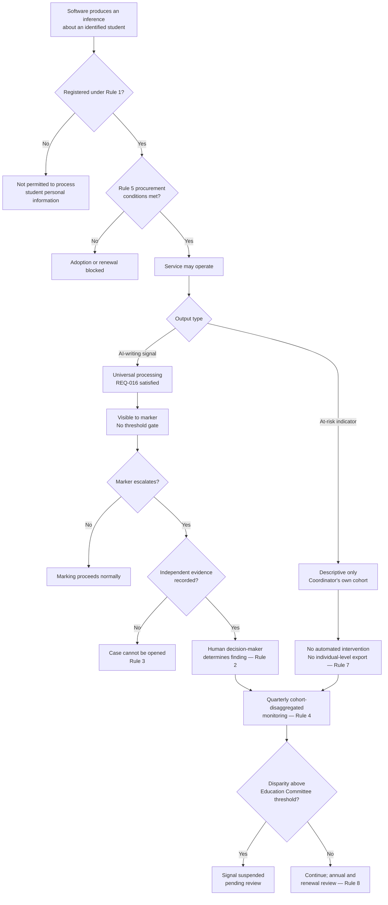

# ADR-009: Governed Use of AI and Machine-Learning Inference in the Learning Ecosystem

> **Template Origin**: Official | **ArcKit Version**: 6.7.5 | **Command**: `/arckit:adr`

## Document Control

| Field | Value |
|-------|-------|
| **Document ID** | ARC-001-ADR-009-v1.0 |
| **Document Type** | Architecture Decision Record |
| **ADR Number** | ADR-009 |
| **Project** | Learning & Teaching Baseline Strategy (Project 001) |
| **Classification** | OFFICIAL |
| **Status** | **Proposed** |
| **Version** | 1.0 |
| **Created Date** | 2026-07-29 |
| **Last Modified** | 2026-07-29 |
| **Review Cycle** | Initial review 3 months after the first cohort-disaggregated monitoring report; annually thereafter, and at every contract renewal of a registered AI/ML service |
| **Review Date** | 2026-08-28 |
| **Escalation Level** | Department |
| **Governance Forum** | RIFF Review → Education Committee (academic due-process rules) → University Executive (noting) |
| **Owner** | Dr. Benny Moog, Director Learning Technologies |
| **Reviewed By** | [PENDING] |
| **Approved By** | [PENDING] |
| **Distribution** | Project Team; Education Committee; Digital & IT; Learning Technologies; Privacy & Records; Cybersecurity; Procurement; Student Guild; Steering Committee |

## Revision History

| Version | Date | Author | Changes | Approved By | Approval Date |
|---------|------|--------|---------|-------------|---------------|
| 1.0 | 2026-07-29 | ArcKit AI | Initial creation from `/arckit:adr` command — governs the two AI/ML inference capabilities actually present in the requirement set (AI-writing detection under REQ-016; at-risk indicators under REQ-020) and sets the classification and due-process rules any future AI/ML service must satisfy. Sequence number 009 assigned after ADR-007 and ADR-008 were concurrently allocated to build-versus-buy and to identity/access enforcement respectively | [PENDING] | [PENDING] |

---

## 1. Decision Title

**Governed Use of AI and Machine-Learning Inference in the Learning Ecosystem**

How the University of Funk permits, bounds and governs software that produces an *inference about a student* — specifically AI-writing detection on text submissions and at-risk indicators derived from engagement data — given that both are mandated or requested by the requirement set, both act on personal information, and one of them has contested accuracy with unevenly distributed error.

### 1.1 Scope — deliberately narrow, because the requirement set is narrow

The requirement register contains exactly two AI/ML-dependent requirements [AI-C1] [AI-C2]:

| Requirement | Statement | Priority | Source | Requirement doc |
|-------------|-----------|----------|--------|-----------------|
| REQ-016 | All text-based submissions shall pass through similarity **and AI-writing detection** before marking | Must | **GOV** (governance/compliance — *not* academic demand) | FR-016 |
| REQ-020 | Unit coordinators shall view engagement, progress and **at-risk indicators** for their cohort in one dashboard | Should | SURVEY | FR-020 |

**In scope** — the two inference capabilities above, plus the classification and due-process rules that any *future* AI/ML service in the L&T estate must satisfy before RIFF Review can approve it.

**Explicitly out of scope**, and not to be read into this decision:

- **A generative-AI programme.** No requirement asks for generative authoring assistants, chatbots, tutoring agents, or automated content generation. None is authorised by this ADR.
- **Automated marking or grade determination.** No requirement asks for it; §6.4 Rule 2 prohibits it absent a superseding ADR.
- **Student *use* of generative AI in their own work.** That is academic policy, not architecture. This ADR governs the institution's tooling and the due process attached to it; it does not define what students may use.
- **The institutional data platform's own analytics models** (INT-009 counterparty, owned outside L&T) — except that §6.4 Rule 7 constrains what individual-level derived data may be exported to it.

**Adjacent and flagged, not decided here**: FR-016's sibling FR-017 (secure examination, remote proctoring). Remote proctoring artifacts are personal information class 6, hosted offshore [AI-C3]. *If* the proctoring platform applies machine-learning behavioural flagging to those artifacts — which the requirement set neither states nor excludes — that flagging is an inference about a student and falls under the register and Rule 2 of this decision. Confirming whether it does is Action A-3 (§10.1).

### 1.2 Why this is one decision rather than two

Detection and at-risk indicators look unrelated. They share the property that makes them hard: **a piece of software forms a view about a named student, and someone then acts on it.** The architectural question in both cases is not which product, but *what the output is permitted to mean*. Answering that once, for a defined class of service, is cheaper and more durable than answering it per product — and it is what stops the next AI service arriving with its own implicit answer.

---

## 2. Stakeholders

### 2.1 Deciders (RACI: Accountable)

- **A/Prof. Pearl Clavinet**, Dean of L&T and Chair, Education Committee — *primary decider*. The determinative core of this ADR (§6.4 Rule 2) is an academic due-process rule. It is not within Digital & IT's authority to set and not within an architect's authority to assume.
- **Cassandra Rhodes**, Chief Information Officer — accountable for the platform estate, the register (§6.4 Rule 1) and the procurement conditions (Rule 5).
- **Prof. Otis Hammond**, Deputy Vice-Chancellor (Education) — Executive Sponsor; noting authority where the decision constrains a Must-priority requirement's implementation.

### 2.2 Consulted (RACI: Consulted)

- **Eleanor Frame**, Privacy & Records Officer — APP 3, 5, 6, 8, 10, 11, 12 and 13 positions; the automated-decision transparency question in §4.3; sign-off on the equity-monitoring data set, which is itself a privacy tension (§7.2).
- **Dr. Felix Marimba**, Academic Lead (Digital Learning) — requirements custodian; confirms that REQ-016 is governance-sourced and that no survey respondent asked for AI-writing detection [AI-C1].
- **Jazmin Field**, President, Student Guild — students bear the entire downside of a false positive. Consultation is not optional here and its record is Appendix B.
- **Tobias Ohm**, Cybersecurity Lead — Essential Eight applicability, service-to-service authentication, admin privilege on registered services.
- **Dr. Wynton Castle**, Senior Lecturer — the marker who actually receives the signal; whether the corroboration workflow (Rule 3) is workable in a real marking session.
- **Grace Tanaka**, Procurement & Vendor Manager — Rule 5 contractual conditions, and whether incumbent contracts can carry them before renewal.
- **Prof. Priya Anand**, Dean, Health Sciences — placement and clinical cohorts, where an integrity finding carries professional-registration consequence beyond the academic one.

### 2.3 Informed (RACI: Informed)

- Academic Integrity Officers and faculty integrity delegates (the operational recipients of Rule 3 and Rule 4)
- Unit coordinators and sessional marking staff (Rule 3 changes what a detection score means to them)
- Dr. Benny Moog's Learning Technologies team (register maintenance, configuration)
- Sam Okafor, Integration Architect (Rule 7 constrains INT-009)
- Rhonda Bell, Project Manager; Steering Committee
- Vernon Ostinato, Chief Financial Officer (governance-effort cost lands in the September business case)

### 2.4 Escalation Context

**Decision Level**: **Department**

**Escalation Rationale**:

- [ ] **Team**: Local implementation choice — no. This sets an institution-wide due-process rule.
- [ ] **Cross-team**: Integration patterns — insufficient. Rule 2 binds academic decision-making, not just system behaviour.
- [x] **Department**: Institution-wide standard governing a class of technology, its privacy posture, and the process attached to its output. Requires both academic (Education Committee) and technical (Digital & IT) authority.
- [ ] **Cross-government**: Not applicable. The University of Funk is a private-sector Australian higher-education institution.

> **Framework note.** This ADR is assessed against the **Privacy Act 1988 (Australian Privacy Principles)** and the **ASD Essential Eight**, per REQ-030 and REQ-033 [AI-C4] [AI-C5]. The UK Government AI Playbook, the Algorithmic Transparency Recording Standard, MOD JSP 936, the GDS Service Standard and the Technology Code of Practice **do not apply** to this institution and are not used as assessment frameworks anywhere in this document. Sections 4.3 and 8.3 substitute the applicable Australian frameworks.

**Governance Forum**: RIFF Review → Education Committee → University Executive (noting)

**Approval Date**: [PENDING]

---

## 3. Context and Problem Statement

### 3.1 Problem Description

A student submits an essay. Software scores it as likely machine-generated. Nothing about that score establishes that the student did anything wrong — AI-writing detection has contested accuracy, and its errors are not distributed evenly: text written by a student composing in an additional language, or writing in a plain and formulaic register, is more likely to be flagged than text from a confident first-language stylist. REQ-016 nonetheless mandates that **all** text-based submissions pass through this detection before marking [AI-C1]. Applying a tool with unevenly distributed error to every submission, in a process that ends in an academic penalty, is not a tool-selection question. It is a due-process question.

Separately, REQ-020 asks for at-risk indicators in a coordinator dashboard [AI-C2]. Those indicators are derived personal information (class 8) [AI-C6], and REQ-022 asks for analytics to be exported to the institutional data platform [AI-C7] — so a derived judgement about a named student becomes a data asset that travels.

**Problem statement as a question**: On what terms may the University of Funk operate software that forms an inference about a named student — what the inference is permitted to *mean*, who may see it, what may be done on the strength of it alone, and what the vendor may do with the student's work in the process?

### 3.2 Why This Decision Is Needed

**Business context**:

- **BR-005** (demonstrable privacy and security posture) — detection processes student written and creative work, which is student intellectual property held offshore in the US/EU under the assessed hosting [AI-C3]. That is an APP 8 disclosure on the estate's most personally expressive data class.
- **BR-006** (consistent and accessible student experience) — a control whose error rate varies by cohort produces an *inconsistent* experience in the way that matters most: differential exposure to accusation.
- **BR-007** (governance operating on architectural evidence) — RIFF Review currently has no AI-specific assessment step. Without one, the next AI service is assessed on functional fit alone, which is precisely the failure mode BR-007 exists to prevent.
- **BR-008** (survey requirements traceable to outcomes) — REQ-016 is one of only three GOV-sourced functional requirements. Its provenance should be visible in how it is implemented, not obscured.

**Technical context**:

- **FR-016** requires detection results to be visible to the marker alongside the submission, and requires student IP and hosting-region requirements to be met [AI-C8].
- **FR-020** requires reconciliation of multi-platform data into a single cohort view under least-privilege access [AI-C9].
- **FR-022 / INT-009 / DR-006** govern analytics export, minimisation, de-identification and automatic retention expiry [AI-C7] [AI-C10].
- **NFR-C-001 / NFR-C-002** require APP compliance with residency preference, and cross-border assessment before adoption or renewal.
- **DR-003 / DR-005** require classification of personal information and a residency register.

**Regulatory context**: Privacy Act 1988 and the 13 Australian Privacy Principles — with APP 10 (quality of personal information) unusually load-bearing here, because a detection score is *itself* personal information of contested accuracy; APP 8 for the offshore disclosure of student work; APP 12 and 13 for a student's ability to access and correct a derived indicator. The automated-decision transparency amendment commencing December 2026 is addressed in §4.3. The ASD Essential Eight applies to the estate but is silent on inference risk (§8.3).

### 3.3 Supporting Links

- **Requirements**: BR-005, BR-006, BR-007, BR-008; FR-016, FR-017, FR-020, FR-022; NFR-C-001, NFR-C-002, NFR-SEC-001, NFR-SEC-002, NFR-U-002; INT-009; DR-003, DR-005, DR-006 — in `projects/001-lt-ecosystem/ARC-001-REQ-v1.0.md`
- **Source register**: REQ-016, REQ-020, REQ-022, REQ-030, REQ-031, REQ-033 — in `projects/001-lt-ecosystem/external/requirements-register.md`
- **Privacy context**: personal information classes 3, 6 and 8; APP 8 triggers; analytics-export flow — in `projects/001-lt-ecosystem/external/privacy-context.md`
- **Principles**: 2, 5, 7, 8, 9, 14, 16, 17, 18, 19 — in `projects/000-global/ARC-000-PRIN-v1.1.md`
- **Related ADRs**: ADR-002 (authoritative source for institutional role assignment — determines who may see a cohort's indicators); ADR-003 (logging and observability — carries the processing telemetry required by Rule 6); ADR-004 (open-source licence and third-party component policy — the register in Rule 1 extends its component-assessment discipline to inference services); ADR-005 and ADR-006 (deployment topology and cloud platform — host the reconciliation and dashboard workloads, not the detection service itself); ADR-007 (build versus buy and procurement approach — Rule 5 adds AI-specific conditions to its procurement path); ADR-008 (identity and access enforcement — supplies the SSO/MFA and least-privilege enforcement that Rules 5 and 7 rely on)

---

## 4. Decision Drivers (Forces)

### 4.1 Technical Drivers

- **A detection score is personal information of contested accuracy.** APP 10 obliges the university to take reasonable steps to ensure personal information it uses is accurate and not misleading, *having regard to the purpose of use*. The higher the consequence of the purpose, the higher the standard. An academic misconduct process is a high-consequence purpose.
  - Requirements: NFR-C-001, DR-003
  - Principle 7 (Privacy by Design and Data Minimisation)
  - Quality attributes: correctness, fairness, contestability

- **Universal processing is a data-flow decision, not just a policy one.** "All text-based submissions" means every text submission in the institution crosses a boundary into an offshore service. Volume and universality are what make the APP 8 position material rather than incidental.
  - Requirements: NFR-C-002, DR-005, FR-016
  - Principle 8 (Data Residency and Cross-Border Accountability)

- **Derived at-risk indicators are personal information and they aggregate.** Class 8 engagement and learning analytics is already recorded as derived PI [AI-C6], and the current mechanism is ad-hoc extracts with no retention or minimisation rules [AI-C11]. Adding an at-risk *judgement* raises the consequence of that gap without changing its shape.
  - Requirements: DR-006, FR-020, FR-022, INT-009
  - Principle 7

- **The signal has to reach the marker without becoming the marker's decision.** FR-016 requires the result visible alongside the submission [AI-C8]. Visibility is the requirement; deference is the risk. The workflow, not the policy document, decides which one happens.
  - Requirements: FR-016, NFR-C-003 (audit logging)
  - Principle 17 (Observable Integrations and Services)

- **The capability is already licensed.** Detection sits in platforms the estate already holds [AI-C3]. This is a configuration and governance decision, not an acquisition — which is why the cost profile in §5 is dominated by governance effort rather than licence spend.
  - Principle 19 (Realise Licensed Capability Before New Spend); Principle 2 (Deliberate Capability Boundaries)

### 4.2 Business Drivers

- **A wrongful integrity finding is the highest-severity single-student harm the estate can produce.** Its cost is borne by the student, and its institutional cost — appeal, remediation, reputational, and in clinical programs professional-registration consequence — is asymmetric to any efficiency the tool delivers.
  - Requirements: BR-006; stakeholder goals for A/Prof. Clavinet, Prof. Anand, Jazmin Field

- **REQ-016 is a Must, and it came from governance rather than from academics** [AI-C1]. The architecture cannot unilaterally overturn a Must-priority governance requirement. It can, and should, define the conditions under which it is safe to comply. This ADR does the second thing, and says so plainly rather than pretending to do the first.
  - Requirements: BR-008 (provenance visible in outcomes)

- **Student IP and trust.** Submitted written and creative work is the student's own intellectual property [AI-C3]. A vendor training a commercial model on it is a distinct harm from hosting it, and needs a distinct contractual answer.
  - Requirements: BR-005, DR-007; Principle 9 (Data Portability and Exit)

- **Governance credibility.** RIFF Review's authority depends on assessing the things that actually matter about a technology [AI-C12]. An AI service assessed only on functional fit would demonstrate the opposite.
  - Requirements: BR-007; Principle 18 (Evidence-Based Capability Investment)

### 4.3 Regulatory and Compliance Drivers (Australian Frameworks)

**Privacy Act 1988 — Australian Privacy Principles**:

| APP | Relevance to this decision |
|-----|----------------------------|
| **APP 1** — Open and transparent management | Privacy policy must describe how detection and at-risk indicators operate. Directly engages the December 2026 automated-decision amendment (below). |
| **APP 3** — Collection of solicited PI | Detection collects nothing new, but generates a new attribute about the student. Necessity test applies to the *generated* attribute too. |
| **APP 5** — Notification of collection | Students must be told, **before submitting**, that submissions are processed by detection, what the signal is used for, and what it cannot do (Rule 6). |
| **APP 6** — Use and disclosure | A detection score collected for integrity purposes may not be repurposed (e.g. into a student-quality metric, or into the at-risk model). Rule 7 enforces separation. |
| **APP 8** — Cross-border disclosure | **Central.** Class 3 (submitted written/creative work) is US/EU-hosted [AI-C3]; the offshore disclosure is universal under REQ-016. Assessment required before adoption or renewal (NFR-C-002). |
| **APP 10** — Quality of PI | **Central.** Reasonable steps proportionate to purpose. A contested-accuracy inference used in a penalty process demands corroboration — this is the regulatory backing for Rule 2. |
| **APP 11** — Security of PI | Registered services under SSO+MFA (REQ-031, ADR-008) with no local accounts; least-privilege access to indicators. |
| **APP 12 / 13** — Access and correction | A student must be able to see and challenge a derived indicator held about them. Rule 4 provides the route; Rule 2 makes the challenge meaningful. |

**Automated-decision transparency (Privacy Act amendment commencing December 2026)**: privacy policies must disclose the kinds of personal information used by computer programs that make, or **substantially and directly help make**, decisions affecting an individual's rights or interests. Rule 2 ensures no program *makes* an integrity decision at the University of Funk — but a detection score placed in front of a decision-maker plausibly *substantially helps make* one. The prudent architectural reading is that the disclosure obligation applies, and Rule 6 assumes it does. **Eleanor Frame to confirm the legal position before the amendment commences** (Action A-1, §10.1). This ADR does not rely on the narrower reading.

**ASD Essential Eight (REQ-033, ML2 target by end 2027)** [AI-C5]: applies to registered AI/ML services as SaaS platforms — MFA (currently ML2, with two tools still permitting local accounts [AI-C13]), restrict administrative privileges (ML1 → ML2), regular backups and verified export (ML1 → ML2, unverified for four tools). **The Essential Eight does not address inference quality, model provenance, or training-data use.** Treating E8 conformance as sufficient assurance for an AI service would be a category error; §8.3 states this explicitly so no future assessor infers otherwise.

**Accessibility (REQ-029 / NFR-U-002)**: the marker-facing signal display and the coordinator dashboard are student- and staff-facing surfaces subject to WCAG 2.2 AA. A risk indicator conveyed by colour alone fails 1.4.1.

### 4.4 Alignment to Architecture Principles

| Principle | Alignment | Impact |
|-----------|-----------|--------|
| 2. Deliberate Capability Boundaries | ✅ Supports | Detection and at-risk analytics are each assigned a primary platform and registered; overlap (detection features in more than one licensed platform) is declared, not left implicit |
| 5. Single Source of Truth for Core Entities | ✅ Supports | Cohort and role scoping for dashboard access derives from the authoritative role source (ADR-002), not from per-platform assignment |
| 7. Privacy by Design and Data Minimisation | ✅ Supports | Register captures purpose, PI classes, retention and error profile *before* adoption; Rule 7 caps what leaves for analytics; Rule 4's equity monitoring is itself minimised and access-controlled |
| 8. Data Residency and Cross-Border Accountability | ⚠️ **Partial** | Offshore disclosure of class 3 student work is **retained**, because no assessed Australian-region detection alternative is established. Rule 5 governs it contractually and DR-005/NFR-C-002 record it. This is an accepted, documented departure from the "SHOULD be held in Australian jurisdiction" preference — not a satisfied gate |
| 9. Data Portability and Exit | ✅ Supports | Rule 5 requires verifiable deletion and export on termination; detection scores are university data subject to DR-007 |
| 14. Accessibility by Default | ✅ Supports | Signal and dashboard surfaces held to WCAG 2.2 AA; no colour-only risk encoding |
| 16. Layered Security Posture | ✅ Supports | Registered services require institutional SSO+MFA (ADR-008); no local accounts; least-privilege indicator access |
| 17. Observable Integrations and Services | ✅ Supports | Rule 6 requires processing telemetry and Rule 4 requires outcome monitoring — failure and disparity are both detected rather than reported |
| 18. Evidence-Based Capability Investment | ✅ Supports | Adds an explicit AI classification step to RIFF Review, closing the gap BR-007 identifies |
| 19. Realise Licensed Capability Before New Spend | ✅ Supports | Detection is already licensed; this decision configures and bounds it rather than acquiring |
| 1. Single Learning Entry Point | ⚪ Neutral | Signal appears at the marking surface; no new student-facing entry point |

**Honest note on Principle 8.** One principle is only partially satisfied, and it is a CRITICAL one. That is recorded here rather than in a footnote because Option 2 does not solve the residency problem — it governs it. If an Australian-region detection capability of comparable quality is established at any point, this ADR's review triggers (§11.2) require reassessment.

---

## 5. Considered Options

Three options are analysed, including "Do Nothing" as baseline. A fourth position — refuse detection and redesign assessment for integrity instead — was considered, is *partially adopted* as a consequence rather than an alternative, and is analysed in Appendix A.

### Option 1: Mandatory Automated Detection as the Compliance Gate

**Description**: Implement REQ-016 literally and minimally. Every text submission is routed through similarity and AI-writing detection. The vendor's AI-writing score is displayed prominently to the marker; submissions above a configured threshold are automatically routed to the academic integrity process as suspected misconduct. The detection score is treated as evidence of misconduct.

**Implementation approach**: Enable the existing licensed detection capability in the assessment platform; configure a threshold; wire threshold breaches into the integrity case workflow; leave vendor defaults for retention and training-data use.

**Wardley Evolution Stage**: Product (off-the-shelf), with the *inference* itself closer to Genesis — the underlying detection technique is neither stable nor consensually validated.

#### Good (Pros)

- ✅ **Fastest and cheapest path to REQ-016 compliance**: the capability is already licensed [AI-C3]; configuration is measured in days, not months.
- ✅ **Unambiguous for staff**: a threshold produces a clear instruction and requires no academic judgement, which is precisely why it appeals under marking-period time pressure.
- ✅ **Consistent by construction**: every submission is treated identically by the tool, satisfying a superficial reading of consistency (BR-006).
- ✅ **Auditable trail of processing**: every submission provably passed through detection.

#### Bad (Cons)

- ❌ **Fails APP 10 on the facts.** Using a contested-accuracy inference as evidence in a penalty process is not "reasonable steps having regard to the purpose". This is the decisive objection and it is legal, not merely ethical.
- ❌ **Distributes harm unevenly across cohorts.** Threshold-triggered referral converts a differential false-positive rate directly into a differential accusation rate. Students writing in an additional language — a large share of the university's cohort — carry the cost. Fails BR-006 in substance while satisfying it in form.
- ❌ **No contestability.** A student cannot meaningfully rebut an opaque score. Fails APP 12/13 in practice.
- ❌ **Almost certainly engages the December 2026 automated-decision provisions at their strongest reading** — a program substantially and directly helping make a decision about rights and interests, with no human deliberation between score and referral.
- ❌ **Vendor defaults on training-data use and retention left unexamined**, so student IP exposure is inherited rather than decided. Fails BR-005 and Principle 8's assessment requirement.
- ❌ **Real cost lands downstream**: appeals, ombudsman-equivalent complaints, remediation, and the staff time to unwind wrongful findings — none of it visible in the implementation estimate.
- ❌ **Corrosive to the integrity process itself.** Once markers observe that referrals are frequently overturned, the process loses standing for the genuine cases it exists to handle.

#### Cost Analysis

*Indicative planning figures (AUD), to be validated against actual licence and contract data at WP3. Not quotes.*

- **CAPEX**: ~$15k — configuration, threshold tuning, workflow wiring
- **OPEX**: ~$40k/yr staff effort in integrity-case handling attributable to false-positive referrals, growing with cohort size; licence cost already sunk
- **TCO (3-year)**: ~$135k **plus unquantified appeal, remediation and reputational exposure** — the dominant term is the one that cannot be estimated with confidence, which is itself a reason to reject the option

---

### Option 2: Advisory-Only Inference Under a Human-Determinative Process, With a Governed AI/ML Service Register **(CHOSEN)**

**Description**: Detection runs on all text submissions, satisfying REQ-016's "shall pass through" literally. Its output is a **non-determinative indicator**, not evidence. No AI/ML output may by itself constitute a finding of misconduct, an academic penalty, or an automated intervention on a student. Every service producing an inference about a student is entered in an AI/ML service register with its purpose, inputs, hosting, training-data position, retention, error profile, human decision point and contestability route. Outcomes are monitored cohort-disaggregated, and the tool is suspendable on evidence of disparity. At-risk indicators are constrained to descriptive, least-privilege, non-exported use.

**Implementation approach**: eight rules, specified in §6.4 — register; determinative-decision prohibition; corroboration-required marking workflow with no threshold gate on marking; cohort-disaggregated equity monitoring with a suspension trigger; procurement conditions on training-data use, retention and residency; student-facing notification and processing telemetry; use-separation and export limits; RIFF Review AI classification step.

**Wardley Evolution Stage**: the *services* are Product; the *governance wrapper* is Custom-Built and deliberately so — no off-the-shelf control satisfies a due-process requirement.

#### Good (Pros)

- ✅ **Satisfies REQ-016 as written** — all text submissions pass through similarity and AI-writing detection before marking [AI-C1] — while refusing the unstated inference that a detection signal is a finding. The requirement says "pass through"; it does not say "be judged by".
- ✅ **Defensible under APP 10.** Corroboration by a human academic decision-maker is the "reasonable step" proportionate to a high-consequence purpose. This is the option's central legal argument.
- ✅ **Directly addresses uneven error distribution.** Rule 4's cohort-disaggregated monitoring makes disparity *measurable*, and the suspension trigger makes measurement consequential. Nothing else in the option set does this.
- ✅ **Turns student IP exposure into a decided contractual position** (Rule 5): no training on student work, bounded retention with verifiable deletion, recorded hosting region, cross-border assessment before renewal. Satisfies NFR-C-002, DR-005, DR-007 and Principle 8's *assessment* obligation even where the residency preference itself is departed from.
- ✅ **Contestability is real**, not formal: a student can see the indicator (APP 12), challenge it (APP 13), and the challenge bites because the indicator was never determinative.
- ✅ **Extends to the next AI service at no marginal governance cost.** The register and the RIFF classification step mean service number three is assessed by an existing rule, not by a new argument. Closes the BR-007 gap.
- ✅ **Constrains at-risk indicators before they harden.** Descriptive-not-predictive framing, least-privilege scoping to a coordinator's own cohort, and Rule 7's export limit apply DR-006 minimisation *at design time* rather than retrofitting it (Principle 7).
- ✅ **Costs little in licence terms** — the capability is already owned (Principle 19). The spend is governance effort, which is the appropriate place for it.

#### Bad (Cons)

- ❌ **It does not make the tool accurate.** A contested-accuracy service is retained, bounded. Students are still processed by it. This option manages a problem it cannot eliminate, and claiming otherwise would be dishonest.
- ❌ **Offshore disclosure of student work persists** (Principle 8 partial). Contractual governance is not residency.
- ❌ **Depends on staff behaviour, which rules cannot fully determine.** A marker under deadline pressure may treat an advisory score as determinative regardless of policy. Mitigation is structural (no threshold display, corroboration required as a workflow field, not a reminder) but the residual risk is real — see RISK-A2.
- ❌ **Equity monitoring requires cohort attributes**, including language background. Monitoring for discriminatory impact means processing the very attribute along which discrimination would run. This is a genuine privacy tension, not a solved problem (§7.2).
- ❌ **Ongoing governance burden**: register maintenance, monitoring reporting, renewal-time reassessment. Real recurring effort on a team that has other commitments.
- ❌ **Slower than Option 1** — Education Committee approval of the due-process rules is on the critical path, and cannot be compressed without hollowing out the decision.
- ❌ **Suspension trigger is a commitment with teeth.** If disparity is found, the university has bound itself to suspend a Must-priority control. That is the correct commitment and it will be uncomfortable to honour.

#### Cost Analysis

*Indicative planning figures (AUD), to be validated at WP3. Not quotes.*

- **CAPEX**: ~$85k — register build (lightweight; a governed record, not a platform), marking-workflow change, monitoring instrumentation and reporting, student notification content, staff and integrity-officer briefing, contract variation effort
- **OPEX**: ~$55k/yr — register maintenance and annual review, quarterly monitoring report, renewal-time cross-border reassessment, residual integrity-case handling on corroborated cases
- **TCO (3-year)**: ~$250k, with the appeal-and-remediation tail materially smaller than Option 1's because wrongful findings are structurally harder to produce
- **Licence delta**: $0 — capability already held [AI-C3] (Principle 19)

---

### Option 3: Do Nothing (Baseline)

**Description**: Leave AI/ML use ungoverned. Detection remains available in licensed platforms and is used at unit or faculty discretion, with no institutional rule about what its output means. At-risk indicators remain spread across four platforms with no consolidated view. Analytics export continues on ad-hoc extracts.

#### Good

- ✅ **No implementation cost and no delay** to other WP8 workstreams.
- ✅ **No new institutional commitment** to honour, including no suspension trigger.
- ✅ **Local academic autonomy preserved** in how detection signals are interpreted.

#### Bad

- ❌ **REQ-016 (Must) unmet** — no assurance that all text submissions pass through detection.
- ❌ **The worst outcome for students is fully available.** Ungoverned discretion means some units already treat a score as a finding, with no monitoring to detect it and no route to contest it. Doing nothing is not neutral; it is Option 1 applied unevenly and invisibly.
- ❌ **APP 8 position on class 3 student work remains inherited rather than assessed** — a live NFR-C-002 breach.
- ❌ **Analytics export continues with no retention or minimisation rules** [AI-C11], in breach of DR-006 and Principle 7.
- ❌ **RIFF Review keeps assessing AI services on functional fit alone**, so the next arrival repeats the pattern (BR-007).
- ❌ **No cohort-disaggregated visibility**, so differential harm accrues undetected — the specific failure this ADR exists to prevent.

---

## 6. Decision Outcome

### 6.1 Chosen Option

**"Option 2: Advisory-Only Inference Under a Human-Determinative Process, With a Governed AI/ML Service Register"**

### 6.2 Y-Statement

> **In the context of** a governance-mandated requirement that every text-based submission pass through AI-writing detection before marking, and a requested dashboard of at-risk indicators derived from student engagement data,
> **facing** detection technology of contested accuracy whose false positives fall unevenly on students writing in an additional language, offshore vendor processing of student intellectual property, and derived personal information that travels once created,
> **we decided for** running detection universally but treating every AI/ML inference as advisory-only, never determinative, under a registered-service regime with contractual limits on training-data use and retention, and cohort-disaggregated outcome monitoring with a suspension trigger,
> **to achieve** compliance with REQ-016 without converting a statistical signal into an accusation, a defensible APP 10 position on inference quality, and a governance rule that extends to the next AI service without renegotiation,
> **accepting** that a contested-accuracy tool remains in the assessment path, that offshore disclosure of student work persists under contractual rather than residency control, that equity monitoring itself requires processing cohort attributes, and that the university has bound itself to suspend a Must-priority control if disparity is demonstrated.

### 6.3 Justification

**Key reasons**:

1. **REQ-016 says "pass through", not "be judged by".** The requirement's own wording permits universal processing with non-determinative output [AI-C1]. Option 2 is therefore full compliance with the requirement as drafted, not a partial implementation of it. Option 1 adds a determinative step the requirement never asked for — and it is that added step, not the requirement, that creates the due-process problem.

2. **The requirement's provenance changes what good implementation looks like.** REQ-016 is sourced from GOV, not from the 412-respondent survey [AI-C1]. No academic asked for AI-writing detection. A governance-driven control imposed on an academic process, with contested accuracy and uneven error, warrants tighter constraints than a capability the users requested — because there is no user constituency to notice when it misfires. BR-008 requires provenance to remain visible in outcomes; this is what that looks like in practice.

3. **APP 10 is the decisive legal test and only Option 2 passes it.** Reasonable steps to ensure accuracy are assessed *having regard to the purpose of use*. Where the purpose is an academic penalty, corroboration by a human decision-maker on independent evidence is the minimum reasonable step. Option 1 substitutes a score for that step; Option 3 leaves it to chance.

4. **Uneven harm has to be measured to be managed.** The false-positive concern is not hypothetical and not resolvable by policy assertion. Rule 4's cohort-disaggregated monitoring with a suspension trigger is the only mechanism in the option set that would surface differential impact and act on it. Without it, every other control is unfalsifiable.

5. **Student work is student IP and offshore.** Class 3 is US/EU-hosted [AI-C3] and universal processing makes the exposure total. Rule 5 converts an inherited vendor default into a decided contractual position — the only available answer given that no assessed Australian-region alternative is established, and honest about being governance rather than residency.

6. **One rule now is cheaper than a rule per product later.** Registering the class of service and adding an AI classification step to RIFF closes the BR-007 gap at the point where the estate contains only two such services. The same decision taken after five arrivals would be a remediation programme.

7. **The capability is already licensed** [AI-C3], so Principle 19 is satisfied and the cost is governance effort rather than acquisition — which keeps this decision proportionate to a two-requirement scope.

**Stakeholder consensus**: Not yet established — this ADR is Proposed and Education Committee approval of Rule 2 is the gating step. Anticipated positions, to be confirmed and recorded in Appendix B: Student Guild supportive of Rules 2, 4 and 6 and likely to press for a lower suspension threshold; academic integrity delegates likely to raise workability of Rule 3 under marking-period load; Procurement to flag that Rule 5 conditions may not be securable on incumbent contracts before their renewal dates, which Action A-4 addresses.

**Risk appetite**: **Medium**, consistent with the project baseline. Applied asymmetrically and deliberately: near-zero appetite for wrongful academic findings and for uninstructed vendor use of student IP; moderate appetite for governance overhead, delay to REQ-016 realisation, and retention of an imperfect tool under constraint.

### 6.4 The Decision, Stated as Rules

These eight rules **are** the decision. Everything above is why; everything below is what.

**Rule 1 — Register.** Every software service that produces an inference, score, classification or prediction about an identified or identifiable student is entered in the **AI/ML Service Register** before use. Each entry records: purpose; personal information classes consumed (per DR-003); output type; hosting region (per DR-005); vendor training-data position; retention period and deletion mechanism; known error characteristics and their distribution; the named human decision point; the student contestability route; owner; and review date. An unregistered service may not process student personal information.

**Rule 2 — No AI/ML output is determinative.** No output of a registered service may, by itself, constitute a finding of academic misconduct, an academic penalty, a change to a student's academic standing, or an automated intervention directed at a student. A finding of misconduct requires a human academic decision-maker acting on corroborated evidence independent of the AI signal. Automated marking and automated grade determination are prohibited absent a superseding ADR.

**Rule 3 — Universal processing, bounded output.** All text-based submissions pass through similarity and AI-writing detection before marking (REQ-016). The result is visible to the marker alongside the submission (FR-016). **No score threshold gates marking, and no threshold automatically opens an integrity case.** Where a marker escalates, the integrity workflow requires a recorded statement of the independent evidence relied on; a detection score alone is an insufficient basis to open a case.

**Rule 4 — Monitor outcomes by cohort, and be prepared to stop.** Detection-originated integrity referrals and their outcomes are monitored quarterly, disaggregated by cohort — including students studying in an additional language — and reported to Education Committee. The monitoring data set is minimised, access-controlled, and reported in aggregate only; it may not be used for any purpose other than disparity detection (APP 6). Where disparity in referral or upheld-finding rates exceeds the threshold set by Education Committee, **use of the detection signal is suspended pending review**, and the suspension is not overridable by operational convenience.

**Rule 5 — Procurement conditions.** No registered service is adopted or renewed unless, in contract: student submissions and creative work are **not** used to train, fine-tune or evaluate vendor or third-party models; retention is bounded and deletion is verifiable; student intellectual property ownership is unaffected; hosting region is stated and recorded (DR-005); institutional SSO with MFA is supported and local accounts are not required (NFR-SEC-001, ADR-008); breach notification and accountability obligations are present; and export/retrieval of university data on termination is provided in open formats (DR-007). Offshore disclosure triggers cross-border assessment before adoption or renewal (NFR-C-002, Principle 8). These conditions are additional to, not a substitute for, the procurement path set by ADR-007.

**Rule 6 — Tell students, and instrument the flow.** Before submitting, students are told that submissions are processed by similarity and AI-writing detection, what the signal is used for, that it cannot by itself produce a finding, where the processing occurs, and how to access and contest an indicator held about them (APP 1, 5, 12, 13). The privacy policy discloses the kinds of personal information used by these programs, on the assumption that the December 2026 automated-decision provisions apply. Processing success, failure and volume are emitted as telemetry to the observability plane (ADR-003, Principle 17); a submission that fails to process is visible and recoverable, never silently unprocessed.

**Rule 7 — Separate uses; cap what leaves.** A detection score is used for academic integrity only. It may not feed the at-risk model, staff performance measures, or any student-quality metric (APP 6). At-risk indicators are **descriptive of engagement, not predictive of outcome**; they are visible to a coordinator for their own cohort only, scoped from the authoritative role source (ADR-002) and enforced through the access model in ADR-008; they trigger no automated intervention; and **individual-level at-risk scores are not exported to the institutional data platform** — INT-009 carries minimised, de-identified analytics under DR-006 retention rules, or an individual-level export with a stated purpose approved by Privacy & Records, and nothing else.

**Rule 8 — Route through governance.** RIFF Review gains an AI/ML classification step: any solution request is assessed for whether it produces an inference about a student, and if so, Rules 1–7 apply before approval (BR-007, Principle 18). The register is reviewed annually and at every contract renewal. Education Committee owns Rules 2, 3 and 4; Privacy & Records owns the privacy position on Rules 1, 5, 6 and 7.

---

## 7. Consequences

### 7.1 Positive Consequences

- ✅ **REQ-016 becomes implementable without a due-process defect.** Universal processing satisfied; the accusation risk is structurally separated from the signal.
- ✅ **A defensible APP 10 position** on the use of a contested-accuracy inference in a high-consequence process.
- ✅ **Differential harm becomes visible.** For the first time the university can answer "are we flagging some cohorts more than others" with data rather than assurance.
- ✅ **Student IP exposure is a decided position**, with training-data use contractually excluded and retention bounded (BR-005, DR-007).
- ✅ **Contestability exists and functions** (APP 12/13), because the indicator was never the decision.
- ✅ **At-risk analytics inherit minimisation and retention rules at design time** rather than by retrofit (DR-006, Principle 7) — and the ad-hoc extract practice ends.
- ✅ **RIFF Review can assess the next AI service** on an existing rule (BR-007, Principle 18).
- ✅ **No new licence spend** (Principle 19, BR-002).

**Measurable outcomes**:

| Metric | Baseline | Target |
|--------|----------|--------|
| Text submissions passing through detection | Not assured (unit discretion) | 100% (REQ-016) |
| Integrity cases opened on a detection score alone | Unmeasured, non-zero | 0 |
| Registered AI/ML services with complete register entry | 0 | 100% before use |
| Cohort-disaggregated referral disparity | Unmeasured | Measured quarterly; within Education Committee threshold |
| Registered services with contractual no-training-on-student-work clause | 0 | 100% at adoption or first renewal |
| Ad-hoc individual-level analytics extracts to the data platform | Current practice [AI-C11] | 0 |
| Students receiving pre-submission detection notification | 0% | 100% |

### 7.2 Negative Consequences (Accepted Trade-offs)

- ❌ **A contested-accuracy tool stays in the assessment path.** Bounded, monitored, non-determinative — but present, and processing every text submission.
- ❌ **Offshore disclosure of class 3 student work persists.** Principle 8 is partially satisfied only. *Mitigation*: Rule 5 contractual controls; DR-005 register; NFR-C-002 reassessment at renewal; §11.2 review trigger if an Australian-region alternative emerges.
- ❌ **Equity monitoring requires processing cohort attributes**, including language background — a privacy cost incurred to detect a fairness harm. *Mitigation*: Rule 4 minimisation, aggregate-only reporting, purpose limitation under APP 6, and Privacy & Records sign-off on the data set before monitoring begins (Action A-2). This tension is not resolved, only managed, and Education Committee should decide it with that stated.
- ❌ **Rule 2 depends on human behaviour under time pressure.** *Mitigation*: no threshold displayed; corroboration recorded as a required workflow field rather than a reminder; integrity-officer briefing; Rule 4 monitoring as the detection mechanism if deference happens anyway.
- ❌ **Recurring governance burden** — register, quarterly reporting, renewal reassessment. *Mitigation*: register kept deliberately lightweight (a governed record, not a platform); reporting folded into the existing Education Committee cycle.
- ❌ **REQ-016 realisation is slower than Option 1** because Education Committee approval is on the critical path. *Mitigation*: similarity matching, which raises none of these concerns, proceeds in Phase 1 ahead of the AI-writing signal.
- ❌ **The suspension trigger is a real commitment** to withdraw a Must-priority control on evidence. Deliberately accepted; it is what makes Rule 4 more than reporting.
- ❌ **Rule 7's export limit constrains REQ-022/FR-022 ambitions.** Some cross-system analyses the data platform might want are not available at individual level without an approved purpose. Accepted as the correct default (DR-006).

### 7.3 Neutral Consequences (Changes Needed)

- 🔄 **Academic policy update**: the academic integrity procedure must state Rule 2 explicitly and describe the corroboration standard. Education Committee owns this.
- 🔄 **Marking workflow change**: signal display without threshold; corroboration field on escalation.
- 🔄 **Staff briefing**: markers, sessional staff and integrity delegates — what an advisory signal is and is not. Sessional staff are the highest-turnover and highest-risk audience.
- 🔄 **Student communication**: pre-submission notification content; privacy policy update.
- 🔄 **Contract variation effort**: Rule 5 conditions against incumbent agreements, ahead of or at renewal.
- 🔄 **New artefact to maintain**: the AI/ML Service Register, with a named owner.
- 🔄 **RIFF Review process change**: AI classification step added to the assessment template.
- 🔄 **Monitoring build**: instrumentation and quarterly reporting into the Education Committee cycle.

### 7.4 Risks and Mitigations

| Risk | Likelihood | Impact | Mitigation | Owner |
|------|------------|--------|------------|-------|
| **RISK-A1** — A student receives an adverse finding materially driven by a detection score | M | **H** | Rule 2 determinative prohibition; Rule 3 corroboration field; integrity-officer briefing; Rule 4 monitoring detects recurrence | A/Prof. Pearl Clavinet |
| **RISK-A2** — Markers treat the advisory signal as determinative in practice despite the rule | **H** | H | Structural: no threshold displayed, corroboration required to escalate; Rule 4 disparity monitoring as the detector; annual refresher for sessional staff | Dr. Wynton Castle / Dr. Benny Moog |
| **RISK-A3** — Vendor uses student submissions to train models under existing contract terms | M | H | Rule 5 contractual exclusion; Action A-4 audits incumbent terms ahead of renewal; adoption/renewal blocked without the clause | Grace Tanaka |
| **RISK-A4** — Cohort disparity is real but the monitoring is too coarse to detect it | M | H | Threshold and disaggregation set by Education Committee with Student Guild input; monitoring design reviewed at first report; sample-size floors stated | Dr. Felix Marimba |
| **RISK-A5** — Equity-monitoring data set itself becomes a privacy or discrimination exposure | M | M | Rule 4 minimisation and aggregate-only reporting; APP 6 purpose limitation; Privacy & Records sign-off before first collection (Action A-2) | Eleanor Frame |
| **RISK-A6** — APP 8 position on class 3 unresolved at renewal, or no AU alternative assessed | M | M | NFR-C-002 assessment scheduled ahead of renewal; DR-005 register; Australian-region alternative practicability documented including where none exists | Eleanor Frame / Grace Tanaka |
| **RISK-A7** — At-risk indicators drift from descriptive to predictive, or acquire an automated intervention | M | M | Rule 7 stated in the register entry and re-tested at annual review; dashboard change requests routed through Rule 8 | Dr. Benny Moog |
| **RISK-A8** — Individual-level at-risk scores leak to the data platform via INT-009 | M | M | Rule 7 export cap enforced in the extract schema, not by convention; DR-006 retention automation; schema reviewed by Privacy & Records | Sam Okafor |
| **RISK-A9** — December 2026 automated-decision obligation applies more broadly than assumed | M | M | Rule 6 assumes it applies; Action A-1 confirms the legal reading before commencement | Eleanor Frame |
| **RISK-A10** — Governance burden lapses; register goes stale | **H** | M | Named owner; annual and renewal-triggered review as a Rule 8 gate; staleness surfaced in project health checks | Dr. Benny Moog |
| **RISK-A11** — Proctoring platform applies undisclosed ML behavioural flagging (§1.1) | M | H | Action A-3 confirms with vendor; if present, service is registered and Rules 2–7 apply retrospectively | Tobias Ohm / Eleanor Frame |
| **RISK-A12** — Rule 2 is read as prohibiting all AI use, chilling legitimate low-stakes tooling | L | M | Rule 2 scoped to determinative outputs only; Rule 8 provides the approval route rather than a blanket bar | Dr. Benny Moog |

**Link to risk register**: no `ARC-001-RISK-v*.md` exists at the time of writing. Risks are recorded here with `RISK-A*` identifiers and should be migrated into the register when it is created, preserving IDs.

---

## 8. Validation and Compliance

### 8.1 How Will Implementation Be Verified?

**Design review**:

- [ ] Future-state design (WP8) shows the detection flow with the signal terminating at the marker, not at the integrity workflow
- [ ] Coordinator dashboard design shows role-scoped, cohort-limited access derived from the authoritative role source (ADR-002) and enforced per ADR-008
- [ ] INT-009 extract schema demonstrates Rule 7's export cap structurally, not by procedure
- [ ] AI/ML Service Register exists with complete entries for both in-scope services before either operates under this ADR

**Process and policy review**:

- [ ] Academic integrity procedure states Rule 2 and the corroboration standard
- [ ] Integrity case form requires a recorded statement of independent evidence
- [ ] RIFF Review assessment template contains the AI/ML classification step
- [ ] Privacy policy updated for the automated-decision disclosure

**Testing strategy**:

- [ ] Negative test: an integrity case cannot be opened with a detection score as the sole recorded evidence
- [ ] Negative test: no marking action is blocked or gated by a detection score threshold
- [ ] Negative test: a coordinator cannot retrieve at-risk indicators for a cohort they do not teach
- [ ] Negative test: individual-level at-risk scores are absent from the INT-009 extract payload
- [ ] Coverage test: 100% of text submissions in a sample teaching period show a processing record
- [ ] Recovery test: a failed detection call is visible and re-drivable; no submission is silently unprocessed
- [ ] Accessibility test: signal display and dashboard meet WCAG 2.2 AA, with no colour-only risk encoding (NFR-U-002)
- [ ] Deletion test: vendor retention expiry results in verifiable deletion (Rule 5)

### 8.2 Monitoring and Observability

**Success metrics**: as tabulated in §7.1, reported quarterly to Education Committee.

**Alerts and dashboards**:

- Detection processing success/failure/volume per teaching period, into the ADR-003 observability plane; failure alerted to a named owner with a runbook (Principle 17)
- Integrity cases opened without a recorded independent-evidence statement — should be zero; any occurrence alerts
- Cohort-disaggregated referral and upheld-finding rates, quarterly, with the Education Committee threshold marked
- Register staleness: entries past review date
- INT-009 extract schema drift against the Rule 7 field allow-list

### 8.3 Compliance Verification (Australian Frameworks)

> The UK GDS Service Standard, Technology Code of Practice, ATRS, UK Government AI Playbook, MOD JSP 936, NCSC Cloud Security Principles, Cyber Essentials and UK GDPR DPIA obligations are **not applicable** to the University of Funk and are not assessed. The applicable frameworks are below.

**Privacy Act 1988 / APPs**:

- [ ] APP 1 — privacy policy describes both services, including the automated-decision disclosure
- [ ] APP 3 — necessity of the *generated* attribute assessed and recorded in the register
- [ ] APP 5 — pre-submission student notification live before universal detection begins
- [ ] APP 6 — use separation (Rule 7) verified for detection scores and for the monitoring data set
- [ ] APP 8 — cross-border assessment complete for every offshore registered service; Australian-region alternative practicability documented (NFR-C-002, DR-005)
- [ ] APP 10 — corroboration standard documented as the reasonable step proportionate to purpose
- [ ] APP 11 — SSO+MFA on all registered services, no local accounts (REQ-031, ADR-008); least-privilege indicator access
- [ ] APP 12/13 — access and correction route for derived indicators published and tested
- [ ] Automated-decision transparency (Dec 2026) — legal position confirmed and policy updated (Action A-1)
- [ ] Privacy assessment completed **before** build, not before release (Principle 7, NFR-C-001)

**ASD Essential Eight (REQ-033, ML2 by end 2027)**:

- [ ] MFA — registered services under institutional SSO+MFA; local-account exceptions carry dated remediation [AI-C13]
- [ ] Restrict administrative privileges — admin access to registered services individually attributable, no shared accounts
- [ ] Regular backups — export coverage for registered services verified **by test**, not vendor description (REQ-034)
- [ ] Patch applications — SaaS-managed; vendor patch posture recorded in the register
- [ ] **Explicit limitation recorded**: the Essential Eight does not address inference quality, model provenance, training-data use or error distribution. E8 conformance is necessary and **not sufficient** assurance for a registered AI/ML service. Rules 1–7 carry that assurance.

**Accessibility (REQ-029 / NFR-U-002)**: WCAG 2.2 AA on the marker signal surface and the coordinator dashboard; no colour-only encoding of risk.

**Data governance**: DR-003 classification updated for the generated detection score and the at-risk indicator as new derived attributes; DR-005 residency register populated for both services; DR-006 retention automated for at-risk data; data-flow documentation updated for the universal detection flow.

---

## 9. Links to Supporting Documents

### 9.1 Requirements Traceability

**Business Requirements**:

- **BR-005** — Demonstrable privacy and security posture: Rules 1, 5, 6 give both services an assessed privacy position; APP 8 disclosure of class 3 becomes decided rather than inherited
- **BR-006** — Consistent and accessible student experience: Rules 2, 3, 4 address differential exposure to accusation; §8.3 holds both surfaces to WCAG 2.2 AA
- **BR-007** — Governance operating on architectural evidence: Rule 8 adds the AI classification step to RIFF Review
- **BR-008** — Survey requirements traceable to outcomes: REQ-016's GOV provenance is explicit and shapes the implementation (§6.3 reason 2)
- **BR-002** — Licence spend held flat: no new licence spend; capability already held (Principle 19)

**Functional Requirements**:

- **FR-016** — Similarity and AI-writing detection: satisfied by Rule 3 (universal processing, visible result, bounded output); student IP and hosting-region criteria by Rule 5
- **FR-020** — Cohort engagement and at-risk dashboard: constrained by Rule 7 (descriptive, least-privilege, no automated intervention)
- **FR-022** — Analytics export to the institutional data platform: constrained by Rule 7's individual-level export cap
- **FR-017** — Secure examination: adjacent; Rule 1 applies if the proctoring platform performs ML behavioural flagging (Action A-3)

**Non-Functional Requirements**:

- **NFR-C-001** — Privacy Act 1988 / APP compliance: §8.3 checklist
- **NFR-C-002** — APP 8 cross-border assessment: Rule 5; renewal-triggered reassessment
- **NFR-C-003** — Audit logging: Rule 3's corroboration record and Rule 6's processing telemetry
- **NFR-SEC-001** — SSO+MFA, no local accounts: Rule 5 adoption condition, enforced per ADR-008
- **NFR-SEC-002** — Essential Eight alignment: §8.3, with the stated sufficiency limitation
- **NFR-U-002** — WCAG 2.2 AA: signal and dashboard surfaces

**Integration and Data Requirements**:

- **INT-009** — Learning analytics to institutional data platform: Rule 7 export cap enforced in the extract schema
- **DR-003** — PI classification: extended to cover generated attributes
- **DR-005** — Residency register: populated for both registered services
- **DR-006** — Analytics minimisation and retention: applied at design time to at-risk data

### 9.2 Architecture Artifacts

**Architecture principles**: `projects/000-global/ARC-000-PRIN-v1.1.md` — Principles 2, 5, 7, 8 (partial), 9, 14, 16, 17, 18, 19 (see §4.4)

**Requirements**: `projects/001-lt-ecosystem/ARC-001-REQ-v1.0.md`

**External inputs**: `projects/001-lt-ecosystem/external/requirements-register.md`; `projects/001-lt-ecosystem/external/privacy-context.md`

**Risk register**: not yet created. `RISK-A1`–`RISK-A12` (§7.4) to be migrated to `ARC-001-RISK-v*.md` preserving identifiers.

**Related project artefacts**: `ARC-001-STRAT-v1.0.md`, `ARC-001-FINOPS-v1.0.md` (governance-effort costs in §5 feed the September business case)

### 9.3 Design Documents

- **Future-state design (WP8)**: to show the detection flow, the marker signal surface, the coordinator dashboard scoping, and the INT-009 extract schema
- **Data model**: `ARC-001-DATA-v*.md` when created — must carry the generated detection score and at-risk indicator as classified derived attributes
- **Privacy Impact Assessment**: the `arckit-au:au-pia` output is the natural home for the APP-by-APP assessment sketched in §4.3 and §8.3; this ADR is an input to it, not a substitute for it

### 9.4 External References

**Australian regulatory**:

- Privacy Act 1988 (Cth) and the Australian Privacy Principles — in particular APP 1, 3, 5, 6, 8, 10, 11, 12, 13
- Privacy and Other Legislation Amendment Act 2024 — automated-decision transparency provisions commencing December 2026 (legal reading to be confirmed, Action A-1)
- ASD Essential Eight Maturity Model (ML0–ML3), per REQ-033

**Accessibility**: WCAG 2.2 Level AA, per REQ-029

**Deliberately not used as assessment frameworks**: UK Government AI Playbook; Algorithmic Transparency Recording Standard; MOD JSP 936; GDS Service Standard; Technology Code of Practice. The University of Funk is a private-sector Australian institution and none of these instruments applies to it. They are named here only to record that their absence is a decision rather than an oversight.

**Evidence status on detection accuracy**: this ADR treats AI-writing detection accuracy as **contested and unevenly distributed**, and treats that as the design premise. It does not cite specific accuracy figures, because no figure the university has independently validated is available to it. Establishing an evidence position — vendor-published performance, independent evaluation, and error distribution across cohorts resembling UoF's — is Action A-5 and is a precondition for Education Committee setting the Rule 4 threshold on an informed basis.

---

## 10. Implementation Plan

### 10.1 Dependencies and Actions

**Prerequisite decisions**:

- **ADR-002** (authoritative source for institutional role assignment) — Rule 7's cohort scoping depends on it
- **ADR-003** (logging and observability stack) — Rule 6's processing telemetry lands there
- **ADR-004** (open-source licence and third-party component policy) — Rule 1's register extends its assessment discipline; the two registers should share governance rather than duplicate it
- **ADR-007** (build versus buy and procurement approach) — Rule 5's conditions attach to whatever procurement path ADR-007 establishes; they do not replace it
- **ADR-008** (identity and access enforcement) — supplies the SSO/MFA enforcement Rule 5 requires as an adoption condition, and the access model Rule 7 relies on to keep at-risk indicators cohort-limited

**Open actions** (each blocking the phase noted):

| ID | Action | Owner | Blocks |
|----|--------|-------|--------|
| **A-1** | Confirm the legal reading of the December 2026 automated-decision provisions as applied to an advisory-only detection signal | Eleanor Frame | Phase 1 policy content |
| **A-2** | Approve the equity-monitoring data set — attributes, minimisation, aggregation, purpose limitation | Eleanor Frame + Education Committee | Phase 2 monitoring build |
| **A-3** | Confirm whether the remote proctoring platform applies ML behavioural flagging to class 6 artifacts | Tobias Ohm | Register completeness |
| **A-4** | Audit incumbent contracts against Rule 5; identify which conditions cannot be secured before renewal, and what interim controls apply | Grace Tanaka | Phase 1 adoption sign-off |
| **A-5** | Establish the evidence position on detection accuracy and error distribution, sufficient for Education Committee to set the Rule 4 threshold | Dr. Felix Marimba | Phase 2 threshold setting |
| **A-6** | Set the Rule 4 disparity threshold and suspension trigger | Education Committee | Phase 3 |

**Team dependencies**: Privacy & Records capacity for A-1 and A-2; Education Committee agenda slot; Learning Technologies capacity for register and configuration; Student Guild consultation time.

### 10.2 Implementation Timeline

| Phase | Activities | Duration | Owner |
|-------|-----------|----------|-------|
| **Phase 1: Rules and register** | Education Committee approval of Rules 2, 3, 4; academic integrity procedure update; register built and populated for both in-scope services; A-1, A-3, A-4 closed; **similarity matching proceeds** ahead of the AI-writing signal | 6 weeks | Dr. Benny Moog / A/Prof. Pearl Clavinet |
| **Phase 2: Workflow, notification, monitoring** | Marking workflow change (signal without threshold; corroboration field); pre-submission student notification and privacy policy update; monitoring instrumentation; staff and integrity-officer briefing; A-2 and A-5 closed | 8 weeks | Dr. Benny Moog / Eleanor Frame |
| **Phase 3: Universal detection under the rules** | Rule 4 threshold set (A-6); AI-writing signal enabled across all text submissions; first quarterly monitoring cycle established | 4 weeks | Dr. Benny Moog |
| **Phase 4: Governance embedding** | RIFF AI classification step live; Rule 5 conditions into contract variation or renewal pipeline; INT-009 extract schema enforcing Rule 7; first Education Committee monitoring report | 6 weeks | Dr. Benny Moog / Grace Tanaka / Sam Okafor |

**Sequencing rationale**: the AI-writing signal is deliberately *last*. Similarity matching raises none of the concerns in this ADR and delivers REQ-016's uncontroversial half early. The contested half does not go live until the rules, the notification, the workflow and the monitoring that make it safe are all in place. Reversing this order would put the tool in front of its controls, which is the failure mode Option 1 represents.

### 10.3 Rollback Plan

**Rollback trigger** (any one):

- Rule 4 disparity threshold breached (this is a **suspension**, per Rule 4, not a discretionary review)
- A finding is shown to have been materially driven by a detection score notwithstanding Rule 2
- Legal advice that the APP 10 or automated-decision position is untenable
- Rule 5 conditions cannot be secured for a service already in universal use

**Rollback procedure**:

1. Disable the AI-writing signal at the platform; similarity matching continues (it is separable and uncontested)
2. Suspend opening of new detection-originated integrity cases; review open cases against the corroboration standard
3. Notify affected students, Education Committee, Student Guild and Privacy & Records
4. Preserve monitoring data for the review; do not delete the evidence that triggered the rollback
5. Record REQ-016 as partially met with a dated exception under the Principle-VI exception process, rather than allowing silent non-compliance
6. Education Committee determines the re-enablement conditions, if any

**Rollback owner**: Dr. Benny Moog (execution); A/Prof. Pearl Clavinet (authority)

**Note**: the at-risk indicator capability is separately rollbackable — Rule 7 constraints can be tightened or the dashboard withdrawn without touching detection.

---

## 11. Review and Updates

### 11.1 Review Schedule

**Initial review**: three months after the first cohort-disaggregated monitoring report reaches Education Committee — the first point at which the central premise of this ADR can be tested against data rather than argued.

**Periodic review**: annually, and at every contract renewal of a registered service.

**Review criteria**:

- Is the disparity metric within the Education Committee threshold, and is the monitoring granular enough to be trusted?
- Are integrity cases being opened without a recorded independent-evidence statement (Rule 3 held or eroded)?
- Has the evidence base on detection accuracy moved, in either direction?
- Is the register current, and does it cover every service producing an inference about a student?
- Have Rule 5 conditions been secured at renewal?
- Has an Australian-region alternative become practicable, allowing Principle 8 to move from partial to satisfied?
- Is Rule 7's export cap still enforced structurally in the INT-009 schema?

### 11.2 Trigger Events for Review

- [ ] Rule 4 disparity threshold breached (triggers suspension, not merely review)
- [ ] Any adverse finding shown to be materially driven by a detection score
- [ ] Material change in Privacy Act obligations, including the December 2026 commencement and any subsequent tranche
- [ ] Regulator guidance on AI in education, or on inference quality under APP 10
- [ ] An Australian-region detection capability of comparable quality becomes available
- [ ] A vendor changes its training-data, retention or hosting position
- [ ] A new AI/ML service is proposed for the estate, including any generative capability — which requires a **new or superseding ADR**, not an extension of this one by implication
- [ ] Proposal to make any AI/ML output determinative, or to introduce automated marking (requires superseding ADR)
- [ ] REQ-016 or REQ-020 amended by the Education Committee
- [ ] Register found stale at annual review

---

## 12. Related Decisions

### 12.1 Decisions This ADR Depends On

- **ADR-002** — Authoritative Source for Institutional Role Assignment: supplies the role and cohort scoping that makes Rule 7's least-privilege dashboard access enforceable rather than aspirational
- **ADR-003** — Logging and Observability Stack: receives Rule 6's detection processing telemetry; supplies the alerting path for unprocessed submissions
- **ADR-004** — Open-Source Licence and Third-Party Component Policy: precedent for a registered-component discipline; Rule 1's register should be governed alongside it, not separately
- **ADR-007** — Build versus Buy and Procurement Approach for Capability Gaps: Rule 5 adds AI-specific contractual conditions to the procurement path ADR-007 defines
- **ADR-008** — Identity and Access Enforcement Across L&T Platforms: enforces the SSO+MFA adoption condition in Rule 5 and the cohort-limited access Rule 7 requires

### 12.2 Decisions That Depend On This ADR

- **Any future ADR proposing a generative-AI, automated-marking, or AI-proctoring capability** — Rules 1, 2 and 8 are the entry conditions, and Rule 2 must be explicitly superseded rather than worked around
- **Assessment platform selection or renewal** — Rule 5 conditions are adoption gates
- **Analytics and institutional data platform integration design (INT-009)** — Rule 7's export cap constrains the schema

### 12.3 Conflicting Decisions

None among ADR-001 to ADR-008.

**Tension with a requirement, recorded honestly**: REQ-016 is a Must, and a literal-minimal reading of it (Option 1) is incompatible with the APP 10 position taken here. This ADR resolves the tension by reading "pass through detection" as processing rather than adjudication — a reading the requirement's own wording supports [AI-C1]. If Education Committee intends REQ-016 to mean adjudication, that intent conflicts with this ADR and must be resolved at Education Committee, not in implementation. Surfacing this rather than absorbing it is the point of recording it.

**Tension with Principle 8** (CRITICAL, Data Residency and Cross-Border Accountability): partially satisfied only, per §4.4. Managed under Rule 5 and NFR-C-002 rather than resolved.

---

## 13. Appendices

### Appendix A: The Fourth Position — Integrity by Assessment Design

A fourth position was considered and is recorded here because it is the strongest argument against needing AI-writing detection at all: **decline the AI-writing signal entirely, retain similarity matching, and redesign high-risk assessment so that undetectable substitution is structurally harder** — oral defence components, in-class and supervised components, staged drafting with process evidence, and personalised or locally-situated tasks.

**Good**: eliminates the false-positive problem rather than managing it; eliminates the APP 8 exposure created by universal offshore processing of student work; addresses the actual concern (unverified authorship) rather than a proxy for it; requires no contested-accuracy tool in the assessment path at all.

**Bad**: does not satisfy REQ-016 as drafted, and REQ-016 is a Must — the architecture cannot set it aside unilaterally; requires academic workload and curriculum change at a scale far beyond this project's mandate and timeline (BR-003, 31 August 2026); assessment design is Education Committee and faculty territory, not architectural territory; delivers nothing in the current teaching year.

**Disposition**: **not selected as an option, partially adopted as a consequence.** Option 2's Rule 4 monitoring is the mechanism that would evidence a case for assessment redesign — if detection-originated referrals prove systematically unreliable or unevenly distributed, that is the finding which justifies the curriculum investment, and Education Committee would then hold the evidence to act on. This ADR therefore recommends that assessment-security uplift be raised as a WP9 roadmap candidate owned by Education Committee, sequenced *after* the first monitoring cycle, and explicitly **not** funded or scoped from this decision.

### Appendix B: Stakeholder Consultation Log

| Date | Stakeholder | Feedback | Action Taken |
|------|-------------|----------|--------------|
| [PENDING] | Jazmin Field (Student Guild) | Consultation not yet held — Rules 2, 4 and 6 to be tested with student representatives before Education Committee | Scheduled Phase 1 |
| [PENDING] | Academic integrity delegates | Workability of Rule 3's corroboration field under marking-period load | Scheduled Phase 1 |
| [PENDING] | Eleanor Frame (Privacy & Records) | Actions A-1, A-2 | Scheduled Phase 1 |
| [PENDING] | Grace Tanaka (Procurement) | Action A-4 — Rule 5 against incumbent contract terms | Scheduled Phase 1 |
| [PENDING] | Education Committee | Approval of Rules 2, 3, 4 and the A-6 threshold | Scheduled Phase 1/Phase 3 |

*This table is deliberately unpopulated. This ADR is Proposed; presenting consultation that has not occurred as if it had would misrepresent the decision's standing.*

### Appendix C: Decision Flow

### Appendix D: Assumptions

| ID | Assumption | If false |
|----|------------|----------|
| **AS-1** | REQ-016's "pass through … detection" means processing, not adjudication | §12.3 conflict is live; Education Committee must resolve before Phase 3 |
| **AS-2** | Detection capability is already licensed in the estate and needs no new acquisition | Cost profile in §5 changes materially; Principle 19 assessment required |
| **AS-3** | No assessed Australian-region AI-writing detection alternative of comparable quality is established | Principle 8 could move from partial to satisfied; §11.2 review trigger fires |
| **AS-4** | The proctoring platform does not apply ML behavioural flagging to class 6 artifacts | Register scope expands; Rules 2–7 apply retrospectively (Action A-3) |
| **AS-5** | Cohort attributes sufficient for Rule 4 disaggregation exist in institutional data and can be lawfully used for that purpose | Rule 4 becomes unimplementable as specified; alternative proxy or external evaluation required (Action A-2) |
| **AS-6** | The December 2026 automated-decision provisions apply to an advisory signal that substantially helps a decision | Rule 6's disclosure is over-compliant, which is the safe direction of error (Action A-1) |
| **AS-7** | Education Committee holds authority to set the Rule 4 threshold and suspension trigger | Escalation to Academic Board equivalent or University Executive required |

---

## Document Approval

| Role | Name | Signature | Date |
|------|------|-----------|------|
| **Director, Learning Technologies** | Dr. Benny Moog | | [PENDING] |
| **Chief Information Officer** | Cassandra Rhodes | | [PENDING] |
| **Privacy & Records Officer** | Eleanor Frame | | [PENDING] |
| **Cybersecurity Lead** | Tobias Ohm | | [PENDING] |
| **Chair, Education Committee** | A/Prof. Pearl Clavinet | | [PENDING] |
| **Deputy Vice-Chancellor (Education)** | Prof. Otis Hammond | | [PENDING] |

---

*This ADR follows the MADR v4.0 format with ArcKit governance extensions, assessed against Australian frameworks (Privacy Act 1988 / APPs, ASD Essential Eight) appropriate to a private-sector Australian higher-education institution.*

*For more information:*

- *MADR: https://adr.github.io/madr/*
- *ArcKit Documentation: repository README*

## External References

> This section provides traceability from generated content back to source documents.

### Document Register

| Doc ID | Filename | Type | Source Location | Description |
|--------|----------|------|-----------------|-------------|
| AI-D1 | ARC-000-PRIN-v1.1.md | Architecture principles | `projects/000-global/` | Enterprise architecture principles (19 principles, eight-category capability taxonomy) |
| AI-D2 | ARC-001-REQ-v1.0.md | Requirements | `projects/001-lt-ecosystem/` | Typed architecture requirements (BR, FR, NFR, INT, DR) with source refs to REQ-xxx |
| AI-D3 | requirements-register.md | Requirements input | `projects/001-lt-ecosystem/external/` | Consolidated academic survey requirements REQ-001 to REQ-035, with MoSCoW priority and source |
| AI-D4 | privacy-context.md | Compliance input | `projects/001-lt-ecosystem/external/` | Personal information inventory, data flows of PIA interest, Essential Eight self-assessment |

### Citations

| Citation ID | Doc ID | Page/Section | Category | Quoted Passage |
|-------------|--------|--------------|----------|----------------|
| AI-C1 | AI-D3 | REQ-016 | Requirement | "All text-based submissions shall pass through similarity and AI-writing detection before marking" — Priority **Must**, Source **GOV** |
| AI-C2 | AI-D3 | REQ-020 | Requirement | "Unit coordinators shall view engagement, progress and at-risk indicators for their cohort in one dashboard" — Priority **Should**, Source SURVEY |
| AI-C3 | AI-D4 | §1, classes 3 and 6 | Privacy | Class 3 "Submitted written/creative work — PI (student IP) — Turnitin, Blackboard, PebblePad — US/EU"; class 6 "Exam responses & remote proctoring artifacts — PI — ExamSoft — US" |
| AI-C4 | AI-D3 | REQ-030 | Requirement | "All platforms holding personal information shall comply with the Privacy Act 1988 (APPs), with data residency in Australia preferred and APP 8 assessed for any offshore disclosure" |
| AI-C5 | AI-D3 | REQ-033 | Requirement | "The ecosystem shall demonstrate alignment to the ASD Essential Eight maturity targets set by Digital & IT" |
| AI-C6 | AI-D4 | §1, class 8 | Privacy | "Engagement & learning analytics — PI (derived) — Blackboard, Echo360, institutional data platform — AU" |
| AI-C7 | AI-D3 | REQ-022 | Requirement | "Learning analytics data shall be exportable to the institutional data platform for cross-system analysis" — Priority Should, Source IT |
| AI-C8 | AI-D2 | FR-016 | Requirement | "Given detection produces a result, when the marker opens the submission, then the result is visible alongside it"; "Given submissions are processed, when they are stored, then student intellectual property and hosting region requirements are met" |
| AI-C9 | AI-D2 | FR-020 | Requirement | "Given the dashboard shows derived personal information, when accessed, then least-privilege access controls apply" |
| AI-C10 | AI-D2 | DR-006 | Requirement | "Derived engagement and learning analytics data shall be minimised, de-identified where purpose permits, and subject to defined retention rules enforced automatically" |
| AI-C11 | AI-D4 | §2, Analytics export | Privacy | "Analytics export — Derived engagement data — Ad-hoc extracts — No defined retention or minimisation rules" |
| AI-C12 | AI-D1 | Principle 18 | Principle | "New or changed learning technology MUST pass architectural review before procurement or build commences. Review assesses capability duplication, integration impact, privacy posture, accessibility, and total cost — not functional fit alone." |
| AI-C13 | AI-D4 | §3, MFA row | Security | "SSO+MFA enforced; **exception:** two tools still allow local accounts (breaches REQ-031)" |

### Unreferenced Documents

| Filename | Source Location | Reason |
|----------|-----------------|--------|
| — | — | All four permitted input documents are cited above |

---

**Generated by**: ArcKit `/arckit:adr` command
**Generated on**: 2026-07-29
**ArcKit Version**: 6.7.5
**Project**: Learning & Teaching Baseline Strategy (Project 001) — The University of Funk
**Model**: Claude Opus 5
**Generation Context**: Generated from ARC-000-PRIN-v1.1 (principles), ARC-001-REQ-v1.0 (requirements), and the external requirements-register.md and privacy-context.md inputs. Scope deliberately limited to the two AI/ML-dependent requirements present in the requirement set (REQ-016, REQ-020). Assessed against Privacy Act 1988 (APPs) and ASD Essential Eight; UK Government frameworks (AI Playbook, ATRS, JSP 936, GDS Service Standard, TCoP) are not applicable and are not used. Sequence number 009 assigned after ADR-007 and ADR-008 were concurrently allocated.
