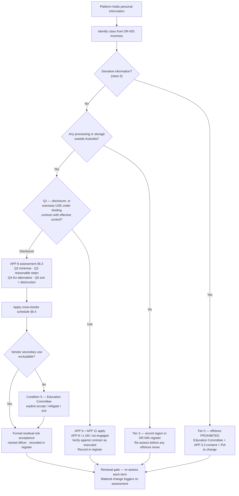

# ADR-010: Data Residency and Cross-Border Disclosure Posture for the Offshore SaaS Estate under APP 8

> **Template Origin**: Official | **ArcKit Version**: 6.7.5 | **Command**: `/arckit:adr`

## Document Control

| Field | Value |
|-------|-------|
| **Document ID** | ARC-001-ADR-010-v1.0 |
| **Document Type** | Architecture Decision Record |
| **ADR Number** | ADR-010 |
| **Project** | Learning & Teaching Baseline Strategy (Project 001) |
| **Classification** | OFFICIAL-SENSITIVE |
| **Status** | **Proposed** |
| **Version** | 1.0 |
| **Created Date** | 2026-07-29 |
| **Last Modified** | 2026-07-29 |
| **Review Cycle** | Annual, plus contract-renewal and event-triggered (see Review and Updates) |
| **Review Date** | 2026-08-28 |
| **Next Review Date** | 2027-07-29 |
| **Escalation Level** | Department |
| **Governance Forum** | RIFF Review → Education Committee → Operations Committee |
| **Owner** | Eleanor Frame, Privacy & Records Officer |
| **Reviewed By** | [PENDING] |
| **Approved By** | [PENDING] |
| **Distribution** | Project Team; Privacy & Records; Digital & IT; Cybersecurity; Procurement & Vendor Management; Learning Technologies; Education Committee; Steering Committee |

**Classification rationale**: this document states which classes of student personal information sit offshore, which contractual and technical controls are absent, and where the estate's weakest cross-border position is. That combination is useful to an adversary and is classified consistently with `ARC-001-DATA-v1.0`.

## Revision History

| Version | Date | Author | Changes | Approved By | Approval Date |
|---------|------|--------|---------|-------------|---------------|
| 1.0 | 2026-07-29 | ArcKit AI | Initial creation from `/arckit:adr` command — cross-border disclosure posture for the offshore SaaS estate under APP 8; class-tiered residency rule; addresses R-017 and discharges the assessment obligation in NFR-C-002 / DR-005 | [PENDING] | [PENDING] |

---

## 1. Scope: What Is Actually Being Decided

### 1.1 The scenario is fictional and the hosting regions are assumptions

**Every hosting region referenced in this ADR is a fictional scenario assumption.** The University of Funk does not exist. The hosting regions attributed here to Turnitin, ExamSoft, Qualtrics, Evasys, PebblePad, Echo360, Zoom, Microsoft Teams, Blackboard and Sonia are invented inputs to a demonstration, drawn from `privacy-context.md`, which states plainly that they "are invented scenario assumptions for demonstration purposes and make no claim about any real vendor's actual hosting, security or practices" [PC-C1].

Nothing in this document should be read as a finding about any real vendor's actual data residency, contractual terms, or privacy posture. In a real engagement, the first implementation step (§10.2 Phase 0) is to *verify* each region against the vendor's current documentation and contract, because the entire tiering in §6 depends on inputs that here are assumed rather than evidenced. Assumption A-1 records this.

### 1.2 The applicable law is the Privacy Act 1988

This is an Australian obligation. The University of Funk is an Australian higher-education institution, and the governing instrument is the **Privacy Act 1988 (Cth)** and the **Australian Privacy Principles**, principally **APP 8 (cross-border disclosure of personal information)** together with **s 16C** of the Act.

> **Explicitly not applicable, and deliberately not used as a frame**: UK GDPR and EU GDPR, Chapter V transfer mechanisms, adequacy decisions, Standard Contractual Clauses, Transfer Impact Assessments, and the *Schrems II* line of reasoning. Also not applicable: the GDS Service Standard, the Technology Code of Practice, G-Cloud, and NCSC Cyber Essentials. None of these has standing for an Australian university, and importing their vocabulary would produce an assessment that looks rigorous and answers the wrong statute. This is consistent with ADR-001, ADR-005 and ADR-006, all of which excluded the UK frameworks for the same reason.
>
> The distinction is substantive, not cosmetic. APP 8 does not work like GDPR Chapter V. There is no adequacy list to rely on by default, no SCC template to execute, and — critically — **no general right to erasure and no statutory data-portability right** in Australian law (`ARC-001-DATA-v1.0`, Data Subject Rights). Portability and exit are therefore *contractual* commitments the university must negotiate (DR-007, DR-008, NFR-I-002), not obligations vendors already carry. An architecture that assumed the GDPR position would over-estimate its leverage on exit and under-estimate its accountability on disclosure.

### 1.3 What this ADR decides, and what it does not

ADR-005 §1 established that deployment topology and hosting region for the SaaS estate are **properties of the vendor's product, not decisions available to UoF**, and that what the university actually holds over those platforms are *procurement and assessment* levers — the residency register (DR-005), the APP 8 assessment obligation (NFR-C-002), and the exit terms (NFR-I-002). ADR-005 explicitly deferred those levers: "Those are governed elsewhere in this project and are **not** re-decided here" [ADR5-C1].

**This ADR is that "elsewhere".** It decides how the university exercises the levers it does hold over an estate whose hosting it cannot choose.

| Layer | Decided by | Governed by |
|-------|-----------|-------------|
| Where the **UoF-controlled integration plane** runs | ADR-005 (single AU region, multi-AZ) and ADR-006 (Azure `australiaeast`) | **Already decided. Not reopened here.** The plane is Australian-only and adds no APP 8 exposure |
| Whether personal information may exist **outside production** | ADR-005 §5.4 (prohibited) | **Already decided. Not reopened here** |
| Where the **SaaS platforms** run | The vendor | Not a UoF decision at all |
| Whether the university **may disclose** a given class of personal information to an offshore SaaS recipient, on what conditions, under what contract, and who accepts the residual risk | **This ADR** | APP 8, s 16C, NFR-C-002, DR-005, Principle 8 |
| Which specific platform is retained, replaced or retired | ADR-007 (build versus buy and procurement approach), WP3 capability mapping and the WP9 roadmap, informed by this ADR's tiering | BR-001, BR-002, BR-007 |

Read together with its predecessors: **ADR-005 and ADR-006 decided where *we* run. This ADR decides what we are willing to send *offshore*, and what we require in return.** The two questions are different, and conflating them is what allows an institution to hold a rigorous position on its own five servers while nine vendors hold student work in jurisdictions nobody assessed.

---

## 2. Context and Problem Statement

Four of the estate's eight personal information classes are disclosed offshore under the assumed hosting, and **none of the four has been assessed** [PC-C2]. `ARC-001-DATA-v1.0` records `app8_assessment_complete` as `false` for every platform in the estate and calls it "the largest open compliance gap in the model" [DM-C1]. The risk register carries this as **R-017 — "Four personal information classes disclosed offshore with no APP 8 assessment completed"** — inherent 20, residual 16, and the register's own finding is that the residual score reflects *uncertainty rather than known unsafety*: "R-017 sits at 16 not because the offshore disclosures are known to be unsafe, but because nobody has looked" [RK-C1]. It is one of two risks the register recommends escalating to the Steering Committee [RK-C2].

The problem is therefore not that the offshore disclosures are wrong. It is that **the university holds a legal accountability it has never assessed, priced, or formally accepted.**

### 2.1 Why APP 8 makes this a design decision rather than a paperwork exercise

APP 8.1 requires an entity, before disclosing personal information to an overseas recipient, to take **such steps as are reasonable in the circumstances** to ensure the recipient does not breach the APPs in relation to that information. Section 16C then supplies the sting: where APP 8.1 applied and no exception is engaged, **an act of the overseas recipient that would breach the APPs is taken to be a breach by the university itself.**

The consequence for architecture is direct, and `ARC-001-DATA-v1.0` states it exactly: "**APP 8.1 makes the university accountable for the recipient's handling — the obligation does not transfer with the data**" [DM-C2]. There is no mechanism by which sending student work to an offshore processor sends the obligation with it. The university remains answerable to the OAIC and to its students for what happens to that information in a jurisdiction where it has no operational visibility.

That makes three things architectural rather than administrative:

1. **Which classes go offshore at all** — because accountability that cannot be discharged should not be incurred. This is a minimisation decision (Principle 7), not a contract-drafting decision.
2. **Whether the arrangement is a *disclosure* or an overseas *use*** — because the answer determines whether APP 8 is engaged at all, and it turns on whether the university retains effective control by contract. See §2.2.
3. **Whether the university can get its data back and get the vendor's copies destroyed** — because APP 8 accountability persists for as long as the recipient holds the information, and Australian law gives the university no statutory portability right to compel it. See §2.3.

### 2.2 The disclosure / use distinction is the sharpest lever available

Not every transfer of personal information to an offshore service provider is a "disclosure" for APP 8 purposes. Where an entity provides information to an overseas contractor that is **bound by a binding contract to handle the information only for the entity's purposes, with no independent right to use or disclose it, and the entity retains effective control**, the arrangement is properly characterised as the entity's own *use* of the information — a matter for APP 6 and APP 11 — rather than a disclosure engaging APP 8 and s 16C.

This is the single most valuable lever in this decision, because it is contractual and therefore obtainable, and because it changes the *legal character* of the arrangement rather than merely documenting it. It also produces an uncomfortable finding when applied honestly to this estate:

| Platform (assumed hosting) | Does the vendor use the data for its own purposes? | Characterisation |
|---|---|---|
| Exam and proctoring platform, US (class 6) | Assumed not — processing is for the university's assessment purpose | Likely **overseas use**, achievable with the right contract. APP 11 and APP 6 apply; APP 8 arguably not engaged |
| Survey and evaluation platforms, US/EU (class 7) | Assumed not, but vendor analytics and product-improvement clauses are the standard place this breaks | **Depends entirely on the contract.** Must be verified clause by clause, not assumed |
| Video and audio platforms, US (class 4, partial) | Assumed not; some offer configurable data-region controls | Likely **overseas use**, and in several cases the disclosure can be avoided entirely by configuration |
| **Similarity-detection platform, US/EU (class 3)** | **Yes — by design.** Submitted work is retained in a cross-institutional similarity repository and used to assess other institutions' submissions | **Genuine disclosure.** The vendor's repository is the vendor's own purpose, not the university's. No contract can characterise this as a mere use |

**The similarity-detection case is the estate's hardest cross-border position and deserves to be named rather than averaged into a portfolio view.** The repository model means: (a) APP 8 and s 16C are squarely engaged; (b) the material is student intellectual property, held for the vendor's benefit; (c) it cannot be recovered or destroyed on exit, because the repository's value to the vendor depends on retention — which collides directly with DR-007, NFR-I-002 and REQ-034; and (d) `ARC-001-DATA-v1.0`'s retention schedule already flags it, noting for E-011 Submission that "vendor repository terms need review" [DM-C3]. This is also the class where the *student*, not the university, owns the underlying rights.

### 2.3 Exit is part of the residency question, not a separate one

REQ-034 (via NFR-I-002 and DR-007) requires contracts to permit export of all university data in open, documented formats on termination. R-028 records export capability as **unverified for four platforms**, on the basis that export was "claimed contractually, never tested" [RK-C3], and R-029 records the related failure where export exists only in vendor-proprietary formats.

For an offshore recipient, exit has a second limb that a domestic exit does not, and the requirement as currently written does not cover it:

- **Retrieval** — can the university get its data out in an open format? This is what REQ-034 and NFR-I-002 address.
- **Destruction** — can the university compel the offshore recipient to *destroy or de-identify* its copies, and evidence that it has? **Nothing in the current requirement set addresses this**, and it is the limb that matters for APP 8, because accountability under s 16C runs for as long as the recipient holds the information. Retrieval without destruction does not end the exposure; it duplicates it.

This ADR therefore treats certified destruction as a first-class exit obligation alongside retrieval, and records the requirement-set gap in §11 as an input back to `ARC-001-REQ`.

### 2.4 Sensitive information is a different question with a different answer

Class 5 — placement records including clearance metadata and health-context notes, held in the placement management platform — is **sensitive information** under the Privacy Act. It attracts:

- **APP 3.3** — collection requires the individual's *consent* in addition to reasonable necessity. `ARC-001-DATA-v1.0` records this as the only class in the estate on a consent basis, and requires the consent to be "explicit and recorded" [DM-C4].
- A materially higher likelihood of meeting the **serious harm** threshold under the Notifiable Data Breach scheme, which is precisely why the estate's NDB tabletop scenario is built on a mis-keyed placement export [PC-C3].
- Under the assumed hosting, **it sits in Australia and does not currently trigger APP 8 at all** [PC-C2].

The decision for class 5 is therefore not "how do we assess this offshore disclosure" but "**how do we make sure this never becomes an offshore disclosure by accident**". Treating it inside the same tier as exam scripts would be a category error: it is the class where an offshore move would be least defensible, and it is currently the class with the least protection against one, because "it happens to be hosted in Australia today" is a fact about a vendor's deployment, not a control.

### 2.5 Why now

- **R-017 is a live compliance exposure that predates the engagement** and the risk register recommends Steering Committee escalation [RK-C2]. It is also the register's cheapest available score reduction, because the residual reflects unassessed uncertainty.
- **Contract renewals are the only point of leverage.** R-005 records that retirement decisions landing mid-term produce cost rather than saving [RK-C4], and R-015 accepts that existing contracts lack exit provisions, with the mitigation being "require exit terms at every renewal". A cross-border position stated *after* a renewal window has passed is a position with nothing to bargain with. Grace Tanaka's renewal calendar (R-005 action, due 2026-08-21) is the sequencing input.
- **WP3 capability mapping is about to record hosting region per platform** and the PIA is scheduled against the same window. Both need a stated institutional rule to assess *against*. Without one, WP3 records regions and the PIA records findings, and no decision is ever taken.
- **The September business case needs the cost of this position.** If repatriation of any class is going to be required, its cost belongs in the business case, not in a variation six months later.

### 2.6 Regulatory and policy context

- **Privacy Act 1988 / APPs** — APP 8 and s 16C (cross-border accountability); APP 3.3 (sensitive information consent); APP 6 (use and disclosure); APP 11 (security, and destruction or de-identification when no longer needed); **APP 1.4** (privacy policy must state whether the entity is likely to disclose personal information to overseas recipients and, where practicable, the countries in which those recipients are likely to be located); **APP 5.2** (collection notice must cover the same). The transparency limbs are frequently forgotten and are cheap to fix — see §6.5.
- **APP 8.2 exceptions** — the routes by which APP 8.1 need not be complied with, principally the "substantially similar law or binding scheme" route and the informed-consent route. §7.3 explains why neither is adopted as the university's primary posture.
- **Tranche 1 reforms (Privacy and Other Legislation Amendment Act 2024)** — relevant in three ways: strengthened enforcement and civil penalty exposure raises the cost of an unassessed position; the automated-decision transparency obligations commencing December 2026 bear on the analytics and at-risk profiling classes; and the Act introduced a mechanism for regulations to **prescribe countries and binding schemes** as providing substantially similar protection. That mechanism, once populated, would make the APP 8.2(a) route materially more workable than it is today. **No prescription should be assumed to be in force for any relevant jurisdiction** — this must be verified at the time of reliance, and is recorded as Assumption A-4.
- **Notifiable Data Breach scheme (Part IIIC)** — an offshore recipient's breach can be the university's notifiable breach. The 30-day assessment clock runs from *suspicion*, not confirmation, which means the contract must oblige the recipient to notify the university fast enough for the university to meet its own clock. See §6.4.
- **RIFF governance** — every new or renewed platform passes the RIFF duplication and impact test before commitment [SGP-C1]. This ADR gives RIFF a cross-border gate to apply (BR-007).

---

## 3. Decision Drivers

### 3.1 Compliance and regulatory drivers

| Driver | Requirement | Note |
|--------|-------------|------|
| Cross-border disclosure assessed, contractually governed and formally accepted before adoption or renewal | **NFR-C-002** (REQ-030) | The dominant driver. Its four acceptance criteria are the specification this ADR must satisfy |
| Privacy Act 1988 / APP compliance for every platform holding personal information | NFR-C-001 (REQ-030) | Residency in Australia *preferred*, not mandated — the requirement itself contemplates assessed offshore disclosure |
| Hosting region recorded per platform, captured at procurement, reviewed at renewal | **DR-005** | The register is the control that makes the position durable rather than a one-off assessment |
| Personal information classified and inventoried, sensitive information separately identified | DR-003 | The tiering in §6 is only possible because classification already exists |
| Sensitive placement information under elevated controls | **DR-004** | Drives the Tier 0 hard boundary in §6.2 |
| Export in open formats on termination | DR-007, NFR-I-002 (REQ-034) | Necessary but not sufficient offshore — destruction is the missing limb (§2.3) |
| Student portfolio portability beyond enrolment | DR-008 | Student-owned artifacts in an offshore platform must remain student-retrievable |
| Demonstrable privacy and security posture | BR-005 | Success criterion: "cross-border disclosure position recorded and accepted for each offshore class" |

### 3.2 Business drivers

| Driver | Requirement | Note |
|--------|-------------|------|
| Licence spend flat or reduced while Must-priority gaps close | BR-002 | Constrains the answer decisively. Repatriation by platform replacement is the most expensive possible response to a compliance gap |
| Governance operating on architectural evidence | BR-007 | The RIFF cross-border gate; a rule that new platforms are assessed against |
| Deliberately bounded capability ecosystem | BR-001 | Two overlapping survey platforms both offshore (FR-021) means one retirement removes one cross-border position for free |
| Rationalisation executable at contract timing | BR-002, R-005 | Cross-border remediation and renewal sequencing are the same calendar |

### 3.3 Technical and data drivers

- **FR-016** similarity and AI-writing detection — the class 3 disclosure, and the estate's hardest position (§2.2)
- **FR-017** secure examination on-campus and remote — class 6, exam responses and proctoring artifacts, and the acceptance criterion already requires that "their classification and hosting position are recorded"
- **FR-021** single platform for teaching evaluation — class 7, with two platforms currently overlapping and both offshore under the assumption; the requirement's own rationale names "offshore hosting implications"
- **FR-015 / DR-008** portfolio artifacts — student-owned material in an offshore platform
- **NFR-SEC-001** institutional SSO with MFA — R-019 records two platforms permitting local accounts. An offshore recipient the university cannot control access to is a materially weaker APP 8 position than one behind institutional identity, which is why §6.4 ties the two
- **NFR-C-003** audit logging — access to sensitive information logged with actor and timestamp

### 3.4 Alignment to architecture principles

| # | Principle | Criticality | Effect on this decision |
|---|-----------|-------------|------------------------|
| 8 | Data Residency and Cross-Border Accountability | **CRITICAL** | **Directly on point.** Its statement is the decision this ADR takes: personal information *should* be held in Australian jurisdiction, and offshore disclosure "MUST be assessed, contractually governed, and formally accepted before the platform is adopted or renewed". All five of its validation gates are addressed in §6 |
| 7 | Privacy by Design and Data Minimisation | **CRITICAL** | Drives class-by-class tiering over a whole-of-estate rule: the least-exposed position is not sending the data, and minimisation is assessed before contractual control is negotiated |
| 9 | Data Portability and Exit | HIGH | Drives the retrieval-*and*-destruction exit limb (§2.3, §6.4). Its rationale — "a platform that cannot be left cannot be rationalised" — applies with double force to a platform that cannot be left *and* is offshore |
| 4 | Discipline Specialisation at the Edge | MEDIUM | Specialist discipline tooling is held to the same cross-border rule as core platforms. "Specialist need justifies a different tool — never a different architecture", and never a different privacy posture (R-010 records these tools as having no defined support model) |
| 16 | Layered Security Posture | CRITICAL | Institutional SSO with MFA is part of the "reasonable steps" argument under APP 8.1; the R-019 local-account exceptions weaken it directly |
| 18 | Evidence-Based Capability Investment | CRITICAL | The RIFF gate: cross-border position assessed before procurement commitment, not after selection |
| 19 | Realise Licensed Capability Before New Spend | HIGH | Where an incumbent platform offers an Australian-region configuration already within licence, that is the cheapest possible remediation and must be tested before any replacement is contemplated |
| 2 | Deliberate Capability Boundaries | CRITICAL | Duplicated offshore capability (two survey platforms) is a duplicated cross-border position; retiring one is remediation at no privacy cost |

**No principle conflicts with this decision.** Principle 8's own wording — "SHOULD be held in Australian jurisdiction" with assessed exceptions — is what permits governed offshore disclosure rather than requiring repatriation. Where a tension exists it is between Principle 7 (minimise: send less) and BR-002 (spend no more), and §7 resolves it by tiering rather than by choosing one side for the whole estate.

---

## 4. Considered Options

1. **Option A** — Australian residency mandate: repatriate or replace every platform holding personal information offshore
2. **Option B** — Governed accountable offshore disclosure: class-tiered residency rule, per-platform APP 8 assessment, standard contractual accountability schedule, formal risk acceptance, renewal-gated re-assessment
3. **Option C** — Do Nothing (baseline): retain the inherited position, no assessment, no tiering, no contract change

A fourth candidate — **relying on the APP 8.2 exceptions** (substantially-similar-law, or informed student consent) as the university's primary posture rather than taking reasonable steps under APP 8.1 — is not carried as a separate option because it is not a residency architecture; it is an attempt to switch the obligation off. It is nonetheless a real and frequently attempted route, so it is assessed on its merits in §7.3 and rejected there with reasons.

### 4.1 Option A: Australian residency mandate — repatriate or replace

**Description**: Personal information may not be disclosed offshore. Every platform holding a class of personal information outside Australia is either reconfigured to an Australian region where the vendor offers one, or replaced with a platform that has one, or retired.

**Implementation approach**: WP3 establishes AU-region availability per platform. Where the vendor offers an Australian region within existing licence, configure it. Where not, the platform enters a replacement track sequenced to its renewal date. Under the assumed hosting, this implicates the similarity-detection platform (class 3), the exam and proctoring platform (class 6), both survey and evaluation platforms (class 7), and the offshore-hosted portion of the video estate (class 4).

**Wardley evolution stage**: Custom-Built (0.35) — for several capability categories, an Australian-region equivalent of the incumbent either does not exist as a product or exists only as a materially weaker one, pushing the university toward bespoke or sub-standard substitution.

**Good**:

- ✅ **Strongest possible privacy position.** No offshore disclosure means no APP 8 assessment, no s 16C accountability for a recipient's acts, and no cross-border limb in an NDB response. The exposure is removed rather than managed
- ✅ Satisfies Principle 8's preference absolutely, and Principle 7's minimisation objective at its strongest reading
- ✅ Simplest possible position to explain to students, to the Education Committee, and to a regulator: the data does not leave
- ✅ Removes R-017 outright rather than reducing it, and removes the cross-border limb of R-023 (public NDB event)
- ✅ Eliminates the similarity-repository problem (§2.2) by eliminating the platform that creates it
- ✅ No dependence on the enforceability of a contract against a recipient in a foreign jurisdiction — the practical weak point of every offshore contractual control

**Bad**:

- ❌ **Collides head-on with BR-002.** Replacing four to six platforms is the most expensive available response to a compliance gap, and the register already flags R-013 (licence spend cannot be held flat). This alone is decisive against a whole-of-estate mandate
- ❌ **For at least one capability there may be no adequate Australian-region product.** Cross-institutional similarity detection derives its value from the scale of its repository; an Australian-only equivalent is a materially weaker academic-integrity control. Mandating residency here trades a privacy improvement for an integrity regression, and FR-016 is MUST_HAVE
- ❌ Treats every offshore class identically, when the classes differ enormously in sensitivity, volume, student-rights implications and remediation cost. It is minimisation applied without proportionality
- ❌ Replacement is itself a privacy event: migration means bulk extracts, dual running, and a period in which two vendors hold the same data — the exact pattern Principle 7 and R-022 warn about
- ❌ Sequencing is hostage to contract dates. R-005 records that retirement decisions landing mid-term produce cost rather than saving, and R-015 accepts that existing contracts lack exit provisions. A mandate the calendar cannot deliver becomes a standing breach of the university's own rule
- ❌ Requires exit from platforms whose export capability is **unverified** (R-028) and possibly proprietary (R-029). The mandate depends on a capability the register says the university does not know it has
- ❌ Does nothing at all for class 5 (sensitive placement records), which is already Australian — the class where the consequence of a future error is highest

**Cost analysis** *(indicative — no costing baseline exists for Project 001; inherits ADR-001 A-1 and ADR-005 A-1)*:

| | Estimate |
|---|---|
| CAPEX | Highest of the three. Procurement, migration and dual-running for four to six platforms; academic re-training on replaced assessment tooling; accessibility re-verification of each replacement (R-021) |
| OPEX | Uncertain and plausibly *higher*: smaller Australian-market vendors do not necessarily price below global incumbents, and per-capability support fragmentation increases |
| 3-year TCO | Highest, and the least predictable. Directly contradicts BR-002 |

### 4.2 Option B: Governed accountable offshore disclosure — class-tiered, assessed, contracted, accepted

**Description**: Australian residency is the default and the preferred position, as Principle 8 states. Offshore disclosure is permitted **only** where it has been assessed class by class, the assessment records why an Australian alternative is not practicable, the contract carries a standard accountability schedule, and a named officer has formally accepted the residual risk. Sensitive information is excluded from offshore disclosure entirely. The residency register is the standing control, and every contract renewal is a re-decision point rather than a rollover.

**Implementation approach**: five components, detailed in §6:

1. A **four-tier class rule** (§6.2) that states, per personal information class, whether offshore disclosure is prohibited, permitted subject to full assessment, or permitted only in minimised form
2. A **per-platform APP 8 assessment** (§6.3) whose first question is the disclosure-versus-use characterisation of §2.2, and which is required to record the practicability of an Australian alternative including where none exists
3. A **standard cross-border contractual schedule** (§6.4) covering APP compliance, no secondary use, sub-processor control, NDB notification inside the university's own clock, audit, and retrieval **plus certified destruction** on exit
4. **Transparency alignment** (§6.5) — privacy policy under APP 1.4 and collection notices under APP 5.2 updated to name the countries, which is currently an unmet obligation and is nearly free to fix
5. **Register and renewal gating** (§6.6) — DR-005 register fields become mandatory, RIFF applies a cross-border gate to every new platform, and no offshore platform is renewed on an assessment older than its term

**Wardley evolution stage**: Product (0.65) — assessed, contractually governed offshore processing is the standard operating position of every Australian university and large private-sector entity. The mechanisms are well understood; what is bespoke here is the class tiering, and deliberately so.

**Good**:

- ✅ **Matches the requirement as actually written.** NFR-C-002 asks for disclosure to be "assessed, contractually governed, and formally accepted" — not prohibited. NFR-C-001 makes Australian residency *preferred*. Option B is the shape of the requirement; Option A is stricter than the requirement and Option C ignores it
- ✅ **Proportionate by construction.** The hard prohibition lands on sensitive information, where the consequence of error is greatest, and the assessed-permission regime lands on classes where an offshore product is genuinely better and the data is less sensitive
- ✅ **Deliverable within BR-002.** The dominant costs are assessment effort and contract negotiation at renewal — work Privacy & Records and Procurement already do. No platform replacement is required by the decision itself, though the assessment may recommend one
- ✅ **Reduces exposure fastest.** The disclosure-versus-use characterisation (§2.2) can move several platforms out of APP 8's scope entirely through contract terms, which is faster and cheaper than migration and produces a stronger position than either an unassessed disclosure or a rushed replacement
- ✅ Addresses R-017 directly and converts it from unassessed uncertainty to a priced, accepted position — the register's own "cheapest score reduction available" [RK-C1]
- ✅ **Class 5 gets stricter treatment than the status quo, not the same treatment.** Today its Australian residency is a vendor deployment fact; under Tier 0 it becomes a stated boundary with an approval gate
- ✅ Fixes the APP 1.4 and APP 5.2 transparency gaps, which are current unmet obligations independent of where the data sits (§6.5)
- ✅ Compounds with rationalisation: retiring one of two duplicated offshore survey platforms (FR-021, BR-001) removes a cross-border position at no privacy cost and some licence saving
- ✅ Renewal-gated re-assessment satisfies Principle 8's fifth gate — "residency posture reviewed at contract renewal" — which a one-off remediation project would not

**Bad**:

- ❌ **The disclosures continue.** Student work, exam responses, proctoring artifacts and survey responses remain offshore, and s 16C accountability remains with the university. This is a managed exposure, not a removed one, and it must be presented to the Education Committee in exactly those terms
- ❌ **Contractual control against an offshore recipient is only as good as its enforceability.** A clause is not a control if pursuing it means litigation in a foreign jurisdiction over a student survey dataset. The honest position is that these clauses primarily create leverage and notification duties, not practical remedies
- ❌ **The similarity-repository problem is not solved, only named.** Under the assumed model, that vendor's own use of student work cannot be contracted away without destroying the product's value. The assessment will surface a position the university may not like, and §6.7 Condition 5 forces that to the Education Committee rather than letting it sit in a register
- ❌ Assessment effort is real and lands on a single officer (Eleanor Frame, who also owns R-018, the estate's highest risk). Capacity is a delivery risk, recorded in §8.4
- ❌ Depends on renewal timing for its contractual limb. Platforms with no renewal inside the roadmap horizon stay on today's terms while carrying an assessed-but-weakly-contracted position — an interim state that must be visible rather than glossed
- ❌ Creates an ongoing governance obligation. A register that is not maintained is worse than no register, because it looks like a control at audit while functioning as a historical document
- ❌ More complex to explain than "the data does not leave Australia". A tiered rule requires the Education Committee to engage with distinctions between classes

**Cost analysis** *(indicative)*:

| | Estimate |
|---|---|
| CAPEX | Assessment of nine platform positions across four classes; standard contractual schedule drafted once and reused; register fields added to the platform inventory (E-018, E-019 already model them); privacy policy and collection-notice updates |
| OPEX | Assessment refresh at each renewal; register maintenance; annual posture review. Absorbed largely within existing Privacy & Records and Procurement functions |
| 3-year TCO | Lowest of the two active options by a wide margin. Any platform replacement it recommends is costed and approved separately, on its own merits, through RIFF and ADR-007 |

### 4.3 Option C: Do Nothing (baseline)

**Description**: The inherited position stands. Hosting region is not systematically recorded, no APP 8 assessment is performed, contracts carry whatever cross-border terms were agreed at original procurement, and no officer formally accepts the residual risk. The privacy policy continues not to name the countries.

**Good**:

- ✅ No assessment effort, no contract negotiation, no committee time, nothing to fund
- ✅ No academic disruption: every platform stays exactly as it is
- ✅ Matches current practice, so there is no change to manage

**Bad**:

- ❌ **Fails NFR-C-002 outright** on all four acceptance criteria, and NFR-C-002 is MUST_HAVE. Fails BR-005's success criterion that "cross-border disclosure position [is] recorded and accepted for each offshore class"
- ❌ **Breaches Principle 8**, rated CRITICAL, on all five of its validation gates
- ❌ Leaves R-017 at 16 with no effective control, and leaves it as the second-highest risk in a register that recommends escalating it to the Steering Committee
- ❌ **Leaves a probable standing breach of APP 1.4 and APP 5.2** — the transparency obligations bite regardless of whether the underlying disclosures are well governed, and they are nearly free to remedy. Doing nothing keeps an unlawful position that costs almost nothing to fix
- ❌ Accepts s 16C accountability without ever having decided to accept it. If an offshore recipient mishandles student work, the university's answer to the OAIC and to its students is that it never looked
- ❌ Leaves the class 5 boundary undefended: nothing prevents a future vendor migration, product change or acquisition from moving sensitive placement records offshore, and nobody would necessarily notice
- ❌ Renewals pass without re-assessment, which is the only leverage point the university has. Every missed renewal is leverage permanently spent
- ❌ The estate keeps growing. New platforms arrive through RIFF with no cross-border gate, so the position gets worse without any decision being taken — exactly the pattern this engagement exists to break

**Retained as a genuine baseline.** RIFF permits closing a request without action. But this baseline is not neutral: it is the estate's current position, and R-017's inherent score of 20 is the evidence of what it produces.

### 4.4 Comparison

| Dimension | A — Residency mandate | **B — Governed disclosure** | C — Do Nothing |
|-----------|----------------------|-----------------------------|----------------|
| APP 8 exposure | Removed | Assessed, contracted, accepted | Unassessed and unaccepted |
| NFR-C-002 (MUST) | Exceeded | **Met** | Failed |
| Principle 8 (CRITICAL) | Exceeded | **Met, all five gates** | Breached |
| BR-002 spend constraint | Breached | **Held** | Held |
| FR-016 academic integrity | At risk | **Preserved** | Preserved |
| Class 5 sensitive protection | Unchanged | **Strengthened (Tier 0)** | Unchanged |
| APP 1.4 / APP 5.2 transparency | Fixed | **Fixed** | Unmet |
| Time to reduce R-017 | 18–36 months | **3–9 months** | Never |
| Enforceability of controls | Not required | Contractual, imperfect | None |
| Explains simply | Yes | Requires tiering | Yes (badly) |

---

## 5. Decision Outcome

**Chosen option: Option B — governed accountable offshore disclosure**, implemented as a four-tier class rule with an absolute prohibition on offshore disclosure of sensitive information, a per-platform APP 8 assessment that begins with the disclosure-versus-use characterisation, a standard contractual accountability schedule including certified destruction on exit, and formal residual-risk acceptance recorded against a named officer and re-taken at every contract renewal.

The decision is **Proposed**, not Accepted. It carries six conditions (§6.7).

### 5.1 Y-Statement

> **In the context of** an overwhelmingly SaaS-based learning and teaching estate in which four of eight personal information classes are disclosed offshore under the assumed hosting, where the university chooses none of those hosting regions, and where ADR-005 and ADR-006 have already confined every university-controlled workload to Australian jurisdiction,
> **facing** APP 8.1 and s 16C accountability for an overseas recipient's handling that the university has never assessed, priced or accepted — R-017, the register's second-highest risk — against a flat licence envelope that makes wholesale platform replacement undeliverable and a MUST_HAVE academic-integrity requirement that depends on a cross-institutional offshore repository,
> **we decided for** a class-tiered residency rule under which sensitive information may not be disclosed offshore at all, other classes may be disclosed only after a documented APP 8 assessment that first tests whether the arrangement can be characterised as an overseas use rather than a disclosure, under a standard contractual schedule requiring APP compliance, no secondary use, breach notification inside the university's own NDB clock, and certified destruction as well as retrieval on exit, with residual risk formally accepted by a named officer and re-taken at every renewal,
> **and against** an Australian residency mandate requiring repatriation or replacement of four to six platforms, and against reliance on the APP 8.2 substantially-similar-law or student-consent exceptions,
> **to achieve** a cross-border position that is decided rather than inherited, proportionate to the sensitivity of each class, deliverable within BR-002 at assessment-and-contract cost rather than replacement cost, and durable because it is re-taken at each renewal rather than fixed at first adoption,
> **accepting** that student work, exam responses, proctoring artifacts and survey responses remain offshore with the university still accountable under s 16C; that contractual controls against a foreign recipient produce leverage and notification duties more reliably than practical remedies; and that the similarity-detection repository is a disclosure no contract can convert into a use, which the assessment will surface as a position requiring an explicit Education Committee decision rather than a register entry.

### 5.2 The argument, stated plainly

**First: the university is accountable whether or not it has looked, so the assessment is not the compliance cost — it is the only thing that reduces the exposure.** APP 8.1 required reasonable steps *before* disclosure, and those disclosures began years ago. The obligation has already crystallised. R-017 sits at residual 16 because nobody has assessed it [RK-C1] — meaning the score reflects the university's ignorance, not the recipients' conduct. Assessment is the only action that can move it, and it is cheap relative to every alternative.

**Second: the sharpest available lever is legal characterisation, not migration.** For most of the offshore estate, the question of whether APP 8 is engaged at all turns on whether the recipient handles the information solely for the university's purposes under a binding contract with the university retaining effective control (§2.2). Where that can be established — and for the exam, survey and video platforms it plausibly can — the arrangement is an overseas *use* under APP 6 and APP 11, not a disclosure engaging s 16C. This is obtainable by contract at renewal, achieves more than a residency mandate would in the same period, and costs a fraction of it. **The first question of every assessment is therefore characterisation, not region.**

**Third: proportionality has to be built in, because the classes are not alike.** Placement records containing clearance metadata and health-context notes are not equivalent to a teaching-evaluation response. Treating them under one rule means either over-controlling the survey data at unaffordable cost, or under-controlling the sensitive data at unacceptable risk. A tiered rule is more complex to explain and is the only honest structure. The hard boundary belongs where the harm is greatest.

**Fourth: repatriation would spend the constrained budget to weaken a Must-priority control.** Class 3's offshore platform is a cross-institutional similarity repository whose academic-integrity value is a direct function of the scale of the corpus it holds. An Australian-only substitute is a weaker integrity control, and FR-016 is MUST_HAVE. Spending the BR-002 envelope to make academic integrity worse, in order to improve a privacy position that a contract and an assessment can address more cheaply, would be the wrong trade — and R-013 already records that the flat envelope is under pressure without it.

**Fifth: renewal is the only leverage, and it is perishable.** The university cannot renegotiate an offshore contract mid-term. It can at renewal. R-015 has already accepted that existing contracts lack exit provisions and set "require exit terms at every renewal" as the mitigation. A cross-border position that is not gated to the renewal calendar is a position with no enforcement mechanism, which is why §6.6 makes the renewal gate part of the decision rather than an implementation detail.

**Sixth: the transparency obligations are unmet, independent of everything above, and cost almost nothing.** APP 1.4 requires the privacy policy to state whether personal information is likely to be disclosed to overseas recipients and, where practicable, the countries involved; APP 5.2 requires the same at collection. Neither depends on the outcome of any assessment. Both appear unmet today. Fixing them is the fastest genuine compliance improvement available in this decision and should not wait for the assessment programme (§6.7 Condition 2).

---

## 6. The Decision in Detail

### 6.1 Default position

**Australian residency is the default and the preferred position for all personal information in the L&T estate.** Offshore disclosure is an exception requiring assessment, contract, and formal acceptance. It is never inherited, never assumed from an existing arrangement, and never permitted by silence. This restates Principle 8 as an operative rule with a decision procedure attached.

### 6.2 The class tiering rule

Applied to the eight-class inventory in `privacy-context.md` §1 and `ARC-001-DATA-v1.0` [PC-C2] [DM-C5]. Hosting regions are the fictional assumptions of §1.1.

| Tier | Rule | Classes | Basis |
|------|------|---------|-------|
| **Tier 0 — No offshore disclosure** | Offshore disclosure **prohibited**. Any proposal to change this requires an Education Committee decision on the recommendation of the Privacy & Records Officer, explicit refreshed student consent under APP 3.3, and a completed PIA — not a RIFF exception | **Class 5** — placement records including clearance metadata and health-context notes (**sensitive information**, currently AU, in the placement platform) | DR-004; APP 3.3 consent basis [DM-C4]; highest NDB serious-harm likelihood [PC-C3]; R-018 and R-023 |
| **Tier 1 — Offshore permitted only on full assessment** | Offshore disclosure permitted **only** with: completed APP 8 assessment (§6.3), full contractual schedule (§6.4), documented AU-alternative practicability finding, and formal risk acceptance. Vendor secondary use prohibited; where it cannot be excluded, §6.7 Condition 5 applies | **Class 3** — submitted written and creative work (student IP; US/EU) · **Class 6** — exam responses and remote proctoring artifacts (US) | NFR-C-002; FR-016, FR-017; student IP in class 3; proctoring artifacts are among the most intrusive material in the estate |
| **Tier 2 — Offshore permitted, minimised** | Offshore disclosure permitted on the same basis as Tier 1, **and** only in minimised or de-identified form where the purpose permits. Identifiable retention offshore requires stated justification per purpose | **Class 7** — survey and teaching-evaluation responses (US/EU; de-identified in reporting) · **Class 4** — video and audio recordings capturing students, for the offshore-hosted portion only (AU/US) | DR-006 minimisation; Principle 7; FR-021 reporting already de-identified; class 4 is biometric-adjacent [DM-C6] |
| **Tier 3 — Australian, and to remain so** | Currently Australian. Any proposal to move offshore is treated as a new Tier 1 or Tier 2 decision requiring assessment **before** the move, not after | **Class 1** identity · **Class 2** academic records and grades · **Class 8** engagement and learning analytics | DR-005; Principle 8; these classes are the authoritative record and the profiling derivative |

**Three consequences follow immediately, and each is a decision rather than an observation:**

1. **Class 4 is the cheapest remediation in the estate.** Recordings are split AU/US across platforms. Where a platform offers an Australian data-region configuration within existing licence, Principle 19 requires the university to use it before contemplating anything else. This is configuration, not procurement, and it removes a partial APP 8 trigger for approximately nothing. It is Condition 3.
2. **Class 7 is a rationalisation dividend.** FR-021 requires one primary teaching-evaluation platform where two currently overlap, both offshore under the assumption. Retiring one removes an entire cross-border position, saves licence spend under BR-002, and satisfies BR-001 — one action, three requirements.
3. **Class 5's Australian residency stops being a lucky vendor deployment fact and becomes a stated boundary.** This is the material strengthening of the estate's most sensitive class, and it costs nothing today. Its whole value is that it is stated *before* a vendor migration, product change or acquisition makes it urgent.

### 6.3 The per-platform APP 8 assessment

One assessment per platform per class disclosed. Recorded against `E-018.app8_assessment_complete` in the DR-005 register. **Questions are asked in this order, because the order is the point** — characterisation before contract, contract before acceptance:

| # | Question | Why it is asked here |
|---|----------|---------------------|
| 1 | **Is this a disclosure at all, or an overseas use?** Does the recipient handle the information solely for the university's purposes under a binding contract, with no independent right to use or disclose it, and does the university retain effective control? | If it is a use, APP 8 and s 16C are not engaged and the position is governed by APP 6 and APP 11 instead. This is the strongest and cheapest available improvement (§5.2). It must be answered from the **contract as executed**, not from a vendor's marketing statement |
| 2 | **What is the minimum information that must go?** Which fields, which individuals, which retention period | APP 3, APP 11.2, Principle 7. A smaller disclosure is a smaller accountability. Asked before controls are designed, because controls on data that should not have been sent are wasted effort |
| 3 | **What reasonable steps are in place?** Contractual APP-compliance obligation, security posture, institutional SSO with MFA (NFR-SEC-001), sub-processor control, audit rights, breach notification | This is the substance of APP 8.1 compliance. Note R-019: a platform permitting local accounts is a weaker reasonable-steps position, and the two remediations should be sequenced together |
| 4 | **Is an Australian-region alternative practicable?** Including within the incumbent's existing licence (Principle 19), and **including where the finding is that none exists** | NFR-C-002 acceptance criterion 3 and Principle 8 gate 3 both require this to be *recorded*, not merely considered. A finding of "none practicable" is a valid and expected outcome — an unrecorded one is not |
| 5 | **Can the data be retrieved and destroyed on exit?** Open formats (DR-007, NFR-I-002), verified by test not by contract reading (R-028), **plus certified destruction of all recipient copies including backups and sub-processors** | §2.3. Retrieval without destruction duplicates the exposure rather than ending it |
| 6 | **What is the residual risk, and who accepts it?** | NFR-C-002 requires disclosure to be "formally accepted". An assessment with no named acceptor is analysis, not a decision |

**Sequencing**: assessments are ordered by **contract renewal date first** (leverage is perishable — R-005, R-015), then by tier, then by volume of individuals affected. Grace Tanaka's renewal calendar is the input; Eleanor Frame owns the assessments.

### 6.4 The standard cross-border contractual schedule

Drafted once, applied at every new procurement and every renewal of a platform holding personal information. This is what Principle 8's fourth gate — "contractual accountability and breach notification clauses verified" — is verified *against*.

| Clause | Requirement | Why |
|--------|-------------|-----|
| **APP compliance** | Recipient must handle the information in a manner that would not breach the APPs | The direct expression of APP 8.1 reasonable steps |
| **Purpose limitation / no secondary use** | Handling for the university's specified purposes only. No use for product improvement, model training, analytics, benchmarking, or any own-purpose retention | The clause that sustains the "use not disclosure" characterisation. Also the clause most often quietly absent, and the one the similarity-repository model cannot accept (§2.2) |
| **Sub-processor control** | Named sub-processors, notification and approval of changes, flow-down of these obligations, and disclosure of onward jurisdictions | An unassessed sub-processor in a third country is an unassessed disclosure. Region is not a single value |
| **Security** | Controls appropriate to the classification (APP 11); institutional SSO with MFA; no local accounts (NFR-SEC-001) | Part of reasonable steps; ties the R-019 remediation to renewal leverage |
| **Breach notification** | Notification to the university **without undue delay and in any event within 48 hours of becoming aware or suspecting**, with sufficient information for the university's own assessment | The university's Part IIIC clock runs 30 days **from suspicion**. A recipient notifying at its own convenience makes the university's obligation unmeetable [DM-C7] |
| **Audit and evidence** | Right to obtain evidence of compliance — independent assurance reports accepted where audit is impracticable | "Reasonable steps" is not a one-off act. Evidence is what makes it ongoing |
| **Data location transparency** | Recipient must disclose processing and storage locations and notify changes in advance | The register (DR-005) cannot be maintained if the underlying facts can change silently |
| **Retrieval on exit** | Export of all university and student data in open, documented formats, at any time and on termination, without additional fee | REQ-034, NFR-I-002, DR-007. Verified by test (R-028), not by contract reading |
| **Certified destruction on exit** | Destruction or de-identification of all copies, including backups and sub-processor copies, within a stated period, **with written certification** | **The missing limb** (§2.3). Australian law gives the university no statutory erasure right to fall back on, so if this is not in the contract it does not exist |
| **Student-facing continuity** | Where the platform holds student-owned artifacts, student retrieval survives both enrolment end and contract termination | DR-008, FR-015. The student's rights should not expire with a procurement decision |
| **Survival and governing law** | Obligations survive termination for as long as any copy is held; Australian governing law and jurisdiction where obtainable | Accountability under s 16C runs with the data, not with the contract term |

**Honest limitation, recorded rather than glossed**: for a large global vendor, several of these clauses will be resisted and some will not be obtained. Where a clause cannot be obtained, that gap is an input to the residual risk in §6.3 question 6 and must be *visible in the acceptance*, not silently dropped. A schedule that is applied only where it is easy is a schedule that documents the university's weakest positions least well.

### 6.5 Transparency: APP 1.4 and APP 5.2

Independent of every assessment above, and required regardless of their outcomes:

- **Privacy policy (APP 1.4)** — must state that the university is likely to disclose personal information to overseas recipients and, where practicable, the countries in which those recipients are likely to be located. Owner: Eleanor Frame.
- **Collection notices (APP 5.2)** — the same information at the point of collection. In practice: enrolment, assessment submission, examination and proctoring, survey invitations, and the session-start recording notice that `ARC-001-DATA-v1.0` already requires for class 4 [DM-C6].
- **Student-facing plain-language statement** — which platforms hold which of their material, and where. Not strictly required by the APPs, but the class 3 position concerns student intellectual property and the class 6 position concerns proctoring artifacts. Jazmin Field (Student Guild) is consulted, per the pattern this project applies to student-affecting decisions.

**This is the fastest genuine compliance improvement in the decision and it does not depend on any assessment finding.** It is Condition 2.

### 6.6 Register and renewal gating

| Control | Mechanism |
|---------|-----------|
| **Residency register** | `E-018` and `E-019` already model `hosting_region`, `app8_trigger` and `app8_assessment_complete` [DM-C8]. This ADR makes population mandatory at procurement and at renewal, and makes an unpopulated field a RIFF blocker rather than a data-quality item |
| **RIFF gate for new platforms** | No platform holding personal information passes RIFF without: hosting region recorded, tier assigned, and — for Tier 1 or Tier 2 — assessment completed and risk accepted **before commitment**, not before release (BR-007, Principle 18, NFR-C-001 acceptance criterion 2) |
| **Renewal gate** | No offshore platform is renewed on an assessment older than its preceding contract term. Renewal is a re-decision, satisfying Principle 8 gate 5 and Principle 19's contract-renewal review |
| **Tier 0 gate** | Any change that would place sensitive information offshore is escalated to the Education Committee, not handled as a RIFF exception |
| **Material-change trigger** | A vendor's change of processing location, sub-processor, ownership, or secondary-use terms triggers re-assessment, per NFR-C-001 acceptance criterion 4 |

### 6.7 Conditions attached to this decision

1. **Assessment programme sequenced to the renewal calendar, and resourced.** Tier 1 platforms first, then Tier 2, ordered within tier by renewal date. Eleanor Frame owns the programme and also owns R-018, the register's highest risk. If she cannot carry both, the resourcing gap is escalated to the CIO rather than absorbed silently. Target: all Tier 1 and Tier 2 assessments complete by 2026-12-31.
2. **Transparency remediation does not wait for the assessments.** Privacy policy (APP 1.4) and collection notices (APP 5.2) updated by **2026-09-30**. These are current unmet obligations with no dependency on any assessment outcome.
3. **Class 4 Australian-region configuration tested before anything else.** Where a video or capture platform offers an AU data region within existing licence, configure it (Principle 19). Removes a partial APP 8 trigger at configuration cost. Due 2026-10-31.
4. **Certified destruction added to the requirement set.** `ARC-001-REQ` NFR-I-002 and DR-007 currently cover retrieval but not destruction (§2.3). The gap is remedied in the next REQ revision; this ADR is the input.
5. **The similarity-repository position goes to the Education Committee, not into the register.** Where an assessment finds vendor secondary use that cannot be contracted away — expected for class 3 — the finding is escalated for an explicit decision to accept, mitigate or exit. **It is not resolved by recording it as accepted residual risk in a register.** Due with the class 3 assessment.
6. **APP 8.2(a) reliance requires verified legal advice at the time of reliance.** If the prescribed-countries mechanism (§2.6) is invoked for any platform, the prescription must be confirmed in force for that jurisdiction, in writing, at that time. Assumption A-4.

### 6.8 Decision flow

### 6.9 Dissent recorded

No formal dissent at time of writing. **Three objections are anticipated and legitimate:**

- *That anything short of Australian residency is inadequate for student data (likely from the Student Guild, and defensible).* The counter is proportionality plus honesty: Tier 0 gives absolute protection where harm is greatest; the alternative for Tier 1 is not "the data stays in Australia" but "a weaker academic-integrity control at higher cost". That trade should be argued in front of Jazmin Field rather than around her, and if the Education Committee prefers the residency mandate, Option A is available and this ADR is superseded.
- *That the tiering is too complex to govern (likely from Procurement).* It will be. Four tiers, nine platforms and a renewal calendar is more machinery than "no offshore data". The counter is that a simple rule the university cannot afford to follow is not a control at all, and that the register fields already exist in the data model.
- *That the contractual schedule will not be obtainable from the largest vendors.* Partly true, and §6.4 records it rather than pretending otherwise. Gaps become visible residual risk in the acceptance, which is a better position than an unassessed contract — but it is not the same as having the clause.

---

## 7. Justification

### 7.1 Why not Option A, despite the stronger privacy position

It fails BR-002 decisively, and in at least one case it would spend the constrained envelope to weaken a MUST_HAVE control (FR-016). It also treats eight materially different classes identically, which is minimisation without proportionality. And it does nothing for class 5, the estate's most sensitive class, because that class is already Australian — so the most expensive option leaves the highest-consequence gap exactly where it was.

Option A is not rejected as wrong. It is **the right answer for Tier 0 and it is retained there**, as an absolute prohibition. What is rejected is applying it uniformly across an estate where the classes and the costs differ by an order of magnitude. If a future Education Committee prefers the uniform mandate, this ADR is superseded rather than amended — the tiering is its substance, not a detail.

### 7.2 Why not Option C

It fails a MUST_HAVE requirement (NFR-C-002) on all four acceptance criteria, breaches a CRITICAL principle on all five of its gates, and leaves the register's second-highest risk with no effective control. It also leaves a probable standing breach of APP 1.4 and APP 5.2 that costs almost nothing to remedy — the clearest possible case of a position that is indefensible rather than merely suboptimal. Its worst property is drift: new platforms keep arriving with no gate, so the position deteriorates without anyone deciding anything.

### 7.3 Why not rely on the APP 8.2 exceptions

This is the fourth route named in §4 and it deserves an explicit refusal, because it is the route an institution under time pressure most often takes.

**The substantially-similar-law route (APP 8.2(a))** requires a reasonable belief that the recipient is subject to a law or binding scheme with protections substantially similar to the APPs, **and** that there are mechanisms the individual can access to enforce that protection. For the United States in particular, a general finding of that kind is not available: there is no comprehensive federal privacy statute of APP-equivalent scope, and the individual-enforcement limb is the harder of the two to satisfy. The Tranche 1 reforms introduced a mechanism for regulations to *prescribe* countries and binding schemes, which would make this route workable where prescribed — but **nothing should be assumed prescribed** (A-4, Condition 6). Relying on an exception whose factual basis has not been established is worse than not relying on it, because it substitutes an unexamined legal conclusion for an assessment.

**The consent route (APP 8.2(b))** requires that the individual be *expressly informed* that if they consent, APP 8.1 will not apply — and then consents. In a university context this route is unattractive on three independent grounds:

1. **Consent is not genuinely voluntary where the platform is a condition of assessment.** A student cannot decline to have their exam sat in the proctoring platform and still sit the exam. Consent obtained under those conditions is unlikely to be valid, and constructing it would be worse than not relying on it.
2. **It transfers the university's accountability onto the student.** The effect of a valid APP 8.2(b) consent is that the university is no longer accountable for the recipient's handling. Asking a student to bear that, as a condition of enrolment, is not a defensible institutional posture regardless of its technical availability.
3. **It fails operationally.** Consent must be capable of being refused, which means an alternative pathway must exist for every refusing student. If that alternative exists, it is an Australian-region option — in which case the university should be using it for everyone under Principle 19, and the consent question never arises.

**Conclusion**: the university takes reasonable steps under APP 8.1 and retains its accountability, rather than seeking to extinguish the obligation. Reliance on APP 8.2 is not prohibited, but it requires verified legal advice at the time of reliance (Condition 6), and it is not the posture.

### 7.4 Why Option B

It is the shape of the requirement as written: NFR-C-002 asks for assessed, contracted and accepted disclosure, and NFR-C-001 makes Australian residency *preferred* rather than mandatory. It is proportionate — absolute where harm is greatest, assessed where the product genuinely matters. It is deliverable inside BR-002 at assessment-and-contract cost. It reduces the exposure faster than migration could, because legal characterisation and contract terms move faster than procurement. And it is durable, because the renewal gate re-takes the decision rather than fixing it at first adoption.

Its principal weakness — that the disclosures continue — is stated plainly rather than mitigated away. The university remains accountable under s 16C for material it cannot see being handled. That is the accepted cost of an estate the university did not design, and the correct response is to make the acceptance explicit, named, priced and periodically re-taken. **An accepted exposure is a governed one. An unassessed exposure is only an undiscovered one.**

---

## 8. Consequences

### 8.1 Positive

| Consequence | Measure | Baseline → Target |
|-------------|---------|-------------------|
| APP 8 assessments completed | `app8_assessment_complete` across offshore platforms | `false` for all → complete for all Tier 1 and Tier 2 by 2026-12-31 |
| Cross-border position formally accepted | Classes with a named risk acceptor | 0 of 4 → 4 of 4 |
| Sensitive information boundary stated | Offshore prohibition for class 5 | None (Australian by vendor happenstance) → Tier 0 prohibition with Education Committee gate |
| Transparency obligations met | APP 1.4 privacy policy and APP 5.2 collection notices naming countries | Unmet → met by 2026-09-30 |
| Disclosures re-characterised as overseas use | Platforms where APP 8 / s 16C is not engaged | 0 → assessed per platform; several expected |
| Residency register operative | Platforms with hosting region recorded and reviewed at renewal | Ad hoc → mandatory field, RIFF blocker if absent |
| Exit includes destruction | Contracts with certified-destruction obligations | 0 → all renewals from adoption of the schedule |
| Cross-border gate in governance | New platforms assessed before commitment | No gate → RIFF gate (BR-007, Principle 18) |
| Class 4 partial trigger removed | Offshore-hosted recording platforms with AU region available and configured | Unknown → configured where available (Condition 3) |
| R-017 residual reduced | Risk score | 16 → target 6–9 once assessment and contracts are in place |

### 8.2 Negative — accepted trade-offs

| Trade-off | Mitigation |
|-----------|-----------|
| Student work, exam responses, proctoring artifacts and survey responses remain offshore; s 16C accountability remains with the university | Assessed, contracted and accepted rather than unexamined. Presented to the Education Committee in exactly these terms — a managed exposure, not a removed one |
| Contractual controls against a foreign recipient are imperfectly enforceable | Accepted and stated (§6.4). Their real value is leverage, notification duty and evidence rights, not litigation remedy. Where a clause cannot be obtained, the gap is visible in the acceptance |
| The similarity-repository disclosure may be unresolvable by contract | Condition 5 forces it to the Education Committee as an explicit accept / mitigate / exit decision rather than a register entry |
| Assessment effort lands on one officer who also owns the estate's highest risk | Condition 1 requires escalation of the resourcing gap rather than silent absorption; sequencing by renewal date means the calendar sets the order, not availability |
| Contractual limb depends on renewal timing; some platforms stay on today's terms for years | Register records assessment complete but contract non-conforming as a distinct, visible state — not conflated with "assessed and governed" |
| Four tiers plus a renewal calendar is more governance machinery than a single rule | Register fields already exist in the data model (E-018, E-019); the tiering is applied at RIFF, which already assesses every request |
| Tier 0 constrains future placement-platform options to Australian-region products | Deliberate. The constraint is the control, and it is cheap to hold today precisely because the current platform is already compliant with it |
| A tiered rule is harder to explain to students than "your data stays in Australia" | The plain-language statement in §6.5 exists for this, and the Student Guild is consulted rather than informed |

### 8.3 Neutral — changes required

- Standard cross-border contractual schedule drafted and added to the procurement template pack (Procurement, with Privacy & Records)
- Assessment template built against the six §6.3 questions and held with the PIA artifacts
- `E-018` / `E-019` register fields populated for all platforms; population becomes a RIFF completeness check
- RIFF request form gains hosting region, tier and assessment status fields
- Privacy policy and collection notices revised; recording-notice text updated for class 4
- Renewal calendar (R-005 action, Grace Tanaka) extended to carry assessment expiry alongside contract expiry
- `ARC-001-REQ` revised to add certified destruction to NFR-I-002 and DR-007 (Condition 4)
- The PIA (`/arckit:au-pia`) consumes this ADR's tiering as its APP 8 input rather than deriving a position independently
- NDB playbook (`/arckit:au-ndb-playbook`) gains an offshore-recipient limb reflecting the 48-hour notification clause

### 8.4 Risks and mitigations

| Risk | Likelihood | Impact | Mitigation | Owner |
|------|-----------|--------|------------|-------|
| Assessment programme not completed before key renewals pass | MEDIUM | HIGH | Sequenced by renewal date (Condition 1); renewal calendar is the programme plan; slippage reported to Steering | Eleanor Frame |
| Vendor refuses the no-secondary-use clause, so the "use" characterisation fails | MEDIUM | HIGH | Condition 5 escalation; assessed as disclosure with full APP 8 treatment; feeds the WP9 retirement analysis | Eleanor Frame / Grace Tanaka |
| Similarity repository proves unresolvable and academic integrity depends on it | **HIGH** | MEDIUM | Condition 5 Education Committee decision; student-facing transparency in the interim; FR-016 alternatives assessed at WP3 rather than assumed absent | A/Prof. Pearl Clavinet |
| Assessment capacity constrained by single-officer dependency | MEDIUM | MEDIUM | Condition 1 escalation to CIO; template-driven assessment reduces per-platform effort; Procurement carries the contractual limb | Cassandra Rhodes |
| Register populated once then not maintained; looks like a control at audit | MEDIUM | HIGH | Renewal gate makes maintenance a procurement dependency rather than a good intention; unpopulated field is a RIFF blocker | Grace Tanaka |
| Vendor changes processing location or sub-processor without notice | MEDIUM | MEDIUM | Contractual location-transparency and sub-processor clauses (§6.4); material-change re-assessment trigger (§6.6) | Eleanor Frame |
| Export exists but is unverified or proprietary, so exit is not actually available | MEDIUM | MEDIUM | Inherits R-028 and R-029 remediation — export tested by extraction, not read from contract | Grace Tanaka |
| Tier 0 breached inadvertently by a vendor migration or acquisition | LOW | **HIGH** | Contractual location transparency plus Education Committee gate; NDB serious-harm consequence makes this the one boundary monitored actively | Eleanor Frame |
| Student Guild rejects the tiered position publicly | LOW | MEDIUM | Consultation before Education Committee, not after (§6.5); transparency statement published with the decision | Jazmin Field / A/Prof. Pearl Clavinet |
| Legal position on APP 8.2 prescriptions misread and relied upon | LOW | HIGH | Condition 6 — verified advice at the time of reliance, in writing | Eleanor Frame |

**Existing risks affected**: **R-017 addressed directly** — this is the decision that converts it from unassessed to assessed and accepted; target residual 6–9. **R-018 and R-023** supported by the Tier 0 prohibition, which prevents the estate's sensitive class from acquiring a cross-border limb on top of its manual-handling problem. **R-028 and R-029** given a governance home — export verification and open formats become renewal-gated rather than aspirational. **R-005 and R-015** reinforced: assessment expiry now travels with contract expiry on the same calendar. **R-019** connected — SSO and MFA remediation becomes part of the reasonable-steps argument and gains renewal leverage. **R-022** unaffected: analytics minimisation is a Tier 3 domestic matter (DR-006).

---

## 9. Validation and Compliance

### 9.1 How implementation will be verified

- **Assessment completeness audit** — every offshore platform-class pair has a completed assessment answering all six §6.3 questions, with a named risk acceptor. An assessment with no acceptor fails the audit
- **Contract conformance review** — each renewed contract checked against the §6.4 schedule clause by clause; gaps recorded as residual risk in the acceptance, not omitted
- **Register completeness check** — `hosting_region`, `app8_trigger` and `app8_assessment_complete` populated for every platform holding personal information; run as a RIFF gate, not an annual review
- **Export and destruction test** — export tested by extraction (R-028) and destruction certification obtained at any actual exit. A contractual claim untested is recorded as untested
- **Transparency review** — privacy policy and collection notices checked against the APP 1.4 and APP 5.2 limbs
- **RIFF gate test** — a new platform request with no hosting region recorded is rejected at intake. Verified by attempting it
- **PIA consistency** — `/arckit:au-pia` must reach the same APP 8 position as this ADR; divergence is a finding against one document or the other
- **Conformance check** — `/arckit:conformance` after implementation

### 9.2 Monitoring

| Metric | Target | Source |
|--------|--------|--------|
| Offshore platform-class pairs with completed APP 8 assessment | 100% of Tier 1 and Tier 2 by 2026-12-31 | DR-005 register (`app8_assessment_complete`) |
| Platforms holding personal information with hosting region recorded | 100% | DR-005 register |
| Offshore contracts carrying the full §6.4 schedule | 100% of contracts renewed after adoption | Procurement contract register |
| Assessments older than the current contract term | Zero | Register, renewal calendar |
| Sensitive information (class 5) disclosed offshore | **Zero** | Register; vendor location notifications |
| New platforms passing RIFF without a recorded cross-border position | Zero | RIFF decision log |
| Offshore recipient breaches notified within 48 hours of vendor awareness | 100% | Incident records; NDB playbook |
| Export capability verified by test rather than contract reading | 100% of offshore platforms | Export test records (R-028 action) |
| Certified destruction obtained at exit | 100% of exits | Exit records |

### 9.3 Compliance verification

- **Privacy Act 1988** — APP 8 discharged by per-platform assessment, contractual reasonable steps and formal acceptance; **s 16C accountability explicitly acknowledged rather than assumed away**; APP 3.3 consent basis preserved and strengthened for class 5; APP 6 and APP 11 govern arrangements characterised as overseas use; APP 11.2 destruction obligation given contractual effect at exit; **APP 1.4 and APP 5.2** transparency limbs remediated under Condition 2
- **Notifiable Data Breach scheme (Part IIIC)** — the 48-hour recipient notification clause exists so the university can meet its own 30-day assessment clock, which runs from suspicion. The NDB playbook gains an offshore-recipient limb
- **Tranche 1 reforms** — strengthened enforcement raises the cost of an unassessed position, which is part of the case for acting now; the prescribed-countries mechanism is available but not assumed (A-4, Condition 6); automated-decision transparency from December 2026 applies to Tier 3 analytics rather than to this decision
- **ASD Essential Eight** — not directly engaged. The offshore platforms are vendor-operated, so their patching and administration sit outside the university's ML2 ledger (NFR-SEC-002). The connection that does exist is R-019: local accounts weaken the reasonable-steps position under APP 8.1, and this decision gives that remediation renewal leverage
- **RIFF governance** — the cross-border gate becomes part of the standing assessment applied before commitment [SGP-C1]

> **Not applicable**: UK GDPR and EU GDPR Chapter V, adequacy decisions, Standard Contractual Clauses, Transfer Impact Assessments and *Schrems II* reasoning; GDS Service Standard; Technology Code of Practice; G-Cloud; NCSC Cyber Essentials. None has standing for an Australian university, and the Australian regime differs materially — see §1.2.

---

## 10. Implementation Plan

### 10.1 Dependencies

- **Renewal calendar** (R-005 action, Grace Tanaka, due 2026-08-21) — sequences the entire programme
- **DR-003 classification inventory** — already complete; the tiering depends on it
- **`ARC-001-DATA-v1.0` register model** (E-018, E-019) — fields already defined; population is the work
- **Verified hosting facts per platform** — the §1.1 assumptions must be replaced with evidence before any assessment is finalised (Phase 0)
- **Legal advice** where APP 8.2 reliance or a prescribed-country position is contemplated (Condition 6)
- **WP3 capability mapping** — supplies vendor contract and roadmap data; R-011 records vendor unresponsiveness as a live risk to this dependency
- **ADR-007 (build versus buy and procurement approach)** — where an assessment recommends replacement, the acquisition route is decided there, not here

### 10.2 Timeline

| Phase | Activity | Duration | Owner |
|-------|----------|----------|-------|
| 0 | **Verify actual hosting regions, sub-processors and secondary-use terms per platform**, replacing the §1.1 scenario assumptions with evidence | 3 weeks | Eleanor Frame / Grace Tanaka |
| 1 | Tiering ratified at RIFF; Education Committee endorsement of the Tier 0 prohibition | 2 weeks | Eleanor Frame → A/Prof. Pearl Clavinet |
| 2 | **Transparency remediation — privacy policy and collection notices** (Condition 2) | To 2026-09-30 | Eleanor Frame |
| 3 | Standard cross-border schedule drafted and added to the procurement pack | 3 weeks | Grace Tanaka / Eleanor Frame |
| 4 | Tier 1 assessments — submitted work (class 3), exam and proctoring (class 6) | To 2026-10-31 | Eleanor Frame |
| 5 | **Class 4 AU-region configuration where available within licence** (Condition 3) | To 2026-10-31 | Sam Okafor / Dr. Benny Moog |
| 6 | Tier 2 assessments — survey and evaluation (class 7), remaining recordings (class 4) | To 2026-12-31 | Eleanor Frame |
| 7 | Condition 5 escalation to Education Committee where secondary use is unresolvable | With class 3 assessment | A/Prof. Pearl Clavinet |
| 8 | Register population complete; RIFF gate live | To 2026-12-31 | Grace Tanaka |
| 9 | Schedule applied at each renewal; assessments refreshed per term | Ongoing | Grace Tanaka |

Phases 2 and 5 deliberately do not wait for Phases 4 and 6. They are the cheapest improvements available and they have no dependency on any assessment finding.

### 10.3 Rollback plan

**Trigger**: an assessment finding that a Tier 1 or Tier 2 disclosure cannot be made compliant — for example, secondary use that cannot be excluded and that the Education Committee declines to accept; or a regulatory or enforcement development that makes the assessed-disclosure posture untenable.

**Procedure**: the affected platform-class pair moves to Tier 0 treatment (no offshore disclosure) and enters the Option A track for that platform only — Australian-region configuration if available, otherwise replacement sequenced to renewal under ADR-007, otherwise retirement with the capability gap recorded against BR-001 and FR-016 or FR-017. **Rollback is per platform, not per estate.** The tiering is what makes this proportionate: one unresolvable position does not invalidate the framework, and Option A remains available as a superseding decision if the Education Committee prefers it.

**Owner**: Eleanor Frame, escalating to Cassandra Rhodes and the Education Committee.

---

## 11. Review and Updates

| Review | When | Criteria |
|--------|------|----------|
| Initial | 3 months after adoption (2026-10-29) | Transparency remediation complete? Tier 1 assessments on track? Register populated? |
| Programme close | 2026-12-31 | All Tier 1 and Tier 2 assessments complete with named acceptors? Contract schedule applied at every renewal that fell in the window? |
| Periodic | Annually | Tiering still correct for the estate? Any class moved? Assessments current against contract terms? |
| Per renewal | At every offshore platform renewal | Assessment refreshed, schedule applied, residency re-decided rather than rolled over (Principle 8 gate 5) |

**Trigger events for re-evaluation**: a vendor change of processing location, sub-processor or ownership; a change to vendor secondary-use terms; an actual or suspected breach at an offshore recipient; an OAIC determination or enforcement action bearing on cross-border disclosure in the sector; a regulation prescribing (or removing) a country or binding scheme under the Tranche 1 mechanism; a decision to place any sensitive information offshore (which requires this ADR to be superseded, not amended); a rationalisation decision that retires an offshore platform; a new personal information class entering the estate.

**Requirement-set feedback (Condition 4)**: `ARC-001-REQ` NFR-I-002 and DR-007 address retrieval on termination but not **destruction** by the recipient. In Australia there is no statutory erasure right to fall back on, so an uncontracted destruction obligation does not exist. This ADR is the input to that revision.

---

## 12. Related Decisions

| Relationship | ADR | Note |
|-------------|-----|------|
| **Complements** | ADR-005 — Deployment Topology and Environment Strategy | ADR-005 decided that UoF-controlled workloads run in a single Australian region and that personal information may not exist outside production, and explicitly deferred the SaaS estate's procurement and assessment levers to be "governed elsewhere" [ADR5-C1]. **This ADR is that elsewhere.** It does not reopen ADR-005's region, topology or environment decisions |
| **Complements** | ADR-006 — Cloud Platform Selection | ADR-006 chose Azure `australiaeast` for university-controlled components and stated that it "neither improves nor worsens" the SaaS residency position, leaving it to DR-005 and NFR-C-002. This ADR governs that position. Together the three establish: our own workloads are Australian by decision; the SaaS estate is offshore by inheritance and governed by assessment |
| **Constrains** | ADR-007 — Build versus Buy and Procurement Approach for Capability Gaps | The tiering in §6.2 and the contractual schedule in §6.4 are mandatory inputs to any acquisition or replacement decision. A candidate that cannot meet Tier 0 for sensitive information, or cannot accept the cross-border schedule, is not a viable option regardless of its functional or commercial merit |
| **Relates to** | ADR-008 — Identity and Access Enforcement Across L&T Platforms | Institutional SSO with MFA is part of the reasonable-steps argument under APP 8.1 (§6.3 Q3, §6.4). The R-019 local-account exceptions weaken this ADR's position directly, and the two remediations should be sequenced against the same renewals |
| **Relates to** | ADR-009 — Governed Use of AI and Machine-Learning Inference | Offshore AI and ML inference is a cross-border disclosure question in its own right. The no-secondary-use clause in §6.4 explicitly names **model training**, and the AI-writing detection in FR-016 sits inside the Tier 1 class 3 position. Any inference service processing personal information outside Australia is assessed under this ADR's tiering before ADR-009's governance applies |
| **Relates to** | ADR-001 — Integration Mediation Approach | The broker mediates flows into offshore platforms. Interface-mediated integration replaces the manual extracts that currently move personal information outside governed paths, and the broker itself is Australian, so it adds no APP 8 exposure |
| **Relates to** | ADR-002 — Authoritative Source for Institutional Role Assignment | Role data propagating to offshore platforms is within the Tier 3 identity class; a derived copy in an offshore platform is assessed with its host platform |
| **Relates to** | ADR-003 — Logging and Observability Stack | Audit logging of access to sensitive information (NFR-C-003) and evidence of the reasonable steps in §6.4 both depend on the observability stack |
| **Relates to** | ADR-004 — Open-Source Licence and Third-Party Component Policy | Third-party components in university-built integration code may themselves transmit data offshore — telemetry and hosted services in particular. Component assessment should test for it |
| **Informs** | PIA (`/arckit:au-pia`) and NDB playbook (`/arckit:au-ndb-playbook`) | The PIA consumes this tiering as its APP 8 position; the NDB playbook gains an offshore-recipient limb built on the §6.4 notification clause |

---

## 13. Assumptions

| # | Assumption | If invalid |
|---|-----------|-----------|
| **A-1** | **Every hosting region in this ADR is a fictional scenario assumption from `privacy-context.md`, not a statement about any real vendor** [PC-C1]. Regions, contract terms and secondary-use positions are invented for demonstration | The tiering in §6.2 is re-derived from verified facts. Phase 0 of §10.2 exists precisely to replace these assumptions with evidence before any assessment is finalised |
| A-2 | No costing baseline exists for Project 001; cost analysis is comparative rather than quantified (inherits ADR-001 A-1, ADR-005 A-1) | Option ranking stands on the compliance and proportionality argument; figures would be revisited with real costs |
| A-3 | Where a vendor handles personal information solely for the university's purposes under a binding contract with the university retaining effective control, the arrangement is properly characterised as an overseas use rather than a disclosure engaging APP 8 and s 16C | If the characterisation does not hold on legal advice, every offshore platform is assessed as a full disclosure. The framework still functions — the volume of Tier 1 and Tier 2 assessment work increases and the §5.2 "sharpest lever" argument weakens |
| A-4 | **No country or binding scheme relevant to this estate should be assumed prescribed** under the Tranche 1 substantially-similar-protection mechanism. APP 8.2(a) reliance requires verified advice at the time of reliance | If a relevant prescription is in force, APP 8.2(a) becomes available for that jurisdiction and reduces the assessment burden — a welcome simplification, not a change of posture (Condition 6) |
| A-5 | The similarity-detection platform retains submitted work in a cross-institutional repository used for the vendor's own purposes (assumed scenario model) | If retention is solely for the university's purposes, class 3 may be characterisable as an overseas use and Condition 5 does not fire. This is the single assumption most worth verifying first |
| A-6 | At least one offshore video or capture platform offers an Australian data-region configuration within existing licence | Condition 3 yields nothing and class 4's partial trigger requires full Tier 2 treatment rather than configuration |
| A-7 | Contract renewals for the offshore platforms fall within the roadmap horizon, giving the contractual limb a leverage point | Platforms with no renewal in the horizon carry assessed-but-weakly-contracted positions for longer; the register must show that state distinctly (§8.2) |
| A-8 | Privacy & Records has capacity to complete the assessment programme alongside the R-018 remediation | Condition 1's escalation fires and the programme is resourced or re-sequenced explicitly rather than slipping silently |

---

## 14. External References

### 14.1 Document Register

| Doc ID | Filename | Type | Source Location | Description |
|--------|----------|------|-----------------|-------------|
| PRIN | ARC-000-PRIN-v1.1.md | ArcKit artifact | `000-global/` | Principles 2, 4, 7, 8, 9, 16, 18, 19 |
| REQ | ARC-001-REQ-v1.0.md | ArcKit artifact | `001-lt-ecosystem/` | BR-005, NFR-C-001, NFR-C-002, NFR-I-002, DR-003 to DR-008, FR-016, FR-017, FR-021 |
| DATA | ARC-001-DATA-v1.0.md | ArcKit artifact | `001-lt-ecosystem/` | Personal information inventory, APP 8 section, retention schedule, E-018 / E-019 register model |
| RISK | ARC-001-RISK-v1.0.md | ArcKit artifact | `001-lt-ecosystem/` | R-017, R-018, R-019, R-023, R-028, R-029, R-005, R-015 |
| ADR5 | ARC-001-ADR-005-v1.0.md | ArcKit artifact | `001-lt-ecosystem/decisions/` | Scope boundary: SaaS residency levers deferred to be governed elsewhere |
| PC | privacy-context.md | Compliance input | `001-lt-ecosystem/external/` | Eight-class personal information inventory with assumed hosting regions; APP 8 trigger statement; NDB tabletop scenario |
| SGP | solution-governance-process.md | Foundation artifact | `000-global/policies/` | RIFF Review rules (via ADR-001 and ADR-005) |

### 14.2 Citations

| Citation ID | Doc ID | Page/Section | Category | Quoted Passage |
|-------------|--------|--------------|----------|----------------|
| PC-C1 | PC | Demo assumptions callout | Provenance | "UoF is fictional. Hosting regions, contract terms and maturity levels below are invented scenario assumptions for demonstration purposes and make no claim about any real vendor's actual hosting, security or practices." |
| PC-C2 | PC | §1 | Privacy | "APP 8 triggers: classes 3, 4 (partial), 6 and 7 involve offshore disclosure under the assumed hosting — the PIA must assess cross-border disclosure accountability, contract clauses and the practicability of AU-region alternatives." |
| PC-C3 | PC | §4 | Privacy | "a mis-keyed Sonia export emails a placement grade sheet — including sensitive clearance metadata — to an external supervisor distribution list" |
| DM-C1 | DATA | Cross-Border Disclosure (APP 8) | Compliance Gap | "Assessment status is currently `false` for all platforms — this is the largest open compliance gap in the model." |
| DM-C2 | DATA | Cross-Border Disclosure (APP 8) | Legal | "**APP 8.1 makes the university accountable for the recipient's handling** — the obligation does not transfer with the data." |
| DM-C3 | DATA | Data Retention Schedule | Exit Risk | E-011 Submission — "Hard delete; vendor repository terms need review" |
| DM-C4 | DATA | Legal Basis for Collection and Use | Legal | "**Placement records (sensitive)** / **APP 3.3 — consent required** / Sensitive information requires consent *and* reasonable necessity. Consent must be explicit and recorded." |
| DM-C5 | DATA | Personal Information Inventory | Classification | Eight-class table with Hosting (assessed) and APP 8 Trigger columns — classes 3, 6, 7 "**Yes**"; class 4 "**Partial**"; placement records "**Sensitive**", AU, "No" |
| DM-C6 | DATA | E-009 Recording | Classification | "Recordings capture students as well as staff, making them personal information with a biometric-adjacent character"; "APP 5 notification required at session start" |
| DM-C7 | DATA | OAIC Notification and the NDB Scheme | Compliance | "The 30-day assessment clock runs from suspicion, not confirmation." |
| DM-C8 | DATA | E-018 / E-019 attributes; Traceability | Data Model | `hosting_region`, `app8_assessment_complete`, `app8_trigger` — "Involves offshore disclosure ... NFR-C-002" |
| RK-C1 | RISK | Findings, Finding 2 | Risk | "R-017 sits at 16 not because the offshore disclosures are known to be unsafe, but because nobody has looked. The residual score reflects uncertainty, and completing the PIA may lower it substantially at low cost. This is the cheapest score reduction available." |
| RK-C2 | RISK | Recommendation | Governance | "Escalate R-017 and R-018 to the Steering Committee at the next fortnightly meeting. Both are live compliance exposures with a real regulatory dimension, and both predate this engagement." |
| RK-C3 | RISK | R-028 | Risk | "Export capability unverified. Backup and export coverage unverified for four platforms; substitution may be impossible ... Export claimed contractually, never tested" |
| RK-C4 | RISK | R-005 | Risk | "Rationalisation not executable at contract timing. Retirement decisions land mid-term where no exit provision exists, producing cost rather than saving." |
| ADR5-C1 | ADR5 | §1 Scope | Constraint | "What UoF actually holds are *procurement and assessment* levers over them — the residency register (DR-005), the APP 8 cross-border assessment (NFR-C-002), the SLA verification obligation in NFR-A-001, and the exit terms in NFR-I-002. Those are governed elsewhere in this project and are **not** re-decided here." |
| SGP-C1 | SGP | Rules | Governance | "Solutions duplicating capability already licensed (per the system landscape map) must justify why the incumbent tool is unsuitable." |

### 14.3 Unreferenced Documents

| Filename | Source Location | Reason |
|----------|-----------------|--------|
| system-landscape.md | `001-lt-ecosystem/external/` | Platform composition reached through ADR-005 §1 and the DATA inventory rather than cited directly |
| capability-taxonomy.md | `000-global/external/` | Capability categorisation does not bear on residency; the tiering is by information class, not capability category |
| requirements-register.md | `001-lt-ecosystem/external/` | Superseded by `ARC-001-REQ`, which is the artifact cited (REQ-030 and REQ-034 traced through NFR-C-002 and NFR-I-002) |

### 14.4 Legal and Regulatory Sources

| Source | Relevance |
|--------|-----------|
| Privacy Act 1988 (Cth), Schedule 1 — Australian Privacy Principles | APP 1.4 (policy transparency), APP 3.3 (sensitive information consent), APP 5.2 (collection notice), APP 6 (use and disclosure), APP 8 (cross-border disclosure), APP 11 (security, destruction and de-identification) |
| Privacy Act 1988 (Cth), s 16C | Accountability of the disclosing entity for the overseas recipient's acts and practices |
| Privacy Act 1988 (Cth), Part IIIC | Notifiable Data Breach scheme; 30-day assessment clock from suspicion |
| Privacy and Other Legislation Amendment Act 2024 (Tranche 1) | Enforcement and penalty changes; automated-decision transparency from December 2026; mechanism for prescribing countries and binding schemes for APP 8.2(a) purposes — **not assumed in force for any jurisdiction (A-4)** |
| OAIC APP Guidelines, Chapter 8 | Regulator guidance on APP 8, on the disclosure-versus-use distinction, and on reasonable steps. **To be consulted in its current form at assessment time rather than relied on from summary** |

---

## 15. Traceability

### 15.1 Requirements addressed

| Type | IDs |
|------|-----|
| Business | BR-001 (duplicated offshore capability), BR-002 (spend constraint bounds the option set), **BR-005** (privacy and security posture — primary), BR-007 (RIFF cross-border gate) |
| Functional | FR-015 (portfolio portability), **FR-016** (similarity detection — class 3), **FR-017** (secure examination — class 6), **FR-021** (single evaluation platform — class 7) |
| Non-functional | **NFR-C-002** (APP 8 assessment — primary driver), NFR-C-001 (Privacy Act compliance), NFR-C-003 (audit logging), NFR-I-002 (portability and exit), NFR-SEC-001 (SSO and MFA as reasonable steps) |
| Data | **DR-005** (residency register — primary), DR-003 (classification), **DR-004** (sensitive information — Tier 0), DR-006 (analytics minimisation), DR-007 (export on termination), DR-008 (student portfolio portability) |
| Source requirements | **REQ-030** ("data residency in Australia preferred and APP 8 assessed for any offshore disclosure") and **REQ-034** ("export of all university data in open formats on termination") are the originating survey-register drivers |

### 15.2 Architecture artifacts

| Artifact | Relationship |
|----------|-------------|
| `ARC-000-PRIN-v1.1` | **Principle 8 is the decision's basis**; Principles 7 and 9 shape the tiering and exit limbs; Principles 2, 4, 16, 18, 19 applied |
| `ARC-001-REQ-v1.0` | Source of all requirement IDs above; §11 records a gap to be remedied in the next revision (certified destruction) |
| `ARC-001-DATA-v1.0` | Eight-class inventory, APP 8 section, retention schedule, and the E-018 / E-019 register model this decision operationalises |
| `ARC-001-RISK-v1.0` | **R-017 addressed directly**; R-018, R-019, R-023, R-028, R-029, R-005, R-015 affected |
| `ARC-001-ADR-005-v1.0` | Scope complement — this ADR governs the levers ADR-005 deferred |
| `ARC-001-ADR-006-v1.0` | Scope complement — university-controlled hosting is Australian by decision; the SaaS estate is governed here |
| `ARC-001-ADR-007-v1.0` | Constrained by this ADR — the tiering and contractual schedule are mandatory inputs to any acquisition |
| `ARC-001-ADR-008-v1.0` | Identity enforcement supplies part of the APP 8.1 reasonable-steps position |
| `ARC-001-ADR-009-v1.0` | Offshore AI and ML inference assessed under this ADR's tiering; model training excluded by the §6.4 no-secondary-use clause |
| `ARC-001-STKE-v1.0` | Frame (privacy, owner), Ohm (security), Tanaka (contracts), Clavinet (academic approval), Rhodes (accountable), Field (student consultation) |
| `privacy-context.md` | The eight-class inventory and the APP 8 trigger statement — all hosting regions fictional (§1.1) |

### 15.3 Stakeholder RACI

| Stakeholder | Role | R/A/C/I |
|-------------|------|---------|
| Eleanor Frame, Privacy & Records Officer | Assessment programme, register, transparency remediation | **Responsible** |
| Cassandra Rhodes, CIO | Institutional accountability for the estate's privacy posture | **Accountable** |
| A/Prof. Pearl Clavinet, Chair Education Committee | Tier 0 gate; Condition 5 escalations; academic approval | **Accountable** (academic) |
| Grace Tanaka, Procurement & Vendor Manager | Contractual schedule, renewal gating, export verification | Responsible (contractual limb) |
| Tobias Ohm, Cybersecurity Lead | Reasonable-steps security assessment; R-019 remediation | Consulted |
| Sam Okafor, Integration Architect | Class 4 AU-region configuration; integration paths into offshore platforms | Consulted |
| Dr. Benny Moog, Director Learning Technologies | Platform capability and configuration; RIFF facilitation | Consulted |
| Jazmin Field, President Student Guild | Student-facing transparency; class 3 student IP position | **Consulted** |
| Prof. Priya Anand, Dean Health Sciences | Tier 0 placement records; class 6 examination | Consulted |
| Prof. Otis Hammond, DVC (Education) | Executive sponsor | Informed |
| Vernon Ostinato, CFO | Cost consequences of any remediation reaching the business case | Informed |

---

**Generated by**: ArcKit `/arckit:adr` command
**Generated on**: 2026-07-29
**ArcKit Version**: 6.7.5
**Project**: Learning & Teaching Baseline Strategy (Project 001)
**Model**: Claude Opus 5 (1M context)
**Generation Context**: Cross-border disclosure posture for the offshore SaaS estate under APP 8 of the Privacy Act 1988. Originally targeted at ADR-007; re-targeted to ADR-010 after concurrent builds claimed 007 (Build versus Buy), 008 (Identity and Access Enforcement) and 009 (Governed Use of AI and Machine-Learning Inference), with document ID, ADR number and cross-references updated accordingly. Scope deliberately complements ADR-005 and ADR-006, which decided that university-controlled workloads run in a single Australian region and explicitly deferred the SaaS estate's procurement and assessment levers; this ADR governs those levers and does not reopen the topology, region or environment decisions. Framed exclusively on the Australian regime — APP 8, s 16C, APP 3.3, APP 11, APP 1.4 and APP 5.2, the NDB scheme, and the Tranche 1 reforms — with UK GDPR, adequacy decisions, Standard Contractual Clauses, Schrems II reasoning, GDS, TCoP and G-Cloud explicitly excluded as having no standing for an Australian university. All hosting regions are fictional scenario assumptions from `privacy-context.md` and are stated as such in §1.1 and Assumption A-1. Escalation level Department; three options analysed including a Do Nothing baseline, with the APP 8.2 exception-reliance route assessed and rejected in §7.3. Addresses R-017 and discharges the assessment obligation in NFR-C-002 and DR-005.
