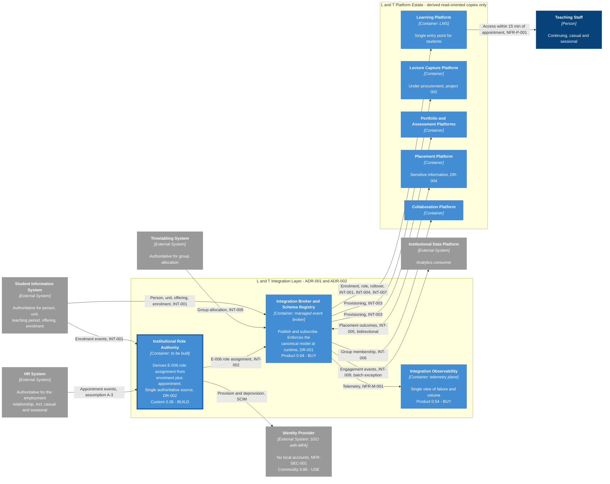

# Architecture Diagram: Integration Target State — L&T Ecosystem

> **Template Origin**: Official | **ArcKit Version**: 6.7.4 | **Command**: `/arckit:diagram`

## Document Control

| Field | Value |
|-------|-------|
| **Document ID** | ARC-001-DIAG-001-v1.0 |
| **Document Type** | Architecture Diagram — C4 Container (Level 2) |
| **Project** | Learning & Teaching Baseline Strategy (Project 001) |
| **Classification** | OFFICIAL |
| **Status** | DRAFT |
| **Version** | 1.0 |
| **Created Date** | 2026-07-28 |
| **Last Modified** | 2026-07-28 |
| **Review Cycle** | On acceptance of ADR-001 or ADR-002, or on WP8 target-state completion |
| **Next Review Date** | 2026-08-27 |
| **Owner** | Sam Okafor, Integration Architect |
| **Reviewed By** | [PENDING] |
| **Approved By** | [PENDING] |
| **Distribution** | Project Team; Digital & IT; Student Administration; Human Resources; Steering Committee |

## Revision History

| Version | Date | Author | Changes | Approved By | Approval Date |
|---------|------|--------|---------|-------------|---------------|
| 1.0 | 2026-07-28 | ArcKit AI | Initial creation from `/arckit:diagram` command — C4 Container view of the integration architecture decided in ADR-001 and ADR-002 | [PENDING] | [PENDING] |

## Purpose

This diagram renders the integration target state that **ADR-001** (integration mediation) and **ADR-002** (authoritative source for institutional role) decided. Until now that architecture existed only as prose, option tables and Y-statements across two decision records.

It has a specific secondary audience. `ARC-001-DATA` records **Student Administration and Human Resources as joint business owners** of institutional role data, and ADR-002 §2.2 flags that **neither function appears in the sixteen-name stakeholder register**. Both are about to be engaged for the first time. This is the artefact that shows them, in one view, what the architecture expects them to publish and why.

**Scope note**: this is a Level 2 (Container) diagram of the **integration layer and its counterparties**. It deliberately does not decompose the platform estate — each platform is a single container here, because at this level what matters is what each *consumes*, not how each is built.

---

## Diagram

**View this diagram**: renders automatically in GitHub markdown and ArcKit Pages; paste into <https://mermaid.live> to edit; VS Code with the Mermaid Preview extension.

### How to Read It

The diagram flows **left to right in four tiers**:

| Tier | Contents | What it establishes |
|------|----------|--------------------|
| 1 — Sources (left) | Student Information System, HR System, Timetabling System | The three systems that genuinely own upstream facts. Note that **two of the three are outside Digital & IT's control** |
| 2 — Integration layer | Role Authority, Broker and Schema Registry, Observability | What ADR-001 and ADR-002 decided to put between sources and consumers |
| 3 — Platform estate | Five consuming platforms | Every one holds a **derived, read-oriented copy only** — DR-002's prohibition made visual |
| 4 — Supporting (right) | Identity Provider, Institutional Data Platform, Teaching Staff | Where access is enforced, where analytics lands, and who benefits |

**Notation**:

- **Thick-bordered container** (Institutional Role Authority) — the one component the University must build. Everything else is bought, consumed as utility, or already exists
- **Grey** — external to the L&T integration boundary
- **Dashed group borders** — architectural boundaries, not deployment boundaries
- **Bidirectional arrow** — appears exactly once, on INT-005. See §Architecture Decisions
- Evolution positions (`Custom 0.36`, `Product 0.64`) are carried from `ARC-001-WARD-001` so the sourcing decision on each container is visible on the diagram itself

---

## Component Inventory

| # | Component | Type | Technology / Status | Responsibility | Evolution | Decision |
|---|-----------|------|--------------------|----------------|-----------|----------|
| 1 | Student Information System | External System | Existing (PeopleSoft) | Authoritative for person, unit, teaching period, unit offering, enrolment | Product 0.56 | Existing |
| 2 | HR System | External System | Existing | Authoritative for the employment relationship, including casual and sessional appointments | Product ~0.56 | Existing |
| 3 | Timetabling System | External System | Existing (Allocate+) | Authoritative for group allocation | Product 0.58 | Existing |
| 4 | **Institutional Role Authority** | Container | **To be built** | Derives E-006 role assignment by composing enrolment and appointment events; publishes as the single authoritative stream | **Custom 0.36** | **BUILD** |
| 5 | Integration Broker and Schema Registry | Container | Managed event broker, AU region — **not yet selected** | Publish/subscribe mediation; enforces the canonical model at runtime; retry, replay, dead-letter | Product 0.64 | BUY |
| 6 | Integration Observability | Container | Telemetry plane | Single view of integration failure, volume and latency | Product 0.54 | BUY |
| 7 | Learning Platform | Container | Blackboard Ultra | Single entry point for students; consumes enrolment, role, hierarchy | Product 0.70 | Existing |
| 8 | Lecture Capture Platform | Container | **Under procurement** — project 002 | Consumes provisioning; publishes engagement events | Product 0.66 | BUY (002) |
| 9 | Portfolio and Assessment Platforms | Container | PebblePad, Turnitin, ExamSoft | Consume provisioning and role | Product 0.60 | Existing |
| 10 | Placement Platform | Container | Sonia | Holds sensitive placement information; exchanges assessment outcomes | Product 0.60 | Existing |
| 11 | Collaboration Platform | Container | Teams / Zoom | Consumes group membership from timetable allocation | Commodity 0.78 | Existing |
| 12 | Identity Provider | External System | Institutional SSO with MFA | Authentication and access enforcement; no local accounts | Commodity 0.86 | USE |
| 13 | Institutional Data Platform | External System | Existing | Analytics consumer; the one accepted batch exception | Product 0.70 | Existing |
| 14 | Teaching Staff | Person | — | Continuing, casual and sessional academics | — | — |

**Element count**: 14 of a 15 maximum for a Container diagram. **One build. One buy. Everything else already exists.**

---

## Architecture Decisions Rendered

### Decisions this diagram makes visible

| # | Decision | Source | How the diagram shows it |
|---|----------|--------|--------------------------|
| D-1 | Mediation is a **central broker**, not point-to-point | ADR-001 Option B | Every source-to-consumer path passes through one container. No platform-to-platform edge exists |
| D-2 | Role has **one authoritative source**, composed from two upstream owners | ADR-002 Option C | Two inbound edges to Role Authority, one outbound. `authoritative_source` takes exactly one value |
| D-3 | Platforms hold **derived copies only** | DR-002 | The estate boundary is labelled with the prohibition; all estate edges are inbound from the broker |
| D-4 | The canonical model is enforced **at runtime**, not by convention | ADR-001 §6.3 | The schema registry sits inside the broker container rather than beside it |
| D-5 | **One** bidirectional flow is permitted, and only one | REQ-028, `ARC-001-DATA` MDM table | INT-005 is the only `<-->` on the diagram |
| D-6 | Batch survives **as a declared exception**, not as a default | INT-009 | The only edge labelled "batch exception" |

### Trade-offs and open items shown honestly

- **The broker is not selected.** ADR-001 Condition 1 requires the Principle 19 test on existing licensed capability first. The container is drawn as a role, not a product, and it should stay that way until that test returns.
- **Assumption A-3 is drawn as an edge.** `HR → Role Authority` carries the label *"Appointment events, assumption A-3"*. ADR-002 records this as the **largest open technical unknown**: whether HR can associate a casual appointment with a unit offering. **If that edge cannot be built, ADR-002's fallback (Option B, split authority) applies and this diagram changes shape.** Drawing an unvalidated assumption as a normal edge would misrepresent the design's confidence.
- **Two of three sources sit outside Digital & IT.** SIS and HR are owned by Student Administration and HR respectively. The diagram makes the organisational dependency visible, which is the point of showing it to those functions.
- **Observability is drawn as a peer container, not a cross-cutting annotation.** This follows `ARC-001-WARD-001`, which positions it separately at [0.30, 0.54]. It is a thing to buy and operate, not a property that emerges.

### What this diagram deliberately omits

| Omitted | Why |
|---------|-----|
| Deployment topology, regions, network zones | No infrastructure decided. The broker is unselected and its hosting model depends on the Principle 19 outcome. A deployment diagram now would be fiction |
| Internal structure of any platform | Level 3 (Component) concern. At Level 2 what matters is what each platform consumes |
| INT-008 sandpit provisioning | Planned for 2027, "not yet designed" per `ARC-001-REQ`. Drawing an undesigned flow would imply a decision that has not been taken |
| Course rollover as a separate container | INT-004 is shown as an edge label on the LMS path. It is a candidate for ADR-003 and may become a container once decided |

---

## Requirements Traceability

| Requirement | Type | Covered by | Coverage |
|-------------|------|-----------|----------|
| INT-001 SIS to learning platform | Integration | SIS → Broker → LMS | ✅ Full |
| INT-002 Institutional role assignment | Integration | SIS + HR → Role Authority → Broker | ✅ Full |
| INT-003 Automated platform provisioning | Integration | Broker → Capture, Portfolio and Assessment | ✅ Full |
| INT-004 Course cloning and rollover | Integration | Broker → LMS (edge label) | ⚠️ Partial — mechanism undecided, ADR-003 candidate |
| INT-005 Placement to gradebook | Integration | Broker ↔ Placement Platform | ✅ Full |
| INT-006 Timetable to collaboration groups | Integration | Timetabling → Broker → Collaboration | ✅ Full |
| INT-007 Institutional hierarchy sync | Integration | Broker → LMS (edge label) | ✅ Full |
| INT-008 Sandpit provisioning | Integration | — | ❌ Not shown — not yet designed |
| INT-009 Analytics to data platform | Integration | Broker → Institutional Data Platform | ✅ Full |
| DR-001 Canonical data model | Data | Schema registry inside the broker | ✅ Full |
| DR-002 Role as a governed entity | Data | Role Authority; estate boundary label | ✅ Full |
| DR-004 Sensitive placement information | Data | Placement Platform annotation | ✅ Full |
| NFR-P-001 15-minute propagation | Performance | Annotated on the LMS-to-staff edge | ✅ Full |
| NFR-SEC-001 SSO with MFA, no local accounts | Security | Identity Provider annotation | ✅ Full |
| NFR-SEC-003 Automated identity lifecycle | Security | Role Authority → Identity Provider, SCIM | ✅ Full |
| NFR-M-001 Integration observability | Maintainability | Observability container | ✅ Full |
| NFR-I-001 Published versioned interfaces | Interoperability | Schema registry | ✅ Full |
| BR-004 Integration fragility eliminated | Business | The diagram as a whole | ✅ Full |

**Coverage**: 16 of 18 fully covered (89%), 1 partial, 1 explicitly out of scope. **9 of 9 integration requirements addressed**, with INT-008 shown as a stated omission rather than silently dropped.

---

## Integration Points

| From | To | Mechanism | Latency SLA | Priority | Current state |
|------|----|-----------|-------------|----------|---------------|
| SIS | Role Authority | Event-driven pub/sub | 15 min | CRITICAL | Nightly batch flat-file |
| HR | Role Authority | Event-driven pub/sub | 15 min | CRITICAL | **Does not exist** |
| SIS | Broker | Event-driven pub/sub | 15 min | CRITICAL | Nightly batch flat-file |
| Timetabling | Broker | Event-driven pub/sub | 15 min | HIGH | Batch export/import |
| Role Authority | Broker | Event-driven pub/sub | 15 min | CRITICAL | **Does not exist** |
| Role Authority | Identity Provider | SCIM | 15 min | CRITICAL | Manual CSV for casuals |
| Broker | LMS | Event-driven pub/sub | 15 min | CRITICAL | Nightly batch |
| Broker | Capture | Event-driven pub/sub | 15 min | CRITICAL | LTI plus manual CSV |
| Broker | Portfolio and Assessment | Event-driven pub/sub | 15 min | CRITICAL | Manual CSV |
| Broker | Placement Platform | Bidirectional, event-driven | 15 min | CRITICAL | **Manual re-keying** |
| Broker | Collaboration | Event-driven pub/sub | 15 min | HIGH | Batch export/import |
| Broker | Institutional Data Platform | Scheduled batch (accepted exception) | Per reporting cycle | MEDIUM | Ad-hoc extracts |

**Two flows on this diagram do not exist in any form today** — both inbound to and outbound from the Role Authority. That is the measure of what ADR-002 actually asks for.

---

## Data Flow and Privacy

**Applicable regime**: Privacy Act 1988 (Cth) and the Australian Privacy Principles, with the OAIC as regulator and the Notifiable Data Breach scheme for breach notification. **UK GDPR and ICO do not apply.**

| Flow | Personal information | Sensitivity | Privacy effect of this architecture |
|------|---------------------|-------------|-------------------------------------|
| SIS → Role Authority → Broker | Identity, enrolment, role | PI | **Removes flat files at rest on shared storage.** Eliminates the copy that currently persists |
| HR → Role Authority | Employment status, appointment dates | PI | New flow. Minimised by design — carries appointment fact and scope, not full HR record |
| Broker ↔ Placement | Grades plus sensitive placement context | **Sensitive information** | **Removes manual re-keying and email circulation** — the estate's clearest privacy defect (R-018) |
| Broker → Capture, Portfolio, Assessment | Identity, role | PI | **Removes CSV cohort extracts handled manually** |
| Broker → Institutional Data Platform | Derived engagement data | PI (derived) | Batch, but now governed — minimisation and retention rules apply (DR-006) |
| Role Authority → Identity Provider | Role assignment | PI by association | **Enables prompt deprovisioning.** Access currently persists up to 24 hours after withdrawal |

**APP 11 effect**: the architecture's principal privacy contribution is not a new control but the **removal of unnecessary copies**. Every flat file, CSV extract and re-keyed grade sheet eliminated is one fewer copy of personal information in existence.

**Highest-value audit target**: E-006 role assignment. `ARC-001-DATA` records change logging with prior value as **required** for this entity, since role change equals access change. The Observability container is where that becomes verifiable.

---

## Security Architecture

| Control | Where enforced | Requirement |
|---------|---------------|-------------|
| Institutional SSO with MFA; no local accounts | Identity Provider | NFR-SEC-001, REQ-031 |
| Automated provisioning and deprovisioning | Role Authority → Identity Provider (SCIM) | NFR-SEC-003, Principle 12 |
| Service-to-service authentication | Broker, institutional standard | ADR-001 |
| Centralised credential and audit position | Broker | NFR-SEC-002 |
| Change logging with prior value | Observability, from E-006 events | NFR-C-003 |

**Essential Eight effect**: this architecture advances *Restrict administrative privileges* from ML1 toward the ML2 target by ending manual role assignment and enabling prompt revocation.

> ⚠️ **Gap carried forward from ADR-002.** NFR-SEC-003's fourth acceptance criterion requires **cross-platform access review from a single view**. No container on this diagram delivers it natively — it would have been native under ADR-002's Option D (Identity Governance product). Under the chosen Option C it requires additional build. **This gap is tracked, not resolved by this diagram.**

---

## Deployment Architecture

**Not applicable at this stage, and deliberately so.**

The broker's hosting model — managed service versus self-hosted, and in which Australian region — depends on the outcome of ADR-001 Condition 1, the Principle 19 test on existing licensed capability. That test has not been run. Residency assessment under DR-005 follows selection.

A deployment diagram should be produced **after** the Principle 19 test returns and the broker is selected. Producing one now would document a decision nobody has made.

---

## Non-Functional Coverage

| NFR | Target | How this architecture achieves it |
|-----|--------|----------------------------------|
| NFR-P-001 Propagation latency | Within 15 minutes | Event-driven pub/sub replaces nightly batch. **Budget must be split per hop** — the Role Authority adds one |
| NFR-A-001 Availability in teaching periods | Per academic period | Broker becomes a shared dependency. ADR-001 Condition 2 requires availability design before first cutover; platforms retain last-known state so degradation is staleness, not access loss |
| NFR-M-001 Observability | Failures detected by monitoring, not user report | Observability container; single plane rather than nine views |
| NFR-M-002 Reproducible automation | Two operators, version control | **ADR-002 Condition 4.** Not a property of the diagram — a condition on the build |
| NFR-I-001 Published versioned interfaces | All integrations | Schema registry enforces at runtime |
| NFR-C-003 Change logging | Prior value retained | E-006 events carry it; Observability retains |

---

## Wardley Map Integration

Positions carried from `ARC-001-WARD-001`. **The sourcing decision on every container matches its evolution stage** — the validation the map itself performs.

| Component | Evolution | Stage | Decision | Consistent? |
|-----------|-----------|-------|----------|-------------|
| Institutional Role Authority | 0.36 | Custom | BUILD | ✅ Custom → build where differentiating |
| Integration Broker | 0.64 | Product | BUY | ✅ Product → buy from market |
| Integration Observability | 0.54 | Product | BUY | ✅ Product → buy |
| Identity Provider | 0.86 | Commodity | USE | ✅ Commodity → consume as utility |
| Collaboration Platform | 0.78 | Commodity | Existing | ✅ Commodity → never build |
| Learning, Capture, Portfolio, Assessment, Placement | 0.60–0.70 | Product | Buy / existing | ✅ Product → buy |

**No commodity component is being built. No custom component is being bought.** Validation passes.

> **Timing caution, from `ARC-001-WARD-001` §5.** The broker is moving 0.64 → 0.76 within 24 months as event brokering is absorbed into cloud platform bundles. Buying a differentiated broker product now is buying at the least favourable point in the evolution curve. This strengthens ADR-001 Condition 1 from a procedural step into a strategic one.

---

## Diagram Quality Gate

Assessed against the nine criteria in the ArcKit diagram quality framework, derived from Purchase et al. on graph drawing aesthetics.

| # | Criterion | Target | Result | Status |
|---|-----------|--------|--------|--------|
| 1 | Edge crossings | Fewer than 5 (13+ elements) | 2 estimated — `SIS → Broker` against `HR → Role Authority`; `Role Authority → Identity Provider` against estate edges | ✅ PASS |
| 2 | Visual hierarchy | Boundaries most prominent | Two dashed subgraph boundaries; the single BUILD container carries a 4px border | ✅ PASS |
| 3 | Grouping | Related elements proximate | Integration layer and platform estate each grouped; sources and supporting systems outside both | ✅ PASS |
| 4 | Flow direction | Consistent throughout | Outer `flowchart LR` across all four tiers; `direction TB` inside each subgraph stacks peers only — no tier reverses | ✅ PASS |
| 5 | Relationship traceability | Each line followable | 14 edges, every one labelled with its INT or NFR reference | ✅ PASS |
| 6 | Abstraction level | One C4 level | Level 2 (Container) throughout. No components, no infrastructure, no schema tables | ✅ PASS |
| 7 | Edge label readability | Legible, non-overlapping | Comma-separated text only; no ` ` in any edge label; longest label 6 words | ✅ PASS |
| 8 | Node placement | No unnecessarily long edges | Tier-ordered declarations; connected nodes in adjacent ranks | ✅ PASS |
| 9 | Element count | Within threshold | **14 of 15** | ✅ PASS |

**All nine pass on the first iteration.** No remediation loop required.

**Accepted trade-offs**, recorded per the quality framework:

1. **Two edge crossings accepted** to preserve the four-tier left-to-right ordering. Eliminating them would require routing SIS's non-role data through the Role Authority, which would be architecturally wrong — the Role Authority derives E-006 only, not enrolment.
2. **`direction TB` inside an `LR` outer flow.** Peers within a tier stack vertically; the tier progression stays horizontal. This is the "LR inside TB" pattern inverted, and it keeps element count within threshold without splitting the diagram.
3. **Element count at 14 of 15** leaves little headroom. Adding INT-008 sandpit provisioning, or decomposing the platform estate further, would require splitting at the integration-layer boundary.

**Format note**: generated as `flowchart LR` with the C4 colour palette applied via `classDef`, rather than Mermaid's native `C4Container` syntax. Native C4 offers no `direction` control, no subgraph nesting and no shape variety, and would not have passed criteria 3, 4 or 8 at this element count. `ARC-002-DIAG-001` uses native `C4Context`; that remains appropriate at Level 1 with fewer elements.

---

## Framework Applicability

**Not applicable**: Technology Code of Practice, GDS Service Standard, GOV.UK services (Notify, Pay, Design System), NCSC Cloud Security Principles and UK GDPR. The University of Funk is an Australian institution.

**Applicable instead**: **Privacy Act 1988** and the Australian Privacy Principles (APP 11 for the access-control effect, APP 8 where any component discloses offshore), the **ASD Essential Eight**, and the University's **RIFF Review** governance.

**AI Playbook**: not applicable. No component on this diagram performs or informs an algorithmic decision about an individual.

---

## Linked Artifacts

| Artifact | Relationship |
|----------|-------------|
| `ARC-001-ADR-001-v1.0` | **Decides the broker.** This diagram renders its Option B outcome |
| `ARC-001-ADR-002-v1.0` | **Decides the role authority.** This diagram renders its Option C outcome, including assumption A-3 as a labelled edge |
| `ARC-001-DATA-v1.0` | Source of E-006, the canonical entities, and the MDM ownership positions |
| `ARC-001-REQ-v1.0` | Source of INT-001 to INT-009 and all NFR annotations |
| `ARC-001-WARD-001-v1.0` | Source of every evolution position and the sourcing validation |
| `ARC-001-RISK-v1.0` | R-006, R-007, R-009, R-018 — the defects this architecture removes |
| `ARC-001-SOBC-v1.0` | The investment case that funds it; this diagram is the technical shape of Option 2 |
| `ARC-002-DIAG-001-v1.0` | Project 002's context diagram. The Lecture Capture Platform container here is its subject |

---

## External References

### Document Register

| Doc ID | Filename | Type | Source Location | Description |
|--------|----------|------|-----------------|-------------|
| SL | system-landscape.md | Foundation artifact | `001-lt-ecosystem/external/` | Current integration inventory and failure modes — the "current state" column in Integration Points |
| PC | privacy-context.md | Compliance input | `001-lt-ecosystem/external/` | Data flows of PIA interest; stale deprovisioning window |
| ADR1 | ARC-001-ADR-001-v1.0.md | ArcKit artifact | `001-lt-ecosystem/decisions/` | Broker decision and conditions |
| ADR2 | ARC-001-ADR-002-v1.0.md | ArcKit artifact | `001-lt-ecosystem/decisions/` | Role authority decision, conditions and assumption A-3 |
| DATA | ARC-001-DATA-v1.0.md | ArcKit artifact | `001-lt-ecosystem/` | E-006, canonical entities, MDM table |
| REQ | ARC-001-REQ-v1.0.md | ArcKit artifact | `001-lt-ecosystem/` | INT and NFR requirements |
| WARD | ARC-001-WARD-001-v1.0.md | ArcKit artifact | `001-lt-ecosystem/wardley-maps/` | Evolution positions and sourcing validation |

### Citations

| Citation ID | Doc ID | Page/Section | Category | Quoted Passage |
|-------------|--------|--------------|----------|----------------|
| SL-C1 | SL | Known integrations | Integration Requirement | "PeopleSoft → Blackboard (user & course lifecycle, institutional roles) / Nightly batch flat-file"; "Echo360 user provisioning / LTI + manual CSV"; "Allocate+ → Blackboard group creation / Batch export/import"; "Sonia ↔ Blackboard grades (placements) / Manual re-keying" |
| PC-C1 | PC | §2 | Compliance Constraint | "Flat-files at rest on shared storage; stale de-provisioning (access persists up to 24h after withdrawal)"; "CSV extracts of the student cohort handled manually" |

### Unreferenced Documents

| Filename | Source Location | Reason |
|----------|-----------------|--------|
| capability-taxonomy.md | `000-global/external/` | Capability categorisation is orthogonal to integration topology; the platform estate is grouped by what it consumes, not by capability category |
| requirements-register.md | `001-lt-ecosystem/external/` | Superseded by ARC-001-REQ, which carries the typed INT identifiers this diagram traces to |
| consultant-brief.md, stakeholders.md | `001-lt-ecosystem/external/` | Not read for this artifact — scope and stakeholder positions taken from the ArcKit artifacts of record |

---

**Generated by**: ArcKit `/arckit:diagram` command
**Generated on**: 2026-07-28
**ArcKit Version**: 6.7.4
**Project**: Learning & Teaching Baseline Strategy (Project 001)
**Model**: Claude Opus 5 (1M context)
**Generation Context**: C4 Container (Level 2) view of the integration architecture decided in ADR-001 and ADR-002, which previously existed only as prose and option tables. Rendered as `flowchart LR` with the C4 colour palette rather than native `C4Container` syntax, because native C4 provides no direction control or subgraph nesting and would not have satisfied quality criteria 3, 4 and 8 at 14 elements. Evolution positions and sourcing decisions carried from ARC-001-WARD-001; current-state comparison from system-landscape.md. All nine quality-gate criteria pass on first iteration with three trade-offs recorded. Deployment view deliberately omitted pending the ADR-001 Condition 1 Principle 19 test.

<!-- arckit-provenance:start -->

## Build Provenance

*Stamped automatically by the ArcKit plugin's `provenance-stamp.mjs` PostToolUse hook. Complements (does not replace) the human-authored footer above. Carries only fields the model can't authoritatively self-report: build context from `.arckit/state.json` and effort levels derived from command frontmatter + the silent-downgrade matrix.*

| Field | Value |
|-------|-------|
| Requested Effort | `high` |
| Effective Effort | _unknown — model not parsed from existing footer_ |
| Stamped at | 2026-07-28T11:11:59.869Z |

<!-- arckit-provenance:end -->
