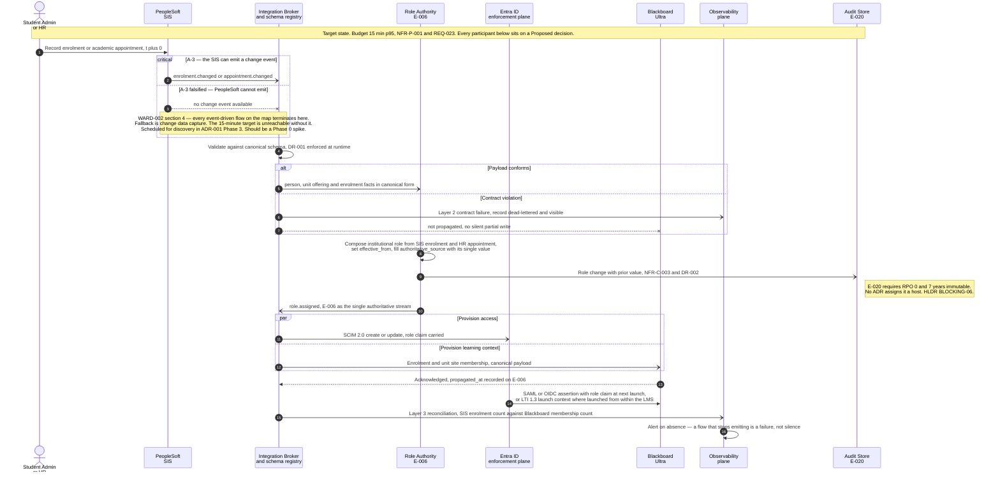
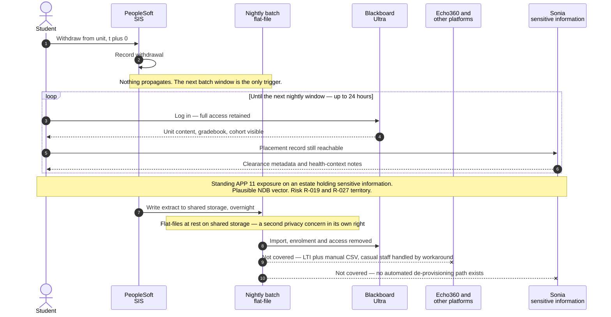
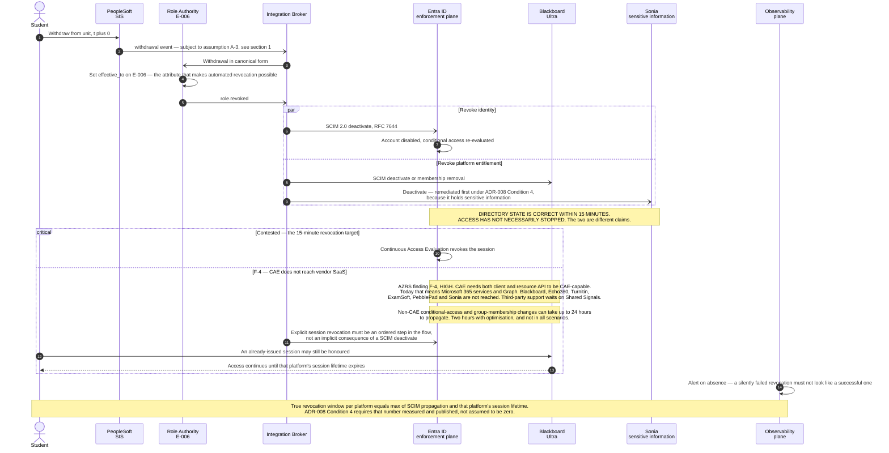
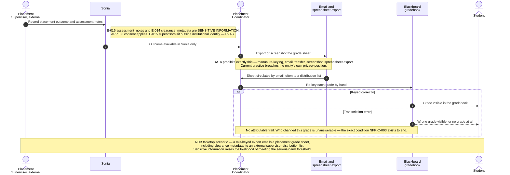
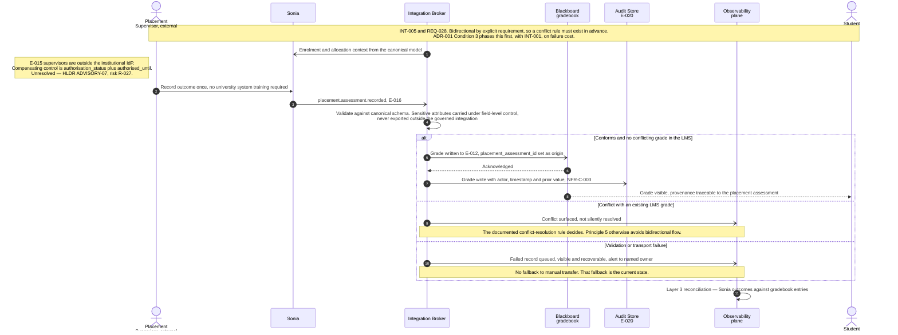

# Architecture Diagram: Lifecycle Sequence Flows — Enrolment, De-provisioning, Placement Grades

> **Template Origin**: Official | **ArcKit Version**: 6.7.5 | **Command**: `/arckit:diagram`

## Document Control

| Field | Value |
|-------|-------|
| **Document ID** | ARC-001-DIAG-002-v1.0 |
| **Document Type** | Architecture Diagram — Sequence (Mermaid) |
| **Project** | Learning & Teaching Baseline Strategy (Project 001) |
| **Classification** | OFFICIAL-SENSITIVE |
| **Status** | DRAFT |
| **Version** | 1.0 |
| **Created Date** | 2026-07-30 |
| **Last Modified** | 2026-07-30 |
| **Review Cycle** | On acceptance of ADR-001, ADR-002 or ADR-008; or on discharge of ADR-008 Condition 4 |
| **Next Review Date** | 2026-08-29 |
| **Owner** | Sam Okafor, Integration Architect (integration flows); Tobias Ohm, Cybersecurity Lead (revocation flow) |
| **Reviewed By** | [PENDING] |
| **Approved By** | [PENDING] |
| **Distribution** | Project Team; Digital & IT; Cybersecurity; Governance — Privacy & Records; Student Administration; Human Resources; Learning Technologies; Placement teams — Health Sciences; Steering Committee |

> **Classification rationale**: this artefact draws the current-state de-provisioning window as an exploitable sequence, and draws the exact path by which sensitive placement information currently leaves the governed estate by email. Both are unremediated. Classified OFFICIAL-SENSITIVE in line with `ARC-001-HLDR-v1.0` and `ARC-001-RISK-v1.0`, and restricted to the delivery and governance group. The target-state diagrams alone would be OFFICIAL.

## Revision History

| Version | Date | Author | Changes | Approved By | Approval Date |
|---------|------|--------|---------|-------------|---------------|
| 1.0 | 2026-07-30 | ArcKit AI | Initial creation from `/arckit:diagram` command — five sequence diagrams across the three lifecycle flows the design turns on, with current-state versus target-state pairs for the two flows that are presently broken | [PENDING] | [PENDING] |

---

## Purpose and Scope

`ARC-001-HLDR-v1.0` §1.2 records that this project has no single HLD — the design is distributed across ten ADRs, a data model and a strategy. One consequence is that **no artefact yet shows a flow end to end**. The decisions state what mediates, what is authoritative and what enforces; none of them draws the sequence in which those things act, or where the clock runs out.

This artefact draws three flows, chosen because the design's value and its failures both concentrate in them:

| # | Flow | Why this one | Diagrams |
|---|------|--------------|----------|
| **1** | **Enrolment to LMS access** — PeopleSoft change, through mediation and canonical model, to Blackboard, with institutional role assigned per ADR-002 | It is the flow REQ-023 / NFR-P-001 puts a 15-minute number on, replacing the nightly batch. It is also the flow that rests on ADR-001 assumption **A-3**, which `ARC-001-WARD-002-v1.0` §4 identifies as load-bearing and untested | §1 target state |
| **2** | **De-provisioning on withdrawal** | The one that currently fails. Access persists **up to 24 hours** after withdrawal [PC-C3]. ADR-008 targets 15-minute revocation via event-driven SCIM 2.0 deactivate. The Azure research finding **F-4** says that target is not reachable through the identity provider alone [AZ-C1] | §2.1 current, §2.2 target |
| **3** | **Placement grade flow** — Sonia to Blackboard gradebook, INT-005 / REQ-028 | Today this is **manual re-keying of sensitive information** [PC-C2], the one flow in the estate whose current mechanism the data model explicitly prohibits, and the subject of the NDB tabletop scenario | §3.1 current, §3.2 target |

**Deliberately not drawn.** Allocate+ group creation (INT-006 / REQ-012) and Echo360 provisioning (INT-003, currently LTI plus manual CSV) were considered and excluded. Both are structurally the same publish-and-subscribe shape as §1 with a different subscriber, and drawing them would add lifelines without adding a finding. Course cloning (INT-004) is excluded for a different reason: `ARC-001-HLDR-v1.0` BLOCKING-08 records that **no ADR governs it**, so there is no decided sequence to draw.

**What these diagrams are not.** They are not implementation specifications. Every target-state flow depends on decisions that are **Proposed, not Accepted** — all ten ADRs are, per `ARC-001-HLDR-v1.0` §4.1. Where a step depends on an undischarged condition or an untested assumption, the diagram says so on the diagram rather than in a caveat underneath it.

---

## 1. Enrolment to LMS Access — Target State

**Flow**: INT-001 (SIS to learning platform) composed with INT-002 (institutional role assignment). **Budget**: 15 minutes p95 end to end (NFR-P-001, from REQ-023). **Replaces**: the nightly batch flat-file.

### 1.1 What this diagram makes visible

1. **The role hop is a real hop in the latency budget.** ADR-002 §6.2 accepts *"an additional hop in the latency budget"*. Drawn out, the 15-minute p95 has to cover SIS emit, broker validate, role composition, publish, and two parallel target writes. No artefact in the project has apportioned that budget across the hops. It is not shown here either, because no decision states it — that absence is the finding.
2. **A-3 is drawn as a `critical` block, not a footnote.** ADR-001 records A-3 as an assumption. `ARC-001-WARD-002-v1.0` §4 escalates it: *"The broker can subscribe to nothing."* If the option branch is the real one, **every subsequent step in this diagram is unreachable on the stated timescale** and the flow degrades to change data capture.
3. **Role composition, not role copying.** ADR-002 chose a dedicated Role Authority precisely because neither PeopleSoft nor HR holds all four role values. Step 8 is the composition, and it is the step that fills `authoritative_source` with exactly one value — the thing that converts `ARC-001-DATA-v1.0` from a model into something implementable.
4. **The audit write has nowhere to land.** Step 9 writes to E-020. `ARC-001-HLDR-v1.0` §6.3 establishes that ADR-006's six in-scope workloads omit an audit store and ADR-006 assumption A-4 declares that list complete. The lifeline is drawn because the design requires the write; the note is on it because the design has not decided where it goes.
5. **Alert-on-absence closes the flow.** ADR-003's central argument is that transport monitoring would have reported "healthy" throughout the estate's entire known defect history. Step 16 is the design's answer, and it is the only step that delivers value against the *current* estate before the broker exists.

---

## 2. De-provisioning on Withdrawal

This is the flow that fails. It is drawn twice.

### 2.1 Current state — access persists up to 24 hours

**Read the loop block.** It is not decoration. For the whole of the batch interval the withdrawn student's credentials work, and the platform holding **sensitive information** — placement clearance metadata and health-context notes [PC-C4] — is one of the platforms they work on. `ARC-001-DATA-v1.0` records E-014 as the entity most likely to be the subject of an eligible data breach assessment. The two `--x` terminations at the end are the second half of the finding: even after the batch runs, the batch does not reach every platform.

### 2.2 Target state — event-driven revocation, and where the 15-minute claim does not hold

### 2.3 The honest reading of §2.2

ADR-008 §3.3 already states the distinction correctly: *"A platform can be perfectly federated, receive a role removal within 15 minutes, and still honour a session issued an hour earlier."* The Azure research then supplies the evidence that turns that caution into a constraint:

| Claim | Status | Evidence |
|-------|--------|----------|
| Directory and entitlement state corrected within 15 minutes of withdrawal | **Achievable** — this is what SCIM 2.0 push plus an event-driven role authority delivers | ADR-008 Option A; INT-002 SLA |
| Live sessions on vendor SaaS terminated within 15 minutes | **Not achievable through the identity provider alone.** CAE requires both client and resource API to be CAE-capable; today that is Microsoft 365 and Graph | [AZ-C1] finding F-4, rated HIGH |
| Conditional-access or group-membership change effective within 15 minutes | **Not reliably.** Up to 24 hours, reduced to about 2 hours by optimisation that does not cover all scenarios | [AZ-C1] |
| Immediate revocation where required | **Achievable, but only as an explicit step.** `Revoke-MgUserSignInSession` must be invoked as part of the de-provisioning flow — it is not implicit in a SCIM deactivate | [AZ-C1] |

**Consequence for the design, stated plainly.** The target-state flow is still a very large improvement on §2.1 — a 24-hour architectural property becomes a per-platform measured residual. But **ADR-008 must not be read as delivering 15-minute revocation estate-wide**, and `ARC-001-HLDR-v1.0` should carry this as a named advisory alongside BLOCKING-05. The controls that actually close the gap are ADR-008 Condition 4 (measure and publish the per-platform residual session window, sensitive-information platforms first) and an explicit session-revocation call in the flow. Condition 4 is therefore not a documentation exercise; on this evidence it is **the primary control**.

---

## 3. Placement Grade Flow — INT-005

### 3.1 Current state — manual re-keying of sensitive information

### 3.2 Target state — governed, bidirectional, attributable

### 3.3 What changes between 3.1 and 3.2

| Property | Current | Target |
|----------|---------|--------|
| Sensitive information leaves the governed estate | **Yes** — email, screenshot, spreadsheet [PC-C2] | No — field-level control, no export outside the governed integration |
| Attribution of a grade change | None | E-020 write with actor, timestamp and prior value |
| Failure mode | Silent transcription error | Queued, visible, alerted, recoverable |
| Manual fallback | Is the mechanism | Explicitly prohibited (INT-005 error handling) |
| External supervisor authentication | Outside the IdP, unresolved | Still outside the IdP — `authorised_until` is the compensating control, and it is **not yet designed** |

The last row is the honest one. §3.2 fixes the transport and the audit trail. It does **not** fix external supervisor authentication, which `ARC-001-HLDR-v1.0` carries as ADVISORY-07 against risk R-027, and which must be resolved before INT-005 design closes.

---

## Legend

| Notation | Meaning |
|----------|---------|
| `actor` | A human participant |
| `participant` | A system, service or store |
| `->>` solid arrow | Synchronous or request-style call |
| `-)` open arrow | Asynchronous event publication |
| `-->>` dotted arrow | Response or acknowledgement |
| `--x` cross | Flow terminates — not delivered, not covered |
| `critical` / `option` | A step that must succeed, with the named circumstance in which it does not. Used for A-3 and for the contested 15-minute revocation target |
| `alt` / `else` | Alternative paths |
| `par` / `and` | Steps that proceed in parallel |
| `loop` | Repetition over an interval |
| UPPERCASE in a note | A claim the reader should not skim past |
| `[PC-Cn]`, `[SL-Cn]`, `[AZ-Cn]` | Citation to an external or research source — see External References |

---

## Component Inventory

| Component | Type | Technology | Responsibility | Evolution Stage | Build/Buy |
|-----------|------|------------|----------------|-----------------|-----------|
| PeopleSoft | External system | Oracle PeopleSoft Campus Solutions | Authoritative for student, course, enrolment (TC-3) | Product 0.65 | Incumbent — retained |
| Integration Broker and schema registry | Container | Managed iPaaS or event broker, Australian region | Mediation, canonical schema enforced at runtime, retry, replay, dead-letter | Product 0.65 | BUY — ADR-001 Option B, gated on Principle 19 test |
| Role Authority | Container | Thin service on the mediation layer | Composes E-006 from SIS enrolment and HR appointment; sets `effective_from` / `effective_to` | Custom 0.35 | BUILD — ADR-002 Option C, accepted against a poor build track record (R-007) |
| Entra ID | Container | Microsoft Entra ID — SAML 2.0, OIDC, SCIM 2.0, Conditional Access, LTI 1.3 launch | Single authentication, MFA and session authority | Commodity 0.78 | USE — ADR-008 Option A, configuration of licensed capability |
| Blackboard Ultra | External system | Blackboard Ultra SaaS | Learning platform; consumes enrolment, role, grade | Product 0.70 | Incumbent |
| Sonia | External system | Sonia SaaS, AU-hosted | Placement management; holds **sensitive information** (E-014, E-016) | Product 0.60 | Incumbent |
| Echo360 | External system | Echo360 SaaS | Lecture capture; currently LTI plus manual CSV | Product 0.65 | Incumbent — rationalisation candidate (R-001) |
| Observability plane | Container | ADR-003 three-layer plane — transport, contract, reconciliation | Alert-on-absence, failed-record visibility, reconciliation | Product 0.60 | BUY / USE — ADR-003, backend gated on Principle 19 test |
| Audit Event Store (E-020) | Data store | **Undecided** | Immutable evidentiary record, ~5M events/yr, 7 years, RPO 0 | Commodity 0.80 | **NO DECISION — HLDR BLOCKING-06** |
| Nightly batch flat-file | Current-state artefact | Flat file on shared storage | Being replaced. Drawn only in §2.1 | Commodity — legacy | RETIRE |
| Email / spreadsheet export | Current-state artefact | Unmanaged | Being replaced. Drawn only in §3.1 | n/a | RETIRE — prohibited by `ARC-001-DATA-v1.0` |

**Evolution stage legend**: Genesis 0.0–0.25 · Custom 0.25–0.50 · Product 0.50–0.75 · Commodity 0.75–1.0. Positions carried from `ARC-001-WARD-001-v1.0` and `ARC-001-WARD-002-v1.0`.

---

## Architecture Decisions Rendered

**Decision 1 — ADR-001: central integration broker holding the canonical schema**

- **Context**: nine point-to-point and manual integrations; a canonical model that cannot be enforced at runtime.
- **Rendered as**: the `BRK` lifeline in §1, §2.2 and §3.2, and specifically the `BRK->>BRK: Validate against canonical schema` step — the runtime enforcement point for DR-001.
- **Consequence visible in the diagrams**: every flow now passes through one participant. That is the shared runtime dependency ADR-001 accepted, and it is why NFR-A-001 matters to all three flows at once.

**Decision 2 — ADR-002: a dedicated Institutional Role Authority as the single source of E-006**

- **Rendered as**: the `IRA` lifeline, and the composition step that fills `authoritative_source` with exactly one value.
- **Consequence visible in the diagrams**: `effective_to` in §2.2 step 4 is the single attribute on which automated revocation depends. Drawing it makes the ADR-002 to ADR-008 dependency concrete rather than asserted.

**Decision 3 — ADR-008: institutional identity provider as the single enforcement plane**

- **Rendered as**: the `IDP` lifeline; SCIM 2.0 deactivate in §2.2; SAML/OIDC and LTI 1.3 launch in §1.
- **Consequence visible in the diagrams**: the `critical` block in §2.2 is the honest form of ADR-008 §3.3. It shows that a correct directory state and an ended session are two different achievements, and that only the first is delivered within 15 minutes.

**Decision 4 — ADR-003: three-layer observability with alert-on-absence**

- **Rendered as**: the `OBS` lifeline terminating every flow, and the reconciliation steps.
- **Consequence visible in the diagrams**: without the final step, each diagram would be a happy path. With it, the absence of a message is itself a detectable event.

---

## Requirements Traceability

| Requirement | Description | Diagram | Coverage |
|-------------|-------------|---------|----------|
| REQ-023 / INT-001 / NFR-P-001 | SIS to LMS within 15 minutes of change | §1 | ⚠️ Drawn, but gated on assumption A-3 and with no per-hop budget apportioned |
| REQ-024 / INT-002 / DR-002 | Institutional role from a single authoritative source | §1 | ✅ Drawn end to end including audit of the role change |
| REQ-025 / INT-003 | Automated provisioning, no manual CSV, casuals on the same path | §1 (Entra/SCIM path), §2.1 (`--x ECHO` shows the current gap) | ⚠️ Partial — Echo360 subscriber not separately drawn |
| REQ-031 / NFR-SEC-001 | SSO with MFA, no local accounts | §1 step 13, §2.2 | ⚠️ Two local-account platforms remain unnamed — HLDR BLOCKING-05 |
| NFR-SEC-003 | Automated identity lifecycle, prompt de-provisioning | §2.2 | ⚠️ Directory state yes; session termination contested by [AZ-C1] F-4 |
| REQ-028 / INT-005 / FR-018 | Placement grades bidirectional with the gradebook | §3.2 | ✅ Drawn with conflict rule and no manual fallback |
| NFR-C-003 | Audit logging with actor, timestamp, prior value | §1 step 9, §3.2 | ❌ Logically complete, physically homeless — BLOCKING-06 |
| DR-001 | Canonical model conformance | §1 validate step; §3.2 validate step | ✅ Enforced at runtime by construction |
| DR-004 | Sensitive-information access logging and handling | §3.1 (breach), §3.2 (remedy) | ⚠️ Target state correct; audit store unhosted |
| NFR-M-001 / Principle 17 | Integration observability, failed revocation visible | All five diagrams | ✅ |
| NFR-A-001 | 99.9% availability in teaching periods | Implied by the single `BRK` and `IDP` lifelines | ⚠️ Out of scope for a sequence view; see HLDR §8.2 |
| Principle 1 / FR-007 | Single learning entry point, no re-authentication | §1 step 13 LTI 1.3 launch context | ✅ |

**Coverage summary**: 12 requirements or principles touched — 5 fully covered, 6 partial, 1 not covered (NFR-C-003, on hosting rather than on logic).

---

## Integration Points

| Integration | Interface | Protocol / standard | Direction | SLA | Current mechanism |
|-------------|-----------|--------------------|-----------|-----|-------------------|
| INT-001 | PeopleSoft to broker | Change events (A-3 dependent), else CDC | One-way | 15 min | Nightly batch flat-file [SL-C1] |
| INT-002 | Role Authority to all platforms | Publish/subscribe, canonical E-006 | One-way | 15 min | Role assignment failures documented [SL-C1] |
| INT-003 | Broker to Echo360, PebblePad, assessment platforms | SCIM 2.0, LTI 1.3 | One-way | 15 min | LTI plus manual CSV [SL-C2] |
| INT-005 | Sonia to and from Blackboard gradebook | Publish/subscribe with conflict rule | **Bidirectional** | 15 min | Manual re-keying [PC-C2] |
| Identity lifecycle | Role Authority to Entra ID to platforms | SCIM 2.0 (RFC 7643/7644), SAML 2.0, OIDC | One-way push | 15 min directory state; session window per platform | Nightly batch, up to 24 h [PC-C3] |

---

## Data Flow and Privacy Position

| Flow | Personal information | Class | Handling in target state |
|------|---------------------|-------|--------------------------|
| §1 enrolment and role | Student identity, enrolment, role | PI, CONFIDENTIAL | Canonical payload only, minimised to the attributes the subscriber needs |
| §2.2 revocation | Identity, entitlement | PI | Deactivate signal only, no content |
| §3.2 placement grade | Grades **plus placement assessment notes and clearance metadata** | **Sensitive information** | Field-level access control, no export outside the governed integration, APP 3.3 consent recorded, encryption in transit and at rest |
| Audit trail | Actor identity, prior value | OFFICIAL-SENSITIVE | E-020, immutable to all roles including administrators, 7 years, access to the log itself audited |

**Privacy Impact Assessment**: **REQUIRED** — `ARC-001-DATA-v1.0` records a PIA as required for E-014 and E-016. Owner: Eleanor Frame, Privacy & Records Officer.

**Australian framework basis**: Privacy Act 1988 (Cth) and the Australian Privacy Principles — APP 3.3 (consent for sensitive information), APP 6 (use and disclosure limited to the placement purpose), APP 11 (security, and the §2.1 exposure), Part IIIC (NDB scheme). ASD Essential Eight ML2 target by end 2027. WCAG 2.2 AA for the authentication journey.

> **Not applicable**: UK Government frameworks — GDS Service Standard, Technology Code of Practice, UK GDPR, NCSC CAF, GOV.UK Notify / Pay / One Login. The University of Funk is a fictional Australian private-sector higher-education institution. Stated explicitly so a later reader does not read their absence as an omission, consistent with `ARC-001-HLDR-v1.0` §1.3.

---

## Security Architecture

| Control | Type | Where in the diagrams | Implementation |
|---------|------|----------------------|----------------|
| Single authentication and MFA authority | Preventive | §1 step 13, §2.2 | Entra ID, conditional access, MFA enforced once at the provider |
| Launch context preservation | Usability / preventive | §1 step 13 | LTI 1.3 — no re-authentication between platforms (Principle 1) |
| Event-driven deactivation | Corrective | §2.2 par block | SCIM 2.0 deactivate driven from `effective_to` on E-006 |
| Explicit session revocation | Corrective | §2.2 `critical` block | Must be an ordered step. Not implicit in a SCIM deactivate [AZ-C1] |
| Residual session window measurement | Detective | §2.2 closing note | ADR-008 Condition 4 — per platform, published, sensitive-information platforms first |
| Runtime schema enforcement | Preventive | §1 and §3.2 validate steps | Schema registry, DR-001 |
| Immutable audit of grade and role change | Detective | §1 step 9, §3.2 | E-020 — **host undecided** |
| Alert on absence | Detective | All five diagrams, final step | ADR-003 Layer 2 and Layer 3 |
| Field-level control on sensitive attributes | Preventive | §3.2 validate step | No indexing of sensitive attributes, no export outside the governed integration |

**Known residual exposures drawn on the diagrams**: two unnamed local-account platforms (BLOCKING-05); external placement supervisors outside the IdP (ADVISORY-07, R-027); per-platform session lifetimes on vendor SaaS (ADR-008 Condition 4 and [AZ-C1] F-4); the unhosted audit store (BLOCKING-06).

---

## Non-Functional Coverage

| NFR | Target | How the sequence addresses it | Assessment |
|-----|--------|-------------------------------|------------|
| NFR-P-001 | 15 min p95 propagation | Event-driven throughout; batch removed | ⚠️ Gated on A-3; per-hop budget not apportioned by any decision |
| NFR-SEC-003 | Prompt automated de-provisioning | §2.2, `effective_to` plus SCIM deactivate | ⚠️ Directory state yes; session termination platform-dependent |
| NFR-C-003 | Audit with actor, timestamp, prior value | Explicit audit writes in §1 and §3.2 | ❌ No host assigned to E-020 |
| NFR-M-001 | Integration observability | `OBS` terminates every flow; alert on absence | ✅ |
| NFR-A-001 | 99.9% in teaching periods | Not addressed by a sequence view — every flow now depends on `BRK` and `IDP` | ⚠️ Concentration risk made visible; treatment sits in ADR-005 / ADR-008 §7.2 |
| NFR-U-002 | WCAG 2.2 AA | MFA method choice on the §1 step 13 path | ⚠️ No decision owns verification of the existing estate |

---

## Diagram Quality Gate

Assessed per diagram; the table reports the worst case across the five.

| # | Criterion | Target | Result | Status |
|---|-----------|--------|--------|--------|
| 1 | Edge crossings | 0 for sequence diagrams (lifelines cannot cross by construction) | 0 | ✅ PASS |
| 2 | Visual hierarchy | The contested or broken step is the most prominent element | `critical` / `loop` blocks and uppercase notes carry §2.1 and §2.2 | ✅ PASS |
| 3 | Grouping | Related steps are proximate | `par`, `alt` and `critical` blocks group each phase | ✅ PASS |
| 4 | Flow direction | Consistent top-to-bottom | TB throughout, inherent to sequence diagrams | ✅ PASS |
| 5 | Relationship traceability | Each message followable source to target | Yes — `autonumber` on all five diagrams | ✅ PASS |
| 6 | Abstraction level | One level per diagram | Container-level participants only; no internal components | ✅ PASS |
| 7 | Edge label readability | Labels legible, no overlap | Long text moved into `Note` blocks rather than message labels | ✅ PASS |
| 8 | Node placement | No unnecessarily long edges | Participants declared in flow order: source, mediation, authority, targets, observability | ✅ PASS |
| 9 | Element count | 8 lifelines maximum | §1 = 8 · §2.1 = 6 · §2.2 = 8 · §3.1 = 6 · §3.2 = 7 | ✅ PASS (two at threshold) |

**Iterations**: 1. All nine criteria pass.

**Accepted trade-offs, recorded explicitly**:

1. **§1 and §2.2 sit exactly at the 8-lifeline threshold.** The candidate for removal in both was the `OBS` lifeline. It is retained because ADR-003's strongest argument is that a flow which stops emitting must be detectable, and a sequence diagram that omits the detection step reads as a happy path. Removing `AUD` was rejected for the same reason — the audit write is precisely the step with no home, and deleting the lifeline would hide `ARC-001-HLDR-v1.0` BLOCKING-06.
2. **Five diagrams rather than three.** The de-provisioning and placement flows are drawn current-state and target-state because in both cases the change is the artefact's point. A single target-state diagram would have made the design look like a greenfield build rather than a remediation.
3. **Echo360 and Allocate+ are not drawn.** They are structurally the §1 shape with a different subscriber. Their absence is a scoping choice, not an oversight — see Purpose and Scope.

---

## Wardley Map Integration

**Related maps**: `wardley-maps/ARC-001-WARD-001-v1.0.md`, `wardley-maps/ARC-001-WARD-002-v1.0.md`

| Component | Evolution | Stage | Strategic action | Consistent? |
|-----------|-----------|-------|------------------|-------------|
| Federation, MFA, SCIM, LTI | 0.78 | Commodity | **USE** — configure licensed capability | ✅ Nothing commodity is being built |
| Integration broker | 0.65 | Product | **BUY** | ✅ Mature multi-vendor market |
| Observability plane | 0.60 | Product | **BUY / USE** | ✅ |
| Role Authority | 0.35 | Custom | **BUILD** | ✅ Correct stage, but see R-007 — the university has previously failed to sustain builds |
| SIS lifecycle feed | 0.567 | Product-ish | Replace batch with change events | ⚠️ WARD-002 ranks this the highest-risk flow on the map; A-3 is why |
| Institutional hierarchy sync (INT-007) | 0.18 | Custom, fully manual | Not drawn here | ⚠️ WARD-002 measures R = 0.722, second-highest, against a MEDIUM priority — HLDR BLOCKING-07 |

**Strategic alignment**:

- [x] All BUILD decisions align with Genesis/Custom stage
- [x] All BUY decisions align with Product stage
- [x] All USE decisions align with Commodity stage
- [x] No commodity components being built
- [x] No Genesis components being bought

---

## Linked Artifacts

| Artefact | Path |
|----------|------|
| HLD Review | `projects/001-lt-ecosystem/ARC-001-HLDR-v1.0.md` |
| Data model | `projects/001-lt-ecosystem/ARC-001-DATA-v1.0.md` |
| Requirements | `projects/001-lt-ecosystem/ARC-001-REQ-v1.0.md` |
| ADR-001 Integration mediation | `projects/001-lt-ecosystem/decisions/ARC-001-ADR-001-v1.0.md` |
| ADR-002 Role authority | `projects/001-lt-ecosystem/decisions/ARC-001-ADR-002-v1.0.md` |
| ADR-008 Identity and access enforcement | `projects/001-lt-ecosystem/decisions/ARC-001-ADR-008-v1.0.md` |
| Wardley — integration value chain | `projects/001-lt-ecosystem/wardley-maps/ARC-001-WARD-002-v1.0.md` |
| Azure research | `projects/001-lt-ecosystem/research/ARC-001-AZRS-v1.0.md` |
| C4 Container diagram | `projects/001-lt-ecosystem/diagrams/ARC-001-DIAG-001-v1.0.md` |

**Recommended follow-on actions**:

1. Raise the F-4 finding in §2.3 as a named advisory in `ARC-001-HLDR-v1.0` — the 15-minute revocation claim in ADR-008 needs qualifying before the September business case repeats it.
2. Apportion the NFR-P-001 15-minute budget across the §1 hops. No decision does this today.
3. Add the A-3 change-event spike to ADR-001 Phase 0, per `ARC-001-WARD-002-v1.0` recommendation 1.
4. Resolve E-020 hosting (BLOCKING-06) — two diagrams here write to a store with no home.

---

## View This Diagram

- **GitHub**: renders automatically in markdown preview
- **VS Code**: install the Mermaid Preview extension
- **Online**: https://mermaid.live — paste any of the five code blocks above
- **Export**: use mermaid.live to export PNG, SVG or PDF

---

## External References

### Document Register

| Doc ID | Filename | Type | Source Location | Description |
|--------|----------|------|-----------------|-------------|
| PC | privacy-context.md | External context | `001-lt-ecosystem/external/` | Personal information inventory, data flows of PIA interest, Essential Eight self-assessment, NDB tabletop scenario |
| SL | system-landscape.md | External context | `001-lt-ecosystem/external/` | Capability categorisation and the nine known integrations with current mechanism and known issues |
| AZ | ARC-001-AZRS-v1.0.md | Research | `001-lt-ecosystem/research/` | Azure service research; Microsoft Learn findings including F-4 on Continuous Access Evaluation reach |

### Citations

| Citation ID | Doc ID | Page/Section | Category | Quoted Passage |
|-------------|--------|--------------|----------|----------------|
| PC-C2 | PC | §2, Sonia to Blackboard grades | Current State | "Grades + sensitive placement context / Manual re-keying / Human error; screenshots/exports circulating via email" |
| PC-C3 | PC | §2, PeopleSoft to Blackboard | Current State | "Nightly batch flat-file / Flat-files at rest on shared storage; stale de-provisioning (access persists up to 24h after withdrawal)" |
| PC-C4 | PC | §1, class 5 | Data Classification | "Placement records (incl. clearance metadata, health-context notes) / **Sensitive information** / Sonia / AU" |
| SL-C1 | SL | Known integrations, rows 1 and 4 | Current State | "PeopleSoft → Blackboard (user & course lifecycle, institutional roles) / Nightly batch flat-file / Fragile; role assignment failures; no intra-day sync" |
| SL-C2 | SL | Known integrations, row 2 | Current State | "Echo360 user provisioning / LTI + manual CSV / Manual workaround for casual academic staff" |
| AZ-C1 | AZ | Findings, F-4 (HIGH) | Technical Limitation | "Continuous Access Evaluation does not reach vendor SaaS, and non-CAE policy/group changes take up to 24 hours to propagate (2 hours with optimisation, and not in all scenarios) ... ADR-008's 15-minute revocation target is not achievable through Entra alone for Blackboard, Echo360, Turnitin, ExamSoft, PebblePad or Sonia ... `Revoke-MgUserSignInSession` must be invoked explicitly as part of the deprovisioning flow — it is not implicit in a SCIM deactivate" |

### Unreferenced Documents

| Filename | Source Location | Reason |
|----------|-----------------|--------|
| consultant-brief.md, stakeholders.md, requirements-register.md | `001-lt-ecosystem/external/` | Outside the input set for this artefact. Requirement identifiers taken from `ARC-001-REQ-v1.0`, which carries the typed INT and NFR forms these diagrams trace to |

---

**Generated by**: ArcKit `/arckit:diagram` command
**Generated on**: 2026-07-30
**ArcKit Version**: 6.7.5
**Project**: Learning & Teaching Baseline Strategy (Project 001)
**Model**: Claude Opus 5
**Generation Context**: Five Mermaid sequence diagrams across three lifecycle flows — enrolment to LMS access (INT-001 composed with INT-002), de-provisioning on withdrawal (current and target), and the placement grade flow (current and target). Flows selected for the failure points they expose rather than for coverage: the current-state pair are drawn because both are presently broken, and the target-state de-provisioning diagram is qualified against Azure research finding F-4, which contradicts ADR-008's 15-minute revocation target for vendor SaaS. Sources: ARC-001-HLDR-v1.0, ARC-001-DATA-v1.0, ADR-001, ADR-002, ADR-008, ARC-001-WARD-002-v1.0, ARC-001-AZRS-v1.0, external/system-landscape.md, external/privacy-context.md. Run non-interactively — output format defaulted to Mermaid (the Recommended option); diagram type supplied as an argument. All nine quality-gate criteria pass on the first iteration with three trade-offs recorded. No UK Government framework applied — the institution is Australian private-sector higher education.

<!-- arckit-provenance:start -->

## Build Provenance

*Stamped automatically by the ArcKit plugin's `provenance-stamp.mjs` PostToolUse hook. Complements (does not replace) the human-authored footer above. Carries only fields the model can't authoritatively self-report: build context from `.arckit/state.json` and effort levels derived from command frontmatter + the silent-downgrade matrix.*

| Field | Value |
|-------|-------|
| Requested Effort | `high` |
| Effective Effort | _unknown — model not parsed from existing footer_ |
| Stamped at | 2026-07-30T00:11:37.675Z |

<!-- arckit-provenance:end -->
