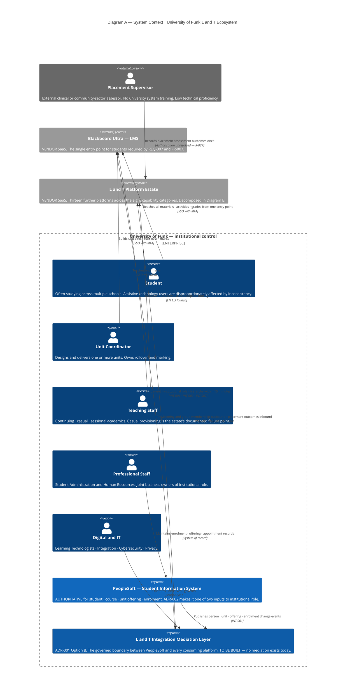
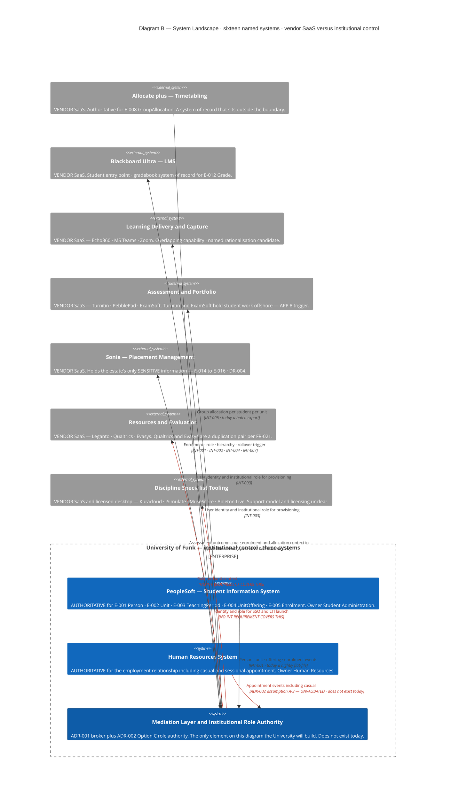
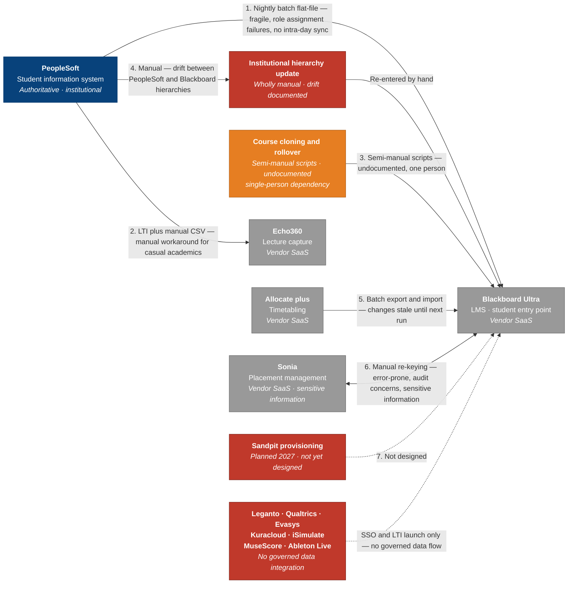

# Architecture Diagram: System Context — The L&T Ecosystem, Its People and Its Boundary

> **Template Origin**: Official | **ArcKit Version**: 6.7.5 | **Command**: `/arckit:diagram`

## Document Control

| Field | Value |
|-------|-------|
| **Document ID** | ARC-001-DIAG-003-v1.0 |
| **Document Type** | Architecture Diagram — C4 System Context (Level 1) |
| **Project** | Learning & Teaching Baseline Strategy (Project 001) |
| **Classification** | OFFICIAL |
| **Status** | DRAFT |
| **Version** | 1.0 |
| **Created Date** | 2026-07-30 |
| **Last Modified** | 2026-07-30 |
| **Review Cycle** | On acceptance of ADR-001 or ADR-002, on closure of HLDR BLOCKING-01, or on WP2 landscape validation |
| **Next Review Date** | 2026-08-29 |
| **Owner** | Sam Okafor, Integration Architect |
| **Reviewed By** | [PENDING] |
| **Approved By** | [PENDING] |
| **Distribution** | Project Team; Steering Committee; Education Committee; Digital & IT; Student Administration; Human Resources; Student Guild |

## Revision History

| Version | Date | Author | Changes | Approved By | Approval Date |
|---------|------|--------|---------|-------------|---------------|
| 1.0 | 2026-07-30 | ArcKit AI | Initial creation from `/arckit:diagram` command — C4 System Context (Level 1) view of the L&T ecosystem: actors, institutional boundary, vendor-SaaS split, and the current-state integration overlay | [PENDING] | [PENDING] |

---

## Purpose

`ARC-001-DIAG-001-v1.0` renders the **target-state integration architecture** at C4 Level 2 — the containers ADR-001 and ADR-002 decided, and how data will move between them. It is a technical artefact for a technical audience.

**This document sits one level above it, and answers three questions DIAG-001 does not ask:**

1. **Who actually uses this ecosystem, and where does each of them touch it?** Six internal actor types plus one external one. DIAG-001 shows exactly one person — Teaching Staff — because at Level 2 the actors are not the subject.
2. **Where does the University of Funk's control stop?** Fourteen of the sixteen systems named in `external/system-landscape.md` are vendor SaaS. That distinction determines what the architecture can *decide* versus what it can only *require by contract*, and it runs through every ADR in the project.
3. **What does the current state actually look like?** DIAG-001 draws clean arrows because it draws the future. Diagram C below draws the present: seven integrations, four of them manual or semi-manual, and seven named platforms with no integration at all.

**Primary audiences.** The Steering Committee and Education Committee (Diagram A — no technical vocabulary required); Student Administration and Human Resources, both joint business owners of E-006 and neither on the stakeholder register (Diagram B — where their systems sit); and the WP2 landscape validation (Diagram C — the baseline to validate against).

**Scope note.** Level 1 throughout Diagrams A and B: systems as single boxes, no containers, no technology-internal detail. Diagram C is a declared non-C4 supplement — see §Diagram C.

---

## Diagram

### Diagram A — Actor Context: who uses the ecosystem and where the boundary falls

### Diagram B — System Landscape: the estate, the sources, and the control boundary

### Diagram C — Current-state overlay: the estate as it actually is

> **Declared non-C4 supplement.** Diagrams A and B are C4 Level 1. Diagram C is a current-state integration map rendered as a Mermaid flowchart, because the fragility it exists to show requires line-style and colour semantics that native `C4Context` cannot express. It mixes no C4 element types and is assessed separately in the quality gate.

**View these diagrams**:

- **GitHub**: renders automatically in markdown preview
- **VS Code**: install the Mermaid Preview extension
- **Online**: <https://mermaid.live> — paste any single code block
- **Export**: use mermaid.live to export PNG/SVG/PDF

---

## How to Read These Diagrams

| Notation | Meaning |
|----------|---------|
| **Solid box inside the boundary** | System under University of Funk institutional control — the architecture can *decide* its behaviour |
| **Grey box outside the boundary** | Vendor SaaS — the architecture can only *require* behaviour, by contract and configuration |
| **Dark blue box** | The mediation layer and role authority. The only thing on Diagram B the University will build. It does not exist today |
| **Dashed grey person** | External actor with no university identity — see R-027, unresolved |
| **Red edge label (Diagram B)** | A flow that is either unvalidated or ungoverned. Three of nine |
| **Bidirectional arrow** | Appears exactly once per diagram, on INT-005. Every other flow is one-way out |
| **Red node (Diagram C)** | Wholly manual, undesigned, or entirely unintegrated |
| **Amber node (Diagram C)** | Semi-manual with a documented single-person dependency |

**Reading order**: A establishes who and where the boundary is. B decomposes what sits on each side of that boundary. C shows what exists today, and is the honest baseline against which DIAG-001's target state should be read.

---

## Component Inventory

Sixteen named systems from `external/system-landscape.md` [SL-C1], plus five internal actor groups, one external actor, and the mediation layer. Evolution positions carried from `ARC-001-WARD-001` where `ARC-001-DIAG-001` records them; marked `—` where no position has been assessed.

| # | Element | Type | Control | Technology / Status | Responsibility | Evolution | Decision |
|---|---------|------|---------|--------------------|----------------|-----------|----------|
| 1 | Student | Person | — | — | Reaches materials, submits, sees grades. Frequently studies across schools | — | — |
| 2 | Unit Coordinator | Person | — | — | Designs, delivers, rolls over and marks units | — | — |
| 3 | Teaching Staff | Person | — | — | Continuing, casual and sessional academics. Casual provisioning is the documented defect | — | — |
| 4 | Professional Staff | Person | — | — | Student Administration and HR — joint business owners of E-006 | — | — |
| 5 | Digital and IT | Person | — | — | Operates, observes and governs the estate | — | — |
| 6 | Placement Supervisor | Person (external) | Outside | — | Records placement assessment outcomes once, without system training | — | — |
| 7 | PeopleSoft | System | **Institutional** | Existing SIS | Authoritative for E-001 to E-005 | Product 0.56 | Existing |
| 8 | Human Resources System | System | **Institutional** | Existing | Authoritative for the employment relationship incl. casual appointment | Product ~0.56 | Existing |
| 9 | **Mediation Layer and Role Authority** | System | **Institutional** | **Does not exist** — broker unselected | Runtime enforcement of the canonical model; derives and publishes E-006 | Product 0.64 / **Custom 0.36** | **BUY + BUILD** |
| 10 | Blackboard Ultra | System | Vendor SaaS | In use | LMS; student entry point; gradebook system of record for E-012 | Product 0.70 | Existing |
| 11 | Allocate plus | System | Vendor SaaS | In use | Authoritative for E-008 GroupAllocation | Product 0.58 | Existing |
| 12 | Echo360 · MS Teams · Zoom | System group | Vendor SaaS | In use | Learning delivery and capture. Overlapping — rationalisation candidate | Product 0.66 – Commodity 0.78 | Existing |
| 13 | Turnitin · PebblePad · ExamSoft | System group | Vendor SaaS | In use | Assessment, similarity detection, portfolio, secure examination | Product 0.60 | Existing |
| 14 | Sonia | System | Vendor SaaS | In use | Placement management. Holds the estate's only sensitive information | Product 0.60 | Existing |
| 15 | Leganto · Qualtrics · Evasys | System group | Vendor SaaS | In use | Reading lists; survey and teaching evaluation. Qualtrics/Evasys duplicate | — | Existing |
| 16 | Kuracloud · iSimulate · MuseScore · Ableton Live | System group | Vendor SaaS / licensed desktop | In use, licensing unclear | Discipline tooling for Health Sciences and Music and Performing Arts | — | Existing |

**Element counts**: Diagram A — **10 of 10**. Diagram B — **10 of 10**. Diagram C — **9 of 12**.

**Control split**: of sixteen named systems, **three are institutional and thirteen are vendor SaaS**, and one of the three does not yet exist. That ratio is the single most consequential fact on these diagrams.

---

## Architecture Decisions Rendered

### Decisions these diagrams make visible

| # | Decision or finding | Source | How the diagram shows it |
|---|--------------------|--------|--------------------------|
| D-1 | PeopleSoft is authoritative for student, course and enrolment data | `ARC-001-DATA` MDM table; ADR-002 §3.1 | Diagram B labels it AUTHORITATIVE for E-001 to E-005 and shows every arrow leaving it, none entering |
| D-2 | Blackboard is the LMS and the single student entry point | REQ-007, FR-007 | Diagram A routes **all three student-facing actors** through Blackboard and no other platform |
| D-3 | Mediation is a boundary, not an adapter | ADR-001 Option B | It is the only element on Diagram B with inbound edges from three sources and outbound edges to seven consumers. Nothing bypasses it |
| D-4 | Institutional role composes two organisational owners | ADR-002 Option C | Diagram B draws PeopleSoft **and** HR into the same element, which is what "one authoritative source, two owners" means visually |
| D-5 | Thirteen of sixteen systems are outside University control | `system-landscape.md`; `ARC-001-DATA` on the SaaS-dominant estate | The `Enterprise_Boundary` contains three systems. Everything else is `System_Ext` and grey |
| D-6 | Four of seven current integrations are manual or semi-manual | [SL-C1] | Diagram C colours them red and amber and puts the mechanism in the edge label rather than in a footnote |
| D-7 | Seven platforms have no integration requirement at all | Cross-reading INT-001 to INT-009 against the landscape | Diagram B's two red "NO INT REQUIREMENT COVERS THIS" edges, and Diagram C's `UNMED` node |

### Findings these diagrams surface that no other project artefact states

1. **Seven named platforms are not covered by any of the nine integration requirements.** Leganto, Qualtrics, Evasys, Kuracloud, iSimulate, MuseScore and Ableton Live appear in the capability taxonomy and in the licence estate, but INT-001 to INT-009 do not reach them. `ARC-001-REQ` scopes "the seven known integrations, current and target state" — and the seven known integrations are the seven that someone already built. **The requirement set inherits the current estate's blind spots.** FR-003 requires reading-list access without a separate login and FR-005 requires SSO for discipline tooling; neither has an integration requirement behind it. This is a coverage gap in the requirement set, not in the design.
2. **Allocate+ is a system of record that sits outside the control boundary.** `ARC-001-DATA` makes the Timetabling System system of record for E-008 GroupAllocation. It is vendor SaaS. Diagram B is the first artefact to draw an authoritative source and a control boundary on the same canvas, and the consequence becomes visible: the University is contractually dependent on a vendor for the freshness of an entity it treats as authoritative.
3. **The mediation layer has three inbound sources, and only one of them is even claimed to emit events today.** PeopleSoft's ability to do so is ADR-001 assumption A-3 and unproven; HR's is ADR-002's largest open technical unknown; Allocate+ exports in batch. Diagram B draws the HR edge in red for that reason, and `ARC-001-HLDR` §7.3 makes the same point about sequencing: the A-3 spike is currently scheduled fourteen weeks in.

### Trade-offs and honest limitations

- **The mediation layer is drawn as one system across both diagrams.** `ARC-001-DIAG-001` decomposes it into broker, role authority and observability. At Level 1 that decomposition is out of scope, and collapsing it is the correct abstraction — but readers should not infer from Diagram B that it is one deployable thing. It is three, and DIAG-001 is the view that shows them.
- **Diagram B omits the Identity Provider.** SSO with MFA is required by NFR-SEC-001 and touches every element on the diagram. It is governed by ADR-008, which is outside this artefact's input set, and drawing it would add an eleventh element and nine edges for no gain in a Level 1 view. It is recorded here as a stated omission and annotated on Diagram A's actor edges instead.
- **Grouping thirteen SaaS platforms into six boxes loses per-platform nuance.** The grouping follows the eight-category capability taxonomy and is the only way to keep both diagrams inside the ten-element Context threshold while naming every platform. Per-platform detail belongs in the WP2 landscape and the `ARC-001-DATA` residency register.
- **Diagram A shows five internal actor groups where `ARC-001-REQ` describes five personas plus one external.** The Learning Technologist persona is folded into Digital and IT. That is a defensible collapse at Level 1 but it hides the fact that Learning Technologists — not integration engineers — currently absorb the manual CSV workaround.
- **Diagram C's `UNMED` edge is the weakest claim on any of the three diagrams.** "SSO and LTI launch only" is inferred from FR-003 and FR-005 rather than evidenced in `system-landscape.md`, which is silent on these platforms. **WP2 should validate or correct it.** Silence in the landscape document is not evidence of absence.

### What these diagrams deliberately omit

| Omitted | Why |
|---------|-----|
| Containers, technology choices, deployment topology | Level 1. `ARC-001-DIAG-001` covers Level 2; no deployment decision exists to draw |
| The Identity Provider and the institutional data platform | Would take both diagrams past the ten-element threshold; ADR-008 and INT-009 govern them, and DIAG-001 draws the data platform |
| Per-platform hosting region and APP 8 position | Belongs in the `ARC-001-DATA` residency register E-018, which is structured for it. A diagram cannot carry sixteen residency positions legibly |
| Licence cost and renewal dates | BR-002's evidence base. Not yet baselined — WP3 |
| The RIFF governance process | An organisational control, not a system. Drawing it as a box would misrepresent what it is |

---

## Requirements Traceability

| Requirement | Type | Covered by | Coverage |
|-------------|------|-----------|----------|
| BR-001 Deliberately bounded ecosystem | Business | Diagram B's six capability groupings; Diagram C's `UNMED` node | ⚠️ Partial — primary-platform designations not yet made |
| BR-004 Integration fragility eliminated | Business | Diagram C is the baseline; Diagram B is the boundary that removes it | ✅ Full |
| BR-005 Privacy and security posture | Business | Control boundary; Sonia sensitive-information annotation; offshore annotation on the assessment group | ✅ Full |
| BR-006 Consistent student experience | Business | Diagram A routes all student-facing actors through one entry point | ✅ Full |
| FR-007 Single entry point | Functional | Diagram A — Blackboard is the only platform students touch directly | ✅ Full |
| FR-018 Single-entry placement assessment | Functional | Placement Supervisor → estate; BiRel on INT-005 | ✅ Full |
| INT-001 SIS to learning platform | Integration | Diagrams A, B and C — target and current state both drawn | ✅ Full |
| INT-002 Institutional role assignment | Integration | Diagram B — PeopleSoft and HR into the role authority | ✅ Full |
| INT-003 Automated platform provisioning | Integration | Diagram B — mediation to capture, assessment and portfolio | ✅ Full |
| INT-004 Course cloning and rollover | Integration | Diagram B edge label; Diagram C `CLONE` node | ✅ Full |
| INT-005 Placement to gradebook | Integration | BiRel on both C4 diagrams; Diagram C shows the manual re-keying it replaces | ✅ Full |
| INT-006 Timetable to collaboration groups | Integration | Allocate+ → mediation; Diagram C batch edge | ✅ Full |
| INT-007 Hierarchy synchronisation | Integration | Diagram B edge label; Diagram C `HIER` node in red | ✅ Full |
| INT-008 Sandpit provisioning | Integration | Diagram C `SAND` node, drawn as undesigned | ✅ Full — as a declared gap |
| INT-009 Analytics to data platform | Integration | — | ❌ Not shown — data platform omitted, see §Omits |
| DR-001 Canonical data model | Data | Mediation layer described as runtime enforcement of the canonical model | ✅ Full |
| DR-002 Role as a governed entity | Data | Role authority named on Diagram B with both its inputs | ✅ Full |
| DR-004 Sensitive placement information | Data | Sonia annotated on Diagram B and Diagram C | ✅ Full |
| DR-005 Data residency register | Data | Offshore annotated on the assessment group only | ⚠️ Partial — one of four APP 8 classes annotated |
| NFR-P-001 15-minute propagation | Performance | Annotated on the mediation-to-LMS edge | ✅ Full |
| NFR-SEC-001 SSO with MFA | Security | Annotated on all three student-facing actor edges | ✅ Full |
| NFR-C-002 Cross-border disclosure | Compliance | APP 8 annotation on the assessment group | ⚠️ Partial |
| NFR-M-001 Integration observability | Maintainability | Digital and IT → mediation, "operates · observes · governs" | ✅ Full |
| NFR-U-001 Navigation consistency | Usability | Single entry point routing on Diagram A | ✅ Full |

**Coverage**: 24 requirements assessed — **19 full (79%), 4 partial, 1 explicitly out of scope**. All nine integration requirements appear, INT-009 as a stated omission with its reason given.

---

## Integration Points

Current state from [SL-C1]; target state from INT-001 to INT-009. **This table is the numbered key to Diagram C.**

| # | Integration | Current mechanism | Current known issue | Target | Priority |
|---|------------|-------------------|--------------------|--------|----------|
| 1 | PeopleSoft → Blackboard, user and course lifecycle and institutional roles | Nightly batch flat-file | Fragile; role assignment failures; no intra-day sync | Event-driven pub/sub via mediation, 15 min | CRITICAL |
| 2 | Echo360 user provisioning | LTI plus manual CSV | Manual workaround for casual academic staff | Event-driven pub/sub; casuals on the same path as continuing staff | CRITICAL |
| 3 | Course cloning automation | Semi-manual scripts | Undocumented; single-person dependency | Self-service, logged, two-operator | HIGH |
| 4 | Institutional hierarchy updates | Manual | Drift between PeopleSoft and Blackboard hierarchies | Event-driven with drift reconciliation | MEDIUM — **and contested** |
| 5 | Allocate+ → Blackboard group creation | Batch export/import | Timetable changes not reflected until next run | Event-driven pub/sub, 15 min | HIGH |
| 6 | Sonia ↔ Blackboard grades, placements | **Manual re-keying** | Error-prone; audit concerns; sensitive information | Bidirectional event-driven with a pre-agreed conflict rule | CRITICAL |
| 7 | Sandpit provisioning | **None** | Planned 2027; not yet designed | Self-service, staff identity only | LOW |
| — | **Seven further platforms** | **None recorded** | **Not recorded as an issue because not recorded at all** | **No requirement exists** | **Unassessed** |

> ⚠️ **Integration 4 carries a contested priority.** `ARC-001-HLDR-v1.0` §7.2 records BLOCKING-07: `ARC-001-WARD-002` measured INT-007's dependency risk at **R = 0.722, the second-highest on the map**, against a MEDIUM rating and a one-business-day SLA. The HLD review confirms the finding is **unabsorbed** — the requirement still reads MEDIUM and no ADR revises it. Diagram C therefore draws hierarchy maintenance in **red, not amber**, on the review's evidence rather than on the requirement's rating. A diagram that rendered it as MEDIUM would be propagating a known prioritisation error.

---

## Data Flow and Privacy

**Applicable regime**: Privacy Act 1988 (Cth) and the Australian Privacy Principles; the OAIC as regulator; the Notifiable Data Breach scheme for notification. **UK GDPR, the ICO and DPIA obligations do not apply** — the University of Funk is an Australian institution.

| Flow on the diagrams | Personal information | Sensitivity | Current-state privacy defect |
|---------------------|---------------------|-------------|------------------------------|
| PeopleSoft → Blackboard | Identity, enrolment, role | PI | Flat files at rest on shared storage; access persists up to 24 hours after withdrawal |
| PeopleSoft → Echo360 | Identity, role | PI | CSV cohort extracts handled manually |
| Sonia ↔ Blackboard | Grades plus placement context | **Sensitive information** | Re-keyed by hand; exports circulate by email. The estate's clearest privacy defect |
| Blackboard, Turnitin, ExamSoft | Submitted work, exam responses, proctoring artifacts | PI — student IP | Held offshore under assessed hosting — **APP 8 trigger** |
| Seven unmediated platforms | Unassessed | **Unknown** | No integration recorded, therefore no flow assessed |

**The APP 11 point these diagrams make.** The boundary on Diagrams A and B is a privacy control, not just an org chart. Thirteen of sixteen systems are outside institutional control, and **APP 8.1 makes the University accountable for a recipient's handling regardless** — the obligation does not transfer with the data. Every manual step Diagram C draws in red is an additional copy of personal information in existence, and the architecture's principal privacy contribution is removing copies rather than adding controls.

**Highest-value audit target**: E-006 institutional role assignment. `ARC-001-DATA` sets it at 100% accuracy and 15-minute freshness — the tightest SLA of any entity in the model — and requires change logging with prior value, because role change equals access change.

> ⚠️ **Carried from `ARC-001-HLDR` BLOCKING-06.** `ARC-001-DATA` requires the E-020 audit-event store to hold seven years of immutable records at RPO zero. **No ADR assigns it a home.** No element on these diagrams hosts it either, and that is not an omission a context diagram can fix — it is recorded here so the gap travels with the picture.

---

## Security Architecture

| Zone | Elements | Control posture |
|------|----------|-----------------|
| Institutional control | PeopleSoft, HR, mediation layer | Controls are **decidable**. Patching, credential management and audit are the University's own |
| Vendor SaaS | Thirteen platforms | Controls are **contractual**. Assurance is by agreement, configuration and verification — not by design |
| External actor | Placement Supervisor | **Unresolved.** No university identity. `ARC-001-HLDR` ADVISORY-07 requires this settled before INT-005 design closes — R-027 |

| Control | Requirement | Where the diagrams show it |
|---------|-------------|---------------------------|
| Institutional SSO with MFA; no local accounts | NFR-SEC-001, REQ-031 | Annotated on every actor-to-platform edge on Diagram A |
| Automated identity lifecycle | NFR-SEC-003 | The mediation layer as the sole provisioning path on Diagram B |
| Essential Eight ML2 by end 2027 | NFR-SEC-002 | The control-boundary split — ML2 across vendor SaaS is a contractual and verification problem, not a configuration one |
| Audit logging with prior value | NFR-C-003 | Not shown — no host exists. See BLOCKING-06 above |

> ⚠️ **Two platforms permit local accounts, in direct breach of NFR-SEC-001, and neither is named.** `ARC-001-HLDR` BLOCKING-05 requires each to be named and dispositioned. These diagrams cannot mark them because the project does not yet know which they are — and thirteen interchangeable grey boxes is exactly how a defect like that stays anonymous.

**Essential Eight effect.** Ending manual role assignment and enabling prompt revocation advances *Restrict administrative privileges* off ML1. Nothing on a Level 1 diagram advances the other seven strategies, and the control-boundary split explains why: for thirteen of sixteen systems, patching and application control are the vendor's.

---

## Deployment Architecture

**Not applicable, and deliberately so.** Level 1 carries no infrastructure. The mediation layer's hosting model — managed versus self-hosted, and in which Australian region — depends on ADR-001 Condition 1, the Principle 19 licensed-capability test, which `ARC-001-HLDR` BLOCKING-03 records as **not run**. Residency assessment under DR-005 follows selection. A deployment diagram now would document a decision nobody has taken.

---

## Non-Functional Coverage

| NFR | Target | What these diagrams contribute |
|-----|--------|-------------------------------|
| NFR-P-001 Propagation latency | Within 15 minutes | Diagram C shows the baseline it replaces: up to 24 hours, plus manual steps with no latency at all until someone acts |
| NFR-A-001 Availability in teaching periods | 99.9% | The control boundary is the answer's shape: **thirteen of sixteen availability positions are vendor SLAs**, which R-024 records as unverified. HLDR BLOCKING-04 requires the dependency-chain arithmetic |
| NFR-SEC-001 SSO with MFA | All platforms, no local accounts | Annotated on Diagram A; two breaching platforms unnamed per BLOCKING-05 |
| NFR-M-001 Observability | Failures found by monitoring, not by user report | Digital and IT's single edge to the mediation layer — one plane instead of nine views |
| NFR-U-001 Navigation consistency | Consistent across schools | Diagram A's single entry point is the structural precondition |
| NFR-C-002 Cross-border disclosure | Assessed before adoption or renewal | Offshore annotated on the assessment group; the residency register carries the other three classes |

---

## Wardley Map Integration

Positions carried from `ARC-001-WARD-001` via `ARC-001-DIAG-001`. Groups spanning several platforms show a range.

| Element | Evolution | Stage | Decision | Consistent? |
|---------|-----------|-------|----------|-------------|
| Institutional Role Authority | 0.36 | Custom | BUILD | ✅ Custom → build where differentiating |
| Integration Broker | 0.64 | Product | BUY | ✅ Product → buy from market |
| PeopleSoft / HR | ~0.56 | Product | Existing | ✅ |
| Blackboard Ultra | 0.70 | Product | Existing | ✅ |
| Allocate plus | 0.58 | Product | Existing | ✅ |
| Delivery and capture group | 0.66 – 0.78 | Product → Commodity | Existing | ✅ Commodity never built |
| Assessment and portfolio group | 0.60 | Product | Existing | ✅ |
| Sonia | 0.60 | Product | Existing | ✅ |
| Resources and evaluation group | Unassessed | — | Existing | ⚠️ No position assessed |
| Discipline tooling group | Unassessed | — | Existing | ⚠️ No position assessed |

**No commodity component is being built; no custom component is being bought.** Validation passes on every assessed element.

> **The unassessed rows are the finding.** The two groups with no Wardley position are exactly the two groups Diagram B draws in red for having no integration requirement. **Seven platforms are absent from the strategic analysis and absent from the requirement set simultaneously** — the same blind spot appearing twice, in two independently produced artefacts. That is corroboration, not coincidence.

---

## Diagram Quality Gate

Assessed against the nine criteria in the ArcKit diagram quality framework, derived from Purchase et al. on graph drawing aesthetics. Each diagram assessed independently.

### Diagram A — C4 Context

| # | Criterion | Target | Result | Status |
|---|-----------|--------|--------|--------|
| 1 | Edge crossings | Fewer than 5 | 2 estimated — `staff → estate` against `med → lms`; `prof → sis` against the actor-to-LMS edges | ✅ PASS |
| 2 | Visual hierarchy | Boundary most prominent | Single `Enterprise_Boundary` containing five actors and two systems; the three external elements sit outside it | ✅ PASS |
| 3 | Grouping | Related elements proximate | Actors declared consecutively, then institutional systems, then external elements. `$c4ShapeInRow=3` keeps rows aligned to that order | ✅ PASS |
| 4 | Flow direction | Consistent throughout | Native `C4Context` — declaration order drives layout; actors precede systems throughout, no tier reverses | ✅ PASS |
| 5 | Relationship traceability | Each line followable | 10 edges, every one carrying both a label and a technology or requirement reference | ✅ PASS |
| 6 | Abstraction level | One C4 level | Level 1 only — `Person`, `Person_Ext`, `System`, `System_Ext`. No containers, no components, no infrastructure | ✅ PASS |
| 7 | Edge label readability | Legible, non-overlapping | Middot-separated text; longest label 10 words; two `UpdateElementStyle` calls and no overlapping label pairs | ✅ PASS |
| 8 | Node placement | No unnecessarily long edges | Consumers declared adjacent to the mediation layer they connect to | ✅ PASS |
| 9 | Element count | Context threshold 10 | **10 of 10** | ✅ PASS |

### Diagram B — C4 System Landscape

| # | Criterion | Target | Result | Status |
|---|-----------|--------|--------|--------|
| 1 | Edge crossings | Fewer than 5 | 3 estimated — three inbound source edges against seven outbound consumer edges through one hub | ✅ PASS |
| 2 | Visual hierarchy | Boundary most prominent | The three-system boundary set against seven external systems is the diagram's dominant visual statement | ✅ PASS |
| 3 | Grouping | Related elements proximate | Thirteen platforms collapsed into six capability-taxonomy groups; sources declared before consumers | ✅ PASS |
| 4 | Flow direction | Consistent throughout | Sources → mediation → consumers in declaration order. No consumer publishes upstream except the one permitted `BiRel` | ✅ PASS |
| 5 | Relationship traceability | Each line followable | 9 edges, each with an INT reference or an explicit statement that no requirement exists | ✅ PASS |
| 6 | Abstraction level | One C4 level | Level 1 only. The mediation layer stays one box, deliberately | ✅ PASS |
| 7 | Edge label readability | Legible, non-overlapping | Three `UpdateRelStyle` offsets applied to the red edges to separate them from the hub | ✅ PASS |
| 8 | Node placement | No unnecessarily long edges | Hub-and-spoke; every consumer one rank from the mediation layer | ✅ PASS |
| 9 | Element count | Context threshold 10 | **10 of 10** | ✅ PASS |

### Diagram C — Current-state overlay, declared non-C4

| # | Criterion | Target | Result | Status |
|---|-----------|--------|--------|--------|
| 1 | Edge crossings | Fewer than 5 | 1 estimated — `PS → HIER` against `PS → E360` | ✅ PASS |
| 2 | Visual hierarchy | Most prominent element carries the message | Red nodes dominate. That is the intent: the current state's defects should be the first thing read | ✅ PASS |
| 3 | Grouping | Related elements proximate | Sources left, defect nodes centre, Blackboard right as the convergence point | ✅ PASS |
| 4 | Flow direction | Consistent throughout | `flowchart LR` throughout; no subgraphs, therefore no nested direction to conflict | ✅ PASS |
| 5 | Relationship traceability | Each line followable | 9 edges, each numbered to the Integration Points table above | ✅ PASS |
| 6 | Abstraction level | One level | Current-state integration map. **No C4 element types used** — declared non-C4 above the diagram | ✅ PASS |
| 7 | Edge label readability | Legible, non-overlapping | Comma-separated quoted text; **no ` ` in any edge label**, per the flowchart rule | ✅ PASS |
| 8 | Node placement | No unnecessarily long edges | Declaration order matches the left-to-right rank progression | ✅ PASS |
| 9 | Element count | Data-flow threshold 12 | **9 of 12** | ✅ PASS |

**All twenty-seven criteria pass on the first iteration.** No remediation loop required.

**Accepted trade-offs**, recorded per the quality framework:

1. **Three diagrams rather than one.** A single Level 1 view carrying six actor types, sixteen named systems, the control boundary and the current-state mechanism would have reached roughly 20 elements — twice the Context threshold. The split is at natural boundaries: actors and boundary (A), estate detail (B), current state (C).
2. **Both C4 diagrams sit exactly at 10 of 10.** No headroom remains. Adding the Identity Provider or the institutional data platform requires a fourth diagram or a further grouping collapse. Recorded so the next editor knows the constraint is deliberate rather than incidental.
3. **Thirteen platforms shown as six groups.** Loses per-platform edge detail. Accepted because every platform is still *named* in its group label, and the alternative — sixteen system boxes — fails criteria 1, 7 and 9 simultaneously.
4. **Diagram C mixes systems with process and absence nodes** (`CLONE`, `HIER`, `SAND`, `UNMED`). Architecturally impure, and deliberately so: the current state's most important elements are not systems, they are manual processes and absences, and a diagram showing only systems would render the estate as healthier than it is.

**Format note.** Diagrams A and B use **native Mermaid `C4Context`**, where `ARC-001-DIAG-001` uses `flowchart LR` with the C4 palette applied by `classDef`. Native C4 is appropriate here and was not appropriate there: at Level 1 with ten elements there is no need for `direction` control or subgraph nesting, and `Enterprise_Boundary` plus `System_Ext` express the control boundary and the vendor-SaaS split natively — which is precisely what these diagrams exist to show. Diagram C uses `flowchart LR` because line style and node colour carry the fragility semantics that native C4 cannot.

---

## Framework Applicability

**Not applicable.** Technology Code of Practice, GDS Service Standard, GOV.UK services (Notify, Pay, Design System), NCSC Cloud Security Principles, UK GDPR, DPIA and ICO obligations. The University of Funk is a private-sector Australian higher-education institution; these are UK Government instruments with no standing here.

**Applicable instead**: **Privacy Act 1988 (Cth)** and the Australian Privacy Principles — APP 8 for cross-border disclosure, APP 11 for security of personal information; the **ASD Essential Eight** at the Maturity Level 2 target set by Digital & IT; **WCAG 2.2 AA** for student-facing platforms; and the University's own **RIFF Review** governance.

**AI Playbook / ATRS**: not applicable. No element on these diagrams performs or informs an algorithmic decision about an individual. The at-risk indicators in FR-020 are descriptive analytics with human interpretation, not automated decision-making.

---

## Linked Artifacts

| Artifact | Relationship |
|----------|-------------|
| `ARC-001-DIAG-001-v1.0` | **The Level 2 companion.** Same architecture, one level down. This document is its context; that document is this one's mediation layer opened up |
| `ARC-001-ADR-001-v1.0` | Decides the mediation layer drawn as one system here |
| `ARC-001-ADR-002-v1.0` | Decides the role authority, and the two-owner composition Diagram B renders |
| `ARC-001-REQ-v1.0` | Source of BR, FR, INT and NFR references — and the source of the coverage gap this diagram found |
| `ARC-001-DATA-v1.0` | Source of the MDM ownership positions, E-006, and the residency and sensitivity annotations |
| `ARC-001-HLDR-v1.0` | Source of BLOCKING-05, BLOCKING-06, BLOCKING-07 and ADVISORY-07, all carried onto these diagrams as annotations |
| `ARC-001-WARD-001-v1.0` | Source of the evolution positions — and of the two unassessed groups |
| `ARC-001-RISK-v1.0` | R-024 unverified vendor SLAs; R-027 external supervisor authentication |
| `external/system-landscape.md` | The sixteen named systems and the seven known integrations. The baseline Diagram C renders |

---

## External References

### Document Register

| Doc ID | Filename | Type | Source Location | Description |
|--------|----------|------|-----------------|-------------|
| SL | system-landscape.md | Foundation artifact | `001-lt-ecosystem/external/` | Capability categorisation, sixteen named systems, seven known integrations with current mechanism and known issues |
| REQ | ARC-001-REQ-v1.0.md | ArcKit artifact | `001-lt-ecosystem/` | BR, FR, NFR, INT-001 to INT-009 and DR requirements; the five personas |
| DATA | ARC-001-DATA-v1.0.md | ArcKit artifact | `001-lt-ecosystem/` | MDM table, E-006, personal information inventory, residency register |
| ADR1 | ARC-001-ADR-001-v1.0.md | ArcKit artifact | `001-lt-ecosystem/decisions/` | Central integration broker; Condition 1 Principle 19 test; assumption A-3 |
| ADR2 | ARC-001-ADR-002-v1.0.md | ArcKit artifact | `001-lt-ecosystem/decisions/` | Institutional Role Authority; the HR-appointment unknown |
| HLDR | ARC-001-HLDR-v1.0.md | ArcKit artifact | `001-lt-ecosystem/` | HLD review — blocking conditions carried onto these diagrams |
| DIAG1 | ARC-001-DIAG-001-v1.0.md | ArcKit artifact | `001-lt-ecosystem/diagrams/` | The Level 2 container view this document sits above |

### Citations

| Citation ID | Doc ID | Page/Section | Category | Quoted Passage |
|-------------|--------|--------------|----------|----------------|
| SL-C1 | SL | Known integrations (WP4/WP5 focus) | Integration Requirement | "PeopleSoft → Blackboard (user & course lifecycle, institutional roles) / Nightly batch flat-file / Fragile; role assignment failures; no intra-day sync"; "Echo360 user provisioning / LTI + manual CSV / Manual workaround for casual academic staff"; "Course cloning automation / Semi-manual scripts / Undocumented; single-person dependency"; "Institutional hierarchy updates / Manual / Drift between PeopleSoft and Blackboard hierarchies"; "Allocate+ → Blackboard group creation / Batch export/import / Timetable changes not reflected until next run"; "Sonia ↔ Blackboard grades (placements) / Manual re-keying / Error-prone; audit concerns"; "Sandpit provisioning / — (planned 2027) / Not yet designed" |
| SL-C2 | SL | Categorisation map | Design Constraint | Sixteen named platforms across eight capability categories, including "MuseScore ✅⁵ · Ableton Live 🔑⁵ · iSimulate ✅ · Kuracloud ✅⁴" as discipline-specific tooling and "Qualtrics ✅ · Evasys ✅" as the Evaluation & Analytics pair |
| SL-C3 | SL | Notes | Risk Factor | "**Kuracloud** — investigation required to understand if and to what extent an internal support model exists for this solution."; "**MuseScore / Ableton Live** — School of Music & Performing Arts discipline tools; investigation required to determine the extent and nature of current use and licensing across the school." |

### Unreferenced Documents

| Filename | Source Location | Reason |
|----------|-----------------|--------|
| privacy-context.md | `001-lt-ecosystem/external/` | Privacy positions taken from `ARC-001-DATA`, which is the artefact of record for classification and residency |
| requirements-register.md | `001-lt-ecosystem/external/` | Superseded by `ARC-001-REQ`, which carries the typed identifiers this diagram traces to |
| consultant-brief.md, stakeholders.md | `001-lt-ecosystem/external/` | Not read for this artefact — the actor set is derived from the personas in `ARC-001-REQ` and the ownership positions in `ARC-001-DATA` |
| capability-taxonomy.md | `000-global/external/` | The eight categories are reproduced in `system-landscape.md`, which is the document cited |

---

**Generated by**: ArcKit `/arckit:diagram` command
**Generated on**: 2026-07-30
**ArcKit Version**: 6.7.5
**Project**: Learning & Teaching Baseline Strategy (Project 001)
**Model**: Claude Opus 5 (1M context)
**Generation Context**: C4 System Context (Level 1) view, generated to sit above the existing `ARC-001-DIAG-001-v1.0` Level 2 container diagram rather than duplicate it. Three diagrams: Diagram A actor context and institutional boundary; Diagram B system landscape naming all sixteen systems from `system-landscape.md` with the vendor-SaaS versus institutional-control split; Diagram C current-state overlay rendering the seven known integrations with their actual mechanisms. Diagrams A and B use native Mermaid `C4Context`, where DIAG-001 uses `flowchart LR` with a C4 palette — native C4 is the right choice at Level 1 because `Enterprise_Boundary` and `System_Ext` express the control boundary natively. Three findings surfaced that no other project artefact states: seven platforms covered by no integration requirement and carrying no Wardley position; a system of record (Allocate+) sitting outside the control boundary; and only one of the mediation layer's three inbound sources currently claimed able to emit events. Blocking conditions from `ARC-001-HLDR` (BLOCKING-05, -06, -07 and ADVISORY-07) are carried onto the diagrams as annotations rather than silently repaired. All twenty-seven quality-gate criteria pass on first iteration with four trade-offs recorded. UK Government frameworks excluded as inapplicable; Privacy Act 1988, the Australian Privacy Principles, the ASD Essential Eight and RIFF governance applied instead.

<!-- arckit-provenance:start -->

## Build Provenance

*Stamped automatically by the ArcKit plugin's `provenance-stamp.mjs` PostToolUse hook. Complements (does not replace) the human-authored footer above. Carries only fields the model can't authoritatively self-report: build context from `.arckit/state.json` and effort levels derived from command frontmatter + the silent-downgrade matrix.*

| Field | Value |
|-------|-------|
| Requested Effort | `high` |
| Effective Effort | _unknown — model not parsed from existing footer_ |
| Stamped at | 2026-07-30T00:14:37.156Z |

<!-- arckit-provenance:end -->
