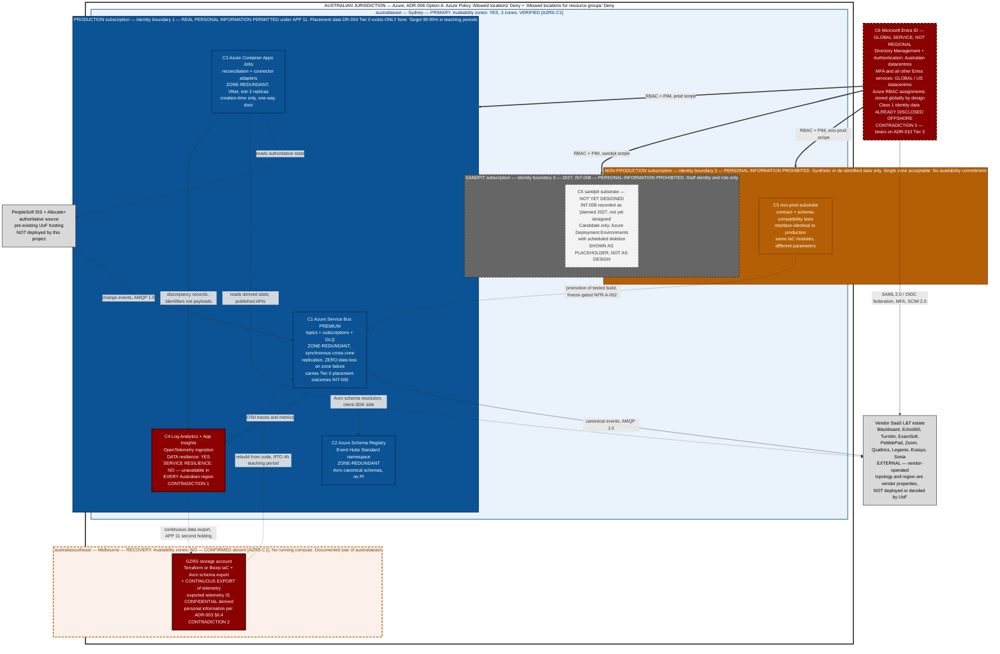

# Architecture Diagram: Deployment Topology — University-Controlled Integration and Observability Plane

> **Template Origin**: Official | **ArcKit Version**: 6.7.5 | **Command**: `/arckit:diagram`

## Document Control

| Field | Value |
|-------|-------|
| **Document ID** | ARC-001-DIAG-004-v1.0 |
| **Document Type** | Architecture Diagram — Deployment (Infrastructure Topology) |
| **Project** | Learning & Teaching Baseline Strategy (Project 001) |
| **Classification** | OFFICIAL |
| **Status** | DRAFT |
| **Version** | 1.0 |
| **Created Date** | 2026-07-30 |
| **Last Modified** | 2026-07-30 |
| **Review Cycle** | On acceptance of ADR-005 or ADR-006; on closure of AZRS findings F-1, F-2, F-3; before INT-008 sandpit design commences (2027) |
| **Next Review Date** | 2026-08-29 |
| **Owner** | Sam Okafor, Integration Architect |
| **Reviewed By** | [PENDING] — Tobias Ohm (Cybersecurity), Eleanor Frame (Privacy & Records) |
| **Approved By** | [PENDING] — Cassandra Rhodes, Chief Information Officer |
| **Distribution** | Project Team; Digital & IT; Cybersecurity; Privacy & Records; Learning Technologies; Procurement; Steering Committee |

## Revision History

| Version | Date | Author | Changes | Approved By | Approval Date |
|---------|------|--------|---------|-------------|---------------|
| 1.0 | 2026-07-30 | ArcKit AI | Initial creation from `/arckit:diagram` command — deployment topology for the six university-controlled components of ADR-005 / ADR-006, drawn as verified reality rather than as the ADRs assert it. Annotates four contradictions surfaced by `ARC-001-AZRS-v1.0` (findings F-1, F-2, F-3, and the confirmed `australiasoutheast` zone absence) | [PENDING] | [PENDING] |

---

## Purpose and Scope

This is a **deployment diagram**: it shows where the university's own infrastructure physically and administratively sits — region, availability-zone posture, subscription boundary, identity boundary, and replication path. It is not a container or dataflow view; `ARC-001-DIAG-001-v1.0` holds the C4 Container view of the same estate.

### In scope — the six university-controlled components only

Per ADR-005 §1.1 and ADR-006 §1.2, the estate is overwhelmingly vendor-operated SaaS, and **deployment topology for those platforms is a vendor product property, not a University of Funk decision**. Drawing Blackboard, Echo360, Turnitin, ExamSoft, PebblePad, Zoom, Qualtrics, Leganto, Evasys or Sonia as nodes UoF deploys would be fiction. They appear here as a **single external boundary**, and UoF's levers over them are procurement levers (DR-005 residency register, NFR-C-002 APP 8 assessment, ADR-010 tiering) — not topology levers.

| # | Component | Origin | Shown as |
|---|-----------|--------|----------|
| C1 | Integration broker / event mediation | ADR-001 Option B | `SB` — Azure Service Bus Premium |
| C2 | Canonical schema registry | ADR-001, DR-001 | `SR` — Azure Schema Registry on an Event Hubs namespace |
| C3 | State reconciliation service | ADR-003 Option B Layer 3 | `CA` — Azure Container Apps Jobs |
| C4 | Telemetry, metrics and log store | ADR-003 Option B Layers 1–2 | `LAW` — Log Analytics + workspace-based Application Insights |
| C5 | Three-tier environment substrate | ADR-005 §5.4 | The three subscription subgraphs `PROD`, `NP`, `SP` |
| C6 | Identity and access enforcement plane | ADR-008 Option A | `ENTRA` — Microsoft Entra ID, drawn **outside** the Australian boundary |

### Framework applicability

> The University of Funk is a **fictional private Australian higher-education institution**. The applicable frameworks are the **Privacy Act 1988 (Australian Privacy Principles)**, the **ASD Essential Eight** (target ML2 by end 2027 per NFR-SEC-002) and **WCAG 2.2 AA** (not engaged — these components have no student-facing surface). Currency is AUD.
>
> UK Government frameworks — GDS Service Standard, Technology Code of Practice, NCSC Cloud Security Principles, UK GDPR, G-Cloud / Digital Marketplace — have **no standing** and are not assessed. The template's *UK Government Compliance* and *GOV.UK Services* sections are **replaced** by the Australian residency and Essential Eight sections below rather than completed with inapplicable ratings. **No UK or European region is depicted, because none is a candidate.**

### Q&A choices recorded

This diagram was generated non-interactively; no `AskUserQuestion` prompt was presented to a user. Where the skill would have asked, the following were applied and are recorded for audit:

| Question | Option applied | Basis |
|----------|----------------|-------|
| Diagram type | **Deployment** | **Not a default.** Specified in the command arguments (`001 deployment`), so Question 1 was skipped |
| Output format | **Mermaid** | Deployment diagrams are Mermaid-only by the skill's own rule ("If the user selects Deployment for Question 1, ignore the Question 2 answer"). Question 2 was therefore moot |
| Scope | **The six university-controlled components** | **Not `Full system`.** Directed by ADR-005 §1.1 and ADR-006 §1.2, which establish that the SaaS estate has no UoF-decidable topology. Drawing it as deployed infrastructure would misrepresent what the university controls |

---

## The four contradictions this diagram represents

`ARC-001-AZRS-v1.0` verified ADR-005 and ADR-006 against Microsoft's own documentation and found that **parts of both ADRs do not hold**. This diagram draws the verified position and marks the divergence, rather than drawing the ADRs as if unchallenged.

| # | AZRS finding | What the ADRs say | What is actually true | How it is depicted |
|---|---|---|---|---|
| **0** | §1.1, [AZRS-C1] | ADR-005 A-2 left zone count unverified; ADR-006 asserted the answer | **CONFIRMED**: `australiaeast` has availability zones; `australiasoutheast` has **none**. ADR-006's assertion is correct and ADR-005 A-2 is discharged | Region subgraph titles state the zone posture explicitly. `ASE` is drawn with an amber dashed border to mark the absence — a **verified asymmetry**, not a defect |
| **1** | **F-1** (HIGH) | ADR-005 §3.1: "Telemetry must survive the failure it is observing"; §7.2 target: observability availability "not lower than broker availability". ADR-003 rejected Option A partly because it "shares a failure domain with the thing it observes" | Azure Monitor Logs has **data resilience but no service resilience in any Australian region**. During a zone outage the zone-redundant Service Bus broker keeps working while log ingestion, KQL queries and log-based alerts may not. **The observability plane is LESS zone-resilient than the broker it observes — the exact inversion ADR-005 set as a target** | `LAW` is drawn in the contradiction colour (dark red, heavy stroke) inside the production subscription, with `SERVICE RESILIENCE: NO` on the node face. It is deliberately **not** drawn as a peer-resilient sibling of `SB` |
| **2** | **F-2** (HIGH) | ADR-005 §5.3 and ADR-006 §6.1 / Condition 2: the recovery region holds "code, configuration and telemetry only — no running compute, **no personal information at rest**" | Self-contradictory. ADR-003 §6.4 bindingly classifies telemetry as **CONFIDENTIAL derived personal information** (identifiers linked to enrolment and role state). If telemetry is replicated there, personal information is at rest there | `STG` is drawn in the contradiction colour with `exported telemetry IS CONFIDENTIAL derived personal information` on the node face. The fix is depicted: **continuous data export to GZRS storage**, not workspace replication — no running workspace, no running compute in `australiasoutheast` |
| **3** | **F-3** (HIGH) | ADR-006 §8.3: APP 8 is an *avoided* trigger, "both selected regions are Australian". ADR-010 Tier 3: Class 1 identity is "currently Australian" | Only Entra **Directory Management** and **Authentication** hold Australian-resident data. **Entra MFA and all other Entra services store identity customer data in global / US datacentres**, and Azure RBAC assignments are stored globally by design. ADR-008 Option A makes **MFA at the IdP** its central control — so Class 1 identity is **already disclosed offshore**, by inheritance rather than decision | `ENTRA` is drawn **outside the Australian jurisdiction boundary**, in the offshore colour with a dashed border, labelled `GLOBAL SERVICE, NOT REGIONAL`. Its RBAC/PIM edges cross the boundary inward — visually showing that the identity control plane is not inside the residency envelope that Azure Policy `Allowed locations` enforces |

**Two further AZRS findings are drawn as design constraints rather than contradictions**: `CA` carries the Container Apps creation-time zone-redundancy constraint (F-7, a one-way door), and `SB` carries Service Bus's zero-data-loss guarantee that makes it — not Event Grid — the only candidate that substantiates ADR-005 §5.6's "zero events lost" RPO (F-5).

---

## Diagram

**View this diagram**:

- **GitHub**: Renders automatically in markdown preview
- **VS Code**: Install Mermaid Preview extension
- **Online**: <https://mermaid.live> (paste code above)
- **Export**: Use mermaid.live to export as PNG/SVG/PDF

### Legend

| Visual treatment | Meaning |
|---|---|
| **Solid black outer box** | Australian jurisdiction — the residency envelope Azure Policy `Allowed locations` (Deny) enforces |
| **Solid blue region box + blue nodes** | `australiaeast` primary; availability zones present and used |
| **Amber dashed region box** | `australiasoutheast` recovery; **no availability zones** (verified) and no running compute |
| **Dark red heavy-stroke node** | A verified contradiction against ADR-005 / ADR-006 — see the table above. Not a design proposal |
| **Dark red dashed node, outside the black box** | Offshore by construction; outside the residency envelope and outside `Allowed locations` reach |
| **Grey dashed node** | **Undesigned.** Placeholder marking a known 2027 gap, not a depicted design |
| **Grey solid node** | External — not deployed by UoF |
| **Solid arrow** | Live runtime data path |
| **Dashed arrow** | Asynchronous, scheduled, replication, promotion or recovery path |
| **Thick arrow (`==>`)** | Identity and authorisation control plane crossing a boundary |

---

## Component Inventory

| Component | Type | Technology | Responsibility | Zone posture in `australiaeast` | Evolution Stage | Build/Buy |
|-----------|------|------------|----------------|---------------------------------|-----------------|-----------|
| C1 Integration broker (`SB`) | Managed messaging | Azure Service Bus **Premium** (topics, subscriptions, filters, DLQ, duplicate detection), AMQP 1.0 | Canonical event mediation for INT-001 to INT-009; carries Tier 0 placement outcomes (INT-005) in transit | **Zone-redundant, synchronous cross-zone replication, zero data loss** | Commodity (0.80) | USE |
| C2 Schema registry (`SR`) | Managed registry | Azure Schema Registry on an Event Hubs **Standard** namespace; **Avro** canonical schemas | Canonical model as a versioned runtime contract (DR-001, Principle 6) | Zone-redundant (covers Schema Registry) | Commodity (0.78) | USE |
| C3 Reconciliation (`CA`) | Managed container compute | Azure Container Apps **Jobs**, workload-profiles environment in a VNet, min 2 replicas | ADR-003 Layer 3 state comparison between authoritative source and every derived copy | Zone-redundant — **creation-time only, cannot be enabled later (F-7)** | Custom (0.30) — the logic; Commodity (0.80) — the host | BUILD on USE |
| C4 Telemetry store (`LAW`) | Managed log/metric platform | Azure Monitor: Log Analytics workspace + workspace-based Application Insights, Azure Monitor OpenTelemetry Distro | ADR-003 Layers 1–2; holds CONFIDENTIAL derived personal information, 13-month enforced retention | **Data resilience YES; service resilience NO — in every Australian region (F-1)** | Commodity (0.85) standard; Product (0.70) backend | USE |
| C5 Environment substrate (`PROD` / `NP` / `SP`) | Governance / tenancy | Management groups + **one subscription per tier** + Azure Policy `Allowed locations` (Deny) + per-tier RBAC scopes and managed identities | Three tiers separated by subscription **and** identity boundary; PI prohibited outside production | n/a — subscriptions and management groups are not regional | Commodity (0.90) | USE |
| C5 Sandpit (`SPE`) | **Undesigned** | Candidate only: Azure Deployment Environments (per-project environment types, scheduled deletion) | INT-008, planned 2027, **not yet designed** | n/a | Not assessed — no design exists | Not decided |
| C6 Identity plane (`ENTRA`) | Global SaaS identity | Microsoft Entra ID: SAML 2.0 / OIDC, Conditional Access, Continuous Access Evaluation, SCIM 2.0 provisioning, PIM (**requires Entra ID P2 or Governance**) | Federation, MFA at the IdP, joiner-mover-leaver lifecycle, privileged access | n/a — **global service, MFA data offshore (F-3)** | Commodity (0.88) | USE |
| Recovery holding (`STG`) | Geo-redundant storage | GZRS storage account; Terraform/Bicep IaC, Avro schema export, Azure Monitor continuous data export | Recovery-from-code source and second APP 11 holding of exported telemetry | GZRS — zone-redundant in `australiaeast`, replicated to `australiasoutheast` | Commodity (0.92) | USE |

**Deliberately absent from the diagram**: Azure API Management. NFR-I-001 (published, versioned interfaces) may require it, but availability zones are available **only in Premium (classic) and Premium v2** (F-9) — a material step in the BR-002 envelope that must be priced before RIFF. Until that is decided it would be dishonest to draw it as a committed node. AZRS §9 also asks whether Service Bus plus the schema registry alone discharges NFR-I-001 for internal event contracts.

**Evolution Stage Legend** — Genesis (0.0–0.25) · Custom (0.25–0.50) · Product (0.50–0.75) · Commodity (0.75–1.0).
**Build/Buy Legend** — BUILD (Genesis/Custom with advantage) · BUY (Product, mature market) · USE (Commodity utility). REUSE is not applicable: it denotes GOV.UK shared services, and this is not a UK Government project.

---

## Architecture Decisions Represented

**Decision 1 — Single Australian region, multi-AZ, recovery from code (ADR-005 Option A, ADR-006 Option A)**

- **Context**: ADR-001 concentrated nine independent point integrations into one mediating plane. NFR-A-001 requires 99.9% availability during teaching periods, and BR-002 holds licence spend flat.
- **Decision**: `australiaeast` as multi-AZ primary; `australiasoutheast` holds code, configuration and an exported telemetry copy with no running compute. Recovery is an execution of automation, not a failover switch.
- **Rationale**: Multi-AZ clears 99.9% with error budget remaining; active-active roughly doubles the footprint to exceed a target already met, while the estate's real availability exposure sits in unverified vendor SLAs (R-024) that no UoF topology can improve.
- **Consequences**: A whole-of-region loss is a 4-hour rebuild during teaching periods, not a switch. Credibility depends entirely on the per-semester rehearsal discipline in ADR-005 Condition 2.

**Decision 2 — Three tiers separated by subscription AND identity boundary**

- **Context**: The current estate has no environment discipline at all, and nothing prevents student or placement data reaching a test environment.
- **Decision**: One subscription per tier, distinct RBAC scopes, distinct PIM-eligible assignments, distinct managed identities. Not namespaces, tags or naming conventions. Personal information prohibited outside production, enforced as a control.
- **Rationale**: ADR-005 §5.4 — "separation that a misconfiguration can cross is not separation." A single Entra **tenant** is retained deliberately; a second tenant would double the identity operating surface ADR-006 §6.3 refuses to double.
- **Consequences**: Administrative overhead, offset by a genuine Essential Eight *restrict administrative privileges* control. Prevention is partial and must be stated as such — Azure Policy cannot inspect message bodies, so the honest position is **prevention at the network and identity boundary plus detection on the data stores**.

**Decision 3 — Service Bus, not Event Grid, carries the canonical backbone (AZRS F-5)**

- **Context**: ADR-005 §5.6 states RPO as "zero events lost", a Must-priority position.
- **Decision**: Service Bus Premium is the event backbone. Event Grid is permitted only as a notification edge where loss is tolerable or a durable source store exists.
- **Rationale**: Service Bus replicates synchronously across zones with no data loss; Event Grid's own reliability guide states "some data loss is possible" during a zone failure. Those are materially different guarantees against the same requirement.
- **Consequences**: Premium tier is required for geo-replication optionality and dedicated messaging units. **Zone redundancy is free in every tier and must not be priced as a Premium uplift.**

**Decision 4 — Telemetry reaches the recovery region as GZRS export, not workspace replication (AZRS F-2)**

- **Context**: ADR-005's "no personal information at rest" clause collides with ADR-003 §6.4's binding CONFIDENTIAL classification of telemetry.
- **Decision**: Azure Monitor **continuous data export** to a GZRS storage account, which replicates to the documented pair region. Workspace replication is rejected.
- **Rationale**: A replicated secondary workspace continuously ingesting derived personal information is both running infrastructure and personal information at rest in `australiasoutheast` — breaching the rule twice. Export is cheaper and keeps the recovery region free of running resources.
- **Consequences**: The clause must be restated as "code, configuration, and an exported encrypted copy of telemetry in geo-redundant storage", and `australiasoutheast` entered in the DR-005 register as a **second Australian location for the same holding**. Both regions being Australian makes this an **APP 11** question, not an APP 8 one — it adds no cross-border disclosure and does not disturb ADR-010's tiering.

### Technology Choices

| Technology | Purpose | Rationale | Evolution Stage |
|------------|---------|-----------|-----------------|
| Azure Service Bus Premium | C1 event backbone | Zero data loss on zone failure; AMQP 1.0 satisfies the open-protocol constraint in ADR-006 Condition 3 | Commodity (0.80) |
| Avro (not JSON Schema) | Canonical serialisation | No Azure broker validates payloads. Avro converts non-conformance into a deserialisation failure that dead-letters and is observable under ADR-003 Layer 2 (F-6) | Commodity (0.85) |
| Azure Container Apps Jobs | C3 scheduled reconciliation | OCI images keep the runtime portable (Principle 9); Functions Flex Consumption cannot scale to zero when zone-redundant (F-8) | Commodity (0.80) |
| Azure Monitor OpenTelemetry Distro | Instrumentation | ADR-003 adopted the layers as a *standard, not a product*; a parallel OTLP exporter is the practical proof the exit claim is real | Commodity (0.85) |
| Terraform or OpenTofu | Infrastructure as code | ADR-006 Condition 3 makes portability binding; per ARC-001-DEVOPS §5.1 this is preferred over Bicep on exit grounds | Commodity (0.90) |
| GZRS storage | Recovery holding | Replicates automatically to the documented pair region with no running compute | Commodity (0.92) |

---

## Requirements Traceability

| Requirement ID | Description | Component(s) | Coverage Status |
|----------------|-------------|--------------|-----------------|
| NFR-A-001 | 99.9% availability during teaching periods; plane targeted at 99.95% | `SB`, `CA`, `PROD` zone redundancy | ✅ For the broker and reconciliation plane |
| NFR-A-002 | Change aligned to the academic calendar | `NPE` → `SB` promotion edge, freeze-gated | ✅ |
| NFR-P-001 | Change propagation within 15 minutes | `SB`, `CA`, `LAW` trace propagation | ⚠️ Measurable only if default trace-based log sampling is reviewed before go-live |
| NFR-S-001 | Peak load without degradation | `SB` Premium dedicated messaging units with auto-scale | ✅ |
| NFR-M-001 | Integration observability; telemetry must survive the failure it observes | `LAW` | ❌ **Not met as stated.** Azure Monitor Logs has no service resilience in any Australian region (F-1) |
| NFR-M-002 | Reproducible, documented automation; two-operator rule | `STG` IaC holding; all tiers from one module set | ✅ |
| NFR-I-001 | Published, versioned interfaces | `SR` Avro schemas; APIM **not yet committed** (F-9) | ⚠️ Partial |
| NFR-I-002 / DR-007 | Portability and exit | AMQP 1.0, OpenTelemetry, OCI images, IaC in version control | ✅ By design constraint (ADR-006 Condition 3) |
| NFR-SEC-001 | No local administrative accounts; individually attributable access | `ENTRA` → per-tier RBAC edges | ✅ |
| NFR-SEC-002 | Essential Eight ML2 by end 2027 | Managed PaaS for C1, C2, C4; PIM for C6 | ⚠️ PIM movement is **licence-dependent** (Entra ID P2 / Governance) and container base images remain UoF's patch obligation |
| NFR-C-001 / NFR-C-002 | Australian residency; APP 8 assessment | `AU` boundary + Azure Policy Deny | ⚠️ Holds for C1–C5. **Fails for C6** — Entra MFA is already an offshore disclosure (F-3) |
| NFR-C-003 | Audit logging with actor, timestamp, prior value | Deliberately separate from `LAW` operational telemetry per ADR-003 §6.4 | ⚠️ Not depicted — a distinct evidentiary record, not this plane |
| INT-001 to INT-009 | All nine integrations | `SB` mediation; `INT-005` Tier 0 in transit | ✅ As consumers |
| INT-008 | Sandpit provisioning, 2027 | `SPE` | ❌ **Undesigned.** Drawn as a marked placeholder, not a design |
| DR-001 | Canonical model | `SR` | ⚠️ Enforced at the **serialisation boundary**, not at the broker (F-6) |
| DR-003 / DR-004 | Minimisation; sensitive placement class | `PROD`-only data rule; `NP` and `SP` prohibitions | ✅ At the identity and network boundary; detective controls on the stores |
| DR-005 | Residency register | `AU` boundary; `STG` as a second Australian location | ⚠️ Register must gain the `australiasoutheast` telemetry-export entry (F-2) |
| DR-006 | Analytics minimisation and retention | `LAW` 13-month enforced expiry | ✅ |

**Coverage Summary** — 19 requirement lines traced: **9 covered (47%)**, **8 partially covered (42%)**, **2 not covered (11%: NFR-M-001 and INT-008)**. The two failures are deliberate and load-bearing: NFR-M-001 is the F-1 contradiction, and INT-008 is the acknowledged 2027 gap. Drawing either as covered would be the error this diagram exists to prevent.

---

## Integration Points

| External System | Interface | Protocol | Deployed by | Position in this diagram |
|----------------|-----------|----------|-------------|--------------------------|
| PeopleSoft SIS / Allocate+ | Change-event feed; reconciliation read | AMQP 1.0 publish; published read APIs | UoF, pre-existing hosting arrangements | External node — out of scope for Project 001 topology (ADR-005 §1.1) |
| Vendor SaaS L&T estate (10+ platforms) | Canonical event consumption; SCIM 2.0; SAML/OIDC | AMQP 1.0, HTTPS, SCIM 2.0, SAML 2.0 / OIDC | **Vendors** | Single external boundary. **Not nodes UoF operates.** Region and tenancy are vendor product properties governed by DR-005, NFR-C-002 and ADR-010 |
| Microsoft Entra ID | Federation, MFA, provisioning, RBAC/PIM | SAML 2.0, OIDC, SCIM 2.0, Microsoft Graph | Microsoft, **globally** | Drawn outside the Australian boundary. Gallery SCIM onboarding requires ≥ 25 requests/second/tenant; a non-gallery custom SCIM app does not support schema discovery |
| Project 002 (Lecture Capture) | Consumes INT-001 provisioning via the mediation plane | AMQP 1.0 | UoF (Project 002) | Not depicted — a consumer of `SB`, not a deployment element of this plane |

**Session-revocation caveat (F-4)**: Continuous Access Evaluation does not reach vendor SaaS, and non-CAE Conditional Access and group changes take up to 24 hours to propagate. ADR-008's 15-minute revocation target is **not achievable through Entra alone** for Blackboard, Echo360, Turnitin, ExamSoft, PebblePad or Sonia. This is an identity-plane property, not a topology property, so it is recorded here rather than drawn.

---

## Data Flow and Privacy Position

### Data holdings created by this topology

| Holding | Location | Classification | Legal basis / obligation | Retention | Deletion |
|---------|----------|----------------|--------------------------|-----------|----------|
| `SB` replay window — enrolment, role, grade and placement events | `australiaeast`, production subscription | CONFIDENTIAL; **includes Class 5 sensitive information (ADR-010 Tier 0) in transit** | APP 11 security; Tier 0 prohibits offshore disclosure absolutely | Replay window only — the plane holds no state that is not reconstructible (Principle 5) | Automatic on window expiry |
| `SR` canonical schemas | `australiaeast`, production subscription | OFFICIAL — no personal information | n/a | Versioned indefinitely with a backward-compatibility policy | n/a |
| `CA` discrepancy records | `australiaeast`, production subscription | CONFIDENTIAL — identifiers, including Tier 0 identifiers | APP 11 | Aligned to ADR-003 §6.4 | Automated expiry |
| `LAW` telemetry, metrics, traces | `australiaeast`, production subscription | **CONFIDENTIAL derived personal information** (ADR-003 §6.4) — identifiers linked to enrolment and role state | APP 3 collection, APP 11.2 security and destruction | **13 months**, enforced automatically | Retention job; zero records past retention is a monitored metric |
| `STG` exported telemetry copy | `australiasoutheast` | **CONFIDENTIAL derived personal information** — this is F-2 | **APP 11**, not APP 8 (both regions Australian). Requires a DR-005 register entry as a second Australian location | 13 months rolling, matching `LAW` | Lifecycle policy on the storage account |
| `NP` / `SP` substrates | `australiaeast`, separate subscriptions | **No personal information permitted** | DR-003 minimisation; DR-004 absolute prohibition on placement data | n/a — synthetic data only | n/a |
| Entra identity customer data | **Global / US datacentres for MFA and most services** | Class 1 identity — ADR-010 Tier 3 ("Australian, and to remain so") | **APP 8 cross-border disclosure — already occurring, unassessed. This is F-3** | Per Microsoft service terms | Not under UoF control |

**Privacy Impact Assessment**: required and already in flight as project dependency D-5. This diagram is an **input** to it, not a substitute. ADR-006 Condition 4 requires Eleanor Frame's sign-off on classification, minimisation and retention for the new holdings **before build**.

> The template's *PII Handling (UK GDPR / GDPR Compliance)* heading is replaced by the table above. UK GDPR and the DPIA regime under Article 35 have no application to a private Australian university; the equivalent instruments are the Privacy Act 1988 APPs and a s33D-style Privacy Impact Assessment.

---

## Security Architecture

### Security zones

| Zone | Components | Security level | Controls |
|------|------------|----------------|----------|
| Production (`PROD`) | `SB`, `SR`, `CA`, `LAW` | Highest — real personal information including Tier 0 sensitive information | Dedicated subscription; private endpoints; managed identities only, no SAS or connection strings; PIM eligible-only privileged roles; Azure Policy `Allowed locations` Deny; Defender for Cloud |
| Non-production (`NP`) | `NPE` | Reduced — synthetic data only | Separate subscription and RBAC scope; Deny on cross-tier data paths; sensitivity scanning as a detective control; single-zone acceptable |
| Sandpit (`SP`) | `SPE` | Reduced — staff identity and role only | **Controls not yet designed (INT-008).** Intended: separate subscription, automatic expiry, self-service provisioning through the automated path |
| Recovery (`ASE`) | `STG` | Highest at rest — holds derived personal information | Encryption at rest with GZRS redundancy; no running compute; no query surface; lifecycle expiry |
| Identity control plane (`ENTRA`) | `ENTRA` | Highest — Class 1 identity | Conditional Access with MFA; PIM with approval and time-bound activation; **outside the `Allowed locations` residency envelope, which explicitly excludes `global`-region resources (F-10)** |
| External (`SIS`, `SAAS`) | Vendor and pre-existing platforms | Governed by contract, not by this topology | DR-005 register; NFR-C-002 assessments; ADR-010 tiering |

### Essential Eight ML2 contribution (NFR-SEC-002, R-020)

| Mitigation strategy | What this topology contributes | Residual obligation |
|---|---|---|
| **Patch applications** | `SB`, `SR`, `LAW` and the Container Apps control plane are managed PaaS — Microsoft patches the platform. This is the strongest Essential Eight argument for ADR-006's managed-service preference | **Container base images are UoF's.** A rebuild cadence and image-vulnerability gate are required, or "managed service" is claimed over a surface the university actually owns |
| **Patch operating systems** | No self-managed VMs are required by this topology | Where any VM or Arc-enabled server survives, Azure Update Manager applies — and assessments retrieve updates only for machines in the **Running** state, so a stopped machine looks compliant while reporting nothing |
| **Restrict administrative privileges** | Three subscriptions with separate RBAC scopes; PIM eligible-only assignments; no standing Owner or Contributor at subscription scope | **Licence gate: Entra ID P2 or Entra ID Governance.** The only ML maturity movement ADR-008 claims is licence-dependent, and ADR-008 does not say so. Conditional Access must be scoped to eligible users directly to close the post-activation gap |
| **Multi-factor authentication** | Enforced once at the IdP via Conditional Access; platform administration under institutional SSO (ADR-006 Condition 5) | Residency exception per F-3 |
| **Regular backups** | IaC and schema export in version control; Azure Monitor continuous export to GZRS | NFR-SEC-002 requires coverage **verified by restore test, not vendor description.** Extend ADR-006's recovery rehearsal to a telemetry-export restore |
| Application control · Office macros · User application hardening | Not engaged — these components have no user-facing endpoint | Endpoint estate; teaching-lab fleets and capture appliances remain the dominant gap (TC-4) |

> The template's *Technology Code of Practice*, *GOV.UK Services* and *AI Playbook* sections are **not applicable and are not completed**. They are UK Government instruments. The Essential Eight table above and the Australian residency position in the Data Flow section are their replacements. There is no AI or algorithmic component in this topology, so no ATRS-equivalent record arises.

---

## Deployment Architecture

**Provider**: Microsoft Azure (ADR-006 Option A, **Proposed** — conditional on the Principle 19 entitlement test in ADR-006 Condition 1, which *can invalidate the decision*).
**Primary region**: `australiaeast` (Sydney, New South Wales) — **availability zones: yes, three, verified**.
**Recovery region**: `australiasoutheast` (Melbourne, Victoria) — **availability zones: no, confirmed absent**. The documented pair of `australiaeast`, which is what makes GZRS replication the recovery mechanism.
**Regions not selected**: `australiacentral` and `australiacentral2` (Canberra) — available but built to serve government workloads under arrangements UoF does not need and would pay for. `australiacentral2` is additionally access-restricted.
**Offshore regions**: excluded for C1–C5. **C6 is offshore by inheritance, not by selection** — that is the point of F-3.

### Infrastructure components

| Component | Type | Spec | HA in `australiaeast` | Backup / recovery |
|-----------|------|------|----------------------|-------------------|
| Service Bus namespace | Managed messaging | Premium, start at 1 messaging unit with auto-scale | Zone-redundant, synchronous replication, **zero data loss** | Geo-Replication available (Premium-only) but **not adopted** — ADR-005 chose no cross-region data replication |
| Event Hubs namespace (Schema Registry) | Managed registry | Standard | Zone-redundant | Schema export to `STG` |
| Container Apps environment | Managed container platform | Workload profiles, in a VNet, infrastructure subnet `/27` or larger, min 2 replicas | Zone-redundant — **set at creation, unchangeable (one-way door)** | Stateless; rebuilt from IaC |
| Log Analytics workspace + App Insights | Managed observability | Analytics tables for queried telemetry; Basic/Auxiliary for high-volume low-query. **No dedicated cluster** | **Data resilience only** | Continuous data export to `STG` |
| GZRS storage account | Geo-zone-redundant blob | GZRS | Zone-redundant in primary, geo-replicated to the pair | Is the backup |
| Management groups + 3 subscriptions | Governance | One per tier | Not regional | IaC-defined; changes are governance events |

**Do not purchase a Log Analytics dedicated cluster expecting to fix F-1.** Dedicated clusters upgrade *data* resilience where shared clusters lack it, and `australiaeast` already has data resilience on the default shared cluster. The commitment tier starts at 100 GB/day — almost certainly an order of magnitude above this estate's telemetry volume — and it does **not** deliver the service resilience that is actually missing. That would be spend against BR-002 for no gain in the missing property.

### Network architecture

| Network element | Sizing | Purpose | Notes |
|---|---|---|---|
| Production VNet | Per landing-zone design | Container Apps workload-profiles environment placement, private endpoints | Required for Container Apps zone redundancy |
| Container Apps infrastructure subnet | **`/27` minimum** (workload profiles); `/23` for Consumption-only | Platform-managed infrastructure | **A one-way door — cannot be resized after environment creation (F-7)** |
| Private endpoints | Per service, per tier | Service Bus, Event Hubs, storage, Log Analytics ingestion | Keeps data-plane traffic off public endpoints |
| Private DNS zones | Per tier | Private endpoint resolution | Tier-scoped so a non-prod resolver cannot reach a production endpoint |

CIDR allocations are deliberately not asserted — no landing-zone design exists yet, and inventing address space here would create a false artefact. They are an output of ADR-006 Phase 1.

### Recovery objectives (ADR-005 §5.6)

| Objective | Teaching period | Outside teaching period | How this topology delivers it |
|-----------|-----------------|-------------------------|-------------------------------|
| **RTO** — zone loss | Automatic, no manual recovery | Automatic | Zone redundancy on `SB`, `SR`, `CA`. **Note**: `LAW` query and alert availability is not covered — F-1 |
| **RTO** — region loss | 4 hours | 8 hours | Redeploy from IaC in `STG`; rehearsed per semester (ADR-005 Condition 2) |
| **RPO** | **Zero events lost** | Zero events lost | Service Bus synchronous cross-zone replication; edge buffering and replay from the authoritative source (ADR-005 Condition 1) |

The 4-hour region-loss RTO **exceeds** NFR-P-001's 15-minute propagation SLA. That is an accepted, stated trade-off: a whole-of-region loss is an NFR-P-001 breach for its duration. Buying it down to seconds is what active-active costs, and ADR-005 §5.2 sets out why that is not the right use of a constrained budget.

---

## Non-Functional Requirement Coverage

### Availability and resilience

| Requirement | Target | Component(s) | How achieved | Status |
|-------------|--------|--------------|--------------|--------|
| Plane availability, teaching periods | ≥ 99.95% | `SB`, `SR`, `CA` | Zone-redundant managed PaaS in an AZ region, at **no incremental platform cost** | ✅ |
| Observability plane availability | "Independent of, and not lower than, broker availability" | `LAW` | **Cannot be delivered.** No Australian region offers Azure Monitor Logs service resilience | ❌ F-1 |
| Zone-failure event loss | Zero | `SB` | Synchronous cross-zone replication before acknowledgment | ✅ |
| Region-loss recovery | 4h / 8h | `STG` → `australiaeast` | Rebuild from code, rehearsed per semester | ⚠️ Credible only with rehearsal |

**F-1 mitigation depicted and required, in order of cost**: (1) move ADR-003 §6.5's binding heartbeat and absence alerts onto **Azure Monitor platform metric alerts**, which use a separate ingestion path from Log Analytics, so the estate's defining failure mode stays detectable during a zone event; (2) carry the Layer 1 endpoint-health function on **Azure Service Health and Resource Health alerts**, which are independent of the workspace; (3) continuous export to GZRS preserves the record independently of query availability; (4) **do not** buy a dedicated cluster; (5) accept and state the residual in `ARC-001-RISK-v1.0`, and amend ADR-005 §7.2's "not lower than broker availability" target to a stated, accepted exception rather than leaving it asserted and unmet.

### Performance and scalability

| Requirement | Target | Component(s) | How achieved |
|-------------|--------|--------------|--------------|
| Change propagation | Within 15 minutes, 95th percentile | `SB`, `CA`, `LAW` | Single trace identifier propagated from source change to target write. **Default trace-based log sampling must be reviewed before go-live** — sampling that discards propagation traces would make the headline commitment unmeasurable while appearing healthy |
| Peak-period burst | No degradation at teaching-period commencement | `SB` Premium | Dedicated messaging units with auto-scaling on CPU, memory and connection metrics |
| Horizontal scale | Reconciliation throughput | `CA` | Replica scaling with min 2 for zone spread; Jobs retries and parallelism for zone-failure resilience |

---

## Diagram Quality Gate

| # | Criterion | Target | Result | Status |
|---|-----------|--------|--------|--------|
| 1 | Edge crossings | Fewer than 5 for complex diagrams | 3 estimated — the two `CA` reads to external systems, and the `STG` rebuild edge | PASS |
| 2 | Visual hierarchy | Boundary is the most prominent element | Australian jurisdiction drawn as a 3px black boundary; region boxes nested inside; the offshore identity plane sits deliberately outside it | PASS |
| 3 | Grouping | Related elements proximate (Gestalt proximity) | Four nested subgraphs: jurisdiction → region → subscription tier. Every component sits in exactly one tier | PASS |
| 4 | Flow direction | Consistent throughout | `flowchart TB` — source at top, mediation and tiers in the middle, external consumers and recovery below | PASS |
| 5 | Relationship traceability | Each line followable source to target | 14 edges, each individually labelled with protocol or purpose; solid / dashed / thick encode three distinct edge classes | PASS |
| 6 | Abstraction level | One level per diagram | Deployment only — infrastructure placement, zone posture, subscription and identity boundaries. Container-level internals are in DIAG-001 | PASS |
| 7 | Edge label readability | Legible, non-overlapping | All labels quoted, comma-separated, no ` ` in any edge label (which would be a parse error in a flowchart) | PASS |
| 8 | Node placement | No unnecessarily long edges | Declaration order follows the TB reading order; the longest edges are the three deliberate boundary-crossing identity edges | PASS |
| 9 | Element count | Within the 15-element deployment threshold | **10 nodes** + 5 boundary subgraphs | PASS |

**Syntax validation**: the Mermaid source was parsed with `mermaid@11.16.0` — result `PARSE OK`, `diagramType: flowchart-v2`. SVG rendering was not attempted in this environment (no headless browser libraries available), so **layout** — as distinct from syntax — has not been visually confirmed.

**Accepted trade-offs**:

1. Two edges run from `CA` outward to `SIS` and `SAAS` (reconciliation reads the authoritative source and every derived copy). They cross the mediation edges. The alternative — omitting them — would hide the fact that the reconciliation service holds read paths to every system in the estate, which is precisely its APP 11 significance. The crossing is accepted.
2. Azure API Management is omitted (see Component Inventory). NFR-I-001 coverage is therefore marked partial rather than drawn as satisfied.
3. Edges to subgraph clusters (`ENTRA ==> PROD` / `NP` / `SP`) are used deliberately in place of edges to individual nodes, because the brief requires the three-tier identity separation to be **visually explicit**. Three arrows into three distinct clusters express "three separate identity scopes" more clearly than three arrows into arbitrary member nodes.

---

## Wardley Map Integration

**Related Wardley Map**: none exists for Project 001. Evolution positions below are taken from the ADRs' own stated assessments (ADR-005 §4.1 "Commodity 0.80"; ADR-006 Option A "Commodity 0.80"; ADR-003 §Option B "Layer 1 Commodity 0.85, Layer 2 Product 0.70, Layer 3 Custom 0.30") rather than invented here.

| Component | Visibility | Evolution | Stage | Strategic action |
|-----------|-----------|-----------|-------|------------------|
| C1 broker (`SB`) | 0.35 | 0.80 | Commodity | **USE** — managed messaging is utility infrastructure |
| C2 schema registry (`SR`) | 0.25 | 0.78 | Commodity | **USE** — but the *canonical model it holds* is the university's own custom asset |
| C3 reconciliation logic (`CA`) | 0.30 | 0.30 | Custom | **BUILD** — no off-the-shelf equivalent; coupled to the canonical model; permanent maintenance accepted in ADR-003 §7.2 |
| C4 telemetry store (`LAW`) | 0.20 | 0.70–0.85 | Product backend on a Commodity standard | **USE** with OpenTelemetry as the substitutability guarantee |
| C5 environment substrate | 0.15 | 0.90 | Commodity | **USE** — subscriptions, management groups and Azure Policy carry no charge |
| C5 sandpit (`SPE`) | 0.20 | Not assessed | **No design exists** | **Do not position an undesigned component.** Assess at the INT-008 2027 design gate |
| C6 identity plane (`ENTRA`) | 0.60 | 0.88 | Commodity | **USE** — and accept that commodity identity is delivered globally, which is what creates F-3 |

**Strategic alignment**:

- ✅ All BUILD decisions align with Custom stage — C3 reconciliation logic is the only BUILD, at 0.30
- ✅ All USE decisions align with Commodity stage
- ✅ No commodity component is being built — zone redundancy, messaging, storage and policy are all consumed
- ✅ No Genesis component is being bought
- ⚠️ One component (`SPE`) is deliberately unpositioned because it is undesigned. Positioning it would imply a design decision that has not been made

---

## Linked Artifacts

**Requirements**: `projects/001-lt-ecosystem/ARC-001-REQ-v1.0.md`
**Architecture Principles**: `projects/000-global/ARC-000-PRIN-v1.1.md` — Principles 5, 7, 8, 9, 10, 11, 13, 15, 16, 17, 19
**High-Level Design Review**: `projects/001-lt-ecosystem/ARC-001-HLDR-v1.0.md`
**DevOps Strategy**: `projects/001-lt-ecosystem/ARC-001-DEVOPS-v1.0.md`
**Azure Technology Research**: `projects/001-lt-ecosystem/research/ARC-001-AZRS-v1.0.md` — the source of all four contradictions
**Decisions**: `decisions/ARC-001-ADR-003-v1.0.md` (observability, telemetry classification) · `decisions/ARC-001-ADR-005-v1.0.md` (topology and environments) · `decisions/ARC-001-ADR-006-v1.0.md` (provider) · `decisions/ARC-001-ADR-010-v1.0.md` (residency tiers)
**Related diagram**: `diagrams/ARC-001-DIAG-001-v1.0.md` — C4 Container view of the same estate
**Risk register**: `projects/001-lt-ecosystem/ARC-001-RISK-v1.0.md` — R-006, R-007, R-013, R-018, R-019, R-020, R-022, R-023, R-024, R-029
**Wardley Map**: none exists
**TCoP / AI Playbook / ATRS**: not applicable — UK Government instruments, and no AI component exists

---

## Change Log

| Version | Date | Author | Changes | Rationale |
|---------|------|--------|---------|-----------|
| v1.0 | 2026-07-30 | ArcKit AI | Initial deployment diagram | ADR-006 §9.3 records that "deployment and network views require update to show the declared landing zone", and ADR-006 §8.1 makes a design showing personal information outside production, or a university-controlled workload outside Australian jurisdiction, non-conformant. This diagram is the artefact those checks are made against |

**Next Review Date**: 2026-08-29 — or earlier on any of: RIFF disposition of AZRS findings F-1, F-2 or F-3; the ADR-006 Condition 1 entitlement outcome; `australiasoutheast` gaining availability zones; commencement of INT-008 sandpit design.

---

## External References

### Document Register

| Doc ID | Filename | Type | Source Location | Description |
|--------|----------|------|-----------------|-------------|
| AZRS | ARC-001-AZRS-v1.0.md | ArcKit artifact | `001-lt-ecosystem/research/` | Azure technology research; verified region and zone facts; findings F-1 to F-12 |
| ADR3 | ARC-001-ADR-003-v1.0.md | ArcKit artifact | `001-lt-ecosystem/decisions/` | Three-layer observability plane; binding telemetry data position §6.4 |
| ADR5 | ARC-001-ADR-005-v1.0.md | ArcKit artifact | `001-lt-ecosystem/decisions/` | Deployment topology; three-tier environment model; recovery objectives |
| ADR6 | ARC-001-ADR-006-v1.0.md | ArcKit artifact | `001-lt-ecosystem/decisions/` | Cloud provider selection; five conditions |
| ADR10 | ARC-001-ADR-010-v1.0.md | ArcKit artifact | `001-lt-ecosystem/decisions/` | Four-tier data residency framework |
| HLDR | ARC-001-HLDR-v1.0.md | ArcKit artifact | `001-lt-ecosystem/` | High-level design review |
| DEVOPS | ARC-001-DEVOPS-v1.0.md | ArcKit artifact | `001-lt-ecosystem/` | Pipeline, IaC tooling and promotion path for the three tiers |

### Citations

| Citation ID | Doc ID | Page/Section | Category | Quoted Passage |
|-------------|--------|--------------|----------|----------------|
| AZRS-C1 | AZRS | §1.1 Availability-zone support | Technical Capability | "Australia East · `australiaeast` · New South Wales · **Yes** · Australia Southeast"; "Australia Southeast · `australiasoutheast` · Victoria · **No**"; "**Verdict: ADR-006's assertion is CONFIRMED.**" |
| AZRS-C2 | AZRS | §5.2 / F-1 | Technical Constraint | "**No Australian region supports Azure Monitor Logs service resilience.** ... During a single-zone outage the broker keeps working while log ingestion, KQL queries and log-based alerts may not. The observability plane's availability is therefore **lower** than the broker's — the precise inversion ADR-005 set as a target" |
| AZRS-C3 | AZRS | §7.3 / F-2 | Design Constraint | "The two statements cannot both hold. If telemetry is replicated to `australiasoutheast`, then derived personal information is at rest there." Resolution: "code, configuration, and an exported copy of telemetry held as encrypted blobs in geo-redundant storage" |
| AZRS-C4 | AZRS | §7.2 / F-3 | Compliance Finding | "**Entra multifactor authentication** — 'stores Identity Customer Data in global datacenters' ... The university's chosen enforcement mechanism therefore involves an offshore disclosure of Class 1 identity data *today*, before any Azure region is selected" |
| AZRS-C5 | AZRS | §2.1, §2.2 / F-5 | Technical Capability | Service Bus: "No data loss occurs during a zone failure because Service Bus synchronously replicates messages across zones before acknowledgment". Event Grid: "During a zone failure, some data loss is possible." |
| AZRS-C6 | AZRS | §4.1 / F-7 | Design Constraint | Container Apps zone redundancy "**Must be enabled at environment creation and cannot be changed afterwards.**" Infrastructure subnet "`/27` or larger for workload-profiles environments" |
| AZRS-C7 | AZRS | §11.3 | Cost | "**zone redundancy carries no surcharge** on Service Bus, Event Grid, Event Hubs, Log Analytics ... or Container Apps" |
| ADR3-C1 | ADR3 | §6.4 Telemetry data position (binding) | Data Classification | "**Classification** — CONFIDENTIAL. Contains derived personal information (identifiers linked to enrolment and role state)"; "**Retention** — 13 months, enforced automatically" |
| ADR5-C1 | ADR5 | §5.3 Region posture | Design Decision | Recovery region "Holds code, configuration and telemetry only — no running compute, no personal information at rest" |
| ADR5-C2 | ADR5 | §5.4 Environment strategy | Design Constraint | "Three tiers, separated by cloud subscription/account **and** identity boundary — not by namespace, tag or naming convention within a shared subscription. Separation that a misconfiguration can cross is not separation." |
| ADR5-C3 | ADR5 | §3.1 / §7.2 | Requirement | "Telemetry must survive the failure it is observing — it cannot share the plane's fate"; "Observability plane availability: Independent of, and not lower than, broker availability" |
| ADR5-C4 | ADR5 | §1.1 What UoF does and does not control | Scope | SaaS L&T platforms: "**No.** Tenancy model and hosting region are product properties. UoF's levers are selection, contract and the DR-005 register" |
| ADR5-C5 | ADR5 | §5.4 Sandpit row; External References SL-C2 | Scope Gap | "Sandpit provisioning" — "(planned 2027)", "Not yet designed" |
| ADR6-C1 | ADR6 | §6.1 Chosen option | Design Decision | "**Option A — Microsoft Azure, `australiaeast` primary with `australiasoutheast` as the ADR-005 recovery region** ... conditional on the Principle 19 test" |
| ADR6-C2 | ADR6 | §8.3 Compliance verification | Compliance Claim | "**APP 8** — no new cross-border disclosure created. Both selected regions are Australian; the assessment records this as an *avoided* trigger rather than an assessed one" — **contradicted by AZRS-C4** |
| ADR10-C1 | ADR10 | §6.2 Tier table | Data Governance | "**Tier 3 — Australian, and to remain so** ... **Class 1** identity · **Class 2** academic records and grades · **Class 8** engagement and learning analytics"; "**Tier 0 — No offshore disclosure** ... **Class 5** — placement records" |

### Unreferenced Documents

| Filename | Source Location | Reason |
|----------|-----------------|--------|
| ARC-001-DATA-v1.0.md | `001-lt-ecosystem/` | Canonical entity definitions bear on the schema registry's contents, not on deployment placement |
| ARC-001-FINOPS-v1.0.md | `001-lt-ecosystem/` | Cost model is carried in AZRS §11 and the FINOPS artefact; this diagram asserts no figures |
| system-landscape.md | `001-lt-ecosystem/external/` | Estate composition reached through ADR-005 §1.1 and ADR-006 §1.2 rather than cited directly |
| capability-taxonomy.md | `000-global/external/` | Infrastructure hosting is not a capability category in the taxonomy |

---

**Generated by**: ArcKit `/arckit:diagram` command
**Generated on**: 2026-07-30
**ArcKit Version**: 6.7.5
**Project**: Learning & Teaching Baseline Strategy (Project 001)
**AI Model**: Claude Opus 5
**Generation Context**: Deployment topology for the six university-controlled components of ADR-005 and ADR-006 — Azure `australiaeast` multi-AZ primary, `australiasoutheast` recovery-from-code, three environment tiers separated by subscription and identity boundary. Scope deliberately excludes the vendor SaaS estate, whose topology is a vendor product property (ADR-005 §1.1, ADR-006 §1.2); it appears as a single external boundary. Drawn from the verified position in `ARC-001-AZRS-v1.0` rather than from the ADRs' assertions, and annotates four divergences: the confirmed absence of availability zones in `australiasoutheast`; Azure Monitor Logs' lack of service resilience in every Australian region, which inverts ADR-005 §7.2's observability target (F-1); the internal contradiction in "telemetry but no personal information at rest" given ADR-003 §6.4's CONFIDENTIAL classification, resolved as GZRS export rather than workspace replication (F-2); and Entra MFA's storage of Class 1 identity data in global/US datacentres, which makes ADR-006 §8.3's "APP 8 avoided" and ADR-010 Tier 3's "currently Australian" both overstated (F-3). The 2027 sandpit (INT-008) is marked undesigned rather than invented. Australian frameworks only — Privacy Act 1988 APPs, ASD Essential Eight, WCAG 2.2 AA; UK Government frameworks and UK/European regions excluded as having no standing for a private Australian university. Generated non-interactively; Q&A choices recorded in the Purpose and Scope section.

<!-- arckit-provenance:start -->

## Build Provenance

*Stamped automatically by the ArcKit plugin's `provenance-stamp.mjs` PostToolUse hook. Complements (does not replace) the human-authored footer above. Carries only fields the model can't authoritatively self-report: build context from `.arckit/state.json` and effort levels derived from command frontmatter + the silent-downgrade matrix.*

| Field | Value |
|-------|-------|
| Requested Effort | `high` |
| Effective Effort | _unknown — model not parsed from existing footer_ |
| Stamped at | 2026-07-30T00:14:18.576Z |

<!-- arckit-provenance:end -->
