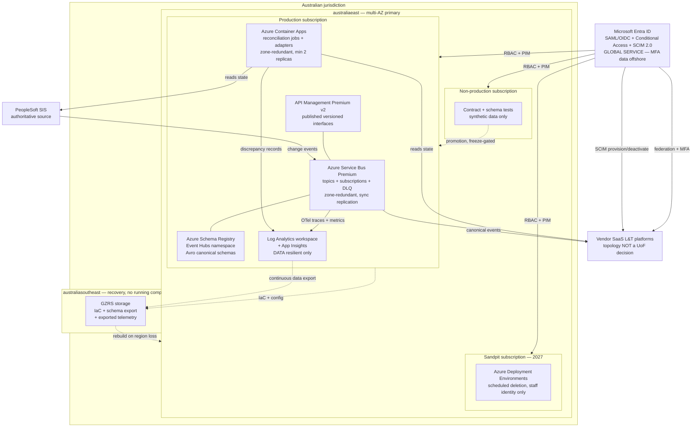

# Azure Technology Research: Learning & Teaching Baseline Strategy — University-Controlled Integration and Observability Plane

> **Template Origin**: Official | **ArcKit Version**: 6.7.5 | **Command**: `/arckit:azure-research`

## Document Control

| Field | Value |
|-------|-------|
| **Document ID** | ARC-001-AZRS-v1.0 |
| **Document Type** | Azure Technology Research |
| **Project** | Learning & Teaching Baseline Strategy (Project 001) |
| **Classification** | OFFICIAL |
| **Status** | DRAFT |
| **Version** | 1.0 |
| **Created Date** | 2026-07-29 |
| **Last Modified** | 2026-07-29 |
| **Review Cycle** | Re-verify regional and zone facts at ADR-006 Phase 1 (landing zone design); annually thereafter |
| **Next Review Date** | 2027-07-29 |
| **Owner** | Sam Okafor, Integration Architect |
| **Reviewed By** | PENDING — Tobias Ohm (Cybersecurity), Eleanor Frame (Privacy & Records) |
| **Approved By** | PENDING — Cassandra Rhodes, Chief Information Officer |
| **Distribution** | Project Team; Digital & IT; Cybersecurity; Privacy & Records; Procurement; Learning Technologies; Steering Committee |

## Revision History

| Version | Date | Author | Changes | Approved By | Approval Date |
|---------|------|--------|---------|-------------|---------------|
| 1.0 | 2026-07-29 | ArcKit AI | Initial creation from `/arckit:azure-research`. Verifies ADR-006's availability-zone assertion for `australiaeast` / `australiasoutheast` against Microsoft's own regional documentation, maps the six university-controlled components of ADR-001/003/005/008 to named Azure services, and records four findings that contradict assumptions in ADR-005, ADR-006, ADR-008 and ADR-010 | PENDING | PENDING |

---

## Document Purpose and Framework Applicability

This document researches the Azure services that would implement the **six university-controlled components** created by ADR-001 (integration mediation), ADR-003 (observability plane), ADR-005 (deployment topology and environment model) and ADR-008 (identity and access enforcement), hosted on the provider selected by ADR-006.

**It does not research, assess or re-platform vendor SaaS.** Blackboard, Echo360, Turnitin, ExamSoft, PebblePad, Zoom, Qualtrics, Leganto, Evasys and Sonia run where their vendors run them; their residency is a procurement matter under DR-005 and NFR-C-002, as ADR-006 §1.2 states.

**Regions researched**: `australiaeast` (New South Wales) as ADR-006's multi-availability-zone primary, and `australiasoutheast` (Victoria) as ADR-006's code-and-configuration recovery region.

> **Framework applicability.** The University of Funk is a **fictional private Australian higher-education institution**. The applicable frameworks are the **Privacy Act 1988 (Australian Privacy Principles)**, the **ASD Essential Eight** (target Maturity Level 2 by end 2027, per NFR-SEC-002) and **WCAG 2.2 AA**. Currency is **AUD**.
>
> UK Government frameworks — GDS Service Standard, Technology Code of Practice, NCSC Cloud Security Principles, UK GDPR, G-Cloud / Digital Marketplace — have **no standing here and are not assessed**. UK South and UK West are **not candidate regions** and are not evaluated. The base `azure-research` template's *UK Government Suitability*, *G-Cloud Procurement* and *UK data residency* sections are replaced by §7 (Australian residency and APP 8) and §8 (Essential Eight), rather than completed with inapplicable ratings.
>
> **Correction to the Australian assurance framing**: the ASD **Certified Cloud Services List (CCSL) ceased in July 2020** [MS-C7]. There is no current "certified cloud service" status to cite. The live construct is an **IRAP assessment** of the provider plus the customer's own risk-managed assessment. For a private university, IRAP is *assurance evidence*, not an obligation.

### Q&A choices recorded

This research ran non-interactively. No `AskUserQuestion` prompts were presented to a user. Where the skill would have asked, the following were applied and are recorded for audit:

| Question | Option applied | Basis |
|----------|----------------|-------|
| Scope | `Full system` — all six ADR-005/006 in-scope workloads | Default per non-interactive rule; matches ADR-006 §1.2 scope table |
| Risk appetite | `Medium` | Default per non-interactive rule. Note: `ARC-001-RISK-v1.0` records that no approved organisational risk appetite statement exists and its thresholds are PROVISIONAL, so this is an assumption, not a finding |
| Region | `australiaeast` primary / `australiasoutheast` recovery | **Not a default.** Directed by ADR-006 §6.1. The `uk-saas` recipe's UK South / UK West framing was overridden as wrong for this project |

---

## Executive Summary

### Research Scope

Six components, all of them Azure-hosted and university-operated, all of them on the path of personal information moving between systems:

| # | Component | Origin | Character |
|---|-----------|--------|-----------|
| C1 | Integration broker / event mediation | ADR-001 Option B | Persistent, teaching-critical from INT-001 cutover |
| C2 | Canonical schema registry | ADR-001, DR-001 | Small, stateful, low volume, high consequence |
| C3 | State reconciliation service | ADR-003 Option B Layer 3 | Custom-built; reads authoritative source and every derived copy |
| C4 | Telemetry, metrics and log store | ADR-003 Option B Layers 1–2 | Volume-driven; holds derived personal information (CONFIDENTIAL) |
| C5 | Three-tier environment substrate | ADR-005 §5.4 | prod / non-prod / sandpit, separated by subscription **and** identity boundary |
| C6 | Identity and access enforcement plane | ADR-008 Option A | SAML/OIDC federation, MFA at the IdP, SCIM 2.0 lifecycle |

### Key Recommendations

| # | Component | Recommended Azure service | Tier / SKU driven by | Zone-resilient in `australiaeast`? |
|---|-----------|---------------------------|----------------------|-----------------------------------|
| C1 | Event mediation backbone | **Azure Service Bus** (topics/subscriptions) | **Premium** — required for geo-replication and dedicated messaging units | Yes, automatic, all tiers, no extra cost [MS-C2] |
| C1 | Notification / fan-out edge | Azure Event Grid (Standard namespaces) | Standard for pull delivery | Yes, automatic, all tiers — **but some data loss possible in a zone failure** [MS-C3] |
| C2 | Canonical schema registry | **Azure Schema Registry** (an Event Hubs namespace feature) | Standard or Premium Event Hubs namespace | Yes — zone redundancy covers Schema Registry [MS-C4] |
| C3 | Reconciliation service | **Azure Container Apps** (jobs + app), or Azure Functions Flex Consumption | Container Apps: workload-profiles environment in a VNet; Functions: Flex Consumption + ZRS storage | Yes, if enabled at environment creation and min replicas ≥ 2 [MS-C5] |
| C4 | Telemetry and logs | **Azure Monitor** — Log Analytics workspace + workspace-based Application Insights, OpenTelemetry ingestion | Analytics tables; dedicated cluster only if a commitment tier is justified | **Data resilience only. Service resilience is NOT available in any Australian region** [MS-C6] |
| C4 | Instrumentation standard | **Azure Monitor OpenTelemetry Distro** (+ optional parallel OTLP exporter) | n/a — library | n/a |
| C5 | Environment separation | Management groups + **separate subscriptions per tier** + Azure Policy `Allowed locations` (Deny) | n/a | n/a |
| C5 | Sandpit (INT-008, 2027) | **Azure Deployment Environments** — per-project environment types, scheduled deletion | Standard | n/a |
| C6 | Federation, MFA, session control | **Microsoft Entra ID** — SAML 2.0 / OIDC, Conditional Access, Continuous Access Evaluation | Entra ID P1 minimum; **P2 or Entra ID Governance for PIM** | n/a (global service) |
| C6 | Lifecycle provisioning | **Entra ID app provisioning service** (SCIM 2.0 client) | Included with P1 | n/a |
| C6 | Privileged access | **Entra Privileged Identity Management** | **Entra ID P2 or Entra ID Governance** [MS-C13] | n/a |
| C1–C5 | Published, versioned interfaces (NFR-I-001) | Azure API Management | **Premium or Premium v2 required for availability zones** [MS-C9] | Yes, Premium tiers only |
| C1–C5 | OS patch posture where any VM survives | Azure Update Manager + Azure Policy periodic assessment | n/a | n/a |

### Architecture Pattern

Microsoft's **publish/subscribe with a schema registry** pattern, deployed as a single-region zone-redundant landing zone in `australiaeast` with recovery-from-code into `australiasoutheast`. This is the Azure instantiation of ADR-005 Option A, not a variation on it.

The controlling design choice this research surfaces: **Service Bus, not Event Grid, must carry the canonical event backbone.** ADR-005 §5.6 states RPO as "zero events lost". Microsoft documents Service Bus as using synchronous cross-zone replication with "no data loss ... during a zone failure" [MS-C2], while Event Grid's own reliability guide states that during a zone failure "some data loss is possible" and instructs customers to "plan for event durability at the source or in a durable event store" [MS-C3]. Those are materially different guarantees against a Must-priority requirement.

### Australian Regulatory Suitability — summary

| Dimension | Position |
|-----------|----------|
| **Residency (APP 8, NFR-C-002, DR-005)** | Both regions are Australian. All six components' **regional** resources can be pinned to Australian jurisdiction and enforced by Azure Policy. **Two carve-outs apply** — see §7.2 |
| **IRAP** | Azure is IRAP assessed to PROTECTED; the assessment "covers the four available Azure regions" in Australia, which includes both selected regions [MS-C7]. Azure Policy ships a built-in **Australian Government ISM PROTECTED** regulatory-compliance initiative usable as evidence tooling [MS-C8] |
| **Essential Eight ML2 (NFR-SEC-002)** | Managed PaaS moves *patch applications* and *patch operating systems* to Microsoft for C1, C2, C4 and (for Container Apps/Functions) C3. *Restrict administrative privileges* is addressable to ML2 by PIM + Azure RBAC, **conditional on an Entra ID P2 / Governance licence** — see §8 |
| **WCAG 2.2 AA (NFR-U-002)** | Not engaged by the platform. These six components have no student-facing surface. Any staff-facing reconciliation or discrepancy report built on Azure Monitor Workbooks **is** in scope and must be assessed separately |
| **NDB scheme readiness (R-023)** | Azure Monitor + Entra sign-in and audit logs provide the forensic record. Retention must be set to satisfy the 30-day OAIC assessment window and ADR-003's 13-month operational-telemetry retention independently |

---

## 1. Region Verification — discharging ADR-005 Assumption A-2

ADR-005 recorded as Assumption A-2 that zone count "must be verified against the chosen provider at selection, not assumed", and ADR-006 asserted the answer at citation [AZ-C1]. This section verifies that assertion against Microsoft's canonical regional documentation.

### 1.1 Availability-zone support

| Azure region | Programmatic name | Physical location | AZ support | Paired region | Status |
|---|---|---|---|---|---|
| Australia East | `australiaeast` | New South Wales | **Yes** [MS-C1] | Australia Southeast | General |
| Australia Southeast | `australiasoutheast` | Victoria | **No** [MS-C1] | Australia East | General |
| Australia Central | `australiacentral` | Canberra | No | Australia Central 2 | General |
| Australia Central 2 | `australiacentral2` | Canberra | No | Australia Central | **Access restricted** |

**Verdict: ADR-006's assertion is CONFIRMED.** Microsoft's `Regions with availability zones` table lists **Australia East** as the only Australian region in the Asia Pacific column [MS-C1a], and the full `Azure regions list` shows a checkmark against Australia East and no checkmark against Australia Southeast [MS-C1]. ADR-005's zone caveat and ADR-006 Condition 2 both stand on verified fact, not on recollection.

Two supporting points:

- **Zone count.** Microsoft does not publish a per-region zone count. It documents AZ-enabled regions as comprising "one or more datacenters, or zones", and the service-level reliability guides for the services this architecture needs state replication across **three** availability zones in supported regions — Event Grid "automatically replicated across three availability zones" [MS-C3], Event Hubs "across three availability zones in the region" [MS-C4]. ADR-005 §5.3's "three availability zones" requirement is therefore satisfied for `australiaeast` for the services selected, though it is satisfied by platform behaviour rather than by a published zone inventory.
- **Australia Southeast is the documented pair of Australia East** [MS-C1]. This is architecturally useful: geo-redundant storage (GRS/GZRS) replicates automatically to the paired region, which gives ADR-005 its recovery-region copy of code, configuration and exported logs **without standing up a running resource there**. See §7.3.

### 1.2 Candidate-service availability in `australiasoutheast`

ADR-006 asked which candidate services are available in the recovery region at all. Within the evidence available on Microsoft Learn:

| Capability needed in the recovery region | Available in `australiasoutheast`? | Evidence |
|---|---|---|
| Log Analytics workspace (as a replication target) | **Yes** — listed as both a primary and a secondary region in the Oceania region group for workspace replication [MS-C11] | Workspace replication supported regions |
| Azure Monitor Logs zone resilience | **No** — `australiasoutheast` does not appear in the availability-zone supported-regions table at all [MS-C6] | Consistent with §1.1 |
| Azure SQL Managed Instance zone redundancy | Listed as supported [MS-C12] — **an inconsistency in Microsoft's own documentation** against §1.1, flagged in §9.5 | SQL MI feature availability by region |
| Microsoft Defender for Cloud plans | Yes, in the supported-region lists sampled [MS-C10] | Defender for Cloud regional availability |
| Storage (GRS/GZRS target from `australiaeast`) | Yes, by region pairing [MS-C1] | Azure regions list |
| Service Bus / Event Grid / Event Hubs namespaces | Region-level availability is published on `azure.microsoft.com/explore/global-infrastructure/products-by-region`, which is outside the Microsoft Learn documentation corpus and is **not asserted here** | See §9.6 evidence gap |

**Consequence.** ADR-005's recovery posture — code, configuration and telemetry only, no running compute — is deliverable in `australiasoutheast` for the storage and infrastructure-as-code elements. It is **not** deliverable for telemetry in the way ADR-005 and ADR-006 describe it, for two independent reasons set out in §7.3 and §9.2.

---

## 2. Component C1 — Integration Broker / Event Mediation (ADR-001)

### 2.1 Recommended: Azure Service Bus, Premium tier

**Why Service Bus and not Event Grid or Event Hubs.** All nine integrations INT-001 to INT-009 specify publish/subscribe over *change events* about a small number of canonical entities. Volumes are low; consequences are high; ordering and once-only-per-subscriber semantics matter more than throughput. Service Bus topics with subscriptions and filters, dead-letter queues and duplicate detection are the closest fit, and its zone-failure guarantee is the strongest of the three.

| Property | Position | Evidence |
|---|---|---|
| Availability zones | Zone-redundant deployments supported in **all tiers** (Basic, Standard, Premium). Automatically enabled when the namespace is created in an AZ-supporting region. **No extra configuration and no extra cost** | [MS-C2] |
| `zoneRedundant` property | **Deprecated.** May display `false` even when zone redundancy is active. All namespaces in AZ regions are zone-redundant | [MS-C2] |
| Cross-zone replication | **Synchronous**, covering metadata *and* message data. Multiple messaging-store copies must acknowledge writes before completion | [MS-C2] |
| Data loss in a zone failure | **None.** "No data loss occurs during a zone failure because Service Bus synchronously replicates messages across zones before acknowledgment" | [MS-C2] |
| Downtime in a zone failure | Possibly a few seconds; active requests may be dropped; SDK retry with exponential backoff absorbs it | [MS-C2] |
| Physical redundancy (all tiers) | Each messaging store holds one primary and two secondary copies, kept in sync | [MS-C2] |
| Region-wide failure | **Geo-Replication** (metadata **and** data, synchronous or asynchronous) — **Premium tier only**. **Geo-Disaster Recovery** (metadata only, one-way, no failback) — Premium tier only | [MS-C2], [MS-C2b] |
| Region pairing for DR | Not required. Any Service Bus region may be primary or secondary, chosen on latency, compliance or residency grounds | [MS-C2] |
| Premium tier scaling | Dedicated messaging units (MUs); auto-scaling on CPU, memory and connection metrics | [MS-C2c] |

**Tier decision.** Premium is recommended, on three grounds:

1. **Dedicated messaging units** remove noisy-neighbour variance from the propagation-latency measurement NFR-P-001 requires at the 95th percentile.
2. **Geo-Replication is Premium-only.** ADR-005 chose *not* to replicate data cross-region, so this is not required today — but Premium is the only tier that keeps the option open without a migration, and ADR-006 §6.5 explicitly records the recovery-posture ceiling as a live objection.
3. Premium supports namespace-level partitioning, needed only if volumes grow.

**Zone redundancy is not a reason to choose Premium.** It is free in every tier [MS-C2]. Any business case that prices zone redundancy as a Premium uplift is wrong.

### 2.2 Alternative: Azure Event Grid (Standard namespaces)

| Property | Position | Evidence |
|---|---|---|
| Availability zones | Zone-redundant in all AZ regions, **both Basic and Standard tiers**, no configuration, no extra cost, cannot be disabled | [MS-C3], [MS-C3b] |
| Cross-zone replication | Metadata and event data replicated across three availability zones; self-heals and rebalances after a zone outage with no customer action | [MS-C3] |
| **Data loss in a zone failure** | **"During a zone failure, some data loss is possible."** Microsoft's mitigation instruction is to make producers and consumers idempotent with retries, and to "plan for event durability at the source or in a durable event store" | [MS-C3] |
| Region-wide failure | Two options: Microsoft-initiated cross-geo failover (metadata replicated to the paired region, best-effort) or customer-initiated regional failover with client-side DR patterns | [MS-C3c] |

**Assessment.** Event Grid is the right tool for reacting to Azure resource events and for high-fan-out notification, and it is a legitimate edge in front of Service Bus. It is **not** the right tool for the canonical entity backbone, because its documented zone-failure behaviour cannot substantiate ADR-005's "zero events lost" RPO without an additional durable store — which is precisely the durable store Service Bus already is.

### 2.3 Comparison matrix — C1 candidates

| Criterion | Service Bus Premium | Event Grid Standard | Event Hubs Standard |
|---|---|---|---|
| Pattern fit for canonical change events | **Strong** — topics, subscriptions, filters, DLQ | Moderate — push/pull delivery, DLQ | Weak — stream, not per-subscriber queue |
| Zone redundancy in `australiaeast` | Automatic, free, all tiers | Automatic, free, all tiers | Automatic, free (Dedicated needs ≥ 3 CUs) |
| Zone-failure data loss | **None** (synchronous replication) | **Possible** | None stated for Std/Premium |
| Cross-region data replication available | Yes (Premium Geo-Replication) | Metadata only, best-effort | Yes (Geo-Replication) |
| Hosts the Schema Registry | No | No | **Yes** [MS-C4] |
| Open protocol (Principle 9, ADR-006 Condition 3) | **AMQP 1.0** | HTTP/CloudEvents | AMQP 1.0, **Kafka protocol** |
| Ordering guarantee | Within a session / partition | Not guaranteed | Within a partition |
| Verdict | **Recommended for C1** | Supporting edge only | **Required for C2** |

### 2.4 Well-Architected alignment (C1)

| Pillar | Position |
|---|---|
| **Reliability** | Deploy Premium with zone redundancy in an AZ region; enable auto-scaling of messaging units; configure geo-replication or geo-DR pairing per the WAF Service Bus service guide [MS-C2c]. Rehearse promotion at least once — the guide states this explicitly |
| **Security** | Managed identity to the namespace; no shared access signatures in production; private endpoints; Entra RBAC data-plane roles. Supports NFR-SEC-002 and closes the credential-sprawl objection ADR-001 raised against Option A |
| **Cost Optimisation** | Zone redundancy is free. Cost is driven by messaging-unit count (Premium) or operations (Standard), not by resilience. Geo-Replication charges **per replica MU plus replicated GB** [MS-C2d] — the single largest avoidable cost line if a warmer recovery posture is later adopted |
| **Operational Excellence** | Namespace, topics, subscriptions and filters all expressible in Bicep or Terraform, satisfying ADR-005's recovery-from-code posture and NFR-M-002 |
| **Performance Efficiency** | Premium dedicated MUs with auto-scale absorb the teaching-period-commencement spike NFR-S-001 names |

---

## 3. Component C2 — Canonical Schema Registry (ADR-001, DR-001)

### 3.1 Recommended: Azure Schema Registry (Event Hubs namespace feature)

| Property | Position | Evidence |
|---|---|---|
| What it is | A central repository for schemas, held **inside an Event Hubs namespace**, organised into schema groups | [MS-C4a] |
| Tier requirement | **Standard, Premium or Dedicated** Event Hubs namespace. Not available in Basic | [MS-C4a] |
| Schema formats | **Apache Avro**, **JSON Schema**, **Protobuf** | [MS-C4b] |
| Zone redundancy | Covered by Event Hubs zone redundancy — "the zone-redundant deployment model applies to all Event Hubs features, including Capture, **Schema Registry**, and Kafka protocol support" | [MS-C4] |
| Access control | Azure RBAC: `Schema Registry Reader`, `Schema Registry Contributor` at namespace scope | [MS-C4c] |
| Usable with other brokers | Yes — "can also be used with other message or event brokers, including Azure messaging services", so it can serve a Service Bus-based backbone | [MS-C4b] |

### 3.2 Finding: "enforced at runtime" needs qualifying

ADR-001's decisive argument for Option B over Option A was that a broker holding the canonical schema gives **runtime** enforcement rather than enforcement by convention: *"Canonical model enforced at runtime, not by convention — the strongest available treatment for Principle 6 and DR-001."*

On Azure, that claim is **partially deliverable and must be restated**:

- Serialisation and deserialisation against a registered schema is performed by the **client SDK** (`Microsoft.Azure.Data.SchemaRegistry.ApacheAvro`, `@azure/schema-registry-json` and equivalents), which stamps the schema ID into the message content type [MS-C4d].
- The **broker does not reject a non-conforming payload.** Neither Service Bus nor Event Hubs validates message bodies against the registry.
- For JSON Schema specifically, Microsoft's own serializer documentation states: *"The serializer doesn't check whether the deserialized value matches the schema but provides an option to implement such validation"* — validation is an application-supplied callback [MS-C4e].
- Avro is stronger: a payload that does not match the writer schema fails to deserialise, so conformance is enforced at the consumer boundary rather than at the broker.

**Recommendation.** Adopt **Avro** as the canonical serialisation format, not JSON Schema, precisely because Avro converts schema non-conformance into a deserialisation failure that lands in the dead-letter queue and is therefore observable under ADR-003 Layer 2. Then restate ADR-001's benefit honestly as *"enforced at the serialisation boundary and observable on failure"*, and add an ingress validation policy in API Management for any publisher that cannot use the SDK. Recording this now is materially cheaper than discovering at conformance review that "runtime enforcement" meant something weaker than the ADR promised.

---

## 4. Component C3 — State Reconciliation Service (ADR-003 Layer 3)

Reconciliation is scheduled, bursty, custom-built, and reads the authoritative source plus every derived copy. Two viable hosts.

### 4.1 Option 1 (recommended): Azure Container Apps

| Property | Position | Evidence |
|---|---|---|
| Zone redundancy | Supported in all regions that support both Container Apps and availability zones. Replicas automatically scheduled across zones | [MS-C5] |
| **Enable-time constraint** | **Must be enabled at environment creation and cannot be changed afterwards.** Migration requires a new environment and redeployment | [MS-C5] |
| Network requirement | Environment must be deployed **in a virtual network** in an AZ region, with an adequately sized infrastructure subnet — `/23` or larger for Consumption-only, `/27` or larger for workload-profiles environments | [MS-C5] |
| Minimum replicas | **At least two**, to guarantee distribution across zones. Microsoft's guidance and community Q&A both note that a single replica per revision defeats zone redundancy — zone spreading applies to *replicas of a revision*, not to revisions [MS-C5b] | [MS-C5], [MS-C5b] |
| Cost of zone redundancy | **No extra charge** beyond standard Container Apps pricing | [MS-C5] |
| State | Stateless by design; ephemeral storage is lost on replica shutdown. Persistent state requires a zone-redundant Azure Files mount or a database | [MS-C5] |
| Scheduled work | **Container Apps Jobs** — the natural fit for scheduled reconciliation runs. Jobs executing in a failed zone are **aborted and marked failed**; configure retries or parallelism for zone resilience | [MS-C5c] |
| Zone-failure detection | Ingress health probes remove unreachable replicas typically in about 30 seconds | [MS-C5c] |

**Why this is the better fit.** Reconciliation logic is coupled to the canonical model and will be maintained for the life of the plane (ADR-003 §7.2 accepts this as permanent maintenance). Containers keep the runtime and dependency set explicit, version-controlled and portable — which is exactly what ADR-006 Condition 3 (exit designed in) and ADR-004 (third-party component policy) require. Jobs give scheduled execution with a first-class retry model.

**Design obligation this creates.** Because zone redundancy cannot be turned on later, it must be set at the **first** environment creation in `australiaeast`, before any workload lands. Add this to ADR-006 Phase 3 (Build) as a gate, not a preference.

### 4.2 Option 2: Azure Functions, Flex Consumption plan

| Property | Position | Evidence |
|---|---|---|
| Zone redundancy | Supported on **Flex Consumption**, Elastic Premium and Dedicated plans. **Not supported on the Consumption plan** | [MS-C14] |
| Storage requirement | Host storage account **must be zone-redundant (ZRS)**; a separate deployment-container storage account must also be ZRS | [MS-C14] |
| **Cost consequence** | Enabling zone redundancy forces **at least two always-ready instances per per-function scaling group**, so a zone-redundant Flex Consumption app **cannot scale to zero**. Previously idle apps see a cost increase from the always-ready baseline meter running continuously | [MS-C14] |
| Zone redundancy surcharge | No separate meter for the feature; per-instance price is unchanged. The cost increase comes entirely from the forced minimum instance count | [MS-C14] |
| Region support | A specific subset of regions, retrievable via Azure CLI — **must be checked for `australiaeast` at Phase 1** rather than assumed | [MS-C14] |
| Non-runtime behaviour in a zone outage | Plan scaling, app creation, configuration and publishing may be affected even while the app continues serving | [MS-C14] |

**Assessment.** Functions is the lower-friction choice for small event-triggered adapters and is entirely defensible for INT-001-style connector code. For C3 specifically, the forced always-ready floor turns a scheduled job that runs a few times an hour into a continuously billed baseline — the opposite of the consumption-shaped cost profile ADR-006 §4.1 assumed for "event-triggered managed compute". Use Functions for connectors; use Container Apps Jobs for reconciliation.

### 4.3 Comparison matrix — C3 candidates

| Criterion | Container Apps (workload profiles) | Functions Flex Consumption |
|---|---|---|
| Zone redundancy | Yes, **environment-creation-time only** | Yes, plan-level, toggleable |
| Scale to zero with zone redundancy on | Yes (min replicas ≥ 2 for zone spread; scale-to-zero forfeits it) | **No** — forced always-ready floor |
| Scheduled execution | Container Apps Jobs, first-class | Timer trigger |
| VNet requirement for zone redundancy | **Required** | Not required (ZRS storage is) |
| Portability / exit (Principle 9) | **Strong** — OCI images | Moderate — host bindings |
| Essential Eight patch obligation | Base image is the university's; platform is Microsoft's | Runtime and platform are Microsoft's |
| Verdict | **Recommended for C3** | Recommended for connector adapters |

---

## 5. Component C4 — Telemetry, Metrics and Log Store (ADR-003 Layers 1–2)

### 5.1 Recommended: Azure Monitor with OpenTelemetry instrumentation

ADR-003 §6.1 adopted the three layers as a **standard, not a product**, and chose OpenTelemetry specifically so the backend stays substitutable under Principle 9. Azure Monitor honours that:

| Property | Position | Evidence |
|---|---|---|
| Instrumentation | **Azure Monitor OpenTelemetry Distro** for ASP.NET Core, Java, Node.js and Python — one line (`UseAzureMonitor()`) plus connection string | [MS-C15] |
| Vendor neutrality | The Distro is an OpenTelemetry distribution and "supports anything supported by OpenTelemetry". An **OTLP exporter can be added to send to a second destination simultaneously** | [MS-C15b] |
| Exit path | Because instrumentation is OTel, changing backend is a collector re-point, not a rebuild — exactly the substitutability ADR-003 §10.3 relies on for its rollback plan |
| Azure-specific additions | Entra ID authentication for ingestion, offline storage with automatic retries, standard metrics, Live Metrics, auto-populated cloud role name/instance | [MS-C15b] |
| Native OTLP ingestion | Available for AKS workloads in **Preview** only — "not recommended for production workloads" | [MS-C15c] |
| Sampling caveat | Azure Monitor enables **trace-based log sampling by default**. Sampling must be reviewed before it silently discards the very propagation traces NFR-P-001 is measured from | [MS-C15d] |

### 5.2 Finding: the observability plane is *less* zone-resilient than the broker it observes

This is the most consequential finding in this document.

Azure Monitor Logs offers **two distinct** kinds of availability-zone support [MS-C6]:

- **Data resilience** — ingested log data is replicated across zones so it survives a zone loss.
- **Service resilience** — *ingestion, queries and alerts continue to work* during a zone outage.

For `australiaeast`, Microsoft's supported-regions table records:

| Region | Data resilience (shared cluster, default) | Data resilience (dedicated cluster) | **Service resilience** |
|---|---|---|---|
| Australia East | Yes | Yes | **— (not supported)** |
| Australia Southeast | — | — | — |

**No Australian region supports Azure Monitor Logs service resilience** [MS-C6]. Globally it is offered only in East US 2, West US 2, Mexico Central, Italy North, North Europe, Spain Central, UK South and Israel Central.

**Why this contradicts a decision already taken.** ADR-005 §3.1 states as a technical driver: *"Integration observability — NFR-M-001 — Telemetry must survive the failure it is observing — it cannot share the plane's fate."* ADR-005 §7.2 sets the monitoring target: *"Observability plane availability: Independent of, and not lower than, broker availability."* ADR-003's Option A was rejected in part because it *"shares a failure domain with the thing it observes."*

On Azure in `australiaeast`, Service Bus is zone-resilient with no data loss and automatic failover [MS-C2]; Azure Monitor Logs is **data**-resilient but not **service**-resilient [MS-C6]. During a single-zone outage the broker keeps working while log ingestion, KQL queries and log-based alerts may not. The observability plane's availability is therefore **lower** than the broker's — the precise inversion ADR-005 set as a target and ADR-003 used as its argument against Option A.

**Mitigations available, in order of cost:**

1. **Platform metrics and metric alerts do not depend on Log Analytics.** Azure Monitor platform metrics have a separate ingestion path. Move the heartbeat and absence alerts that ADR-003 §6.5 makes binding onto **metric alerts** rather than log-query alerts, so the estate's defining failure mode stays detectable during a zone event.
2. **Azure Service Health and Resource Health alerts** are independent of the workspace and should carry the Layer 1 endpoint-health function [MS-C5c], [MS-C14].
3. **Continuous data export to a GRS/GZRS storage account** preserves the record independently of workspace query availability [MS-C6b].
4. **Do not** buy a dedicated cluster expecting to fix this. Dedicated clusters upgrade *data* resilience where shared clusters lack it — and `australiaeast` already has data resilience on the shared (default) cluster [MS-C6]. A dedicated cluster requires a commitment tier starting at **100 GB/day** [MS-C6], which is almost certainly an order of magnitude above this estate's telemetry volume. Purchasing one would be spend against BR-002 for no gain in the property that is actually missing.
5. Accept and state the residual. Record it in `ARC-001-RISK-v1.0` rather than leaving ADR-005's target asserted and unmet.

### 5.3 Cross-region resilience for C4 — and the second contradiction

| Option | What it does | Bears on ADR-005 / ADR-006 |
|---|---|---|
| **Workspace replication** | Creates a **secondary workspace in another region and ingests logs to both**. Oceania region group permits `australiaeast` → `australiasoutheast` [MS-C11]. Paid; all ingested data replicated unless scoped by data collection rule | **Contradicts** the recovery-region rule. A running secondary workspace continuously ingesting derived personal information is both running infrastructure and personal information at rest in `australiasoutheast` |
| **Data export to GRS/GZRS storage** | Continuously exports selected tables to storage replicated to the paired region. No Azure Monitor surcharge for export itself; storage cost by volume and redundancy tier [MS-C6b] | **Compatible.** Produces a recoverable record in the paired region without a running compute or query resource. **Recommended** |
| Do nothing cross-region | Telemetry is lost with the region | Fails ADR-003's 13-month retention position after a region loss |

**Recommendation: data export to a GZRS storage account, not workspace replication.** It satisfies ADR-005's recovery intent, keeps the recovery region free of running resources, and is the cheaper of the two.

---

## 6. Component C5 — Three-Tier Environment Model (ADR-005 §5.4)

ADR-005 requires separation by **cloud subscription and identity boundary**, not by namespace, tag or naming convention: *"Separation that a misconfiguration can cross is not separation."* Azure supports this natively.

| ADR-005 requirement | Azure mechanism | Notes |
|---|---|---|
| Separate subscription per tier | Management group hierarchy with one subscription per tier (prod / non-prod / sandpit) | Management groups and subscriptions are **not tied to a region** [MS-C16], so the hierarchy is region-agnostic and survives a future region change |
| Separate identity boundary | Distinct Azure RBAC assignment scopes per subscription; separate PIM-eligible role assignments per tier; separate managed identities. A separate Entra **tenant** is available but is not recommended at this footprint [MS-C16b] | A second tenant would double the identity operating surface that ADR-006 §6.3 argument 2 explicitly refuses to do |
| Australian-region enforcement | Azure Policy built-ins **`Allowed locations`** and **`Allowed locations for resource groups`**, both with a **Deny** effect [MS-C8b] | This is the technical control ADR-005 Condition 3 demands. It is also the control that makes DR-005 auditable rather than declarative |
| Personal information prohibited outside production | Azure Policy Deny on cross-tier data paths; private endpoints scoped per tier; Microsoft Purview or Defender for Storage sensitivity scanning as a detective control [MS-C10] | Note ADR-005 Condition 3 requires this to be *"a control, not a policy"*. Prevention is partial: Azure Policy cannot inspect message bodies. The honest position is prevention at the network and identity boundary plus detection on the data stores |
| Interface-identical non-production (NFR-I-001) | Same Bicep/Terraform modules, parameterised per tier | Direct expression of Principle 13 |
| Sandpit: ephemeral, time-limited, auto-expiry, self-service (INT-008) | **Azure Deployment Environments** — per-project **environment types map to a target subscription and a deployment managed identity**; **scheduled deletion** with an expiration date, time and time zone; developer self-service portal; project admins can set expiry on any environment | [MS-C17], [MS-C17b] |

**Finding on the sandpit.** Azure Deployment Environments is an unusually exact fit for ADR-005's 2027 sandpit tier: subscription targeting per environment type, deployment identity per environment type, curated infrastructure-as-code catalogues, and automatic expiry as a first-class property rather than a cleanup script. ADR-005 §5.4 states *"Expiry is a feature"* — in this service it literally is [MS-C17]. This materially de-risks INT-008 and should be recorded against ADR-005 Phase 6.

**Important limitation on the residency control.** The `Allowed locations` policy definition explicitly **excludes resource groups, `Microsoft.AzureActiveDirectory/b2cDirectories`, and resources that use the `global` region** [MS-C8b]. A residency posture enforced solely by that policy therefore has a stated blind spot over exactly the non-regional services identified in §7.2. Assign the resource-group variant as well, and treat global services as an assessed exception rather than as covered.

---

## 7. Data Residency, APP 8 and ADR-010's Four-Tier Rule

### 7.1 What the tiering means for these six components

ADR-010 assigns **Class 1 (identity)**, **Class 2 (academic records and grades)** and **Class 8 (engagement and learning analytics)** to **Tier 3 — Australian, and to remain so**, and places **Class 5 (placement records, sensitive information)** in **Tier 0 — offshore disclosure prohibited absolutely**.

Every one of the six components handles Tier 3 data. **C1 also carries Tier 0 data**: INT-005 moves placement assessment outcomes, which DR-004 identifies as the estate's only sensitive class, through the mediation plane. **C4 holds derived Tier 3 data** — ADR-003 §6.4 classifies telemetry as CONFIDENTIAL derived personal information (identifiers linked to enrolment and role state).

| Component | Highest tier handled | Regional pinning available | APP 8 position if pinned to `australiaeast` |
|---|---|---|---|
| C1 broker | **Tier 0** (INT-005 in transit) | Yes — Service Bus namespace is regional | No cross-border disclosure |
| C2 schema registry | None (schemas carry no personal information) | Yes — Event Hubs namespace is regional | Not applicable |
| C3 reconciliation | **Tier 0** identifiers in discrepancy records | Yes — Container Apps environment is regional | No cross-border disclosure |
| C4 telemetry | Tier 3 derived | Yes — Log Analytics workspace is regional | No cross-border disclosure, **provided workspace replication is not enabled** (§5.3) |
| C5 environments | None in non-prod/sandpit by ADR-005 rule | Yes | Not applicable |
| C6 identity plane | **Tier 3 (Class 1)** | **Partially — see §7.2** | **Cross-border disclosure already occurs. See finding.** |

### 7.2 Finding: the identity plane already discloses Class 1 data offshore

ADR-006 §8.3 records the APP 8 position as: *"no new cross-border disclosure created. Both selected regions are Australian; the assessment records this as an avoided trigger rather than an assessed one."* ADR-010 Tier 3 records Class 1 identity as *"Currently Australian"*.

Microsoft's own data-residency documentation does not support that for the identity control plane ADR-008 selects:

| Entra ID component | Data location for an Australian-billing-address tenant | Evidence |
|---|---|---|
| Directory Management | **Australian datacentres** | [MS-C18] |
| Authentication | **Australian datacentres** | [MS-C18] |
| **All other Entra services** | **"store customer data in global datacenters"** | [MS-C18] |
| **Entra multifactor authentication** | **"stores Identity Customer Data in global datacenters"**; elsewhere stated as *"stores Customer Data in the US and processes it globally"* | [MS-C18], [MS-C18b] |
| Azure RBAC role definitions, role assignments, deny assignments | **"stored globally"**, deliberately, so access survives regional loss | [MS-C18b] |

**Consequence.** ADR-008 Option A enforces **MFA at the identity provider** as its central control — and Entra MFA is the named exception to Australian identity-data residency. The university's chosen enforcement mechanism therefore involves an offshore disclosure of Class 1 identity data *today*, before any Azure region is selected. This is neither exotic nor disqualifying — it is the ordinary position of every Australian Microsoft 365 tenant — but three artefacts currently state otherwise:

1. **ADR-006 §8.3** claims APP 8 is an *avoided* trigger. For the regional workloads C1–C5 that is correct. It is not correct for C6.
2. **ADR-010 Tier 3** treats Class 1 as Australian, with any offshore move requiring assessment *before* the move. That move has already happened, by inheritance rather than by decision — the exact failure mode Principle 8 exists to prevent.
3. **ADR-008** does not address residency at all. Its six conditions cover naming local-account platforms, dated exceptions, an interim revocation path, session-window measurement, the Principle 19 test, and stakeholder engagement. None of them is an APP 8 assessment of the identity plane.

**Recommended action.** Add a seventh condition to ADR-008 and a Tier 3 footnote to ADR-010: complete an APP 8 assessment for Entra MFA and the non-Australian Entra component services, using the Microsoft Entra data-location dashboard as the evidence base [MS-C18b], and record formal acceptance against Eleanor Frame before the identity uplift proceeds. Note that Microsoft's `Go-Local` add-on offers Australian data residency for **Entra External ID** tenants only [MS-C18c] — it is not a remedy for the workforce tenant.

### 7.3 Finding: "telemetry but no personal information" in the recovery region is self-contradictory

ADR-005 §5.3 and ADR-006 §6.1 and Condition 2 all state that the recovery region holds **"code, configuration and telemetry only — no running compute, no personal information at rest."**

ADR-003 §6.4 states, bindingly, that telemetry is **CONFIDENTIAL** and **"Contains derived personal information (identifiers linked to enrolment and role state)."**

The two statements cannot both hold. If telemetry is replicated to `australiasoutheast`, then derived personal information is at rest there. If no personal information is at rest there, then telemetry is not replicated there.

**Resolution.** The clause should read *"code, configuration, and an exported copy of telemetry held as encrypted blobs in geo-redundant storage."* That is:

- **Compatible** with both statements once the export is acknowledged as a personal-information holding subject to APP 11 and to ADR-003's 13-month retention, entered in the DR-005 register with `australiasoutheast` recorded as a second Australian location for the same holding.
- **Deliverable** via Azure Monitor continuous data export to a GZRS storage account, which replicates to the paired region — and `australiasoutheast` is the documented pair of `australiaeast` [MS-C1], [MS-C6b].
- **Not** deliverable via workspace replication without breaching the no-running-compute rule (§5.3).

Both regions being Australian means this is an **APP 11** question (security and retention of a second copy), not an **APP 8** question. It does not add a cross-border disclosure and does not disturb ADR-010's tiering.

---

## 8. Essential Eight ML2 Alignment (NFR-SEC-002, R-020)

The estate sits largely at ML1 against an end-2027 ML2 target. This section addresses only how the Azure platform for these six components contributes. It does **not** address teaching-lab fleets or lecture-theatre capture appliances, which ADR-006 §7.4 correctly identifies as the dominant remaining gap and TC-4 places partly outside project control.

| Mitigation strategy | Azure contribution for C1–C6 | Evidence | Residual obligation |
|---|---|---|---|
| **Patch applications** | Service Bus, Event Grid, Event Hubs, Azure Monitor, Container Apps control plane and Functions runtime are all managed PaaS — Microsoft patches the platform. This is the single strongest Essential Eight argument for the managed-service preference ADR-006 §4.1 records | [MS-C2], [MS-C3], [MS-C4], [MS-C6], [MS-C5], [MS-C14] | **Container base images are the university's.** Container Apps patches the platform, not your image. A base-image rebuild cadence and an image-vulnerability gate are required — otherwise "managed service" is claimed for a surface the university actually owns |
| **Patch operating systems** | No self-managed VMs are required by this architecture. Where any VM or Arc-enabled server survives, **Azure Update Manager** with the Azure Policy definitions *Configure periodic checking for missing system updates* and *Schedule recurring updates using Azure Update Manager* provides assessment every 24 hours and scheduled deployment at scale | [MS-C19] | Two caveats: separate policies are required for Windows and Linux, and **"Assessments retrieve the latest updates only for Azure Virtual Machines in the Running state"** — a stopped or deallocated machine reports nothing and silently looks compliant |
| **Restrict administrative privileges** | **Entra Privileged Identity Management**: eligible rather than active assignments, just-in-time activation, time-bound windows (typically 1–8 hours), approval workflow, MFA on activation, justification, access reviews and audit history. Integrated into the Azure RBAC *Access control (IAM)* experience for eligible and time-bound role assignments | [MS-C13], [MS-C13b], [MS-C20] | **Licence gate: Entra ID P2 or Entra ID Governance** [MS-C13]. This belongs in ADR-008 Condition 5's joint Principle 19 test — the ML1→ML2 movement ADR-008 claims for this strategy is licence-dependent, and ADR-008 does not say so. **Post-activation caveat**: after activating a role a user is not prevented from using a different device, browser session or location unless Conditional Access policies are scoped to eligible users directly [MS-C20] |
| **Multi-factor authentication** | Enforced once at the IdP via Conditional Access, per ADR-008 Option A. Platform administration under institutional SSO satisfies ADR-006 Condition 5 | [MS-C21] | Residency exception per §7.2 |
| **Regular backups** | Schema registry export, infrastructure-as-code in version control, Azure Monitor continuous data export to GZRS storage. ADR-005 §5.6 correctly expresses RPO in *events* rather than minutes | [MS-C6b] | NFR-SEC-002's acceptance criterion requires backup coverage **verified by restore test, not vendor description**. ADR-006 §8.1 already sets the recovery-from-code rehearsal; extend it to a telemetry-export restore |
| Application control · Restrict Office macros · User application hardening | Not engaged by these six components — no user-facing endpoints in scope | — | Endpoint estate. ADR-008 [PC-C6] already records *User application hardening* at ML1 with partial browser hardening, which bears on the browser-based federation path |

**Evidence tooling.** Azure Policy ships a built-in **Australian Government ISM PROTECTED** regulatory-compliance initiative that maps ISM compliance domains and controls to policy definitions, with per-control ownership marked customer, Microsoft or shared [MS-C8]. It is not an Essential Eight assessment, and asserting otherwise would be wrong — but it is the closest available continuous-compliance instrument in the Australian context and gives Tobias Ohm machine-generated evidence rather than a spreadsheet. Microsoft's own caveat applies verbatim: *"compliance in Azure Policy is only a partial view of your overall compliance status"* [MS-C8].

### 8.1 Microsoft Cloud Security Benchmark mapping

| MCSB v2 control | Applied here |
|---|---|
| **PA-2 — Avoid standing access for user accounts and permissions** | PIM eligible assignments across all three subscriptions; no standing Owner or Contributor at subscription scope; approval workflow on privileged activation; JIT VM access via Defender for Cloud where any VM exists [MS-C20] |
| PA — Privileged access | Exactly one vaulted break-glass credential per platform with logged check-out, per ADR-008 Option A |
| IM — Identity management | Managed identities for all service-to-service authentication; no connection strings or shared access signatures in production — directly answers ADR-001's credential-sprawl objection to Option A |
| DP — Data protection | Encryption in transit and at rest by default; customer-managed keys available; private endpoints per tier |
| LT — Logging and threat detection | Azure Monitor + Entra sign-in and audit logs; Microsoft Defender for Cloud, supported in both `australiaeast` and `australiasoutheast` [MS-C10] |
| AM — Asset management | Azure Policy `Allowed locations` (Deny) plus tagging; resource inventory feeds the DR-005 residency register |

---

## 9. Findings Register

Ranked by consequence to decisions already taken.

| # | Finding | Artefacts affected | Severity | Recommended action |
|---|---|---|---|---|
| **F-1** | **Azure Monitor Logs has no service resilience in any Australian region.** `australiaeast` provides data resilience only. The observability plane is therefore *less* zone-resilient than the Service Bus broker it observes | ADR-005 §3.1, §7.2 monitoring target; ADR-003 rejection of Option A | **HIGH** | Move heartbeat and absence alerting to metric alerts and Service/Resource Health alerts (independent ingestion paths); do **not** buy a dedicated cluster expecting a fix; record the residual in `ARC-001-RISK-v1.0` and amend ADR-005's "not lower than broker availability" target to a stated, accepted exception |
| **F-2** | **"Telemetry but no personal information at rest" in `australiasoutheast` is internally contradictory**, because ADR-003 §6.4 classifies telemetry as CONFIDENTIAL derived personal information | ADR-005 §5.3; ADR-006 §6.1 and Condition 2; ADR-003 §6.4; DR-005 | **HIGH** | Restate the recovery-region rule as "code, configuration, and an exported encrypted copy of telemetry in geo-redundant storage"; implement via Azure Monitor data export to GZRS, **not** workspace replication; add the second Australian location to the DR-005 register as an APP 11 holding |
| **F-3** | **Entra MFA and all non-Directory-Management/non-Authentication Entra services store identity customer data in global (US) datacentres.** ADR-006's "APP 8 avoided" claim and ADR-010's Tier 3 "currently Australian" both overstate the position for Class 1 | ADR-006 §8.3; ADR-008 (all conditions); ADR-010 Tier 3 | **HIGH** | Add an ADR-008 condition requiring an APP 8 assessment of the Entra identity plane using the Entra data-location dashboard; add a Tier 3 footnote to ADR-010; record formal acceptance against the Privacy & Records Officer. `Go-Local` covers External ID tenants only and is not a remedy |
| **F-4** | **Continuous Access Evaluation does not reach vendor SaaS, and non-CAE policy/group changes take up to 24 hours to propagate** (2 hours with optimisation, and not in all scenarios). CAE requires both client and resource API to be CAE-capable; today that means M365 services and Microsoft Graph, with third-party support dependent on emerging Shared Signals standards [MS-C21] | ADR-008 §3.3, §7.1 target "within 15 minutes", Condition 4 | **HIGH** | ADR-008's 15-minute revocation target is not achievable through Entra alone for Blackboard, Echo360, Turnitin, ExamSoft, PebblePad or Sonia. Condition 4 (measure and publish the per-platform residual session window) is correct and becomes the primary control. Where immediacy is required, `Revoke-MgUserSignInSession` must be invoked explicitly as part of the deprovisioning flow — it is not implicit in a SCIM deactivate |
| **F-5** | **Service Bus and Event Grid have different zone-failure data-loss guarantees.** Event Grid documents that "some data loss is possible"; Service Bus documents none | ADR-005 §5.6 RPO "zero events lost"; ADR-001 | **MEDIUM** | Designate Service Bus as the canonical event backbone; permit Event Grid only where loss is tolerable or a durable source store exists. Record in the ADR-001 implementation standard |
| **F-6** | **Azure Schema Registry validation is client-SDK-side, not broker-side.** No Azure broker rejects a non-conforming payload. For JSON Schema, validation is an application-supplied callback | ADR-001 §Decision Outcome ("enforced at runtime"), Principle 6, DR-001 | **MEDIUM** | Adopt **Avro**, not JSON Schema, so non-conformance becomes a deserialisation failure that dead-letters and is observable; restate ADR-001's benefit as "enforced at the serialisation boundary and observable on failure"; add API Management ingress validation for non-SDK publishers |
| **F-7** | **Container Apps zone redundancy cannot be enabled after environment creation**, requires a VNet with a correctly sized infrastructure subnet, and needs min replicas ≥ 2 | ADR-006 Phase 3 (Build) | **MEDIUM** | Make zone redundancy, VNet placement and subnet sizing gates on the *first* environment created, not later configuration. Same class of constraint applies to API Management Premium v2, where zone redundancy is creation-time only [MS-C9] |
| **F-8** | **Zone-redundant Functions Flex Consumption cannot scale to zero** — it forces at least two always-ready instances per per-function scaling group, so an idle app is billed continuously | ADR-006 §4.1 burst-capacity assumption; BR-002 | **MEDIUM** | Use Container Apps Jobs for scheduled reconciliation; reserve Functions for genuinely event-triggered connectors; model the always-ready baseline explicitly in the RIFF cost submission |
| **F-9** | **Azure API Management supports availability zones only in Premium (classic) and Premium v2.** Basic, Standard, Basic v2, Standard v2, Developer and Consumption do not. Changing zone configuration on Premium classic **changes the public VIP**, and the private VIP in internal VNet mode | NFR-I-001 (published, versioned interfaces); NFR-A-001; BR-002 | **MEDIUM** | If APIM is chosen to publish the versioned interfaces, the availability requirement forces the Premium tier — a material step in the BR-002 envelope that must be priced before RIFF, not after. Consider whether Service Bus plus schema registry alone discharges NFR-I-001 for internal event contracts |
| **F-10** | **The `Allowed locations` policy excludes resource groups, B2C directories, and `global`-region resources** | ADR-005 Condition 3; DR-005; Principle 8 | **LOW** | Assign both `Allowed locations` and `Allowed locations for resource groups` with Deny; treat non-regional and global services as an assessed, recorded exception rather than as covered by policy — which is also where F-3 bites |
| **F-11** | **"ASD Certified Cloud Services" is not a current construct** — CCSL ceased in July 2020. The live mechanism is IRAP assessment plus customer self-assessment | Task framing; ADR-006 §4.3 | **LOW** | Cite Azure's IRAP assessment to PROTECTED (covering all four Australian regions) as assurance evidence. Do not describe any Azure service as "ASD certified" |
| **F-12** | **Microsoft's own documentation is internally inconsistent on `australiasoutheast`.** The canonical regions list shows no AZ support, while the Azure SQL Managed Instance feature-availability page lists Australia Southeast under supported zone-redundancy regions | §1.2; ADR-006 Assumption A-6 | **LOW** | Treat the `reliability/regions-list` and `availability-zones-overview` pages as authoritative for AZ support, and re-verify per service at ADR-006 Phase 1 — which ADR-006 A-6 already requires. Do not build the recovery posture on the SQL MI page |

---

## 10. Target Architecture

### 10.1 Architecture diagram

### 10.2 Component mapping

| ADR component | Azure service | Subscription | Region | Zone posture |
|---|---|---|---|---|
| C1 broker | Service Bus Premium | Production | `australiaeast` | Zone-redundant, no data loss |
| C1 notification edge | Event Grid Standard (optional) | Production | `australiaeast` | Zone-redundant, some loss possible |
| C2 schema registry | Azure Schema Registry (Event Hubs Standard) | Production | `australiaeast` | Zone-redundant |
| C3 reconciliation | Container Apps Jobs (workload profiles, VNet) | Production | `australiaeast` | Zone-redundant, min 2 replicas |
| C3 connector adapters | Functions Flex Consumption (ZRS storage) | Production | `australiaeast` | Zone-redundant, always-ready floor |
| C4 telemetry | Log Analytics + workspace-based App Insights | Production | `australiaeast` | **Data resilient only** |
| C4 backup | GZRS storage account, continuous data export | Production | `australiaeast` → pairs to `australiasoutheast` | Geo-zone-redundant |
| C5 tiers | Management groups + 3 subscriptions + Azure Policy Deny | All | `australiaeast` | n/a |
| C5 sandpit | Azure Deployment Environments | Sandpit | `australiaeast` | n/a |
| C6 identity | Entra ID + Conditional Access + PIM + provisioning service | Tenant-wide | **Global** | n/a |
| Recovery | GZRS storage holding IaC, schema export, exported telemetry | Production | `australiasoutheast` | No running compute |

---

## 11. Cost Model

### 11.1 Position on pricing — stated plainly

**No AUD figures are asserted in this document.** Microsoft Learn does not publish prices, and the retail Azure pricing pages were not retrieved during this research. Inventing indicative figures would breach the honesty position ADR-001 A-1 and ADR-006 A-1 both establish (*"no costing baseline exists for project 001; the cost analysis is comparative, not quantified"*), and would put an unfounded number in front of the CFO in the September business case.

What this section provides instead is the **cost model** — the meters that drive spend, the quantities that must be measured, and the exact pages from which AUD rates must be read at the point of costing. Rates must be retrieved with the currency set to **AUD** and the region set to **Australia East**, and the retrieval date recorded alongside the figure.

### 11.2 Cost drivers by component

| Component | Azure meter / billing unit | Principal quantity to measure | Rate source (read in AUD, `australiaeast`) |
|---|---|---|---|
| C1 Service Bus Premium | Messaging units per hour | MU count (start at 1, auto-scale ceiling) × 730 h | `azure.microsoft.com/pricing/details/service-bus/` |
| C1 Service Bus geo-replication (if adopted) | Replica MUs per hour **plus** GB replicated | Replicas × MUs × 730 h, plus GB/month [MS-C2d] | Same page, data transfer section |
| C1 Event Grid (if adopted) | Operations | Events published + delivery attempts per month | `azure.microsoft.com/pricing/details/event-grid/` |
| C2 Schema Registry | Included in Event Hubs namespace tier | Namespace tier (Standard sufficient) | `azure.microsoft.com/pricing/details/event-hubs/` |
| C3 Container Apps | vCPU-seconds, GiB-seconds, requests; workload profile hours | Replica count × runtime; job executions × duration | `azure.microsoft.com/pricing/details/container-apps/` |
| C3 Functions Flex Consumption | Always-ready baseline (continuous) + always-ready execution time + on-demand execution | **Forced ≥ 2 always-ready instances per scaling group when zone-redundant** [MS-C14] | `azure.microsoft.com/pricing/details/functions/` |
| C4 Log Analytics | GB ingested (Analytics / Basic / Auxiliary tables), GB retained beyond the included period | **The dominant and most controllable variable.** Governed directly by ADR-003 §6.4's identifiers-not-payloads rule and 13-month retention | `azure.microsoft.com/pricing/details/monitor/` |
| C4 data export to GZRS | Storage GB-month at GZRS tier + write operations. **No Azure Monitor surcharge for export itself** [MS-C6b] | Exported GB/month × 13 months rolling | `azure.microsoft.com/pricing/details/storage/blobs/` |
| C5 subscriptions, management groups, Azure Policy | **No charge** | n/a | n/a |
| C5 Azure Deployment Environments | Service charge plus the Azure resources each environment deploys | Concurrent environments × mean lifetime (bounded by scheduled deletion) | `azure.microsoft.com/pricing/details/deployment-environments/` |
| C6 Entra ID | Per user per month, by plan. **P2 or Entra ID Governance is required for PIM** [MS-C13] | Licensed user count × plan | `microsoft.com/security/business/microsoft-entra-pricing` |
| APIM (if adopted) | Units per hour, by tier. **Premium or Premium v2 required for availability zones** [MS-C9] | Units × 730 h | `azure.microsoft.com/pricing/details/api-management/` |

### 11.3 Zone redundancy is free where it matters

A finding with direct business-case consequence: **zone redundancy carries no surcharge** on Service Bus [MS-C2], Event Grid [MS-C3], Event Hubs [MS-C4], Log Analytics ("no extra charge, included with standard workspace pricing") [MS-C6] or Container Apps ("you pay the same rates ... whether zone redundancy is enabled or not") [MS-C5]. The availability posture ADR-005 selected and NFR-A-001 requires is therefore obtained **at no incremental platform cost** for five of six components.

Where resilience does cost money, it costs it indirectly and identifiably:

- Functions Flex Consumption — the forced always-ready floor removes scale-to-zero [MS-C14].
- API Management — the Premium tier gate [MS-C9].
- Cross-region — workspace replication is a paid feature that replicates all ingested data unless scoped by data collection rule [MS-C11]; data export to GZRS storage is materially cheaper and is what §5.3 recommends.
- PIM — an Entra ID P2 or Governance licence [MS-C13].

### 11.4 Cost optimisation recommendations

1. **Set the telemetry retention and minimisation rules before the first log lands.** ADR-006 §7.2 already identifies log retention as the dominant controllable variable. ADR-003 §6.4's identifiers-not-payloads position is simultaneously a privacy control and the largest single cost lever in this architecture — the rare case where the privacy-preferred design is also the cheaper one.
2. **Use Basic or Auxiliary Log Analytics table plans** for high-volume, low-query telemetry; reserve Analytics tables for what reconciliation and latency measurement actually query.
3. **Do not purchase a Log Analytics dedicated cluster.** `australiaeast` already has data resilience on the default shared cluster [MS-C6], the commitment tier starts at 100 GB/day [MS-C6], and a dedicated cluster does not deliver the service resilience that is actually missing (F-1).
4. **Start Service Bus Premium at one messaging unit with auto-scale**, and size from measured capacity metrics rather than from an estimate.
5. **Sandpit cost is bounded by expiry, not by discipline.** Azure Deployment Environments' scheduled deletion makes ADR-005's "expiry is a feature" statement structurally true [MS-C17].
6. **Establish cost allocation and showback per tier subscription from day one**, so the BR-002 line is measurable rather than asserted — ADR-006 §7.3 already requires this.

---

## 12. Implementation Guidance

### 12.1 Infrastructure as code

ADR-005's recovery-from-code posture and Principle 13 both require every tier to be reconstructible from version control. All services named here are fully expressible in Bicep or Terraform. Recommended structure:

| Layer | Contents | Notes |
|---|---|---|
| Platform | Management group hierarchy, three subscriptions, Azure Policy assignments (`Allowed locations`, `Allowed locations for resource groups`, ISM PROTECTED initiative), RBAC and PIM eligible-role definitions | Deployed once; changes are governance events |
| Landing zone | VNet, infrastructure subnet sized for Container Apps workload profiles (`/27` minimum), private endpoints, private DNS zones | The subnet sizing is a one-way door (F-7) |
| Plane | Service Bus namespace and entities, Event Hubs namespace and schema groups, Container Apps environment with `zoneRedundant: true`, Log Analytics workspace, GZRS storage account, data export rules | Zone redundancy must be set at creation |
| Contracts | Avro schema definitions, versioned with a backward-compatibility policy per DR-001 | The canonical model becomes a runtime contract; schema change enters the ADR-001 change process, and per ADR-003 §7.2 that process must include reconciliation impact |

Parameterise per tier from one module set, so non-production is interface-identical to production as NFR-I-001 requires.

### 12.2 Instrumentation standard (ADR-003 Layer 2)

- Adopt the **Azure Monitor OpenTelemetry Distro** for every adapter and the reconciliation service [MS-C15].
- Propagate a **single trace identifier from source change to target write**, which is what makes NFR-P-001 measurable end-to-end at the 95th percentile.
- **Review the default trace-based log sampling** before go-live [MS-C15d]. Sampling that discards propagation traces would make the estate's headline commitment unmeasurable while appearing healthy — the same class of error ADR-003 exists to prevent.
- Keep an **OTLP exporter configured alongside** the Azure Monitor exporter [MS-C15b]. It costs nothing to configure, and it is the practical proof that ADR-003's substitutability claim and ADR-006 Condition 3's exit position are real rather than rhetorical.

### 12.3 Identity implementation notes (ADR-008)

| Element | Azure mechanism | Constraint |
|---|---|---|
| Federation | SAML 2.0 or OIDC enterprise applications per platform | Per-platform capability must be verified; TC-2 makes it pass/fail at RIFF |
| MFA at the IdP | Conditional Access policies | MFA customer data is stored outside Australia (F-3) |
| Lifecycle | Entra **app provisioning service** as a SCIM 2.0 client — create, update and **deactivate**; `DELETE /scim/Users/{id}` for deprovision [MS-C22] | Gallery connectors exist for many SaaS platforms; a non-gallery custom SCIM app **does not support schema discovery** [MS-C22b], so attribute mapping must be authored by hand |
| Provisioning throughput | Gallery onboarding requires ≥ 25 requests/second/tenant and OAuth 2.0 client credentials [MS-C22b] | A vendor endpoint below that rate will not deprovision a full cohort promptly |
| Session revocation | Continuous Access Evaluation for CAE-capable resources; explicit `Revoke-MgUserSignInSession` otherwise [MS-C21] | **F-4.** CAE does not reach vendor SaaS; non-CAE CA and group-membership changes take up to 24 hours to propagate |
| Privileged access | PIM eligible, time-bound, approval-gated, MFA-on-activation | **Entra ID P2 or Governance licence** [MS-C13]; scope CA policies to eligible users directly to close the post-activation gap [MS-C20] |
| Provisioning observability | Provisioning-service alerts for critical events with Log Analytics integration and custom alerts [MS-C22] | Satisfies ADR-008's requirement that a failed revocation be alerted rather than found at audit |

---

## 13. Next Steps

### 13.1 Immediate actions

| # | Action | Owner | Feeds |
|---|--------|-------|-------|
| 1 | Take findings **F-1, F-2, F-3, F-4** to RIFF as amendments to ADR-003, ADR-005, ADR-006, ADR-008 and ADR-010. All four contradict statements in accepted-track decisions and none is discoverable later at lower cost | Sam Okafor | RIFF Review |
| 2 | Run the joint **Principle 19 entitlement test** (ADR-001 C1, ADR-003 C1, ADR-006 C1, ADR-008 C5) as **one** assessment, and extend it to the **Entra ID P2 / Governance** licence PIM requires — that licence is a precondition for the only Essential Eight maturity movement ADR-008 claims | Cassandra Rhodes with Grace Tanaka | ADR-006 Phase 0 |
| 3 | Re-verify per-service regional and zone availability for `australiaeast` and `australiasoutheast` at landing-zone design, per ADR-006 Assumption A-6, using the products-by-region page and `az functionapp list-flexconsumption-locations` | Sam Okafor | ADR-006 Phase 1 |
| 4 | Fix the recovery-region wording (**F-2**) and implement Azure Monitor **data export to GZRS**, not workspace replication | Sam Okafor with Eleanor Frame | ADR-005, ADR-006 Condition 2 |
| 5 | Commission the **APP 8 assessment of the Entra identity plane** (**F-3**) using the Entra data-location dashboard | Eleanor Frame | ADR-008, ADR-010, PIA (dependency D-5) |
| 6 | Cost the model in §11 in **AUD** at `australiaeast` rates, recording the retrieval date, and present a modelled figure at RIFF rather than an assertion | Vernon Ostinato with Sam Okafor | `ARC-001-FINOPS-v1.0`, September business case |
| 7 | Fix the creation-time constraints (**F-7**) as gates on the first environment: Container Apps zone redundancy, VNet and subnet sizing, APIM tier | Sam Okafor | ADR-006 Phase 3 |

### 13.2 Integration with other ArcKit commands

| Command | Consumes from this document |
|---------|---------------------------|
| `/arckit:diagram` | §10.1 target architecture; deployment and network views ADR-006 §7.3 requires |
| `/arckit:finops` | §11 cost model, meters and rate sources |
| `/arckit:devops` | §12.1 infrastructure-as-code structure; promotion path across the three tiers |
| `/arckit:risk` | Findings F-1 to F-12, particularly F-1 (unmet ADR-005 availability target) and F-3 (unassessed APP 8 disclosure) |
| `arckit-au:au-e8-posture` | §8 Essential Eight mapping and the residual obligations column |
| `arckit-au:au-pia` | §7 residency analysis; F-2 and F-3 |
| `/arckit:conformance` | §9 findings as conformance assertions against ADR-003, ADR-005, ADR-006, ADR-008, ADR-010 |

---

## 14. Assumptions

| # | Assumption | If invalid |
|---|-----------|-----------|
| A-1 | No costing baseline exists for project 001; §11 is a cost model, not a quantified estimate (inherited from ADR-001 A-1 and ADR-006 A-1) | The model stands; only the rates change |
| A-2 | Regional and zone facts as documented on Microsoft Learn at 2026-07-29 remain accurate at build. Azure regional coverage changes over time | Re-verify at ADR-006 Phase 1, as ADR-006 A-6 already requires |
| A-3 | ADR-006 Condition 1 confirms the Microsoft agreement covers the required services | ADR-006 returns to RIFF and the AWS Option B analysis is re-opened. This research does not survive a provider change |
| A-4 | The estate's telemetry volume is well below 100 GB/day, so a Log Analytics dedicated cluster is not justified | If volume exceeds the commitment tier, revisit — but note it still would not deliver service resilience (F-1) |
| A-5 | Vendor SaaS platforms expose sufficient read APIs for reconciliation (ADR-003 Condition 3) and SCIM endpoints for lifecycle (ADR-008) | Reconciliation and provisioning coverage reduce to the platforms that can support them, with named exceptions |
| A-6 | Azure Monitor platform metrics and Service/Resource Health alerts use ingestion paths independent of Log Analytics, and therefore remain available during a zone event affecting the workspace | The F-1 mitigation weakens materially and the residual availability exposure must be restated |
| A-7 | The university's Entra tenant has an Australian billing address, so Directory Management and Authentication data are Australian-resident | If not, the residency position in §7.2 is weaker than stated and F-3 escalates |

---

## External References

### Document Register

| Doc ID | Filename | Type | Source Location | Description |
|--------|----------|------|-----------------|-------------|
| PRIN | ARC-000-PRIN-v1.1.md | ArcKit artifact | `projects/000-global/` | Principles 7, 8, 9, 10, 11, 13, 16, 17, 19 |
| REQ | ARC-001-REQ-v1.0.md | ArcKit artifact | `projects/001-lt-ecosystem/` | BR, FR, NFR, INT, DR requirement identifiers |
| ADR1 | ARC-001-ADR-001-v1.0.md | ArcKit artifact | `projects/001-lt-ecosystem/decisions/` | Integration mediation; the broker this research services |
| ADR3 | ARC-001-ADR-003-v1.0.md | ArcKit artifact | `projects/001-lt-ecosystem/decisions/` | Three-layer observability plane and its binding telemetry data position |
| ADR5 | ARC-001-ADR-005-v1.0.md | ArcKit artifact | `projects/001-lt-ecosystem/decisions/` | Topology, region posture, three-tier environment model, recovery objectives |
| ADR6 | ARC-001-ADR-006-v1.0.md | ArcKit artifact | `projects/001-lt-ecosystem/decisions/` | Azure selection; `australiaeast` / `australiasoutheast`; the zone assertion verified here |
| ADR8 | ARC-001-ADR-008-v1.0.md | ArcKit artifact | `projects/001-lt-ecosystem/decisions/` | Identity and access enforcement; federation, MFA, SCIM, session revocation |
| ADR10 | ARC-001-ADR-010-v1.0.md | ArcKit artifact | `projects/001-lt-ecosystem/decisions/` | Four-tier APP 8 class rule; Tier 0 absolute prohibition |
| MSL | Microsoft Learn documentation | Vendor documentation | learn.microsoft.com | Retrieved 2026-07-29 via Microsoft Learn MCP |

### Citations

All Microsoft Learn citations retrieved **2026-07-29**.

| Citation ID | Category | Source | Quoted or recorded content |
|-------------|----------|--------|----------------------------|
| MS-C1 | Technical Capability | `learn.microsoft.com/azure/reliability/regions-list` | Azure regions list: **Australia East** — availability zone support checkmark, paired region Australia Southeast, New South Wales, `australiaeast`. **Australia Southeast** — no availability-zone checkmark, paired region Australia East, Victoria, `australiasoutheast`. Australia Central and Australia Central 2 — no checkmark; Australia Central 2 marked access-restricted |
| MS-C1a | Technical Capability | `learn.microsoft.com/azure/reliability/availability-zones-overview` | "Regions with availability zones" table, Asia Pacific column lists **Australia East** and does not list Australia Southeast. Also: "For workloads constrained to a single region by data residency or sovereignty requirements, deploying across multiple availability zones is the primary recommended way to maximize availability without moving data outside the region" |
| MS-C2 | Technical Capability | `learn.microsoft.com/azure/reliability/reliability-service-bus` | "Service Bus supports zone-redundant deployments in all service tiers ... zone redundancy is automatically enabled at no extra cost"; "the `zoneRedundant` property is deprecated"; "Service Bus uses synchronous replication across availability zones, including for metadata and message data"; "No data loss occurs during a zone failure"; Geo-Replication requires Premium; "You don't need to use Azure paired regions" |
| MS-C2b | Technical Capability | `learn.microsoft.com/azure/service-bus-messaging/service-bus-geo-dr` | "This feature is available for the Premium tier"; Geo-Disaster Recovery replicates metadata only; Geo-Replication replicates metadata and data |
| MS-C2c | Design Guidance | `learn.microsoft.com/azure/well-architected/service-guides/azure-service-bus` | "Deploy Premium tier with zone redundancy in regions that support availability zones"; enable auto-scaling on CPU, memory and connection metrics |
| MS-C2d | Cost | `learn.microsoft.com/azure/service-bus-messaging/service-bus-geo-replication` | "each replica runs on the same number of MUs as configured on the primary, and you're charged for the total MUs across all replicas ... plus a charge based on the data replicated" |
| MS-C3 | Technical Capability | `learn.microsoft.com/azure/reliability/reliability-event-grid` | "Event data is automatically replicated across three availability zones"; "no additional cost for zone redundancy. You can't enable or disable this feature"; "**during a zone failure, some data loss is possible**"; "Plan for event durability at the source or in a durable event store" |
| MS-C3b | Technical Capability | `learn.microsoft.com/azure/event-grid/faq` | "both basic and standard tiers of Azure Event Grid support availability zones resiliency" |
| MS-C3c | Design Guidance | `learn.microsoft.com/azure/well-architected/service-guides/azure-event-grid` | Two failover options: Microsoft-initiated cross-geo (metadata to paired region, best effort) or customer-initiated regional |
| MS-C4 | Technical Capability | `learn.microsoft.com/azure/reliability/reliability-event-hubs` | "Event Hubs supports zone-redundant deployments in all service tiers ... automatically enabled at no extra cost. But with the Dedicated tier, availability zones are supported only with a minimum of three CUs. The zone-redundant deployment model applies to all Event Hubs features, including Capture, **Schema Registry**, and Kafka protocol support"; "across three availability zones in the region" |
| MS-C4a | Technical Capability | `learn.microsoft.com/azure/event-hubs/schema-registry-overview` | "Azure Schema Registry is a feature of Event Hubs that provides a central repository for schemas"; "The feature is available in the **Standard**, **Premium**, and **Dedicated** tiers" |
| MS-C4b | Technical Capability | `learn.microsoft.com/azure/event-hubs/schema-registry-concepts` | "The schema registry is part of the Event Hubs namespace but can also be used with other message or event brokers"; Avro, JSON Schema and Protobuf formats |
| MS-C4c | Security | `learn.microsoft.com/azure/event-hubs/schema-registry-dotnet-send-receive-quickstart` | `Schema Registry Reader` and `Schema Registry Contributor` roles at namespace level |
| MS-C4d | Technical Capability | `learn.microsoft.com/javascript/api/overview/azure/schema-registry-json-readme` | Serializer emits `contentType` of `application/json+<Schema ID>`; schema ID carried in the message |
| MS-C4e | Technical Limitation | `learn.microsoft.com/javascript/api/overview/azure/schema-registry-json-readme` | "**The serializer doesn't check whether the deserialized value matches the schema** but provides an option to implement such validation. The application can pass a validation callback function" |
| MS-C5 | Technical Capability | `learn.microsoft.com/azure/reliability/reliability-container-apps` | "Enable zone redundancy during environment creation. This setting can't be changed after the environment is created"; VNet required; "`/23` ... or larger" Consumption-only, "`/27` ... or larger" workload profiles; "Set your minimum replica count to at least two"; "You don't incur extra charges beyond standard Container Apps pricing when you enable zone redundancy" |
| MS-C5b | Technical Capability | `learn.microsoft.com/answers/a/2064946` | Zone redundancy distributes replicas of a revision across zones, not revisions themselves; run a single active revision with ≥ 3 replicas |
| MS-C5c | Technical Capability | `learn.microsoft.com/azure/reliability/reliability-container-apps` | "Any job executions that run in the affected zone are aborted and are marked as failed ... configure retries, or configure parallelism"; ingress health-probe failover "typically occurs in about 30 seconds"; Azure Service Health alerts for zone failures |
| MS-C6 | Technical Limitation | `learn.microsoft.com/azure/azure-monitor/logs/availability-zones` | Supported-regions table: **Australia East** — data resilience shared ✅, dedicated ✅, **service resilience blank**. Australia Southeast absent. "A subset of the availability zones that support data resilience currently also support service resilience"; "In regions that only support data resilience, your stored data is protected against zonal failures, but service operations might be impacted"; dedicated cluster "Requires a commitment tier starting at 100 GB a day" |
| MS-C6b | Technical Capability | `learn.microsoft.com/azure/azure-monitor/logs/best-practices-logs` and `learn.microsoft.com/azure/reliability/reliability-monitor-logs` | "Configure data export from specific tables to a storage account that's replicated across regions ... Use a geo-redundant storage (GRS) or geo-zone-redundant storage (GZRS) account"; "Storage costs vary by volume and redundancy tier (GRS). No extra Azure Monitor charge for export itself"; availability zones "No extra charge. Included with standard workspace pricing" |
| MS-C7 | Compliance | `learn.microsoft.com/azure/compliance/offerings/offering-australia-irap` | "An IRAP assessment has been completed for the Azure in-scope services for the processing of government data in Australian regions up to and including the PROTECTED level"; "The assessment of Microsoft's services in Australia covers the four available Azure regions"; "**Following the closure of CCSL in July 2020**, Microsoft will continue to have Azure cloud services assessed by an IRAP assessor, while agencies can continue to self-assess" |
| MS-C8 | Compliance | `learn.microsoft.com/azure/governance/policy/samples/australia-ism` | Australian Government ISM PROTECTED regulatory-compliance built-in initiative maps compliance domains and controls to Azure Policy definitions with customer / Microsoft / shared ownership. "Compliance in Azure Policy is only a partial view of your overall compliance status" |
| MS-C8b | Technical Capability | `learn.microsoft.com/azure/governance/policy/samples/mcfs-baseline-global` | `Allowed locations` (Audit, **Deny**, Disabled) — "Excludes resource groups, `Microsoft.AzureActiveDirectory/b2cDirectories`, and resources that use the 'global' region"; `Allowed locations for resource groups` is a separate definition |
| MS-C9 | Technical Limitation | `learn.microsoft.com/azure/reliability/reliability-api-management` and `learn.microsoft.com/azure/api-management/enable-availability-zone-support` | "You must use the Premium (classic) or Premium v2 tier to configure availability zone support. API Management doesn't currently support availability zones in the classic Consumption, Developer, Basic, and Standard tiers or in the Basic v2 and Standard v2 tiers"; Premium v2 zone redundancy is creation-time only; "Changing the availability zone configuration of an existing API Management Premium instance changes the public virtual IP (VIP) address" |
| MS-C10 | Technical Capability | `learn.microsoft.com/azure/defender-for-cloud/regional-availability` | Defender for Cloud supported regions include both Australia East and Australia Southeast across the plans sampled |
| MS-C11 | Technical Capability | `learn.microsoft.com/azure/azure-monitor/logs/workspace-replication` | Oceania region group — primary regions Australia Central, Australia Central 2, Australia East, Australia Southeast; secondary (replication) locations Australia Central, Australia East, Australia Southeast. "creating a secondary instance of your workspace in another region and ingesting your logs to both workspaces ... This is a paid feature" |
| MS-C12 | Documentation Inconsistency | `learn.microsoft.com/azure/azure-sql/managed-instance/region-availability` | Zone redundancy listed as supported in Asia Pacific for both Australia East **and Australia Southeast** — inconsistent with MS-C1 and MS-C1a. Recorded as finding F-12 |
| MS-C13 | Licensing Constraint | `learn.microsoft.com/entra/id-governance/privileged-identity-management/pim-getting-started` and `.../pim-configure` | "To use Privileged Identity Management, you must have a Microsoft Entra ID P2 or Microsoft Entra ID Governance license" |
| MS-C13b | Technical Capability | `learn.microsoft.com/azure/role-based-access-control/pim-integration` and `.../role-assignments-eligible-activate` | Eligible and time-bound Azure RBAC role assignments via PIM, integrated into the Access control (IAM) page; requires Entra ID P2 or Governance |
| MS-C14 | Technical Constraint | `learn.microsoft.com/azure/reliability/reliability-functions` and `learn.microsoft.com/azure/azure-functions/functions-zone-redundancy` | "Consumption plans don't support availability zones"; Flex Consumption requires ZRS host storage; "at least two always-ready instances are required for each per-function scaling function or group while zone redundancy is enabled, **a zone-redundant Flex Consumption app doesn't scale to zero**"; "Enabling zone redundancy doesn't add a separate charge ... However, enabling zone redundancy increases the minimum number of instances your plan must run, which can increase your bill"; region list retrievable via Azure CLI |
| MS-C15 | Technical Capability | `learn.microsoft.com/azure/azure-monitor/app/opentelemetry-enable` and `.../opentelemetry-configuration` | Azure Monitor OpenTelemetry Distro for ASP.NET Core, .NET, Java, Node.js and Python; `UseAzureMonitor()`; connection string precedence code → environment variable → configuration file |
| MS-C15b | Technical Capability | `learn.microsoft.com/azure/azure-monitor/app/application-insights-faq` | "you can add: An OpenTelemetry Protocol (OTLP) exporter and send to a second destination simultaneously"; "the Distro supports anything supported by OpenTelemetry"; Microsoft Entra authentication, offline storage and automatic retries |
| MS-C15c | Technical Limitation | `learn.microsoft.com/azure/azure-monitor/containers/kubernetes-open-protocol` | Native OTLP ingestion for AKS is "a **preview**. Preview features are provided without a service-level agreement and aren't recommended for production workloads" |
| MS-C15d | Technical Constraint | `learn.microsoft.com/microsoftteams/platform/teams-sdk/in-depth-guides/observability/open-telemetry` | "Azure Monitor enables trace-based log sampling by default ... Review the sampling configuration for production workloads" |
| MS-C16 | Design Guidance | `learn.microsoft.com/azure/cloud-adoption-framework/ready/considerations/regions` | "Management groups aren't tied to a region"; "Subscriptions aren't tied to a region"; "Azure RBAC isn't tied to a region"; Azure Policy allowed-location assignments must be updated to add a region |
| MS-C16b | Design Guidance | `learn.microsoft.com/azure/cloud-adoption-framework/ready/landing-zone/landing-zone-multinational` | "If you don't need separate Microsoft Entra tenants in order to provide strict isolation, you should deploy multiple Azure landing zones in a single Microsoft Entra tenant" |
| MS-C17 | Technical Capability | `learn.microsoft.com/azure/deployment-environments/how-to-schedule-environment-deletion` | "On the expiration date, Azure Deployment Environments automatically deletes the environment and all its resources"; deletion date, time and time zone selectable at creation or later; project admins can set expiry on any environment in the project |
| MS-C17b | Technical Capability | `learn.microsoft.com/azure/deployment-environments/how-to-configure-project-environment-types` and `.../concept-environments-key-concepts` | "Configure the target subscription in which Azure resources are created, per environment type and per project"; "Preconfigure the managed identity that developers use to perform the deployment"; curated IaC catalogues from a GitHub or Azure DevOps repository |
| MS-C18 | Compliance / Residency | `learn.microsoft.com/entra/fundamentals/data-storage-australia` | "For customers who provided an address in Australia or New Zealand, Microsoft Entra ID keeps identity data for these services within Australian datacenters: Microsoft Entra Directory Management, Authentication. **All other Microsoft Entra services store customer data in global datacenters.**" and "**Multifactor authentication stores Identity Customer Data in global datacenters**" |
| MS-C18b | Compliance / Residency | `learn.microsoft.com/entra/fundamentals/data-storage-australia-newzealand` | "certain Microsoft Entra features don't yet support storage of Customer Data in Australia ... **Microsoft Entra multifactor authentication stores Customer Data in the US and processes it globally**"; Azure RBAC "Role definitions, role assignments, and deny assignments are **stored globally**"; Entra data-location dashboard referenced |
| MS-C18c | Licensing / Residency | `learn.microsoft.com/entra/fundamentals/data-residency` | Go-Local add-on is "a feature in Microsoft Entra **External ID**"; local data residence available for Australia and Japan; paid optional add-on |
| MS-C19 | Technical Capability | `learn.microsoft.com/azure/update-manager/tutorial-assessment-deployment-using-policy`, `.../periodic-assessment-at-scale`, `.../assessment-options` | Azure Policy definitions *Configure periodic checking for missing system updates* and *Schedule recurring updates using Azure Update Manager*; "Azure Update Manager fetches updates on your machine once every 24 hours"; separate policies required for Windows and Linux; "**Assessments retrieve the latest updates only for Azure Virtual Machines in the Running state.** Machines in the Stopped or Stopped (deallocated) states are not scanned" |
| MS-C20 | Security Control | `learn.microsoft.com/security/benchmark/azure/mcsb-v2-privileged-access` and `learn.microsoft.com/entra/id-governance/privileged-identity-management/pim-resource-roles-configure-role-settings` | MCSB v2 **PA-2** "Avoid standing access for user accounts and permissions": eligible assignments, approval workflows, MFA requirements, time-bound activation typically 1–8 hours, automatic expiration. Caveat: "After the role is activated, users aren't prevented from using another browsing session, device, or location ... To prevent this situation, you can scope Conditional Access policies to enforce certain requirements for eligible users directly" |
| MS-C21 | Technical Limitation | `learn.microsoft.com/entra/identity/conditional-access/concept-continuous-access-evaluation` and `learn.microsoft.com/entra/architecture/resilience-with-continuous-access-evaluation` | CAE critical events: user account deleted or disabled, password changed, MFA enabled, administrator explicitly revokes a token, elevated user risk. "To use CAE, both the service and the client must be CAE-capable. Microsoft 365 services such as Exchange Online, Teams, and SharePoint Online support CAE"; "Microsoft is working with the industry to build standards that will allow third party applications to use CAE"; "**Changes made to Conditional Access policies and group membership made by administrators could take up to one day to be effective** ... Some optimization is done for policy updates, which reduce the delay to two hours. However, it doesn't cover all the scenarios yet"; remedy is `revoke-mgusersigninsession` or "Revoke Session"; CAE tokens can be long-lived, up to 28 hours |
| MS-C22 | Technical Capability | `learn.microsoft.com/entra/identity/app-provisioning/user-provisioning`, `.../how-provisioning-works`, `.../use-scim-to-provision-users-and-groups` | "The Microsoft Entra provisioning service uses the SCIM 2.0 protocol for automatic provisioning ... to automate the provisioning and deprovisioning of users and groups"; deprovision is `DELETE ~/scim/Users/{id}`; "The provisioning service provides alerts for critical events and allows for Log Analytics integration where you can define custom alerts" |
| MS-C22b | Technical Constraint | `learn.microsoft.com/entra/identity/app-provisioning/use-scim-to-provision-users-and-groups` | Gallery onboarding checklist: "Support at least 25 requests per second per tenant"; "Support the OAuth 2.0 client credentials grant (Required)"; "Support schema discovery (required)". Also: "**Schema discovery isn't currently supported on custom non-gallery SCIM application**" |

### Unreferenced Documents

| Filename | Source Location | Reason |
|----------|-----------------|--------|
| `ARC-001-DATA-v1.0.md` | `projects/001-lt-ecosystem/` | Canonical entity definitions govern the Avro schema content in §3, but were outside the permitted input set for this research task. §3's recommendation is format-level and does not depend on the entity definitions |
| `ARC-001-RISK-v1.0.md` | `projects/001-lt-ecosystem/` | Outside the permitted input set. Risk identifiers R-006, R-007, R-013, R-019, R-020, R-022, R-023, R-024, R-029 are referenced as quoted from ADR-005, ADR-006 and ADR-008 rather than read directly |
| `ARC-001-ADR-002-v1.0.md`, `ARC-001-ADR-004-v1.0.md`, `ARC-001-ADR-007-v1.0.md`, `ARC-001-ADR-009-v1.0.md` | `projects/001-lt-ecosystem/decisions/` | Outside the permitted input set. ADR-002 (role authority), ADR-004 (third-party component policy) and ADR-007 (sourcing hierarchy) all bear on implementation and should be read alongside this document |
| `external/system-landscape.md`, `external/privacy-context.md`, `external/requirements-register.md` | `projects/001-lt-ecosystem/external/` | Outside the permitted input set. Estate composition and the Essential Eight self-assessment are taken as quoted in ADR-005, ADR-006 and ADR-008 |
| `azure.microsoft.com/explore/global-infrastructure/products-by-region` | Vendor site | Not retrieved. Per-region product availability lives outside the Microsoft Learn corpus. §1.2 and action 3 in §13.1 record this as an evidence gap to close at ADR-006 Phase 1 rather than filling it with assumption |
| Azure retail pricing pages | Vendor site | Not retrieved. §11 states the position explicitly: a cost model with named meters and rate sources, no asserted AUD figures |

---

**Generated by**: ArcKit `/arckit:azure-research` command
**Generated on**: 2026-07-29
**ArcKit Version**: 6.7.5
**Project**: Learning & Teaching Baseline Strategy (Project 001)
**Model**: Claude Opus 5
**Generation Context**: Azure service research for the six university-controlled components created by ADR-001 (integration broker), ADR-003 (observability plane), ADR-005 (three-tier environment model) and ADR-008 (identity enforcement), on the provider and regions selected by ADR-006. Executed inline rather than via the `arckit-azure-research` agent so the region and framework overrides could be applied precisely: the `uk-saas` recipe's UK South / UK West framing is **wrong for this project and was discarded**, and `australiaeast` / `australiasoutheast` were researched instead. UK Government frameworks (GDS, TCoP, NCSC Cloud Security Principles, UK GDPR, G-Cloud) excluded as having no standing for a private Australian university; Privacy Act 1988, ASD Essential Eight ML2 and WCAG 2.2 AA applied instead, with IRAP as the assurance reference and the CCSL closure corrected. ADR-006's availability-zone assertion was verified and **confirmed** against Microsoft's canonical regional documentation. Twelve findings recorded, four of them contradicting statements in ADR-003, ADR-005, ADR-006, ADR-008 and ADR-010. No pricing invented: §11 provides a cost model with named meters and rate sources, and states plainly that no AUD figures are asserted. All Microsoft Learn citations retrieved 2026-07-29 via the Microsoft Learn MCP server.

<!-- arckit-provenance:start -->

## Build Provenance

*Stamped automatically by the ArcKit plugin's `provenance-stamp.mjs` PostToolUse hook. Complements (does not replace) the human-authored footer above. Carries only fields the model can't authoritatively self-report: build context from `.arckit/state.json` and effort levels derived from command frontmatter + the silent-downgrade matrix.*

| Field | Value |
|-------|-------|
| Requested Effort | `high` |
| Effective Effort | _unknown — model not parsed from existing footer_ |
| Stamped at | 2026-07-29T23:38:30.049Z |

<!-- arckit-provenance:end -->
