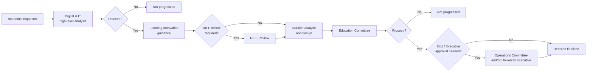

# Technology and Service Research: Target Organisation, Structure and Existing Systems

> **Template Origin**: Official | **ArcKit Version**: 6.7.5 | **Command**: `/arckit:research`

## Document Control

| Field | Value |
|-------|-------|
| **Document ID** | ARC-001-RSCH-v1.0 |
| **Document Type** | Technology and Service Research Findings |
| **Project** | 001-lt-ecosystem — Learning & Teaching Baseline Strategy (The University of Funk) |
| **Classification** | OFFICIAL-SENSITIVE |
| **Status** | DRAFT |
| **Version** | 1.0 |
| **Created Date** | 2026-07-29 |
| **Last Modified** | 2026-07-29 |
| **Review Cycle** | Monthly during engagement; at each contract renewal thereafter |
| **Next Review Date** | 2026-08-28 |
| **Owner** | Dr. Benny Moog, Director Learning Technologies — product owner of the L&T ecosystem |
| **Reviewed By** | [PENDING] — Sam Okafor, Integration Architect; Grace Tanaka, Procurement & Vendor Manager |
| **Approved By** | [PENDING] — RIFF Review, on referral to Steering Committee |
| **Distribution** | Project Team; Steering Committee; Digital & IT; Learning Innovation; Procurement; Education Committee |

> **Classification rationale**: Sections 3 and 4 record vendor-viability events, end-of-life dates and unverified residency positions for platforms The University of Funk currently depends on. Aggregated, this is a map of where the ecosystem is exposed. It is OFFICIAL-SENSITIVE until the WP9 recommendations are tabled. Section 3 market material is drawn entirely from public sources and may be shared with Education Committee without restriction; Sections 2 and 4 should not be circulated to suppliers.

## Revision History

| Version | Date | Author | Changes | Approved By | Approval Date |
|---------|------|--------|---------|-------------|---------------|
| 1.0 | 2026-07-29 | ArcKit AI | Initial creation from `/arckit:research` — organisational baseline (strategy, structure, existing systems) from the six supplied engagement inputs, plus external market research on the real commercial products named in the system landscape | [PENDING] | [PENDING] |

---

## Document Purpose and Standing

This document has an unusual shape for a research artifact, and the reason should be stated before anything else is read.

It answers two questions that are ordinarily answered by two different documents:

1. **What is actually known about the target organisation** — its strategy, its structure, and its existing systems — **from the evidence supplied to this engagement?** This is Part A (Section 2). It is a *baseline of record*, not a discovery exercise. Every statement in Part A is traceable to one of six supplied documents. Where the engagement will eventually need an organisational fact that those six documents do not contain, the fact is recorded as **NOT AVAILABLE** rather than estimated, inferred or assumed.

2. **What is verifiably true, in the public market, about the real commercial products the organisation runs?** This is Part B (Section 3). Every product named in the system landscape is a real, commercially available product from a real vendor. Their corporate events, end-of-life dates, integration standards, hosting positions and published prices are matters of public record and have been researched directly.

**The boundary between Part A and Part B is load-bearing and is never crossed.** No market finding is used to infer an organisational fact, and no organisational assumption is used to interpret a market finding. Where the two must be read together — which is the whole point of the exercise — that reading happens explicitly in Part C (Section 4), with both sides of the inference visible.

**What this document does not do**: it does not select a platform, does not score suppliers, does not model The University of Funk's costs against real contract values, and does not restate the requirements register. Platform selection is a WP6/WP8 output under RIFF governance [D4-C1]. Cost modelling requires the WP3 contract baseline, which does not yet exist (Section 5.6). Requirements mapping is WP7 [D1-C1].

**Frameworks applied**: Privacy Act 1988 and the Australian Privacy Principles; ASD Essential Eight; WCAG 2.2 Level AA. **Frameworks deliberately excluded**: UK Government Digital Service Standard, Technology Code of Practice, G-Cloud / Digital Marketplace, DOS and UK GDPR. The target organisation is an Australian higher-education institution; the UK public-sector procurement and assurance regime has no application to it, and the standard template sections covering those frameworks are marked Not Applicable rather than answered.

---

## 1. Executive Summary

### 1.1 Research Scope and Method

**Organisational evidence base**: six documents, listed in the Document Register. No other source of organisational fact was consulted, and none exists within the engagement. Specifically, the requirements register and the privacy context document were **not** read directly in this pass; where their content is needed it is drawn from the verbatim citations already carried in `ARC-000-PRIN-v1.1` [D5], which quotes them under controlled citation IDs.

**Market evidence base**: 22 web searches and 6 direct page fetches conducted on 2026-07-29 against vendor documentation, vendor trust centres, standards-body publications, court and restructuring records, and higher-education sector sources. Every market claim carries a citation with a URL and a fetch status. Where a claim rests on a secondary aggregator rather than the vendor's own publication, that is stated and the confidence is marked down.

**Research categories identified**: 10, derived from the eight-category capability taxonomy [D2-C1] plus the two adjacent system classes that appear in the integration list but not in the taxonomy (student information system; timetabling and allocation).

| # | Research category | Taxonomy categories served | Platforms in scope |
|---|-------------------|---------------------------|--------------------|
| 1 | Learning management / core platform | 1, 2, 3, 5, 6, 7, 8 | Blackboard |
| 2 | Student information system (authoritative source) | — (adjacent) | PeopleSoft Campus Solutions |
| 3 | Learning capture and synchronous delivery | 3, 4 | Echo360, Microsoft Teams, Zoom |
| 4 | Assessment and academic integrity | 7 | Turnitin, ExamSoft, Remark, OnExam |
| 5 | Portfolio and placement | 5, 7 | PebblePad, Sonia |
| 6 | Learning resources and authoring | 1, 2 | Leganto, H5P, Articulate 360, Camtasia, Adobe Creative Suite, LinkedIn Learning |
| 7 | Active learning and collaboration | 5, 6 | Miro, Padlet |
| 8 | Evaluation and analytics | 8 | Qualtrics, Evasys |
| 9 | Discipline-specific tooling | 1, 2, 3, 5, 7 | Kuracloud (Lt), iSimulate, MuseScore, Ableton Live |
| 10 | Adjacent and planned systems | 7 (badging) | Allocate+, badging platforms, sandpit provisioning |

### 1.2 The Four Findings That Change the Engagement

Four market facts, all verifiable and all dated within the last eleven months, materially alter the risk profile of the ecosystem the engagement is chartered to baseline. None of them appears in the supplied engagement inputs, which is itself the point: the system landscape [D3] is a categorisation map, not a vendor-event register, and nothing in the engagement's foundation artifacts would have surfaced them.

**Finding 1 — The LMS vendor completed a Chapter 11 restructuring five months ago and no longer exists under the name in the engagement documents.** Anthology Inc. and certain subsidiaries filed voluntary Chapter 11 petitions on 29 September 2025 [M-C1]. The plan went effective 27 February 2026, eliminating approximately US$1.6 billion of funded debt [M-C1]. The reorganised company emerged on 2 March 2026, rebranded as **Blackboard**, debt-free, with approximately US$70 million of new financing [M-C2]. Control passed from Veritas Capital to Oaktree Capital Management and Nexus Capital Management [M-C3, M-C4]. The retained core includes the Blackboard LMS, Ally, Illuminate, Evaluate and Institutional Effectiveness [M-C2].

This is not, on its face, bad news — a delevered vendor with US$70 million of fresh capital and a stated commitment to "ongoing investment in Blackboard's learning management system" [M-C2] is arguably a stronger counterparty than the debt-laden one that preceded it. It is, however, a **material change of counterparty** that occurred between the production of the engagement's foundation artifacts and the commencement of the engagement, and it has three consequences the engagement must handle: contract novation and continuity of terms, the disposal of non-core product lines during the two Section 363 sales, and the fact that Principle 8's contractual accountability clauses and Principle 9's termination-assistance obligations were negotiated with an entity that no longer exists in the same form.

**Finding 2 — Blackboard Original Course View retires on 31 December 2026, four months after the engagement ends.** Anthology announced the retirement of Original courses and organisations effective 31 December 2026; after that date all Original content moves to a read-only state that enrolled users can view but instructors cannot edit, with automatic conversion of remaining Original courses to Ultra following [M-C5]. The engagement's WP8 brief already positions Blackboard **Ultra** as the LMS-level target [D1-C2], which is consistent. But the deadline sits *outside* the engagement window and inside the delivery window that WP9's roadmap must sequence. Any WP9 recommendation whose critical path crosses that date competes with a hard vendor deadline for the same institutional capacity.

**Finding 3 — The placement platform is being sunset by its vendor.** Sonia is now a Lumivero product. Lumivero acquired Tevera and is combining the two into an Experiential Learning Cloud, moving Sonia users onto it [M-C29, M-C30]. Sector commentary published 20 May 2026 states that Lumivero "have agreed to continue supporting current Sonia users for the short term", that there will be "no further development on the platform", and that "support will reduce over the coming years until Sonia is phased out completely" [M-C29]. The same source reports user feedback that "the ELC product is not a good fit for the Australian market" [M-C29].

This finding is **MEDIUM confidence** — it comes from an Australian consultancy rather than from Lumivero's own publication, and it must be confirmed directly with the vendor before it is relied upon. But if it holds, integration #6 in the landscape — Sonia ↔ Blackboard grades, currently performed by manual re-keying and already flagged as error-prone with audit concerns [D3-C2] — is not an integration to be uplifted. It is an integration to a platform with a retirement path, and remediating it in place would be spending on a system that is leaving.

**Finding 4 — Two of the three lecture-capture and collaboration platforms have now published verifiable Australian residency and accessibility positions, and the third has not been established.** Echo360 announced on 29 April 2026 that all five Echosystem solutions conform to WCAG 2.2 Level AA [M-C12]. Zoom cloud recordings and post-meeting processing can be pinned to Australia through the Data & Storage region setting, an arrangement AARNet has operated for the Australian education sector since 1 February 2021 [M-C18]. Blackboard's own trust centre names Australia only as a **support** location and declines to name AWS regions at all, while explicitly warning that "some products (e.g., SafeAssign)... may be provided from data centers outside of our clients' usual hosting location" [M-C7]. The public status page groups service regions as APAC, EMEA and US & Canada with no underlying region names [M-C8].

The practical effect is that the platform holding the largest concentration of student personal information in the ecosystem is the one whose residency position is the least publicly documented. That is a WP4 and PIA finding, not a criticism of the vendor.

### 1.3 Key Findings

| # | Finding | Evidence | Affects |
|---|---------|----------|---------|
| F-1 | LMS vendor emerged from Chapter 11 on 2 Mar 2026, rebranded Blackboard, new PE ownership | [M-C1], [M-C2], [M-C4] | Principles 8, 9, 18; WP2, WP6 |
| F-2 | Blackboard Original Course View retires 31 Dec 2026 | [M-C5] | WP8, WP9 roadmap sequencing |
| F-3 | Sonia on a vendor-declared sunset path to Experiential Learning Cloud | [M-C29] (MEDIUM) | Integration #6; WP5, WP9 |
| F-4 | Blackboard AU data residency not publicly documented; SaaS regions named only as APAC/EMEA/US | [M-C7], [M-C8] | Principle 8; PIA; WP4 |
| F-5 | Echo360 holds a dated, third-party-audited WCAG 2.2 AA conformance claim across all five products | [M-C12] | Principle 14; the Teams-vs-Echo360 decision |
| F-6 | PebblePad stores AU/NZ customer data wholly on servers in Australia, on AWS | [M-C26] | Principle 8 — the clearest compliant position in the estate |
| F-7 | Turnitin operates a Sydney AWS data centre; submissions stay in the region of submission | [M-C22] (MEDIUM) | Principle 8; APP 8 assessment |
| F-8 | PeopleSoft Campus Solutions carries Premier Support "through at least 2037" on Continuous Innovation | [M-C10], [M-C11] | Principle 5 — the authoritative source is not at platform risk |
| F-9 | Every core platform in the estate supports LTI 1.3 / LTI Advantage; the integration standard question is settled | [M-C9], [M-C13], [M-C20], [M-C27], [M-C32], [M-C42] | Principles 10, 11; WP5 |
| F-10 | Blackboard Building Block integration for Echo360 reached end of life 30 Dec 2024 | [M-C14] | WP4 — verify the current Echo360 integration is not on a dead mechanism |
| F-11 | H5P LTI is a commercial feature of H5P.com, not of the MIT-licensed H5P software | [M-C35] | Principle 19 — "we already have H5P" may not mean what it appears to |
| F-12 | Open Badges 3.0 became a final 1EdTech standard in June 2024, aligned to W3C Verifiable Credentials | [M-C40], [M-C41] | The badging investigation in landscape note 2 |
| F-13 | Of 20+ platforms, only three publish list pricing; the estate cannot be costed from public sources | Section 5.3 | WP9; SOBC Economic Case |
| F-14 | Microsoft ends Teams recording-expiry notification emails from 1 Jun 2026; retention becomes a tenant-policy responsibility | [M-C17] (MEDIUM) | The Teams-as-capture option; Principle 7 retention |

### 1.4 Build vs Buy Summary

The build/buy question in this ecosystem is not "which platform" — it is "which layer". The evidence supports a clean split.

| Approach | Capability categories | 3-Year TCO | Rationale |
|----------|----------------------|-----------|-----------|
| **BUY (retain and rationalise incumbents)** | All eight taxonomy categories | Not computable from public evidence — see §5.2 and §5.6 | Every one of the eight categories is served by mature, standards-conformant commercial products. No category shows a capability gap that the market cannot fill, and none offers differentiation to the institution |
| **BUILD (institutional layer, no market supplier exists)** | Cross-cutting — serves categories 1–8 | Costable only as effort; six components identified in §5.1 | The canonical data model, the event-driven propagation layer, automated identity and role lifecycle, documented course-rollover automation, the placement outcome exchange, and the capability-and-boundary register have no vendor. Every one is named in the engagement brief or forced by a principle |
| **ADOPT (open source)** | Category 2 (Learning Resources), category 1 (Course Design) | Licence cost nil; operating cost not established | H5P core is MIT-licensed and free [M-C35]; MuseScore is GPLv2 and free to download [M-C46]. Both carry an operating and integration cost that is not nil, and H5P's LTI path is commercial [M-C35] |
| **GOV.UK common platforms** | — | Not applicable | Australian institution; no UK public-sector platform entitlement exists |
| **TOTAL** | 8 categories + 1 cross-cutting layer | **Not computable — Section 5.6 states why, and what would make it computable** | Blended: buy the platforms, build the joins |

### 1.5 Requirements and Evidence Coverage

This document is scoped to organisational and market evidence, not to requirement satisfaction. Requirement-level mapping is WP7 [D1-C3] and is carried in the traceability matrix, not here. What can be stated is coverage of the **evidence** the later work packages depend on.

- **100%** of the platforms named in the system landscape [D3] have been categorised, and each is assigned a research disposition (researched / deferred with reason / not identifiable from public sources).
- **17 of 24** named platforms have at least two independently verifiable market facts recorded. Fourteen have three or more, which is the threshold at which a vendor profile becomes worth spawning.
- **4 of 24** are deferred with reason (Section 3.13): LinkedIn Learning, Camtasia, Adobe Creative Suite, and the Blackboard-adjacent Ally/Illuminate line — none is on the critical path for WP4, WP5 or the rationalisation decisions, and each would consume research budget for no decision value in this pass.
- **1 of 24** — **OnExam** — could not be identified with confidence against any vendor from public sources. See Section 3.9.
- **0 of 24** platforms have publicly available contract, seat-count or spend data. This is the single largest evidence gap and it is structural, not a research failure (Section 5.6).

### 1.6 What This Research Could Not Establish

The following are recorded as **NOT AVAILABLE** because no supplied input contains them and no legitimate external source exists for them. They are listed here rather than buried, because several later work packages assume them.

| Organisational fact | Status | Consequence if it stays unavailable |
|---------------------|--------|--------------------------------------|
| Student enrolment (headcount, EFTSL, load by school) | **NOT AVAILABLE** | No seat-based licence cost can be modelled; no per-student benefit can be quantified |
| Staff numbers — continuing, sessional, casual | **NOT AVAILABLE** | The casual-staff provisioning workaround in integration #2 cannot be sized |
| Number of units/courses, and Original vs Ultra course split | **NOT AVAILABLE** | The 31 Dec 2026 Original retirement cannot be sized as a migration |
| Campus count, locations, teaching modes | **NOT AVAILABLE** | Availability and residency requirements cannot be differentiated by site |
| Revenue, operating budget, IT budget, current licence spend | **NOT AVAILABLE** | REQ-035's "reduce or hold flat" test has no baseline to be measured against |
| Contract values, terms, renewal dates per platform | **NOT AVAILABLE** — WP3 output | The whole of Section 5 remains parametric |
| Faculty/school structure beyond the three named in the stakeholder register | **PARTIAL** | Health Sciences, Music & Performing Arts and the Student Guild are evidenced [D6]; the remainder of the academic structure is not |
| Academic calendar dates, teaching periods, assessment windows | **NOT AVAILABLE** | Principle 15's period-differentiated availability targets cannot be dated |
| Current Essential Eight maturity by mitigation strategy | **PARTIAL** — one control only | MFA is evidenced at ML2 current / ML2 target with a two-tool local-account exception [D5-C19]; the other seven strategies are not evidenced here |
| Institutional risk appetite statement | **NOT AVAILABLE** | Every risk judgement in this document is an architectural recommendation, not a governance finding |

**Method note**: The University of Funk is the client organisation for this engagement. It is not a public institution with a published profile, and no attempt has been made to source organisational facts externally. Any figure for enrolment, revenue, campuses, rankings or executive history that appears in a downstream artifact and cannot be traced to one of the six supplied documents should be treated as unsourced and challenged.

---

## 2. Part A — The Target Organisation as Evidenced

> Everything in this section is traceable to the six supplied engagement documents. Nothing in it is inferred from the market research in Part B.

### 2.1 Strategy — What the Organisation Has Decided to Do

The organisation's L&T technology strategy, as evidenced, consists of three commitments and one deadline.

**Commitment 1 — Rationalise a grown estate rather than replace it.** The engagement is chartered "to understand and rationalise its digital learning technology ecosystem" [D1-C4]. The word is *rationalise*. The nine work packages contain no platform-replacement mandate, and WP8's target-state brief is explicitly grounded in "how Blackboard Ultra sits within the broader ecosystem" [D1-C2] — the LMS is a given, not a question. WP9's recommendations are framed as "tool rationalisation and consolidation; cost optimisation from unused or duplicated capability; capability gaps requiring investment" [D1-C5].

**Commitment 2 — Govern by declared capability boundaries.** The eight-category taxonomy exists so that "every current and proposed tool is categorised... to enable cross-system comparison, duplication analysis and rationalisation decisions" [D2-C1]. Principle 2 converts that into a rule: every category must have a designated primary platform, and every overlap must be classified as primary-with-boundary, transitional-with-retirement-date, or approved permanent exception [D5-C2]. The strategic position is therefore neither "single platform" nor "best of breed" — it is that the choice must be *explicit per category*.

**Commitment 3 — Realise what is already licensed before buying more.** Principle 19 requires evaluation of configuring existing licensed capability before acquisition, with an approved exception needed to buy duplicating capability [D5-C3]. The RIFF rule underneath it is blunter: solutions duplicating already-licensed capability "must justify why the incumbent tool is unsuitable" [D4-C1]. WP3 is designed to produce the evidence — it explicitly captures "functionality paid for but not configured or in use" [D1-C6].

**The deadline**: the engagement runs to **31 August 2026** [D1-C7], and WP9's roadmap is "structured to feed directly into the September business case" [D1-C5]. Today is 29 July 2026. **Thirty-three days remain.**

### 2.2 Structure — Decision Rights and the Approval Path

The organisation's decision structure for learning technology is documented as a single, linear gate chain. It is worth stating plainly because its shape determines what WP9 can realistically recommend.



*Source: reproduced from the governance process document [D4].*

| Body / role | Decision right | Named holder |
|-------------|----------------|--------------|
| Academic requestor | Raises the need; submits the solution request | — |
| Digital & IT | Technical feasibility; integration impact | Cassandra "Cas" Rhodes, CIO [D6] |
| Learning Innovation | Pedagogical fit; RIFF facilitation | Dr. Benny Moog runs RIFF reviews [D6] |
| **RIFF Review** | Architectural fit, capability duplication, integration impact, total cost — **before any procurement or build** | Facilitated by Learning Innovation [D4] |
| Education Committee | Academic approval gate | A/Prof. Pearl Clavinet, Chair [D6] |
| Operations Committee / University Executive | Financial and strategic approval above threshold | Prof. Stella Groove, VC, is ultimate approver of the September business case [D6] |

**Three structural observations that matter architecturally:**

1. **The RIFF gate is conditional, not universal.** The flow contains a decision node — "RIFF review required?" — with a path that bypasses it entirely [D4]. Principle 18 states that architectural review is mandatory for all new and changed learning technology [D5-C4]. These are not the same rule. Who decides that a RIFF review is *not* required, and against what test, is **NOT AVAILABLE** in the supplied process. This is a governance gap, and it is the mechanism by which the current estate's undeclared overlaps could have accumulated without anyone breaking a rule.

2. **The threshold that triggers Operations Committee or Executive approval is NOT AVAILABLE.** The process says approval is required "where thresholds are exceeded" [D4] without stating them. WP9's recommendations cannot be routed to the right forum without this.

3. **There is no documented exit or retirement path.** The process governs *requests* for new or changed technology. Nothing in it initiates, approves or executes the retirement of a platform. Principle 2 requires transitional overlaps to carry "a retirement date and an owner" [D5-C2], and Principle 9 makes exit capability the thing that makes rationalisation executable [D5-C5] — but the governance process has no gate at which a retirement is decided. **A rationalisation strategy running through a governance process that only knows how to say yes to new things is a structural mismatch, and WP6 should raise it as a decision.**

### 2.3 Structure — Stakeholders, Influence and the Standing Tension

Sixteen stakeholders are on record across three tiers [D6]. Five hold High influence; of those, four also hold High or Medium-High interest, which is an unusually well-aligned sponsor group.

| Tier | High influence | Medium influence | Low influence |
|------|----------------|------------------|---------------|
| Executive & governance | Groove (VC), Hammond (DVC-E, **Sponsor**), Rhodes (CIO), Clavinet (Dean L&T), Ostinato (CFO) | — | — |
| Project & delivery | — | Bell (PM), Okafor (Integration Architect), Moog (Director LT), Marimba (Academic Lead), Tanaka (Procurement), Ohm (Cyber), Frame (Privacy) | — |
| Academic & student | — | Key (Dean Music), Anand (Dean Health Sciences) | Castle (Snr Lecturer), Field (Student Guild President) |

**The standing tension is documented, not latent.** The register records it explicitly: "Rhodes (CIO) favours Microsoft-platform consolidation (Teams/Stream); Moog and Key defend best-of-breed pedagogy tools (Echo360, discipline software). This lands squarely in the WP6 decisions register." [D6-C1]

This is the single most consequential structural fact in the engagement, for three reasons:

- It pits a **High-influence** stakeholder (Rhodes, CIO, who also "funds integration uplift" [D6]) against two **Medium-influence** stakeholders — an asymmetry that will not resolve itself on merit.
- The consultant brief anticipates it by name: WP6's worked example is "Echo360 vs Microsoft Stream; Teams scope and provisioning model" [D1-C8].
- The system landscape anticipates it too: note 1 flags MS Teams as overlapping "with Zoom and Echo360 — key rationalisation candidate" with an investigation planned for 2027 [D3-C1].

Three independent documents converge on the same decision. It is the engagement's central architectural question, and Section 4.4 assembles the market evidence that bears on it.

**Two roles carry compliance accountability that constrains platform choice**: Tobias Ohm (Cybersecurity Lead) owns Essential Eight posture and SSO/MFA requirements, and Eleanor Frame (Privacy & Records Officer) owns Privacy Act 1988 / APP compliance, PIA sign-off and Notifiable Data Breach readiness [D6]. Neither is a High-influence stakeholder. Principles 7, 8, 14 and 16 are all CRITICAL or HIGH criticality [D5], and all four are owned by Medium-influence roles. **Compliance criticality and stakeholder influence are inversely correlated in this engagement**, which is a predictable route to late-discovered blockers.

### 2.4 Existing Systems — The Categorisation Baseline

Twenty-four distinct products appear in the system landscape across the eight capability categories, in three usage states [D3].

| Status | Meaning | Count of distinct products |
|--------|---------|---------------------------|
| ✅ In use | Supported and currently in use | 16 |
| 🔑 Licensing | Supported but requires further licensing | 3 (Articulate 360, Adobe Creative Suite, Ableton Live) |
| 🔍 Investigating | Not in use — investigating for 2027 | 3 (Miro, badging software, OnExam) |

**Category occupancy — the duplication picture, counted:**

| # | Capability category | Core platforms | Discipline platforms | Overlap density |
|---|---------------------|----------------|---------------------|-----------------|
| 1 | Course Design | 3 | 1 | Low |
| 2 | Learning Resources | 6 | 4 | **Highest — 10 products** |
| 3 | Learning Delivery | 5 | 1 | Medium |
| 4 | Learning Capture | 3 | 0 | **Three products, one function** |
| 5 | Active Learning | 6 | 2 | **High — 8 products** |
| 6 | Collaboration | 6 | 0 | High |
| 7 | Assessment & Progress Tracking | 8 | 1 | **Highest core count — 8 products** |
| 8 | Evaluation & Analytics | 4 | 0 | Medium |

Three facts follow directly from the map and require no interpretation:

- **Blackboard appears in seven of the eight categories** — every one except Learning Capture. It is the only product with that span. Principle 2 permits a platform to be primary in one category and a declared secondary in another [D5-C2]; Blackboard is currently *undeclared* in all seven.
- **Learning Capture has the cleanest overlap and the sharpest decision**: exactly three products (Echo360, MS Teams, Zoom), one function, and a documented stakeholder disagreement about which should be primary.
- **Assessment & Progress Tracking has the highest core-platform count (8) and the weakest declared boundaries.** Blackboard, Turnitin, ExamSoft, PebblePad, H5P, Remark, badging and OnExam all occupy it. Two of the eight (badging, OnExam) are under investigation rather than in use, and one (Remark) is a desktop optical-mark-recognition product [M-C57] whose relationship to the others is undefined.

**Six investigations are open and unresolved** [D3, notes 1–6]: the Teams platform experience (2027), badging options (Badgr, Credly, Milestone), Articulate 360 enterprise licensing, the Kuracloud internal support model, MuseScore/Ableton use and licensing in the School of Music & Performing Arts, and OnExam's extent of use. Every one of the six is a Principle 2 or Principle 19 question in disguise, and WP3 is the work package that closes them.

### 2.5 Existing Systems — The Integration Baseline

Seven integrations are on record [D3]. Their mechanisms are the ecosystem's central architectural finding.

| # | Integration | Mechanism | Documented failure mode | Principles breached |
|---|-------------|-----------|------------------------|---------------------|
| 1 | PeopleSoft → Blackboard (user, course, institutional role) | Nightly batch flat-file | "Fragile; role assignment failures; no intra-day sync" | 10 (flat file), 11 (batch), 12 (role), 17 (detection) |
| 2 | Echo360 user provisioning | LTI + manual CSV | "Manual workaround for casual academic staff" | 10 (manual transfer), 12 (manual load) |
| 3 | Course cloning automation | Semi-manual scripts | "Undocumented; single-person dependency" | 13 (reproducibility) |
| 4 | Institutional hierarchy updates | Manual | "Drift between PeopleSoft and Blackboard hierarchies" | 5 (source of truth), 10, 12 |
| 5 | Allocate+ → Blackboard group creation | Batch export/import | "Timetable changes not reflected until next run" | 10, 11 |
| 6 | Sonia ↔ Blackboard grades (placements) | **Manual re-keying** | "Error-prone; audit concerns" | 7 (privacy), 10, 11, 17 |
| 7 | Sandpit provisioning | Not yet designed (2027) | — | — |

**Counted:**

- **Six of seven** integrations are live. **Not one** uses a published, versioned interface as its primary mechanism. Principle 10 prohibits exactly the three mechanisms in use — direct file exchange, shared-storage transfer, and manual movement of data [D5-C6].
- **Three of six** (#2, #4, #6) involve a human moving data by hand. Two of those three (#4, #6) carry personal information, and #6 carries assessment outcomes.
- **Two of six** (#1, #5) are scheduled batch. Principle 11 permits batch only by recorded exception with a review date [D5-C7]; no such exceptions are on record.
- **One of six** (#3) has a named single-person dependency, on a process that runs at the busiest point of the academic calendar.
- **Zero of six** have a documented named owner, telemetry, or alerting. Principle 17 requires failure to be detected without a user reporting it [D5-C8]; every documented failure mode in the table above is phrased as something a user experiences.

**The structural finding**: PeopleSoft is the authoritative source for student, course, enrolment and institutional role, and Blackboard is the primary consumer — but the channel between them is a nightly flat file, and the hierarchy that gives the roles meaning is maintained by hand in both systems (#4). Principle 5 requires exactly one authoritative source per core entity [D5-C9]. In the current state there are effectively two, reconciled manually and drifting. **Integrations #1 and #4 are the same defect observed from two ends, and they should be treated as one remediation, not two.**

### 2.6 Existing Systems — Concentration and Blast Radius

Combining the category map with the integration list gives the ecosystem's dependency shape.

| Platform | Categories occupied | Integrations touched | Blast radius if unavailable |
|----------|--------------------|--------------------|-----------------------------|
| **Blackboard** | 7 of 8 | 5 of 7 (#1, #3, #4, #5, #6) | **Total** — it is the student entry point (Principle 1) and the target of every inbound flow |
| **PeopleSoft** | 0 (adjacent) | 2 of 7 (#1, #4) | **Total for identity and enrolment** — it is the authoritative source |
| Echo360 | 3 (3, 4, 8) | 1 of 7 (#2) | Lecture capture and delivery for all recorded teaching |
| MS Teams | 3 (3, 4, 6) | 0 documented | Collaboration; overlaps capture |
| Zoom | 4 (3, 4, 5, 6) | 0 documented | Synchronous delivery |
| PebblePad | 2 (5, 7) | 0 documented | Portfolio assessment |
| Turnitin | 2 (6, 7) | 0 documented | Academic integrity across the assessment estate |
| Sonia | 0 (adjacent to 7) | 1 of 7 (#6) | Placement records for Health Sciences |
| Allocate+ | 0 (adjacent) | 1 of 7 (#5) | Timetable-derived group structures |

**Two single points of failure carry the ecosystem**: Blackboard and PeopleSoft. Every architectural decision in WP8 either reduces that concentration or accepts it. Neither is wrong — but Principle 2 requires the choice to be declared [D5-C2], and at present it is neither declared nor, apparently, consciously made.

---

## 3. Part B — External Market Research: Real Vendors, Public Sources

> **Scope statement.** Every product in this section is a real, commercially available product from a real company. All facts are drawn from public sources — vendor documentation, vendor trust centres, standards-body publications, restructuring records and higher-education sector sources — and each carries a citation with URL and fetch status in the External References section. **Nothing in this section is about, or derived from, the client organisation.** Where a vendor claim is unverified or comes from a secondary aggregator, that is stated and the confidence is marked down.

### 3.1 Market Comparison Table

| Product | Vendor / owner (2026) | LTI 1.3 / Advantage | Provisioning API | AU residency evidenced | WCAG evidence | Viability signal |
|---------|----------------------|--------------------|-----------------|----------------------|--------------|-----------------|
| Blackboard (Learn) | Blackboard, fka Anthology — Oaktree / Nexus [M-C2, M-C4] | Full LTI 1.1 and 1.3/Advantage; 1.3 recommended [M-C9] | REST API — create users, pull assessments, grade data [M-C9] | **Not established** — trust centre names AU as support location only [M-C7] | Stated priority post-emergence [M-C2]; no conformance report located | **Emerged from Ch.11 2 Mar 2026, debt-free, ~US$70m new capital** [M-C1, M-C2] |
| PeopleSoft Campus Solutions | Oracle | N/A (SIS) | PeopleSoft Integration Broker (not researched this pass) | Deployment-dependent | N/A | **Premier Support "through at least 2037"**, rolling annual extension [M-C10] |
| Echo360 (EchoVideo) | Echo360 | LTI 1.1 and 1.3 both documented for Blackboard [M-C13, M-C15] | REST API documented [M-C13] | Not established this pass | **WCAG 2.2 AA across all five products, announced 29 Apr 2026** [M-C12] | Building Block EOL 30 Dec 2024 [M-C14] |
| Microsoft Teams / Stream | Microsoft | Microsoft 365 LTI app for Blackboard exists | Entra ID / SCIM | M365 AU residency available (Melbourne, Sydney) | Microsoft publishes conformance reports | **Recording-expiry emails end 1 Jun 2026** [M-C17] (MEDIUM) |
| Zoom | Zoom Communications | LTI Pro app | REST / SCIM | **Yes — Data & Storage region set to Australia covers storage *and* post-meeting processing** [M-C18] | Vendor VPAT | AARNet has operated the AU education arrangement since 1 Feb 2021 [M-C18, M-C19] |
| Turnitin (Feedback Studio) | Turnitin | LTI 1.3 for Blackboard Ultra documented [M-C20, M-C21] | LTI-mediated | **Sydney AWS data centre; submissions stay in region of submission** [M-C22] (MEDIUM) | Not located this pass | Stable; acquisitive [M-C24] |
| ExamSoft (Examplify) | Turnitin (acquired 2020) [M-C24] | LMS integration incl. Blackboard, with grade sync [M-C25] | LMS sync | Inherits Turnitin position — not separately verified | Not located this pass | Consolidated under Turnitin |
| PebblePad | Pebble Learning | LTI 1.3 for Blackboard Ultra and Learn [M-C27] | LTI-mediated | **Yes — "Australian and New Zealand customer data is wholly stored on servers located in Australia"** [M-C26] | VPAT published [M-C28] | Independent; UK-headquartered |
| Sonia | **Lumivero** (was Planet Software) [M-C31] | LTI-certified [M-C31] | API-based integrations [M-C31] | Not established this pass | Not located this pass | **Sunset path to Experiential Learning Cloud; no further development** [M-C29] (MEDIUM) |
| Leganto | Ex Libris (Clarivate) | LTI integration profiles documented; developer docs still describe LTI 1.1 [M-C32, M-C33] | Shares database with Alma [M-C34] | Not established this pass | Not located this pass | Stable within Clarivate |
| Qualtrics | Silver Lake / CPP Investments (US$12.5bn, completed 28 Jun 2023) [M-C51] | Survey embed | REST API | AU hosting offered on enterprise licences [M-C54]; data-sovereignty page published [M-C52] | Not located this pass | **ISO 27001/27017/27018/27701; IRAP assessment report issued** [M-C53] |
| Evasys | evasys GmbH (fka Electric Paper, Lüneburg, est. 1996) [M-C55] | Not established | Not established | **No — "hosts all data exclusively on German servers"** [M-C55] | Not located this pass | ISO 27001; 900+ organisations [M-C55] |
| Miro | Miro | LTI available on higher tiers | SCIM on Enterprise [M-C49] | **AU residency = Enterprise + paid add-on** [M-C49] (MEDIUM) | Vendor VPAT | Stable |
| Padlet | Padlet | Grade passback and rostering on School & District tier only [M-C50] | SSO on School & District tier only [M-C50] | Not established | Not located this pass | Stable (MEDIUM — secondary pricing source) |
| H5P | H5P Group / community | **LTI is a feature of H5P.com, not of the H5P software** [M-C35] | xAPI native [M-C35] | Deployment-dependent (self-host) | Not located this pass | MIT-licensed core [M-C35] |
| Articulate 360 | Articulate | Authoring tool — publishes to LMS | N/A | N/A (desktop/cloud authoring) | Vendor VPAT | List price US$1,449–1,749/user/yr [M-C36] (MEDIUM) |
| Kuracloud / Lt | ADInstruments (Dunedin, NZ) [M-C44] | **LTI 1.3 compliant** [M-C42] | kuraCloud API, admin guide published [M-C43] | Not established | Not located this pass | Established; NZ-owned |
| iSimulate (REALITi 360) | iSimulate, part of 3B Scientific Group since 2020 [M-C45] | Not established — appears to be device/appliance-centric | Not established | AU/NZ offices [M-C45] | N/A (simulation appliance) | Backed by 3B Scientific |
| MuseScore | MuseScore / community | N/A | N/A | N/A (desktop) | N/A | **GPLv2, free to download** [M-C46] |
| Ableton Live | Ableton | N/A | N/A | N/A (desktop) | N/A | Multi-seat and Education Access Seat licensing published [M-C47, M-C48] |
| Allocate+ (timetabling) | See §3.10 — product identity not confirmed | — | — | — | — | Scientia Syllabus Plus "powers 75% of the Australian higher education market" [M-C56]; acquired by TechnologyOne 2021 |
| Remark | Gravic Inc. | N/A — desktop OMR [M-C57] | N/A | N/A (desktop) | N/A | Long-established (plain-paper OMR invented 1991) [M-C57] |
| OnExam | **Not identified** — see §3.9 | — | — | — | — | — |

### 3.2 Category 1 — Learning Management: Blackboard

**Corporate position.** The vendor named "Anthology" throughout the engagement's foundation artifacts no longer trades under that name. Anthology Inc. and certain subsidiaries filed voluntary Chapter 11 petitions in the US Bankruptcy Court for the Southern District of Texas on 29 September 2025 [M-C1]. The plan went effective 27 February 2026, eliminating approximately US$1.6 billion in funded debt [M-C1]. The company emerged on 2 March 2026 as **Blackboard**, "a stand-alone, debt-free entity", with approximately US$70 million of new financing [M-C2]. Bloomberg reported the creditor-takeover structure in September 2025 [M-C3]; sector analysis records Oaktree Capital Management and Nexus Capital Management taking majority control, replacing Veritas Capital [M-C4].

**Retained product line**: "Blackboard LMS, Ally, Illuminate, Evaluate, and Institutional Effectiveness solutions" [M-C2]. Stated priorities: "ongoing investment in Blackboard's learning management system, responsible and practical applications of artificial intelligence, and a continued focus on usability and accessibility" [M-C2]. Leadership: Bruce Dahlgren continuing as CEO with Dr Matthew Pittinsky set to rejoin as CEO at a future date [M-C2].

**Original Course View end of life.** Anthology announced retirement of Original courses and organisations effective **31 December 2026**. After that date "all Original content in courses and organizations will be placed in a read-only state, which can be viewed by those respective enrolled users, but not edited by instructors or leaders", with remaining Original courses automatically converted to Ultra thereafter [M-C5].

**Integration surface.** Blackboard "currently has full support for LTI 1.1 and LTI 1.3/Advantage", with LTI 1.3 strongly recommended for new tools [M-C9]. REST APIs can "create users, pull assessments, grade data, manage calendars, and more" [M-C9]. The combination matters: **Blackboard can be provisioned via API, which means integration #1's nightly flat file is a choice, not a platform constraint.**

**Hosting and residency.** The trust centre does not name AWS regions. It names support locations as "US, Colombia, India, the Netherlands, Australia" [M-C7] — a support location is not a hosting location. It also carries an explicit warning: "Some products (e.g., SafeAssign)... may be provided from data centers outside of our clients' usual hosting location" [M-C7], and confirms that "our vendors (third-party subprocessors) may require access to client data" on a need-to-know basis [M-C7]. The public status page groups regions only as APAC, EMEA and US & Canada [M-C8]. Secondary sources assert a Sydney AWS deployment, but this **could not be confirmed from vendor documentation** and is recorded as unverified.

**Assessment**: architecturally the strongest position in the estate (widest capability span, best-documented API surface, mature standards support) and commercially the most changed (new owners, new name, five months post-emergence). Both are true simultaneously.

### 3.3 Category 2 — Student Information System: PeopleSoft Campus Solutions

Oracle's lifetime support policy places Premier Support on Continuous Innovation releases for on-premises applications "through at least 2037", with the stated date moved forward annually — producing a rolling ten-year Premier Support window [M-C10]. Campus Solutions moved to the Continuous Innovation model with release 9.2: "all new functionality is delivered as updates to the existing release; upgrades are not required to gain access to new features and capabilities" [M-C11].

**Assessment**: the authoritative source for student, course, enrolment and role is **not** a platform-risk item. There is no vendor-driven forcing function on the PeopleSoft side of integration #1. Any decision to change the mechanism of that integration is therefore an architectural decision taken on its merits, not a migration forced by a vendor date — which is a comparatively rare and useful position to be in.

### 3.4 Category 3 — Capture and Synchronous Delivery: Echo360, Teams, Zoom

**Echo360.** On 29 April 2026 Echo360 announced that all five Echosystem solutions — EchoVideo, EchoInk, EchoEngage, EchoExam and GoReact — conform to WCAG 2.2 Level AA [M-C12]. This is the only dated, product-wide WCAG **2.2** AA conformance claim located for any platform in the estate. Blackboard integration is documented for both LTI 1.1 and LTI 1.3 [M-C13, M-C15], alongside a REST API integration [M-C13]. Critically, **the Blackboard Building Block mechanism reached end of life for use with EchoVideo on 30 December 2024**, with all Building Block content required to be converted to LTI deep links [M-C14].

**Microsoft Teams / Stream.** Teams meeting recordings are stored in OneDrive and SharePoint under the current Stream architecture [M-C16]. A secondary source reports that Microsoft will stop sending recording-expiry notification emails from 1 June 2026, shifting the burden of preventing recording deletion onto tenant meeting-policy expiration settings or retention policies [M-C17] — **MEDIUM confidence, secondary source, to be verified against Microsoft's own message-centre notice.** If it holds, it converts lecture-recording retention from a user-visible warning into a silent tenant-configuration dependency, which is a Principle 7 retention concern and a Principle 17 observability concern.

**Zoom.** Zoom administrators can select the region in which future cloud recordings are kept, including Australia. AARNet — the Australian research and education network — activated Australian cloud-recording storage for its education customers on 1 February 2021 and advises Australian administrators to set the Data & Storage region to Australia, which ensures that "both the storage of items and any post-meeting processing that occurs on recordings such as transcriptions or AI-generated summaries, all happen in Australia" [M-C18]. AARNet operates as a Zoom APAC reseller for Australian education [M-C19].

**The comparison that matters** (see Section 4.4 for the architectural reading):

| Criterion | Echo360 | MS Teams / Stream | Zoom |
|-----------|---------|-------------------|------|
| WCAG 2.2 AA, dated, product-wide | **Yes — 29 Apr 2026** [M-C12] | Not located as a 2.2 AA product-wide claim | Not located |
| AU residency incl. post-processing | Not established this pass | M365 AU geography available | **Yes, explicitly incl. post-processing** [M-C18] |
| Purpose-built timetable-driven capture | Yes (core product) | No — meeting recording | No — meeting recording |
| LTI 1.3 into Blackboard | Yes [M-C15] | M365 LTI app | LTI Pro |
| Retention behaviour | Platform-managed | **Tenant-policy dependent from 1 Jun 2026** [M-C17] | Admin-configured |

### 3.5 Category 4 — Assessment and Integrity: Turnitin, ExamSoft, Remark, OnExam

**Turnitin** documents LTI 1.3 integration with Blackboard Ultra, including assignment configuration, grading and the paper lookup tool [M-C20, M-C21]. On residency, evidence indicates Turnitin's infrastructure spans multiple AWS regions with an Asia Pacific data centre in Sydney, and that submitted documents remain within the AWS region to which they were submitted, each tenant hosted in the data centre closest to it [M-C22] — **MEDIUM confidence**, assembled from developer documentation and an AWS case study rather than from a single authoritative residency statement. Turnitin publishes a subprocessor list [M-C23]. **Action**: obtain Turnitin's written residency and repository-location statement for the institution's tenant; the distinction between where a *submission* is stored and where the *global comparison repository* sits is exactly the kind of detail an APP 8 assessment turns on.

**ExamSoft** was acquired by Turnitin in 2020 [M-C24]. It integrates with Blackboard, Canvas, Moodle and D2L, syncing student and course data and passing grades back to the LMS gradebook [M-C25]. Its residency position was not separately established and should not be assumed to equal Turnitin's.

**Remark** (Gravic Inc.) is plain-paper optical mark recognition software — Gravic invented plain-paper OMR and released the first Remark Office OMR in 1991 [M-C57]. It is a **desktop scanning product**, not a platform. It has no LTI surface, no API integration into the LMS, and no residency question in the cloud sense. Its presence in the Assessment & Progress Tracking category alongside seven cloud platforms is a categorisation artefact worth resolving in WP3: it is a scanning workflow, not a competing assessment platform.

**OnExam** could **not be identified against any vendor with confidence** from public sources. Searches returned Janison — an Australian assessment company delivering NAPLAN and ICAS [M-C58] — but **no evidence links a product named "OnExam" to Janison or to any other vendor**, and the inference is not made here. This is recorded as **NOT ESTABLISHED**; the landscape's own note 6 already flags that an investigation is required to determine its extent and nature of use [D3]. WP3 must establish the vendor before any capability or duplication assessment is possible.

### 3.6 Category 5 — Portfolio and Placement: PebblePad, Sonia

**PebblePad** publishes the clearest residency position in the estate: "Australian and New Zealand customer data is wholly stored on servers located in Australia", hosted on AWS and managed by Pebble Learning, with mirrored servers and daily backups [M-C26]. LTI 1.3 is supported for Blackboard Ultra and Learn, and PebblePad documents the migration path from the Blackboard Building Block to LTI 1.3, noting the two can run in parallel until the Building Block is deactivated [M-C27]. A VPAT is published [M-C28].

**Sonia** is now a Lumivero product [M-C31]. Lumivero acquired Tevera and is combining Sonia's placement capabilities with Tevera's assessment functionality into an **Experiential Learning Cloud** [M-C29, M-C30]. Australian sector commentary published 20 May 2026 reports that Lumivero will support current Sonia users "for the short term", that there will be "no further development on the platform", and that "support will reduce over the coming years until Sonia is phased out completely" — adding that "user feedback is that the ELC product is not a good fit for the Australian market" and characterising the change as "a sector wide enterprise system change" [M-C29].

**Confidence and required action**: this is the highest-consequence MEDIUM-confidence finding in the document. It comes from a third-party Australian consultancy, not from Lumivero. **It must be put to Lumivero in writing before WP9 relies on it.** But it cannot be ignored, because if it holds, integration #6 changes character entirely (Section 4.3).

### 3.7 Category 6 — Learning Resources and Authoring

**Leganto** (Ex Libris, Clarivate) shares a database with Alma, including user and reading-list information [M-C34]. Embedding reading lists in an LMS requires LTI integration configured in both Alma and the LMS, using LTI integration profiles to deep-link into a course, list, section or citation [M-C32]. Notably, the Ex Libris **developer** network documentation for Leganto integrations still describes **LTI 1.1** [M-C33] — worth verifying which LTI version the institution's integration actually runs on, given the general direction of travel to 1.3.

**H5P** carries a finding with direct Principle 19 consequences. The H5P core is free and open source under an MIT licence, with native xAPI support [M-C35]. But **"LTI is a premium feature of the H5P.com platform, but it's not a feature of the H5P software"** [M-C35]. The landscape marks H5P as ✅ In use in three categories [D3]. Whether that is the free software (in which case there is no LTI surface and no grade passback) or an H5P.com subscription (in which case there is a licence line and an LTI surface) is a materially different architectural position, and the landscape does not distinguish them. **WP3 must establish which H5P the institution runs.**

**Articulate 360** — landscape note 3 records that an investigation is required to understand the enterprise licensing model [D3]. Publicly, secondary aggregators report list pricing around US$1,449/user/year (AI Personal) and US$1,749/user/year (AI Teams), annual billing only, with volume discounts typically beginning around 10–25 seats and deeper discounts at 50+ and 100+ seats, and educational discounts available [M-C36]. **MEDIUM confidence** — these are aggregator figures, not vendor-published list prices, and enterprise agreements are negotiated. They are nonetheless the only per-seat price signal available anywhere in the estate, and they are high enough that seat count is the dominant cost variable.

**LinkedIn Learning, Camtasia, Adobe Creative Suite** — **deferred with reason.** None appears in any documented integration, none is contested in the stakeholder tension, and none is a candidate primary platform for a capability category where a boundary decision is contested. Researching them in this pass would consume budget without changing a decision. They should be picked up in WP3's contract and capability sweep.

### 3.8 Category 7 and 8 — Active Learning, Collaboration, Evaluation and Analytics

**Miro** offers SCIM and data residency on its Enterprise tier, with a stated 30-member minimum; secondary sources indicate that **US and Australia data residency require Enterprise plus a paid add-on** beyond the EU option, and that education institutions can access discounts of up to 50% [M-C49]. **MEDIUM confidence** — pricing aggregators, not Miro's own pricing page. Miro is marked 🔍 Investigating for 2027 in the landscape [D3]; the finding to carry into that investigation is that AU residency is not a default and carries incremental cost.

**Padlet** — secondary sources indicate the Classroom tier lacks LMS integrations and SSO, while the School & District tier unlocks grade passback, rostering and single sign-on [M-C50]. **MEDIUM/LOW confidence** — aggregator source. If accurate, it matters: Padlet is marked ✅ In use in two categories [D3], and Principle 16 prohibits local accounts [D5-C10]. **A Padlet deployment on a tier without SSO would be a direct Principle 16 breach**, and landscape evidence already records that two tools permit local accounts [D5-C19]. WP3 should establish which Padlet tier is licensed as a priority.

**Qualtrics** was acquired by Silver Lake and CPP Investments in an all-cash transaction valued at approximately US$12.5 billion, completed 28 June 2023 [M-C51]. It holds ISO 27001, 27017, 27018 and 27701 certifications and has undergone an **IRAP assessment with an audit report issued** [M-C53] — the only ASD-aligned assurance artefact located for any platform in the estate, and directly relevant to Principle 16 and to Tobias Ohm's Essential Eight remit. Qualtrics publishes a data-sovereignty page [M-C52]; an Australian university's own guidance records that on an enterprise licence, data is hosted in NSW, Australia [M-C54].

**Evasys** (evasys GmbH, founded 1996 as Electric Paper in Lüneburg) is ISO 27001-certified, GDPR-compliant, and **"hosts all data exclusively on German servers"**, serving more than 900 organisations [M-C55]. This is an unambiguous, vendor-stated **offshore** position for a platform in the Evaluation & Analytics category. Under Principle 8, offshore disclosure "MUST be assessed, contractually governed, and formally accepted before the platform is adopted or renewed" [D5-C11]. Course-evaluation data is student-attributable feedback about named academics — sensitive on both sides. **Evasys should be treated as a priority APP 8 assessment item.**

There is also a live duplication question: Qualtrics and Evasys both occupy Evaluation & Analytics, and Qualtrics markets a course-evaluation solution directly. Two platforms, one function, one of them hosting offshore and one of them IRAP-assessed. Principle 2 requires this to be declared [D5-C2].

### 3.9 Category 9 — Discipline-Specific Tooling

**Kuracloud / Lt** is produced and owned by ADInstruments, based in Dunedin, New Zealand [M-C44]. It is **LTI 1.3 compliant** and is explicitly positioned to work alongside an institution's existing LMS rather than in isolation, syncing student accounts and passing grades back to the LMS gradebook, with documented setup for Blackboard, Brightspace, Canvas and Moodle [M-C42]. An administrator's guide to the kuraCloud API is published [M-C43].

**This directly answers landscape note 4**, which records that an investigation is required into whether an internal support model exists for Kuracloud [D3]. The market answer is that Lt is standards-conformant and LMS-integrable — meaning the support question is genuinely internal (who administers it, who fields academic queries) rather than a platform limitation. Under Principle 4, a specialist tool must integrate "through the same standard interfaces, identity model, and data contracts as core platforms" [D5-C12]; Lt can. Whether it currently does is a WP4 question.

**iSimulate** is a clinical education technology company with offices in the United States, Australia and New Zealand, which joined the 3B Scientific Group in 2020 [M-C45]. REALITi 360 is a modular, tablet-based patient-monitor simulator replicating real-world defibrillators, ventilators and monitors, scalable from REALITi Go to REALITi Pro [M-C45]. No LMS integration or LTI capability was located. **Architecturally, iSimulate reads as simulation *equipment* with an application layer rather than an integrable learning platform** — which, if confirmed, means Principle 4's integration requirement applies to it differently (it may hold no institutional personal information and require no identity integration at all). WP3 should confirm rather than assume.

**MuseScore** is released under the GNU GPLv2 and is free to download on any computer; it imposes no licence on the work created with it [M-C46]. There is no institutional licence to procure and no vendor contract to review. Landscape note 5's investigation is therefore about *use and support*, not licensing.

**Ableton Live** publishes two institutional mechanisms: multi-seat licences registered to a single Ableton.com account that should use an institutional email address accessible by more than one person, and Education Access Seats configured for institutions to provide students or faculty with access on personal computers [M-C47, M-C48]. The multi-seat model's reliance on a shared institutional account is worth flagging: Principle 16 prohibits shared accounts and requires every action to be attributable to an individual [D5-C10]. A licence-administration account is not a production system account, so this is probably a permissible distinction — but it should be recorded as a considered position rather than an oversight.

### 3.10 Category 10 — Adjacent and Planned Systems

**Allocate+** — the product identity could **not be confirmed** from public sources. Searches surfaced Scientia Syllabus Plus, which "powers 75% of the Australian higher education market" for timetabling and resource scheduling and was acquired by TechnologyOne in 2021 [M-C56], but **no source connects a product named "Allocate+" to Scientia, TechnologyOne, or any other named vendor**, and that inference is not drawn here. Integration #5 (Allocate+ → Blackboard group creation, batch export/import, timetable changes not reflected until the next run [D3]) cannot be redesigned without knowing what sits on the source side and what interfaces it exposes. **This is a WP4 blocker, and it is cheap to close** — Grace Tanaka's contract register will name the vendor.

**Badging** — landscape note 2 records that a badging options investigation is required, naming Badgr, Credly and Milestone [D3]. The market has moved in a way that reframes the investigation: **Open Badges 3.0 was approved as a final 1EdTech standard in June 2024**, extending the standard to align with W3C Verifiable Credentials and enabling cryptographic verification and interoperability with digital identity systems beyond the badge ecosystem [M-C40]. Credly supports Open Badges 3.0 [M-C41]; Badgr now trades as Canvas Credentials within the Instructure ecosystem [M-C40 context].

The architectural consequence is that **badging is now a standards question before it is a vendor question**. Specifying Open Badges 3.0 conformance as a mandatory selection criterion protects Principle 9's portability requirement [D5-C5] far more effectively than choosing between three vendor names — and a badge issued under 3.0 remains the learner's property independent of the issuing platform, which is precisely what Principle 9 asks for on the student side.

**Sandpit provisioning (2027)** — not yet designed [D3]. No market research is warranted until the requirement exists; the relevant finding is that Blackboard's REST API can create courses and users [M-C9], so sandpit provisioning is a build task on an existing licensed interface, not a procurement.

### 3.11 The Integration Standards Baseline

This is the most consequential aggregate finding in Part B, and it applies across every category.

**LTI Advantage** is a set of three services built on LTI 1.3: Deep Linking, Names and Role Provisioning Services (NRPS), and Assignment and Grade Services (AGS) [M-C37]. With LTI 1.3 and Advantage, tools can be launched seamlessly from within the LMS and can "manipulate the course roster and gradebook" [M-C39]. **OneRoster 1.2** defines information about people, courses, enrolments, organisations and grades, and the exchange methods for moving that information from the source system to every other system in the digital learning ecosystem; version 1.2 superseded 1.1 in 2023 and brought gradebook pass-back into scope via the Gradebook service alongside Rostering [M-C38].

Set against the ecosystem's integration list:

| Current mechanism | Standard that already covers it | Platform support evidenced |
|-------------------|--------------------------------|---------------------------|
| #1 Nightly flat file: user, course, enrolment, role | **OneRoster 1.2 Rostering** [M-C38]; Blackboard REST for writes [M-C9] | Blackboard REST confirmed [M-C9] |
| #2 Manual CSV for casual staff provisioning | **LTI Advantage NRPS** [M-C37]; Echo360 REST API [M-C13] | Echo360 LTI 1.3 + REST confirmed [M-C13, M-C15] |
| #3 Course cloning scripts | Blackboard REST API [M-C9] | Confirmed [M-C9] |
| #4 Manual hierarchy updates | Blackboard REST API [M-C9] | Confirmed [M-C9] |
| #5 Batch group creation from timetable | Blackboard REST API [M-C9] | Confirmed on the Blackboard side; source side unknown (§3.10) |
| #6 Manual grade re-keying from placements | **LTI Advantage AGS** [M-C37]; **OneRoster 1.2 Gradebook** [M-C38]; Sonia is LTI-certified [M-C31] | Confirmed both sides — **this integration is manual by choice, not by constraint** |

**The finding, stated plainly**: for **five of the six** live integrations, both sides of the exchange already support a published, versioned standard interface capable of carrying the flow. The mechanisms in use are not the mechanisms available. Principle 10's prohibition on flat files, shared storage and manual transfer [D5-C6] is not asking the institution to buy anything — **it is asking it to use interfaces it already has.** That is a Principle 19 finding as much as a Principle 10 one.

The one exception is #5, where the source-side interface is unknown because the source product is unidentified (§3.10).

---

## 4. Part C — Where the Market Meets the Baseline

> This section is the only place where Part A and Part B are read together. Each inference shows both sides.

### 4.1 Vendor-Event Exposure Map

| Platform | Organisational dependency (Part A) | Market event (Part B) | Combined exposure |
|----------|-----------------------------------|----------------------|-------------------|
| Blackboard | 7 of 8 categories; 5 of 7 integrations; the student entry point under Principle 1 | Ch.11 emergence 2 Mar 2026; new owners; Original retires 31 Dec 2026 | **HIGH** — maximum concentration meets maximum corporate change |
| Sonia | 1 integration, carrying assessment outcomes by hand | Vendor sunset path, no further development (MEDIUM) | **HIGH** — remediating in place may be spend on a departing platform |
| Evasys | 1 of 2 platforms in Evaluation & Analytics | Data hosted exclusively on German servers | **MEDIUM-HIGH** — undeclared duplication plus unassessed offshore disclosure |
| Padlet | 2 categories, ✅ In use | SSO reportedly tier-gated (MEDIUM/LOW) | **MEDIUM** — possible direct Principle 16 breach; cheap to verify |
| Echo360 | 3 categories; the contested platform in the CIO/Director tension | WCAG 2.2 AA across all products, Apr 2026; Building Block EOL Dec 2024 | **MEDIUM** — strong compliance position; verify integration is not on a dead mechanism |
| H5P | 3 categories, ✅ In use | LTI is commercial (H5P.com), not in the open-source software | **MEDIUM** — the licensed-capability position may be misread |
| Allocate+ | 1 integration | Vendor unidentified | **MEDIUM** — blocks WP4/WP5 design for integration #5 |
| PeopleSoft | Authoritative source for four core entities | Premier Support through at least 2037 | **LOW** — no platform-driven forcing function |
| PebblePad | 2 categories | AU data residency explicitly stated | **LOW** — the compliance benchmark for the estate |

### 4.2 The Blackboard Question, Restated

The engagement did not set out to review the LMS — WP8 assumes Blackboard Ultra [D1-C2] and the brief's language is rationalisation, not replacement [D1-C4]. The market evidence does not overturn that, and this document does not recommend reopening it. But it does change three things the engagement should handle before 31 August:

1. **Contract continuity is now a live question.** Principles 8 and 9 depend on contractual clauses — cross-border accountability and breach notification [D5-C11], termination assistance and export obligations [D5-C5]. Those clauses were agreed with Anthology Inc. The counterparty has been through Chapter 11 and emerged under different ownership [M-C1, M-C2, M-C4]. **Grace Tanaka should confirm novation and the current contracting entity as a WP3 action**, and the answer belongs in the WP6 register whichever way it goes.

2. **The 31 December 2026 Original retirement is a roadmap constraint, not a project.** It falls four months after the engagement ends and inside the delivery window WP9 must sequence [M-C5]. WP9 should treat it as a **fixed external milestone that consumes institutional capacity**, and schedule around it rather than beside it. The size of the migration is **NOT AVAILABLE** — the Original-versus-Ultra course split is not in any supplied input (§1.6).

3. **The residency position must be obtained in writing.** Blackboard's public documentation names Australia only as a support location, declines to name AWS regions, and explicitly flags that some products may be served from data centres outside the client's usual hosting location [M-C7, M-C8]. Blackboard holds more student personal information than any other platform in the estate. Principle 8 requires hosting region to be "a required attribute of every platform record" [D5-C11]. **This is the single highest-value question Eleanor Frame should put to the vendor**, and the SafeAssign caveat [M-C7] should be named in it specifically.

### 4.3 The Sonia Question

Integration #6 — Sonia ↔ Blackboard grades for placements — is currently manual re-keying, described as "error-prone" with "audit concerns" [D3-C2]. It carries assessment outcomes for Health Sciences placements, which makes it a Principle 7 privacy defect as well as a Principle 10 integration defect.

Part B establishes that both platforms support standards that would carry the flow — Sonia is LTI-certified with API-based integrations [M-C31], and LTI Advantage AGS plus OneRoster 1.2 Gradebook both cover grade pass-back [M-C37, M-C38]. On that evidence alone the remediation is straightforward and cheap.

But Part B also establishes, at MEDIUM confidence, that Lumivero intends to phase Sonia out in favour of the Experiential Learning Cloud, with no further development in the interim [M-C29]. **If that holds, building an AGS integration into Sonia is investment in a platform with a retirement path, and the reported poor Australian-market fit of the successor product [M-C29] means the replacement is not a simple in-vendor upgrade either.**

**Recommended handling** — and this is a WP6 decision, not an architectural preference:

- **Confirm with Lumivero in writing before 31 August.** This is the highest-value single vendor question in the engagement after the Blackboard residency question. Rhonda Bell facilitates vendor access [D6]; this is what that access is for.
- **If confirmed**: integration #6 is re-scoped from "uplift" to "interim control plus replacement path". The interim control should still eliminate manual re-keying — the privacy defect is live now regardless of the platform's future — but it should be the cheapest compliant mechanism, not a strategic build.
- **If not confirmed**: integration #6 becomes a straightforward AGS/OneRoster remediation and a strong quick-win candidate for WP9.
- **Either way**: Prof. Priya Anand (Dean, Health Sciences) owns the affected discipline [D6] and should be in the room.

### 4.4 The Teams / Echo360 / Zoom Question

This is the engagement's flagged central tension [D6-C1], anticipated by the brief [D1-C8] and the landscape [D3-C1]. Part B supplies evidence that neither side currently has.

**What the evidence supports:**

- Echo360 holds the **only dated, product-wide WCAG 2.2 AA conformance claim** in the estate, announced 29 April 2026 [M-C12]. Principle 14 makes WCAG 2.2 AA mandatory for student-facing platforms, requires vendor claims to be verified rather than accepted, and makes accessibility a *weighted evaluation criterion* [D5-C13]. Jazmin Field (Student Guild) is on record as an accessibility advocate [D6]. **This is a substantive, evidence-backed point in favour of the incumbent that has nothing to do with pedagogy or preference** — which is exactly what a tension between two entrenched positions needs.
- Zoom's Australian residency position is the most explicit in the estate and covers **post-meeting processing** — transcription and AI summaries — not merely storage [M-C18]. Under Principle 8 that is a materially stronger position than "data stored in Australia" alone, because transcription is where recordings become searchable text about identifiable students.
- Teams' recording retention becomes a **tenant-policy dependency** once expiry notification emails stop [M-C17, MEDIUM]. Under Principle 7 (retention "enforced automatically rather than by convention" [D5-C14]) and Principle 17 (failure detected without a user reporting it [D5-C8]), a silent deletion path is an architectural concern that must be designed for, not assumed away.
- **None of this settles the question.** Consolidation on Microsoft has real and legitimate arguments — licence rationalisation, one identity surface, one support model, and the CIO's Essential Eight remit is easier to satisfy across fewer platforms. Those arguments are not weakened by the evidence above.

**What the evidence changes**: the decision should be taken on **capture-specific capability, accessibility conformance and retention control**, not on platform-family preference. Principle 2 does not require a winner — it requires a *declared* primary with a defined boundary, or a transitional state with a retirement date, or an approved permanent exception [D5-C2]. A defensible outcome here may well be a boundary rather than a victory: for instance, one platform primary for timetable-driven capture of formal teaching, another primary for ad-hoc and collaborative sessions, with the boundary written down and the overlap declared. **What is not defensible is the current state, where three platforms occupy Learning Capture and no boundary exists.**

### 4.5 Data Residency Posture Across the Estate (Principle 8)

Principle 8 requires hosting region to be a recorded attribute of every platform holding personal information, with offshore disclosure assessed, contractually governed and formally accepted [D5-C11]. Assembling what is publicly evidenced:

| Posture | Platforms | Evidence |
|---------|-----------|----------|
| **Australian residency explicitly stated by vendor** | PebblePad [M-C26]; Zoom (incl. post-processing, admin-configured) [M-C18] | Vendor / sector-body documentation |
| **AU hosting available, tier- or contract-dependent** | Qualtrics [M-C52, M-C54]; Miro (Enterprise + paid add-on) [M-C49] | Vendor + institutional guidance; aggregator for Miro |
| **Regional-but-unnamed; caveated cross-border processing** | Blackboard [M-C7, M-C8] | Vendor trust centre |
| **Region-of-submission model, Sydney data centre indicated** | Turnitin [M-C22] (MEDIUM) | Developer docs + AWS case study |
| **Explicitly offshore** | Evasys — "all data exclusively on German servers" [M-C55] | Vendor site |
| **Not established this pass** | Echo360, ExamSoft, Sonia, Leganto, Padlet, H5P, Kuracloud, iSimulate | — |

**Eight platforms have no established residency position and are in use.** Under Principle 8's validation gate — "hosting region recorded for every platform holding personal information" [D5-C11] — the estate currently fails, and the failure is an evidence gap rather than a known breach. Closing it is a WP3 data-collection task with a defined finish line, and it is a prerequisite for the PIA that Eleanor Frame must sign off.

### 4.6 Accessibility Evidence (Principle 14)

Principle 14 requires WCAG 2.2 Level AA for all student-facing platforms and materials, assessed during evaluation and before release, with vendor claims **verified rather than accepted at face value** [D5-C13].

| Evidence quality | Platforms |
|-----------------|-----------|
| Dated, third-party-audited, product-wide **WCAG 2.2 AA** claim | Echo360 only [M-C12] |
| VPAT published, conformance level not verified this pass | PebblePad [M-C28] |
| Accessibility named as a stated post-emergence investment priority | Blackboard [M-C2] |
| Not located this pass | All remaining platforms |

One platform in the estate has the evidence Principle 14 asks for. This is not unusual for a higher-education estate, and it is not a finding against any vendor — but it does mean **Principle 14's validation gates are currently unassessable for most of the estate**, and WP3's vendor sessions should collect conformance reports as a standing item rather than a special request.

### 4.7 Identity, Provisioning and Security (Principles 12 and 16)

Principle 16 requires institutional SSO with MFA on all platforms and prohibits local accounts [D5-C10]. Principle 12 prohibits manual account creation, manual role assignment and bulk user file loads in production, and requires casual and sessional staff to be provisioned through the same automated path as continuing staff [D5-C15].

The baseline records two live breaches of these: two tools still permit local accounts [D5-C19], and integration #2 uses manual CSV specifically as a workaround for casual academic staff [D3] — which is the exact failure mode Principle 12 names.

Part B supplies the remediation path. Echo360 exposes a REST API and LTI 1.3 with NRPS-capable roster synchronisation [M-C13, M-C15, M-C37]. Blackboard's REST API can create users [M-C9]. Kuracloud/Lt is LTI 1.3 compliant with a published API [M-C42, M-C43]. **The casual-staff CSV workaround is not required by any platform in the flow.**

The two local-account tools are not named in the supplied evidence. Given Padlet's reportedly tier-gated SSO [M-C50] and H5P's split between free software and commercial platform [M-C35], both are worth checking first — but this is a hypothesis for WP3 to test, not a finding.

---

## 5. Build vs Buy and Three-Year Total Cost of Ownership

### 5.1 Build vs Buy by Capability Layer

| Layer | Decision | Rationale | Evidence |
|-------|----------|-----------|----------|
| **Eight capability categories** (platforms) | **BUY / retain** | Every category is served by mature commercial products with standards-conformant interfaces. No category shows a gap the market cannot fill. No platform choice available here differentiates the institution | §3.1 comparison table |
| **Canonical data model** for student, course, enrolment, role | **BUILD** — derive from standards | Named as a WP5 deliverable [D1-C9] and required by Principle 6 [D5-C16]. No vendor supplies it. But it should **derive from OneRoster 1.2 entity definitions** [M-C38] rather than start from a blank page | [D1-C9], [M-C38] |
| **Event-driven propagation layer** | **BUILD** on licensed interfaces | Principle 11 requires near-real-time propagation of identity, enrolment, role and grade [D5-C7]. Blackboard REST can consume the writes [M-C9]. No new platform purchase is implied | [D5-C7], [M-C9] |
| **Automated identity and role lifecycle** | **BUILD** | Principle 12 [D5-C15]; the casual-staff manual path is the specific defect. Every platform in the flow exposes an interface capable of supporting it | [D3], [M-C9], [M-C13] |
| **Course rollover automation** (documented, version-controlled) | **BUILD** — replace, do not extend | Principle 13 [D5-C17]; currently undocumented scripts with a single-person dependency [D3-C3]. Blackboard REST supports the operations [M-C9] | [D3-C3], [M-C9] |
| **Placement outcome exchange** | **BUILD** — but see §4.3 | Standards exist on both sides [M-C31, M-C37, M-C38]; platform future is the open question | §4.3 |
| **Capability and boundary register** | **BUILD** | Principle 2 requires declared boundaries per category with owners and retirement dates [D5-C2]; Principle 19 requires licensed-but-unconfigured capability inventoried against the same categories [D5-C3]. This is an institutional asset, not a product | [D5-C2], [D5-C3] |
| **Open source adoption** | **ADOPT with eyes open** | H5P core is MIT [M-C35] and MuseScore is GPLv2 [M-C46] — but H5P's LTI path is commercial [M-C35], so "free" does not describe the integrated deployment | [M-C35], [M-C46] |

### 5.2 The Three-Year TCO Model

Because no contract, seat-count or spend figure is available (§1.6, §5.6), the three-year TCO is presented as a **parametric model with named variables**. This is not a placeholder — it is the actual output that can be produced from the available evidence, and it becomes a costed model the moment WP3 delivers the contract baseline.

**Model**

For each platform *p*, over years 1–3:

```
TCO(p, 3yr) = Σ(n=1..3) [ Seats(p) × UnitPrice(p) × (1 + Esc)^(n-1) ]
            + IntegrationBuild(p)
            + MigrationOrExit(p)
            + SupportEffort(p) × 3
            + Contingency
```

**Institution-level three-year TCO** = Σ over all platforms + the cross-cutting build layer:

```
TCO(build layer, 3yr) = Σ over 7 components [ Effort(days) × BlendedDayRate ]
                      + RunCost(3yr)
                      + Contingency
```

**Variable status**

| Variable | Status | Source when available |
|----------|--------|----------------------|
| `Seats(p)` — staff and student seat counts | **NOT AVAILABLE** | Institutional enrolment and staffing data (§1.6) |
| `UnitPrice(p)` | **NOT AVAILABLE for 21 of 24 platforms** — see §5.3 | WP3 contract register (Grace Tanaka) |
| `Esc` — annual escalation | Assumption: model at 8% and 12% as a range | Contract terms; escalation caps are negotiable |
| `IntegrationBuild(p)` | Estimable in effort once the target architecture is defined (WP5) | WP5 |
| `MigrationOrExit(p)` | **NOT AVAILABLE** — depends on data volumes and the Original/Ultra split | WP3 |
| `SupportEffort(p)` | **NOT AVAILABLE** — no support model is documented per platform | WP3; landscape note 4 is one instance of this gap [D3] |
| `BlendedDayRate` | **NOT AVAILABLE** — no institutional rate card is supplied | Digital & IT |

### 5.3 Published Price Evidence — All of It

The entire estate yields three price signals from public sources. This is the finding, not a limitation of the search.

| Platform | Published price | Source quality |
|----------|----------------|----------------|
| Articulate 360 | ~US$1,449/user/yr (AI Personal); ~US$1,749/user/yr (AI Teams); annual billing; volume discounts from ~10–25 seats, deeper at 50+ and 100+; education discounts available [M-C36] | **MEDIUM** — pricing aggregators, not vendor list page |
| Miro | Enterprise custom pricing, 30-member minimum; **AU data residency = Enterprise + paid add-on**; education discounts up to 50% [M-C49] | **MEDIUM** — aggregators |
| Padlet | School & District tier reported from ~US$1,000+/yr, unlocking grade passback, rostering and SSO [M-C50] | **LOW/MEDIUM** — aggregator |
| MuseScore | **Nil** — GPLv2, free to download [M-C46] | HIGH — vendor licence policy |
| H5P (core software) | **Nil** — MIT licence; **but LTI requires H5P.com** (price not published) [M-C35] | HIGH for the licence; price not published |
| Ableton Live | Quote-based multi-seat and Education Access Seats [M-C47, M-C48] | HIGH for the mechanism; no price published |
| **All other platforms** | **No list pricing published** | — |

**The implication for WP9**: the September business case cannot be built on public price evidence. It must be built on the WP3 contract register. **Grace Tanaka's contract data is on the critical path for the engagement's terminal deliverable**, and with 33 days remaining that dependency should be escalated now if it is not already firm.

### 5.4 Scenario Comparison

| Scenario | Three-year cost shape | Assessment |
|----------|----------------------|------------|
| **A — Do nothing** | Licence spend continues; integration defects persist | Fails REQ-035's "reduce or hold flat while closing Must-priority gaps" [D5-C18]; six integrations remain non-compliant with Principle 10; the 31 Dec 2026 Original deadline arrives unplanned. **Not viable** |
| **B — Consolidate aggressively onto fewest platforms** | Licence reduction, potentially significant; high migration and change cost; discipline-tooling exceptions still required under Principle 4 | Attractive on paper; the accessibility evidence (§4.6) and residency evidence (§4.5) currently favour some incumbents over some consolidation targets. **Cannot be evaluated without WP3 contract data** |
| **C — Retain platforms, fix the joins** | Licence spend broadly flat; concentrated build cost in the seven components of §5.1; low change cost to academics | Addresses every documented integration defect. Does **not** by itself deliver licence reduction, so satisfies only half of REQ-035 [D5-C18] |
| **D — Blended: declare boundaries, retire undeclared overlaps, fix the joins** | Licence reduction from retiring genuinely redundant overlaps; build cost as C; change cost between B and C | **Recommended.** It is also the only scenario that directly implements Principle 2 [D5-C2] and Principle 19 [D5-C3] rather than merely being consistent with them |

### 5.5 Risk-Adjusted Contingency

Since base costs are not computable, contingency is expressed as recommended percentages against whatever base WP3 produces:

| Cost element | Recommended contingency | Driver |
|--------------|------------------------|--------|
| Licence renewals | +12% | Escalation is uncapped in the absence of evidence; SaaS increases of 8–12% are ordinary |
| Blackboard-related work | +25% | New contracting entity post-Ch.11 [M-C1, M-C2]; unquantified Original→Ultra migration; unknown residency position |
| Placement platform work | +30% | Vendor sunset unconfirmed; successor product reportedly a poor AU fit [M-C29] |
| Integration build (5 of 6 flows) | +20% | Standards exist on both sides [§3.11]; the risk is institutional capacity, not technical feasibility |
| Integration #5 (Allocate+) | +40% | Source-side product unidentified [§3.10] |
| Discovery and assessment work | +15% | Eight platforms with no established residency position; most of the estate with no accessibility evidence |

### 5.6 What Cannot Be Costed, and Exactly Why

Three closures would make the whole of Section 5 computable. All three are inside the engagement's control.

1. **The WP3 contract register** — vendor, entity, value, term, renewal date, seat basis, escalation cap and termination-assistance clause per platform. Owner: Grace Tanaka [D6]. Without it, `UnitPrice` and `Seats` are unknown for 21 of 24 platforms.
2. **The institutional scale figures** — enrolment, staff (including sessional), unit count, and the Original/Ultra course split. Owner: the project team. Without them, no per-seat model and no migration sizing is possible.
3. **The blended day rate and available capacity** — Owner: Digital & IT. Without it, the seven build components can be sized in effort but not in money.

Until those exist, any three-year figure presented to the September business case would be an invention with a currency symbol in front of it. **This document declines to supply one, and recommends that the business case carry the parametric model in Section 5.2 with the WP3 values substituted, rather than a headline number produced earlier and defended later.**

---

## 6. Traceability

### 6.1 Coverage Against the Engagement Work Packages

| WP | Scope | What this research supplies | Residual gap |
|----|-------|----------------------------|--------------|
| WP1 | Architecture Principles | Market evidence validating Principles 8, 10, 11, 12, 14, 16, 19 as achievable with current platforms | None — principles are agreed in `ARC-000-PRIN-v1.1` |
| WP2 | Current Landscape Update | Vendor identity corrections (Anthology→Blackboard; Planet Software→Lumivero), EOL dates, four open investigations partially answered (§3.7, §3.9, §3.10) | Contract status and usage confirmation — WP3 |
| WP3 | System Capability Mapping | Standards-support baseline per platform (§3.1); the H5P licensing distinction (§3.7); the Kuracloud integration answer (§3.9) | All contract, seat and spend data |
| WP4 | Integration Landscape Assessment | The standards-availability finding (§3.11) — five of six flows have standard interfaces on both sides; Echo360 Building Block EOL [M-C14]; Allocate+ vendor unidentified (§3.10) | Actual current-state configuration per integration |
| WP5 | Integration Architecture | OneRoster 1.2 as the canonical-model starting point [M-C38]; LTI Advantage AGS/NRPS as the pattern for grade and roster flows [M-C37] | Target-state design — out of scope here |
| WP6 | Architecture Decisions Register | Four decisions surfaced with evidence: Blackboard contract novation (§4.2), Sonia platform future (§4.3), capture-platform boundary (§4.4), RIFF-gate universality and retirement path (§2.2) | Decisions to be recorded as ADRs |
| WP7 | Requirements Mapping | Not addressed — requirement-level mapping is WP7's own scope | — |
| WP8 | High-Level Future State | Concentration analysis (§2.6); build/buy layer split (§5.1) | Target-state definition |
| WP9 | Recommendations & Roadmap | The 31 Dec 2026 Original retirement as a fixed external milestone (§4.2); parametric TCO model (§5.2); quick-win candidates (§7.2) | Requires WP3 cost baseline |

### 6.2 Principle Traceability

| Principle | Market evidence bearing on it | Section |
|-----------|------------------------------|---------|
| 2. Deliberate Capability Boundaries | Category occupancy counts; the Qualtrics/Evasys and three-way capture overlaps | §2.4, §3.8, §4.4 |
| 5. Single Source of Truth | PeopleSoft supported through at least 2037 [M-C10]; integrations #1 and #4 are one defect | §2.5, §3.3 |
| 6. Canonical Data Model | OneRoster 1.2 defines the entities and exchange methods [M-C38] | §3.11, §5.1 |
| 7. Privacy by Design | Manual re-keying in #6; Teams retention becoming tenant-policy dependent [M-C17] | §2.5, §3.4 |
| 8. Data Residency | Full estate posture table; Evasys explicitly offshore [M-C55]; Blackboard unnamed regions [M-C7] | §4.5 |
| 9. Data Portability and Exit | Open Badges 3.0 / W3C Verifiable Credentials as a portability mechanism [M-C40] | §3.10 |
| 10. Interface-Mediated Integration | Five of six flows have standard interfaces available on both sides | §3.11 |
| 11. Event-Driven by Default | Blackboard REST write capability [M-C9]; LTI AGS [M-C37] | §3.11 |
| 12. Automated Identity Lifecycle | Echo360 REST + LTI 1.3 make the casual-staff CSV unnecessary [M-C13, M-C15] | §4.7 |
| 13. Reproducible Automation | Blackboard REST supports course operations [M-C9] | §5.1 |
| 14. Accessibility by Default | Echo360 WCAG 2.2 AA, 29 Apr 2026 [M-C12]; evidence absent for most of the estate | §4.6 |
| 16. Layered Security Posture | Padlet SSO tier-gating [M-C50]; Qualtrics IRAP assessment [M-C53]; Ableton shared licence account [M-C47] | §3.8, §4.7 |
| 18. Evidence-Based Investment | The conditional RIFF gate; no retirement path in the governance process | §2.2 |
| 19. Realise Licensed Capability | Standard interfaces already licensed but unused; H5P LTI is commercial [M-C35] | §3.7, §3.11 |

### 6.3 Gaps

**GAP-1 — Contract and spend baseline absent.** Blocks Section 5, REQ-035 measurement and the September business case. *Action*: escalate the WP3 contract register with Grace Tanaka now. *Owner*: Rhonda Bell.

**GAP-2 — Eight platforms with no established data residency position.** Blocks the PIA and Principle 8's validation gate. *Action*: standing item in every WP3 vendor session. *Owner*: Eleanor Frame.

**GAP-3 — Accessibility conformance evidence absent for most of the estate.** Blocks Principle 14's gates. *Action*: request current VPATs / conformance reports at WP3 vendor sessions. *Owner*: Dr. Benny Moog, with Jazmin Field consulted.

**GAP-4 — Two platform identities unresolved: Allocate+ and OnExam.** Blocks WP4 design for integration #5 and any duplication assessment in Assessment & Progress Tracking. *Action*: resolve from the contract register — this is a same-day task. *Owner*: Grace Tanaka.

**GAP-5 — Sonia's future unconfirmed.** Determines whether integration #6 is uplifted or bridged. *Action*: written enquiry to Lumivero. *Owner*: Rhonda Bell, with Prof. Priya Anand informed.

**GAP-6 — Governance process has no retirement path and a conditional RIFF gate.** Structurally undermines a rationalisation strategy. *Action*: raise as a WP6 decision. *Owner*: Dr. Benny Moog.

---

## 7. Recommendations

### 7.1 Recommendation

**Adopt Scenario D — declare boundaries, retire undeclared overlaps, and fix the joins using interfaces already licensed.**

The reasoning is short. All eight capability categories are served by mature commercial products, and no platform choice available to the institution differentiates it — so the platform layer should be bought and rationalised, not rebuilt. Meanwhile five of the six live integrations could already run on published, versioned standard interfaces that both ends support today (§3.11): the defects in the integration layer are not procurement problems, they are unrealised capability, which is precisely what Principle 19 exists to catch. And the cross-cutting components that genuinely have no supplier — canonical model, identity lifecycle, propagation, rollover automation, placement exchange, boundary register — are the same six that every principle in the data and application sections points at.

Buy the platforms. Build the joins. Declare the boundaries. That is the whole architecture.

### 7.2 Immediate Actions — Before 31 August 2026

Thirty-three days remain [D1-C7]. These are ordered by the ratio of decision value to effort.

| # | Action | Owner | Effort | Unblocks |
|---|--------|-------|--------|----------|
| 1 | Resolve the Allocate+ and OnExam vendor identities from the contract register | Grace Tanaka | Hours | GAP-4; WP4 design for integration #5 |
| 2 | Confirm Blackboard contract novation and current contracting entity post-emergence | Grace Tanaka | Days | §4.2; Principles 8 and 9 clause validity |
| 3 | Obtain Blackboard's written hosting-region statement, naming SafeAssign specifically | Eleanor Frame | Days | GAP-2; the PIA |
| 4 | Put Sonia's roadmap to Lumivero in writing | Rhonda Bell | Days | GAP-5; scope of integration #6 |
| 5 | Establish which H5P is deployed — MIT software or H5P.com subscription | Dr. Benny Moog | Hours | §3.7; Principle 19 assessment |
| 6 | Establish the licensed Padlet tier and confirm SSO enforcement | Tobias Ohm | Hours | §3.8; possible Principle 16 breach |
| 7 | Verify the current Echo360↔Blackboard integration is on LTI, not a dead Building Block | Sam Okafor | Hours | [M-C14]; WP4 |
| 8 | Collect VPATs / conformance reports as a standing WP3 vendor-session item | Dr. Benny Moog | Ongoing | GAP-3 |
| 9 | Escalate the WP3 contract register as a critical-path dependency for WP9 | Rhonda Bell | Immediate | GAP-1; the September business case |

### 7.3 Decisions to Raise in WP6

| ADR candidate | Question | Evidence |
|---------------|----------|----------|
| Capture platform boundary | Which platform is primary for Learning Capture, and what is the declared boundary with the other two? | §4.4 |
| Placement platform path | Uplift integration #6 in place, or bridge and plan replacement? | §4.3 |
| Evaluation platform boundary | Qualtrics or Evasys primary for course evaluation, given the offshore and IRAP positions? | §3.8, §4.5 |
| Canonical model derivation | Derive the canonical model from OneRoster 1.2, or define independently? | §3.11, §5.1 |
| Badging standard | Mandate Open Badges 3.0 conformance as a selection criterion ahead of vendor choice? | §3.10 |
| RIFF gate universality | Is architectural review mandatory (Principle 18) or conditional (current process)? | §2.2 |
| Retirement governance | Which forum decides and executes a platform retirement? | §2.2 |

---

## 8. Risks and Mitigations

**VR-1 — Vendor viability and counterparty change (Blackboard).** *Impact* HIGH, *Likelihood* MATERIALISED. The LMS vendor completed Chapter 11 and changed ownership and name within the last five months [M-C1, M-C2, M-C4]. *Mitigation*: confirm novation (Action 2); re-verify Principle 8 and 9 clauses against the current entity; treat the post-emergence roadmap commitments [M-C2] as claims to be tested at renewal, not as assurances.

**VR-2 — Platform sunset during remediation (Sonia).** *Impact* HIGH, *Likelihood* MEDIUM. *Mitigation*: confirm with the vendor before committing build effort (Action 4); if confirmed, apply the cheapest compliant interim control for the privacy defect rather than a strategic integration.

**VR-3 — Vendor-imposed deadline consuming institutional capacity.** *Impact* MEDIUM-HIGH, *Likelihood* HIGH. Original Course View retires 31 December 2026 [M-C5], four months after the engagement ends. *Mitigation*: WP9 sequences around it as a fixed external milestone; size it once the Original/Ultra split is known.

**CR-1 — Undocumented offshore disclosure.** *Impact* HIGH, *Likelihood* MEDIUM. Evasys hosts exclusively on German servers [M-C55]; Blackboard warns that some products may be served outside the usual hosting location [M-C7]; eight platforms have no established position. *Mitigation*: GAP-2 closure; APP 8 assessments prioritised on Evasys and Blackboard.

**CR-2 — Accessibility conformance unverifiable at decision time.** *Impact* MEDIUM-HIGH, *Likelihood* HIGH. Principle 14 requires verified evidence [D5-C13]; one platform has it. *Mitigation*: GAP-3; make conformance evidence a gating item in any WP8/WP9 platform recommendation.

**TR-1 — Integration remediation constrained by capacity, not technology.** *Impact* MEDIUM, *Likelihood* HIGH. Five of six flows are technically straightforward (§3.11); the constraint is people. *Mitigation*: size the seven build components in effort during WP5; sequence in WP9 against the Original migration.

**TR-2 — Unidentified systems block design.** *Impact* MEDIUM, *Likelihood* HIGH until Action 1 completes. *Mitigation*: Action 1 — hours of work.

**GR-1 — Governance cannot execute the strategy it approves.** *Impact* MEDIUM-HIGH, *Likelihood* MEDIUM. The process has a conditional review gate and no retirement path (§2.2), while the strategy depends on retiring things. *Mitigation*: WP6 decision; Principle 18's mandatory-review requirement is the lever.

**ER-1 — Cost baseline unavailable at business-case time.** *Impact* HIGH, *Likelihood* MEDIUM. *Mitigation*: Action 9; carry the parametric model (§5.2) into the business case with WP3 values substituted, rather than a fabricated headline.

---

## 9. Next Steps

1. Circulate Sections 1.2 and 4 to the Steering Committee — the four market findings change the risk profile and the sponsor group should see them before WP8 begins.
2. Execute Actions 1–7 (§7.2); they are days of work and they unblock WP4, WP5 and the PIA.
3. Escalate GAP-1 (contract register) as the critical-path dependency for WP9.
4. Open the seven WP6 decision candidates (§7.3) as ADRs.
5. Update the WP2 landscape with the corrected vendor identities and the EOL dates recorded here.
6. Feed §3.11 and §5.1 into WP5's target integration architecture, and §2.6 into WP8's ecosystem view.
7. Re-run this research at contract renewal for each platform — Section 3 is a point-in-time market snapshot with a useful life of roughly six months.

---

## Appendices

### Appendix A: Research Methodology and Evidence Rules

**Organisational evidence rule.** Only the six supplied documents were treated as sources of organisational fact. No external source was consulted about the client organisation, and none was sought. Where an organisational fact required by the template did not exist in those six documents, it was recorded as **NOT AVAILABLE** or **NOT ESTABLISHED**. This is not a hedging convention — it is the difference between a baseline and a fiction, and every downstream artifact depends on the distinction holding. Sixteen such gaps are registered in §1.6, and any figure appearing downstream that cannot be traced to the six documents should be challenged.

**Market evidence rule.** Every product named in the system landscape is a real, commercially available product from a real vendor, and public research about those vendors is legitimate and was conducted. Each market claim carries a citation with a URL and a fetch status. Confidence is marked down explicitly where a claim rests on a secondary aggregator, a third-party consultancy or a search-result summary rather than a vendor's own publication. Six claims are marked MEDIUM and one MEDIUM/LOW; each names what would raise it.

**The boundary between the two.** Part A and Part B are separated deliberately and Part C is the only place they are combined. No market fact was used to infer an organisational fact.

**Frameworks.** Privacy Act 1988 and the Australian Privacy Principles; ASD Essential Eight; WCAG 2.2 Level AA. UK Government frameworks — Digital Service Standard, Technology Code of Practice, G-Cloud, Digital Outcomes and Specialists, UK GDPR — are **not applicable** to an Australian higher-education institution and the corresponding template sections are omitted rather than answered.

**Research conducted**: 2026-07-29. 22 web searches; 6 direct page fetches; 1 fetch returned a cross-host redirect and was re-fetched at the redirect target; 0 fetch failures.

**Limitations**: list prices are aggregator-derived where noted and discounts are not visible; the market moves and this snapshot has a useful life of roughly six months; residency and accessibility positions change at vendor release cadence and must be re-verified at contract renewal.

### Appendix B: Glossary

| Term | Definition |
|------|-----------|
| **AGS** | Assignment and Grade Services — the LTI Advantage service carrying grades between tool and platform |
| **APP** | Australian Privacy Principles, under the Privacy Act 1988 |
| **APP 8** | The cross-border disclosure principle — accountability follows the data offshore |
| **Chapter 11** | US reorganisation bankruptcy allowing a company to restructure and continue trading |
| **EFTSL** | Equivalent Full-Time Student Load — the Australian higher-education student load measure |
| **Essential Eight** | The ASD's eight prioritised mitigation strategies, assessed at Maturity Levels 0–3 |
| **IRAP** | Infosec Registered Assessors Program — the Australian assessment scheme against the ISM |
| **LTI 1.3 / LTI Advantage** | 1EdTech interoperability standard; Advantage adds Deep Linking, NRPS and AGS |
| **NRPS** | Names and Role Provisioning Services — the LTI Advantage roster service |
| **OMR** | Optical Mark Recognition — scanning marked paper forms |
| **OneRoster 1.2** | 1EdTech standard for exchanging people, courses, enrolments, organisations and grades |
| **Open Badges 3.0** | 1EdTech digital credential standard, final June 2024, aligned to W3C Verifiable Credentials |
| **RIFF Review** | Review of Innovation, Fit & Function — the institution's architectural gate |
| **SCIM** | System for Cross-domain Identity Management — the standard provisioning protocol |
| **TCO** | Total Cost of Ownership |
| **VPAT** | Voluntary Product Accessibility Template — a vendor's accessibility conformance report |
| **WCAG 2.2 AA** | Web Content Accessibility Guidelines version 2.2, Level AA |
| **xAPI** | Experience API — learning activity statement format |

### Appendix C: Not-Applicable Template Sections

| Standard template section | Status | Reason |
|--------------------------|--------|--------|
| UK Government Considerations | **Not applicable** | Australian higher-education institution |
| Technology Code of Practice assessment | **Not applicable** | UK central-government framework |
| GOV.UK common platforms (One Login, Pay, Notify, Forms) | **Not applicable** | No entitlement exists |
| G-Cloud 14 / Digital Marketplace / DOS procurement | **Not applicable** | UK public-sector frameworks |
| UK data classification (OFFICIAL / SECRET hosting rules) | **Not applicable** | Australian institutional classification applies |
| NPV / Green Book discounting | **Deferred** | Requires the cost baseline of §5.6; belongs in the business case, not here |

---

## External References

> This section provides traceability from generated content back to source documents.

### Document Register

| Doc ID | Filename | Type | Source Location | Description |
|--------|----------|------|-----------------|-------------|
| D1 | consultant-brief.md | Engagement brief | `projects/001-lt-ecosystem/external/` | Consultant Engagement Brief — L&T Baseline Strategy, WP1–WP9, deadline 31 Aug 2026 |
| D2 | capability-taxonomy.md | Foundation artifact | `projects/000-global/external/` | Eight-category L&T capability taxonomy |
| D3 | system-landscape.md | Foundation artifact | `projects/001-lt-ecosystem/external/` | System categorisation map with usage status, six open investigations, seven known integrations |
| D4 | solution-governance-process.md | Foundation artifact | `projects/000-global/policies/` | RIFF Review governance and approval process |
| D5 | ARC-000-PRIN-v1.1.md | Architecture principles | `projects/000-global/` | Nineteen enterprise architecture principles; also the controlled source for verbatim citations from the requirements register and privacy context |
| D6 | stakeholders.md | Engagement input | `projects/001-lt-ecosystem/external/` | Engagement stakeholder register, influence/interest, documented tension |

### Citations — Supplied Documents

| Citation ID | Doc ID | Section | Quoted or recorded passage |
|-------------|--------|---------|---------------------------|
| D1-C1 | D1 | §2, WP7 | "Map the academic survey requirements to the system capability data from WP3." |
| D1-C2 | D1 | §2, WP8 | "LMS-level view: how Blackboard Ultra sits within the broader ecosystem" |
| D1-C3 | D1 | §2, WP7 | "Map requirements to existing system functionality; Identify gaps, duplication and underutilisation" |
| D1-C4 | D1 | §1 | "undertaking a Learning & Teaching Baseline Strategy to understand and rationalise its digital learning technology ecosystem" |
| D1-C5 | D1 | §2, WP9 | "tool rationalisation and consolidation; cost optimisation from unused or duplicated capability; capability gaps requiring investment"; roadmap "structured to feed directly into the September business case" |
| D1-C6 | D1 | §2, WP3 | "Functionality paid for but not configured or in use" |
| D1-C7 | D1 | Header, §2 | "Due date: 31 August 2026"; "The engagement runs from immediate commencement through to 31 August 2026" |
| D1-C8 | D1 | §2, WP6 | "Examples: Echo360 vs Microsoft Stream; Teams scope and provisioning model; integration pattern standards" |
| D1-C9 | D1 | §2, WP5 | "Define a canonical data model for key entities: student, course, enrolment" |
| D2-C1 | D2 | Preamble | "Every current and proposed tool is categorised against this taxonomy to enable cross-system comparison, duplication analysis and rationalisation decisions." |
| D3-C1 | D3 | Note 1 | "MS Teams — investigation planned for 2027... (overlaps with Zoom and Echo360 — key rationalisation candidate)" |
| D3-C2 | D3 | Integration 6 | "Sonia ↔ Blackboard grades (placements) — Manual re-keying — Error-prone; audit concerns" |
| D3-C3 | D3 | Integration 3 | "Course cloning automation — Semi-manual scripts — Undocumented; single-person dependency" |
| D4-C1 | D4 | Rules | "Solutions duplicating capability already licensed (per the system landscape map) must justify why the incumbent tool is unsuitable." |
| D5-C2 | D5 | Principle 2 | "Each capability category MUST have a designated primary platform. Where more than one platform provides the same capability, the architecture MUST state which is primary and why the others persist, with a defined boundary or a retirement path." |
| D5-C3 | D5 | Principle 19 | "Where a required capability already exists within a licensed platform, the university MUST evaluate configuring and adopting it before acquiring a new platform." |
| D5-C4 | D5 | Principle 18 | "New or changed learning technology MUST pass architectural review before procurement or build commences." |
| D5-C5 | D5 | Principle 9 | "A platform that cannot be left cannot be rationalised, and its renewal is not a genuine decision" |
| D5-C6 | D5 | Principle 10 | "Direct database access across system boundaries, shared file locations as an integration mechanism, and manual transfer of data between systems are prohibited." |
| D5-C7 | D5 | Principle 11 | "Scheduled batch transfer is permitted only where a documented constraint prevents event-driven exchange, and requires a recorded exception." |
| D5-C8 | D5 | Principle 17 | "without requiring a user to report the problem first" |
| D5-C9 | D5 | Principle 5 | "Student, course, enrolment, and institutional role MUST each have exactly one authoritative source system." |
| D5-C10 | D5 | Principle 16 | "Access to all platforms MUST use institutional single sign-on with multi-factor authentication. Local accounts are prohibited." |
| D5-C11 | D5 | Principle 8 | "Where a platform discloses personal information offshore, that disclosure MUST be assessed, contractually governed, and formally accepted before the platform is adopted or renewed." |
| D5-C12 | D5 | Principle 4 | "it MUST integrate through the same standard interfaces, identity model, and data contracts as core platforms" |
| D5-C13 | D5 | Principle 14 | "All student-facing platforms and materials MUST meet WCAG 2.2 Level AA"; "Vendor conformance claims are verified, not accepted at face value" |
| D5-C14 | D5 | Principle 7 | "Retention periods are defined per data class and enforced automatically rather than by convention" |
| D5-C15 | D5 | Principle 12 | "Casual, sessional, and short-tenure staff are provisioned through the same automated path as continuing staff — the common source of manual workaround" |
| D5-C16 | D5 | Principle 6 | "A canonical data model MUST be defined for core academic entities and MUST govern all integrations." |
| D5-C17 | D5 | Principle 13 | "Automation that exists only as undocumented scripts held by an individual is prohibited." |
| D5-C18 | D5 | Appendix, PP-C20 | REQ-035: "Total ecosystem licence spend shall reduce or hold flat while closing Must-priority capability gaps" |
| D5-C19 | D5 | Appendix, PP-C19 | "SSO+MFA enforced; **exception:** two tools still allow local accounts (breaches REQ-031)" |
| D6-C1 | D6 | Engagement notes | "Known tension: Rhodes (CIO) favours Microsoft-platform consolidation (Teams/Stream); Moog and Key defend best-of-breed pedagogy tools (Echo360, discipline software). This lands squarely in the WP6 decisions register." |

### Citations — Market Research

> All URLs below were fetched or returned as search results on 2026-07-29. Fetch status and confidence are recorded per row.

| Citation ID | Source | URL | Fetch status | Claim supported |
|-------------|--------|-----|--------------|-----------------|
| M-C1 | Davis Polk — Anthology chapter 11 restructuring | https://www.davispolk.com/experience/anthology-chapter-11-restructuring | Search result | Voluntary Chapter 11 petitions filed 29 Sep 2025, S.D. Tex.; plan effective 27 Feb 2026; approx. US$1.6bn funded debt eliminated; emerged fully delevered |
| M-C2 | Blackboard — "Blackboard, Formerly Anthology, Emerges Debt-Free and Focused" | https://www.blackboard.com/news/blackboard-formerly-anthology-emerges-debt-free-and-focused | **Fetched** | Emergence 2 Mar 2026; stand-alone debt-free entity; approx. US$70m new financing; retained core "Blackboard LMS, Ally, Illuminate, Evaluate, and Institutional Effectiveness solutions"; priorities "ongoing investment in Blackboard's learning management system, responsible and practical applications of artificial intelligence, and a continued focus on usability and accessibility"; Bruce Dahlgren CEO, Dr Matthew Pittinsky to rejoin as CEO at a future date |
| M-C3 | Bloomberg — Veritas-Backed Anthology Mulls Creditor Takeover via Bankruptcy | https://www.bloomberg.com/news/articles/2025-09-17/veritas-backed-anthology-mulls-creditor-takeover-via-bankruptcy | Search result | Creditor-takeover structure reported Sep 2025 |
| M-C4 | On EdTech — Anthology Files for Chapter 11; Oaktree and Nexus Take Control | https://onedtech.philhillaa.com/p/anthology-declares-bankruptcy-blackboard-to-remain-as-the-core | Search result | Oaktree Capital Management and Nexus Capital Management take majority control, replacing Veritas Capital and co-investors |
| M-C5 | UMBC Division of IT — Anthology announces retirement date for Blackboard Original Courses & Organizations | https://doit.umbc.edu/post/150637/ | **Fetched** | Retirement 31 Dec 2026; "all Original content in courses and organizations will be placed in a read-only state, which can be viewed by those respective enrolled users, but not edited by instructors or leaders"; remaining content auto-converted to Ultra thereafter |
| M-C6 | Anthology Help — Blackboard administrator What's New | https://help.anthology.com/blackboard/administrator/en/whats-new.html | Search result | Vendor release-notes channel for Blackboard administrators |
| M-C7 | Blackboard Trust Center — Hosting and Data Transfers | https://www.blackboard.com/trust-center/hosting-and-data-transfers | **Fetched** (301 redirect from anthology.com, re-fetched) | Support locations "US, Colombia, India, the Netherlands, Australia"; **no AWS region named**; "Some products (e.g., SafeAssign)...may be provided from data centers outside of our clients' usual hosting location"; "our vendors (third-party subprocessors) may require access to client data" |
| M-C8 | Blackboard Inc. Status | https://status.blackboard.com/ | **Fetched** | Service regions listed only as APAC, EMEA, US & Canada; no AWS region or city named |
| M-C9 | Anthology Developer Docs — LTI or REST? | https://docs.anthology.com/docs/blackboard/rest-apis/getting-started/lti-or-rest | Search result | "full support for LTI 1.1 and LTI 1.3/Advantage, however... LTI 1.3 is recommended"; REST APIs used to "create users, pull assessments, grade data, manage calendars, and more" |
| M-C10 | Oracle — Lifetime Support Policy, Oracle Applications | https://www.oracle.com/assets/lifetime-support-applications-069216.pdf | Search result | Premier Support on Continuous Innovation releases for on-premises applications "through at least 2037"; annual one-year rolling extension |
| M-C11 | Oracle — PeopleSoft Support | https://www.oracle.com/support/premier/software/peoplesoft/ | Search result | Campus Solutions on Continuous Innovation from 9.2; "all new functionality is delivered as updates to the existing release; upgrades are not required" |
| M-C12 | PR Newswire — Echo360 Achieves WCAG 2.2 AA Compliance Across the Echosystem | https://www.prnewswire.com/news-releases/echo360-achieves-wcag-2-2-aa-compliance-across-the-echosystem-302756675.html | Search result | 29 Apr 2026; all five Echosystem solutions (EchoVideo, EchoInk, EchoEngage, EchoExam, GoReact) conform to WCAG 2.2 AA |
| M-C13 | Echo360 Support — Blackboard Integration Overview | https://support.echo360.com/hc/en-us/articles/11074515169421-EchoVideo-Blackboard-Integration-Overview | Search result | LTI 1.1 and/or LTI 1.3 integration with Blackboard; REST API integration documented |
| M-C14 | Echo360 Support — Building Block to LTI Migration Overview | https://support.echo360.com/hc/en-us/articles/26188453377165-EchoVideo-Building-Block-to-LTI-Migration-Overview | Search result | Anthology (Blackboard) Building Block reached end of life for use with EchoVideo on 30 Dec 2024; content required conversion to LTI deep links |
| M-C15 | Echo360 Support — Creating an LTI 1.3 Integration with Blackboard | https://support.echo360.com/hc/en-us/articles/13786298949901-EchoVideo-Creating-an-LTI-1-3-Integration-with-Blackboard | Search result | LTI 1.3 integration procedure with Blackboard documented |
| M-C16 | Microsoft Learn — Record a meeting in Microsoft Teams | https://learn.microsoft.com/en-us/stream/portal-upload-teams-meeting-recording | Search result | Teams meeting recordings stored in OneDrive for work or school and SharePoint |
| M-C17 | Windows Forum — Microsoft Teams Recording Expiration Emails End June 1 2026 | https://windowsforum.com/threads/microsoft-teams-recording-expiration-emails-end-june-1-2026-it-prep-guide.404763/ | Search result — **MEDIUM confidence, secondary source; verify against Microsoft message centre** | Microsoft stops sending recording-expiry notification emails from 1 Jun 2026; institutions must set tenant meeting-policy expiration or retention policy |
| M-C18 | AARNet — Zoom introduces Live Transcription and Cloud Recording storage in Australia for education | https://www.aarnet.edu.au/zoom-introduces-live-transcription-and-cloud-recording-storage-in-australia-for-education | Search result | Australian cloud-recording storage activated for AARNet customers 1 Feb 2021; setting Data & Storage region to Australia ensures "both the storage of items and any post-meeting processing that occurs on recordings such as transcriptions or AI-generated summaries, all happen in Australia" |
| M-C19 | AARNet — Zoom for Research & Education | https://www.aarnet.edu.au/zoom | Search result | AARNet operates as a Zoom APAC reseller for Australian education; local recording and Australian cloud storage |
| M-C20 | Turnitin Guides — Blackboard LTI 1.3 quickstart guide | https://guides.turnitin.com/hc/en-us/articles/35885455889421-Blackboard-LTI-1-3-quickstart-guide | Search result | LTI 1.3 integration with Blackboard documented |
| M-C21 | Turnitin Guides — Configuring the Blackboard Ultra Assignment integration | https://guides.turnitin.com/hc/en-us/articles/23973262942349-Configuring-the-Blackboard-Ultra-Assignment-integration | Search result | Blackboard Ultra assignment integration, grading and paper lookup documented |
| M-C22 | Turnitin Core API developer documentation and AWS case material | https://developers.turnitin.com/turnitin-core-api/information-for-ithenticate-integrators | Search result — **MEDIUM confidence; obtain written tenant-specific statement** | Infrastructure spans multiple AWS regions with an Asia Pacific data centre in Sydney; submitted documents stay within the AWS region submitted to; each tenant hosted in the nearest data centre |
| M-C23 | Turnitin — Subprocessors | https://www.turnitin.com/turnitin-subprocessors | Search result | Turnitin publishes a subprocessor list covering parties that may process customer data |
| M-C24 | Turnitin — Turnitin acquires ExamSoft (press release) | https://www.turnitin.com/press/turnitin-acquires-examsoft | Search result | ExamSoft acquired by Turnitin in 2020 |
| M-C25 | Turnitin AU — ExamSoft product page | https://www.turnitin.com.au/products/examsoft/ | Search result | ExamSoft/Examplify integrates with Blackboard, Canvas, Moodle and D2L; syncs student and course data and grades to the LMS gradebook |
| M-C26 | PebblePad Community — Where is my data stored? | https://community.pebblepad.co.uk/support/solutions/articles/101000366012-where-is-my-data-stored- | **Fetched** | "Australian and New Zealand customer data is wholly stored on servers located in Australia"; hosted on AWS and managed by Pebble Learning; mirrored servers; daily backups |
| M-C27 | PebblePad Community — Blackboard: Moving from Building Block to LTI 1.3 | https://community.pebblepad.co.uk/support/solutions/articles/101000486495-blackboard-moving-from-building-block-to-lti-1-3 | Search result | LTI 1.3 available for Blackboard Ultra and Learn; runs in parallel with the Building Block until deactivated |
| M-C28 | PebblePad — Accessibility | https://pebblepad.com/platform/accessibility/ | Search result | VPAT published for detailed conformance view |
| M-C29 | DVE Solutions — What Sonia's Shift Means for Higher Education Placement Management | https://www.dvesolutions.com.au/what-sonias-shift-means-for-higher-education-placement-management/ | **Fetched** — published 20/05/2026 — **MEDIUM confidence, third-party consultancy; confirm with Lumivero** | Lumivero migrating Sonia users to Experiential Learning Cloud; "Lumivero have agreed to continue supporting current Sonia users for the short term"; "no further development on the platform"; "support will reduce over the coming years until Sonia is phased out completely"; "user feedback is that the ELC product is not a good fit for the Australian market"; described as "a sector wide enterprise system change" |
| M-C30 | Lumivero — Acquires Tevera | https://lumivero.com/resources/newsroom/lumivero-announces-acquisition-of-tevera-to-data-solutions-portfolio/ | Search result | Lumivero acquired Tevera, combining it with Sonia into an experiential learning and assessment platform |
| M-C31 | Lumivero — Sonia product page | https://lumivero.com/products/sonia/ | Search result | Sonia is LTI-certified and integrates with LTI-certified LMS platforms including Blackboard; API-based integrations also offered; gradebook and progress-tracking features |
| M-C32 | Ex Libris Knowledge Center — Leganto LTI Integration | https://knowledge.exlibrisgroup.com/Leganto/Training/Leganto_Implementation/03_LMS_Integrations/LTI_Integration | Search result | LTI integration configured in both Alma and the LMS; integration profiles create links to course, list, section or citation |
| M-C33 | Ex Libris Developer Network — Leganto LTI 1.1 | https://developers.exlibrisgroup.com/leganto/integrations/lti/ | Search result | Developer integration documentation describes LTI 1.1 |
| M-C34 | Ex Libris — Leganto Reading List Management | https://exlibrisgroup.com/products/leganto-reading-list-management-system/ | Search result | Leganto and Alma share the same database, including user and reading list information |
| M-C35 | H5P — Licensing and LMS/LTI integration notes | https://h5p.org/licensing and https://h5p.org/node/134023 | Search result | H5P is free and open source (MIT); native xAPI support; **"LTI is a premium feature of the H5P.com platform, but it's not a feature of the H5P software"** |
| M-C36 | Articulate 360 pricing aggregators (TrustRadius, Vendr, eLearning Industry) | https://www.trustradius.com/products/articulate-360/pricing | Search result — **MEDIUM confidence, aggregator not vendor page** | List pricing reported at approx. US$1,449/user/yr (AI Personal) and US$1,749/user/yr (AI Teams); annual billing only; volume discounts from ~10–25 seats, deeper at 50+/100+; education discounts available |
| M-C37 | 1EdTech — LTI Advantage Overview | https://www.imsglobal.org/lti-advantage-overview | Search result | LTI Advantage = three services on LTI 1.3: Deep Linking, Names and Role Provisioning Services, Assignment and Grade Services |
| M-C38 | 1EdTech — OneRoster | https://www.1edtech.org/standards/oneroster | Search result | OneRoster defines people, courses, enrolments, organisations and grades plus exchange methods; v1.2 superseded v1.1 in 2023; Gradebook service added alongside Rostering |
| M-C39 | 1EdTech — Why Platforms and Tools Should Adopt LTI 1.3 | https://www.1edtech.org/standards/lti/why-adopt-lti-1p3 | Search result | With LTI 1.3 and Advantage, tools launch seamlessly within the LMS and can manipulate course roster and gradebook |
| M-C40 | 1EdTech — New Open Badges 3.0 Standard Provides Enhanced Security and Mobility | https://www.1edtech.org/1edtech-article/new-open-badges-30-standard-provides-enhanced-security-and-mobility/411060 | Search result | Open Badges 3.0 approved as a final 1EdTech standard June 2024; aligns with W3C Verifiable Credentials; cryptographic verification and interoperability beyond the badge ecosystem |
| M-C41 | Credly — Credly Now Supports Open Badge 3.0 | https://learn.credly.com/blog/credly-supports-open-badge-3.0 | Search result | Credly supports Open Badges 3.0 |
| M-C42 | ADInstruments — Lt and LMS Integration (LTI 1.3 compliant) | https://www.adinstruments.com/lt/lms-integration | Search result | Lt is LTI 1.3 compliant; works alongside the institution's existing LMS; student accounts and grades sync; setup documented for Blackboard, Brightspace D2L, Canvas and Moodle |
| M-C43 | ADInstruments — Administrators Guide: kuraCloud API | https://www.adinstruments.com/support/downloads/administrators-guide-kuracloud-api | Search result | Published administrator guide for the kuraCloud API |
| M-C44 | University of Otago — Lt / kuraCloud staff help page | https://help.otago.ac.nz/moodle/building-your-course/lt-kuracloud/ | Search result | "Lt is produced and owned by ADInstruments who are based in Dunedin, New Zealand" |
| M-C45 | iSimulate — Australia home page and REALITi 360 | https://www.isimulate.com/au/ | Search result | Offices in the United States, Australia and New Zealand; joined the 3B Scientific Group in 2020; REALITi 360 is a modular tablet-based patient monitor simulator, scalable REALITi Go to REALITi Pro |
| M-C46 | MuseScore — License Policy | https://musescore.org/en/about/musescore-license-policy | Search result | Released under GNU GPLv2; free to download on any computer; imposes no licence or ownership on user-created work |
| M-C47 | Ableton — Multi-seat licenses | https://help.ableton.com/hc/en-us/articles/4409685105298-Multi-seat-licenses | Search result | Multi-seat licence registered to a single Ableton.com user account; institutional email address accessible by more than one person recommended |
| M-C48 | Ableton — Education Access Seats for Ableton Live | https://help.ableton.com/hc/en-us/articles/14888700997660-Education-Access-Seats-for-Ableton-Live | Search result | Education Access Seats configured for institutions to provide students or faculty access on personal computers |
| M-C49 | Miro pricing aggregators (G2, Spendhound) | https://www.g2.com/products/miro/pricing | Search result — **MEDIUM confidence, aggregator** | Enterprise custom pricing with 30-member minimum; includes SCIM and data residency; US and Australia data residency require Enterprise plus a paid add-on beyond the EU option; education discounts up to 50% |
| M-C50 | Padlet pricing aggregator | https://checkthat.ai/brands/padlet/pricing | Search result — **MEDIUM/LOW confidence, aggregator; verify with vendor** | Classroom plan lacks LMS integrations and SSO; School & District plan (reported from ~US$1,000+/yr) unlocks grade passback, rostering and single sign-on |
| M-C51 | Qualtrics — Silver Lake and CPP Investments Complete Acquisition of Qualtrics | https://www.qualtrics.com/news/silver-lake-and-cpp-investments-complete-acquisition-of-qualtrics/ | Search result | All-cash acquisition valued at approx. US$12.5bn; completed 28 Jun 2023 |
| M-C52 | Qualtrics — Data Sovereignty | https://www.qualtrics.com/platform/security/data-sovereignty/ | Search result | Qualtrics publishes a data-sovereignty position for customer data location |
| M-C53 | Qualtrics — ISO 27001 and security accreditations | https://www.qualtrics.com/platform/iso27001/ | Search result | ISO 27001, 27017, 27018 and 27701 certifications; IRAP assessment undertaken and IRAP audit report issued |
| M-C54 | UNSW Research — Qualtrics | https://research.unsw.edu.au/qualtrics | Search result — third-party institutional guidance, illustrative only | On an enterprise licence, data hosted in NSW, Australia; non-enterprise instances may store data overseas |
| M-C55 | evasys — About us | https://evasys.de/en/about-us/ | Search result | Founded 1996 as Electric Paper, Lüneburg, Germany; ISO 27001-certified; GDPR-compliant; "hosts all data exclusively on German servers"; more than 900 organisations |
| M-C56 | Scientia / TechnologyOne — Syllabus Plus Anywhere; TechnologyOne acquisition | https://www.scientia.com/syllabus-plus-anywhere/ and https://www.enterprisetimes.co.uk/2021/09/03/technologyone-buys-scientia/ | Search result | Scientia's timetabling solution "powers 75% of the Australian higher education market"; Scientia acquired by TechnologyOne in 2021. **No source links a product named "Allocate+" to this vendor** |
| M-C57 | Remark Software (Gravic Inc.) — OMR Technology | https://remarksoftware.com/omr-technology/ | Search result | Gravic invented plain-paper OMR and released the first Remark Office OMR in 1991; desktop scanning software for plain-paper OMR forms |
| M-C58 | Janison — Online exam solutions | https://www.janison.com/ | Search result | Australian-based edtech delivering NAPLAN, NSW Check-In and ICAS. **Recorded only to note that no source links a product named "OnExam" to Janison or to any other vendor** |

### Unreferenced Documents

| Filename | Source Location | Reason |
|----------|-----------------|--------|
| requirements-register.md | `projects/001-lt-ecosystem/external/` | Outside this task's permitted input set. Its content enters this document only through the verbatim citations carried in `ARC-000-PRIN-v1.1` (D5), which quotes REQ-023, 024, 025, 029, 030, 031, 032, 033, 034 and 035 under controlled citation IDs. Requirement-level mapping is WP7's scope |
| privacy-context.md | `projects/001-lt-ecosystem/external/` | Outside this task's permitted input set. Its content enters through D5's citations PP-C11, PP-C12 and PP-C19 only. The PIA is produced separately |
| README.md (external, policies) | `projects/000-global/`, `projects/001-lt-ecosystem/` | ArcKit scaffold guidance; no project content |
| ARC-000-PRIN-v1.0.md | `projects/000-global/` | Superseded by v1.1, which is the cited version |

---

**Generated by**: ArcKit `/arckit:research` command
**Generated on**: 2026-07-29
**ArcKit Version**: 6.7.5
**Project**: 001-lt-ecosystem — Learning & Teaching Baseline Strategy (The University of Funk)
**Model**: Claude Opus 5 (1M context)
**Generation Context**: Organisational baseline (Part A) derived exclusively from six supplied engagement documents — consultant brief, capability taxonomy, system landscape, RIFF governance process, ARC-000-PRIN-v1.1 and the stakeholder register. External market research (Part B) conducted via web search and fetch on 2026-07-29 against real commercial vendors named in the system landscape. Organisational facts absent from the supplied documents are recorded as NOT AVAILABLE and were not sourced externally or estimated. Australian regulatory framing applied — Privacy Act 1988 (APPs), ASD Essential Eight, WCAG 2.2 AA. UK Government frameworks (GDS Service Standard, TCoP, G-Cloud, DOS, UK GDPR) deliberately excluded as inapplicable to an Australian higher-education institution.

<!-- arckit-provenance:start -->

## Build Provenance

*Stamped automatically by the ArcKit plugin's `provenance-stamp.mjs` PostToolUse hook. Complements (does not replace) the human-authored footer above. Carries only fields the model can't authoritatively self-report: build context from `.arckit/state.json` and effort levels derived from command frontmatter + the silent-downgrade matrix.*

| Field | Value |
|-------|-------|
| Requested Effort | `max` |
| Effective Effort | _unknown — model not parsed from existing footer_ |
| Stamped at | 2026-07-29T14:10:09.983Z |

<!-- arckit-provenance:end -->
