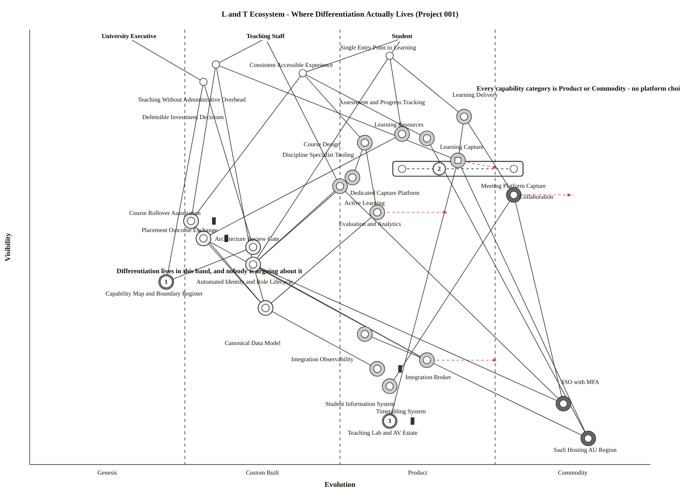

# Wardley Map: An Estate With No Differentiation In It

> **Template Origin**: Official | **ArcKit Version**: 6.7.4 | **Command**: `/arckit:wardley`

## Document Control

| Field | Value |
|-------|-------|
| **Document ID** | ARC-001-WARD-001-v1.0 |
| **Document Type** | Wardley Map — Ecosystem Current State with 24-Month Evolution |
| **Project** | Learning & Teaching Baseline Strategy (Project 001) |
| **Classification** | OFFICIAL |
| **Status** | DRAFT |
| **Version** | 1.0 |
| **Created Date** | 2026-07-28 |
| **Last Modified** | 2026-07-28 |
| **Review Cycle** | Per engagement milestone; re-map at WP8 |
| **Next Review Date** | 2026-08-27 |
| **Owner** | Cassandra "Cas" Rhodes, Chief Information Officer |
| **Reviewed By** | [PENDING] |
| **Approved By** | [PENDING] |
| **Distribution** | Steering Committee; RIFF Review; Education Committee; Digital & IT; Learning Innovation |

## Revision History

| Version | Date | Author | Changes | Approved By | Approval Date |
|---------|------|--------|---------|-------------|---------------|
| 1.0 | 2026-07-28 | ArcKit AI | Initial creation from `/arckit:wardley` command — ecosystem-wide map across the eight capability categories | [PENDING] | [PENDING] |

---

## Strategic Question

The engagement's most contested question is already recorded, in three places, as the thing that must be resolved: **consolidate onto a single vendor platform, or retain best-of-breed?** It is Conflict C-1 in the requirements, Conflict 1 in the stakeholder analysis, and risk R-001 at residual 16 — the highest-scoring strategic risk in the register, described there as *"a decision risk, not a delivery risk."*

This map does not attempt to answer it. It asks a prior question:

> **Across the whole estate, where does the University of Funk actually hold — or could hold — a durable advantage? And is the contested decision anywhere near it?**

The answer is uncomfortable in a specific and useful way. It does not tell the university which platform to choose. It tells the university that **the choice matters less than everyone thinks, and something nobody is arguing about matters more.**

---

## The Map

Paste into <https://create.wardleymaps.ai> to render.

```wardley
title L and T Ecosystem - Where Differentiation Actually Lives (Project 001)

anchor Student [0.98, 0.60]
anchor Teaching Staff [0.98, 0.38]
anchor University Executive [0.98, 0.16]

component Single Entry Point to Learning [0.94, 0.58]
component Teaching Without Administrative Overhead [0.92, 0.30]
component Consistent Accessible Experience [0.90, 0.44]
component Defensible Investment Decisions [0.88, 0.28]
component Learning Delivery [0.80, 0.70]
component Assessment and Progress Tracking [0.76, 0.60]
component Learning Resources [0.75, 0.64]
component Course Design [0.74, 0.54]
component Learning Capture [0.68, 0.66]
component Dedicated Capture Platform [0.68, 0.60]
component Meeting Platform Capture [0.68, 0.78]
component Active Learning [0.66, 0.52]
component Discipline Specialist Tooling [0.64, 0.50]
component Collaboration [0.62, 0.78]
component Evaluation and Analytics [0.58, 0.56]
component Course Rollover Automation [0.56, 0.26] inertia
component Placement Outcome Exchange [0.52, 0.28] inertia
component Architecture Review Gate [0.50, 0.36]
component Automated Identity and Role Lifecycle [0.46, 0.36]
component Capability Map and Boundary Register [0.42, 0.22]
component Canonical Data Model [0.36, 0.38]
component Integration Observability [0.30, 0.54]
component Integration Broker [0.24, 0.64]
component Student Information System [0.22, 0.56] inertia
component Timetabling System [0.18, 0.58]
component SSO with MFA [0.14, 0.86]
component Teaching Lab and AV Estate [0.10, 0.58] inertia
component SaaS Hosting AU Region [0.06, 0.90]

Student -> Single Entry Point to Learning
Student -> Consistent Accessible Experience
Teaching Staff -> Teaching Without Administrative Overhead
Teaching Staff -> Discipline Specialist Tooling
University Executive -> Defensible Investment Decisions

Single Entry Point to Learning -> Learning Delivery
Single Entry Point to Learning -> Assessment and Progress Tracking
Single Entry Point to Learning -> Automated Identity and Role Lifecycle
Consistent Accessible Experience -> Course Design
Consistent Accessible Experience -> Learning Resources
Consistent Accessible Experience -> Course Rollover Automation
Teaching Without Administrative Overhead -> Course Rollover Automation
Teaching Without Administrative Overhead -> Automated Identity and Role Lifecycle
Teaching Without Administrative Overhead -> Learning Capture
Defensible Investment Decisions -> Capability Map and Boundary Register
Defensible Investment Decisions -> Architecture Review Gate

Learning Delivery -> Collaboration
Learning Delivery -> Learning Capture
Assessment and Progress Tracking -> Placement Outcome Exchange
Course Design -> Active Learning
Course Design -> Evaluation and Analytics
Learning Resources -> SaaS Hosting AU Region
Learning Capture -> Teaching Lab and AV Estate
Learning Capture -> SaaS Hosting AU Region
Active Learning -> Automated Identity and Role Lifecycle
Collaboration -> Timetabling System
Collaboration -> SSO with MFA
Evaluation and Analytics -> Canonical Data Model
Discipline Specialist Tooling -> Automated Identity and Role Lifecycle
Discipline Specialist Tooling -> SSO with MFA

Course Rollover Automation -> Canonical Data Model
Placement Outcome Exchange -> Integration Broker
Placement Outcome Exchange -> Canonical Data Model
Automated Identity and Role Lifecycle -> Integration Broker
Automated Identity and Role Lifecycle -> Canonical Data Model
Automated Identity and Role Lifecycle -> SSO with MFA
Architecture Review Gate -> Capability Map and Boundary Register
Canonical Data Model -> Student Information System
Integration Broker -> Integration Observability
Integration Broker -> SaaS Hosting AU Region

pipeline Learning Capture [0.58, 0.80]

build Course Rollover Automation
build Placement Outcome Exchange
build Automated Identity and Role Lifecycle
build Canonical Data Model
build Capability Map and Boundary Register
build Architecture Review Gate
buy Learning Delivery
buy Assessment and Progress Tracking
buy Learning Resources
buy Course Design
buy Learning Capture
buy Active Learning
buy Discipline Specialist Tooling
buy Evaluation and Analytics
buy Integration Observability
buy Integration Broker
buy Student Information System
buy Timetabling System
buy Teaching Lab and AV Estate
outsource Collaboration
outsource SSO with MFA
outsource SaaS Hosting AU Region

evolve Learning Capture 0.76 label Meeting platforms absorbing capture
evolve Collaboration 0.88 label Settling into pure utility
evolve Evaluation and Analytics 0.68 label Analytics productising fast
evolve Integration Broker 0.76 label Brokering becoming a cloud utility

annotation 1 [0.42, 0.22] Least evolved component on the map - and it gates the biggest decision
annotation 2 [0.68, 0.66] One capability, three platforms, no declared boundary
annotation 3 [0.10, 0.58] Inertia - shared admin accounts and unpatched appliances drag Essential Eight

note Every capability category is Product or Commodity - no platform choice buys lasting advantage [0.86, 0.72]
note Differentiation lives in this band, and nobody is arguing about it [0.44, 0.14]

style wardley
```

<details>
<summary>Mermaid Wardley Map</summary>



</details>

> **Note on the two blocks.** The Mermaid block is generated from the OWM source by the bundled `owm-to-mermaid.mjs` converter, not hand-authored. The converter strips the `label` text from `evolve` statements — Mermaid's `wardley-beta` grammar has no verified label form on an evolve line — so the four movement rationales are carried in §5 instead. Nothing is lost.

### Anchors

| Anchor | Position | Represents |
|--------|----------|------------|
| Student | `[0.98, 0.60]` | 412 survey respondents' beneficiaries; the Student Guild's constituency (SD-16) |
| Teaching Staff | `[0.98, 0.38]` | Continuing, casual and sessional academics (SD-15), including discipline specialists (SD-13, SD-14) |
| University Executive | `[0.98, 0.16]` | The September business case audience — DVC Education, CFO, VC (SD-1, SD-3, SD-5) |

The third anchor is deliberate. Governance is a value chain with a user at the top of it, and treating the Executive as a user rather than an approver is what surfaces the map's sharpest finding (§2).

---

## 1. Component Inventory and Strategic Metrics

Metrics from the Wardley mathematical model: **D** = differentiation pressure = visibility × (1 − evolution); **K** = commodity leverage = (1 − visibility) × evolution. High D (> 0.4) marks where investment buys advantage; high K (> 0.4) marks infrastructure to consume as utility.

| Component | Vis | Evo | Stage | D | K | Sourcing |
|-----------|-----|-----|-------|---|---|----------|
| Single Entry Point to Learning | 0.94 | 0.58 | Product | 0.395 | 0.035 | User need |
| **Teaching Without Administrative Overhead** | 0.92 | 0.30 | Custom | **0.644** | 0.024 | User need |
| Consistent Accessible Experience | 0.90 | 0.44 | Custom | **0.504** | 0.044 | User need |
| **Defensible Investment Decisions** | 0.88 | 0.28 | Custom | **0.634** | 0.034 | User need |
| Learning Delivery | 0.80 | 0.70 | Product | 0.240 | 0.140 | Buy |
| Assessment and Progress Tracking | 0.76 | 0.60 | Product | 0.304 | 0.144 | Buy |
| Learning Resources | 0.75 | 0.64 | Product | 0.270 | 0.160 | Buy |
| Course Design | 0.74 | 0.54 | Product | 0.340 | 0.140 | Buy |
| Learning Capture | 0.68 | 0.66 | Product | 0.231 | 0.211 | Buy |
| Dedicated Capture Platform | 0.68 | 0.60 | Product | 0.272 | 0.192 | Pipeline child |
| Meeting Platform Capture | 0.68 | 0.78 | Commodity | 0.150 | 0.250 | Pipeline child |
| Active Learning | 0.66 | 0.52 | Product | 0.317 | 0.177 | Buy |
| Discipline Specialist Tooling | 0.64 | 0.50 | Product | 0.320 | 0.180 | Buy |
| Collaboration | 0.62 | 0.78 | Commodity | 0.136 | 0.296 | Outsource |
| Evaluation and Analytics | 0.58 | 0.56 | Product | 0.255 | 0.235 | Buy |
| **Course Rollover Automation** | 0.56 | 0.26 | Custom | **0.414** | 0.114 | **Build** |
| Placement Outcome Exchange | 0.52 | 0.28 | Custom | 0.374 | 0.134 | Build |
| Architecture Review Gate | 0.50 | 0.36 | Custom | 0.320 | 0.180 | Build |
| Automated Identity and Role Lifecycle | 0.46 | 0.36 | Custom | 0.294 | 0.194 | Build |
| Capability Map and Boundary Register | 0.42 | 0.22 | Genesis | 0.328 | 0.128 | Build |
| Canonical Data Model | 0.36 | 0.38 | Custom | 0.223 | 0.243 | Build |
| Integration Observability | 0.30 | 0.54 | Product | 0.138 | 0.378 | Buy |
| **Integration Broker** | 0.24 | 0.64 | Product | 0.086 | **0.486** | **Buy** |
| Student Information System | 0.22 | 0.56 | Product | 0.097 | **0.437** | Buy |
| Timetabling System | 0.18 | 0.58 | Product | 0.076 | **0.476** | Buy |
| **SSO with MFA** | 0.14 | 0.86 | Commodity | 0.020 | **0.740** | **Outsource** |
| **Teaching Lab and AV Estate** | 0.10 | 0.58 | Product | 0.042 | **0.522** | **Buy** |
| **SaaS Hosting AU Region** | 0.06 | 0.90 | Commodity | 0.006 | **0.846** | **Outsource** |

### Metric Validation

| Check | Result |
|-------|--------|
| Every high-D (> 0.4) sourced component flagged Build | ✅ Course Rollover Automation (0.414) — the only one; flagged Build |
| Every high-K (> 0.4) component flagged Buy or Outsource | ✅ SaaS Hosting (0.846), SSO with MFA (0.740), Teaching Lab and AV Estate (0.522), Integration Broker (0.486), Timetabling (0.476), Student Information System (0.437) — all Buy/Outsource |
| No component flagged Build with high K | ✅ None. Highest-K Build component is Canonical Data Model at 0.243 |
| No component flagged Buy with high D | ✅ None. Highest-D Buy component is Course Design at 0.340 |

**No positioning or strategy errors detected.**

**Exclusion stated openly**: the four components with D above 0.4 that carry no sourcing decorator — Teaching Without Administrative Overhead (0.644), Defensible Investment Decisions (0.634), Consistent Accessible Experience (0.504), and Single Entry Point to Learning (0.395) — are **user needs, not sourcing decisions**. They cannot be bought or built; they are satisfied or not by everything beneath them. Their high D is the map telling us where value concentrates, and §6 traces what each of them actually rests on.

---

## 2. The Central Finding

**There is no differentiation anywhere in the University of Funk's platform estate.**

That is not rhetoric. Of the eight capability categories in the taxonomy [CT-C1], every single one sits at Product or Commodity:

| Capability category | Evolution | Stage | D |
|--------------------|-----------|-------|---|
| Collaboration | 0.78 | Commodity | 0.136 |
| Learning Delivery | 0.70 | Product | 0.240 |
| Learning Capture | 0.66 | Product | 0.231 |
| Learning Resources | 0.64 | Product | 0.270 |
| Assessment and Progress Tracking | 0.60 | Product | 0.304 |
| Evaluation and Analytics | 0.56 | Product | 0.255 |
| Course Design | 0.54 | Product | 0.340 |
| Active Learning | 0.52 | Product | 0.317 |

Mean differentiation pressure across the eight: **0.259**. Not one exceeds 0.35. In Wardley terms this is a landscape where **no platform choice — any platform choice — buys a lasting advantage**, because the capability being purchased is broadly the same capability whoever supplies it, and the market will narrow the differences further over the contract term (§5).

### What this does to the consolidation argument

Risk R-001 sits at residual 16, is owned by the DVC Education, and is described in the register as blocking the entire future state. Conflict C-1 devotes four options and a full trade-off analysis to it. The stakeholder analysis calls it *"the single most consequential fault line"*.

**The map says all of that energy is directed at Product-stage components.** Rhodes wants to consolidate Learning Delivery, Learning Capture and Collaboration; Moog and Key want to retain best-of-breed within them. Both positions are arguments about which mature product to buy. Neither position, if it wins, produces a differentiated university.

This does not make the decision unimportant — it is worth real money and real support effort, and BR-002 depends on it. It makes the decision **a cost and operability decision rather than a strategic one**, which is a materially different thing to take to the Education Committee, and a materially easier thing to decide. Arguments about pedagogy and vendor philosophy are hard to settle. Arguments about duplicate licence cost and support surface are settled with the capability baseline.

### The evidence-based version of Conflict C-1

The map does something the compromise in Conflict C-1 could not: it separates the two halves of "best-of-breed" with evidence rather than negotiation.

- **General-purpose overlap** — Learning Capture is delivered by a dedicated platform (0.60) *and* by meeting platforms (0.78) simultaneously [SL-C1]. Two evolution stages, one capability, no declared boundary. Where a capability is available as commodity, holding a second product-stage supplier for the same general case is duplication with no upside. **Consolidation is right here, and the map says so on evolution grounds, not budget grounds.**
- **Discipline specialist tooling** sits at 0.50, D = 0.320. It is Product-stage — these are purchasable products, not artisanal builds — but in a **thin market with low ubiquity and high domain certainty**. Music notation and clinical simulation are not going to commoditise into a general collaboration suite, because the demand base is too narrow to attract that supply. **Retention is right here, and again on evolution grounds.**

That is precisely Option 3 of Conflict C-1 — *consolidate the general case, permit specialist tooling at the edge* — but arrived at independently, by a different method, without splitting the difference between two stakeholders. A compromise that two methods reach separately is not a compromise. It is a finding.

### The uncomfortable part

If no platform carries differentiation, then the components that do carry it must be elsewhere. They are, and they form a band across the middle and lower-middle of the map: **Course Rollover Automation, Placement Outcome Exchange, Automated Identity and Role Lifecycle, Canonical Data Model, Architecture Review Gate, Capability Map and Boundary Register.**

Six components. All Custom or Genesis. All must be built. **None of them is contested by anybody.** They appear in the register as integration requirements and governance requirements, they are owned by two people (Okafor and Moog), and they attract a fraction of the attention that the platform argument attracts.

---

## 3. Build, Buy, Outsource

### Build — Custom and Genesis, where advantage is available

| Component | D | Why build |
|-----------|---|----------|
| **Course Rollover Automation** | 0.414 | Highest actionable differentiation pressure on the map. Rollover is where academic effort is actually consumed, and it is currently *"semi-manual scripts, undocumented, single-person dependency"* [SL-C2]. See §4 and §6 — this is the map's load-bearing component |
| **Placement Outcome Exchange** | 0.374 | Institution-specific flow carrying sensitive information. Remediating it closes an operational risk (R-008), a compliance risk (R-018) and a reputational risk (R-023) at once — the register's own highest-leverage action |
| **Capability Map and Boundary Register** | 0.328 | Genesis at 0.22 — **the least evolved component on the map**. A maintained, per-category boundary register used as a live procurement gate is rare practice anywhere. See §2 and §6 |
| **Architecture Review Gate** | 0.320 | RIFF exists as a process [SGP-C1]; what does not exist is RIFF operating on maintained architectural evidence (BR-007). The gate is the process; the register is the evidence |
| **Automated Identity and Role Lifecycle** | 0.294 | Moderate D only because visibility is low — its *dependents* are highly visible, which §6 exposes as the second-largest fragility on the map |
| **Canonical Data Model** | 0.223 | Positioned at 0.38, deliberately higher than a blank-page build. **Standards already exist** — see the caution below |

> **Caution on the canonical model.** ARC-001-DATA defines the model and ADR-001 makes the broker enforce it at runtime. Neither document says where the model's *shape* should come from. At evolution 0.38 the component is not Genesis: 1EdTech OneRoster, LTI 1.3 Names and Role Provisioning, and Ed-Fi all define student, course, enrolment and role structures that the sector already uses. Building UoF's canonical model from a blank page would be building at 0.20 something the market supplies at 0.38 — the classic waste the map exists to catch. **Recommendation: derive the canonical model from an existing standard and record the institution-specific extensions as extensions.** That also makes the WP8 platform-substitution argument stronger, because vendors implement standards and do not implement UoF's private schema.

### Buy — Product stage, mature market

Learning Delivery, Assessment and Progress Tracking, Learning Resources, Course Design, Learning Capture, Active Learning, Evaluation and Analytics, Discipline Specialist Tooling, Integration Observability, Integration Broker, Student Information System, Timetabling System, Teaching Lab and AV Estate.

Two entries deserve comment:

- **Integration Broker (K = 0.486)** — ADR-001 selected a central broker and attached Condition 1: test existing licensed capability under Principle 19 before purchasing [SGP-C1]. The map strengthens that condition considerably. At 0.64 the broker is mid-Product and **moving to 0.76 within 24 months** (§5). Buying a differentiated broker product now, at the point where brokering is becoming a platform-bundled utility, is buying at the worst moment in the evolution curve. The Principle 19 test is not a procedural hurdle to clear — it is the strategically correct action.
- **Teaching Lab and AV Estate (K = 0.522)** — high commodity leverage on an owned physical estate. See §4.

### Outsource — Commodity

Collaboration (K 0.296, evolution 0.78), SSO with MFA (K 0.740), SaaS Hosting AU Region (K 0.846).

Collaboration's K is suppressed by its high visibility, but its **evolution of 0.78 puts it firmly in Commodity** and moving to 0.88. This matters for the rationalisation argument: duplicating a commodity is the least defensible duplication of all, because commodity components compete on price and reliability, not features — so a second supplier adds cost and adds nothing. Of everything in the consolidation debate, **Collaboration is the clearest case and should be settled first**, ahead of the harder capture and delivery questions.

The residency question on SaaS Hosting is a contract term, not a sourcing decision — four data classes disclose offshore under assessed hosting, and R-017 sits at residual 16 because nobody has assessed them, not because they are known to be unsafe.

---

## 4. Inertia

Three components carry inertia. They are not the ones the project is spending its time on.

### Course Rollover Automation — the operational one

**Position**: visibility 0.56, evolution 0.26, D = 0.414 — the highest actionable differentiation pressure on the map, and the map's single most load-bearing component (§6).

The current mechanism is *"semi-manual scripts; undocumented; single-person dependency"* [SL-C2]. Risk R-007 records it at residual 12 with the control effectiveness stated as **"None effective"**.

**Inertia types present**: skills inertia (the capability lives in one person's head), process inertia (rollover is scheduled around an established manual rhythm), and a quiet form of **success inertia** — it has worked every teaching period so far, which is exactly why nobody has funded replacing it.

**Why this is the dangerous one**: two of the map's top five dependency risks pass through this component (0.681 and 0.666), it has no effective control, and its failure mode is concentrated at the busiest point in the academic calendar. It is the clearest instance in the estate of the Wardley pattern where a component's *apparent* stability is a function of nobody having tested it.

### Placement Outcome Exchange — the compliance one

**Position**: visibility 0.52, evolution 0.28.

*"Manual re-keying. Error-prone; audit concerns"* [SL-C3], carrying sensitive placement information including clearance metadata and health-context notes. The register's own Finding 1 identifies this as the single highest-leverage remediation available, and ADR-001 Condition 3 already sequences it second.

**Inertia type**: process inertia, reinforced by **consumer inertia** — placement supervisors sit outside the institutional identity boundary (R-027), so the manual workaround is not laziness but a genuine architectural gap. That is why it has survived. Remediating the flow without resolving the external-supervisor identity question moves the manual step rather than removing it.

### Teaching Lab and AV Estate — the security drag

**Position**: visibility 0.10, evolution 0.58, **K = 0.522**.

Commodity leverage above 0.5 on an owned physical estate is a strategic signal. The privacy and security context records *legacy shared admin accounts in the AV and capture estate*, and *lecture-theatre capture appliances* behind on operating-system patching [PC-C1] — two of the eight Essential Eight strategies held at ML1 against an ML2 target, both attributable to this one component.

**Inertia types**: capital (the estate is owned and partly undepreciated), skills (the AV team's expertise is in it), and political (it sits across a Digital & IT / facilities boundary).

**Strategic reading**: this component is low-visibility, high-K, and it is the binding constraint on a Must-priority requirement (REQ-033, Essential Eight alignment). It is also the component most likely to be argued about *last*, because nobody's driver points at it. Project 002's map reaches the same conclusion about the room estate from a different direction. **Two maps, two projects, one under-examined component.**

---

## 5. Movement and Predictions

Evolution movements shown on the map, with the rationale that would otherwise sit in the `evolve` labels.

| Component | Now | 24-month target | Movement | Strategic implication |
|-----------|-----|-----------------|----------|----------------------|
| **Collaboration** | 0.78 | **0.88** | +0.10 — medium | **Settling into pure utility.** Meeting and collaboration platforms are past feature competition and into price and reliability competition. Duplicate suppliers here will look increasingly indefensible at each renewal |
| **Learning Capture** | 0.66 | **0.76** | +0.10 — medium | **Meeting platforms absorbing capture.** The 2027 Teams investigation [SL-C1] is not a UoF idea — it is the university noticing a market movement. By the next renewal, capture will be a feature of a commodity rather than a product in its own right |
| **Evaluation and Analytics** | 0.56 | **0.68** | +0.12 — medium-fast | **Analytics productising fast.** Cohort dashboards and at-risk indicators are moving from bespoke configuration to shipped product features. Investing in a custom analytics build now would be building just ahead of the market arriving |
| **Integration Broker** | 0.64 | **0.76** | +0.12 — medium-fast | **Brokering becoming a cloud utility.** Event brokering and schema registry are being absorbed into hyperscaler platform bundles. Directly material to ADR-001 Condition 1 — see §3 |

### What the movements do together

Three of the four move **toward the university's existing commodity suppliers**, and one moves toward its existing licensed platform agreement. Read together, they say something the individual predictions do not:

**The consolidation question is going to be answered by the market whether or not the university answers it.** Capture is moving into collaboration; analytics is moving into the platforms that already hold the data; brokering is moving into the cloud agreement. A university that spends 2026 arguing about this and defers the decision will find in 2028 that the decision was made for it — but on the vendor's timing and terms rather than its own.

That is the strongest available argument for the hard decision deadline that risk R-001 already recommends, and it is a better argument than "the roadmap needs it".

### What is *not* moving

**Course Rollover Automation, Placement Outcome Exchange, Automated Identity and Role Lifecycle, Capability Map and Boundary Register.** No market is coming to solve these. They will sit where they are until the university moves them, which is what makes them the only durable investments on the map — and what makes the effort currently spent elsewhere expensive in opportunity terms.

---

## 6. Dependency Risk Analysis

**R(a,b) = visibility(a) × (1 − evolution(b))** — flags visible components resting on immature ones. High R (> 0.4) is a fragility signal. Anchor-to-need edges are excluded as structural.

| Dependent | Depends on | R | Assessment |
|-----------|-----------|---|------------|
| Defensible Investment Decisions | Capability Map and Boundary Register | **0.686** | 🔴 **Highest on the map** |
| Teaching Without Administrative Overhead | Course Rollover Automation | **0.681** | 🔴 |
| Consistent Accessible Experience | Course Rollover Automation | **0.666** | 🔴 |
| Single Entry Point to Learning | Automated Identity and Role Lifecycle | **0.602** | 🔴 |
| Teaching Without Administrative Overhead | Automated Identity and Role Lifecycle | **0.589** | 🔴 |
| Defensible Investment Decisions | Architecture Review Gate | **0.563** | 🔴 |
| Assessment and Progress Tracking | Placement Outcome Exchange | **0.547** | 🔴 |
| Active Learning | Automated Identity and Role Lifecycle | 0.422 | 🟠 |
| Consistent Accessible Experience | Course Design | 0.414 | 🟠 |
| Discipline Specialist Tooling | Automated Identity and Role Lifecycle | 0.410 | 🟠 |
| Architecture Review Gate | Capability Map and Boundary Register | 0.390 | 🟠 |
| Single Entry Point to Learning | Assessment and Progress Tracking | 0.376 | 🟠 |

**Seven risks above 0.5. Every one of them passes through the integration layer or the governance layer. Not one passes through a platform.**

That single observation is the map's principal output. The estate's fragility is not in what the university bought. It is in what the university never built to join it up.

### R = 0.686 — read this one carefully

**The University Executive's ability to make a defensible investment decision rests on the least evolved component on the entire map.**

The Capability Map and Boundary Register sits at evolution 0.22 — Genesis. It is the only Genesis component here. And it is what BR-001, BR-007 and the whole rationalisation case depend on: you cannot declare a boundary per capability category, justify a retirement, or run the RIFF duplication rule [SGP-C1] without a maintained, current view of what each platform actually does.

This explains something the risk register states but does not fully account for. R-001 is described as *"a decision risk, not a delivery risk — it cannot be mitigated by doing more work; it requires someone to decide."* The map's reading is more precise and slightly different:

> **R-001 is stuck because the evidence base for deciding is the least mature thing in the landscape.** Deciding harder will not fix it. Deciding *later* will not fix it either. What fixes it is finishing WP3 — and the stakeholder analysis already says so: *"Complete capability mapping first (G-2) so the comparison rests on evidence rather than advocacy."*

The practical consequence is a sequencing one, and it is actionable this month: **the hard decision deadline that R-001 needs must be set to land immediately after the capability baseline, not before it and not vaguely after it.** A deadline set earlier forces the decision back onto advocacy, which is the failure mode the whole engagement is designed to avoid.

### The rollover cluster — 0.681 and 0.666

Both of the map's high-visibility staff-and-student needs rest on the same undocumented scripts. Two of the three highest risks on the map are the *same component* seen from two different user needs, and its control effectiveness is recorded as **"None effective"** (R-007).

This is the map's clearest disproportion. R-007 sits at rank 6 in the risk register with a residual score of 12 — comfortably below the five risks above it, none of which is contested and all of which get more attention. The map does not dispute the score; it explains why the score understates the exposure. **A component with no effective control, carrying two of the top three dependency risks, at the busiest point in the academic calendar, is not a rank-6 problem.**

### The identity cluster — 0.602, 0.589, 0.422, 0.410

Four separate dependents rest on Automated Identity and Role Lifecycle: the student's single entry point, the staff member's freedom from administrative overhead, active learning tools, and the discipline specialist tooling that Principle 4 requires to authenticate the same way as everything else.

Individually each is moderate. Together they mean **the identity and role layer is the single most widely depended-upon custom component in the estate** — and it is the one that currently fails most often ([SL-C2]: *"role assignment failures"*), is provisioned by manual CSV for casual staff (R-009), and is the subject of an authoritative-source decision that has not yet been raised as an ADR.

> **Open decision, flagged.** ADR-001 lists "which system is authoritative for institutional role" as a dependency and a candidate ADR-002, not yet raised. Given four dependents at R ≥ 0.41 and the second-highest cluster on this map, **ADR-002 should be raised before the broker is selected, not after.** The broker enforces the schema; it does not decide whose role assertion is true.

---

## 7. Doctrine Assessment

Assessed against Wardley's doctrine phases, from evidence in the project artifacts. Scores use the 1–5 rubric from the bundled reference.

| Doctrine | Phase | Score | Assessment | Evidence |
|----------|-------|-------|-----------|----------|
| **Common language** | I | 4 | ✅ Established | Eight-category taxonomy applied consistently across five artifacts [CT-C1]; typed requirement IDs with bidirectional cross-reference to the source register |
| **Challenge assumptions** | I | 5 | ✅ Embedded | ADR-001 records its own cost objection as *"anticipated and legitimate"*; the risk register flags that no approved risk appetite exists and marks its own thresholds PROVISIONAL rather than implying authority it lacks |
| **Know your users** | I | 4 | ✅ Established | Sixteen named stakeholders with drivers traced to goals and outcomes; casual and sessional staff represented despite having no formal voice |
| **Focus on user needs** | I | 4 | ✅ Established | 412-response survey is the requirements anchor; BR-008 exists specifically to keep it traceable |
| **Remove bias and duplication** | I | 4 | ✅ Established | The engagement's purpose; declared-versus-undeclared duplication is a stated principle rather than an aspiration |
| **Know the details** | I | 3 | 🟡 Emerging | Integration failure modes are known in detail; **licence spend, support effort and capability configuration are not baselined** — BR-002 has no baseline and ADR-001 records assumption A-1 that no costing baseline exists |
| **Systematic learning** | I | 3 | 🟡 Emerging | Good documentation discipline; no mechanism yet for feeding operational failure data back into architecture |
| **Bias towards open** | II | 5 | ✅ Embedded | Dissent recorded rather than suppressed; conflicts published with named holders; provisional judgements labelled as provisional |
| **Use standards** | II | 3 | 🟡 Emerging | LTI and SSO standards are assumed, but **the canonical model has no declared standards basis** — see §3 |
| **Manage inertia** | II | 2 | 🟠 **Weakest** | All three inertia points in §4 are recorded as risks and costed. **None is challenged as a strategic position.** The AV estate in particular is treated as a fixed constraint rather than a decision |
| **Manage failure** | II | 2 | 🟠 Weak | R-007's control effectiveness is honestly recorded as "None effective" and left there. Eleven of 29 risks have no effective control today |
| **Move fast** | II | 2 | 🟠 Weak | The estate's most defective flow — manual re-keying of sensitive placement data — predates the engagement by years and is still scheduled behind broker selection. **The map shows the integration work needs no platform decision to begin** |
| **Effectiveness over efficiency** | II | 4 | ✅ Established | BR-002 is rated SHOULD, not MUST, and the register separates recurring licence from one-off capital — cost containment has not been allowed to override outcome |
| **Optimise flow** | III | 2 | 🟠 Weak | No end-to-end measurement exists from enrolment change to platform effect; NFR-M-001 specifies it as target state, not current |
| **Set exceptional standards** | III | 4 | ✅ Established | Mandatory review gates, prohibition of manual production steps, time-bound exceptions without exception |
| **Commit to direction** | III | 2 | 🟠 Weak | R-001 open, ADR-001 Proposed rather than Accepted, ADR-002 not raised. Direction is understood; commitment has not yet been made |
| **There is no core** | IV | 2 | 🟠 Weak | The consolidation debate is conducted as though platform choice were a permanent strategic position. §2 and §5 both say it is not |

**Overall**: Phase I doctrine is strong — unusually strong on transparency and on challenging its own assumptions, which is rarer than it sounds and is the main reason this engagement's artifacts are trustworthy.

**Two weaknesses, and they are the same weakness.** *Manage inertia* (2) and *Commit to direction* (2) both describe an organisation that has done excellent analysis and has not yet converted any of it into an irreversible decision. Everything is Proposed, provisional, or routed to a forum. That is defensible at this point in an engagement — it stops being defensible on 31 August, and the map's §5 movements are the reason the deadline is real rather than administrative.

---

## 8. Applicable Gameplay Patterns

| Pattern | Category | Alignment | Applicability |
|---------|----------|-----------|---------------|
| **Market enablement via standards** | Accelerator | LG | ✅ **The strongest play available and currently under-used.** Insisting on 1EdTech OneRoster, LTI 1.3 NRPS and SCIM-equivalent provisioning as the canonical model's basis (§3) lowers the cost of every future substitution and makes the WP8 target state vendor-neutral by construction |
| **Buyer power** | Market | LE | ✅ Available and time-boxed. Leverage exists only inside renewal windows — R-005 already flags that retirement decisions landing mid-term produce cost rather than saving. The renewal calendar is the instrument |
| **Refactoring** | Toxicity | LG | ✅ **Directly applicable to Course Rollover Automation.** The component still has strategic value; undocumented complexity is suppressing it. This is textbook refactoring, not replacement |
| **Managing inertia** | Defensive | N | 🟠 **Available, not being played.** §4 identifies three inertia points; the doctrine assessment scores this the weakest area. Naming inertia in a risk register is not managing it |
| **Co-creation** | Ecosystem | LG | 🟡 Available, unused. Every Australian university with a student information system, a timetabling system and an LMS faces an identical identity-and-rollover problem. CAUDIT is the obvious channel |
| **Disposal of liability** | Toxicity | N | 🟡 Applicable to the duplicate collaboration and capture suppliers, once the boundary is declared. Graceful retirement with a migration path, not a switch-off |

### Anti-Patterns — Checked

| Anti-pattern | Present? | Note |
|--------------|----------|------|
| Playing in the wrong evolution stage | 🟡 **Watch** | Not present in sourcing — every component's decision matches its stage, and the metrics validate it. **But it is present in *attention allocation***: the effort is going to Product-stage decisions while Custom-stage components go unstaffed |
| **Ignoring inertia** | 🟠 **Present** | Three inertia points, all identified, none challenged. The clearest instance is the AV estate being treated as a fixed constraint on Essential Eight rather than a component with K = 0.522 |
| Misreading evolution pace | ❌ No | The 2027 Teams investigation [SL-C1] shows the market movement is correctly perceived, even if not yet acted on |
| Single-play dependence | 🟡 Partial | Rationalisation is currently the only play in flight. Standards and buyer power are both available and neither is running |
| Building custom where product exists | 🟡 **Watch** | Not yet present, but the canonical model is one blank-page decision away from it — see §3 |
| Legacy trap | 🟡 Watch | Retaining the AV estate because it is owned rather than because it is right. The whole-of-life split between "required regardless" and "decision-caused" is the instrument that detects this |

---

## 9. Climatic Patterns

| Pattern | Impact on this estate |
|---------|----------------------|
| **Everything evolves** | Four components carry explicit movement (§5) and none of the eight capability categories is stable over a five-year horizon. The estate the roadmap describes will not be the estate that exists when it completes |
| **Characteristics change as components evolve** | As capture and collaboration commoditise, competition shifts from features to price and reliability. **Evaluation criteria written on features will age faster than criteria written on terms, exit and integration** — directly relevant to project 002's live procurement |
| **Efficiency enables innovation** | Commodity SaaS and AU-region hosting are why a 20-plus tool estate was affordable enough to grow organically in the first place. The same force that created the problem will keep creating it unless the governance layer (§2) becomes real |
| **Higher-order systems create new value** | With capture, collaboration and analytics all commoditising simultaneously, the value moves up to *what the university does across them* — cross-platform engagement, at-risk identification, program-level portfolio evidence. None of that is reachable without the canonical model |
| **Jevons paradox** | ⚠️ **A direct challenge to BR-002.** Commoditisation lowers unit cost and reliably increases total consumption. The expectation that licence spend holds flat *because* components are commoditising is exactly backwards — flat spend will come from declared boundaries and retirements, not from falling prices |
| **No choice over evolution (Red Queen)** | The university cannot opt out of near-real-time provisioning expectations, accessibility expectations, or Essential Eight expectations rising. Today's target is tomorrow's baseline |
| **Inertia** | See §4. Scored the weakest doctrine area, and the dominant internal force acting against the roadmap |
| **Punctuated equilibrium** | Capture and brokering are both candidates for a punctuated product-to-utility shift rather than a gradual one. Plans that assume a smooth glide have no margin if the shift arrives early |
| **Future value inversely proportional to certainty** | The integration and governance band is the least certain and the highest future value. The platform estate is the most certain and the lowest. **The engagement's attention is currently allocated in inverse proportion to future value** |
| **Peace / War / Wonder** | Learning Delivery and Collaboration are in late **Peace** moving toward **War** as meeting platforms absorb adjacent capability. Organisations with high inertia are most vulnerable during that transition — §4 lists three |

---

## 10. Recommendations

### Immediate (0–3 months, before the 31 August deliverable)

1. **Start the integration and governance workstream now, in parallel with the platform argument.** It is platform-neutral, it carries every dependency risk above 0.5, and it needs no decision from anyone to begin. Owner: Sam Okafor (integration), Dr. Benny Moog (capability register). *Success criterion*: rollover automation documented and version-controlled with a second trained operator, closing R-007's "None effective" control gap.
2. **Set the R-001 decision deadline to land immediately after the WP3 capability baseline — and publish both dates together.** The map explains why the decision is stuck (§6): the evidence base is the least evolved component in the landscape. Owner: Prof. Otis Hammond, with Rhonda Bell holding the sequencing.
3. **Settle Collaboration first, separately from Capture and Delivery.** At evolution 0.78 moving to 0.88 it is the least contestable duplication in the estate and the easiest win to demonstrate before the harder decisions. Owner: Cassandra Rhodes via RIFF.
4. **Give the canonical model a standards basis before WP5 drafting begins.** Derive from 1EdTech OneRoster and LTI 1.3 NRPS; record UoF-specific role taxonomy as declared extensions. Owner: Sam Okafor. *Success criterion*: every canonical entity traced to a standard or explicitly marked as an extension with rationale.
5. **Raise ADR-002 (authoritative source for institutional role) before broker selection, not after.** Four dependents at R ≥ 0.41 rest on it, and the broker enforces a schema without deciding whose assertion is authoritative. Owner: Sam Okafor.

### Short-term (3–12 months, business case and early delivery)

6. **Complete the Principle 19 test on the existing licensed platform agreement, and weight it by the broker's evolution movement.** At 0.64 → 0.76 the component is becoming a bundled utility; buying a differentiated product at that point in the curve is the worst available timing. Owner: Cassandra Rhodes (ADR-001 Condition 1).
7. **Sequence Placement Outcome Exchange first among the integrations, and resolve external-supervisor identity as part of it.** Closes R-008, R-018 and R-023 together. Remediating the flow without R-027 relocates the manual step rather than removing it. Owner: Prof. Priya Anand with Eleanor Frame.
8. **Test the flat-spend assumption against Jevons.** BR-002's success criterion should read "spend flat through declared retirements", not "spend flat as commoditisation reduces prices" — the second will not happen. Owner: Vernon Ostinato.
9. **Challenge the AV estate as a position, not just cost it as a constraint.** K = 0.522 with two Essential Eight strategies held at ML1 by this one component. Model at least one alternative sourcing shape so the current model is a decision rather than an inheritance. Owner: Tobias Ohm with Digital & IT. Addresses the weakest doctrine area directly.

### Long-term (12–24 months, post-roadmap)

10. **Re-map at WP8 and again at the first renewal review.** Test the §5 predictions against what actually happened; Collaboration at 0.88 and Learning Capture at 0.76 change the boundary calculus materially.
11. **Make the Capability Map and Boundary Register a maintained institutional asset with a named owner and a review cadence tied to contract renewals.** It is the least evolved component on the map and the one that determines whether the duplication pattern recurs. Moving it from Genesis to Custom is the single most valuable evolution the university can drive itself. Owner: Dr. Benny Moog.
12. **Explore sector co-creation on identity, role and rollover.** Every Australian university faces this identical problem, and it is the one place where shared effort produces shared advantage rather than shared mediocrity.

---

## 11. Traceability

### Requirements and Principles

| Map component | Requirements | Principles |
|---------------|--------------|-----------|
| Single Entry Point to Learning | BR-006, REQ-007 | 1 |
| Teaching Without Administrative Overhead | BR-004, REQ-026 | 13 |
| Consistent Accessible Experience | BR-006, NFR-U-001, REQ-001, REQ-029 | 3, 14 |
| Defensible Investment Decisions | BR-002, BR-007, REQ-035 | 18, 19 |
| Learning Delivery | REQ-007, REQ-008 | 1, 2 |
| Learning Capture | REQ-009, REQ-010 | 2, 4 |
| Collaboration | REQ-011, REQ-012 | 2 |
| Assessment and Progress Tracking | REQ-015 to REQ-019 | 2, 9 |
| Course Design / Learning Resources / Active Learning | REQ-001 to REQ-006, REQ-013, REQ-014 | 2, 3 |
| Evaluation and Analytics | REQ-020 to REQ-022, DR-006 | 7 |
| Discipline Specialist Tooling | REQ-005, REQ-006, REQ-010 | 4 |
| Course Rollover Automation | INT-004, NFR-M-002, REQ-026 | 13 |
| Placement Outcome Exchange | INT-005, DR-004, REQ-018, REQ-028 | 7, 10 |
| Automated Identity and Role Lifecycle | INT-002, INT-003, DR-002, REQ-024, REQ-025 | 5, 11, 12 |
| Canonical Data Model | DR-001, REQ-027 | 6 |
| Integration Broker | INT-001 to INT-009, NFR-P-001 | 10, 11 |
| Integration Observability | NFR-M-001, REQ-023 | 17 |
| Capability Map and Boundary Register | BR-001, REQ-035 | 2, 18, 19 |
| Architecture Review Gate | BR-007 | 18, 19 |
| Student Information System | INT-001, DR-001, REQ-023 | 5 |
| Timetabling System | INT-006, REQ-012 | 11 |
| SSO with MFA | NFR-SEC-001, REQ-031 | 12, 16 |
| Teaching Lab and AV Estate | NFR-SEC-002, REQ-033 | 16 |
| SaaS Hosting AU Region | NFR-C-001, NFR-C-002, DR-005, REQ-030 | 8 |

### Decisions and Risks

| Map finding | Related artifacts |
|-------------|-------------------|
| Consolidation is a cost decision, not a strategic one (§2) | R-001; Conflict C-1; STKE Conflict 1 |
| Capability register gates the decision (§6) | R-001; BR-001; BR-007; Goal G-2 |
| Rollover automation is load-bearing and uncontrolled (§4, §6) | R-007; INT-004; NFR-M-002 |
| Placement flow is the highest-leverage remediation (§4) | R-008, R-018, R-023; ADR-001 Condition 3 |
| Broker timing against evolution movement (§3, §5) | ADR-001 Condition 1; BR-002; R-013 |
| ADR-002 needed before broker selection (§6) | ADR-001 dependencies; DR-002; INT-002 |
| Canonical model needs a standards basis (§3) | DR-001; ADR-001; R-026 |
| AV estate holds Essential Eight at ML1 (§4) | R-020; NFR-SEC-002; REQ-033 |
| Jevons challenge to flat-spend assumption (§9) | BR-002; R-013; REQ-035 |

### Cross-Project

| Relationship | Note |
|-------------|------|
| **Project 002 (Lecture Capture)** | This map positions Learning Capture at 0.66 moving to 0.76; `ARC-002-WARD-001` positions Recording Capture and Processing at 0.68 moving to 0.78. Independently derived, consistent within 0.02 — the two maps corroborate each other |
| **Project 002 room estate** | Teaching Lab and AV Estate here (0.58, K 0.522) and Room Capture Appliances there (0.60, K 0.432) are the same physical estate seen from two projects. Both maps flag it as under-examined inertia |
| **ADR-001 consumers** | Project 002's INT-001 provisioning depends on the mediation chosen in ADR-001, which this map recommends re-timing against the broker's evolution movement |

### Framework Applicability

**Not applicable**: UK Government frameworks — Digital Marketplace, G-Cloud, DOS, Technology Code of Practice and the GDS Service Standard have no standing for an Australian university. The equivalent obligations here are the **Privacy Act 1988** and the Australian Privacy Principles, the **ASD Essential Eight** (target ML2 by end 2027), and the university's own **RIFF Review** governance [SGP-C1].

**AI Playbook**: not applicable. No component on this map performs algorithmic decision-making about individuals. Learning analytics (Evaluation and Analytics, 0.56) produces at-risk indicators that inform human judgement; if that ever becomes automated intervention, it acquires an assessment obligation it does not currently have.

---

## External References

### Document Register

| Doc ID | Filename | Type | Source Location | Description |
|--------|----------|------|-----------------|-------------|
| CT | capability-taxonomy.md | Foundation artifact | `000-global/external/` | Eight-category L&T capability taxonomy — the categories mapped in §2 |
| SL | system-landscape.md | Foundation artifact | `001-lt-ecosystem/external/` | Current tools by category with usage status; seven known integrations and their failure modes |
| PC | privacy-context.md | Compliance input | `001-lt-ecosystem/external/` | Personal information inventory and Essential Eight self-assessment |
| SGP | solution-governance-process.md | Foundation artifact | `000-global/policies/` | RIFF Review process, roles and duplication rule |
| RR | requirements-register.md | Requirements input | `001-lt-ecosystem/external/` | Consolidated academic survey requirements REQ-001 to REQ-035 |
| CB | consultant-brief.md | Engagement brief | `001-lt-ecosystem/external/` | WP1–WP9 scope, dependencies and 31 August due date |
| REQ | ARC-001-REQ-v1.0.md | ArcKit artifact | `001-lt-ecosystem/` | BR/FR/NFR/INT/DR requirements; Conflict C-1 |
| STKE | ARC-001-STKE-v1.0.md | ArcKit artifact | `001-lt-ecosystem/` | Stakeholder drivers, conflicts and synergies |
| RISK | ARC-001-RISK-v1.0.md | ArcKit artifact | `001-lt-ecosystem/` | R-001, R-007, R-008, R-009, R-013, R-017, R-018, R-020, R-023, R-026, R-027 |
| DATA | ARC-001-DATA-v1.0.md | ArcKit artifact | `001-lt-ecosystem/` | Canonical Core entity definitions |
| ADR | ARC-001-ADR-001-v1.0.md | ArcKit artifact | `001-lt-ecosystem/decisions/` | Integration mediation decision, conditions and open successors |
| PRIN | ARC-000-PRIN-v1.0.md | ArcKit artifact | `000-global/` | Principles 1–19 |
| WARD002 | ARC-002-WARD-001-v1.0.md | ArcKit artifact | `002-lecture-capture/wardley-maps/` | Cross-project corroboration of capture and room-estate positioning |

### Citations

| Citation ID | Doc ID | Page/Section | Category | Quoted Passage |
|-------------|--------|--------------|----------|----------------|
| CT-C1 | CT | Header | Design Decision | "Every current and proposed tool is categorised against this taxonomy to enable cross-system comparison, duplication analysis and rationalisation decisions." |
| SL-C1 | SL | Notes, item 1 | Market Evidence | "MS Teams — investigation planned for 2027 to establish a seamless platform experience across collaboration, learning delivery and lecture capture (overlaps with Zoom and Echo360 — key rationalisation candidate)." |
| SL-C2 | SL | Known integrations | Risk Factor | "Course cloning automation / Semi-manual scripts / Undocumented; single-person dependency"; "PeopleSoft → Blackboard ... Fragile; role assignment failures; no intra-day sync" |
| SL-C3 | SL | Known integrations | Risk Factor | "Sonia ↔ Blackboard grades (placements) / Manual re-keying / Error-prone; audit concerns" |
| PC-C1 | PC | §3 | Security Requirement | Restrict administrative privileges, current ML1 against target ML2: "Legacy shared admin accounts in AV/capture estate". Patch operating systems, current ML1 against target ML2: "Lecture-theatre capture appliances behind" |
| SGP-C1 | SGP | Rules | Procurement Constraint | "Solutions duplicating capability already licensed (per the system landscape map) must justify why the incumbent tool is unsuitable." |

### Unreferenced Documents

| Filename | Source Location | Reason |
|----------|-----------------|--------|
| requirements-register.md (RR) | `001-lt-ecosystem/external/` | Read in full for capability-category positioning; requirement IDs are cited via ARC-001-REQ, which is the artifact of record and carries the bidirectional cross-reference |
| consultant-brief.md (CB) | `001-lt-ecosystem/external/` | Read for work-package scope and the 31 August constraint; conclusions are traced through ARC-001-REQ and ARC-001-STKE rather than quoted directly |
| stakeholders.md | `001-lt-ecosystem/external/` | Not read — stakeholder drivers taken from ARC-001-STKE, which supersedes it |

---

**Generated by**: ArcKit `/arckit:wardley` command
**Generated on**: 2026-07-28
**ArcKit Version**: 6.7.4
**Project**: Learning & Teaching Baseline Strategy (Project 001)
**Model**: Claude Opus 5 (1M context)
**Generation Context**: Ecosystem-wide current-state map with 24-month evolution, covering all eight capability categories from the taxonomy plus the integration, governance and infrastructure layers beneath them. Component identification from ARC-001-REQ and system-landscape.md; positioning cross-checked against ARC-002-WARD-001 for the two components both maps cover. D/K/R metrics computed programmatically and validated against sourcing decisions with no contradictions. Mermaid block generated by `owm-to-mermaid.mjs` from the OWM source, not hand-authored. Doctrine, gameplay and climatic analysis applied from the bundled wardley-mapping skill references.

<!-- arckit-provenance:start -->

## Build Provenance

*Stamped automatically by the ArcKit plugin's `provenance-stamp.mjs` PostToolUse hook. Complements (does not replace) the human-authored footer above. Carries only fields the model can't authoritatively self-report: build context from `.arckit/state.json` and effort levels derived from command frontmatter + the silent-downgrade matrix.*

| Field | Value |
|-------|-------|
| Requested Effort | `max` |
| Effective Effort | _unknown — model not parsed from existing footer_ |
| Stamped at | 2026-07-28T10:10:07.655Z |

<!-- arckit-provenance:end -->
