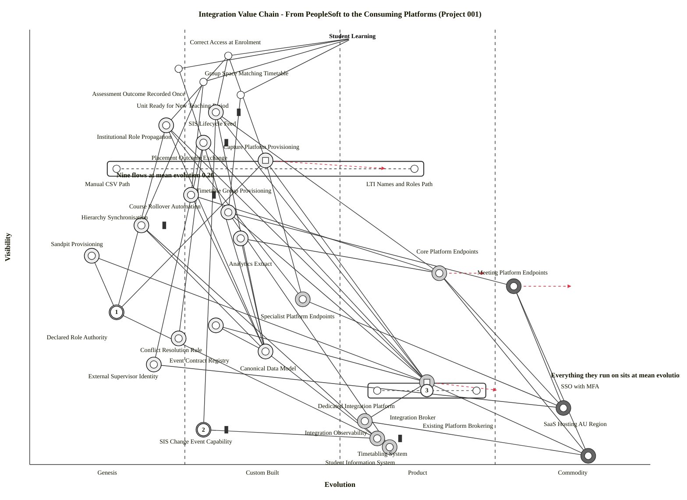

# Wardley Map: The Integration Value Chain — An Estate Built Upside Down

> **Template Origin**: Official | **ArcKit Version**: 6.7.5 | **Command**: `/arckit:wardley`

## Document Control

| Field | Value |
|-------|-------|
| **Document ID** | ARC-001-WARD-002-v1.0 |
| **Document Type** | Wardley Map — Integration Value Chain, Current State with 24-Month Evolution |
| **Project** | Learning & Teaching Baseline Strategy (Project 001) |
| **Classification** | OFFICIAL |
| **Status** | DRAFT |
| **Version** | 1.0 |
| **Created Date** | 2026-07-29 |
| **Last Modified** | 2026-07-29 |
| **Review Cycle** | Per engagement milestone; re-map at WP8 and after ADR-001 Condition 1 completes |
| **Next Review Date** | 2026-08-28 |
| **Owner** | Sam Okafor, Integration Architect (Digital & IT) |
| **Reviewed By** | [PENDING] |
| **Approved By** | [PENDING] |
| **Distribution** | Steering Committee; RIFF Review; Digital & IT; Student Administration; Learning Technologies; Education Committee |

## Revision History

| Version | Date | Author | Changes | Approved By | Approval Date |
|---------|------|--------|---------|-------------|---------------|
| 1.0 | 2026-07-29 | ArcKit AI | Initial creation from `/arckit:wardley` command — integration value chain from the student information system through the canonical model and broker to the consuming platforms | [PENDING] | [PENDING] |

---

## Relationship to ARC-001-WARD-001

This is the project's **second** map and it deliberately covers different ground.

| | ARC-001-WARD-001 | ARC-001-WARD-002 (this map) |
|---|---|---|
| **Scope** | The whole L&T estate — all eight capability categories [CT-C1] plus the layers beneath them | The integration value chain only: student, course and enrolment data flowing from PeopleSoft through the canonical model and broker out to the consuming platforms |
| **Question** | Where in the estate does durable advantage live, and is the consolidation argument near it? | Which part of the data path actually determines whether a student's access is correct and on time — and is the ADR-001 broker decision near *that*? |
| **Anchors** | Student, Teaching Staff, University Executive (three, including governance as a user) | Student Learning (one) — the integration chain exists to serve it and nothing else |
| **Integration treated as** | Five compressed components in the lower third of the map | Thirty-two components: nine named flows, a six-component contract layer, three endpoint classes, and the mediation substrate decomposed |
| **Central finding** | *"There is no differentiation anywhere in the platform estate"* [WARD1-C1] | The value chain is **inverted** — the nine flows sit 0.40 evolution-units *behind* everything they run on |

**Positioning consistency.** Nine components appear on both maps. Their **evolution** positions are identical by design, because evolution is a property of the component and not of the framing: Canonical Data Model 0.38, Integration Broker 0.64, Integration Observability 0.54, Student Information System 0.56, Timetabling System 0.58, SSO with MFA 0.86, SaaS Hosting AU Region 0.90, Course Rollover Automation 0.26, Placement Outcome Exchange 0.28. **Visibility** differs, and legitimately: in an estate-wide value chain the rollover script is a mid-map support component (0.56); in the integration value chain it is one of only three things standing between a coordinator and a usable unit site (0.62).

One WARD-001 component is **decomposed** here rather than repositioned. *Automated Identity and Role Lifecycle* (0.46, 0.36) splits into Institutional Role Propagation (0.22), Capture Platform Provisioning (0.38) and Declared Role Authority (0.14). The decomposition is the point: WARD-001's single component averaged a Genesis-stage decision together with a Product-stage standard, and the average concealed both.

---

## Strategic Question

ADR-001 is Proposed, not Accepted. It selects a central integration broker over point-to-point integration and LMS-as-hub, and it attaches three conditions [ADR1-C1]. Its option analysis, its cost analysis, its risk table and its rollback plan are all about **the mediation mechanism**.

This map asks a narrower and more awkward question:

> **Of everything that has to be true for a student's access to be correct on the first day of teaching, how much of it does the broker decision actually determine?**

The answer is: less than the decision's share of the project's attention would suggest — and the parts it does not determine are both less evolved and less contested.

---

## The Map

Paste into <https://create.wardleymaps.ai> to render.

```wardley
title Integration Value Chain - From PeopleSoft to the Consuming Platforms (Project 001)

anchor Student Learning [0.98, 0.52]

component Correct Access at Enrolment [0.94, 0.32]
component Assessment Outcome Recorded Once [0.91, 0.24]
component Unit Ready for New Teaching Period [0.88, 0.28]
component Group Space Matching Timetable [0.85, 0.34]
component SIS Lifecycle Feed [0.81, 0.30] inertia
component Institutional Role Propagation [0.78, 0.22]
component Placement Outcome Exchange [0.74, 0.28] inertia
component Capture Platform Provisioning [0.68, 0.38]
component Manual CSV Path [0.68, 0.14] inertia
component LTI Names and Roles Path [0.68, 0.62]
component Course Rollover Automation [0.62, 0.26] inertia
component Timetable Group Provisioning [0.58, 0.32]
component Hierarchy Synchronisation [0.55, 0.18] inertia
component Analytics Extract [0.52, 0.34]
component Sandpit Provisioning [0.48, 0.10]
component Core Platform Endpoints [0.44, 0.66]
component Meeting Platform Endpoints [0.41, 0.78]
component Specialist Platform Endpoints [0.38, 0.44]
component Declared Role Authority [0.35, 0.14]
component Event Contract Registry [0.32, 0.30]
component Conflict Resolution Rule [0.29, 0.24]
component Canonical Data Model [0.26, 0.38]
component External Supervisor Identity [0.23, 0.20]
component Integration Broker [0.17, 0.64]
component Dedicated Integration Platform [0.17, 0.56]
component Existing Platform Brokering [0.17, 0.72]
component SSO with MFA [0.13, 0.86]
component Integration Observability [0.10, 0.54]
component SIS Change Event Capability [0.08, 0.28] inertia
component Student Information System [0.06, 0.56] inertia
component Timetabling System [0.04, 0.58]
component SaaS Hosting AU Region [0.02, 0.90]

Student Learning -> Correct Access at Enrolment
Student Learning -> Assessment Outcome Recorded Once
Student Learning -> Unit Ready for New Teaching Period
Student Learning -> Group Space Matching Timetable

Correct Access at Enrolment -> SIS Lifecycle Feed
Correct Access at Enrolment -> Institutional Role Propagation
Correct Access at Enrolment -> Capture Platform Provisioning
Assessment Outcome Recorded Once -> Placement Outcome Exchange
Unit Ready for New Teaching Period -> Course Rollover Automation
Unit Ready for New Teaching Period -> Hierarchy Synchronisation
Group Space Matching Timetable -> Timetable Group Provisioning

SIS Lifecycle Feed -> SIS Change Event Capability
SIS Lifecycle Feed -> Canonical Data Model
SIS Lifecycle Feed -> Integration Broker
SIS Lifecycle Feed -> Core Platform Endpoints
Institutional Role Propagation -> Declared Role Authority
Institutional Role Propagation -> Canonical Data Model
Institutional Role Propagation -> Integration Broker
Institutional Role Propagation -> Specialist Platform Endpoints
Placement Outcome Exchange -> Conflict Resolution Rule
Placement Outcome Exchange -> External Supervisor Identity
Placement Outcome Exchange -> Canonical Data Model
Placement Outcome Exchange -> Integration Broker
Capture Platform Provisioning -> Declared Role Authority
Capture Platform Provisioning -> Specialist Platform Endpoints
Capture Platform Provisioning -> Integration Broker
Course Rollover Automation -> Canonical Data Model
Course Rollover Automation -> Core Platform Endpoints
Timetable Group Provisioning -> Timetabling System
Timetable Group Provisioning -> Meeting Platform Endpoints
Timetable Group Provisioning -> Integration Broker
Hierarchy Synchronisation -> Canonical Data Model
Hierarchy Synchronisation -> Student Information System
Analytics Extract -> Canonical Data Model
Analytics Extract -> Core Platform Endpoints
Sandpit Provisioning -> Declared Role Authority
Sandpit Provisioning -> Integration Broker

Core Platform Endpoints -> SSO with MFA
Core Platform Endpoints -> SaaS Hosting AU Region
Meeting Platform Endpoints -> SSO with MFA
Meeting Platform Endpoints -> SaaS Hosting AU Region
Specialist Platform Endpoints -> SSO with MFA

Event Contract Registry -> Canonical Data Model
Declared Role Authority -> Student Information System
Canonical Data Model -> Student Information System
External Supervisor Identity -> SSO with MFA
Integration Broker -> Event Contract Registry
Integration Broker -> Integration Observability
Integration Broker -> SaaS Hosting AU Region
Integration Observability -> SaaS Hosting AU Region
SIS Change Event Capability -> Student Information System

pipeline Capture Platform Provisioning [0.10, 0.66]
pipeline Integration Broker [0.52, 0.76]

build SIS Lifecycle Feed
build Institutional Role Propagation
build Placement Outcome Exchange
build Capture Platform Provisioning
build Course Rollover Automation
build Timetable Group Provisioning
build Hierarchy Synchronisation
build Analytics Extract
build Sandpit Provisioning
build Declared Role Authority
build Event Contract Registry
build Conflict Resolution Rule
build Canonical Data Model
build External Supervisor Identity
build SIS Change Event Capability
buy Core Platform Endpoints
buy Specialist Platform Endpoints
buy Integration Broker
buy Integration Observability
buy Student Information System
buy Timetabling System
outsource Meeting Platform Endpoints
outsource SSO with MFA
outsource SaaS Hosting AU Region

evolve Capture Platform Provisioning 0.58 label Manual path retires as standards provisioning lands
evolve Integration Broker 0.76 label Brokering absorbed into platform bundles
evolve Core Platform Endpoints 0.74 label Vendor APIs converging on 1EdTech
evolve Meeting Platform Endpoints 0.88 label Settling into pure utility

annotation 1 [0.35, 0.14] Least evolved component on the map - and ADR-002 has not been raised
annotation 2 [0.08, 0.28] ADR-001 assumption A-3, untested, and every event-driven flow rests on it
annotation 3 [0.17, 0.64] The only contested decision on this map is also the least differentiating

note Nine flows at mean evolution 0.26 [0.66, 0.14]
note Everything they run on sits at mean evolution 0.66 [0.20, 0.84]

style wardley
```

<details>
<summary>Mermaid Wardley Map</summary>



</details>

> **Note on the two blocks.** The Mermaid block is generated from the OWM source by the bundled `owm-to-mermaid.mjs` converter, not hand-authored. Both pipelines were verified to resolve to exactly their intended children with no spurious proximity captures. The converter strips `label` text from `evolve` lines — Mermaid's `wardley-beta` grammar has no verified label form there — so the four movement rationales are carried in §5. The per-component `label [dx, dy]` offsets in the Mermaid block were placed by the `tidy-wardley-labels.mjs` write hook to prevent label overlap at render; the OWM block above is the canonical, author-positioned source and was deliberately left untidied.

### Anchor

| Anchor | Position | Represents |
|--------|----------|------------|
| Student Learning | `[0.98, 0.52]` | The single user need this value chain exists to serve. Every flow on the map either delivers a student the right access at the right time, or it delivers a staff member the ability to give it |

**One anchor, deliberately.** WARD-001 used three because the estate serves three constituencies. The integration chain serves one — and reducing it to one is what makes the map's inversion visible, because there is now a single unbroken path from the top of the chain to PeopleSoft at the bottom.

---

## 1. Component Inventory and Strategic Metrics

Metrics from the Wardley mathematical model: **D** = differentiation pressure = visibility × (1 − evolution); **K** = commodity leverage = (1 − visibility) × evolution. High D (> 0.4) marks where investment buys advantage; high K (> 0.4) marks infrastructure to consume as utility. Computed programmatically from the OWM source.

| Component | Vis | Evo | Stage | D | K | Sourcing |
|-----------|-----|-----|-------|---|---|----------|
| Correct Access at Enrolment | 0.94 | 0.32 | Custom | **0.639** | 0.019 | User need |
| **Assessment Outcome Recorded Once** | 0.91 | 0.24 | Genesis | **0.692** | 0.022 | User need |
| Unit Ready for New Teaching Period | 0.88 | 0.28 | Custom | **0.634** | 0.034 | User need |
| Group Space Matching Timetable | 0.85 | 0.34 | Custom | **0.561** | 0.051 | User need |
| **SIS Lifecycle Feed** *(inertia)* | 0.81 | 0.30 | Custom | **0.567** | 0.057 | **Build** |
| **Institutional Role Propagation** | 0.78 | 0.22 | Genesis | **0.608** | 0.048 | **Build** |
| **Placement Outcome Exchange** *(inertia)* | 0.74 | 0.28 | Custom | **0.533** | 0.073 | **Build** |
| Capture Platform Provisioning | 0.68 | 0.38 | Custom | **0.422** | 0.122 | **Build** |
| ├ Manual CSV Path *(inertia)* | 0.68 | 0.14 | Genesis | **0.585** | 0.045 | Pipeline child — retire |
| └ LTI Names and Roles Path | 0.68 | 0.62 | Product | 0.258 | 0.198 | Pipeline child — adopt |
| **Course Rollover Automation** *(inertia)* | 0.62 | 0.26 | Custom | **0.459** | 0.099 | **Build** |
| Timetable Group Provisioning | 0.58 | 0.32 | Custom | 0.394 | 0.134 | Build |
| **Hierarchy Synchronisation** *(inertia)* | 0.55 | 0.18 | Genesis | **0.451** | 0.081 | **Build** |
| Analytics Extract | 0.52 | 0.34 | Custom | 0.343 | 0.163 | Build |
| Sandpit Provisioning | 0.48 | 0.10 | Genesis | **0.432** | 0.052 | **Build** |
| Core Platform Endpoints | 0.44 | 0.66 | Product | 0.150 | 0.370 | Buy |
| Meeting Platform Endpoints | 0.41 | 0.78 | Commodity | 0.090 | **0.460** | Outsource |
| Specialist Platform Endpoints | 0.38 | 0.44 | Custom | 0.213 | 0.273 | Buy |
| **Declared Role Authority** | 0.35 | 0.14 | Genesis | 0.301 | 0.091 | **Build** |
| Event Contract Registry | 0.32 | 0.30 | Custom | 0.224 | 0.204 | Build |
| Conflict Resolution Rule | 0.29 | 0.24 | Genesis | 0.220 | 0.170 | Build |
| Canonical Data Model | 0.26 | 0.38 | Custom | 0.161 | 0.281 | Build |
| External Supervisor Identity | 0.23 | 0.20 | Genesis | 0.184 | 0.154 | Build |
| **Integration Broker** | 0.17 | 0.64 | Product | 0.061 | **0.531** | **Buy** |
| ├ Dedicated Integration Platform | 0.17 | 0.56 | Product | 0.075 | **0.465** | Pipeline child |
| └ Existing Platform Brokering | 0.17 | 0.72 | Product | 0.048 | **0.598** | Pipeline child |
| **SSO with MFA** | 0.13 | 0.86 | Commodity | 0.018 | **0.748** | **Outsource** |
| Integration Observability | 0.10 | 0.54 | Product | 0.046 | **0.486** | Buy |
| **SIS Change Event Capability** *(inertia)* | 0.08 | 0.28 | Custom | 0.058 | 0.258 | **Build** |
| Student Information System *(inertia)* | 0.06 | 0.56 | Product | 0.026 | **0.526** | Buy |
| Timetabling System | 0.04 | 0.58 | Product | 0.017 | **0.557** | Buy |
| **SaaS Hosting AU Region** | 0.02 | 0.90 | Commodity | 0.002 | **0.882** | **Outsource** |

### Metric Validation

| Check | Result |
|-------|--------|
| Every high-D (> 0.4) sourced component flagged Build | ✅ SIS Lifecycle Feed (0.567), Institutional Role Propagation (0.608), Placement Outcome Exchange (0.533), Course Rollover Automation (0.459), Hierarchy Synchronisation (0.451), Sandpit Provisioning (0.432), Capture Platform Provisioning (0.422) — all seven flagged Build |
| Every high-K (> 0.4) component flagged Buy or Outsource | ✅ SaaS Hosting (0.882), SSO with MFA (0.748), Timetabling (0.557), Integration Broker (0.531), Student Information System (0.526), Integration Observability (0.486), Meeting Platform Endpoints (0.460) — all Buy/Outsource |
| No component flagged Build with high K | ✅ None. Highest-K Build component is Canonical Data Model at 0.281 |
| No component flagged Buy or Outsource with high D | ✅ None. Highest-D Buy component is Specialist Platform Endpoints at 0.213 |
| Every dependency edge terminates on a declared component | ✅ 51 edges, 0 dangling references (verified programmatically) |

**No positioning or strategy errors detected.**

**Exclusion stated openly.** The four components with D above 0.4 that carry no sourcing decorator are the **user needs** at the top of the chain. They cannot be bought or built; they are satisfied or not by the flows beneath them. Their high D is the map recording where value concentrates. `Manual CSV Path` also shows D = 0.585 with no Build decorator — that is deliberate and is explained in §3: it is the current state of a pipeline whose correct sourcing decision is *retirement*, not investment.

---

## 2. The Central Finding — The Chain Is Inverted

Group the map into three bands and take the mean evolution of each.

| Band | Components | Mean evolution | Mean D |
|------|-----------|----------------|--------|
| **The nine flows** | SIS Lifecycle Feed, Institutional Role Propagation, Placement Outcome Exchange, Capture Platform Provisioning, Course Rollover Automation, Timetable Group Provisioning, Hierarchy Synchronisation, Analytics Extract, Sandpit Provisioning | **0.264** | **0.468** |
| **The contract layer** | Declared Role Authority, Event Contract Registry, Conflict Resolution Rule, Canonical Data Model, External Supervisor Identity, SIS Change Event Capability | **0.257** | 0.191 |
| **The substrate they run on** | Core / Meeting / Specialist endpoints, Integration Broker, Integration Observability, SSO with MFA, Student Information System, Timetabling System, SaaS Hosting | **0.662** | 0.069 |

> **The nine flows sit 0.398 evolution-units behind the substrate they run on.**

That is the finding, and it is a specific structural claim rather than a rhetorical one. In a healthy value chain the *lower* layers are the more evolved ones — stability underneath enables agility above. Here the relationship holds for the platforms and inverts for the flows: the estate has bought mature, well-industrialised endpoints and connected them with Genesis-and-Custom plumbing that four of seven cases run by hand [SL-C1].

### Why this matters more than it sounds

Wardley's *Increased Stability of Lower Order Systems Increases Agility* says the reverse of what is happening here. When lower layers are unstable, engineering attention is dragged downward and away from higher-value work. That is precisely the observed condition: the Learning Technologist persona's stated pain points are *"undocumented automation; discovering integration failures via user reports; manual CSV handling"* [REQ-C6] — three symptoms of attention pinned to the least evolved layer.

It also explains a pattern the requirements record but do not connect. Every one of the four Must-priority technical success metrics in `ARC-001-REQ` — manual steps, propagation latency, monitoring-detected failures, provisioning automation — is a metric of this band and only this band [REQ-C7]. **The estate's entire measurable technical deficit is concentrated in the nine least evolved components on the map** — a band whose mean evolution is 0.264 while everything it rests on averages 0.662.

### What this does to the broker decision

`Integration Broker` sits at visibility 0.17, evolution 0.64, **D = 0.061, K = 0.531**.

Those numbers say something ADR-001 does not: the broker is the **most commoditised and least differentiating** component in the mediation layer. It is infrastructure to consume as a utility. It is also the *only* component on this map that anybody is arguing about.

This does not make ADR-001 wrong. Option B remains the right selection, and for the reason ADR-001 gives — runtime enforcement of the canonical model is qualitatively different from enforcement by convention [ADR1-C6]. What the map adds is that **the broker is not where the risk is**, and the project's sequencing currently treats it as though it were. See §7 for the specific consequence for ADR-001's Phase 1.

---

## 3. Build, Buy, Outsource

### Build — the nine flows and the contract layer

| Component | D | Why build, and what "build" means here |
|-----------|---|----------------------------------------|
| **Institutional Role Propagation** | 0.608 | Highest actionable D on the map. Genesis at 0.22 because there is no declared authority for the entity it propagates — role assignment failures are documented as a current defect [SL-C1] and DR-002 requires a single source [REQ-C8]. Build means *declare, then propagate* |
| **SIS Lifecycle Feed** | 0.567 | The nightly flat-file. The single flow the largest number of user needs depends on. Build means replacing a batch drop with change events, which depends entirely on the assumption in §4 |
| **Placement Outcome Exchange** | 0.533 | Manual re-keying of the estate's only sensitive information class [SL-C1]. Explicitly bidirectional by requirement, so it needs a conflict rule defined **in advance** [REQ-C2] |
| **Course Rollover Automation** | 0.459 | *"Semi-manual scripts; undocumented; single-person dependency"* [SL-C1]. This is refactoring, not replacement — the capability works, the packaging is the defect |
| **Hierarchy Synchronisation** | 0.451 | Fully manual, produces drift between PeopleSoft and Blackboard hierarchies [SL-C1]. See §4 — the map's most under-prioritised component |
| **Sandpit Provisioning** | 0.432 | Genesis at 0.10 — nothing exists. High D only because nothing exists; correctly deferred to 2027, and the map's advice is to let it stay deferred until the contract layer is real |
| **Capture Platform Provisioning** | 0.422 | A pipeline, not a component — see below |
| Timetable Group Provisioning | 0.394 | Batch export/import; timetable changes invisible until the next run [SL-C1] |
| Analytics Extract | 0.343 | Ad-hoc extracts with no retention or minimisation rules. INT-009 permits scheduled batch as a declared exception — the only flow where batch is the correct target [REQ-C9] |
| **Declared Role Authority** | 0.301 | **Evolution 0.14 — the least evolved component on the map.** It is a *decision*, not a build: which system is authoritative for institutional role. ADR-002 remains unraised [ADR1-C4] |
| Event Contract Registry | 0.224 | The runtime enforcement point for DR-001. Comes with the broker; what does not come with the broker is the schema it enforces |
| Conflict Resolution Rule | 0.220 | Genesis at 0.24. Required by INT-005's bidirectional flow and by Principle 5, which otherwise avoids bidirectional synchronisation [PRIN-C3] |
| Canonical Data Model | 0.161 | Positioned at 0.38, consistent with WARD-001. See the standards caution below |
| External Supervisor Identity | 0.184 | Genesis at 0.20. Placement supervisors sit outside the institutional identity boundary; the manual workaround exists because of a genuine architectural gap, not laziness |
| SIS Change Event Capability | 0.058 | Low D because low visibility — and that is exactly what makes it dangerous. See §4 |

> **Caution on the canonical model, restated with per-flow specifics.** WARD-001 recommended deriving the canonical model from an existing standard rather than a blank page. This map can say which standard per flow, which makes the recommendation executable rather than directional:
>
> | Flow | Standard basis available | Note |
> |------|--------------------------|------|
> | INT-001 SIS lifecycle | 1EdTech OneRoster (rostering: person, org, course, class, enrolment) | Maps directly onto DR-001's five attributes [REQ-C5] |
> | INT-002 institutional role | LTI 1.3 Names and Role Provisioning Services | Provides the role vocabulary; does **not** decide the authority |
> | INT-003 platform provisioning | SCIM for account lifecycle; LTI NRPS for unit-scoped role | This is the pipeline's right-hand path already |
> | INT-005 placement grades | LTI Assignment and Grade Services | Covers outcome transport; conflict rule remains local |
> | INT-009 analytics export | Caliper Analytics or xAPI | Defines the event vocabulary the extract should carry |
>
> Every canonical entity should trace to one of these or be explicitly recorded as a UoF extension with rationale. Vendors implement standards; no vendor will ever implement UoF's private schema, which is the whole substitution argument in WP8.

### The Capture Platform Provisioning pipeline — one flow, two evolution stages

| Path | Evolution | D | K | Verdict |
|------|-----------|---|---|---------|
| **Manual CSV Path** | 0.14 (Genesis) | 0.585 | 0.045 | **Retire.** Used as the workaround for casual academic staff [SL-C1] — the exact population NFR-SEC-003 and Principle 12 name as the common source of manual workaround |
| **LTI Names and Roles Path** | 0.62 (Product) | 0.258 | 0.198 | **Adopt as the only path.** Already in use for continuing staff |

This is the map's cleanest single finding, and it needs no decision from anybody. **One integration is being delivered simultaneously by a Product-stage standard and a Genesis-stage manual process, for two different populations of the same user type.** The D differential is 0.327 — the manual path carries more than twice the differentiation pressure of the standard path, which in Wardley terms is a precise statement of how much avoidable bespoke effort is trapped in it.

### Buy — Product stage

Core Platform Endpoints (K 0.370), Specialist Platform Endpoints (K 0.273), Integration Broker (K 0.531), Integration Observability (K 0.486), Student Information System (K 0.526), Timetabling System (K 0.557).

Two entries need comment:

- **Integration Broker (K = 0.531, moving to 0.76)** — see §6. Buying a *differentiated* broker product at the point where brokering is being absorbed into platform bundles is buying at the worst point on the curve. ADR-001 Condition 1 already requires the Principle 19 test [ADR1-C1]; the map makes it the strategically correct action rather than a procedural hurdle.
- **Specialist Platform Endpoints (0.44)** — positioned *below* Core Platform Endpoints (0.66) and Meeting Platform Endpoints (0.78) on evolution, and this is the map's most important positioning judgement. The specialist *tools* are Product-stage (WARD-001 placed Discipline Specialist Tooling at 0.50). Their **integration surfaces** are less evolved, because TC-1 states integration capability is bounded by what each vendor's interfaces support and *"target patterns may require negotiation rather than design alone"* [REQ-C3]. A thin market supplies good pedagogy tools and thin integration APIs. See §8.

### Outsource — Commodity

Meeting Platform Endpoints (K 0.460, evolution 0.78 → 0.88), SSO with MFA (K 0.748), SaaS Hosting AU Region (K 0.882).

`SSO with MFA` at K = 0.748 deserves one observation the security requirements do not make: it is the **most evolved thing every endpoint on this map already shares**. Three of the three endpoint classes depend on it. In a SaaS-heavy estate identity is the primary control surface, and here it is also the only fully industrialised integration the university already operates successfully. It is the proof that this estate *can* run a commodity-grade shared dependency — which is a materially useful argument to put in front of the availability objection to ADR-001 (Condition 2).

---

## 4. Inertia

Seven components carry inertia. Two of them are not in any risk register as inertia.

### SIS Change Event Capability — the load-bearing assumption

**Position**: visibility 0.08, evolution 0.28. **R(SIS Lifecycle Feed → SIS Change Event Capability) = 0.583.**

ADR-001 records this as assumption **A-3**: *"The SIS can emit change events, or can be made to"*, with the consequence *"If not, a change-data-capture approach is required and Phase 3 extends"* [ADR1-C2].

That understates it. **Every event-driven flow on this map terminates here.** NFR-P-001's 15-minute propagation target [REQ-C1] is unreachable if PeopleSoft cannot emit change events, regardless of which broker is selected, regardless of the canonical model's quality, and regardless of Principle 11. The broker can subscribe to nothing.

**Inertia types present**: capital (PeopleSoft is a long-lived, deeply embedded platform), supplier (the change-event capability is whatever the vendor's interface supports — TC-3 states the SIS interface capability constrains INT-001 and INT-002 [REQ-C10]), and skills (change-data-capture is not a capability the integration team currently holds).

**Why this is the dangerous one**: it is the lowest-visibility component in the fragile band, it is the one nobody will argue about, and it is scheduled to be discovered in ADR-001 Phase 3 — six weeks of build after four weeks of selection and four weeks of schema work [ADR1-C3]. **A-3 is a two-week technical spike that belongs in Phase 0 next to the Principle 19 test.** Testing it early costs a fortnight; discovering it late invalidates fourteen weeks of sequencing and the whole latency commitment.

### Hierarchy Synchronisation — the forgotten flow

**Position**: visibility 0.55, evolution 0.18, **D = 0.451**. **R(Unit Ready for New Teaching Period → Hierarchy Synchronisation) = 0.722 — the second-highest dependency risk on the map.**

INT-007 is rated **MEDIUM** priority with an SLA of one business day [REQ-C4]. It is the second-least evolved flow on the map, it is entirely manual, and its documented failure mode is *"drift between PeopleSoft and Blackboard hierarchies"* [SL-C1].

Drift in faculty, school and department structure is not a cosmetic problem. It corrupts the organisational dimension that every other flow's scoping, reporting and access decisions are made against — including the capability baseline the whole engagement rests on. **A MEDIUM-priority requirement carrying the map's second-highest dependency risk is a prioritisation error, and it is the one finding in this document that no other artifact in the project currently makes.**

**Inertia types**: process (the manual reconciliation has a settled rhythm) and success (it has always been caught eventually, which is why it has never been funded).

### The four remaining inertia points

| Component | Position | Inertia types | Note |
|-----------|----------|---------------|------|
| **Manual CSV Path** | 0.68, 0.14 | Consumer, process | The workaround exists for casual and sessional staff who have no formal voice in the project. Consumer inertia here is *someone else's* convenience, which is why it survives |
| **Course Rollover Automation** | 0.62, 0.26 | Skills, process, success | The capability lives in one person's head and has worked every teaching period so far. Corroborates WARD-001 §4 |
| **Placement Outcome Exchange** | 0.74, 0.28 | Process, consumer | Reinforced by External Supervisor Identity at 0.20 — R = 0.592. Remediating the flow without resolving external-supervisor identity relocates the manual step rather than removing it |
| **SIS Lifecycle Feed** | 0.81, 0.30 | Capital, supplier | Inherits its inertia from the component below it |

**The pattern across all seven**: five of the seven are *process* inertia and four are reinforced by a second party — a vendor interface, an external supervisor, a casual staff cohort, or a single individual. Not one is a technology problem. That is why *Manage Inertia* scores 2 in §7 and why naming these in a risk register has not moved any of them.

---

## 5. Movement and Predictions

| Component | Now | 24-month | Movement | Strategic implication |
|-----------|-----|----------|----------|----------------------|
| **Meeting Platform Endpoints** | 0.78 | **0.88** | +0.10 — medium | **Settling into pure utility.** Consistent with WARD-001's Collaboration prediction. Integration consequence: meeting-platform provisioning APIs will standardise and cheapen, making Timetable Group Provisioning the easiest of the nine flows to modernise |
| **Integration Broker** | 0.64 | **0.76** | +0.12 — medium-fast | **Brokering absorbed into platform bundles.** Event brokering and schema registry are moving into hyperscaler and productivity-suite platform agreements. Directly material to ADR-001 Condition 1 and to §6 |
| **Core Platform Endpoints** | 0.66 | **0.74** | +0.08 — medium | **Vendor APIs converging on 1EdTech.** LMS, assessment and portfolio vendors are converging on OneRoster, LTI Advantage and Caliper. The integration surface the university buys is becoming standardised whether or not the university asks for it |
| **Capture Platform Provisioning** | 0.38 | **0.58** | +0.20 — fast | **Manual path retires as standards provisioning lands.** The pipeline collapses toward its right-hand child as SCIM and LTI NRPS provisioning become table stakes. This is the **only** flow the market will move for the university |

### What is *not* moving, and why that is the point

**Declared Role Authority (0.14), Sandpit Provisioning (0.10), Conflict Resolution Rule (0.24), Hierarchy Synchronisation (0.18), External Supervisor Identity (0.20), Course Rollover Automation (0.26), SIS Change Event Capability (0.28).**

Seven components. No market is coming for any of them. They will sit exactly where they are until the university moves them.

Read against the four movements above, this produces the map's sharpest sequencing claim:

> **The market is going to improve the substrate and one flow. It is going to improve none of the contract layer.** A plan that waits for the broker will find in 2028 that brokering got cheaper and easier — and that the role authority is still undeclared, the conflict rule still unwritten, and the hierarchy still drifting.

The predictions also carry a warning about *Punctuated Equilibrium*. Brokering and provisioning are both candidates for a rapid rather than gradual product-to-utility shift. If the broker's move to 0.76 arrives early — via a change in the Microsoft licensing position, which ADR-001 already lists as a re-evaluation trigger [ADR1-C7] — a procurement run on the current timetable will complete just in time to have bought the wrong thing.

---

## 6. The Strategic Tension, Mapped

The engagement's known tension is that the CIO favours Microsoft-platform consolidation via Teams and Stream, while the Director of Learning Technologies and the Dean of Music & Performing Arts defend best-of-breed pedagogy tools — Echo360, and discipline software including MuseScore and Ableton Live. The stakeholder notes flag it for the WP6 decisions register [STK-C1].

On this map that argument resolves into **two separate components at two different levels of the value chain**, and separating them is this map's principal contribution.

### Level 1 — the mediation substrate (`Integration Broker` pipeline, visibility 0.17)

| Path | Evolution | D | K | Reading |
|------|-----------|---|---|---------|
| **Existing Platform Brokering** | 0.72 | 0.048 | **0.598** | The licensed platform agreement's own event and integration capability |
| **Dedicated Integration Platform** | 0.56 | 0.075 | **0.465** | A separately procured iPaaS or self-hosted broker |

Both are Product. Both have negligible D. The right-hand path has **higher commodity leverage (0.598 vs 0.465)**, sits closer to where the component is heading (0.76 by 2028), and is the one Principle 19 and ADR-001 Condition 1 both point at [PRIN-C2] [ADR1-C1].

**On this level the CIO's consolidation instinct is correct, and correct on evolution grounds rather than cost grounds.** Consolidating the *substrate* onto the existing platform agreement is the strategically right move at K ≈ 0.6 with the component commoditising. It is also completely invisible to academic staff: no pedagogy tool changes, no teaching practice changes, no student-facing surface changes.

### Level 2 — the endpoint count (`Specialist Platform Endpoints`, visibility 0.38, evolution 0.44)

Specialist endpoints sit at evolution 0.44 — **0.34 behind meeting platforms (0.78) and 0.22 behind core platforms (0.66).** D = 0.213, K = 0.273. Two flows depend on them directly: Institutional Role Propagation (R = 0.437) and Capture Platform Provisioning (R = 0.381).

Principle 4 already settles the principle: specialist need justifies a different tool, never a different architecture, and specialist tools must integrate through the same interfaces and identity model [PRIN-C1]. **On this level Moog and Key are right** — a thin market with high domain certainty will not be served by a general collaboration suite, and MuseScore, Ableton and performance capture are not going to be absorbed into a meeting platform because the demand base is too narrow to attract that supply [SL-C3].

But the map attaches a price the pedagogy argument has not yet been asked to pay, and it is not a licence price:

> **Every specialist endpoint retained is an integration endpoint at evolution 0.44, held by a vendor whose interface capability the university does not control [REQ-C3].** The cost of best-of-breed is integration surface at a less-evolved endpoint — and it lands on Okafor's team, not on the school that chose the tool.

### Why separating the two levels matters

**Rhodes and Moog are arguing about different components on different levels of the value chain, and settling either one does not settle the other.**

- Consolidating the substrate (Level 1) removes no pedagogy tool and costs the academic case nothing.
- Retaining specialist endpoints (Level 2) obliges nothing about the broker and costs the CIO's cost model nothing directly — it costs integration effort, which is a different budget line and a different owner.

The two positions have been experienced as one conflict because both get expressed as *"consolidate or not"*. They are not one conflict. **Recommendation: the WP6 decisions register should carry them as two decisions with two different owners and two different forums** — substrate to RIFF under Principle 19 with Rhodes as owner, endpoint policy to Education Committee under Principle 4 with Moog and Key as owners, each with an explicit integration-surface condition.

That is a different resolution from WARD-001's, and the two are complementary rather than competing. WARD-001 split the argument **horizontally** — consolidate the general capability, retain the specialist capability. This map splits it **vertically** — consolidate the substrate, negotiate the endpoint. Both splits can be executed at once; neither requires the other; and together they take the whole of Conflict C-1 off the critical path.

---

## 7. Dependency Risk Analysis

**R(a,b) = visibility(a) × (1 − evolution(b))** — flags visible components resting on immature ones. High R (> 0.4) is a fragility signal. The four anchor-to-need edges are excluded as structural. 47 remaining edges assessed; **13 above 0.5, 17 above 0.4.**

| Dependent | Depends on | R | Assessment |
|-----------|-----------|---|------------|
| Correct Access at Enrolment | Institutional Role Propagation | **0.733** | 🔴 **Highest on the map** |
| Unit Ready for New Teaching Period | Hierarchy Synchronisation | **0.722** | 🔴 See §4 — the under-prioritised one |
| Institutional Role Propagation | Declared Role Authority | **0.671** | 🔴 Highest flow-to-contract risk |
| Correct Access at Enrolment | SIS Lifecycle Feed | **0.658** | 🔴 |
| Assessment Outcome Recorded Once | Placement Outcome Exchange | **0.655** | 🔴 |
| Unit Ready for New Teaching Period | Course Rollover Automation | **0.651** | 🔴 Corroborates WARD-001 §6 |
| Placement Outcome Exchange | External Supervisor Identity | **0.592** | 🔴 |
| Capture Platform Provisioning | Declared Role Authority | **0.585** | 🔴 |
| SIS Lifecycle Feed | SIS Change Event Capability | **0.583** | 🔴 **The untested assumption** |
| Correct Access at Enrolment | Capture Platform Provisioning | **0.583** | 🔴 |
| Group Space Matching Timetable | Timetable Group Provisioning | **0.578** | 🔴 |
| Placement Outcome Exchange | Conflict Resolution Rule | **0.562** | 🔴 |
| SIS Lifecycle Feed | Canonical Data Model | **0.502** | 🔴 |
| Institutional Role Propagation | Canonical Data Model | 0.484 | 🟠 |
| Placement Outcome Exchange | Canonical Data Model | 0.459 | 🟠 |
| Institutional Role Propagation | Specialist Platform Endpoints | 0.437 | 🟠 See §6 Level 2 |
| Sandpit Provisioning | Declared Role Authority | 0.413 | 🟠 |
| SIS Lifecycle Feed | Integration Broker | 0.292 | 🟢 |

### The observation that should decide the sequencing

**Not one of the thirteen risks above 0.5 passes through the Integration Broker.**

The broker's highest dependency risk on the entire map is 0.292 — comfortably below the amber threshold — because the broker is a Product-stage component and R punishes immaturity, not importance. Sort the map by fragility and the contested decision appears in eighteenth place.

Every one of the thirteen passes through either **a flow** or **the contract layer**. Both bands are platform-neutral. Both can begin without ADR-001 being Accepted.

### ADR-001's phasing, tested against the map

ADR-001's timeline runs: Phase 0 Principle 19 test (2 weeks) → Phase 1 broker selection (4 weeks) → Phase 2 canonical schema registered and availability design (4 weeks) → Phase 3 INT-001 delivered (6 weeks) → Phase 4 INT-005 delivered (4 weeks) [ADR1-C3].

The map has one specific objection to that order, and it is not about the broker.

> **Two Genesis-stage artefacts are scheduled inside Phase 2, and they are not configurations — they are decisions.**
>
> - **Declared Role Authority (0.14)** — three flows depend on it at R ≥ 0.41. ADR-001 lists it as a dependency and as candidate ADR-002, not yet raised [ADR1-C4].
> - **Conflict Resolution Rule (0.24)** — required by INT-005's explicitly bidirectional flow, which Phase 4 delivers [REQ-C2].
>
> A schema registry enforces contracts. It does not author them, and it cannot decide whose role assertion is true. Scheduling *"canonical schema registered"* after broker selection is fine; scheduling the **authority decision** after it is not, because the schema cannot be written without it.

**Concrete revision, additive rather than disruptive:**

| Phase | ADR-001 as written | Map's revision |
|-------|--------------------|----------------|
| **0** | Principle 19 test (2 weeks) | Principle 19 test **+ A-3 change-event spike + ADR-002 raised** (2–3 weeks, parallel) |
| **1** | Broker selection (4 weeks) | Unchanged — but now informed by A-3's answer and by a declared role authority |
| **2** | Schema registered; availability design (4 weeks) | Unchanged, and now executable: the schema has a standards basis (§3) and an authority to reference |
| **3** | INT-001 delivered (6 weeks) | Unchanged. **Conflict rule drafted here**, ahead of Phase 4 rather than during it |
| **4** | INT-005 delivered (4 weeks) | Unchanged |

Phase 0 gains a spike and a decision; nothing downstream moves. This is the cheapest change recommended anywhere in this document and it de-risks the largest number of high-R edges.

---

## 8. Doctrine Assessment — Integration Scope

Scored 1–5 against the bundled rubric, and **scoped to the integration estate only**. Where a score differs from WARD-001's estate-wide reading, the difference is stated. Both are correct at their own scope.

| Doctrine | Phase | Score | Assessment | Evidence |
|----------|-------|-------|-----------|----------|
| **Know the details** | I | **4** | ✅ Established — *higher than WARD-001's estate-wide 3* | Every one of the seven current integrations has its mechanism **and** its specific failure mode documented [SL-C1]. That is unusually good integration documentation, and it is why this map could be drawn at all |
| **Common language** | I | 4 | ✅ Established | Nine typed INT identifiers with current-state annotations and bidirectional traceability to the survey register |
| **Focus on user needs** | I | 4 | ✅ Established | Three use cases (UC-1, UC-2, UC-3) trace the integration chain end-to-end from the student's and coordinator's point of view, not from the systems' |
| **Challenge assumptions** | I | **2** | 🟠 **Weakest Phase I area** — *lower than WARD-001's 5* | ADR-001 states A-3 honestly and then builds a five-phase plan on it untested. Assumptions are *recorded* well and *challenged* not at all. §4 is the consequence |
| **Remove bias and duplication** | I | 3 | 🟡 Emerging | Duplication is well handled at platform level; at integration level one flow runs two mechanisms for two staff populations and nobody has called it duplication (§3) |
| **Systematic learning** | I | 2 | 🟠 Weak | Failure modes are documented as a snapshot; there is no mechanism feeding operational integration failures back into architecture. NFR-M-001 specifies this as target state |
| **Use standards** | II | **2** | 🟠 **Weakest overall, and the biggest available win** | LTI and SSO are *assumed*; no flow has a declared standards basis; the canonical model has none. §3 supplies the mapping — five of nine flows have a named standard available today |
| **Use appropriate methods** | II | 2 | 🟠 Weak | Nine flows spanning evolution 0.10 to 0.38 are being planned as one workstream on one timeline. Genesis-stage decisions and Custom-stage refactoring need different methods and different failure tolerances |
| **Manage inertia** | II | 2 | 🟠 Weak — *consistent with WARD-001* | Seven inertia points (§4), all costed as risks, none challenged as a strategic position |
| **Manage failure** | II | 2 | 🟠 Weak | Failures are currently detected by users. The requirement to change that (NFR-M-001) exists; the capability does not |
| **Bias towards open** | II | 5 | ✅ Embedded | ADR-001 records its own strongest counter-argument as *"anticipated and legitimate"* and publishes its rollback plan and assumptions |
| **Be pragmatic** | II | 4 | ✅ Established | INT-009 keeps scheduled batch as a declared, reasoned exception rather than forcing event-driven purity onto a bulk analytical transfer [REQ-C9] |
| **Move fast** | II | 2 | 🟠 Weak | The estate's most defective flow — manual re-keying of sensitive placement data — is scheduled fourth, twenty weeks out, behind a broker selection it does not need |
| **Optimise flow** | III | **1** | 🔴 **Not practised** | There is no end-to-end measurement from enrolment change to platform effect anywhere in the estate. NFR-M-001 and the 15-minute target [REQ-C1] are both aspirations with no baseline instrument |
| **Set exceptional standards** | III | 4 | ✅ Established | Manual steps in production flows carrying personal information are prohibited outright, not discouraged |
| **Commit to direction** | III | 2 | 🟠 Weak — *consistent with WARD-001* | ADR-001 Proposed, ADR-002 unraised, ADR-003 unraised |
| **Design for constant evolution** | IV | 2 | 🟠 Weak | The target architecture is a good architecture for the current nine flows. Nothing in it makes flow number ten cheaper, which is the actual test — and the canonical model with a standards basis is the mechanism that would |

**Overall.** Integration doctrine at UoF is strong where it concerns *knowing* and weak where it concerns *acting*. Know the details (4), Common language (4), Bias towards open (5) and Focus on user needs (4) are genuinely good — this project understands its integration estate better than most.

**The two weakest scores are the same weakness seen twice.** *Optimise flow* (1) and *Challenge assumptions* (2, integration-scoped) both describe an organisation that has documented its landscape carefully and has not instrumented or tested it. Nobody can currently measure how long a change actually takes to propagate, and nobody has verified that the source system can emit the change at all. Those are the two cheapest gaps to close on this entire map, and both belong in the next fortnight.

---

## 9. Applicable Gameplay Patterns

| Pattern | Category | Alignment | Applicability |
|---------|----------|-----------|---------------|
| **Market enablement via standards** | Accelerator | LG | ✅ **The strongest available play, and now specifiable per flow.** §3 names OneRoster, LTI NRPS, SCIM, AGS and Caliper against five of the nine flows. Doctrine *Use standards* scores 2, so this is the largest gap-to-value ratio on the map |
| **Refactoring** | Toxicity | LG | ✅ **Directly applicable to Course Rollover Automation and Hierarchy Synchronisation.** Both retain strategic value; undocumented and manual packaging is suppressing it. Refactoring, not replacement |
| **Disposal of liability** | Toxicity | N | ✅ **Immediately applicable to the Manual CSV Path.** Graceful retirement with a parallel-run period, exactly as ADR-001's own rollback procedure describes. The pipeline's left-hand child is the clearest disposal candidate in the estate |
| **Buyer power** | Market | LE | ✅ Available and under-used. Requiring OneRoster / LTI NRPS / SCIM conformance as a *scored* selection criterion turns Principle 9's exit rights into an integration lever at every renewal — and it applies to specialist vendors too, which is how §6 Level 2's cost gets addressed rather than absorbed |
| **Co-creation** | Ecosystem | LG | 🟡 Available, unused. Every Australian university with a student information system, a timetabling system and an LMS has an identical role-authority and rollover problem. CAUDIT is the obvious channel |
| **Managing inertia** | Defensive | N | 🟠 **Available, not being played.** Seven inertia points, all recorded as risks, none challenged. Doctrine scores this 2 |
| **Procrastination** | Defensive | N | 🟡 **Legitimately available for one component only.** Sandpit Provisioning at 0.10 with no market and no 2026 need is the one place where deliberate delay is the correct play rather than a failure to decide |

### Anti-Patterns — Checked

| Anti-pattern | Present? | Note |
|--------------|----------|------|
| **Buying the substrate before authoring the contract** | 🟠 **Present** | *A named instance of "playing in the wrong evolution stage".* Broker selection (Product, 0.64) is scheduled in Phase 1; the two Genesis artefacts it depends on (0.14 and 0.24) fall in Phases 2 and 4. Product-stage procurement cannot substitute for Genesis-stage decisions. §7 gives the fix |
| **Ignoring inertia** | 🟠 **Present** | Seven inertia points, none challenged. The clearest instance is SIS Change Event Capability being treated as an assumption rather than a spike |
| Misreading evolution pace | 🟡 **Watch** | The 2027 Teams investigation [SL-C2] shows the market movement is correctly perceived. But the broker's move from 0.64 to 0.76 is not reflected anywhere in ADR-001's procurement timing |
| Playing in the wrong evolution stage | 🟡 **Watch** | Sourcing is correct throughout and the metrics validate it (§1). Where it appears is in **method**: nine flows spanning 0.10 to 0.38 are planned as one workstream on one cadence (doctrine *Use appropriate methods*, 2) |
| Building custom where product exists | 🟡 **Watch** | Not yet present, but two live near-misses: the canonical model one blank-page decision away from it, and the Manual CSV Path already an instance of custom effort where a Product-stage standard is in the same pipeline |
| Single-play dependence | 🟡 Partial | Rationalisation is the only play in flight. Standards, buyer power and disposal-of-liability are all available and none is running |
| Legacy trap | ❌ No | No integration is being retained because it is owned. All seven are retained because nothing has replaced them, which is a sequencing problem, not a trap |

---

## 10. Climatic Patterns

| Pattern | Impact on the integration chain |
|---------|--------------------------------|
| **Increased stability of lower order systems increases agility** | ⚠️ **Inverted here, and this is §2.** The layer beneath the flows is stable (mean 0.662); the flows themselves are not (mean 0.264). Engineering attention is dragged downward to manual CSVs and undocumented scripts, away from the higher-value work the same team is meant to be doing |
| **Everything evolves** | Four components carry explicit movement (§5); seven will not move without the university moving them. The distinction between the two lists is the investment case |
| **Characteristics change as components evolve** | As core platform APIs converge on 1EdTech (0.66 → 0.74), integration competition shifts from *can it be done* to *does it conform*. **Evaluation criteria written on functional integration capability will age faster than criteria written on standards conformance and exit** |
| **Efficiency enables innovation** | Commodity hosting and commodity SSO are why a 20-plus tool estate was affordable enough to grow organically. The same force keeps adding endpoints — and each new endpoint is a new integration unless the contract layer becomes real |
| **Higher order systems create new value** | The cross-platform cohort view, at-risk identification and program-level portfolio evidence all sit *above* this map. **None is reachable without the canonical model.** The value of the contract layer is mostly value that does not exist yet, which is exactly why it is under-funded |
| **Punctuated equilibrium** | Brokering and standards-based provisioning are both candidates for a rapid rather than gradual product-to-utility shift. A procurement run on ADR-001's current timetable has no margin if the shift arrives early [ADR1-C7] |
| **Jevons paradox** | Making integration cheap will produce more integrations, not fewer. That is the correct outcome and it must be planned for — the target architecture's real test is the marginal cost of flow number ten, not the total cost of the current nine |
| **No choice over evolution (Red Queen)** | Near-real-time propagation, automated provisioning and Essential Eight expectations are all rising independently of the university's roadmap. Today's 15-minute target is tomorrow's baseline |
| **The less evolved something is, the more uncertain it becomes** | Declared Role Authority (0.14), Sandpit Provisioning (0.10) and Conflict Resolution Rule (0.24) carry the map's highest uncertainty — and two of the three are scheduled as configuration tasks inside a delivery phase (§7) |
| **Not everything survives** | The Manual CSV Path and the nightly flat-file drop both have a defined end. Neither has a *dated* end, which is the difference between a plan and an intention |
| **Peace / War / Wonder** | Meeting and core platforms are late **Peace** moving to **War** as brokering and provisioning industrialise. The integration flows are pre-Peace: not yet a market, not yet a product, not yet standardised at UoF. **The university is about to experience a War in a layer it has not finished building** |

---

## 11. Recommendations

### Immediate (0–3 months, before the 31 August deliverable)

1. **Add an A-3 change-event spike to ADR-001 Phase 0, alongside the Principle 19 test.** Establish whether PeopleSoft can emit change events, and if not, cost the change-data-capture alternative. Two weeks, parallel, no downstream impact. **Owner**: Sam Okafor. *Success criterion*: A-3 recorded as verified or falsified, with the CDC option costed if falsified — before broker selection begins.
2. **Raise ADR-002 (authoritative source for institutional role) in Phase 0, not Phase 2.** Three flows depend on it at R ≥ 0.41; it is the least evolved component on the map at 0.14; and the schema cannot be authored without it. **Owner**: Sam Okafor, with Student Administration. *Success criterion*: ADR-002 raised and at least Proposed before Phase 1 closes.
3. **Retire the Manual CSV Path.** One integration, two mechanisms, two staff populations, D differential 0.327. It needs no broker, no ADR and no committee — only the LTI Names and Roles path extended to casual and sessional staff. **Owner**: Dr. Benny Moog with Sam Okafor. *Success criterion*: zero CSV provisioning events in the next teaching period.
4. **Re-rate INT-007 from MEDIUM.** Hierarchy Synchronisation carries R = 0.722 — second-highest on the map — at evolution 0.18 with a fully manual mechanism. **Owner**: Sam Okafor to raise at RIFF; Dr. Felix Marimba as requirements custodian. *Success criterion*: priority re-assessed with the dependency risk on the record, whatever the outcome.
5. **Give every flow a declared standards basis before WP5 drafting begins.** Use the per-flow mapping in §3. **Owner**: Sam Okafor. *Success criterion*: each of the nine flows names a standard or records an explicit UoF extension with rationale; doctrine *Use standards* moves from 2 toward 4.
6. **Split Conflict C-1 into two WP6 decisions.** Substrate consolidation to RIFF under Principle 19 (owner: Cassandra Rhodes); specialist endpoint policy to Education Committee under Principle 4 with an integration-surface condition (owners: Dr. Benny Moog, Prof. Desmond Key). **Owner of the split**: Rhonda Bell to sequence [STK-C2]. *Success criterion*: two decisions with two owners and two forums, neither blocking the other.

### Short-term (3–12 months, business case and early delivery)

7. **Instrument end-to-end propagation latency before optimising it.** *Optimise flow* scores 1 because nothing measures the chain from enrolment change to platform effect. A baseline instrument is a precondition for NFR-P-001 being a target rather than a hope. **Owner**: Sam Okafor. *Success criterion*: 95th-percentile propagation latency reported weekly for INT-001 and INT-002.
8. **Weight the Principle 19 test by the broker's evolution movement.** At 0.64 → 0.76 with K = 0.531, brokering is becoming a bundled utility. Buying a differentiated product at that point on the curve is the worst available timing, and the higher-K path (Existing Platform Brokering, K = 0.598) is also the cheaper one. **Owner**: Cassandra Rhodes (ADR-001 Condition 1).
9. **Draft the Conflict Resolution Rule in Phase 3, not Phase 4.** INT-005 is bidirectional by explicit requirement and Principle 5 otherwise avoids bidirectional flows; the rule must exist before the flow is built, not alongside it. **Owner**: Sam Okafor with Prof. Priya Anand.
10. **Resolve external-supervisor identity as part of INT-005, not after it.** R = 0.592 at evolution 0.20. Remediating the placement flow without it relocates the manual step rather than removing it. **Owner**: Prof. Priya Anand with Eleanor Frame and Tobias Ohm.
11. **Make standards conformance a scored procurement criterion — including for specialist tools.** This is how §6 Level 2's integration cost gets addressed at the point of choice rather than absorbed by Digital & IT afterwards. **Owner**: Grace Tanaka with Sam Okafor.

### Long-term (12–24 months, post-roadmap)

12. **Measure the target architecture by the marginal cost of flow number ten.** Jevons says cheaper integration produces more integration. The canonical model plus a standards basis is what makes the tenth flow cheap; total cost of the current nine is the wrong test. **Owner**: Sam Okafor.
13. **Re-map after ADR-001 Condition 1 completes and again at WP8.** Test the §5 predictions. The broker at 0.76 and specialist endpoints at 0.44-or-moved change the §6 calculus materially.
14. **Explore CAUDIT co-creation on role authority and rollover.** Every Australian university faces the identical problem, and shared effort on a Genesis-stage decision produces shared advantage rather than shared mediocrity.

---

## 12. Traceability

### Requirements and Principles

| Map component | Requirements | Principles |
|---------------|--------------|-----------|
| Correct Access at Enrolment | BR-006, UC-1, NFR-P-001 | 1, 11 |
| Assessment Outcome Recorded Once | FR-018, UC-2, DR-004 | 7, 10 |
| Unit Ready for New Teaching Period | FR-001, UC-3, NFR-M-002 | 3, 13 |
| Group Space Matching Timetable | FR-013, FR-014 | 11 |
| SIS Lifecycle Feed | INT-001, NFR-P-001, DR-001 | 5, 10, 11 |
| Institutional Role Propagation | INT-002, DR-002, NFR-SEC-003 | 5, 12 |
| Placement Outcome Exchange | INT-005, FR-018, DR-004, NFR-C-003 | 7, 10 |
| Capture Platform Provisioning | INT-003, REQ-025, NFR-SEC-003 | 4, 12 |
| Course Rollover Automation | INT-004, NFR-M-002 | 13 |
| Timetable Group Provisioning | INT-006, FR-014 | 11 |
| Hierarchy Synchronisation | INT-007 | 5 |
| Analytics Extract | INT-009, FR-022, DR-006 | 7 |
| Sandpit Provisioning | INT-008 | 7, 13 |
| Core Platform Endpoints | NFR-I-001, NFR-I-002, DR-007 | 9, 10 |
| Meeting Platform Endpoints | FR-013, INT-006 | 2 |
| Specialist Platform Endpoints | FR-005, FR-006, FR-010, TC-1 | 4 |
| Declared Role Authority | DR-002, INT-002 | 5 |
| Event Contract Registry | DR-001, NFR-I-001 | 6, 10 |
| Conflict Resolution Rule | INT-005 (bidirectional note) | 5 |
| Canonical Data Model | DR-001, REQ-027 | 6 |
| External Supervisor Identity | INT-005, NFR-SEC-001 | 12 |
| Integration Broker | INT-001 to INT-009, NFR-A-001 | 10, 11, 19 |
| SSO with MFA | NFR-SEC-001, REQ-031 | 12, 16 |
| Integration Observability | NFR-M-001, REQ-023 | 17 |
| SIS Change Event Capability | INT-001, TC-3, NFR-P-001 | 11 |
| Student Information System | TC-3, DR-001 | 5 |
| Timetabling System | INT-006 | 11 |
| SaaS Hosting AU Region | NFR-C-001, NFR-C-002, DR-005 | 8 |

### Decisions

| Map finding | Related artifacts |
|-------------|-------------------|
| The chain is inverted — flows 0.398 behind their substrate (§2) | BR-004; INT-001 to INT-009; ADR-001 |
| Broker carries no dependency risk above 0.292 (§7) | ADR-001 Decision Outcome; ADR-001 Condition 1 |
| A-3 change-event capability untested and load-bearing (§4) | ADR-001 assumption A-3; TC-3; NFR-P-001 |
| ADR-002 must precede broker selection (§7) | ADR-001 Implementation Plan dependencies; DR-002; INT-002 |
| Conflict rule is a Genesis decision inside a delivery phase (§7) | INT-005; Principle 5; ADR-001 Phase 4 |
| Manual CSV Path is retirable today (§3) | INT-003; REQ-025; NFR-SEC-003; Principle 12 |
| INT-007 under-prioritised at MEDIUM (§4) | INT-007; DR-001; Principle 5 |
| Conflict C-1 is two decisions, not one (§6) | Conflict C-1; STKE Conflict 1; Principles 4 and 19; WP6 register [STK-C1] |
| Per-flow standards basis available today (§3) | DR-001; ADR-001; NFR-I-001; Principle 6 |
| Broker timing against evolution movement (§5, §11.8) | ADR-001 Condition 1; ADR-001 re-evaluation triggers; BR-002 |

### Cross-Map and Cross-Project

| Relationship | Note |
|-------------|------|
| **ARC-001-WARD-001** | Nine shared components carry identical evolution positions by design (see the comparison table above). This map **corroborates** WARD-001 on Course Rollover Automation's fragility, on the ADR-002 sequencing conclusion, and on the standards basis for the canonical model — each reached by a different route. It **adds** the inversion finding (§2), the A-3 exposure (§4), the INT-007 re-rating (§4), the two-level reading of Conflict C-1 (§6), and the per-flow standards mapping (§3) |
| **ARC-001-ADR-001** | This map does not dispute the decision. It disputes two items of the phasing (§7) and reinforces Condition 1 on evolution grounds (§5, §6) |
| **Project 002 (Lecture Capture)** | 002's INT-001 provisioning consumes the mediation chosen in ADR-001. Two components on this map are directly load-bearing for it: Declared Role Authority (0.14) and Capture Platform Provisioning (0.38). 002's assumption A-11 and risk R-010 should be re-scoped against those two components rather than against the canonical model, which already exists |

### Framework Applicability

**Not applicable**: UK Government frameworks. Digital Marketplace, G-Cloud, DOS, the Technology Code of Practice and the GDS Service Standard have no standing for an Australian private-sector university. The equivalent obligations here are the **Privacy Act 1988** and the Australian Privacy Principles (APP 8 in particular, for the four offshore data classes), the **ASD Essential Eight** at a target of ML2 by end 2027, and the university's own **RIFF Review** governance.

**AI Playbook / ATRS**: not applicable. No component on this map performs algorithmic decision-making about individuals. `Analytics Extract` moves derived engagement data for human analysis; if that ever becomes automated intervention it acquires an assessment obligation it does not currently have.

---

## External References

### Document Register

| Doc ID | Filename | Type | Source Location | Description |
|--------|----------|------|-----------------|-------------|
| CT | capability-taxonomy.md | Foundation artifact | `000-global/external/` | Eight-category L&T capability taxonomy |
| SL | system-landscape.md | Foundation artifact | `001-lt-ecosystem/external/` | Current tools by category; the seven known integrations and their mechanisms and failure modes — the primary source for this map's flow positions |
| STK | stakeholders.md | Engagement input | `001-lt-ecosystem/external/` | Engagement stakeholder register; the known tension and the approval path |
| REQ | ARC-001-REQ-v1.0.md | ArcKit artifact | `001-lt-ecosystem/` | BR / FR / NFR / INT / DR requirements; use cases; personas; constraints |
| ADR1 | ARC-001-ADR-001-v1.0.md | ArcKit artifact | `001-lt-ecosystem/decisions/` | Integration mediation decision, conditions, assumptions, phasing and open successors |
| PRIN | ARC-000-PRIN-v1.1.md | ArcKit artifact | `000-global/` | Principles 1–19 |
| WARD1 | ARC-001-WARD-001-v1.0.md | ArcKit artifact | `001-lt-ecosystem/wardley-maps/` | Ecosystem-wide map; positioning baseline for the nine shared components |

### Citations

| Citation ID | Doc ID | Page/Section | Category | Quoted Passage |
|-------------|--------|--------------|----------|----------------|
| CT-C1 | CT | Preamble | Taxonomy | "Every current and proposed tool is categorised against this taxonomy to enable cross-system comparison, duplication analysis and rationalisation decisions." |
| SL-C1 | SL | Known integrations | Risk Factor | "PeopleSoft → Blackboard ... Nightly batch flat-file / Fragile; role assignment failures; no intra-day sync"; "Echo360 user provisioning / LTI + manual CSV / Manual workaround for casual academic staff"; "Course cloning automation / Semi-manual scripts / Undocumented; single-person dependency"; "Institutional hierarchy updates / Manual / Drift between PeopleSoft and Blackboard hierarchies"; "Allocate+ → Blackboard group creation / Batch export/import / Timetable changes not reflected until next run"; "Sonia ↔ Blackboard grades (placements) / Manual re-keying / Error-prone; audit concerns" |
| SL-C2 | SL | Notes, item 1 | Market Evidence | "MS Teams — investigation planned for 2027 to establish a seamless platform experience across collaboration, learning delivery and lecture capture (overlaps with Zoom and Echo360 — key rationalisation candidate)." |
| SL-C3 | SL | Notes, item 5 | Design Decision | "MuseScore / Ableton Live — School of Music & Performing Arts discipline tools; investigation required to determine the extent and nature of current use and licensing across the school." |
| STK-C1 | STK | Engagement notes | Stakeholder Conflict | "Known tension: Rhodes (CIO) favours Microsoft-platform consolidation (Teams/Stream); Moog and Key defend best-of-breed pedagogy tools (Echo360, discipline software). This lands squarely in the WP6 decisions register." |
| STK-C2 | STK | Engagement notes | Governance | "Approval path: Education Committee (Clavinet) → Operations Committee → University Executive (Groove), per the RIFF governance process." |
| REQ-C1 | REQ | NFR-P-001 | Requirement | "Student, course and enrolment changes shall propagate from the authoritative source to the learning platform within 15 minutes of the change, replacing the nightly batch cycle." |
| REQ-C2 | REQ | INT-005, Note | Design Decision | "Bidirectional synchronisation is permitted here by explicit requirement, and therefore requires a conflict-resolution rule defined in advance — architecture principle 5 otherwise avoids bidirectional flows." |
| REQ-C3 | REQ | TC-1 | Constraint | "Platforms are predominantly vendor-hosted SaaS. Integration capability is bounded by what each vendor's interfaces support, and target patterns may require negotiation rather than design alone." |
| REQ-C4 | REQ | INT-007 | Requirement | "Synchronise institutional hierarchy — faculty, school, department — from the authoritative source to the learning platform ... SLA: Within one business day of change; drift reported automatically ... Priority: MEDIUM" |
| REQ-C5 | REQ | DR-001 | Data Requirement | Canonical attributes: "student_id ... course_code ... enrolment_status ... teaching_period ... institutional_role" |
| REQ-C6 | REQ | Persona 5 | User Need | "Learning Technologist ... Pain Points: Undocumented automation; discovering integration failures via user reports; manual CSV handling" |
| REQ-C7 | REQ | Technical Success Metrics | Measure | "Production flows requiring a manual step" — baseline "4 of 7 known integrations", target "0 carrying personal information"; "Change propagation latency (identity, enrolment, role)" — baseline "Up to 24 hours", target "Within 15 minutes"; "Integration failures detected by monitoring rather than user report" — baseline "Not measured", target "100%" |
| REQ-C8 | REQ | DR-002 | Data Requirement | "Institutional role shall be derived from a single authoritative source and propagated. No platform shall independently maintain role assignment." |
| REQ-C9 | REQ | INT-009 | Design Decision | "Integration Type: Scheduled batch — an accepted exception to the event-driven default, as this is bulk analytical transfer rather than change propagation" |
| REQ-C10 | REQ | TC-3 | Constraint | "The student information system is the authoritative source for student, course and enrolment. Its interface capability constrains INT-001 and INT-002." |
| ADR1-C1 | ADR1 | Conditions, item 1 | Procurement Constraint | "Principle 19 test must be completed before procurement. Digital & IT to confirm in writing whether existing licensed platforms — including the Microsoft agreement — already provide adequate integration or event-brokering capability." |
| ADR1-C2 | ADR1 | Assumptions, A-3 | Risk Factor | "The SIS can emit change events, or can be made to" / "If not, a change-data-capture approach is required and Phase 3 extends" |
| ADR1-C3 | ADR1 | Implementation Plan, Timeline | Design Decision | "0 / Principle 19 test — existing licensed capability assessed / 2 weeks"; "1 / Broker selection or confirmation of existing capability / 4 weeks"; "2 / Canonical schema registered; availability design / 4 weeks"; "3 / INT-001 (SIS lifecycle) delivered / 6 weeks"; "4 / INT-005 (placement grades) delivered — ends manual re-keying / 4 weeks" |
| ADR1-C4 | ADR1 | Related Decisions | Open Decision | "Candidate successor / ADR-002 (not yet raised) / Which system is authoritative for institutional role (INT-002, DR-002). Required by this decision's dependencies" |
| ADR1-C6 | ADR1 | Justification | Design Decision | "it is the only option that enforces the canonical model at runtime rather than by convention, and enforcement is the difference between a model that governs and a model that documents." |
| ADR1-C7 | ADR1 | Review and Updates | Market Evidence | "Trigger events for re-evaluation: a change in the Microsoft licensing position that would satisfy Condition 1; broker outage affecting a teaching period; an LMS replacement decision; cost exceeding the BR-002 envelope." |
| PRIN-C1 | PRIN | Principle 4 | Design Decision | "Discipline-specific tooling MAY sit outside the core platform set where a genuine specialist need exists, but it MUST integrate through the same standard interfaces, identity model, and data contracts as core platforms. Specialist need justifies a different tool — never a different architecture." |
| PRIN-C2 | PRIN | Principle 19 | Procurement Constraint | "Where a required capability already exists within a licensed platform, the university MUST evaluate configuring and adopting it before acquiring a new platform." |
| PRIN-C3 | PRIN | Principle 5 | Design Decision | "Bidirectional synchronisation is avoided; where genuinely required, a conflict-resolution rule is defined in advance" |
| WARD1-C1 | WARD1 | §2 | Prior Finding | "There is no differentiation anywhere in the University of Funk's platform estate." |

### Unreferenced Documents

| Filename | Source Location | Reason |
|----------|-----------------|--------|
| privacy-context.md | `001-lt-ecosystem/external/` | Not read for this map. Privacy consequences of the flows are traced through `ARC-001-REQ` (DR-003, DR-004, DR-005, NFR-C-001, NFR-C-002), which is the artifact of record and carries the bidirectional cross-reference |
| requirements-register.md | `001-lt-ecosystem/external/` | Not read for this map. Requirement IDs are cited via `ARC-001-REQ`, which supersedes it and carries the `REQ-xxx` cross-reference in Appendix E |
| consultant-brief.md | `001-lt-ecosystem/external/` | Not read for this map. WP4/WP5 scope and the 31 August constraint are traced through `ARC-001-REQ` (BR-003, BC-1) and `ARC-001-ADR-001` |
| solution-governance-process.md | `000-global/policies/` | Not read for this map. RIFF's duplication rule is traced through Principle 19 in `ARC-000-PRIN-v1.1` and through ADR-001 Condition 1 |
| ARC-001-STKE-v1.0.md | `001-lt-ecosystem/` | Not read for this map. The stakeholder tension is taken from `stakeholders.md` directly, which is the engagement's primary record of it and which WARD-001 did not read |
| ARC-001-RISK-v1.0.md, ARC-001-DATA-v1.0.md | `001-lt-ecosystem/` | Not read for this map. Where risk IDs or canonical entity definitions are referred to, they are attributed to `ARC-001-WARD-001` or `ARC-001-ADR-001`, which cite them directly |

---

**Generated by**: ArcKit `/arckit:wardley` command
**Generated on**: 2026-07-29
**ArcKit Version**: 6.7.5
**Project**: Learning & Teaching Baseline Strategy (Project 001)
**Model**: Claude Opus 5
**Generation Context**: Mode A — current-state map with 24-month evolution, scoped to the integration value chain rather than the ecosystem, and written to complement rather than duplicate `ARC-001-WARD-001`. Scope selected as full-system-within-the-integration-boundary; risk appetite Medium; no interactive questions were raised by the command, so defaults were applied and recorded. Component identification from `system-landscape.md`'s seven known integrations plus INT-008 and INT-009 from `ARC-001-REQ`; contract-layer components derived from ADR-001's conditions, dependencies and assumptions. Nine components carry evolution positions identical to `ARC-001-WARD-001` by design; one WARD-001 component (Automated Identity and Role Lifecycle) is decomposed into three. D/K/R metrics computed programmatically from the OWM source and validated against sourcing decisions with no contradictions; 51 dependency edges verified to terminate on declared components. Mermaid block generated by `owm-to-mermaid.mjs` from the OWM source, not hand-authored, with both pipelines verified to resolve to their intended children. Doctrine scored at integration scope with divergences from WARD-001's estate scope stated explicitly. UK Government frameworks excluded as inapplicable to an Australian private-sector university; Privacy Act 1988, ASD Essential Eight and RIFF governance applied instead.

<!-- arckit-provenance:start -->

## Build Provenance

*Stamped automatically by the ArcKit plugin's `provenance-stamp.mjs` PostToolUse hook. Complements (does not replace) the human-authored footer above. Carries only fields the model can't authoritatively self-report: build context from `.arckit/state.json` and effort levels derived from command frontmatter + the silent-downgrade matrix.*

| Field | Value |
|-------|-------|
| Requested Effort | `max` |
| Effective Effort | _unknown — model not parsed from existing footer_ |
| Stamped at | 2026-07-29T22:36:20.796Z |

<!-- arckit-provenance:end -->
