# Data Model: Lecture Capture Platform Consolidation

> **Template Origin**: Official | **ArcKit Version**: 6.7.2 | **Command**: `/arckit:data-model`

## Document Control

| Field | Value |
|-------|-------|
| **Document ID** | ARC-002-DATA-v1.0 |
| **Document Type** | Data Model |
| **Project** | Lecture Capture Platform Consolidation (Project 002) |
| **Classification** | OFFICIAL-SENSITIVE |
| **Status** | DRAFT |
| **Version** | 1.0 |
| **Created Date** | 2026-07-28 |
| **Last Modified** | 2026-07-28 |
| **Review Cycle** | 30 days to first review, then at each teaching-period boundary |
| **Next Review Date** | 2026-08-27 |
| **Owner** | Sam Okafor (Integration Architect, Digital & IT) |
| **Reviewed By** | [PENDING] — Eleanor Frame (Privacy & Records Officer), Dr. Benny Moog (Director, Learning Technologies) |
| **Approved By** | [PENDING] — Education Committee (retention schedule elements); Cassandra Rhodes, CIO (model as a whole) |
| **Distribution** | Project Team, Architecture Team, Privacy & Records, Cybersecurity, AV & Learning Spaces |

> **Classification rationale**: OFFICIAL-SENSITIVE rather than INTERNAL because entity E-051 (`CAPTURE_DEVICE`) records patch status and shared-administrative-account presence across the teaching-space estate. That is an attack-surface inventory [PC-C1]. The document's sensitivity is set by its most sensitive entity, not its average.

## Revision History

| Version | Date | Author | Changes | Approved By | Approval Date |
|---------|------|--------|---------|-------------|---------------|
| 1.0 | 2026-07-28 | ArcKit AI | Initial creation from `/arckit:data-model` command | [PENDING] | [PENDING] |

---

## Executive Summary

### Overview

This data model covers the lecture capture platform selected under project 002 — the entities it holds, the canonical entities it consumes, and the governance controls that make its data requirements enforceable rather than aspirational.

**It is deliberately not a fresh model.** The University of Funk's canonical entity model for student, course and enrolment data is defined in [`ARC-001-DATA-v1.0.md`](../001-lt-ecosystem/ARC-001-DATA-v1.0.md), and DR-002 requires this platform to conform to it rather than hold a divergent local definition [REQ-C1]. Architecture Principle 5 (Single Source of Truth for Core Entities) and Principle 6 (Canonical Data Model) make that binding. So this document does three distinct things, and keeps them visibly separate:

1. **Consumes** six canonical entities read-only (`PERSON`, `TEACHING_PERIOD`, `UNIT_OFFERING`, `ENROLMENT`, `INSTITUTIONAL_ROLE_ASSIGNMENT`, `PLATFORM`) — no local master, no local edit path.
2. **Extends** one canonical entity, `E-009 RECORDING`, with the capture lifecycle attributes that DR-005 disposal and DR-006 residency depend on. Four of those attributes are proposed back to the canonical model; six remain platform-local.
3. **Defines** eleven new entities the canonical model does not cover — the capture estate, the retention and disposal machinery, the migration provenance record, and the residency register.

The second and third of those are where this project earns its architecture. A capture platform that models only recordings is a content store. A capture platform that models the appliance estate, the retention rule, the hold, the disposal action and the cross-border position is a *governable* system — and every one of those is a documented gap in the current estate rather than a hypothetical improvement.

### Model Statistics

- **Total Entities**: 20 referenced — **12 defined or extended here** (E-009 extended; E-050 to E-060 new), **8 consumed or written-to** from the canonical model
- **Total Attributes**: 136 defined in this document (126 across the eleven new entities; 10 added to `E-009`)
- **Total Relationships**: 23 drawn in the ERD (20 one-to-many, 2 many-to-one, 1 optional one-to-one, **0 many-to-many**). The entity catalogue defines a further six person-reference foreign keys — approver, corrector, releaser, actioner, sign-off and assessor — which are omitted from the diagram to keep it legible. Every one is listed in its entity's *Relationships* subsection.
- **Data Classification** (the twelve entities defined here):
  - 🟢 Public: 0 entities
  - 🟡 Internal: 3 entities (E-053, E-054, E-060)
  - 🟠 Confidential: 7 entities (E-009, E-050, E-052, E-055, E-056, E-057, E-058) — 7 contain personal information
  - 🔴 Official-Sensitive: 2 entities (E-051, E-059) — security posture and hosting position

> **Classification scheme note**: this model follows the four-level scheme already established in `ARC-001-DATA-v1.0.md` (INTERNAL / CONFIDENTIAL / OFFICIAL-SENSITIVE / RESTRICTED) rather than the template's default. Changing scheme between two artifacts describing the same estate would make the two models unreconcilable.

### Compliance Summary

- **Regulatory regime**: **Privacy Act 1988 (Cth)** and the Australian Privacy Principles — **not** UK GDPR / DPA 2018. The template's GDPR framing has been replaced throughout; see the deviation note in *Privacy & Compliance*.
- **PII Entities**: 9 of the 12 entities defined here hold or reference personal information; 11 individual attributes are PII or re-identifiable
- **Privacy Impact Assessment (PIA)**: **REQUIRED, NOT STARTED** — NFR-C-001 requires completion on the preferred option **before contract signature**. Recordings are classified personal information with a biometric-adjacent character [PC-C2].
- **Data Retention**: longest defined period is **7 years** (disposal and export audit events, NFR-C-003). The recordings schedule itself is **not yet approved** — DR-005 makes that a blocking dependency on migration planning.
- **Cross-Border Transfers**: **UNRESOLVED** — recordings are currently held under assumed AU *and* US hosting and are flagged as a partial APP 8 trigger [PC-C6]. Entity E-059 exists to hold that position rather than re-derive it at each audit.

### Key Data Governance Stakeholders

- **Data Owner (Business)**: Dr. Benny Moog, Director of Learning Technologies — accountable for recordings, capture policy and capability
- **Data Steward**: Eleanor Frame, Privacy & Records Officer — accountable for the retention schedule, the APP 8 position and disposal evidence (RACI: *Recordings retention schedule*)
- **Data Custodian (Technical)**: Digital & IT Integration (Sam Okafor) for canonical alignment; AV & Learning Spaces (Marcus Fairlight) for the appliance estate
- **Privacy Officer**: Eleanor Frame — there is no separate DPO role; the Privacy & Records Officer carries it
- **Security**: Tobias Ohm, Cybersecurity Lead — E-051 patch and administrative-account state

---

## Model Scope and Entity Numbering

### Numbering convention

Entity identifiers in this document are **not** local reinventions. They resolve against the canonical model:

| Range | Meaning |
|-------|---------|
| **E-001 to E-020** | Canonical entities defined in `ARC-001-DATA-v1.0.md`. Where they appear here they carry **the same number** — that is the point of a canonical model. |
| **E-021 to E-049** | Reserved. Headroom for project 001 to extend the canonical model without colliding with this document. |
| **E-050 onward** | Platform-local entities owned by project 002. |

Reusing canonical numbers rather than renumbering is a deliberate choice. A model that calls `PERSON` "E-001" in one document and "E-003" in another has already lost the property it exists to provide.

### What this model does with each entity

| Entity | Canonical source | This project's relationship |
|--------|------------------|------------------------------|
| E-001 `PERSON` | ARC-001 | **Consume** read-only. Minimised projection per DR-004. |
| E-003 `TEACHING_PERIOD` | ARC-001 | **Consume** read-only. Drives retention arithmetic and migration batching. |
| E-004 `UNIT_OFFERING` | ARC-001 | **Consume** read-only. The unit context for every recording. |
| E-005 `ENROLMENT` | ARC-001 | **Consume** read-only. Access derives from it (FR-016); never copied into a local access list. |
| E-006 `INSTITUTIONAL_ROLE_ASSIGNMENT` | ARC-001 | **Consume** read-only. Coordinator, tutor and marker permissions. |
| E-018 `PLATFORM` | ARC-001 | **Consume** read-only. The capture platform's own register entry. |
| E-009 `RECORDING` | ARC-001 | **Extend** — 4 attributes proposed to canonical, 6 held platform-local. |
| E-017 `ENGAGEMENT_EVENT` | ARC-001 | **Write into** — E-057 projects a minimised, pseudonymised subset (INT-005). |
| E-020 `AUDIT_EVENT` | ARC-001 | **Write into** — create-only, never updated or deleted. |
| E-050 to E-060 | — | **Own** — defined in full below. |

---

## Visual Entity-Relationship Diagram (ERD)

Canonical entities are shown with their ARC-001 numbers; platform-local entities from E-050.

```mermaid
erDiagram
    UNIT_OFFERING ||--o{ CAPTURE_SESSION : schedules
    UNIT_OFFERING ||--o{ RECORDING : contains
    UNIT_OFFERING ||--o{ CAPTURE_POLICY : governed_by
    UNIT_OFFERING ||--o{ NOTIFICATION_RECORD : notified_for
    PERSON ||--o{ CAPTURE_SESSION : presents
    PERSON ||--o{ VIEWING_EVENT : views
    PERSON ||--o{ DISPOSAL_HOLD : raises
    TEACHING_PERIOD ||--o{ MIGRATION_RECORD : batched_by
    PLATFORM ||--o{ RECORDING : captured_on

    CAPTURE_SESSION ||--o{ RECORDING : produces
    CAPTURE_DEVICE ||--o{ CAPTURE_SESSION : captures
    CAPTURE_POLICY ||--o{ CAPTURE_SESSION : sets_behaviour

    RECORDING ||--o{ CAPTION_ASSET : has
    RECORDING ||--o{ VIEWING_EVENT : viewed_in
    RECORDING ||--o{ DISPOSAL_HOLD : suppressed_by
    RECORDING ||--o{ RETENTION_ACTION : subject_of
    RECORDING ||--o| MIGRATION_RECORD : migrated_via
    RECORDING }o--|| RETENTION_RULE : governed_by
    RECORDING }o--|| RESIDENCY_ENTRY : stored_under

    RETENTION_RULE ||--o{ RETENTION_ACTION : triggers
    DISPOSAL_HOLD ||--o{ RETENTION_ACTION : suppresses
    CAPTURE_SESSION ||--o{ NOTIFICATION_RECORD : notified_for
    PERSON ||--o{ CAPTION_ASSET : corrects

    RECORDING {
        uuid recording_id PK "E-009 canonical"
        uuid unit_offering_id FK "canonical key, not unit_code"
        uuid platform_id FK "capture platform"
        uuid capture_session_id FK "null for ad-hoc"
        enum capture_type "lecture, performance, online_class"
        timestamp captured_at "session start, UTC"
        timestamp published_at "drives the 4-hour measure"
        int duration_seconds "proposed to canonical"
        enum publication_state "proposed to canonical"
        date retention_until "proposed to canonical"
        boolean hold_flag "proposed to canonical"
        boolean contains_student_participation "privacy path"
        string media_uri "platform-local, encrypted at rest"
        uuid retention_rule_id FK "platform-local"
        uuid residency_entry_id FK "platform-local"
        uuid migration_record_id FK "platform-local, nullable"
        uuid source_device_id FK "platform-local, nullable"
    }

    CAPTURE_SESSION {
        uuid capture_session_id PK "E-050"
        uuid unit_offering_id FK "canonical"
        uuid presenter_person_id FK "canonical, nullable"
        uuid capture_device_id FK "null for remote"
        uuid capture_policy_id FK "effective policy"
        string room_code "from timetable"
        timestamp scheduled_start
        timestamp scheduled_end
        enum source "timetable, ad_hoc"
        enum session_state "scheduled to cancelled"
        string timetable_ref "external key"
    }

    CAPTURE_DEVICE {
        uuid capture_device_id PK "E-051"
        string room_code "teaching space"
        string building_code
        string device_model
        string firmware_version
        string os_version
        enum patch_status "current to unsupported"
        timestamp last_patched_at
        boolean managed_by_regime "NFR-SEC-004"
        boolean shared_admin_account_present "E8 finding"
        boolean local_buffer_encrypted "NFR-SEC-003"
        enum health_state "healthy to unreachable"
        timestamp last_telemetry_at
        enum lifecycle_state "in_service to decommissioned"
        boolean supports_multicamera "FR-009"
    }

    CAPTION_ASSET {
        uuid caption_asset_id PK "E-052"
        uuid recording_id FK
        uuid corrected_by_person_id FK "canonical, nullable"
        enum asset_type "caption, transcript"
        string format "open format only"
        string asset_uri
        timestamp generated_at
        enum generation_method "asr to professional"
        decimal accuracy_estimate "NFR-U-003"
        enum correction_state "uncorrected to corrected"
        string language_code
        string discipline_lexicon_applied "clinical, musical"
    }

    CAPTURE_POLICY {
        uuid capture_policy_id PK "E-053"
        uuid unit_offering_id FK "nullable at wider scope"
        uuid approved_by_person_id FK "canonical"
        enum scope_type "institution, school, unit_offering"
        string school_code
        enum publication_mode "auto_publish, hold_for_review, no_capture"
        int review_window_hours
        boolean notification_required "APP 5"
        timestamp approved_at
        date effective_from
        date effective_to
    }

    RETENTION_RULE {
        uuid retention_rule_id PK "E-054"
        enum recording_category "5 categories"
        int retention_period_months
        enum disposal_trigger
        boolean archive_on_request_permitted
        int notification_lead_days "30 per FR-014"
        string approved_by "Education Committee"
        date approved_at
        string schedule_version
        date effective_from
    }

    DISPOSAL_HOLD {
        uuid hold_id PK "E-055"
        uuid recording_id FK "nullable if offering-scoped"
        uuid unit_offering_id FK "nullable"
        uuid raised_by_person_id FK "canonical"
        uuid released_by_person_id FK "nullable"
        enum hold_type "legal, investigative, complaint, integrity"
        timestamp raised_at
        string reason_reference "case ref, not free text"
        timestamp released_at
        date review_due_date
    }

    RETENTION_ACTION {
        uuid retention_action_id PK "E-056"
        uuid recording_id FK
        uuid retention_rule_id FK "nullable"
        uuid hold_id FK "nullable"
        uuid actioned_by_person_id FK "nullable if system"
        enum action_type "6 lifecycle actions"
        timestamp action_at
        string actioned_by "system or person"
        string assets_destroyed
        string evidence_hash "tamper evidence"
        boolean immutable "always true"
    }

    VIEWING_EVENT {
        uuid viewing_event_id PK "E-057"
        uuid recording_id FK
        uuid person_id FK "nulled on de-identification"
        string person_pseudonym "replaces person_id"
        timestamp viewed_at
        int watched_seconds
        int resume_position_seconds "FR-010"
        enum playback_context "lms, direct, mobile"
        boolean deidentified
        timestamp retention_expires_at "set at write time"
        boolean exported_to_data_platform "INT-005"
    }

    MIGRATION_RECORD {
        uuid migration_record_id PK "E-058"
        uuid recording_id FK "null if not migrated"
        uuid teaching_period_id FK "canonical"
        uuid signed_off_by_person_id FK "nullable"
        string source_platform "incumbent"
        string source_recording_ref
        string batch_id
        timestamp migrated_at
        enum reconciliation_state "4 states"
        string discrepancy_reason
        boolean captions_verified
        boolean unit_association_verified
        string redirect_uri "link preservation"
        timestamp signed_off_at
    }

    RESIDENCY_ENTRY {
        uuid residency_entry_id PK "E-059"
        uuid assessed_by_person_id FK "canonical"
        string data_class "media, captions, analytics, backups"
        string storage_location "provider region"
        string legal_jurisdiction
        boolean is_offshore
        string app8_assessment_ref
        enum app8_assessment_state "4 states"
        string contract_clause_ref
        enum au_alternative_practicable "yes, no, not_assessed"
        date assessed_at
        date next_review_date
        timestamp vendor_notified_change_at
    }

    NOTIFICATION_RECORD {
        uuid notification_record_id PK "E-060"
        uuid unit_offering_id FK "nullable"
        uuid capture_session_id FK "nullable"
        enum scope_type "unit_offering, capture_session"
        enum notification_method "4 methods"
        timestamp issued_at
        string notice_version
        string app5_basis "collection notice ref"
    }

    PERSON {
        uuid person_id PK "E-001 canonical"
        string institutional_id UK "student or staff number"
        string given_name
        string family_name
        string email
        enum person_type "student, staff, both"
        enum lifecycle_status "drives deprovisioning"
    }

    UNIT_OFFERING {
        uuid unit_offering_id PK "E-004 canonical"
        uuid unit_id FK
        uuid teaching_period_id FK
        enum delivery_mode "on_campus, online, mixed"
        enum lifecycle_status
    }

    TEACHING_PERIOD {
        uuid teaching_period_id PK "E-003 canonical"
    }

    PLATFORM {
        uuid platform_id PK "E-018 canonical"
    }
```

**Diagram Notes**:

- **Cardinality**: `||` = exactly one, `o{` = zero or more, `o|` = zero or one
- **Canonical entities** (`PERSON`, `UNIT_OFFERING`, `TEACHING_PERIOD`, `PLATFORM`, `RECORDING`) are shown with abbreviated attribute sets — their full definition lives in `ARC-001-DATA-v1.0.md` and is not restated here
- `RECORDING` attributes are annotated to show which are canonical, which are **proposed to canonical**, and which are **platform-local**
- `VIEWING_EVENT` → `ENGAGEMENT_EVENT` is a **projection, not a foreign key**, and so does not appear as a relationship line. See *Data Integration Mapping*

---

## Entity Catalog

### Entity E-009: RECORDING *(canonical — extended by this project)*

**Description**: A captured lecture, performance or online class session. Canonically defined in `ARC-001-DATA-v1.0.md` [D1-C1]; this project extends it with the lifecycle state that disposal, residency and migration depend on.

**Source Requirements**: DR-001 (classification and handling); DR-005 (retention and disposal); DR-006 (residency); DR-007 (migration integrity); FR-002, FR-014, FR-015; NFR-SEC-003; NFR-C-001

**Business Context**: Recordings capture students as well as staff, making them personal information with a biometric-adjacent character [PC-C2]. The canonical definition establishes *what a recording is*. What it does not yet carry is *where the recording is in its life* — and without that, DR-005's "disposal is the default at end of retention" cannot be enforced by anything except a person remembering.

**Data Ownership**:

- **Business Owner**: Dr. Benny Moog, Director of Learning Technologies
- **Technical Owner**: Learning Technologies, with AV & Learning Spaces for captured-at-source media
- **Data Steward**: Eleanor Frame, Privacy & Records Officer

**Data Classification**: CONFIDENTIAL

**Volume Estimates**:

- **Working basis**: ~40,000 recordings per year, ~1.5 GB average, per `ARC-001-DATA-v1.0.md` [D1-C1]
- ⚠️ **Confirmation outstanding** (Eleanor Frame, due 2026-08-28): the NFR-S-001 storage and volume baseline. The ARC-001 figure is an ecosystem-level estimate; this project needs the in-retention archive size and per-period capture volume specifically, because both size the migration window and the storage line of the cost model.

**Data Retention**:

- **Governing rule**: the approved schedule under DR-005, expressed as `E-054 RETENTION_RULE` rows
- ⚠️ **The schedule does not yet exist.** DR-005 makes its approval a blocking dependency on migration planning (D-5), not a parallel activity — migration is the only operationally natural point at which a schedule can be applied [STKE-C5]
- 🔺 **Reconciliation required**: `ARC-001-DATA` asserts "2 years active, then review" for recordings [D1-C1]. That assertion pre-dates any approved schedule. Either the DR-005 schedule adopts it or ARC-001 is amended — see *Cross-Model Conflicts*

#### Attributes — canonical (defined in ARC-001, not restated in full)

| Attribute | Type | Required | PII | Description |
|-----------|------|----------|-----|-------------|
| recording_id | UUID | Yes | No | Canonical identifier |
| unit_offering_id | UUID | Yes | No | FK to E-004 — **the canonical key** |
| platform_id | UUID | Yes | No | FK to E-018 |
| capture_type | ENUM | Yes | No | lecture, performance, online_class |
| captured_at | TIMESTAMP | Yes | No | Session time |
| published_at | TIMESTAMP | No | No | Drives the NFR-P-001 4-hour measure |
| captions_available | BOOLEAN | Yes | No | Captions present |
| contains_student_participation | BOOLEAN | Yes | No | Drives the privacy handling path |
| multi_camera | BOOLEAN | No | No | Multi-camera capture used |

#### Attributes — proposed additions to the canonical model

These four are proposed for `ARC-001-DATA` because systems **other than** the capture platform need them: the LMS needs `publication_state` to render a unit site correctly, and institutional disposal reporting needs `retention_until` and `hold_flag` to answer "what is due for disposal this quarter" without querying a vendor platform.

| Attribute | Type | Required | PII | Description | Validation Rules | Default | Source Req |
|-----------|------|----------|-----|-------------|------------------|---------|------------|
| publication_state | ENUM | Yes | No | Lifecycle state | captured, processing, published, held, restricted, archived, disposed | captured | FR-002, FR-014 |
| retention_until | DATE | Yes | No | End of retention | Derived from E-054; never manually set | Derived | DR-005 |
| hold_flag | BOOLEAN | Yes | No | Legal or investigative hold active | Derived from E-055; suppresses disposal | false | DR-005 |
| duration_seconds | INTEGER | Yes | No | Recording length | > 0 | None | FR-005 |

#### Attributes — platform-local extension (held by the capture platform only)

| Attribute | Type | Required | PII | Description | Validation Rules | Default | Source Req |
|-----------|------|----------|-----|-------------|------------------|---------|------------|
| capture_session_id | UUID | No | No | Originating session | FK to E-050; NULL for unscheduled ad-hoc | NULL | FR-003 |
| media_uri | VARCHAR(500) | Yes | **Yes** | Storage location of media | AES-256 at rest; never logged in full | None | NFR-SEC-003 |
| retention_rule_id | UUID | Yes | No | Governing retention rule | FK to E-054 | None | DR-005 |
| residency_entry_id | UUID | Yes | No | Storage jurisdiction position | FK to E-059 | None | DR-006 |
| migration_record_id | UUID | No | No | Migration provenance | FK to E-058; NULL for natively captured | NULL | DR-007 |
| source_device_id | UUID | No | No | Capturing appliance | FK to E-051; NULL for software capture | NULL | INT-006 |

**Attribute Notes**:

- **`media_uri` is marked PII** not because a URI identifies a person but because it is the pointer to content that *is* personal information of a biometric-adjacent character. Treating the pointer as non-sensitive is how media URIs end up in application logs and support tickets. DR-001 requires derived assets to carry the classification of the recording they derive from; the same logic applies to its locator.
- **`retention_until` is derived and write-once-per-rule-change, never user-editable.** Retention that a coordinator can extend by editing a field is not a retention schedule.
- **`hold_flag` is denormalised from `E-055`** deliberately. The disposal job must be able to answer "is this held?" without a join that could fail open. A join failure that silently permits disposal is unrecoverable.

#### Relationships

**Outgoing**: to E-004 UnitOffering (many-to-one); to E-018 Platform (many-to-one); to E-050 CaptureSession (many-to-one, optional); to E-054 RetentionRule (many-to-one); to E-059 ResidencyEntry (many-to-one); to E-058 MigrationRecord (one-to-one, optional); to E-051 CaptureDevice (many-to-one, optional)

**Incoming**: E-052 CaptionAsset, E-055 DisposalHold, E-056 RetentionAction, E-057 ViewingEvent

#### Indexes

- **Primary key**: `pk_recording`
- **Foreign keys**: `fk_recording_unit_offering` (ON DELETE RESTRICT); `fk_recording_retention_rule` (RESTRICT); `fk_recording_residency_entry` (RESTRICT)
- **Performance**: `idx_recording_offering_published` on `(unit_offering_id, published_at)` — the student unit-site view; `idx_recording_captured_published` on `(captured_at, published_at)` — the 4-hour SLA report; `idx_recording_retention_due` on `(retention_until, hold_flag)` **WHERE** `publication_state != 'disposed'` — the disposal sweep

#### Privacy & Compliance

- **Contains personal information**: YES — students and staff visible and audible [PC-C2]
- **APP 3 (collection)**: collection is by the university for a teaching purpose; the recording is created rather than solicited
- **APP 5 (notification)**: students notified that timetabled sessions are captured — evidenced by `E-060` (FR-013)
- **APP 8 (cross-border)**: assessment required where `residency_entry_id` resolves to an offshore jurisdiction [PC-C6]
- **APP 11.2 (destruction)**: enforced via `retention_until` plus the `E-056` action record
- **Breach impact**: MEDIUM to HIGH depending on session content — a clinical simulation or a student presentation carries materially more than a lecture with no student contribution
- **Access logging**: required (NFR-C-003)

---

### Entity E-050: CAPTURE_SESSION

**Description**: A scheduled or ad-hoc teaching event that may be captured. The bridge between the timetable and the recording.

**Source Requirements**: FR-001 (automatic scheduled capture); FR-003 (ad-hoc capture); FR-012 (unit-level policy); DR-002 (canonical alignment); INT-002 (timetabling)

**Business Context**: Capture currently follows configuration held in the capture platform; the timetable is the authority for when teaching happens. Modelling the session separately from the recording is what allows a *scheduled but not captured* event to exist as a fact — which is precisely what FR-004's failure detection needs. A model in which only recordings exist cannot represent a lecture that failed to record, and that is the failure students report.

**Data Ownership**:

- **Business Owner**: Dr. Benny Moog, Director of Learning Technologies
- **Technical Owner**: Learning Technologies with Timetabling (Ivy Sequence) as upstream authority
- **Data Steward**: Dr. Benny Moog

**Data Classification**: CONFIDENTIAL

Classified alongside `E-008 GroupAllocation` in the canonical model, which is also CONFIDENTIAL for the same reason: it associates a named person with a teaching activity at a known time and place.

**Volume Estimates**:

- **Working basis**: bounded by timetabled sessions per teaching period plus ad-hoc capture
- ⚠️ **Baseline outstanding** (Marcus Fairlight / Dr. Benny Moog, due 2026-08-21): peak concurrent captures from the timetable extract and appliance inventory, per NFR-P-001. The peak is structural — mid-morning weekdays in weeks 1 to 12 — and it sizes the platform.

**Data Retention**: Retained while any associated recording is retained; disposed with the last associated recording. A session with no recording is retained to the end of the teaching period plus 12 months to support FR-004 failure reporting, then disposed.

#### Attributes

| Attribute | Type | Required | PII | Description | Validation Rules | Default | Source Req |
|-----------|------|----------|-----|-------------|------------------|---------|------------|
| capture_session_id | UUID | Yes | No | Unique identifier | UUID v4 | Auto-generated | FR-001 |
| unit_offering_id | UUID | Yes | No | Unit context | FK to E-004 — **canonical key** | None | DR-002 |
| presenter_person_id | UUID | No | **Yes** | Scheduled presenter | FK to E-001; NULL where timetable omits | NULL | FR-001 |
| capture_device_id | UUID | No | No | Capturing appliance | FK to E-051; NULL for remote or software capture | NULL | INT-006 |
| capture_policy_id | UUID | Yes | No | Effective policy at scheduling time | FK to E-053 | Resolved | FR-012 |
| room_code | VARCHAR(50) | No | No | Teaching space | From timetable; NULL for ad-hoc remote | NULL | INT-002 |
| scheduled_start | TIMESTAMP | Yes | No | Session start | ISO 8601, UTC | None | INT-002 |
| scheduled_end | TIMESTAMP | Yes | No | Session end | Must be > scheduled_start | None | INT-002 |
| source | ENUM | Yes | No | Origin of the session record | timetable, ad_hoc | None | FR-001, FR-003 |
| session_state | ENUM | Yes | No | Lifecycle state | scheduled, in_progress, captured, failed, cancelled, no_capture | scheduled | FR-004 |
| timetable_ref | VARCHAR(100) | No | No | External key from Allocate+ | Unique per period where present | NULL | INT-002 |

**Attribute Notes**:

- **`unit_offering_id` corrects a divergence.** `ARC-002-REQ` §Data Requirements drafted this entity with `unit_code String(20)` [REQ-C3]. That is a denormalised platform-specific key and it breaches DR-002, which this same document mandates. The canonical key is `unit_offering_id` (UUID, FK to E-004) [D1-C4] — a unit code alone cannot distinguish the same unit taught in two teaching periods, which is exactly the case that produces recordings appearing in the wrong cohort's site.
- **`session_state = 'failed'` is a first-class state**, not an absence of a recording. FR-004 requires failure detection; a model that represents failure as a missing row cannot alert on it.
- **`capture_policy_id` is resolved and stored at scheduling time**, not looked up at capture time. A policy changed mid-semester must not retroactively alter how already-scheduled sessions behave without an explicit re-resolution.

#### Relationships

**Outgoing**: to E-004 UnitOffering (many-to-one, RESTRICT); to E-001 Person (many-to-one, optional); to E-051 CaptureDevice (many-to-one, optional); to E-053 CapturePolicy (many-to-one, RESTRICT)

**Incoming**: E-009 Recording (one-to-many — a session may produce more than one recording where capture is segmented); E-060 NotificationRecord

#### Indexes

- **Primary key**: `pk_capture_session`
- **Foreign keys**: `fk_capture_session_unit_offering` (RESTRICT); `fk_capture_session_person` (SET NULL); `fk_capture_session_device` (SET NULL); `fk_capture_session_policy` (RESTRICT)
- **Unique**: `uk_capture_session_timetable_ref` on `timetable_ref` **WHERE NOT NULL** — prevents duplicate ingestion of the same timetable row across reconciliation runs
- **Performance**: `idx_capture_session_start_state` on `(scheduled_start, session_state)` — the daily schedule and the failure sweep; `idx_capture_session_device_start` on `(capture_device_id, scheduled_start)` — per-room operations

#### Privacy & Compliance

- **Contains personal information**: YES — indirectly, via `presenter_person_id`
- **APP 6 (use and disclosure)**: session records are used for capture operations and failure reporting; use for staff performance assessment would be a secondary purpose requiring separate consideration. This is worth stating explicitly because the data would support it and the platform should not make it easy.
- **Breach impact**: LOW — timetable data is broadly known within the institution
- **Change logging**: required for `capture_policy_id` and `session_state`

---

### Entity E-051: CAPTURE_DEVICE

**Description**: A capture appliance installed in a teaching space, with its patch, security and health state.

**Source Requirements**: FR-004 (failure detection and alerting); FR-009 (multi-camera performance capture); NFR-SEC-002 (per-device identity, no shared credentials); NFR-SEC-003 (local buffer encryption); NFR-SEC-004 (vulnerability and patch management); NFR-C-004 (Essential Eight evidence); INT-006

**Business Context**: This entity does not exist in the canonical model and has no equivalent in the current estate — the appliance inventory is a spreadsheet, where it exists at all. That is the problem it solves.

Two of the university's Essential Eight gaps live entirely in this estate: operating system patching on lecture-theatre capture appliances is behind, and legacy shared administrative accounts persist [PC-C1]. Neither is a software licensing problem and neither goes away by changing vendor. Modelling the estate as governed data is what turns "we think most rooms are patched" into an attestable position — and it is what lets Marcus Fairlight cost the transition before the platform decision rather than after it [STKE-C3].

**Data Ownership**:

- **Business Owner**: Marcus Fairlight, Manager of AV & Learning Spaces
- **Technical Owner**: AV & Learning Spaces
- **Data Steward**: Tobias Ohm, Cybersecurity Lead — for `patch_status`, `shared_admin_account_present` and `local_buffer_encrypted` specifically

Split stewardship is deliberate. Fairlight owns the estate; Ohm owns the security assertions made about it. The person who reports patch compliance should not be the only person who can edit it.

**Data Classification**: **OFFICIAL-SENSITIVE**

This is the most sensitive entity in the model despite holding no personal information. A complete list of teaching spaces with unpatched operating systems and shared administrative accounts is an attack plan.

**Volume Estimates**:

- ⚠️ **Baseline outstanding** (Marcus Fairlight, due 2026-08-21): the appliance inventory itself. Room count, device models, patch state and end-of-support dates are unknown at the level of precision this project requires. This is the single highest-leverage outstanding baseline — R-006 gates five other risk assessments, and this dataset is the substantial part of it.
- **Growth**: effectively static between refresh cycles; changes in step with capital works

**Data Retention**: Retained for the service life of the device plus 7 years, to support Essential Eight evidence (NFR-C-004) and capital asset records. Historical patch state is retained as time-series rather than overwritten — a compliance assertion needs the state *at the time asserted*, not the current state.

#### Attributes

| Attribute | Type | Required | PII | Description | Validation Rules | Default | Source Req |
|-----------|------|----------|-----|-------------|------------------|---------|------------|
| capture_device_id | UUID | Yes | No | Unique identifier | UUID v4 | Auto-generated | INT-006 |
| room_code | VARCHAR(50) | Yes | No | Teaching space | Must resolve to the space register | None | INT-006 |
| building_code | VARCHAR(20) | Yes | No | Building | Must resolve to the space register | None | INT-006 |
| device_model | VARCHAR(100) | Yes | No | Make and model | Non-empty | None | NFR-SEC-004 |
| firmware_version | VARCHAR(50) | Yes | No | Current firmware | Non-empty | None | NFR-SEC-004 |
| os_version | VARCHAR(50) | Yes | No | Operating system version | Non-empty | None | NFR-SEC-004 |
| patch_status | ENUM | Yes | No | Patch position | current, behind_minor, behind_critical, unsupported | None | NFR-SEC-004 |
| last_patched_at | TIMESTAMP | No | No | Last successful patch | ISO 8601 | NULL | NFR-SEC-004 |
| managed_by_regime | BOOLEAN | Yes | No | Within the managed patching regime | true/false | false | NFR-SEC-004 |
| shared_admin_account_present | BOOLEAN | Yes | No | Legacy shared admin account exists | true/false | true | NFR-SEC-002 |
| local_buffer_encrypted | BOOLEAN | Yes | No | Local buffer storage encrypted | true/false | false | NFR-SEC-003 |
| health_state | ENUM | Yes | No | Operational health | healthy, degraded, unreachable, retired | healthy | FR-004 |
| last_telemetry_at | TIMESTAMP | Yes | No | Last health contact | ISO 8601 | None | INT-006 |
| lifecycle_state | ENUM | Yes | No | Estate lifecycle | in_service, replacement_required, decommissioned | in_service | NFR-SEC-004 |
| supports_multicamera | BOOLEAN | Yes | No | Multi-camera capable | true/false | false | FR-009 |

**Attribute Notes**:

- **`shared_admin_account_present` and `local_buffer_encrypted` default to the unsafe value** (`true` and `false` respectively). A device newly added to the register is assumed non-compliant until someone asserts otherwise. Defaulting to the compliant value would let an incomplete inventory read as a clean estate.
- **`patch_status = 'unsupported'` is distinct from `behind_critical`.** NFR-SEC-004 requires that appliances which *cannot* be patched are identified and either replaced or removed from service — not retained as exceptions. The enum makes that population directly queryable.
- **`last_telemetry_at` staleness is itself alertable.** INT-006 requires health telemetry at least every 15 minutes; loss of contact is an event, not an absence of one.

#### Relationships

**Outgoing**: none — the device is a root entity in this model

**Incoming**: E-050 CaptureSession (one-to-many); E-009 Recording (one-to-many, via `source_device_id`)

#### Indexes

- **Primary key**: `pk_capture_device`
- **Unique**: `uk_capture_device_room` on `(building_code, room_code)` **WHERE** `lifecycle_state != 'decommissioned'` — one active device per space
- **Performance**: `idx_capture_device_patch` on `(patch_status, managed_by_regime)` — the Essential Eight monthly report; `idx_capture_device_telemetry` on `last_telemetry_at` — the unreachable sweep; `idx_capture_device_lifecycle` on `lifecycle_state` — the refresh programme

#### Privacy & Compliance

- **Contains personal information**: NO
- **Security classification**: OFFICIAL-SENSITIVE — access restricted to AV & Learning Spaces, Cybersecurity, and Digital & IT leadership. Explicitly **not** available to vendors during evaluation without redaction of `shared_admin_account_present` and `patch_status`.
- **Essential Eight evidence**: this entity is the evidence base for "patch operating systems" and "restrict administrative privileges" for this estate [PC-C1], reported monthly and quarterly per NFR-C-004
- **Change logging**: required for all security-relevant attributes, with before and after values

---

### Entity E-052: CAPTION_ASSET

**Description**: A caption or transcript file derived from a recording, with its generation method, accuracy and correction state.

**Source Requirements**: FR-006 (automatic captioning within 24 hours); FR-007 (caption correction workflow); DR-001 (derived assets carry the parent classification); NFR-U-003 (caption accuracy); NFR-C-002 (WCAG 2.2 AA); NFR-I-002 (open formats)

**Business Context**: Captions are modelled as a governed asset rather than a property of the recording because they have their own lifecycle — generated, assessed for accuracy, corrected by a human, re-issued. A `captions_available` boolean on the recording (which is all the canonical model currently carries) cannot express "captions exist but are 71% accurate on clinical terminology", and that distinction is the whole of NFR-U-003.

It matters to a specific population. A platform that captions clinical or musical terminology poorly delivers a materially worse service to the students who most need captions [STKE-C8]. Modelling `accuracy_estimate` and `discipline_lexicon_applied` is what makes that measurable instead of anecdotal.

**Data Ownership**:

- **Business Owner**: Dr. Benny Moog, Director of Learning Technologies
- **Technical Owner**: Learning Technologies
- **Data Steward**: Jazmin Field's accessibility position is carried operationally by Learning Technologies; **A/Prof. Pearl Clavinet** holds academic accountability for caption quality via the Education Committee

**Data Classification**: CONFIDENTIAL

A transcript is a verbatim record of what students said in a teaching session. It is personal information in exactly the way the recording is, and DR-001 requires it to carry the same classification as the recording it derives from.

**Volume Estimates**: One to two assets per recording (caption plus transcript); scales directly with `E-009` volume. Small relative to media.

**Data Retention**: Disposed with the parent recording. Captions and transcripts are named explicitly in FR-014's disposal criterion — a disposal that leaves the transcript behind has not disposed of the personal information.

#### Attributes

| Attribute | Type | Required | PII | Description | Validation Rules | Default | Source Req |
|-----------|------|----------|-----|-------------|------------------|---------|------------|
| caption_asset_id | UUID | Yes | No | Unique identifier | UUID v4 | Auto-generated | FR-006 |
| recording_id | UUID | Yes | No | Parent recording | FK to E-009, ON DELETE CASCADE | None | DR-001 |
| asset_type | ENUM | Yes | No | Kind of asset | caption, transcript | None | FR-006 |
| format | VARCHAR(20) | Yes | No | File format | Open, documented formats only (WebVTT, SRT, TXT) | None | NFR-I-002 |
| asset_uri | VARCHAR(500) | Yes | **Yes** | Storage location | AES-256 at rest | None | NFR-SEC-003 |
| generated_at | TIMESTAMP | Yes | No | Generation time | ISO 8601; measured against FR-006 24-hour target | None | FR-006 |
| generation_method | ENUM | Yes | No | How produced | asr, human_corrected, vendor_professional | asr | FR-006, FR-007 |
| accuracy_estimate | DECIMAL(5,2) | No | No | Estimated accuracy percentage | 0.00 to 100.00 | NULL | NFR-U-003 |
| correction_state | ENUM | Yes | No | Correction workflow state | uncorrected, in_correction, corrected | uncorrected | FR-007 |
| corrected_by_person_id | UUID | No | **Yes** | Who corrected | FK to E-001; NULL if uncorrected | NULL | FR-007 |
| language_code | VARCHAR(10) | Yes | No | Caption language | BCP 47 | en-AU | NFR-C-002 |
| discipline_lexicon_applied | VARCHAR(50) | No | No | Specialist vocabulary applied | clinical, musical, legal, none | NULL | NFR-U-003 |

**Attribute Notes**:

- **`format` is constrained to open formats at the schema level**, not by policy. Principle 9 and NFR-I-002 require export without dependence on vendor goodwill; a proprietary caption format defeats that at the point of generation, not at the point of exit.
- **`accuracy_estimate` is nullable and explicitly an estimate.** Where it is populated it must state its measurement method in the data quality framework rather than being presented as a measured figure. A vendor-supplied accuracy claim and a sampled human assessment are not the same number and should not share a field without provenance — see the open item in *Data Quality Framework*.
- **`discipline_lexicon_applied`** exists because the accuracy problem is not uniform. Aggregate caption accuracy of 95% is consistent with unusable captions in a pharmacology or music theory unit.

#### Relationships

**Outgoing**: to E-009 Recording (many-to-one, CASCADE); to E-001 Person (many-to-one, optional)

**Incoming**: none

#### Indexes

- **Primary key**: `pk_caption_asset`
- **Foreign keys**: `fk_caption_asset_recording` (CASCADE — captions do not outlive their recording); `fk_caption_asset_person` (SET NULL)
- **Unique**: `uk_caption_asset_recording_type_lang` on `(recording_id, asset_type, language_code)`
- **Performance**: `idx_caption_asset_correction` on `(correction_state, generated_at)` — the correction queue; `idx_caption_asset_accuracy` on `(discipline_lexicon_applied, accuracy_estimate)` — the NFR-U-003 report

#### Privacy & Compliance

- **Contains personal information**: YES — verbatim speech of identifiable students and staff
- **APP 11 (security)**: same controls as the parent recording; DR-001 admits no exception for derived assets
- **Accessibility**: this entity is the evidence base for NFR-C-002 caption conformance [RR-C8]
- **Breach impact**: MEDIUM to HIGH — a transcript is more readily searchable and exfiltrated than media
- **Access logging**: required

---

### Entity E-053: CAPTURE_POLICY

**Description**: The effective capture and publication behaviour for a scope — institution, school or unit offering.

**Source Requirements**: FR-012 (unit-level capture policy configuration); FR-013 (student notification); FR-002 (publication)

**Business Context**: Capture policy is currently a per-unit configuration setting inside the incumbent platform, which means it is neither visible institutionally nor governed. Modelling it with scope, approver and effective dating makes two things possible that are not possible today: answering "which units do not publish recordings, and who approved that" without inspecting platform configuration, and applying an institutional default that a unit must actively depart from.

The RACI assigns capture policy to Dr. Benny Moog as responsible, with the **Education Committee accountable** — a policy that suppresses publication for a cohort is an academic decision, not a platform setting.

**Data Ownership**:

- **Business Owner**: Dr. Benny Moog, Director of Learning Technologies
- **Technical Owner**: Learning Technologies
- **Data Steward**: Dr. Benny Moog, with Education Committee approval authority

**Data Classification**: INTERNAL

**Volume Estimates**: One institutional default, a small number of school-level policies, and unit-offering exceptions bounded by offerings per period.

**Data Retention**: Retained for 7 years after `effective_to` — a policy is the justification for a publication decision and must remain available for as long as any complaint about that decision could be raised.

#### Attributes

| Attribute | Type | Required | PII | Description | Validation Rules | Default | Source Req |
|-----------|------|----------|-----|-------------|------------------|---------|------------|
| capture_policy_id | UUID | Yes | No | Unique identifier | UUID v4 | Auto-generated | FR-012 |
| scope_type | ENUM | Yes | No | Level at which the policy applies | institution, school, unit_offering | None | FR-012 |
| unit_offering_id | UUID | No | No | Scoped offering | FK to E-004; required when scope_type = unit_offering | NULL | FR-012 |
| school_code | VARCHAR(20) | No | No | Scoped school | Required when scope_type = school | NULL | FR-012 |
| publication_mode | ENUM | Yes | No | Publication behaviour | auto_publish, hold_for_review, no_capture | auto_publish | FR-002, FR-012 |
| review_window_hours | INTEGER | No | No | Review period before publication | Required when publication_mode = hold_for_review; must not exceed 4 | NULL | NFR-P-001 |
| notification_required | BOOLEAN | Yes | No | APP 5 notification applies | true/false | true | FR-013 |
| approved_by_person_id | UUID | Yes | **Yes** | Approver | FK to E-001 | None | FR-012 |
| approved_at | TIMESTAMP | Yes | No | Approval time | ISO 8601 | None | FR-012 |
| effective_from | DATE | Yes | No | Validity start | Must not precede approved_at | None | FR-012 |
| effective_to | DATE | No | No | Validity end | Must be > effective_from | NULL | FR-012 |

**Attribute Notes**:

- **`publication_mode` defaults to `auto_publish`.** The institutional default is that teaching is captured and published; departing from it requires an approved policy row with a named approver. This inverts the current position, where publication behaviour is whatever the platform was configured to do.
- **`review_window_hours` is capped at 4** because NFR-P-001 sets a 4-hour publication ceiling. A review window longer than the publication SLA is a policy that guarantees the SLA is breached — the constraint belongs in the schema, not in a runbook.
- **`notification_required` defaults to `true`.** APP 5 notification is the norm; a policy that suppresses it is an exception requiring a recorded approver.

#### Relationships

**Outgoing**: to E-004 UnitOffering (many-to-one, optional); to E-001 Person (many-to-one)

**Incoming**: E-050 CaptureSession (one-to-many)

#### Indexes

- **Primary key**: `pk_capture_policy`
- **Foreign keys**: `fk_capture_policy_unit_offering` (RESTRICT); `fk_capture_policy_person` (RESTRICT)
- **Unique**: `uk_capture_policy_scope_active` on `(scope_type, unit_offering_id, school_code, effective_from)` — prevents two overlapping policies at the same scope
- **Performance**: `idx_capture_policy_resolution` on `(scope_type, effective_from, effective_to)` — the policy resolution path

**Resolution rule**: the effective policy for a session is the most specific active policy at `scheduled_start` — unit offering, then school, then institution. This must be resolved and stored on `E-050.capture_policy_id`, not evaluated at capture time.

#### Privacy & Compliance

- **Contains personal information**: YES — indirectly, via `approved_by_person_id`
- **Governance**: Education Committee is accountable per the RACI; a `no_capture` policy at school scope is an academic decision with cohort-equity implications [STKE-C6]
- **Change logging**: required — the full history of who changed a publication mode and when

---

### Entity E-054: RETENTION_RULE

**Description**: One row of the approved recordings retention schedule — a category, its retention period, and its disposal behaviour.

**Source Requirements**: DR-005 (retention and disposal schedule); FR-014 (retention application and defensible disposal); BR-007

**Business Context**: **No retention rule is currently applied to recordings** [PC-C3]. This entity is the schedule, expressed as data the disposal job can execute rather than a document someone must read and act on.

DR-005 makes the schedule's approval a blocking dependency on migration planning, and the reason is operational rather than procedural: migration is the only natural point at which a schedule can be applied, because after cutover everything migrated becomes permanent by default [STKE-C5]. A schedule approved after migration is a schedule applied to an archive that has already been decided.

**Data Ownership**:

- **Business Owner**: Eleanor Frame, Privacy & Records Officer (RACI: *Recordings retention schedule* — Responsible)
- **Technical Owner**: Learning Technologies
- **Data Steward**: Eleanor Frame
- **Approval authority**: **Education Committee** (RACI: Accountable)

**Data Classification**: INTERNAL

**Volume Estimates**: Five categories at v1.0, one row each; growth only by schedule revision.

**Data Retention**: Permanent. A superseded retention rule must remain available to explain why a given recording was disposed of on a given date — disposal defensibility depends on the rule as it stood at the time, not the rule as it stands now.

#### Attributes

| Attribute | Type | Required | PII | Description | Validation Rules | Default | Source Req |
|-----------|------|----------|-----|-------------|------------------|---------|------------|
| retention_rule_id | UUID | Yes | No | Unique identifier | UUID v4 | Auto-generated | DR-005 |
| recording_category | ENUM | Yes | No | Category of recording | standard_lecture, performance, clinical_simulation, guest_third_party, assessment_related | None | DR-005 |
| retention_period_months | INTEGER | Yes | No | Retention duration | > 0 | None | DR-005 |
| disposal_trigger | ENUM | Yes | No | What starts the clock | end_of_period_plus_offset, fixed_date, on_request | end_of_period_plus_offset | DR-005 |
| archive_on_request_permitted | BOOLEAN | Yes | No | Archive-on-request available | true/false | true | FR-014 |
| notification_lead_days | INTEGER | Yes | No | Warning before disposal | 30 per FR-014 | 30 | FR-014 |
| approved_by | VARCHAR(100) | Yes | No | Approving body | "Education Committee" or named delegate | None | DR-005 |
| approved_at | DATE | Yes | No | Approval date | Must not be future-dated | None | DR-005 |
| schedule_version | VARCHAR(20) | Yes | No | Schedule version | Semantic version | None | DR-005 |
| effective_from | DATE | Yes | No | Validity start | ISO 8601 | None | DR-005 |

**Attribute Notes**:

- ⚠️ **No rows exist yet.** `retention_period_months` is deliberately left unpopulated in this model. The periods are the Education Committee's decision, informed by the state records authority, and inventing plausible numbers here would give the schedule the appearance of approval it does not have. The entity is ready; the values are pending, due before migration planning completes (D-5).
- **The five categories are proposed**, derived from the recording types the requirements distinguish: standard teaching (FR-001), performance capture (FR-009), clinical simulation (Anand's cohort context), sessions with third-party or guest content (APRA AMCOS / Copyright Agency exposure), and recordings referenced in assessment or academic integrity processes. The Education Committee may vary them.
- **`disposal_trigger = 'end_of_period_plus_offset'` is the default** because retention measured from the teaching period rather than the capture date keeps a semester's recordings disposing together, which is both operationally simpler and easier to communicate to students.

#### Relationships

**Outgoing**: none

**Incoming**: E-009 Recording (one-to-many); E-056 RetentionAction (one-to-many)

#### Indexes

- **Primary key**: `pk_retention_rule`
- **Unique**: `uk_retention_rule_category_version` on `(recording_category, schedule_version)`
- **Performance**: `idx_retention_rule_effective` on `(effective_from, recording_category)`

#### Privacy & Compliance

- **Contains personal information**: NO
- **APP 11.2**: this entity operationalises the destruction obligation — personal information must be destroyed or de-identified once no longer needed for a permitted purpose. Without a schedule, "no longer needed" is never determined and the obligation is never discharged.
- **Records authority**: the schedule must reconcile with state records legislation; ⚠️ that reconciliation is outstanding and is Eleanor Frame's to close

---

### Entity E-055: DISPOSAL_HOLD

**Description**: A suppression of disposal for a recording or a unit offering, raised for a legal, investigative or academic-integrity reason.

**Source Requirements**: DR-005 (hold mechanism); FR-014 (legal hold support)

**Business Context**: A hold is the mechanism that makes automatic disposal safe. Without it, the choice is between disposing of material that is subject to a complaint or an investigation, and not disposing automatically at all — and estates that face that choice reliably pick the second, which is how "no retention rule is currently applied" happens in the first place.

Modelling the hold with a `review_due_date` addresses the failure mode holds actually have: they are applied and never lifted, and the archive becomes permanent one hold at a time.

**Data Ownership**:

- **Business Owner**: Eleanor Frame, Privacy & Records Officer
- **Technical Owner**: Learning Technologies
- **Data Steward**: Eleanor Frame

**Data Classification**: CONFIDENTIAL

The existence of a hold discloses that a recording is subject to a complaint, investigation or integrity process. That is sensitive irrespective of the recording's own classification.

**Volume Estimates**: Low — tens per year expected. ⚠️ No baseline exists; the current estate has no hold mechanism to measure.

**Data Retention**: Retained for 7 years after release, aligned to the audit retention in NFR-C-003. A released hold is evidence that disposal was correctly deferred and correctly resumed.

#### Attributes

| Attribute | Type | Required | PII | Description | Validation Rules | Default | Source Req |
|-----------|------|----------|-----|-------------|------------------|---------|------------|
| hold_id | UUID | Yes | No | Unique identifier | UUID v4 | Auto-generated | DR-005 |
| recording_id | UUID | No | No | Held recording | FK to E-009; NULL when offering-scoped | NULL | FR-014 |
| unit_offering_id | UUID | No | No | Held offering | FK to E-004; NULL when recording-scoped | NULL | FR-014 |
| hold_type | ENUM | Yes | No | Reason category | legal, investigative, complaint, academic_integrity | None | FR-014 |
| raised_by_person_id | UUID | Yes | **Yes** | Who raised the hold | FK to E-001 | None | FR-014 |
| raised_at | TIMESTAMP | Yes | No | When raised | ISO 8601 | NOW() | FR-014 |
| reason_reference | VARCHAR(100) | Yes | No | Case or matter reference | Reference only — **free text prohibited** | None | FR-014 |
| released_at | TIMESTAMP | No | No | When released | Must be > raised_at | NULL | FR-014 |
| released_by_person_id | UUID | No | **Yes** | Who released | FK to E-001; required when released_at is set | NULL | FR-014 |
| review_due_date | DATE | Yes | No | Next mandatory review | Must be within 12 months of raised_at | Derived | FR-014 |

**Attribute Notes**:

- **`reason_reference` holds a reference, not a description.** A free-text field here would accumulate allegations, health context and complaint detail inside the capture platform — creating a secondary collection of sensitive information in a system that has no business holding it. Principle 7 (data minimisation) applies to metadata as much as to content. The matter detail lives in the system that owns the matter.
- **`review_due_date` is mandatory and capped at 12 months.** A hold with no review date is a permanent retention decision made by whoever happened to raise it.
- **Exactly one of `recording_id` or `unit_offering_id` must be populated** — enforced by a check constraint, not by convention.

#### Relationships

**Outgoing**: to E-009 Recording (many-to-one, optional, RESTRICT); to E-004 UnitOffering (many-to-one, optional, RESTRICT); to E-001 Person (many-to-one, twice)

**Incoming**: E-056 RetentionAction (one-to-many)

#### Indexes

- **Primary key**: `pk_disposal_hold`
- **Check constraint**: `ck_disposal_hold_scope` — exactly one of `recording_id`, `unit_offering_id` is NOT NULL
- **Check constraint**: `ck_disposal_hold_release` — `released_by_person_id` IS NOT NULL when `released_at` IS NOT NULL
- **Performance**: `idx_disposal_hold_active` on `(review_due_date)` **WHERE** `released_at IS NULL` — the overdue-review sweep; `idx_disposal_hold_recording` on `recording_id`

#### Privacy & Compliance

- **Contains personal information**: YES — indirectly, via the two person references, and by implication about the subject of the matter
- **APP 6**: hold data is used for records management only; it must not surface in coordinator-facing views
- **Access control**: Privacy & Records, Legal, and named investigators only — narrower than recordings access
- **Access logging**: required, including read access

---

### Entity E-056: RETENTION_ACTION

**Description**: An immutable record of a retention lifecycle event — notification, archive, disposal, hold application or release.

**Source Requirements**: DR-005 (disposal evidence); FR-014 (log every disposal); NFR-C-003 (audit logging, immutable storage for disposal and export events)

**Business Context**: Disposal is only defensible if it is evidenced. This entity is the evidence: what was destroyed, when, under which rule, by what authority, and with what suppression history. NFR-C-003 requires immutable storage for disposal and export events specifically, and a 7-year retention on them — longer than most of the recordings they describe.

The design principle is that the record of destruction outlives the thing destroyed. An estate that disposes of recordings but not defensibly has swapped a privacy exposure for an accountability one.

**Data Ownership**:

- **Business Owner**: Eleanor Frame, Privacy & Records Officer
- **Technical Owner**: Learning Technologies
- **Data Steward**: Eleanor Frame

**Data Classification**: CONFIDENTIAL

**Volume Estimates**: Several rows per recording over its life (notification, then disposal or archive), plus hold events. Scales with `E-009`.

**Data Retention**: **7 years, immutable** (NFR-C-003). Never updated, never deleted — including by administrators.

#### Attributes

| Attribute | Type | Required | PII | Description | Validation Rules | Default | Source Req |
|-----------|------|----------|-----|-------------|------------------|---------|------------|
| retention_action_id | UUID | Yes | No | Unique identifier | UUID v4 | Auto-generated | NFR-C-003 |
| recording_id | UUID | Yes | No | Subject recording | FK to E-009; **retained after recording deletion** | None | FR-014 |
| action_type | ENUM | Yes | No | What happened | disposal_notified, archived_on_request, disposed, hold_applied, hold_released, disposal_suppressed | None | FR-014 |
| action_at | TIMESTAMP | Yes | No | When | ISO 8601, millisecond precision, UTC | NOW() | NFR-C-003 |
| actioned_by | VARCHAR(50) | Yes | No | Actor | "system:disposal_job" or "person" | None | NFR-C-003 |
| actioned_by_person_id | UUID | No | **Yes** | Acting person | FK to E-001; NULL when system-actioned | NULL | NFR-C-003 |
| retention_rule_id | UUID | No | No | Rule applied | FK to E-054; NULL for hold events | NULL | DR-005 |
| hold_id | UUID | No | No | Governing hold | FK to E-055; NULL for disposal events | NULL | FR-014 |
| assets_destroyed | VARCHAR(200) | No | No | Which assets were destroyed | Enumerated list: media, captions, transcript, analytics_identifiers | NULL | FR-014 |
| evidence_hash | VARCHAR(128) | Yes | No | Tamper-evidence digest | SHA-512 over the action record | Computed | NFR-C-003 |
| immutable | BOOLEAN | Yes | No | Immutability marker | Always true | true | NFR-C-003 |

**Attribute Notes**:

- **`recording_id` deliberately survives the recording.** The foreign key is `ON DELETE RESTRICT` against hard deletion and the recording's `publication_state` moves to `disposed` rather than the row being removed — but even where the recording row is eventually purged, this record retains the identifier. An audit record that is deleted along with its subject proves nothing.
- **`assets_destroyed` enumerates rather than assumes.** FR-014 requires that recording, transcript, captions **and derived analytics identifiers** are destroyed. Recording which of those actually happened is what distinguishes a completed disposal from a partial one — and partial disposal, where the media goes but the transcript remains, is the realistic failure.
- **`evidence_hash` is computed over the action record at write time.** This gives tamper-evidence without requiring a full write-once storage tier for the whole database.

#### Relationships

**Outgoing**: to E-009 Recording (many-to-one, RESTRICT); to E-054 RetentionRule (many-to-one, optional); to E-055 DisposalHold (many-to-one, optional); to E-001 Person (many-to-one, optional)

**Incoming**: none

#### Indexes

- **Primary key**: `pk_retention_action`
- **Performance**: `idx_retention_action_recording` on `(recording_id, action_at)` — the per-recording history; `idx_retention_action_type_date` on `(action_type, action_at)` — the quarterly disposal report
- **Storage**: write-once / append-only tier for this table specifically (NFR-C-003 immutability)

#### Privacy & Compliance

- **Contains personal information**: YES — indirectly, via `actioned_by_person_id`
- **APP 11.2 evidence**: this entity is the destruction evidence
- **NDB support**: in a breach assessment, this table answers "was this recording still held at the time of the incident" — material to the 30-day eligible-data-breach clock [PC-C7]
- **Immutability**: no UPDATE or DELETE grant on this table for any role, including database administrators. Corrections are made by appending a compensating record.

---

### Entity E-057: VIEWING_EVENT

**Description**: A record that a person viewed part of a recording. The platform-local basis of engagement analytics and playback resume.

**Source Requirements**: DR-003 (engagement analytics minimisation and retention); FR-010 (student playback experience, resume); FR-011 (engagement analytics for coordinators); INT-005 (analytics export)

**Business Context**: **Analytics derived from this estate currently have no defined retention or minimisation rules** [PC-C3] [PC-C8]. This is the entity where that gap closes.

It is held separately from the canonical `E-017 ENGAGEMENT_EVENT` for a specific architectural reason: the capture platform needs detail the institution does not. `resume_position_seconds` and `watched_seconds` exist to serve FR-010's resume feature and FR-011's coordinator view. The institutional data platform needs neither, and DR-003 requires exports to be **pseudonymised at source rather than after transfer**. Modelling the local event separately from the canonical projection is what makes "at source" structurally true rather than a processing promise.

**Data Ownership**:

- **Business Owner**: Cassandra Rhodes, CIO (consistent with `E-017` in the canonical model)
- **Technical Owner**: Learning Technologies, with the institutional data platform team downstream
- **Data Steward**: Eleanor Frame, Privacy & Records Officer

**Data Classification**: CONFIDENTIAL — derived personal information [PC-C8]

**Volume Estimates**:

- **Highest-volume entity in this model.** `ARC-001-DATA` estimates ~50 million engagement events per year ecosystem-wide [D1-C2]; the capture platform's share is a subset
- ⚠️ **Baseline outstanding** (Eleanor Frame, due 2026-08-28) — required to size partitioning and the INT-005 export window

**Data Retention**:

- **Identifiable**: teaching period plus 12 months, then identifiers destroyed and aggregates retained (DR-003)
- 🔺 **Conflicts with the canonical model.** `ARC-001-DATA` sets `E-017` at **13 months identifiable** [D1-C2]; DR-003 sets teaching period plus 12 months — approximately 16 months. See *Cross-Model Conflicts*. This must be reconciled before either rule is implemented; two retention rules for the same class of derived data is the condition that produces neither being applied.

#### Attributes

| Attribute | Type | Required | PII | Description | Validation Rules | Default | Source Req |
|-----------|------|----------|-----|-------------|------------------|---------|------------|
| viewing_event_id | UUID | Yes | No | Unique identifier | UUID v4 | Auto-generated | FR-011 |
| recording_id | UUID | Yes | No | Recording viewed | FK to E-009 | None | FR-011 |
| person_id | UUID | No | **Yes** | Viewer — nulled on de-identification | FK to E-001, nullable | None | DR-003 |
| person_pseudonym | VARCHAR(64) | No | **Yes** | Stable pseudonym replacing person_id | Keyed hash; re-identifiable with the key | NULL | DR-003 |
| viewed_at | TIMESTAMP | Yes | No | Event time | ISO 8601 | None | FR-011 |
| watched_seconds | INTEGER | Yes | No | Duration watched | >= 0 | 0 | FR-011 |
| resume_position_seconds | INTEGER | No | No | Last playback position | >= 0 | NULL | FR-010 |
| playback_context | ENUM | Yes | No | Where playback occurred | lms_unit_site, direct_platform, mobile | None | FR-010 |
| deidentified | BOOLEAN | Yes | No | De-identification applied | true/false | false | DR-003 |
| retention_expires_at | TIMESTAMP | Yes | No | Automatic de-identification date | Set at write time; never extended | Derived | DR-003 |
| exported_to_data_platform | BOOLEAN | Yes | No | Included in an INT-005 export | true/false | false | INT-005 |

**Attribute Notes**:

- **`person_id` and `person_pseudonym` are mutually exclusive.** De-identification nulls the first and populates the second, in one transaction. This mirrors the canonical `E-017` design and is the reason the two models can be reconciled at all.
- **`person_pseudonym` is marked PII.** A keyed hash is pseudonymised, not anonymised — it remains personal information under the Privacy Act while the key exists. Recording it as non-PII is the error that turns a minimisation control into a compliance gap.
- **`retention_expires_at` is set at write time and cannot be extended.** Retention that depends on a job being remembered is retention that does not happen — the same reasoning the canonical model applies to `E-017`.
- **Cohort suppression is a query-layer control, not an attribute.** DR-003 requires aggregate views to suppress cohorts below a minimum threshold; that threshold ⚠️ is not yet set and is Eleanor Frame's to determine with Cassandra Rhodes.

#### Relationships

**Outgoing**: to E-009 Recording (many-to-one, CASCADE on disposal); to E-001 Person (many-to-one, optional, SET NULL)

**Incoming**: none

**Projection** (not a foreign key): a minimised, pseudonymised subset projects into canonical `E-017 ENGAGEMENT_EVENT` via INT-005. Mapping in *Data Integration Mapping*.

#### Indexes

- **Primary key**: `pk_viewing_event`
- **Foreign keys**: `fk_viewing_event_recording` (CASCADE); `fk_viewing_event_person` (SET NULL)
- **Performance**: `idx_viewing_event_recording_viewed` on `(recording_id, viewed_at)` — the FR-011 coordinator aggregate; `idx_viewing_event_retention` on `retention_expires_at` **WHERE** `deidentified = false` — the de-identification sweep; `idx_viewing_event_person_recording` on `(person_id, recording_id)` **WHERE** `person_id IS NOT NULL` — the FR-010 resume lookup
- **Partitioning**: by `viewed_at` month — required at this volume, and it makes the de-identification sweep a partition operation rather than a row scan

#### Privacy & Compliance

- **Contains personal information**: YES — derived. Engagement data is personal information even though no individual supplied it directly [PC-C8].
- **APP 3 (collection)**: derived from a permitted use; minimisation applies at collection, not only at export
- **APP 11.2 (destruction)**: enforced via `retention_expires_at`
- **Profiling**: coordinator-facing engagement views constitute profiling of individual students. FR-011 must be accompanied by transparency to students about what is inferred and how it is used — a requirement the canonical model raises for `E-017` and which applies identically here.
- **Breach impact**: MEDIUM
- **Access logging**: required for identifiable records

---

### Entity E-058: MIGRATION_RECORD

**Description**: The provenance and reconciliation record for a recording migrated from the incumbent platform.

**Source Requirements**: DR-007 (migration data integrity); FR-015 (archive migration with link preservation); INT-007; BR-007

**Business Context**: DR-007 requires that the migrated archive reconciles to source by count and by association, with every difference explained, and that provenance survives cutover. This entity is that record.

It is also the rollback safety net. The incumbent platform remains available read-only until reconciliation is signed off, and no source content is deleted until then — which means rollback is a redirect reversal rather than a data restore. `reconciliation_state` and `signed_off_at` are what make "reconciliation is complete" a queryable fact rather than a judgement call at a go/no-go meeting.

**Data Ownership**:

- **Business Owner**: Rhonda Bell, Project Manager (RACI: *Migration cutover go/no-go* — Responsible)
- **Technical Owner**: Learning Technologies
- **Data Steward**: Dr. Benny Moog

**Data Classification**: CONFIDENTIAL

**Volume Estimates**: One row per in-retention source recording. ⚠️ The in-retention archive size is an outstanding baseline (Eleanor Frame / Rhonda Bell, due 2026-08-28) and it sizes the July 2027 migration window directly.

**Data Retention**: 7 years after cutover — the reconciliation record is the evidence that BR-007 was discharged, and it must outlast the project.

#### Attributes

| Attribute | Type | Required | PII | Description | Validation Rules | Default | Source Req |
|-----------|------|----------|-----|-------------|------------------|---------|------------|
| migration_record_id | UUID | Yes | No | Unique identifier | UUID v4 | Auto-generated | DR-007 |
| recording_id | UUID | No | No | Migrated target recording | FK to E-009; **NULL where migration failed** | NULL | DR-007 |
| teaching_period_id | UUID | Yes | No | Batching period | FK to E-003 — batches are period-based | None | FR-015 |
| source_platform | VARCHAR(50) | Yes | No | Originating platform | Incumbent platform name | None | INT-007 |
| source_recording_ref | VARCHAR(200) | Yes | No | Identifier in the source system | Unique per source_platform | None | DR-007 |
| batch_id | VARCHAR(50) | Yes | No | Migration batch | Non-empty | None | FR-015 |
| migrated_at | TIMESTAMP | No | No | Successful migration time | ISO 8601 | NULL | FR-015 |
| reconciliation_state | ENUM | Yes | No | Reconciliation position | pending, reconciled, discrepancy_explained, failed | pending | DR-007 |
| discrepancy_reason | VARCHAR(500) | No | No | Explanation of a difference | **Required when state = discrepancy_explained or failed** | NULL | DR-007 |
| captions_verified | BOOLEAN | Yes | No | Captions present and associated | true/false | false | DR-007 |
| unit_association_verified | BOOLEAN | Yes | No | Unit association intact | true/false | false | DR-007 |
| redirect_uri | VARCHAR(500) | No | No | Preserved link target | Required for recordings with existing unit-site links | NULL | FR-015 |
| signed_off_by_person_id | UUID | No | **Yes** | Reconciliation sign-off | FK to E-001 | NULL | DR-007 |
| signed_off_at | TIMESTAMP | No | No | Sign-off time | ISO 8601 | NULL | DR-007 |

**Attribute Notes**:

- **`recording_id` is nullable, and that is the point.** A migration record with no target recording is a *failed migration* — a fact that must be representable. If the model only permitted records for successfully migrated content, the reconciliation count would be self-fulfilling: it would only ever count what arrived.
- **`discrepancy_reason` is mandatory when the state admits a difference**, enforced by check constraint. DR-007's acceptance criterion is "every difference explained" — an unexplained discrepancy must not be storable.
- **Out-of-retention content produces no row.** FR-015's edge case disposes of it under FR-014 rather than migrating it; migration is the disposal trigger. The corresponding evidence is an `E-056` disposal action, not a migration record.
- **`signed_off_at` gates decommissioning.** DR-007 requires that incomplete reconciliation blocks decommissioning; that check runs against this column.

#### Relationships

**Outgoing**: to E-009 Recording (one-to-one, optional); to E-003 TeachingPeriod (many-to-one); to E-001 Person (many-to-one, optional)

**Incoming**: none

#### Indexes

- **Primary key**: `pk_migration_record`
- **Unique**: `uk_migration_record_source` on `(source_platform, source_recording_ref)` — prevents double migration of a source item
- **Check constraint**: `ck_migration_discrepancy` — `discrepancy_reason` IS NOT NULL when `reconciliation_state` IN ('discrepancy_explained', 'failed')
- **Performance**: `idx_migration_record_batch_state` on `(batch_id, reconciliation_state)` — the per-batch reconciliation report; `idx_migration_record_unsigned` on `reconciliation_state` **WHERE** `signed_off_at IS NULL` — the decommissioning block

#### Privacy & Compliance

- **Contains personal information**: YES — indirectly, via `signed_off_by_person_id`
- **APP 11**: migrated content carries its source classification; migration does not reset the retention clock
- **Change logging**: required for `reconciliation_state` and sign-off attributes

---

### Entity E-059: RESIDENCY_ENTRY

**Description**: The recorded storage location, jurisdiction and APP 8 position for one class of data.

**Source Requirements**: DR-006 (residency and cross-border disclosure register); NFR-C-001 (Privacy Act compliance and data residency)

**Business Context**: Recordings are currently held under **assumed** AU and US hosting and are flagged as a partial APP 8 trigger [PC-C2] [PC-C6]. The word doing the work there is "assumed".

Without a register, the cross-border position is reconstructed from scratch at every audit, every PIA revision and every vendor change — and reconstructed differently each time. This entity holds the position, with the assessment reference and the review date attached, so that "where are recordings stored and under what legal jurisdiction" is a query rather than an investigation.

**Data Ownership**:

- **Business Owner**: Eleanor Frame, Privacy & Records Officer
- **Technical Owner**: Digital & IT
- **Data Steward**: Eleanor Frame, with Grace Tanaka for `contract_clause_ref`

**Data Classification**: **OFFICIAL-SENSITIVE**

The register states where the university's most sensitive teaching content is held and under whose jurisdiction. Aligned with `E-018 PLATFORM` and `E-019 PERSONAL_INFORMATION_CLASS` in the canonical model, both OFFICIAL-SENSITIVE.

**Volume Estimates**: One row per data class per storage location — expected in the order of ten to twenty rows. Small, and disproportionately important.

**Data Retention**: Permanent, with superseded rows retained. The position as it stood at the time of a past disclosure is what a regulator would ask about.

#### Attributes

| Attribute | Type | Required | PII | Description | Validation Rules | Default | Source Req |
|-----------|------|----------|-----|-------------|------------------|---------|------------|
| residency_entry_id | UUID | Yes | No | Unique identifier | UUID v4 | Auto-generated | DR-006 |
| data_class | VARCHAR(100) | Yes | No | Class of data | recording_media, captions, transcripts, engagement_analytics, identity_projection, backups, export_packages | None | DR-006 |
| storage_location | VARCHAR(100) | Yes | No | Provider and region | Non-empty; region-specific, not "cloud" | None | DR-006 |
| legal_jurisdiction | VARCHAR(50) | Yes | No | Governing jurisdiction | ISO 3166 country | None | DR-006 |
| is_offshore | BOOLEAN | Yes | No | Outside Australia | true/false | None | NFR-C-001 |
| app8_assessment_ref | VARCHAR(100) | No | No | APP 8 assessment reference | **Required when is_offshore = true** | NULL | DR-006 |
| app8_assessment_state | ENUM | Yes | No | Assessment position | not_required, required_not_started, in_progress, complete | not_required | DR-006 |
| contract_clause_ref | VARCHAR(100) | No | No | Governing contract clause | Clause reference | NULL | DR-006 |
| au_alternative_practicable | ENUM | Yes | No | Is an AU-region alternative practicable | yes, no, not_assessed | not_assessed | DR-006 |
| assessed_by_person_id | UUID | Yes | **Yes** | Who assessed | FK to E-001 | None | DR-006 |
| assessed_at | DATE | Yes | No | Assessment date | ISO 8601 | None | DR-006 |
| next_review_date | DATE | Yes | No | Next review | Within 12 months of assessed_at | Derived | DR-006 |
| vendor_notified_change_at | TIMESTAMP | No | No | Vendor hosting-change notification | ISO 8601 | NULL | DR-006 |

**Attribute Notes**:

- **`app8_assessment_ref` is mandatory when `is_offshore` is true**, by check constraint. DR-006's acceptance criterion is that any offshore component has an assessment covering accountability, contract clauses and the practicability of AU-region alternatives. Permitting an offshore row with no assessment reference would let the register record the exposure while omitting the control.
- **`au_alternative_practicable` defaults to `not_assessed`, not `no`.** APP 8 requires the practicability of an Australian alternative to be considered [PC-C6]; a default of "no" would silently record that consideration as having occurred and concluded.
- **`storage_location` must be region-specific.** "AWS" is not a storage location for this purpose; "AWS ap-southeast-2" is. The current estate's position is recorded as "AU / US" [PC-C2], which is exactly the level of precision that makes an APP 8 assessment impossible.
- **`vendor_notified_change_at` supports the third DR-006 criterion**: a vendor change to hosting location triggers a register update and a revisited assessment. Without a field, that notification arrives as an email and is actioned or not.

#### Relationships

**Outgoing**: to E-001 Person (many-to-one)

**Incoming**: E-009 Recording (one-to-many)

#### Indexes

- **Primary key**: `pk_residency_entry`
- **Unique**: `uk_residency_entry_class_location` on `(data_class, storage_location)`
- **Check constraint**: `ck_residency_app8` — `app8_assessment_ref` IS NOT NULL when `is_offshore` = true
- **Performance**: `idx_residency_entry_offshore` on `(is_offshore, app8_assessment_state)` — the APP 8 exposure report; `idx_residency_entry_review` on `next_review_date`

#### Privacy & Compliance

- **Contains personal information**: YES — indirectly, via `assessed_by_person_id`
- **APP 8 (cross-border disclosure)**: this entity **is** the APP 8 register. It is the primary compliance artefact for NFR-C-001 and a required input to the PIA.
- **PIA dependency**: the PIA required before contract signature cannot be completed without this register populated for the preferred option
- **Access control**: Privacy & Records, Security, Procurement and Digital & IT leadership

---

### Entity E-060: NOTIFICATION_RECORD

**Description**: Evidence that students were notified that a session is being recorded.

**Source Requirements**: FR-013 (student notification of recording); DR-001; NFR-C-001 (APP 5 collection notification)

**Business Context**: APP 5 requires notification at or before the time of collection. FR-013 requires it. Neither is evidenced by anything in the current estate — notification, where it happens, is a banner someone configured once.

This entity is small and easy to overlook, and it is the difference between "we notify students" and being able to show that a particular cohort was notified, by what method, under which version of the collection notice. Jazmin Field's position on consent to being recorded rests on it, and so does any response to a student complaint about a recording they did not know was being made.

**Data Ownership**:

- **Business Owner**: Eleanor Frame, Privacy & Records Officer
- **Technical Owner**: Learning Technologies
- **Data Steward**: Eleanor Frame

**Data Classification**: INTERNAL

**Volume Estimates**: One row per unit offering per period at minimum; more where session-level notification applies. Small.

**Data Retention**: 7 years — aligned to the period over which a complaint about a recording could reasonably be raised, and to the retention of the recordings themselves under most plausible schedules.

#### Attributes

| Attribute | Type | Required | PII | Description | Validation Rules | Default | Source Req |
|-----------|------|----------|-----|-------------|------------------|---------|------------|
| notification_record_id | UUID | Yes | No | Unique identifier | UUID v4 | Auto-generated | FR-013 |
| scope_type | ENUM | Yes | No | Notification scope | unit_offering, capture_session | None | FR-013 |
| unit_offering_id | UUID | No | No | Scoped offering | FK to E-004; required when scope_type = unit_offering | NULL | FR-013 |
| capture_session_id | UUID | No | No | Scoped session | FK to E-050; required when scope_type = capture_session | NULL | FR-013 |
| notification_method | ENUM | Yes | No | How notified | unit_site_banner, in_room_signage, enrolment_notice, pre_capture_indicator | None | FR-013 |
| issued_at | TIMESTAMP | Yes | No | When issued | ISO 8601 | NOW() | FR-013 |
| notice_version | VARCHAR(20) | Yes | No | Collection notice version | Semantic version | None | FR-013 |
| app5_basis | VARCHAR(100) | Yes | No | Reference to the collection notice | Document reference | None | NFR-C-001 |

**Attribute Notes**:

- **`notification_method` includes `pre_capture_indicator`** — the in-room recording light or on-screen indicator. It is the only method that notifies at the moment of collection rather than in advance, and APP 5 permits either; recording which was used matters when the question is what a specific student could have known.
- **`notice_version` is required** because the collection notice will change. Evidence that notification occurred is worth little without evidence of what was said.
- **Exactly one of `unit_offering_id` or `capture_session_id`** must be populated, by check constraint.

#### Relationships

**Outgoing**: to E-004 UnitOffering (many-to-one, optional); to E-050 CaptureSession (many-to-one, optional)

**Incoming**: none

#### Indexes

- **Primary key**: `pk_notification_record`
- **Check constraint**: `ck_notification_scope` — exactly one of `unit_offering_id`, `capture_session_id` is NOT NULL
- **Performance**: `idx_notification_record_offering` on `(unit_offering_id, issued_at)` — the per-cohort evidence lookup

#### Privacy & Compliance

- **Contains personal information**: NO — the record is about a cohort and a method, not an individual. This is deliberate: modelling per-student notification receipts would create a new collection of personal information to discharge an obligation that does not require it.
- **APP 5 evidence**: this is the primary evidence base for the collection-notification obligation
- **Change logging**: required

---

### Consumed Canonical Entities

These six are defined in full in `ARC-001-DATA-v1.0.md` and are **not** restated here. The capture platform holds read-only derived copies with no local edit path — the structural expression of DR-002 and DR-004, and of the canonical MDM rule that no platform updates Person, Enrolment or RoleAssignment [D1-C5].

| Entity | Canonical ID | What this platform holds | Minimisation applied |
|--------|-------------|--------------------------|----------------------|
| `PERSON` | E-001 | `person_id`, `institutional_id`, display name, `person_type`, `lifecycle_status` | **No password, no contact detail beyond what SSO requires, no demographic data** (DR-004). Deprovisioned records removed within 90 days of no active association. |
| `TEACHING_PERIOD` | E-003 | Period identifier and dates | Full record; no personal information |
| `UNIT_OFFERING` | E-004 | Offering identifier, unit, period, delivery mode | Full record; no personal information |
| `ENROLMENT` | E-005 | Person-to-offering association and status | Association only — **no grade, no assessment, no academic history**. Access derives from it (FR-016); it is never copied into a local access list. |
| `INSTITUTIONAL_ROLE_ASSIGNMENT` | E-006 | Role per person per offering | Role and scope only |
| `PLATFORM` | E-018 | This platform's own register entry | Full record |

> **The `person_id` divergence, corrected.** `ARC-002-REQ` §Data Requirements drafted the identity projection with `person_id String(50)` described as "institutional identifier" [REQ-C4]. That conflates two distinct canonical attributes: `person_id` is a **UUID** and the institutional student or staff number is `institutional_id VARCHAR(20)` [D1-C3]. The platform holds both — the UUID as the join key, the institutional identifier for display and support. Treating the institutional number as the primary key is how identifier reuse after a person's records are merged becomes a data incident.

---

## Data Governance Matrix

Owners are drawn from the RACI in `ARC-002-STKE-v1.0.md` §Governance & Decision Rights. Where an entity has no natural RACI row, the nearest accountable decision is named.

| Entity | Business Owner | Data Steward | Technical Custodian | Sensitivity | Compliance | Quality SLA | Access Control |
|--------|----------------|--------------|---------------------|-------------|------------|-------------|----------------|
| E-009 Recording | Dr. Benny Moog | Eleanor Frame | Learning Technologies | CONFIDENTIAL | Privacy Act APP 5, 8, 11 | 99% published within 4h | Enrolled students scoped to offering; staff by role |
| E-050 CaptureSession | Dr. Benny Moog | Dr. Benny Moog | Learning Technologies | CONFIDENTIAL | Privacy Act APP 6 | Schedule reconciled within 1h of timetable change | Coordinator scoped to offering; AV operations |
| E-051 CaptureDevice | Marcus Fairlight | **Tobias Ohm** (security attributes) | AV & Learning Spaces | **OFFICIAL-SENSITIVE** | Essential Eight ML2 target | 100% inventory completeness; telemetry every 15 min | AV, Cybersecurity, Digital & IT leadership only |
| E-052 CaptionAsset | Dr. Benny Moog | A/Prof. Pearl Clavinet | Learning Technologies | CONFIDENTIAL | WCAG 2.2 AA; Privacy Act APP 11 | Captions within 24h of publication | As parent recording |
| E-053 CapturePolicy | Dr. Benny Moog | Dr. Benny Moog | Learning Technologies | INTERNAL | Privacy Act APP 5 | 100% of offerings resolve to a policy | Coordinator read; Education Committee approve |
| E-054 RetentionRule | Eleanor Frame | Eleanor Frame | Learning Technologies | INTERNAL | Privacy Act APP 11.2; state records | 100% of categories have an approved period | Privacy & Records write; all staff read |
| E-055 DisposalHold | Eleanor Frame | Eleanor Frame | Learning Technologies | CONFIDENTIAL | Privacy Act APP 6, 11 | 100% reviewed by review_due_date | Privacy & Records, Legal, named investigators |
| E-056 RetentionAction | Eleanor Frame | Eleanor Frame | Learning Technologies | CONFIDENTIAL | Privacy Act APP 11.2; NFR-C-003 | 100% completeness, immutable | Privacy, Security, audit; **no write, no delete** |
| E-057 ViewingEvent | Cassandra Rhodes | Eleanor Frame | Learning Technologies / data platform | CONFIDENTIAL | Privacy Act APP 3, 11.2 | 95% completeness; export within 24h | Coordinator aggregate only; analyst pseudonymised |
| E-058 MigrationRecord | Rhonda Bell | Dr. Benny Moog | Learning Technologies | CONFIDENTIAL | DR-007; BR-007 | 100% reconciled or explained | Project team; Digital & IT |
| E-059 ResidencyEntry | Eleanor Frame | Eleanor Frame (with Grace Tanaka) | Digital & IT | **OFFICIAL-SENSITIVE** | Privacy Act APP 8 | 100% of data classes registered | Privacy, Security, Procurement, IT leadership |
| E-060 NotificationRecord | Eleanor Frame | Eleanor Frame | Learning Technologies | INTERNAL | Privacy Act APP 5 | 100% of capturing offerings have a record | Privacy & Records; coordinator read |

**Governance Notes**:

- **Eleanor Frame stewards seven of the twelve entities.** That concentration is real and is flagged in `ARC-002-RISK-v1.0.md` — Frame carries roughly 15% of total residual risk exposure, and all three of her risks sit in the over-appetite set. This model increases her load rather than reducing it. It is proportionate to the role, but it is a single point of failure worth naming rather than discovering during leave.
- **E-051 has split stewardship on purpose.** Fairlight owns the estate and its operational state; Ohm owns the security assertions. The person who reports patch compliance should not be the only person who can change it.
- **E-056 has no write access for anyone.** Append-only via the disposal job. Administrative correction is by compensating record, not by update.

---

## CRUD Matrix

Legend: **C** create · **R** read · **U** update · **D** delete · **-** no access

| Entity | Capture Platform | Room Appliance | LMS (Blackboard) | Integration Layer | Data Platform | Admin Portal | Disposal Job |
|--------|------------------|----------------|------------------|-------------------|---------------|--------------|--------------|
| E-001 Person *(canonical)* | -R-- | ---- | -R-- | -R-- | -R-- | -R-- | -R-- |
| E-003 TeachingPeriod *(canonical)* | -R-- | ---- | -R-- | -R-- | -R-- | -R-- | -R-- |
| E-004 UnitOffering *(canonical)* | -R-- | ---- | -R-- | -R-- | -R-- | -R-- | -R-- |
| E-005 Enrolment *(canonical)* | -R-- | ---- | -R-- | -R-- | -R-- | -R-- | ---- |
| E-006 RoleAssignment *(canonical)* | -R-- | ---- | -R-- | -R-- | ---- | -R-- | ---- |
| E-009 Recording | CRU- | C--- | -R-- | -R-- | -R-- | -RU- | -RU- |
| E-050 CaptureSession | CRU- | -RU- | ---- | CRU- | ---- | -RU- | ---- |
| E-051 CaptureDevice | -RU- | --U- | ---- | -R-- | ---- | CRUD | ---- |
| E-052 CaptionAsset | CRU- | ---- | -R-- | ---- | ---- | -RU- | ---D |
| E-053 CapturePolicy | -R-- | ---- | ---- | ---- | ---- | CRU- | ---- |
| E-054 RetentionRule | -R-- | ---- | ---- | ---- | ---- | CRU- | -R-- |
| E-055 DisposalHold | -R-- | ---- | ---- | ---- | ---- | CRU- | -R-- |
| E-056 RetentionAction | C--- | ---- | ---- | ---- | ---- | -R-- | C--- |
| E-057 ViewingEvent | CR-- | ---- | C--- | -R-- | -R-- | ---- | -RUD |
| E-058 MigrationRecord | -RU- | ---- | ---- | CRU- | ---- | -RU- | ---- |
| E-059 ResidencyEntry | -R-- | ---- | ---- | ---- | ---- | CRU- | -R-- |
| E-060 NotificationRecord | CR-- | ---- | -R-- | ---- | ---- | -RU- | ---- |
| E-017 EngagementEvent *(canonical)* | ---- | ---- | ---- | C--- | -R-- | ---- | ---- |
| E-020 AuditEvent *(canonical)* | C--- | C--- | C--- | C--- | ---- | -R-- | C--- |

**Patterns this matrix enforces**:

- **Nothing writes to a canonical entity.** Person, TeachingPeriod, UnitOffering, Enrolment and RoleAssignment are read-only from every actor in this system without exception. This is DR-002 and DR-004 expressed structurally rather than as policy, and it matches the canonical MDM position [D1-C5].
- **The disposal job is the only actor that can delete.** It deletes captions (`E-052`) and de-identifies or deletes viewing events (`E-057`); it *updates* recordings to `publication_state = 'disposed'` rather than deleting the row, because `E-056` must retain the reference. No human role holds delete on any entity.
- **`E-056 RetentionAction` is create-only for every actor.** Including the admin portal, which has read only. This is the single most important row in the matrix: an audit trail that an administrator can edit is not an audit trail.
- **The room appliance has a deliberately narrow grant.** It creates recordings and updates its own health and session state — nothing else. Appliances are the least-defended component in the estate [PC-C1]; a compromised appliance should be able to affect its own room and no more.
- **The data platform has no write access anywhere** and reads only pseudonymised engagement data. It cannot reach `E-055`, `E-056` or `E-059`.
- **`E-051` is administered, not self-reported.** The appliance can update its own telemetry and firmware state; it cannot change `shared_admin_account_present`, `managed_by_regime` or `lifecycle_state`. A device asserting its own compliance is not evidence.

**Security Considerations**:

- **Least privilege**: each actor holds the minimum grant its function requires; the appliance grant is the narrowest in the matrix
- **Separation of duties**: policy (`E-053`) and retention rules (`E-054`) are written from the admin portal under named approval; the disposal job that *executes* them cannot modify them
- **Audit trail**: all C, U and D operations write to `E-020 AuditEvent`, create-only, per NFR-C-003

---

## Data Integration Mapping

### Upstream Systems (Data Sources)

#### INT-001: Student Information System → capture platform

- **Entities supplied**: E-001 Person, E-005 Enrolment, E-006 InstitutionalRoleAssignment
- **Integration type**: event-driven publish/subscribe against the canonical model
- **Direction**: one-way in. **No return path exists** — FR-016 forbids a locally maintained access list overriding the authoritative source.
- **Latency SLA**: 15 minutes from source change to effective access (INT-001, REQ-023)
- **Data quality SLA**: 99.9% accuracy; scheduled reconciliation **reports** divergence rather than silently correcting it (DR-002)
- **Minimisation at ingest**: the subscriber accepts only the attributes listed in *Consumed Canonical Entities*. Additional attributes present on the canonical event are discarded at the boundary rather than stored and ignored — DR-004 is enforced by the integration, not by a retention job.
- **Current state**: LTI plus manual CSV, with a manual workaround for casual academic staff [SL-C4]

#### INT-002: Timetabling (Allocate+) → capture platform

- **Entities supplied**: E-050 CaptureSession
- **Integration type**: bulk load at period start; change events thereafter
- **Latency SLA**: schedule reconciled within 1 hour of a timetable change
- **Data mapping**:

| Source field | Target entity | Target attribute | Transformation |
|--------------|---------------|------------------|----------------|
| Timetable activity ID | E-050 | `timetable_ref` | Direct |
| Unit code + period | E-050 | `unit_offering_id` | **Resolved against canonical E-004** — not stored as a unit code |
| Room | E-050 | `room_code` | Direct; unmatched rooms flagged, never skipped |
| Staff ID | E-050 | `presenter_person_id` | Resolved against canonical E-001 via `institutional_id` |
| Start / end | E-050 | `scheduled_start` / `scheduled_end` | Converted to UTC |

- **Error handling**: reconciliation report per run; unmatched rooms or units **flagged rather than skipped**. A silently skipped session is a lecture that does not record.

#### INT-006: Room appliances → capture platform

- **Entities supplied**: E-009 Recording (media), E-051 CaptureDevice (telemetry), E-050 CaptureSession (state)
- **Integration type**: managed device channel with local buffering (NFR-A-002)
- **Authentication**: per-device identity — explicitly **not** shared administrative credentials (NFR-SEC-002)
- **Latency SLA**: health telemetry at least every 15 minutes per appliance; loss of contact is itself an alertable event

#### INT-007: Incumbent platform → capture platform (one-time migration)

- **Entities supplied**: E-009 Recording, E-052 CaptionAsset, E-058 MigrationRecord
- **Integration type**: staged bulk export and import, batched by teaching period, oldest first
- **Reconciliation**: per batch, target count to source count, **every difference explained** (DR-007) — recorded in `E-058.reconciliation_state` and `discrepancy_reason`
- **Rollback**: incumbent remains read-only until sign-off; no source content deleted until then. Rollback is a redirect reversal, not a data restore.

### Downstream Systems (Data Consumers)

#### INT-003: Capture platform ↔ LMS (Blackboard Ultra)

- **Entities shared**: E-009 Recording (listings and playback surfaces), E-057 ViewingEvent (created on LMS-context playback)
- **Integration pattern**: LTI 1.3 with deep linking and names/roles provisioning — **no custom database coupling**
- **Latency SLA**: placement within the 4-hour publication window
- **Failure behaviour**: where placement fails the recording remains accessible and support is alerted; students never encounter an empty unit site without explanation

#### INT-005: Capture platform → institutional data platform

- **Entities shared**: `E-057 ViewingEvent` → canonical `E-017 EngagementEvent`
- **Integration type**: scheduled daily export, data no more than 24 hours stale
- **This is the projection, and it is where DR-003's minimisation is enforced:**

| Source (E-057) | Target (E-017) | Transformation |
|----------------|----------------|----------------|
| `viewing_event_id` | `engagement_event_id` | New canonical identifier; source ID **not** carried across |
| `person_id` | `person_pseudonym` | **Pseudonymised at source** — the keyed hash is applied before transfer, never after (DR-003) |
| — | `person_id` | **Never populated by this export.** Null on arrival. |
| `recording_id` → E-009 → `unit_offering_id` | `unit_offering_id` | Resolved to offering; the recording identifier is not exported |
| — | `event_type` | Constant `view` |
| `viewed_at` | `occurred_at` | Direct, UTC |
| — | `platform_id` | The capture platform's canonical E-018 identifier |
| `watched_seconds`, `resume_position_seconds` | — | **Not exported.** Playback detail serves FR-010 and FR-011 locally and has no institutional analytical purpose. |
| — | `retention_expires_at` | Set by the canonical rule on arrival |

- **Suppression**: cohorts below the minimum threshold are suppressed in aggregate views. ⚠️ The threshold is not yet set (Eleanor Frame with Cassandra Rhodes).
- **Error handling**: failed export alerts; no partial loads without a marker

### Master Data Management (MDM)

| Entity | System of Record | Derived copies held in | Write direction |
|--------|------------------|------------------------|-----------------|
| E-001 Person | Student Information System / HR | Capture platform (minimised projection) | One-way out |
| E-003 TeachingPeriod | Student Information System | Capture platform | One-way out |
| E-004 UnitOffering | Student Information System | Capture platform | One-way out |
| E-005 Enrolment | Student Information System | Capture platform (association only) | One-way out |
| E-006 RoleAssignment | Institutional Role Authority | Capture platform | One-way out |
| E-009 Recording | **Capture platform** | LMS (reference only), canonical register | One-way out |
| E-050 CaptureSession | Capture platform, sourced from Timetabling | — | One-way in from timetable |
| E-051 CaptureDevice | **AV & Learning Spaces** (the estate register) | Capture platform | One-way in |
| E-054 RetentionRule | **Institutional records authority** | Capture platform | One-way in |
| E-057 ViewingEvent | **Capture platform** | Institutional data platform (pseudonymised) | One-way out |
| E-059 ResidencyEntry | **Privacy & Records** | Capture platform | One-way in |

> **There is no bidirectional flow in this model.** The canonical model carries exactly one — grade against placement assessment — and it carries an obligation the others do not: a conflict-resolution rule defined in advance. This project introduces none, and should not. Every flow above is one-way, which is why the CRUD matrix can forbid writes to canonical entities without exception.
>
> **`E-051` and `E-054` are notable**: the capture platform is *not* the system of record for its own appliance estate or its own retention schedule. Both are institutional registers that the platform consumes. That is deliberate — a retention schedule owned by the platform it governs is a schedule that changes when the platform does.

---

## Privacy & Compliance

> **Template deviation, recorded.** The ArcKit data-model template frames this section around GDPR / UK DPA 2018, the ICO, and a 72-hour breach clock. **None of that applies.** The University of Funk is an Australian institution and the governing regime is the **Privacy Act 1988 (Cth)** and the Australian Privacy Principles, regulated by the OAIC, with a **30-day assessment clock** under the Notifiable Data Breach scheme [PC-C7]. The section below has been rewritten to the applicable law. Section headings are preserved where they map; GDPR-specific subsections (ICO registration, UK-EU adequacy, SCCs, DPIA under Article 35) are replaced by their Australian equivalents rather than answered "not applicable", because leaving them present invites someone to fill them in later.

### Privacy Act 1988 Compliance

#### Personal Information Inventory

**Entities holding or referencing personal information** — 9 of 12:

| Entity | Personal information held | Basis of classification |
|--------|---------------------------|-------------------------|
| E-009 Recording | Image and voice of students and staff (via `media_uri`) | **PI, biometric-adjacent** [PC-C2] |
| E-052 CaptionAsset | Verbatim speech, transcribed; corrector identity | PI — derived asset carries parent classification (DR-001) |
| E-057 ViewingEvent | Viewer identity or pseudonym; viewing behaviour | **PI, derived** [PC-C8] |
| E-050 CaptureSession | Presenter identity | PI, indirect |
| E-053 CapturePolicy | Approver identity | PI, indirect |
| E-055 DisposalHold | Raiser and releaser identity; implied subject of a matter | PI, indirect |
| E-056 RetentionAction | Acting person identity | PI, indirect |
| E-058 MigrationRecord | Sign-off identity | PI, indirect |
| E-059 ResidencyEntry | Assessor identity | PI, indirect |

**Entities holding no personal information** — 3: `E-051 CaptureDevice`, `E-054 RetentionRule`, `E-060 NotificationRecord`.

**Total PII attributes**: 11 across 9 entities.

**Sensitive information** (Privacy Act s6 definition — health, biometric, racial or ethnic origin, and others): **none held directly**, with one qualification. Recordings of clinical simulation sessions in Health Sciences may capture health-context discussion, and performance recordings capture biometric characteristics in the ordinary sense of voice and image. The privacy context classifies recordings as "biometric-adjacent" rather than as biometric information [PC-C2], and that classification is doing real work — biometric *information used for automated biometric verification or identification* is sensitive information; a lecture recording is not, unless the platform performs facial recognition on it.

> ⚠️ **Open item for the PIA**: if any candidate platform offers facial recognition, speaker identification or biometric attendance features, enabling them would reclassify recordings as **sensitive information**, triggering APP 3.3 consent requirements. This should be an explicit question in vendor clarification and a configuration prohibition in the contract, not something discovered at deployment.

#### Legal Basis and Purpose

The Privacy Act does not use GDPR's "legal basis" construct. Collection is governed by **APP 3** — an APP entity may collect personal information reasonably necessary for one or more of its functions or activities.

| Entity | Purpose | APP 3 position | Notes |
|--------|---------|----------------|-------|
| E-009 Recording | Delivery of teaching and provision of recorded access | Reasonably necessary for the university's core function | Collection is by creation, not solicitation — APP 5 notification carries the transparency burden |
| E-052 CaptionAsset | Accessibility and equity of access | Reasonably necessary; supports NFR-C-002 obligations | |
| E-057 ViewingEvent | Playback continuity and teaching quality analytics | Reasonably necessary, **subject to minimisation** | Derived collection; DR-003 limits it |
| E-050, E-053, E-055, E-056, E-058, E-059 | Governance, records management and compliance | Reasonably necessary for administrative functions | Indirect PI only |

**Consent** is not the basis for recording lectures, and the model should not imply otherwise. Students are notified (APP 5) rather than asked to consent. Jazmin Field's position on consent to being recorded [STKE-C7] is a legitimate one, and it is a policy question for the Education Committee via `E-053`, not a data-model question — but the model must not obscure the distinction by carrying a field called `consent`.

#### Individual Rights Implementation

| Right | APP | Implementation |
|-------|-----|----------------|
| **Access** | APP 12 | Request via Privacy & Records. Scope: `E-009` recordings in which the individual appears, `E-052` transcripts, `E-057` viewing events attributable to them. Response within 30 days. ⚠️ **Practical constraint**: identifying every recording in which a given student appears is not solvable by query — enrolment tells you which recordings they *could* appear in, not which they did. This limitation must be stated in the PIA rather than discovered at first request. |
| **Correction** | APP 13 | Canonical entities corrected at source (SIS/HR), propagating within 15 minutes. Caption corrections via FR-007. Recording content is not correctable — it is a record of what occurred. |
| **De-identification / destruction** | APP 11.2 | Automatic via `retention_until` (E-009) and `retention_expires_at` (E-057), evidenced in `E-056`. |
| **Complaint** | APP 1.2 | Via Privacy & Records; a complaint may raise an `E-055` hold to suppress disposal pending resolution. |
| **Anonymity / pseudonymity** | APP 2 | **Not practicable** for recorded teaching — a person appearing in a lecture recording cannot be pseudonymous within it. This is a genuine limitation and should be stated in the collection notice, not asserted as compliance. |

Note that the Privacy Act provides **no general right to erasure** equivalent to GDPR Article 17. A student cannot require deletion of a recording in which they appear; the university's obligation is destruction when the information is no longer needed for a permitted purpose (APP 11.2), which is what the retention schedule discharges. Presenting APP 11.2 as a right to erasure would misrepresent both what students can ask for and what the university must do.

#### Data Retention Schedule

| Entity | Identifiable retention | Then | Total | Basis |
|--------|------------------------|------|-------|-------|
| E-009 Recording | ⚠️ **Per approved schedule — not yet set** (DR-005) | Disposal is the default; continued retention requires an active decision | Pending | APP 11.2; state records |
| E-052 CaptionAsset | With parent recording | Destroyed with parent | Pending | DR-001, FR-014 |
| E-057 ViewingEvent | Teaching period + 12 months (DR-003) 🔺 | Identifiers destroyed, aggregates retained | See conflict note | APP 11.2 |
| E-050 CaptureSession | While any associated recording is retained | Disposed with last recording | Pending | — |
| E-001 Person *(projection)* | Removed within 90 days of no active association (DR-004) | — | 90 days | APP 11.2 |
| E-056 RetentionAction | 7 years, immutable | Retained | 7 years | NFR-C-003 |
| E-055 DisposalHold | 7 years after release | Retained | 7 years | NFR-C-003 |
| E-058 MigrationRecord | 7 years after cutover | Retained | 7 years | BR-007 evidence |
| E-060 NotificationRecord | 7 years | Retained | 7 years | APP 5 evidence |
| E-051 CaptureDevice | Service life + 7 years | Retained | Variable | Essential Eight evidence |
| E-054, E-059 | Permanent, superseded rows retained | — | Permanent | Defensibility |

**Enforcement**: the disposal job runs against `idx_recording_retention_due` and `idx_viewing_event_retention`. Every action writes `E-056`. Disposal is the default at end of retention; continued retention requires an active decision (DR-005).

#### Cross-Border Disclosure (APP 8)

**Current position**: recordings are held under **assumed** AU and US hosting and are flagged as a **partial APP 8 trigger** [PC-C2] [PC-C6]. The word "assumed" is the finding.

`E-059 RESIDENCY_ENTRY` exists to replace assumption with a register. Required for each data class: storage location at region precision, legal jurisdiction, and where offshore, an APP 8 assessment covering **accountability, contract clauses and the practicability of AU-region alternatives** [PC-C6].

**APP 8.1 accountability**: where the university discloses personal information to an overseas recipient, it remains accountable for that recipient's handling unless an exception applies. Contract clauses under BR-007 must reflect that — and Grace Tanaka's clause set, Tobias Ohm's security terms and Eleanor Frame's residency requirements are one clause set drafted once, which is the synergy already identified in the stakeholder analysis.

⚠️ **Not yet determinable**: which candidate platform stores what, where. The register cannot be populated until the preferred option is known (October 2026). This is a **sequencing fact, not a gap** — but it means the PIA required before contract signature depends on a register that cannot exist before the decision, which compresses the window. Bringing the PIA forward to preferred-option stage is already recommendation 3 in the risk register.

#### Privacy Impact Assessment (PIA)

**PIA Required**: **YES**. **Status**: **NOT STARTED**.

**Triggers** (OAIC guidance — a PIA is expected for any project involving new or changed handling of personal information at scale):

- ✅ Large-scale collection of personal information of a biometric-adjacent character [PC-C2]
- ✅ New or changed cross-border disclosure position [PC-C6]
- ✅ Derived analytics constituting profiling of students (FR-011)
- ✅ Bulk migration of an archive with no previously applied retention rule [PC-C3]

**Timing**: NFR-C-001 requires completion on the preferred option **before contract signature**. That places it between the October platform decision and December contract drafting.

**Required inputs from this model**: the populated `E-059` register; the approved `E-054` schedule; the `E-057` minimisation and suppression rules; the `E-060` notification method and notice version.

#### Notifiable Data Breach Scheme

- **Assessment clock**: **30 days** from becoming aware of a suspected eligible data breach [PC-C7] — not GDPR's 72 hours
- **Vendor obligation**: notification to the university within **24 hours** of the vendor becoming aware (NFR-C-005). The rationale is arithmetic: a vendor notification measured in days consumes the university's assessment window before the university knows a breach occurred.
- **Model support**: `E-056 RetentionAction` answers "was this recording still held at the time of the incident"; `E-059` answers "in which jurisdiction"; `E-020 AuditEvent` answers "who accessed it". A breach assessment that cannot answer those three questions cannot conclude within 30 days.

### Sector-Specific Compliance

- **PCI-DSS**: NOT APPLICABLE — no payment card data
- **HIPAA / FCA**: NOT APPLICABLE — US and UK regimes respectively
- **UK Government Security Classifications**: NOT APPLICABLE
- **ASD Essential Eight**: **APPLICABLE**. `E-051 CaptureDevice` is the evidence base for "patch operating systems" and "restrict administrative privileges" against the ML2 target [PC-C1] [PC-C4].
- **WCAG 2.2 AA**: **APPLICABLE** (NFR-C-002, REQ-029) [RR-C8]. `E-052 CaptionAsset` is the evidence base.
- **TEQSA / state records legislation**: applicable to the retention schedule; ⚠️ reconciliation outstanding with Eleanor Frame.
- **Copyright and performance rights** (APRA AMCOS / Copyright Agency): relevant to the `guest_third_party` and `performance` retention categories in `E-054`. Recordings containing licensed third-party content may carry retention or distribution constraints independent of privacy. ⚠️ Not yet assessed — flagged for the Education Committee alongside the schedule.

---

## Data Quality Framework

### Quality Dimensions

#### Accuracy

| Entity | Attribute | Target | Measurement | Owner |
|--------|-----------|--------|-------------|-------|
| E-009 | `unit_offering_id` | **100%** | Reconciliation against timetable and LMS placement | Dr. Benny Moog |
| E-052 | `accuracy_estimate` | ≥ 95% general; ⚠️ discipline target not yet set | Sampled human assessment per NFR-U-003 | A/Prof. Pearl Clavinet |
| E-051 | `patch_status` | 100% | Monthly appliance-reported reconciliation | Tobias Ohm |
| E-059 | `storage_location` | 100% | Annual vendor attestation plus change notification | Eleanor Frame |

> **`unit_offering_id` accuracy is 100%, not 99%.** A recording in the wrong unit site is a privacy incident, not a data quality defect — it discloses one cohort's teaching, and potentially one cohort's students, to another. This is the one accuracy target in the model with no tolerance band, and it is why the canonical key matters more here than the tidiness argument suggests.

#### Completeness

| Entity | Required completeness | Target | Owner |
|--------|----------------------|--------|-------|
| E-009 | `unit_offering_id`, `captured_at`, `retention_until`, `residency_entry_id` | 100% — recordings that cannot be associated to an offering are **quarantined, not published** | Dr. Benny Moog |
| E-051 | Full estate inventory | 100% ⚠️ currently unknown | Marcus Fairlight |
| E-054 | Every recording category has an approved period | 100% ⚠️ currently 0% | Eleanor Frame |
| E-059 | Every data class registered | 100% ⚠️ currently 0% | Eleanor Frame |
| E-060 | Every capturing offering has a notification record | 100% | Eleanor Frame |

#### Consistency

- **Canonical reconciliation**: person and enrolment data reconciles to the authoritative source on a scheduled basis. Divergence is **reported, never silently corrected** (DR-002) — silent correction is how a platform-local master emerges without anyone deciding to create one.
- **Referential integrity**: 100% of foreign keys resolve; `E-009.hold_flag` reconciles to active `E-055` rows on every disposal run, and a mismatch **aborts the run** rather than proceeding on the denormalised value.
- **Cross-model consistency**: `E-009` and `E-057` retention rules must reconcile with canonical `E-009` and `E-017`. 🔺 They currently do not — see *Cross-Model Conflicts*.

#### Timeliness

| Entity | Update frequency | Staleness tolerance | Source requirement |
|--------|------------------|---------------------|--------------------|
| E-001, E-005, E-006 *(canonical)* | Event-driven | 15 minutes | INT-001, REQ-023 |
| E-050 | Event-driven from timetable | 1 hour | INT-002 |
| E-051 `last_telemetry_at` | Continuous | 15 minutes — staleness is itself alertable | INT-006 |
| E-009 `published_at` | Per capture | 4 hours from session end (99th percentile) | NFR-P-001 |
| E-052 | Per recording | 24 hours from publication | FR-006 |
| E-057 → E-017 export | Daily | 24 hours | INT-005 |

#### Uniqueness

| Entity | Unique key | Deduplication logic |
|--------|-----------|---------------------|
| E-050 | `timetable_ref` | Prevents re-ingestion across reconciliation runs |
| E-051 | `(building_code, room_code)` where active | One active device per space |
| E-058 | `(source_platform, source_recording_ref)` | Prevents double migration — the failure that makes a reconciliation count pass while content is duplicated |
| E-052 | `(recording_id, asset_type, language_code)` | One caption per language per recording |

#### Validity

| Attribute | Constraint | Invalid example | Handling |
|-----------|-----------|-----------------|----------|
| `E-052.format` | Open formats only | A proprietary caption container | Reject at generation |
| `E-053.review_window_hours` | ≤ 4 | 24 | Reject — exceeds the NFR-P-001 publication ceiling |
| `E-055.review_due_date` | ≤ 12 months from `raised_at` | No date | Reject — permanent holds by omission |
| `E-059.app8_assessment_ref` | Required when `is_offshore` | Offshore row, no assessment | Reject by check constraint |
| `E-058.discrepancy_reason` | Required when state admits a difference | Unexplained discrepancy | Reject by check constraint |

### Data Quality Metrics

Weighted overall score, following the canonical model's approach:

- Accuracy 40% → target 99% (with `unit_offering_id` at 100%, no tolerance)
- Completeness 30% → target 95%
- Consistency 15% → target 99.9%
- Timeliness 10% → target 95%
- Uniqueness 5% → target 100%

**Target overall score**: 97% or higher.

⚠️ **No current score can be stated.** Four of the five dimensions depend on baselines that do not yet exist — the appliance inventory, the archive size, the retention schedule and the residency register. Publishing a score computed on the two dimensions that *are* measurable would produce a number that looks like an assessment and is not one.

### Data Quality Issue Resolution

**Classification and SLA**:

- **Critical** (4 hours): a recording published to the wrong unit offering; a disposal executed against a held recording; an offshore data class with no APP 8 assessment
- **High** (24 hours): captions absent beyond the 24-hour target; appliance unreachable during teaching hours; canonical reconciliation divergence
- **Medium** (3 business days): accuracy estimate below target for a discipline; incomplete migration reconciliation within an open batch
- **Low** (10 business days): metadata inconsistency with no access or retention consequence

**Escalation**: quality issues on `E-055`, `E-056` and `E-059` escalate to Eleanor Frame directly regardless of severity classification. An issue in the disposal-evidence chain is never routine.

---

## Requirements Traceability

### Data Requirements Coverage

| Requirement | Description | Entity | Attributes | Status |
|-------------|-------------|--------|------------|--------|
| **DR-001** | Recording classification and handling | E-009, E-052, E-059 | `media_uri`, `asset_uri`, classification on both; residency linkage | ✅ Modelled |
| **DR-002** | Canonical entity alignment | E-050, E-009, and all consumed canonical entities | `unit_offering_id`, `presenter_person_id`, canonical `person_id` | ✅ Modelled — **and three divergences corrected** |
| **DR-003** | Engagement analytics minimisation and retention | E-057 | `person_id`, `person_pseudonym`, `deidentified`, `retention_expires_at`, `exported_to_data_platform` | ⚠️ Modelled; retention value conflicts with canonical — see below |
| **DR-004** | Identity projection minimisation | E-001 *(consumed)* | Attribute list constrained at the integration boundary | ✅ Modelled |
| **DR-005** | Recordings retention and disposal schedule | E-054, E-055, E-056, E-009 | `retention_period_months`, `hold_flag`, `retention_until`, action log | ⚠️ Structure complete; **values pending Education Committee approval** |
| **DR-006** | Residency and cross-border disclosure register | E-059 | Full entity | ⚠️ Structure complete; **cannot populate before platform decision** |
| **DR-007** | Migration data integrity | E-058 | `reconciliation_state`, `discrepancy_reason`, `captions_verified`, `unit_association_verified`, sign-off | ✅ Modelled |

**Coverage Summary**:

- **Total DR requirements**: 7
- **Structurally modelled**: 7 (**100%**)
- **Fully operable today**: 4 — DR-001, DR-002, DR-004, DR-007
- **Blocked on an external decision**: 3 — DR-003 (retention conflict), DR-005 (schedule approval), DR-006 (platform decision)
- **Not modelled**: 0

The distinction between "modelled" and "operable" is the honest one here. Every data requirement has a home in the model. Three of them have a home with nothing in it yet, and in each case the reason is a decision belonging to someone other than the architect.

### Supporting Requirements Traceability

| Requirement | Entity | How the model supports it |
|-------------|--------|---------------------------|
| FR-001, FR-003 | E-050 | Scheduled and ad-hoc sessions as distinct `source` values |
| FR-002 | E-009 | `publication_state`, `published_at` against the 4-hour measure |
| FR-004 | E-050, E-051 | `session_state = 'failed'` as a first-class state; device `health_state` |
| FR-006, FR-007 | E-052 | Generation method, accuracy, correction workflow |
| FR-009 | E-051 | `supports_multicamera` — the discipline exception made queryable |
| FR-010 | E-057 | `resume_position_seconds` |
| FR-011 | E-057 | Aggregation by recording and offering, with cohort suppression |
| FR-012 | E-053 | Scoped, approved, effective-dated policy |
| FR-013 | E-060 | Notification method, version and scope |
| FR-014 | E-054, E-055, E-056, E-009 | Rule, hold, action and state |
| FR-015 | E-058 | Reconciliation and `redirect_uri` link preservation |
| FR-016 | E-005, E-006 *(consumed)* | Access derives from canonical enrolment; **no local access list exists to override it** |
| FR-017 | E-052, E-009 | Open formats at generation; export packages in `E-059` data classes |
| NFR-SEC-002 | E-051 | `shared_admin_account_present` |
| NFR-SEC-003 | E-009, E-052, E-051 | Encryption scope covers media, derived assets and local appliance buffers |
| NFR-SEC-004 | E-051 | `patch_status`, `managed_by_regime`, `lifecycle_state` |
| NFR-C-001 | E-059, E-060 | Residency register and APP 5 evidence |
| NFR-C-002 | E-052 | Caption conformance evidence |
| NFR-C-003 | E-056, E-020 | Immutable disposal and export events, 7 years |
| NFR-C-004 | E-051 | Essential Eight monthly and quarterly reports |
| NFR-C-005 | E-056, E-059, E-020 | The three questions a 30-day NDB assessment must answer |
| NFR-I-002 | E-052 | Open format constraint at schema level |

### Architecture Principles Alignment

| Principle | How this model complies |
|-----------|-------------------------|
| **5. Single Source of Truth for Core Entities** | Six canonical entities consumed read-only; no actor in the CRUD matrix holds write access to any of them |
| **6. Canonical Data Model** | Canonical entity numbers reused, not reinvented; three divergences in the draft requirements corrected to canonical keys |
| **7. Privacy by Design and Data Minimisation** | Identity projection constrained at the integration boundary; `E-055.reason_reference` holds a reference not a narrative; `E-060` deliberately avoids per-student receipts; playback detail not exported to analytics |
| **8. Data Residency and Cross-Border Accountability** | `E-059` is the register; APP 8 assessment mandatory by check constraint for offshore classes |
| **9. Data Portability and Exit** | `E-052.format` constrained to open formats at generation, not at export [PRIN-C4] |
| **10. Interface-Mediated Integration** | All integration via canonical events and LTI 1.3; no custom database coupling |
| **12. Automated Identity Lifecycle** | Access derives from canonical enrolment and role; 90-day deprovisioning of the projection |
| **16. Layered Security Posture** | Appliance grant is the narrowest in the CRUD matrix; `E-056` has no write path for any role |
| **17. Observable Integrations and Services** | `E-051` telemetry staleness alertable; reconciliation reports rather than silent correction |

---

## Cross-Model Conflicts and Open Items

Four items surfaced while building this model. Three are conflicts between artifacts that both claim authority; one resolves an existing analysis finding.

### 🔺 Conflict 1 — Engagement retention: 13 months against ~16 months

| Source | Rule |
|--------|------|
| `ARC-001-DATA` canonical `E-017` | **13 months** identifiable, then de-identification or aggregation [D1-C2] |
| `ARC-002-REQ` DR-003 | **Teaching period plus 12 months** — approximately 16 months [REQ-C2] |

Both describe derived engagement data about the same students. They differ by roughly three months, and neither cites the other.

This matters more than the gap suggests. `E-057` projects into `E-017`; if the local rule is longer than the canonical rule, identifiable data survives in the capture platform after the institutional copy has been de-identified — which produces the exact outcome DR-003 exists to prevent, by a mechanism nobody chose.

**Resolution required before either rule is implemented.** Owner: Eleanor Frame with Cassandra Rhodes (business owner of `E-017`). **Recommendation**: adopt the canonical 13 months and amend DR-003, because a period-relative rule is harder to enforce uniformly across units with different period structures, and the canonical model is the one other systems already follow. If the period-relative rule is preferred on pedagogical grounds, `ARC-001-DATA` must change instead — but one of them must.

### 🔺 Conflict 2 — Recording retention asserted before the schedule exists

`ARC-001-DATA` states recordings are retained "2 years active, then review" [D1-C1]. `ARC-002-REQ` DR-005 states that no retention rule is currently applied and that the schedule requires Education Committee approval.

The canonical assertion is not wrong so much as unsourced — it records a working assumption as a fact. When the DR-005 schedule is approved it will either confirm 2 years or supersede it, and in the second case `ARC-001-DATA` will be carrying a stale rule that other projects may rely on.

**Action**: flag `ARC-001-DATA` E-009's retention statement as provisional pending the DR-005 schedule. Owner: Eleanor Frame. **Not blocking** — but it should not survive the schedule's approval unamended.

### 🔺 Conflict 3 — Three key divergences in the draft entities, corrected here

`ARC-002-REQ` §Data Requirements sketched four entities before this model existed. Three carried keys that breach DR-002, the requirement stated in the same document:

| Draft (ARC-002-REQ) | Canonical | Corrected to |
|---------------------|-----------|--------------|
| `Recording.unit_code String(20)` [REQ-C3] | `E-009.unit_offering_id UUID` [D1-C1] | `unit_offering_id` |
| `Session.unit_code String(20)` | `E-004.unit_offering_id UUID` [D1-C4] | `unit_offering_id` |
| `Person.person_id String(50)` "institutional identifier" [REQ-C4] | `E-001.person_id UUID` + `institutional_id VARCHAR(20)` [D1-C3] | Both, distinctly |

These are corrected in this model rather than carried forward. The unit-code divergence is the consequential one: a unit code cannot distinguish the same unit taught in two teaching periods, which is precisely the condition that lands a recording in the wrong cohort's site — the one accuracy failure this model rates as a privacy incident.

**Action**: `ARC-002-REQ` §Data Requirements entities 1–3 should be updated to match, or annotated to defer to this document. Owner: Sam Okafor. **Recommended before the requirements are issued to vendors**, since a vendor building to the draft entity definitions would build the divergence.

### ✅ Resolves — analysis finding H1

`ARC-002-ANAL-v1.0` finding H1 records a contradiction: risk R-010 treats project 001's canonical model as unavailable, while `ARC-002-REQ` §Appendix D treats it as defined and consumed.

This model settles it. **The canonical model exists** — `ARC-001-DATA-v1.0.md` defines PERSON, UNIT, TEACHING_PERIOD, UNIT_OFFERING, ENROLMENT and INSTITUTIONAL_ROLE_ASSIGNMENT, and this document consumes six of them by number. R-010's own description is in fact narrower than its title suggests: it says the model may not be "available when INT-001 is built" [RISK-C1], meaning an implemented interface rather than a defined model.

**Recommended R-010 rewording**: narrow the risk to what remains genuinely open — the *implemented event interface* against the canonical model, and the agreement between HR and student administration on the authoritative source for role assignment. The entity definitions are no longer at risk; `ARC-001-ADR-001` now owns the mediation approach. On that basis R-010's inherent likelihood is arguably 2 rather than 3. Owner: Sam Okafor with Rhonda Bell.

### ⚠️ Open items carried by this model

| Item | Owner | Due | Blocks |
|------|-------|-----|--------|
| Appliance inventory — the `E-051` population | Marcus Fairlight | 2026-08-21 | Estate costing; Essential Eight evidence; R-006 |
| Storage and volume baseline (NFR-S-001) | Eleanor Frame | 2026-08-28 | Migration window sizing; storage cost line |
| Peak concurrent capture (NFR-P-001) | Fairlight / Moog | 2026-08-21 | Platform sizing |
| Retention schedule values — `E-054` rows | Eleanor Frame → Education Committee | Before migration planning completes (D-5) | DR-005; migration |
| Cohort suppression threshold for `E-057` | Eleanor Frame with Cassandra Rhodes | Before FR-011 build | DR-003 |
| Caption accuracy target per discipline | A/Prof. Pearl Clavinet | Before evaluation scoring | NFR-U-003 |
| State records reconciliation for the schedule | Eleanor Frame | With the schedule | DR-005 |
| Third-party performance rights position | Education Committee | With the schedule | `E-054` categories |
| Biometric feature prohibition in contract | Grace Tanaka with Eleanor Frame | Contract drafting | Sensitive-information reclassification risk |

---

## Implementation Guidance

> **Scope caveat.** This project procures a SaaS platform; it does not build a database. The guidance below therefore applies in two different ways, and conflating them would produce requirements no vendor can meet.
>
> - **Entities E-009, E-050, E-052, E-057** are held *inside the vendor platform*. The university does not choose their storage technology. What this model specifies for them are **contractual and evaluation requirements** — the attributes the platform must expose, the lifecycle states it must support, and the export formats it must produce.
> - **Entities E-051, E-053, E-054, E-055, E-056, E-058, E-059, E-060** are **institutional registers**. The university builds and owns these regardless of which platform is selected. They are the governance layer that survives a platform change — which is the point of holding them outside the platform.
>
> That split is itself an architectural position: a retention schedule, a hold register and a residency register held inside the vendor's platform are lost at exit. Principle 9 (Data Portability and Exit) applies to governance data as much as to content.

### Database Technology Recommendation (institutional registers only)

**Recommended**: **PostgreSQL 15+**, consistent with the canonical model's recommendation in `ARC-001-DATA`.

**Rationale**:

- **Referential integrity and check constraints are load-bearing in this model.** `ck_disposal_hold_scope`, `ck_residency_app8`, `ck_migration_discrepancy` and `ck_notification_scope` each prevent a governance failure at write time rather than detecting it in a report. A document store would push all four into application code, where they would be enforced by whichever code path happened to be used.
- **Partial indexes** (`WHERE released_at IS NULL`, `WHERE is_offshore = true`) keep the compliance sweeps cheap without separate tables.
- **Append-only enforcement** for `E-056` via revoked UPDATE/DELETE grants and a write-once tablespace.
- **Consistency with the canonical estate** — a second database technology for the same institution's governance data would be a choice needing justification, and there is none here.

**Not recommended**: a document store for the registers. The attraction would be schema flexibility, and schema flexibility is precisely what a retention register should not have.

**High availability**: aligned to NFR-A-001 — 99.9% during teaching periods, maintenance in inter-semester breaks (Principle 15).

### Schema Migration Strategy

- **Tool**: Flyway or Liquibase, versioned `V{major}.{minor}.{patch}__{description}.sql`
- **Additive-first**: new columns and tables added before old ones retire; no destructive change in a single release
- **`E-056` is exempt from destructive migration entirely.** A schema change that rewrites the audit table breaks the tamper-evidence chain. Migrations affecting it must create a new version and retain the old.
- **Canonical alignment check in CI**: a test asserting that this model's foreign keys to canonical entities match the types declared in `ARC-001-DATA`. The `unit_code` divergence corrected above is exactly the class of error this catches automatically, and it is worth the small cost of maintaining.

### Backup and Recovery

- **RPO**: < 1 hour for institutional registers; per contract for the vendor platform (NFR-C-004 requires annual backup and restore test evidence)
- **RTO**: < 4 hours outside teaching periods; < 1 hour during teaching periods for playback-affecting components (NFR-A-001)
- **Backup encryption**: AES-256 at rest, TLS in transit (NFR-SEC-003 — backups are explicitly in the encryption scope)
- **Backup residency**: backups are a **registered data class in `E-059`**. A backup held offshore is an offshore disclosure regardless of where the primary sits, and this is a common oversight — the primary region is negotiated and the backup region is inherited.
- **Restore testing**: annually, with evidence to the Cybersecurity Lead (NFR-C-004)

### Data Archival

- **Recordings**: archive tier per the DR-005 schedule. Archive is not disposal — an archived recording retains its `retention_until` and remains subject to the schedule.
- **`E-057` viewing events**: partition-level de-identification at `retention_expires_at`, then aggregate retention. Aggregates carry no `person_id` and no `person_pseudonym`.
- **`E-056`, `E-059`, `E-054`**: never archived to a lower tier. Their whole value is availability at audit.

### Testing Data Strategy

- **No real recordings in non-production, without exception.** A lecture recording cannot be meaningfully anonymised — the personal information *is* the content. Test environments use purpose-recorded synthetic sessions with consenting staff participants and no students.
- **Canonical entity masking**: `E-001` projections masked deterministically so that referential integrity survives, using the same approach as the canonical estate.
- **`E-057` synthetic generation**: viewing events generated synthetically rather than copied. Volume realism matters for partition testing; the identities do not.
- **Migration rehearsal**: `E-058` reconciliation must be rehearsed against a representative subset **before** the July 2027 window, because the reconciliation logic is the rollback safety net and an untested safety net is an assumption.

---

## Appendix

### Glossary

- **APP** — Australian Privacy Principle. Thirteen principles in Schedule 1 of the Privacy Act 1988.
- **APP 5** — Notification of the collection of personal information.
- **APP 8** — Cross-border disclosure of personal information; the discloser remains accountable for the overseas recipient's handling unless an exception applies.
- **APP 11.2** — Destruction or de-identification of personal information no longer needed for a permitted purpose.
- **Biometric-adjacent** — the privacy context's classification for lecture recordings: content carrying voice and image, but not used for automated biometric identification and therefore not *sensitive information* under s6 [PC-C2].
- **Canonical model** — the institutional entity definitions in `ARC-001-DATA-v1.0.md`, authoritative across all L&T platforms.
- **Essential Eight** — ASD mitigation strategies; the university targets Maturity Level 2 across the L&T estate by end 2027 [PC-C4].
- **NDB** — Notifiable Data Breach scheme; imposes a 30-day assessment clock [PC-C7].
- **PIA** — Privacy Impact Assessment. The Australian equivalent of a DPIA; required before contract signature (NFR-C-001).
- **Pseudonymisation** — replacement of an identifier with a keyed hash. Pseudonymised data remains personal information while the key exists.
- **RIFF** — Review of Innovation, Fit & Function; the university's architecture governance gate [SGP-C1].
- **Sensitive information** — a defined subset of personal information under Privacy Act s6 attracting higher protection, including health information and biometric information used for identification.

### References

- [Privacy Act 1988 (Cth)](https://www.legislation.gov.au/C2004A03712/latest/text) — governing privacy legislation
- [Australian Privacy Principles](https://www.oaic.gov.au/privacy/australian-privacy-principles) — OAIC guidance on the thirteen APPs
- [OAIC Guide to undertaking privacy impact assessments](https://www.oaic.gov.au/privacy/privacy-guidance-for-organisations-and-government-agencies/more-guidance/guide-to-undertaking-privacy-impact-assessments) — PIA methodology
- [OAIC Notifiable Data Breaches scheme](https://www.oaic.gov.au/privacy/notifiable-data-breaches) — 30-day assessment obligation
- [ASD Essential Eight Maturity Model](https://www.cyber.gov.au/resources-business-and-government/essential-cyber-security/essential-eight/essential-eight-maturity-model) — ML0 to ML3 definitions
- [WCAG 2.2](https://www.w3.org/TR/WCAG22/) — accessibility conformance, Level AA
- `ARC-001-DATA-v1.0.md` — the canonical entity model this document consumes
- `ARC-000-PRIN-v1.0.md` — architecture principles, particularly 5, 6, 7, 8, 9

> **UK frameworks deliberately excluded**: GDPR, UK DPA 2018, ICO guidance, GDS Data Standards, the National Data Strategy and the Government Data Quality Framework do not apply to an Australian university and are not cited. The template's default references have been replaced rather than supplemented, so that a reader cannot mistake a UK reference for an applicable obligation.

---

**Document End**

*This data model is a living document. It should be revised when the retention schedule is approved, when the platform decision is made and the residency register can be populated, and when the engagement retention conflict is resolved.*

## External References

> This section provides traceability from generated content back to source documents.

### Document Register

| Doc ID | Filename | Type | Source Location | Description |
|--------|----------|------|-----------------|-------------|
| PC | privacy-context.md | Compliance input | `002-lecture-capture/external/` | Personal information inventory, data flows, Essential Eight self-assessment |
| RR | requirements-register.md | Requirements input | `002-lecture-capture/external/` | Consolidated academic survey requirements (REQ-001 to REQ-035) |
| SL | system-landscape.md | Foundation artifact | `002-lecture-capture/external/` | System categorisation map, usage status, known integrations |
| SGP | solution-governance-process.md | Foundation artifact | `000-global/policies/` | RIFF Review governance and approval process |
| PRIN | ARC-000-PRIN-v1.0.md | ArcKit artifact | `000-global/` | Enterprise Architecture Principles |
| D1 | ARC-001-DATA-v1.0.md | ArcKit artifact | `001-lt-ecosystem/` | Canonical entity model for the L&T ecosystem |
| REQ | ARC-002-REQ-v1.0.md | ArcKit artifact | `002-lecture-capture/` | Requirements for this project, including DR-001 to DR-007 |
| STKE | ARC-002-STKE-v1.0.md | ArcKit artifact | `002-lecture-capture/` | Stakeholder drivers, goals and RACI |
| RISK | ARC-002-RISK-v1.0.md | ArcKit artifact | `002-lecture-capture/` | Risk register, including R-010 |

### Citations

| Citation ID | Doc ID | Page/Section | Category | Quoted Passage |
|-------------|--------|--------------|----------|----------------|
| PC-C1 | PC | §3 | Security Requirement | "Restrict administrative privileges / ML1 / ML2 / Legacy shared admin accounts in AV/capture estate"; "Patch operating systems / ML1 / ML2 / Lecture-theatre capture appliances behind" |
| PC-C2 | PC | §1, class 4 | Data Requirement | "Video/audio recordings capturing students / PI (biometric-adjacent) / Echo360, Zoom, MS Teams / AU / US" |
| PC-C3 | PC | §2 | Data Requirement | "Analytics export / Derived engagement data / Ad-hoc extracts / No defined retention or minimisation rules" |
| PC-C4 | PC | §3 | Security Requirement | "Target set by Digital & IT: ML2 across the SaaS-heavy L&T estate by end 2027." |
| PC-C6 | PC | §1, APP 8 note | Compliance Constraint | "APP 8 triggers: classes 3, 4 (partial), 6 and 7 involve offshore disclosure under the assumed hosting — the PIA must assess cross-border disclosure accountability, contract clauses and the practicability of AU-region alternatives." |
| PC-C7 | PC | §4 | Compliance Constraint | "Assess eligible-data-breach criteria, the 30-day investigation clock, and the notification workflow across UoF, the placement providers and affected students." |
| PC-C8 | PC | §1, class 8 | Data Requirement | "Engagement & learning analytics / PI (derived) / Blackboard, Echo360, institutional data platform / AU" |
| RR-C8 | RR | Non-functional | Compliance Constraint | "REQ-029 — All student-facing tools shall conform to WCAG 2.2 AA accessibility" |
| SL-C4 | SL | Known integrations, #2 | Integration Requirement | "Echo360 user provisioning / LTI + manual CSV / Manual workaround for casual academic staff" |
| SGP-C1 | SGP | Header | Compliance Constraint | "The central gate is the RIFF Review — Review of Innovation, Fit & Function — which assesses solution requests for architectural fit, capability duplication, integration impact and total cost before any procurement or build proceeds." |
| PRIN-C4 | PRIN | Principle 9 | Procurement Constraint | "Every platform holding university or student data MUST permit export of that data in open, documented formats, at any time and on termination, without dependence on vendor goodwill or additional fee." |
| D1-C1 | D1 | Entity E-009 RECORDING | Data Requirement | "**Data Retention**: 2 years active, then review; performance recordings may carry longer retention by agreement with the school"; "unit_offering_id | UUID | Yes | No | Unit offering | FK to E-004" |
| D1-C2 | D1 | Entity E-017 ENGAGEMENT_EVENT | Data Requirement | "**Data Retention**: 13 months identifiable, then de-identification or aggregation; automatic deletion at expiry" |
| D1-C3 | D1 | Entity E-001 PERSON | Data Requirement | "person_id | UUID | Yes | No | Canonical internal identifier"; "institutional_id | VARCHAR(20) | Yes | Yes | Student or staff number" |
| D1-C4 | D1 | Entity E-004 UNIT_OFFERING | Data Requirement | "unit_offering_id | UUID | Yes | No | Canonical identifier | UUID v4" |
| D1-C5 | D1 | CRUD Matrix, patterns | Design Decision | "**No platform updates Person, Enrolment or RoleAssignment.** All are read-only derived copies outside the student information system" |
| REQ-C1 | REQ | DR-002 | Data Requirement | "Unit, session, person and enrolment data used by the capture platform shall conform to the canonical data model for student, course and enrolment defined in project 001 (REQ-027); the platform shall hold no divergent local definition of these entities." |
| REQ-C2 | REQ | DR-003 | Data Requirement | "Identifiable viewing events shall be retained for the teaching period plus 12 months, then aggregated with identifiers destroyed." |
| REQ-C3 | REQ | Data Entities, Entity 1 | Data Requirement | "unit_code | String(20) | Yes | Unit the recording belongs to | Indexed, must resolve to LMS unit site" |
| REQ-C4 | REQ | Data Entities, Entity 3 | Data Requirement | "person_id | String(50) | Yes | Institutional identifier | Primary key, from authoritative source" |
| STKE-C3 | STKE | SD-3 | Business Requirement | "A platform change that requires appliance replacement converts an opex saving into a capex request, and he will not learn that at business case stage without consequence." |
| STKE-C5 | STKE | Goal G-6 | Data Requirement | "Migration is also the only natural point at which a retention schedule can be applied — after cutover, everything migrated becomes permanent by default" |
| STKE-C6 | STKE | SD-13 | Stakeholder Need | "placement rosters and clinical shifts make live attendance genuinely impossible for parts of the cohort" |
| STKE-C7 | STKE | SD-14 | Stakeholder Need | "Every student gets the same access to recorded teaching, captioned to a usable standard" |
| STKE-C8 | STKE | SD-14 | Non-Functional Requirement | "a platform that captions clinical or musical terminology poorly delivers a materially worse service to the students who most need captions" |
| RISK-C1 | RISK | R-010, Risk Description | Risk Factor | "The canonical entity model (REQ-027) and single-source institutional role assignment (REQ-024), both deliverables of project 001's integration architecture, are not available when INT-001 is built" |

### Unreferenced Documents

| Filename | Source Location | Reason |
|----------|-----------------|--------|
| consultant-brief.md | `002-lecture-capture/external/` | Engagement scope and work packages; contains no entity, attribute or data-handling content |
| stakeholders.md | `002-lecture-capture/external/` | Superseded for this purpose by ARC-002-STKE, which carries the RACI used for data ownership |
| capability-taxonomy.md | `000-global/external/` | Capability categorisation; informs platform scope rather than data structure |
| README.md | `002-lecture-capture/external/` | ArcKit scaffold guidance; contains no project content |

---

**Generated by**: ArcKit `/arckit:data-model` command
**Generated on**: 2026-07-28
**ArcKit Version**: 6.7.2
**Project**: Lecture Capture Platform Consolidation (Project 002)
**Model**: Claude Opus 5 (1M context)
**Generation Context**: Derived from ARC-002-REQ-v1.0 (DR-001 to DR-007, FR and NFR set), ARC-001-DATA-v1.0 (canonical entity model, consumed by number), ARC-002-STKE-v1.0 (RACI for data ownership), ARC-002-RISK-v1.0 (R-010), ARC-000-PRIN-v1.0 (principles 5–10, 12, 16, 17), and the privacy context, system landscape and RIFF governance inputs.

<!-- arckit-provenance:start -->

## Build Provenance

_Stamped automatically by the ArcKit plugin's `provenance-stamp.mjs` PostToolUse hook. Complements (does not replace) the human-authored footer above. Carries only fields the model can't authoritatively self-report: build context from `.arckit/state.json` and effort levels derived from command frontmatter + the silent-downgrade matrix._

| Field | Value |
|-------|-------|
| Requested Effort | `high` |
| Effective Effort | _unknown — model not parsed from existing footer_ |
| Stamped at | 2026-07-28T08:13:40.775Z |

<!-- arckit-provenance:end -->
