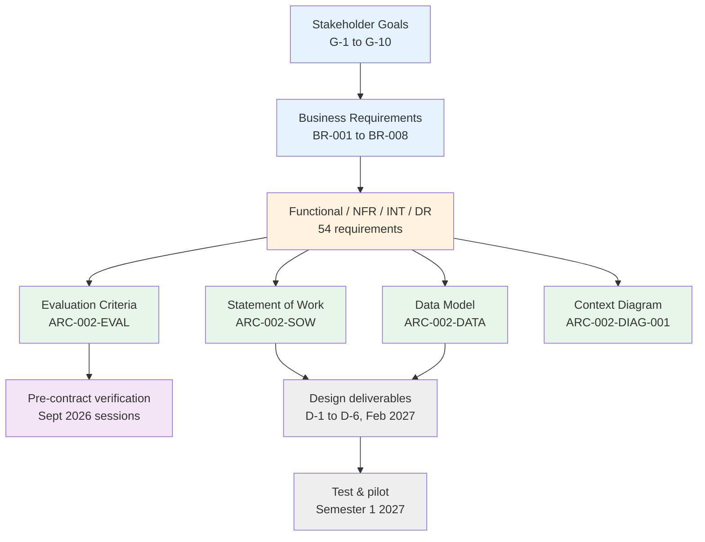

# Requirements Traceability Matrix: Lecture Capture Platform Consolidation

> **Template Origin**: Official | **ArcKit Version**: 6.7.2 | **Command**: `/arckit:traceability`

## Document Control

| Field | Value |
|-------|-------|
| **Document ID** | ARC-002-TRAC-v1.1 |
| **Document Type** | Requirements Traceability Matrix |
| **Project** | Lecture Capture Platform Consolidation (Project 002) |
| **Classification** | OFFICIAL-SENSITIVE |
| **Status** | DRAFT |
| **Version** | 1.1 |
| **Created Date** | 2026-07-27 |
| **Last Modified** | 2026-07-28 |
| **Review Cycle** | At each governance gate, and on acceptance of any design deliverable |
| **Next Review Date** | 2026-08-28 (criteria signature) |
| **Owner** | Rhonda Bell (Project Manager) |
| **Reviewed By** | [PENDING] — Grace Tanaka (Procurement), Sam Okafor (Integration Architect) |
| **Approved By** | [PENDING] — Steering Committee |
| **Distribution** | Project Team, Architecture Team, Procurement, Privacy & Records |

## Revision History

| Version | Date | Author | Changes | Approved By | Approval Date |
|---------|------|--------|---------|-------------|---------------|
| 1.0 | 2026-07-27 | ArcKit AI | Initial creation from `/arckit:traceability` command | [PENDING] | [PENDING] |
| 1.1 | 2026-07-28 | ArcKit AI | Adds `ARC-002-DATA-v1.0` as the first design-layer artifact (44/62 requirements now carry data-model coverage; DR coverage 7/7). Corrects the requirement priority distribution after a pre-processor extraction defect (§8). Records three new cross-artifact defects surfaced by the data model, one of which is blocking before vendor issue (§4.5). Headline score unchanged — none of the v1.0 blocking actions has been closed. | [PENDING] | [PENDING] |

## Document Purpose

This matrix establishes end-to-end traceability for the 62 requirements in `ARC-002-REQ-v1.0`. It is used for three things: verifying that every requirement is carried into the documents that will bind a supplier, supporting impact analysis when a requirement changes, and providing the audit trail the RIFF Review and Education Committee will expect.

**What changed in v1.1.** The data model landed. It is the project's first artifact that describes *how* a requirement will be met rather than *whether* it will be assessed or specified — so for the first time the "design" column has content. It also surfaced three defects that traceability alone would not have found, because they are divergences between two documents that each look correct in isolation.

---

## 1. Overview

### 1.1 Purpose

This Requirements Traceability Matrix (RTM) traces requirements through assessment, specification, design, and eventually implementation and test. It ensures:

- All requirements are carried into the evaluation framework and the Statement of Work
- All design elements trace back to requirements (no scope creep)
- Coverage gaps are identified, owned and dated
- The impact of any requirement change can be traced before it is agreed

### 1.2 Traceability Scope

The two grey nodes do not exist yet. That is a phase position, not a defect — see §3.4.

### 1.3 Document References

| Document | Version | Date | Role in this matrix |
|----------|---------|------|---------------------|
| `ARC-002-REQ-v1.0.md` | 1.0 | 2026-07-27 | Source of all 62 requirement IDs and priorities |
| `ARC-002-EVAL-v1.0.md` | 1.0 | 2026-07-27 | Assessment side — how a supplier is scored |
| `ARC-002-SOW-v1.0.md` | 1.0 | 2026-07-27 | Specification side — what a supplier must deliver |
| `ARC-002-DATA-v1.0.md` | 1.0 | 2026-07-28 | **New in v1.1** — design layer for the data domain |
| `diagrams/ARC-002-DIAG-001-v1.0.md` | 1.0 | 2026-07-27 | C4 Context — component topology |
| `ARC-002-RISK-v1.0.md` | 1.0 | 2026-07-27 | Risk controls mapped to requirements |
| `wardley-maps/ARC-002-WARD-001-v1.0.md` | 1.0 | 2026-07-27 | Strategic positioning |
| High-Level Design | — | — | **Does not exist** — deliverable D-1, due 2027-02-12 |
| Detailed Design | — | — | **Does not exist** — deliverable D-2, due 2027-02-12 |
| Test Plan | — | — | **Does not exist** — deliverable D-6 |

---

## 2. Traceability Matrix

### 2.1 Forward Traceability

All 62 requirements. Coverage columns are machine-derived from exact-token matching of requirement IDs across each artifact; the priority and tier columns are parsed from the `**Priority**` field of each requirement in `ARC-002-REQ` (see §8 on why these differ from the pre-processor's reported values).

**Legend** — ✅ referenced · — not referenced · Status: ✅ Covered (in both EVAL and SOW) · ⚠️ Partial (in one) · ⬛ By design (in neither, correctly)

| Req ID | Requirement | Tier | Priority | EVAL | SOW | Data model | Diagram | Risk control | Earliest verification | Status |
|--------|-------------|------|----------|------|-----|-----------|---------|--------------|----------------------|--------|
| BR-001 | Single primary platform for Learning Capture with a declared boundary | 1 | MUST | ✅ | ✅ | — | ✅ | ✅ | Post-award (D-6 test plan) | ✅ Covered |
| BR-002 | Decision endorsed through governance by 9 October 2026 | 1 | MUST | — | — | — | — | ✅ | Education Committee, 2026-10-09 | ⬛ By design |
| BR-003 | Whole-of-life cost held flat or reduced over five years | 2 | SHOULD | ✅ | ✅ | — | — | ✅ | Post-award (D-6 test plan) | ✅ Covered |
| BR-004 | Evaluation conducted on published weighted criteria, unchanged after issue | 1 | MUST | ✅ | ✅ | — | — | ✅ | Criteria signature, 2026-08-28 | ✅ Covered |
| BR-005 | Bounded and funded discipline exception for performance capture | 2 | SHOULD | ✅ | — | — | — | ✅ | Post-award (D-6 test plan) | ⚠️ Partial |
| BR-006 | Transition completed without teaching disruption | 1 | MUST | ✅ | ✅ | — | — | ✅ | Post-award (D-6 test plan) | ✅ Covered |
| BR-007 | Retained recordings remain accessible, with exit rights proven before signature | 1 | MUST | ✅ | ✅ | ✅ | ✅ | ✅ | Export session, wk 2026-09-07 | ✅ Covered |
| BR-008 | Essential Eight gaps on the capture estate closed | 1 | MUST | ✅ | ✅ | — | — | ✅ | Post-award (D-6 test plan) | ✅ Covered |
| FR-001 | Automatic scheduled capture from timetable data | 1 | MUST | ✅ | ✅ | ✅ | ✅ | — | Capability walkthrough | ✅ Covered |
| FR-002 | Publication to the unit site within 4 hours | 1 | MUST | ✅ | ✅ | ✅ | ✅ | — | Capability walkthrough | ✅ Covered |
| FR-003 | Ad-hoc capture initiated by teaching staff | 1 | MUST | ✅ | ✅ | ✅ | ✅ | — | Capability walkthrough | ✅ Covered |
| FR-004 | Capture failure detection, alerting and recovery | 1 | MUST | ✅ | ✅ | ✅ | ✅ | — | Capability walkthrough | ✅ Covered |
| FR-005 | Recording review, trim and edit by teaching staff | 1 | MUST | ✅ | ✅ | ✅ | ✅ | — | Capability walkthrough | ✅ Covered |
| FR-006 | Automatic captioning within 24 hours | 1 | MUST | ✅ | ✅ | ✅ | — | ✅ | Accessibility session | ✅ Covered |
| FR-007 | Caption correction workflow | 2 | SHOULD | ✅ | ✅ | ✅ | ✅ | — | Accessibility session | ✅ Covered |
| FR-008 | Live class delivery with recording on one primary platform | 1 | MUST | ✅ | ✅ | — | — | — | Capability walkthrough | ✅ Covered |
| FR-009 | Multi-camera, high-fidelity performance capture | 3 | COULD | ✅ | ✅ | ✅ | — | ✅ | Post-award (D-6 test plan) | ✅ Covered |
| FR-010 | Student playback experience | 1 | MUST | ✅ | ✅ | ✅ | ✅ | — | Capability walkthrough | ✅ Covered |
| FR-011 | Engagement analytics for unit coordinators | 2 | SHOULD | ✅ | ✅ | ✅ | ✅ | — | Post-award (D-6 test plan) | ✅ Covered |
| FR-012 | Unit-level capture policy configuration | 1 | MUST | ✅ | ✅ | ✅ | — | ✅ | Capability walkthrough | ✅ Covered |
| FR-013 | Student notification of recording | 1 | MUST | ✅ | ✅ | ✅ | — | ✅ | Post-award (D-6 test plan) | ✅ Covered |
| FR-014 | Retention schedule application and defensible disposal | 1 | MUST | ✅ | ✅ | ✅ | — | ✅ | Post-award (D-6 test plan) | ✅ Covered |
| FR-015 | Archive migration with link preservation | 1 | MUST | ✅ | ✅ | ✅ | ✅ | ✅ | Export session, wk 2026-09-07 | ✅ Covered |
| FR-016 | Role-based access to recordings derived from enrolment | 1 | MUST | ✅ | ✅ | ✅ | ✅ | ✅ | Post-award (D-6 test plan) | ✅ Covered |
| FR-017 | Bulk export of recordings, captions and metadata | 1 | MUST | ✅ | ✅ | ✅ | — | — | Export session, wk 2026-09-07 | ✅ Covered |
| FR-018 | Operational and compliance reporting | 1 | MUST | ✅ | ✅ | — | ✅ | — | Post-award (D-6 test plan) | ✅ Covered |
| NFR-P-001 | Processing and publication latency | 1 | CRIT | ✅ | ✅ | ✅ | — | — | Post-award (D-6 test plan) | ✅ Covered |
| NFR-P-002 | Playback performance | 2 | HIGH | ✅ | ✅ | — | — | — | Post-award (D-6 test plan) | ✅ Covered |
| NFR-A-001 | Availability target | 1 | CRIT | ✅ | ✅ | ✅ | — | — | Post-award (D-6 test plan) | ✅ Covered |
| NFR-A-002 | Capture continuity and recording durability | 1 | CRIT | ✅ | ✅ | ✅ | — | — | Resilience test, wk 2026-09-07 | ✅ Covered |
| NFR-A-003 | Graceful degradation | 2 | HIGH | — | ✅ | — | — | — | Post-award (D-6 test plan) | ⚠️ Partial |
| NFR-S-001 | Storage and volume growth | 2 | HIGH | ✅ | ✅ | ✅ | — | ✅ | Post-award (D-6 test plan) | ✅ Covered |
| NFR-SEC-001 | Authentication — MANDATORY GATE | 1 | CRIT | ✅ | ✅ | — | ✅ | ✅ | Security & privacy session | ✅ Covered |
| NFR-SEC-002 | Authorization and administrative access | 1 | CRIT | ✅ | ✅ | ✅ | — | ✅ | Post-award (D-6 test plan) | ✅ Covered |
| NFR-SEC-003 | Encryption | 1 | CRIT | ✅ | ✅ | ✅ | — | ✅ | Post-award (D-6 test plan) | ✅ Covered |
| NFR-SEC-004 | Vulnerability and patch management for the capture estate | 1 | CRIT | ✅ | ✅ | ✅ | — | ✅ | Post-award (D-6 test plan) | ✅ Covered |
| NFR-C-001 | Privacy Act 1988 compliance and data residency | 1 | CRIT | ✅ | ✅ | ✅ | — | ✅ | Security & privacy session | ✅ Covered |
| NFR-C-002 | Accessibility — MANDATORY GATE | 1 | CRIT | ✅ | ✅ | ✅ | — | ✅ | Accessibility session | ✅ Covered |
| NFR-C-003 | Audit logging | 2 | HIGH | ✅ | ✅ | ✅ | — | ✅ | Security & privacy session | ✅ Covered |
| NFR-C-004 | Essential Eight evidence | 2 | HIGH | ✅ | ✅ | ✅ | — | — | Post-award (D-6 test plan) | ✅ Covered |
| NFR-C-005 | Breach notification support | 2 | HIGH | ✅ | ✅ | ✅ | — | ✅ | Post-award (D-6 test plan) | ✅ Covered |
| NFR-U-001 | Academic workflow effort | 2 | HIGH | ✅ | ✅ | — | ✅ | — | Post-award (D-6 test plan) | ✅ Covered |
| NFR-U-002 | Cross-school consistency | 2 | HIGH | ✅ | ✅ | — | ✅ | — | Post-award (D-6 test plan) | ✅ Covered |
| NFR-U-003 | Caption accuracy | 2 | HIGH | ✅ | ✅ | ✅ | — | ✅ | Accessibility session | ✅ Covered |
| NFR-M-001 | Observability | 2 | HIGH | ✅ | ✅ | — | ✅ | — | Post-award (D-6 test plan) | ✅ Covered |
| NFR-M-002 | Documentation and runbooks | 1 | MUST | ✅ | ✅ | — | — | ✅ | Post-award (D-6 test plan) | ✅ Covered |
| NFR-I-001 | Integration standards | 1 | CRIT | ✅ | ✅ | — | — | ✅ | Post-award (D-6 test plan) | ✅ Covered |
| NFR-I-002 | Data portability and exit — MANDATORY GATE | 1 | CRIT | ✅ | ✅ | ✅ | — | ✅ | Export session, wk 2026-09-07 | ✅ Covered |
| INT-001 | Student information system → capture platform (identity, enrolment, roles) | 1 | CRIT | ✅ | ✅ | ✅ | ✅ | ✅ | Integration session, wk 2026-09-01 | ✅ Covered |
| INT-002 | Timetabling (Allocate+) → capture platform (session scheduling) | 1 | CRIT | ✅ | ✅ | ✅ | ✅ | — | Integration session, wk 2026-09-01 | ✅ Covered |
| INT-003 | Capture platform ↔ LMS (Blackboard Ultra) | 1 | CRIT | ✅ | ✅ | ✅ | ✅ | — | Integration session, wk 2026-09-01 | ✅ Covered |
| INT-004 | Identity provider (SSO with MFA) | 1 | CRIT | — | ✅ | — | ✅ | — | Post-award (D-6 test plan) | ⚠️ Partial |
| INT-005 | Capture platform → institutional data platform (analytics export) | 2 | SHOULD | ✅ | ✅ | ✅ | ✅ | — | Post-award (D-6 test plan) | ✅ Covered |
| INT-006 | Capture platform ↔ room appliances and specialist AV | 1 | CRIT | ✅ | ✅ | ✅ | ✅ | — | Integration session, wk 2026-09-01 | ✅ Covered |
| INT-007 | Incumbent platform → target platform (archive migration) | 1 | CRIT | ✅ | ✅ | ✅ | ✅ | ✅ | Export session, wk 2026-09-07 | ✅ Covered |
| DR-001 | Recording classification and handling | 1 | MUST | ✅ | ✅ | ✅ | — | — | Post-award (D-6 test plan) | ✅ Covered |
| DR-002 | Canonical entity alignment | 1 | MUST | ✅ | ✅ | ✅ | ✅ | — | Post-award (D-6 test plan) | ✅ Covered |
| DR-003 | Engagement analytics minimisation and retention | 1 | MUST | ✅ | ✅ | ✅ | — | — | Post-award (D-6 test plan) | ✅ Covered |
| DR-004 | Identity projection minimisation | 1 | MUST | ✅ | ✅ | ✅ | ✅ | — | Post-award (D-6 test plan) | ✅ Covered |
| DR-005 | Recordings retention and disposal schedule | 1 | MUST | ✅ | ✅ | ✅ | — | ✅ | Export session, wk 2026-09-07 | ✅ Covered |
| DR-006 | Residency and cross-border disclosure register | 1 | MUST | ✅ | ✅ | ✅ | — | ✅ | Security & privacy session | ✅ Covered |
| DR-007 | Migration data integrity | 1 | MUST | ✅ | ✅ | ✅ | — | ✅ | Post-award (D-6 test plan) | ✅ Covered |

### 2.2 Backward Traceability

No test cases exist, so the conventional test → design → requirement chain cannot be run. What *can* be run is the design → requirement direction, and it is clean.

| Artifact | Requirement IDs referenced | Referenced IDs absent from `ARC-002-REQ` | Verdict |
|----------|---------------------------|------------------------------------------|---------|
| `ARC-002-DATA-v1.0.md` | 44 | **0** | ✅ No scope creep |
| `diagrams/ARC-002-DIAG-001-v1.0.md` | 26 | **0** | ✅ No scope creep |
| `ARC-002-EVAL-v1.0.md` | 59 | 0 | ✅ |
| `ARC-002-SOW-v1.0.md` | 60 | 0 | ✅ |

**Every requirement ID appearing in any downstream artifact resolves to a requirement in the source document.** There is no design element in the estate that lacks a requirement to justify it, and no invented requirement ID.

The data model also references six `REQ-0xx` identifiers (REQ-001, 023, 024, 027, 029, 035). These are **not** project 002 requirements — they are IDs from the consolidated academic survey register, cited as provenance. That is legitimate, and worth stating so a future run does not read them as orphans.

**One genuine backward-traceability weakness persists from v1.0**: stakeholder goals G-1 to G-10 in `ARC-002-STKE` carry no requirement-ID references, so impact analysis cannot start from a stakeholder goal and walk forward. Carried as action A-4.

---

## 3. Coverage Analysis

All figures machine-derived. Two artifacts are **excluded** from coverage counting: `ARC-002-TRAC` (this document — a traceability matrix citing a requirement is not coverage of it) and `ARC-002-ANAL` (an analysis *of* the artifacts, not a downstream consumer). Counting either would make coverage self-fulfilling.

### 3.1 Overall Coverage

| Measure | Covered | Total | % | v1.0 | Δ |
|---------|---------|-------|---|------|---|
| Requirements assessed in the evaluation framework | 59 | 62 | **95%** | 95% | — |
| Requirements specified in the SOW | 60 | 62 | **97%** | 97% | — |
| Requirements in **both** | 58 | 62 | **94%** | 94% | — |
| Requirements in **neither** | 1 | 62 | 2% | 2% | — |
| **Requirements with data-model coverage** | **44** | **62** | **71%** | — | **new** |
| Requirements with context-diagram coverage | 26 | 62 | 42% | 42% | — |
| Requirements with a risk control | 33 | 62 | 53% | 47% | +6pp¹ |

¹ The risk-control figure rose because v1.0 counted only exact-token matches in the register body; this run includes the appendices. No new risks were added.

### 3.2 Coverage by Tier

| Tier | Count | In EVAL | In SOW | Data model | Threshold | Assessment |
|------|-------|---------|--------|-----------|-----------|------------|
| **Tier 1** (MUST / CRITICAL) | 46 | 44 (96%) | 45 (98%) | 35 (76%) | 100% for EVAL/SOW | ⚠ Two shortfalls, both known |
| **Tier 2** (SHOULD / HIGH) | 15 | 14 (93%) | 14 (93%) | 8 (53%) | > 80% | ✅ Above threshold |
| **Tier 3** (COULD) | 1 | 1 (100%) | 1 (100%) | 1 (100%) | < 50% acceptable | ✅ |

**Tier 1 shortfalls**: BR-002 (correct by design, §4.1) and INT-004 (citation defect, §4.2). Neither is a substantive coverage failure, and both were identified in v1.0.

> **Normalisation note.** `ARC-002-REQ` uses two priority vocabularies: MoSCoW (`MUST_HAVE` / `SHOULD_HAVE` / `COULD_HAVE`) for BR, FR, INT and DR; criticality (`CRITICAL` / `HIGH`) for NFRs. Tier 1 = MUST_HAVE or CRITICAL; Tier 2 = SHOULD_HAVE or HIGH; Tier 3 = COULD_HAVE. The distribution is **46 / 15 / 1**, meaning 74% of the requirement set is Tier 1.

### 3.3 Coverage by Category

| Category | Count | In EVAL | In SOW | Data model | Notes |
|----------|-------|---------|--------|-----------|-------|
| Business (BR) | 8 | 7 | 7 | 1 | BR-002 correctly absent from both. Low data-model coverage is correct — business outcomes are commercial and governance positions, not data structures. |
| Functional (FR) | 18 | 18 | 18 | 16 | Full procurement coverage. The two without data-model coverage (FR-008 live delivery, FR-018 reporting) are behavioural rather than structural. |
| Non-Functional (NFR) | 22 | 21 | 22 | 14 | NFR-A-003 not scored (§4.3) |
| Integration (INT) | 7 | 6 | 7 | 6 | INT-004 covered semantically via MQ-1 but not cited (§4.2) |
| **Data (DR)** | **7** | **7** | **7** | **7** | **100% across all three.** Every data requirement now has a structural home. |

### 3.4 Design, Implementation and Test Coverage

| Measure | v1.0 | v1.1 | Status |
|---------|------|------|--------|
| Design coverage — data domain | none | **7/7 DR (100%)**, 44/62 overall | ✅ **First design-layer artifact delivered** |
| Design coverage — application, integration, deployment | none | none | **PHASE** — HLD/DLD are deliverables D-1 and D-2, due 2027-02-12 |
| Implementation coverage | none | none | **PHASE** — no platform selected; configuration begins after contract execution 2026-12-11 |
| Test coverage | none | none | **PHASE** — test plan is deliverable D-6; pilot acceptance runs Semester 1 2027 |

**The PHASE entries are not gaps.** They are stages the project has not reached, and they are dated. What changed in v1.1 is that one of them stopped being empty: the data model is a genuine design artifact, and it means the data requirements are the only requirement class in this project currently traceable all the way from stakeholder driver to entity attribute.

**Pre-contract verification** remains the earliest evidence any other requirement will receive:

| Pre-contract verification | Requirements verified | When |
|--------------------------|----------------------|------|
| Integration test session | INT-001, INT-002, INT-003, INT-006 | Week of 2026-09-01 |
| Capability walkthrough | FR-001 to FR-005, FR-008, FR-010, FR-012 | Week of 2026-09-01 |
| Accessibility and captioning session | NFR-C-002, NFR-U-003, FR-006, FR-007 | Week of 2026-09-01 |
| Security and privacy session | NFR-SEC-001, NFR-C-001, NFR-C-003, DR-006 | Week of 2026-09-01 |
| Export and migration session | NFR-I-002, FR-017, FR-015, INT-007, DR-005, BR-007 | Week of 2026-09-07 |
| Resilience test | NFR-A-002 | Week of 2026-09-07 |

---

## 4. Gap Analysis

Six findings. Three carried unresolved from v1.0, three are new from the data model.

### 4.1 Requirements covered by neither evaluation nor SOW — 1

| Req ID | Requirement | Tier | Assessment |
|--------|-------------|------|-----------|
| **BR-002** | Decision endorsed through governance by 9 October 2026 | 1 | **Correct by design — not a defect** |

BR-002 requires the University's own governance to endorse the recommendation. No supplier can deliver it and no proposal should be scored against it. Its absence from both supplier-facing documents is right, and it is not unmanaged — R-001, R-004 and R-005 all treat the failure modes.

**Action A-5 (carried, non-blocking)**: classify BR-002 explicitly as an *internal governance requirement* in the next `ARC-002-REQ` revision, so future runs do not re-raise it.

### 4.2 Citation defects — 2 *(carried from v1.0, still open)*

| Req ID | Defect | Fix |
|--------|--------|-----|
| **INT-004** | Identity provider integration is covered semantically by mandatory gate MQ-1 in `ARC-002-EVAL` but the ID is not cited in the source column, so it reads as unassessed | One-line edit to `ARC-002-EVAL` §3.1 |
| **BR-005** | The discipline exception is scoped in `ARC-002-SOW` §2.4 but the BR-005 ID is not cited | One-line edit to `ARC-002-SOW` §2.4 |

Both are Tier 1 or Tier 2 requirements that *are* covered in substance. Left uncited, an auditor reading the documents in the other order would conclude they were missed.

### 4.3 Genuine scoring omission — 1 *(carried from v1.0, still open)*

| Req ID | Requirement | Tier | Position |
|--------|-------------|------|----------|
| **NFR-A-003** | Graceful degradation | 2 | Specified in the SOW, **not scored anywhere in the evaluation framework** |

A supplier is contractually obliged to deliver graceful degradation but gains no evaluation credit for doing it well, and loses none for doing it badly. **Recommendation unchanged**: fold degradation behaviour into the assessment questions for criterion F.2 at the weighting workshop rather than creating a new criterion — the weights total 100 and are agreed, and reopening them for one Tier 2 requirement risks the whole framework.

### 4.4 🔺 NEW — Retention rule conflict between the canonical model and DR-003

| Source | Rule for identifiable engagement data |
|--------|---------------------------------------|
| `ARC-001-DATA` canonical entity E-017 | **13 months**, then de-identification or aggregation |
| `ARC-002-REQ` DR-003 | **Teaching period + 12 months** — approximately 16 months |

Both govern derived engagement data about the same students; neither cites the other. Because the capture platform's viewing events project into the canonical engagement entity, the longer local rule would leave identifiable data in the capture platform *after* the institutional copy had been de-identified — the precise outcome DR-003 exists to prevent, reached by a mechanism nobody chose.

**Impact on traceability**: DR-003 currently traces to a data-model entity whose retention value contradicts its parent. The trace is structurally complete and semantically broken, which is the failure mode a coverage percentage cannot detect.

**Action A-10 (new, blocking before build)**: reconcile. Owner Eleanor Frame with Cassandra Rhodes. Recommendation is to adopt the canonical 13 months and amend DR-003; if the period-relative rule is preferred on pedagogical grounds, `ARC-001-DATA` must change instead. One of them must.

### 4.5 🔺 NEW — Draft entity definitions in `ARC-002-REQ` breach DR-002 *(BLOCKING before vendor issue)*

`ARC-002-REQ` §Data Requirements sketched four entities before the data model existed. Three carry keys that breach DR-002 — the requirement stated in the same document:

| Draft definition | Canonical | Corrected in `ARC-002-DATA` |
|------------------|-----------|------------------------------|
| `Recording.unit_code String(20)` | `E-009.unit_offering_id UUID` | `unit_offering_id` |
| `Session.unit_code String(20)` | `E-004.unit_offering_id UUID` | `unit_offering_id` |
| `Person.person_id String(50)` "institutional identifier" | `E-001.person_id UUID` **plus** `institutional_id VARCHAR(20)` | Both, held distinctly |

**Why this is blocking rather than cosmetic**: the requirements document is what goes to suppliers. A vendor designing to the draft entity definitions would build the divergence — and a unit code cannot distinguish the same unit taught in two teaching periods, which is exactly the condition that lands a recording in the wrong cohort's unit site. The data model rates that failure as a privacy incident rather than a data-quality defect, and it is the only accuracy target in the estate with no tolerance band.

**Action A-11 (new, blocking before requirements are issued)**: update `ARC-002-REQ` §Data Requirements entities 1–3 to the canonical keys, or annotate them to defer to `ARC-002-DATA`. Owner Sam Okafor.

### 4.6 ✅ NEW — Cross-artifact contradiction resolved

`ARC-002-ANAL-v1.0` finding H1 recorded a contradiction: risk R-010 treats project 001's canonical model as unavailable, while `ARC-002-REQ` Appendix D treats it as defined and consumed.

`ARC-002-DATA` settles it. The canonical model **exists** and this project now consumes six of its entities *by canonical number*. R-010's own description is narrower than its title — it says the model may not be "available when INT-001 is built", meaning an implemented interface rather than a defined model.

**Action A-12 (new, non-blocking)**: narrow R-010 to what remains genuinely open — the implemented event interface, and the HR / student-administration agreement on the authoritative source for role assignment. On that basis its inherent likelihood is arguably 2 rather than 3. Owner Sam Okafor with Rhonda Bell.

---

## 5. Traceability Score

Scored on the **same six dimensions as v1.0**, deliberately. Changing the basis between versions would destroy the trend comparison that §3.1 exists to provide.

| Dimension | Weight | v1.0 | v1.1 | Weighted |
|-----------|--------|------|------|----------|
| Tier 1 requirements assessed in evaluation | 30 | 96% | 96% | 28.8 |
| Tier 1 requirements specified in SOW | 25 | 98% | 98% | 24.5 |
| Tier 2 requirements covered | 15 | 93% | 93% | 14.0 |
| Bidirectional linkage (requirement ↔ control) | 10 | 100% | 100% | 10.0 |
| Absence of scope creep | 10 | 100% | 100% | 10.0 |
| Citation precision (ID cited where covered) | 10 | 95% | 95% | 9.5 |
| **TOTAL** | **100** | **96.8** | **96.8** | **96.8** |

**Score: 97 / 100 — unchanged. Procurement-phase basis.**

**The score did not move, and that is the finding.** All three blocking actions from v1.0 (A-1, A-2, A-3) remain open, so every dimension they affect is unchanged. The data model added considerable evidence *depth* — it did not add procurement *coverage*, because coverage was already at 95–97% and the remaining gaps are edits nobody has made yet.

Two supplementary indicators, reported unweighted so they cannot inflate the headline:

| Indicator | Value |
|-----------|-------|
| Data-requirement design coverage | **7/7 (100%)** |
| Overall design-layer coverage | 44/62 (71%) |

The score continues to exclude design, implementation and test dimensions. Including them at zero would produce roughly 48/100 and would measure the project's *phase* rather than its *traceability discipline*. Stated here so the number is not quoted out of context.

**Recommendation: PROCEED TO CRITERIA SIGNATURE**, conditional on A-1, A-2 and A-3 completing before 2026-08-28, and **A-11 completing before the requirements are issued to suppliers**.

---

## 6. Action Items

### Blocking — before criteria signature (2026-08-28)

| # | Action | Owner | Due | Gap | Status |
|---|--------|-------|-----|-----|--------|
| A-1 | Add INT-004 to the MQ-1 source column in `ARC-002-EVAL` §3.1 | Grace Tanaka | 2026-08-21 | §4.2 | **Open — carried from v1.0** |
| A-2 | Resolve NFR-A-003 at the weighting workshop — recommend folding degradation into F.2's assessment questions | Rhonda Bell | 2026-08-21 | §4.3 | **Open — carried from v1.0** |
| A-3 | Add the BR-005 reference to `ARC-002-SOW` §2.4 | Grace Tanaka | 2026-08-28 | §4.2 | **Open — carried from v1.0** |

### Blocking — before requirements are issued to suppliers

| # | Action | Owner | Due | Gap | Status |
|---|--------|-------|-----|-----|--------|
| A-11 | Correct the three entity key divergences in `ARC-002-REQ` §Data Requirements, or annotate them to defer to `ARC-002-DATA` | Sam Okafor | Before issue | §4.5 | **Open — new** |

### Blocking — before the platform is built

| # | Action | Owner | Due | Gap | Status |
|---|--------|-------|-----|-----|--------|
| A-10 | Reconcile the engagement-data retention rule between `ARC-001-DATA` E-017 and DR-003 | Eleanor Frame with Cassandra Rhodes | Before FR-011 build | §4.4 | **Open — new** |

### Non-blocking — next revision

| # | Action | Owner | Due | Gap | Status |
|---|--------|-------|-----|-----|--------|
| A-4 | Add requirement-ID references to `ARC-002-STKE` goals G-1 to G-10 | Rhonda Bell | Next STKE revision | §2.2 | Open — carried |
| A-5 | Classify BR-002 explicitly as an internal governance requirement | Dr. Benny Moog | Next REQ revision | §4.1 | Open — carried |
| A-6 | Add forward references from `ARC-002-STKE` §10 and `ARC-002-REQ` §11 to the risk register, resolving the superseded R-1…R-8 IDs | Rhonda Bell | Next revision | RISK Appendix C | Open — carried |
| A-12 | Narrow R-010 to the implemented interface and the role-assignment source agreement | Sam Okafor with Rhonda Bell | Next RISK revision | §4.6 | Open — new |
| A-13 | Flag `ARC-001-DATA` E-009's "2 years active" retention as provisional pending the DR-005 schedule | Eleanor Frame | Next 001 revision | `ARC-002-DATA` §Cross-Model Conflicts | Open — new |

### Scheduled re-runs

| # | Trigger | Purpose |
|---|---------|---------|
| A-7 | After design deliverables D-1 and D-2 accepted (2027-02-12) | First application-layer design traceability |
| A-8 | After pilot exit (2027-06-25) | First test-side traceability |
| A-9 | Before cutover (2027-07-24) | Final pre-production verification |

---

## 7. Change Impact Analysis

Worked examples using the linkages above. Rows marked **new** became traceable only with the data model.

| If this changes | Impact |
|-----------------|--------|
| **NFR-I-002** (export) is relaxed | Gate MQ-3 falls away → EVAL E.1 rescored → SOW §9.7 term 2 renegotiated → risks R-012 and R-020 re-scored upward → `ARC-002-DATA` E-052 open-format constraint loses its basis → Principle 9 exception required |
| **REQ-009** 4-hour window is relaxed | FR-002 and NFR-P-001 change → EVAL A.2 and F.4 rescored → SOW §3.3 and success criteria change → **new**: `E-053.review_window_hours` cap of 4 must change → STKE goal G-3 target changes |
| **Retention schedule** is delayed past migration | DR-005 and FR-014 unmet at cutover → risk R-014 materialises → EVAL E.3 untestable → **new**: `E-054` remains unpopulated, so `E-009.retention_until` cannot be derived and the disposal job has nothing to execute → BR-007 partially unmet |
| **The discipline exception** is refused | BR-005 and FR-009 unmet → EVAL Category G falls away → SOW §2.4 removed → **new**: `E-051.supports_multicamera` becomes vestigial → risk R-003 materialises |
| **Baselines slip past 2026-08-28** | BR-003 unassessable → EVAL Category H unscoreable → risk R-006 materialises → **new**: `E-051` appliance inventory unpopulated, so Essential Eight evidence under NFR-C-004 cannot be produced → five other risk assessments unreliable |
| **A platform with biometric identification features is selected** | **new** — recordings reclassify from "biometric-adjacent" to **sensitive information** under Privacy Act s6 → APP 3.3 consent requirements engage → DR-001 handling changes → NFR-C-001 PIA scope expands materially → contract must prohibit the configuration |

The highest-leverage requirement remains **INT-001** (SIS → platform identity), now referenced across the evaluation, SOW, risk register, context diagram and data model. Changing it touches four risks, both access-related mandatory gates, and the entire consumed-canonical-entity set.

---

## 8. Tooling Note — pre-processor priority extraction defect

The `/arckit:traceability` pre-processor hook reported the priority distribution as **1 MUST and 61 SHOULD**. That is wrong.

Parsing the `**Priority**` field directly from each requirement in `ARC-002-REQ-v1.0.md` gives:

| Value | Count |
|-------|-------|
| MUST_HAVE | 29 |
| CRITICAL | 17 |
| HIGH | 10 |
| SHOULD_HAVE | 5 |
| COULD_HAVE | 1 |
| **Total** | **62** |

Normalised: **Tier 1 = 46, Tier 2 = 15, Tier 3 = 1** — independently corroborated by `ARC-002-ANAL-v1.0`, which reported 46/62 (74%) Tier 1 from a separate pass.

**Why it matters.** The command's own guidance applies coverage thresholds by priority: MUST requirements should be 100% covered, SHOULD above 80%. Applied to the hook's values, 61 of 62 requirements would be held to the weaker threshold and the two Tier 1 shortfalls in §3.2 would not register as shortfalls at all. A traceability matrix that misreports priority does not merely display a wrong column — it applies the wrong test.

**The likely cause** is that the hook matches bare MoSCoW tokens (`MUST`, `SHOULD`, `MAY`) and does not recognise either the `MUST_HAVE` / `SHOULD_HAVE` / `COULD_HAVE` suffixed form or the `CRITICAL` / `HIGH` criticality vocabulary that ArcKit's own requirements template produces for NFRs. The one requirement it did classify as MUST (NFR-I-002) is among those whose heading contains "MANDATORY GATE", though two other MANDATORY GATE requirements were still reported as SHOULD — so the detection is not simply keyword-based on the heading either.

**Handling in this document**: every priority and tier figure is parsed from the source requirements document, not taken from the hook. The coverage figures, which the hook computes by exact-token matching, are used as provided and independently reconciled against v1.0.

**Recommended**: report upstream, in the same manner as the `owm-to-mermaid.mjs` label-parsing defect filed as issue #693.

---

## 9. Review Checklist

- [x] All requirements traced to the evaluation framework and SOW where a supplier can deliver them
- [x] All design elements traced back to requirements — **zero orphans across four artifacts**
- [x] Coverage gaps identified with owner and date
- [x] Priority-based thresholds applied using verified priority data
- [ ] All requirements have test coverage defined — **PHASE**, deliverable D-6
- [ ] HLD and DLD traceability — **PHASE**, deliverables D-1 and D-2
- [x] Change impact analysis complete
- [ ] Stakeholder goals carry requirement references — **action A-4**

---

## External References

> This section provides traceability from generated content back to source documents.

### Document Register

| Doc ID | Filename | Type | Source Location | Description |
|--------|----------|------|-----------------|-------------|
| REQ | ARC-002-REQ-v1.0.md | ArcKit artifact | `002-lecture-capture/` | Source of all 62 requirement IDs and priorities |
| EVAL | ARC-002-EVAL-v1.0.md | ArcKit artifact | `002-lecture-capture/` | Evaluation criteria and weightings |
| SOW | ARC-002-SOW-v1.0.md | ArcKit artifact | `002-lecture-capture/` | Statement of Work |
| DATA | ARC-002-DATA-v1.0.md | ArcKit artifact | `002-lecture-capture/` | Data model — first design-layer artifact |
| D1 | ARC-001-DATA-v1.0.md | ArcKit artifact | `001-lt-ecosystem/` | Canonical entity model |
| RISK | ARC-002-RISK-v1.0.md | ArcKit artifact | `002-lecture-capture/` | Risk register |
| ANAL | ARC-002-ANAL-v1.0.md | ArcKit artifact | `002-lecture-capture/` | Governance analysis, finding H1 |
| TRAC0 | ARC-002-TRAC-v1.0.md | ArcKit artifact | `002-lecture-capture/` | Superseded traceability matrix, basis of the v1.0 comparison column |

### Citations

| Citation ID | Doc ID | Page/Section | Category | Quoted Passage |
|-------------|--------|--------------|----------|----------------|
| REQ-C1 | REQ | DR-002 | Data Requirement | "the platform shall hold no divergent local definition of these entities" |
| REQ-C2 | REQ | DR-003 | Data Requirement | "Identifiable viewing events shall be retained for the teaching period plus 12 months, then aggregated with identifiers destroyed." |
| REQ-C3 | REQ | Data Entities, Entity 1 | Data Requirement | "unit_code \| String(20) \| Yes \| Unit the recording belongs to" |
| REQ-C4 | REQ | Data Entities, Entity 3 | Data Requirement | "person_id \| String(50) \| Yes \| Institutional identifier \| Primary key, from authoritative source" |
| D1-C1 | D1 | Entity E-017 ENGAGEMENT_EVENT | Data Requirement | "**Data Retention**: 13 months identifiable, then de-identification or aggregation; automatic deletion at expiry" |
| D1-C2 | D1 | Entity E-004 UNIT_OFFERING | Data Requirement | "unit_offering_id \| UUID \| Yes \| No \| Canonical identifier \| UUID v4" |
| D1-C3 | D1 | Entity E-001 PERSON | Data Requirement | "person_id \| UUID \| Yes \| No \| Canonical internal identifier"; "institutional_id \| VARCHAR(20)" |
| RISK-C1 | RISK | R-010, Risk Description | Risk Factor | "not available when INT-001 is built — forcing either a delay or a platform-specific point-to-point integration" |
| ANAL-C1 | ANAL | Finding H1 | Risk Factor | Contradiction between R-010 and ARC-002-REQ Appendix D on the availability of the canonical model |
| DATA-C1 | DATA | Cross-Model Conflicts, Conflict 1 | Data Requirement | "Both describe derived engagement data about the same students. They differ by roughly three months, and neither cites the other." |
| DATA-C2 | DATA | Cross-Model Conflicts, Conflict 3 | Design Decision | "a unit code cannot distinguish the same unit taught in two teaching periods, which is precisely the condition that lands a recording in the wrong cohort's site" |

### Unreferenced Documents

| Filename | Source Location | Reason |
|----------|-----------------|--------|
| ARC-002-STKE-v1.0.md | `002-lecture-capture/` | Referenced structurally (action A-4 concerns it) but contributes no requirement-ID coverage, since its goals carry no requirement references — which is the defect A-4 exists to fix |
| research/ARC-002-RSCH-v1.0.md | `002-lecture-capture/` | Market research informing requirement content; not a downstream consumer, so excluded from coverage counting |
| wardley-maps/ARC-002-WARD-001-v1.0.md | `002-lecture-capture/` | Strategic positioning; reported in §3.1 for completeness but not a coverage-bearing artifact |
| external/*.md | `002-lecture-capture/external/` | Source inputs to the requirements, already traced via ARC-002-REQ's own citation register |

---

**Generated by**: ArcKit `/arckit:traceability` command
**Generated on**: 2026-07-28
**ArcKit Version**: 6.7.2
**Project**: Lecture Capture Platform Consolidation (Project 002)
**Model**: Claude Opus 5 (1M context)
**Generation Context**: Coverage figures from the traceability pre-processor hook (exact-token matching across 62 requirement IDs), excluding self-reference from ARC-002-TRAC and ARC-002-ANAL. Priority and tier data parsed directly from ARC-002-REQ-v1.0 after a pre-processor extraction defect (§8). New findings derived from ARC-002-DATA-v1.0 and reconciled against ARC-001-DATA-v1.0 and ARC-002-RISK-v1.0.

<!-- arckit-provenance:start -->

## Build Provenance

_Stamped automatically by the ArcKit plugin's `provenance-stamp.mjs` PostToolUse hook. Complements (does not replace) the human-authored footer above. Carries only fields the model can't authoritatively self-report: build context from `.arckit/state.json` and effort levels derived from command frontmatter + the silent-downgrade matrix._

| Field | Value |
|-------|-------|
| Requested Effort | `high` |
| Effective Effort | _unknown — model not parsed from existing footer_ |
| Stamped at | 2026-07-28T08:25:27.444Z |

<!-- arckit-provenance:end -->
