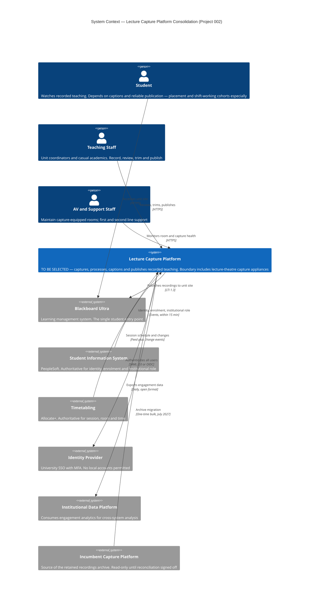

# Architecture Diagram: System Context — Lecture Capture Platform

> **Template Origin**: Official | **ArcKit Version**: 6.7.2 | **Command**: `/arckit:diagram`

## Document Control

| Field | Value |
|-------|-------|
| **Document ID** | ARC-002-DIAG-001-v1.0 |
| **Document Type** | Architecture Diagram — C4 Context (Level 1) |
| **Project** | Lecture Capture Platform Consolidation (Project 002) |
| **Classification** | OFFICIAL |
| **Status** | DRAFT |
| **Version** | 1.0 |
| **Created Date** | 2026-07-28 |
| **Last Modified** | 2026-07-28 |
| **Review Date** | 2026-08-27 |
| **Owner** | Sam Okafor, Integration Architect |
| **Reviewed By** | [PENDING] |
| **Approved By** | [PENDING] |
| **Distribution** | Project Team; Evaluation Panel; Education Committee; Steering Committee |

> **Classification note**: OFFICIAL rather than OFFICIAL-SENSITIVE. This diagram contains no supplier positioning, no named individuals' assessments and no security-gap detail. It is intended for the Education Committee paper and can be shared more widely than the other project 002 artifacts.

## Revision History

| Version | Date | Author | Changes | Approved By | Approval Date |
|---------|------|--------|---------|-------------|---------------|
| 1.0 | 2026-07-28 | ArcKit AI | Initial creation from `/arckit:diagram` command | [PENDING] | [PENDING] |

---

## Diagram

### Mermaid Format

**View this diagram** by pasting the Mermaid code into GitHub markdown (renders automatically), <https://mermaid.live>, or VS Code with the Mermaid Preview extension. It also renders inline on the ArcKit Pages site.

---

## Diagram Type Reference

| Attribute | Value |
|-----------|-------|
| **C4 Level** | Level 1 — System Context |
| **Format** | Mermaid `C4Context` |
| **Layout direction** | Left-to-right (actors → system → external systems) |
| **Audience** | Education Committee, Operations Committee, steering group, suppliers |
| **Purpose** | Establish the system boundary and its seven integration points before a platform is selected |

### Why Context and not Container

A C4 Container diagram would require technology choices that do not yet exist. No platform has been selected — the decision is scheduled for Operations Committee on 2026-10-09 — and no HLD has been produced. Drawing containers now would mean inventing internal structure and presenting speculation as design.

The context level is fully supported by existing artifacts: the seven integration requirements (INT-001 to INT-007) define every external system, and the stakeholder analysis defines the actors.

**Follow-on diagrams, once the decision is made**: Container (post-HLD), Deployment (room estate and network zones), Sequence (UC-1 automatic capture flow), Data Flow (recordings and PII, supporting the privacy impact assessment).

---

## Component Inventory

| Element | Type | Role | Requirements | Notes |
|---------|------|------|--------------|-------|
| **Student** | Person | Consumes recorded teaching | FR-010, NFR-U-002, REQ-007 | Access derives from enrolment; never separately provisioned |
| **Teaching Staff** | Person | Produces and curates recordings | FR-003, FR-005, FR-007, NFR-U-001 | Includes casual academics, whose day-one access is currently a known failure |
| **AV and Support Staff** | Person | Operates the capture estate | FR-004, NFR-M-001, INT-006 | Per-device identity required; no shared administrative accounts |
| **Lecture Capture Platform** | System (in scope) | Capture, processing, captioning, publication, lifecycle | BR-001, FR-001 to FR-018 | **Not yet selected.** Boundary includes room appliances — see boundary decision below |
| **Blackboard Ultra** | External system | Student entry point | INT-003, REQ-007 | LTI 1.3 at section granularity is the sharpest documented supplier difference |
| **Student Information System** | External system | Authoritative identity, enrolment, role | INT-001, FR-016, REQ-024 | Event-driven; 15-minute propagation |
| **Timetabling** | External system | Authoritative session, room, time | INT-002, FR-001, REQ-009 | Drives automatic capture scheduling |
| **Identity Provider** | External system | Authentication | INT-004, NFR-SEC-001, REQ-031 | SSO with MFA; **no local account path may exist** |
| **Institutional Data Platform** | External system | Analytics consumer | INT-005, FR-011, REQ-022 | Pseudonymised at source |
| **Incumbent Capture Platform** | External system | Archive migration source | INT-007, FR-015, BR-007 | Retained read-only until reconciliation is signed off |

**Element count: 10 of a maximum 10** for a C4 Context diagram.

### Boundary Decision: Room Appliances Are Inside the System

Lecture-theatre capture appliances (INT-006) are drawn **inside** the platform boundary rather than as an external system, and this is a deliberate choice worth stating because it is arguable.

**Reasoning**: from the perspective of every actor on this diagram, the appliance and the platform are one thing — an academic does not interact with an appliance, they teach in a room that records. Showing appliances externally would add an eleventh element, breach the context threshold, and imply a boundary that no user experiences.

**Consequence**: the appliance estate's real complexity — models, age, patch status, per-device identity, shared administrative accounts — is invisible at this level. That complexity is material to the project: it drives risks R-007, R-008 and R-016, and it is the largest unquantified cost. **It must appear in the Deployment diagram**, which is the correct level for it. This diagram should not be used to reason about the estate.

---

## Architecture Decisions Reflected

| # | Decision | Rationale | Source |
|---|----------|-----------|--------|
| D-1 | Students reach recordings **through Blackboard Ultra**, not through a platform portal | Principle 1 (Single Learning Entry Point) and REQ-007. Drawn explicitly: the student has no direct edge to the platform | ARC-000-PRIN Principle 1 |
| D-2 | Identity and enrolment flow **from** the SIS, never maintained locally | Principle 5 (Single Source of Truth) and Principle 12 (Automated Identity Lifecycle). The platform holds a minimal projection only (DR-004) | ARC-002-REQ DR-002, DR-004 |
| D-3 | Authentication is delegated to the university IdP with **no local fallback** | NFR-SEC-001 is a mandatory pass/fail gate. Two tools in the wider estate already breach this; the procurement will not add a third | ARC-002-EVAL MQ-1 |
| D-4 | The incumbent platform remains connected **after** cutover | Migration reconciliation must complete before decommissioning. This is the control that reduces R-021 from High to Low | ARC-002-RISK R-021 |
| D-5 | Capture scheduling is driven by **timetable data**, not by academic action | FR-001 requires zero human action. Research established at least one candidate cannot do this natively | ARC-002-RSCH §3.1 |

### Technology Choices

Deliberately **not** shown. The platform is unselected, and annotating it with a technology stack would prejudge an evaluation whose criteria are not yet signed. The external systems are named because they are incumbent and fixed.

---

## Requirements Traceability

### Integration requirements — complete coverage

| Req ID | Integration | Shown as |
|--------|-------------|----------|
| INT-001 | SIS → platform (identity, enrolment, roles) | `sis → capture` |
| INT-002 | Timetabling → platform (scheduling) | `timetable → capture` |
| INT-003 | Platform ↔ Blackboard Ultra (LTI 1.3) | `capture → lms` |
| INT-004 | Identity provider (SSO with MFA) | `capture → idp` |
| INT-005 | Platform → institutional data platform | `capture → analytics` |
| INT-006 | Platform ↔ room appliances | **Inside the boundary** — see boundary decision |
| INT-007 | Incumbent → platform (archive migration) | `incumbent → capture` |

**7 of 7 integration requirements represented.**

### Other requirements visible at this level

| Requirement | How the diagram reflects it |
|-------------|----------------------------|
| BR-001 (single primary platform) | One system, not three — the consolidation is the diagram's premise |
| FR-001, FR-002 (automatic capture and 4-hour publication) | Timetable feed in, LTI publication out, no academic in the path |
| FR-016 (enrolment-derived access) | No student edge to the platform; access flows from the SIS |
| NFR-SEC-001 (SSO, no local accounts) | Single authentication edge to the IdP |
| BR-007 (archive and exit) | Incumbent platform retained as a connected system |

### Not visible at this level — by design

Requirements concerning internal behaviour (captioning accuracy, retention scheduling, encryption, audit logging, failure alerting) are correctly absent from a context diagram. They appear at container and component level. **Absence here is not a coverage gap** — ARC-002-TRAC-v1.0 records their coverage in the evaluation framework and SOW.

---

## Integration Points

| System | Direction | Data | Protocol | SLA | Owner |
|--------|-----------|------|----------|-----|-------|
| Student Information System | Inbound | Identity, enrolment, institutional role | Event-driven, canonical model | 15 min from source change | Sam Okafor |
| Timetabling (Allocate+) | Inbound | Session, room, time, presenter | Feed plus change events | Reconciled within 1 hour of change | Ivy Sequence |
| Blackboard Ultra | Outbound | Recording placement, playback surface | LTI 1.3 deep linking, names and roles | Within the 4-hour publication window | Dr. Benny Moog |
| Identity Provider | Outbound | Authentication assertions | SAML 2.0 or OIDC, MFA at IdP | University IdP standard | Tobias Ohm |
| Institutional Data Platform | Outbound | Engagement analytics, pseudonymised | Scheduled extract, open format | Daily, under 24 hours stale | Sam Okafor |
| Incumbent Capture Platform | Inbound | Media, captions, transcripts, metadata | One-time bulk export and import | Complete within July 2027 window | Rhonda Bell |

---

## Data Flow Summary

Personal information crosses four of the six integration boundaries. Full treatment belongs in a dedicated Data Flow diagram supporting the privacy impact assessment; summarised here for completeness.

| Flow | Data class | Sensitivity |
|------|-----------|-------------|
| SIS → platform | Identity, enrolment, role | Personal information |
| Platform → Blackboard Ultra | Recording references, playback | Personal information — recordings capture students |
| Platform → analytics platform | Engagement events | Derived personal information, pseudonymised at source |
| Incumbent → platform | Recordings archive | Personal information, biometric-adjacent |

**Not shown and material**: residency of storage *and processing*, which is a mandatory evaluation gate (MQ-4) and the subject of risk R-013. A Data Flow diagram annotated with residency per data class is recommended before the privacy impact assessment begins in October.

---

## Security Architecture at This Level

| Control | Visible as |
|---------|-----------|
| Single authentication authority | One edge, platform → IdP; no alternative credential path drawn because none may exist |
| No direct student access | Student reaches recordings only via the LMS |
| Authoritative identity source | Identity flows from the SIS; the platform is a consumer, not a master |

**Security zones, encryption boundaries and the appliance estate's administrative model are not representable at context level.** They belong in the Deployment diagram, which is also where the Essential Eight gaps behind risk R-016 become visible.

---

## Deployment Architecture

Not applicable at this level and not yet determinable. Hosting region, network zones and room topology all depend on the platform selection and on the appliance inventory due 2026-08-21.

---

## Wardley Map Integration

**No Wardley map exists for project 002.** Evolution-stage annotations are therefore omitted rather than invented.

This is a reasonable gap to leave open: the build-versus-buy question was settled before this project began — the university is buying a platform, not building one — so the primary strategic use of a Wardley map does not apply. `/arckit:wardley` would still add value in positioning the *capability* against the sector, and would be worth running before the business case if time allows.

---

## Diagram Quality Gate

| # | Criterion | Target | Result | Status |
|---|-----------|--------|--------|--------|
| 1 | Edge crossings | Fewer than 5 (complex) | 1 estimated — `student → lms` crosses the system column | **PASS** |
| 2 | Visual hierarchy | System is the most prominent element | Single `System()` among `System_Ext()` and `Person()`; C4 renders it in the distinct primary colour | **PASS** |
| 3 | Grouping | Related elements proximate | Actors declared together, then system, then externals grouped by role (LMS/SIS/timetable, then IdP/analytics/incumbent) | **PASS** |
| 4 | Flow direction | Consistent | Left-to-right: actors → system → external systems | **PASS** |
| 5 | Relationship traceability | Each line followable | 9 relationships, no parallel edges between the same pair | **PASS** |
| 6 | Abstraction level | One C4 level | Level 1 throughout; no containers or components present | **PASS** |
| 7 | Edge label readability | Legible, non-overlapping | All labels under 45 characters; protocol carried in the second parameter | **PASS** |
| 8 | Node placement | No unnecessarily long edges | Declaration order matches tier order per the barycentric heuristic | **PASS** |
| 9 | Element count | Within threshold | **10 / 10** | **PASS** |

**Result: 9 of 9 criteria pass. No remediation iterations required.**

### Accepted Trade-offs

**One edge crossing is accepted.** The `student → lms` relationship crosses the system column because the student sits in the actor tier on the left while Blackboard Ultra sits in the external tier on the right.

The alternative — drawing a direct `student → capture` edge — would remove the crossing but would misrepresent Principle 1, which requires the LMS to be the single student entry point. **Architectural accuracy is preferred over layout purity**, and the crossing is the visual consequence of a deliberate design decision rather than a defect.

**Element count is at the threshold, not below it.** At 10 of 10 there is no headroom. Any future addition — a second LMS, an external captioning service, a lecture theatre booking system — requires either splitting this diagram or promoting a detail into the Container level. Noted so that a later change does not silently push it over.

---

## Linked Artifacts

| Artifact | Relationship |
|----------|-------------|
| [ARC-002-REQ-v1.0](../ARC-002-REQ-v1.0.md) | Source of all integration and functional requirements shown |
| [ARC-002-TRAC-v1.0](../ARC-002-TRAC-v1.0.md) | Records coverage of requirements not visible at this level |
| [ARC-002-EVAL-v1.0](../ARC-002-EVAL-v1.0.md) | Gates MQ-1 and MQ-4 constrain the IdP and residency relationships |
| [ARC-002-RISK-v1.0](../ARC-002-RISK-v1.0.md) | R-007, R-008, R-016 concern the appliance estate folded into the boundary |
| [ARC-002-RSCH-v1.0](../research/ARC-002-RSCH-v1.0.md) | Established the LTI 1.3 and auto-capture constraints reflected in decisions D-1 and D-5 |
| [ARC-000-PRIN-v1.0](../../000-global/ARC-000-PRIN-v1.0.md) | Principles 1, 5, 9, 12 are directly represented |

---

## External References

### Document Register

| Doc ID | Filename | Type | Source Location | Description |
|--------|----------|------|-----------------|-------------|
| REQ | ARC-002-REQ-v1.0.md | ArcKit artifact | `002-lecture-capture/` | Integration and functional requirements |
| RSCH | ARC-002-RSCH-v1.0.md | ArcKit artifact | `002-lecture-capture/research/` | Market findings behind decisions D-1 and D-5 |
| PRIN | ARC-000-PRIN-v1.0.md | ArcKit artifact | `000-global/` | Principles 1, 5, 12 |
| SL | system-landscape.md | Foundation artifact | `002-lecture-capture/external/` | Current integration landscape |

### Citations

| Citation ID | Doc ID | Page/Section | Category | Quoted Passage |
|-------------|--------|--------------|----------|----------------|
| PRIN-C1 | PRIN | Principle 1 | Design Decision | Students access all unit materials, activities and grades through a single entry point — the LMS |
| PRIN-C2 | PRIN | Principle 12 | Integration Requirement | "Account provisioning, role assignment, and deprovisioning MUST be automated and driven from the authoritative source." |
| SL-C1 | SL | Known integrations | Integration Requirement | "Echo360 user provisioning / LTI + manual CSV / Manual workaround for casual academic staff" |
| REQ-C1 | REQ | INT-003 | Integration Requirement | LTI 1.3 with deep linking and names-and-roles against Blackboard Ultra, at section granularity |

### Unreferenced Documents

| Filename | Source Location | Reason |
|----------|-----------------|--------|
| privacy-context.md | `002-lecture-capture/external/` | PII detail belongs in a Data Flow diagram, not a context diagram |
| stakeholders.md | `002-lecture-capture/external/` | Actor roles derived via ARC-002-STKE rather than the raw register |

---

**Generated by**: ArcKit `/arckit:diagram` command
**Generated on**: 2026-07-28
**ArcKit Version**: 6.7.2
**Project**: Lecture Capture Platform Consolidation (Project 002)
**Model**: Claude Opus 5 (1M context)
**Generation Context**: C4 Context (Level 1) in Mermaid, derived from the seven integration requirements in ARC-002-REQ-v1.0 and the actor set in ARC-002-STKE-v1.0. Container level deliberately not attempted — no platform selected and no HLD exists. Room appliances folded inside the system boundary to hold the 10-element context threshold, with the consequence recorded.

<!-- arckit-provenance:start -->

## Build Provenance

_Stamped automatically by the ArcKit plugin's `provenance-stamp.mjs` PostToolUse hook. Complements (does not replace) the human-authored footer above. Carries only fields the model can't authoritatively self-report: build context from `.arckit/state.json` and effort levels derived from command frontmatter + the silent-downgrade matrix._

| Field | Value |
|-------|-------|
| Requested Effort | `high` |
| Effective Effort | _unknown — model not parsed from existing footer_ |
| Stamped at | 2026-07-28T05:35:41.456Z |

<!-- arckit-provenance:end -->
