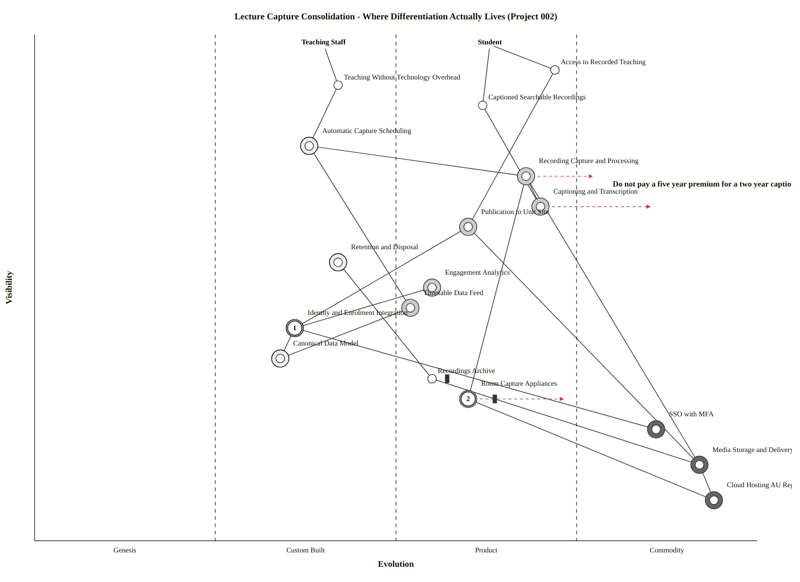

# Wardley Map: Where Differentiation Actually Lives

> **Template Origin**: Official | **ArcKit Version**: 6.7.2 | **Command**: `/arckit:wardley`

## Document Control

| Field | Value |
|-------|-------|
| **Document ID** | ARC-002-WARD-001-v1.0 |
| **Document Type** | Wardley Map — Current State with Evolution |
| **Project** | Lecture Capture Platform Consolidation (Project 002) |
| **Classification** | OFFICIAL |
| **Status** | DRAFT |
| **Version** | 1.0 |
| **Created Date** | 2026-07-28 |
| **Last Modified** | 2026-07-28 |
| **Review Date** | 2026-08-27 |
| **Owner** | Dr. Benny Moog, Director Learning Technologies |
| **Reviewed By** | [PENDING] |
| **Approved By** | [PENDING] |
| **Distribution** | Steering Committee; Evaluation Panel; Education Committee |

## Revision History

| Version | Date | Author | Changes | Approved By | Approval Date |
|---------|------|--------|---------|-------------|---------------|
| 1.0 | 2026-07-28 | ArcKit AI | Initial creation from `/arckit:wardley` command | [PENDING] | [PENDING] |

---

## Strategic Question

**The build-versus-buy question was settled before this project began** — the university is buying a platform, not building one. So this map is not asked to answer it.

The question it *is* asked to answer is sharper and currently unexamined:

> **If the capture platform itself is a mature product with several viable vendors, where does the university's actual differentiation lie — and is the project spending its attention there?**

The answer the map gives is uncomfortable for the way the project is currently framed, and it corroborates a finding already recorded independently in the stakeholder analysis.

---

## The Map

Paste into <https://create.wardleymaps.ai> to render.

```wardley
title Lecture Capture Consolidation - Where Differentiation Actually Lives (Project 002)

anchor Student [0.98, 0.63]
anchor Teaching Staff [0.98, 0.40]

component Access to Recorded Teaching [0.93, 0.72]
component Teaching Without Technology Overhead [0.90, 0.42]
component Captioned Searchable Recordings [0.86, 0.62]
component Automatic Capture Scheduling [0.78, 0.38]
component Recording Capture and Processing [0.72, 0.68]
component Captioning and Transcription [0.66, 0.70]
component Publication to Unit Site [0.62, 0.60]
component Retention and Disposal [0.55, 0.42]
component Engagement Analytics [0.50, 0.55]
component Timetable Data Feed [0.46, 0.52]
component Identity and Enrolment Integration [0.42, 0.36]
component Canonical Data Model [0.36, 0.34]
component Recordings Archive [0.32, 0.55] inertia
component Room Capture Appliances [0.28, 0.60] inertia
component SSO with MFA [0.22, 0.86]
component Media Storage and Delivery [0.15, 0.92]
component Cloud Hosting AU Region [0.08, 0.94]

Student -> Access to Recorded Teaching
Student -> Captioned Searchable Recordings
Teaching Staff -> Teaching Without Technology Overhead
Access to Recorded Teaching -> Publication to Unit Site
Captioned Searchable Recordings -> Captioning and Transcription
Teaching Without Technology Overhead -> Automatic Capture Scheduling
Automatic Capture Scheduling -> Timetable Data Feed
Automatic Capture Scheduling -> Recording Capture and Processing
Recording Capture and Processing -> Room Capture Appliances
Recording Capture and Processing -> Media Storage and Delivery
Captioning and Transcription -> Recording Capture and Processing
Publication to Unit Site -> Identity and Enrolment Integration
Publication to Unit Site -> Media Storage and Delivery
Retention and Disposal -> Recordings Archive
Engagement Analytics -> Identity and Enrolment Integration
Identity and Enrolment Integration -> Canonical Data Model
Identity and Enrolment Integration -> SSO with MFA
Timetable Data Feed -> Canonical Data Model
Recordings Archive -> Media Storage and Delivery
Room Capture Appliances -> Cloud Hosting AU Region
Media Storage and Delivery -> Cloud Hosting AU Region

build Automatic Capture Scheduling
build Identity and Enrolment Integration
build Canonical Data Model
build Retention and Disposal
buy Recording Capture and Processing
buy Captioning and Transcription
buy Publication to Unit Site
buy Engagement Analytics
buy Timetable Data Feed
buy Room Capture Appliances
outsource SSO with MFA
outsource Media Storage and Delivery
outsource Cloud Hosting AU Region

evolve Captioning and Transcription 0.86
evolve Recording Capture and Processing 0.78
evolve Room Capture Appliances 0.74

annotation 1 [0.42, 0.36] Differentiation lives here - not in the capture product
annotation 2 [0.28, 0.60] Inertia - ageing estate, shared admin accounts, capital cost
note Do not pay a five year premium for a two year captioning advantage [0.70, 0.80]

style wardley
```

<details>
<summary>Mermaid Wardley Map</summary>



</details>

> **Note on the two blocks.** The Mermaid block is generated from the OWM source by the bundled converter, not hand-authored. The `evolve` statements carry no `label` text because the converter silently drops any `evolve` line with a trailing label — see *Tooling Note* at the end of this document. The label text has been moved into §5 (Movement and Predictions) so no meaning is lost.

---

## 1. Component Inventory and Strategic Metrics

Metrics from the Wardley mathematical model: **D** = differentiation pressure = visibility × (1 − evolution); **K** = commodity leverage = (1 − visibility) × evolution. High D (> 0.4) indicates where to invest in differentiation; high K (> 0.4) indicates infrastructure to commoditise.

| Component | Vis | Evo | Stage | D | K | Sourcing |
|-----------|-----|-----|-------|---|---|----------|
| Access to Recorded Teaching | 0.93 | 0.72 | Product | 0.260 | 0.050 | User need |
| **Teaching Without Technology Overhead** | 0.90 | 0.42 | Custom | **0.522** | 0.042 | **Build** |
| Captioned Searchable Recordings | 0.86 | 0.62 | Product | 0.327 | 0.087 | User need |
| **Automatic Capture Scheduling** | 0.78 | 0.38 | Custom | **0.484** | 0.084 | **Build** |
| Recording Capture and Processing | 0.72 | 0.68 | Product | 0.230 | 0.190 | Buy |
| Captioning and Transcription | 0.66 | 0.70 | Product | 0.198 | 0.238 | Buy |
| Publication to Unit Site | 0.62 | 0.60 | Product | 0.248 | 0.228 | Buy |
| Retention and Disposal | 0.55 | 0.42 | Custom | 0.319 | 0.189 | Build |
| Engagement Analytics | 0.50 | 0.55 | Product | 0.225 | 0.275 | Buy |
| Timetable Data Feed | 0.46 | 0.52 | Product | 0.221 | 0.281 | Buy |
| Identity and Enrolment Integration | 0.42 | 0.36 | Custom | 0.269 | 0.209 | Build |
| Canonical Data Model | 0.36 | 0.34 | Custom | 0.238 | 0.218 | Build |
| Recordings Archive | 0.32 | 0.55 | Product | 0.144 | 0.374 | University asset |
| **Room Capture Appliances** | 0.28 | 0.60 | Product | 0.112 | **0.432** | **Buy** |
| **SSO with MFA** | 0.22 | 0.86 | Commodity | 0.031 | **0.671** | **Outsource** |
| **Media Storage and Delivery** | 0.15 | 0.92 | Commodity | 0.012 | **0.782** | **Outsource** |
| **Cloud Hosting AU Region** | 0.08 | 0.94 | Commodity | 0.005 | **0.865** | **Outsource** |

### Metric Validation

The command requires metrics to be consistent with sourcing recommendations. They are:

| Check | Result |
|-------|--------|
| Every high-D component flagged Build | ✅ Teaching Without Technology Overhead (0.522), Automatic Capture Scheduling (0.484) — both Build |
| Every high-K component flagged Buy or Outsource | ✅ Cloud Hosting (0.865), Media Storage (0.782), SSO with MFA (0.671), Room Appliances (0.432) — all Buy/Outsource |
| No component flagged Build with high K | ✅ None |
| No component flagged Buy with high D | ✅ None |

**No positioning or strategy errors detected.**

---

## 2. The Central Finding

**The contested decision concerns a Product-stage component. The uncontested work is where differentiation lives.**

Recording Capture and Processing sits at evolution 0.68 — mid-Product. The market has at least five viable awardees in comparable sector procurements, per the research. Differentiation pressure on it is **0.230**, which is low. Whichever platform the university selects, the capability it buys will be broadly similar, and no lasting advantage accrues from choosing well among mature products.

Meanwhile the two components with the highest differentiation pressure in the entire map — **Teaching Without Technology Overhead (0.522)** and **Automatic Capture Scheduling (0.484)** — are Custom-stage, must be built, and are barely contested by anyone.

This corroborates, from an entirely independent method, the finding already recorded in ARC-002-STKE §Key Findings: *"the two loudest drivers are not the binding constraints."* The stakeholder analysis reached that conclusion from stakeholder drivers. The map reaches it from evolution positioning. **Two different lenses, same answer.**

### Implication for the Evaluation

The evaluation framework allocates 16 points to Capture Capability (Category A) and 14 to Integration and Provisioning (Category C). On the map's logic, that ordering is arguably inverted — Category C contains the components carrying the university's differentiation, while much of Category A assesses a mature product against other mature products.

**This is offered as a challenge to test at the weighting workshop, not as a recommendation to change the weights.** The weights were derived from requirement priorities, which is a defensible and auditable method, and re-deriving them on a different basis after the fact would undermine the BR-004 control that makes the decision defensible. If the panel finds the argument persuasive, the change must go through the derivation and be re-signed — not applied by hand.

---

## 3. Build, Buy, Outsource

### Build — Custom stage, differentiation

| Component | Why build |
|-----------|----------|
| **Automatic Capture Scheduling** | Highest actionable D (0.484). Timetable-driven capture with zero academic action is specific to this university's timetabling, room and unit model. No vendor ships it; it is assembled from a feed and a platform API |
| **Identity and Enrolment Integration** | Event-driven provisioning against the canonical model. D is moderate (0.269) only because visibility is low — its *dependents* are highly visible, which the risk analysis in §6 exposes |
| **Canonical Data Model** | Delivered by project 001, consumed here. Building once and reusing across the ecosystem is the entire point |
| **Retention and Disposal** | Institution-specific schedule, approval route and disposal evidence. No product implements a university's records schedule |

### Buy — Product stage, mature market

| Component | Why buy |
|-----------|---------|
| Recording Capture and Processing | Mid-Product with multiple viable vendors. Building would be value-destroying |
| Captioning and Transcription | Product and moving fast — see §5 |
| Publication to Unit Site | LTI 1.3 is a standard; buy conformance, do not build an integration |
| Engagement Analytics | Product; the differentiation is in what the university does with the data, not in collecting it |
| Timetable Data Feed | Existing system; consume it |
| **Room Capture Appliances** | K = 0.432 — high commodity leverage. **This is the most interesting sourcing signal on the map** — see §4 |

### Outsource — Commodity

SSO with MFA (K 0.671), Media Storage and Delivery (K 0.782), Cloud Hosting AU Region (K 0.865). All firmly commodity; building any of them would be indefensible. The only live question is *residency*, which is a contract term, not a sourcing decision.

---

## 4. Inertia

Two components carry inertia, and they are the two the project is least comfortable discussing.

### Room Capture Appliances — the significant one

**Position**: visibility 0.28, evolution 0.60, **K = 0.432**.

A commodity-leverage score above 0.4 on an owned physical estate is a strategic signal, not a rounding error. It says the university is holding capital assets in a component the market has already largely commoditised.

**Inertia types present** (per the taxonomy): capital inertia (the estate is owned and partly undepreciated), skills inertia (the AV team's expertise is in this estate), and process inertia (room works are scheduled around an established maintenance model).

**The strategic implication is uncomfortable and worth stating plainly**: the market is moving toward software-defined and subscription-licensed room capture. The research found the only knowable room-side price in the whole procurement is a *recurring per-room licence*, which is structurally an opex model, not a capex one. The university's instinct — protect the appliance investment — is precisely the inertia pattern that Wardley identifies as most dangerous when the underlying component is commoditising.

**This does not mean replace the estate now.** It means the whole-of-life comparison required by BR-003 must model an opex room path as a genuine option and not merely as a cost line under a capex assumption. If it does not, the university will make a five-year decision on the assumption that its current model is the only one.

### Recordings Archive — the lock-in one

**Position**: visibility 0.32, evolution 0.55, K = 0.374.

Inertia here is not capital or skills — it is **switching cost**. The archive grows continuously, and every year of accumulation raises the cost of leaving. This is the mechanism behind risks R-012 (renewal repricing) and R-020 (stranded archive).

Principle 9 exists precisely to counter it, and the mandatory export gate MQ-3 is the map's recommended treatment: keep the exit cost flat rather than letting it compound. The retention schedule (R-014) is the second lever — the only one that actively *reduces* the archive.

---

## 5. Movement and Predictions

Evolution movements shown on the map, with the rationale that would otherwise sit in the `evolve` labels.

| Component | Now | 24-month target | Movement | Strategic implication |
|-----------|-----|-----------------|----------|----------------------|
| **Captioning and Transcription** | 0.70 | **0.86** | +0.16 — fast | **Commoditising fast.** Speech recognition is being absorbed into cloud platform services. A platform-native captioning advantage today is likely a two-year advantage, not a five-year one |
| **Recording Capture and Processing** | 0.68 | **0.78** | +0.10 — medium | **Consolidating market.** Feature differentiation between capture products is narrowing. Expect fewer, larger vendors and more standardised capability by the next renewal |
| **Room Capture Appliances** | 0.60 | **0.74** | +0.14 — medium-fast | **Software-defined capture.** Dedicated appliances give way to software on commodity hardware and subscription-licensed room devices |

### The captioning warning, stated directly

Caption accuracy is currently a scored evaluation criterion (B.2, 3 points) and the sharpest student-impact differentiator the research identified. **Both facts are true, and the map adds a third**: the advantage is depreciating.

The practical consequence is a contract-shape recommendation, not an evaluation-weight recommendation. **Do not accept a five-year premium priced against a captioning advantage that the market will erase in two.** If a supplier's captioning superiority is material to selection, the university should seek either a shorter price-protected term on that element, or the contractual right to substitute a third-party captioning service — which the open-format export gate (MQ-3) already makes technically possible.

---

## 6. Dependency Risk Analysis

**R(a,b) = visibility(a) × (1 − evolution(b))** — flags visible components depending on immature ones. High R (> 0.4) is a fragility signal.

| Dependent | Depends on | R | Assessment |
|-----------|-----------|---|------------|
| Teaching Without Technology Overhead | Automatic Capture Scheduling | **0.558** | 🔴 **Highest risk on the map** |
| Publication to Unit Site | Identity and Enrolment Integration | 0.397 | 🟠 Approaching threshold |
| Automatic Capture Scheduling | Timetable Data Feed | 0.374 | 🟠 |
| Access to Recorded Teaching | Publication to Unit Site | 0.372 | 🟠 |
| Engagement Analytics | Identity and Enrolment Integration | 0.320 | 🟡 |
| Recording Capture and Processing | Room Capture Appliances | 0.288 | 🟡 |
| Captioned Searchable Recordings | Captioning and Transcription | 0.258 | 🟡 |

### R = 0.558 — read this one carefully

The university's most visible promise to academic staff — *teach, and it records itself* — rests entirely on a Custom-stage component the university must build and does not yet have.

This is not an argument against building it. High-visibility-on-custom is the normal shape of genuine differentiation; it is what building an advantage looks like. But it means **the integration is the single point of failure for the project's most visible benefit**, and it deserves the delivery attention currently being spent on the platform argument.

Three existing risks converge on exactly this component — R-010 (project 001's canonical model slipping), R-022 (a platform supporting only bulk-import provisioning), and R-006 (baselines needed to assess either). The map explains *why* those three matter more than their individual scores suggest: they all threaten the same load-bearing element.

The second and third entries reinforce it — Publication to Unit Site and Automatic Capture Scheduling both depend on integration components. **Four of the top five dependency risks pass through the integration layer.**

---

## 7. Doctrine Assessment

Assessed against Wardley's doctrine phases, based on evidence in the project artifacts.

| Doctrine | Phase | Assessment | Evidence |
|----------|-------|-----------|----------|
| **Know your users** | I | ✅ Strong | Six personas with distinct needs; students, casual academics and AV staff all represented, including those with no institutional voice |
| **Focus on user needs** | I | ✅ Strong | Requirements anchor to survey needs; the anchor components on this map are user needs, not systems |
| **Use a common language** | I | ✅ Strong | Consistent requirement IDs traced across six artifacts; verified at 94% bidirectional coverage |
| **Challenge assumptions** | I | ✅ Strong | Assumption A-5 (incumbent export) flagged unverified rather than assumed; baselines marked ⚠️ rather than invented |
| **Remove bias and duplication** | I | ✅ Strong | The project exists to remove duplication; declared positions are recorded and controlled rather than hidden |
| **Be transparent** | I | ✅ Strong | Dissent recorded rather than suppressed; deviation from template weights documented openly |
| **Use appropriate methods** | II | ✅ Adequate | Different evidence tiers for different claims; hands-on testing mandated where documentation is unreliable |
| **Think small, think aptitude** | II | 🟡 Partial | Capability decomposition is good; team aptitude for the integration build is not assessed anywhere |
| **Move fast** | II | 🟠 Weak | Governance cycles dominate the schedule. Defensible for a contested procurement, but the map shows the *uncontested* integration work could have started months earlier |
| **Manage inertia** | III | 🟠 **Weakest area** | Appliance inertia is identified as a cost and a risk, but not as a strategic position to challenge. The capex assumption is not tested against an opex alternative |
| **Optimise flow** | III | 🟡 Partial | Failure modes and alerting well specified; the end-to-end flow from timetable to published recording is not measured today |
| **Set exceptional standards** | III | ✅ Strong | Mandatory gates, evidence tier caps, no-cutover-in-teaching-period rules |
| **Do better with less** | IV | 🟡 Partial | Cost containment is a requirement; continuous improvement after go-live is thin beyond reporting |

**Overall**: strong Phase I doctrine — unusually strong on transparency and challenging assumptions. **The weakness is Phase III inertia management**, which is exactly what §4 identifies.

---

## 8. Applicable Gameplay Patterns

| Pattern | Category | Applicability |
|---------|----------|---------------|
| **Standards game** | Market | ✅ **Actively in play.** Insisting on LTI 1.3, SCIM-equivalent provisioning and open-format export uses open standards to reduce switching costs and keep the market contestable. This is the strongest play available and the project is already running it |
| **Buyer power** | Market | ✅ Available. Competitive tender across three shortlisted options preserves it; the mandatory gates concentrate it on the terms that matter |
| **Exploiting constraint** | Positional | 🟡 Partial. The July 2027 cutover window is a genuine constraint; suppliers who can meet it gain advantage. Not currently used as a differentiator in evaluation |
| **Co-creation** | Ecosystem | 🟡 Available, unused. The integration layer could be built with sector peers facing identical timetable-to-capture problems. CAUDIT enquiry is already an action |

### Anti-Patterns — Checked

| Anti-pattern | Present? | Note |
|--------------|----------|------|
| Playing in the wrong evolution stage | ❌ No | Sourcing matches evolution throughout; metrics validate it |
| **Ignoring inertia** | 🟠 **Partially present** | Appliance inertia named and costed, but not challenged strategically. §4 refers |
| Misreading evolution pace | ❌ No | Captioning correctly identified as fast-moving |
| Single-play dependence | ❌ No | Standards, buyer power and mandatory gates are layered |
| Open washing | ❌ No | Export capability required to be *demonstrated*, not asserted |
| **Legacy trap** | 🟡 Watch | Retaining the appliance estate because it is owned, rather than because it is right, would be the legacy trap. The whole-of-life split between "required regardless" and "decision-caused" is the correct instrument to detect it |

---

## 9. Climatic Patterns

| Pattern | Impact on this project |
|---------|----------------------|
| **Everything evolves** | Captioning, capture and appliances are all moving right. Nothing on this map is stable over the five-year contract term |
| **Characteristics change as components evolve** | As capture commoditises, competition shifts from features to price and terms. **Evaluation criteria weighted on features will age faster than criteria weighted on terms and integration** |
| **Efficiency enables innovation** | Commodity storage and cloud make universal capture affordable at all — which is why the coverage target moved from partial to 100% |
| **No choice over evolution (Red Queen)** | The university cannot opt out of captioning expectations rising as ASR commoditises. Today's accuracy standard becomes tomorrow's baseline |
| **Inertia** | See §4. The dominant climatic force acting against this project |
| **Co-evolution of practice** | Universal automatic capture changes teaching practice — attendance, seminar design, what academics are willing to say on record. The capture policy (FR-012, Conflict C-3) is the university's attempt to govern a practice change it is causing |
| **Future value inversely proportional to certainty** | The integration layer is the least certain and highest future value. The capture product is the most certain and lowest |

---

## 10. Recommendations

### Immediate (0–3 months, before criteria signature)

1. **Start the integration workstream now.** It is platform-neutral, carries the highest differentiation pressure and the highest dependency risk, and does not need the platform decision. Every week spent waiting is a week not spent on the thing that actually differentiates.
2. **Model an opex room path in the whole-of-life comparison.** Not as a recommendation to adopt it — as a test of whether the capex assumption survives contact with the alternative. Addresses the Phase III doctrine weakness directly.
3. **Table the differentiation argument at the weighting workshop.** Test whether Category A should outrank Category C. If the panel agrees, re-derive and re-sign; do not hand-adjust.

### Short-term (3–12 months, procurement and contract)

4. **Do not price a long term against a captioning advantage.** Seek shorter price protection on that element, or a contractual right to substitute a third-party captioning service.
5. **Keep the standards play running into the contract.** LTI 1.3, provisioning API and open-format export are what keep the next renewal contestable. They are worth more than a feature concession.
6. **Apply the retention schedule before migration.** It is the only lever that reduces archive switching cost rather than letting it compound.

### Long-term (12–24 months, post-implementation)

7. **Re-map at the first renewal review.** Captioning at 0.86 and capture at 0.78 change the sourcing calculus materially. Test the predictions in §5 against what actually happened.
8. **Explore sector co-creation on the integration layer.** Every Australian university with a timetabling system and an LMS faces this identical problem, and it is the one place where shared effort produces shared advantage rather than shared mediocrity.

---

## 11. Traceability

| Map element | Requirements | Principles |
|-------------|--------------|-----------|
| Automatic Capture Scheduling | FR-001, INT-002, REQ-009 | 11 (Event-Driven and Near-Real-Time) |
| Identity and Enrolment Integration | FR-016, INT-001, INT-004, REQ-024, REQ-031 | 5, 12 |
| Canonical Data Model | DR-002, REQ-027 | 6 |
| Recording Capture and Processing | FR-002 to FR-005, REQ-004 | 2 |
| Captioning and Transcription | FR-006, FR-007, NFR-U-003, REQ-029 | 14 |
| Publication to Unit Site | FR-002, INT-003, REQ-007 | 1 |
| Retention and Disposal | FR-014, DR-005, NFR-C-001 | 7 |
| Recordings Archive | BR-007, FR-015, FR-017, NFR-I-002, REQ-034 | 9 |
| Room Capture Appliances | INT-006, NFR-SEC-002, NFR-SEC-004, REQ-033 | 16 |
| SSO with MFA | NFR-SEC-001, INT-004, REQ-031 | 12, 16 |
| Cloud Hosting AU Region | NFR-C-001, DR-006, REQ-030 | 8 |

**UK Government context**: not applicable. The University of Funk is an Australian institution — Digital Marketplace, G-Cloud, DOS and TCoP have no standing here, and the procurement route is a competitive tender under the university's own RIFF governance. **AI Playbook**: not applicable; no AI decision-making component. Automatic speech recognition is a commodity processing service, not an algorithmic decision system.

---

## Tooling Note: Converter Limitation Found

While generating this map, the `owm-to-mermaid.mjs` converter was found to **silently drop any `evolve` statement carrying a trailing `label`**. Its pattern anchors the evolution target at end-of-line:

```javascript
const mev = s.match(/^evolve\s+(.+?)\s+([\d.]+)\s*$/i);
```

So `evolve Captioning and Transcription 0.86 label Commoditising fast` produces no output, while `evolve Captioning and Transcription 0.86` produces `evolve "Captioning and Transcription" 0.86`. The command documentation states the converter handles "evolve-label stripping"; it does not.

**Consequence if unnoticed**: the OWM block would show three evolution movements and the Mermaid block none — an inconsistency the `validate-wardley-math.mjs` Stop hook is designed to catch, but which would otherwise ship silently.

**Resolution applied here**: the OWM source uses bare `evolve` statements, and the label text is carried in §5 instead. Both blocks are consistent. Worth reporting upstream to the plugin maintainers.

---

## External References

### Document Register

| Doc ID | Filename | Type | Source Location | Description |
|--------|----------|------|-----------------|-------------|
| REQ | ARC-002-REQ-v1.0.md | ArcKit artifact | `002-lecture-capture/` | Requirements underpinning component identification |
| RSCH | ARC-002-RSCH-v1.0.md | ArcKit artifact | `002-lecture-capture/research/` | Market evidence for evolution positioning |
| STKE | ARC-002-STKE-v1.0.md | ArcKit artifact | `002-lecture-capture/` | Independent corroboration of the central finding |
| RISK | ARC-002-RISK-v1.0.md | ArcKit artifact | `002-lecture-capture/` | Risks R-006, R-010, R-012, R-020, R-022 |
| EVAL | ARC-002-EVAL-v1.0.md | ArcKit artifact | `002-lecture-capture/` | Category weights challenged in §2 |
| PRIN | ARC-000-PRIN-v1.0.md | ArcKit artifact | `000-global/` | Principles 1, 5, 6, 7, 8, 9, 11, 12, 14, 16 |

### Citations

| Citation ID | Doc ID | Page/Section | Category | Quoted Passage |
|-------------|--------|--------------|----------|----------------|
| STKE-C1 | STKE | Key Findings | Risk Factor | "the two loudest drivers are not the binding constraints" |
| RSCH-C1 | RSCH | §7.2 | Market Evidence | Teams Rooms Pro published at a recurring per-room monthly rate — the only knowable room-side price in the procurement, and structurally opex rather than capex |
| RSCH-C2 | RSCH | §2.4 | Market Evidence | A competitive sector process in this market produced five viable awardees, evidencing a mature multi-vendor market |
| PRIN-C1 | PRIN | Principle 9 | Procurement Constraint | "Every platform holding university or student data MUST permit export of that data in open, documented formats, at any time and on termination, without dependence on vendor goodwill or additional fee." |

### Unreferenced Documents

| Filename | Source Location | Reason |
|----------|-----------------|--------|
| SOW, TRAC, DIAG | `002-lecture-capture/` | Downstream of positioning; consume this map rather than inform it |
| Vendor profiles | `002-lecture-capture/vendors/` | Per-supplier detail; the map is deliberately vendor-neutral |

---

**Generated by**: ArcKit `/arckit:wardley` command
**Generated on**: 2026-07-28
**ArcKit Version**: 6.7.2
**Project**: Lecture Capture Platform Consolidation (Project 002)
**Model**: Claude Opus 5 (1M context)
**Generation Context**: Current-state map with 24-month evolution, built from ARC-002-REQ component identification and ARC-002-RSCH market evidence. Mermaid block generated by `owm-to-mermaid.mjs` from the OWM source, not hand-authored. D/K/R metrics computed programmatically and validated against sourcing decisions with no contradictions. Doctrine, gameplay and climatic analysis applied from the bundled wardley-mapping skill references.
