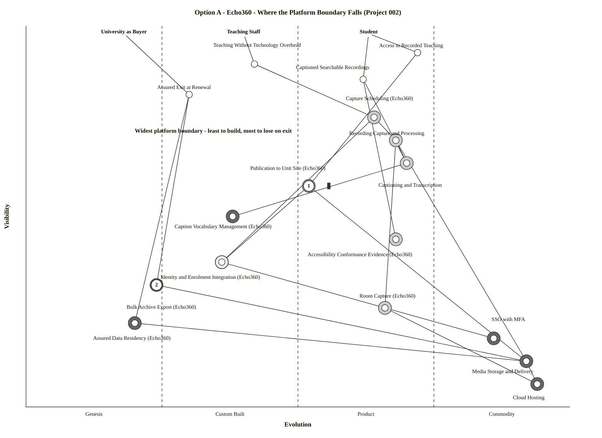
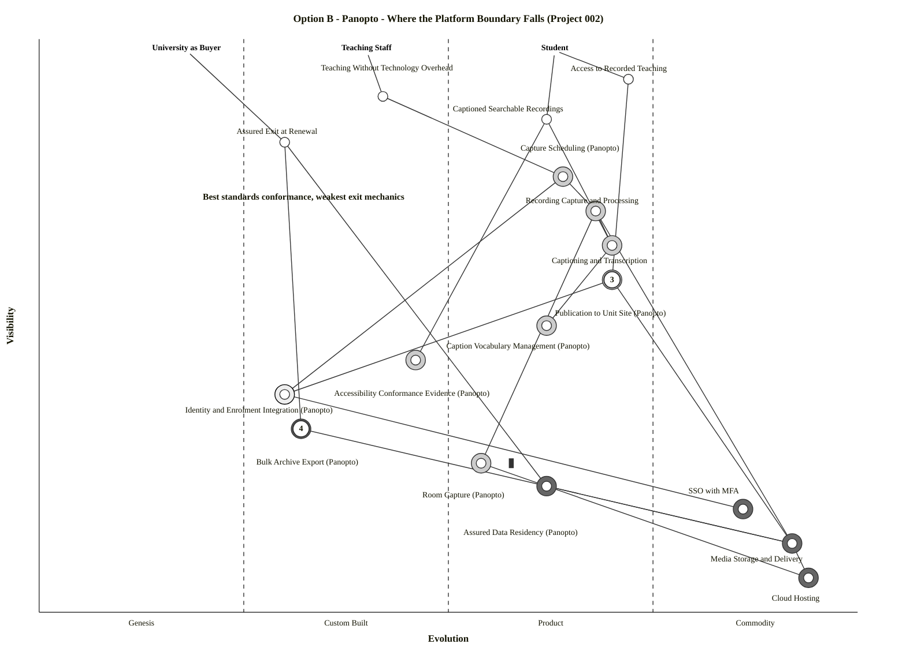
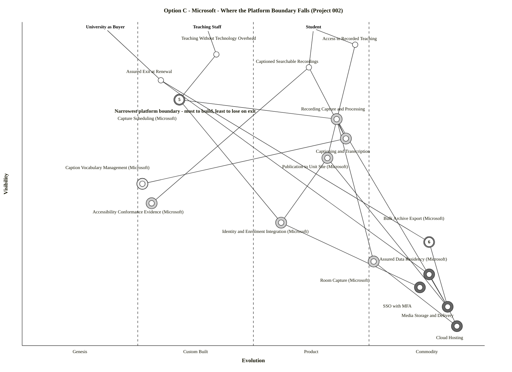

# Wardley Map: Three Vendors, Three Boundaries

> **Template Origin**: Official | **ArcKit Version**: 6.7.4 | **Command**: `/arckit:wardley`

## Document Control

| Field | Value |
|-------|-------|
| **Document ID** | ARC-002-WARD-002-v1.0 |
| **Document Type** | Wardley Map — Vendor Comparison (Mode D) |
| **Project** | Lecture Capture Platform Consolidation (Project 002) |
| **Classification** | OFFICIAL-SENSITIVE |
| **Status** | DRAFT |
| **Version** | 1.0 |
| **Created Date** | 2026-07-28 |
| **Last Modified** | 2026-07-28 |
| **Review Cycle** | Before criteria signature; re-map after gate evidence returns |
| **Next Review Date** | 2026-08-27 |
| **Owner** | Dr. Benny Moog, Director Learning Technologies |
| **Reviewed By** | [PENDING] |
| **Approved By** | [PENDING] |
| **Distribution** | Evaluation Panel; Steering Committee; Procurement; Digital & IT |

## Revision History

| Version | Date | Author | Changes | Approved By | Approval Date |
|---------|------|--------|---------|-------------|---------------|
| 1.0 | 2026-07-28 | ArcKit AI | Initial creation from `/arckit:wardley` command — three-option boundary comparison built on the ARC-002-WARD-001 baseline | [PENDING] | [PENDING] |

---

## Strategic Question

`ARC-002-WARD-001` established that the capture platform itself is a mature Product-stage component, that no lasting advantage accrues from choosing well among mature products, and that the university's differentiation lives in the integration layer instead. That map was deliberately vendor-neutral.

This one is not. It asks the question that follows:

> **Each shortlisted option draws the line between "what the platform supplies" and "what the university owns" in a different place. Which boundary leaves the university holding the component that carries its differentiation — and what does each boundary cost to leave?**

The maps below answer it, and the answer cuts across the way the options are currently argued. The Microsoft option is defended as *"capability we already own"* and attacked as *"it does not do automatic capture"*. Both framings miss what the map shows: **Microsoft is the only option that makes the university own the one component its own prior map identified as differentiating.** That is an argument in its favour that nobody has made, and it comes with a condition that nobody has attached.

### Scope note

Three maps, one per active option. **Option D (retain both, bounded) is not re-mapped here** — `ARC-002-WARD-001` already is the current-state map, and Option D is the current state with a boundary statement written on it. Kaltura and YuJa were excluded at screening; §7 gives the boundary-based reason that exclusion holds.

---

## Option A — Echo360 (incumbent)

Paste into <https://create.wardleymaps.ai> to render.

```wardley
title Option A - Echo360 - Where the Platform Boundary Falls (Project 002)

anchor Student [0.98, 0.63]
anchor Teaching Staff [0.98, 0.40]
anchor University as Buyer [0.98, 0.18]

component Access to Recorded Teaching [0.93, 0.72]
component Teaching Without Technology Overhead [0.90, 0.42]
component Captioned Searchable Recordings [0.86, 0.62]
component Assured Exit at Renewal [0.82, 0.30]
component Capture Scheduling (Echo360) [0.76, 0.64]
component Recording Capture and Processing [0.70, 0.68]
component Captioning and Transcription [0.64, 0.70]
component Publication to Unit Site (Echo360) [0.58, 0.52] inertia
component Caption Vocabulary Management (Echo360) [0.50, 0.38]
component Accessibility Conformance Evidence (Echo360) [0.44, 0.68]
component Identity and Enrolment Integration (Echo360) [0.38, 0.36]
component Bulk Archive Export (Echo360) [0.32, 0.24]
component Room Capture (Echo360) [0.26, 0.66]
component Assured Data Residency (Echo360) [0.22, 0.20]
component SSO with MFA [0.18, 0.86]
component Media Storage and Delivery [0.12, 0.92]
component Cloud Hosting [0.06, 0.94]

Student -> Access to Recorded Teaching
Student -> Captioned Searchable Recordings
Teaching Staff -> Teaching Without Technology Overhead
University as Buyer -> Assured Exit at Renewal

Access to Recorded Teaching -> Publication to Unit Site (Echo360)
Captioned Searchable Recordings -> Captioning and Transcription
Captioned Searchable Recordings -> Accessibility Conformance Evidence (Echo360)
Teaching Without Technology Overhead -> Capture Scheduling (Echo360)
Assured Exit at Renewal -> Bulk Archive Export (Echo360)
Assured Exit at Renewal -> Assured Data Residency (Echo360)

Capture Scheduling (Echo360) -> Recording Capture and Processing
Capture Scheduling (Echo360) -> Identity and Enrolment Integration (Echo360)
Recording Capture and Processing -> Room Capture (Echo360)
Recording Capture and Processing -> Media Storage and Delivery
Captioning and Transcription -> Caption Vocabulary Management (Echo360)
Captioning and Transcription -> Recording Capture and Processing
Publication to Unit Site (Echo360) -> Identity and Enrolment Integration (Echo360)
Publication to Unit Site (Echo360) -> Media Storage and Delivery
Identity and Enrolment Integration (Echo360) -> SSO with MFA
Bulk Archive Export (Echo360) -> Media Storage and Delivery
Room Capture (Echo360) -> Cloud Hosting
Media Storage and Delivery -> Assured Data Residency (Echo360)
Media Storage and Delivery -> Cloud Hosting

build Identity and Enrolment Integration (Echo360)
buy Capture Scheduling (Echo360)
buy Recording Capture and Processing
buy Captioning and Transcription
buy Publication to Unit Site (Echo360)
buy Accessibility Conformance Evidence (Echo360)
buy Room Capture (Echo360)
outsource Caption Vocabulary Management (Echo360)
outsource Bulk Archive Export (Echo360)
outsource Assured Data Residency (Echo360)
outsource SSO with MFA
outsource Media Storage and Delivery
outsource Cloud Hosting

annotation 1 [0.58, 0.52] LTI 1.1 path is a dead end - no section-level 1.3, no automatic migration
annotation 2 [0.32, 0.24] Export terms unknown - the highest-value question in the contract review

note Widest platform boundary - least to build, most to lose on exit [0.72, 0.20]

style wardley
```

<details>
<summary>Mermaid Wardley Map — Option A</summary>



</details>

---

## Option B — Panopto

```wardley
title Option B - Panopto - Where the Platform Boundary Falls (Project 002)

anchor Student [0.98, 0.63]
anchor Teaching Staff [0.98, 0.40]
anchor University as Buyer [0.98, 0.18]

component Access to Recorded Teaching [0.93, 0.72]
component Teaching Without Technology Overhead [0.90, 0.42]
component Captioned Searchable Recordings [0.86, 0.62]
component Assured Exit at Renewal [0.82, 0.30]
component Capture Scheduling (Panopto) [0.76, 0.64]
component Recording Capture and Processing [0.70, 0.68]
component Captioning and Transcription [0.64, 0.70]
component Publication to Unit Site (Panopto) [0.58, 0.70]
component Caption Vocabulary Management (Panopto) [0.50, 0.62]
component Accessibility Conformance Evidence (Panopto) [0.44, 0.46]
component Identity and Enrolment Integration (Panopto) [0.38, 0.30]
component Bulk Archive Export (Panopto) [0.32, 0.32]
component Room Capture (Panopto) [0.26, 0.54] inertia
component Assured Data Residency (Panopto) [0.22, 0.62]
component SSO with MFA [0.18, 0.86]
component Media Storage and Delivery [0.12, 0.92]
component Cloud Hosting [0.06, 0.94]

Student -> Access to Recorded Teaching
Student -> Captioned Searchable Recordings
Teaching Staff -> Teaching Without Technology Overhead
University as Buyer -> Assured Exit at Renewal

Access to Recorded Teaching -> Publication to Unit Site (Panopto)
Captioned Searchable Recordings -> Captioning and Transcription
Captioned Searchable Recordings -> Accessibility Conformance Evidence (Panopto)
Teaching Without Technology Overhead -> Capture Scheduling (Panopto)
Assured Exit at Renewal -> Bulk Archive Export (Panopto)
Assured Exit at Renewal -> Assured Data Residency (Panopto)

Capture Scheduling (Panopto) -> Recording Capture and Processing
Capture Scheduling (Panopto) -> Identity and Enrolment Integration (Panopto)
Recording Capture and Processing -> Room Capture (Panopto)
Recording Capture and Processing -> Media Storage and Delivery
Captioning and Transcription -> Caption Vocabulary Management (Panopto)
Captioning and Transcription -> Recording Capture and Processing
Publication to Unit Site (Panopto) -> Identity and Enrolment Integration (Panopto)
Publication to Unit Site (Panopto) -> Media Storage and Delivery
Identity and Enrolment Integration (Panopto) -> SSO with MFA
Bulk Archive Export (Panopto) -> Media Storage and Delivery
Room Capture (Panopto) -> Cloud Hosting
Media Storage and Delivery -> Assured Data Residency (Panopto)
Media Storage and Delivery -> Cloud Hosting

build Identity and Enrolment Integration (Panopto)
buy Capture Scheduling (Panopto)
buy Recording Capture and Processing
buy Captioning and Transcription
buy Publication to Unit Site (Panopto)
buy Caption Vocabulary Management (Panopto)
buy Accessibility Conformance Evidence (Panopto)
buy Room Capture (Panopto)
outsource Bulk Archive Export (Panopto)
outsource Assured Data Residency (Panopto)
outsource SSO with MFA
outsource Media Storage and Delivery
outsource Cloud Hosting

annotation 3 [0.58, 0.70] LTI Advantage Complete - the strongest standards position found
annotation 4 [0.32, 0.32] Vendor-assisted export at three to four weeks - longer than the cutover window

note Best standards conformance, weakest exit mechanics [0.72, 0.20]

style wardley
```

<details>
<summary>Mermaid Wardley Map — Option B</summary>



</details>

---

## Option C — Microsoft (Teams / Stream)

```wardley
title Option C - Microsoft - Where the Platform Boundary Falls (Project 002)

anchor Student [0.98, 0.63]
anchor Teaching Staff [0.98, 0.40]
anchor University as Buyer [0.98, 0.18]

component Access to Recorded Teaching [0.93, 0.72]
component Teaching Without Technology Overhead [0.90, 0.42]
component Captioned Searchable Recordings [0.86, 0.62]
component Assured Exit at Renewal [0.82, 0.30]
component Capture Scheduling (Microsoft) [0.76, 0.34]
component Recording Capture and Processing [0.70, 0.68]
component Captioning and Transcription [0.64, 0.70]
component Publication to Unit Site (Microsoft) [0.58, 0.66]
component Caption Vocabulary Management (Microsoft) [0.50, 0.26]
component Accessibility Conformance Evidence (Microsoft) [0.44, 0.28]
component Identity and Enrolment Integration (Microsoft) [0.38, 0.56]
component Bulk Archive Export (Microsoft) [0.32, 0.88]
component Room Capture (Microsoft) [0.26, 0.76]
component Assured Data Residency (Microsoft) [0.22, 0.88]
component SSO with MFA [0.18, 0.86]
component Media Storage and Delivery [0.12, 0.92]
component Cloud Hosting [0.06, 0.94]

Student -> Access to Recorded Teaching
Student -> Captioned Searchable Recordings
Teaching Staff -> Teaching Without Technology Overhead
University as Buyer -> Assured Exit at Renewal

Access to Recorded Teaching -> Publication to Unit Site (Microsoft)
Captioned Searchable Recordings -> Captioning and Transcription
Captioned Searchable Recordings -> Accessibility Conformance Evidence (Microsoft)
Teaching Without Technology Overhead -> Capture Scheduling (Microsoft)
Assured Exit at Renewal -> Bulk Archive Export (Microsoft)
Assured Exit at Renewal -> Assured Data Residency (Microsoft)

Capture Scheduling (Microsoft) -> Recording Capture and Processing
Capture Scheduling (Microsoft) -> Identity and Enrolment Integration (Microsoft)
Recording Capture and Processing -> Room Capture (Microsoft)
Recording Capture and Processing -> Media Storage and Delivery
Captioning and Transcription -> Caption Vocabulary Management (Microsoft)
Captioning and Transcription -> Recording Capture and Processing
Publication to Unit Site (Microsoft) -> Identity and Enrolment Integration (Microsoft)
Publication to Unit Site (Microsoft) -> Media Storage and Delivery
Identity and Enrolment Integration (Microsoft) -> SSO with MFA
Bulk Archive Export (Microsoft) -> Media Storage and Delivery
Room Capture (Microsoft) -> Cloud Hosting
Media Storage and Delivery -> Assured Data Residency (Microsoft)
Media Storage and Delivery -> Cloud Hosting

build Capture Scheduling (Microsoft)
build Caption Vocabulary Management (Microsoft)
buy Recording Capture and Processing
buy Captioning and Transcription
buy Publication to Unit Site (Microsoft)
buy Accessibility Conformance Evidence (Microsoft)
buy Identity and Enrolment Integration (Microsoft)
buy Bulk Archive Export (Microsoft)
buy Room Capture (Microsoft)
outsource Assured Data Residency (Microsoft)
outsource SSO with MFA
outsource Media Storage and Delivery
outsource Cloud Hosting

annotation 5 [0.76, 0.34] The university builds this - and it is the one component carrying real differentiation
annotation 6 [0.32, 0.88] Recordings are ordinary files in a tenant the university already administers

note Narrowest platform boundary - most to build, least to lose on exit [0.72, 0.20]

style wardley
```

<details>
<summary>Mermaid Wardley Map — Option C</summary>



</details>

> **Note on the three blocks.** All three maps share an identical spine — the same three anchors, the same four user needs, the same capture-and-captioning core, and the same commodity floor. Only the eight components where published evidence establishes a genuine difference are positioned differently, and those carry the option name so the comparison is unambiguous. Every Mermaid block is generated from its OWM source by the bundled `owm-to-mermaid.mjs` converter, not hand-authored.

---

## 1. Component Inventory and Strategic Metrics

**D** = differentiation pressure = visibility × (1 − evolution). **K** = commodity leverage = (1 − visibility) × evolution.

### 1.1 Shared spine — identical in all three maps

Positioned identically because the published evidence establishes no material difference. Where the research could not distinguish the options, the map does not invent a distinction.

| Component | Vis | Evo | Stage | D | K | Sourcing |
|-----------|-----|-----|-------|---|---|----------|
| Access to Recorded Teaching | 0.93 | 0.72 | Product | 0.260 | 0.050 | User need |
| Teaching Without Technology Overhead | 0.90 | 0.42 | Custom | 0.522 | 0.042 | User need |
| Captioned Searchable Recordings | 0.86 | 0.62 | Product | 0.327 | 0.087 | User need |
| **Assured Exit at Renewal** | 0.82 | 0.30 | Custom | **0.574** | 0.054 | User need |
| Recording Capture and Processing | 0.70 | 0.68 | Product | 0.224 | 0.204 | Buy |
| Captioning and Transcription | 0.64 | 0.70 | Product | 0.192 | 0.252 | Buy |
| SSO with MFA | 0.18 | 0.86 | Commodity | 0.025 | 0.705 | Outsource |
| Media Storage and Delivery | 0.12 | 0.92 | Commodity | 0.010 | 0.810 | Outsource |
| Cloud Hosting | 0.06 | 0.94 | Commodity | 0.004 | 0.884 | Outsource |

> **On the third anchor.** `ARC-002-WARD-001` had two anchors — Student and Teaching Staff. This map adds **University as Buyer**, and with it the user need **Assured Exit at Renewal** (D = 0.574, the second-highest on the spine). Exit is normally treated as a contract clause discovered at the end. Modelling it as a user need with a value chain beneath it is what makes §3 possible, and it is the single most consequential modelling choice in this document.

### 1.2 Option A — Echo360

| Component | Vis | Evo | Stage | D | K | Sourcing |
|-----------|-----|-----|-------|---|---|----------|
| Capture Scheduling (Echo360) | 0.76 | 0.64 | Product | 0.274 | 0.154 | Buy |
| Publication to Unit Site (Echo360) | 0.58 | 0.52 | Product | 0.278 | 0.218 | Buy — inertia |
| Caption Vocabulary Management (Echo360) | 0.50 | 0.38 | Custom | 0.310 | 0.190 | Outsource |
| Accessibility Conformance Evidence (Echo360) | 0.44 | 0.68 | Product | 0.141 | 0.381 | Buy |
| Identity and Enrolment Integration (Echo360) | 0.38 | 0.36 | Custom | 0.243 | 0.223 | Build |
| **Bulk Archive Export (Echo360)** | 0.32 | 0.24 | **Genesis** | 0.243 | 0.163 | Outsource |
| Room Capture (Echo360) | 0.26 | 0.66 | Product | 0.088 | **0.488** | Buy |
| **Assured Data Residency (Echo360)** | 0.22 | 0.20 | **Genesis** | 0.176 | 0.156 | Outsource |

### 1.3 Option B — Panopto

| Component | Vis | Evo | Stage | D | K | Sourcing |
|-----------|-----|-----|-------|---|---|----------|
| Capture Scheduling (Panopto) | 0.76 | 0.64 | Product | 0.274 | 0.154 | Buy |
| **Publication to Unit Site (Panopto)** | 0.58 | 0.70 | Product | 0.174 | 0.294 | Buy |
| Caption Vocabulary Management (Panopto) | 0.50 | 0.62 | Product | 0.190 | 0.310 | Buy |
| Accessibility Conformance Evidence (Panopto) | 0.44 | 0.46 | Custom | 0.238 | 0.258 | Buy |
| Identity and Enrolment Integration (Panopto) | 0.38 | 0.30 | Custom | 0.266 | 0.186 | Build |
| Bulk Archive Export (Panopto) | 0.32 | 0.32 | Custom | 0.218 | 0.218 | Outsource |
| Room Capture (Panopto) | 0.26 | 0.54 | Product | 0.120 | 0.400 | Buy — inertia |
| Assured Data Residency (Panopto) | 0.22 | 0.62 | Product | 0.084 | **0.484** | Outsource |

### 1.4 Option C — Microsoft

| Component | Vis | Evo | Stage | D | K | Sourcing |
|-----------|-----|-----|-------|---|---|----------|
| **Capture Scheduling (Microsoft)** | 0.76 | 0.34 | Custom | **0.502** | 0.082 | **Build** |
| Publication to Unit Site (Microsoft) | 0.58 | 0.66 | Product | 0.197 | 0.277 | Buy |
| Caption Vocabulary Management (Microsoft) | 0.50 | 0.26 | Custom | 0.370 | 0.130 | Build |
| Accessibility Conformance Evidence (Microsoft) | 0.44 | 0.28 | Custom | 0.317 | 0.157 | Buy |
| Identity and Enrolment Integration (Microsoft) | 0.38 | 0.56 | Product | 0.167 | 0.347 | **Buy** |
| **Bulk Archive Export (Microsoft)** | 0.32 | 0.88 | Commodity | 0.038 | **0.598** | Buy |
| Room Capture (Microsoft) | 0.26 | 0.76 | Commodity | 0.062 | **0.562** | Buy |
| **Assured Data Residency (Microsoft)** | 0.22 | 0.88 | Commodity | 0.026 | **0.686** | Outsource |

### 1.5 Metric Validation

Run independently against each of the three maps.

| Check | Option A | Option B | Option C |
|-------|----------|----------|----------|
| Every high-D (> 0.4) sourced component flagged Build | ✅ none exceed 0.4 | ✅ none exceed 0.4 | ✅ Capture Scheduling (0.502) — flagged Build |
| Every high-K (> 0.4) component flagged Buy or Outsource | ✅ Room Capture (0.488), SSO (0.705), Media Storage (0.810), Cloud Hosting (0.884) | ✅ Residency (0.484), SSO, Media Storage, Cloud Hosting | ✅ Residency (0.686), Export (0.598), Room Capture (0.562), SSO, Media Storage, Cloud Hosting |
| No Build component with high K | ✅ | ✅ | ✅ highest-K Build is Caption Vocabulary at 0.130 |
| No Buy component with high D | ✅ | ✅ | ✅ highest-D Buy is Accessibility Evidence at 0.317 |

**No positioning or strategy errors detected in any of the three maps.**

The four user needs carry no sourcing decorator — they are outcomes, not sourcing decisions. Teaching Without Technology Overhead (D 0.522) and Assured Exit at Renewal (D 0.574) both exceed 0.4 and are excluded from the Build check on that basis.

---

## 2. The Three Boundaries, Side by Side

The eight components where evidence establishes a difference, with the evolution position each option puts them at.

| Component | Echo360 | Panopto | Microsoft | What moves |
|-----------|---------|---------|-----------|------------|
| **Capture Scheduling** | 0.64 Buy | 0.64 Buy | **0.34 Build** | Microsoft has no timetable-driven capture; organisers "must manually enable Record and transcribe automatically setting for each meeting" [MP-C1]. The university builds a scheduling service |
| **Publication to Unit Site** | **0.52 Buy** ⚠️ | **0.70 Buy** | 0.66 Buy | Echo360's own guidance: *"We are only supporting migrating to LTI 1.1"*, and LTI 1.3 does not support section-level linking [EP-C1]. Panopto holds LTI Advantage Complete [PP-C1] |
| **Caption Vocabulary Management** | **0.38 Outsource** | **0.62 Buy** | **0.26 Build** | Echo360 dictionaries "must be configured by Echo360 Support on behalf of institutions" [EP-C4]; Panopto is self-service at site level [PP-C5]; Microsoft has no equivalent workflow [MP-C3] |
| **Accessibility Conformance Evidence** | **0.68 Buy** | 0.46 Buy | **0.28 Buy** | Echo360 published WCAG 2.2 AA with a named third-party auditor and VPATs [EP-C2]; Panopto publishes 2.1 AA with VPAT on request [PP-C2]; Microsoft product-level 2.2 AA not located [MP-C5] |
| **Identity and Enrolment Integration** | 0.36 Build | **0.30 Build** | **0.56 Buy** | Panopto's provisioning API is unresolved in published sources [PP-C7]; Microsoft is Entra-native with SCIM as its own documented pattern [MP-C7] |
| **Bulk Archive Export** | **0.24 Outsource** | 0.32 Outsource | **0.88 Buy** | Echo360 terms unpublished [EP-C6]; Panopto is a vendor-assisted extract taking 3–4 weeks delivered via S3 [PP-C3]; Microsoft recordings are ordinary files in the university's own tenant [MP-C3] |
| **Room Capture** | 0.66 Buy | **0.54 Buy** | **0.76 Buy** | Echo360 runs as software on standard Windows/macOS room machines [EP-C3]; Panopto uses certified Epiphan appliances [PP-C6]; Microsoft is subscription-licensed Teams Rooms at US$40/room/month [MP-C4] |
| **Assured Data Residency** | **0.20 Outsource** | 0.62 Outsource | **0.88 Outsource** | Echo360 publishes no residency, region, provider or certification statement [EP-C5]; Panopto has had a Sydney AWS region since 2020 [PP-C4]; Microsoft lists Australia as a Local Region Geography with Product Terms, Multi-Geo and Advanced Data Residency [MP-C2] |

### The shape of each boundary

- **Echo360 — the widest platform boundary.** Six components bought or outsourced to the vendor, one built. The platform supplies scheduling, publication, captioning, vocabulary management and the archive. That is the least work for the university and the most surface inside the vendor.
- **Panopto — the same boundary, better standards, worse mechanics.** Nearly identical shape to Echo360, but standards conformance is materially stronger at the top (LTI Advantage Complete, self-service dictionaries) and materially weaker at the bottom (3–4 week vendor-assisted export).
- **Microsoft — the narrowest platform boundary.** Two components built, and the archive, residency and room layer all pushed out to commodity. The university owns more and the vendor holds less.

---

## 3. The Central Finding

### 3.1 Exit risk and delivery risk are inverted

Using **R(a,b) = visibility(a) × (1 − evolution(b))**, aggregated over each map's 19 non-anchor dependencies.

| Measure | Echo360 | Panopto | Microsoft |
|---------|---------|---------|-----------|
| Total dependency risk (Σ R) | **4.823** | 4.395 | **3.882** |
| Mean R per dependency | 0.254 | 0.231 | **0.204** |
| Dependencies above 0.4 | 4 | 4 | **3** |
| Highest single R | **0.656** | 0.558 | 0.619 |
| **Exit risk** — Assured Exit at Renewal → its two dependencies | **1.279** | 0.870 | **0.196** |
| **Staff delivery risk** — Teaching Without Technology Overhead → Capture Scheduling | 0.324 | 0.324 | **0.594** |

**Read the last two rows together.** Microsoft's exit risk is roughly **one sixth** of Echo360's, and its delivery risk on the staff-facing promise is roughly **double**. The specialists are the exact inverse. This is not a scoring nuance — it is the fundamental trade the decision turns on, and it is invisible in a weighted-points comparison because the two risks land in different categories (E for exit, A for capability).

### 3.2 The argument nobody has made for Microsoft

`ARC-002-WARD-001` §2 concluded that **Automatic Capture Scheduling carried the highest actionable differentiation pressure in the project (D = 0.484)** and flagged it Build. That was written vendor-neutrally, before any option was mapped.

On this map, Capture Scheduling under Microsoft sits at D = **0.502** — the only component in any of the three maps that both exceeds the differentiation threshold and is a genuine sourcing decision. Under Echo360 and Panopto it sits at D = 0.274, bought.

> **Microsoft is the only option that makes the university own the component its own prior map identified as differentiating.**

That is a real argument, it is derived rather than asserted, and it is not the argument currently being made for Microsoft — which is that the licence is already held. The licence argument is a cost argument and it is contested (the entitlement position, dependency D-2, is unresolved). The differentiation argument is a strategy argument and it survives whatever D-2 returns.

### 3.3 The condition that must be attached to it

The same finding is also the strongest argument *against* Microsoft, and the evidence is in the neighbouring project.

`ARC-001-RISK` records **R-007**: course rollover automation running on *"semi-manual scripts; undocumented; single-person dependency"*, with control effectiveness recorded as **"None effective"**. `ARC-001-WARD-001` §6 found that two of that map's top three dependency risks pass through it. **This university has already built a piece of teaching-critical scheduling automation and failed to maintain it.**

Option C asks it to do the same thing again, at larger scale, against a Microsoft meeting API it does not control, on the estate's most visible academic promise.

**The map's position is therefore conditional, and the condition is specific.** Option C's differentiation advantage is real *only if* the scheduling service is resourced as a permanent product with a named owner, documented runbook and at least two people able to operate it — Principle 13, verified before the decision rather than promised after it. Without that, Option C converts a bought Product-stage component into an unmaintained Custom-stage one, which is strictly worse than buying it. The evaluation already has the right instrument: criterion A.1's scoring note directs the panel to *"score against what the university would have to build or buy"*. **That note should be extended to require evidence of the operating model, not just the build estimate.**

### 3.4 The gates discriminate; the points do not

Three of the five mandatory gates map directly onto three of the eight differing components. Their positions say something the 100-point framework cannot.

| Gate | Component | Echo360 | Panopto | Microsoft |
|------|-----------|---------|---------|-----------|
| **MQ-2** WCAG 2.2 AA | Accessibility Conformance Evidence | **0.68** — published, third-party audited [EP-C2] | 0.46 — 2.1 AA, VPAT on request [PP-C2] | **0.28** — not verified at product level [MP-C5] |
| **MQ-3** Bulk open-format export | Bulk Archive Export | **0.24** — terms unpublished [EP-C6] | 0.32 — 3–4 week vendor extract [PP-C3] | **0.88** — files in own tenant [MP-C3] |
| **MQ-4** AU residency | Assured Data Residency | **0.20** — nothing published [EP-C5] | 0.62 — Sydney since 2020 [PP-C4] | **0.88** — contractual [MP-C2] |

**No option clears all three on published evidence today.** Echo360 is strongest on MQ-2 and weakest on both MQ-3 and MQ-4. Microsoft is the mirror image. Panopto is mid-range on all three and best on none.

The evaluation framework already anticipates part of this: MQ-3 carries an escalation valve because the research found the export gap to be market-wide rather than candidate-specific, and MQ-2 admits a dated remediation plan. The map adds the structural reason those escape valves were necessary — **the gates are where the options genuinely differ, and each option's strength is another's weakness.** A shortlist of three where every member fails a different mandatory gate is not a shortlist that a weighted score will separate. It is one that gate evidence will separate.

**Practical consequence**: the gate evidence is the critical path, not the scoring workshop. Three items decide this procurement, and none of them is a score — Echo360's export and residency positions, Panopto's 2.2 AA remediation plan, and Microsoft's product-level conformance statement.

### 3.5 Cost shape follows the boundary

Room Capture is the same capability delivered under three different commercial shapes, and the map's K values track them.

| Option | Evo | K | Commercial shape |
|--------|-----|---|------------------|
| Echo360 | 0.66 | 0.488 | Software on standard room machines [EP-C3] — lowest marginal room cost; moves OS patching onto the managed desktop estate |
| Panopto | 0.54 | 0.400 | Certified Epiphan appliances [PP-C6] — periodic **capex**, tested integration, carries inertia |
| Microsoft | 0.76 | **0.562** | Teams Rooms Pro at US$40 per room per month [MP-C4] — pure recurring **opex**, scaling linearly with the estate |

`ARC-001-WARD-001` §4 and `ARC-002-WARD-001` §4 both flagged the same gap from different directions: the whole-of-life comparison required by BR-003 must model an opex room path as a genuine option rather than as a cost line under a capex assumption. **Option C is that opex path**, which means the comparison the two earlier maps asked for can now be made directly rather than hypothetically.

Two cautions on reading it:

1. **The highest-K room model is not automatically the cheapest.** Microsoft's room layer has both the highest commodity leverage and the highest explicit recurring cost. Commoditisation lowers unit price and raises total consumption — the estate size (dependency D-3) decides which effect dominates, and no figure exists yet.
2. **Echo360's room position is genuinely strong and under-credited.** Universal Capture running as software on standard room machines [EP-C3] is the lowest-lock-in room model of the three, and it moves the appliance-patching problem — the one holding two Essential Eight strategies at ML1 across the wider estate — onto the managed desktop fleet. That is a security benefit accruing to a different project's risk register, and nothing in the current evaluation criteria will notice it.

---

## 4. Inertia

Two options carry inertia at the boundary; the third carries it somewhere the map does not reach.

**Echo360 — Publication to Unit Site (0.52, inertia).** The LTI 1.1 path is not merely older, it is a dead end: no section-level linking under 1.3, no automatic migration from 1.1, and Blackboard withdrew Building Block support in June 2024 [EP-C1] [PP-C1]. This is **supplier inertia** in the taxonomy — the university's integration surface is pinned to a deprecated standard by the incumbent's support position. It shows up quantitatively as R = 0.446 on the student's primary access route, the highest such figure of the three options.

**Panopto — Room Capture (0.54, inertia).** Certified Epiphan appliances are an operational strength (tested rather than improvised integration) and a **capital inertia** source simultaneously. Choosing Panopto re-commits the university to a dedicated-appliance model at exactly the point where the two prior maps both flag appliance commoditisation as the under-examined position.

**Microsoft — the inertia is organisational, not technical.** Nothing on Option C's map carries an inertia marker, because the components are all either commodity or newly built. The inertia sits in §3.3: an organisation that has not yet demonstrated it can sustain the automation it builds. That is **skills and process inertia**, and it is invisible on a map of the platform because it is not a property of the platform.

---

## 5. Doctrine and Gameplay

### 5.1 Doctrine — the discriminating principle is *Use Standards*

Of Wardley's doctrine set, one principle separates these options cleanly.

| Option | Use Standards | Evidence |
|--------|--------------|----------|
| **Panopto** | ✅ Strongest | LTI Advantage Complete — certified on LTI 1.3 Core and all three Advantage services; Blackboard Ultra documented and unqualified; course roles inherited automatically [PP-C1] |
| **Microsoft** | 🟡 Mixed | Current LTI 1.3 registration path [MP-C6], SCIM-native provisioning [MP-C7] — but the replacement Meetings app exposes only a rolling ±6-month window of scheduled meetings [MP-C6], which is a proprietary constraint sitting on top of a standard |
| **Echo360** | 🟠 Weakest | Own guidance steers Blackboard migrations to LTI 1.1 and states LTI 1.3 "has not been fully tested by us" [EP-C1] |

This matters more than its weight in the scoring suggests. `ARC-002-WARD-001` §8 identified the **standards game** as the strongest play available to the university and noted it was already running it. An option that cannot support the current standard weakens the play it is meant to serve.

### 5.2 Gameplay — each boundary is a moat of a different depth

| Option | Pattern | Reading |
|--------|---------|---------|
| **Echo360** | **Tower and Moat**, deepest | Schedules, captions, vocabulary and the archive all sit inside the platform, and the exit terms are unpublished [EP-C6]. This is the classic ecosystem moat, and it is not a criticism of the vendor — it is what a purpose-built platform is |
| **Panopto** | **Tower and Moat** with a **standards** front door | Open at the top (certified LTI, self-service dictionaries), closed at the bottom (3–4 week vendor extract [PP-C3]). The moat is at the archive, not the integration |
| **Microsoft** | **Embrace and Extend**, at tenant scale | The workload-level moat is shallow — files in the university's own tenant [MP-C3]. The moat is one level down, at the tenant itself, and the university is already inside it. The ±6-month LTI window [MP-C6] is the visible edge of a standard implemented with a proprietary constraint |

**The honest reading of Microsoft's position**: choosing it does not avoid lock-in, it *relocates* lock-in from a platform the university could leave to a platform it almost certainly will not. That is a defensible trade — tenant-level lock-in is already accepted institutionally and buys genuine residency and portability [MP-C2] [MP-C3] — but it should be recorded as a trade rather than presented as an escape.

### 5.3 Anti-patterns checked

| Anti-pattern | Present? | Note |
|--------------|----------|------|
| Playing in the wrong evolution stage | ❌ No | All three maps validate; sourcing matches evolution throughout |
| **Building custom where product exists** | 🟡 **Watch — Option C** | Capture Scheduling is Product-stage in the market (both specialists ship it) and Custom under Microsoft. This is defensible *only* on the §3.2 differentiation argument and *only* with the §3.3 condition attached. Without both, it is this anti-pattern exactly |
| Ignoring inertia | 🟡 Partial | The LTI 1.1 and appliance positions are both identified here; neither is currently costed in the evaluation |
| **Open washing** | 🟡 **Watch — all three** | MQ-3 requires export to be *demonstrated*, not asserted. Two options publish nothing and one publishes a 3–4 week vendor-mediated process. The gate's practical-test requirement is the correct defence and must not be relaxed |
| Single-play dependence | ❌ No | Gates, scored criteria and contract terms are layered |
| Misreading evolution pace | 🟡 Watch | See §6 |

---

## 6. Climatic Reading

`ARC-001-WARD-001` §5 predicts Learning Capture moving 0.66 → 0.76 over 24 months, driven by meeting platforms absorbing capture. `ARC-002-WARD-001` §5 predicts the same movement from capture 0.68 → 0.78. Two independently built maps agree.

**That movement points at Option C's boundary.** The direction of travel is toward capture as a feature of a commodity collaboration platform rather than a product in its own right — which is precisely the shape Option C already has.

Three cautions against over-reading it:

1. **P[what] is high; P[when] is not.** The direction is well evidenced. The timing is not, and a five-year contract signed on a two-year timing assumption is the same error `ARC-002-WARD-001` §5 warned about for captioning. The market arriving in 2029 rather than 2027 changes which option was right.
2. **Commoditisation is not centralisation.** Capture becoming a commodity feature does not mean one supplier wins. Specialist capture may persist for the same reason specialist discipline tooling persists — a demand base too narrow for general suppliers to serve well, which is exactly `ARC-001-WARD-001` §2's finding about thin markets.
3. **The movement is an argument about the *next* renewal, not this one.** If capture is commoditising, then the contract term and the exit terms matter more than the platform choice — which returns the decision to MQ-3 and §3.4.

---

## 7. Why the Excluded Options Stay Excluded

Kaltura and YuJa were screened out in `ARC-002-EVAL` §2 on the ground that neither showed a differentiating advantage over the three shortlisted. The boundary framework gives that decision an independent basis.

**Kaltura** would occupy essentially Panopto's boundary — purpose-built capture, confirmed Sydney residency, LTI Advantage certified, vendor-assisted export implied — with two disadvantages Panopto does not carry: the one directly comparable Australian institution decommissioned it in favour of the incumbent, and ARR is declining 3% with net dollar retention at 97% [KP-C1]. **A duplicate boundary with weaker evidence adds no information to the comparison.**

**YuJa cannot be placed on this map at all.** Four of the eight differing components decide the comparison, and two of them — residency and LTI certification — could not be established from any published source [YP-C1]. A third, outbound bulk export, is undocumented while the vendor publishes detailed extract checklists for three competitors. **An option whose boundary cannot be located cannot be compared**, and including it would consume evaluation capacity producing an assessment of documentation quality rather than of product.

Both exclusions therefore hold on structural grounds, not merely on capacity grounds — which is the stronger justification if either is challenged before criteria signature.

> One asymmetry is worth keeping regardless of selection: YuJa's published migration checklists give realistic vendor-side extract lead times (Panopto 3–4 weeks, Mediasite 2–3 weeks) [YP-C1]. That is directly usable for INT-007 planning against the July 2027 window, whoever wins.

---

## 8. Recommendations

### Immediate (0–3 months, before criteria signature)

1. **Re-sequence the evaluation so gate evidence precedes the scoring workshop.** §3.4 shows every shortlisted option failing a different mandatory gate on published evidence. Three specific items decide this: Echo360's export and residency positions in writing, Panopto's dated WCAG 2.2 AA remediation plan, and Microsoft's product-level conformance statement. Owner: Dr. Benny Moog with Grace Tanaka.
2. **Extend criterion A.1's scoring note to require an operating model, not just a build estimate.** For Option C the panel must see a named owner, a runbook and two trained operators for the scheduling service — Principle 13, evidenced before the decision. §3.3 explains why this university specifically cannot take it on trust. Owner: Sam Okafor.
3. **Table the differentiation argument for Option C at the weighting workshop as an argument, not a weight change.** §3.2 is a strategic case that the current framing of the Microsoft option does not contain. It should be heard; it should not be converted into a thumb on the scale. The BR-004 derivation control holds. Owner: Dr. Benny Moog.
4. **Add Echo360's software-room-capture position to the whole-of-life model as a security benefit, not just a cost line.** §3.5 caution 2 — it relieves the appliance-patching problem that holds two Essential Eight strategies at ML1 in the wider estate. Owner: Tobias Ohm.

### Short-term (3–12 months, contract)

5. **Make MQ-3 a contract term with a tested mechanism, whichever option wins.** All three boundaries put the archive somewhere; only Microsoft's puts it somewhere the university already administers. For the other two, the export mechanism must be executed on a sample during evaluation and written into the contract with a maximum elapsed time — a 3–4 week vendor-mediated extract [PP-C3] would consume the entire July 2027 cutover window on its own.
6. **Price the room layer in both shapes across the full five years.** Capex appliance renewal against recurring per-room licence [MP-C4], with the estate count from D-3. Neither shape is cheaper in the abstract.
7. **If Option A is selected, make LTI 1.3 with section-level linking a dated contractual commitment.** The map's highest student-facing risk under Echo360 (R = 0.446) is entirely a consequence of the LTI 1.1 position [EP-C1], and it is remediable by the supplier rather than by the university.

### Long-term (12–24 months)

8. **Re-map after the first year of operation and test §6's timing prediction.** If capture has visibly moved into the collaboration platform by then, the renewal calculus changes and the exit terms negotiated now are what make acting on it possible.
9. **Whichever option wins, keep the integration layer platform-neutral.** Every one of these maps puts Identity and Enrolment Integration below the platform boundary. Building it against the canonical model rather than against the winner's API is what keeps the next renewal contestable — and it is the one action that is correct under all three options.

---

## 9. Traceability

### Map elements to requirements and gates

| Map component | Requirements | Gates | Evaluation criteria |
|---------------|--------------|-------|---------------------|
| Capture Scheduling | FR-001, INT-002, NFR-U-001, REQ-009 | — | A.1 |
| Recording Capture and Processing | FR-002 to FR-005, REQ-004 | — | A.2, A.4 |
| Publication to Unit Site | FR-002, INT-003, NFR-I-001, REQ-007 | — | C.2 |
| Captioning and Transcription | FR-006, NFR-U-003, REQ-029 | MQ-2 | B.1, B.2 |
| Caption Vocabulary Management | FR-007 | — | B.3 |
| Accessibility Conformance Evidence | NFR-C-002, REQ-029 | **MQ-2** | B (floor) |
| Identity and Enrolment Integration | FR-016, INT-001, INT-004, REQ-024, REQ-025, REQ-031 | MQ-1 | C.1, C.3 |
| Bulk Archive Export | NFR-I-002, REQ-034 | **MQ-3** | E |
| Room Capture | INT-006, NFR-SEC-002, NFR-SEC-004, REQ-033 | MQ-1 | F |
| Assured Data Residency | NFR-C-001, DR-006, REQ-030 | **MQ-4** | D |
| SSO with MFA | NFR-SEC-001, INT-004, REQ-031 | **MQ-1** | D |
| Cloud Hosting | NFR-C-001, DR-006, REQ-030 | MQ-4 | D |

### Findings to risks and decisions

| Finding | Related artifacts |
|---------|-------------------|
| Exit and delivery risk inverted (§3.1) | R-012, R-020; ARC-002-EVAL Categories A and E |
| Option C owns the differentiating component (§3.2) | ARC-002-WARD-001 §2; ARC-002-EVAL criterion A.1 |
| Build capacity condition on Option C (§3.3) | ARC-001-RISK R-007; ARC-001-WARD-001 §6; Principle 13 |
| Gates discriminate, points do not (§3.4) | MQ-2, MQ-3, MQ-4; ARC-002-EVAL §3.2 |
| Room cost shape (§3.5) | BR-003; ARC-001-WARD-001 §4; ARC-002-WARD-001 §4 |
| LTI 1.1 supplier inertia (§4) | NFR-I-001; R-022; ARC-002-EVAL §3.3 |
| Excluded options stay excluded (§7) | ARC-002-EVAL §2 |

### Framework applicability

**Not applicable**: UK Digital Marketplace, G-Cloud, DOS, Technology Code of Practice and the GDS Service Standard. The University of Funk is an Australian institution procuring under its own RIFF governance. The binding obligations are the **Privacy Act 1988** and the Australian Privacy Principles (APP 8 for any offshore disclosure), the **ASD Essential Eight**, and **WCAG 2.2 AA**. UK contract notices appear in the vendor profiles solely as published price evidence for the same products and carry no procurement standing here.

**AI Playbook**: not applicable. Automatic speech recognition is a commodity processing service, not an algorithmic decision system. No component on any of these three maps makes or informs a decision about an individual.

---

## External References

### Document Register

| Doc ID | Filename | Type | Source Location | Description |
|--------|----------|------|-----------------|-------------|
| EP | echo360-profile.md | Vendor profile | `002-lecture-capture/vendors/` | Echo360 capability, accessibility, LTI, residency and export evidence |
| PP | panopto-profile.md | Vendor profile | `002-lecture-capture/vendors/` | Panopto standards certification, residency, export and hardware evidence |
| MP | microsoft-profile.md | Vendor profile | `002-lecture-capture/vendors/` | Microsoft residency, identity, portability, auto-record and room pricing evidence |
| KP | kaltura-profile.md | Vendor profile | `002-lecture-capture/vendors/` | Kaltura Australian evidence and financial position |
| YP | yuja-profile.md | Vendor profile | `002-lecture-capture/vendors/` | YuJa unestablished positions and migration checklists |
| EVAL | ARC-002-EVAL-v1.0.md | ArcKit artifact | `002-lecture-capture/` | Mandatory gates MQ-1 to MQ-5, weight derivation, options under evaluation |
| WARD1 | ARC-002-WARD-001-v1.0.md | ArcKit artifact | `002-lecture-capture/wardley-maps/` | Vendor-neutral baseline map; the Option D current state |
| REQ2 | ARC-002-REQ-v1.0.md | ArcKit artifact | `002-lecture-capture/` | FR, NFR, INT and DR requirements referenced in §9 |
| RISK2 | ARC-002-RISK-v1.0.md | ArcKit artifact | `002-lecture-capture/` | R-012, R-020, R-022 |
| RISK1 | ARC-001-RISK-v1.0.md | ArcKit artifact | `001-lt-ecosystem/` | R-007 — the build-capacity evidence in §3.3 |
| WARD0 | ARC-001-WARD-001-v1.0.md | ArcKit artifact | `001-lt-ecosystem/wardley-maps/` | Ecosystem map; capture evolution prediction and appliance inertia |
| PRIN | ARC-000-PRIN-v1.0.md | ArcKit artifact | `000-global/` | Principles 9, 13, 14, 16 |

### Citations

Vendor profiles carry their own primary-source citation IDs; the Page/Section column names the underlying reference so the chain to the original source stays intact.

| Citation ID | Doc ID | Page/Section | Category | Quoted Passage |
|-------------|--------|--------------|----------|----------------|
| EP-C1 | EP | Weaknesses, citing E-C15 / E-C16 | Integration Requirement | "NOTE that while migrating to LTI 1.3 may appear to be an option within Blackboard, it has not been fully tested by us. We are only supporting migrating to LTI 1.1."; "LTI 1.3 does not currently support linking to EchoVideo Course sections themselves" |
| EP-C2 | EP | Strengths, citing E-C1 | Compliance Constraint | "all five Echosystem solutions are compliant with WCAG 2.2 AA, with ongoing auditing and validation by Level Access (a named independent auditor), VPATs completed for each solution" |
| EP-C3 | EP | Strengths, citing E-C4 / E-C5 | Design Decision | "Universal Capture runs as software on standard Windows/macOS room machines as well as on appliances — potentially the lowest marginal room-side cost of the specialists, and it moves OS patching onto the managed desktop estate" |
| EP-C4 | EP | Weaknesses, citing E-C12 | Functional Requirement | Custom transcription dictionaries "must be configured by Echo360 Support on behalf of institutions" |
| EP-C5 | EP | Australian Higher Education Presence, citing E-C3 | Compliance Constraint | "NOT CONFIRMED. The Echo360 government/secure-solutions page contains no data residency, hosting region, cloud provider, SOC 2, ISO 27001, FedRAMP or IRAP statement" |
| EP-C6 | EP | Weaknesses | Procurement Constraint | "Bulk export terms unknown. No published bulk export or termination-assistance documentation was found." |
| PP-C1 | PP | Strengths, citing P-C4 / P-C5 / P-C6 | Integration Requirement | "Holds an LTI Advantage Complete certification from 1EdTech — awarded only where a tool certifies LTI 1.3 Core and all three Advantage services"; roles inherited automatically from Blackboard |
| PP-C2 | PP | Weaknesses, citing P-C17 / P-C18 | Compliance Constraint | "regularly evaluated against WCAG 2.1 AA and Section 508 standards"; "Panopto's Accessibility Conformance Report documentation is available on request" |
| PP-C3 | PP | Weaknesses, citing P-C19 | Procurement Constraint | "A Panopto data extract is requested from the vendor, takes 3–4 weeks, and is delivered as access to an AWS S3 bucket" |
| PP-C4 | PP | Australian Higher Education Presence, citing P-C1 | Compliance Constraint | "Sydney data centre launched November 2020 for ANZ customers; AU Cloud in the AWS Asia-Pacific (Sydney) Region; all video recordings and content stored locally" |
| PP-C5 | PP | Strengths, citing P-C16 | Functional Requirement | "Site-level custom dictionaries for ASR and OCR covering specialised terms, proper nouns and acronyms — institution-maintained" |
| PP-C6 | PP | Strengths, citing P-C7 / P-C8 | Design Decision | "Epiphan Pearl family is Panopto Certified after testing for compatibility and integration" |
| PP-C7 | PP | Weaknesses, citing P-C21 | Integration Requirement | "Provisioning API capability unresolved — treat as unknown ... this must not be carried into any paper as a finding" |
| MP-C1 | MP | Weaknesses, citing M-C2 | Functional Requirement | Organizers "must manually enable Record and transcribe automatically setting for each meeting they want recorded and transcribed automatically"; "Only organizers with a Teams Premium license can use assigned meeting templates" |
| MP-C2 | MP | Strengths, citing M-C1 | Compliance Constraint | "Australia is listed as a Microsoft 365 Local Region Geography, with data centre locations in Sydney and Melbourne ... Exchange Online, SharePoint/OneDrive, Microsoft Teams and Copilot all carry P-M-A" |
| MP-C3 | MP | Strengths, citing M-C3 | Data Requirement | "Recordings are ordinary files in SharePoint/OneDrive, in a tenant the university already administers, with admin control over storage, governance and lifecycle — not locked inside a video-platform silo" |
| MP-C4 | MP | Pricing Model, citing M-C4 | Market Evidence | "Microsoft Teams Rooms Pro — US$40.00 per room per month, paid yearly — the only room-side cost in this whole procurement with a knowable public figure" |
| MP-C5 | MP | Weaknesses | Compliance Constraint | "Product-level WCAG 2.2 AA conformance for the Stream/Teams playback experience was NOT VERIFIED" |
| MP-C6 | MP | Strengths and Weaknesses, citing M-C5 / M-C6 | Integration Requirement | Registered via "Register LTI 1.3/Advantage Tool"; "The classic Teams Classes and Teams Meetings app has sunset as of September 15, 2025"; replacement shows "the previous six months and upcoming six months of meetings scheduled" |
| MP-C7 | MP | Strengths, citing M-C8 | Integration Requirement | "Entra ID native; SCIM is Microsoft's own documented provisioning standard" |
| KP-C1 | KP | Overview and Weaknesses, citing K-C3 / K-C4 | Market Evidence | UQ "switched Kaltura to read-only on 3 June 2024 and decommissioned it on 31 December 2024"; "ARR declining 3% with net dollar retention at 97%" |
| YP-C1 | YP | Overview, Weaknesses and Strengths, citing Y-C1 / Y-C4 / Y-C7 | Risk Factor | "Two positions that are CRITICAL to this project — Australian data residency and LTI 1.3 certification — could not be established from any published source"; Panopto extract 3–4 weeks, Mediasite 2–3 weeks |

### Unreferenced Documents

| Filename | Source Location | Reason |
|----------|-----------------|--------|
| ARC-002-RSCH-v1.0.md | `002-lecture-capture/research/` | Market evidence reached this map through the five vendor profiles and ARC-002-EVAL, which are the artifacts of record for per-supplier positions |
| ARC-002-SOW-v1.0.md, ARC-002-TRAC-v1.1.md, ARC-002-DIAG-001-v1.0.md | `002-lecture-capture/` | Downstream of vendor selection; they consume this comparison rather than inform it |
| tech-notes/ (asr-caption-accuracy, lti-1-3-advantage, australian-data-residency-saas) | `002-lecture-capture/tech-notes/` | Not read for this map — the same subject matter is carried in the vendor profiles with per-supplier attribution, which is what a comparison requires |

---

**Generated by**: ArcKit `/arckit:wardley` command
**Generated on**: 2026-07-28
**ArcKit Version**: 6.7.4
**Project**: Lecture Capture Platform Consolidation (Project 002)
**Model**: Claude Opus 5 (1M context)
**Generation Context**: Mode D vendor comparison across the three shortlisted options in ARC-002-EVAL §2, built on the vendor-neutral positioning in ARC-002-WARD-001. Three maps share an identical spine so that only evidence-supported differences move; the eight differing components are drawn from the five vendor profiles under `vendors/`. D/K/R metrics computed programmatically per map and validated against sourcing decisions with no contradictions in any of the three. All Mermaid blocks generated by `owm-to-mermaid.mjs` from their OWM sources, not hand-authored. Cross-checked against ARC-001-WARD-001 for the capture-evolution prediction and the build-capacity evidence in §3.3.
