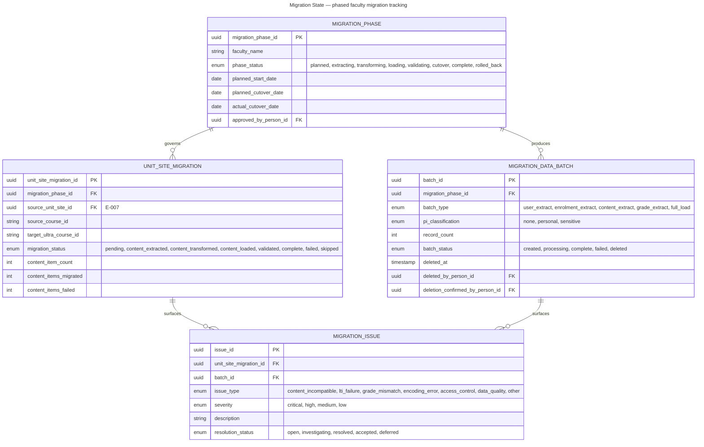
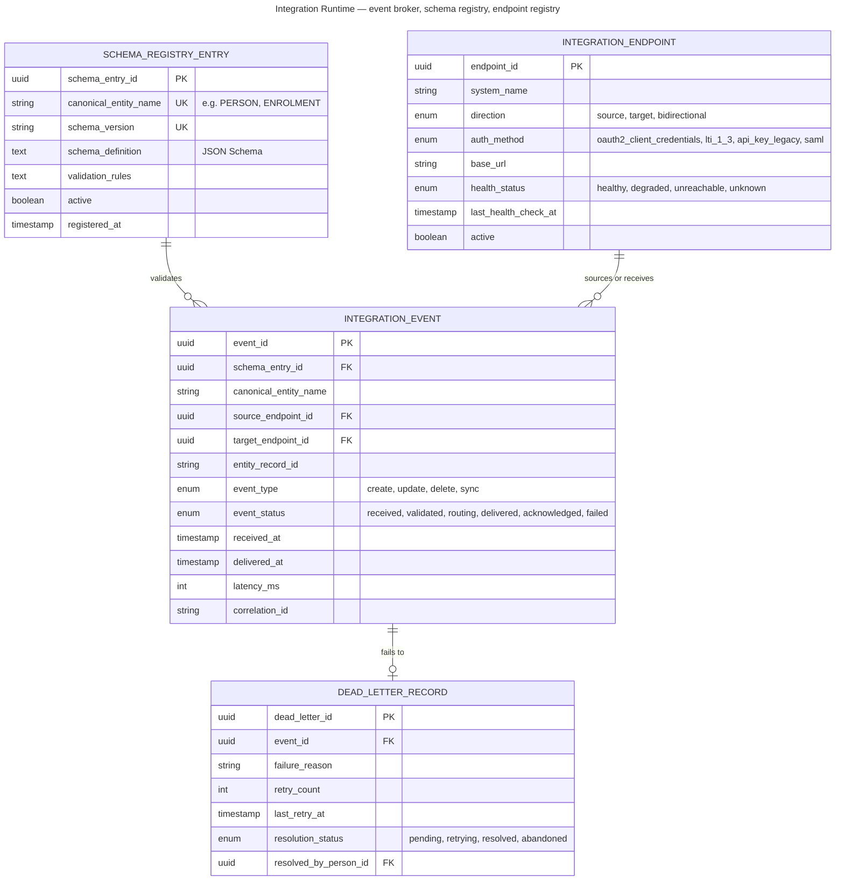
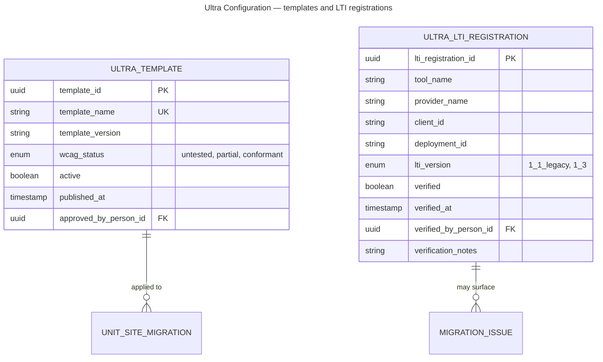
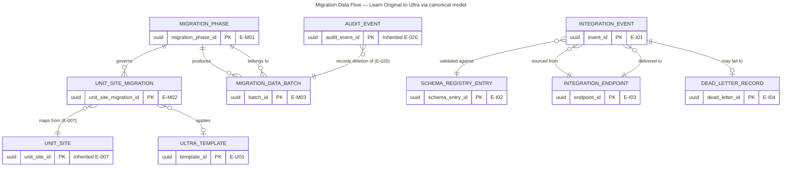

# Data Model: LMS Ultra Migration & Integration Modernisation

> **Template Origin**: Official | **ArcKit Version**: 6.7.4 | **Command**: `/arckit:data-model`

## Document Control

| Field | Value |
|-------|-------|
| **Document ID** | ARC-003-DATA-v1.0 |
| **Document Type** | Data Model — Migration, Integration Runtime, and Ultra Configuration |
| **Project** | LMS Ultra Migration & Integration Modernisation (Project 003) |
| **Classification** | OFFICIAL-SENSITIVE |
| **Status** | DRAFT |
| **Version** | 1.0 |
| **Created Date** | 2026-07-29 |
| **Last Modified** | 2026-07-29 |
| **Review Date** | 2026-08-28 |
| **Owner** | Sam Okafor, Integration Architect (Digital & IT) |
| **Reviewed By** | [PENDING] — Eleanor Frame (Privacy & Records Officer) |
| **Approved By** | [PENDING] — Cassandra Rhodes, Chief Information Officer |
| **Distribution** | Project Team, Digital & IT, Privacy & Records, Steering Committee |

> **Classification rationale**: This document maps migration data flows containing personal and sensitive information, integration credentials and endpoint registrations, and the schema registry that governs how data moves between systems. That combination exposes both the attack surface and the migration's privacy controls. Classified OFFICIAL-SENSITIVE and restricted accordingly.

## Revision History

| Version | Date | Author | Changes | Approved By | Approval Date |
|---------|------|--------|---------|-------------|---------------|
| 1.0 | 2026-07-29 | ArcKit AI | Initial creation from `/arckit:data-model` command | [PENDING] | [PENDING] |

---

## Executive Summary

### Overview

This document defines the data model for the LMS Ultra Migration & Integration Modernisation project. It does **not** redefine the canonical data model — that model is defined in **ARC-001-DATA-v1.0** and contains 20 entities across 4 bounded contexts. This document's job is different:

1. **Implement** the canonical model at runtime — the schema registry, event broker, and integration endpoints that make the 20 canonical entities operational.
2. **Add** migration-specific entities that track the movement of data from Learn Original to Ultra.
3. **Add** Ultra-specific configuration entities for template and LTI management.
4. **Define** data migration flows, transformation rules, and the privacy controls that govern data in transit.

Every entity defined here is either a migration artefact (temporary, deleted post-migration), an integration runtime artefact (permanent, operational), or an Ultra configuration entity. None of them replace or duplicate the canonical model entities — they wrap, route, and govern them.

### Model Statistics

| Metric | Value |
|--------|-------|
| **Inherited entities (from ARC-001-DATA-v1.0)** | 20 |
| **New entities defined in this document** | 10 |
| **New bounded contexts** | 3 (Migration State, Integration Runtime, Ultra Configuration) |
| **Total attributes (new entities only)** | 108 |
| **Attributes flagged as personal information** | 4 |
| **Attributes flagged as sensitive information** | 0 (sensitive data is referenced by ID, never copied into migration entities) |
| **Entities containing personal information directly** | 3 of 10 (E-M03, E-I01, E-I04) |
| **Relationships defined (new entity FKs)** | 18 |
| **Data requirements modelled** | 5 of 5 (DR-001 to DR-005: 100%) |
| **Integration requirements modelled** | 7 of 7 (INT-001 to INT-007: 100%) |

### Compliance Summary

> **Framework adaptation.** As in ARC-001-DATA-v1.0, this document applies the **Privacy Act 1988 (Cth)** and the **13 Australian Privacy Principles**, with the **OAIC** as regulator and the **Notifiable Data Breach scheme** in place of ICO breach notification. The migration introduces a temporary but elevated risk surface: personal information extracted from one platform, transformed, and loaded into another, with intermediate copies existing for up to 30 days post-cutover.

| Item | Status |
|------|--------|
| **Primary regime** | Privacy Act 1988 (Cth); Australian Privacy Principles 1–13 |
| **Regulator** | Office of the Australian Information Commissioner (OAIC) |
| **Breach regime** | Notifiable Data Breach scheme, Privacy Act Part IIIC |
| **Personal information present** | YES — 8 classes inherited from the canonical model; migration entities reference by FK, not by copy |
| **Sensitive information present** | YES — placement records transit the migration; elevated controls in §Data Migration Specification |
| **Cross-border disclosure (APP 8)** | YES — Ultra hosting requires APP 8 assessment (DR-003) |
| **Privacy Impact Assessment** | **REQUIRED** — already triggered by Project 001; migration-specific addendum required for data-in-transit risks |
| **Security classification** | OFFICIAL-SENSITIVE for this document; per-entity classification in the catalog |
| **Not applicable** | UK GDPR, UK DPA 2018, ICO (UK regime); HIPAA (US); PCI-DSS (no payment data in scope) |

### Key Data Governance Stakeholders

| Role | Name | Responsibility |
|------|------|----------------|
| Accountable for privacy positions | Eleanor Frame, Privacy & Records Officer | APP compliance, PIA migration addendum, NDB readiness during migration |
| Accountable for security controls | Tobias Ohm, Cybersecurity Lead | Migration data encryption, access control, Essential Eight posture |
| Accountable overall | Cassandra Rhodes, Chief Information Officer | Data platform accountability, migration risk acceptance |
| Technical custodian | Sam Okafor, Integration Architect | Schema registry, event broker, migration tooling |
| Academic data owner | Dr. Benny Moog, Director Learning Technologies | Ultra template configuration, content migration sign-off |
| Student record authority | Student Administration | Authoritative source for Person, Enrolment (unchanged) |
| Migration coordinator | Rhonda Bell, Project Manager | Faculty migration scheduling, issue triage |
| Placement data owner | Prof. Priya Anand, Dean Health Sciences | Placement data migration controls |

---

## Relationship to ARC-001-DATA-v1.0

### What this document inherits

The canonical data model defined in ARC-001-DATA-v1.0 comprises 20 entities across 4 bounded contexts. This project implements all 20 entities — it does not modify, extend, or contradict any of them. The inherited model is:

| Context | Entities (by reference) | Entity IDs |
|---------|------------------------|------------|
| Canonical Core | PERSON, UNIT, TEACHING_PERIOD, UNIT_OFFERING, ENROLMENT, INSTITUTIONAL_ROLE_ASSIGNMENT | E-001 to E-006 |
| Learning & Assessment | UNIT_SITE, GROUP_ALLOCATION, RECORDING, ASSESSMENT_ITEM, SUBMISSION, GRADE, PORTFOLIO_ARTEFACT | E-007 to E-013 |
| Placement | PLACEMENT_ALLOCATION, PLACEMENT_SUPERVISOR, PLACEMENT_ASSESSMENT | E-014 to E-016 |
| Governance Registers | ENGAGEMENT_EVENT, PLATFORM, PERSONAL_INFORMATION_CLASS, AUDIT_EVENT | E-017 to E-020 |

**These entities are not reproduced here.** Their definitions, attributes, PII flags, retention rules, and compliance notes are authoritative in ARC-001-DATA-v1.0 and should be read alongside this document.

### What this document adds

| Context | Purpose | Entity IDs | Lifecycle |
|---------|---------|------------|-----------|
| Migration State (Context 5) | Track faculty migration phases, per-site migration records, data batches, and issues | E-M01 to E-M04 | **Temporary** — deleted 30 days after final faculty cutover |
| Integration Runtime (Context 6) | Schema registry, event broker telemetry, endpoint registry, dead-letter queue | E-I01 to E-I04 | **Permanent** — operational infrastructure |
| Ultra Configuration (Context 7) | Ultra template versions and LTI 1.3 registrations | E-U01 to E-U02 | **Permanent** — ongoing operational |

### How the canonical model is implemented at runtime

The canonical model lives in the **schema registry** (E-I02). Each of the 6 core entities from DR-001 is registered as a versioned schema definition with validation rules. When an integration event flows through the broker:

1. The source system emits a change (e.g., PeopleSoft enrolment update)
2. The broker receives it as an **INTEGRATION_EVENT** (E-I01)
3. The event payload is validated against the registered schema for its entity type (E-I02)
4. Valid events are routed to target endpoints (E-I03)
5. Failed events land in the dead-letter queue (E-I04)
6. All events are auditable via E-020 AUDIT_EVENT from the canonical model

This is the runtime expression of DR-001 and ADR-001.

---

## Visual Entity-Relationship Diagrams

The new entities are presented as three domain diagrams plus one cross-cutting migration flow. Inherited entities from ARC-001-DATA-v1.0 are shown in relationship diagrams only where they connect to new entities — their internal relationships are documented in the parent model.

### Context 5 — Migration State

Entities that track the phased migration from Learn Original to Ultra. These are temporary by design — deleted 30 days after the final faculty cutover, per DR-004.



### Context 6 — Integration Runtime

Entities that form the permanent integration infrastructure — the schema registry, event broker telemetry, endpoint registry, and dead-letter queue that implement ADR-001.



### Context 7 — Ultra Configuration

Entities governing Ultra template standards and LTI 1.3 tool registrations. Small in volume but critical for migration quality — every unit site must land on a conformant template, and every discipline tool must be verified on LTI 1.3 before faculty cutover.



### Context 8 — Migration Data Flow (Cross-Cutting)

This diagram shows how data moves from Learn Original through the migration process and into Ultra and the integration broker. It connects entities from Contexts 5, 6, and 7 with the inherited canonical entities.



---

## Entity Catalog

This catalog documents the 10 new entities defined by this project. Inherited entities (E-001 to E-020) are documented in ARC-001-DATA-v1.0 and are not repeated here.

---

### Entity E-M01: MIGRATION_PHASE

**Description**: A defined phase of the faculty-by-faculty migration from Learn Original to Ultra. Each faculty or cohort progresses through a sequence of phases — extraction, transformation, loading, validation, and cutover — and this entity tracks that progression.

**Source Requirements**:

- **DR-002**: Data migration scope and minimisation — phases enforce the boundary of what data is extracted
- **DR-004**: Data retention and deletion post-migration — phase completion triggers the 30-day deletion clock
- **DR-005**: Migration data audit trail — phase transitions are audited

**Business Context**: The migration is phased by faculty to limit blast radius and allow learning from early cohorts. Each phase has a planned and actual cutover date, and cutover requires explicit approval from both the academic data owner and the migration coordinator. A phase can be rolled back if validation fails — that rollback must also be recorded.

**Data Ownership**:

- **Business Owner**: Rhonda Bell, Project Manager
- **Technical Owner**: Sam Okafor, Integration Architect
- **Data Steward**: Dr. Benny Moog, Director Learning Technologies

**Data Classification**: INTERNAL

**Volume Estimates**:

- **Initial Volume**: ~8 phases (one per faculty, plus a pilot and a catch-all)
- **Growth Rate**: None — fixed at project start
- **Average Record Size**: 1 KB

**Data Retention**:

- **Active Period**: Duration of the migration project
- **Archive Period**: 12 months post-migration for audit and lessons-learned
- **Deletion Policy**: Hard delete after archive period; no personal information held directly

#### Attributes

| Attribute | Type | Required | PII | Description | Validation Rules | Default | Source Req |
|-----------|------|----------|-----|-------------|------------------|---------|------------|
| migration_phase_id | UUID | Yes | No | Phase identifier | UUID v4 | Auto-generated | DR-002 |
| faculty_name | VARCHAR(100) | Yes | No | Faculty or cohort being migrated | Non-empty | None | DR-002 |
| phase_code | VARCHAR(20) | Yes | No | Short code for the phase | Unique | None | DR-002 |
| phase_status | ENUM | Yes | No | Current phase state | planned, extracting, transforming, loading, validating, cutover, complete, rolled_back | planned | DR-005 |
| planned_start_date | DATE | Yes | No | Planned extraction start | ISO 8601 | None | DR-002 |
| planned_cutover_date | DATE | Yes | No | Planned cutover to Ultra | ISO 8601, after planned_start_date | None | DR-002 |
| actual_start_date | DATE | No | No | Actual extraction start | ISO 8601 | NULL | DR-005 |
| actual_cutover_date | DATE | No | No | Actual cutover date | ISO 8601 | NULL | DR-005 |
| approved_by_person_id | UUID | No | No | Person who approved cutover | FK to E-001, nullable until cutover | NULL | DR-005 |
| rollback_reason | TEXT | No | No | Reason for rollback if rolled_back | Required when status is rolled_back | NULL | DR-005 |
| unit_site_count | INTEGER | Yes | No | Number of unit sites in scope | Positive integer | 0 | DR-002 |
| created_at | TIMESTAMP | Yes | No | Record creation time | ISO 8601 | NOW() | DR-005 |
| updated_at | TIMESTAMP | Yes | No | Last update time | ISO 8601 | NOW() | DR-005 |

**Attribute Notes**:

- No PII — this entity records organisational migration activity, not individual data
- `approved_by_person_id` is a reference to Person (E-001) but is not PII itself — it records who approved, not personal information about them
- `rollback_reason` is mandatory when `phase_status` is `rolled_back` — a rollback without a recorded reason is an ungoverned rollback

#### Relationships

**Outgoing**: to E-001 Person (many-to-one, optional, via `approved_by_person_id`)

**Incoming**:

- E-M02 UNIT_SITE_MIGRATION → E-M01 (many-to-one): each unit site migration belongs to a phase
- E-M03 MIGRATION_DATA_BATCH → E-M01 (many-to-one): each data batch belongs to a phase

#### Indexes

- **Primary key**: `pk_migration_phase` on `migration_phase_id`
- **Unique**: `uk_migration_phase_code` on `phase_code`
- **Performance**: `idx_migration_phase_status` (dashboard queries); `idx_migration_phase_cutover_date` (schedule views)

#### Privacy & Compliance

- **Contains personal information**: NO
- **Classification**: INTERNAL
- **Access logging**: not required
- **Change logging**: required — phase transitions must be traceable

---

### Entity E-M02: UNIT_SITE_MIGRATION

**Description**: A record tracking the migration of a single unit site from Learn Original to Ultra — its source, target, content item counts, and migration outcome.

**Source Requirements**:

- **DR-002**: Data migration scope — each unit site's content scope is recorded
- **DR-005**: Migration audit trail — per-site outcome and any failures

**Business Context**: This is the workhorse entity of the migration. Every unit site in scope has a migration record that tracks extraction, transformation, and loading of content items. Content items that fail migration (e.g., content types not supported in Ultra, broken LTI links) are counted and linked to MIGRATION_ISSUE records. Academic staff need visibility into their own unit site migration status — this entity provides it.

**Data Ownership**:

- **Business Owner**: Dr. Benny Moog
- **Technical Owner**: Sam Okafor
- **Data Steward**: Dr. Benny Moog

**Data Classification**: INTERNAL

**Volume Estimates**:

- **Initial Volume**: ~5,000 unit sites across all faculties
- **Growth Rate**: None — fixed by migration scope
- **Peak Volume**: ~5,000
- **Average Record Size**: 2 KB

**Data Retention**:

- **Active Period**: Duration of migration
- **Archive Period**: 12 months post-migration for audit
- **Deletion Policy**: Hard delete after archive period

#### Attributes

| Attribute | Type | Required | PII | Description | Validation Rules | Default | Source Req |
|-----------|------|----------|-----|-------------|------------------|---------|------------|
| unit_site_migration_id | UUID | Yes | No | Migration record identifier | UUID v4 | Auto-generated | DR-002 |
| migration_phase_id | UUID | Yes | No | Parent migration phase | FK to E-M01 | None | DR-002 |
| source_unit_site_id | UUID | Yes | No | Learn Original unit site | FK to E-007 | None | DR-002 |
| source_course_id | VARCHAR(50) | Yes | No | Learn Original course identifier | Non-empty | None | DR-002 |
| target_ultra_course_id | VARCHAR(50) | No | No | Ultra course identifier | Populated after loading | NULL | DR-002 |
| template_id | UUID | No | No | Ultra template applied | FK to E-U01, nullable | NULL | DR-002 |
| migration_status | ENUM | Yes | No | Current migration state | pending, content_extracted, content_transformed, content_loaded, validated, complete, failed, skipped | pending | DR-005 |
| content_item_count | INTEGER | Yes | No | Total content items in source | Non-negative | 0 | DR-002 |
| content_items_migrated | INTEGER | Yes | No | Items successfully migrated | Non-negative | 0 | DR-005 |
| content_items_failed | INTEGER | Yes | No | Items that failed migration | Non-negative | 0 | DR-005 |
| skip_reason | TEXT | No | No | Reason for skipping if skipped | Required when status is skipped | NULL | DR-005 |
| extracted_at | TIMESTAMP | No | No | When content extraction completed | ISO 8601 | NULL | DR-005 |
| loaded_at | TIMESTAMP | No | No | When content loading completed | ISO 8601 | NULL | DR-005 |
| validated_at | TIMESTAMP | No | No | When validation passed | ISO 8601 | NULL | DR-005 |
| validated_by_person_id | UUID | No | No | Person who validated the migration | FK to E-001 | NULL | DR-005 |

**Attribute Notes**:

- No PII — unit site metadata, not student data
- `content_item_count - content_items_migrated - content_items_failed` must equal zero for the migration to be considered complete — anything left over requires a MIGRATION_ISSUE
- `validated_by_person_id` records who confirmed the migrated site is fit for purpose — typically the unit coordinator or delegate

#### Relationships

**Outgoing**: to E-M01 MIGRATION_PHASE (many-to-one); to E-007 UNIT_SITE (many-to-one); to E-U01 ULTRA_TEMPLATE (many-to-one, optional); to E-001 PERSON (many-to-one, optional, via validated_by)

**Incoming**: E-M04 MIGRATION_ISSUE → E-M02 (many-to-one)

#### Indexes

- **Primary key**: `pk_unit_site_migration` on `unit_site_migration_id`
- **Foreign keys**: `fk_usm_phase`; `fk_usm_source_unit_site`; `fk_usm_template`
- **Unique**: `uk_usm_source_site` on `source_unit_site_id` — each unit site is migrated once
- **Performance**: `idx_usm_phase_status` on `(migration_phase_id, migration_status)` (dashboard)

#### Privacy & Compliance

- **Contains personal information**: NO
- **Classification**: INTERNAL
- **Change logging**: required for status transitions

---

### Entity E-M03: MIGRATION_DATA_BATCH

**Description**: A bulk data extraction or import batch produced during migration — user records, enrolment snapshots, grade extracts. Each batch carries a PI classification, a record count, and mandatory deletion tracking.

**Source Requirements**:

- **DR-002**: Data migration scope and minimisation — only data required for Ultra operation
- **DR-003**: PI classification for migration — every batch is classified
- **DR-004**: Data retention and deletion post-migration — maker-checker deletion within 30 days
- **DR-005**: Migration audit trail — batch creation, processing, and deletion are audited

**Business Context**: This is where migration privacy risk concentrates. A batch may contain personal information (user records, enrolment data) or even reference sensitive information (placement data). Every batch is classified at creation. Deletion after cutover follows a maker-checker protocol: one person initiates deletion, a different person confirms it. Both are recorded. The 30-day clock starts at the faculty's cutover date, not at the batch creation date.

**Data Ownership**:

- **Business Owner**: Rhonda Bell, Project Manager
- **Technical Owner**: Sam Okafor, Integration Architect
- **Data Steward**: Eleanor Frame, Privacy & Records Officer

**Data Classification**: CONFIDENTIAL (when batch contains personal information); RESTRICTED (when batch references sensitive information)

**Volume Estimates**:

- **Initial Volume**: ~200 batches across the migration (roughly 25 per faculty)
- **Growth Rate**: None post-migration
- **Average Record Size**: 3 KB (metadata only — the batch itself is stored separately)

**Data Retention**:

- **Active Period**: Until 30 days post-faculty-cutover
- **Deletion Policy**: **Mandatory deletion within 30 days of faculty cutover.** Maker-checker protocol. Deletion recorded in E-020 AUDIT_EVENT. No exceptions without written approval from Eleanor Frame.

#### Attributes

| Attribute | Type | Required | PII | Description | Validation Rules | Default | Source Req |
|-----------|------|----------|-----|-------------|------------------|---------|------------|
| batch_id | UUID | Yes | No | Batch identifier | UUID v4 | Auto-generated | DR-002 |
| migration_phase_id | UUID | Yes | No | Parent migration phase | FK to E-M01 | None | DR-002 |
| batch_type | ENUM | Yes | No | Type of data in the batch | user_extract, enrolment_extract, content_extract, grade_extract, role_extract, placement_reference, full_load | None | DR-002 |
| pi_classification | ENUM | Yes | No | Highest PI class in the batch | none, personal, sensitive | none | DR-003 |
| record_count | INTEGER | Yes | No | Number of records in the batch | Non-negative | 0 | DR-005 |
| source_system | VARCHAR(50) | Yes | No | System the batch was extracted from | Non-empty | None | DR-005 |
| target_system | VARCHAR(50) | Yes | No | System the batch is loaded into | Non-empty | None | DR-005 |
| storage_location | VARCHAR(500) | Yes | Yes | Where the batch file is stored | Encrypted storage reference | None | DR-003 |
| encryption_applied | BOOLEAN | Yes | No | Whether the batch is encrypted at rest | true/false | true | DR-003 |
| batch_status | ENUM | Yes | No | Batch lifecycle state | created, processing, complete, failed, deletion_initiated, deleted | created | DR-004 |
| created_at | TIMESTAMP | Yes | No | When the batch was created | ISO 8601 | NOW() | DR-005 |
| created_by_person_id | UUID | Yes | Yes | Person who created the batch | FK to E-001 | None | DR-005 |
| completed_at | TIMESTAMP | No | No | When processing completed | ISO 8601 | NULL | DR-005 |
| deletion_due_date | DATE | No | No | Date by which batch must be deleted | Derived: faculty cutover + 30 days | NULL | DR-004 |
| deleted_at | TIMESTAMP | No | No | When deletion was executed | ISO 8601 | NULL | DR-004 |
| deleted_by_person_id | UUID | No | Yes | Person who initiated deletion (maker) | FK to E-001 | NULL | DR-004 |
| deletion_confirmed_by_person_id | UUID | No | Yes | Person who confirmed deletion (checker) | FK to E-001, must differ from deleted_by | NULL | DR-004 |
| deletion_audit_event_id | UUID | No | No | Reference to the AUDIT_EVENT recording deletion | FK to E-020 | NULL | DR-005 |

**Attribute Notes**:

- **PII attributes**: `storage_location` (reveals where PI is stored), `created_by_person_id`, `deleted_by_person_id`, `deletion_confirmed_by_person_id`
- **Maker-checker constraint**: `deleted_by_person_id` and `deletion_confirmed_by_person_id` must be different individuals — a check constraint enforces this
- **Sensitive batch handling**: batches with `pi_classification = 'sensitive'` must be `placement_reference` type and carry additional access restriction (see Privacy & Compliance)
- `storage_location` points to encrypted, access-controlled storage — never a shared drive, never email, never unencrypted at rest

#### Relationships

**Outgoing**: to E-M01 MIGRATION_PHASE (many-to-one); to E-001 PERSON (many-to-one, three times: created_by, deleted_by, deletion_confirmed_by); to E-020 AUDIT_EVENT (many-to-one, optional)

**Incoming**: E-M04 MIGRATION_ISSUE → E-M03 (many-to-one)

#### Indexes

- **Primary key**: `pk_migration_data_batch` on `batch_id`
- **Foreign keys**: `fk_mdb_phase`; `fk_mdb_created_by`; `fk_mdb_deleted_by`; `fk_mdb_deletion_confirmed_by`
- **Check constraint**: `ck_mdb_maker_checker` — `deleted_by_person_id != deletion_confirmed_by_person_id` when both are populated
- **Performance**: `idx_mdb_phase_status` on `(migration_phase_id, batch_status)`; `idx_mdb_deletion_due_date` on `deletion_due_date` (overdue deletion sweep)

#### Privacy & Compliance

- **Contains personal information**: YES — by reference (storage_location points to PI-containing files) and by linkage (created_by and deleted_by are person references)
- **APP 11 security**: batch files must be encrypted at rest (`encryption_applied` enforced as true); access restricted to named migration operators; no email transfer; no shared drive storage
- **APP 11.2 destruction**: enforced by `deletion_due_date` with automated alerting when overdue
- **Sensitive batch handling**: batches classified `sensitive` require field-level access control and dual-person access (one to extract, one to verify) — placement data must never be extracted into a batch accessible to anyone outside the placement data owner and the migration operator
- **NDB relevance**: a batch containing personal information that is lost, accessed without authorisation, or disclosed constitutes a suspected eligible data breach. The 30-day assessment clock starts immediately.
- **Breach impact**: MEDIUM to HIGH depending on PI classification
- **Access logging**: **required** — who accessed which batch, when
- **Change logging**: **required with prior value** — status transitions are audited

---

### Entity E-M04: MIGRATION_ISSUE

**Description**: An issue discovered during migration — content type incompatibility, LTI link failure, grade mismatch, data quality defect, or access control problem.

**Source Requirements**:

- **DR-005**: Migration audit trail — issues are part of the migration record
- **DR-002**: Data migration scope — issues may result in scope decisions (skip, defer, accept)

**Business Context**: Not every piece of content will migrate cleanly from Learn Original to Ultra. Content types that Ultra does not support, LTI links that require re-registration, and assessment items with structure that does not map directly are all expected. This entity ensures that every such issue is recorded, triaged, and resolved (or explicitly accepted) — no issue is silently dropped.

**Data Ownership**:

- **Business Owner**: Dr. Benny Moog
- **Technical Owner**: Sam Okafor
- **Data Steward**: Dr. Benny Moog

**Data Classification**: INTERNAL

**Volume Estimates**:

- **Initial Volume**: ~500–2,000 issues across the migration (estimate based on comparable migrations)
- **Growth Rate**: Concentrated during extraction and loading phases
- **Average Record Size**: 2 KB

**Data Retention**:

- **Active Period**: Duration of migration
- **Archive Period**: 12 months post-migration for lessons learned
- **Deletion Policy**: Hard delete after archive period

#### Attributes

| Attribute | Type | Required | PII | Description | Validation Rules | Default | Source Req |
|-----------|------|----------|-----|-------------|------------------|---------|------------|
| issue_id | UUID | Yes | No | Issue identifier | UUID v4 | Auto-generated | DR-005 |
| unit_site_migration_id | UUID | No | No | Related unit site migration | FK to E-M02, nullable | NULL | DR-005 |
| batch_id | UUID | No | No | Related data batch | FK to E-M03, nullable | NULL | DR-005 |
| issue_type | ENUM | Yes | No | Category of issue | content_incompatible, lti_failure, grade_mismatch, encoding_error, access_control, data_quality, template_nonconformance, other | None | DR-005 |
| severity | ENUM | Yes | No | Impact severity | critical, high, medium, low | medium | DR-005 |
| title | VARCHAR(200) | Yes | No | Short description | Non-empty | None | DR-005 |
| description | TEXT | Yes | No | Detailed description | Non-empty | None | DR-005 |
| affected_content_type | VARCHAR(100) | No | No | Type of content affected | Nullable | NULL | DR-005 |
| resolution_status | ENUM | Yes | No | Resolution state | open, investigating, resolved, accepted, deferred | open | DR-005 |
| resolution_notes | TEXT | No | No | How the issue was resolved or why it was accepted | Required when resolved or accepted | NULL | DR-005 |
| resolved_by_person_id | UUID | No | No | Person who resolved the issue | FK to E-001 | NULL | DR-005 |
| created_at | TIMESTAMP | Yes | No | When the issue was raised | ISO 8601 | NOW() | DR-005 |
| resolved_at | TIMESTAMP | No | No | When the issue was resolved | ISO 8601 | NULL | DR-005 |

**Attribute Notes**:

- At least one of `unit_site_migration_id` or `batch_id` should be populated — an issue must be traceable to either a specific unit site migration or a data batch. A check constraint enforces this.
- `resolution_notes` is mandatory when `resolution_status` is `resolved` or `accepted` — accepting an issue without documenting why is not governed acceptance

#### Relationships

**Outgoing**: to E-M02 UNIT_SITE_MIGRATION (many-to-one, optional); to E-M03 MIGRATION_DATA_BATCH (many-to-one, optional); to E-001 PERSON (many-to-one, optional, via resolved_by)

**Incoming**: none

#### Indexes

- **Primary key**: `pk_migration_issue` on `issue_id`
- **Foreign keys**: `fk_mi_unit_site_migration`; `fk_mi_batch`
- **Check constraint**: `ck_mi_traceable` — at least one of `unit_site_migration_id` or `batch_id` must be non-null
- **Performance**: `idx_mi_severity_status` on `(severity, resolution_status)` (triage dashboard); `idx_mi_type` (pattern analysis)

#### Privacy & Compliance

- **Contains personal information**: NO — issues describe content and process defects, not individual data
- **Classification**: INTERNAL
- **Access logging**: not required
- **Change logging**: required for resolution status transitions

---

### Entity E-I01: INTEGRATION_EVENT

**Description**: A single event flowing through the integration broker — a change to a canonical entity published by a source system and delivered to one or more target systems.

**Source Requirements**:

- **DR-001**: Canonical data model implementation — events carry canonical entity payloads
- **INT-001 to INT-007**: Each integration produces and consumes events
- **DR-005**: Audit trail — event lifecycle is traceable

**Business Context**: This is the unit of work for the integration broker. When PeopleSoft creates an enrolment, an event is published containing the canonical ENROLMENT payload. The broker validates it against the schema registry, routes it to Ultra (and any other registered consumers), and records the outcome. Every event has a correlation_id that links it to E-020 AUDIT_EVENT — end-to-end traceability from source change to target receipt.

The < 15 minute latency SLA from NFR-P-001 is measured here: `delivered_at - received_at` must fall within the SLA for 95% of events.

**Data Ownership**:

- **Business Owner**: Cassandra Rhodes, CIO
- **Technical Owner**: Sam Okafor, Integration Architect
- **Data Steward**: Sam Okafor

**Data Classification**: CONFIDENTIAL (event payloads may contain PII-linked data such as person_id)

**Volume Estimates**:

- **Initial Volume**: ~500 events per day (user and enrolment lifecycle)
- **Growth Rate**: Increases as integrations go live; steady state ~2,000 events per day
- **Peak Volume**: ~10,000 events during admission cycles
- **Average Record Size**: 5 KB (metadata + payload reference)

**Data Retention**:

- **Active Period**: 90 days online for operational diagnosis
- **Archive Period**: 12 months for capacity planning and pattern analysis
- **Deletion Policy**: Automated expiry; de-identify person references at archive

#### Attributes

| Attribute | Type | Required | PII | Description | Validation Rules | Default | Source Req |
|-----------|------|----------|-----|-------------|------------------|---------|------------|
| event_id | UUID | Yes | No | Event identifier | UUID v4 | Auto-generated | DR-001 |
| schema_entry_id | UUID | Yes | No | Schema the event was validated against | FK to E-I02 | None | DR-001 |
| canonical_entity_name | VARCHAR(50) | Yes | No | Entity type (e.g., PERSON, ENROLMENT) | Must match registered schema | None | DR-001 |
| source_endpoint_id | UUID | Yes | No | Source system endpoint | FK to E-I03 | None | DR-001 |
| target_endpoint_id | UUID | Yes | No | Target system endpoint | FK to E-I03 | None | DR-001 |
| entity_record_id | VARCHAR(100) | Yes | Yes | Identifier of the affected record | Non-empty; may contain institutional_id | None | DR-001 |
| event_type | ENUM | Yes | No | Nature of the change | create, update, delete, sync | None | DR-001 |
| event_status | ENUM | Yes | No | Processing state | received, validated, routing, delivered, acknowledged, failed | received | DR-001 |
| payload_reference | VARCHAR(500) | Yes | No | Reference to the full event payload | Non-empty | None | DR-001 |
| received_at | TIMESTAMP | Yes | No | When received by the broker | ISO 8601 | NOW() | DR-001 |
| validated_at | TIMESTAMP | No | No | When schema validation completed | ISO 8601 | NULL | DR-001 |
| delivered_at | TIMESTAMP | No | No | When delivered to target | ISO 8601 | NULL | DR-001 |
| acknowledged_at | TIMESTAMP | No | No | When target acknowledged receipt | ISO 8601 | NULL | DR-001 |
| latency_ms | INTEGER | No | No | End-to-end latency in milliseconds | Non-negative | NULL | DR-001 |
| correlation_id | VARCHAR(100) | Yes | No | Links to source change and audit events | Non-empty | None | DR-005 |
| retry_count | INTEGER | Yes | No | Number of delivery attempts | Non-negative | 0 | DR-001 |

**Attribute Notes**:

- **PII attribute**: `entity_record_id` may contain an institutional student or staff number, making it PII by linkage
- `payload_reference` points to the payload store — the event metadata and the payload are separated so that PII in payloads can be managed independently
- `latency_ms` is computed as `delivered_at - received_at` and is the metric for NFR-P-001 compliance
- `correlation_id` links this event to E-020 AUDIT_EVENT, enabling end-to-end traceability across systems

#### Relationships

**Outgoing**: to E-I02 SCHEMA_REGISTRY_ENTRY (many-to-one); to E-I03 INTEGRATION_ENDPOINT (many-to-one, twice: source and target)

**Incoming**: E-I04 DEAD_LETTER_RECORD → E-I01 (one-to-zero-or-one)

#### Indexes

- **Primary key**: `pk_integration_event` on `event_id`
- **Foreign keys**: `fk_ie_schema`; `fk_ie_source_endpoint`; `fk_ie_target_endpoint`
- **Performance**: `idx_ie_entity_status` on `(canonical_entity_name, event_status)` (operational dashboard); `idx_ie_received_at` (time-series queries); `idx_ie_correlation_id` (end-to-end trace lookup)
- **Partitioning**: by `received_at` month — required at projected volume

#### Privacy & Compliance

- **Contains personal information**: YES — `entity_record_id` may be PII; payloads referenced by `payload_reference` contain canonical entity data which includes PII for Person, Enrolment, etc.
- **APP 11 security**: payload store must be encrypted at rest; access restricted to integration operators
- **Breach impact**: MEDIUM — exposure of event metadata reveals who changed what and when, plus the record identifier
- **Access logging**: required for payload access
- **Change logging**: event records are append-only; status transitions recorded as new entries, not updates

---

### Entity E-I02: SCHEMA_REGISTRY_ENTRY

**Description**: A registered canonical schema — the JSON Schema definition for a canonical entity at a specific version, with its validation rules.

**Source Requirements**:

- **DR-001**: Canonical data model implementation — the schema registry is where the canonical model becomes enforceable at runtime

**Business Context**: The schema registry is the single point of truth for what a valid PERSON event, ENROLMENT event, or UNIT_OFFERING event looks like. Integration events are validated against the registered schema before routing. Schema evolution follows a backward-compatible pattern: new versions must accept payloads conforming to the previous version.

This is the runtime implementation of the canonical model defined in ARC-001-DATA-v1.0. The 6 core entities from DR-001 (PERSON, UNIT, TEACHING_PERIOD, UNIT_OFFERING, ENROLMENT, INSTITUTIONAL_ROLE_ASSIGNMENT) are registered at project go-live. Additional entities are registered as integrations come online.

**Data Ownership**:

- **Business Owner**: Sam Okafor, Integration Architect
- **Technical Owner**: Sam Okafor
- **Data Steward**: Sam Okafor

**Data Classification**: INTERNAL

**Volume Estimates**:

- **Initial Volume**: 6 schemas (DR-001 core entities), growing to ~15 as all integrations are implemented
- **Growth Rate**: ~2–3 per quarter during integration rollout
- **Average Record Size**: 10 KB (schema definitions can be verbose)

**Data Retention**:

- **Active Period**: Indefinite — schemas are the integration contract
- **Archive Period**: Superseded versions retained indefinitely for backward-compatibility verification
- **Deletion Policy**: Never deleted; old versions marked inactive

#### Attributes

| Attribute | Type | Required | PII | Description | Validation Rules | Default | Source Req |
|-----------|------|----------|-----|-------------|------------------|---------|------------|
| schema_entry_id | UUID | Yes | No | Schema entry identifier | UUID v4 | Auto-generated | DR-001 |
| canonical_entity_name | VARCHAR(50) | Yes | No | Entity this schema defines | Non-empty; from canonical model | None | DR-001 |
| schema_version | VARCHAR(20) | Yes | No | Semantic version | Semantic versioning (major.minor.patch) | None | DR-001 |
| schema_definition | TEXT | Yes | No | JSON Schema document | Valid JSON Schema draft 2020-12 | None | DR-001 |
| validation_rules | TEXT | No | No | Additional business validation rules beyond schema | Nullable | NULL | DR-001 |
| backward_compatible | BOOLEAN | Yes | No | Whether this version accepts prior-version payloads | true/false | true | DR-001 |
| active | BOOLEAN | Yes | No | Whether this is the current active version | true/false | true | DR-001 |
| registered_at | TIMESTAMP | Yes | No | When registered | ISO 8601 | NOW() | DR-001 |
| registered_by_person_id | UUID | Yes | No | Person who registered the schema | FK to E-001 | None | DR-001 |
| superseded_at | TIMESTAMP | No | No | When superseded by a newer version | ISO 8601 | NULL | DR-001 |
| change_notes | TEXT | No | No | What changed in this version | Nullable | NULL | DR-001 |

**Attribute Notes**:

- **Unique constraint**: `(canonical_entity_name, schema_version)` — each entity can have only one schema at each version
- **Active constraint**: only one version per entity may be `active = true` at any time — enforced by a partial unique index
- `backward_compatible` is mandatory and defaults to true. A non-backward-compatible change (major version bump) requires explicit acknowledgement and is flagged in the change notes

#### Relationships

**Outgoing**: to E-001 PERSON (many-to-one, via registered_by)

**Incoming**: E-I01 INTEGRATION_EVENT → E-I02 (many-to-one)

#### Indexes

- **Primary key**: `pk_schema_registry_entry` on `schema_entry_id`
- **Unique**: `uk_sre_entity_version` on `(canonical_entity_name, schema_version)`
- **Partial unique**: `uk_sre_active_entity` on `canonical_entity_name` where `active = true`
- **Performance**: `idx_sre_entity_active` on `(canonical_entity_name, active)` (lookup at validation time)

#### Privacy & Compliance

- **Contains personal information**: NO — schema definitions are structural metadata
- **Classification**: INTERNAL
- **Access logging**: not required
- **Change logging**: required — schema evolution must be traceable

---

### Entity E-I03: INTEGRATION_ENDPOINT

**Description**: A registered integration endpoint — a system that publishes events to or consumes events from the integration broker.

**Source Requirements**:

- **DR-001**: Canonical data model implementation — endpoints are the systems that speak the canonical language
- **INT-001 to INT-007**: Each integration has at least one source and one target endpoint

**Business Context**: The endpoint registry tells the broker what systems exist, how to authenticate to them, and whether they are healthy. It replaces the tribal knowledge of "Sam knows how to connect to PeopleSoft" with governed, auditable configuration. Health checks run automatically; a degraded or unreachable endpoint triggers alerting before events start failing.

**Data Ownership**:

- **Business Owner**: Cassandra Rhodes, CIO
- **Technical Owner**: Sam Okafor, Integration Architect
- **Data Steward**: Tobias Ohm, Cybersecurity Lead (authentication credentials)

**Data Classification**: OFFICIAL-SENSITIVE (contains authentication method details and endpoint URLs)

**Volume Estimates**:

- **Initial Volume**: ~15 endpoints (7 integrations, some with separate source and target)
- **Growth Rate**: ~2–3 per year as new integrations are added
- **Average Record Size**: 2 KB

**Data Retention**:

- **Active Period**: Indefinite while the endpoint is operational
- **Deletion Policy**: Soft delete (set `active = false`); hard delete only after 12 months inactive and no referencing events

#### Attributes

| Attribute | Type | Required | PII | Description | Validation Rules | Default | Source Req |
|-----------|------|----------|-----|-------------|------------------|---------|------------|
| endpoint_id | UUID | Yes | No | Endpoint identifier | UUID v4 | Auto-generated | DR-001 |
| system_name | VARCHAR(100) | Yes | No | System name (e.g., PeopleSoft, Blackboard Ultra, Echo360) | Non-empty | None | DR-001 |
| integration_code | VARCHAR(20) | Yes | No | Integration identifier (e.g., INT-001) | Non-empty | None | DR-001 |
| direction | ENUM | Yes | No | Data flow direction | source, target, bidirectional | None | DR-001 |
| auth_method | ENUM | Yes | No | Authentication mechanism | oauth2_client_credentials, lti_1_3, api_key_legacy, saml, basic_auth_legacy | None | INT-001 |
| base_url | VARCHAR(500) | Yes | No | Endpoint URL | Valid URL | None | DR-001 |
| health_status | ENUM | Yes | No | Current health state | healthy, degraded, unreachable, unknown | unknown | DR-001 |
| last_health_check_at | TIMESTAMP | No | No | When last health check completed | ISO 8601 | NULL | DR-001 |
| health_check_interval_minutes | INTEGER | Yes | No | How often to check health | Positive integer | 5 | DR-001 |
| active | BOOLEAN | Yes | No | Whether the endpoint is in use | true/false | true | DR-001 |
| credential_vault_reference | VARCHAR(200) | No | No | Reference to credentials in secrets vault | Nullable | NULL | INT-001 |
| registered_at | TIMESTAMP | Yes | No | When registered | ISO 8601 | NOW() | DR-001 |
| deactivated_at | TIMESTAMP | No | No | When deactivated | ISO 8601 | NULL | DR-001 |

**Attribute Notes**:

- `credential_vault_reference` points to the secrets vault — credentials are **never** stored in this entity or in any database. The reference is opaque to anyone without vault access.
- `auth_method` values ending in `_legacy` indicate methods requiring remediation — `basic_auth_legacy` and `api_key_legacy` are transitional and must be migrated to OAuth 2.0 or LTI 1.3 per NFR-SEC-004
- `health_status` is updated automatically by the broker's health-check loop. `degraded` means partial connectivity (e.g., high latency); `unreachable` means the endpoint is down.

#### Relationships

**Outgoing**: none

**Incoming**: E-I01 INTEGRATION_EVENT → E-I03 (many-to-one, twice: source and target)

#### Indexes

- **Primary key**: `pk_integration_endpoint` on `endpoint_id`
- **Performance**: `idx_ie_system_direction` on `(system_name, direction)`; `idx_ie_health_status` (alerting on degraded/unreachable); `idx_ie_auth_method` (legacy auth remediation tracking)

#### Privacy & Compliance

- **Contains personal information**: NO
- **Classification**: OFFICIAL-SENSITIVE — endpoint URLs and authentication method details reveal the integration attack surface
- **Access**: restricted to integration operators and cybersecurity team
- **Change logging**: **required** — endpoint registration and deactivation are security-relevant events

---

### Entity E-I04: DEAD_LETTER_RECORD

**Description**: A failed integration event that could not be delivered to its target and requires investigation. The dead-letter queue ensures that no event is silently discarded — every failure is visible, diagnosable, and either retried or explicitly abandoned.

**Source Requirements**:

- **DR-001**: Canonical data model implementation — the dead-letter queue is essential to the broker's reliability guarantee
- **DR-005**: Audit trail — failed events and their resolution are part of the integration audit

**Business Context**: Under the current nightly batch, failed records vanish without trace. The dead-letter queue is the structural response to that defect. A failed ENROLMENT event (a student who cannot access their unit) sits in the queue until a human investigates, fixes the root cause, and either retries or explicitly abandons it with a recorded reason. Abandoned records trigger an AUDIT_EVENT.

**Data Ownership**:

- **Business Owner**: Sam Okafor, Integration Architect
- **Technical Owner**: Sam Okafor
- **Data Steward**: Sam Okafor

**Data Classification**: CONFIDENTIAL (may reference records containing PII)

**Volume Estimates**:

- **Initial Volume**: Target < 1% of total events (~20 per day at steady state)
- **Growth Rate**: Should decrease as integrations stabilise
- **Average Record Size**: 3 KB

**Data Retention**:

- **Active Period**: Until resolved or abandoned
- **Archive Period**: 90 days post-resolution for pattern analysis
- **Deletion Policy**: Hard delete after archive period; de-identify any person references

#### Attributes

| Attribute | Type | Required | PII | Description | Validation Rules | Default | Source Req |
|-----------|------|----------|-----|-------------|------------------|---------|------------|
| dead_letter_id | UUID | Yes | No | Dead-letter record identifier | UUID v4 | Auto-generated | DR-001 |
| event_id | UUID | Yes | No | Failed integration event | FK to E-I01 | None | DR-001 |
| failure_reason | TEXT | Yes | No | Why the event failed | Non-empty | None | DR-001 |
| failure_category | ENUM | Yes | No | Failure classification | schema_validation, authentication, timeout, target_rejected, payload_error, unknown | unknown | DR-001 |
| retry_count | INTEGER | Yes | No | Number of retry attempts | Non-negative | 0 | DR-001 |
| max_retries | INTEGER | Yes | No | Maximum retries before escalation | Positive integer | 3 | DR-001 |
| last_retry_at | TIMESTAMP | No | No | When last retry was attempted | ISO 8601 | NULL | DR-001 |
| resolution_status | ENUM | Yes | No | Resolution state | pending, retrying, resolved, abandoned | pending | DR-005 |
| resolution_notes | TEXT | No | No | How the issue was resolved or why abandoned | Required when resolved or abandoned | NULL | DR-005 |
| resolved_by_person_id | UUID | No | Yes | Person who resolved or abandoned | FK to E-001 | NULL | DR-005 |
| resolved_at | TIMESTAMP | No | No | When resolved or abandoned | ISO 8601 | NULL | DR-005 |
| created_at | TIMESTAMP | Yes | No | When the dead-letter record was created | ISO 8601 | NOW() | DR-001 |
| escalated | BOOLEAN | Yes | No | Whether the record has been escalated | true/false | false | DR-001 |

**Attribute Notes**:

- **PII**: `resolved_by_person_id` is a person reference but not PII about the resolved-by person — it is an audit attribution
- `resolution_notes` is mandatory when `resolution_status` is `resolved` or `abandoned` — the same principle as MIGRATION_ISSUE: every resolution must be documented
- `escalated` is set to true when `retry_count` reaches `max_retries` without success — this triggers alerting to the integration architect

#### Relationships

**Outgoing**: to E-I01 INTEGRATION_EVENT (one-to-one); to E-001 PERSON (many-to-one, optional, via resolved_by)

**Incoming**: none

#### Indexes

- **Primary key**: `pk_dead_letter_record` on `dead_letter_id`
- **Foreign key**: `fk_dlr_event` on `event_id`
- **Unique**: `uk_dlr_event` on `event_id` — one dead-letter record per event
- **Performance**: `idx_dlr_status` on `resolution_status` (pending queue depth); `idx_dlr_escalated` (escalation dashboard); `idx_dlr_created_at` (age tracking)

#### Privacy & Compliance

- **Contains personal information**: YES — by reference through the linked event, which may carry PII in its payload
- **Breach impact**: MEDIUM — failed events may reveal the identity and nature of a change (e.g., "this student's enrolment failed to propagate")
- **Access logging**: required
- **Change logging**: required for resolution status transitions

---

### Entity E-U01: ULTRA_TEMPLATE

**Description**: A baseline Ultra unit site template — the structural starting point for all unit sites migrated to or created in Ultra.

**Source Requirements**:

- **FR-001** (ARC-003-REQ): Ultra templates must enforce consistent navigation structure
- **NFR-U-001**: Template conformance measurable via E-007 UNIT_SITE
- **NFR-U-002**: WCAG 2.2 AA conformance

**Business Context**: Templates are the mechanism by which consistency becomes the path of least resistance. A coordinator who uses the template gets a conformant unit site by default; variation is permitted but recorded (via E-007 `variation_justification`). During migration, every unit site lands on a template. Template versions are tracked so that upgrades can be rolled out systematically.

**Data Ownership**:

- **Business Owner**: Dr. Benny Moog, Director Learning Technologies
- **Technical Owner**: Dr. Benny Moog
- **Data Steward**: Dr. Benny Moog

**Data Classification**: INTERNAL

**Volume Estimates**:

- **Initial Volume**: ~3–5 template variants (one base, plus discipline variants for health sciences, creative arts, etc.)
- **Growth Rate**: ~1 per year
- **Average Record Size**: 2 KB

**Data Retention**:

- **Active Period**: Indefinite while the template is in use
- **Deletion Policy**: Never deleted; superseded templates marked `active = false`

#### Attributes

| Attribute | Type | Required | PII | Description | Validation Rules | Default | Source Req |
|-----------|------|----------|-----|-------------|------------------|---------|------------|
| template_id | UUID | Yes | No | Template identifier | UUID v4 | Auto-generated | FR-001 |
| template_name | VARCHAR(100) | Yes | No | Human-readable name | Unique, non-empty | None | FR-001 |
| template_version | VARCHAR(20) | Yes | No | Version of the template | Semantic versioning | None | FR-001 |
| description | TEXT | No | No | Template purpose and intended audience | Nullable | NULL | FR-001 |
| wcag_status | ENUM | Yes | No | Accessibility conformance state | untested, partial, conformant | untested | NFR-U-002 |
| active | BOOLEAN | Yes | No | Whether this template is available for new sites | true/false | true | FR-001 |
| published_at | TIMESTAMP | No | No | When made available for use | ISO 8601 | NULL | FR-001 |
| approved_by_person_id | UUID | No | No | Academic who approved the template | FK to E-001 | NULL | FR-001 |
| approval_date | DATE | No | No | Date of approval | ISO 8601 | NULL | FR-001 |
| created_at | TIMESTAMP | Yes | No | Record creation time | ISO 8601 | NOW() | FR-001 |
| updated_at | TIMESTAMP | Yes | No | Last update time | ISO 8601 | NOW() | FR-001 |

**Attribute Notes**:

- No PII
- `wcag_status` must be `conformant` before a template can be published — a constraint that makes accessibility a gate, not a wish
- `approved_by_person_id` records who approved the template for academic use — typically Dr. Benny Moog or delegate

#### Relationships

**Outgoing**: to E-001 PERSON (many-to-one, optional, via approved_by)

**Incoming**: E-M02 UNIT_SITE_MIGRATION → E-U01 (many-to-one, optional)

#### Indexes

- **Primary key**: `pk_ultra_template` on `template_id`
- **Unique**: `uk_template_name` on `template_name`
- **Performance**: `idx_template_active_wcag` on `(active, wcag_status)` (conformance dashboard)

#### Privacy & Compliance

- **Contains personal information**: NO
- **Classification**: INTERNAL
- **Access logging**: not required
- **Change logging**: required — template version changes affect all future unit sites

---

### Entity E-U02: ULTRA_LTI_REGISTRATION

**Description**: An LTI 1.3 Advantage tool registration in Ultra — the record of each external tool (Echo360, Turnitin, Sonia, etc.) registered with Ultra's LTI platform.

**Source Requirements**:

- **INT-002**: Echo360 LTI Advantage auto-provisioning
- **INT-006**: Sonia bidirectional grade sync via LTI/API
- **NFR-SEC-004**: All tool integrations on LTI 1.3, no legacy LTI 1.1

**Business Context**: The migration from Learn Original to Ultra requires re-registration of every LTI tool on LTI 1.3 Advantage. Legacy LTI 1.1 connections will not function in Ultra. This entity tracks each registration, its verification status (tested and confirmed working), and the person who verified it. A tool that is not `verified = true` cannot be used in production unit sites — that is the gate that prevents migration from breaking discipline-specific tools.

**Data Ownership**:

- **Business Owner**: Dr. Benny Moog
- **Technical Owner**: Sam Okafor (integration); Dr. Benny Moog (tool configuration)
- **Data Steward**: Tobias Ohm (security aspects of LTI credentials)

**Data Classification**: OFFICIAL-SENSITIVE (contains client_id and deployment_id which are authentication credentials)

**Volume Estimates**:

- **Initial Volume**: ~15–20 LTI tool registrations
- **Growth Rate**: ~3–5 per year
- **Average Record Size**: 2 KB

**Data Retention**:

- **Active Period**: Indefinite while the tool is in use
- **Deletion Policy**: Soft delete (set `verified = false`, add deactivation note); hard delete only after the tool is fully retired

#### Attributes

| Attribute | Type | Required | PII | Description | Validation Rules | Default | Source Req |
|-----------|------|----------|-----|-------------|------------------|---------|------------|
| lti_registration_id | UUID | Yes | No | Registration identifier | UUID v4 | Auto-generated | INT-002 |
| tool_name | VARCHAR(100) | Yes | No | Name of the LTI tool | Non-empty | None | INT-002 |
| provider_name | VARCHAR(100) | Yes | No | Vendor or provider name | Non-empty | None | INT-002 |
| client_id | VARCHAR(200) | Yes | No | LTI 1.3 client identifier | Non-empty | None | INT-002 |
| deployment_id | VARCHAR(200) | Yes | No | LTI 1.3 deployment identifier | Non-empty | None | INT-002 |
| lti_version | ENUM | Yes | No | LTI protocol version | 1_1_legacy, 1_3 | 1_3 | NFR-SEC-004 |
| jwks_url | VARCHAR(500) | No | No | JSON Web Key Set URL for the tool | Valid URL | NULL | INT-002 |
| login_url | VARCHAR(500) | No | No | OIDC login initiation URL | Valid URL | NULL | INT-002 |
| redirect_url | VARCHAR(500) | No | No | OIDC redirect URL | Valid URL | NULL | INT-002 |
| scopes | TEXT | No | No | LTI Advantage scopes requested | Comma-separated | NULL | INT-002 |
| verified | BOOLEAN | Yes | No | Whether the registration has been tested and confirmed | true/false | false | INT-002 |
| verified_at | TIMESTAMP | No | No | When verification was completed | ISO 8601 | NULL | INT-002 |
| verified_by_person_id | UUID | No | No | Person who verified the registration | FK to E-001 | NULL | INT-002 |
| verification_notes | TEXT | No | No | Verification test results and notes | Nullable | NULL | INT-002 |
| active | BOOLEAN | Yes | No | Whether the registration is in use | true/false | true | INT-002 |
| registered_at | TIMESTAMP | Yes | No | When registered | ISO 8601 | NOW() | INT-002 |

**Attribute Notes**:

- `client_id` and `deployment_id` are LTI 1.3 authentication credentials. They are not PII, but they are security-sensitive and should be access-controlled.
- `lti_version = '1_1_legacy'` indicates a tool that has not yet been migrated to LTI 1.3 — a remediation target per NFR-SEC-004
- `verified = true` is a migration gate: unit sites using an unverified tool cannot proceed to cutover

#### Relationships

**Outgoing**: to E-001 PERSON (many-to-one, optional, via verified_by)

**Incoming**: none directly — linked conceptually to MIGRATION_ISSUE when an LTI failure occurs

#### Indexes

- **Primary key**: `pk_ultra_lti_registration` on `lti_registration_id`
- **Performance**: `idx_lti_verified` on `verified` (migration gate check); `idx_lti_version` on `lti_version` (legacy remediation tracking)

#### Privacy & Compliance

- **Contains personal information**: NO
- **Classification**: OFFICIAL-SENSITIVE — `client_id`, `deployment_id`, and endpoint URLs are authentication infrastructure
- **Access**: restricted to integration operators and cybersecurity team
- **Change logging**: **required** — registration changes are security-relevant

---

## Data Migration Specification

### Migration Data Flow

The migration moves data from Blackboard Learn Original to Blackboard Ultra. It is not a simple lift-and-shift — content structures differ between Original and Ultra, and the migration is the moment at which the integration broker replaces the legacy flat-file flows.

```
Learn Original ──extract──▶ Migration Staging ──transform──▶ Ultra
                                  │                            │
                                  ▼                            ▼
                          MIGRATION_DATA_BATCH          INTEGRATION_EVENT
                          (E-M03, encrypted,            (E-I01, validated
                           PI-classified,                against schema
                           30-day deletion)              registry E-I02)
```

### Data Extraction from Learn Original

| Data Class | Format | Volume Estimate | PI Classification | Extraction Method |
|------------|--------|-----------------|-------------------|-------------------|
| Unit site content (documents, pages, folders) | Blackboard export package | ~5,000 sites, ~50 GB total | None | Blackboard Building Block export API |
| Assessment items and rubrics | Blackboard export package | ~20,000 items | None | Export package (included in site export) |
| Grade centre data | CSV extract | ~500,000 grade records per year | Personal (student ID + mark) | Blackboard API, per-unit-offering |
| User records | CSV extract | ~31,000 users | Personal (names, email, institutional ID) | Blackboard API |
| Enrolment records | CSV extract | ~180,000 enrolments per year | Personal (student-to-unit linkage) | Blackboard API |
| LTI tool configurations | Manual inventory | ~15–20 tools | None | Manual audit |
| Course structure and navigation | Export package | ~5,000 sites | None | Export package |

### Data Transformation Rules (Learn Original to Ultra)

| Source (Learn Original) | Target (Ultra) | Transformation | Notes |
|------------------------|----------------|----------------|-------|
| Course content areas | Ultra learning modules | Structural mapping; flat lists become modules | Some Original content structures have no direct Ultra equivalent — these surface as MIGRATION_ISSUE |
| Content items (documents, files) | Ultra document items | Format preserved; metadata remapped | File types unchanged; embedded media links may require update |
| Assessments (tests, assignments) | Ultra assessments | Assessment type mapping; rubric migration | Calculated columns, delegated grading — check for Ultra support |
| Grade centre columns | Ultra gradebook columns | Column type mapping | Custom formulae may not migrate — MIGRATION_ISSUE |
| Discussion boards | Ultra discussions | Thread structure preserved | Participation grades may not transfer automatically |
| Announcements | Ultra announcements | Direct mapping | Date-restricted announcements: check Ultra date handling |
| LTI 1.1 tool links | LTI 1.3 tool links | Re-registration required | Each tool requires new E-U02 ULTRA_LTI_REGISTRATION |
| Course menu structure | Ultra navigation | Module-based navigation replaces menu | Ultra's navigation model is fundamentally different — templates (E-U01) absorb this |

### Data Loading into Ultra

| Step | Method | Validation | Sequence Dependency |
|------|--------|------------|---------------------|
| 1. Template deployment | Ultra admin API | Template matches E-U01 spec; `wcag_status = conformant` | Before any content loading |
| 2. LTI tool registration | Ultra LTI admin | Each tool verified (`verified = true` in E-U02) | Before content referencing LTI tools |
| 3. Content migration | Blackboard migration utility | Content item counts reconcile against source | After template and LTI |
| 4. Assessment migration | Blackboard migration utility | Assessment types, rubrics, due dates verified | After content |
| 5. Grade history (if retained) | API import | Grade values reconcile against source extract | After assessments |
| 6. User and enrolment sync | Integration broker (INT-001) | Records flow through canonical model (E-I01, E-I02) | Parallel — the broker handles this ongoing |

### Privacy Controls During Migration

| Control | Implementation | Requirement |
|---------|----------------|-------------|
| **Data minimisation** | Extract only data required for Ultra operation; exclude historical data beyond the retention period; exclude engagement events (re-derived, not migrated) | DR-002 |
| **PI classification at extraction** | Every MIGRATION_DATA_BATCH (E-M03) classified at creation: `none`, `personal`, or `sensitive` | DR-003 |
| **Encryption in transit** | All batch transfers over TLS 1.2+; no unencrypted staging files | DR-003 |
| **Encryption at rest** | All batch files encrypted at rest in the staging area; `encryption_applied = true` enforced | DR-003 |
| **Access restriction** | Batch access limited to named migration operators; no shared-drive storage; no email transfer of any batch | DR-003 |
| **Sensitive data isolation** | Placement data (if referenced during migration) handled separately with dual-person access; never combined with other PI classes in the same batch | DR-003 |
| **No production PI in test environments** | Synthetic data only for migration testing; irreversible pseudonymisation where realistic volumes are needed | DR-003 |

### Post-Migration Deletion Process (30-Day, Maker-Checker)

| Step | Actor | Action | Entity | Attribute |
|------|-------|--------|--------|-----------|
| 1 | System | Calculate `deletion_due_date` from faculty cutover + 30 days | E-M03 | `deletion_due_date` |
| 2 | System | Alert migration operator 7 days before `deletion_due_date` | — | — |
| 3 | Migration operator (maker) | Initiate deletion of all batches for the completed phase | E-M03 | `batch_status = deletion_initiated`, `deleted_by_person_id` |
| 4 | Privacy officer (checker) | Confirm deletion is complete and appropriate | E-M03 | `deletion_confirmed_by_person_id`, `batch_status = deleted`, `deleted_at` |
| 5 | System | Record deletion in AUDIT_EVENT | E-020 | `action = delete`, `target_entity = MIGRATION_DATA_BATCH`, full audit trail |
| 6 | System | Verify deletion (storage location inaccessible, batch metadata marked deleted) | E-M03 | `deletion_audit_event_id` populated |

**Constraints**:
- Maker and checker **must be different individuals** (check constraint on E-M03)
- Deletion that exceeds the 30-day window is escalated to the Privacy & Records Officer automatically
- No batch may remain in `complete` status beyond 30 days post-cutover without written exception from Eleanor Frame

---

## Integration Data Flows

### Event Lifecycle

Every integration event follows this lifecycle through the broker:

```
Source System ──publish──▶ Broker ──validate──▶ Route ──deliver──▶ Target System ──acknowledge──▶ Complete
                              │                                         │
                              ▼                                         ▼
                    Schema validation              Delivery failure ──▶ Dead Letter Queue
                    against E-I02                                       (E-I04)
                              │
                              ▼
                    Validation failure ──▶ Dead Letter Queue (E-I04)
```

Event states: `received` → `validated` → `routing` → `delivered` → `acknowledged`. Any failure at any stage creates a DEAD_LETTER_RECORD (E-I04).

### INT-001: PeopleSoft to Ultra (User/Course Lifecycle)

| Aspect | Current State | Target State |
|--------|---------------|--------------|
| **Flow** | Nightly flat-file batch from PeopleSoft to Learn Original | Event-driven: PeopleSoft change → broker → Ultra, < 15 minutes |
| **Canonical entities** | E-001 PERSON, E-002 UNIT, E-003 TEACHING_PERIOD, E-004 UNIT_OFFERING, E-005 ENROLMENT | Same entities, now validated against schema registry |
| **Event schema** | N/A (flat file) | JSON, validated against E-I02 schema for each entity |
| **Source endpoint** | E-I03: PeopleSoft, direction=source, auth=oauth2_client_credentials |
| **Target endpoint** | E-I03: Blackboard Ultra, direction=target, auth=oauth2_client_credentials |
| **Latency SLA** | 24 hours (nightly) | < 15 minutes (NFR-P-001) |
| **Failure handling** | Silent — records vanish | Dead-letter queue (E-I04); visible, diagnosable, replayable |

### INT-002: Echo360 Provisioning

| Aspect | Current State | Target State |
|--------|---------------|--------------|
| **Flow** | LTI 1.1 + manual CSV for casual staff | LTI 1.3 Advantage auto-provisioning |
| **Canonical entities** | E-001 PERSON, E-006 INSTITUTIONAL_ROLE_ASSIGNMENT | Same |
| **Source endpoint** | E-I03: Integration Broker (derived from PeopleSoft events), direction=source |
| **Target endpoint** | E-I03: Echo360, direction=target, auth=lti_1_3 |
| **LTI registration** | E-U02: Echo360, lti_version=1_3, verified=true required |
| **Key change** | Casual and sessional staff provisioned through the same automated path as continuing staff |

### INT-003: Course Cloning (Rollover)

| Aspect | Current State | Target State |
|--------|---------------|--------------|
| **Flow** | Semi-manual rollover via undocumented scripts | Automated self-service via Ultra API |
| **Canonical entities** | E-004 UNIT_OFFERING (rollover lineage via `rolled_over_from_id`), E-007 UNIT_SITE |
| **Source endpoint** | E-I03: Ultra API, direction=bidirectional (reads existing site, creates new) |
| **Target endpoint** | Same as source — self-referential within Ultra |
| **Key change** | Rollover is auditable via E-004 `rolled_over_from_id`; student data exclusion is structural, not manual |

### INT-004: Institutional Hierarchy

| Aspect | Current State | Target State |
|--------|---------------|--------------|
| **Flow** | Manual updates; documented drift between PeopleSoft and Blackboard | Event-driven hierarchy sync |
| **Canonical entities** | E-002 UNIT (hierarchy attributes: `owning_school`, `owning_faculty`) |
| **Source endpoint** | E-I03: PeopleSoft, direction=source |
| **Target endpoint** | E-I03: Ultra, direction=target |
| **Key change** | Automated reconciliation eliminates hierarchy drift |

### INT-005: Allocate+ to Ultra Groups

| Aspect | Current State | Target State |
|--------|---------------|--------------|
| **Flow** | Batch export/import; timetable changes not reflected until next run | Event-driven group allocation |
| **Canonical entities** | E-008 GROUP_ALLOCATION |
| **Source endpoint** | E-I03: Allocate+, direction=source |
| **Target endpoint** | E-I03: Ultra, direction=target |
| **Latency SLA** | < 15 minutes |
| **Key change** | Timetable changes reflected in Ultra groups within minutes, not hours |

### INT-006: Sonia to Ultra Grades (Placements)

| Aspect | Current State | Target State |
|--------|---------------|--------------|
| **Flow** | Manual re-keying of placement grades between Sonia and the LMS gradebook | Bidirectional API integration |
| **Canonical entities** | E-016 PLACEMENT_ASSESSMENT, E-012 GRADE |
| **Source endpoint** | E-I03: Sonia, direction=bidirectional |
| **Target endpoint** | E-I03: Ultra, direction=bidirectional |
| **Conflict resolution** | Documented rule from ARC-001-DATA-v1.0: E-012 has `origin_system` and `conflict_resolution_applied` |
| **Key change** | Eliminates manual re-keying — the model's highest-priority privacy remediation |

> **This is the only sanctioned bidirectional flow.** It carries the conflict-resolution rule defined in ARC-001-DATA-v1.0 and the `conflict_resolution_applied` flag on E-012 GRADE. Architecture Principle 5 otherwise prohibits bidirectional synchronisation.

### INT-007: Sandpit Provisioning

| Aspect | Current State | Target State |
|--------|---------------|--------------|
| **Flow** | Not yet designed | Event-driven sandpit provisioning |
| **Canonical entities** | E-004 UNIT_OFFERING, E-007 UNIT_SITE |
| **Source endpoint** | E-I03: Ultra admin, direction=source |
| **Target endpoint** | E-I03: Ultra sandpit, direction=target |
| **Key constraint** | No production personal information in sandpit environments — synthetic data only |
| **Timeline** | Planned 2027 |

---

## Data Governance Matrix

This matrix covers both inherited entities (by reference) and new entities defined in this document.

### Inherited Entities (from ARC-001-DATA-v1.0)

| Entity | Business Owner | Data Steward | Sensitivity | Notes for Project 003 |
|--------|----------------|--------------|-------------|----------------------|
| E-001 Person | Student Admin / HR | Eleanor Frame | CONFIDENTIAL | Flows through INT-001 via canonical schema; no changes to ownership |
| E-002 Unit | Academic Governance | Dr. Benny Moog | INTERNAL | Hierarchy sync via INT-004 |
| E-003 TeachingPeriod | Academic Governance | Rhonda Bell | INTERNAL | Migration phases aligned to teaching periods |
| E-004 UnitOffering | Academic Governance | Dr. Benny Moog | INTERNAL | Rollover lineage tracked via INT-003 |
| E-005 Enrolment | Student Administration | Eleanor Frame | CONFIDENTIAL | < 15 min propagation via INT-001 |
| E-006 RoleAssignment | Student Admin / HR | Tobias Ohm | CONFIDENTIAL | Propagated to Echo360 via INT-002 |
| E-007 UnitSite | Dr. Benny Moog | Dr. Benny Moog | INTERNAL | Migration target; linked to E-M02 |
| E-008 GroupAllocation | Timetabling | Dr. Benny Moog | CONFIDENTIAL | Event-driven via INT-005 |
| E-009–E-013 | Various | Various | Various | See ARC-001-DATA-v1.0 |
| E-014–E-016 Placement | Prof. Priya Anand | Eleanor Frame | **RESTRICTED** | Grade sync via INT-006; elevated migration controls |
| E-017–E-020 Governance | Various | Various | Various | See ARC-001-DATA-v1.0 |

### New Entities (Project 003)

| Entity | Business Owner | Data Steward | Technical Custodian | Sensitivity | Compliance | Quality SLA | Access Control |
|--------|----------------|--------------|---------------------|-------------|------------|-------------|----------------|
| E-M01 MigrationPhase | Rhonda Bell | Dr. Benny Moog | Sam Okafor | INTERNAL | — | 100% completeness | Project team |
| E-M02 UnitSiteMigration | Dr. Benny Moog | Dr. Benny Moog | Sam Okafor | INTERNAL | — | 100% completeness | Project team; coordinators (own units) |
| E-M03 MigrationDataBatch | Rhonda Bell | Eleanor Frame | Sam Okafor | CONFIDENTIAL/RESTRICTED | Privacy Act APP 11; NDB | 100% deletion within 30 days | Named migration operators only |
| E-M04 MigrationIssue | Dr. Benny Moog | Dr. Benny Moog | Sam Okafor | INTERNAL | — | Zero critical issues unresolved at cutover | Project team |
| E-I01 IntegrationEvent | Cassandra Rhodes | Sam Okafor | Sam Okafor | CONFIDENTIAL | Privacy Act APP 11 | 95th percentile < 15 min latency | Integration operators |
| E-I02 SchemaRegistryEntry | Sam Okafor | Sam Okafor | Sam Okafor | INTERNAL | — | 100% core entities registered | Integration operators |
| E-I03 IntegrationEndpoint | Cassandra Rhodes | Tobias Ohm | Sam Okafor | OFFICIAL-SENSITIVE | — | 100% endpoints health-checked | Integration operators; cybersecurity |
| E-I04 DeadLetterRecord | Sam Okafor | Sam Okafor | Sam Okafor | CONFIDENTIAL | — | Zero records pending > 24h | Integration operators |
| E-U01 UltraTemplate | Dr. Benny Moog | Dr. Benny Moog | Dr. Benny Moog | INTERNAL | WCAG 2.2 AA | 100% conformant before publish | Learning Technologies |
| E-U02 UltraLtiRegistration | Dr. Benny Moog | Tobias Ohm | Sam Okafor | OFFICIAL-SENSITIVE | — | 100% verified before faculty cutover | Integration operators; cybersecurity |

---

## CRUD Matrix

Legend: **C** create · **R** read · **U** update · **D** delete · **-** no access

| Entity | PeopleSoft | Ultra | Echo360 | Sonia | Allocate+ | Integration Broker | Migration Tooling | Admin Portal |
|--------|------------|-------|---------|-------|-----------|-------------------|-------------------|--------------|
| E-M01 MigrationPhase | ---- | ---- | ---- | ---- | ---- | -R-- | CRUD | -R-- |
| E-M02 UnitSiteMigration | ---- | ---- | ---- | ---- | ---- | -R-- | CRUD | -R-- |
| E-M03 MigrationDataBatch | ---- | ---- | ---- | ---- | ---- | -R-- | CRUD | -R-- |
| E-M04 MigrationIssue | ---- | ---- | ---- | ---- | ---- | -R-- | CRUD | -RU- |
| E-I01 IntegrationEvent | ---- | ---- | ---- | ---- | ---- | CRUD | -R-- | -R-- |
| E-I02 SchemaRegistryEntry | ---- | ---- | ---- | ---- | ---- | CRU- | -R-- | -R-- |
| E-I03 IntegrationEndpoint | ---- | ---- | ---- | ---- | ---- | CRUD | -R-- | -R-- |
| E-I04 DeadLetterRecord | ---- | ---- | ---- | ---- | ---- | CRU- | -R-- | -R-- |
| E-U01 UltraTemplate | ---- | -R-- | ---- | ---- | ---- | -R-- | CRU- | -R-- |
| E-U02 UltraLtiRegistration | ---- | -R-- | ---- | ---- | ---- | -R-- | CRUD | -R-- |

**Patterns this matrix enforces**:

- **Migration tooling is the only writer for migration entities.** No platform or integration can create or modify migration state directly.
- **The integration broker is the only writer for runtime entities.** Schemas, endpoints, events, and dead letters are created and managed by the broker — not by source or target systems.
- **Ultra reads templates and LTI registrations but does not write them.** Configuration is managed through migration tooling and the admin portal.
- **No system deletes integration events.** Events are append-only with automated expiry — explicit deletion is not permitted.
- **PeopleSoft, Echo360, Sonia, and Allocate+ have no direct access to any entity defined in this document.** They interact with the canonical model entities (E-001 to E-020) through the integration broker, which records that interaction as E-I01 events.

---

## Privacy & Compliance

### Privacy Act 1988 Compliance

> As established in ARC-001-DATA-v1.0, this project operates under the Australian Privacy Act 1988, not UK GDPR or the UK DPA 2018. The distinction is substantive. This section addresses the migration-specific privacy considerations that layer on top of the permanent model.

#### Migration-Specific PI Classes

The migration introduces temporary data handling that intersects with 5 of the 8 PI classes identified in ARC-001-DATA-v1.0:

| PI Class | Intersects Migration? | Migration Handling | APP Risk |
|----------|----------------------|-------------------|----------|
| Student identity | Yes — user extract batches | Encrypted batch; 30-day deletion; maker-checker | APP 11 (security of temporary copies) |
| Academic records and grades | Yes — grade extract batches | Encrypted batch; reconciliation before and after; 30-day deletion | APP 11 |
| Submitted work and student IP | Yes — content migration packages | Migrated in-platform (not via intermediate batch where possible); no external staging | APP 11 |
| Video/audio recordings | No — not migrated; re-linked via LTI | N/A | N/A |
| Placement records (sensitive) | **Yes — if grade history includes placement grades** | **Isolated batch; dual-person access; elevated controls; 30-day deletion** | **APP 3.3, APP 6, APP 11; NDB** |
| Exam responses | Limited — assessment structure migrated; responses retained in similarity platform | Check vendor retention terms | APP 8 |
| Survey responses | No — external to LMS | N/A | N/A |
| Engagement analytics | No — re-derived in Ultra, not migrated | N/A | N/A |

#### APP 8 Cross-Border Assessment for Ultra Hosting

Blackboard Ultra is hosted by Anthology. The hosting region must be confirmed and an APP 8 assessment completed before any personal information is transferred to Ultra.

| Assessment Element | Status | Action Required |
|-------------------|--------|-----------------|
| Hosting region confirmation | **PENDING** — assumed US or AU-region; vendor confirmation required | Confirm with Anthology before Phase 1 cutover |
| APP 8.1 accountability assessment | **REQUIRED** — the university remains accountable for PI disclosed offshore | Complete before first batch containing PI |
| Contractual clauses | **REQUIRED** — breach notification, data deletion on termination, access controls | Review in Anthology contract |
| AU-region alternative assessment | **REQUIRED** — APP 8 requires documented evaluation of whether AU-hosted alternative is practicable | Document whether Anthology offers AU-hosted Ultra |

> **This is the largest open compliance item for the migration.** No personal information may be loaded into Ultra until the APP 8 assessment is complete. This is a hard gate, not a soft target.

#### Privacy Impact Assessment

**Status: REQUIRED — migration-specific addendum to the PIA triggered by Project 001.**

The PIA triggered by ARC-001-DATA-v1.0 covers the permanent data model. The migration introduces three additional triggers requiring a PIA addendum:

1. **Temporary copies of personal information** — extracted from Learn Original and staged before loading into Ultra. These copies exist for up to 30 days and carry all the risks of uncontrolled duplicates.
2. **Platform change for offshore-hosted PI** — if Ultra's hosting region differs from Learn Original's, the cross-border disclosure profile changes
3. **Credential migration** — LTI re-registration and OAuth 2.0 credential provisioning create a temporary window of elevated authentication risk

#### NDB Readiness During Migration

The migration creates a temporary elevated risk window for the NDB scheme:

| Risk Scenario | Likelihood During Migration | Mitigation |
|---------------|---------------------------|------------|
| Batch file containing PI accessed without authorisation | Elevated — more temporary copies exist than in steady state | Encryption at rest; access logging; named operators only |
| Batch file containing PI sent to wrong destination | Elevated — manual steps in content migration | No email transfer; automated routing; maker-checker |
| Staging area breach | Elevated — staging area is a temporary, purpose-built store | Encryption; network isolation; 30-day maximum lifetime |
| Placement data in migration batch disclosed | Elevated — placement grades may be in grade extracts | Isolated batch; dual-person access; PI classification at creation |

The 30-day OAIC notification clock runs from **suspicion**, not confirmation. During the migration, the team must know the NDB response pathway. Run `/arckit:au-ndb-playbook` for the detailed response pathway.

---

## Data Quality Framework

### Quality Dimensions for Migration

| Dimension | Definition for Migration Context | Measurement |
|-----------|--------------------------------|-------------|
| **Completeness** | All content items, assessments, and grade records in scope are accounted for — migrated, failed (with issue), or skipped (with justification) | `content_item_count = content_items_migrated + content_items_failed` per E-M02; zero unexplained gaps |
| **Accuracy** | Grade values in Ultra match grade values in Learn Original exactly | Pre/post reconciliation; zero discrepancies |
| **Consistency** | User and enrolment records in Ultra match the canonical model after migration | Reconciliation against PeopleSoft (authoritative source); zero unexplained discrepancies |
| **Timeliness** | Post-migration, integration events meet the < 15 minute SLA | `latency_ms` on E-I01; 95th percentile within SLA |
| **Uniqueness** | No duplicate records created during migration | Unique constraints on E-M02 (`source_unit_site_id`); schema validation on E-I01 |
| **Validity** | All events validated against registered schemas | Zero events bypassing schema validation |

### Migration Reconciliation Rules

| Reconciliation | Source | Target | Method | Tolerance |
|----------------|--------|--------|--------|-----------|
| User count | Learn Original user extract | Ultra user records | Count comparison | Zero difference |
| Enrolment count per unit | PeopleSoft (authoritative) | Ultra enrolments | Count per unit offering | Zero difference |
| Grade values | Learn Original gradebook | Ultra gradebook | Value-by-value comparison per student per assessment | Zero difference |
| Content item count | Learn Original export | Ultra import | Per-unit-site count | Difference = `content_items_failed` in E-M02 |
| LTI tool availability | Learn Original tool inventory | Ultra LTI registrations (E-U02) | All tools `verified = true` | Zero unverified tools at cutover |

### Integration Quality Metrics (Steady State)

| Metric | Target | Entity | Measurement |
|--------|--------|--------|-------------|
| Event delivery latency (95th percentile) | < 15 minutes | E-I01 | `delivered_at - received_at` |
| Dead-letter queue depth | Zero records pending > 24 hours | E-I04 | Count where `resolution_status = pending` and `created_at < NOW() - 24h` |
| Schema validation pass rate | > 99.5% | E-I01, E-I02 | Events reaching `validated` / events `received` |
| Endpoint health | 100% endpoints `healthy` during business hours | E-I03 | `health_status` check |
| Event acknowledgement rate | > 99% | E-I01 | Events reaching `acknowledged` / events `delivered` |

---

## Requirements Traceability

### Data Requirements Coverage

| Requirement | Entities | Key Attributes | Coverage |
|-------------|----------|----------------|----------|
| **DR-001** Canonical data model implementation | E-I01, E-I02, E-I03 | `schema_entry_id`, `canonical_entity_name`, `schema_definition`, `validation_rules` | Complete — the schema registry (E-I02) implements the canonical model at runtime; events (E-I01) flow through it; endpoints (E-I03) register as producers/consumers |
| **DR-002** Data migration scope and minimisation | E-M01, E-M02, E-M03 | `pi_classification`, `batch_type`, `content_item_count`, `migration_status` | Complete — migration phases scope what is extracted; batches classify PI; minimisation enforced at extraction |
| **DR-003** PI classification for migration | E-M03 | `pi_classification`, `encryption_applied`, `storage_location` | Complete — every batch classified; encryption mandatory; storage access-controlled |
| **DR-004** Data retention and deletion post-migration | E-M03 | `deletion_due_date`, `deleted_at`, `deleted_by_person_id`, `deletion_confirmed_by_person_id` | Complete — 30-day deletion clock; maker-checker protocol; audit trail via E-020 |
| **DR-005** Migration data audit trail | E-M01, E-M02, E-M03, E-M04, E-I01 | `phase_status`, `migration_status`, `batch_status`, `event_status`, `correlation_id` | Complete — every phase transition, migration outcome, batch lifecycle, and event is auditable |

### Integration Requirements Coverage

| Requirement | Data Flow | Canonical Entities | Integration Runtime Entities | Coverage |
|-------------|-----------|-------------------|------------------------------|----------|
| **INT-001** PeopleSoft → Ultra | Event-driven < 15 min | E-001 to E-005 | E-I01, E-I02, E-I03, E-I04 | Complete |
| **INT-002** Echo360 provisioning | LTI 1.3 Advantage | E-001, E-006 | E-I01, E-I03, E-U02 | Complete |
| **INT-003** Course cloning | Ultra API self-service | E-004, E-007 | E-I01, E-I03 | Complete |
| **INT-004** Institutional hierarchy | Event-driven sync | E-002 | E-I01, E-I02, E-I03 | Complete |
| **INT-005** Allocate+ → Ultra groups | Event-driven | E-008 | E-I01, E-I03 | Complete |
| **INT-006** Sonia ↔ Ultra grades | Bidirectional API | E-012, E-016 | E-I01, E-I03 | Complete |
| **INT-007** Sandpit provisioning | Event-driven (2027) | E-004, E-007 | E-I01, E-I03 | Complete (design-level) |

### Gaps and Open Items

| Item | Nature | Owner | Resolution |
|------|--------|-------|------------|
| APP 8 hosting region confirmation | Ultra hosting region unconfirmed; APP 8 assessment not started | Eleanor Frame, Grace Tanaka | Confirm with Anthology; complete assessment before Phase 1 PI transfer |
| Migration staging area security | Staging area architecture not yet designed | Tobias Ohm | Design during WP5; must meet encryption and access-control requirements in this document |
| Placement grade migration scope | Whether placement grade history (E-012 with `placement_assessment_id` populated) is migrated or re-derived | Prof. Priya Anand, Sam Okafor | Decision needed before Health Sciences faculty phase |
| Schema registry technology selection | Technology not yet selected (deliberate — per ADR-001 Condition 1) | Sam Okafor | Research and evaluation via `/arckit:research` |
| Event broker technology selection | Technology not yet selected (deliberate — per ADR-001 Condition 1) | Sam Okafor | Research and evaluation via `/arckit:research` |
| Dead-letter retry strategy | Automatic retry vs. manual intervention thresholds | Sam Okafor | Design during WP5 integration architecture |

---

## Implementation Guidance

### Schema Registry Technology Recommendations

> **Deliberately technology-agnostic**, consistent with ARC-001-DATA-v1.0. The schema registry must exhibit these characteristics; technology selection happens during research and design.

| Characteristic | Requirement | Rationale |
|----------------|-------------|-----------|
| Schema versioning | Semantic versioning with backward-compatibility enforcement | DR-001: schema evolution must not break existing consumers |
| Schema validation | JSON Schema draft 2020-12 validation at wire speed | Events must be validated before routing |
| Schema registry API | RESTful API for registration, lookup, and compatibility checking | Integration tooling needs programmatic access |
| High availability | 99.9% uptime during teaching periods | The schema registry is on the critical path for every integration event |
| Access control | Role-based; schema registration restricted to integration architects | Uncontrolled schema changes break integrations |

### Event Broker Recommendations (Aligned with ADR-001)

ADR-001 decided on Integration Mediation (hub-and-spoke with canonical model). The event broker implements this decision. Required characteristics:

| Characteristic | Requirement | Rationale |
|----------------|-------------|-----------|
| Event delivery guarantee | At-least-once delivery with idempotency support | No silent event loss — the current defect that the dead-letter queue replaces |
| Event ordering | Per-entity ordering (events for the same record delivered in order) | Out-of-order enrolment/withdrawal events would create access control failures |
| Dead-letter queue | Built-in, with alerting and replay capability | E-I04 requirements |
| Latency | < 5 seconds broker processing time (leaving margin within the 15-minute SLA) | NFR-P-001 |
| Throughput | 10,000 events per day sustained; 50,000 burst | Admission cycle peaks |
| Observability | Built-in metrics for latency, throughput, error rate, queue depth | NFR-M-001 |
| Authentication | OAuth 2.0 for endpoint authentication; no basic auth in steady state | NFR-SEC-004 |

### Migration Tooling Recommendations

| Capability | Requirement | Rationale |
|------------|-------------|-----------|
| Content migration | Blackboard-native migration utility or API | Structural mapping between Learn Original and Ultra |
| Batch management | Automated PI classification at batch creation; encryption enforcement; deletion tracking | DR-003, DR-004 |
| Reconciliation | Automated pre/post-migration comparison for user counts, enrolments, and grades | Data quality framework |
| Issue tracking | Integration with E-M04 MIGRATION_ISSUE for automated issue creation | DR-005 |
| Rollback capability | Phase-level rollback to Learn Original if validation fails | Risk mitigation |
| Reporting dashboard | Real-time view of migration progress by phase and unit site | Stakeholder visibility |

---

## Appendix

### Glossary

| Term | Definition |
|------|------------|
| APP | Australian Privacy Principle — the 13 principles under the Privacy Act 1988 |
| Canonical model | The single agreed representation of core entities that all integrations map to and from (defined in ARC-001-DATA-v1.0) |
| Dead-letter queue | A queue of integration events that failed processing and require human investigation |
| Event broker | The integration middleware that receives, validates, routes, and delivers events between systems |
| LTI 1.3 Advantage | The current version of the Learning Tools Interoperability standard, replacing LTI 1.1 |
| Maker-checker | A dual-authorisation protocol where one person initiates an action and a different person confirms it |
| Migration phase | A defined period during which one faculty's unit sites are migrated from Learn Original to Ultra |
| NDB | Notifiable Data Breach scheme, Privacy Act Part IIIC |
| OAIC | Office of the Australian Information Commissioner |
| Schema registry | A service that stores and validates canonical entity schemas at specific versions |
| Ultra | Blackboard Ultra — the target LMS platform after migration from Learn Original |

### References

- ARC-001-DATA-v1.0 — Canonical Data Model (20 entities, 4 bounded contexts) — the parent model for this document
- ARC-001-ADR-001-v1.0 — Integration Mediation architecture decision (hub-and-spoke with canonical model)
- ARC-003-REQ-v1.0 — Requirements for this project, particularly DR-001 to DR-005 and INT-001 to INT-007
- ARC-003-STKE-v1.0 — Stakeholder Analysis for this project
- ARC-003-RISK-v1.0 — Risk Register for this project
- ARC-000-PRIN-v1.0 — Enterprise Architecture Principles
- Privacy Act 1988 (Cth) and the Australian Privacy Principles
- ASD Essential Eight Maturity Model

---

## External References

### Document Register

| Doc ID | Filename | Type | Source Location | Description |
|--------|----------|------|-----------------|-------------|
| DT-D1 | ARC-001-DATA-v1.0.md | ArcKit artifact | `projects/001-lt-ecosystem/` | Canonical data model — 20 entities, 4 bounded contexts |
| DT-D2 | ARC-001-ADR-001-v1.0.md | ArcKit artifact | `projects/001-lt-ecosystem/decisions/` | Integration Mediation architecture decision |
| DT-D3 | ARC-003-REQ-v1.0.md | ArcKit artifact | `projects/003-lms-ultra-migration/` | Project requirements including DR-001 to DR-005, INT-001 to INT-007 |
| DT-D4 | ARC-003-STKE-v1.0.md | ArcKit artifact | `projects/003-lms-ultra-migration/` | Stakeholder analysis |
| DT-D5 | ARC-003-RISK-v1.0.md | ArcKit artifact | `projects/003-lms-ultra-migration/` | Risk register |
| DT-D6 | ARC-000-PRIN-v1.0.md | ArcKit artifact | `projects/000-global/` | Enterprise Architecture Principles |

### Citations

| Citation ID | Doc ID | Page/Section | Category | Quoted Passage |
|-------------|--------|--------------|----------|----------------|
| DT-C1 | DT-D1 | §Executive Summary | Scope | "canonical data model for student, course and enrolment entities" — the model this document implements at runtime |
| DT-C2 | DT-D2 | §Decision | Architecture | "Integration Mediation: hub-and-spoke with canonical data model" — the pattern implemented by E-I01 to E-I04 |
| DT-C3 | DT-D3 | §DR-001 | Requirements | "Canonical data model implementation — 6 core entities registered in schema registry" |
| DT-C4 | DT-D3 | §DR-004 | Requirements | "Data retention and deletion post-migration — 30 days after cutover, maker-checker deletion" |
| DT-C5 | DT-D3 | §INT-001 | Requirements | "PeopleSoft → Ultra: nightly batch → event-driven < 15 min" |
| DT-C6 | DT-D3 | §INT-006 | Requirements | "Sonia ↔ Ultra grades: manual re-keying → bidirectional API" |
| DT-C7 | DT-D1 | §Entity E-005 | Context | "enrolment state is wrong for up to 24 hours — students cannot reach materials" |

### Unreferenced Documents

| Filename | Source Location | Reason |
|----------|-----------------|--------|
| ARC-000-PRIN-v1.0.md (DT-D6) | `projects/000-global/` | Principles referenced by number throughout; no verbatim passage quoted |

---

**Generated by**: ArcKit `/arckit:data-model` command
**Generated on**: 2026-07-29
**ArcKit Version**: 6.7.4
**Project**: LMS Ultra Migration & Integration Modernisation (Project 003)
**Model**: Claude Opus 4.6 (1M context)
